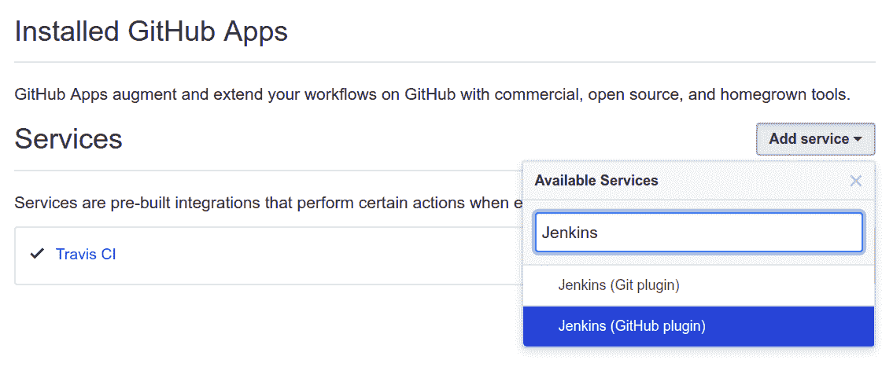

# 第十一章：持续集成

在前面的章节中，我们采用了一种 **测试驱动开发** (**TDD**) 的方法来开发一个后端 API 服务器，该服务器公开了一个用户目录平台。然而，在我们的工作流程中仍有许多可以改进的地方：

+   我们在我们的本地、开发环境中运行测试，这可能包含导致测试结果不准确的艺术品

+   手动执行所有这些步骤既慢又容易出错

在本章中，我们将通过集成一个 **持续集成** 服务器来消除这两个问题。本质上，CI 服务器是一种监视仓库更改的服务，然后在一个干净的环境中自动运行测试套件。这确保了测试结果更加确定性和可重复性。换句话说，它防止了在某些人的机器上工作但在另一些人的机器上不工作的情况。

通过遵循本章，你将：

+   理解 CI 是什么

+   将我们的 GitHub 仓库与名为 **Travis** 的托管 CI 平台集成

+   设置一个自托管的 **Jenkins** 服务器

+   当新的更改推送到 GitHub 时，设置我们的测试套件运行

+   理解 **管道**，特别是 **声明式** 和 **脚本式管道** 之间的区别

# 持续集成 (CI)

在一个大规模项目中，你将同时有许多开发者正在开发许多功能、发布、热修复等。CI 是一种 *持续集成* 不同开发者工作的实践。这意味着将功能分支的代码合并到 `dev` 分支，或者从发布分支合并到 `master`。在每次集成点，都有可能集成导致某些东西出错。因此，我们必须在这些集成点进行测试，并且只有当所有测试通过时才进行集成。

我们已经在当前的工作流程中这样做，但它是以手动方式完成的。通过自动构建和测试来检测这些集成点中的错误，它允许软件开发团队的成员频繁地集成他们的工作。

通过实践 CI，我们可以遵守“尽早测试，经常测试”的格言，并确保尽早识别和修复错误。这也意味着在任何时候，我们都将始终有一个可以部署的完全功能性的代码库。

我们已经通过使用健壮的 Git 工作流程和拥有全面的测试套件为遵循此实践奠定了基础。下一步是引入 CI 服务器。

# 选择一个 CI 服务器

有许多在线 CI 服务（例如 **Travis**、**CircleCI**、**Bamboo** 和 **Shippable**）以及自托管的 CI 兼容平台（例如 **Jenkins**、**TeamCity**、**CruiseControl** 和 **BuildBot**）。对于 CI，它们基本上具有相同的功能集，并且可以执行以下任务：

+   当触发事件时，挂钩到事件并执行预定义的任务。例如，当新的 Git 提交被推送到仓库时，CI 服务器将构建应用程序并运行测试。

+   在一个干净、独立的环境中运行任务。

+   将任务链在一起，以便某些任务在先前任务完成后触发。例如，测试完成后，将构建和测试结果通过电子邮件发送给所有开发者。

+   存储构建和测试结果的历史记录。

由于每个 CI 平台都能满足我们的需求，我们选择哪个 CI 服务器的决定归结于是否使用托管或自托管解决方案。一如既往，每种方法都有其优缺点：

+   **成本**：大多数托管 CI 服务对开源项目是免费的，但私有仓库需要付费计划。然而，托管自己的 CI 服务器也会产生运行服务器的成本。

+   **自给自足**：依赖外部服务进行工作流程意味着如果外部服务中断，工作流程将会中断。然而，大多数托管 CI 服务都有非常好的正常运行时间，因此可用性不应成为重大问题。

+   **灵活性**：使用自托管解决方案，你可以完全控制 CI 服务器，并通过插件或包扩展代码和功能集。另一方面，如果你需要一个托管 CI 服务器不支持的功能，你必须提出支持票据/功能请求，并希望它会被实现。

在本章中，我们将分别使用 Travis 和 Jenkins 演示托管和自托管解决方案。然而，本章的大部分内容将专注于 Jenkins，因为它是比 Travis 更强大、更通用的自动化服务器。

# 集成 Travis CI

Travis 是一个在线 CI 服务，用于安装、构建和测试我们的项目。Travis 对开源项目是免费的，并且与其他流行的服务如 GitHub 很好地集成。而且无需安装——我们只需在我们的仓库根目录中包含一个`.travis.yml`配置文件，并在 Travis 的 Web 应用程序中配置仓库即可。Travis 的学习曲线非常平缓，可以为我们节省大量时间。要开始，请访问[travis-ci.org](https://travis-ci.org/)并使用你的 GitHub 账户登录。

Travis 有两个 URL [travis-ci.org](https://travis-ci.org/)，用于开源项目，以及 [travis-ci.com](https://travis-ci.com/)，用于私有项目。请确保你使用的是正确的 URL。

它会要求你提供许多权限；这些权限是 Travis 执行以下操作所必需的：

+   **读取与你账户关联的所有仓库的内容**：这允许 Travis 查看`.travis.yml`文件的内容，以及能够克隆你的仓库以进行构建/测试。

+   **安装 webhooks 和服务**：这允许 Travis 将钩子添加到你的仓库中，因此当任何更改推送到你的仓库时，GitHub 可以通知 Travis 并执行`.travis.yml`文件中定义的指令。

+   **注册到提交状态 API**：这允许 Travis 通知 GitHub 构建测试的结果，以便 GitHub 可以更新其用户界面。

在你审查了这些权限之后，点击授权 travis-ci：


在授权步骤之后，你将被带回到主要的 Travis 仪表板，在那里你可以看到你控制下的每个仓库：


在这里，我们只有一个项目，我们应该通过点击切换按钮来启用它。这将使 Travis 为该仓库安装一个 GitHub 服务钩子。一旦安装，GitHub 就会在更改推送到该仓库时向 Travis 发送消息。

# 配置 Travis CI

Travis 现在将通知仓库中的任何更改，但我们还没有提供检测到更改后要执行的指令。因此，在项目目录的根目录下创建一个名为 `.travis.yml` 的配置文件。

注意 `travis` 前面的点（`.`），以及文件扩展名是 `yml`，而不是 `yaml`。

# 指定语言

在 `.travis.yml` 中，我们首先必须指定项目编写的主要语言。这允许 Travis 安装所需的依赖项，并使用适当的默认设置和配置。例如，如果我们指定我们的项目是用 Node.js 编写的，Travis 将默认配置自己通过运行 `npm install` 来安装依赖项，并通过运行 `npm test` 来测试应用程序。它还会在根目录中查找 `yarn.lock` 文件，如果存在，则使用 `yarn install` 和 `yarn run test` 命令。

因此，在 `.travis.yml` 文件内添加以下行来通知 Travis 该项目使用 Node.js：

```js
language: node_js
```

使用 Node.js，你还可以指定构建和测试要运行的 Node.js（或 io.js）版本。你可以通过主版本、次版本和补丁版本来指定 Node 版本，它将获取满足该标准的最新版本。你也可以使用字符串 `"node"` 来获取最新的稳定版 Node.js，或者使用 `"lts/*"` 来获取最新的 LTS 版本 Node.js。

由于这是一个服务器端应用程序，我们控制着应用程序运行的环境。因此，如果我们想的话，我们可以在 `.nvmrc` 文件中指定的 Node.js 版本（`8.11.4`）上运行我们的测试。然而，由于这个过程是自动化的，Travis 可以并行运行这些测试，因此运行额外测试的成本非常低。因此，我们应该针对未来的 Node.js 版本运行我们的测试；这样做将防止过时的语法被引入到我们的项目中。

因此，更新我们的 `.travis.yml` 到以下内容：

```js
language: node_js
node_js:
  - "node"
  - "lts/*"
  - "8"
  - "8.11.4"
```

# 设置数据库

我们的代码还依赖于一个运行中的 Elasticsearch 实例；因此，我们需要在 `.travis.yml` 文件中通过添加 `services` 属性来指定这个需求：

```js
services:
  - elasticsearch
```

这将在 Travis 服务器实例上使用默认配置（即端口 `9200`）安装并启动 Elasticsearch。然而，建议运行特定的 Elasticsearch 版本——与我们本地运行的相同版本——以确保我们得到与我们的开发环境一致的结果。因此，在 `services` 块下方添加以下 `before_install` 块：

```js
before_install:
  - curl -O https://artifacts.elastic.co/downloads/elasticsearch/elasticsearch-6.3.2.deb
  - sudo dpkg -i --force-confnew elasticsearch-6.3.2.deb
  - sudo service elasticsearch restart
```

Elasticsearch 服务可能需要一些时间才能启动；因此，我们也应该告诉 Travis 在尝试运行测试之前等待几秒钟。

```js
before_script:
  - sleep 10
```

# 设置环境变量

最后，我们的应用程序从环境中读取变量。由于 `.env` 和 `test.env` 文件不是我们仓库的一部分，我们需要手动将它们提供给 Travis。我们可以通过添加一个 `env.global` 块来完成此操作：

```js
env:
  global:
    - NODE_ENV=test
    - SERVER_PROTOCOL=http
    - SERVER_HOSTNAME=localhost
    - SERVER_PORT=8888
    - ELASTICSEARCH_PROTOCOL=http
    - ELASTICSEARCH_HOSTNAME=localhost
    - ELASTICSEARCH_PORT=9200
    - ELASTICSEARCH_INDEX=test
```

我们最终的 `.travis.yml` 应该看起来像这样：

```js
language: node_js
node_js:
  - "node"
  - "lts/*"
  - "8"
  - "8.11.4"
services:
  - elasticsearch
before_install:
  - curl -O https://artifacts.elastic.co/downloads/elasticsearch/elasticsearch-6.3.2.deb
  - sudo dpkg -i --force-confnew elasticsearch-6.3.2.deb
  - sudo service elasticsearch restart
before_script:
  - sleep 10
env:
  global:
    - NODE_ENV=test
    - SERVER_PROTOCOL=http
    - SERVER_HOSTNAME=localhost
    - SERVER_PORT=8888
    - ELASTICSEARCH_PROTOCOL=http
    - ELASTICSEARCH_HOSTNAME=localhost
    - ELASTICSEARCH_PORT=9200
    - ELASTICSEARCH_INDEX=test
```

更多关于 `.travis.yml` 文件中不同字段的详细信息，请参阅 [docs.travis-ci.com/user/customizing-the-build/](https://docs.travis-ci.com/user/customizing-the-build/)。

# 激活我们的项目

接下来，前往 [travis-ci.org](https://travis-ci.org) 确保您的项目已激活：


现在，将 `.travis.yml` 提交到项目目录的根目录，并将更改推送到 GitHub。GitHub 服务钩子现在将通知 Travis 发生更改，Travis 将克隆仓库，构建应用程序，并运行测试。测试完成后（或在出现错误的情况下终止），它将在 Travis 仪表板上显示报告。结果也将与 GitHub 共享，以便它可以更新其用户界面。

# 检查 Travis CI 结果

Travis 构建要么通过要么失败。如果构建失败，它将伴随一个红色交叉：


默认情况下，Travis 还会发送一封电子邮件通知我们构建和测试的结果：


Travis 还集成了 GitHub 的 Commit Status API ([developer.github.com/v3/repos/statuses/](https://developer.github.com/v3/repos/statuses/))，这使得第三方可以为提交附加状态。在这里，Travis 将失败状态附加到注释中，显示为提交时间旁边的红色交叉指示器：


但最重要的是，每次运行还会保存日志的历史记录，因此，在出现错误的情况下，开发者能够快速定位问题并进行修复：


# 与 Jenkins 的持续集成

现在您已经知道如何与 Travis CI 集成，并了解可以从 CI 服务器期望什么，让我们尝试使用 Jenkins，一个自托管的替代方案，来复制相同的结果。我们在这里选择 Jenkins 是因为，在撰写本文时，它是最受欢迎的 CI 工具，拥有超过 100 万用户和 15 万次安装。

首先，我们将为您简要介绍 Jenkins，然后我们将安装并集成它到我们的仓库中。

# Jenkins 简介

虽然 Travis 是一个纯 CI 服务器，但 Jenkins 的功能更为强大。一般来说，Jenkins 是一个开源的**自动化服务器**。这意味着它可以自动化任何手工操作困难的过程，无论是由于重复性、耗时、易出错，还是以上所有原因。例如，我们可以使用 Jenkins 进行以下操作：

+   构建/打包应用程序

+   动态生成文档

+   运行部署前 E2E/集成/单元/UI 测试

+   将应用程序部署到各种测试环境（例如，开发、预发布）

+   运行部署后测试

+   将应用程序部署到生产环境

此外，这些过程可以串联起来形成工作流程，其中某个过程的执行依赖于前一个过程的结果。配置这些自动化工作流程有两种方式——作为**自由式项目**，或作为**管道**。

# 自由式项目

自由式项目（又称**工作**，或简称**项目**）是所有自动化任务在 Jenkins 中必须定义的原始方法。自由式项目简单来说就是 Jenkins 应执行的一组用户定义的任务。例如，一个项目可能涉及从 Git 仓库构建应用程序，而另一个项目则用于在此构建的应用程序上运行测试。

术语**自由式项目**、**项目**和**工作**是同义的。术语**工作**在 Web 界面的 UI 中常用，但它已被弃用，在这本书中我们将使用术语**项目**。

你可以使用 Web 界面配置自由式项目，这允许你定义以下内容：

+   **源代码管理**（**SCM**）：指定 Jenkins 如何获取构建/测试的起始源代码。

+   **构建触发器**：指定此项目何时执行。例如，你可能希望在将新提交推送到仓库时触发构建；或者每晚 00:00 构建项目以生成夜间构建。

+   **构建环境**。

+   **构建**：允许你指定构建步骤。尽管其名称如此，你实际上可以将任何 shell 命令，如测试运行器，作为构建步骤运行。

+   **构建后操作**：允许你在构建步骤完成后执行指定命令。例如，你可以通过电子邮件将测试结果发送给系统管理员。此外，你可以使用构建后操作来触发另一个项目执行。这样，你可以形成一个项目链，一个接一个地运行。

# 管道

自由式项目功能强大，并且多年来一直是主流。然而，它在几个方面被发现存在不足：

+   当 Jenkins 的前身 Hudson 被编写时，使用 UI 进行配置是标准做法。然而，在过去的几年里，生态系统已经转向 **Configuration-as-Code** (**CaC**)，其中配置可以在源代码控制中进行跟踪。

+   Jenkins 将 freestyle 项目的配置文件保存在 Jenkins 服务器上的 `/var/lib/jenkins/jobs/` 目录下。这意味着如果 Jenkins 服务器被破坏，所有的配置设置都会丢失。此外，配置文件是用 XML 编写的，难以阅读。

+   虽然使用后置构建操作将多个 freestyle 项目链接在一起是可能的，但你很可能会最终拥有许多重复的项目，每个项目都有不同的后置构建操作步骤。

为了解决这些问题，Jenkins 2.0 引入了一个名为 **P****ipeline** 的功能，它允许你执行以下操作：

+   与通过后置构建步骤将多个 freestyle 项目链接在一起不同，使用 Pipeline，你可以指定许多顺序的 **步骤**，这些步骤可以可选地分组为 **阶段**。在 Pipeline 中，下游步骤/阶段的执行取决于链中先前步骤/阶段的输出。只有当前面的步骤成功时，后续的步骤才会运行。例如，如果测试没有通过，那么部署步骤就不会执行。

+   允许你使用 `Jenkinsfile` 指定步骤：这是你代码库的一部分的配置文件。这种 CaC（或“pipeline as code”）方法意味着对 pipeline 所做的所有更改都可以在 Git 中跟踪，Pipeline 可以进行分支和合并，任何损坏的 Pipeline 都可以回滚到最后已知良好的版本。此外，即使 Jenkins 服务器损坏，配置也会幸存，因为 `Jenkinsfile` 存储在仓库中，而不是 Jenkins 服务器上；这也意味着你可以使用任何可以访问仓库的 Jenkins 服务器来构建项目。

注意，你仍然可以使用 Jenkins 网页界面来定义你的 Pipeline，尽管将 Jenkinsfile 检入 Git 仓库是推荐的方法。

Pipeline 功能由默认安装的 pipeline 插件启用。要定义一个 pipeline，你必须使用 pipeline **领域特定语言** (**DSL**) 语法编写，并将其保存到名为 `Jenkinsfile` 的文本文件中。一个简单的 `Jenkinsfile` 看起来像这样：

```js
pipeline {
  agent { docker 'node:6.3' }
  stages {
    stage('build') {
      steps {
        sh 'npm --version'
      }
    }
  }
}
```

在本章的剩余部分，我们将专注于使用 Jenkins 来复制 Travis CI 的功能，具体包括以下内容：

+   与 GitHub 集成，以便在将更改推送到我们的项目仓库时向我们的 Jenkins 服务器发送消息

+   每当 Jenkins 收到那条消息时，它将检出源代码，并在一个干净且隔离的环境中运行测试

# 设置新的 Jenkins 服务器

使用 Travis-GitHub 集成，当 GitHub 检测到存储库中任何分支的更改时，它将向 Travis 的服务器发送消息，服务器将克隆存储库，构建它并运行测试。因此，为了使用 Jenkins 复制此行为，我们必须设置一个 Jenkins CI 服务来接收 GitHub 的消息并运行我们的测试。

我们可以在与我们的 API 服务器相同的机器上运行我们的 Jenkins 服务器。然而，如果我们的 Jenkins 作业意外地使机器崩溃，它也会使我们的 API 服务器关闭。因此，将 Jenkins CI 部署在单独的服务器上要安全得多。

因此，前往您的 VPS 提供商（我们将使用 DigitalOcean）并配置一个新的 VPS 服务器。Jenkins 服务器在空闲时大约使用 600 MB 的内存；因此，选择至少有 2 GB 内存的服务器。

如果您忘记了如何设置和配置新的 VPS，请参阅第十章，*在 VPS 上部署您的应用程序*。

此外，由于我们已经有了一对 SSH 密钥，我们可以简单地选择该 SSH 密钥用于此 VPS，而无需手动将我们的 SSH 密钥上传到服务器。

# 创建 Jenkins 用户

一旦您有一个运行的 VPS，请使用 `sudo` 权限创建一个名为 `jenkins` 的用户：

```js
root@ci:# adduser jenkins
root@ci:# usermod -aG sudo jenkins
```

然后，为了允许我们以受限用户 `jenkins` 而不是 `root` 登录服务器，我们必须首先将我们的开发机的公钥添加到 `/home/jenkins/.ssh/authorized_keys`；最简单的方法是复制 `/root/.ssh/` 目录并更改其所有者：

```js
root@ci:# cp -R /root/.ssh/ /home/jenkins/
root@ci:# chown -R jenkins:jenkins /home/jenkins/.ssh/
```

然后，通过编辑 `/etc/ssh/sshd_config` 来禁用密码认证和 root 登录：

```js
PermitRootLogin no
PasswordAuthentication no
```

重新加载 SSH 守护进程以使新设置生效：

```js
root@ci:# systemctl reload ssh.service
```

在新的终端中，尝试使用 `jenkins` 用户登录。一旦完成，继续以 `jenkins` 的身份完成其余的设置。

# 配置时间

接下来，让我们配置时区和 NTP 同步：

```js
jenkins@ci:# sudo dpkg-reconfigure tzdata
jenkins@ci:# sudo apt update
jenkins@ci:# sudo apt install ntp
```

# 安装 Java

然后，我们需要安装和配置 Java（将 `java-8-openjdk-amd64` 替换为您的 Java 版本）：

```js
jenkins@ci:# sudo apt update && sudo apt install -y openjdk-8-jdk
jenkins@ci:# echo 'JAVA_HOME="/usr/lib/jvm/java-8-openjdk-amd64"' | sudo tee --append /etc/environment > /dev/null
```

在撰写本文时，Jenkins 与 Java 8 配合得最好。Java 10 和 11 的支持仍然是实验性的（见 [jenkins.io/blog/2018/06/17/running-jenkins-with-java10-11/](https://jenkins.io/blog/2018/06/17/running-jenkins-with-java10-11/)）。这就是为什么我们使用 `openjdk-8-jdk` 软件包而不是 `default-jdk` 的原因。

# 安装 Jenkins

Jenkins 有两个主要版本：

+   **每周**：每周发布一次。

+   **长期支持**（**LTS**）：每 12 周发布一次。Jenkins 团队从上次 LTS 发布以来选择最稳定的版本，并将其指定为下一个 LTS 版本。

对于企业平台，我们希望使用最新且最稳定的版本；因此，我们将安装最新的 LTS 版本，目前是 `2.138.1`。

安装 Jenkins 有许多方法，如下所示：

+   它以 **Web 应用程序存档**（**WAR**）或`.war`文件的形式分发，这只是一个资源集合，这些资源共同构成了一个 Web 应用程序。WAR 文件是 Java 编写的 Web 应用程序的分发方式；任何支持 Java 的操作系统都能够运行 WAR 文件。您可以从[mirrors.jenkins.io/war-stable/latest/jenkins.war](http://mirrors.jenkins.io/war-stable/latest/jenkins.war)下载它，并使用`java -jar jenkins.war --httpPort=8765`直接运行它。然后它将在端口`8765`上可用。

+   作为 Docker 容器，您可以从[hub.docker.com/r/jenkins/jenkins/](https://hub.docker.com/r/jenkins/jenkins/)下载。

+   作为特定发行版的软件包——不同的操作系统也在它们的仓库中维护自己的 Jenkins 软件包。包括 Ubuntu/Debian、Red Hat/Fedora/CentOS、Windows 和 macOS 在内的最常见系统的 Jenkins 软件包由 Jenkins 团队维护。

理想情况下，我们将在隔离的 Docker 容器内运行我们的 Jenkins 服务器（以及所有其他相关内容），然而，这需要了解容器和 Docker，这将在学习 Jenkins 的同时变得过于复杂。因此，在本章中，我们将使用 APT 仓库提供的 Jenkins 软件包，您可以在阅读第十七章迁移到 Docker 后迁移到使用 Docker。

首先，获取 Jenkins 仓库的公钥并将其添加到 APT；这允许 APT 验证软件包的真实性：

```js
jenkins@ci:$ wget -q -O - https://pkg.jenkins.io/debian-stable/jenkins.io.key | sudo apt-key add -
```

接下来，我们需要将 Jenkins 仓库添加到 APT 将要搜索的仓库列表中。这个列表存储在`/etc/apt/sources.list`中，以及`/etc/apt/sources.list.d/`目录下的文件中。因此，运行以下命令，这将创建一个新的`jenkins.list`文件并将仓库地址存储在其中：

```js
jenkins@ci:$ echo 'deb https://pkg.jenkins.io/debian-stable binary/' | sudo tee /etc/apt/sources.list.d/jenkins.list
```

最后，更新我们的本地软件包索引并安装 Jenkins：

```js
jenkins@ci:$ sudo apt update && sudo apt -y install jenkins
```

安装将执行以下操作：

1.  下载 WAR 文件并将其放置在`/usr/share/jenkins`。

1.  创建一个名为`jenkins`的新用户，该用户将运行服务。

1.  将 Jenkins 设置为在系统首次启动时运行的服务/守护进程。

1.  创建一个`/var/log/jenkins/jenkins.log`文件，并将 Jenkins 的所有输出都重定向到这个文件。

您可以通过运行`sudo systemctl status jenkins.service`来检查 Jenkins 服务的状态。

Jenkins 作为后台服务运行。它使用 Jetty 服务器([eclipse.org/jetty/](http://www.eclipse.org/jetty/))为用户提供一个交互的 Web 界面。默认情况下，此服务器将绑定到端口`8080`。

`8080`是一个非常常见的端口。如果您在运行 Jenkins 的现有服务器上，端口`8080`已被另一个进程绑定，您可以通过编辑 Jenkins 配置文件中的`HTTP_PORT`条目来更改 Jenkins 的默认端口——`/etc/default/jenkins`。为了使此更改生效，请确保您运行`sudo systemctl restart jenkins.service`。

# 安装 NGINX 作为反向代理。

现在，如果您在浏览器中访问 `http://<server-ip>:8080`，您将看到 Jenkins 设置屏幕。但理想情况下，我们希望使用一个易于记忆的主机名。所以，就像我们为 API 服务器所做的那样，让我们安装 NGINX 来反向代理来自 `jenkins.hobnob.social` 的请求到 `http://localhost:8080`：

```js
jenkins@ci:$ echo "deb http://nginx.org/packages/ubuntu/ bionic nginx" | sudo tee -a /etc/apt/sources.list.d/nginx.list
jenkins@ci:$ echo "deb-src http://nginx.org/packages/ubuntu/ bionic nginx" | sudo tee -a /etc/apt/sources.list.d/nginx.list
jenkins@ci:$ sudo apt-key adv --keyserver keyserver.ubuntu.com --recv-keys ABF5BD827BD9BF62
jenkins@ci:$ sudo apt update
jenkins@ci:$ sudo apt install nginx
jenkins@ci:$ sudo mkdir /etc/nginx/sites-available /etc/nginx/sites-enabled
```

然后，在 `/etc/nginx/nginx.conf` 文件中，在 `include /etc/nginx/conf.d/*.conf;` 之后添加一行：

```js
include /etc/nginx/conf.d/*.conf;
include /etc/nginx/sites-enabled/*;
```

接下来，在 `/etc/nginx/sites-available/jenkins.hobnob.social` 创建一个 Jenkins 配置文件，并粘贴以下内容：

```js
server {
    listen 80 default_server;
    server_name jenkins.hobnob.social;
    root /var/cache/jenkins/war;
    access_log /var/log/nginx/jenkins/access.log;
    error_log /var/log/nginx/jenkins/error.log;
    ignore_invalid_headers off;
    location ~ "^/static/[0-9a-fA-F]{8}\/(.*)$" {
      rewrite "^/static/[0-9a-fA-F]{8}\/(.*)" /$1 last;
    }
    location /userContent {
      root /var/lib/jenkins/;
      if (!-f $request_filename){
        rewrite (.*) /$1 last;
        break;
      }
      sendfile on;
    }
    location @jenkins {
      sendfile off;
      proxy_pass http://localhost:8080;
 proxy_redirect default;
      proxy_http_version 1.1;

      proxy_set_header Host $host;
      proxy_set_header X-Real-IP $remote_addr;
      proxy_set_header X-Forwarded-For $proxy_add_x_forwarded_for;
      proxy_set_header X-Forwarded-Proto $scheme;
      proxy_max_temp_file_size 0;

      client_max_body_size 10m;
      client_body_buffer_size 128k;

      proxy_connect_timeout 90;
      proxy_send_timeout 90;
      proxy_read_timeout 90;
      proxy_buffering off;
      proxy_request_buffering off;
      proxy_set_header Connection "";
    }
    location / {
      try_files $uri @jenkins;
    }
}
```

此配置来自 [wiki.jenkins.io/display/JENKINS/Running+Jenkins+behind+Nginx](https://wiki.jenkins.io/display/JENKINS/Running+Jenkins+behind+Nginx)。最相关的部分已在前面加粗。

当有请求到达 `jenkins.hobnob.social` 时，它将匹配 `location /` 块，然后通过 `proxy_pass` 指令（`http://localhost:8080`）代理请求到运行在该指令的服务。同样，当内部服务返回响应时，`proxy_redirect` 指令将重写响应的 `Location` 头部，并将 `http://localhost:8080` 替换为 `http://jenkins.hobnob.social`。

现在我们已经准备好了服务器块，使用符号链接将其添加到 `/etc/nginx/sites-enabled/` 目录：

```js
jenkins@ci:$ sudo ln -s /etc/nginx/sites-available/jenkins.hobnob.social /etc/nginx/sites-enabled/
```

最后，确保我们的 NGINX 配置没有语法错误，并启动它：

```js
jenkins@ci:$ sudo nginx -t
jenkins@ci:$ sudo systemctl start nginx.service
```

# 配置防火墙

为了完成我们的 NGINX 配置，配置防火墙以确保流量可以到达端口 `80`：

```js
jenkins@ci:$ sudo ufw allow OpenSSH
jenkins@ci:$ sudo ufw allow 80/tcp
jenkins@ci:$ sudo ufw enable
```

# 更新我们的 DNS 记录

现在，我们的 Jenkins 服务器应该可以通过端口 `80` 访问，但我们仍然通过 IP 地址访问我们的服务器。因此，下一步是配置我们的 DNS 记录，将流量指向 `jenkins.hobnob.social` 的流量导向我们的 VPS。

在 DigitalOcean 上，转到顶部的网络选项卡并添加一个新的 `A` 记录，将主机名 `jenkins.hobnob.social` 指向我们的 VPS 实例：


现在，我们的 Jenkins 服务器实例应该可以通过 `jenkins.hobnob.social` 访问。

# 配置 Jenkins

现在，我们准备配置 Jenkins。在您的浏览器中导航到 `jenkins.hobnob.social`；在那里您将看到一个设置向导。

当 Jenkins 安装时，一个密码被写入到 `/var/lib/jenkins/secrets/initialAdminPassword` 文件中，只有系统管理员（或具有 `sudo` 特权的用户）才能访问。这是为了确保访问设置向导的人是系统管理员，而不是恶意第三方。

因此，第一步是复制 `/var/lib/jenkins/secrets/initialAdminPassword` 文件的内容，并将其粘贴到向导中：


在下一屏，你将看到自定义 Jenkins 屏幕界面，你可以选择安装 **插件**。Jenkins 本身只是一个启用自动化的平台，它本身具有很少的功能。其功能被模块化为插件。有超过 1300 个插件，包括以下集成：

+   版本控制系统

+   缺陷数据库

+   构建工具

+   测试框架

选择安装建议的插件以安装最常用的插件，包括我们稍后将要使用的 Git 和 GitHub 插件。你可以在下一屏跟踪安装进度：


最后，你将被提示为 Web 界面创建一个管理员用户，你将使用它来继续设置过程（所以记住你的用户名和密码！）。

太好了，现在我们已经成功安装了 Jenkins，并且它正在公共 URL 上运行：


# 编写 Jenkinsfile

现在我们已经设置了 Jenkins 实例，我们准备使用 Pipeline DSL 定义我们的 Pipeline。让我们看看 Pipeline DSL 语法。

# Pipeline DSL 语法

在任何 Pipeline 中都可以使用许多全局变量、关键字和指令，例如：

+   `env`：环境变量

+   `params`：在配置管道时设置的参数

+   `currentBuild`：有关当前构建的信息，例如结果、显示名称等

完整的全局变量列表可以在 `/pipeline-syntax/globals` 找到。

有一些关键字只能在步骤内部使用。例如，`sh` 关键字允许你指定一些任意 shell 命令来运行，你可以使用 `echo` 将某些内容打印到控制台输出。

DSL 语法也可以扩展。例如，JUnit 插件将 `junit` 步骤添加到 Pipeline 词汇表中，这使得你的步骤可以聚合测试报告。在本章中，我们将使用 Docker Pipeline 插件，该插件添加了一个 `docker` 关键字来在 Docker 容器中运行我们的测试。关于这一点，我们将在后面详细说明。

# 声明式与脚本式 Pipeline 的比较

定义 Pipeline 有两种语法——声明式和脚本式。最初，Pipeline 插件只支持脚本式 Pipeline，但声明式 Pipeline 语法 1.0 在 2017 年 2 月随着 Pipeline 2.5 的发布被添加。这两种语法都使用相同的底层执行引擎来执行指令。

脚本式 Pipeline 允许你使用一个功能齐全的编程语言 **Groovy** 来定义你的指令；正因为如此，你可以非常灵活。缺点是代码可能不太容易理解，因此维护性较差。

声明式 Pipeline 语法为 Pipeline 带来了结构，这意味着检查文件中的语法错误更容易，提供代码检查帮助。但是，使用声明式 Pipeline，你只能定义由语法支持的指令。

因此，你应该尽可能使用声明式流水线语法，只有在无法使用声明式流水线实现指令时才回退到脚本式流水线。

# 声明式流水线

每个声明式流水线都必须以`pipeline`指令开始。在`pipeline`指令中，通常是`agent`、`stages`和`step`指令。

`agent`指令告诉 Jenkins 为流水线的这部分分配一个执行器和工作空间。工作空间只是文件系统中 Jenkins 可以与之交互以运行构建的目录，而执行器只是一个执行任务的线程。当你使用`agent`指令时，它还会下载源代码库并将其保存到工作空间，以便后续阶段可以使用代码。

一个典型的声明式流水线可能看起来像这样：

```js
#!/usr/bin/env groovy

pipeline {
    agent {
        docker {
            image 'node'
            args '-u root'
        }
    }

    stages {
        stage('Build') {
            steps {
                echo 'Building...'
                sh 'npm install'
            }
        }
        stage('Test') {
            steps {
                echo 'Testing...'
                sh 'npm test'
            }
        }
    }
}
```

# 脚本式流水线

在`pipeline`指令中必须定义一个声明式流水线，该指令包括一个`agent`指令；对于脚本式流水线，流水线必须被包含在`node`指令中。

脚本式流水线中的`node`指令类似于声明式流水线中的`agent`指令，并为流水线分配一个执行器和工作空间。与`agent`指令不同，节点不会自动下载源代码库并将其保存到你的工作空间；相反，你必须使用`checkout scm`步骤手动指定：

```js
node {
    checkout scm
}
```

`scm`是一个特殊变量，代表触发构建的代码库版本。

# 设置环境

为了确保构建和测试步骤能够一致地执行，我们应该在**容器**内运行它们，这是一个短暂的、预先配置的、隔离的环境。

容器类似于虚拟机，但使用更少的资源，并且部署更快。创建容器成本低廉；这允许我们创建容器，运行测试，然后丢弃它们。

我们将在第十七章迁移到 Docker 中更深入地探讨 Docker；目前，理解 Docker 容器为我们提供了一个隔离和一致的环境来运行我们的构建和测试就足够了。

Docker 是目前最受欢迎的容器框架，我们将在 Docker 容器内运行我们的构建和测试。在你的仓库中，将以下脚本式流水线添加到`Jenkinsfile`文件中：

```js
node {
    checkout scm
    docker.image('docker.elastic.co/elasticsearch/elasticsearch-oss:6.3.2').withRun('-e "discovery.type=single-node"') { c ->
        docker.image('node:8.11.4').inside("--link ${c.id}:db") {
            withEnv(['SERVER_HOSTNAME=db',
                     'JENKINS=true',
                     'NODE_ENV=test',
                     'SERVER_PROTOCOL=http',
                     'SERVER_HOSTNAME=localhost',
                     'SERVER_PORT=8888',
                     'ELASTICSEARCH_PROTOCOL=http',
                     'ELASTICSEARCH_HOSTNAME=localhost',
                     'ELASTICSEARCH_PORT=9200',
                     'ELASTICSEARCH_INDEX=test']) {
              stage('Waiting') {
                sh 'until curl --silent $DB_PORT_9200_TCP_ADDR:$ELASTICSEARCH_PORT -w "" -o /dev/null; do sleep 1; done'
              }
              stage('Unit Tests') {
                sh 'ELASTICSEARCH_HOSTNAME=$DB_PORT_9200_TCP_ADDR npm run test:unit'
              }
              stage('Integration Tests') {
                sh 'ELASTICSEARCH_HOSTNAME=$DB_PORT_9200_TCP_ADDR npm run test:integration'
              }
              stage('End-to-End (E2E) Tests') {
                sh 'ELASTICSEARCH_HOSTNAME=$DB_PORT_9200_TCP_ADDR npm run test:e2e'
              }
            }
        }
    }
}
```

`docker`变量由 Docker 流水线插件提供，允许你在流水线中运行与 Docker 相关的函数。在这里，我们使用`docker.image()`来拉取镜像。镜像的`withRun`方法将使用`docker run`在主机上运行该镜像。

在这里，我们正在运行 `elasticsearch-oss` 镜像，并传递 `discovery.type` 标志——这是我们之前章节中使用过的同一个标志。一旦容器运行，Jenkins 将执行 `withRun` 块内指定的所有命令，然后在主体内的所有命令完成后自动退出。

在 `withRun` 块内，我们指定了一个 `docker.image().inside()` 块。类似于 `withRun`，`inside` 块内的命令将在容器启动后运行，但这些指令将在容器内运行，而不是在主机上。这就是我们将运行测试的地方。

最后，我们向 `inside` 传递一个 `--link` 标志。这使用旧的 Docker 容器链接来为我们提供 `node:8.11.4` 容器关于 `elasticsearch-oss` 容器的信息，例如其地址和端口。这允许我们的 API 应用程序连接到数据库。

`--link` 标志的语法如下：

```js
--link <name or id>:alias
```

在这里，`<name or id>` 是我们想要链接的容器的名称或 ID，而 `alias` 是一个字符串，允许我们通过名称来引用这个链接。在 `withRun` 成功运行一个容器后，它将向主体提供一个容器对象 `c`，该对象有一个 `id` 属性，我们可以在链接中使用。

一旦容器被链接，Docker 将设置几个环境变量来提供有关链接容器的信息。例如，我们可以通过引用 `DB_PORT_9200_TCP_ADDR` 的值来找出链接容器的 IP 地址。

你可以在 [docs.docker.com/network/links/#environment-variables](https://docs.docker.com/network/links/#environment-variables) 查看 Docker 设置的所有环境变量的完整列表。

保存此 `Jenkinsfile` 并将其推送到远程仓库。

# 安装 Docker

由于 Jenkins 现在依赖于 Docker，我们必须在此 Jenkins 服务器上安装 Docker：

```js
jenkins@ci:$ curl -fsSL https://download.docker.com/linux/ubuntu/gpg | sudo apt-key add -
jenkins@ci:$ sudo add-apt-repository "deb [arch=amd64] \
             https://download.docker.com/linux/ubuntu \
             $(lsb_release -cs) stable"
jenkins@ci:$ sudo apt update
jenkins@ci:$ sudo apt install -y docker-ce
```

此安装将执行以下几件事：

+   安装 Docker 引擎，它作为守护进程在后台运行

+   安装 Docker 客户端，它是一个命令行工具（`docker`），我们可以在我们的终端中运行

+   在我们的机器上创建一个名为 `docker` 的用户，并将其分配给 `docker` 组

要检查 Docker 是否正确安装，你可以通过运行 `sudo systemctl status docker` 来检查其状态。

默认情况下，必须以 root 权限调用 docker 命令。这个规则的例外是如果用户是 `docker`，或者如果用户在 `docker` 组中。我们正在用 `jenkins` 用户运行 Jenkins 服务器；因此，为了允许我们的 Jenkins 服务器生成新的 Docker 容器，我们必须将 `jenkins` 用户添加到 `docker` 组中：

```js
jenkins@ci:$ sudo usermod -aG docker jenkins
```

要检查这是否成功，请运行以下命令：

```js
jenkins@ci:$ grep docker /etc/group
docker:x:999:jenkins
```

最后，重新启动 Jenkins 服务以使此更改生效：

```js
jenkins@ci:$ sudo systemctl restart jenkins
```

# 与 GitHub 集成

现在我们有一个`Jenkinsfile`，它提供了如何运行测试的说明，以及一个用于运行测试的 Jenkins 服务器；剩下要做的就是设置 GitHub 的服务钩子，以便在将更改推送到仓库时触发 Jenkins Pipeline。

# 提供对仓库的访问权限

首先，我们必须为我们提供 Jenkins 服务器访问我们的仓库以及设置服务钩子的权限。有几种方法可以做到这一点：

1.  在 GitHub 上创建一个个人访问（OAuth）令牌，这本质上允许你的 Jenkins 服务器伪装成你。这种方法的优点是你可以有一个可以在任何地方使用的令牌，以访问你控制下的所有仓库。然而，尽管令牌的作用域可以被限制，但这些权限适用于你账户下的所有仓库。因此，这种方法不允许你为每个仓库设置细粒度的权限。

1.  在 GitHub 上创建一个新的用户代表 Jenkins 服务器，并将该用户添加到你的仓库中作为协作者。创建账户后，你需要在 Jenkins 主机机器上创建一个新的 SSH 密钥对，并将公钥添加到 GitHub（就像为普通用户做的那样）。然后，配置你的 Jenkins 服务器使用此 SSH 密钥与 GitHub 通信。

    这种方法的优点是它允许你将你的身份与 Jenkins 服务器分离，并且你可以简单地将 Jenkins GitHub 用户添加到你希望授予 Jenkins 服务器访问权限的任何其他仓库。

1.  如步骤 2 中所述，在 GitHub 上创建一个新的用户代表 Jenkins 服务器，并设置一个新的 SSH 密钥对。然后，转到你的仓库并点击设置选项卡。在侧边栏中，点击部署密钥，然后点击添加部署密钥。现在，将你的 SSH 密钥粘贴到文本区域并保存。

    这种方法的优点是你可以仅授予对单个仓库的访问权限。它们被称为**部署密钥**，正是因为这种方法经常用于自动化部署。你可以设置部署密钥的权限为只读（这样它们只能克隆、构建和部署），或者读写权限（这样它们也可以将更改推回仓库）。

为了简化，我们将使用下一节中概述的个人访问令牌方法。

# 个人访问（OAuth）令牌

前往[github.com/settings/tokens](https://github.com/settings/tokens)并点击生成新令牌。选择 repo、admin:repo_hook 和 admin:org_hook 作用域：


现在，生成了一个新令牌：


接下来，我们可以将此令牌添加到 Jenkins 中的**凭据**存储中，它就像一个密码管理器，为我们存储凭据以便在配置中引用。点击 Jenkins UI 左侧侧边栏中的凭据条目。

接下来，在“针对 Jenkins 的存储”下，点击“(全局)”链接旁边的箭头，然后添加凭据。这将允许您将个人访问令牌添加到 Jenkins 服务器中：


然后，在出现的表单中，输入以下值：


范围字段有两个选项——系统或全局。系统范围的凭据可以被 Jenkins 实例本身使用，但不能在自由式项目或管道中使用。全局范围的凭据可以被所有人使用。ID 是用于识别此凭据的内部唯一标识符；如果留空，将自动生成一个 ID。

# 使用 GitHub 插件

为了与 GitHub 集成，以便将更改推送到仓库时在 Jenkins 上触发构建，我们需要使用两个插件：

+   **Git 插件** ([plugins.jenkins.io/git](https://plugins.jenkins.io/git))：使 Jenkins 能够克隆和从它有访问权限的任何 Git 仓库中拉取。同时，在构建环境中添加 Git 特定的环境变量，以便您可以在任何构建步骤中使用它。

+   **GitHub 插件** ([plugins.jenkins.io/github](https://plugins.jenkins.io/github))：允许您在 GitHub 上设置一个服务钩子，每次有更改推送到 GitHub 时，都会向我们的 Jenkins 实例发送消息。GitHub 插件还依赖于 Git 插件。

如果您遵循了标准安装流程，则应安装这两个插件；否则，在继续之前请安装它们。

为了让 GitHub 插件为我们自动设置服务钩子，我们必须提供之前存储的凭据。转到“管理 Jenkins”|“配置系统”，然后在 GitHub 部分，添加一个新的 GitHub 服务器：


在凭据字段中，选择我们在之前步骤中存储的凭据。然后，点击测试连接，以便 Jenkins 可以向 GitHub 发送一个模拟请求来确保令牌是有效的。现在，我们的 GitHub 插件将能够代表我们执行操作。

# 手动设置 GitHub 服务钩子

接下来，转到 GitHub 上的`Hobnob`仓库，并选择“设置”|“集成与服务”。您应该会看到一个服务列表，这些服务连接到 GitHub 上的事件，包括我们在本章开头添加的 Travis 服务：


接下来，我们需要将 Jenkins（GitHub 插件）添加到服务列表中：



在下一屏幕上，GitHub 将要求您指定 Jenkins 钩子 URL；这是 GitHub 用于通知我们的 Jenkins 实例仓库变更的 URL。Jenkins 使用单个 post-commit 钩子 URL 来处理所有仓库；默认情况下，其格式为 `http://<ip-or-hostname>/github-webhook/`。因此，对于我们来说，我们将使用 `http://jenkins.hobnob.social/github-webhook/`：


这将为 GitHub 添加服务钩子，但也会表明它从未被触发：


接下来，我们需要在 Jenkins 上创建管道，以便当服务钩子被触发时，我们可以运行在`Jenkinsfile`中定义的管道。

# 创建新文件夹

但在我们创建管道之前，我们知道我们的应用程序将包括两个部分——一个后端 API 服务器和一个前端 Web 界面。我们最终将使用 Jenkins 来构建这两个应用程序，因此将管道分成两个独立的组是明智的，在 Jenkins 的上下文中，这相当于一个文件夹。

要创建新文件夹，请点击界面左侧的“新建项目”链接。然后，您将看到以下屏幕：


在“名称”参数下，输入一个标识此文件夹并作为此文件夹下所有项目命名空间的名称。此名称也将用于 URL 路径以及文件系统中的目录名称，因此，你应该选择一个不包含空格或特殊字符（尤其是斜杠）的名称。

您可以可选地指定显示名称和描述。点击保存，文件夹将被创建，可以通过 URL 访问，[`jenkins.hobnob.social/job/backend/`](http://jenkins.hobnob.social/job/backend/)。接下来，我们将在该文件夹下创建一个新的管道。

# 创建新管道

导航到 `http://jenkins.hobnob.social/job/backend/` 并再次点击“新建项目”链接，但这次选择“管道”选项：


在“常规”部分，勾选“GitHub 项目”复选框并粘贴您 GitHub 项目的 URL：


然后，在“构建触发器”部分，勾选“GitHub 钩子触发器”以进行 GITScm 轮询。这意味着每次我们的 webhook 端点（`http://jenkins.hobnob.social/github-webhook/`）收到与这个 GitHub 项目相关的 GitHub 消息时，这个管道将被执行：


接下来，在“管道”部分，选择“从源代码管理器中选择管道脚本”并确保“脚本路径”设置为 Jenkinsfile。这将告诉 Jenkins 使用存储库中的 Jenkins 文件。然后，点击“添加仓库”并粘贴仓库 URL。最后，在“构建分支”中输入值`*/*`，以便管道根据任何分支的更改触发：


保存管道，然后继续运行我们的第一个构建！

# 运行第一个构建

现在，运行`git commit --amend`来更改提交哈希；这将足以构成一个更改。将此更改推送到远程仓库。 fingers crossed，这应该会在我们的 Jenkins 服务器上触发构建。

首先，它将下载仓库并将其放入位于`/var/lib/jenkins/jobs`的工作区中，然后，它将运行我们在`Jenkinsfile`中指定的指令。

当构建（自由风格项目或管道）被触发时，它将被添加到左侧构建历史侧边栏中的构建列表中。构建左侧的指示器显示构建的状态。最初，它将以闪烁的蓝色显示，表示正在运行但尚未完成。一旦管道完成执行，指示器将变为非闪烁的蓝色或红色，表示构建成功或失败：


您可以通过访问“控制台输出”标签并阅读产生的`stdout`来跟踪管道的进度。然而，如果您更喜欢视觉表示，您可以查看**阶段视图**，它显示一个带有彩色块的表格，其中绿色代表通过的阶段，红色代表失败的阶段。这是由管道阶段视图插件提供的，该插件默认安装：([plugins.jenkins.io/pipeline-stage-view](https://plugins.jenkins.io/pipeline-stage-view))：


# 摘要

在本章中，我们已经将我们的项目与两个 CI 服务——Travis 和 Jenkins 集成。有了 CI，我们能够在某些事件之后触发测试运行，并自动测试我们的应用程序。我们还使用了 Docker 为我们的测试提供一个隔离的环境，确保我们的测试保持可靠和可重复。在第十七章“迁移到 Docker”中，我们甚至将整个部署迁移到使用 Docker。

在下一章中，我们将学习如何通过在我们的 API 中实现身份验证和授权检查来保护我们的应用程序。
