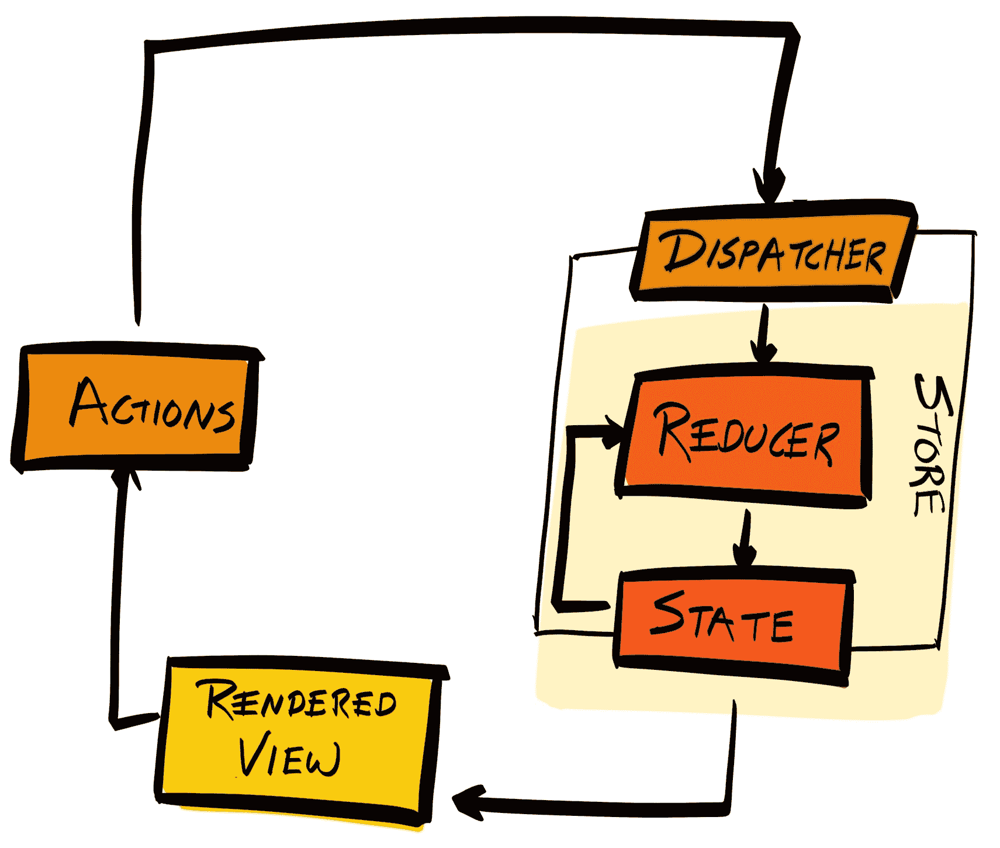
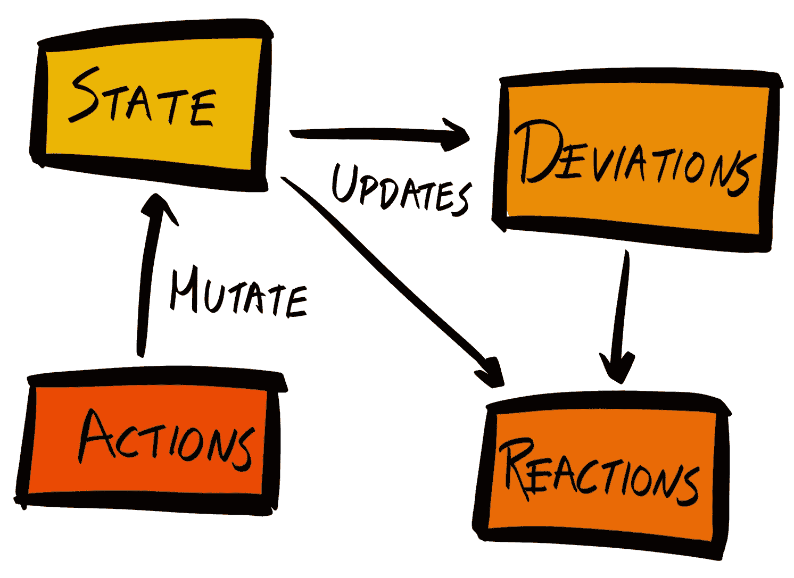
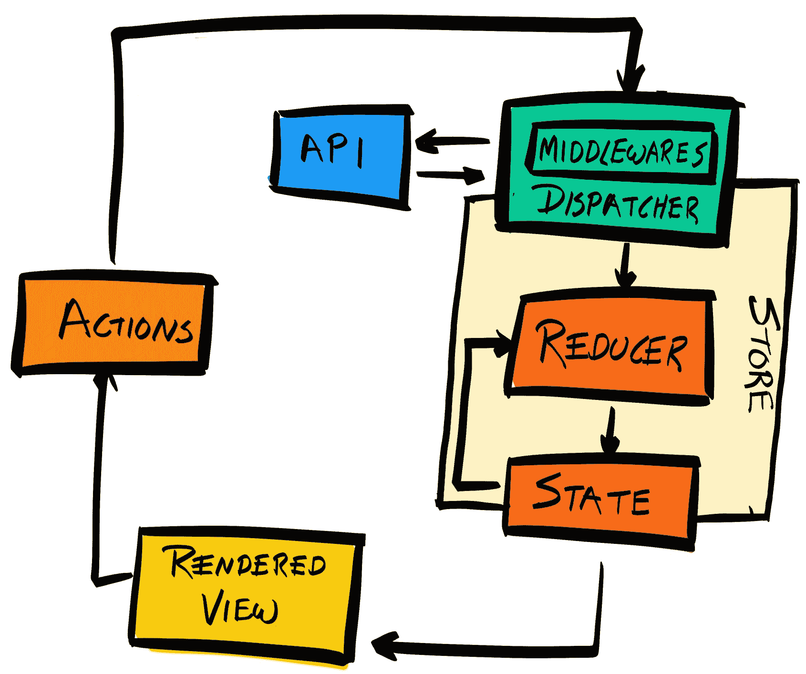

# 第十六章：使用 Redux 管理状态

记住，之前我们说过，将应用程序状态放在多个地方是不好的，因为它会使调试变得非常困难。因此，我们将状态从输入组件移动到表单组件。但现在我们有两个表单，我们再次有两个地方有状态。因此，我们需要再次将状态向上移动。最理想的情况是，我们的应用程序只有一个状态存储。

然而，如果我们继续将状态向上移动，并将相关的状态属性作为 props 传递下去，这可能会非常低效。假设一个组件嵌套了 20 层；为了消耗它所需的状态，状态需要通过 19 个组件。

此外，假设同一个深度嵌套的组件需要改变状态；它将不得不调用它的 `onChange` prop，提示其父组件调用其 `onChange` prop，等等。每次状态更改都需要调用 20 个 `onChange` 函数是无效的。

幸运的是，人们之前已经面临过相同的问题，并提出了解决这些问题的 *state management* 库。在本章中，我们将使用最受欢迎的状态管理库，**Redux**，以集中化的方式组织我们的状态。

通过阅读本章，你将学习以下内容：

+   Redux 中的不同概念，如状态 **store**、**reducers**、**actions** 和 **dispatchers**

+   如何提升状态

# 状态管理工具

目前有许多状态管理库，其中最受欢迎的是 Redux 和 MobX。

# Redux

在 Redux 中，你将应用程序的状态保存在一个属于 *store* 的对象字面量中。当状态需要改变时，应该发出一个描述发生了什么的 *action*。

然后，你会定义一组 *reducer* 函数，每个函数响应不同类型的动作。reducer 的目的是生成一个新的状态对象，将替换上一个状态对象：



这样，更新状态不再需要调用 20 个不同的 `onChange` 函数。

然而，你仍然需要通过许多组件的 props 传递状态。有一种方法可以通过使用 *selectors* 来减轻这种情况；但关于这一点我们稍后再谈。

# MobX

Mobx 集成了函数式响应式编程原则，并使用 *observables* 作为其存储：



你可以使用 `@observable` 装饰器将实体（例如，对象和数组）标记为可观察的。你还可以使用 `@computed` 装饰器将一些函数标记为 *derivation* 或 *reaction*。`@computed` 函数将在 `@observable` 存储每次更改时重新运行。

装饰器是 ECMAScript 的一个提议性添加，目前由 [github.com/tc39/proposal-decorators](https://github.com/tc39/proposal-decorators) 跟踪。

派生值是从状态中唯一可以导出的值。例如，我们可以将我们的 `LoginPage` 组件作为状态的派生值。当状态包含令牌属性时，用户已经登录，`LoginPage` 可以显示一条消息说“您已经登录”。当状态不包含令牌属性时，`LoginPage` 将渲染 `LoginForm` 组件。`LoginPage` 显示的内容可以完全从状态对象中令牌属性的值中导出。

反应是在状态更改时触发的事件。例如，如果一个新闻源应用的过时状态属性变为 `true`，你可能想查询 API 获取新鲜数据。

最后，状态更改是由 *动作* 触发的，动作是改变状态的事件。在 MobX 中，动作只是以某种方式更新状态的 JavaScript 语句。

# Redux 与 MobX 的比较

首先，我们必须明确，Redux 和 MobX 都与 React 工作得很好。

Redux 拥有更大的社区，其开发者工具更加成熟，与其他工具集成时支持更多。

# 转换到 Redux

让我们从安装 Redux 开始：

```js
$ yarn add redux
```

此外，还有一个官方的 React 绑定，它提供了 `connect` 方法，可以帮助你将组件连接到存储：

```js
$ yarn add react-redux
```

你可能还想安装 Redux DevTools ([`github.com/reduxjs/redux-devtools`](https://github.com/reduxjs/redux-devtools))，因为它会使使用 Redux 调试变得更加容易。

# 创建存储

如前所述，应用程序的整个状态都存储在称为 *store* 的结构中的单个对象中。存储是 Redux 应用程序的核心，所以让我们创建它。在 `src/index.jsx` 中添加以下行：

```js
import { createStore } from 'redux';

 const initialState = {};
 const reducer = function (state = initialState, action) {
   return state;
 }
 const store = createStore(reducer, initialState);
```

`createStore` 方法接受三个参数：

+   `reducer` *函数*：一个函数，它接受当前状态和一个动作，并使用它们生成一个新的状态。

+   `initialState` *任何类型*：初始状态。`initialState` 可以是任何数据类型，但在这里我们将使用对象字面量。

+   `enhancer` *函数*：一个函数，它接受当前存储，并修改它以创建一个新的、"增强"的存储。你可能希望使用增强器来实现中间件：



目前，我们只需关注创建一个带有状态的存储，所以我们使用一个虚拟的 reducer，它简单地返回状态。

存储对象有许多方法，其中最重要的是：

+   `getState`: 获取存储的当前状态

+   `dispatch`: 向存储派发一个动作

+   `subscribe`: 订阅函数，在存储的状态更改时运行

我们将使用这三种方法来实现我们的 Redux 集成。

# 提升状态

因此，让我们着手提升状态。目前，我们正在我们的两个表单元素中持有状态。所以，让我们将这些 *本地* 状态迁移到我们保持在我们 Redux 存储中的 *中心* 状态。

从`LoginForm`和`RegistrationForm`组件中移除构造函数方法（这些方法仅用于初始化状态），并将我们的`initialState`对象更新如下：

```js
const initialState = {
   loginForm: {
     token: null,
     email: {
       value: "",
       valid: null
     },
     password: {
       value: "",
       valid: null
     }
   },
   registrationForm: {
     userId: null,
     email: {
       value: "",
       valid: null
     },
     password: {
       value: "",
       valid: null
     }
   }
 };
```

然后，我们需要使这个中心状态对组件可用。我们通过将状态通过`Route`组件传递给表单组件来实现这一点：

```js
<Route exact path="/register" store={store} render={() => <RegistrationForm {...store.getState().registrationForm} />} />,
 <Route exact path="/login" store={store} render={() => <LoginForm {...store.getState().loginForm} />} />,
```

我们正在使用`store.getState()`来获取存储的当前状态，并且我们只将相关部分传递到组件中。

注意，我们正在使用`Route`的渲染属性而不是组件。当你想要传入作用域变量而不导致组件卸载和重新挂载时，渲染属性非常有用。

然后，我们需要确保每当状态改变时调用`ReactDOM.render`，这样 UI 就成为了我们状态的确定性表示。我们通过将`ReactDOM.render`调用包装在一个函数中，并通过将状态变化时提供它作为`store.subscribe`的参数来调用它来实现这一点：

```js
function render () {
   ReactDOM.render( ... );
 }

 store.subscribe(render);

 render();
```

最后，在`LoginForm`和`RegistrationForm`组件内部，将每个`this.state`实例更改为`this.props`。

界面现在是我们状态的确定性表示。

保存并运行`yarn run serve`以启动我们应用程序的新版本。你会注意到，当你输入输入框时，输入框的值没有改变。这是因为我们没有派发一个会改变我们状态的动作。

尝试更改`initialState.loginForm.email.value`的值，并重新启动应用程序。你会看到它在表单中得到了反映。

# 派发动作

现在我们已经集成了 React，使我们的 UI 成为我们状态的确定性表示。然而，正如你在尝试在输入框中输入时所展示的，我们没有方法来更新状态。现在让我们来改变这一点。

只是为了回顾一下，你在 Redux 中改变状态的方式是通过派发一个动作，并定义响应这些动作并更新状态的 reducer。

让我们从更新状态的场景开始；例如，当我们在一个表单的输入框中输入时。目前，我们正在使用`handleInputChange`方法来更新本地状态：

```js
handleInputChange = (name, event) => {
   const value = event.target.value;
   const valid = validatorname;
   this.setState({
     [name]: { value, valid }
   });
 }
```

相反，我们希望更新这个事件处理器来派发一个动作。

一个动作只是一个描述已发生事件的简单对象。它应该尽可能简洁。创建动作后，你需要在存储上调用`dispatch`方法来派发动作。例如，在`RegistrationForm`组件中输入值更改后派发的动作可能看起来像这样：

```js
handleInputChange = (name, event) => {
   const value = event.target.value;
   const action = {
     type: 'RegistrationForm:update',
     field: name,
     value
   }
   this.props.store.dispatch(action);
 }
```

注意，我们移除了验证逻辑。这是因为它没有描述已发生的事件（输入值已更改）。这个验证逻辑属于 reducer，我们现在将实现它。

# 使用 Reducer 更新状态

将虚拟 reducer 函数更新如下：

```js
import deepmerge from 'deepmerge';
 import { validator } from './utils';
 const reducer = function (state = initialState, action) {
   if (action.type === 'RegistrationForm:update') {
     const { field, value } = action;
     const valid = validatorfield;
     const newState = {
       registrationForm: {
         [field]: {
           value,
           valid
         }
       }
     }
     return deepmerge(state, newState);
   }
   return state;
 }
```

我们已经将验证逻辑迁移到这里，并且我们正在返回状态的新实例。由于我们的状态对象有很多层，仅仅使用 `Object.assign` 或 ES6 扩展语法是不够的。因此，我们正在使用一个名为 `deepmerge` 的 NPM 包来执行旧状态和新状态的合并。所以，请确保我们将该包添加到我们的项目中：

```js
$ yarn add deepmerge
```

将 `RegistrationForm` 组件的其余部分转换为使用 Redux（即，更改 `handleRegistration` 方法），然后对 `LoginForm` 组件做同样的处理。

然后，再次运行你的应用程序，它应该和之前一样工作。但请始终运行 `yarn run test:e2e` 以确保无误！

# 使用 React Redux 连接

到目前为止，我们使用了 `createStore` 来创建一个新的 store，`store.getState` 来获取 store 的状态，`store.dispatch` 来分发由 reducer 处理的动作以改变状态，最后使用 `subscribe` 来在状态改变时重新运行我们的 `render` 函数。

我们不得不手动做所有这些，但有一个更好的替代方案，它简化了这一切，并添加了许多性能优化，以防止不必要的重新渲染。React Redux 是 Redux 对 React 的官方绑定。它提供了一个 `connect` 函数，将取代 `store.subscribe` 的角色，从 Redux store 的状态中读取，并将相关的部分作为 props 传递给展示组件（例如，`Input` 和 `Button`）。现在让我们安装它：

```js
$ yarn add react-redux
```

它与 React Redux 的工作方式如下：

+   你将应用程序的根组件包裹在 `<Provider>` 组件中。这使得 Redux store 对应用中的每个组件都可用。

+   在需要从状态中读取的每个容器组件中，你使用 `connect` 函数将组件连接到 Redux store。

# 使用 Provider 组件包裹

首先，从 `src/index.jsx` 中移除 `store.subscribe` 调用。由于 `connect` 将负责订阅状态的变化，我们不再需要这个。这也意味着我们不再需要在 `ReactDOM.render` 调用内部包裹一个函数。

接下来，由于我们将在每个组件中调用 `connect`，因此不需要将 store 和 state 属性作为 props 传递。因此，在我们的 `<Route>` 组件中，切换回使用 component prop 而不是 `render`。

最重要的是，将我们的整个应用程序包裹在 `<Provider>` 组件中，将 store 作为其唯一的 prop 传递：

```js
import { Provider } from 'react-redux';
 ReactDOM.render((
   <Provider store={store}>
     <BrowserRouter>
       <Switch>
       <Route exact path="/register" component={RegistrationForm} />
       <Route exact path="/login" component={LoginForm} />
       </Switch>
     </BrowserRouter>
   </Provider>
 ), document.getElementById('renderTarget'));
```

现在，store 对应用中的所有组件都是可用的。要访问 store 的状态并向 store 分发动作，我们需要使用 `connect`。

# 连接到 Redux store

由于我们现在不再将 store 和 state 传递给表单组件，我们需要使用 `connect` 来重新连接组件到 store。

`connect` 函数具有以下签名：

```js
connect([mapStateToProps], [mapDispatchToProps], [mergeProps], [options])
```

所有参数都是可选的，将在下面进行描述。

# mapStateToProps

如果 `mapStateToProps` 是一个函数，那么组件将订阅存储状态的改变。当发生改变时，`mapStateToProps` 函数将被调用，并且传递存储的整个更新状态。该函数应该提取与该组件相关的状态部分，并将它们作为对象字面量返回。这个对象字面量然后将与传递给组件的属性合并，并通过 `this.props` 在其方法中可用。

对于我们的 `LoginForm` 组件，我们只关心状态中的 `loginForm` 属性，因此替换我们当前的导出语句：

```js
export default LoginForm;
```

使用如下：

```js
function mapStateToProps (state) {
   return state.loginForm;
 }
 export default connect(mapStateToProps)(LoginForm);
```

对 `RegistrationForm` 也做同样的处理。

如果一个组件不需要从存储中读取状态，但需要以其他方式与存储交互（例如，分发一个事件），那么你可以为 `mapStateToProps` 参数使用 `null` 或 `undefined`。那么组件将不再对状态变化做出反应。

`connect` 函数本身返回一个函数，然后你可以使用这个函数来包装你的组件。

# `mapDispatchToProps`

虽然 `mapStateToProps` 允许组件订阅存储的状态变化，但 `mapDispatchToProps` 允许组件向存储分发动作。

它通过引用存储的 dispatch 方法被调用，并且应该返回一个对象，其中每个键映射到一个调用 dispatch 方法的函数。

例如，我们的 `mapDispatchToProps` 函数可能看起来像这样：

```js
function mapDispatchToProps (dispatch) {
   return {
     handleInputChange: (name, event) => {
       const value = event.target.value;
       const action = {
         type: 'LoginForm:update',
         field: name,
         value
       }
       dispatch(action);
     }
   };
 };
```

`handleInputChange` 键将被合并到组件的属性中，并在组件的方法中作为 `this.props.handleInputChange` 可用。因此，我们可以将 Input 组件上的 `onChange` 属性更新为 `onChange={this.props.handleInputChange}`。

# 解耦 Redux 与组件

你可能会想，“这看起来非常复杂，为什么我不能直接将 dispatch 作为属性传递，并在事件处理程序中调用 `this.props.dispatch()`？就像我们之前做的那样？”如下所示：

```js
function mapDispatchToProps (dispatch) {
   return { dispatch };
 };
```

虽然这是可能的，但这将我们的组件耦合到 Redux。在 Redux 之外，不存在 dispatch 方法的概念。因此，在我们的组件方法中使用 `dispatch` 有效地将组件绑定到 Redux 环境。

通过使用 `mapDispatchToProps` 函数，我们解耦了组件与 Redux。现在，`this.props.handleInputChange` 只是我们传递给组件的函数。如果我们后来决定不使用 Redux，或者我们想在非 Redux 环境中重用该组件，我们只需传递一个不同的函数，而无需更改组件代码。

同样，我们可以将 `handleLogin` 事件处理程序中的 dispatch 调用拉入 `mapDispatchToProps`：

```js
function mapDispatchToProps (dispatch) {
   return {
     handleInputChange: (name, event) => { ... },
     handleSuccess: token => {
       const action = {
         type: 'LoginForm:success',
         token
       }
       dispatch(action);
     }
   };
 };
```

为了连接这些点，将 `mapStateToProps` 和 `mapDispatchToProps` 传递给 `connect`。这将返回一个函数，你可以用它来包装 `LoginForm` 组件：

```js
export default connect(
   mapStateToProps,
   mapDispatchToProps
 )(LoginForm);
```

注意，原始组件（`LoginForm`）没有被修改。相反，创建了一个新的包装组件并导出。

然后在`handleLogin`事件处理器中使用`handleSuccess`：

```js
class LoginForm extends React.Component {
   handleLogin = (event) => {
     ...
     fetch(request)
       .then( ... )
       .then(this.props.handleSuccess)
       .catch(console.error)
   }
 }
```

对于`RegistrationForm`重复相同的步骤。一如既往，运行测试以确保没有错别字或错误。

# 摘要

在本章中，我们已经将代码迁移到使用 Redux 来管理我们的状态。拥有一个单一的状态存储使得事情的管理和维护变得更加容易。

我们现在已经完成了前端世界的迷你之旅。在下一章中，我们将探讨如何使用**Docker**来容器化我们的应用程序，并使每个服务更加独立和自包含。
