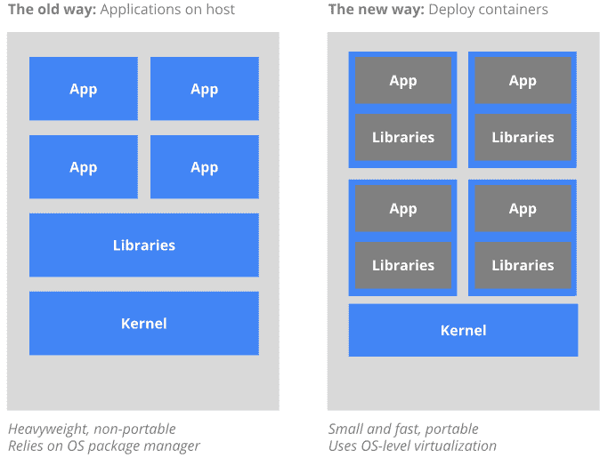
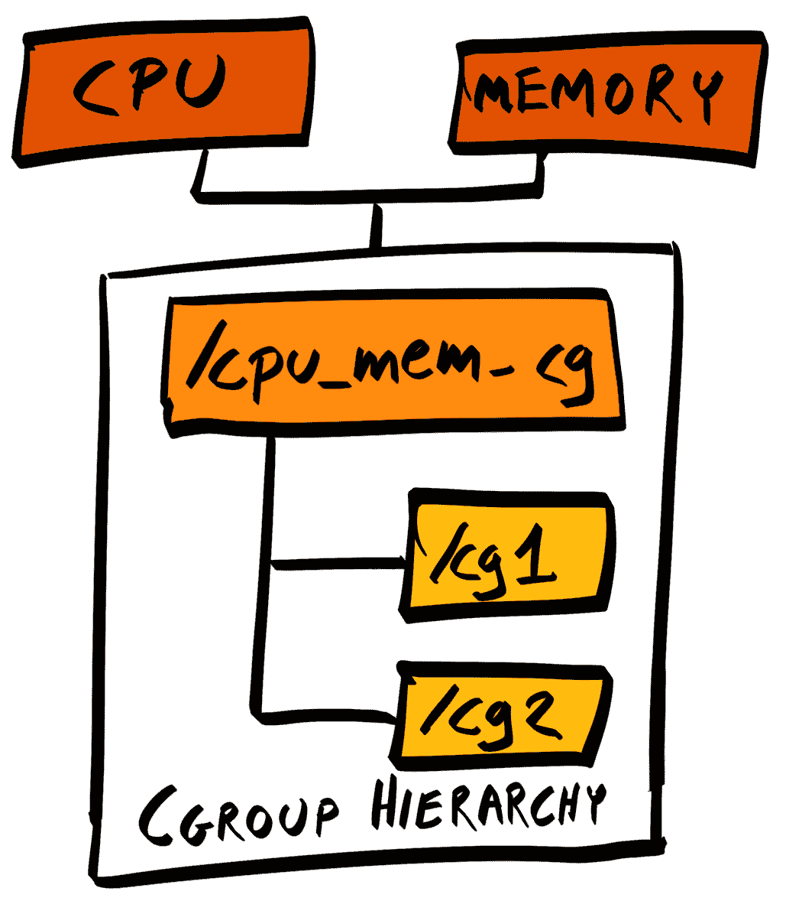
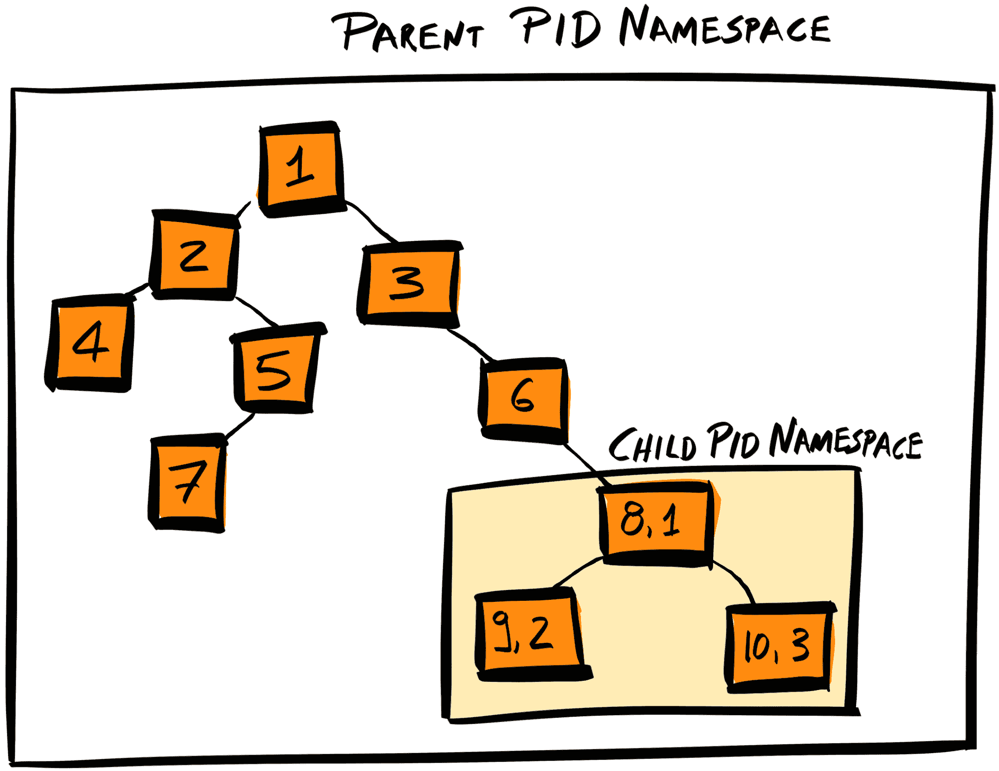
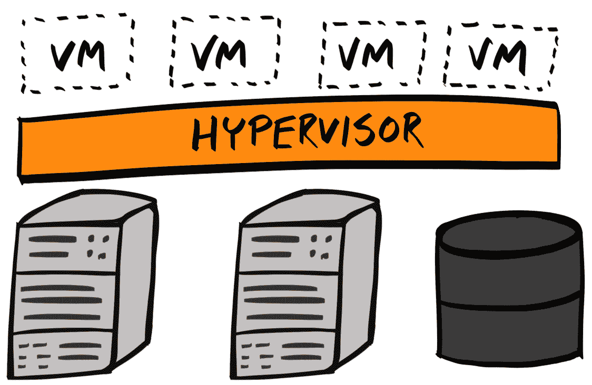
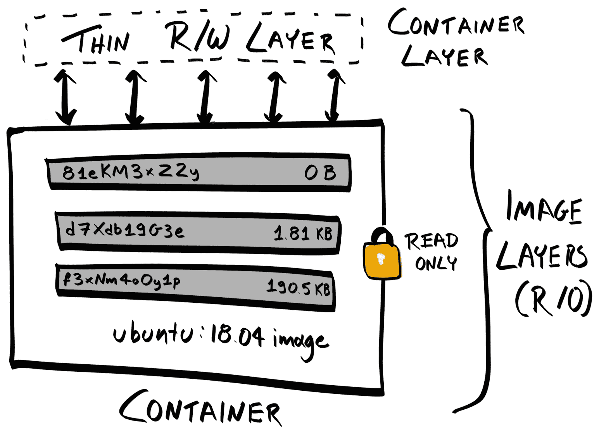
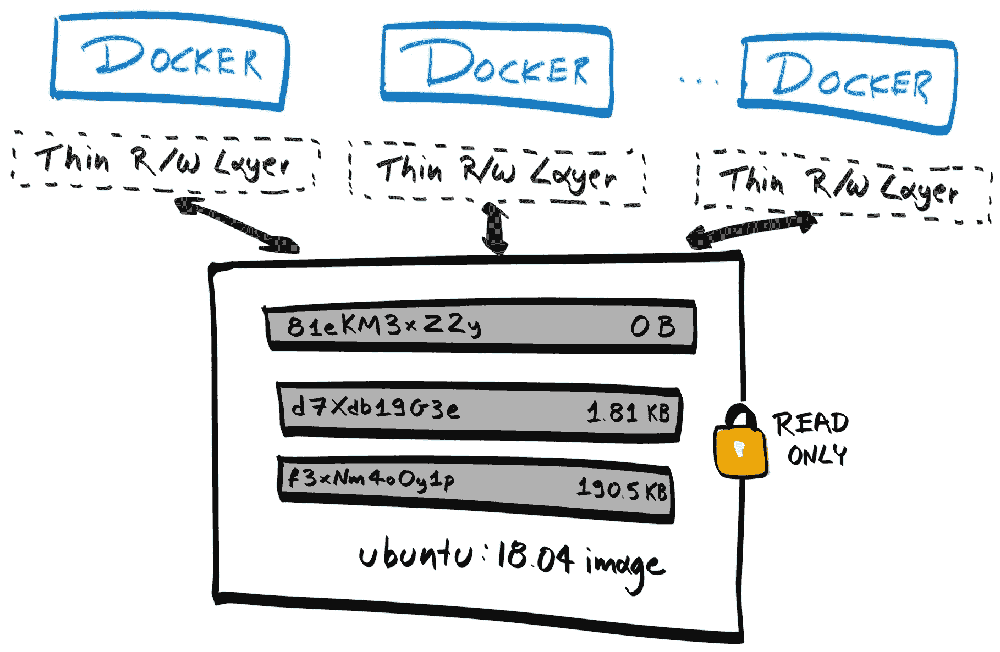
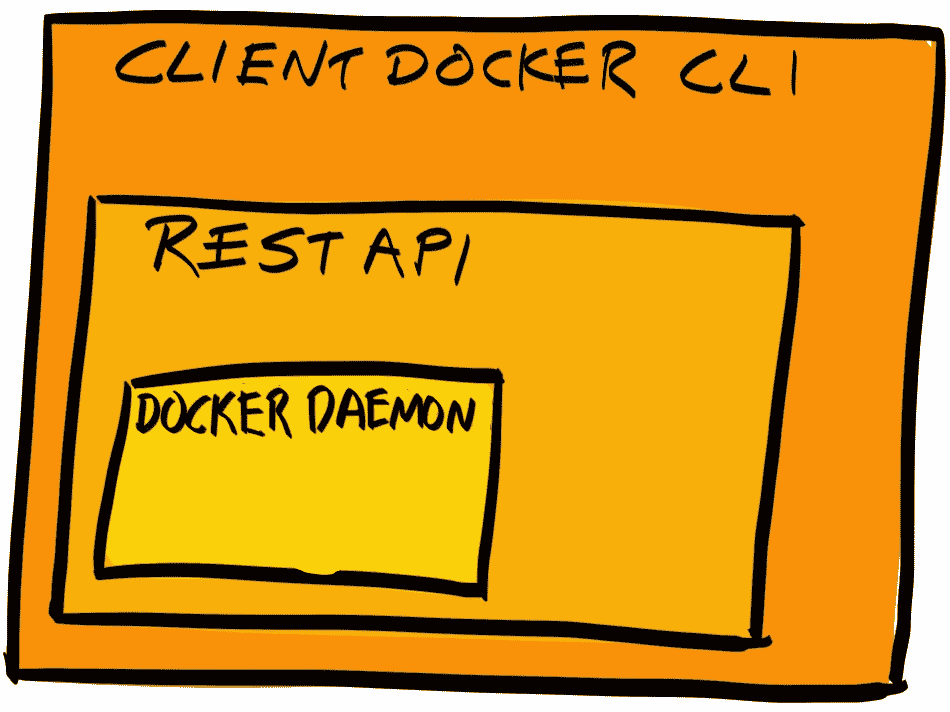
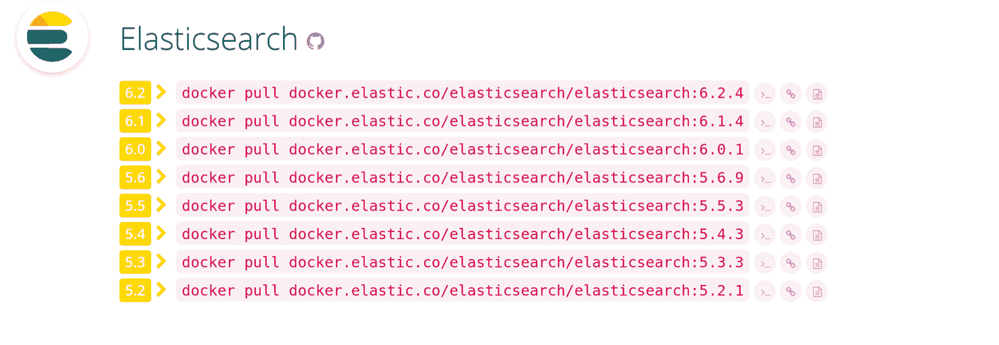

# 迁移到 Docker

到目前为止，我们主要集中在开发应用程序的后端和前端，对基础设施的关注很少。在接下来的两章中，我们将专注于使用 Docker 和 Kubernetes 创建可扩展的基础设施。

到目前为止，我们已经手动配置了两个虚拟专用服务器（VPS），并将我们的后端 API 和客户端应用程序部署在它们上面。随着我们在本地机器上继续开发我们的应用程序，我们在本地、Travis CI 以及我们自己的 Jenkins CI 服务器上测试每个提交。如果所有测试都通过，我们使用 Git 从 GitHub 上的集中式远程仓库拉取更改并重新启动我们的应用程序。虽然这种方法适用于用户基础较小的简单应用程序，但对于企业级软件来说则不可行。

因此，我们将从理解为什么手动部署应该是过去式开始，以及我们可以采取的步骤来实现部署过程的完全自动化。具体来说，通过遵循本章，你将学习：

+   什么是**Docker**以及通常的容器是什么，

+   如何下载和运行 Docker 镜像

+   如何编写自己的`Dockerfile`并将其用于将应用程序的部分容器化

+   如何优化镜像

# 手动部署的问题

我们当前方法中存在的一些弱点包括：

+   **缺乏一致性**：大多数企业级应用程序是由一个团队开发的。很可能每个团队成员都会使用不同的操作系统，或者以与其他人不同的方式配置他们的机器。这意味着每个团队成员的本地机器的环境将彼此不同，并且由此延伸到生产服务器。因此，即使所有本地测试都通过，也不能保证在生产环境中也能通过。

+   **缺乏独立性**：当几个服务依赖于共享库时，它们必须都使用库的同一版本。

+   **耗时且易出错**：每次我们想要一个新的环境（预发布/生产）或在多个位置使用相同的环境时，我们都需要手动部署一个新的 VPS 实例，并重复相同的步骤来配置用户、防火墙和安装必要的软件包。这产生了两个问题：

    +   **耗时**：手动设置可能需要几分钟到几小时不等。

    +   **易出错**：人类容易出错。即使我们已经执行了相同的步骤数百次，也难免会有一些错误。

    +   此外，这个问题随着应用程序和部署过程的复杂性而扩大。对于小型应用程序来说可能是可管理的，但对于由数十个微服务组成的大型应用程序来说，这变得过于混乱。

+   **风险性部署**：因为服务器配置、更新、构建和运行我们的应用程序只能在部署时进行，所以在部署时出错的风险更大。

+   **难以维护**：在应用程序部署之后，管理服务器/环境并不会停止。会有软件更新，你的应用程序本身也会更新。当这种情况发生时，你必须手动进入每个服务器并应用更新，这又是耗时且容易出错的。

+   **停机时间**：将我们的应用程序部署在单个服务器上意味着存在一个单点故障（SPOF）。这意味着如果我们需要更新我们的应用程序并重新启动，应用程序将在这段时间内不可用。因此，以这种方式开发的应用程序无法保证高可用性或可靠性。

+   **缺乏版本控制**：对于我们的应用程序代码，如果引入了一个错误并且某种方式通过了我们的测试并部署到生产环境中，我们可以简单地回滚到最后已知的好版本。同样的原则也应该适用于我们的环境。如果我们更改了服务器配置或升级了一个破坏我们应用程序的依赖项，就没有快速简便的方法来撤销这些更改。最糟糕的情况是，如果我们没有先记录下上一个版本就无差别地升级了多个包，那么我们甚至不知道如何撤销更改！

+   **资源分配效率低下**：我们的 API、前端客户端和 Jenkins CI 各自部署在自己的 VPS 上，运行自己的操作系统，并控制自己的隔离资源池。首先，每个服务在自己的服务器上运行可能会迅速变得昂贵。目前我们只有三个组件，但一个大型应用程序可能有数十到数百个单独的服务。此外，每个服务可能并没有充分利用服务器的全部能力。在负载较高的时期，拥有一个缓冲是很重要的，但我们应尽可能减少未使用/空闲资源：


# Docker 简介

Docker 是一个开源项目，为开发者提供构建和运行容器内应用程序的工具和生态系统。

# 容器是什么？

容器化是一种虚拟化方法。虚拟化是一种在从硬件抽象出的层内运行计算机系统虚拟实例的方法。虚拟化允许你在同一物理主机机器上运行多个操作系统。

从运行在虚拟化系统中的应用程序的角度来看，它对主机机器没有任何知识或交互，甚至可能不知道它正在虚拟环境中运行。

容器是一种虚拟系统。每个容器都分配了一定数量的资源（CPU、RAM、存储）。当程序在容器内运行时，其进程和子进程只能操作分配给容器的资源，不能再操作其他资源。

你可以将容器视为一个隔离的环境，或沙盒，在其中运行你的应用程序。

# 工作流程

那么，在容器内运行程序（或程序）的典型工作流程是什么？

首先，你需要在 *Dockerfile* 中指定你的环境和应用程序的设置，其中每一行都是设置过程中的一个步骤：

```js
FROM node:8
RUN yarn
RUN yarn run build
CMD node dist/index.js
```

然后，你将实际执行 Dockerfile 中指定的步骤以生成 *镜像*。镜像是一个静态的、不可变的文件，包含我们应用程序的可执行代码。镜像自包含，包括我们的应用程序代码以及所有依赖项，如系统库和工具。

然后，你将使用 Docker 运行镜像。镜像的运行实例是容器。你的应用程序在容器内运行。

通过类比，Dockerfile 包含了组装电机的指令。你按照指令生成电机（镜像），然后你可以给电机添加电力使其运行（容器）。

Docker 与我们的类比之间的唯一区别是，许多 Docker 容器可以运行在同一个 Docker 镜像之上。

# Docker 如何解决我们的问题？

既然我们已经知道了 Docker 是什么，并且对如何使用它有一个大致的了解，那么让我们看看 Docker 如何修复我们当前工作流程中的缺陷：

+   **提供一致性**：我们可以在同一镜像上运行多个容器。因为设置和配置是在镜像上完成的，所以所有容器都将拥有相同的环境。进一步来说，这意味着在我们的本地 Docker 实例上通过测试的测试也会在生产环境中通过。这也被称为 *可重复性*，减少了开发者说“但在我的机器上它工作得很好！”的情况。此外，Docker 容器应该将所有依赖项打包在其内部。这意味着它可以部署在任何地方，无论操作系统如何。Ubuntu 桌面、Red Hat 企业 Linux 服务器、MacOS - 这都不重要。

+   **提供独立性**：每个容器都包含它自己的所有依赖项，可以选择它想要的任何版本。

+   **节省时间和减少错误**：构建我们的镜像所使用的每个设置和配置步骤都已在代码中指定。因此，这些步骤可以由 Docker 自动执行，从而降低人为错误的风险。此外，一旦镜像构建完成，你可以重用相同的镜像来运行多个容器。这两个因素意味着节省了大量的人时。

+   **风险部署**：服务器配置和应用程序构建发生在构建时间，我们可以在容器运行之前进行测试。我们本地或预发布环境与生产环境之间的唯一区别将是硬件和网络的不同。

+   **易于维护**：当需要更新应用程序时，你只需更新你的应用程序代码和/或 Dockerfile，然后重新构建镜像。然后，你可以运行这些新镜像，并重新配置你的 web 服务器以将请求指向新的容器，在淘汰过时的容器之前。

+   **消除停机时间**：我们可以轻松地部署我们想要的任何数量的应用程序实例，因为只需要一个`docker run`命令。它们可以并行运行，因为我们的 Web 服务器开始将新流量导向更新的实例，同时等待现有请求由过时的实例完成。

+   **版本控制**：Dockerfile 是一个文本文件，应该被提交到项目仓库中。这意味着如果我们的环境有新的依赖项，它可以被追踪，就像我们的代码一样。如果我们的环境开始产生大量错误，回滚到上一个版本就像部署最后一个已知良好的镜像一样简单。

+   **提高资源使用效率**：由于容器是独立的，它们可以部署在任何机器上。然而，这也意味着可以在同一台机器上部署多个容器。因此，我们可以将更轻量级或非关键任务的服务一起部署在同一台机器上：


例如，我们可以在同一台主机机器上部署我们的前端客户端和 Jenkins CI。客户端很轻量，因为它是一个简单的静态 Web 服务器，而 Jenkins 用于开发，如果它有时响应缓慢也是可以接受的。

这还有一个额外的优点，即两个服务共享相同的操作系统，这意味着总体开销更小。此外，资源池化导致我们资源的使用更加高效：



所有这些好处都源于我们的环境现在被指定为代码。

# Docker 的工作原理

因此，既然你已经了解了*为什么*我们需要 Docker，以及从高层次上*如何*与 Docker 一起工作，那么让我们将注意力转向*实际上*Docker 容器和镜像是什么。

# 什么是 Docker 容器？

Docker 基于 Linux 容器（LXC），这是一种内置在 Linux 中的容器化技术。LXC 本身依赖于两个 Linux 内核机制——**控制组**和**命名空间**。因此，让我们更详细地简要考察每一个。

# 控制组

控制组（cgroups）通过组来分离进程，并将一个或多个子系统附加到每个组：



子系统可以限制每个附加组的资源使用。例如，我们可以将我们的应用程序进程放入 foo cgroup 中，将其内存子系统附加到它上面，并限制我们的应用程序使用，比如说，主机内存的 50%。

有许多不同的子系统，每个子系统负责不同类型的资源，例如 CPU、块 I/O 和网络带宽。

# 命名空间

命名空间将系统资源，如文件系统、网络访问等打包，并将它们呈现给一个进程。从进程的角度来看，它甚至不知道在其分配之外还有资源。

可以进行命名空间化的资源之一是进程 ID（PIDs）。在 Linux 中，PIDs 组织成树状结构，系统的初始化进程（`systemd`）被赋予 PID 1，位于树的根节点。

如果我们对 PIDs 进行命名空间化，我们就是通过将子进程的根重置为 PID 1 来屏蔽子进程的其他进程。这意味着后代进程将把子进程视为根，并且它们将不会知道任何其他进程。



您可以通过在终端中运行`pstree`来查看您系统的进程树。

这里描述的两种 Linux 内核机制的组合使我们能够拥有彼此隔离的容器（使用命名空间）以及资源受限的容器（使用控制组）。每个容器都可以拥有自己的文件系统、网络等，与其他主机上的容器隔离。

# LXC 和 Docker

需要注意的是，Docker**不是**一种新的容器化技术——它并没有取代 LXC。相反，它提供了一个使用 Dockerfile 和更广泛的 Docker 工具链定义、构建和运行 LXCs 的标准方式。

实际上，在 2015 年 6 月 22 日，Docker、CoreOS 和其他容器行业的领导者建立了开放容器倡议（OCI: [opencontainers.org](https://www.opencontainers.org/)），这是一个旨在围绕容器格式和运行时创建开放行业标准的项目。OCI 具有开放的治理结构，并得到了 Linux 基金会的支持。

目前，开放容器倡议（OCI）提供了两个标准规范：

+   镜像规范（image-spec: [github.com/opencontainers/image-spec](https://github.com/opencontainers/image-spec)）：这规定了镜像定义应该如何格式化。例如，OCI 镜像应由一个**镜像清单**、一个**镜像配置**和一个**文件系统（层）序列化**组成。

+   运行时规范（runtime-spec: [github.com/opencontainers/runtime-spec](https://github.com/opencontainers/runtime-spec)）这规定了系统如何运行符合 OCI 规范的镜像。Docker 将其容器格式和运行时，runC ([github.com/opencontainers/runc](https://github.com/opencontainers/runc)），捐赠给了 OCI。

除了对 OCI 标准做出重大贡献外，Docker 还通过提供工具简化了容器的工作，这些工具将底层过程（如管理控制组）抽象化，从而远离最终用户，并提供了一个注册表（Docker Hub），开发者可以在其中共享和分支彼此的镜像。

# 虚拟机

还需要注意的是，容器并不是虚拟化的唯一方法。另一种常见的提供隔离虚拟环境的方法是使用**虚拟机**（VMs）。

虚拟机的目的与容器类似——提供隔离的虚拟环境，但其机制却大不相同。

虚拟机是运行在另一个计算机系统之上的模拟计算机系统。它是通过 *虚拟机管理程序* 来实现的——一个可以访问物理硬件并管理不同虚拟机之间资源分配和分离的程序。

虚拟机管理程序是分离硬件层和虚拟环境的软件，如下面的图所示：



虚拟机管理程序可以嵌入到系统硬件中并直接在其上运行，此时它们被称为 Type 1 虚拟机管理程序，即原生、裸机或嵌入式虚拟机管理程序。它们也可以在宿主操作系统的之上运行，此时它们被称为 Type 2 虚拟机管理程序。

Type 1 虚拟机管理程序技术自 2006 年 Linux 引入 *基于内核的虚拟机* (KVM) 以来一直是 Linux 的一部分。

# 容器与虚拟机

当比较容器和虚拟机时，以下是主要的区别：

+   虚拟机是对整个计算机系统的模拟（全虚拟化），包括模拟硬件。这意味着用户可以与模拟的虚拟硬件进行交互，如网络卡、图形适配器、CPU、内存和磁盘。

+   虚拟机使用更多资源，因为它们是 *硬件虚拟化* 或 *全虚拟化*，与容器不同，容器是在操作系统（OS）级别虚拟化的。

+   容器内的进程直接在宿主机的内核上运行。同一台机器上的多个容器都会共享宿主机的内核。相比之下，虚拟机内的进程在自己的虚拟内核和操作系统上运行。

+   容器内运行的进程通过命名空间和控制组进行隔离。虚拟机内运行的进程通过模拟硬件进行分离。

# 什么是 Docker 图像？

我们现在知道了 Docker 容器是什么以及它在高层次上的实现方式。让我们将重点转向 Docker 图像，这是容器在其之上运行的。

记住，Docker 图像是包含我们的应用程序及其所有依赖项的数据文件，打包成一个实体。让我们看看 Docker 图像的解剖结构，这将有助于我们构建自己的图像。

# 图像是分层的

一张图片是一个有序的 *层* 列表，其中每一层都是一个用于设置图像和容器的操作。这些操作可能包括设置/更新系统配置、环境变量、安装库或程序等。这些操作都在 *Dockerfile* 中指定。因此，每一层都对应于图像 Dockerfile 中的一个指令。

例如，如果我们需要为我们的后端 API 生成 Docker 图像，我们需要它安装 Node 生态系统，复制我们的应用程序代码，并使用 yarn 构建我们的应用程序。因此，我们的图像可能有以下层（底层先运行）：

+   运行 `yarn run build`

+   在图像内复制应用程序代码

+   安装特定版本的 Node 和 yarn

+   [使用基础 Ubuntu 镜像]

每个这些操作都会创建一个层，这可以被视为设置过程中此点的镜像的 *快照*。下一个层依赖于前一个层。

最后，你得到一个按顺序依赖的层列表，这些层构成了最终的镜像。这个最终镜像可以用作另一个镜像的基础层——一个镜像简单地说是一组顺序的、依赖的、只读层。

# 运行容器

为了总结你到目前为止关于容器、镜像和层的所学内容，让我们看看当我们运行容器时会发生什么。

当运行容器时，会在只读镜像（由只读层组成）之上创建一个新的可写 *容器层*：



任何文件更改都包含在容器层中。这意味着当我们完成一个容器时，我们可以简单地退出容器（移除可写容器层），所有更改将被丢弃。

在这里我们不会过多地深入细节，但你可以通过向挂载的卷写入文件来持久化容器中的文件，并且你可以通过基于这些更改创建一个新的镜像来保留当前容器中的更改，使用 `docker commit`。

因为容器只是一个在无状态的只读镜像之上的隔离、可写层，你可以有多个容器共享对同一镜像的访问。



# 设置 Docker 工具链

你现在知道了为什么、是什么以及如何，所以现在是时候通过将现有应用程序 Docker 化来巩固我们的理解了。

让我们先安装 Docker。这将允许我们在本地机器上生成镜像并作为容器运行它们。

Docker 有两个 *版本*——**社区版**（**CE**）和**企业版**（**EE**）。我们将使用 CE。

# 添加 Docker 软件包仓库

Docker 在官方 Ubuntu 仓库中，但那个版本可能已经过时。相反，我们将从 Docker 自己的官方仓库下载 Docker。

首先，让我们安装确保 `apt` 可以通过 HTTPS 使用 Docker 仓库的软件包：

```js
$ sudo apt install -y apt-transport-https ca-certificates curl software-properties-common
```

然后，添加 Docker 的官方 GPG 密钥。这允许你验证你下载的 Docker 软件包没有被损坏：

```js
$ curl -fsSL https://download.docker.com/linux/ubuntu/gpg | sudo apt-key add -
```

前面的命令使用 `curl` 下载 GPG 密钥并将其添加到 `apt`。然后我们可以使用 `apt-key` 验证密钥的指纹为 `9DC8 5822 9FC7 DD38 854A E2D8 8D81 803C 0EBF CD88`：

```js
$ sudo apt-key fingerprint 0EBFCD88

 pub 4096R/0EBFCD88 2017-02-22
 Key fingerprint = 9DC8 5822 9FC7 DD38 854A E2D8 8D81 803C 0EBF CD88
 uid Docker Release (CE deb) <docker@docker.com>
 sub 4096R/F273FCD8 2017-02-22
```

**请注意，您的指纹可能不同。**始终参考 Docker 网站上公开发布的最新密钥。

然后，将 Docker 仓库添加到 apt 的仓库列表中，以便在它尝试查找软件包时搜索：

```js
$ sudo add-apt-repository "deb [arch=amd64] https://download.docker.com/linux/ubuntu $(lsb_release -cs) stable"
```

最后，更新 apt 软件包索引，以便 apt 能够了解 Docker 仓库中的软件包：

```js
$ sudo apt update
```

# 安装 Docker

Docker 现在可在官方 Docker 软件包注册库中作为 docker-ce 提供。但在安装 docker-ce 之前，我们应该移除机器上可能存在的旧版 Docker：

```js
$ sudo apt remove -y docker docker-engine docker.io
```

现在，我们可以安装`docker-ce`：

```js
$ sudo apt install -y docker-ce
```

通过运行 `sudo docker version` 来验证安装是否正常工作。你应该得到类似于以下输出的结果：

```js
$ sudo docker version
Client:
 Version:      18.03.1-ce
 API version:  1.37
 Go version:   go1.9.5
 Git commit:   9ee9f40
 Built:        Thu Apr 26 07:17:38 2018
 OS/Arch:      linux/amd64
 Experimental: false
 Orchestrator: swarm

Server:
 Engine:
 Version:      18.03.1-ce
 API version:  1.37 (minimum version 1.12)
 Go version:   go1.9.5
 Git commit:   9ee9f40
 Built:        Thu Apr 26 07:15:45 2018
 OS/Arch:      linux/amd64
 Experimental: false
```

# Docker 引擎、守护进程和客户端

我们已经成功安装了 Docker，但如前所述，Docker 实际上是一套工具。当我们“安装 Docker”时，我们实际上是在安装**Docker 引擎**。

Docker 引擎由以下部分组成：

+   Docker 守护进程（mysqld，作为后台进程运行）：

    +   一个轻量级的容器运行时，用于运行你的容器

    +   你需要构建镜像的工具

    +   处理容器集群的工具，例如网络、负载均衡等

+   Docker 客户端（mysql），一个命令行界面，允许你与 Docker 守护进程交互

Docker 守护进程和客户端共同构成了 Docker 引擎。这类似于 npm 和 node 是如何捆绑在一起的。

Docker 守护进程公开了一个 REST API，Docker 客户端使用该 API 与 Docker 守护进程交互。这类似于`mysql`客户端与`mysqld`守护进程的交互，或者你的终端 shell 如何为你提供一个与机器交互的接口。



现在我们已经安装了 Docker，并准备好使用它来运行我们的应用程序。

# 在 Docker 上运行 Elasticsearch

我们的应用程序中最容易 Docker 化的组件是 Elasticsearch。这很容易，因为我们不需要编写自己的 Dockerfile——Elasticsearch 最新版本的 Docker 镜像已经由 Elastic 提供。我们只需要下载镜像并在本地 Elasticsearch 安装的替代位置运行它们。

Elastic 提供了三种类型的 Elasticsearch 镜像：

+   `elasticsearch`（基本）：带有 X-Pack 基本功能预安装并自动激活的 Elasticsearch，使用免费许可证

+   `elasticsearch-platinum`：带有所有 X-Pack 功能预安装和激活的 Elasticsearch，使用 30 天试用许可证

+   `elasticsearch-oss`：仅 Elasticsearch

我们不需要 X-Pack，因此我们将使用`elasticsearch-oss`版本。

访问 Elastic 的 Docker 仓库：`https://www.docker.elastic.co/`：



然后，运行`docker pull`命令以获取 Elasticsearch 的最新版本，确保将`elasticsearch`替换为`elasticsearch-oss`：

```js
$ docker pull docker.elastic.co/elasticsearch/elasticsearch-oss:6.2.4
6.2.4: Pulling from elasticsearch/elasticsearch-oss
469cfcc7a4b3: Pull complete 
8e27facfa9e0: Pull complete 
cdd15392adc7: Pull complete 
19ff08a29664: Pull complete 
ddc4fd93fdcc: Pull complete 
b723bede0878: Pull complete 
Digest: sha256:2d9c774c536bd1f64abc4993ebc96a2344404d780cbeb81a8b3b4c3807550e57
Status: Downloaded newer image for docker.elastic.co/elasticsearch/elasticsearch-oss:6.2.4
```

所有 Elasticsearch Docker 镜像都使用 centos:7 作为基础镜像。在这里，`469cfcc7a4b3`是构成 centos:7 镜像的层，你可以看到后续层都是基于这个层构建的。

我们可以通过运行 `docker images` 来验证镜像是否已正确下载：

```js
$ docker images
REPOSITORY                                          TAG    IMAGE ID      SIZE
docker.elastic.co/elasticsearch/elasticsearch-oss   6.2.4  3822ba554fe9  424MB
```

Docker 将其文件存储在 `/var/lib/docker` 下。所有 Docker 镜像的元数据可以在 `/var/lib/docker/image/overlay2/imagedb/content/sha256/` 下找到，而镜像本身的 内容可以在 `/var/lib/docker/overlay2` 下找到。对于我们的 `elasticsearch-oss` 镜像，我们可以在 `/var/lib/docker/image/overlay2/imagedb/content/sha256/3822ba554fe95f9ef68baa75cae97974135eb6aa8f8f37cadf11f6a59bde0139` 文件中查看其元数据。

`overlay2` 表示 Docker 正在使用 OverlayFS 作为其存储驱动程序。在 Docker 的早期版本中，默认存储驱动程序是 AUFS。然而，由于 OverlayFS 更快且实现更简单，它已经取代了 AUFS。您可以通过运行 `docker info` 并查看 SD 字段的值来找出 Docker 正在使用的存储驱动程序。

# 运行容器

为了确保我们的 Docker 化 Elasticsearch 容器正在运行，我们首先应该停止现有的 Elasticsearch 守护进程：

```js
$ sudo systemctl stop elasticsearch.service
$ sudo systemctl status elasticsearch.service
● elasticsearch.service - Elasticsearch
 Loaded: loaded (/usr/lib/systemd/system/elasticsearch.service; disabled; vend
 Active: inactive (dead)
 Docs: http://www.elastic.co
```

作为测试，在我们的 API 仓库上运行 E2E 测试，并确保您得到类似于 `Error: No Living connections` 的错误。这意味着 Elasticsearch 没有运行，我们的 API 无法连接到它。

现在，使用 `docker run` 命令以容器形式运行 `elasticsearch-oss` 镜像：

```js
$ docker run --name elasticsearch -e "discovery.type=single-node" -d -p 9200:9200 -p 9300:9300 docker.elastic.co/elasticsearch/elasticsearch-oss:6.2.4
```

正如您可以使用 `docker images` 获取可用的 Docker 镜像列表一样，您可以使用 `$ docker ps` 获取 Docker 容器列表。在新的终端中运行以下命令：

```js
$ docker ps
CONTAINER ID        IMAGE                                                     COMMAND                  CREATED             STATUS              PORTS                                            NAMES
a415f4b646e3        docker.elastic.co/elasticsearch/elasticsearch-oss:6.2.4   "/usr/local/bin/dock\u2026"   About an hour ago   Up About an hour    0.0.0.0:9200->9200/tcp, 0.0.0.0:9300->9300/tcp   elasticsearch
```

在内部，Docker 在 `elasticsearch-oss` 镜像之上添加了一个可写层，并将其存储在 `/var/lib/docker/containers` 目录下：

```js
$ tree a415f4b646e3a715dc9fa446744934fc99ea33dd28761456381b9b7f6dcaf76b/
a415f4b646e3a715dc9fa446744934fc99ea33dd28761456381b9b7f6dcaf76b/
├── checkpoints
├── config.v2.json
├── a415f4b646e3a715dc9fa446744934fc99ea33dd28761456381b9b7f6dcaf76b-json.log
├── hostconfig.json
├── hostname
├── hosts
├── mounts
│   └── shm
├── resolv.conf
└── resolv.conf.hash
3 directories, 7 files
```

`config.v2.json` 包含容器的元数据，例如其状态、进程 ID (PID)、启动时间、运行镜像、名称以及其存储驱动程序。`<hash>-json.log` 存储容器运行时的标准输出。

现在，随着我们的容器正在运行，当我们再次运行测试时，它们都通过了！如果我们停止容器并再次运行测试，它们会再次失败：

```js
$ docker stop a415f4b646e3
a415f4b646e3
$ yarn run test:e2e    # This should fail
```

您仍然可以使用 `docker ps` 查看已停止的容器。但是，默认情况下，`docker ps` 命令只列出正在运行的容器。您必须使用 `-a` 标志以确保已停止的容器被列出：

```js
$ docker ps -a
```

# 理解 docker run 选项

现在我们已经证明我们的 Docker 化 Elasticsearch 实例可以工作，让我们回顾一下我们用来运行它的 `docker run` 命令：

```js
$ docker run --name elasticsearch -e "discovery.type=single-node" -d -p 9200:9200 -p 9300:9300 docker.elastic.co/elasticsearch/elasticsearch-oss:6.2.4
```

# 通过名称识别容器

您可以使用以下三种标识符之一来识别容器：

+   UUID 长标识符，例如，`a415f4b646e3a715dc9fa446744934fc99ea33dd28761456381b9b7f6dcaf76b`

+   UUID 短标识符，例如，`a415f4b646e3`

+   名称，例如，`nostalgic_euler`

当你运行 `docker run` 命令时，如果没有为容器指定名称，Docker 守护进程将自动为你生成一个名称，其结构为 `<形容词>_<名词>`. 然而，指定一个描述容器在整个应用程序中功能的名称可能更有帮助。我们可以通过 `--name` 标志来实现这一点。

# 设置环境变量

`-e` 标志允许我们设置环境变量。使用 `-e` 标志设置的环境变量将覆盖 Dockerfile 中设置的任何环境变量。

Elasticsearch 最大的优势之一是它是一个分布式数据存储系统，其中多个节点形成一个 *集群*，共同持有整个数据集的所有片段。然而，在用 Elasticsearch 开发时，我们不需要这种集群。

因此，我们将环境变量 `discovery.type` 设置为单节点值，以告诉 Elasticsearch 以单节点模式运行，而不是尝试加入集群（因为没有集群）。

# 以守护进程模式运行

由于 Elasticsearch 充当数据库，我们不需要保持交互式终端打开，而是可以将其作为后台守护进程运行。

我们可以使用 `-d` 标志在后台运行容器。

# 网络端口映射

每个容器都可以通过其自己的 IP 地址访问。例如，我们可以通过运行 `docker inspect` 并在 `NetworkSettings.IPAddress` 下查找来找到我们的 `elasticsearch-oss` 容器的 IP 地址。

```js
$ docker inspect a415f4b646e3
[
 {
 "Id": "a415f4b646e3a71...81b9b7f6dcaf76b",
 "Created": "2018-05-10T19:37:55.565685206Z",
 "Image": "sha256:3822ba554fe9...adf11f6a59bde0139",
 "Name": "/elasticsearch",
 "Driver": "overlay2",
 "NetworkSettings": {
 "Ports": {
 "9200/tcp": [{
 "HostIp": "0.0.0.0",
 "HostPort": "9200"
 }],
 "9300/tcp": [{
 "HostIp": "0.0.0.0",
 "HostPort": "9300"
 }]
 },
 "Gateway": "172.17.0.1",
 "IPAddress": "172.17.0.2",
 ...
 }
 ...
 }
]
```

你也可以使用 `--format` 或 `-f` 标志来检索你感兴趣的仅有的字段：

```js
$ docker inspect -f '{{.NetworkSettings.IPAddress}}' elasticsearch
172.17.0.2
```

然而，我们的 API 本地实例假定 Elasticsearch 在 localhost:9200 上可用，而不是 172.17.0.2\. 如果我们要为非容器化的 Elasticsearch 提供等效的行为，我们必须使 Elasticsearch 在 localhost:9200 上可用。这是 `-p` 标志的任务。

`-p` 标志 *发布* 容器的一个端口并将其绑定到主机端口：

```js
$ docker run -p <host-port>:<container-port>
```

在我们的案例中，我们将 `0.0.0.0` 的 9200 端口绑定到容器的 9200 端口。`0.0.0.0` 是一个特殊地址，它指向你的本地开发机器。

# 0.0.0.0

你可以用多种方式在本地机器的不同上下文中引用你的本地机器，无论是在同一台机器的本地还是在私有网络中。

在我们的本地机器的上下文中，我们可以使用 `127.0.0.0/8` *环回地址*. 任何发送到环回地址的数据都会发送回发送者；因此，我们可以使用 `127.0.0.1` 来指代我们的机器。

如果你的计算机是私有网络的一部分，你的计算机将在这个网络上分配一个 IP 地址。这些私有 IP 地址的范围有限，如 [RFC 1918](http://www.ietf.org/rfc/rfc1918.txt) 中定义：

+   `10.0.0.0` - `10.255.255.255` (`10/8` 前缀)

+   `172.16.0.0` - `172.31.255.255` (`172.16/12` 前缀)

+   `192.168.0.0` - `192.168.255.255` (`192.168/16` 前缀)

`0.0.0.0` 是一个特殊地址，它包括您本地的回环地址和私有网络的 IP 地址。例如，如果您的私有 IP 地址是 `10.194.33.8`，则发送到 `127.0.0.1` 和 `10.194.33.8` 的任何内容都将对监听 `0.0.0.0` 的任何服务可用。

因此，当我们将 `0.0.0.0:9200` 绑定到容器的端口 `9200` 时，我们将任何进入我们本地机器端口 9200 的请求转发到容器。

这意味着当我们运行我们的 E2E 测试时，每当我们的后端 API 向 `localhost:9200` 发送请求时，该请求将通过容器的 `9200` 端口内部转发。

您可以使用 `docker port` 命令查看所有端口映射：

```js
$ docker ps
CONTAINER ID IMAGE COMMAND CREATED STATUS PORTS NAMES
a415f4b646e3 docker.elastic.co/elasticsearch/elasticsearch-oss:6.2.4 "/usr/local/bin/dock…" 2 hours ago Up 2 hours 0.0.0.0:9200->9200/tcp, 0.0.0.0:9300->9300/tcp elasticsearch
$ docker port a415f4b646e3
9300/tcp -> 0.0.0.0:9300
9200/tcp -> 0.0.0.0:9200
```

# 更新我们的测试脚本

我们已经成功地在 Docker 容器内部使用了 Elasticsearch，而不是我们的本地实例。这对于测试来说很棒，因为容器停止和删除后，对数据库的任何更改都会被擦除。

将 `scripts/e2e.test.sh` 更新为以下内容：

```js
#!/bin/bash

# Set environment variables from .env and set NODE_ENV to test
source <(dotenv-export | sed 's/\\n/\n/g')
export NODE_ENV=test

# Make sure our local Elasticsearch service is not running
echo -ne '  5% [##                                      ] Stopping local Elasticsearch service      \r'
sudo systemctl stop elasticsearch.service
# Download Elasticsearch Docker image
echo -ne ' 10% [####                                    ] Downloading Elasticsearch image           \r'
docker pull docker.elastic.co/elasticsearch/elasticsearch-oss:${ELASTICSEARCH_VERSION} > /dev/null
# Get the Image ID for the Elasticsearch
echo -ne ' 20% [########                                ] Retrieving Elasticsearch image ID         \r'
ELASTICSEARCH_DOCKER_IMAGE_ID=$(docker images docker.elastic.co/elasticsearch/elasticsearch-oss --format '{{.ID}}')
# Get all running containers using the ELasticsearch Docker image and remove them
echo -ne ' 25% [##########                              ] Removing Existing Elasticsearch Containers\r'
docker ps -a --filter "ancestor=${ELASTICSEARCH_DOCKER_IMAGE_ID}" --format '{{.ID}}' | xargs -I_cid -- bash -c 'docker stop _cid && docker rm _cid' > /dev/null
# Run the Elasticsearch Docker image
echo -ne ' 35% [##############                          ] Initiating Elasticsearch Container        \r'
docker run --name elasticsearch -e "discovery.type=single-node" -d -p ${ELASTICSEARCH_PORT}:9200 -p 9300:9300 docker.elastic.co/elasticsearch/elasticsearch-oss:${ELASTICSEARCH_VERSION} > /dev/null

# Polling to see if the Elasticsearch daemon is ready to receive a response
TRIES=0
RETRY_LIMIT=50
RETRY_INTERVAL=0.4
ELASTICSEARCH_READY=false
while [ $TRIES -lt $RETRY_LIMIT ]; do
  if curl --silent localhost:${ELASTICSEARCH_PORT} -o /dev/null; then
    ELASTICSEARCH_READY=true
    break
  else
    sleep $RETRY_INTERVAL
    let TRIES=TRIES+1
  fi
done

echo -ne ' 50% [####################                    ] Elasticsearch Container Initiated         \r'
TRIES=0

if $ELASTICSEARCH_READY; then
  # Clean the test index (if it exists)
  echo -ne ' 55% [######################                  ] Cleaning Elasticsearch Index              \r'
  curl --silent -o /dev/null -X DELETE "$ELASTICSEARCH_HOSTNAME:$ELASTICSEARCH_PORT/$ELASTICSEARCH_INDEX_TEST"

  # Run our API server as a background process
  echo -ne ' 60% [########################                ] Initiating API                            \r'
  yarn run serve > /dev/null &

  # Polling to see if the server is up and running yet
  SERVER_UP=false
  while [ $TRIES -lt $RETRY_LIMIT ]; do
    if netstat -tulpn 2>/dev/null | grep -q ":$SERVER_PORT_TEST.*LISTEN"; then
      SERVER_UP=true
      break
    else
      sleep $RETRY_INTERVAL
      let TRIES=TRIES+1
    fi
  done

  # Only run this if API server is operational
  if $SERVER_UP; then
    echo -ne ' 75% [##############################          ] API Initiated                             \r'
    # Run the test in the background
    echo -ne ' 80% [################################        ] Running E2E Tests                         \r'
    npx dotenv cucumberjs spec/cucumber/features -- --compiler js:babel-register --require spec/cucumber/steps &

    # Waits for the next job to terminate - this should be the tests
    wait -n
  fi
fi

# Stop all Elasticsearch Docker containers but don't remove them
echo -ne ' 98% [####################################### ] Tests Complete                            \r'
echo -ne ' 99% [####################################### ] Stopping Elasticsearch Containers         \r'
docker ps -a --filter "ancestor=${ELASTICSEARCH_DOCKER_IMAGE_ID}" --format '{{.ID}}' | xargs -I{} docker stop {} > /dev/null
echo '100% [########################################] Complete                                    '

# Terminate all processes within the same process group by sending a SIGTERM signal
kill -15 0
```

我们不再依赖测试人员手动启动 Elasticsearch 服务，现在我们将它作为脚本的一部分添加。

此外，我们还添加了一些 echo 语句来实现进度条。

# Docker 化我们的后端 API

在 Docker 上运行 Elasticsearch 很容易，因为镜像已经为我们生成了。然而，将应用程序的其他部分 Docker 化需要稍微多一点努力。

我们将首先将后端 API Docker 化，因为这是前端客户端的一个先决条件。

具体来说，我们需要做以下几步：

1.  编写一个 Dockerfile，设置我们的环境，以便我们可以运行我们的 API。

1.  从我们的 Dockerfile 生成镜像。

1.  在基于镜像的容器内运行我们的 API，同时确保它可以与运行在另一个 Docker 容器内的 Elasticsearch 实例通信。

下一个任务是编写我们的 Dockerfile，但在我们直接深入之前，让我先为您概述一下 Dockerfile 的结构和语法。

# Dockerfile 概述

Dockerfile 是一个文本文件，其中每一行由一个 *指令* 后跟一个或多个 *参数* 组成：

```js
INSTRUCTION arguments
```

指令有很多种。在这里，我们将解释最重要的几种。

要获取有效 Dockerfile 中所有指令和参数的完整参考，请参阅 [docs.docker.com/engine/reference/builder/](https://docs.docker.com/engine/reference/builder/) 上的 Dockerfile 参考：

+   `FROM`: 这指定了 *基础镜像*，这是我们基于自己的镜像构建的 Docker 镜像。每个 Dockerfile 必须有一个 `FROM` 指令作为 *第一个* 指令。例如，如果我们想让我们的应用程序在 Ubuntu 18.04 机器上运行，那么我们会指定 `FROM ubuntu:bionic`。

+   `RUN`: 这指定了在构建时运行的命令（s），当我们运行 `docker build` 时。每个 `RUN` 命令对应于包含我们的镜像的一层。

+   `CMD / ENTRYPOINT`: 这指定了在容器通过 `docker run` 启动后要执行的命令。至少应指定一个 `CMD` 和/或 `ENTRYPOINT` 命令。`CMD` 应用于为 `ENTRYPOINT` 命令提供 *默认* 参数。Dockerfile 中应只有一个 `CMD` 指令。如果提供了多个，则最后一个将被使用。

+   `ADD / COPY`: 这会将文件、目录或远程文件 URL 复制到镜像文件系统的某个位置。`COPY` 与 `ADD` 类似，但它不支持远程 URL，不展开归档文件，也不使缓存的 `RUN` 指令失效（即使内容已更改）。您可以将 `COPY` 视为 `ADD` 的轻量级版本。在可能的情况下，您应该使用 `COPY` 而不是 `ADD`。

+   `WORKDIR`: 这更改了 `WORKDIR` 指令之后的任何 `RUN`、`CMD`、`ENTRYPOINT`、`COPY` 和 `ADD` 指令的工作目录。

+   `ENV`: 这设置在构建 *和* 运行时都可用的环境变量。

+   `ARG`: 这定义了可以在构建时（而不是运行时）通过将 `--build-arg <varname>=<value>` 标志传递给 `docker build` 来定义的变量。

`ENV` 和 `ARG` 都在构建时提供变量，但 `ENV` 的值也会持久化到构建的镜像中。在 `ENV` 和 `ARG` 变量同名的情况下，`ENV` 变量具有优先权：

+   `EXPOSE`: 这充当一种文档形式，通知开发者容器内运行的服务正在监听哪些端口。

尽管其名称如此，`EXPOSE` 并不会将端口从容器暴露到主机。它的目的纯粹是用于文档。

还有其他一些不太常用的指令：

+   `ONBUILD`: 这允许您添加由子镜像（使用当前镜像作为基础镜像的镜像）运行的命令。这些命令将在子镜像中的 `FROM` 指令之后立即运行。

+   `LABEL`: 这允许您以键值对的形式附加任意元数据到镜像。任何加载了该镜像的容器也会携带该标签。标签的用途非常广泛；例如，您可以使用它来使负载均衡器能够根据标签识别容器。

+   `VOLUME`: 这指定了主机文件系统中的一个挂载点，您可以在容器被销毁后持久化数据。

+   `HEALTHCHECK`: 这指定了定期运行的命令，以检查容器不仅活着，而且功能正常。例如，如果 Web 服务器进程正在运行，但不能接收请求，则会被视为不健康。

+   `USER`: 这指定了构建/运行镜像时要使用的用户名或 UID。

+   `STOPSIGNAL`: 这指定了将发送到容器的系统调用信号，以使其退出。

Dockerfile 指令不区分大小写。然而，惯例是使用大写。您还可以在 Dockerfile 中使用哈希符号 (`#`) 添加注释：

```js
# This is a docker comment
```

# 编写我们的 Dockerfile

现在我们已经对 Dockerfile 中可用的指令有了广泛的了解，让我们编写我们自己的 Dockerfile 来构建我们的后端 API。

# 选择基础镜像

首先要做的决定是选择一个基础镜像。通常，我们会选择一个 Linux 发行版作为我们的基础镜像。例如，我们可以选择 Ubuntu 作为我们的基础镜像：

```js
FROM ubuntu:bionic
```

我们使用`bionic`标签来指定我们想要的 Ubuntu 的确切版本（18.04 长期支持（LTS）版本）。

然而，实际上，Node 在 Docker Hub 上有一个自己的官方 Docker 镜像([hub.docker.com/_/node/](https://hub.docker.com/_/node/))。因此，我们可以使用 Node Docker 镜像作为我们的基础镜像。

要使用 Node Docker 镜像作为基础镜像，将我们的`FROM`指令替换为`FROM node:8`：

```js
FROM node:8
```

对于本地开发，我们一直在使用 NVM 来管理我们的 Node 版本。当我们在多个 JavaScript 项目上工作时，这很有用，因为它允许我们轻松地在不同的 Node 版本之间切换。然而，对于我们的容器没有这样的要求——我们的后端 API 镜像将始终只运行一个版本的 Node。因此，我们的 Docker 镜像应该有一个特定的版本。我们使用了标签`8`，因为 Node 8 是当时可用的最新 LTS 版本。

Node Docker 镜像已经预装了 yarn，因此我们不需要安装更多的依赖项。

# 复制项目文件

接下来，我们需要将我们的项目代码复制到容器中。我们将使用`COPY`指令，它具有以下签名：

```js
COPY [--chown=<user>:<group>] <src>... <dest>
```

`src`是在主机上文件将被复制的路径。`src`路径将相对于上下文解析，上下文是我们运行`docker build`时可以指定的目录。

`dest`是在容器内部文件要复制的路径。`dest`路径可以是绝对路径或相对路径。如果是相对路径，它将相对于`WORKDIR`解析。

在`FROM`指令下方，添加`WORKDIR`和`COPY`指令：

```js
WORKDIR /root/
 COPY . .
```

这只是将上下文中的所有文件复制到容器内的`/root/`。

# 构建我们的应用程序

接下来，我们需要安装我们应用程序所需的 npm 包，并使用`yarn run build`构建我们的应用程序。在`COPY`指令之后添加以下行：

```js
RUN yarn
RUN yarn run build
```

# 指定可执行文件

每个容器在初始化后都需要执行一个命令来运行。对于我们来说，这将是通过使用 node 命令来运行我们的应用程序：

```js
CMD node dist/index.js
```

# 构建我们的镜像

我们的 Dockerfile 现在准备好了，我们可以使用它通过`docker build`生成镜像，该命令具有以下签名：

```js
$ docker build [context] -f [path/to/Dockerfile]
```

`docker build`命令基于 Dockerfile 和上下文构建一个镜像。上下文是一个目录，它应该包含构建镜像所需的所有文件。在我们的例子中，它也是我们的应用程序代码要从中复制的位置。

例如，如果我们处于项目根目录，我们可以运行以下命令来构建我们的镜像，使用当前工作目录作为上下文：

```js
$ docker build . -f ./Dockerfile
```

默认情况下，如果您没有指定 Dockerfile 的位置，Docker 会尝试在上下文的根目录中找到它。所以，如果您在上下文的根目录中，您可以简单地运行以下命令：

```js
$ docker build .
```

然而，我们不想复制项目的所有内容，因为：

+   通常来说，添加不需要的东西是个糟糕的主意——这会让试图理解应用程序逻辑的人感到更困难，因为噪声更多。

+   它增加了镜像的大小

例如，在.git、node_modules 和 docs 目录中，有超过 320 MB 的内容——这些文件在我们的容器中构建和运行应用程序时并不需要。

```js
$ du -ahd1 | sort -rh
323M    .
202M    ./.git
99M     ./node_modules
21M     ./docs
880K    ./dist
564K    ./src
340K    ./coverage
176K    ./.nyc_output
168K    ./spec
140K    ./yarn-error.log
128K    ./yarn.lock
20K     ./scripts
8.0K    ./.vscode
8.0K    ./.env.example
8.0K    ./.env
4.0K    ./package.json
4.0K    ./.nvmrc
4.0K    ./.gitmodules
4.0K    ./.gitignore
4.0K    ./.dockerignore
4.0K    ./Dockerfile
4.0K    ./.babelrc
```

因此，我们可以使用一个特殊的文件，称为`.dockerignore`，它类似于`.gitignore`，并将忽略上下文中的某些文件。

但我们不会指定要忽略哪些文件，而会更加明确地添加一个规则来忽略所有文件，并在随后的行中添加例外。将以下行添加到`.dockerignore`中：

```js
*
!src/**
!package.json
!yarn.lock
!spec/openapi/hobnob.yaml
!.babelrc
!.env
```

现在，运行`$ docker build -t hobnob:0.1.0 .`并检查通过运行`docker images`来确认镜像是否已创建：

```js
$ docker build -t hobnob:0.1.0 .
$ docker images
REPOSITORY   TAG     IMAGE ID        CREATED           SIZE
hobnob       0.1.0   827ba45ed363    34 seconds ago    814MB
```

尽管镜像大小仍然相当大（814 MB），其中很大一部分来自标准的 node 镜像，该镜像大小为 673 MB。如果不限制上下文的范围，hobnob 镜像的大小很容易超过 1 GB。

# 运行我们的镜像

确保 Elasticsearch 容器正在运行，并且它已经将其端口绑定到我们的本地机器。然后，使用`docker run`运行我们的 hobnob 镜像：

```js
$ docker run --env-file ./.env --name hobnob -d -p 8080:8080 hobnob:0.1.0
```

注意，我们正在使用`--env-file`选项在运行时传递环境变量，而不是在构建时。

为了检查我们的容器是否在无错误的情况下运行，检查容器内产生的 stdout，我们可以方便地使用`docker logs`来检查：

```js
$ docker logs hobnob
yarn run v1.5.1
$ node dist/index.js
Hobnob API server listening on port 8080!
```

如果容器的日志没有显示前面的成功消息，请返回并仔细重复这些步骤。您可能想要使用`docker stop hobnob`和`docker rm hobnob`来停止和删除容器，并使用`docker rmi hobnob`来删除镜像。您还可以通过执行`docker exec -it hobnob bash`进入容器（类似于 SSH）。

假设一切正常，我们仍然需要通过使用 curl 查询 API 来检查应用程序是否实际上可用：

```js
$ curl localhost:8080/users
[]

$ curl -X POST http://localhost:8080/users/ \
 -H 'Content-Type: application/json' \
 -d '{
 "email": "e@ma.il",
 "digest": "$2y$10$6.5uPfJUCQlcuLO/SNVX3u1yU6LZv.39qOzshHXJVpaq3tJkTwiAy"}'
msb9amMB4lw6tgyQapgH

$ curl localhost:8080/users
[{"email":"e@ma.il"}]
```

这意味着来自我们主机的请求已成功到达我们的应用程序，并且应用程序可以成功与我们的数据库通信！

# 持久化数据

在我们完成迁移到 Docker 的最后一步之前，最重要的步骤是将我们的 Elasticsearch 容器内的数据持久化。

Docker 容器本质上是无状态的，这意味着在它们被删除后，容器内的数据将丢失。

为了持久化数据，或者允许容器使用现有数据，我们必须使用*卷*。现在让我们使用 docker CLI 来创建它：

```js
$ docker volume create --name esdata
```

我们可以使用`-v`标志来指示 Docker 将这个命名卷挂载到`elasticsearch`容器内的`/usr/share/elasticsearch/data`目录：

```js
$ docker run \
 --name elasticsearch \
 -e "discovery.type=single-node" \
 -d \
 -p 9200:9200 -p 9300:9300 \ 
 -v esdata:/usr/share/elasticsearch/data \
 docker.elastic.co/elasticsearch/elasticsearch-oss:6.2.4
```

现在，如果我们删除`elasticsearch`容器并使用前面的命令部署一个新的容器，数据将持久保存在名为 esdata 的命名卷中。

# 遵循最佳实践

接下来，让我们通过应用最佳实践来改进我们的 Dockerfile。

# Shell 与 exec 形式

`RUN`、`CMD`和`ENTRYPOINT` Dockerfile 指令都用于运行命令。然而，有两种方式来指定要运行的命令：

+   *shell*形式；`RUN yarn run build`：命令在新的 shell 进程中运行，默认情况下，在 Linux 上是`/bin/sh -c`，在 Windows 上是`cmd /S /C`

+   *exec*形式；`RUN ["yarn", "run", "build"]`：命令不会在新的 shell 进程中运行

壳形式存在是为了让你能够使用像变量替换这样的壳处理功能，并将多个命令连接在一起。然而，并非每个命令都需要这些功能。在这些情况下，你应该使用 exec 形式。

当不需要 shell 处理时，exec 形式更受欢迎，因为它通过运行一个更少的进程（shell 进程）来节省资源。

我们可以通过使用 ps 来演示这一点，ps 是一个 Linux 命令行工具，可以显示当前进程的快照。首先，让我们使用`docker exec`进入我们的容器：

```js
$ docker exec -it hobnob bash
root@23694a23e80b#
```

现在，运行`ps`以获取当前运行的进程列表。我们使用`-o`选项来选择我们感兴趣的参数：

```js
root@23694a23e80b# ps -eo pid,ppid,user,args --sort pid
PID  PPID USER     COMMAND
 1     0 root     /bin/sh -c node dist/index.js
 7     1 root     node dist/index.js
 17     0 root     bash
 23    17 root     ps -eo pid,ppid,user,args --sort pid
```

如您所见，使用 shell 形式时，`/bin/sh`作为根 init 进程（PID 1）运行，并且是父进程调用 node。

忽略 bash 和 ps 进程。Bash 是我们运行`docker exec -it hobnob bash`时与容器交互的进程，ps 是我们运行以获取输出的进程。

现在，如果我们更新 Dockerfile 中的`RUN`和`CMD`命令到 exec 形式，我们得到以下结果：

```js
FROM node:8

WORKDIR /root
COPY . .
RUN ["yarn"]
RUN ["yarn", "run", "build"]

CMD ["node", "dist/index.js"]
```

如果我们运行这个新镜像并进入容器，我们可以再次运行我们的 ps 命令，并看到节点进程现在是根进程：

```js
# ps -eo pid,ppid,user,args --sort pid
PID  PPID USER     COMMAND
  1     0 root     node dist/index.js
 19     0 root     bash
 25    19 root     ps -eo pid,ppid,user,args --sort pid
```

# 允许 Unix 信号传递

有些人可能会争论，在整体方案中，额外的进程并不重要，但运行命令在 shell 中的运行还有进一步的含义。

当使用 shell 形式进行`CMD`或`ENTRYPOINT`指令时，可执行文件将在一个额外的 shell 进程中运行，这意味着它将不会以 PID 1 运行，这意味着它将*不会*接收 Unix 信号。

Unix 信号由 Docker 守护进程传递以控制容器。例如，当运行`docker stop hobnob`时，守护进程将向 hobnob 容器的根进程（PID 1）发送`SIGTERM`信号。

当使用 shell 形式时，接收这个信号的是 shell。如果我们使用 sh 作为 shell，它将不会将信号传递给它正在运行的进程。

然而，我们还没有在我们的 Node.js 应用程序中添加任何代码来响应 Unix 信号。解决这个问题的最简单方法是将它包装在一个 init 系统中，这样当该系统收到 `SIGTERM` 信号时，它将终止容器中的所有进程。截至 Docker 1.13，一个名为 Tini 的轻量级 init 系统默认包含在内，可以通过传递给 `docker run` 的 `--init` 标志来启用。

因此，当我们运行我们的 hobnob 镜像时，我们应该使用以下命令代替：

```js
$ docker run --init --env-file ./.env --name hobnob -d -p 8080:8080 hobnob:0.1.0
```

# 以非 root 用户运行

默认情况下，Docker 将在容器内部以 root 用户运行命令。这是一个安全风险。因此，我们应该以非 root 用户运行我们的应用程序。

便利的是，Node Docker 镜像已经有一个名为 node 的用户。我们可以使用 USER 指令来指示 Docker 以 node 用户而不是 root 用户运行镜像。

由于这个原因，我们也应该将我们的应用程序移动到节点用户可访问的位置。

使用以下行更新 Dockerfile；将它们放在 `FROM` 指令之后立即放置：

```js
USER node
WORKDIR /home/node
```

我们还需要更改 `COPY` 指令：

```js
COPY . .
```

尽管我们已经设置了 `USER` 指令以使用 node 用户，但 `USER` 指令仅影响 `RUN`、`CMD` 和 `ENTRYPOINT` 指令。默认情况下，当我们使用 `COPY` 将文件添加到我们的容器中时，这些文件是以 root 用户添加的。要为另一个用户或组签名复制的文件，我们可以使用 `--chown` 标志。

将 `COPY` 指令更改为以下内容：

```js
COPY --chown=node:node . .
```

# 利用缓存

目前，我们正在复制整个应用程序代码，安装其依赖项，然后构建应用程序。

但如果我修改了我的应用程序代码，但没有引入任何新的依赖项呢？在我们的当前方法中，我们不得不再次运行所有三个步骤，而 `RUN ["yarn"]` 步骤可能需要很长时间，因为它必须下载成千上万的文件：

```js
COPY --chown=node:node . .
RUN ["yarn"]
RUN ["yarn", "run", "build"]
```

幸运的是，Docker 实现了一个巧妙的缓存机制。每当 Docker 生成一个镜像时，它都会在文件系统中存储其底层层。当 Docker 被要求构建一个新的镜像时，它不会盲目地再次遵循指令，而是会检查其现有的层缓存，看看是否有可以简单重用的层。

当 Docker 遍历每个指令时，它将尽可能使用缓存，并且仅在以下情况下才会使缓存失效：

+   从相同的父镜像开始，没有与当前 Dockerfile 中下一个指令 *完全相同* 的指令构建的缓存层。

+   如果下一个指令是 `ADD` 或 `COPY`，Docker 将为每个文件创建一个校验和，基于每个文件的 *内容*。如果 *任何* 校验和不匹配缓存层中的校验和，缓存将被失效。

因此，我们可以将前面的三个指令（`COPY`、`RUN`、`RUN`）修改为以下四个指令：

```js
COPY --chown=node:node ["package*.json", "yarn.lock", "./"]
RUN ["yarn"]
COPY --chown=node:node . .
RUN ["yarn", "run", "build"]
```

现在，如果我们的依赖项仅在我们内部的 `package.json`、`package-lock.json` 和 `yarn.lock` 文件中指定，并且没有变化，那么这里的前两个步骤将不会再次运行。相反，我们将使用之前生成的缓存的层。

# 注意事项

假设我们有一个以下的 Dockerfile：

```js
FROM ubuntu:bionic
RUN apt update && apt install git
RUN ["git", "clone", "git@github.com:d4nyll/hobnob.git"]
```

如果我们一个月前运行了这个镜像，并且有层存储在缓存中，然后今天再次构建它，Docker 将会使用缓存的层，即使 apt 源列表可能已经过时。

这样做是为了确保您有一个可重复的构建。让我们想象我对我的一些代码进行了修改。如果构建新的镜像失败，我想确定这是因为我所做的更改，而不是因为某个包中静默更新的错误。

如果您想禁用缓存并构建一个新的镜像，可以通过传递 `--no-cache` 标志给 docker build 来实现。

# 使用更轻量级的镜像

我们一直使用 `node:8` 镜像作为 Hobnob 镜像的基础。然而，就像 Elasticsearch 一样，Node Docker 镜像有多种风味：

+   **standard**：它使用 buildpack-deps:jessie 作为其基础镜像。buildpack-deps 是一个提供最常见构建依赖项集合的镜像，例如 GNU 编译器集合 ([gcc.gnu.org](https://gcc.gnu.org/)) 和 GNU Make ([gnu.org/software/make/](https://www.gnu.org/software/make/))。buildpack-deps:jessie 镜像本身是基于 debian:jessie Debian 8 镜像。

+   **slim**：这与标准镜像相同，但不包含所有构建依赖项。相反，它只包含 curl、wget、ca-certificates 以及与 Node 一起工作的最小包集。

+   **stretch**：这与标准风味相似，但使用 Debian 9（Stretch）而不是 Debian 8（Jessie）。

+   **alpine**：标准版和精简版使用 Debian 作为其基础镜像。alpine 版本使用 Alpine Linux 作为其基础镜像。Alpine 是一个非常轻量级的发行版，因此其镜像也比其他镜像小。

如果我们查看所有流行 Linux 发行版的 Docker 镜像，你会发现 alpine 是迄今为止最小的：

```js
$ docker images
REPOSITORY   TAG       IMAGE ID        CREATED        SIZE
alpine       latest    3fd9065eaf02    4 months ago   4.15MB
ubuntu       latest    452a96d81c30    2 weeks ago    79.6MB
debian       latest    8626492fecd3    2 weeks ago    101MB
opensuse     latest    35057ab4ef08    3 weeks ago    110MB
centos       latest    e934aafc2206    5 weeks ago    199MB
fedora       latest    cc510acfcd70    7 days ago     253MB
```

保持容器轻量级很重要，因为它会影响容器部署的速度。让我们拉取更轻量级的 Node Docker 镜像并进行比较：

```js
$ docker pull node:8-alpine
$ docker pull node:8-slim
$ docker images node
REPOSITORY TAG IMAGE ID CREATED SIZE
node 8-slim 65ab3bed38aa 2 days ago 231MB
node 8-alpine fc3b0429ffb5 2 days ago 68MB
node 8 78f8aef50581 2 weeks ago 673MB
```

如您所见，`node:8-alpine` 镜像是最小的。因此，让我们将其用作我们的基础镜像。为了回顾，您的 Docker 镜像现在应该看起来像这样：

```js
FROM node:8-alpine

USER node
WORKDIR /home/node

COPY --chown=node:node ["package*.json", "yarn.lock", "./"]
RUN ["yarn"]
COPY --chown=node:node . .
RUN ["yarn", "run", "build"]

CMD ["node", "dist/index.js"]
```

现在，让我们移除之前的 hobnob 镜像并构建一个新的：

```js
$ docker rmi hobnob:0.1.0
$ docker build -t hobnob:0.1.0 . --no-cache
$ docker images
REPOSITORY   TAG      IMAGE ID         CREATED          SIZE
hobnob       0.1.0    e0962ccc28cf     9 minutes ago    210MB
```

如您所见，我们的镜像大小已从 814 MB 减少到 210 MB - 减少了 74%！

# 移除过时的文件

目前，我们正在将 src 目录复制到容器中，然后使用它来构建我们的应用程序。然而，在项目构建完成后，src 目录以及其他文件如 package.json 和 yarn.lock 都不再需要来运行应用程序：

```js
$ docker exec -it 27459e1123d4 sh
~ $ pwd
/home/node
~ $ du -ahd1
4.0K    ./.ash_history
588.0K  ./dist
4.0K    ./.babelrc
4.0K    ./package.json
20.0K   ./spec
128.0K  ./yarn.lock
564.0K  ./src
138.1M  ./.cache
8.0K    ./.yarn 
```

```js

98.5M   ./node_modules
237.9M  .
```

你可以看到，实际上有 138.1 MB 被用于 Yarn 缓存，而我们不需要这些。因此，我们应该删除这些过时的 *工件*，只留下 dist 和 node_modules 目录。

在 `RUN ["yarn", "run", "build"]` 指令之后，添加一个额外的指令来删除过时的文件：

```js
RUN find . ! -name dist ! -name node_modules -maxdepth 1 -mindepth 1 -exec rm -rf {} \;
```

然而，如果你在这个新的 Dockerfile 上运行 docker build，你可能会惊讶地看到镜像的大小并没有减少。这是因为每个层只是对前一个层的 diff，一旦文件被添加到镜像中，就无法从历史记录中删除。

为了最小化镜像的大小，我们必须在完成指令之前删除工件。这意味着我们必须将所有的安装和构建命令压缩到一个单一的 `RUN` 指令中：

```js
FROM node:8-alpine
USER node
WORKDIR /home/node
COPY --chown=node:node . .
RUN yarn && find . ! -name dist ! -name node_modules -maxdepth 1 -mindepth 1 -exec rm -rf {} \;
CMD ["node", "dist/index.js"]
```

现在，镜像的大小仅为 122 MB，这节省了 42% 的空间！

```js
$ docker images
REPOSITORY    TAG     IMAGE ID       CREATED         SIZE
hobnob        0.1.0   fc57d9875bb5   3 seconds ago   122MB
```

然而，这样做将放弃我们从缓存中获得的利益。幸运的是，Docker 支持一个名为 *多阶段构建* 的功能，它允许我们缓存我们的层，同时保持文件大小较小。

# 多阶段构建

多阶段构建是 Docker v17.05 版本中新增的功能。它允许你使用多个 `FROM` 指令在单个 Dockerfile 中定义多个作为 *阶段* 的镜像。

你可以在单个指令（因此是单个层）中从上一个阶段提取工件并将其添加到下一个阶段。

在我们的案例中，我们可以定义两个阶段——一个用于构建我们的应用程序，第二个阶段仅复制 dist 和 `node_modules` 目录并指定 CMD 指令：

```js
FROM node:8-alpine as builder
USER node
WORKDIR /home/node

COPY --chown=node:node . .
RUN ["yarn"]
COPY --chown=node:node . .
RUN ["yarn", "run", "build"]
RUN find . ! -name dist ! -name node_modules -maxdepth 1 -mindepth 1 -exec rm -rf {} \;

FROM node:8-alpine
USER node
WORKDIR /home/node
COPY --chown=node:node --from=builder /home/node .
CMD ["node", "dist/index.js"]
```

我们使用 `as` 关键字来命名我们的阶段，并在 `COPY` 指令中使用 `--from` 标志来引用它们。

现在，如果我们使用 Dockerfile 构建，最终会得到两个镜像：

```js
$ docker images
REPOSITORY    TAG      IMAGE ID        CREATED         SIZE
hobnob        0.1.0    5268f2a4176b    5 seconds ago   122MB
<none>        <none>   f722d00c2dbf    9 seconds ago   210MB
```

没有命名的镜像 `<none>` 代表第一个阶段，而 hobnob:0.1.0 镜像是第二个阶段。正如你所看到的，我们的镜像现在只有 122 MB，但我们仍然从我们的多层 Dockerfile 和缓存中受益。

# 安全性

最后，我们 Docker 镜像的安全性很重要。方便的是，Docker 团队提供了一个名为 *Docker Bench for Security* 的工具 ([github.com/docker/docker-bench-security](https://github.com/docker/docker-bench-security))，它将分析你的运行容器与大量常见最佳实践的大列表进行对比。

该工具本身就是一个容器，可以使用以下命令运行：

```js
$ docker run -it --net host --pid host --userns host --cap-add audit_control \
> -e DOCKER_CONTENT_TRUST=$DOCKER_CONTENT_TRUST \
> -v /var/lib:/var/lib \
> -v /var/run/docker.sock:/var/run/docker.sock \
> -v /usr/lib/systemd:/usr/lib/systemd \
> -v /etc:/etc --label docker_bench_security \
> docker/docker-bench-security
Unable to find image 'docker/docker-bench-security:latest' locally
latest: Pulling from docker/docker-bench-security
ff3a5c916c92: Pull complete
7caaf50dd5e3: Pull complete
0d533fc1d632: Pull complete
06609d132a3c: Pull complete
Digest: sha256:133dcb7b8fd8ae71576e9a298871177a2513520a23b461746bfb0ef1397bfa07
Status: Downloaded newer image for docker/docker-bench-security:latest
# ------------------------------------------------------------------------------
# Docker Bench for Security v1.3.4
#
# Docker, Inc. (c) 2015-
#
# Checks for dozens of common best-practices around deploying Docker containers in production.
# Inspired by the CIS Docker Community Edition Benchmark v1.1.0.
# ------------------------------------------------------------------------------

[INFO] 1 - Host Configuration
[WARN] 1.1 - Ensure a separate partition for containers has been created
[NOTE] 1.2 - Ensure the container host has been Hardened
...
[PASS] 7.9 - Ensure CA certificates are rotated as appropriate (Swarm mode not enabled)
[PASS] 7.10 - Ensure management plane traffic has been separated from data plane traffic (Swarm mode not enabled)

[INFO] Checks: 73
[INFO] Score: 8
```

在你运行测试后，研究每个警告，看看你是否可以改进设置。

# 摘要

我们现在已经将应用程序的组件服务封装到便携的、自包含的 Docker 镜像中，这些镜像可以作为容器运行。通过这样做，我们通过以下方式改进了我们的部署流程：

+   **便携性**: Docker 镜像可以像任何其他文件一样分发。它们也可以在任何环境中运行。

+   **可预测/一致**: 镜像是自包含的且预先构建的，这意味着它在任何部署的地方都会以相同的方式运行。

+   **自动化：** 所有指令都指定在 Dockerfile 中，这意味着我们的计算机可以像运行代码一样运行它们。

然而，尽管我们对应用程序进行了容器化，但我们仍然手动运行 `docker run` 命令。此外，我们在单个服务器上运行这些容器的单个实例。如果服务器故障，我们的应用程序将停止运行。此外，如果我们需要对应用程序进行更新，仍然会有停机时间（尽管现在停机时间更短，因为部署可以自动化）。

因此，虽然 Docker 是解决方案的一部分，但它并不是整个解决方案。

在下一章中，我们将基于本章内容，并使用如 Kubernetes 这样的集群编排系统来管理这些容器的运行。Kubernetes 允许我们创建由冗余容器组成的分布式集群，每个容器都部署在不同的服务器上，这样当一台服务器故障时，其他服务器上部署的容器仍然可以保持整个应用程序的运行。这也允许我们一次更新一个容器，而无需停机。

总体而言，Kubernetes 将使我们能够扩展应用程序以处理重负载，并允许我们的应用程序即使在经历硬件故障时也能保持可靠的正常运行时间。
