# 第十八章：带有 Kubernetes 的稳健基础设施

在上一章中，我们使用 Docker 预构建和打包应用程序的不同部分，如 Elasticsearch 和我们的 API 服务器，到 Docker 镜像中。这些镜像是可以移植的，并且可以独立部署到任何环境中。尽管这种改进的方法自动化了我们工作流程的一些方面，但我们仍然在**单个**服务器上**手动**部署我们的容器。

这种缺乏自动化带来了人为错误的风险。在单个服务器上部署引入了**单点故障**（**SPOF**），这降低了我们应用程序的可靠性。

相反，我们应该通过启动每个服务的多个实例，并将它们部署在不同的物理服务器和数据中心来提供冗余。换句话说，我们应该在集群上部署我们的应用程序。

集群使我们能够拥有高可用性、可靠性和可伸缩性。当某个服务的实例变得不可用时，故障转移机制可以将未满足的请求重定向到仍然可用的实例。这确保了整个应用程序保持响应和功能。

然而，协调和管理这个分布式、冗余的集群并非易事，需要许多部分协同工作。这些包括以下内容：

+   服务发现工具

+   全球配置存储

+   网络工具

+   调度工具

+   负载均衡器

+   ...以及更多

集群管理工具是一个管理这些工具并提供开发人员工作抽象层的平台。一个典型的例子是 2014 年由谷歌开源的**Kubernetes**。

因为大多数集群管理工具也使用容器进行部署，所以它们通常也被称为**容器编排**系统。

在本章中，我们将学习如何：

+   通过在 DigitalOcean 上使用 Kubernetes 部署我们的应用程序来使其更加稳健

+   了解稳健系统的特性；即**可用性**、**可靠性**、**吞吐量**和**可伸缩性**

+   检查集群管理工具通常会管理的组件类型，它们如何协同工作，以及它们如何有助于使我们的系统更加稳健

+   通过部署和管理工作作为分布式 Kubernetes 集群来获得实践经验

# 高可用性

可用性是衡量系统能够履行其预期功能的比例的时间。对于一个 API，这意味着 API 能够正确响应客户端请求的时间百分比。

# 测量可用性

可用性通常测量为系统功能的时间百分比（*正常运行时间*）与总经过时间的比例：


这通常表示为“九”。例如，具有“四个九”可用性级别的系统将具有 99.99%或更高的正常运行时间。

# 遵循行业标准

一般而言，系统越复杂，出错的可能性就越大；这导致可用性降低。换句话说，对于静态网站来说，实现 100%的在线时间比 API 要容易得多。

因此，常见 API 的可用性行业标准是什么？大多数在线平台都提供包含平台最低可用性条款的**服务级别协议**（**SLA**）。以下是一些示例（截至撰写本文时准确）：

+   谷歌计算引擎服务级别协议（SLA）：99.99%

+   亚马逊计算服务级别协议：99.99%

+   应用引擎服务级别协议（SLA）：99.95%

+   谷歌地图——服务级别协议（“地图 API SLA”）：99.9%

+   亚马逊 S3 服务级别协议：99.9%

显然，这些服务级别协议提供了从“三个九”（99.9%）到“四个九”（99.99%）的最小可用性保证；这相当于每年最多停机时间为 52.6 分钟到 8.77 小时。因此，我们也应该旨在为我们的 API 提供类似级别的可用性。

# 消除单点故障（SPOF）

确保高可用性的最基本步骤是消除（SPOF）。单点故障是系统中的一个组件，如果它失败，会导致整个系统失败。

例如，如果我们只部署一个后端 API 的实例，运行该实例的单个节点进程就变成了一个单点故障（SPOF）。如果该节点进程因任何原因退出，那么我们的整个应用程序就会崩溃。

幸运的是，消除单点故障相对简单——复制；你只需部署该组件的多个实例。然而，这也带来了自己的挑战——当收到新的请求时，哪个实例应该处理它？

# 负载均衡与故障转移

传统上，有两种方法可以将请求路由到复制的组件：

+   **负载均衡**：负载均衡器位于客户端和服务器实例之间，拦截请求并将它们分配到所有实例：


请求的分配方式取决于所使用的负载均衡算法。除了“随机”选择之外，最简单的算法是**轮询**算法。这就是请求按顺序依次路由到每个实例。例如，如果有两个后端服务器，A 和 B，第一个请求将被路由到 A，第二个到 B，第三个回到 A，第四个到 B，以此类推。这导致请求均匀分配：

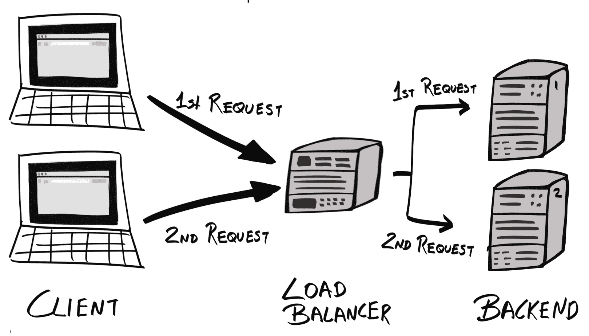

虽然轮询是最简单的实现方案，但它假设所有节点都是平等的——在可用资源、当前负载和网络拥塞方面。这通常不是情况。因此，通常使用**动态轮询**，它将更多流量路由到具有更多可用资源或负载较低的宿主。

+   **故障转移**：请求被路由到单个 *主* 实例。如果主实例失败，后续请求将被路由到不同的 *辅助* 或 *备用* 实例：

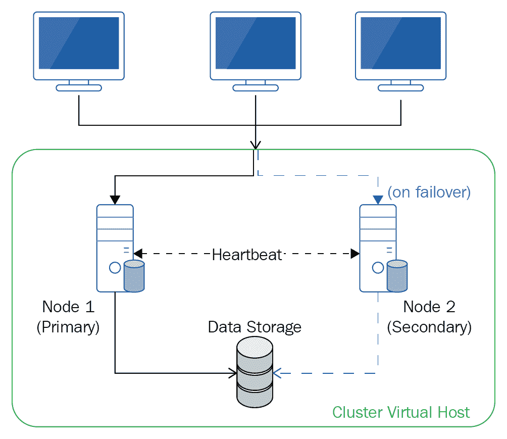

就像所有事物一样，每种方法都有其优缺点：

+   **资源利用率**：使用故障转移方法，任何时候只有一个实例在运行；这意味着你将支付那些不贡献于你应用程序的正常运行，也不提高其性能或吞吐量的服务器资源。另一方面，负载均衡的目标是最大化资源利用率；提供高可用性只是一个有用的副作用。

+   **有状态性**：有时，故障转移是唯一可行的方案。许多现实世界中的，可能是遗留的应用程序是有状态的，如果同时运行多个应用程序实例，状态可能会损坏。尽管你可以重构应用程序以适应这种情况，但仍然是一个事实，并非所有应用程序都可以在负载均衡器后面提供服务。

+   **可伸缩性**：使用故障转移，为了提高性能和吞吐量，你必须垂直扩展（通过增加其资源）主节点。使用负载均衡，你可以垂直和水平扩展（通过添加更多机器）。

由于我们的应用程序是无状态的，因此使用分布式负载均衡器更有意义，因为它允许我们充分利用所有资源并提供更好的性能。

# 负载均衡

负载均衡可以通过多种方式实现——使用 DNS 进行负载分配，或者使用第四层或第七层负载均衡器。

# DNS 负载均衡

一个域名可以配置其 DNS 设置，使其与多个 IP 地址相关联。当客户端尝试将域名解析为 IP 地址时，它会返回一个包含所有 IP 地址的列表。大多数客户端随后会将请求发送到列表中的第一个 IP 地址。

DNS 负载均衡是在每次进行新的名称解析请求时，DNS 改变这些地址的顺序。最常见的是，这是以轮询的方式完成的。

使用这种方法，客户端请求应该在所有后端服务器之间均匀分配。然而，在 DNS 层面的负载均衡有一些主要的缺点：

+   **缺乏健康检查**：DNS 不监控服务器的健康状态。即使列表中的某个服务器宕机，它仍然会返回相同的 IP 地址列表。

+   更新和传播 DNS 记录到所有 *根服务器*、中间 DNS 服务器（*解析器*）和客户端可能需要几分钟到几小时的时间。此外，大多数 DNS 服务器都会缓存它们的 DNS 记录。这意味着在 DNS 记录更新后，请求可能仍然被路由到已失败的服务器。

# 第四层/第七层负载均衡器

另一种负载均衡客户端请求的方法是使用一个 *负载均衡器*。我们不是在多个 IP 地址上公开后端服务器并让客户端选择使用哪个服务器，而是可以将我们的后端服务器隐藏在私有本地网络后面。当客户端想要访问我们的应用程序时，它会将请求发送到负载均衡器，负载均衡器会将请求转发到后端。

通常来说，负载均衡器有两种类型——第 4 层（L4）、第 7 层（L7）。它们的名称与 **开放系统互连**（**OSI**）参考模型中的相应层相关——这是一个将通信系统划分为抽象层的标准概念模型：


每一层都有许多标准协议，它们指定了数据应该如何打包和传输。例如，FTP 和 MQTT 都是应用层协议。FTP 是为文件传输设计的，而 MQTT 是为基于发布/订阅的消息传递设计的。

当负载均衡器收到一个请求时，它将决定将请求转发到哪个后端服务器。这些决策是基于请求中嵌入的信息做出的。L4 负载均衡器会使用传输层的信息，而 L7 负载均衡器可以使用应用层的信息，包括请求体本身。

# 第 4 层负载均衡器

通常来说，L4 负载均衡器使用在 OSI 模型的传输层（第 4 层）定义的信息。在互联网的上下文中，这意味着 L4 负载均衡器应该使用传输控制协议（TCP）数据包的信息。然而，实际上，L4 负载均衡器也使用来自互联网协议（IP）数据包的信息，这是第 3 层——*网络*层。因此，“第 4 层”这个名字应该被认为是一个误称。

具体来说，L4 负载均衡器根据源/目的 IP 地址和端口路由请求，对数据包的内容不予理会。

通常，L4 负载均衡器以运行专有芯片和/或软件的专用硬件设备的形式出现。

# 第 7 层负载均衡

第 7 层（L7）负载均衡器与 L4 负载均衡器类似，但使用 OSI 模型中最顶层——*应用*层的信息。对于我们的 API 等网络服务，使用的是超文本传输协议（HTTP）。

L7 负载均衡器可以使用来自 URL、HTTP 头部（例如，`Content-Type`）、cookies、消息体内容、客户端 IP 地址以及其他信息来路由请求。

通过在应用层工作，L7 负载均衡器相对于 L4 负载均衡器有以下几个优势：

+   **更智能**：因为 L7 负载均衡器可以根据更多信息（如客户端的地理位置数据）制定路由规则，所以它们可以提供比 L4 负载均衡器更复杂的路由规则。

+   **更多功能**：因为 L7 负载均衡器可以访问消息内容，它们能够修改消息，例如加密和/或压缩正文。

+   **云负载均衡**：因为 L4 负载均衡器通常是硬件设备，云提供商通常不允许你配置它们。相比之下，L7 负载均衡器通常是软件，可以完全由开发者管理。

+   **调试的简便性**：他们可以使用 cookie 来确保相同的客户端访问相同的后端服务器。如果你实现了“粘性会话”等有状态逻辑，这是必须的，但在调试时也有优势——你只需要解析一个后端服务器的日志，而不是所有服务器的日志。

然而，L7 负载均衡器并不总是比它们的 L4 对应物“更好”。L7 负载均衡器需要更多的系统资源，并且具有高延迟，因为它必须考虑更多的参数。然而，这种延迟并不足以让我们担心。

目前市场上有一些现成的 L7 负载均衡器——**高可用代理**（**HAProxy**）、NGINX 和 Envoy。我们将在本章后面探讨在后台服务器前部署分布式负载均衡器。

# 高可靠性

可靠性是衡量对系统信心的指标，并且与故障概率成反比。

可靠性是通过几个指标来衡量的：

+   **平均故障间隔时间**（**MTBF**）：正常运行时间/故障次数

+   **平均修复时间**（**MTTR**）：团队修复故障并使系统恢复在线的平均时间

# 测试可靠性

提高可靠性的最简单方法是增加系统的测试覆盖率。当然，这假设那些测试是有意义的测试。

测试通过以下方式提高可靠性：

+   提高 MTBF：你的测试越彻底，你越有可能在系统部署之前捕捉到错误。

+   降低 MTTR：这是因为历史测试结果会告诉你最后一个通过所有测试的版本。如果应用程序出现高故障率，那么团队可以快速回滚到最后一个已知良好的版本。

# 高带宽

带宽是衡量在给定时间间隔内可以满足的请求数量的指标。

系统的带宽取决于几个因素：

+   **网络延迟**：消息从客户端到我们的应用程序所需的时间，以及应用程序不同组件之间所需的时间

+   **性能**：程序本身的计算速度

+   **并行性**：请求是否可以并行处理

我们可以使用以下策略来提高带宽：

+   在地理上靠近客户端部署我们的应用程序：通常，这减少了请求必须通过代理服务器跳转的次数，从而降低了网络延迟。我们还应该将相互依赖的组件部署在附近，最好是在同一个数据中心内。这也有助于降低网络延迟。

+   确保服务器拥有足够的资源：这确保了您服务器上的 CPU 足够快，并且服务器有足够的内存来执行其任务，而无需使用交换内存。

+   在负载均衡器后面部署应用程序的多个实例：这允许同时处理对应用程序的多个请求。

+   确保您的应用程序代码是非阻塞的：JavaScript 是一种异步语言。如果您编写同步、阻塞代码，则在等待同步操作完成时，将阻止其他操作执行。

# 高可扩展性

可扩展性是衡量系统在处理更高需求的同时，仍能保持相同性能水平的能力的指标。

需求可能源于用户采用率的持续增长，也可能是因为流量突然高峰（例如，食品配送应用程序在午餐时间可能会收到更多请求）。

一个高度可扩展的系统应不断监控其组成部分，并识别那些工作在“安全”资源限制之上的组件，并对其进行横向或纵向扩展。

我们可以通过两种方式提高可扩展性：

+   垂直扩展或*向上扩展*：增加现有服务器的资源量（例如，CPU、RAM、存储、带宽）

+   横向扩展或*扩展出去*：向现有集群添加服务器

垂直扩展很简单，但机器可以处理的 CPU、RAM、带宽、端口甚至进程的数量总是有一个限制。例如，许多内核对其可以处理的进程数量有一个限制：

```js
$ cat /proc/sys/kernel/pid_max
32768
```

横向扩展允许您拥有更高的资源最大限制，但同时也带来了自己的挑战。服务的一个实例可能持有一些必须在不同实例之间同步的临时状态。

然而，由于我们的 API 是“无状态的”（在这种意义上，所有状态都在我们的数据库中，而不是在内存中），横向扩展带来的问题较少。

# 集群和微服务

为了使我们的系统具有高可用性、可靠性、可扩展性和高吞吐量，我们必须设计一个系统：

+   弹性/持久：能够承受组件故障

+   弹性：每个服务和资源可以根据需求快速增长和缩小

通过将单体应用程序分解成许多更小的*无状态*组件（遵循微服务架构）并在集群中部署它们，可以实现这样的系统。

# 微服务

与提供一个满足许多关注点的单体代码库相比，你可以将应用程序分解成许多服务，当它们协同工作时，就构成了整个应用程序。每个服务应该：

+   有一个或非常少的关注点

+   与其他服务解耦

+   如果可能的话，保持无状态


在单体应用程序中，所有组件必须作为一个单一单元一起部署。如果你想要扩展应用程序，你必须通过部署更多单体实例来扩展。此外，由于不同服务之间没有明确的边界，你经常会发现代码库中存在紧密耦合的代码。另一方面，微服务架构将每个服务作为一个独立的、独立的实体。你可以通过仅复制所需的服务来扩展。此外，你可以在不同的架构上部署服务，甚至可以使用不同的供应商。

一个服务应该向其他服务公开一个 API 以进行交互，但除此之外，它应该独立于其他服务。这意味着服务可以独立部署和管理。

编写一个允许微服务架构的应用程序可以使我们实现高可扩展性——管理员可以简单地生成更多需求服务的实例。因为服务之间是独立的，所以它们可以独立部署和管理。

我们已经使我们的应用程序无状态并容器化，这两者都使得实现微服务架构变得更加容易。

# 集群

为了实现可靠和可扩展的基础设施，我们必须提供冗余。这意味着在以下方面的冗余：

+   **硬件**：我们必须在多个物理主机上部署我们的应用程序，每个（理想情况下）在不同的地理位置。这样，如果一个数据中心离线或被摧毁，其他数据中心部署的服务可以保持我们的应用程序运行。

+   **软件**：我们必须也部署我们服务的多个实例；这样，处理请求的负载就可以在这些实例之间分配。因此，这带来了以下好处：

    +   我们可以将用户路由到提供最快响应时间的服务器（通常是地理位置上离用户最近的服务器）

    +   我们可以关闭一个服务，更新它，然后将其重新上线，而不会影响整个应用程序的运行时间

在集群上部署应用程序可以使你拥有硬件冗余，负载均衡器提供软件冗余。

集群由一组主机/服务器（称为节点）的网络组成。一旦这些节点被配置，你就可以在它们内部部署你服务的实例。接下来，你需要配置一个负载均衡器，它位于服务之前，并将请求分配给拥有最多可用服务的节点。

通过在集群上部署冗余服务，它可以确保：

+   **高可用性**：如果服务器变得不可用，无论是由于故障还是计划维护，负载均衡器可以实施**故障转移**机制，并将请求重新分配到健康的实例。

+   **高可靠性**：冗余实例消除了**单点故障**。这意味着我们的整个系统变得**容错**。

+   **高吞吐量**：通过在地理区域跨多个服务实例，它允许低延迟。

这可能实现为一个**廉价服务器冗余阵列**（**RAIS**），服务器的 RAID 等效，或者称为**廉价磁盘冗余阵列**。每当服务器出现故障时，服务仍然可以通过从健康服务器提供服务来保持可用。

然而，如果你使用像 DigitalOcean 这样的云服务提供商，他们将为你处理硬件冗余。我们剩下的只是部署我们的集群并配置我们的负载均衡器。

# 集群管理

在集群内部以微服务方式部署我们的应用程序在原则上足够简单，但实际上实施起来相当复杂。

首先，你必须**配置**服务器以作为集群内的节点。然后，我们需要设置一些相互协作以管理集群的工具。这些工具可以分为两组：

+   **集群级工具**：在集群级别工作，并做出影响整个集群的全局决策。

+   **节点级工具**：位于每个节点内部。它从集群级工具接收指令，并反馈给集群级工具，以协调节点内运行的服务管理。

对于集群级工具，你需要以下工具：

+   **调度器**：这决定了特定服务将部署在哪个节点上。

+   **发现服务**：记录每个服务的实例数量，它们的状态（例如，启动、运行、终止等），它们部署的位置等。它允许进行**服务发现**。

+   **全局配置存储**：存储集群配置，如常见环境变量。

在节点级别，你需要以下工具：

+   **本地配置管理工具**：用于保持本地配置状态并与集群级配置同步。我们将集群配置存储在全局配置存储中；然而，我们还需要一种方法将那些设置检索到每个节点。此外，当这些配置发生变化时，我们需要一种方法来获取更新的配置，并在必要时重新加载应用程序/服务。`confd`（[`github.com/kelseyhightower/confd`](https://github.com/kelseyhightower/confd)）是最受欢迎的工具。

+   **容器运行时**：由于一个节点被分配来运行一个服务，它必须具备执行此操作所需的程序。大多数在现代微服务基础设施上部署的服务使用容器来封装服务。因此，所有主要的集群管理工具都将捆绑某种类型的容器运行时，例如 Docker。

现在，让我们更详细地查看每个集群级工具。

# 集群级工具

如前所述，集群级工具在集群级别工作，并做出影响整个集群的全局决策。

# 发现服务

目前，我们的 API 容器可以与我们的 Elasticsearch 容器通信，因为它们在底层连接到同一网络，在同一台主机机器上：

```js
$ docker network ls
NETWORK ID NAME DRIVER SCOPE
d764e66872cf bridge bridge local
61bc0ca692fc host host local
bdbbf199a4fe none null local

$ docker network inspect bridge --format='{{range $index, $container := .Containers}}{{.Name}} {{end}}'
elasticsearch hobnob
```

然而，如果这些容器部署在不同的机器上，使用不同的网络，它们如何相互通信？

我们的 API 容器必须获取 Elasticsearch 容器的网络信息，以便能够向其发送请求。一种方法是使用*服务发现*工具。

使用服务发现，每当一个新的容器（运行一个服务）初始化时，它会将自己注册到**发现服务**，提供关于自己的信息，包括其 IP 地址。然后，**发现服务**将此信息存储在简单的键值存储中。

服务应定期更新**发现服务**的状态，以便发现服务在任何时候都能保持服务的最新状态。

当一个新的服务启动时，它将查询**发现服务**以请求有关它需要连接的服务的信息，例如它们的 IP 地址。然后，**发现服务**将从其键值存储中检索此信息并将其返回给新的服务：

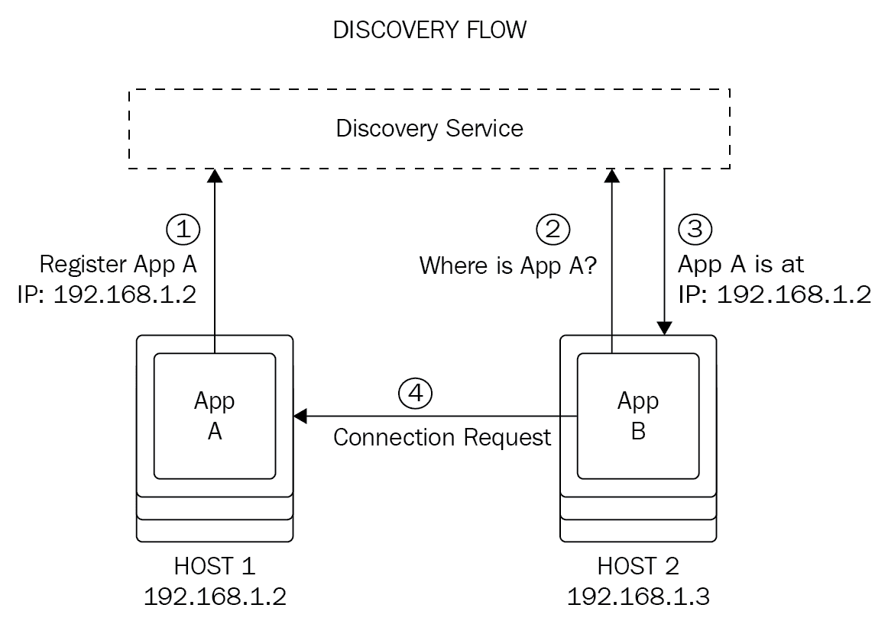

因此，当我们以集群形式部署我们的应用程序时，我们可以使用服务发现工具来简化我们的 API 与 Elasticsearch 服务的通信。

流行的服务发现工具包括以下：

+   `etcd`，由 CoreOS 提供([`github.com/coreos/etcd`](https://github.com/coreos/etcd))

+   Consul，由 HashiCorp 提供([`www.consul.io/`](https://www.consul.io/))

+   Zookeeper，由 Yahoo 提供，现在是 Apache 软件基金会的一部分([`zookeeper.apache.org/`](https://zookeeper.apache.org/))

# 调度器

虽然**发现服务**持有关于每个服务状态和位置的信息，但它不会决定服务应该部署在哪个主机/节点上。这个过程被称为**主机选择**，是**调度器**的职责：

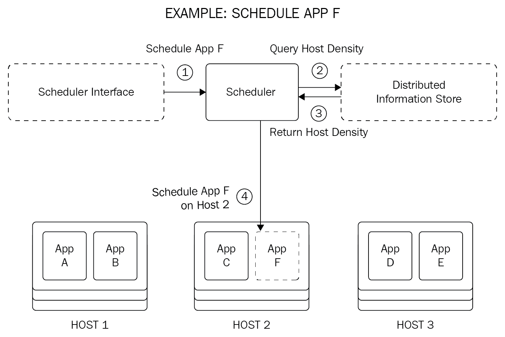

调度器的决策可以基于一组规则，称为**策略**，这些策略考虑以下因素：

+   请求的性质。

+   集群配置/设置。

+   **主机密度**：表示节点上主机系统繁忙程度的指标。如果集群内有多个节点，我们应该优先在主机密度最低的节点上部署任何新的服务。此信息可以从发现服务中获得，该服务包含有关所有已部署服务的所有信息。

+   **服务（反）亲和性**：是否应将两个服务部署在同一主机上。这取决于：

    +   **冗余需求**：如果存在其他未运行该服务的节点，则不应在同一节点（们）上部署相同的应用程序。例如，如果我们的 API 服务已经部署在三个主机中的两个上，则调度器可能更喜欢在剩余的主机上部署以确保最大冗余。

    +   **数据局部性**：调度器应尝试将计算代码放置在它需要消费的数据旁边，以减少网络延迟。

+   **资源需求**：节点上运行的现有服务以及要部署的服务

+   硬件/软件限制

+   由集群管理员设定的其他策略/规则

# 全局配置存储

通常，就像我们的服务一样，在服务成功运行之前需要设置环境变量。到目前为止，我们通过使用`docker run`的`--env-file`标志指定了要使用的环境变量：

```js
$ docker run --env-file ./.env --name hobnob -d -p 8080:8080 hobnob:0.1.0
```

然而，当在集群上部署服务时，我们不再手动运行每个容器——我们让调度器和节点级工具为我们做这件事。此外，我们需要所有服务共享相同的环境变量。因此，最明显的解决方案是提供一个*全局配置存储*，该存储存储要在所有节点和服务之间共享的配置。

# 配置工具

配置意味着启动新的主机（无论是物理的还是虚拟的）并配置它们，以便它们可以运行集群管理工具。配置完成后，主机即可成为集群内的节点并接收工作。

这可能涉及使用基础设施管理工具如 Terraform 来启动新主机，以及配置管理工具如 Puppet、Chef、Ansible 或 Salt，以确保每个主机内部的配置设置彼此一致。

虽然在部署我们的应用程序之前可以进行配置，但大多数集群管理软件都内置了配置组件。

# 选择集群管理工具

必须单独管理这些不同的集群管理组件是繁琐且容易出错的。幸运的是，存在集群管理工具，它们提供了一个公共 API，允许我们以一致和自动化的方式配置这些工具。您将使用集群管理工具的 API 而不是单独操作每个组件。

集群管理工具也被称为*集群编排工具*或*容器编排工具*。尽管不同术语之间可能存在细微差别，但为了本章的目的，我们可以将它们视为相同。

目前有几种流行的集群管理工具可用：

+   Marathon ([`mesosphere.github.io/marathon/`](https://mesosphere.github.io/marathon/))：由 Mesosphere 开发，运行在 Apache Mesos 上。

+   Swarm ([`docs.docker.com/engine/swarm/`](https://docs.docker.com/engine/swarm/))：Docker 引擎包含一种**集群模式**，用于管理称为**swarm**的集群中的 Docker 容器。您还可以使用 Docker Compose 将某些容器组合在一起。

+   Kubernetes：**事实上的**集群管理工具。

我们将使用 Kubernetes，因为它拥有最成熟的生态系统，并且是**事实上的**行业标准。

# 控制平面和组件

我们之前描述的组件——调度器、发现服务、全局配置存储等——是所有现有集群管理工具的共同点。它们之间的区别在于它们如何打包这些组件并抽象出细节。在 Kubernetes 中，这些组件被恰当地命名为 Kubernetes **组件**。

我们将通过使用大写字母来区分 Kubernetes 组件的通用“组件”。

在 Kubernetes 术语中，一个“组件”是一个实现 Kubernetes 集群系统某个部分的进程；例如包括`kube-apiserver`和`kube-scheduler`。所有组件的总和构成了您所认为的“Kubernetes 系统”，正式名称为**控制平面**。

与我们将集群工具分类为集群级工具和节点级工具的方式类似，Kubernetes 将 Kubernetes 组件分别分类为**主组件**和**节点组件**。节点组件在其运行的节点内操作；主组件与多个节点或整个集群一起工作，持有集群级设置、配置和状态，并做出集群级决策。主组件共同构成了**主控制平面**。

Kubernetes 还提供了**附加组件**——这些组件不是严格必需的，但提供了诸如 Web UI、指标和日志记录等有用的功能。

在这个术语的基础上，让我们比较我们描述的通用集群架构与 Kubernetes 的架构。

# 主组件

发现服务、全局配置存储和调度器是用`etcd`和`kube-scheduler`主组件实现的：

+   `etcd`是一个一致且高可用的**键值存储**（**KV**），用作发现服务和全局配置存储。

    由于发现服务和全局配置存储都包含有关服务的信息，并且所有节点都可以访问它们，因此`etcd`可以同时服务于这两个目的。每当服务向发现服务注册时，它也会收到一组配置设置。

+   `kube-scheduler`是一个调度器。它跟踪哪些应用程序尚未分配给节点（因此尚未运行），并决定将其分配给哪个节点。

除了这些基本的集群管理组件之外，Kubernetes 还提供了额外的 Master 组件，以使使用 Kubernetes 更加容易。

默认情况下，所有 Master 组件都在单个 *Master Node* 上运行，该节点只运行 Master 组件而不运行其他容器/服务。然而，它们可以被配置为进行复制，以提供冗余。

# kube-apiserver

Kubernetes 以守护进程的形式运行，暴露了一个 RESTful Kubernetes API 服务器——`kube-apiserver`。`kube-apiserver` 充当主控制平面的接口。你不需要单独与每个 Kubernetes 组件通信，而是向 `kube-apiserver` 发起调用，它将代表你与每个组件通信：

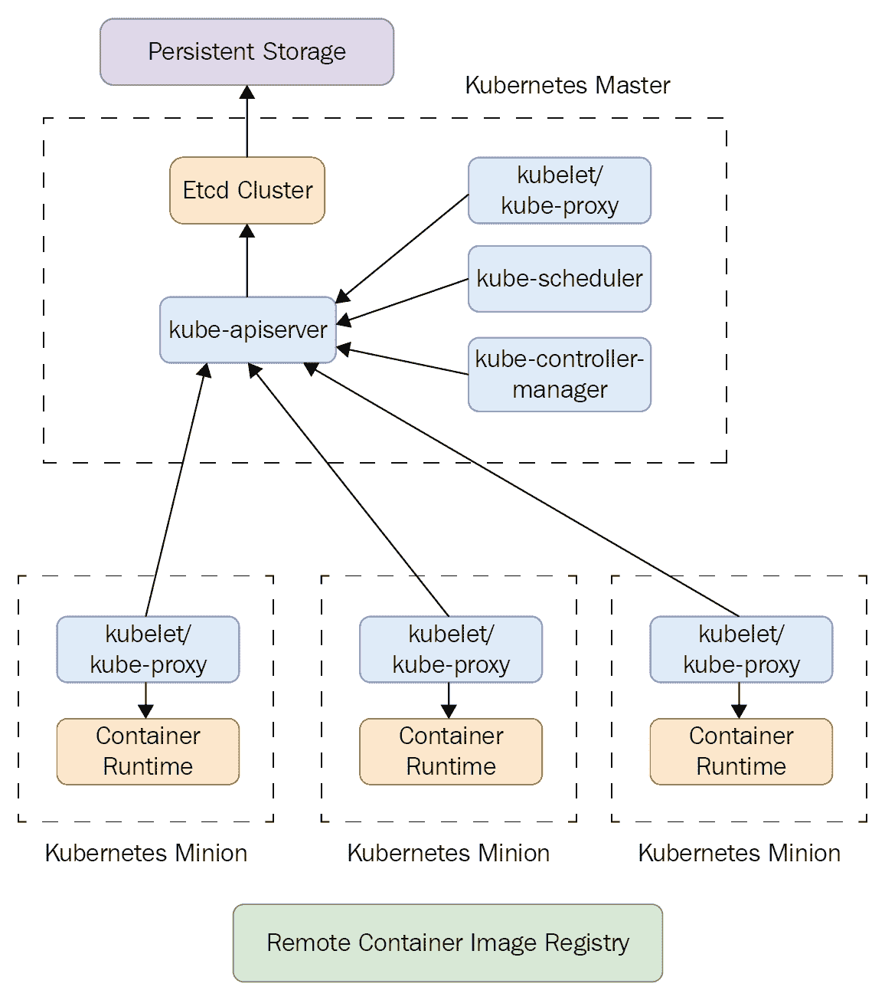

这带来了许多好处，包括以下内容：

+   你有一个中心位置，所有更改都会通过这个位置。这允许你记录集群中发生的一切的历史。

+   API 提供了统一的语法。

# kube-control-manager

正如我们稍后将要展示的，Kubernetes 的一个核心概念，以及你最初使用集群管理工具的原因，就是你不需要 *手动* 操作集群。

这样做将包括向一个组件发送请求，接收响应，然后根据该响应向另一个组件发送另一个请求。这是 *命令式* 方法，因为它需要你手动编写程序来实现这种逻辑，所以比较耗时。

相反，Kubernetes 允许我们通过配置文件指定我们集群的期望状态，Kubernetes 将自动协调不同的 Kubernetes 组件来实现这一目标。这是一种 *声明式* 方法，也是 Kubernetes 推荐的方法。

将这一点与我们已知的内容联系起来，整个 Kubernetes 系统（控制平面）的工作就变成了一个试图使集群的当前状态与期望状态保持一致的系统。

Kubernetes 通过 *控制器* 来完成这项工作。控制器是执行保持集群状态与期望状态一致的实际动作的进程。

有许多类型的控制器；以下有两个例子：

+   节点控制器，用于确保集群有期望数量的节点。例如，当一个节点失败时，节点控制器负责启动一个新的节点。

+   副本控制器，用于确保每个应用程序都有期望数量的副本。

一旦我们解释了 Kubernetes 对象并在 Kubernetes 上部署了第一个服务，`kube-controller-manager` 的控制器角色就会变得更加清晰。

# 节点组件

节点级工具在 Kubernetes 中作为节点组件实现。

# 容器运行时

Kubernetes 在容器内运行应用程序和服务，并期望集群中的每个节点都已经安装了相应的容器运行时；这可以通过像 Terraform 这样的配置工具来完成。

然而，它并不指定任何特定的容器格式，只要它是遵循**开放容器倡议**（**OCI**）的运行时规范（[`github.com/opencontainers/runtime-spec`](https://github.com/opencontainers/runtime-spec)）的格式。例如，你可以使用 Docker、rkt（由 CoreOS 提供）或 runc（由 OCI 提供）/ CRI-O（由 Kubernetes 团队提供）作为容器格式和运行时。

# kubelet

在通用的集群架构中，我们的集群需要一个本地的配置管理工具，如`confd`，从发现服务和全局配置存储中拉取更新。这确保了在节点上运行的应用程序正在使用最新的参数。

在 Kubernetes 中，这是`kubelet`的工作。然而，`kubelet`不仅仅只是更新本地配置和重启服务。它还监控每个服务，确保它们正在运行并且健康，并通过`kube-apiserver`将它们的状态报告回`etcd`。

# kube-proxy

在集群中部署的每个应用程序（包括副本）都被分配了虚拟 IP。然而，随着应用程序的关闭和重新部署到其他地方，它们的虚拟 IP 可能会改变。我们将在稍后详细介绍，但 Kubernetes 提供了一个**服务**对象，为我们的最终用户提供了一个静态 IP 地址进行调用。`kube-proxy`是运行在每个节点上的网络代理，充当一个简单的负载均衡器，将来自静态 IP 地址的请求转发（或代理）到复制的应用程序之一的虚拟 IP 地址。

当我们创建服务时，`kube-proxy`的作用将变得更加明显。

# Kubernetes 对象

现在你已经了解了构成 Kubernetes 系统的不同组件，让我们将注意力转向**Kubernetes API 对象**，或简称**对象**（大写 O）。

正如你所知，在使用 Kubernetes 时，你不需要直接与单个 Kubernetes 组件交互；相反，你与`kube-apiserver`交互，API 服务器将代表你协调操作。

API 将原始进程和实体抽象成称为对象的概念。例如，你不会要求 API 服务器“在节点上运行这些相关容器的组”，而是会要求“将这个 Pod 添加到集群”。在这里，容器组被抽象为一个**Pod**对象。当我们与 Kubernetes 一起工作时，我们只是在向 Kubernetes API 发送请求来操作这些对象。

# 四个基本对象

Kubernetes 有四个基本对象：

+   **Pod**：一组紧密相关的容器，应该作为一个单一单元进行管理

+   **Service**：一个抽象，将来自静态 IP 的请求代理到运行应用程序的 Pod 的动态虚拟 IP

+   **Volume**：这为同一 Pod 内的所有容器提供共享存储

+   **Namespace**：这允许你将单个物理集群分割成多个虚拟集群

# 高级对象

这些基本对象可以在此基础上构建，形成更高级的对象：

+   **副本集**：管理一组 Pod，以确保在集群内保持指定数量的副本

+   **部署**：比副本集更高层次的概念，部署对象将管理副本集以确保运行正确的副本数量，同时允许您更新配置以更新/部署新的副本集。

+   **有状态集**：类似于部署，但在部署中，当 Pod 重启（例如，由于调度）时，旧 Pod 将被销毁并创建一个新的 Pod。尽管这些 Pod 使用相同的规范创建，但它们是不同的 Pod，因为前一个 Pod 的数据没有持久化。在有状态集中，旧 Pod 可以在重启之间持久其状态。

+   **DaemonSet**：类似于副本集，但与指定要运行的副本数量不同，DaemonSet 旨在在集群的每个节点上运行。

+   **作业**：与无限期运行 Pod 不同，作业对象会生成新的 Pod 来执行具有有限时间线的任务，并在任务完成后确保 Pod 成功终止。

上述高级对象依赖于四个基本对象。

# 控制器

这些高级对象由*控制器*运行和管理，实际上执行操作以操纵对象。

例如，当我们创建一个部署时，*部署控制器*管理配置中指定的 Pod 和副本集。负责将实际状态更改为所需状态的正是这个控制器。

大多数对象都有一个相应的控制器——副本集对象由副本集控制器管理，DaemonSet 由 DaemonSet 控制器管理，依此类推。

除了这些，还有许多其他的控制器，其中最常见的列如下：

+   **节点控制器**：负责在节点掉线时注意到并做出响应

+   **副本控制器**：负责维护系统中每个副本控制器对象正确的 Pod 数量

+   **路由控制器**

+   **卷控制器**

+   **服务控制器**：在负载均衡器上工作，并将请求直接发送到相应的 Pod

+   **端点控制器**：填充端点对象，该对象将服务对象和 Pod 连接起来

+   **服务账户和令牌控制器**：为新的命名空间创建默认账户和 API 访问令牌

这些高级对象及其控制器代表您管理基本对象，提供在使用集群管理工具时您期望的额外便利。我们将在此章的后面部分演示这些对象的使用，我们将迁移应用程序以在 Kubernetes 上运行。

# 设置本地开发环境

现在您已经了解了 Kubernetes 的不同组件以及 API 提供的抽象（对象），我们准备将我们的应用程序部署迁移到使用 Kubernetes。在本节中，我们将通过在我们的本地机器上运行 Kubernetes 来学习 Kubernetes 的基础知识。在本章的后面部分，我们将基于我们所学的内容，在多个 VPS 上部署我们的应用程序，这些 VPS 由云服务提供商管理。

# 检查硬件要求

要在本地运行 Kubernetes，您的机器需要满足以下硬件要求：

+   至少有 2 GB 的可用 RAM

+   拥有两个或更多 CPU 核心

+   交换空间已禁用

确保您正在使用满足这些要求的机器。

# 清理我们的环境

由于 Kubernetes 为我们管理应用程序容器，我们不再需要管理自己的 Docker 容器。因此，让我们通过删除与我们的应用程序相关的任何 Docker 容器和镜像来提供一个干净的工作环境。您可以通过运行`docker ps -a`和`docker images`来查看所有容器和镜像的列表，然后使用`docker stop <container>`、`docker rm <container>`和`docker rmi <image>`来删除相关的容器和镜像。

# 禁用交换内存

在本地运行 Kubernetes 需要您关闭交换内存。您可以通过运行`swapoff -a`来实现：

```js
$ sudo swapoff -a
```

# 安装 kubectl

虽然我们可以通过使用像`curl`这样的程序发送原始 HTTP 请求与 Kubernetes API 交互，但 Kubernetes 提供了一个方便的命令行客户端，称为`kubectl`。让我们来安装它：

```js
$ curl -LO https://storage.googleapis.com/kubernetes-release/release/v1.10.3/bin/linux/amd64/kubectl && chmod +x ./kubectl && sudo mv ./kubectl /usr/local/bin/kubectl
```

您可以在[kubernetes.io/docs/tasks/tools/install-kubectl/](https://kubernetes.io/docs/tasks/tools/install-kubectl/)找到其他安装方法。

您可以通过运行`kubectl version`来检查安装是否成功：

```js
$ kubectl version
Client Version: version.Info{Major:"1", Minor:"10", GitVersion:"v1.10.3", GitCommit:"2bba0127d85d5a46ab4b778548be28623b32d0b0", GitTreeState:"clean", BuildDate:"2018-05-21T09:17:39Z", GoVersion:"go1.9.3", Compiler:"gc", Platform:"linux/amd64"}
```

最后，`kubectl`提供了自动补全功能；要激活它，只需运行以下代码：

```js
$ echo "source <(kubectl completion bash)" >> ~/.bashrc
```

# 安装 Minikube

Minikube 是由 Kubernetes 团队开发的一个免费开源工具，它允许您轻松地在本地运行单个节点 Kubernetes 集群。如果没有 Minikube，您将不得不自己安装和配置`kubectl`和`kubeadm`（用于提供）。

因此，让我们按照在[`github.com/kubernetes/minikube/releases`](https://github.com/kubernetes/minikube/releases)找到的说明来安装 Minikube。对于 Ubuntu，我们可以选择运行安装脚本或安装`.deb`包。

在撰写本书时，`.deb`包的安装仍然是实验性的，因此我们将选择安装脚本。例如，要安装 Minikube v0.27.0，我们可以运行以下命令：

```js
$ curl -Lo minikube https://storage.googleapis.com/minikube/releases/v0.27.0/minikube-linux-amd64 && chmod +x minikube && sudo mv minikube /usr/local/bin/
```

您可以使用相同的命令来更新`minikube`。

# 安装虚拟机管理程序或 Docker Machine

通常，Minikube 在虚拟机（VM）内部运行单个节点集群，这需要安装一个虚拟机管理程序，如 VirtualBox 或 KVM。这需要大量的设置，并且对性能不是很好。

相反，我们可以指示 Minikube 在任何 VM 之外直接在我们的机器上运行 Kubernetes 组件。这需要在我们的机器上安装 Docker 运行时和 Docker Machine。如果你遵循了我们之前的章节，Docker 运行时应该已经安装好了，所以让我们安装 Docker Machine：

```js
$ base=https://github.com/docker/machine/releases/download/v0.14.0 &&
 curl -L $base/docker-machine-$(uname -s)-$(uname -m) >/tmp/docker-machine &&
 sudo install /tmp/docker-machine /usr/local/bin/docker-machine
```

安装后，运行 `docker-machine version` 以确认安装成功：

```js
$ docker-machine version
docker-machine version 0.14.0, build 89b8332
```

在 Docker 上使用 Minikube 运行你的集群仅在 Linux 机器上可用。如果你不是使用 Linux 机器，请访问 Minikube 文档，按照设置 VM 环境和使用 VM 驱动程序的说明操作。本章的其余部分对你仍然适用。只需记住在运行 `minikube start` 时使用正确的 `--vm-driver` 标志。

# 创建我们的集群

在 Kubernetes 守护进程（由 `minikube` 安装和运行）和 Kubernetes 客户端（`kubectl`）安装后，我们现在可以运行 `minikube start` 来创建和启动我们的集群。由于我们不使用 VM，我们需要传递 `--vm-driver=none`。

如果你使用 VM，请记住使用正确的 `--vm-driver` 标志。

我们需要以 `root` 身份运行 `minikube start` 命令，因为 `kubeadm` 和 `kubelet` 二进制文件需要下载并移动到 `/usr/local/bin`，这需要 root 权限。

然而，这通常意味着在安装和初始化过程中创建和写入的所有文件都将由 `root` 拥有。这使得普通用户修改配置文件变得困难。

幸运的是，Kubernetes 提供了几个环境变量，我们可以设置以更改此设置。

# 为本地集群设置环境变量

在 `.profile`（或其等效文件，如 `.bash_profile` 或 `.bashrc`）中，在末尾添加以下行：

```js
export MINIKUBE_WANTUPDATENOTIFICATION=false
export MINIKUBE_WANTREPORTERRORPROMPT=false
export MINIKUBE_HOME=$HOME
export CHANGE_MINIKUBE_NONE_USER=true
export KUBECONFIG=$HOME/.kube/config
```

`CHANGE_MINIKUBE_NONE_USER` 告诉 `minikube` 将当前用户指定为配置文件的拥有者。`MINIKUBE_HOME` 告诉 `minikube` 将 Minikube 特定的配置存储在 `~/.minikube` 中，而 `KUBECONFIG` 告诉 `minikube` 将 Kubernetes 特定的配置存储在 `~/.kube/config` 中。

要将这些环境变量应用到当前 shell 中，请运行以下命令：

```js
$ . .profile
```

最后，我们需要在主目录下实际创建一个 `.kube/config` 配置文件：

```js
$ mkdir -p $HOME/.kube
$ touch $HOME/.kube/config
```

# 运行 minikube start

在设置好环境变量后，我们终于可以运行 `minikube start`：

```js
$ sudo -E minikube start --vm-driver=none
Starting local Kubernetes v1.10.0 cluster...
Starting VM...
Getting VM IP address...
Moving files into cluster...
Setting up certs...
Connecting to cluster...
Setting up kubeconfig...
Starting cluster components...
Kubectl is now configured to use the cluster.
```

此命令在幕后执行多个操作：

+   如果我们使用 VM，则配置任何 VM。这是由 Docker Machine 的 libmachine 内部完成的。

+   在 `./kube` 和 `./minikube` 下设置配置文件和证书。

+   使用 `localkube` 启动本地 Kubernetes 集群。

+   配置 `kubectl` 以与此集群通信。

由于我们正在本地开发并使用 `--vm-driver=none` 标志，我们的机器成为集群中唯一的节点。你可以通过使用 `kubectl` 来确认节点是否已注册到 Kubernetes API 和 `etcd`：

```js
$ kubectl get nodes
NAME STATUS ROLES AGE VERSION
minikube Ready master 15m v1.10.0
```

所有主组件，如调度器（`kube-scheduler`），以及节点组件，如 `kubelet`，都在同一个节点上，在 Docker 容器内运行。你可以通过运行 `docker ps` 来检查它们：

```js
$ docker ps -a --format "table {{.ID}}\t{{.Image}}\t{{.Command}}\t{{.Names}}"
CONTAINER ID        IMAGE                        COMMAND                  NAMES
3ff67350410a        4689081edb10                 "/storage-provisioner"   k8s_storage-provisioner_storage-provisioner_kube-system_4d9c2fa3-627a-11e8-a0e4-54e1ad13e25a_0
ec2922978b10        e94d2f21bc0c                 "/dashboard --insecu…"   k8s_kubernetes-dashboard_kubernetes-dashboard-5498ccf677-sslhz_kube-system_4d949c82-627a-11e8-a0e4-54e1ad13e25a_0
f9f5b8fe1a41        k8s.gcr.io/pause-amd64:3.1   "/pause"                 k8s_POD_storage-provisioner_kube-system_4d9c2fa3-627a-11e8-a0e4-54e1ad13e25a_0
f5b013b0278d        6f7f2dc7fab5                 "/sidecar --v=2 --lo…"   k8s_sidecar_kube-dns-86f4d74b45-hs88j_kube-system_4cbede66-627a-11e8-a0e4-54e1ad13e25a_0
f2d120dce2ed        k8s.gcr.io/pause-amd64:3.1   "/pause"                 k8s_POD_kubernetes-dashboard-5498ccf677-sslhz_kube-system_4d949c82-627a-11e8-a0e4-54e1ad13e25a_0
50ae3b880b4a        c2ce1ffb51ed                 "/dnsmasq-nanny -v=2…"   k8s_dnsmasq_kube-dns-86f4d74b45-hs88j_kube-system_4cbede66-627a-11e8-a0e4-54e1ad13e25a_0
a8f677cdc43b        80cc5ea4b547                 "/kube-dns --domain=…"   k8s_kubedns_kube-dns-86f4d74b45-hs88j_kube-system_4cbede66-627a-11e8-a0e4-54e1ad13e25a_0
d287909bae1d        bfc21aadc7d3                 "/usr/local/bin/kube…"   k8s_kube-proxy_kube-proxy-m5lrh_kube-system_4cbf007c-627a-11e8-a0e4-54e1ad13e25a_0
e14d9c837ae4        k8s.gcr.io/pause-amd64:3.1   "/pause"                 k8s_POD_kube-dns-86f4d74b45-hs88j_kube-system_4cbede66-627a-11e8-a0e4-54e1ad13e25a_0
896beface410        k8s.gcr.io/pause-amd64:3.1   "/pause"                 k8s_POD_kube-proxy-m5lrh_kube-system_4cbf007c-627a-11e8-a0e4-54e1ad13e25a_0
9f87d1105edb        52920ad46f5b                 "etcd --listen-clien…"   k8s_etcd_etcd-minikube_kube-system_a2c07ce803646801a9f5a70371449d58_0
570a4e5447f8        af20925d51a3                 "kube-apiserver --ad…"   k8s_kube-apiserver_kube-apiserver-minikube_kube-system_8900f73fb607cc89d618630016758228_0
87931be974c0        9c16409588eb                 "/opt/kube-addons.sh"    k8s_kube-addon-manager_kube-addon-manager-minikube_kube-system_3afaf06535cc3b85be93c31632b765da_0
897928af3c85        704ba848e69a                 "kube-scheduler --ad…"   k8s_kube-scheduler_kube-scheduler-minikube_kube-system_31cf0ccbee286239d451edb6fb511513_0
b3a7fd175e47        ad86dbed1555                 "kube-controller-man…"   k8s_kube-controller-manager_kube-controller-manager-minikube_kube-system_c871518ac418f1edf0247e23d5b99a40_0
fd50ec94b68f        k8s.gcr.io/pause-amd64:3.1   "/pause"                 k8s_POD_kube-apiserver-minikube_kube-system_8900f73fb607cc89d618630016758228_0
85a38deae7ad        k8s.gcr.io/pause-amd64:3.1   "/pause"                 k8s_POD_etcd-minikube_kube-system_a2c07ce803646801a9f5a70371449d58_0
326fd83d6630        k8s.gcr.io/pause-amd64:3.1   "/pause"                 k8s_POD_kube-addon-manager-minikube_kube-system_3afaf06535cc3b85be93c31632b765da_0
e3dd5b372dab        k8s.gcr.io/pause-amd64:3.1   "/pause"                 k8s_POD_kube-scheduler-minikube_kube-system_31cf0ccbee286239d451edb6fb511513_0
6c2ac7c363d0        k8s.gcr.io/pause-amd64:3.1   "/pause"                 k8s_POD_kube-controller-manager-minikube_kube-system_c871518ac418f1edf0247e23d5b99a40_0
```

作为最后的检查，运行 `systemctl status kubelet.service` 来确保 `kubelet` 在节点上作为守护进程运行：

```js
$ sudo systemctl status kubelet.service
● kubelet.service - kubelet: The Kubernetes Node Agent
 Loaded: loaded (/lib/systemd/system/kubelet.service; enabled; vendor preset: enable
 Drop-In: /etc/systemd/system/kubelet.service.d
 └─10-kubeadm.conf
 Active: active (running) since Mon 2018-05-28 14:22:59 BST; 2h 5min ago
 Docs: http://kubernetes.io/docs/
 Main PID: 23793 (kubelet)
 Tasks: 18 (limit: 4915)
 Memory: 55.5M
 CPU: 8min 28.571s
 CGroup: /system.slice/kubelet.service
 └─23793 /usr/bin/kubelet --fail-swap-on=false --allow-privileged=true --clu
```

现在一切都已经设置好了。你可以通过运行 `minikube status` 和 `kubectl cluster-info` 来确认：

```js
$ minikube status
minikube: Running
cluster: Running
kubectl: Correctly Configured: pointing to minikube-vm at 10.122.98.148

$ kubectl cluster-info
Kubernetes master is running at https://10.122.98.148:8443
KubeDNS is running at https://10.122.98.148:8443/api/v1/namespaces/kube-system/services/kube-dns:dns/proxy
```

# 更新上下文

如果你更改了计算机连接的本地网络，集群的 IP 可能会改变。如果你在此更改后尝试使用 `kubectl` 连接到集群，你会看到一个错误，表明“网络不可达”：

```js
$ kubectl cluster-info
Kubernetes master is running at https://10.122.35.199:8443
Unable to connect to the server: dial tcp 10.122.35.199:8443: connect: network is unreachable
```

每当你看到这样的错误时，运行 `minikube status` 来检查集群的状态：

```js
$ minikube status
minikube: Running
cluster: Running
kubectl: Misconfigured: pointing to stale minikube-vm.
To fix the kubectl context, run minikube update-context
```

在这种情况下，它告诉我们 `kubectl` 正在“指向过时的 `minikube-vm`”，我们应该运行 `minikube update-context` 来更新 `kubectl` 以指向新的集群 IP：

```js
$ minikube update-context
Reconfigured kubeconfig IP, now pointing at 192.168.1.11
```

在此之后，检查 `kubectl` 是否能够与 Kubernetes API 服务器通信：

```js
$ kubectl cluster-info
Kubernetes master is running at https://192.168.1.11:8443
KubeDNS is running at https://192.168.1.11:8443/api/v1/namespaces/kube-system/services/kube-dns:dns/proxy
```

# 重置集群

与 Kubernetes 一起工作可能会很棘手，尤其是在开始时。如果你遇到问题并且无法解决，可以使用 `kubeadm reset` 来重置与我们的 Kubernetes 集群相关的所有内容，并从头开始：

```js
$ sudo kubeadm reset
[preflight] Running pre-flight checks.
[reset] Stopping the kubelet service.
[reset] Unmounting mounted directories in "/var/lib/kubelet"
[reset] Removing kubernetes-managed containers.
[reset] No etcd manifest found in "/etc/kubernetes/manifests/etcd.yaml". Assuming external etcd.
[reset] Deleting contents of stateful directories: [/var/lib/kubelet /etc/cni/net.d /var/lib/dockershim /var/run/kubernetes]
[reset] Deleting contents of config directories: [/etc/kubernetes/manifests /etc/kubernetes/pki]
[reset] Deleting files: [/etc/kubernetes/admin.conf /etc/kubernetes/kubelet.conf /etc/kubernetes/bootstrap-kubelet.conf /etc/kubernetes/controller-manager.conf /etc/kubernetes/scheduler.conf]
```

现在尝试一下。然后，运行之前相同的 `minikube start` 命令来重新创建集群：

```js
$ sudo -E minikube start --vm-driver=none
$ minikube status
minikube: Running
cluster: Running
kubectl: Correctly Configured: pointing to minikube-vm at 192.168.1.11
$ kubectl cluster-info
Kubernetes master is running at https://192.168.1.11:8443
KubeDNS is running at https://192.168.1.11:8443/api/v1/namespaces/kube-system/services/kube-dns:dns/proxy
```

# 创建我们的第一个 Pod

现在我们已经在本地运行了一个集群，让我们在上面部署我们的 Elasticsearch 服务。使用 Kubernetes，所有服务都在容器内运行。对我们来说，幸运的是，我们已经熟悉 Docker，而 Kubernetes 支持 Docker 容器格式。

然而，Kubernetes 并不是实际单独部署容器，而是部署 *Pods*。如前所述，Pods 是一种基本的 Kubernetes 对象——由 Kubernetes API 提供的抽象。具体来说，Pods 是应该一起部署和管理的容器的逻辑分组。在 Kubernetes 中，Pods 也是 Kubernetes 管理的最低级单元。

同一个 Pod 内的容器共享以下内容：

+   **生命周期**：Pod 内的所有容器作为一个单一单元进行管理。当 Pod 启动时，Pod 内的所有容器都将启动（这被称为 **共享命运**）。当 Pod 需要迁移到不同的节点时，Pod 内的所有容器都将迁移（也称为 **协同调度**）。

+   **上下文**：Pod 与其他 Pod 的隔离方式类似于一个 Docker 容器与另一个 Docker 容器的隔离方式。事实上，Kubernetes 使用相同的命名空间和分组机制来隔离 Pod。

+   **共享网络**：Pod 内的所有容器共享相同的 IP 地址和端口空间，并且可以使用 `localhost:<port>` 互相通信。它们也可以使用进程间通信（IPC）互相通信。

+   **共享存储**：容器可以访问一个将在容器外部持久化的共享卷，即使容器重启，卷也会存在：

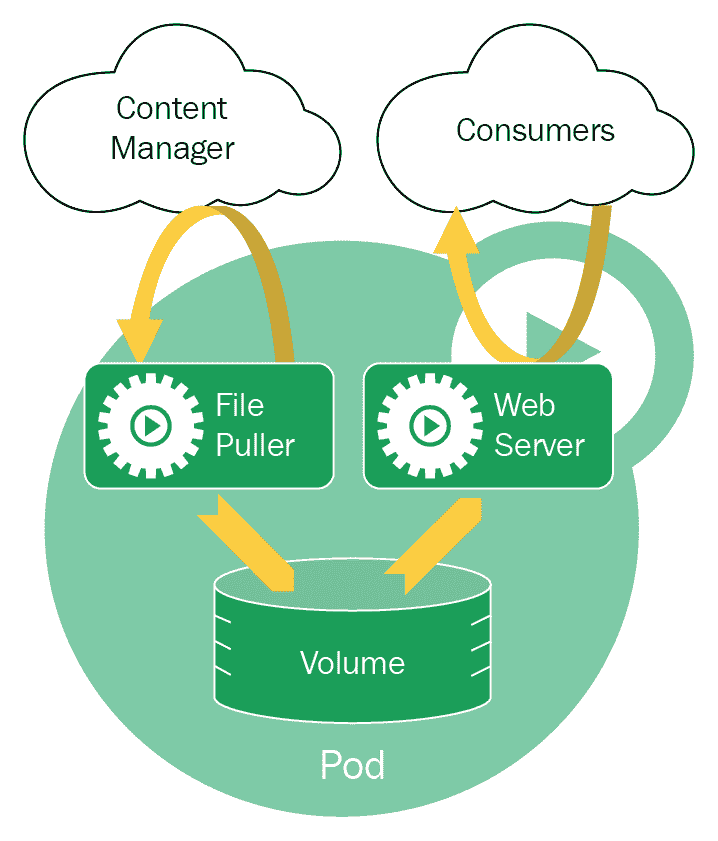

# 使用 kubelet 运行 Pod

Pods 由运行在每个节点内部的`kubelet`服务运行。有三种方式可以指导`kubelet`运行一个 Pod：

+   通过直接传递 Pod 配置文件（或包含配置文件的目录）使用`kubelet --config <path-to-pod-config>`。`kubelet`将每 20 秒轮询此目录以查找更改，并根据配置文件（的）任何更改启动新容器或终止容器。

+   通过指定一个返回 Pod 配置文件的 HTTP 端点。就像文件选项一样，`kubelet`每 20 秒轮询端点。

+   通过使用 Kubernetes API 服务器将任何新的 Pod 清单发送到`kubelet`。

前两个选项并不理想，因为：

+   它依赖于轮询，这意味着节点无法快速响应变化

+   Kubernetes API 服务器对这些 Pod 一无所知，因此无法管理它们

相反，我们应该使用`kubelet`将我们的意图传达给 Kubernetes API 服务器，并让它协调如何部署我们的 Pod。

# 使用`kubectl run`运行 Pod

首先，确认我们的机器上没有正在运行 Elasticsearch 容器：

```js
$ docker ps -a \
 --filter "name=elasticsearch" \
 --format "table {{.ID}}\t{{.Image}}\t{{.Command}}\t{{.Names}}"
CONTAINER ID IMAGE COMMAND NAMES
```

我们现在可以使用`kubectl run`在 Pod 内运行一个镜像，并将其部署到我们的集群：

```js
$ kubectl run elasticsearch --image=docker.elastic.co/elasticsearch/elasticsearch-oss:6.3.2 --port=9200 --port=9300
deployment.apps "elasticsearch" created
```

现在，当我们检查已部署到我们集群的 Pod 时，我们可以看到一个名为`elasticsearch-656d7c98c6-s6v58`的新 Pod：

```js
$ kubectl get pods
NAME READY STATUS RESTARTS AGE
elasticsearch-656d7c98c6-s6v58 0/1 ContainerCreating 0 9s
```

Pod 的初始化可能需要一些时间，尤其是如果 Docker 镜像不在本地且需要下载。最终，你应该看到`READY`值变为`1/1`：

```js
$ kubectl get pods
NAME READY STATUS RESTARTS AGE
elasticsearch-656d7c98c6-s6v58 1/1 Running 0 1m
```

# 理解高级 Kubernetes 对象

一些细心的你可能已经注意到了你在运行`kubectl`之后的以下输出：

```js
deployment.apps "elasticsearch" created
```

当我们运行`kubectl run`时，Kubernetes 不会直接创建 Pod；相反，Kubernetes 会自动创建一个 Deployment 对象来为我们管理 Pod。因此，以下两个命令在功能上是等效的：

```js
$ kubectl run <name> --image=<image>
$ kubectl create deployment <name> --image=<image>
```

为了演示这一点，你可以使用`kubectl get deployments`查看活动 Deployment 的列表：

```js
$ kubectl get deployments
NAME            DESIRED   CURRENT   UP-TO-DATE   AVAILABLE   AGE
elasticsearch   1         1         1            1           2s
```

使用 Deployment 对象的好处是它会管理其控制下的 Pod。这意味着如果 Pod 失败，Deployment 将自动为我们重启 Pod。

通常，我们不应该*命令式地*指示 Kubernetes 创建像 Pod 这样的低级对象，而应该*声明式地*创建一个更高层次的 Kubernetes 对象，并让 Kubernetes 为我们管理低级对象。

这同样适用于 ReplicaSet——你不应该部署 ReplicaSet；相反，你应该部署一个使用 ReplicaSet 的 Deployment 对象。

# 声明式而非命令式

Pods、Deployments 和 ReplicaSet 是 Kubernetes 对象的例子。Kubernetes 为你提供了多种运行和管理它们的方法。

+   `kubectl run`—命令式：您通过命令行提供指令给 Kubernetes API 以执行

+   `kubectl create`—命令式：您以配置文件的形式提供指令给 Kubernetes API 以执行

+   `kubectl apply`—声明式：您使用配置文件（s）告诉 Kubernetes API 您集群的期望状态，Kubernetes 将确定达到该状态所需的操作

`kubectl create` 是对 `kubectl run` 的轻微改进，因为配置文件（s）现在可以版本控制；然而，由于其命令式本质，它仍然不是理想的。

如果我们使用命令式方法，我们将直接操作 Kubernetes 对象（s），因此需要负责监控所有 Kubernetes 对象。这实际上抵消了拥有集群管理工具的意义。

建议的模式是使用受版本控制的 *清单 *文件以声明方式创建 Kubernetes 对象。

| 管理技术 | 操作对象 | 推荐环境 | 支持的作者 | 学习曲线 |
| --- | --- | --- | --- | --- |
| 命令式命令 | 实时对象 | 开发项目 | 1+ | 最低 |
| 命令式对象配置 | 单个文件 | 生产项目 | 1 | 中等 |
| 声明式对象配置 | 文件目录 | 生产项目 | 1+ | 最高 |

您还应该注意，命令式和声明式方法互斥——您不能既让 Kubernetes 根据您的配置管理一切，又自己操作对象。这样做会导致 Kubernetes 将您所做的更改检测为与期望状态的偏差，并对此产生反作用，撤销您的更改。因此，我们应该始终使用声明式方法。

# 删除部署

考虑到这一点，让我们以声明式的方式重新部署我们的 Elasticsearch 服务，使用 `kubectl apply`。但首先，我们必须删除现有的部署。我们可以使用 `kubectl delete` 来完成：

```js
$ kubectl delete deployment elasticsearch
```

```js
$ kubectl get deployments
No resources found.
```

# 创建部署清单

现在，在 `manifests/elasticsearch` 目录下创建一个新的目录结构，并在其中创建一个名为 `deployment.yaml` 的新文件。然后，添加以下部署配置：

```js
apiVersion: apps/v1
kind: Deployment
metadata:
  name: elasticsearch
spec:
  replicas: 3
  selector:
    matchLabels:
      app: elasticsearch
  template:
    metadata:
      name: elasticsearch
      labels:
        app: elasticsearch
    spec:
      containers:
      - name: elasticsearch
        image: docker.elastic.co/elasticsearch/elasticsearch-oss:6.3.2
        ports:
        - containerPort: 9200
        - containerPort: 9300
```

配置文件由几个字段组成（标记为 `*` 的字段是必需的）：

+   `apiVersion*`: API 的版本。这会影响配置文件预期的方案。API 被划分为模块化的 API 组。这允许 Kubernetes 独立开发新功能。它还提供了 Kubernetes 集群管理员对哪些 API 特性想要启用的更细粒度的控制。

    核心 Kubernetes 对象位于*核心*组（*传统*组）中，您可以通过使用`v1`作为`apiVersion`属性值来指定。Deployment 位于`apps`组下，我们可以通过使用`apps/v1`作为`apiVersion`属性值来启用它。其他组包括`batch`（提供`CronJob`对象）、`extensions`、`scheduling.k8s.io`、`settings.k8s.io`以及更多。

+   `kind*`：此清单指定的资源类型。在我们的情况下，我们想要创建一个 Deployment，因此我们应该将`Deployment`指定为值。`kind`的其他有效值包括`Pod`和`ReplicaSet`，但如前所述，您通常不会使用它们。

+   `metadata`：Deployment 的元数据，例如：

    +   `namespace`：在 Kubernetes 中，您可以将单个物理集群分割成多个*虚拟集群*。默认命名空间是`default`，对于我们的用例来说已经足够。

    +   `name`：一个名称，用于在集群中标识 Deployment。

+   `spec`：详细说明了 Deployment 的行为，例如：

    +   `replicas`：副本 Pod 的数量，指定在`spec.template`中部署

    +   `template`：ReplicaSet 中每个 Pod 的规范

        +   `metadata`：Pod 的元数据，包括一个`label`属性

        +   `spec`：每个单独 Pod 的规范：

            +   `containers`：属于同一 Pod 并应一起管理的容器列表。

            +   `selector`：Deployment 控制器知道它应该管理哪些 Pod 的方法。我们使用`matchLabels`标准来匹配所有带有标签`app: elasticsearch`的 Pod。然后我们在`spec.template.metadata.labels`中设置标签。

# 关于标签的注意事项

在我们的清单文件中，在`spec.template.metadata.labels`下，我们指定了我们的 Elasticsearch Pod 应携带标签`app: elasticsearch`。

标签是将任意元数据附加到 Kubernetes 对象的两种方法之一，另一种是*注解*。

标签和注解都作为键值存储实现，但它们有不同的用途：

+   标签：用于标识一个对象属于一组相似的物体。换句话说，它可以用来选择所有相同类型物体的子集。这可以用来仅对所有 Kubernetes 对象的子集应用 Kubernetes 命令。

+   注解：任何其他未用于标识对象的任意元数据。

标签键由两个组件组成——一个可选的前缀和一个名称，由正斜杠(`/`)分隔。

前缀作为一种命名空间存在，允许第三方工具仅选择它所管理的对象。例如，核心 Kubernetes 组件有一个前缀为`kubernetes.io/`的标签。

使用*标签选择器*可以选择标记过的对象，例如在我们 Deployment 清单中指定的：

```js
selector:
  matchLabels:
    app: elasticsearch
```

此选择器指示 Deployment 控制器仅管理这些 Pod，而不管理其他 Pod。

# 使用`kubectl apply`声明式地运行 Pod

部署清单就绪后，我们可以运行 `kubectl apply` 来更新集群的期望状态：

```js
$ kubectl apply -f manifests/elasticsearch/deployment.yaml
deployment.apps "elasticsearch" created
```

这将触发一系列事件：

1.  `kubectl` 将 Deployment 清单发送到 Kubernetes API 服务器（`kube-apiserver`）。`kube-apiserver` 将为其分配一个唯一的 ID，并将其添加到 `etcd`。

1.  API 服务器还将创建相应的 ReplicaSet 和 Pod 对象，并将其添加到 `etcd`。

1.  调度器监视 `etcd` 并注意到有一些 Pods 尚未分配给节点。然后，调度器将决定将 Deployment 指定的 Pods 部署在哪里。

1.  一旦做出决定，它将通知 `etcd` 其决定；`etcd` 记录该决定。

1.  在每个节点上运行的 `kubelet` 服务将注意到 `etcd` 上的此变化，并拉取 PodSpec — Pod 的清单文件。然后，它将根据 PodSpec 运行和管理一个新的 Pod。

在整个过程中，调度器和 kubelets 通过 Kubernetes API 在所有时间保持 `etcd` 的更新状态。

如果我们在运行 `kubectl apply` 后的几秒钟内查询 Deployment 的状态，我们将看到 `etcd` 已经更新了其记录以反映我们的期望状态，但 Pods 和容器尚不可用：

```js
$ kubectl get deployments
NAME            DESIRED   CURRENT   UP-TO-DATE   AVAILABLE   AGE
elasticsearch   3         3         3            0           2s
```

**这些数字代表什么？** `DESIRED` — 所需的副本数；`CURRENT` — 当前副本数；`UP-TO-–` — 具有最新配置的当前副本数（具有最新 Pod 模板/清单的副本）；`AVAILABLE` — 可供用户使用的副本数

我们可以运行 `kubectl rollout status` 来实时通知，当每个 Pod 准备就绪时：

```js
$ kubectl rollout status deployment/elasticsearch
Waiting for rollout to finish: 0 of 3 updated replicas are available...
Waiting for rollout to finish: 1 of 3 updated replicas are available...
Waiting for rollout to finish: 2 of 3 updated replicas are available...
deployment "elasticsearch" successfully rolled out
```

然后，我们可以再次检查部署，并可以看到所有三个副本 Pod 都是可用的：

```js
$ kubectl get deployments
NAME            DESIRED   CURRENT   UP-TO-DATE   AVAILABLE   AGE
elasticsearch   3         3         3            3           2m
```

我们现在已成功将方法从命令式（使用 `kubectl run`）切换到声明式（使用清单文件和 `kubectl apply`）。

# Kubernetes 对象管理层次结构

为了巩固你对 Deployment 对象正在管理 ReplicaSet 对象的理解，你可以运行 `kubectl get rs` 来获取集群中的 ReplicaSet 列表：

```js
$ kubectl get rs
NAME                       DESIRED   CURRENT   READY     AGE
elasticsearch-699c7dd54f   3         3         3         3m
```

ReplicaSet 的名称自动从管理它的 Deployment 对象的名称生成，以及从 Pod 模板派生出的哈希值：

```js
<deployment-name>-<pod-template-hash>
```

因此，我们知道 `elasticsearch-699c7dd54f` ReplicaSet 由 `elasticsearch` Deployment 管理。

使用相同的逻辑，你可以运行 `kubectl get pods` 来查看 Pod 列表：

```js
$ kubectl get pods --show-labels
NAME                             READY  STATUS    LABELS
elasticsearch-699c7dd54f-n5tmq   1/1    Running   app=elasticsearch,pod-template-hash=2557388109
elasticsearch-699c7dd54f-pft9k   1/1    Running   app=elasticsearch,pod-template-hash=2557388109
elasticsearch-699c7dd54f-pm2wz   1/1    Running   app=elasticsearch,pod-template-hash=2557388109
```

再次强调，Pod 的名称是其控制 ReplicaSet 的名称和一个唯一的哈希值。

你还可以看到，Pods 被应用了一个 `pod-template-hash=2557388109` 标签。Deployment 和 ReplicaSet 使用此标签来识别它应该管理哪些 Pods。

要获取有关单个 Pod 的更多信息，你可以运行 `kubectl describe pods <pod-name>`，这将生成一个易于理解的结果：

```js
$ kubectl describe pods elasticsearch-699c7dd54f-n5tmq
Name: elasticsearch-699c7dd54f-n5tmq
Namespace: default
Node: minikube/10.122.98.143
Labels: app=elasticsearch
 pod-template-hash=2557388109
Annotations: <none>
Status: Running
IP: 172.17.0.5
Controlled By: ReplicaSet/elasticsearch-699c7dd54f
Containers:
 elasticsearch:
 Container ID: docker://ee5a3000a020c91a04fa02ec50b86012f2c27376b773bbf7be4c9ebce9c2551f
 Image: docker.elastic.co/elasticsearch/elasticsearch-oss:6.2.4
 Image ID: docker-pullable://docker.elastic.co/elasticsearch/elasticsearch-oss@sha256:2d9c774c536bd1f64abc4993ebc96a2344404d780cbeb81a8b3b4c3807550e57
 Ports: 9200/TCP, 9300/TCP
 Host Ports: 0/TCP, 0/TCP
 State: Running
 Ready: True
 Restart Count: 0
 Environment: <none>
 Mounts:
 /var/run/secrets/kubernetes.io/serviceaccount from default-token-26tl8 (ro)
Conditions:
 Type Status
 Initialized True
 Ready True
 PodScheduled True
Volumes:
 default-token-26tl8:
 Type: Secret (a volume populated by a Secret)
 SecretName: default-token-26tl8
 Optional: false
QoS Class: BestEffort
Events:
 Type Reason Age From Message
 ---- ------ ---- ---- -------
 Normal Scheduled 1m default-scheduler Successfully assigned elasticsearch-699c7dd54f-n5tmq to minikube
 Normal SuccessfulMountVolume 1m kubelet, minikube MountVolume.SetUp succeeded for volume "default-token-26tl8"
 Normal Pulled 1m kubelet, minikube Container image "docker.elastic.co/elasticsearch/elasticsearch-oss:6.2.4" already present on machine
 Normal Created 1m kubelet, minikube Created container
 Normal Started 1m kubelet, minikube Started container
```

或者，你可以通过运行 `kubectl get pod <pod-name>` 来以更结构化的 JSON 格式获取有关 Pod 的信息。

# 配置 Elasticsearch 集群

从`kubectl describe pods`（或`kubectl get pod`）的输出中，我们可以看到名为`elasticsearch-699c7dd54f-n5tmq`的 Pod 的 IP 地址列出来为`172.17.0.5`。由于我们的机器是这个 Pod 运行的节点，我们可以使用这个私有 IP 地址访问 Pod。

Elasticsearch API 应该监听端口`9200`。因此，如果我们向`http://172.17.0.5:9200/`发送`GET`请求，我们应该期望 Elasticsearch 以 JSON 对象的形式回复：

```js
$ curl http://172.17.0.5:9200/
{
 "name" : "CKaMZGV",
 "cluster_name" : "docker-cluster",
 "cluster_uuid" : "dCAcFnvOQFuU8pTgw4utwQ",
 "version" : {
 "number" : "6.3.2",
 "lucene_version" : "7.3.1"
 ...
 },
 "tagline" : "You Know, for Search"
}
```

我们可以为 Pod `elasticsearch-699c7dd54f-pft9k` 和 `elasticsearch-699c7dd54f-pm2wz` 做同样的事情，它们的 IP 地址分别是`172.17.0.4` 和 `172.17.0.6`：

```js
$ kubectl get pods -l app=elasticsearch -o=custom-columns=NAME:.metadata.name,IP:.status.podIP
NAME IP
elasticsearch-699c7dd54f-pft9k 172.17.0.4
elasticsearch-699c7dd54f-n5tmq 172.17.0.5
elasticsearch-699c7dd54f-pm2wz 172.17.0.6

$ curl http://172.17.0.4:9200/
{
 "name" : "TscXyKK",
 "cluster_name" : "docker-cluster",
 "cluster_uuid" : "zhz6Ok_aQiKfqYpzsgp7lQ",
 ...
}
$ curl http://172.17.0.6:9200/
{
 "name" : "_nH26kt",
 "cluster_name" : "docker-cluster",
 "cluster_uuid" : "TioZ4wz4TeGyflOyu1Xa-A",
 ...
}
```

尽管这些 Elasticsearch 实例都部署在同一个 Kubernetes 集群中，但它们各自位于自己的 Elasticsearch 集群中（目前有三个 Elasticsearch 集群，相互独立运行）。我们知道这一点是因为不同 Elasticsearch 实例的`cluster_uuid`值都不同。

然而，我们希望我们的 Elasticsearch 节点能够相互通信，以便将写入一个实例的数据传播到其他实例，并从其他实例访问。

让我们确认我们的当前设置不是这种情况。首先，我们将索引一个简单的文档：

```js
$ curl -X PUT "172.17.0.6:9200/test/doc/1" -H 'Content-Type: application/json' -d '{"foo":"bar"}'
{"_index":"test","_type":"doc","_id":"1","_version":1,"result":"created","_shards":{"total":2,"successful":1,"failed":0},"_seq_no":0,"_primary_term":1}
```

已经，我们可以看到期望的总分片数是`2`，但我们只有一个分片。

我们可以确认文档现在已被索引，并且可以从同一 Elasticsearch 实例（在`172.17.0.6:9200`运行）访问，但不能从我们的 Kubernetes 集群中的任何其他 Elasticsearch 实例访问：

```js
$ curl "172.17.0.6:9200/test/doc/1"
{"_index":"test","_type":"doc","_id":"1","_version":1,"found":true,"_source":{"foo":"bar"}}

$ curl "172.17.0.5:9200/test/doc/1"
{"error":{"type":"index_not_found_exception","reason":"no such index","index":"test"},"status":404}

$ curl "172.17.0.4:9200/test/doc/1"
{"error":{"type":"index_not_found_exception","reason":"no such index","index":"test"},"status":404}
```

在我们继续之前，区分 Elasticsearch 集群和 Kubernetes 集群是很重要的。Elasticsearch 是一个分布式数据存储解决方案，其中所有数据都分布在一个或多个分片中，这些分片部署在一个或多个节点上。Elasticsearch 集群可以部署在任何机器上，并且与 Kubernetes 集群完全无关。然而，由于我们正在 Kubernetes 上部署分布式 Elasticsearch 服务，Elasticsearch 集群现在位于 Kubernetes 集群内部。

# 分布式数据库的网络

由于 Pods 的短暂性，运行特定服务（如 Elasticsearch）的 Pod 的 IP 地址可能会改变。例如，调度器可能会杀死在繁忙节点上运行的 Pod，并将其重新部署到更可用的节点上。

这对我们 Elasticsearch 部署提出了一个问题，因为：

+   在一个 Pod 上运行的 Elasticsearch 实例将不知道在其他 Pod 上运行的其他实例的 IP 地址

+   即使一个实例获得了其他实例的 IP 地址列表，这个列表也会很快过时

这意味着 Elasticsearch 节点无法发现彼此（这个过程称为**节点发现**），这也是为什么对一个 Elasticsearch 节点所做的更改没有传播到其他节点的原因。

要解决这个问题，我们必须了解 Elasticsearch 中的节点发现是如何工作的，然后找出我们如何配置 Kubernetes 以启用 Elasticsearch 的发现。

# 配置 Elasticsearch 的 Zen 发现

Elasticsearch 提供了一个名为**Zen Discovery**的发现模块，允许不同的 Elasticsearch 节点相互发现。

默认情况下，Zen Discovery 通过在每个环回地址（`127.0.0.0/16`）上 ping 端口`9300`到`9305`来实现这一点，并尝试找到响应 ping 的 Elasticsearch 实例。这种默认行为为同一台机器上运行的 Elasticsearch 所有节点提供了自动发现。

然而，如果节点位于不同的机器上，它们将不会在环回地址上可用。相反，它们将具有仅限于其网络的 IP 地址。为了使 Zen Discovery 在这里工作，我们必须提供其他 Elasticsearch 节点上运行的*种子列表*中的主机名和/或 IP 地址。

此列表可以在 Elasticsearch 配置文件`elasticsearch.yaml`中的`discovery.zen.ping.unicast.hosts`属性下指定。但这很困难，因为：

+   这些 Elasticsearch 节点将要运行的 Pod IP 地址很可能发生变化

+   每次 IP 更改时，我们都需要进入每个容器并更新`elasticsearch.yaml`

幸运的是，Elasticsearch 允许我们将此设置作为环境变量指定。因此，我们可以修改我们的`deployment.yaml`文件，并在`spec.template.spec.containers`下添加一个`env`属性：

```js
containers:
- name: elasticsearch
  image: docker.elastic.co/elasticsearch/elasticsearch-oss:6.3.2
  ports:
  - containerPort: 9200
  - containerPort: 9300
  env:
  - name: discovery.zen.ping.unicast.hosts
    value: ""
```

# 将主机名附加到 Pods

但这个环境变量的值应该是多少？目前，Elasticsearch Pods 的 IP 地址是随机的（在很大范围内），并且可能随时更改。

要解决这个问题，我们需要为每个 Pod 提供一个独特的、即使它被重新调度也会坚持的 hostname。

当你访问一个网站时，你通常不会直接在浏览器中键入网站的 IP 地址；相反，你会使用网站的域名。即使网站的托管者更改为不同的 IP 地址，网站仍然可以通过相同的域名访问。这与我们将主机名附加到 Pod 时发生的情况类似。

要实现这一点，我们需要做两件事：

1.  使用另一个称为*StatefulSet*的 Kubernetes 对象为每个 Pod 提供一个身份。

1.  使用*Headless Service*将 DNS 子域附加到每个 Pod，其中子域的值基于 Pod 的身份。

# 与 StatefulSets 一起工作

到目前为止，我们一直在使用 Deployment 对象来部署我们的 Elasticsearch 服务。Deployment 控制器将管理其控制下的 ReplicaSets 和 Pods，并确保运行和健康的正确数量。

然而，Deployment 假设每个实例是无状态的，并且独立于彼此工作。更重要的是，它假设实例是可互换的——一个实例可以与任何其他实例互换。**由 Deployment 管理的 Pod 具有相同的身份。**

对于 Elasticsearch 或其他分布式数据库来说，情况并非如此，它们必须持有区分不同 Elasticsearch 节点状态的信息。这些 Elasticsearch 节点需要具有个别身份，以便它们可以相互通信，确保集群中数据的一致性。

Kubernetes 提供了一个名为**StatefulSet**的另一个 API 对象。与 Deployment 对象类似，StatefulSet 管理 Pod 的运行和扩展，但它还保证了每个 Pod 的排序和唯一性。**由 StatefulSet 管理的 Pod 具有个别身份**。

StatefulSets 在定义上与 Deployments 相似，因此我们只需要对我们的`manifests/elasticsearch/deployment.yaml`进行最小改动。首先，将文件名改为`stateful-set.yaml`，然后将`kind`属性更改为 StatefulSet：

```js
kind: StatefulSet
```

现在，StatefulSet 中的所有 Pod 都可以通过名称来识别。该名称由 StatefulSet 的名称以及 Pod 的*序号索引*组成：

```js
<statefulset-name>-<ordinal>
```

# 序号索引

序号索引，也称为集合论中的**序号**，简单地说是一组用于按顺序排列一组对象的数字。在这里，Kubernetes 正在使用它们进行排序以及识别每个 Pod。你可以将其类比为 SQL 列中的自增索引。

StatefulSet 中的“第一个”Pod 的序号是`0`，“第二个”Pod 的序号是`1`，以此类推。

我们的状态集命名为`elasticsearch`，并指示了`3`个副本，因此我们的 Pod 现在将被命名为`elasticsearch-0`、`elasticsearch-1`和`elasticsearch-2`。

最重要的是，Pod 的序号索引，以及其身份，是*粘性的*——如果 Pod 被重新调度到另一个节点，它将保持相同的序号和身份。

# 与服务一起工作

通过使用 StatefulSet，每个 Pod 现在都可以被唯一标识。然而，每个 Pod 的 IP 仍然是随机分配的；我们希望我们的 Pod 可以通过一个稳定的 IP 地址访问。Kubernetes 提供了*Service*对象来实现这一点。

Service 对象非常灵活，它可以以多种方式使用。通常，它用于为 Kubernetes 对象如 Pod 提供 IP 地址。

Service 对象最常见的用途是为分布式服务提供一个单一、稳定、外部可访问的*集群 IP*（也称为*服务 IP*）。当向此集群 IP 发出请求时，请求将被代理到运行该服务的某个 Pod。在这种情况下，Service 对象充当负载均衡器。

然而，这并不是我们为 Elasticsearch 服务所需要的东西。我们不想为整个服务使用单个集群 IP，而是希望每个 Pod 都有自己的稳定子域，以便每个 Elasticsearch 节点都可以执行节点发现。

对于这个用例，我们想要使用一种特殊类型的 Service 对象，称为**无头服务**。与其他 Kubernetes 对象一样，我们可以使用清单文件定义无头服务。在`manifests/elasticsearch/service.yaml`创建一个新文件，内容如下：

```js
apiVersion: v1
kind: Service
metadata:
  name: elasticsearch
spec:
  selector:
    app: elasticsearch
  clusterIP: None
  ports:
  - port: 9200
    name: rest
  - port: 9300
    name: transport
```

让我们来看看一些字段代表什么：

+   `metadata.name`：与其他 Kubernetes 对象一样，有一个名称允许我们通过名称而不是 ID 来识别服务。

+   `spec.selector`：这指定了应由服务控制器管理的 Pod。对于服务而言，这定义了选择器，用于选择构成服务的所有 Pod。

+   `spec.clusterIP`：这指定了服务的集群 IP。在这里，我们将它设置为`None`，表示我们想要一个无头服务。

+   `spec.ports`：请求从端口映射到容器端口的映射。

让我们将此服务部署到我们的 Kubernetes 集群中：

在我们定义服务之前，实际上不需要运行 Pod。服务通常会评估其选择器以找到满足选择器的新 Pod。

```js
$ kubectl apply -f manifests/elasticsearch/service.yaml
service "elasticsearch" created
```

我们可以通过运行`kubectl get service`来查看正在运行的服务列表：

```js
$ kubectl get services
NAME            TYPE        CLUSTER-IP   EXTERNAL-IP   PORT(S)             AGE
elasticsearch   ClusterIP   None         <none>        9200/TCP,9300/TCP   46s
kubernetes      ClusterIP   10.96.0.1    <none>        443/TCP             4h
```

# 将 StatefulSet 链接到服务

首先，让我们删除现有的`elasticsearch`Deployment 对象：

```js
$ kubectl delete deployment elasticsearch
```

现在，最后一步是创建我们的 StatefulSet，它为每个 Pod 提供唯一的标识，并将其链接到服务，为每个 Pod 提供子域名。我们通过在 StatefulSet 清单文件中指定服务的名称作为`spec.serviceName`属性来完成此操作：

```js
...
spec:
  replicas: 3
  serviceName: elasticsearch
  ...
```

现在，与 StatefulSet 关联的服务将获得以下结构的域名：

```js
<service-name>.<namespace>.svc.<cluster-domain>
```

我们服务的名称是`elasticsearch`。默认情况下，Kubernetes 将使用`default`命名空间和`cluster.local`作为集群域名。因此，我们的无头服务的服务域名为`elasticsearch.default.svc.cluster.local`。

Headless Service 中的每个 Pod 都将有自己的子域名，其结构如下：

```js
<pod-name>.<service-domain>
```

或者，如果我们展开它：

```js
<statefulset-name>-<ordinal>.<service-name>.<namespace>.svc.<cluster-domain>
```

因此，我们的三个副本将具有以下子域名：

```js
elasticsearch-0.elasticsearch.default.svc.cluster.local
elasticsearch-1.elasticsearch.default.svc.cluster.local
elasticsearch-2.elasticsearch.default.svc.cluster.local
```

# 更新 Zen Discovery 配置

我们现在可以将这些子域名组合成一个以逗号分隔的列表，并将其用作传递给 Elasticsearch 容器的`discovery.zen.ping.unicast.hosts`环境变量的值。更新`manifests/elasticsearch/stateful-set.yaml`文件，内容如下：

```js
env:
  - name: discovery.zen.ping.unicast.hosts
    value: "elasticsearch-0.elasticsearch.default.svc.cluster.local,elasticsearch-1.elasticsearch.default.svc.cluster.local,elasticsearch-2.elasticsearch.default.svc.cluster.local"
```

最终的`stateful-set.yaml`应如下所示：

```js
apiVersion: apps/v1
kind: StatefulSet
metadata:
  name: elasticsearch
spec:
  replicas: 3
  serviceName: elasticsearch
  selector:
    matchLabels:
      app: elasticsearch
  template:
    metadata:
      name: elasticsearch
      labels:
        app: elasticsearch
    spec:
      containers:
        - name: elasticsearch
          image: docker.elastic.co/elasticsearch/elasticsearch-oss:6.3.2
          ports:
            - containerPort: 9200
            - containerPort: 9300
          env:
            - name: discovery.zen.ping.unicast.hosts
              value: "elasticsearch-0.elasticsearch.default.svc.cluster.local,elasticsearch-1.elasticsearch.default.svc.cluster.local,elasticsearch-2.elasticsearch.default.svc.cluster.local"
```

现在，我们可以通过运行`kubectl apply`将此 StatefulSet 添加到我们的集群中：

```js
$ kubectl apply -f manifests/elasticsearch/stateful-set.yaml
statefulset.apps "elasticsearch" created
```

我们可以通过运行`kubectl get statefulset`来检查 StatefulSet 是否已部署：

```js
$ kubectl get statefulsets
NAME            DESIRED   CURRENT   AGE
elasticsearch   3         3         42s
```

我们还应该检查 Pod 是否已部署并正在运行：

```js
$ kubectl get pods
NAME              READY     STATUS    RESTARTS   AGE
elasticsearch-0   1/1       Running   0          1m
elasticsearch-1   1/1       Running   0          1m
elasticsearch-2   1/1       Running   0          1m
```

注意现在每个 Pod 都有一个具有以下结构的名称`<statefulset-name>-<ordinal>`。

现在，让我们`curl`每个 Pod 的端口号`9200`，看看 Elasticsearch 节点是否已经相互发现，并共同形成一个单一集群。我们将使用`kubectl get pods`的`-o`标志来提取每个 Pod 的 IP 地址。`-o`标志允许你指定自定义的输出格式。例如，你可以获取 Pod 名称和 IP 地址的表格：

```js
$ kubectl get pods -l app=elasticsearch -o=custom-columns=NAME:.metadata.name,IP:.status.podIP
NAME IP
elasticsearch-0 172.17.0.4
elasticsearch-1 172.17.0.5
elasticsearch-2 172.17.0.6
```

我们将运行以下命令以获取运行在 Pod`elasticsearch-0`上的 Elasticsearch 节点的集群 ID：

```js
$ curl -s $(kubectl get pod elasticsearch-0 -o=jsonpath='{.status.podIP}'):9200 | jq -r '.cluster_uuid'
eeDC2IJeRN6TOBr227CStA
```

`kubectl get pod elasticsearch-0 -o=jsonpath='{.status.podIP}'`返回 Pod 的 IP 地址。然后使用该 IP 地址的`curl`命令访问端口号`9200`；`-s`标志静默 cURL 通常打印到`stdout`的进度信息。最后，使用`jq`工具解析来自 Elasticsearch 的 JSON，从中提取`cluster_uuid`字段。

最终结果给出一个 Elasticsearch 集群 ID 为`eeDC2IJeRN6TOBr227CStA`。对其他 Pod 重复相同的步骤以确认它们已成功执行节点发现，并且是同一 Elasticsearch 集群的一部分：

```js
$ curl -s $(kubectl get pod elasticsearch-1 -o=jsonpath='{.status.podIP}'):9200 | jq -r '.cluster_uuid'
eeDC2IJeRN6TOBr227CStA

$ curl -s $(kubectl get pod elasticsearch-2 -o=jsonpath='{.status.podIP}'):9200 | jq -r '.cluster_uuid'
eeDC2IJeRN6TOBr227CStA
```

完美！另一种确认方法是向任意一个 Elasticsearch 节点发送`GET /cluster/state`请求：

```js
$ curl "$(kubectl get pod elasticsearch-2 -o=jsonpath='{.status.podIP}'):9200/_cluster/state/master_node,nodes/?pretty"
{
 "cluster_name" : "docker-cluster",
 "compressed_size_in_bytes" : 874,
 "master_node" : "eq9YcUzVQaiswrPbwO7oFg",
 "nodes" : {
 "lp4lOSK9QzC3q-YEsqwRyQ" : {
 "name" : "lp4lOSK",
 "ephemeral_id" : "e58QpjvBR7iS15FhzN0zow",
 "transport_address" : "172.17.0.5:9300",
 "attributes" : { }
 },
 "eq9YcUzVQaiswrPbwO7oFg" : {
 "name" : "eq9YcUz",
 "ephemeral_id" : "q7zlTKCqSo2qskkY8oSStw",
 "transport_address" : "172.17.0.4:9300",
 "attributes" : { }
 },
 "77CpcuDDSom7hTpWz8hBLQ" : {
 "name" : "77CpcuD",
 "ephemeral_id" : "-yq7bhphQ5mF5JX4qqXHoQ",
 "transport_address" : "172.17.0.6:9300",
 "attributes" : { }
 }
 }
}
```

# 验证 Zen 发现

一旦所有 ES 节点都被发现，大多数 API 操作都以对等的方式从一个 ES 节点传播到另一个节点。为了测试这一点，让我们重复之前所做的操作，并向一个 Elasticsearch 节点添加一个文档，并测试是否可以从不同的 Elasticsearch 节点访问这个新索引的文档。

首先，让我们在`elasticsearch-0` Pod 内部运行的 Elasticsearch 节点上索引一个新的文档：

```js
$ curl -X PUT "$(kubectl get pod elasticsearch-0 -o=jsonpath='{.status.podIP}'):9200/test/doc/1" -H 'Content-Type: application/json' -d '{"foo":"bar"}'
{"_index":"test","_type":"doc","_id":"1","_version":1,"result":"created","_shards":{"total":2,"successful":2,"failed":0},"_seq_no":0,"_primary_term":1}
```

现在，让我们尝试从另一个 Elasticsearch 节点（例如，运行在 Pod`elasticsearch-1`内部的节点）检索这个文档：

```js
$ curl "$(kubectl get pod elasticsearch-1 -o=jsonpath='{.status.podIP}'):9200/test/doc/1"
{"_index":"test","_type":"doc","_id":"1","_version":1,"found":true,"_source":{"foo":"bar"}}
```

尝试对`elasticsearch-0`和`elasticsearch-2`重复相同的命令，并确认你得到相同的结果。

太棒了！我们现在已经成功地在我们的 Kubernetes 集群内部以分布式方式部署了我们的 Elasticsearch 服务！

# 在云服务提供商上部署

到目前为止，我们已经在本地部署了一切，这样你可以免费自由地实验。但为了使我们的服务对更广泛的互联网可用，我们需要将我们的集群远程部署，使用云服务提供商。

DigitalOcean 支持运行 Kubernetes 集群，因此我们将登录到我们的 DigitalOcean 仪表板并创建一个新的集群。

# 创建一个新的远程集群

登录到你的 DigitalOcean 账户后，点击仪表板上的 Kubernetes 标签。你应该会看到“在 DigitalOcean 上开始使用 Kubernetes”的消息。点击创建集群按钮，你将看到一个类似于你配置 droplet 的屏幕：

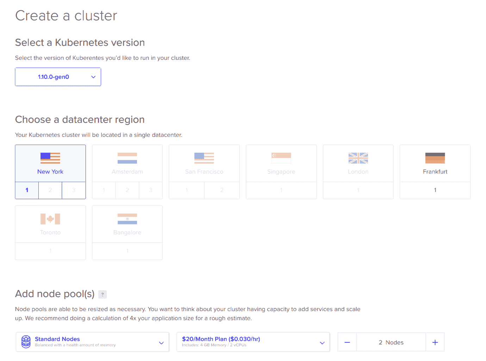

确保你选择至少三个节点，每个节点至少有 4 GB 的 RAM。然后点击创建集群。你将被带回到主 Kubernetes 标签页，在那里你可以看到集群正在被配置：

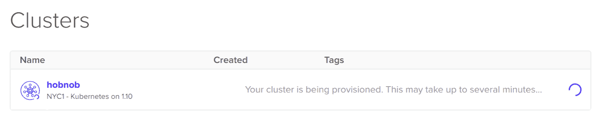

点击集群，您将被带到集群的概览部分：

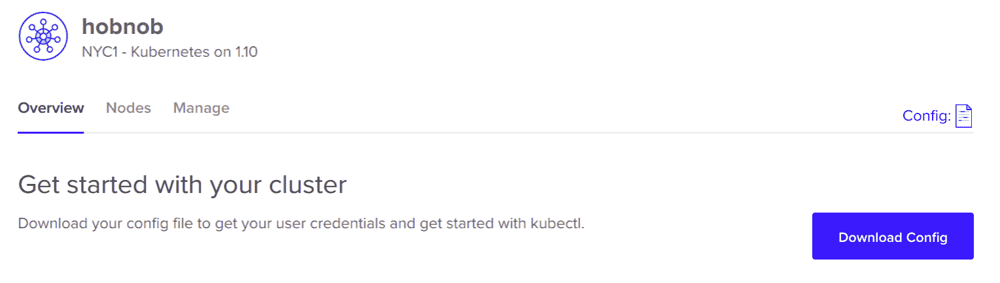

点击下载配置按钮以下载连接到我们在 DigitalOcean 上创建的新集群所需的配置。当您打开它时，您应该会看到类似以下内容：

```js
apiVersion: v1
clusters:
- cluster:
    certificate-authority-data: S0tL...FFDENFRJQV0
    server: https://8b8a5720059.k8s.ondigitalocean.com
  name: do-nyc1-hobnob
contexts:
- context:
    cluster: do-nyc1-hobnob
    user: do-nyc1-hobnob-admin
  name: do-nyc1-hobnob
current-context: do-nyc1-hobnob
kind: Config
preferences: {}
users:
- name: do-nyc1-hobnob-admin
  user:
    client-certificate-data: LUMMmxjaJ...VElGVEo
    client-key-data: TFyMrS2I...mhoTmV2LS05kRF
```

让我们检查字段以了解它们为什么存在：

+   `apiVersion`、`kind`：这些字段与之前具有相同的意义

+   `clusters`：定义由`kubectl`管理的不同集群，包括集群服务器的 hostname 以及验证服务器身份所需的证书

+   `users`：定义用于连接到集群的用户凭据；这可能包括证书和密钥，或者简单的用户名和密码。您可以使用相同的用户连接到多个集群，尽管通常您会为每个集群创建一个单独的用户。

+   `context`：集群、用户和命名空间的分组。

节点初始化需要几分钟时间；在此期间，让我们看看如何配置`kubectl`以与我们的新远程集群交互。

# 切换上下文

当使用`kubectl`时，上下文是集群、用户凭据和命名空间的分组。`kubectl`使用存储在这些上下文中的信息与任何集群通信。

当我们使用 Minikube 设置本地集群时，它会为我们创建一个默认的`minikube`上下文。我们可以通过运行`kubectl config current-context`来确认这一点：

```js
$ kubectl config current-context
minikube
```

`kubectl`从由`KUBECONFIG`环境变量指定的文件中获取其配置。这已在我们的`.profile`文件中设置为`$HOME/.kube/config`。如果我们查看它，我们将看到它与从 DigitalOcean 下载的配置非常相似：

```js
apiVersion: v1
clusters:
- cluster:
    certificate-authority: ~/.minikube/ca.crt
    server: https://10.122.98.148:8443
  name: minikube
contexts:
- context:
    cluster: minikube
    user: minikube
  name: minikube
current-context: minikube
kind: Config
preferences: {}
users:
- name: minikube
  user:
    client-certificate: ~/.minikube/client.crt
    client-key: ~/.minikube/client.key
```

`~/.kube/config`文件记录了集群主 API 服务器的 IP 地址，我们客户端与之交互的凭据，并将集群信息和用户凭据一起分组在上下文对象中。

为了使`kubectl`与我们的新 DigitalOcean Hobnob 集群交互，我们必须更新`KUBECONFIG`环境变量以包含我们的新配置文件。

首先，将配置文件从 DigitalOcean 复制到一个新文件：

```js
$ cp downloads/hobnob-kubeconfig.yaml ~/.kube/
```

现在，编辑您的`~/.profile`文件，并更新`KUBECONFIG`环境变量以包含新的配置文件：

```js
export KUBECONFIG=$HOME/.kube/config:$HOME/.kube/hobnob-kubeconfig.yaml
```

保存并源文件以使其应用于当前 shell：

```js
$ . ~/.profile
```

现在，当我们运行`kubectl config view`时，我们将看到来自我们两个文件的配置已合并在一起：

```js
$ kubectl config view
apiVersion: v1
clusters:
- cluster:
 certificate-authority-data: REDACTED
 server: https://8b8a5720059.k8s.ondigitalocean.com
 name: do-nyc1-hobnob
- cluster:
 certificate-authority: ~/.minikube/ca.crt
 server: https://10.122.98.148:8443
 name: minikube
contexts:
- context:
 cluster: do-nyc1-hobnob
 user: do-nyc1-hobnob-admin
 name: do-nyc1-hobnob
- context:
 cluster: minikube
 user: minikube
 name: minikube
current-context: minikube
kind: Config
preferences: {}
users:
- name: do-nyc1-hobnob-admin
 user:
 client-certificate-data: REDACTED
 client-key-data: REDACTED
- name: minikube
 user:
 client-certificate: ~/.minikube/client.crt
 client-key: ~/.minikube/client.key
```

现在，为了使`kubectl`与我们的 DigitalOcean 集群而不是本地集群交互，我们只需更改上下文：

```js
$ kubectl config use-context do-nyc1-hobnob
Switched to context "do-nyc1-hobnob".
```

现在，当我们运行`kubectl cluster-info`时，我们得到有关远程集群而不是本地集群的信息：

```js
$ kubectl cluster-info
Kubernetes master is running at https://8b8a5720059.k8s.ondigitalocean.com
KubeDNS is running at https://8b8a5720059.k8s.ondigitalocean.com/api/v1/namespaces/kube-system/services/kube-dns:dns/proxy
```

# 配置 Elasticsearch 节点

如官方 Elasticsearch 指南（[`www.elastic.co/guide/en/elasticsearch/reference/current/docker.html#_notes_for_production_use_and_defaults`](https://www.elastic.co/guide/en/elasticsearch/reference/current/docker.html#_notes_for_production_use_and_defaults)）中所述，在生产环境中部署时，我们必须以某种方式配置运行 Elasticsearch 的节点。例如：

+   默认情况下，Elasticsearch 使用`mmapfs`目录来存储其索引。然而，大多数系统对 mmap 计数设置了`65530`的上限，这意味着 Elasticsearch 可能会因为索引而耗尽内存。如果我们不更改此设置，在尝试运行 Elasticsearch 时，你将遇到以下错误：

    ```js
    [INFO ][o.e.b.BootstrapChecks ] [6tcspAO] bound or publishing to a non-loopback address, enforcing bootstrap checks
    ERROR: [1] bootstrap checks failed
    [1]: max virtual memory areas vm.max_map_count [65530] is too low, increase to at least [262144]
    ```

    因此，我们应该将`vm.max_map_count`内核设置至少改为`262144`。这可以通过运行`sysctl -w vm.max_map_count=262144`临时实现，或者通过将其添加到`/etc/sysctl.d/elasticsearch.conf`的新文件中永久实现。

+   UNIX 系统对打开的文件数量设定了一个上限，或者更具体地说，是对文件描述符的数量设定了上限。如果你超过了这个限制，试图打开新文件的进程将会遇到错误“打开文件过多”。

    内核有一个全局限制，存储在`/proc/sys/fs/file-max`中；在大多数系统中，这是一个很大的数字，如`2424348`。每个用户也有硬限制和软限制；硬限制只能由 root 提升，而软限制可以被用户更改，但永远不会超过硬限制。你可以通过运行`ulimit -Sn`来检查文件描述符的软限制；在大多数系统中，默认值为`1024`。你可以通过运行`ulimit -Hn`来检查硬限制；例如，在我的机器上，硬限制是`1048576`。

    Elasticsearch 建议我们将软限制和硬限制至少设置为`65536`。这可以通过以`root`身份运行`ulimit -n 65536`来实现。

我们需要为集群中的每个节点进行这些更改。但首先，让我们回到我们的 DigitalOcean 仪表板，看看我们的节点是否已成功创建。

# 在多台服务器上运行命令

当你在 DigitalOcean 仪表板上时，点击你的集群并转到节点标签页。在这里，你应该看到你的集群中的节点已经成功配置：

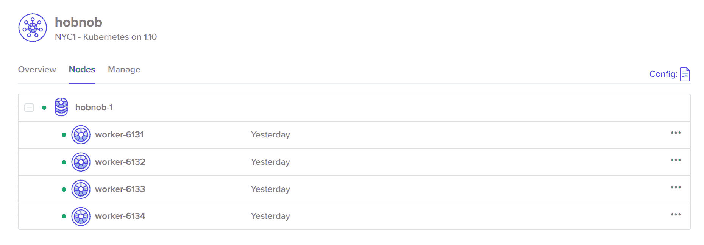

我们可以通过运行`kubectl get nodes`从命令行确认这一点：

```js
$ kubectl get nodes
NAME STATUS ROLES AGE VERSION
worker-6000 Ready <none> 17h v1.10.1
worker-6001 Ready <none> 17h v1.10.1
....
```

因为我们的当前上下文设置为`do-nyc1-hobnob`，它将获取远程集群中的节点，而不是本地集群。

现在节点已经准备好了，我们如何更新之前提到的 Elasticsearch 特定设置呢？最简单的方法是通过 SSH 进入每个服务器并运行以下三组命令：

```js
# sysctl -w vm.max_map_count=262144
# ulimit -n 65536
```

然而，一旦我们拥有大量服务器，这就会变得难以管理。相反，我们可以使用一个名为`pssh`的工具。

# 使用 pssh

工具如 `pssh`（并行 **ssh**，[`github.com/robinbowes/pssh`](https://github.com/robinbowes/pssh)）、`pdsh`（[`github.com/chaos/pdsh`](https://github.com/chaos/pdsh)）或 `clusterssh`（[`github.com/duncs/clusterssh`](https://github.com/duncs/clusterssh)）允许您同时向多个服务器发送命令。在所有这些工具中，`pssh` 的安装最为简单。

`pssh` 已列在 APT 注册表中，因此我们可以简单地更新注册表缓存并安装它：

```js
$ sudo apt update
$ sudo apt install pssh
```

实际上，这将使用 `parallel-ssh` 的名称安装 `pssh`；这样做是为了避免与 `putty` 软件包发生冲突。

我们现在可以使用 `kubectl get nodes` 命令来程序化地获取集群中所有节点的 IP 地址，并将其传递给 `parallel-ssh`：

```js
$ parallel-ssh --inline-stdout --user root --host "$(kubectl get nodes -o=jsonpath='{.items[*].status.addresses[?(@.type=="ExternalIP")].address}')" -x "-o StrictHostKeyChecking=no" "sysctl -w vm.max_map_count=262144 && ulimit -n 65536"
[1] 23:27:51 [SUCCESS] 142.93.126.236
vm.max_map_count = 262144
[2] 23:27:51 [SUCCESS] 142.93.113.224
vm.max_map_count = 262144
...
```

我们将 `ssh` 参数 `StrictHostKeyChecking` 设置为 `no` 以暂时禁用 `ssh` 对节点真实性的检查。这虽然不安全但提供了便利；否则，您必须将每个节点的密钥添加到 `~/.ssh/known_hosts` 文件中。

# 使用 init containers

使用 `pssh` 是可接受的，但它是一个我们需要记住的额外命令。理想情况下，此配置应记录在 `stateful-set.yaml` 文件中，这样命令只会在已部署我们的 Elasticsearch StatefulSet 的节点上运行。Kubernetes 提供了一种特殊的容器类型，称为 Init Containers，它允许我们做到这一点。

Init Containers 是特殊的容器，在您的“正常” *app Containers* 启动之前运行和退出。当指定多个 Init Containers 时，它们按顺序运行。此外，如果上一个 Init Container 以非零退出状态退出，则下一个 Init Container 不会运行，整个 Pod 失败。

这允许您使用 Init Containers 来：

+   检查其他服务的就绪状态。例如，如果您的服务 X 依赖于另一个服务 Y，您可以使用 Init Container 来检查服务 Y，并且只有当服务 Y 正确响应时才会退出。Init Container 退出后，应用容器可以开始其初始化步骤。

+   更新运行 Pod 的节点上的配置。

因此，我们可以在 `stateful-set.yaml` 文件中定义 Init Containers，这将更新运行我们的 Elasticsearch StatefulSet 的节点上的配置。

在 `stateful-set.yaml` 文件中，在 `spec.template.spec` 下添加一个名为 `initContainers` 的新字段，并设置以下参数：

```js
initContainers:
  - name: increase-max-map-count
    image: busybox
    command:
    - sysctl
    - -w
    - vm.max_map_count=262144
    securityContext:
      privileged: true
  - name: increase-file-descriptor-limit
    image: busybox
    command:
    - sh
    - -c
    - ulimit -n 65536
    securityContext:
      privileged: true
```

我们正在使用 `busybox` Docker 镜像。`busybox` 是一个将许多常见的 UNIX 工具的微小版本组合成一个单一可执行文件的形象。本质上，它是一个极轻量级（<5 MB）的镜像，允许您运行许多您期望从 GNU 操作系统获得的实用命令。

最终的 `stateful-set.yaml` 文件应如下所示：

```js
apiVersion: apps/v1
kind: StatefulSet
metadata:
  name: elasticsearch
  labels:
    app: elasticsearch
spec:
  replicas: 3
  serviceName: elasticsearch
  selector:
    matchLabels:
      app: elasticsearch
  template:
    metadata:
      labels:
        app: elasticsearch
    spec:
      initContainers:
      - name: increase-max-map-count
        image: busybox
        command:
        - sysctl
        - -w
        - vm.max_map_count=262144
        securityContext:
          privileged: true
      - name: increase-file-descriptor-limit
        image: busybox
        command:
        - sh
        - -c
        - ulimit -n 65536
        securityContext:
          privileged: true
      containers:
        - name: elasticsearch
          image: docker.elastic.co/elasticsearch/elasticsearch-oss:6.3.2
          ports:
          - containerPort: 9200
            name: http
          - containerPort: 9300
            name: tcp
          env:
            - name: discovery.zen.ping.unicast.hosts
              value: "elasticsearch-0.elasticsearch.default.svc.cluster.local,elasticsearch-1.elasticsearch.default.svc.cluster.local,elasticsearch-2.elasticsearch.default.svc.cluster.local"
```

此配置以与 `pssh` 相同的方式配置我们的节点，但增加了配置为代码的好处，因为现在它已成为我们 `stateful-set.yaml` 的一部分。

# 运行 Elasticsearch 服务

随着 `stateful-set.yaml` 准备就绪，现在是时候将我们的服务和有状态集部署到我们的远程云集群上了。

目前，我们的远程集群除了 Kubernetes 主组件外没有运行任何其他东西：

```js
$ kubectl get all
NAME                 TYPE        CLUSTER-IP   EXTERNAL-IP   PORT(S)   AGE
service/kubernetes   ClusterIP   10.32.0.1    <none>        443/TCP   17h
```

当我们使用 DigitalOcean 创建新集群时，Kubernetes 主组件会自动部署。

要部署我们的服务和有状态集，我们将使用 `kubectl apply`：

```js
$ kubectl apply -f manifests/elasticsearch/service.yaml
service "elasticsearch" created
$ kubectl apply -f manifests/elasticsearch/stateful-set.yaml
statefulset.apps "elasticsearch" created
```

等待一分钟或更长时间，然后再次运行 `kubectl get all`。你应该会看到 Pods、有状态集和我们的无头服务正在成功运行！

```js
$ kubectl get all
NAME                  READY     STATUS    RESTARTS   AGE
pod/elasticsearch-0   1/1       Running   0          1m
pod/elasticsearch-1   1/1       Running   0          1m
pod/elasticsearch-2   1/1       Running   0          10s

NAME                    TYPE        CLUSTER-IP   EXTERNAL-IP   PORT(S)             AGE
service/elasticsearch   ClusterIP   None         <none>        9200/TCP,9300/TCP   1m
service/kubernetes      ClusterIP   10.32.0.1    <none>        443/TCP             18h

NAME                             DESIRED   CURRENT   AGE
statefulset.apps/elasticsearch   3         3         1m
```

# 在远程集群上验证 Zen Discovery

让我们再次验证三个 Elasticsearch 节点是否已成功添加到 Elasticsearch 集群中。我们可以通过向 `/_cluster/state?pretty` 发送一个 `GET` 请求并检查输出来完成此操作。

但由于我们希望将数据库服务内部化，我们没有将其暴露给外部可访问的 URL，因此验证的唯一方法是 SSH 连接到其中一个 VPS，并使用其私有 IP 查询 Elasticsearch。

然而，`kubectl` 提供了一个更方便的替代方案。`kubectl` 有一个 `port-forward` 命令，它将进入 `localhost` 上端口的请求转发到 Pods 上的一个端口。我们可以使用这个功能将来自我们本地机器的请求发送到每个 Elasticsearch 实例。

假设我们运行了三个运行 Elasticsearch 的 Pods：

```js
$ kubectl get pods
NAME              READY   STATUS    RESTARTS   AGE
elasticsearch-0   1/1     Running   0          34m
elasticsearch-1   1/1     Running   0          34m
elasticsearch-2   1/1     Running   0          34m
```

我们可以通过运行以下命令在 `elasticsearch-0` 上设置端口转发：

```js
$ kubectl port-forward elasticsearch-0 9200:9200
Forwarding from 127.0.0.1:9200 -> 9200
Forwarding from [::1]:9200 -> 9200
```

现在，在另一个终端中，向 `http://localhost:9200/_cluster/state?pretty` 发送一个 `GET` 请求：

```js
$ curl http://localhost:9200/_cluster/state?pretty
{
 "cluster_name" : "docker-cluster",
 "state_uuid" : "rTHLkSYrQIu5E6rcGJZpCA",
 "master_node" : "TcYdL65VSb-W1ZzXPfB8aA",
 "nodes" : {
 "ns1ZaCTCS9ywDSntHz94vg" : {
 "name" : "ns1ZaCT",
 "ephemeral_id" : "PqwcVrldTOyKSfQ-ZfhoUQ",
 "transport_address" : "10.244.24.2:9300",
 "attributes" : { }
 },
 "94Q-t8Y8SJiXnwVzsGcdyA" : {
 "name" : "94Q-t8Y",
 "ephemeral_id" : "n-7ew1dKSL2LLKzA-chhUA",
 "transport_address" : "10.244.18.3:9300",
 "attributes" : { }
 },
 "TcYdL65VSb-W1ZzXPfB8aA" : {
 "name" : "TcYdL65",
 "ephemeral_id" : "pcghJOnTSgmB8xMh4DKSHA",
 "transport_address" : "10.244.75.3:9300",
 "attributes" : { }
 }
 },
 "metadata" : {
 "cluster_uuid" : "ZF1t_X_XT0q5SPANvzE4Nw",
 ...
 },
 ...
}
```

如您所见，`node` 字段包含三个对象，代表我们每个 Elasticsearch 实例。它们都是集群的一部分，具有 `cluster_uuid` 值为 `ZF1t_X_XT0q5SPANvzE4Nw`。尝试将端口转发到其他 Pods，并确认这些节点的 `cluster_uuid` 是否相同。

如果一切正常，我们现在已经在 DigitalOcean 上成功部署了相同的 Elasticsearch 服务！

# 持久化数据

然而，我们还没有完成！目前，如果所有的 Elasticsearch 容器都失败了，存储在其中的数据将会丢失。

这是因为容器是 **ephemeral** 的，意味着容器内部任何文件的变化（无论是添加还是删除），都只会持续到容器存在的时间；一旦容器消失，这些变化也随之消失。

这对于无状态应用来说是可以的，但我们的 Elasticsearch 服务的主要目的是存储状态。因此，类似于我们在 Docker 中使用卷持久化数据的方式，我们同样需要在 Kubernetes 中这样做。

# 介绍 Kubernetes Volumes

与 Docker 一样，Kubernetes 也有一个名为 Volume 的 API 对象，但两者之间有几个区别。

使用 Docker 和 Kubernetes，存储卷背后的存储解决方案可以是主机上的目录，也可以是云解决方案（如 AWS）的一部分。

对于 Docker 和 Kubernetes 来说，卷是对存储抽象的一种，可以是附加或挂载的。区别在于它挂载到哪个资源上。

使用 Docker 卷，存储被挂载到容器内部的目录上。对目录内容所做的任何更改都可以由主机机器和容器访问。

使用 Kubernetes 卷，存储被映射到 Pod 内部的目录。同一 Pod 内的容器可以访问 Pod 的卷。这允许同一 Pod 内的容器轻松共享信息。

# 定义卷

卷是通过在 Pod 清单文件中的`.spec.volumes`字段中指定有关卷的信息来创建的。以下清单片段将创建一个类型为`hostPath`的卷，使用在`path`和`type`属性中定义的参数。

`hostPath`是与 Docker 卷最相似的卷类型，其中卷作为主机节点文件系统中的一个目录存在：

```js
apiVersion: v1
kind: Pod
spec:
  ...
  volumes:
  - name: host-volume
    hostPath:
      path: /data
      type: Directory
```

此卷现在将可供 Pod 内的所有容器使用。然而，卷不会自动挂载到每个容器上。这是出于设计考虑，因为并非所有容器都需要使用卷；它允许配置是明确的而不是隐含的。

将卷挂载到容器中，请在容器的规范中指定`volumeMounts`选项：

```js
apiVersion: v1
kind: Pod
spec:
  containers:
    - name: elasticsearch
      image: docker.elastic.co/elasticsearch/elasticsearch-oss:6.2.4
      ports:
        - containerPort: 9200
        - containerPort: 9300
      env:
        - name: discovery.type
          value: single-node
      volumeMounts:
        - mountPath: /usr/share/elasticsearch/data
          name: host-volume
  ...
```

`mountPath`指定了卷应该挂载到容器内部的目录。

要运行此 Pod，您首先需要在您的宿主机上创建一个`/data`目录，并将其所有权更改为具有`UID`和`GID`为`1000`：

```js
$ sudo mkdir data
$ sudo chown 1000:1000 /data
```

现在，当我们运行这个 Pod 时，你应该能够在`<pod-ip>:9200`上查询它，并看到写入到`/data`目录的内容：

```js
$ tree /data
data/
└── nodes
 └── 0
 ├── node.lock
 └── _state
 ├── global-0.st
 └── node-0.st

3 directories, 3 files
```

# 手动管理卷的问题

虽然您可以使用卷来持久化单个 Pod 的数据，但这对于我们的 StatefulSet 不起作用。这是因为每个副本 Elasticsearch 节点都会尝试同时写入相同的文件；只有一个会成功，其他都会失败。如果您尝试这样做，您将遇到以下挂起状态：

```js
$ kubectl get pods
NAME              READY   STATUS             RESTARTS
elasticsearch-0   1/1     Running            0 
elasticsearch-1   0/1     CrashLoopBackOff   7 
elasticsearch-2   0/1     CrashLoopBackOff   7       
```

如果我们使用`kubectl logs`检查其中一个失败的 Pod，您将看到以下错误信息：

```js
$ kubectl logs elasticsearch-1
[WARN ][o.e.b.ElasticsearchUncaughtExceptionHandler] [] uncaught exception in thread [main]
org.elasticsearch.bootstrap.StartupException: java.lang.IllegalStateException: failed to obtain node locks, tried [[/usr/share/elasticsearch/data/docker-cluster]] with lock id [0]; maybe these locations are not writable or multiple nodes were started without increasing [node.max_local_storage_nodes] (was [1])?
```

基本上，在 Elasticsearch 实例开始写入数据库文件之前，它会创建一个`node.lock`文件。在其他实例尝试写入相同的文件之前，它将检测到这个`node.lock`文件并中止。

除了这个问题之外，直接将卷附加到 Pod 上还有一个不好的原因——卷在 Pod 级别持久化数据，但 Pod 可能会被重新调度到其他节点。当这种情况发生时，"旧"的 Pod 及其关联的卷将被销毁，并在不同的节点上部署一个新的 Pod，其卷为空。

最后，以这种方式扩展存储也很困难——如果 Pod 需要更多存储，你必须销毁 Pod（以确保它不对卷进行写入，创建一个新的卷，将旧卷的内容复制到新卷，然后重启 Pod）。

# 介绍持久卷（PV）

为了解决这些问题，Kubernetes 提供了持久卷（PV）对象。持久卷是卷对象的变体，但存储能力与整个集群相关联，而不是与任何特定的 Pod 相关联。

# 使用持久卷声明（PVC）消耗 PV

当管理员希望 Pod 使用由 PV 提供的存储时，管理员会创建一个新的**持久卷声明（PersistentVolumeClaim**）对象，并将该 PVC 对象分配给 Pod。PVC 对象简单来说就是请求将一个合适的 PV 绑定到 PVC（以及 Pod）。

PVC 在主控制平面注册后，主控制平面会寻找满足 PVC 中规定的标准的 PV，并将两者绑定在一起。例如，如果 PVC 请求至少有 5 GB 存储空间的 PV，主控制平面只会将具有至少 5 GB 空间的 PV 绑定到该 PVC。

PVC 绑定到 PV 后，Pod 将能够读写 PV 背后的存储介质。

PVC 到 PV 的绑定是一对一的映射；这意味着当 Pod 重新调度时，相同的 PV 将与 Pod 相关联。

# 删除持久卷声明

当一个 Pod 不再需要使用持久卷（PersistentVolume）时，可以直接删除 PVC。当这种情况发生时，存储介质内部存储的数据将取决于持久卷的回收策略（Reclaim Policy）。

如果回收策略设置为：

+   保留，PV 被保留——PVC 只是从 PV 释放/解绑。存储介质中的数据被保留。

+   删除，它将删除 PV 和存储介质中的数据。

# 删除持久卷

当你不再需要 PV 时，你可以删除它。但由于实际数据存储在外部，数据将保留在存储介质中。

# 手动配置持久卷的问题

虽然**持久卷**将存储与单个 Pod 解耦，但它仍然缺乏我们从 Kubernetes 期望的自动化，因为集群管理员（你）必须手动与云提供商交互以配置新的存储空间，然后创建表示它们的 Kubernetes 中的**持久卷**：

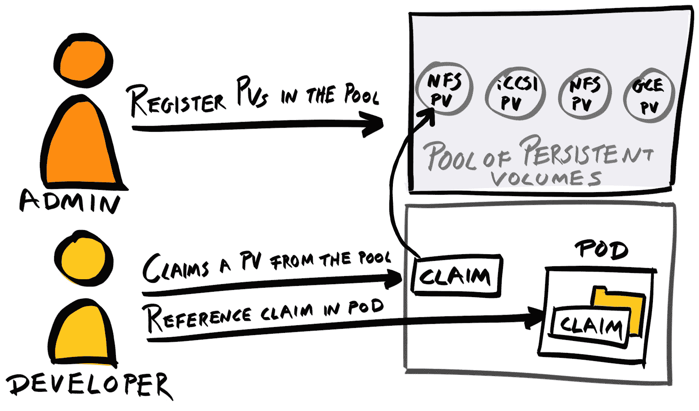

此外，PVC 到 PV 的绑定是一对一的映射；这意味着我们在创建 PV 时必须小心。例如，假设我们有两个 PVC，一个请求 10 GB，另一个请求 40 GB。如果我们注册两个大小为 25GB 的 PV，那么只有 10 GB 的 PVC 会成功，尽管为两个 PVC 都有足够的存储空间。

# 使用 StorageClass 进行动态卷配置

为了解决这些问题，Kubernetes 提供了另一个 API 对象，称为 `StorageClass`。通过 `StorageClass`，Kubernetes 能够直接与云提供商交互。这使得 Kubernetes 能够提供新的存储卷，并自动创建 `PersistentVolumes`。

基本上，`PersistentVolume` 是存储的一部分表示，而 `StorageClass` 是动态创建 `PersistentVolumes` 的 *方式* 的规范。`StorageClass` 将手动过程抽象成可以在清单文件中指定的字段集。

# 定义 StorageClass

例如，如果你想创建一个将创建 Amazon EBS 通用型 SSD (`gp2`) 卷的 `StorageClass`，你可以定义一个如下所示的 `StorageClass` 清单：

```js
kind: StorageClass
apiVersion: storage.k8s.io/v1
metadata:
  name: standard
provisioner: kubernetes.io/aws-ebs
parameters:
  type: gp2
reclaimPolicy: Retain
```

下面是每个字段的意义（带星号 `*` 的字段为必填项）：

+   `apiVersion`: `StorageClass` 对象位于 `storage.k8s.io` API 组中。

+   `*provisioner`: 一个 *提供者* 的名称，该提供者将根据需求准备新的存储空间。例如，如果一个 Pod 从 `standard` StorageClass 请求 10 GB 的块存储，那么 `kubernetes.io/aws-ebs` 提供者将直接与 AWS 交互，创建至少 10 GB 大小的新的存储卷。

+   `*parameters`: 传递给提供者的参数，以便它知道如何提供存储。有效的参数取决于提供者。例如，`kubernetes.io/aws-ebs` 和 `kubernetes.io/gce-pd` 都支持 `type` 参数。

+   `*reclaimPolicy`: 与 `PersistentVolumes` 类似，回收策略决定了写入存储介质的 数据是保留还是删除。这可以是 `Delete` 或 `Retain`，但默认为 `Delete`。

可用的提供者类型有很多。Amazon EBS 在 AWS 上提供 *块存储*，但还有其他类型的存储，即文件和对象存储。在这里我们将使用块存储，因为它提供了最低的延迟，并且适合与我们的 Elasticsearch 数据库一起使用。

# 使用 csi-digitalocean 提供者

DigitalOcean 提供了自己的提供者，称为 CSI-DigitalOcean ([`github.com/digitalocean/csi-digitalocean`](https://github.com/digitalocean/csi-digitalocean))。要使用它，只需遵循 `README.md` 文件中的说明。基本上，你需要进入 DigitalOcean 控制台，生成一个令牌，使用该令牌生成一个 Secret Kubernetes 对象，然后部署位于 [`raw.githubusercontent.com/digitalocean/csi-digitalocean/master/deploy/kubernetes/releases/csi-digitalocean-latest-stable.yaml`](https://raw.githubusercontent.com/digitalocean/csi-digitalocean/master/deploy/kubernetes/releases/csi-digitalocean-latest-stable.yaml) 的 StorageClass 清单文件。

然而，因为我们使用的是 DigitalOcean Kubernetes 平台，我们的 Secret 和 `csi-digitaloceanstorage` 类已经为我们配置好了，所以我们实际上不需要做任何事情！你可以使用 `kubectl get` 命令来检查 Secret 和 StorageClass：

```js
$ kubectl get secret
NAME TYPE DATA AGE
default-token-2r8zr kubernetes.io/service-account-token 3 2h

$ kubectl get storageclass
NAME PROVISIONER AGE
do-block-storage (default) com.digitalocean.csi.dobs 2h
```

记下存储类（此处为 `do-block-storage`）的名称。

# 将 PersistentVolume 挂载到有状态集

我们现在需要更新我们的 `stateful-set.yaml` 文件以使用 `do-block-storage` 存储类。在有状态集规范（`.spec`）下，添加一个名为 `volumeClaimTemplates` 的新字段，其值为以下内容：

```js
apiVersion: apps/v1
kind: StatefulSet
metadata: ...
spec:
  volumeClaimTemplates:
  - metadata:
      name: data
    spec:
      accessModes:
      - ReadWriteOnce
      resources:
        requests:
          storage: 2Gi
      storageClassName: do-block-storage
```

这将使用 `do-block-storage` 类为任何挂载它的容器动态配置 2 GB 的 `PersistentVolumeClaim` 对象。PVC 被命名为 `data` 作为参考。

要将其挂载到容器中，请在容器规范属性的 `spec` 属性下添加一个 `volumeMounts` 属性：

```js
apiVersion: apps/v1
kind: StatefulSet
metadata: ...
spec:
  ...
  template:
    ...
    spec:
      initContainers: ...
      containers: ...
      volumeMounts:
        - name: data
          mountPath: /usr/share/elasticsearch/data
  volumeClaimTemplates: ...
```

Elasticsearch 将其数据写入 `/usr/share/elasticsearch/data`，因此这是我们想要持久化的数据。

# 配置绑定挂载目录的权限

默认情况下，Elasticsearch 以 `elasticsearch` 用户身份在 Docker 容器中运行，具有 `UID` 和 `GID` 都为 `1000`。因此，我们必须确保数据目录（`/usr/share/elasticsearch/data`）及其所有内容将由这个 `elasticsearch` 用户拥有，以便 Elasticsearch 可以写入它们。

当 Kubernetes 将 `PersistentVolume` 绑定到我们的 `/usr/share/elasticsearch/data` 时，这是使用 `root` 用户完成的。这意味着 `/usr/share/elasticsearch/data` 目录不再由 `elasticsearch` 用户拥有。

因此，为了完成我们的 Elasticsearch 部署，我们需要使用初始化容器来修复我们的权限。这可以通过在节点上以 `root` 身份运行 `chown -R 1000:1000 /usr/share/elasticsearch/data` 来完成。

在 `stateful-set.yaml` 内部的 `initContainers` 数组中添加以下条目：

```js
- name: fix-volume-permission
  image: busybox
  command:
  - sh
  - -c
  - chown -R 1000:1000 /usr/share/elasticsearch/data
  securityContext:
    privileged: true
  volumeMounts:
  - name: data
    mountPath: /usr/share/elasticsearch/data
```

这基本上是在应用程序容器开始初始化之前挂载 `PersistentVolume` 并更新其所有者，以确保应用程序容器执行时权限已经正确设置。总结一下，您的最终 `elasticsearch/service.yaml` 应该看起来像这样：

```js
apiVersion: v1
kind: Service
metadata:
  name: elasticsearch
  labels:
    app: elasticsearch
spec:
  selector:
    app: elasticsearch
  clusterIP: None
  ports:
  - port: 9200
    name: rest
  - port: 9300
    name: transport
```

并且您的最终 `elasticsearch/stateful-set.yaml` 应该看起来像这样：

```js
apiVersion: apps/v1
kind: StatefulSet
metadata:
  name: elasticsearch
  labels:
    app: elasticsearch
spec:
  replicas: 3
  serviceName: elasticsearch
  selector:
    matchLabels:
      app: elasticsearch
  template:
    metadata:
      labels:
        app: elasticsearch
    spec:
      initContainers:
      - name: increase-max-map-count
        image: busybox
        command:
        - sysctl
        - -w
        - vm.max_map_count=262144
        securityContext:
          privileged: true
      - name: increase-file-descriptor-limit
        image: busybox
        command:
        - sh
        - -c
        - ulimit -n 65536
        securityContext:
          privileged: true
      containers:
        - name: elasticsearch
          image: docker.elastic.co/elasticsearch/elasticsearch-oss:6.3.2
          ports:
          - containerPort: 9200
            name: http
          - containerPort: 9300
            name: tcp
          env:
            - name: discovery.zen.ping.unicast.hosts
              value: "elasticsearch-0.elasticsearch.default.svc.cluster.local,elasticsearch-1.elasticsearch.default.svc.cluster.local,elasticsearch-2.elasticsearch.default.svc.cluster.local"
      volumeMounts:
        - name: data
          mountPath: /usr/share/elasticsearch/data
  volumeClaimTemplates:
  - metadata:
      name: data
    spec:
      accessModes:
      - ReadWriteOnce
      resources:
        requests:
          storage: 2Gi
      storageClassName: do-block-storage
```

删除您现有的服务、有状态集和 Pod，并尝试从头开始部署它们：

```js
$ kubectl apply -f ./manifests/elasticsearch/service.yaml
service "elasticsearch" created
$ kubectl apply -f ./manifests/elasticsearch/stateful-set.yaml
statefulset.apps "elasticsearch" created
```

# 使用 Web UI 仪表板可视化 Kubernetes 对象

在本章中，您已经接触到了很多 Kubernetes——命名空间、节点、Pod、部署、副本集、有状态集、守护进程集、服务、卷、持久卷和存储类。所以，在我们继续之前，让我们稍作休息。

到目前为止，我们一直在使用 `kubectl`。虽然 `kubectl` 很棒，但有时可视化工具可以有所帮助。Kubernetes 项目提供了一个方便的 Web UI 仪表板，允许您轻松地可视化所有 Kubernetes 对象。

Kubernetes Web UI 仪表板与 DigitalOcean 仪表板不同。

`kubectl` 和 Web UI 仪表板都会调用 `kube-apiserver`，但前者是命令行工具，而后者提供了一个网络界面。

默认情况下，Web UI 仪表板不会自动部署。我们通常需要运行以下命令来在我们的集群上运行仪表板实例：

```js
$ kubectl create -f https://raw.githubusercontent.com/kubernetes/dashboard/master/src/deploy/recommended/kubernetes-dashboard.yaml
```

然而，DigitalOcean 和 Minikube 默认都部署了此仪表板功能，因此我们不需要部署任何内容。

# 在本地启动 Web UI 仪表板

要启动本地集群的 Web UI 仪表板，请运行 `minikube dashboard`。这将在新标签页的浏览器中打开一个类似于以下概述屏幕：

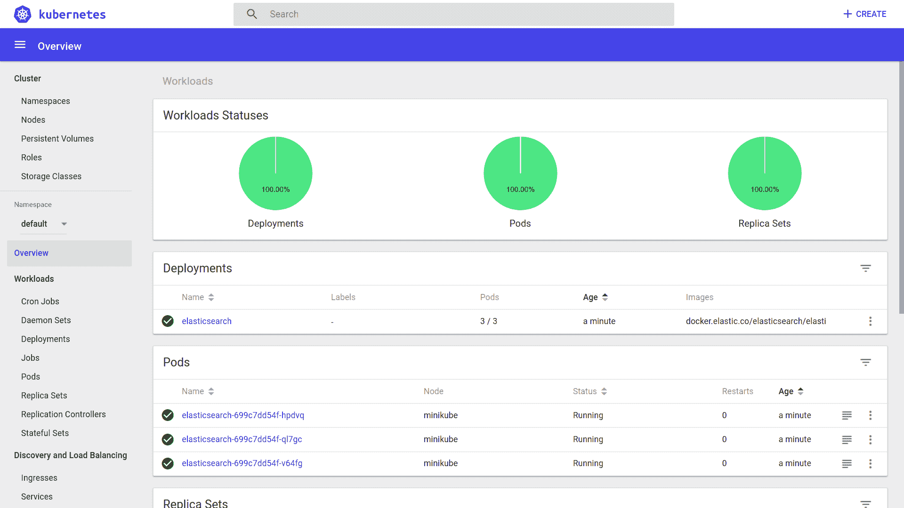

你可以使用左侧菜单进行导航并查看我们集群中当前运行的其他 Kubernetes 对象：

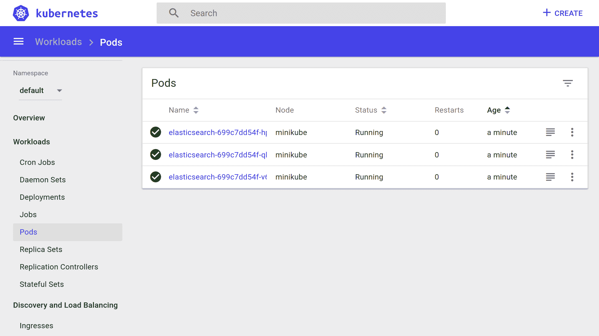

# 在远程集群上启动 Web UI 仪表板

要访问远程集群上部署的 Web UI 仪表板，更简单的方法是使用 `kubectl proxy` 访问远程集群的 Kubernetes API。只需运行 `kubectl proxy`，Web UI 仪表板应该可在 [`localhost:8001/api/v1/namespaces/kube-system/services/https:kubernetes-dashboard:/proxy/`](http://localhost:8001/api/v1/namespaces/kube-system/services/https:kubernetes-dashboard:/proxy/) 上访问。

我们将在本章的剩余部分继续使用 `kubectl`，但你可以自由切换到 Web UI 仪表板以获得对集群更直观的视图。

# 部署后端 API

我们已部署了 Elasticsearch，因此让我们继续部署剩余的内容——我们的后端 API 和前端应用程序。

部署中使用的 `elasticsearch` Docker 镜像在公共领域可用。然而，我们的后端 API Docker 镜像在任何地方都不可用，因此我们的远程 Kubernetes 集群将无法拉取和部署它。

因此，我们需要构建我们的 Docker 镜像并在 Docker 仓库中使其可用。如果我们不介意我们的镜像被其他人下载，我们可以在公共仓库如 Docker Hub 上发布它。如果我们想控制对镜像的访问，我们需要在私有仓库上部署它。

为了简单起见，我们将在 Docker Hub 上公开发布我们的镜像。

# 将我们的镜像发布到 Docker Hub

首先，前往 [`hub.docker.com/`](https://hub.docker.com/) 并在 Docker Hub 上创建一个账户。确保验证你的电子邮件。

然后，点击顶部导航中的“创建 | 创建仓库”。为仓库提供一个唯一的名称并按创建。你可以根据自己的偏好设置仓库为公共或私有（在撰写本书时，Docker Hub 提供一个免费的私有仓库）：

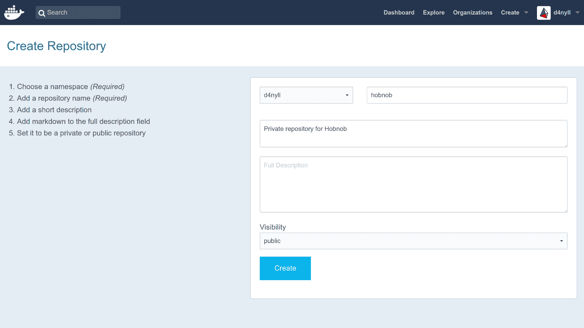

仓库可以使用 `<namespace>/<repository-name>` 来识别，其中命名空间只是你的 Docker Hub 用户名。你可以在 Docker Hub 上通过 URL `hub.docker.com/r/<namespace>/<repository-name>/` 找到它。

如果你有一个组织，命名空间可能是组织的名称。

接下来，返回你的终端并使用你的 Docker Hub 凭据登录。例如，我的 Docker Hub 用户名是 `d4nyll`，所以我将运行以下命令：

```js
$ docker login --username d4nyll
```

当提示输入密码时，你应该会看到一个消息通知你 `Login Succeeded`。接下来，如果你还没有做的话，构建镜像：

```js
$ docker build -t hobnob:0.1.0 . --no-cache
Sending build context to Docker daemon 359.4kB
Step 1/13 : FROM node:8-alpine as builder
...
Successfully built 3f2d6a073e1a
```

然后，使用 Docker Hub 上的完整仓库名称以及一个将在 Docker Hub 上出现的标签来标记本地镜像，以区分不同版本的镜像。你应该运行的 `docker tag` 命令结构如下：

```js
$ docker tag <local-image-name>:<local-image-tag> <hub-namespace>/<hub-repository-name>:<hub-tag>
```

在我的例子中，我会运行以下命令：

```js
$ docker tag hobnob:0.1.0 d4nyll/hobnob:0.1.0
```

最后，将镜像推送到 Docker Hub：

```js
$ docker push d4nyll/hobnob
The push refers to repository [docker.io/d4nyll/hobnob]
90e19b6c8d6d: Pushed
49fb9451c65f: Mounted from library/node
7d863d91deaa: Mounted from library/node
8dfad2055603: Mounted from library/node
0.1.0: digest: sha256:21610fecafb5fd8d84a0844feff4fdca5458a1852650dda6e13465adf7ee0608 size: 1163
```

通过访问 `https://hub.docker.com/r/<namespace>/<repository-name>/tags/` 确认它已被成功推送。你应该在那里看到标记的镜像。

# 创建部署

由于我们的后端 API 是无状态应用程序，我们不需要像 Elasticsearch 那样部署一个有状态集。我们可以简单地使用我们已经遇到过的更简单的 Kubernetes 对象——部署。

在 `manifests/backend/deployment.yaml` 创建一个新的清单，内容如下：

```js
apiVersion: apps/v1
kind: Deployment
metadata:
  name: backend
  labels:
    app: backend
spec:
  selector:
    matchLabels:
      app: backend
  replicas: 3
  template:
    metadata:
      labels:
        app: backend
    spec:
      containers:
      - name: backend
        image: d4nyll/hobnob:0.1.0
        ports:
        - containerPort: 8080
          name: api
        - containerPort: 8100
          name: docs
        env:
        - name: ELASTICSEARCH_HOSTNAME
          value: "http://elasticsearch"
        - name: ELASTICSEARCH_PORT
          value: "9200"
        ...
```

对于 `.spec.template.spec.containers[].env` 字段，添加与我们在上一章中传递给 Docker 镜像相同的环境变量（我们存储在 `.env` 文件中的那些）。然而，对于 `ELASTICSEARCH_PORT` 变量，将其硬编码为 `"9200"`，对于 `ELASTICSEARCH_HOSTNAME`，使用值 `"http://elasticsearch"`。

# 使用 kube-dns/CoreDNS 发现服务

虽然 Kubernetes 组件构成了 Kubernetes 平台的基本部分，但也有扩展核心功能的 *附加组件*。它们是可选的，但其中一些强烈推荐，并且通常默认包含。实际上，Web UI 仪表板就是一个附加组件的例子。

另一个这样的附加组件是 `kube-dns`，这是一个 DNS 服务器，Pod 用于解析主机名。

*CoreDNS* 是一个替代 DNS 服务器，在 Kubernetes 1.11 中达到 **GA**（通用可用性）状态，取代了现有的 `kube-dns` 附加组件作为默认。对于我们的目的，它们达到相同的结果。

此 DNS 服务器监视 Kubernetes API 以查找新的服务。当创建新的服务时，会创建一个 DNS 记录，将名称 `<service-name>.<service-namespace>` 路由到服务的集群 IP。或者，在无头服务（没有集群 IP）的情况下，是无头服务构成 Pod 的 IP 列表。

这就是为什么我们可以将 `"http://elasticsearch"` 作为 `ELASTICSEARCH_HOSTNAME` 环境变量的值，因为 DNS 服务器会解析它，即使服务更改了其 IP。

# 运行我们的后端部署

我们的部署清单准备好了，现在让我们将其部署到我们的远程集群。你现在应该熟悉这个过程了——只需运行 `kubectl apply`：

```js
$ kubectl apply -f ./manifests/backend/deployment.yaml
deployment.apps "backend" created
```

使用 `kubectl get all` 检查部署的状态：

```js
$ kubectl get all
NAME                           READY     STATUS    RESTARTS   AGE
pod/backend-6d58f66658-6wx4f   1/1       Running   0          21s
pod/backend-6d58f66658-rzwnl   1/1       Running   0          21s
pod/backend-6d58f66658-wlsdz   1/1       Running   0          21s
pod/elasticsearch-0            1/1       Running   0          18h
pod/elasticsearch-1            1/1       Running   0          20h
pod/elasticsearch-2            1/1       Running   0          20h

NAME                    TYPE        CLUSTER-IP   EXTERNAL-IP   PORT(S) 
service/elasticsearch   ClusterIP   None         <none>        9200/TCP,9300/TCP
service/kubernetes      ClusterIP   10.32.0.1    <none>        443/TCP 

NAME                      DESIRED   CURRENT   UP-TO-DATE   AVAILABLE   AGE
deployment.apps/backend   3         3         3            3           21s

NAME                                 DESIRED   CURRENT   READY     AGE
replicaset.apps/backend-6d58f66658   3         3         3         21s

NAME                             DESIRED   CURRENT   AGE
statefulset.apps/elasticsearch   3         3         20h
```

您还可以检查后端 Pod 的日志。如果您收到一条消息说服务器正在监听端口 `8080`，则部署成功：

```js
$ kubectl logs pod/backend-6d58f66658-6wx4f
Hobnob API server listening on port 8080!
```

# 创建后端服务

接下来，我们应该部署一个位于后端 Pod 前面的服务。作为回顾，`backend` 部署内部的每个 `backend` Pod 都将有自己的 IP 地址，但这些地址可能会随着 Pod 的销毁和创建而改变。在 Pod 前面有一个服务可以允许应用程序的其他部分以一致的方式访问这些后端 Pod。

在 `./manifests/backend/service.yaml` 创建一个新的清单文件，内容如下：

```js
apiVersion: v1
kind: Service
metadata:
  name: backend
  labels:
    app: backend
spec:
  selector:
    app: backend
  ports:
  - port: 8080
    name: api
  - port: 8100
    name: docs
```

使用 `kubectl apply` 部署它：

```js
$ kubectl apply -f ./manifests/backend/service.yaml
service "backend" created

$ kubectl get services
NAME            TYPE        CLUSTER-IP     EXTERNAL-IP   PORT(S)             AGE
backend         ClusterIP   10.32.187.38   <none>        8080/TCP,8100/TCP   4s
elasticsearch   ClusterIP   None           <none>        9200/TCP,9300/TCP   1d
kubernetes      ClusterIP   10.32.0.1      <none>        443/TCP             1d
```

我们的 `backend` 服务现在可以通过其集群 IP (`10.32.187.38`，在我们的示例中）访问。然而，这是一个私有 IP 地址，只能在集群内部访问。我们希望我们的 API 对外部——更广泛的互联网——可用。为此，我们需要查看一个最终的 Kubernetes 对象——Ingress。

# 通过 Ingress 暴露服务

Ingress 是一个位于集群边缘的 Kubernetes 对象，用于管理集群内部服务的外部访问。

Ingress 包含一组规则，这些规则将传入请求作为参数，并将它们路由到相关的服务。它可以用于路由、负载均衡、终止 SSL 等。

# 部署 NGINX Ingress 控制器

Ingress 对象需要一个控制器来执行它。与其他 Kubernetes 控制器不同，这些控制器是 `kube-controller-manager` 二进制文件的一部分，而 Ingress 控制器不是。除了 GCE/Google Kubernetes Engine 之外，Ingress 控制器需要作为 Pod 独立部署。

最受欢迎的 Ingress 控制器是 NGINX 控制器 ([`github.com/kubernetes/ingress-nginx`](https://github.com/kubernetes/ingress-nginx))，它由 Kubernetes 和 NGINX 正式支持。通过运行 `kubectl apply` 来部署它：

```js
$ kubectl apply -f https://raw.githubusercontent.com/kubernetes/ingress-nginx/master/deploy/mandatory.yaml
$ kubectl apply -f https://raw.githubusercontent.com/kubernetes/ingress-nginx/master/deploy/provider/cloud-generic.yaml
```

`mandatory.yaml` 文件包含一个部署清单，该清单将 NGINX Ingress 控制器作为带有标签 `app: ingress-nginx` 的 Pod 部署。

`cloud-generic.yaml` 文件包含一个类型为 `LoadBalancer` 的服务清单，用于选择标签 `app: ingress-nginx`。当部署时，这将与 DigitalOcean API 交互，启动一个 L4 网络负载均衡器（注意，这个负载均衡器是**外部**我们的 Kubernetes 集群）：

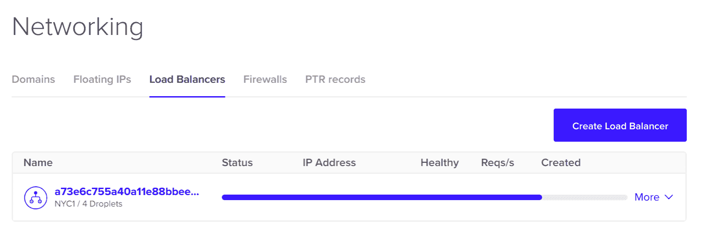

L4 负载均衡器将为我们的最终用户提供一个外部 IP 地址。Kubernetes 服务控制器将自动将我们的 Pod 条目填充到 L4 负载均衡器中，并设置健康检查和防火墙。最终结果是，任何击中 L4 负载均衡器的请求都将转发到匹配服务选择器的 Pod，在我们的例子中是 Ingress 控制器 Pod：

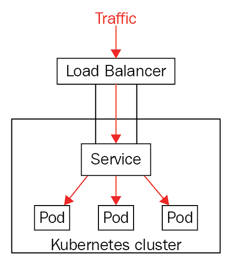

当请求到达 Ingress 控制器 Pod 时，它可以检查请求的主机和路径，并将请求代理到相关的服务：

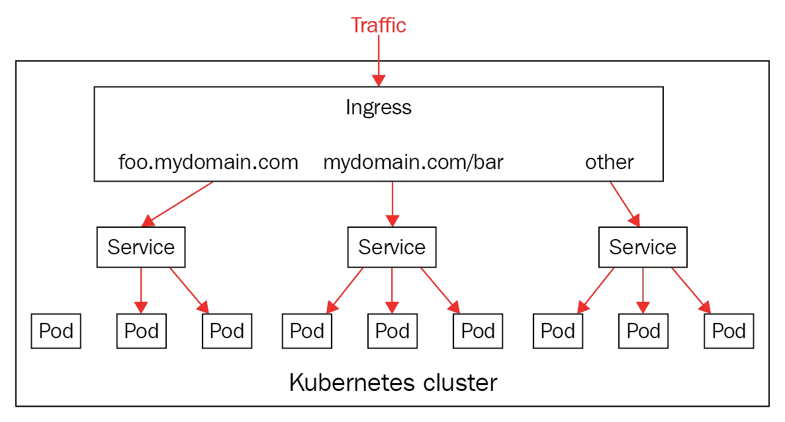

等一两分钟，然后通过运行 `kubectl get pods` 并指定 `ingress-nginx` 作为命名空间来检查控制器是否成功创建：

```js
$ kubectl get pods --namespace=ingress-nginx
NAME READY STATUS RESTARTS AGE
default-http-backend-5c6d95c48-8tjc5 1/1 Running 0 1m
nginx-ingress-controller-6b9b6f7957-7tvp7 1/1 Running 0 1m
```

如果你看到一个名为 `nginx-ingress-controller-XXX` 的 Pod 状态为 `Running`，你就准备就绪了！

# 部署 Ingress 资源

现在，我们的 Ingress 控制器正在运行，我们已经准备好部署我们的 Ingress 资源。在 `./manifests/backend/ingress.yaml` 创建一个新的清单文件，内容如下：

```js
apiVersion: extensions/v1beta1
kind: Ingress
metadata:
  name: test-ingress
  annotations:
    nginx.ingress.kubernetes.io/rewrite-target: /
spec:
  rules:
  - host: api.hobnob.social
    http:
      paths:
      - backend:
          serviceName: backend
          servicePort: 8080
  - host: docs.hobnob.social
    http:
      paths:
      - backend:
          serviceName: backend
          servicePort: 8100
```

重要的部分在于 `.spec.rules`。这是一个检查请求的主机和路径的规则列表，如果匹配，则将请求代理到指定的服务。

在我们的示例中，我们将域名 `api.hobnob.social` 的任何请求匹配到我们的 `backend` 服务，端口为 `8080`；同样，我们也将主机 `docs.hobnob.social` 的请求转发到我们的 `backend` 服务，但端口为 `8100`。

现在，使用 `kubectl apply` 部署它，然后等待 L4 负载均衡器的地址出现在 `kubectl describe` 输出中：

```js
$ kubectl apply -f ./manifest/backend/ingress.yaml
ingress.extensions "backend-ingress" created
$ kubectl describe ingress backend-ingress
Name: backend-ingress
Namespace: default
Address: 174.138.126.169
Default backend: default-http-backend:80 (<none>)
Rules:
 Host Path Backends
 ---- ---- --------
 api.hobnob.social
 backend:8080 (<none>)
 docs.hobnob.social
 backend:8100 (<none>)
Annotations:
 kubectl.kubernetes.io/last-applied-configuration: {"apiVersion":"extensions/v1beta1","kind":"Ingress","metadata":{"annotations":{"nginx.ingress.kubernetes.io/rewrite-target":"/"},"name":"backend-ingress","namespace":"default"},"spec":{"rules":[{"host":"api.hobnob.social","http":{"paths":[{"backend":{"serviceName":"backend","servicePort":8080}}]}},{"host":"docs.hobnob.social","http":{"paths":[{"backend":{"serviceName":"backend","servicePort":8100}}]}}]}}

 nginx.ingress.kubernetes.io/rewrite-target: /
Events:
 Type Reason Age From Message
 ---- ------ ---- ---- -------
 Normal UPDATE 2s nginx-ingress-controller Ingress default/backend-ingress
```

这意味着任何带有主机 `api.hobnob.social` 和 `docs.hobnob.social` 的请求现在都可以到达我们的分布式服务！

# 更新 DNS 记录

现在，由于 `api.hobnob.social` 和 `docs.hobnob.social` 域名都可以通过负载均衡器访问，是时候更新我们的 DNS 记录，将这些子域名指向负载均衡器的公网 IP 地址了：

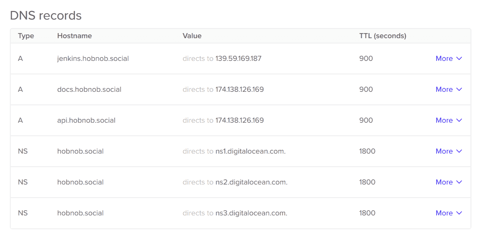

在 DNS 记录传播之后，打开浏览器并尝试访问 `docs.hobnob.social`。你应该能看到 Swagger UI 文档！

# 摘要

在本章中，我们已经成功地在 Kubernetes 上部署了我们的 Elasticsearch 实例和后端 API。我们学习了每个组件的角色以及每个组件管理的对象类型。

从我们开始到现在，你已经走了很长的路！为了完成它，让我们看看你是否能利用你所学的知识自己部署前端应用程序到 Kubernetes 上。
