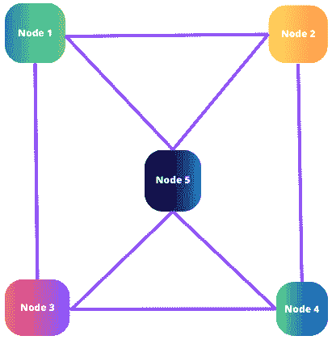

# 介绍微服务

**微服务**或**微服务架构**是一种设计软件应用程序的架构风格，它将应用程序构建为一系列小型、独立且松散耦合的服务。微服务提供了可伸缩性、敏捷性、独立开发和改进的容错性等好处。然而，它们也引入了服务编排、分布式数据管理和系统设计和测试复杂度增加等挑战。微服务的成功实施需要对特定应用程序需求进行仔细考虑，并制定明确的架构策略。

在这本书中，我们将学习微服务的一般知识以及如何在 Node.js 中架构和开发微服务。本书适合后端开发者、全栈开发者、软件架构师和希望进入后端开发世界并扩展其能力的前端开发者。你将深入学习如何使用 Node.js 构建微服务架构的主要技巧和窍门。本书结束时，你将能够使用 Node.js 概念化、规划和架构微服务，以及开发和调试它们。这些是公司希望员工具备的，以便每次都能为每个问题设计出完美的解决方案的主要技能。

我们将本章从对微服务和**去中心化架构**的介绍开始。我们还将了解微服务中的某些关键概念，例如服务边界、松散耦合、可伸缩性、弹性和独立的数据管理。最后，我们将概述微服务中的一些重要能力，包括独立开发和部署、多语言架构、API 和**持续集成**（**CI**）。

到本章结束时，你将学习到微服务的基本原理以及它们为何如此有用。

在本章中，我们将涵盖以下主要内容：

+   微服务和去中心化架构概念的介绍

+   服务边界和松散耦合

+   独立开发和部署以及多语言架构

+   可伸缩性、弹性和独立的数据管理

+   API 和通信以及 CI

# 微服务和去中心化架构概念的介绍

在本节中，我们将学习两个重要概念：微服务和去中心化架构。

**微服务**是一种架构风格和构建软件应用程序的方法，它将应用程序构建为一系列小型、松散耦合且可独立部署的服务。同时，在去中心化架构中，组件或服务分布在多个节点或实体之间。

微服务架构和去中心化架构都促进了模块化、可扩展性、容错性和自主性。虽然微服务侧重于将应用程序构建为小型服务的集合，而去中心化架构侧重于在多个节点之间分配处理和决策。这些架构方法可以结合使用，构建高度可扩展、弹性好和灵活的系统，能够适应不断变化的需求并处理复杂的工作负载。

让我们从微服务架构开始。

## 微服务架构

在微服务架构中，应用程序被分解成多个小型服务，每个服务负责特定的业务能力。这些服务是独立开发、部署和管理的，通过定义良好的**应用程序编程接口**（**API**）或基于消息的协议相互通信。

*图 1*.*1* 显示了典型的微服务架构与典型的单体架构的比较。

图 1.1：典型的微服务架构

在 **Node.js** 中，微服务通常使用轻量级框架如 Express.js 或 Fastify 进行开发。每个微服务都是一个独立的应用程序，拥有自己的代码库，可以独立开发、部署和扩展。微服务可以用不同的编程语言编写，如 Java 和 Python，但 Node.js 由于其效率、事件驱动特性和庞大的模块生态系统，通常被选择。

微服务的核心特性包括以下内容：

+   **模块化**：微服务促进模块化方法，其中每个服务都是自包含的，专注于特定的业务功能。服务可以独立开发、更新和扩展，从而提供灵活性和易于维护。

+   **松耦合**：微服务是松耦合的，这意味着它们之间相互依赖性最小。它们通过定义良好的接口进行通信，通常使用轻量级协议，如 RESTful API 或消息系统。这种松耦合使得服务可以独立地演进和扩展，而不会影响整个系统。

+   **独立部署性**：每个微服务都可以独立于其他服务进行部署。这允许快速部署并降低系统级故障的风险。它还使团队能够同时处理不同的服务，促进更快的开发周期和持续部署实践。

+   **多语言架构**：微服务架构允许每个服务使用不同的技术、编程语言和框架。这种灵活性使得团队能够根据特定服务的需求和特点选择最合适的技术堆栈。

+   **弹性和容错隔离**：一个微服务的故障不会导致整个系统崩溃。一个服务中的故障或错误被隔离，不会传播到其他服务。这增强了系统的整体弹性和容错性。

理解这些关键特性对于设计、开发和维护成功的微服务架构至关重要。接受这些原则可以导致更可扩展、更具有弹性和更敏捷的软件系统，以满足现代应用开发的需求。

现在你已经了解了微服务架构的概念，并学习了其关键特性，让我们深入了解下一个概念：去中心化架构。

## 去中心化架构

**去中心化架构**，也称为**分布式架构**，指的是一种架构方法，其中组件或服务分布在多个节点或实体上，而不是集中管理。通过在多个节点上分配处理、数据和决策，这种方法促进了自主性、可扩展性和容错性。

中心化架构有一个控制点，这使得它们更容易管理，但可能不太可扩展且更容易出现故障。去中心化架构通过分散控制和数据，提供了更好的可扩展性、容错性和性能，尤其是在大型和动态系统中。

中心化架构的例子包括传统的客户端-服务器架构，其中客户端与中央服务器通信。大型机以及许多早期的计算系统都遵循中心化架构。

去中心化架构的例子包括区块链网络、对等文件共享系统和某些类型的分布式数据库。此外，一些现代微服务架构遵循去中心化原则，其中服务可以独立运行。

*图 1*.*2* 展示了一个典型的去中心化架构：

图 1.2：典型的去中心化架构

去中心化架构的关键方面包括以下内容：

+   **责任分配**：在去中心化架构中，责任和任务分布在多个节点或实体上。每个节点独立运行，并负责特定的功能或服务。这种分配允许更好的资源利用，并可以提高容错性和性能。

+   **自主性和独立性**：去中心化架构中的节点具有一定的自主性，可以独立运行。它们可以做出决策、处理数据并提供服务，而无需依赖中央协调。这种自主性使得系统即使在与其他节点的连接中断的情况下也能继续运行。

+   **对等通信**：去中心化架构通常依赖于节点之间的对等通信。节点可以直接相互交互，交换消息、数据或资源，无需中央中介。对等通信实现了去中心化决策、数据共享和协作。

+   **可扩展性和负载分配**：去中心化架构可以通过添加更多节点来水平扩展，以处理增加的工作负载。随着系统的发展，可以添加新的节点，分配负载，从而提高可扩展性和性能。这种可扩展性使去中心化架构非常适合处理大规模应用程序或具有动态资源需求的系统。

+   **弹性和容错性**：与集中式架构相比，去中心化架构提供了更好的弹性和容错性。如果一个节点失败或不可用，系统可以通过将请求或任务路由到其他可用节点来继续运行。节点可以独立恢复，并且故障不太可能影响整个系统。

+   **安全和隐私**：与集中式架构相比，去中心化架构可以提供增强的安全性和隐私性。分布式数据存储和通信模式使得攻击者更难破坏系统或未经授权访问敏感信息。此外，去中心化系统可以允许用户对自己的数据和身份保持更多控制。

在设计和实施去中心化架构时，理解这些关键方面至关重要。通过利用分布、自主性和可扩展性的优势，组织可以构建强大且灵活的系统，能够处理现代计算挑战。

在下一节中，我们将探讨服务边界和松散耦合的原则。

# 服务边界和松散耦合

服务边界和松散耦合是软件架构中的关键原则，尤其是在微服务背景下。让我们更详细地探讨这些概念。

## 服务边界

**服务边界**指的是软件系统内的逻辑或功能划分，其中每个边界代表一个独立的服务。在微服务架构中，服务围绕特定的业务能力或边界上下文进行设计。每个服务负责一组定义良好的功能、操作或数据。

服务边界概念提供了以下好处：

+   **模块化和可维护性**：服务边界有助于将复杂系统分解成更小、更易于管理的部分。每个服务可以独立开发、部署和维护，从而实现更好的模块化和易于维护。

+   **可扩展性和性能**：通过根据特定的业务能力将系统划分为服务，可以更容易地水平或垂直扩展单个服务以满足不同的需求。服务可以独立扩展以优化资源利用并提高整体系统性能。

+   **自主性和团队独立性**：服务边界使得跨职能团队能够独立于不同的服务工作。每个团队可以专注于其服务需求、技术和开发实践，从而加快开发周期并提高团队自主性。

+   **灵活性和技术多样性**：有了清晰的服务边界，团队可以根据每个服务的具体需求选择最合适的技术、编程语言或框架。这促进了技术多样性，并允许为每一项工作使用正确的工具。

+   **故障隔离和弹性**：服务边界有助于将故障限制在单个服务内。如果一个服务遇到问题或失败，它不会影响整个系统。其他服务可以继续独立运行，促进故障隔离和整体系统弹性。

理解和定义清晰的服务边界对于成功的微服务架构至关重要。通过关注模块化和独立的服务，组织可以构建可扩展、可维护和适应性强，与业务需求一致并支持有效团队协作的系统。

## 松耦合

**松耦合**是一种设计原则，强调减少软件组件或服务之间的依赖。它允许组件以彼此内部工作了解最少的程度相互交互。松耦合在系统中促进独立性、灵活性和适应性。

这里是松耦合的一些关键方面：

+   **定义明确的接口**：组件通过定义明确的接口或合约进行通信，例如 API、消息格式或事件。接口抽象了实现细节，使得组件能够根据约定的合约进行交互，而不是紧密集成。

+   **最小依赖性**：组件对其他组件或服务的依赖性最小。它们只依赖于其操作所需的具体数据或功能，减少了相互依赖。

+   **解耦的开发和部署**：松耦合允许组件或服务的独立开发和部署。一个组件的变化对其他组件的影响最小，这允许更快地迭代、更容易的更新和更频繁的部署。

+   **可替换性和可扩展性**：在松耦合中，组件可以轻松替换或扩展，而不会影响整个系统。可以引入新的组件，现有的组件也可以进行修改或升级，造成最小的干扰。

+   **可测试性和隔离**：松散耦合通过允许对组件进行隔离测试来促进可测试性。依赖项可以被模拟或存根，从而允许进行集中的单元测试和验证单个组件。

通过实现松散耦合，系统变得更加模块化、易于维护和适应。这使独立开发和部署成为可能，增强了可扩展性和弹性，并支持软件架构随时间无缝演进。

*图 1.3*展示了松散耦合服务的架构：

图 1.3：松散耦合的服务

在*图 1.3*中，每个圆圈代表一个组件。

在构建可扩展和可维护的软件系统时，服务边界和松散耦合是密切相关的概念。通过定义清晰的服务边界并确保服务与组件之间的松散耦合，组织可以创建灵活的、模块化的架构，从而实现敏捷性、可扩展性和独立开发。

在下一节中，我们将深入探讨独立开发和部署以及多语言架构。

# 独立开发和部署与多语言架构

独立开发和部署与多语言架构是成功实施微服务的一些关键能力。独立开发和部署允许团队自主工作。采用多语言架构，团队可以使用最佳编程语言、框架等，以最佳质量交付软件。

## 独立开发和部署

**独立开发和部署**指的是独立开发和部署软件系统中的单个组件或服务的能力，而不需要将它们紧密耦合到其他组件。这种方法是微服务的一个基本原则，它允许团队自主工作，专注于特定的服务或功能。

这里有一些关于独立开发和部署的关键方面和好处：

+   **团队自主性**：独立开发和部署赋予跨职能团队自主工作的能力，允许团队在没有过多与其他团队协调的情况下做出决策和实施变更。每个团队可以专注于他们特定的服务或功能，从而加快开发周期并提高生产力。

+   **更快地迭代和发布**：独立开发允许团队根据自己的发布计划工作，从而实现更快的迭代和频繁的发布。团队可以在不等待整个系统发布的情况下，将更新和新功能部署到各自的服务中。这促进了敏捷性，实现了快速实验，并允许更快地响应用户反馈。

+   **降低相互依赖性**：独立开发减少了团队和组件之间的相互依赖性。团队可以对他们的服务进行更改、更新或修复，而不会影响其他服务或整体系统。这种隔离有助于最小化回归风险，并使识别和解决问题更加容易。

+   **改进故障隔离**：当组件独立开发和部署时，一个组件中的故障或问题会被隔离，不会传播到其他组件。这提高了故障隔离和弹性，因为故障被限制在受影响的服务内，最小化了对其余系统的影响。

+   **可扩展性和资源优化**：独立开发和部署允许团队根据其特定需求独立扩展单个服务。资源可以分配给高需求服务，而资源密集度较低的服务可以以最小资源运行。这种细粒度的可扩展性优化了资源利用，并提高了整体系统性能。

理解独立开发和部署的重要性对于采用敏捷开发实践和构建可扩展、适应性强和易于维护的软件系统至关重要。赋予团队独立工作的能力可以提高生产力、创新和协作，最终在快速发展的技术环境中取得成功的结果。

现在，让我们来看看多语言架构的概念和关键方面。

## 多语言架构

**多语言架构**指的是在软件系统中使用多种编程语言、技术和框架的实践。在多语言架构中，不同的服务或组件可能使用不同的语言或技术来实现，以最好地满足其特定需求。

下面是多语言架构的一些关键方面和好处：

+   **技术匹配**：不同的服务或组件可能有不同的需求，例如性能、可扩展性或与外部系统的集成。多语言架构允许团队为每个服务选择最合适的技术堆栈，利用不同语言或框架的优势。这种技术匹配可以导致更高效和优化的解决方案。

+   **专业化**：多语言架构使团队能够利用个别团队成员的专业知识和优势。如果一个团队在特定语言或框架方面有专业知识，他们可以使用它来为其服务，促进专业化，并最大化团队的生产力和效率。

+   **灵活性和创新**：通过采用多语言架构，组织可以探索和采用新技术、框架或编程语言。这促进了创新文化，并使开发团队能够跟上技术行业的最新进展。

+   **重用和集成**：多语言架构允许集成使用不同技术开发的现有系统或服务。它促进了遗留系统或外部组件的重用，使得在整体架构中实现无缝集成成为可能。

+   **避免供应商锁定**：使用多种技术有助于减少对单一供应商或技术堆栈的依赖。它减轻了与供应商锁定相关的风险，并在需要时提供了切换技术或供应商的灵活性。

然而，采用多语言架构也带来了一些挑战，例如在部署、维护和具有不同技术堆栈的团队之间的协作方面增加了复杂性。适当的治理、文档和知识共享实践是确保有效协调和减轻潜在缺点所必需的。

*图 1*.*4* 展示了一个简单的多语言架构：

图 1.4：一个简单的多语言架构

总体而言，独立开发和部署，以及多语言架构，使团队能够自主工作，利用最适合的技术，并交付可扩展、高效且符合每个组件或服务特定要求的软件系统。

在下一节中，我们将探讨一些其他关键方面：可扩展性、弹性和独立数据管理。

# 可扩展性、弹性和独立数据管理

可扩展性和弹性是构建健壮且高性能软件时在微服务中需要牢记的一些关键概念。此外，在微服务中，每个服务都有自己的数据库，因此每个数据存储都是独立的。

## 可扩展性和弹性

**可扩展性和弹性**是构建健壮且高性能软件系统的关键方面。让我们更详细地探讨这些概念。

可扩展性指的是系统处理增加的工作负载和满足增长需求而不牺牲性能的能力。它涉及将系统向上扩展或向外扩展的能力，以确保最佳资源利用和响应性。

下面是实现可扩展性的关键考虑因素：

+   **水平扩展**：水平扩展涉及添加更多实例或节点，以将工作负载分布到多个服务器或机器上。它通过并行处理请求，允许增加吞吐量和改进性能。

+   **垂直扩展**：垂直扩展，也称为向上扩展，涉及增加单个实例的资源（如 CPU、内存或存储）以处理更高的工作负载。垂直扩展可以通过升级硬件或利用提供可扩展资源分配的基于云的服务来实现。

+   **负载均衡**：负载均衡机制将传入请求分配到多个实例，以确保工作负载均匀分布并防止任何单个组件过载。负载均衡器根据服务器健康、容量或响应时间等因素智能路由请求。

+   **缓存**：实施缓存机制，如内存缓存或**内容分发网络**（**CDNs**），可以显著提高可扩展性。通过将频繁访问的数据或计算结果存储在用户附近，缓存减少了后端服务的负载，从而减少了重复处理的需求。

+   **异步处理**：将长时间运行或资源密集型任务卸载到异步处理系统，如消息队列或后台工作者，有助于提高可扩展性。通过异步处理任务，系统可以处理更多的并发请求并优化资源利用。

+   **弹性**：弹性是指系统从故障中恢复、适应变化条件并继续可靠运行的能力。弹性系统旨在最小化故障的影响并保持基本功能。在构建弹性系统时考虑以下因素：

    +   **冗余和复制**：在多个实例或节点上复制关键组件或数据确保了冗余和容错性。如果一个实例失败，其他实例可以无缝接管以保持系统可用性和防止数据丢失。

    +   **故障隔离**：设计具有明确服务边界和松耦合的系统确保单个组件的故障或问题不会传播到其他组件。故障隔离防止局部故障影响整个系统。

    +   **故障处理和恢复**：实施健壮的错误处理和恢复机制对于弹性至关重要。系统应能够检测故障，在可能的情况下自动恢复，并向用户或下游组件提供清晰的反馈。

    +   **监控和警报**：持续监控系统健康、性能和错误率有助于实时识别问题或潜在的故障。主动警报机制可以在异常或关键事件发生时通知相关人员，以便及时干预和缓解。

    +   **优雅降级和熔断器**：系统应设计为在高负载或故障条件下优雅地降级功能。可以实施熔断器以自动停止向失败的组件或服务发送请求，减少对系统的影响并允许其恢复。

可扩展性和弹性紧密相连。可扩展的系统通常在设计时就考虑了弹性，而具有弹性的系统可以通过可扩展的架构更好地处理增加的工作负载。通过将这些特性纳入其设计，开发者可以创建强大且可靠的软件系统，能够适应不断变化的需求，即使在困难条件下也能提供积极的用户体验。

## 独立的数据管理

**独立的数据管理**指的是以去中心化的方式在单个服务或组件内管理数据的实践。在微服务架构中，每个服务通常都有自己的数据存储或数据库，数据管理的责任位于服务边界内。

这里是独立数据管理的关键考虑因素：

+   **数据所有权和自主性**：每个服务负责管理自己的数据，包括数据存储、检索和修改。这促进了自主性，并允许团队就数据模型、存储技术和数据访问模式做出独立决策。

+   **去中心化的数据存储**：服务可以根据其特定需求使用不同类型的数据库或存储技术。例如，一个服务可能使用关系型数据库，而另一个服务可能使用 NoSQL 数据库（见*第九章*）或针对特定用例优化的专用数据存储。

+   **数据一致性和同步**：当数据分布在多个服务中时，确保数据一致性可能具有挑战性。可以使用最终一致性、分布式事务或事件驱动架构等技术来在服务之间同步数据并维护数据完整性。

+   **数据访问和通信**：服务通过定义良好的 API 或基于消息的协议相互通信，以访问和交换数据。服务边界应具有清晰的数据交换合同和 API，以便服务在保持松散耦合的同时进行交互。

+   **数据安全和访问控制**：每个服务应实施适当的安全措施和访问控制，以保护其数据。实施身份验证、授权和加密机制确保在服务边界内数据隐私和安全。

+   **数据集成和聚合**：虽然服务管理自己的数据，但在某些情况下，可能需要将来自多个服务的数据进行聚合或集成以用于特定用例。数据管道、数据仓库或事件驱动架构等技术可以促进跨服务的数据集成和聚合。

独立的数据管理允许服务独立发展和扩展，促进团队自主性，并减少服务之间的相互依赖。

*图 1.5*展示了数据管理过程：

图 1.5：数据管理过程

然而，数据管理过程也引入了与数据一致性、同步和整个系统范围内的数据一致性相关的问题。组织应仔细设计数据管理策略，并采用适当的模式和科技来应对这些挑战，同时保持独立数据管理的优势。

在下一节中，我们将学习关于 API、通信和 CI 的内容。

# APIs 和通信以及 CI

**API**代表**应用程序编程接口**。它是一组规则和协议，允许不同的软件应用程序相互通信和交互。API 定义了不同的软件组件应该如何交互，它们可以交换什么数据，以及它们可以执行什么操作。CI 是一种常见的软件实践，允许来自世界各地的贡献者向一个共享的代码库贡献。

## APIs 和通信

**API**在使软件架构中不同组件、服务或系统之间进行通信和交互方面发挥着至关重要的作用。API 定义了不同实体如何相互交互、交换数据以及调用功能。

下面是关于 API 和通信的关键考虑因素：

+   **API 设计和文档**：设计良好的 API 遵循标准和最佳实践（见*第十章*），确保开发者的清晰性、一致性和易用性。全面的 API 文档，包括端点细节、请求/响应格式、身份验证要求和错误处理，有助于开发者有效地理解和利用 API。

+   **API 网关**：API 网关充当客户端应用程序访问多个 API 的入口点。它提供了一个集中式接口，处理身份验证、安全、请求路由和速率限制，并可以执行缓存、日志记录和监控等任务。API 网关简化了客户端交互并提高了整体 API 管理。

+   **API 版本控制**：随着 API 随时间演变，实施版本控制策略以保持向后兼容性至关重要。版本控制允许客户端使用所需的 API 版本，同时确保现有客户端不受更改的影响。

+   **身份验证和授权**：API 通常需要身份验证和授权机制以确保安全访问。常见的方法包括 API 密钥、令牌（如 JWT）、OAuth 或与身份和访问管理系统的集成。适当的身份验证和授权可以防止未授权访问并保护敏感数据。

+   **数据格式和协议**：API 可以根据需求和与客户端应用程序的兼容性使用各种数据格式，如 **JavaScript 对象表示法**（**JSON**）、**可扩展标记语言**（**XML**）或协议缓冲区。类似地，可以选择通信协议，如 **表示状态转移**（**REST**）、GraphQL 或消息队列（例如 RabbitMQ、Apache Kafka）（见 *第十章*），具体取决于用例。例如，REST API 的最常见用例是 Web API。

+   **异步通信**：可以使用异步通信模式，如消息队列或发布-订阅系统，来实现组件或服务之间的松散耦合和解耦通信。这些模式支持事件驱动架构，并提高可伸缩性、响应性和容错性。

API 为开发者提供了一种访问系统或服务功能的方式，而无需了解其内部实现细节。它们抽象了底层复杂性，并提供了一个标准化的接口，允许应用程序以一致和可预测的方式请求和交换数据。

*图 1**.6* 展示了一个 REST API 的示例：

图 1.6：一个 REST API

API 在现代软件开发中扮演着基本角色，使得不同系统之间的无缝集成和协作成为可能。它们提供了一种访问外部数据和服务的方式，允许应用程序扩展其功能并与广泛的服务和资源交互。

## CI

**CI** 是一种软件开发实践，涉及将多个开发者的代码更改频繁地集成到一个共享代码库中。CI 的关键目标是自动化集成过程并尽早发现集成问题。

这里是 CI 的关键方面：

+   **版本控制系统**（**VCS**）：CI 依赖于强大的 VCS（如 Git）来管理代码更改、分支和版本历史。开发者频繁地将代码更改提交到代码库，确保集成有一个可靠的代码来源。

+   **自动化构建**：CI 涉及设置自动化构建过程，根据触发器（如代码提交）编译、测试和打包软件。自动化构建系统，如 Jenkins、Travis CI 或 GitLab CI/CD（见 *第十一章*），从代码库中拉取最新代码，并以一致和可重复的方式构建应用程序。

+   **自动化测试**：CI 鼓励自动化测试实践，如单元测试、集成测试和功能测试。测试套件作为构建过程的一部分执行，以确保代码更改不会引入回归并保持软件的整体质量。

+   **CI 服务器**：CI 服务器或 CI/CD 平台协调 CI 流程，监控代码变更，触发构建，运行测试，并向开发团队提供反馈。它为构建失败或测试错误生成报告、警报和通知。

+   **代码质量检查**：CI 可以集成静态代码分析工具来识别代码异味、维护代码风格一致性并强制执行最佳实践。这些工具分析代码库中潜在的问题，包括代码复杂性、安全漏洞和对编码指南的遵守。

+   **工件管理**：CI 涉及生成可部署的工件，如二进制文件、容器镜像或部署包，这些工件可以轻松部署到各种环境中。工件管理系统，如 Nexus 或 JFrog Artifactory，有助于管理和存储这些工件。

+   **CI 管道**：CI 管道定义了 CI 流程的阶段和步骤，包括构建、测试、代码分析和工件生成。CI 管道可以根据项目需求定制，包括特定的构建、测试和发布步骤。

额外阅读

Jenkins: [`www.jenkins.io/doc/`](https://www.jenkins.io/doc/)

)

Travis CI: [`docs.travis-ci.com/user/for-beginners/`](https://docs.travis-ci.com/user/for-beginners/)

)

GitLab CI/CD: [`docs.gitlab.com/ee/ci/`](https://docs.gitlab.com/ee/ci/)

)

*图 1**.7* 展示了 CI 在行动中的情况：

图 1.7：CI 在行动中

CI 的好处包括早期发现集成问题、更快的反馈周期、改进的协作以及降低集成复杂性。CI 确保软件始终处于可发布状态，使团队能够快速、可靠地交付高质量的软件，并降低风险。

# 摘要

微服务和 Node.js 是两个可以极大地影响现代软件系统开发的强大概念。以下是探索微服务和 Node.js 组合时需要考虑的关键点总结：

+   **微服务**：微服务是一种架构方法，复杂的应用程序被构建为一系列小型、独立的服务的集合。每个服务专注于特定的业务能力，可以独立开发和部署，并通过定义良好的 API 或消息协议与其他服务通信。微服务提供了模块化、可扩展性、故障隔离和自主性等好处，允许更快的开发周期、更简单的维护以及在技术选择上的灵活性。

+   **Node.js**: Node.js 是基于 V8 引擎构建的 JavaScript 运行时环境，专为服务器端开发设计。它提供了一个基于事件的、非阻塞的 I/O 模型，允许构建高度可扩展和性能卓越的应用程序。由于其轻量级、异步的特性，Node.js 非常适合微服务，因为它能够高效地处理多个并发请求。其丰富的包和框架生态系统，以及其在客户端和服务器端对 JavaScript 的支持，使其成为微服务开发的流行选择。

+   **结合微服务和 Node.js**：当将微服务与 Node.js 结合使用时，开发者可以利用 Node.js 的事件驱动架构和生态系统来构建可扩展和响应的微服务。Node.js 的非阻塞 I/O 模型允许服务处理高并发级别，使其非常适合微服务之间的通信和交互。其广泛的包管理器 npm 提供了大量的库和工具，以促进微服务架构的开发。

+   **与微服务和 Node.js 一起工作**：当与微服务和 Node.js 一起工作时，考虑各种方面非常重要，包括服务边界、松散耦合、API 设计、数据管理、可扩展性、弹性、监控和安全。正确定义服务边界、确保服务之间的松散耦合、设计健壮的 API 以及独立管理数据对于构建可扩展和维护的微服务架构至关重要。实施可扩展性、弹性、监控和安全策略可以增强整个系统的性能、可靠性和安全性。

总结来说，利用微服务和 Node.js 的力量可以开发出灵活、可扩展和易于维护的软件系统。通过拥抱微服务的模块化特性并利用 Node.js 的异步能力，开发者可以构建高度响应的分布式应用程序，这些应用程序能够适应不断变化的需求并有效地处理复杂的工作负载。

在下一章中，我们将介绍微服务的核心原则。我们将深入探讨在 Node.js 中开发微服务时关于微服务的更多细节及其最佳实践。

# 测验时间

+   微服务的关键特征是什么？

+   独立开发和部署有哪些关键方面和好处？

+   什么是多语言架构？

+   什么是 API？
