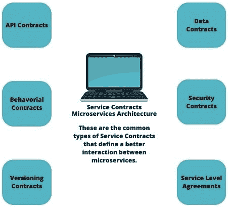

# 第二章：探索微服务的核心原则

**微服务**是一种旨在将软件系统开发为一系列小型、松散耦合且可独立部署的服务架构风格。

我们将从这个章节开始，探索微服务的核心原则。为了学会以微服务的方式思考，你需要理解这种架构风格背后的核心原则和心态。以微服务的方式思考是从传统的单体思维模式转变。它需要一种将复杂系统分解成更小、更易于管理的部分，并在团队中促进独立性和灵活性的心态。你应该接受微服务的原则，并通过实践经验持续深化你的理解。

到本章结束时，你将学习到微服务的核心原则以及如何在日常工作中应用它们。

在本章中，我们将涵盖以下主要主题：

+   微服务核心原则概述

+   理解基础并识别业务能力

+   定义服务合约和去中心化决策

+   优先考虑自主性和所有权以及设计弹性

+   实施通信策略和确保可扩展性

+   实施可观察性和持续学习和改进

# 微服务核心原则概述

在本节中，我们将学习微服务的核心原则。微服务围绕特定的业务能力组织，并通过定义良好的**应用程序编程接口**（**APIs**）相互通信。微服务的核心原则围绕自主性、边界上下文、去中心化和弹性。

让我们更详细地探讨这些原则：

+   **自主性**：系统中的每个微服务都被设计成是自主的。这意味着每个服务可以独立开发、部署和扩展，而不依赖于其他服务。自主性允许开发团队独立工作，选择适当的技术，并就服务实现做出决策。

+   **边界上下文**：边界上下文指的是为每个微服务定义清晰的边界和责任的概念。每个服务都应该有一个特定的业务领域或它所关注的特定功能。通过定义这些边界，服务可以独立开发和维护，减少依赖性和复杂性。

+   **去中心化**：微服务通过将系统的功能分布到多个服务中，促进了去中心化。而不是构建一个单体应用，微服务允许将系统分解成更小、更易于管理的组件。这种功能分布允许团队独立开发和部署服务，从而实现更快的开发和部署周期。

+   **弹性**：弹性是微服务的一个关键原则，因为分布式系统中的故障是不可避免的。微服务被设计成优雅地处理故障并从中恢复，而不会影响整个系统。服务应具有容错性，故障应被隔离在受影响的服务内，以最小化对其他服务的影响。

与微服务相关的一些额外原则和最佳实践包括以下内容：

+   **单一职责**：每个微服务应该有一个单一职责或做好一件事。这个原则有助于保持服务专注且易于管理。

+   **通过 API 进行通信**：微服务通过定义良好的 API 相互通信，通常使用轻量级协议，如**表示状态转移**（**REST**）或消息系统，如 RabbitMQ 或 Apache Kafka。

+   **数据管理**：每个微服务应该有自己的数据库或数据存储，保持数据对该服务的私有性。这确保了服务之间的松散耦合，并防止了数据访问的复杂性。

+   **基础设施自动化**：微服务受益于基础设施自动化实践，例如**持续集成/持续部署**（**CI/CD**）、容器化以及 Docker 和 Kubernetes 等编排工具。

+   **监控和可观察性**：监控和可观察性对于微服务深入了解系统的性能、健康状况和问题至关重要。日志、指标和分布式跟踪是实现微服务架构可观察性的关键工具。

+   **演化设计**：微服务应该以变化为预期进行设计。架构应该足够灵活，能够适应新功能、扩展和不断发展的业务需求，而不会干扰其他服务。

理解这些原则对于使用微服务做好工作非常有价值。这些原则在您不浪费时间使用旧方法的同时，帮助您找到每个问题的解决方案。使用微服务，您将始终能做好工作，可以按时完成工作，调试也变得容易得多。

*图 2.1* 解释了微服务的核心原则：

图 2.1：微服务的核心原则

通过遵循这些核心原则，开发团队可以使用微服务架构风格创建可扩展、模块化和可维护的软件系统。

现在我们已经了解了微服务的核心原则，接下来让我们进入下一节，探讨其基础和业务能力。

# 理解基础和识别业务能力

理解基础并识别微服务的业务能力是设计有效微服务架构的关键步骤。这涉及到分析应用程序的需求，将系统分解成更小的功能组件，并识别每个微服务将封装的个别业务能力。

以下是理解基础并识别微服务业务能力的要点步骤：

+   **领域驱动设计（DDD**）: DDD 是一种强调在应用程序设计中建模领域（业务问题）的方法。它涉及与领域专家和利益相关者合作，以深入了解业务需求、规则和流程。

+   **单体系统分解**: 如果您正在从单体架构迁移到微服务，您需要分析单体应用程序的功能，并将其分解成更小的功能组件。每个组件随后可能成为潜在的微服务。

+   **边界上下文**: 在领域驱动设计（DDD）中，边界上下文定义了特定业务能力的清晰边界。您需要识别应用程序中的边界上下文，并将它们视为微服务的候选者。

+   **业务能力识别**: 在每个边界上下文中，您应该识别需要由微服务处理的核心理念业务能力。这些能力代表微服务将提供的具体功能或服务。

+   **独立性和自主性**: 您必须确保每个微服务都有一个明确且独立的职责，封装单个业务能力。这种自主性允许每个服务独立开发、部署和扩展。

+   **松耦合**: 微服务应与其他服务保持最小依赖，以实现松耦合。您需要识别不同业务能力之间的关系和依赖，并据此设计服务。

+   **团队所有权**: 您必须将每个微服务的所有权分配给特定的团队。团队应该是跨职能的，并包括开发、部署和维护微服务所需的所有技能。

+   **API 设计**: 您应该为每个微服务定义清晰且文档齐全的 API，指定其他服务或客户端如何与其提供的功能交互。

+   **共享库和组件**: 您需要识别可以在多个微服务之间使用的通用功能或共享组件，以促进代码重用和一致性。

+   **可扩展性考虑**: 您应该分析每个业务能力的可扩展性需求，以确定是否应该将其作为单独的微服务实现。某些能力可能有更高的需求，并从独立可扩展性中受益。

+   **数据管理**：您必须考虑每个业务能力的数据需求，并决定每个微服务是否将拥有自己的数据库，或者数据是否应该通过事件或其他机制在服务之间共享。

理解基本原理和识别业务能力是构建成功的微服务架构的关键步骤。这涉及到对应用程序需求的深入理解，并将系统分解成更小、更易于管理的组件。

通过理解基本方面并识别微服务的业务能力，您可以设计一个可扩展的、可维护的、具有弹性的微服务架构，该架构与您应用程序的具体需求相一致，并支持现代软件开发所需的敏捷性和灵活性。

在下一节中，我们将学习如何定义服务合同和去中心化决策。

# 定义服务合同和去中心化决策

微服务中的服务合同指的是服务之间建立的和期望的协议。同时，去中心化决策是微服务架构的一个基本原则，它赋予各个开发团队独立决策的能力。让我们详细了解这些概念。我们将从微服务中的服务合同开始。

## 微服务中的服务合同

**微服务中的服务合同**指的是服务之间建立的和期望的协议。它们定义了不同的微服务如何交互、通信和交换数据。服务合同在确保微服务可以无缝协作中发挥着至关重要的作用，即使它们是独立开发和部署的。

常见的服务合同类型包括以下几种：

+   **API 合同**：API 合同定义了微服务用于通信的接口和数据格式。它们包括有关请求和响应有效负载、端点、身份验证要求和支持的操作的详细信息。

+   **行为合同**：行为合同指定了微服务的预期行为和交互。它们可能包括关于错误处理、响应时间和业务逻辑的规则。

+   **版本控制合同**：随着微服务的演变，拥有允许向后兼容的版本控制合同是至关重要的。它们确保对微服务合同的更改不会破坏现有的消费者。

+   **数据合同**：数据合同概述了微服务之间交换数据的结构和验证规则。它们确保服务理解彼此的数据格式，避免数据不一致。

+   **安全合同**：安全合同定义了与微服务交互的安全要求和约束。它们包括身份验证和授权机制，以保护敏感数据和资源。

+   **服务级别协议（SLA）**：SLA 规定了微服务之间预期的服务性能、可用性和响应时间水平。

这些是在微服务架构中最常用的服务合同。它使开发者能够更好地引导项目。在微服务架构的背景下，服务合同指的是明确规定的协议和规范，它们规定了微服务之间如何相互通信。这些合同定义了服务相互交互时遵循的输入和输出格式、协议、数据类型和错误处理机制。清晰和明确的服务合同对于确保微服务之间无缝通信和协作至关重要。

*图 2.2* 以图形方式展示了服务合同：

图 2.2：服务合同

通过遵守明确的服务合同，微服务可以有效地进行通信，从而实现模块化、可扩展和可维护的系统。这些合同为每个微服务提供了一个清晰的接口，允许它们独立演变，而不会干扰系统的其他部分。

在掌握了最常用的服务合同之后，我们现在来看看微服务架构中去中心化决策的原则。

## 微服务中的去中心化决策

**去中心化决策**是微服务架构的一个基本原则，它赋予各个开发团队独立做决策的能力。这种方法促进了敏捷性、自主性和更快的开发周期。

去中心化决策的关键方面如下：

+   **自主团队**：每个微服务都由一个专门的团队拥有和管理，该团队对其开发、部署和运营拥有完全控制权。

+   **面向领域的团队**：团队围绕特定的业务领域或能力组织，使他们拥有深厚的专业知识和对其负责的微服务的清晰理解。

+   **技术栈选择**：团队有权选择最适合其微服务需求的技术栈、编程语言、框架和工具。

+   **服务独立性**：去中心化确保每个微服务可以独立演变，而不会影响其他服务，从而降低了相互依赖和瓶颈的风险。

+   **快速反馈循环**：短的反馈循环允许团队快速迭代，并基于实时数据和用户反馈做出明智的决策。

+   **协作和沟通**：虽然团队是自主运作的，但团队之间的协作和沟通对于共享理解和避免重复工作至关重要。

+   **通过合同保证一致性**：服务合同作为一个机制，确保服务能够在保持自主性的同时协同工作。

去中心化决策使微服务能够有效地扩展，促进创新，并使团队能够快速响应变化的需求。然而，它需要组织内部有强大的沟通、协调和共同愿景，以确保整体架构与业务目标保持一致。

*图 2.3* 展示了去中心化架构的图示：

图 2.3：去中心化架构

定义服务合同和去中心化决策是微服务架构中的关键原则，这些原则促进了有效的沟通和敏捷性。

通过定义服务合同和去中心化决策，微服务架构可以实现有效的沟通、适应性和响应性，确保系统能够优雅地适应不断变化的业务需求和科技进步。

在下一节中，我们将看到如何优先考虑自主性和所有权，以及如何设计具有弹性的微服务。

# 优先考虑自主性和所有权，并设计具有弹性

优先考虑自主性和所有权，并设计具有弹性是微服务架构中的两个基本原则，有助于系统的成功和有效性。让我们详细探讨这些原则。

## 优先考虑自主性和所有权

**微服务中的自主性和所有权**指的是赋予个人开发团队设计、开发、部署和维护各自微服务的责任。这一原则使团队能够控制其微服务，并培养所有权和责任感。

优先考虑自主性和所有权的一些关键方面包括以下内容：

+   **领域导向团队**：围绕特定的业务领域或能力组织团队，使他们能够对其负责的领域拥有深入的专业知识。

+   **端到端责任**：开发团队对其微服务的整个生命周期负责，从开发到生产。这包括监控、故障排除和扩展。

+   **技术自由**：给予团队选择最适合其微服务需求的偏好技术栈、工具和开发实践的自由。

+   **快速迭代**：通过消除官僚障碍并提供简化的开发和部署流程，赋予团队快速迭代的权力。

+   **跨职能团队**：团队应该是跨职能的，包括开发者、测试员、运维和其他必要的角色，以确保自给自足。

这些关于自主性和所有权的核心概念在专业人士中培养了一种创业精神，每个专业人士在掌握这些概念之后，在工作中将更加出色和自主，并将产品视为自己的。

*图 2.4* 描述了自主架构：

图 2.4：自主架构

在*图 2.4*中，**支付**和**服务**是依赖于自主架构的微服务，同时连接到它们各自的数据库。

通过优先考虑自主性和所有权，微服务架构可以实现更高的敏捷性、更快的上市时间和改进的创新。团队可以快速响应业务变化，并为他们的微服务做出数据驱动的决策。

## 设计弹性

**为微服务设计弹性**着重于构建一个能够承受并优雅地从故障中恢复的系统，确保高可用性和容错性。在分布式微服务环境中，故障是不可避免的，因此弹性至关重要。

设计弹性的关键方面包括以下内容：

+   **冗余**：部署关键微服务的多个实例，以确保冗余并避免单点故障。

+   **断路器**：实现断路器以隔离失败的服务，防止系统范围内的级联故障。

+   **隔离舱**：使用隔离舱将系统的不同部分隔开，确保一个部分的故障不会影响整个系统。

+   **优雅降级**：设计服务以在负载过高或故障的情况下优雅降级，优先考虑关键功能。

+   **超时和重试**：为服务间通信实现适当的超时和重试，以处理暂时的网络问题。

+   **分布式跟踪和日志记录**：使用分布式跟踪和集中式日志记录来深入了解微服务的交互和行为，有助于调试和监控。

+   **混沌工程**：进行受控实验，例如混沌工程，以测试系统在实际故障场景下的弹性。

通过设计弹性，微服务架构可以保持高可用性，即使在出现故障或不可预测的情况下也能提供更好的用户体验。

*图 2.5*展示了弹性系统的设计：

图 2.5：弹性设计

*图 2.5*描述了用户与服务之间的连接，这些服务依赖于负载均衡器从数据库中检索信息。在这种情况下，系统本身，在负载均衡器的帮助下，决定用户应该连接到哪个服务，以避免系统负载过高和故障。

优先考虑自主权和所有权，并设计具有弹性，共同创建一个强大、适应性强和可靠的微服务生态系统。这些原则有助于团队高效工作，培养所有权和责任文化，并交付一个具有弹性的系统，以满足现代软件应用的需求。总之，优先考虑自主权和所有权允许开发团队独立工作并对其微服务负责，从而促进敏捷性和创新。设计具有弹性确保微服务生态系统保持强大和可靠，从而提高整体性能和用户满意度。通过遵循这些原则，微服务架构可以提供可扩展、适应性强和具有弹性的系统，以满足现代应用的需求，并在市场上提供竞争优势。

接下来，我们将探讨有效通信的策略以及确保可伸缩性的方法。

# 实施通信策略和确保可伸缩性

实施有效的通信策略和确保可伸缩性是微服务架构的关键方面，有助于系统的无缝运行和增长。让我们深入了解这两个领域：

## 实施通信策略

在微服务架构中，服务需要相互通信以实现各种功能。适当的通信策略确保服务可以高效且可靠地交互。

微服务中的一些常见通信模式包括以下内容：

+   **同步通信（Synchronous communication）**：这涉及微服务之间的直接请求-响应通信。它可以通过 HTTP/HTTPS 或基于 gRPC 的 API 实现。然而，它可能导致服务之间的紧密耦合，并在高流量期间导致级联故障。

+   **异步通信（Asynchronous communication）**：异步通信解耦微服务，使它们能够独立工作，无需等待响应。消息队列或事件流平台，如 Apache Kafka 或 RabbitMQ，促进了异步通信。

+   **事件驱动架构（Event-driven architecture）**：微服务可以通过事件进行通信，其中一个服务发布事件，其他服务订阅并对这些事件做出反应。这种模式促进了松散耦合和可伸缩性。

+   **API 网关（API gateway）**：API 网关充当客户端访问多个微服务的单一入口点。它集中处理请求和负载均衡，并提供额外的安全功能。

+   **服务发现（Service discovery）**：服务发现机制允许微服务动态地定位和与其他服务通信。这在服务实例可能进行扩展或缩减的动态环境中特别有用。

+   **断路器（Circuit breaker）**：实现断路器以防止服务宕机或出现高延迟时发生级联故障。它将失败的服务隔离开来，并在必要时提供回退响应。

实施有效的通信策略是系统以完美方式运行、无错误并确保可用性的关键方式。每个开发者都应该设计一个以完美方式与服务通信的系统。

接下来，为了确保微服务之间最佳的协调，我们将学习关于可扩展性的知识。

## 确保可扩展性

**可扩展性**对于处理不断变化的工作负载并确保系统可以增长以满足不断增长的需求至关重要。

考虑以下策略以确保微服务的可扩展性：

+   **水平扩展**：通过添加更多服务实例来水平扩展微服务，以分散负载。Kubernetes 等容器编排平台可以帮助进行动态扩展。

+   **无状态服务**：设计微服务为无状态，这意味着它们不存储任何会话或客户端特定数据。这使得它们可以轻松复制和扩展。

+   **负载均衡**：负载均衡器将传入流量分配到服务的多个实例，以确保最佳资源利用并避免单个实例过载。

+   **无共享架构**：追求无共享架构，其中每个微服务都有自己的专用资源，不依赖于共享数据库或存储。这避免了瓶颈和竞争点。

+   **缓存**：对频繁访问的数据实施缓存，以减少数据库负载并提高响应时间。

+   **自动扩展**：使用自动扩展机制根据实时需求自动调整实例数量，确保最佳资源利用。

+   **数据库分片**：对于数据库，考虑在多个节点上分片数据以分散负载并提高数据库性能。

随着用户对访问网络应用需求的不断增长，使用可扩展性进行开发成为一个关键要求。这将使用户能够依赖一个值得信赖且快速发展的应用，并留下积极的系统反馈。

*图 2.6* 描述了通过 API 进行通信：

图 2.6：通过 API 进行通信

*图 2.6* 展示了一个使用微服务开发的系统，该系统允许不同类型的用户和设备通过 API 连接到微服务。这将使用户在快速系统上获得最佳的用户体验。

*图 2.7* 描述了数据库分片：

图 2.7：数据库分片

数据库分片是在考虑微服务时的一项优秀实践。如图 2.7 所示，每个服务都有自己的数据库，并在用户请求时显示其信息。如果一个服务失败，其他服务应该正常工作，而不管失败的是哪一个。

通过实施高效的通信策略并确保可扩展性，微服务可以处理不同的工作负载，提供无缝的用户体验，并轻松适应不断变化的需求。这些原则对于创建弹性且高性能的微服务架构至关重要。

通过实施高效的通信策略并确保可扩展性，微服务可以无缝协作，处理不同的工作负载，并适应不断变化的企业需求。这些实践支持开发出响应迅速、性能卓越且可靠的微服务架构，以满足现代软件应用的需求。

在本章结束时，我们将了解微服务架构中的两个关键实践：可观测性和持续学习和改进。

# 实现可观测性和持续学习和改进

在微服务架构中实现可观测性和持续学习和改进是获取系统行为洞察、监控其健康状况以及为持续改进做出数据驱动决策的关键实践。让我们探讨每个方面。

## 实现可观测性

**微服务中的可观测性**指的是通过监控、日志记录和分布式跟踪深入了解系统内部运作的能力。它有助于理解系统的性能、识别瓶颈、诊断问题并确保可靠性。

实现可观测性的关键方面包括以下内容：

+   **监控**：建立全面的监控系统以收集关键指标（如响应时间、错误率、CPU 和内存使用以及服务可用性）的实时数据。

+   **日志记录**：实施结构化日志记录以捕获有关微服务行为和请求流之间流动的有意义信息。

+   **分布式跟踪**：使用分布式跟踪跟踪请求如何在多个微服务之间流动，从而允许您识别跨越服务边界的延迟和性能问题。

+   **指标聚合**：使用 Prometheus、Grafana、ELK 堆栈（Elasticsearch、Logstash 和 Kibana）或其他可观测性平台集中聚合指标和日志。

+   **警报和通知**：根据预定义的阈值设置主动警报，以便在特定指标或事件偏离预期行为时收到通知。

+   **仪表板和可视化**：创建信息丰富的仪表板和可视化，为开发人员和利益相关者提供系统健康和性能的清晰概述。

在微服务编程中，可观测性发挥着至关重要的作用，因为它帮助开发者获得关于他们的应用程序如何被使用的 360 度仪表板。此外，他们可以将这些知识应用于改进应用程序，如以下章节所述。

## 持续学习和改进

**持续学习和改进**对于基于微服务的应用程序的成功至关重要。这涉及到使用数据、反馈和用户见解来做出明智的决策，并迭代地增强系统。

持续学习和改进的关键方面如下：

+   **反馈循环**：建立反馈循环，从用户、利益相关者和开发者那里收集见解，了解痛点及改进领域。

+   **数据驱动决策**：基于通过可观察性收集的经验证据和数据做出决策。使用指标和性能数据来识别优化领域。

+   **回顾**：定期进行回顾，反思过去的迭代，确定哪些做得好以及哪些需要改进。

+   **实验**：鼓励实验，如 A/B 测试，以受控的方式测试新功能或变更，并根据可衡量的结果做出决策。

+   **迭代开发**：采用迭代开发方法，允许频繁发布，并根据用户反馈和业务需求进行持续改进。

+   **事后分析**：进行事后分析以分析和学习任何重大事件或故障，确定根本原因和预防措施。

+   **适应性架构**：持续评估微服务架构，以确保其与不断变化的企业需求和技术进步保持一致。

了解这些概念的基本知识并将其应用于实践是提高应用程序的绝佳方式。应用程序将变得更好，用户也会感到更快乐。

*图 2.8* 展示了关于监控和可观察性的信息：

图 2.8：监控和可观察性

通过实施可观察性和持续学习和改进，基于微服务的应用程序可以保持弹性、可靠，并能对不断变化的企业需求做出响应。这些实践培养了持续改进的文化，推动开发团队交付高质量的软件，满足用户和利益相关者的需求。

# 摘要

在本章中，我们学习了微服务的许多核心原则。特别是，探索微服务的核心原则为支撑这一架构方法的基本概念提供了宝贵的见解。这些原则旨在创建一个模块化、可扩展和可维护的系统，与现代软件开发实践和业务需求相一致。

总之，探索微服务的核心原则能够创建一个模块化和适应性强的系统，以满足现代软件开发的需

在下一章中，我们将学习 Node.js 的基础知识：其构建块和关键概念。我们还将学习如何在 Node.js 中构建微服务项目。

# 测验时间

+   微服务的核心原则是什么？

+   分散式决策的关键方面是什么？

+   实施可观察性和持续学习和改进需要什么？
