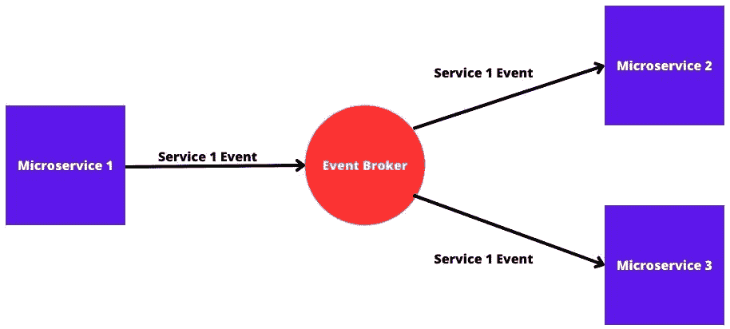
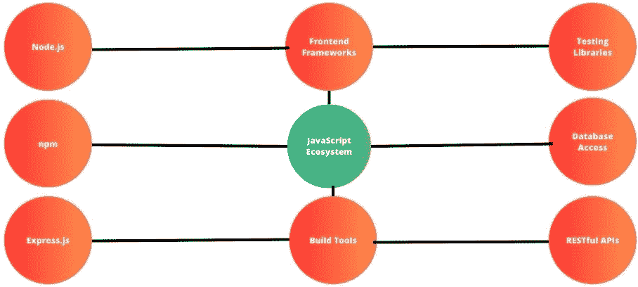
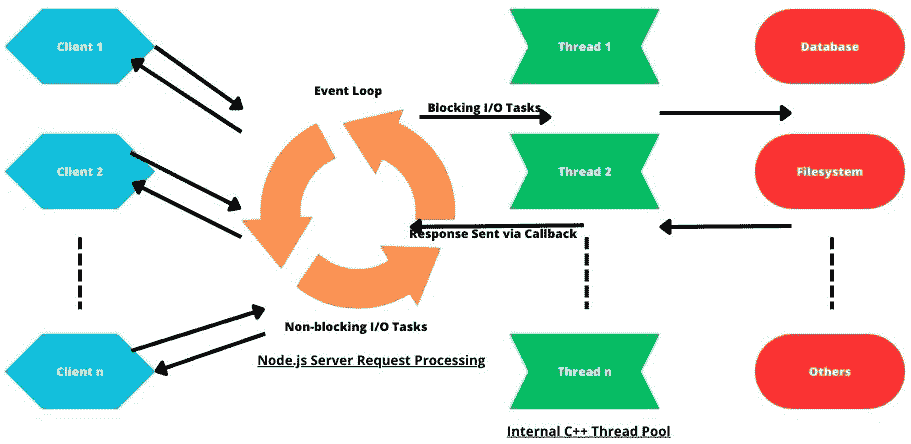
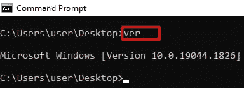
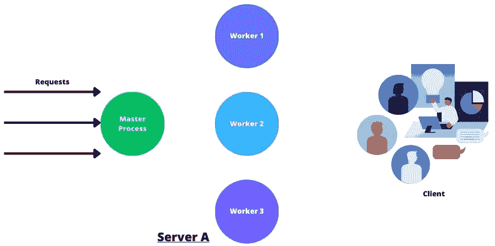
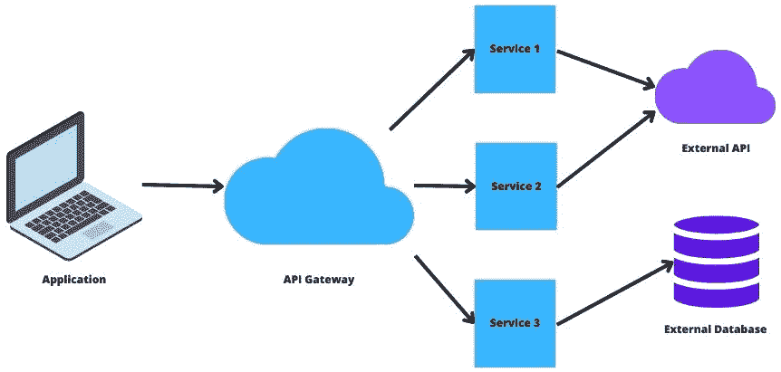
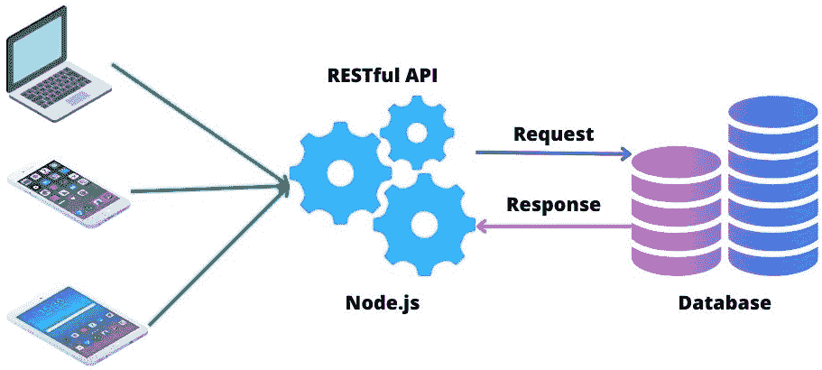

# 3

# 理解 Node.js 基础知识：构建块和关键概念

Node.js 是一个基于 V8 JavaScript 引擎构建的 JavaScript 运行时环境。它允许你在浏览器之外运行 JavaScript 代码，使其成为服务器端和命令行应用程序的流行选择。理解 Node.js 的这些基础知识将为你开发服务器端应用程序、命令行工具和其他基于 Node.js 运行时的 JavaScript 解决方案提供一个坚实的基础。

我们将从这个章节开始，探讨 Node.js 框架的基础知识。为了学习如何使用 Node.js 框架进行开发，你需要掌握其构建块和关键概念。有一点可以肯定：Node.js 是一个可以用来构建甚至最复杂项目的框架。你可以构建 REST API、授权系统、数据可视化和管理系统/应用程序、带有模板语言的客户端框架、人工智能和机器学习应用程序等等。

我们需要对同步和异步编程有一个基本的了解。在同步编程中，任务按顺序执行，一个接一个。当一个函数被调用时，程序会等待该函数执行完成后再继续执行下一个任务。这意味着每个操作必须完成，下一个操作才能开始。在同步过程中，如果某个操作需要很长时间才能完成（例如从数据库读取数据或进行网络请求），它可能会阻塞整个程序，使其无响应。在异步编程中，任务独立于主程序流程执行。当异步操作启动时，程序可以继续执行其他任务，而无需等待异步操作完成。一旦异步操作完成，回调函数或承诺就会解决，允许程序处理结果。

此外，让我们简单谈谈 V8 JavaScript 引擎。V8 JavaScript 引擎是由 Google 开发的开源 JavaScript 引擎。它用 C++编写，用于 Google Chrome 和许多其他项目，包括 Node.js。V8 的速度和效率使其成为许多网络浏览器和服务器端 JavaScript 框架的基本组件，有助于推动基于 JavaScript 的应用和服务在网上的快速增长。

到本章结束时，你将学会 Node.js 的基础知识以及如何在日常工作中应用它们。

在本章中，我们将涵盖以下主要主题：

+   异步和非阻塞通信以及事件驱动架构

+   JavaScript 生态系统和服务器端开发

+   命令行应用程序和可扩展性及性能

+   跨平台兼容性以及社区和支持

+   微服务和无服务器架构及其通过 API 的集成

# 异步和非阻塞通信以及事件驱动架构

在本节中，我们将学习关于异步和非阻塞通信以及事件驱动架构的内容。异步和非阻塞通信，以及事件驱动架构，是微服务中的关键概念，它们使得服务之间能够高效、响应迅速且松散耦合地交互。

让我们在接下来的小节中更详细地探讨这些概念。

## 异步和非阻塞通信

在微服务架构中，服务通常需要相互交互以完成任务。**异步和非阻塞通信**指的是允许服务在不需要等待其他服务的即时响应的情况下继续其操作。

这种方法提供了以下优势：

+   **提高响应性**：异步通信防止服务在等待响应时被阻塞，从而缩短整体响应时间。

+   **可扩展性**：非阻塞通信允许服务在等待响应的同时处理其他任务，例如 API 请求和响应。可扩展性对于处理大量并发请求至关重要。

+   **降低耦合度**：服务之间不紧密依赖于对方的响应时间。这种灵活性支持了微服务的自主性和独立性。

+   **弹性**：异步通信可以处理服务暂时不可用的情况，并可以在稍后尝试重试。

精通这种通信方式是服务之间更好地相互交互的基本方式。

*图 3.1* 展示了异步和非阻塞通信：

图 3.1：异步和非阻塞通信

因此，异步和非阻塞通信提高了我们系统/应用程序的响应性、可扩展性、降低耦合度和弹性，同时保持代码无错误。

总结来说，在同步通信中，发送者和接收者以同步的方式进行操作。发送者发送一个请求，并在收到响应之前等待，然后才进行进一步的操作。这种通信方式类似于打电话：你等待对方接听并回应，然后再继续对话。在异步通信中，发送者和接收者独立操作。发送者发送一个请求，并继续其他任务，而不等待响应。当接收者处理请求并生成响应时，它会被发送回发送者。这种通信方式类似于发送电子邮件：你发送消息并继续工作，期待稍后收到回复。

在下一节，我们将学习关于事件驱动架构的内容。

## 事件驱动架构

**事件驱动架构**是一种服务通过事件交换进行通信的模式。**事件**是一个重要的发生或状态变化，其他服务可能对此感兴趣。

该架构的关键特性包括以下内容：

+   **发布-订阅模型**：生成事件的（发布者）服务通知其他服务（订阅者）这些事件。订阅者可以在不与发布者直接通信的情况下对事件做出反应。

+   **松散耦合**：事件驱动架构促进了服务之间的松散耦合。发布者和订阅者不需要知道彼此的详细信息，从而减少了依赖性。

+   **灵活性**：新服务可以轻松地根据需要订阅事件，而不会影响现有服务。这种灵活性支持系统的演变。

+   **可扩展性**：事件驱动系统可以分配事件的处理，使得系统在增长过程中能够高效地扩展。

+   **实时更新**：事件驱动架构支持实时更新，并使服务能够快速响应系统中的变化。

当我们在 Node.js 中开发微服务时，我们可以应用事件驱动架构以更好的方式进行开发，利用所有先前的优势，并确保我们的应用程序/系统的最佳质量。

*图 3.2* 展示了一个事件驱动架构：

图 3.2：事件驱动架构

常见的事件驱动架构实现包括消息队列（例如 RabbitMQ 和 Apache Kafka）和事件流平台（例如 Apache Kafka 和 IBM Event Streams）。

总结来说，拥抱异步和非阻塞通信，以及事件驱动架构，赋予微服务独立工作、高效处理通信和动态响应变化的能力。这些概念对于构建具有弹性、可扩展性和松散耦合的微服务系统，以适应现代敏捷软件开发的需求至关重要。

在理解了这些概念之后，我们现在将转向 JavaScript 生态系统和服务器端开发。

# JavaScript 生态系统和服务器端开发

在本节中，我们将学习关于 JavaScript 生态系统和服务器端开发的内容。

JavaScript 生态系统是一个庞大的工具、库、框架和资源的集合，支持在客户端（浏览器）和服务器端开发 Web 应用程序。JavaScript 已经成为最受欢迎和最通用的编程语言之一，为从交互式网站到复杂的服务器端系统等各种应用程序提供动力。

## JavaScript 生态系统

**JavaScript 生态系统**指的是围绕 JavaScript 编程语言的大量库、框架、工具和资源的集合。这个生态系统经过多年的发展，已经支持了软件开发的各种方面，从前端网页开发到后端编程以及更多。

JavaScript 生态系统的一些关键特性如下：

+   **Node.js**是一个运行时环境，允许在服务器端运行 JavaScript。它用于构建后端应用程序和 API。

+   `npm`是 JavaScript 的包管理器，它使开发者能够轻松地共享和重用代码。它托管了一个庞大的开源包库，如`express`和`xlsx`，这些包可以用来扩展你应用程序的功能。

+   (`body-parser`, `cookie-parser`)，路由（express router），模板引擎（`ejs`，`pug`），会话管理（express-session），安全（`helmet`，`csurf`），缓存（cache-control），身份验证和授权（`express-jwt`，`passport`），文件上传（`multer`），国际化（`i18n`），等等。

+   **前端框架**：如 React、Angular 和 Vue.js 等框架使得在客户端创建动态和交互式用户界面成为可能。这些框架提供组件、状态管理和路由功能。

+   **构建工具**：如 Webpack、Parcel 和 Rollup 等工具帮助打包和优化 JavaScript 代码、CSS 以及其他资产，以用于生产就绪的应用程序。

+   **测试库**：Jest、Mocha 和 Jasmine 是常见的测试库，它们简化了为你的代码库编写和运行测试的过程。

+   **数据库访问**：如 Sequelize、Mongoose 和 Knex 等库提供数据库抽象和管理，允许你与各种数据库进行交互。

+   **RESTful API**：如 Express.js 等库使得为你的应用程序创建 RESTful API 变得容易，从而实现客户端和服务器之间的通信。

JavaScript 生态系统如此庞大，我们可能需要花费数小时来学习它，但我们需要确保在用 JavaScript 生态系统提供的工具、框架和库进行 Node.js 开发时遵循最佳实践。

*图 3*.3 展示了 JavaScript 生态系统：

图 3.3：JavaScript 生态系统

了解 JavaScript 生态系统是什么是更好地与它的工具、库和框架交互的正确方式。

学习了这些概念后，我们可以继续进行后端开发。

## 使用 Node.js 进行后端开发

**后端开发**使用 Node.js 允许你构建可扩展且高效的程序，处理数据处理、文件操作和与数据库交互等任务。

Node.js 用于后端开发的一些关键概念和优势包括以下内容：

+   **非阻塞 I/O**：Node.js 的异步和事件驱动架构允许它在不阻塞其他任务执行的情况下处理大量并发连接。

+   **可扩展性**：Node.js 应用程序可以轻松地进行水平扩展，这使得它们适合实时应用程序和微服务架构。

+   **单语言**：在客户端和服务器端都使用 JavaScript 可以简化开发和维护，因为开发者可以在整个堆栈中使用相同的语言。

+   `npm` 包和充满活力的 JavaScript 社区提供了资源和工具来解决各种开发挑战。

+   **快速开发**：Node.js 的快速开发周期允许快速迭代和部署应用程序。

在 Node.js 服务器端开发中，我们可以做很多事情，例如数据处理、文件操作、与数据库交互、在系统/应用程序中进行身份验证和授权、应用最佳实践以解决安全问题，以及使我们的系统/应用程序国际化。

*图 3.4* 展示了使用 Node.js 进行服务器端开发：

图 3.4：使用 Node.js 进行服务器端开发

总之，JavaScript 生态系统，得益于 Node.js，为构建客户端和服务器端应用程序提供了一个全面的工具集。由于其非阻塞特性和丰富的库，JavaScript 非常适合现代、响应和高效的服务器端开发。

现在，我们可以继续到下一节，我们将讨论命令行应用程序、可扩展性和性能。

# 命令行应用程序和可扩展性及性能

在本节中，我们将学习关于 Node.js 的命令行应用程序、可扩展性和性能。命令行应用程序以及可扩展性和性能是软件开发领域中的两个重要方面。

我们将从命令行应用程序开始。

## 命令行应用程序

**命令行应用程序**是通过操作系统的**命令行界面**（CLI）运行的软件程序。这些程序允许用户通过输入命令而不是使用**图形用户界面**（GUI）与应用程序交互。命令行应用程序被广泛用于各种任务，包括系统管理、文件操作、数据处理和开发工作流程。

命令行应用程序的关键优势如下：

+   **效率**：由于轻量级特性，命令行应用程序通常需要更少的系统资源，并且可以更快地执行任务。

+   **自动化**：命令行应用程序非常适合自动化脚本，允许开发者轻松地创建可重复和复杂的任务。

+   **远程访问**：命令行应用程序可以通过远程访问，这使得它们非常适合通过网络管理服务器和系统。

+   **脚本**：开发者可以使用 CLI 工具创建脚本来自动化重复任务并提高生产力。

+   **无头环境**：命令行应用程序在无头环境中运行良好，例如没有图形界面的服务器。

命令行应用程序在各种操作系统中被广泛使用，以实现日常工作的各种任务。这些任务的范围可以从最简单的，如系统管理，到最复杂的，如开发工作流程。

*图 3*.*5* 展示了命令行提示符：

图 3.5：命令行提示符

命令行应用程序是在广泛的应用程序世界中首先且最常使用的程序。它们常用于工业、软件代理机构、企业等。

在下一节中，我们将讨论 Node.js 中的可伸缩性和性能。

## 可伸缩性和性能

**可伸缩性和性能**在设计和发展软件应用程序时是关键考虑因素，尤其是在现代网络应用程序和微服务架构的背景下。

让我们从可伸缩性开始。

### 可伸缩性

**可伸缩性**指的是应用程序处理增加的工作负载以及在资源、用户和数据量方面的增长能力。可伸缩性可以通过两种主要方法实现：

+   **垂直扩展**（**向上扩展**）：这意味着向单个机器添加更多资源（CPU、内存）以处理增加的负载。然而，单个机器的可扩展性是有限的。

+   **水平扩展**（**向外扩展**）：这意味着添加更多机器以分配负载。这通常用于微服务架构中，其中单个服务可以独立扩展。

*图 3*.*6* 展示了 Node.js 的可伸缩性：

图 3.6：Node.js 的可伸缩性

可伸缩性可以帮助开发者无需太多努力和成本地扩展或缩减他们的应用程序/系统。

现在，让我们来看看性能。

### 性能

**性能**指的是应用程序操作的速度和效率。以下因素会影响性能：

+   **优化代码**：编写高效的代码，以最小化资源消耗并最大化执行速度

+   **缓存**：实现缓存机制以存储频繁访问的数据，减少重复计算或数据库查询的需求

+   **数据库优化**：适当的索引、查询优化和使用缓存层以显著提高数据库性能

+   **负载均衡**：将传入流量分配到多个服务器，以防止单个实例过载

+   **异步处理**：使用异步操作来处理不需要立即响应的任务，为其他任务释放资源

+   **瓶颈识别**：定期监控和性能分析有助于识别性能瓶颈和改进领域。

在现代软件开发中，构建可扩展且高性能的应用程序对于提供积极的用户体验和处理不断增长的用户群体的需求至关重要。命令行应用程序和可扩展性/性能考虑因素在创建高效和响应迅速的软件解决方案中起着关键作用。

在下一节中，我们将学习关于跨平台兼容性、社区和支持的内容。

# 跨平台兼容性、社区和支持

在本节中，我们将学习关于跨平台兼容性、社区和支持的内容。

跨平台兼容性和强大的社区支持是两个对软件开发的成功和有效性做出重要贡献的因素。让我们在以下子节中深入探讨这些方面的每一个。

## 跨平台兼容性

**跨平台兼容性**指的是软件应用程序能够在不同的操作系统和设备上一致且平稳地运行。确保跨平台兼容性在当今多样化的技术环境中至关重要，用户在 Windows、macOS、Linux、Android 和 iOS 等不同平台上与应用程序互动。

下面是一些关于跨平台兼容性的关键点：

+   **用户覆盖范围**：开发跨平台应用程序可以扩大用户基础，因为软件可以通过不同的设备和操作系统被更广泛的受众访问。

+   **一致体验**：跨平台应用程序旨在提供一致的用户体验，无论使用的是哪种设备或平台。

+   **代码重用性**：使用支持跨平台开发的框架和工具允许开发者重用大量代码库，节省时间和精力。

+   **降低开发成本**：为多个平台开发单个应用程序可以降低开发成本，相比之下，为每个平台构建独立的原生应用程序成本更高。

+   **高效更新**：更新和错误修复可以同时应用于所有平台，确保一致的性能和安全。

+   **挑战**：实现跨平台兼容性可能需要处理特定平台的细微差别和限制，这可能会影响某些功能或性能方面。

当尝试创建软件应用程序时，跨平台兼容性至关重要，因为它为大多数用户提供测试他们的软件并将其用于日常工作的能力。

在下一节中，我们将讨论 Node.js 中的社区和支持。

## 社区和支持

强大而活跃的社区对于任何编程语言、框架或工具都至关重要。一个充满活力的社区为开发者提供资源、指导以及解决他们在开发过程中遇到挑战的解决方案。

社区和支持的一些关键方面包括以下内容：

+   **文档和教程**：一个活跃的社区经常贡献全面的文档和教程，使开发者更容易理解和有效使用技术。

+   **问题解决**：社区论坛、讨论组和平台，如 Stack Overflow，允许开发者寻求帮助、分享经验并找到他们遇到的问题的解决方案。

+   **开源项目**：一个强大的社区往往会导致开源项目、库和工具的创建，这些工具可以增强开发生产力和提供额外的功能。

+   **反馈和改进**：社区提供反馈，识别错误，并提出改进建议，从而持续提升技术。

+   **网络和协作**：与社区互动提供了网络、协作和从他人经验中学习的机会。

+   **保持更新**：一个繁荣的社区帮助开发者了解该领域的最新趋势、更新和最佳实践。

总结来说，跨平台兼容性确保了更广泛的访问性和一致的用户体验，而一个支持性的社区则提供了必要的资源、解决方案和协作机会，以促进软件开发的成功。这两个方面都对软件项目的效率、效果和整体成功做出了重大贡献。

在下一节中，我们将讨论微服务和无服务器架构，以及它们通过 API 的集成。

# 微服务和无服务器架构以及它们通过 API 的集成

在本节中，我们将了解微服务和无服务器架构，以及它们通过 API 的集成。

微服务架构、无服务器架构以及通过 API 的集成都是现代软件开发的基本概念。让我们在以下小节中探讨这些概念及其关系。

## 什么是微服务架构？

**微服务架构**是一种软件开发方法，其中复杂的应用程序被分解成更小、独立的微服务，这些微服务可以单独开发、部署和维护。每个微服务专注于特定的业务能力，并通过定义良好的 API 与其他微服务进行通信。这种架构风格提供了许多好处，但也需要仔细的设计和管理。

微服务的优势包括以下内容：

+   **可扩展性**：微服务可以单独扩展，允许资源根据需要分配，从而实现高效的资源利用。

+   **自主团队**：开发团队可以独立地工作在不同的微服务上，使用适合其服务需求的技术栈。

+   **故障隔离**：一个微服务中的问题并不一定影响其他微服务，这提高了容错性和系统可靠性。

微服务提供了无限的优势，但前面提到的优势是最为人所知的，在你架构软件时应用这些优势是必须的，因为这有助于你的团队中的每个开发者更快地进行编码、调试和部署。

*图 3.7* 表示一个微服务架构：

图 3.7：微服务架构

微服务架构允许开发者以更好的方式构建应用程序/系统，同时以更清晰的方式组织软件组件，并允许它们通过 API 进行通信。

在下一节中，我们将了解更多关于无服务器架构的内容。

## 什么是无服务器架构？

**无服务器架构**是一种执行模型，其中云提供商自动管理基础设施，开发者专注于为特定功能编写代码。它抽象了服务器管理，减少了运营开销。

无服务器架构的优势包括以下内容：

+   **自动扩展**：无服务器平台根据传入的请求自动扩展函数，确保最佳性能。

+   **成本效益**：你只需为实际使用付费，这使得具有可变工作负载的应用程序具有成本效益。

+   **简化部署**：开发者可以部署和更新函数，而无需处理服务器配置。

无服务器架构允许开发者自动化管理基础设施的过程，从而专注于构建应用程序/系统。

*图 3.8* 表示一个无服务器架构：

图 3.8：无服务器架构

无服务器架构是管理服务器的现代方式，允许开发者专注于编写无错误的软件。

在对微服务和无服务器架构进行简要概述之后，让我们学习如何使用 API 将它们集成起来。

## 通过 API 进行集成

在微服务和无服务器架构中，**集成**对于启用不同组件之间的通信至关重要。API 是服务、函数或应用程序交互和交换数据的机制。

通过 API 集成的优势包括以下内容：

+   **松耦合**：API 促进组件之间的松耦合，允许它们独立演变而不会影响其他组件。

+   **模块化**：通过 API 的集成支持模块化设计，使组件可以单独开发、测试和维护。

+   **互操作性**：API 使不同的系统、服务或应用程序能够协同工作，即使它们建立在不同的技术之上。

API 是软件组件之间通信的更好方式。通过软件组件的组件启用通信可以导致更好的应用程序/系统和服务。

*图 3.9* 描述了通过 API 进行集成：

图 3.9：通过 API 进行集成

在计算的现代时代，API 是一种巧妙的发明，使 Node.js 中的服务能够以适当的方式相互交互。

为了总结本章内容，让我们看看在微服务和无服务器架构中集成是如何工作的。

## 微服务和无服务器架构中的集成

在微服务架构中，服务通过 API 进行通信，使它们能够无缝协作，同时保持松散耦合。同时，在无服务器架构中，函数通常由事件触发，API 用于在函数和外部服务之间传递数据。

微服务架构、无服务器架构以及通过 API 的集成是相互关联的概念，使开发者能够构建可扩展、模块化和高效的应用程序。通过结合这些方法，开发者可以创建灵活且具有弹性的系统，以满足现代软件开发的需求。

# 总结

在本章中，我们学习了关于 Node.js 基础以及其构建块和关键概念的大量知识。这些基础包括使 Node.js 成为服务器端和网络应用强大且多功能的运行时环境的核心概念和特性。

总结来说，Node.js 基础围绕其事件驱动、异步的本质，这有助于构建可扩展和高性能的应用程序。掌握这些基础使开发者能够有效地利用 Node.js，并创建从网络服务器到网络工具、API 等广泛的应用程序。

在下一章中，我们将学习如何利用 JavaScript 和 Node.js 生态系统进行微服务开发。

# 测验时间

+   异步和非阻塞通信是什么？

+   什么是事件驱动架构？

+   JavaScript 生态系统的关键特性有哪些？
