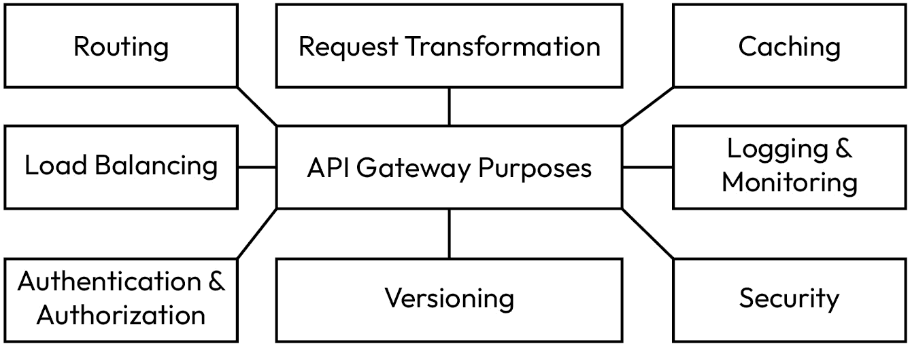
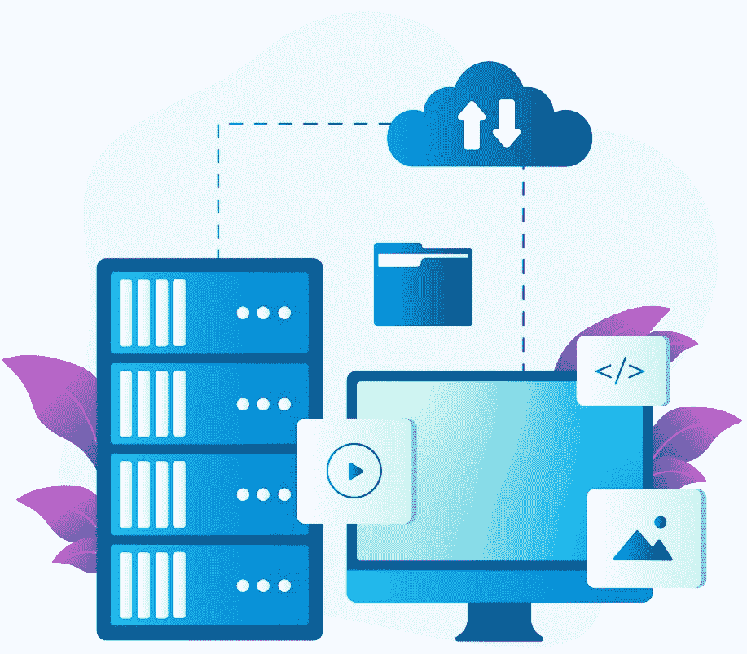

# 5

# 了解 Node.js 中微服务的基础设施

理解 Node.js 中微服务的基础设施对于构建可扩展和可维护的应用程序至关重要。微服务架构将单体应用程序分解为更小、独立部署的服务，这些服务通过网络进行通信。

我们将从这个章节开始，介绍 Node.js 微服务开发的基础设施。在 Node.js 中，微服务的基础设施设计应考虑可扩展性、可靠性、安全性和易于维护等因素。Node.js 因其非阻塞、事件驱动的架构而成为实现微服务的流行选择，这种架构与分布式系统的需求相吻合。然而，技术和工具的选择应基于你项目的具体需求。

在本章结束时，你将了解 Node.js 微服务开发的基础设施，以及如何将这些概念应用到你的日常工作中。

在本章中，我们将涵盖以下主要主题：

+   服务发现和 API 网关

+   负载均衡和服务编排

+   容器化和编排以及集中式日志和监控

+   分布式跟踪和事件驱动通信

+   数据库集成和持续集成与持续部署

# 服务发现和 API 网关

在本节中，我们将学习关于需要动态发现和相互通信的服务，以及这些服务如何帮助你超越工作，创造下一代应用程序。服务发现和 API 网关是微服务架构中的关键组件。它们在确保微服务能够有效通信以及客户端能够无缝访问服务方面发挥着至关重要的作用。

我们将在接下来的小节中更详细地探讨这些概念。

## 服务发现

**服务发现**是微服务在动态和分布式环境中定位和相互通信的过程。由于微服务可以独立部署和扩展，它们的网络位置（IP 地址和端口）可能会频繁变化。服务发现机制通过维护一个包含可用服务和它们位置的最新注册表来解决这一挑战。

这是服务发现的工作方式：

+   **服务注册表**: 服务注册表是一个集中式数据库或服务，它跟踪可用的微服务和它们的网络位置。服务注册表的例子包括**Consul**（设计用于通过提供服务发现、健康检查和键值存储等功能来简化基于微服务的应用程序的开发和运营），**etcd**（一个开源的分布式键值存储和配置管理系统，常用于构建高可用性和分布式系统），以及**Netflix Eureka**（一个开源的服务发现和注册服务器，它是 Netflix **开源软件**（**OSS**）生态系统的一部分）。Eureka 最初由 Netflix 开发，用于管理和监控微服务架构中服务的可用性。它为微服务提供了一个简单高效的方法，在动态和分布式环境中定位和相互通信。

+   **注册**: 当微服务启动时，它会将自己注册到服务注册表中，提供有关其位置、健康状态和可用端点的信息。

+   **查找**: 当一个微服务需要与其他微服务通信时，它会查询服务注册表以发现目标微服务的位置。

+   **负载均衡**: 服务发现通常包括负载均衡，其中传入请求在同一个微服务的多个实例之间分配，以确保高可用性和可伸缩性。

了解这些概念和工具的工作原理可以帮助你和你的团队构建更好的软件，并为高质量的代码、安全性和兼容性做出贡献。

*图 5.1*展示了服务发现的过程：


图 5.1：服务发现（图片由 Freepik 上的 vectorjuice 提供）

服务发现及其工具和概念可以加深对微服务的理解，这也有助于你学习如何与你的开发团队协调。

在下一节中，我们将学习关于 API 网关的内容。

## API 网关

**API 网关**是一个服务器或服务，充当客户端（如网页浏览器、移动应用或其他微服务）访问基于微服务的应用程序功能的入口点。

它具有以下几个基本作用：

+   **路由**: API 网关根据请求的 URL 或其他标准将客户端请求路由到适当的微服务。它充当反向代理，将请求转发到相关服务。

+   **负载均衡**: 除了服务发现之外，API 网关通常还执行负载均衡，以均匀地分配传入请求到微服务的多个实例。

+   **身份验证和授权**: API 网关可以处理身份验证和授权，确保只有授权的用户或系统可以访问特定的端点。

+   **请求转换**: 请求转换可以修改或转换传入请求和传出响应，以匹配微服务期望的格式，从而抽象出服务之间的差异。

+   **缓存**: API 网关可以缓存响应以减少对微服务的负载并提高频繁请求的数据的响应时间。

+   **日志和监控**: 通过 API 网关可以实现集中式日志和监控，以收集有关传入请求和响应的数据，从而提供对系统行为的可见性。

+   **安全**: API 网关可以提供诸如速率限制、DDoS 保护以及**Web 应用防火墙**（WAF）功能等安全特性。

+   **版本控制**: API 网关可以支持 API 的版本控制，允许服务演变时保持向后兼容性。

当我们在 Node.js 中开发微服务时，我们可以使用这些工具和概念来提高开发者在创建软件时的效率和效果。

**NGINX**可以作为 API 网关使用，为客户端提供一个统一的入口点，以便与不同的微服务进行交互。这涉及到以下方面：

+   **API 路由**: NGINX 可以根据 API 端点将请求路由到特定的微服务。这通过提供一个单一入口点来简化客户端体验，该入口点可以访问各种微服务。

+   **安全**: NGINX 可以处理身份验证、授权和 SSL 终止，通过集中处理这些关注点来增强微服务的安全性。

**身份验证**是验证用户、服务或系统身份的过程。在微服务架构中，每个服务都必须处理身份验证，以确保只有授权实体可以访问其资源。

以下是一些身份验证技术：

+   **JSON Web 令牌**（JWTs）：您可以使用 JWT 来编码用户信息并创建可以被每个微服务验证的令牌。然后，您可以在处理请求之前在每个微服务中验证令牌。

+   **OAuth 2.0**: 您可以实现 OAuth 2.0 以进行基于令牌的安全身份验证。OAuth 允许第三方服务代表用户访问资源。

+   使用`Passport.js`库在 Node.js 中实现身份验证策略。它支持各种身份验证机制，包括本地身份验证、OAuth 和 OpenID Connect。

    以下是一个使用 JWT 的示例：

    ```js
    const jwt = require('jsonwebtoken');
    ```

    ```js
    // Middleware for authenticating requests
    ```

    ```js
    function authenticateToken(req, res, next) {
    ```

    ```js
      const token = req.header('Authorization');
    ```

    ```js
      if (!token) return res.sendStatus(401);
    ```

    ```js
      jwt.verify(token, 'your-secret-key', (err, user) => {
    ```

    ```js
        if (err) return res.sendStatus(403);
    ```

    ```js
        req.user = user;
    ```

    ```js
        next();
    ```

    ```js
      });
    ```

    ```js
    }
    ```

    ```js
    // Example route that requires authentication
    ```

    ```js
    app.get('/api/resource', authenticateToken, (req, res) => {
    ```

    ```js
      // Process the request for authenticated users
    ```

    ```js
      res.json({ message: 'Access granted!' });
    ```

    ```js
    });
    ```

**授权**是确定用户或服务可以执行哪些操作的过程。它通常基于已验证用户的角色或特定权限。

以下是一些授权技术：

+   **基于角色的访问控制**（RBAC）：您可以为用户分配角色并定义与每个角色关联的权限。您还可以在允许访问某些资源之前检查用户的角色。

+   **基于声明的授权**: 您可以使用嵌入在令牌中的声明来传达有关用户权限的信息。微服务可以根据这些声明进行授权。

+   **授权中间件**：你可以在每个微服务中实现中间件功能，以检查认证用户是否具有所需的权限。

    下面是一个使用 RBAC 的例子：

    ```js
    // Middleware for role-based authorization
    ```

    ```js
    function authorize(role) {
    ```

    ```js
      return (req, res, next) => {
    ```

    ```js
        if (req.user && req.user.role === role) {
    ```

    ```js
          return next(); // User has the required role
    ```

    ```js
        }
    ```

    ```js
        res.status(403).send('Forbidden'); // User does not have the required role
    ```

    ```js
      };
    ```

    ```js
    }
    ```

    ```js
    // Example route that requires a specific role
    ```

    ```js
    app.get('/api/admin/resource', authenticateToken, authorize('admin'), (req, res) => {
    ```

    ```js
      // Process the request for users with the 'admin' role
    ```

    ```js
      res.json({ message: 'Admin access granted!' });
    ```

    ```js
    });
    ```

*图 5.2* 展示了 API 网关的概念：



图 5.2：API 网关

总结来说，服务发现和 API 网关是微服务基础设施的组成部分，它们使得服务之间能够有效通信，并为客户端提供一个统一的入口点。这些组件增强了基于微服务的应用程序的可伸缩性、可靠性、安全性和可管理性，使它们更容易开发和维护。

现在我们已经理解了这些概念，让我们来学习负载均衡和服务编排。

# 负载均衡和服务编排

负载均衡和服务编排是微服务应用架构中的基本组件。它们都促进了分布式系统的可伸缩性、可用性和高效运行。

## 负载均衡

**负载均衡**是指将进入的网络流量分配到服务的多个实例中，以确保没有单个实例被请求淹没，从而优化资源利用并提高系统可靠性。

在微服务架构中，负载均衡至关重要，因为它有助于实现以下目标：

+   **高可用性**：负载均衡器将流量均匀地分配到健康的服务实例。如果一个实例失败或过载，流量将自动重定向到其他实例，确保服务不间断。

+   **可伸缩性**：随着对微服务的需求增加，可以添加额外的实例，负载均衡器将自动将这些新实例的流量分配到这些实例，从而有效地实现应用的横向扩展。

+   **资源利用**：负载均衡器可以监控服务实例的健康状况和性能，并根据响应时间和服务器负载等因素做出路由决策。这确保了每个实例都得到有效利用。

+   **故障转移**：负载均衡器可以检测服务实例何时变得不健康，并停止向其发送流量。这有助于隔离问题并维护整个系统的完整性。

一些常见的负载均衡策略如下：

+   **轮询**：这是一种简单且广泛使用的负载均衡算法，它将进入的网络流量或请求均匀地分配到一组后端服务器或资源。

+   **最少连接**：这是一种负载均衡算法，负载均衡器使用它将进入的网络流量或请求分配到一组后端服务器或资源。

+   **IP 哈希**：也称为基于 IP 的负载均衡或 IP 哈希负载均衡，IP 哈希是一种负载均衡器使用的技巧，用于根据请求的源或目标 IP 地址将进入的网络流量或请求分配到一组后端服务器或资源。

+   **加权分配**：这指的是根据相对权重在微服务的不同实例或副本之间分配资源或流量的做法。

在可能存在多个服务实例的微服务架构中，负载均衡至关重要。NGINX 支持以下功能：

+   **轮询负载均衡**：将进入的请求平均分配到可用的微服务实例中。

+   **健康检查**：NGINX 可以执行健康检查，以识别并路由流量远离不健康的实例，确保更好的可靠性。

NGINX 充当**反向代理**，位于客户端应用程序和微服务之间。这提供了几个优点：

+   **负载均衡**：NGINX 可以在多个微服务实例之间分配进入的请求，确保负载均匀分布并提高系统性能。

+   **路由**：NGINX 可以根据 URL 路径、头信息或其他参数等因素将请求路由到不同的微服务。这有助于高效处理分布在微服务中的各种功能。

*图 5*.*3*展示了负载均衡：


图 5.3：负载均衡（图片由 Freepik 上的 vectorjuice 提供）

流行的负载均衡解决方案包括硬件负载均衡器、基于软件的解决方案（如 NGINX 和 HAProxy），以及云服务提供商提供的基于云的负载均衡器。

在这些概念介绍完毕后，接下来我们将探讨服务编排。

## 服务编排

**服务编排**涉及协调和管理多个微服务的执行，以满足特定的业务流程或工作流。它确保各个服务协同工作，以实现更高层次的目标。

以下是服务编排如何贡献于微服务架构的说明：

+   **复杂工作流处理**：微服务通常需要协作以执行复杂任务或工作流。服务编排定义了要执行的微服务序列，并管理它们的交互以完成工作流。

+   **集中式控制**：服务编排通常涉及一个中央编排器组件，该组件协调微服务的执行，从而处理错误恢复并确保操作的正确顺序。

+   **异步通信**：微服务可以通过异步消息传递相互通信，实现松耦合的交互。服务编排管理服务之间的消息和数据流。

+   **长运行进程**：对于跨越多个微服务的长运行进程，服务编排确保步骤按正确顺序执行，并保持数据一致性。

+   **动态伸缩**：服务编排可以根据工作负载动态伸缩微服务，确保资源被最优地分配以处理不断变化的需求。

服务编排可以使用各种工具和模式实现，包括工作流引擎、消息队列和基于编排的方法。在微服务环境中，常用的工具有 Apache Camel、Netflix Conductor 和基于 Kubernetes 的编排解决方案。

附加信息

*Apache Camel* 是一个开源集成框架，提供了一个轻量级、易于使用的平台，用于在不同系统之间路由和调解消息交换。您可以在[`camel.apache.org/docs/`](https://camel.apache.org/docs/)访问其文档。

*Netflix Conductor* 允许开发者以可扩展和可靠的方式设计、执行和管理复杂的工作流。您可以在[`orkes.io/content/`](https://orkes.io/content/)访问其文档。

*Kubernetes 编排*是一个容器编排平台，允许您构建跨多个容器的应用程序服务，跨集群调度容器，扩展这些容器，并随时间管理其健康状态。您可以在[`kubernetes.io/docs/home/supported-doc-versions`](https://kubernetes.io/docs/home/supported-doc-versions)访问其文档。

*图 5.4* 描述了服务编排：


图 5.4：服务编排（图片由 Freepik 提供）

总结来说，负载均衡和服务编排是微服务架构的基本组件。负载均衡确保了流量和资源利用的高效分配，而服务编排管理微服务的协调和执行，以完成复杂的工作流和业务流程。这些组件共同促进了基于微服务的应用程序的可扩展性、可用性和可靠性。

现在，我们可以继续到下一节，在这一节中，我们将讨论容器化和编排以及集中式日志和监控。

# 容器化和编排以及集中式日志和监控

容器化和编排以及集中式日志和监控是微服务应用程序基础设施中的两个关键组件。它们在确保微服务的有效部署、管理和监控中发挥着关键作用。

我们将从容器化和编排开始。

## 容器化和编排

**容器化**涉及将应用程序及其依赖项打包成一个称为**容器**的标准单元。

**编排**指的是自动管理容器化应用程序的过程。它涉及在机器集群中部署、扩展、负载均衡和维护容器。Kubernetes 是最受欢迎的容器编排平台，但还有其他平台，如 Docker Swarm 和 Apache Mesos，也存在于市场上。

容器化和编排如何使微服务受益如下：

+   **隔离**：容器提供进程隔离，确保微服务之间不会相互干扰，这使得维护一致的环境变得更加容易。

+   **可移植性**：容器可以在支持容器化的任何平台上运行，这使得微服务可以在开发、测试和生产环境中无缝迁移。

+   **资源效率**：如 Kubernetes 之类的编排平台自动化容器的部署和扩展，优化资源利用，并确保微服务在需要时获得所需的资源。

+   **高可用性**：编排平台监控微服务的健康状态，并可以自动替换失败的实例，确保高可用性和容错性。

+   **扩展**：可以通过调整容器副本的数量轻松扩展或缩减微服务。这对于处理可变的工作负载至关重要。

容器封装了应用程序代码、运行时、系统库和设置，确保在不同环境中的一致性和可移植性。

附加信息

**Docker**是一个开源平台，允许您使用容器化自动化应用程序的部署、扩展和管理，并且是一个广泛使用的容器化平台。

*图 5.5*展示了容器化和编排：


图 5.5：全栈开发过程（图片由 vectorjuice 在 Freepik 提供）

容器化和编排可以帮助部署将在每个平台和系统中运行的软件。通过自动管理容器化，您可以在部署方面实现更大的灵活性。

在下一节中，我们将讨论集中式日志和监控。

## 集中式日志和监控

**集中式日志和监控系统**收集并分析来自微服务和其环境的数据。这些系统有助于诊断问题、优化性能，并确保微服务应用程序的健康。

让我们看看这些系统的常见组件包括：

+   **日志收集器**：这些是代理或服务，它们收集微服务生成的日志并将它们转发到中央位置。

+   **日志聚合器**：这些是系统，它们从各种来源汇总日志，使得搜索、分析和可视化日志数据变得更加容易。例如，Elasticsearch、Fluentd 和 Logstash。

+   **指标和监控**：如 Prometheus 和 Grafana（两种流行的开源工具，用于监控和可视化指标和时间序列数据）之类的工具用于收集并显示微服务的实时性能指标。它们提供了对应用程序及其组件行为的洞察。

+   **警报**：监控系统可以根据预定义的阈值生成警报，使运维团队能够及时响应问题。

+   **追踪**：分布式追踪工具，如 Jaeger 和 Zipkin（两种用于监控和故障排除复杂、基于微服务的架构的分布式追踪系统），有助于跟踪请求在微服务之间的流动，使其更容易识别瓶颈和延迟问题。

其他信息

*Elasticsearch* 是一个基于 Apache Lucene 构建的高度可扩展的开源搜索和分析引擎。您可以在 [`www.elastic.co/guide/index.html`](https://www.elastic.co/guide/index.html) 访问其文档。

*Fluentd* 是一个开源的数据收集器，旨在统一数据收集和消费，以实现更好的分析和洞察。您可以在 [`docs.fluentd.org/`](https://docs.fluentd.org/) 访问其文档。

*Logstash* 是一个开源数据处理管道，允许您从各种来源收集、处理并将数据摄入到不同的输出目的地（ELK Stack）。您可以在 [`www.elastic.co/guide/en/logstash/current/introduction.html`](https://www.elastic.co/guide/en/logstash/current/introduction.html) 访问其文档。

集中式日志记录和监控提供了多项好处，包括提高可见性、可扩展性、访问历史数据以及管理和分析日志和指标的高效性。

*图 5.6* 展示了集中式日志记录和监控：


图 5.6：集中式日志记录和监控（图片由 Freepik 上的 pch.vector 提供）

总结来说，容器化和编排提供了一种可扩展且高效的方式来管理微服务，而集中式日志记录和监控确保这些服务可靠运行并能得到有效维护。这些组件共同构成了基于微服务应用的稳固基础。

在下一节中，我们将学习关于分布式追踪和事件驱动通信。

# 分布式追踪和事件驱动通信

分布式追踪和事件驱动通信是微服务和分布式系统领域中的两个关键概念。它们解决了与监控和协调微服务之间交互相关的挑战。让我们深入探讨这些概念。

## 分布式追踪

**分布式跟踪**是一种技术，用于跟踪和监控请求在分布式系统中的多个微服务之间传递。它提供了对请求流的全端到端可见性，使您能够识别性能瓶颈、解决问题并优化系统的行为。

下面是分布式跟踪的工作原理：

+   **仪表化**：您架构中的每个微服务都被仪表化以生成跟踪数据。这通常涉及向传入请求添加跟踪头并在服务内部记录各种操作的计时信息。

+   **跟踪上下文**：随着请求从一个微服务移动到另一个微服务，跟踪上下文会与其一起传播。此上下文包括唯一的跟踪 ID 和跨度 ID，这使得您能够关联跨服务中的活动。

+   **集中式收集器**：所有微服务的跟踪数据都发送到一个集中式收集器或存储系统。流行的选项包括 Zipkin、Jaeger 和 Elastic Stack。

+   **可视化和分析**：一旦收集到跟踪数据，您可以使用专用工具对其进行可视化。这使您能够看到请求的整个旅程，包括服务之间的通信以及每个步骤所花费的时间。

+   **提升客户体验**：一旦收集到跟踪数据，您可以使用专用工具对其进行可视化。这使您能够看到请求的整个旅程，包括服务之间的通信以及每个步骤所花费的时间。

分布式跟踪是性能优化、根本原因分析、依赖关系映射和分布式系统容量规划的有力工具。它提供了对应用程序行为和性能的详细可见性，使您能够做出基于数据的决策，以改进系统性能和可靠性。

在下一节中，我们将讨论事件驱动通信。

## 事件驱动通信

**事件驱动通信**是一种消息模式，其中微服务通过交换事件或消息异步通信。这种方法解耦了服务，使它们能够独立工作并对其他服务触发的事件做出反应。

下面是事件驱动通信的工作原理：

+   **事件生产者**：这些是生成事件或消息并将它们发布到消息代理或事件总线上的微服务。事件可以表示各种操作或状态变化。

+   **事件消费者**：这些是订阅特定事件并对它们做出反应的微服务。它们根据事件中包含的信息执行操作。

+   **消息代理**：这些是中间件组件，用于促进生产者和消费者之间的消息交换。流行的消息代理包括 Apache Kafka、RabbitMQ 和 AWS SNS/SQS。

总结来说，分布式跟踪增强了您监控和诊断微服务行为的能力，而事件驱动通信促进了微服务架构中的松耦合和可伸缩性。这些概念对于构建弹性且响应迅速的分布式系统非常有价值。

在下一节中，我们将讨论数据库集成和持续集成与持续部署。

# 数据库集成和持续集成与持续部署

数据库集成和**持续集成/持续部署**（**CI/CD**）是微服务架构的关键方面。它们确保数据得到有效管理，并且微服务的更改能够高效且可靠地部署。

## 数据库集成

在微服务架构中，每个微服务通常都有自己的数据库或数据存储。这种数据分离被称为*数据库* *按服务*。

在微服务架构中，数据库集成和**持续集成/持续部署**（**CI/CD**）是关键方面。它们确保数据得到有效管理，并且微服务的更改能够高效且可靠地部署。

+   **数据一致性**: 为了确保数据一致性，通常采用三种方法——两阶段提交、分布式事务和最终一致性：

    +   **两阶段提交**: **两阶段提交**（**2PC**）是一种确保分布式事务原子性和一致性的协议。它涉及协调多个参与者或资源来决定是否提交或中止事务。该协议由两个阶段组成：准备阶段和提交阶段。在准备阶段，每个参与者向协调者告知其是否能够成功提交事务。在提交阶段，如果所有参与者都同意提交，协调者向所有参与者发送提交消息；如果有人不同意，则发送中止消息。这确保了所有参与者要么一起提交事务，要么一起中止事务。

    +   **分布式事务**: 分布式事务涉及多个独立的系统或数据库，它们参与单个事务。分布式环境中的事务具有与本地事务相同的属性，包括**原子性、一致性、隔离性和持久性**（**ACID**）属性。分布式事务管理系统处理参与节点之间的协调和同步，以确保整个事务的一致性。这些系统可能采用 2PC 等协议来协调参与者的操作。

    +   **最终一致性**：最终一致性是一种在分布式系统中使用的致性模型。它放宽了传统 ACID 数据库的严格一致性要求，以提供高可用性、可扩展性和对网络分区的容错性。在最终一致性系统中，对复制数据的更新是异步发生的，允许不同的副本暂时分离。然而，系统保证最终所有副本将收敛到一个一致的状态。这种方法优先考虑可用性和性能，而不是严格一致性，使其适用于数据可以容忍暂时不一致的场景。

    每种方法都有其优点和权衡，具体取决于系统的特定要求。两阶段提交和分布式事务提供了强一致性保证，但由于参与者之间的协调可能会引入额外的开销和复杂性。另一方面，最终一致性优先考虑可用性和可扩展性，但可能导致暂时数据不一致。选择方法取决于诸如系统的工作负载、性能要求以及应用程序中所需的一致性水平等因素。

+   **数据访问 APIs**：为每个微服务的数据库定义清晰的 API 来访问和修改数据，有助于保持对数据交互的控制。

+   **数据同步**：这涉及到实现数据同步机制或使用事件驱动架构来传播一个微服务数据的变化到可能感兴趣的其它微服务。

+   **缓存**：您可以使用缓存策略来提高数据检索性能并减少对数据库的负载。

+   **多语言持久性**：这涉及到为每个微服务的特定数据存储需求选择合适的数据库技术。不同的微服务可能根据其需求使用不同类型的数据库（例如，关系型、NoSQL 等）。

+   **数据所有权**：您必须明确定义哪个微服务是特定类型数据的权威来源，并确保数据所有权清晰，以防止冲突。

数据库集成指的是管理这些分布式数据库中的数据以及确保数据一致性和完整性的策略和技术。

*图 5.7* 展示了数据库集成的示例：



图 5.7：数据库集成（图片来自 Freepik）

数据库作为服务可以帮助开发者更快地开发，同时专注于单个微服务，并为不同用户提供最佳的用户体验。

在下一节中，我们将学习更多关于 CI/CD 的内容。

## CI/CD

**CI/CD** 是一套实践和工具，它使软件变更的自动化构建、测试和部署成为可能，包括微服务中的变更。CI/CD 管道简化了向基于微服务应用程序交付更新的过程，并确保变更可以无缝集成和测试。

在微服务环境中，以下是 CI/CD 的关键方面：

+   **自动化构建**：每当将更改推送到版本控制系统（例如，Git）时，自动化构建微服务和其依赖项的过程。

+   **自动化测试**：运行自动化测试，包括单元测试、集成测试和端到端测试，以确保变更不会引入回归。

+   **工件存储库**：将构建的工件（例如，Docker 镜像）存储在存储库中，以便在部署期间方便访问。

+   **部署自动化**：自动化部署过程到预生产和生产环境，包括滚动更新、蓝绿部署或金丝雀发布。所有这些策略都用于部署自动化，以确保平稳和安全的软件发布。

+   **基础设施即代码**（**IaC**）：将基础设施组件（例如，容器和虚拟机）定义为代码，以确保在各个阶段之间保持一致的环境。

+   **监控和回滚**：将监控和警报集成到 CI/CD 管道中，以检测生产中的问题，并在必要时启用回滚。

+   **版本管理**：管理微服务和其依赖项的版本，以确保变更可追踪，并在需要时可以回滚。

CI/CD 管道帮助微服务团队快速且可靠地交付软件变更，减少人工干预和人为错误的风险。它们促进了持续改进的文化，并允许团队更频繁地发布新功能和错误修复。

*图 5*.8 展示了 CI/CD 的过程：


图 5.8：CI/CD（图片由 Freepik 上的 vectorjuice 提供）

总结来说，数据库集成策略有助于管理微服务架构中的数据，确保一致性和协调，而 CI/CD 管道简化了微服务的开发和部署，实现了快速且可靠的软件交付。这两个方面对于基于微服务应用程序的成功至关重要。

# 摘要

在本章中，我们学习了关于需要动态发现和相互通信的服务、负载均衡和服务编排、容器化和编排以及集中式日志和监控、分布式跟踪和事件驱动通信，以及数据库集成和 CI/CD 的许多内容。

在 Node.js 中构建微服务的基础设施涉及根据您的具体需求仔细选择和集成这些组件和工具。在设计并实施微服务架构的基础设施时，考虑可扩展性、容错性、可观察性和易于管理性非常重要。

Node.js 中微服务的基础设施是开发可扩展、分布式应用的关键基础。它包括各种组件和实践，这些组件和实践能够使基于微服务的系统有效运行。

该基础设施旨在处理微服务架构的复杂性，确保它们能够协同工作，高效扩展，并在面对失败时保持弹性。Node.js，凭借其非阻塞、事件驱动的架构，是实现微服务的热门选择，这使得该基础设施更加强大和灵活。

在下一章中，我们将学习如何在 Node.js 中设计微服务架构。

# 测验时间

+   什么是服务发现？

+   什么是 API 网关？

+   什么是负载均衡？

+   什么是容器化？
