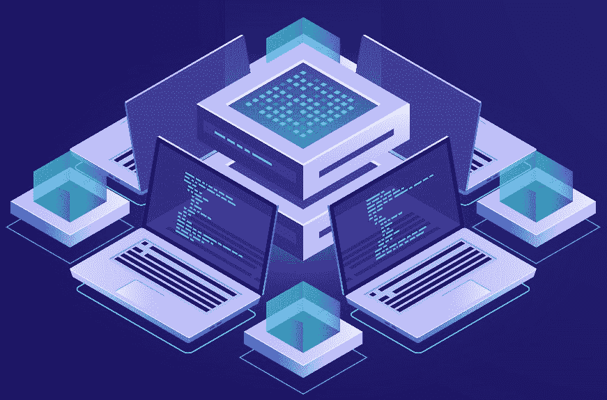
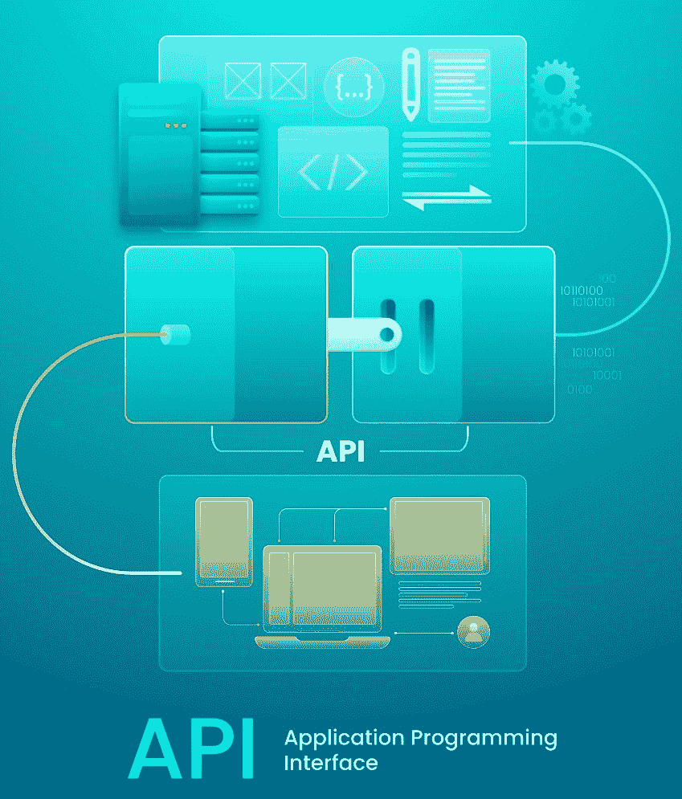
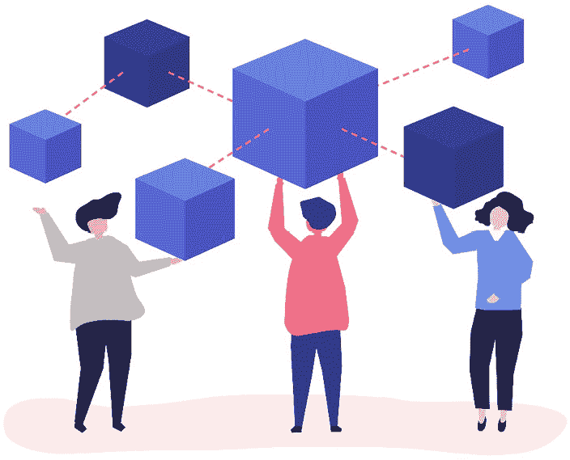
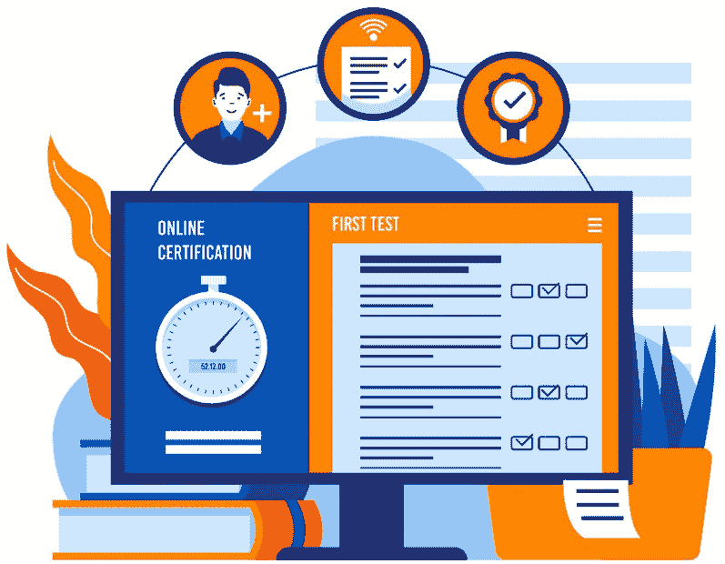

# 6

# 在 Node.js 中设计微服务架构

在 Node.js 中设计微服务架构涉及将单体应用程序分解成更小、独立的微服务，这些微服务可以单独开发、部署和扩展。

我们将开始本章，通过在 Node.js 中设计微服务架构来为微服务开发做准备。在 Node.js 中设计微服务架构通常是一项复杂的任务，需要在开发微服务时认真对待。

到本章结束时，你将能够设计一个在 Node.js 中健壮的、可扩展的、有弹性的和可维护的微服务架构，这将使你能够高效地开发和部署复杂的应用程序。

在本章中，我们将涵盖以下主要主题：

+   在创建微服务之前需要考虑的事项

+   通信协议和设计 API

+   分散式数据管理和数据一致性

+   认证和授权、错误处理和容错性

+   监控和跟踪请求以及容器化技术

# 在创建微服务之前需要考虑的事项

在本节中，我们将识别可以分离成独立微服务的不同业务能力，并定义每个微服务的边界。识别微服务是指确定应用程序中哪些组件或功能应作为独立的、独立的微服务实现的过程。

识别微服务的关键步骤如下：

1.  **按业务能力分解**：首先理解你的应用程序的业务领域。识别不同的业务能力或功能。每个业务能力通常都可以作为微服务的良好候选者。例如，用户管理、产品目录、订单处理和支付处理可以是独立的微服务。

1.  **应用领域驱动设计（DDD**）：DDD 是一种设计方法，鼓励以与你的业务需求一致的方式对应用程序的领域进行建模。识别领域内的边界上下文，这些上下文代表具有自己规则和模型的独立区域。每个边界上下文都可以成为一个微服务。

1.  **分析依赖关系**：分析应用程序不同部分之间的依赖关系。微服务理想情况下应相互之间有最小的依赖。识别可以与其数据和逻辑隔离的组件，减少服务间的依赖。

1.  **数据隔离**：在识别微服务时考虑数据所有权。微服务通常应拥有并管理自己的数据。如果应用程序的不同部分需要不同的数据库或数据存储解决方案，这可能表明需要独立的微服务。

1.  **关注点分离**：应用关注点分离原则。每个微服务应有一个单一、明确的责任。如果一个组件或功能处理多个责任，考虑将其拆分为多个微服务。

1.  **可扩展性需求**：考虑应用不同部分的可扩展性需求。某些功能可能需要独立扩展，这使得它们成为微服务的良好候选。

1.  **技术栈**：评估应用不同部分所使用的技**术栈**和**技术**。如果某些组件需要不同的技术或语言，它们可能更适合作为独立的微服务。

1.  **部署和生命周期**：评估各种组件的部署和生命周期需求。某些部分可能需要频繁更新或部署，这使得它们适合作为微服务。

1.  **所有权和团队**：考虑应用不同部分的所有权和开发团队。微服务通常与所有权边界相一致，每个团队负责一个或多个微服务。

1.  **客户端需求**：考虑服务客户端或消费者的需求。不同的客户端可能需要不同的功能集。

1.  **用例和用户旅程**：分析应用内的用例和用户旅程。某些用例可能与独立的微服务很好地匹配。

1.  **测试和维护**：考虑测试和维护需求。较小的微服务通常更容易测试、维护和演进。

1.  **迭代和精炼**：识别微服务的过程是迭代的。您可能从初步分解开始，随着时间的推移，随着对应用需求和用法模式的深入了解，对其进行精炼。

在创建过于细粒度的微服务（导致过度复杂性）和过于单体化的微服务（违背微服务目的）之间取得平衡是很重要的。

其他信息

**关注点分离原则**是编程中用来将应用分割成单元的原则，这些单元的功能之间重叠最小。通过模块化、封装和软件层的排列来实现关注点分离。更多信息请参阅[help.sap.com/doc/abapdocu_753_index_htm/7.53/en-US/abenseperation_concerns_guidl.htm#:~:text=Separation%20of%20concerns%20is%20a,and%20arrangement%20in%20software%20layers](http://help.sap.com/doc/abapdocu_753_index_htm/7.53/en-US/abenseperation_concerns_guidl.htm#:~:text=Separation%20of%20concerns%20is%20a,and%20arrangement%20in%20software%20layers)。

*图 6.1*展示了识别微服务的过程：

图 6.1：识别微服务（图片由 Freepik 上的 fullvector 提供）

在识别和设计微服务的过程中，团队之间的协作、领域专家和架构师的合作至关重要，以确保最终架构与业务目标和技术要求相一致。

理解了这些概念后，我们现在可以继续讨论通信协议和设计 API。

# 通信协议和设计 API

**通信协议和设计 API** 可以教会我们如何选择适合您需求的通信协议，并为每个微服务设计定义良好且版本化的 API。

选择通信协议和设计 API 是构建微服务架构的关键方面，因为它们使服务能够有效地交互，并为客户端提供一个定义良好的接口。

让我们来看看微服务中通信协议和 API 设计的一些关键考虑因素。

## 通信协议

在微服务架构中，服务之间的通信是一个关键方面，它直接影响系统的性能、可扩展性和可靠性。通信协议是使分布式架构中的微服务之间无缝交互的基础：

+   **HTTP/HTTPS**: 大多数微服务通过 HTTP 或其安全版本 HTTPS 进行通信。这种选择因其简单性、易用性和与网络技术的兼容性而被广泛采用。

+   **gRPC**: gRPC 是一个高性能、语言无关的框架，用于构建 **远程过程调用** (RPC) API。它使用 **Protocol Buffers** (Protobuf) 进行高效的数据序列化。

+   **消息队列**: 对于异步通信和事件驱动架构，使用 RabbitMQ、Apache Kafka 或 AWS SQS 等消息队列。这些队列促进了服务之间的解耦通信。

+   **WebSocket**: WebSocket 用于微服务和客户端之间的双向、实时通信。它适用于需要即时更新的应用程序，如聊天应用或实时仪表板。

+   **自定义协议**: 在某些情况下，会开发自定义通信协议，尤其是在针对特定用例或性能要求进行优化时。

+   (`GET`、`POST`、`PUT` 和 `DELETE`) 是无状态的，这使得它适合许多微服务交互。

*图 6.2* 展示了通信协议：

图 6.2：通信协议（图片由 studiogstock 在 Freepik 提供）

总结来说，微服务架构中通信协议的选择是一个关键决策，这取决于系统需求、性能考虑以及服务之间数据交换的性质。每种协议都有其优势和用例，选择应与微服务生态系统的目标相一致。

学习了这些概念后，我们可以继续进行 API 设计。

## API 设计

**API 设计**涉及协调和管理构建用于与微服务通信的强大且功能齐全的 API 的完整过程。此外，它还是微服务架构的关键方面，影响着服务之间的交互并促进有效通信。

这就是 API 设计过程的工作方式：

+   在修改时确保向后兼容性，使用`/v1/endpoint`。

+   **资源命名**: 在 RESTful API 中使用描述性、复数的名词作为资源名称。选择与您的应用程序域相关的有意义的名称。资源可以是单个实体或集合。例如，“customers”是一个集合资源，而“customer”是一个单个实体资源（在银行领域）。

+   正确使用`GET`、`POST`、`PUT`和`DELETE`。使用`GET`进行只读操作，`POST`用于创建资源，`PUT`用于更新，`DELETE`用于删除。

+   使用`200`表示成功，`400`表示客户端错误，`500`表示服务器错误，以清楚地传达 API 请求的结果。

+   **请求和响应格式**: 标准化请求和响应格式，通常使用 JSON。定义清晰的数据结构以增强一致性。

+   **分页和过滤**: 在返回资源列表的端点中实现分页和过滤选项，以提高效率和可用性。

+   **身份验证和授权**: 明确定义您的 API 中如何处理身份验证和授权。使用如 OAuth 2.0 或 API 密钥等标准。

+   **错误处理**: 设计一个一致的错误处理机制，以提供包含如何解决问题的详细信息的错误信息。

+   **速率限制**: 实施速率限制以保护 API 免受滥用并确保公平使用。

+   **文档**: 创建全面的 API 文档，包括端点描述、请求/响应示例、身份验证细节和错误代码。

+   **HATEOAS**: 考虑实现**超媒体作为应用程序状态引擎**（HATEOAS），在响应中为客户端提供相关资源的链接，促进 API 的自发现。

+   **验证**: 在服务器端验证输入数据以确保数据完整性和安全性。

+   **测试**: 使用 Postman、Swagger 或自动化测试框架等工具彻底测试您的 API。涵盖正负测试用例。

+   **版本控制和弃用**: 制定版本控制和弃用策略以管理更改并通知客户端即将进行的修改。

+   **监控**: 实施 API 监控和分析，以跟踪使用情况，检测性能瓶颈，并解决问题。

+   **安全性**: 应用安全最佳实践，包括输入验证、授权检查以及防止 SQL 注入和 XSS 攻击等常见漏洞。

+   **性能**: 通过最小化不必要的数据传输并在适当的位置使用缓存来优化 API 性能。

+   **反馈循环**：与 API 消费者建立反馈循环，收集他们的意见并根据他们的需求改进 API。

+   **测试环境**：提供一个测试或预生产环境，让客户端在使用生产环境之前可以实验您的 API。

考虑到这些概念，构建更好的 API 的过程可以轻松完成，并且可以长期维持，同时保持稳健的架构。有效的 API 设计是微服务开发的基石，促进互操作性、可维护性和积极的开发者体验。定期回顾和优化 API 设计，以适应不断变化的企业需求和行业最佳实践。

附加信息

HATEOAS 是 REST 应用架构的一个约束条件，使其与其他网络应用架构区分开来。使用 HATEOAS，客户端与一个网络应用交互，该应用的服务器通过超媒体动态提供信息。更多信息请参阅[htmx.org/essays/hateoas/](http://htmx.org/essays/hateoas/)。

*图 6**.3*展示了 API 设计的过程：

图 6.3：API 设计（Freepik 上的图片）

总结来说，有效的通信协议和精心设计的 API 对于微服务架构的成功至关重要，促进服务的互操作性、可靠性和可维护性。

现在，我们可以继续到下一节，我们将讨论去中心化数据管理和数据一致性。

# 去中心化数据管理和数据一致性

在微服务架构中，**去中心化数据管理和数据一致性**是重要的考虑因素。微服务通常维护自己的数据库，在分布式环境中管理数据可能会具有挑战性。

以下是一些关键原则和策略，以在确保数据一致性的同时实现去中心化数据管理：

+   **去中心化数据所有权**：分配每个微服务对其数据的所有权。这意味着每个服务负责其数据的存储、检索和管理。

+   **使用合适的数据库**：根据每个微服务的具体需求选择合适的数据库技术。选项包括关系型数据库（SQL）和非关系型数据库（例如，MongoDB、Cassandra）。

+   **事件溯源和 CQRS**：考虑事件溯源和**命令查询责任分离**（CQRS）模式来维护数据所有变更的日志。这可以通过重放事件来重新创建服务状态，从而帮助实现数据一致性。

+   **异步通信**：使用异步消息模式（消息队列、事件代理）在微服务之间传播数据变更和事件。这可以实现最终一致性。

+   **同步通信**：当需要同步通信时，实施补偿或回滚机制来处理故障并保持一致性。

+   **分布式事务（谨慎使用）**：对分布式事务要谨慎，因为它们可能导致性能和可扩展性问题。应谨慎使用**两阶段提交**（**2PC**），并探索如 Saga 模式等替代方案。

+   **Saga 模式**：在多个微服务之间实现 Saga 模式以处理长时间运行的交易。Sagas 是一系列本地事务，如果某个步骤失败，则使用补偿操作来维护一致性。

+   **幂等性**：确保微服务中的操作是幂等的，这意味着它们可以被重复执行而不会改变结果。这有助于管理失败和重试，而不会导致不一致。

+   **数据验证和约束**：在微服务内部执行数据验证和约束，以防止无效或不一致的数据进入系统。

+   **一致性模型**：了解并选择适合您应用程序的适当一致性模型。选项包括强一致性、最终一致性和因果一致性，具体取决于您的需求。

+   **数据复制**：考虑在多个数据存储或微服务之间复制数据以提高冗余性和可用性。

+   **全局唯一标识符**（**GUIDs**）：使用 GUID 或 **通用唯一标识符**（**UUIDs**）以确保微服务中的数据记录具有唯一的标识符。

+   **监控和日志记录**：实现强大的监控和日志记录，以早期发现数据一致性问题时。使用分布式跟踪和集中式日志记录等工具。

+   **数据备份和恢复**：制定数据备份和恢复策略，以减轻故障或数据损坏导致的数据丢失。

+   **测试和验证**：彻底测试数据一致性场景，包括故障恢复和数据对齐过程。

+   **文档和沟通**：记录数据一致性策略，并在开发团队之间清晰沟通。确保所有团队成员都理解并遵循这些策略。

+   **数据治理**：建立数据治理实践和政策，以维护整个微服务生态系统中数据的质量和一致性。

在微服务中，数据一致性通常通过在强一致性和最终一致性之间进行权衡来实现，具体取决于您应用程序的需求和性能限制。

其他信息

CQRS 是一种系统架构，它将命令查询分离的思想扩展到服务层面。更多信息请参阅 [learn.microsoft.com/en-us/azure/architecture/patterns/cqrs](http://learn.microsoft.com/en-us/azure/architecture/patterns/cqrs)。

*图 6**.4* 展示了去中心化的数据管理：

图 6.4：去中心化的数据管理（图片由 rawpixel.com 在 Freepik 提供）

总结来说，精心设计和实施数据管理策略对于维护数据的完整性并利用微服务架构的优势至关重要。

在下一节中，我们将学习关于认证和授权、错误处理和容错性。

# 认证和授权、错误处理和容错性

我们将学习如何实现一个健壮的认证和授权机制来保护对您的微服务的访问，并构建能够优雅处理错误和故障的容错性微服务。

认证、授权、错误处理和容错性是构建安全且健壮微服务的关键方面。

让我们更详细地探讨这些主题。

## 认证和授权

**认证和授权**是任何软件系统中的基本安全概念，包括微服务架构。它们通常一起使用，以确保用户和服务是其所声称的（认证）以及他们有权访问特定资源或执行特定操作（授权）：

+   **认证**（**AuthN**）：认证验证用户或服务的身份。常见的方法包括用户名/密码、API 密钥、令牌或**单点登录**（**SSO**）。使用 OAuth 2.0 或**JSON Web Tokens**（**JWT**）等认证机制来保护 API 端点。实施强大的密码策略、**多因素认证**（**MFA**）和凭据的安全存储。

+   **授权**（**AuthZ**）：授权基于已认证用户或服务的权限控制对资源的访问。实施**基于角色的访问控制**（**RBAC**）或**基于属性的访问控制**（**ABAC**）来定义谁或什么可以访问什么资源。使用中间件或 API 网关来强制执行授权规则。

+   **OAuth 2.0 和 OpenID 连接**（**OIDC**）：OAuth 2.0 是一个广泛使用的委托授权协议。OIDC 扩展了 OAuth 2.0 以用于用户认证。在基于微服务的应用程序中使用 OAuth 2.0 和 OIDC 进行安全的认证和授权。

+   **单点登录**（**SSO**）：实施 SSO 解决方案，使用户只需认证一次即可访问多个服务，无需重新输入凭据。

+   **基于令牌的认证**：使用令牌（例如，JWT）进行无状态认证。令牌包含用户身份信息，并经过签名或加密以防止篡改。

+   **服务间认证**：在微服务之间使用**双向 TLS**（**mTLS**）或 API 密钥进行认证。实施服务网格以保护服务间的通信。

+   **审计日志**：记录认证和授权事件以进行审计和合规性目的。

认证和授权在构建安全且健壮的微服务过程中可以起到很大作用，同时保持良好的应用程序架构。

在下一节中，我们将讨论错误处理和容错性。

## 错误处理和容错性

**错误处理和容错**是设计健壮和可靠的微服务架构的关键方面。在像微服务这样的分布式系统中，故障是不可避免的，服务必须能够优雅地处理错误，并在可能的情况下继续运行：

+   **优雅降级**: 设计微服务以在负载下或依赖服务不可用的情况下优雅降级。提供回退机制或缓存数据。

+   **断路器模式**: 实现断路器模式以检测和防止对失败服务的重复请求。当失败达到阈值时，打开电路。

+   **重试策略**: 使用重试机制来处理短暂故障。实现指数退避和抖动以避免压倒依赖服务。

+   **超时**: 为请求设置超时，以防止它们无限期地阻塞。超时应该适合预期的响应时间。

+   **隔离和防波堤**: 使用微服务隔离和防波堤等技术来限制故障并防止其传播到系统的其他部分。

+   **错误处理中间件**: 实现集中式错误处理中间件，以在微服务之间一致地捕获和响应异常。

+   **错误代码和消息**: 定义一组标准化的错误代码和消息，以向客户端传达有意义的信息。在 API 响应中包含错误详细信息。

+   **监控和警报**: 实现监控和警报系统以实时检测性能问题和错误。使用 Prometheus 和 Grafana 等工具监控微服务。

+   **测试弹性**: 进行弹性测试，包括混沌工程，以模拟故障并评估微服务处理故障的能力。

+   **文档**: 为开发者和运维团队记录错误处理策略、容错机制和重试策略。

+   **回退服务**: 当服务不可用时，提供回退服务或缓存数据以保持基本功能。

+   **回滚和恢复计划**: 在严重故障、数据损坏或安全漏洞的情况下制定回滚和恢复计划。

总结来说，身份验证、授权、错误处理和容错对于构建安全、可靠且能够承受分布式架构挑战的微服务至关重要。这些实践有助于确保服务的可用性和完整性，同时保护敏感数据免受未经授权的访问。

在最后一节，我们将讨论监控和跟踪请求以及容器化技术。

# 监控和跟踪请求以及容器化技术

在本节中，您将学习如何实现监控和分布式跟踪以深入了解微服务的性能和行为，以及如何利用容器化技术（如 Docker）将微服务打包成便携式和轻量级的容器。

让我们详细探讨这些主题。

## 监控和跟踪请求

在微服务架构中**监控和跟踪请求**对于深入了解服务的性能、行为和依赖性至关重要。适当的监控和跟踪使您能够识别瓶颈、诊断问题并优化系统的整体性能：

+   **分布式跟踪**：实现分布式跟踪以跟踪请求在各个微服务中的流动。流行的工具包括 Jaeger、Zipkin 和 OpenTelemetry。使用跟踪标识符（例如，跟踪 ID）来关联不同微服务和服务的请求。

+   **请求日志记录**：记录关于传入请求的基本信息，例如请求方法、URL、头信息和时间戳。在日志中包含关联 ID 或请求 ID，以将同一请求相关的日志条目联系起来。

+   **集中式日志记录**：将所有微服务的日志聚合到集中式日志系统中（例如，ELK Stack、Graylog 或 Fluentd）。使用结构化日志格式（如 JSON）以便于解析和分析。

+   **性能指标**：收集每个微服务的性能指标，包括响应时间、错误率和资源利用率（CPU、内存）。使用 Prometheus 和 Grafana 等监控工具进行指标收集和可视化。

+   **警报和通知**：根据性能阈值和错误率设置警报规则。与警报系统（例如，PagerDuty、Slack）集成以实现及时通知。创建仪表板以可视化微服务的健康状况并主动响应问题。在微服务架构中，警报和通知对于及时检测、响应和解决问题至关重要。有效的警报和通知实践对于维护微服务的可靠性和可用性至关重要。一个设计良好的系统确保在出现问题时，相关人员能够及时得到通知，从而促进快速解决并最小化停机时间。

+   **错误跟踪**：实现错误跟踪解决方案（例如，Sentry、Rollbar）以捕获和分析应用程序错误和异常。监控错误率并优先修复关键问题。

+   **基础设施监控**：监控底层基础设施组件的健康状况和性能，包括服务器、容器和网络资源。

+   **安全监控**：实现安全监控和入侵检测以检测和响应安全威胁和漏洞。

+   **性能优化中的追踪**：使用追踪数据来识别微服务内部的瓶颈和性能问题。根据这些信息优化关键路径。

+   **可观察性工具**：探索结合指标、日志和追踪的可观察性工具，以获得对您的微服务生态系统的全面了解。

正如我们所学的，这些概念帮助我们更好地监控应用程序，识别错误，并更快地解决问题。

*图 6**.5* 展示了监控和追踪请求的示例：

图 6.5：监控和追踪请求（Freepik 上的图片）

在微服务架构中监控和追踪请求对于深入了解您服务的性能、健康和行为至关重要。

在下一节中，我们将学习更多关于容器化技术的内容。

## 容器化技术

**容器化技术**在高效打包和部署微服务中发挥着至关重要的作用。

它们也在现代微服务架构中发挥着关键作用，提供了高效且一致的方式来打包、部署和管理应用程序。容器化技术是构建和部署微服务的基础：

+   **Docker**：使用 Docker 将微服务和它们的依赖项打包到容器中。Docker 容器在不同环境中是可移植的和一致的。它也是一个强大的平台，通过容器化简化了应用程序的部署和扩展。容器封装了应用程序及其依赖项，在不同环境中提供一致性。

+   **Kubernetes**：使用 Kubernetes 在大规模上部署和管理容器。Kubernetes 为微服务提供编排、扩展和负载均衡。Kubernetes 通常简称为 K8s，是一个强大的开源容器编排平台，旨在自动化容器化应用程序的部署、扩展和管理。

+   **容器编排**：根据您的基础设施和云提供商，考虑其他容器编排平台，如 Docker Swarm、Amazon ECS 或 **Google Kubernetes Engine**（**GKE**）。

+   **容器注册库**：使用容器注册库（例如，Docker Hub、Amazon ECR、Google Container Registry）来存储和分发容器镜像。

+   **基础设施即代码**（**IaC**）：使用 Terraform 或 AWS CloudFormation 等 IaC 工具定义基础设施和容器配置，以确保可重复性。

+   **服务网格**：在容器化环境中，通过实施服务网格（如 Istio 或 Linkerd）来管理服务间的通信、路由和安全。

+   **持续集成/持续部署（CI/CD）**：使用 CI/CD 管道自动化容器化微服务的构建和部署。常用的工具有 Jenkins、Travis CI 和 CircleCI。

+   **容器安全**：通过定期扫描容器镜像以查找漏洞、实施安全策略和执行访问控制来确保容器安全。

+   **密钥管理**：使用 Kubernetes Secrets 或 HashiCorp Vault 等工具来安全地管理容器内使用的敏感信息（例如 API 密钥、凭证）。

+   **资源扩展**：利用 Kubernetes 的自动扩展功能，根据资源利用率自动调整容器副本的数量。

+   **部署管道**：为容器化应用程序设置部署管道涉及自动化构建、测试和部署容器镜像的过程。一个结构良好的部署管道简化了将代码更改从开发到生产的流程，确保在部署容器化应用程序时的一致性、可靠性和效率。定期审查和优化管道以实现持续改进。

通过考虑这些技术，你将拥有额外的力量来更快地开发，并且可以运行在任何平台上的应用程序。Docker 仍然是标准，而像 Kubernetes 这样的编排平台提供了强大的工具来管理大规模的容器化应用程序。容器化技术的选择应与特定的项目需求、偏好以及整体微服务架构相一致。

*图 6**.6* 展示了 Docker 化的过程：

图 6.6：Docker（图片由 vectorjuice 在 Freepik 上提供）

总结来说，通过有效地监控和跟踪请求以及采用容器化技术，你可以提高基于微服务的应用程序的可观察性、可靠性和可伸缩性。这些实践对于维护一个健康和响应迅速的微服务生态系统至关重要。

# 总结

在本章中，我们学习了关于微服务及其设计的大量知识。你学习了如何构建可以在每个平台上运行、快速、可靠和安全的微服务。

在 Node.js 中设计微服务架构涉及将单体应用程序分解成更小、独立的、协同工作以提供功能的服务。

在 Node.js 中设计微服务需要仔细考虑技术和架构方面的因素，以创建一个灵活、可扩展和可维护的系统。Node.js 由于其非阻塞 I/O、轻量级特性和充满活力的库和框架生态系统，非常适合构建微服务。

在下一章中，我们将学习如何在 Node.js 应用程序中集成微服务。

# 测验时间

+   在创建微服务之前需要考虑哪些事情？

+   API 设计过程是如何工作的？

+   认证和授权是什么？
