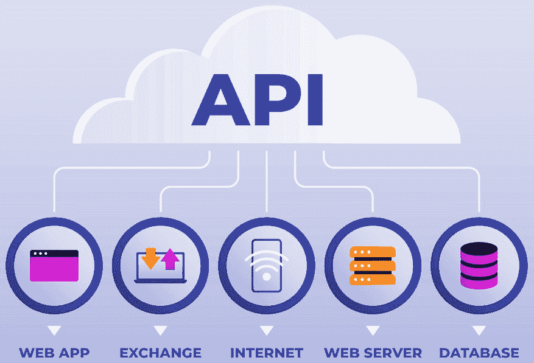
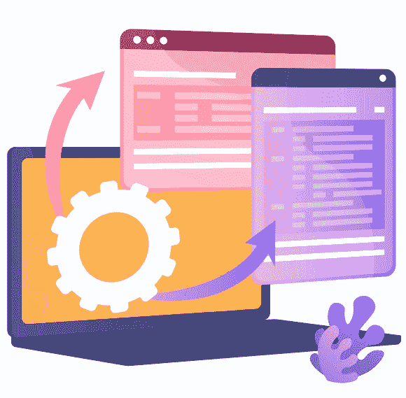

# 第七章：在 Node.js 应用程序中集成微服务

在 Node.js 中集成微服务涉及在不同服务之间建立通信和协调，以创建一个统一且功能齐全的系统。

我们将从这个章节开始，将微服务集成到 Node.js 应用程序中。当将微服务集成到 Node.js 时，请考虑你系统的具体要求、最适合你需求的通信模式，以及 Node.js 生态系统中的工具和库。

到本章结束时，你将能够将微服务集成到你的 Node.js 应用程序中，并构建一个强大且可扩展的架构，该架构可以处理复杂的企业需求。

在本章中，我们将涵盖以下主要主题：

+   同步 HTTP/REST 通信和异步消息

+   事件驱动架构（EDA）和 API 网关

+   服务网格和缓存

+   分布式跟踪和数据库集成

+   监控和可观察性以及错误处理和弹性

# 同步 HTTP/REST 通信和异步消息

在本节中，我们将学习关于同步 HTTP/REST 通信和异步消息的内容，这两种是微服务架构中使用的两种基本通信模式。

## 同步 HTTP/REST 通信

**同步通信**在微服务中通常涉及 HTTP/REST，其中一个微服务向另一个微服务发出请求以完成特定操作。

这里是使用这种通信方式的关键概念：

+   **请求-响应模型**：同步通信遵循请求-响应模型，其中客户端向服务器发送请求并等待响应。在 RESTful API 中，这种通信通常通过 HTTP/HTTPS 协议进行。

+   `GET`、`POST`、`PUT`、`DELETE`等用于对资源执行操作。它们用于定义在微服务架构中可以在资源上执行的操作。这些方法由 HTTP 协议定义。让我们快速看一下其中的一些：

    +   `GET`：用于从指定资源检索数据

    +   `POST`：用于在服务器上创建新数据

    +   `PUT`：用于在服务器上更新数据

    +   `PATCH`：用于在服务器上部分更新数据

    +   `DELETE`：用于从服务器删除数据

    在基于 Node.js 的微服务架构中，这些 HTTP 方法用于定义 API 端点，这些端点代表了每个微服务提供的服务。例如，一个用户微服务可能包含使用`GET`方法检索用户数据的端点，使用`POST`方法创建新用户，使用`PUT`或`PATCH`方法更新用户，以及使用`DELETE`方法删除用户。这些 HTTP 方法在 Node.js 应用程序中使用如 Express.js 等框架进行处理，这些框架提供了一个简单的方法来定义每个端点和 HTTP 方法的路由处理器，使得开发者可以轻松实现每个微服务所需的功能。

+   **RESTful 原则**：**表征状态转移**（**REST**）是一种用于设计网络应用程序的架构风格。它强调无状态通信，意味着每个客户端请求都包含服务器完成该请求所需的所有信息。在 Node.js 微服务的上下文中，REST 通常用于定义服务之间通信的方式。当使用 Node.js 构建微服务时，REST 通常用于定义端点和服务之间通信时可以使用的 HTTP 方法。例如，一个微服务可能会公开一组 RESTful API，其他微服务可以通过调用这些 API 来执行特定操作。

    此外，RESTful API 通常用于定义微服务可以访问或操作的资源和数据。这可能包括定义数据的结构、如何检索或更新数据以及可以在数据上执行的操作。在 Node.js 中，开发者通常使用 Express.js 等框架来为他们的微服务创建 RESTful API。Express.js 提供了一种简单灵活的方式来定义路由、处理请求和与数据交互，使其成为在 Node.js 微服务中构建 RESTful API 的热门选择。

    总体而言，在 Node.js 微服务中使用 REST 可以让开发者创建一个灵活且可扩展的架构，该架构能够使不同的服务有效地进行通信和协作。

+   **无状态和可扩展性**：REST API 的无状态特性使其具有高度的可扩展性。每个请求都包含所有必要的信息，服务器不需要为客户端维护会话状态。

+   (`/users`, `/products` 等) 是 REST 中的关键抽象。客户端通过标准 HTTP 方法与资源交互，资源以 JSON 或 XML 格式表示。

+   **数据格式**：JSON 和 XML 是同步通信中常用的数据格式。它们提供了一种标准的方式来结构化服务之间交换的数据。

这些关键概念将帮助你在创建同步 HTTP/REST 通信时进行沟通，从而确保与微服务之间更好的通信。

*图 7.1* 展示了同步的 HTTP/REST 通信：

图 7.1：同步 HTTP/REST 通信（图片由 cornecoba 在 Freepik 提供）

在微服务架构中，通常结合使用同步的 HTTP/REST 通信和异步消息传递。这有助于开发者更快、更好地构建复杂系统。

在这些概念的基础上，让我们更深入地探讨异步消息传递。

## 异步消息传递

**异步消息传递**在微服务架构中发挥着至关重要的作用，提供了服务的灵活性、可扩展性和解耦。

这里是异步消息传递的一些关键概念：

+   **发布-订阅模型**：异步通信遵循发布-订阅模型，其中服务将事件发布到消息代理，其他服务订阅这些事件，而无需知道发送者的身份。

+   **EDA**：EDA 允许微服务异步地响应事件和消息。例如，当创建新用户时，会发布一个事件，对用户创建事件感兴趣的服务可以订阅并相应地做出反应。

+   **消息代理**：如 **RabbitMQ**、**Apache Kafka** 和 **AWS SQS** 等消息代理简化了异步消息传递。它们解耦了生产者和消费者，确保即使在接收者服务暂时不可用的情况下，消息也能被传递。

+   **最终一致性**：异步消息传递通常导致最终一致性，其中服务可能不会立即反映最新的更改。这种一致性与响应性之间的权衡在分布式系统中至关重要。

+   **可靠性和容错性**：异步消息传递通过允许服务以自己的节奏处理消息来提高可靠性。它还提供了容错性；如果服务失败，消息不会丢失，可以在稍后处理。

+   **异步系统的挑战**：异步通信引入了诸如消息排序、重复处理和应对失败消息等复杂性。实现幂等处理和适当的错误处理机制至关重要。

+   **微服务集成模式**：异步消息传递常用于微服务集成模式，如事件溯源、**命令查询责任分离**（**CQRS**）和 Sagas（用于管理长时间运行和复杂的业务交易）。

*图 7*。2* 展示了异步消息传递的过程：

图 7.2：异步消息传递（图片由 Freepik 上的 teravector 提供）

同步通信适用于简单和即时的交互，而异步消息传递为微服务之间更复杂和松散的交互提供了灵活性、可扩展性和容错性。您应该选择哪一个取决于您的具体用例和系统需求。

在 Node.js 中的微服务背景下，同步通信指的是直接请求-响应机制，调用者等待目标微服务的响应后再继续。这可以通过 HTTP REST API、**远程过程调用**（**RPC**）或同步消息系统（如 AMQP）等方法实现。

另一方面，异步通信涉及一种解耦、非阻塞的通信方法。这可以通过消息系统（如 Apache Kafka 和 RabbitMQ）或使用 WebSocket 或 MQTT 等技术实现的 EDAs 来实现。在这种方法中，发送者不会等待立即的响应，而是继续进行其他任务，稍后接收响应。

关于日志记录，Datadog 和 Splunk 都为微服务环境提供了全面的监控和日志记录解决方案。要在 Node.js 微服务架构中将日志与 Datadog 和 Splunk 集成，您可以使用 Datadog 和 Splunk 提供的相应库或 SDK。对于 Datadog，您可以使用`datadog-node`库或任何可用的社区支持的集成。这个库从您的 Node.js 应用程序收集日志、跟踪和指标，并将它们发送到 Datadog 进行可视化和分析。同样，对于 Splunk，您可以使用`splunk-connect-for-nodejs`库，它提供了一种简单地将您的 Node.js 应用程序中的日志发送到 Splunk 进行索引和分析的方法。

此外，Datadog 和 Splunk 都提供了广泛的文档和资源，以指导您将它们的日志解决方案与您的 Node.js 微服务集成。通过利用这些工具的功能，您可以有效地监控、跟踪和记录微服务架构的行为和性能，从而获得宝贵的见解并优化您的系统。

现在您已经了解了这些概念，让我们来学习 EDA 和 API 网关。

# EDA 和 API 网关

EDA 和 API 网关可以帮助我们在选择应用程序的正确架构以及 API 的正确网关时做出正确的选择。

## EDA

**EDA**是一种信息流由事件决定的范式。在微服务的上下文中，EDA 是构建松散耦合和可扩展系统的一种强大方法。

本架构涉及以下概念：

+   **松散耦合**：EDA 通过允许服务通过事件异步通信来解耦微服务。服务在发生某些操作时发出事件，其他服务可以对这些事件做出反应，而无需直接耦合。

+   **发布-订阅模型**：发布-订阅模式是 EDA 的核心。服务可以将事件发布到消息代理，其他服务可以订阅特定的事件类型。这种模式使得服务之间无需相互了解即可实现无缝通信。

+   **事件类型**：事件代表系统中的重大事件，例如用户注册或订单放置。事件包含相关数据，使订阅者能够适当地做出反应。

+   **可扩展性和响应性**：EDA 支持水平扩展，因为服务可以独立处理事件。这增强了系统的响应性，尤其是在处理大量事件时。

+   **事件存储和命令查询责任分离**：EDA 与事件存储配合良好，其中事件作为应用状态的原始真相存储。CQRS 可以根据事件分离读取和写入操作，优化性能。

+   **可靠性和容错性**：EDA 增强了可靠性。即使某个服务暂时不可用，事件也不会丢失。消息代理通常提供重试和确认等特性，确保消息传递。

+   **复杂的工作流和叙事**：EDA 非常适合使用叙事模式管理复杂的工作流和长时间运行的交易。叙事通过一系列事件协调多个服务的操作，确保一致性。

EDA 在 Node.js 中广泛使用，因为它确保了应用稳定性。

在掌握这些概念之后，让我们来看看 API 网关。

## API 网关

**API 网关**可以为您的应用带来许多好处，但您必须掌握以下概念：

+   **单一入口点**：API 网关是一个服务器，充当管理来自客户端请求的单一入口点。它处理各种任务，如身份验证、请求路由、负载均衡和缓存。

+   **请求路由**：API 网关可以根据请求的 URL、头部或其他参数将请求路由到适当的微服务。这使得客户端无需了解内部服务结构即可与网关交互。

+   **身份验证和授权**：API 网关通过验证用户凭据并生成令牌来处理身份验证。它们还通过确保已验证用户有权访问特定资源来处理授权。

+   **负载均衡**：API 网关在多个微服务的实例之间分配传入的请求，确保均匀的工作负载分配和高可用性。

+   **缓存**：API 网关可以缓存来自微服务的响应，减少服务负载并提高频繁访问数据的延迟。

+   **协议转换**：网关可以转换通信协议。例如，它们可以接受来自客户端的 HTTPS 请求，并通过 HTTP 与内部服务进行通信。

+   **速率限制和节流**：API 网关可以强制执行速率限制和节流策略，以防止滥用并确保资源的公平使用。

+   **日志记录和监控**：API 网关记录传入的请求和响应，为监控和调试提供有价值的见解。它们通常与集中式日志记录和监控解决方案集成。

+   **横切关注点**：API 网关解决横切关注点，使单个微服务能够专注于业务逻辑，无需担心诸如安全性和协议转换等问题。

API 网关作为我们应用的独特入口点。

*图 7*.*3*展示了 API 网关：

图 7.3：API 网关（图片由 Freepik 提供）

总结来说，事件驱动架构（EDA）提供了灵活性和解耦，使服务能够异步响应事件。另一方面，API 网关充当统一的接口，管理客户端-服务交互的各个方面，并增强微服务生态系统的安全性、可扩展性和监控能力。当它们一起使用时，它们创建了一个强大、响应迅速且易于管理的微服务架构。

现在，我们可以继续到下一节，我们将讨论服务网格和缓存。

# 服务网格和缓存

在微服务架构中，服务网格和缓存可以帮助简化微服务的架构并提高其性能。

## 服务网格

**服务网格**是一个专门的基础设施层，它促进了微服务架构中服务之间的通信、可观察性和控制。它旨在处理复杂的通信模式，提供网络级功能，并增强微服务的整体可管理性。

以下概念将帮助您开始使用服务网格：

+   **服务间通信**：服务网格是一个专门的基础设施层，用于处理服务间通信。它通过管理服务之间的通信来简化复杂的微服务架构。

+   **边车模式**：服务网格通常遵循边车模式，其中在每个微服务旁边部署一个代理边车容器。这些边车处理通信，使微服务免于网络问题。

+   **流量管理**：服务网格允许进行复杂的流量管理。它可以处理诸如负载均衡、重试、超时和断路器等任务，从而提高可靠性和容错性。

+   **可观察性**：服务网格为微服务生态系统提供了深入的观察能力。它可以收集指标、跟踪和日志，从而更好地了解服务行为和性能。

+   **安全性**：服务网格通过处理加密、身份和访问管理以及策略执行来增强安全性。即使在多云或混合环境中，它也能确保服务之间的安全通信。

+   **动态配置**：服务网格允许进行动态配置更改，而无需重新部署服务。策略、重试和其他设置可以实时调整。

+   **流量拆分**：服务网格允许流量拆分，允许逐步推出新功能。它可以向更新的服务版本发送部分流量，从而进行 A/B 测试和金丝雀发布。

更好地理解服务网格可以帮助您简化微服务的架构。

*图 7.4* 展示了服务网格：

图 7.4：服务网格（图片由 Freepik 上的 rawpixel 提供）

在微服务开发中，服务网格是一个关键概念。接下来，我们将探讨缓存。

## 缓存

**缓存**是微服务架构中的一种关键优化策略，旨在提高性能、减少延迟并增强可伸缩性。

您可以通过应用以下方法来改进您的应用程序：

+   **提高性能**：缓存将频繁访问的数据存储在请求者附近，减少了从源获取数据的需要。这显著提高了响应时间并减少了服务器负载。

+   **缓存失效**：缓存的一个挑战是缓存失效。缓存数据可能会过时，导致不一致。基于时间失效或使用缓存过期策略等策略可以减轻这一问题。

+   **缓存策略**：根据应用程序需求实施缓存策略。策略包括全页缓存、对象缓存或查询缓存。每种策略都针对不同类型的数据。

+   **分布式缓存**：在微服务架构中，分布式缓存系统至关重要。例如**Redis**或**Memcached**这样的工具允许微服务共享缓存数据，从而提高整体系统性能。

+   **缓存安全**：在缓存中保护敏感数据，确保敏感信息不会最终出现在缓存中。这就是为什么我们必须为缓存数据实施适当的访问控制和加密机制。

+   **缓存旁路和写入通过**：如缓存旁路（如果缓存中找不到数据则从数据库中获取数据）和写入通过缓存策略（同时将数据写入缓存和数据库）有助于保持数据一致性。

+   **缓存监控**：您可以执行缓存监控以跟踪缓存命中、未命中和有效性，同时优化缓存策略并确保缓存效率。

*图 7*.*5*说明了缓存的过程：

图 7.5：缓存（由 Freepik 上的 vectorjuice 提供）

总结来说，服务网格简化并增强了微服务之间的通信，提供了高级的流量管理、安全和可观察性功能。另一方面，缓存通过存储频繁访问的数据来提高性能，但它需要谨慎的管理，特别是在缓存失效和一致性方面。有效地集成这些技术可以显著提高基于微服务的应用程序的性能、可靠性和安全性。

在下一节中，我们将了解分布式追踪和数据库集成。

# 分布式追踪和数据库集成

在本节中，我们将学习如何实现分布式追踪基础设施以及如何将数据库集成到微服务中。

让我们更详细地探讨这些主题。

## 分布式追踪

**分布式追踪**是一种在微服务架构中用于监控、分析和调试服务之间复杂交互的技术。它有助于可视化请求在穿越各种微服务时的流动。

分布式跟踪具有以下特点：

+   **端到端可见性**：分布式跟踪允许您跟踪请求在穿越各种微服务时的路径。它提供了对请求流程的端到端可见性，有助于诊断问题和优化性能。

+   **跟踪上下文**：分布式跟踪依赖于随请求传递的跟踪上下文。微服务架构中的每个服务都会将其信息添加到跟踪上下文中，从而允许关联和可视化整个请求路径。

+   **根本原因分析**：当出现性能问题时，分布式跟踪提供了一种识别根本原因的方法。通过检查跟踪，开发者可以确定导致延迟或错误的特定服务或组件。

+   **分布式跟踪工具**：例如 **Jaeger**、**Zipkin** 和 **OpenTelemetry** 等工具简化了分布式跟踪。它们收集跟踪数据，可视化依赖关系，并提供对延迟瓶颈的洞察。

+   **性能优化**：分布式跟踪有助于性能优化。开发者可以通过分析跟踪来识别瓶颈，优化服务交互，并减少整体系统延迟。

+   **生产调试**：在生产环境中，跟踪有助于调试。当发生错误时，可以通过检查跟踪来了解事件序列和错误发生的上下文。

+   **简化复杂性**：在复杂的微服务架构中，分布式跟踪简化了理解。它提供了服务如何交互的清晰图景，使得维护和演进系统更加容易。

正如您所看到的，分布式跟踪确保了微服务中交互和层的更好可见性。

在下一节中，我们将讨论数据库集成。

## 数据库集成

**数据库集成**是微服务架构的一个关键方面，涉及管理多个微服务中的数据存储、访问和交互。

让我们看看如何在微服务中集成数据库：

+   **数据库抽象层**：我们可以使用数据库抽象层，如 **对象关系映射器**（**ORMs**）或 **对象文档映射器**（**ODMs**），来抽象数据库特定的细节，促进代码模块化，并在需要时更容易地切换数据库。

+   **数据库连接池**：我们可以实现连接池来高效地管理和重用数据库连接。连接池防止了为每个请求建立新的数据库连接的开销，从而提高了性能。

+   **数据一致性**：为确保微服务之间的数据一致性，我们可以根据应用需求实现分布式事务或采用最终一致性模型。例如，Saga 模式可以管理跨多个服务的长时间运行的事务。

+   **缓存策略**：我们可以实施缓存机制以减少数据库查询次数。使用 Redis 等缓存层存储频繁访问的数据有助于提高响应时间并减少数据库负载。

+   **异步数据库操作**：为了非阻塞行为和改进的响应性，我们可以执行异步数据库操作。在 Node.js 中，我们可以使用回调、**承诺**（**promises**）或 async/await 等技术来有效地处理异步任务。

+   **数据库分片和复制**：为了可扩展性，我们可以考虑数据库**分片**（在多个数据库中跨数据水平分区）和**复制**（创建数据库的备份副本）。这些技术分散了负载并增强了容错性。

+   **安全措施**：为了在数据库级别实施安全措施，我们可以实施适当的身份验证、授权、加密和输入验证，以防止数据泄露和 SQL 注入攻击。以下是使用 Node.js 开发的微服务中的安全最佳实践：

    +   **实施基于角色的访问控制**（**RBAC**）：使用 RBAC 来管理对不同微服务和资源的权限和访问。

    +   **使用 API 网关**：实施 API 网关以管理进出流量，执行安全策略并实施速率限制。

    +   **保护通信**：使用 HTTPS 加密微服务和客户端之间的通信。实施安全的协议，如 TLS，以确保数据完整性和机密性。

    +   **输入验证和清理**：验证并清理来自客户端的输入，以防止 SQL 注入、NoSQL 注入和**跨站脚本**（**XSS**）等注入攻击。

    +   **保护身份验证和授权**：使用行业标准身份验证协议，如 OAuth 或 JWT，对访问微服务的用户进行身份验证和授权。

    +   **实施细粒度日志和监控**：记录并监控对微服务的访问，包括身份验证尝试、数据访问和错误处理，以检测和响应安全事件。

    +   **实施安全头部信息**：利用安全头部信息，如**内容安全策略**（**CSP**）、**严格传输安全**（**HSTS**）和 X-Content-Type-Options，以增强安全性并防范常见的网络漏洞。

    +   **保护依赖项**：定期更新和修补第三方库和依赖项，以避免安全漏洞。

    +   **使用 CSP**：通过控制网页可以加载哪些资源来实施 CSP 头部信息，以防范 XSS 攻击。

    +   **实施速率限制**：实施速率限制以防止暴力攻击和**拒绝服务**（**DoS**）攻击。

    通过遵循这些最佳实践，您可以增强使用 Node.js 开发的微服务的安全性，并降低安全漏洞的风险。

+   **监控和分析**: 我们可以实施数据库监控工具来跟踪性能指标、查询执行时间和资源利用率。然后，我们可以利用这些洞察来优化数据库查询和配置，以实现更好的效率。

+   **备份和灾难恢复**: 为数据库建立备份和灾难恢复程序非常重要。我们必须定期备份数据并实施灾难恢复策略，以防止系统故障导致数据丢失。

+   **模式演进**: 随着应用程序的发展，数据库模式可能需要更改。采用如迁移等策略来处理模式修改，而不会影响应用程序的功能，可以帮助我们规划模式演进。

总结来说，集成分布式追踪确保了对微服务交互的可见性，促进了有效的调试和优化。同时，一个良好集成和优化的数据库层对于数据一致性、可扩展性、安全性和性能至关重要，确保了微服务架构的整体稳定性和响应性。

在下一节中，我们将讨论监控和可观察性以及错误处理和弹性。

# 监控和可观察性以及错误处理和弹性

在本节中，你将学习如何监控和观察微服务。你还将了解更多关于错误处理和弹性，这两者都是开发更好的微服务的关键方面。

让我们更详细地探讨这些主题。

## 监控和可观察性

**监控和可观察性**是微服务架构的关键组件，提供了对系统健康、性能和行为洞察。

让我们看看这些组件的特点：

+   **指标收集**: 监控涉及收集各种指标，如 CPU 使用率、内存使用率、请求速率、错误率和延迟。这些指标提供了对系统性能的洞察。

+   **集中式日志记录**: 集中式日志记录将所有微服务的日志聚合到一个中央系统（如 ELK Stack）中。集中式日志简化了整个系统的调试和故障排除。

+   **分布式追踪**: 分布式追踪工具（如 Jaeger 和 Zipkin）提供了对请求在通过不同微服务时的端到端可见性。追踪允许对请求流程进行详细分析，有助于识别瓶颈和问题。

在分布式追踪系统中，不仅追踪系统的正常流程非常重要，而且在生产环境中记录错误和重要流程也同样重要。通过添加错误和关键流程的日志记录，你可以更深入地了解分布式系统的性能和行为。这可以帮助你及时识别和解决问题，以及提高系统的整体可靠性和稳定性。

记录错误和重要流程将提供有价值的信息，可用于调试和优化您的生产环境。

+   **警报和阈值**：您可以根据预定义的阈值设置警报机制，当特定指标超过可接受限制时通知团队，从而实现主动问题解决。

+   **可视化和仪表板**：您可以使用可视化工具和仪表板（例如 Grafana）以可理解的方式展示数据。可视化有助于实时跟踪和性能分析。

+   **异常检测**：我们还可以实施异常检测算法，以自动识别指标中的异常模式。异常可能表明需要调查的潜在问题。

+   **容量规划**：监控数据还可以帮助进行容量规划。通过分析趋势，团队可以预测资源需求并主动扩展基础设施。

+   **成本优化**：通过识别未充分利用的资源，监控数据有助于成本优化。调整实例大小和优化资源分配可以带来显著的成本节约。

监控和可观察性是随着系统发展而持续进行的过程。通过采用包括指标、日志、跟踪和主动测试在内的全面策略，微服务架构可以保持高可靠性和性能水平。

*图 7*.*6*展示了监控和可观察性：

图 7.6：监控和可观察性（图片由 Freepik 上的 storyset 提供）

监控和可观察性可以帮助识别微服务中的关键问题。在 Node.js 中，有几种监控工具和框架可用于监控微服务。以下是一些常用的工具：

+   **Prometheus**：Prometheus 是一个开源的监控和警报工具包。它在微服务社区中广泛使用，并为 Node.js 应用程序提供客户端库以进行仪表化。

+   **Grafana**：Grafana 是一个开源的可视化和监控工具，与 Prometheus 和其他数据源无缝协作。它为监控微服务提供了一套丰富的可视化和仪表板。

+   **New Relic**：New Relic 为微服务提供监控和可观察性解决方案，包括 Node.js 应用程序。它提供应用程序性能监控、错误跟踪和分布式跟踪功能。

+   **Datadog**：Datadog 是一个云规模的监控和分析平台，为微服务提供监控、日志记录和分布式跟踪。

+   **Dynatrace**：Dynatrace 是一个由人工智能驱动的监控和可观察性平台，为微服务（包括 Node.js 应用程序）提供自动化的仪表化和监控。

这些工具可以帮助你在 Node.js 环境中监控微服务的性能、可用性和可靠性。每个工具都有自己的功能和能力，因此根据你的具体监控需求进行评估很重要。

在下一节中，我们将学习更多关于错误处理和弹性的内容。

## 错误处理和弹性

**错误处理和弹性**是微服务架构的关键方面，确保系统可以优雅地处理故障并保持其功能。

在使用以下概念的同时，你必须能够调试每个微服务：

+   **优雅降级**：实现优雅降级，即使某些组件失败，系统也能继续提供有限的功能。用户会体验到降级但仍可用的服务。

+   **超时和重试**：在微服务之间的通信中使用超时和重试。如果一个服务在指定时间内没有响应，则实现重试。逐渐增加连续重试的超时时间。

+   **断路器模式**：如果一个服务持续失败，断路器模式会暂时停止对该服务的请求。这可以防止级联故障并允许服务恢复。

+   **回退机制**：当服务失败时提供回退机制可以返回缓存数据、默认值或静态响应，确保即使在故障期间用户也能收到一些响应。

+   **防波堤**：实现防波堤以隔离故障。隔离组件确保系统某一部分的故障不会影响整个系统。这在资源受限的场景中尤为重要。

    在微服务和错误处理的背景下，防波堤指的是将应用程序的不同部分隔离的概念，以防止一个区域的故障影响其他区域。这可以通过为不同类型的工作创建单独的资源池来实现，例如线程池、数据库连接和网络连接。其思想是将系统隔离开来，以便应用程序某一部分的错误或故障不会级联并影响其他部分的可用性或性能。这有助于提高系统的弹性和容错能力。

    例如，在微服务架构中，实现防波堤可能包括隔离每个服务的错误处理和恢复策略，以便一个服务的故障不会导致整个系统崩溃。这还可能包括对每个服务使用的资源设置限制和控制，以防止资源耗尽和性能下降。

+   **混沌工程**：实践混沌工程以主动识别系统中的弱点。在生产环境类似的环境中引入可控的故障，以观察系统在压力下的行为。

+   **自动恢复**：通过 Kubernetes 等工具实现自动恢复机制，这些工具可以自动重启失败的容器，确保在无需人工干预的情况下快速从故障中恢复。

+   **错误代码和消息**：清晰的、一致的错误消息有助于客户端理解失败，并指导他们采取适当的行动。

+   **事后分析和根本原因分析**：在事件发生后进行事后分析，以了解失败的根本原因。记录发现并实施预防措施，以避免未来出现类似问题。

通过牢记这些概念，你在调试应用程序时将拥有额外的力量，以确保在不同环境中具有更好的兼容性。

总结来说，通过结合强大的监控和可观察性实践、有效的错误处理和弹性策略，微服务架构可以在面对意外挑战的情况下，保持高可用性、提供可靠的性能，并确保良好的用户体验。

# 总结

在本章中，我们学习了关于微服务及其如何集成到我们的应用程序中的很多知识。

将微服务集成到 Node.js 应用程序中涉及和谐地连接独立的服务，以便它们在一个更大的系统中协同工作。这也帮助我们更快地集成微服务并开发更好的应用程序。

通过遵循这些集成实践，Node.js 应用程序可以利用微服务的优势，实现灵活性、可扩展性和可维护性，同时确保最终用户和系统其他组件的流畅体验。

在下一章中，我们将学习如何在 Node.js 应用程序中调试微服务。

# 测验时间

+   使用同步 HTTP/REST 通信时，关键概念是什么？

+   EDA 是什么？

+   服务网格是什么？

+   缓存是什么？
