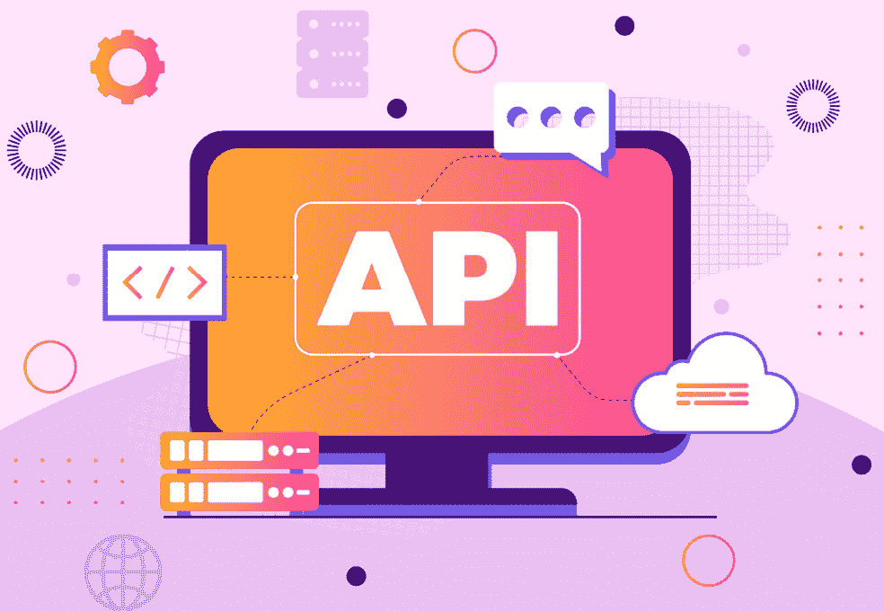
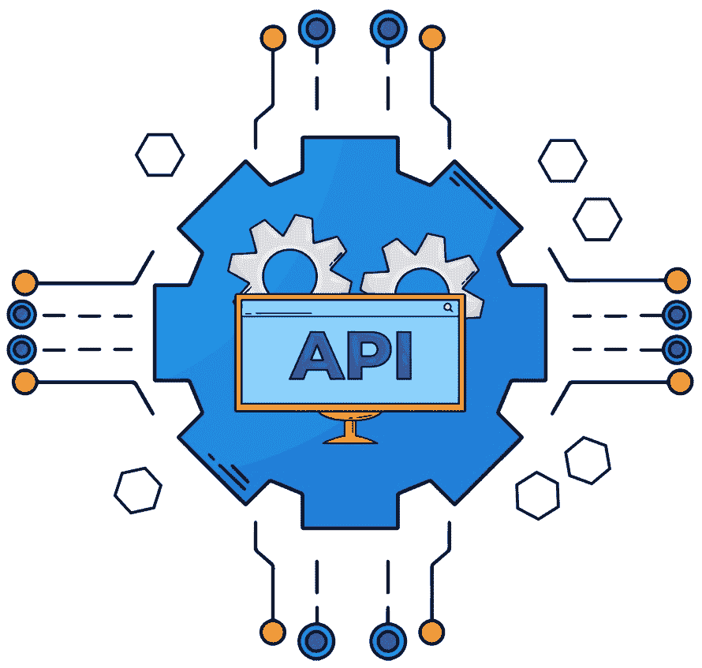

# 10

# 微服务中的 API 通信和数据合同

当与微服务架构和 Node.js 一起工作时，API 通信和数据合同是构建成功应用的一些支柱。

我们将从这个章节开始，更好地理解如何在 Node.js 中与微服务中的 API 和数据合同一起工作。通过 API 在微服务之间进行通信涉及建立明确的数据交换合同，并定义服务之间交互的接口。遵循这些实践，你可以通过 API 在你的微服务之间建立有效的通信。这使你的微服务架构解耦、可扩展和灵活，允许单个服务独立演进，同时保持无缝的交互。

到本章结束时，你将学会如何在 Node.js 中与 API 和数据合同进行通信。

在本章中，我们将涵盖以下主要主题：

+   定义 API 合同和 RESTful API 设计

+   REST API 库和 API 版本控制

+   认证、授权和数据验证

+   错误处理和 API 文档

+   API 测试和 API 网关

# 定义 API 合同和 RESTful API 设计

在本节中，我们将展示如何为每个微服务定义 API 合同并遵循 RESTful 原则来设计你的 API。

## 定义 API 合同

API 合同微服务是微服务之间如何通信和相互交互以及与外部客户端的协议定义。API 合同指定了服务提供者和服务消费者之间数据交换的格式、结构和规则。定义 API 合同是设计微服务的关键步骤，确保不同服务之间通信和互操作性清晰。以下是其关键组件：

+   **端点和路由**：明确定义每个服务的端点和路由，指定通过哪些 URI 路径可以执行不同的操作。

+   `GET`、`POST`、`PUT`、`DELETE` 等）允许每个端点。定义每个方法的目的和预期的行为。

+   **请求和响应格式**：明确定义预期的请求和响应格式。指定数据结构、所需头信息和任何认证机制。

+   **数据类型和验证**：定义 API 请求和响应中使用的数据类型。指定验证规则以确保数据符合预期的格式。

+   `200` 表示成功请求，`404` 表示未找到，`500` 表示服务器错误。

+   **认证和授权**：指定访问不同端点所需的认证和授权机制。定义客户端如何进行认证以及每个操作所需的权限。

+   **错误处理**：明确定义如何处理错误。指定错误响应的结构，包括错误代码、消息以及任何附加信息。

+   **速率限制和配额**：如果适用，定义速率限制和配额以控制客户端在特定时间框架内可以发出的请求数量。

API 合约概述了服务应如何交互的规则和规范。

## RESTful API 设计

RESTful API 设计遵循一系列原则以创建可扩展、可维护且易于消费的 API。以下是 RESTful API 设计的关键原则：

+   **基于资源**：围绕表示系统中实体的资源设计 API。每个资源应有一个**唯一标识符**（**URI**）并通过一组标准的 HTTP 方法访问。

+   （`GET`、`POST`、`PUT`、`DELETE`）并遵循资源命名和操作的传统规范。

+   **无状态**：保持 API 无状态，这意味着客户端的每个请求都包含服务器完成该请求所需的所有信息。服务器状态在请求之间不存储。

+   **表示法**：根据客户端需求，使用不同的表示法（**JSON**、**XML**等）来表示资源。客户端可以通过内容协商请求特定的表示法。

+   **超媒体**：可选地，在响应中包含超媒体控件，允许客户端动态地导航 API。这被称为**超媒体作为应用状态引擎**（**HATEOAS**）。

+   **一致的命名约定**：遵循一致的命名约定来命名资源和端点。使用复数名词作为资源名称，并保持逻辑和可预测的结构。

+   **版本控制**：如果需要，实施版本控制策略以确保 API 演变时的向后兼容性。这可以通过 URI 版本控制、头信息或其他方法完成。

+   **幂等性和安全性**：确保操作是**幂等的**（多个相同的请求具有单个请求相同的效果）且安全的（不修改资源状态）。

+   **安全性**：实施适当的安全措施，包括身份验证、授权和加密，以保护敏感数据并确保安全的 API 交互。在 REST API 设计中，安全性是开发和维护通过 API 公开数据和功能的应用程序的关键方面。有许多最佳实践和指南用于确保 REST API 的安全性：

    +   总是使用 TLS 加密来保护传输中的数据，防止中间人攻击。TLS 还使客户端能够验证 API 服务器的身份，并确保消息的完整性。

    +   实施一个健全且可扩展的身份验证和授权模型，以控制谁可以访问和修改 API 资源。有不同方法和标准用于实现身份验证和授权，例如 API 密钥、OAuth2、JWT 和 OpenID Connect。根据您的用例选择最合适的方法，并遵循每种方法的 安全建议。

    +   不要在 URL 中包含敏感信息，例如密码、令牌或个人信息。URL 可以被记录、缓存或以各种方式暴露，因此它们不是传输敏感信息的可靠方式。相反，使用头部、正文或 cookie，并在可能的情况下加密或散列数据。

    +   精确定义允许的 RESTful API 请求和响应，例如 HTTP 方法、内容类型、参数和头部。验证输入和输出数据，并拒绝任何格式错误、意外或恶意的请求或响应。使用模式、解析器、清理器和过滤器来确保数据质量和一致性。

    +   实现持续 API 发现功能，以监控和审计 API 端点、操作和使用情况。使用可以帮助您记录、测试和分析 API 的工具和框架，例如 Swagger、Postman 或 SoapUI。跟踪 API 更改、版本和依赖关系，并将它们传达给 API 消费者和开发者。

    +   实现错误处理和日志记录机制，以处理和报告 API 中发生的任何异常或失败。使用适当的 HTTP 状态码和错误消息通知 API 消费者问题及可能的解决方案。避免在错误消息中暴露敏感或内部信息，例如堆栈跟踪、数据库查询或配置细节。使用安全且集中的日志工具来存储和分析 API 日志，并保护它们免受未经授权的访问或篡改。

记住，在设计 RESTful API 的同时保持稳健的应用程序非常重要。

*图 10.1* 展示了设计 RESTful API 的过程：


图 10.1：设计 RESTful API 的过程（图片由 Freepik 提供）

总结来说，通过定义清晰的 API 合约并遵循 RESTful 原则，微服务可以有效地进行通信，促进分布式架构中的互操作性和可伸缩性。

理解了这些概念后，我们现在转向 REST API 库和 API 版本控制。

# REST API 库和 API 版本控制

在微服务架构中，您可以使用 Node.js 框架，如 Express.js 或 Fastify，来构建 RESTful API 并实现 API 版本控制以处理微服务 API 的更改和更新。

## REST API 库

当在 Node.js 中构建 RESTful API 时，有几个库简化了开发过程，处理路由、请求解析和响应格式化。以下是一些常用的库：

+   **Express**：Express.js 是 Node.js 的一个简约型 Web 框架，提供了强大的路由、中间件支持和易于使用的 API。以下是使用 Express.js 的示例：

    ```js
    const express = require('express');
    ```

    ```js
    const app = express();
    ```

    ```js
    app.get('/api/resource', (req, res) => {
    ```

    ```js
      res.send('Hello, API!');
    ```

    ```js
    });
    ```

    ```js
    app.listen(3000, () => {
    ```

    ```js
      console.log('Server is running on port 3000');
    ```

    ```js
    });
    ```

+   **Restify**：Restify 专门设计用于构建 REST API，侧重于性能、正确性和简洁性。以下代码是使用 Restify 的示例：

    ```js
    // Import the restify module
    ```

    ```js
    const restify = require('restify');
    ```

    ```js
    // Create a server instance
    ```

    ```js
    const server = restify.createServer();
    ```

    ```js
    // Define a GET handler for the /api/resource endpoint
    ```

    ```js
    server.get('/api/resource', (req, res, next) => {
    ```

    ```js
      // Send a response with the text "Hello, API!"
    ```

    ```js
      res.send('Hello, API!');
    ```

    ```js
    });
    ```

    ```js
    // Start the server and listen on port 3000
    ```

    ```js
    server.listen(3000, () => {
    ```

    ```js
      // Log a message to the console
    ```

    ```js
      console.log('Server is running on port 3000');
    ```

    ```js
    });
    ```

在本节中，我们学习了 REST API 库的一些示例以及如何使用它们。请随意尝试它们。要本地运行此代码，首先需要在本地文件夹中创建一个扩展名为`.js`的文件，并用您喜欢的 IDE（如 Visual Studio Code）打开它。然后您可以在示例中编写代码，从 IDE 中打开终端，并使用`npm install restify`命令安装此示例所需的 Node.js 包——`restify`。当安装包的过程完成后，您可以在集成终端中使用`filename_example.js`命令运行它。

学习了这些概念后，我们可以继续进行 API 版本控制。

## API 版本控制

**API 版本控制**对于管理变更和维护 API 演变过程中的向后兼容性至关重要。API 版本控制是管理和跟踪 API 变更的过程，并将这些变更传达给 API 的消费者。API 版本控制对于确保基于 API 的应用程序的兼容性、可靠性和安全性至关重要。API 版本控制可以以不同的方式实现，例如使用 URI 版本控制、媒体类型版本控制或内容协商。每种方法都有其自身的优缺点，并需要仔细的设计和配置。以下是常见的 API 版本控制方法：

+   `https://example.com/v1/users` 和 `https://example.com/v2/users` 将表示同一资源的不同版本。以下列出此方法的示例及其优缺点：

    +   *示例*: `/api/v1/resource`（这意味着这是资源的第 1 个版本）。

    +   *优点*: 它简单且易于实现，版本信息在 URL 中明确。

    +   *缺点*: 它可能导致 URL 更长且不易阅读。

+   `接受`版本) 或标准的`Accept`头部来指示期望的 API 版本。以下列出此方法的示例及其优缺点：

    +   *示例*: `Accept`（`Accept`头部由 HTTP 客户端，如网页浏览器或微服务，用于指示它们可以理解和希望从服务器接收的内容类型）：`application/vnd.myapi.v1+json`。

    +   *优点*: 它产生简洁的 URL，版本信息在头部中。

    +   *缺点*: 它要求客户端正确设置头部信息。

+   在 URL 中添加`version`)来指示期望的 API 版本。以下列出此方法的示例及其优缺点：

    +   *示例*: `/api/resource?version=1`（这是一个 URI 版本控制的示例，是处理 REST API 中变更和更新的常见方式。它涉及在 API 的基本 URI 中添加版本号或标识符，如`v1`、`v2`或`v3`。在这种情况下，版本是`1`，它被指定为`?`符号之后的查询参数。这意味着客户端正在请求资源`/api/resource`的第一个 API 版本）。

    +   *优点*: 它易于实现。

    +   *缺点*: 它可能不太易读，版本信息在查询参数中。

+   使用 `Accept` 或 `Content-Type` 标头指示所需的 API 版本。以下列出了此方法的示例及其优缺点：

    +   *示例*：`Content-Type`（`Content-Type` 标头用于指示资源或正在发送或接收的 Web 请求或响应中的媒体类型。媒体类型是一个字符串，描述了数据的格式、结构和编码，例如 `text/html`、`application/JSON` 或 `image/png`）：`application/json; version=1`。

    +   *优点*：它是建立在现有的 HTTP 标准之上的。

    +   *缺点*：与标头版本控制类似，它要求客户端正确设置标头。

+   `/api/resource`（URI 的 `/api/resource` 部分是客户端想要访问或操作的具体资源的路径）。

+   *优点*：这是最简单的方法。

+   *缺点*：随着 API 的发展，可能会导致向后兼容性问题。

API 版本控制对于在开发和部署 API 时保持更好的兼容性至关重要。

*图 10**.2* 描述了 REST API 库和版本控制的过程：



图 10.2：REST API 库和版本控制（图片由 Freepik 提供）

总结来说，选择与您的应用程序需求相一致且确保现有客户端平稳过渡并适应未来变化版本控制策略。

现在，我们可以继续到下一节，我们将讨论认证、授权和数据验证。

# 认证、授权和数据验证

在微服务架构中，您必须进行认证、授权和验证数据，才能继续从 API 架构中获取结果。

## 认证和授权

**认证和授权**是确保微服务架构安全的关键组件。以下是这些概念概述：

+   **认证**：在微服务中，认证是验证访问或与微服务通信的用户或服务的身份的过程。认证对于确保基于微服务的应用程序的安全性和可靠性至关重要：

    +   *Node.js 实现*：使用认证中间件，如 **Passport.js**，来处理用户认证。根据应用程序的要求实现各种认证策略（例如，本地认证、OAuth、JWT）。

    +   *示例*（使用 Passport.js 和本地策略）:

        ```js
        const passport = require('passport');
        ```

        ```js
        const LocalStrategy = require('passport-local').Strategy;
        ```

        ```js
        passport.use(new LocalStrategy(
        ```

        ```js
          (username, password, done) => {
        ```

        ```js
            // Assuming a simple username/password check for demonstration purposes
        ```

        ```js
        if (username === 'same_name' && password === 'secret') {
        ```

        ```js
              const user = { id: 1, username: ' same_name' };
        ```

        ```js
              return done(null, user); // Authentication successful
        ```

        ```js
            } else {
        ```

        ```js
              return done(null, false); // Authentication failed
        ```

        ```js
            }
        ```

        ```js
          }
        ```

        ```js
        ));
        ```

+   **授权**：授权确定用户、系统或应用程序在认证后允许执行的操作：

    +   *Node.js 实现*：使用中间件或自定义函数在允许访问特定路由之前检查用户角色或权限。

    +   *示例*（检查用户角色的中间件）:

        ```js
        function isAdmin(req, res, next) {
        ```

        ```js
          if (req.user && req.user.role === 'admin') {
        ```

        ```js
            return next(); // User is authorized
        ```

        ```js
          }
        ```

        ```js
          res.status(403).send('Forbidden'); // User is not authorized
        ```

        ```js
        }
        ```

        ```js
        // Usage in a route
        ```

        ```js
        app.get('/admin/resource', isAdmin, (req, res) => {
        ```

        ```js
          // Handle the request for admin-only resource
        ```

        ```js
        });
        ```

+   使用 `jsonwebtoken` 生成和验证 JWT。

+   *示例*（使用 JWT 进行令牌生成和验证）:

    ```js
    const jwt = require('jsonwebtoken');
    ```

    ```js
    // Generate a token
    ```

    ```js
    const token = jwt.sign({ userId: '123' }, 'secretKey', { expiresIn: '1h' });
    ```

    ```js
    // Verify a token
    ```

    ```js
    jwt.verify(token, 'secretKey', (err, decoded) => {
    ```

    ```js
      if (err) {
    ```

    ```js
        // Token is invalid
    ```

    ```js
      } else {
    ```

    ```js
        // Token is valid, use decoded data
    ```

    ```js
      }
    ```

    ```js
    });
    ```

在这些概念的基础上，并使用这些代码进行实践，可以帮助创建更好的 Node.js 身份验证和授权架构。

我们现在可以继续进行数据验证。

## 数据验证

**数据验证**对于确保传入数据符合预期标准、防止安全漏洞和维护数据完整性至关重要。验证方法如下：

+   `npm` `install joi`.

+   *示例*（在路由中使用 Joi 进行请求验证）：

    ```js
    const Joi = require('joi');
    ```

    ```js
    const schema = Joi.object({
    ```

    ```js
      username: Joi.string().alphanum().min(3).max(30).required(),
    ```

    ```js
      password: Joi.string().pattern(new RegExp('^[a-zA-Z0-9]{3,30}$')),
    ```

    ```js
    });
    ```

    ```js
    app.post('/api/register', (req, res) => {
    ```

    ```js
      const { error, value } = schema.validate(req.body);
    ```

    ```js
      if (error) {
    ```

    ```js
        res.status(400).send(error.details[0].message);
    ```

    ```js
      } else {
    ```

    ```js
        // Process the valid data
    ```

    ```js
      }
    ```

    ```js
    });
    ```

+   `npm` `install validator`.*   *示例*（使用 validator.js 库进行字符串验证和清理）：

    ```js
    // import the validator module
    ```

    ```js
    var validator = require('validator');
    ```

    ```js
    // check if the example email is a true email
    ```

    ```js
    validator.isEmail('foo@bar.com'); //=> true
    ```

    +   **数据清理**: 数据清理涉及清洗和验证数据，以防止常见的安全漏洞，例如 SQL 注入或**跨站脚本**（**XSS**）：

    +   *Node.js 实现*: 使用如**dompurify**之类的库进行 HTML 输入清理或使用参数化查询来防止 SQL 注入。

    +   *示例*（使用 dompurify 进行 HTML 清理）：

        ```js
        const DOMPurify = require('dompurify');
        ```

        ```js
        const sanitizedHTML = DOMPurify.sanitize(req.body.htmlInput);
        ```

        +   **正则表达式**: 正则表达式（regex）可用于更复杂的数据验证，例如验证电子邮件地址或密码。

    +   *示例*（使用正则表达式进行电子邮件验证）：

        ```js
        const emailRegex = /^[^\s@]+@[^\s@]+\.[^\s@]+$/;
        ```

        ```js
        if (!emailRegex.test(req.body.email)) {
        ```

        ```js
          // Handle invalid email address
        ```

        ```js
        }
        ```

        +   **跨站脚本（XSS）**: 一种允许攻击者在网页中注入和执行恶意代码的 Web 安全漏洞。XSS 攻击可能会损害 Web 应用程序及其用户的机密性、完整性和可用性。XSS 攻击可以分为三种类型：反射型、存储型和基于 DOM 的。

    清理是一种技术，通过删除或编码用户输入或输出中的任何潜在有害字符或脚本，来防止或减轻 XSS 攻击。清理可以在 Web 应用程序的不同阶段应用，例如输入验证、输出编码或 HTML 清理：

    +   **输入验证**: 这是检查和拒绝任何不符合预期标准或格式的用户输入的过程。输入验证可以通过在恶意输入到达 Web 应用程序逻辑或数据库之前阻止它来帮助防止 XSS 攻击。

    +   **输出编码**: 这是将用户输出中的任何特殊字符或符号转换为它们等效的 HTML 实体或代码的过程。输出编码可以通过确保浏览器将用户输出视为纯文本而不是代码来帮助防止 XSS 攻击。

    +   **HTML 清理**: 这是过滤和删除用户输出中任何不需要或危险的 HTML 标签、属性或样式的过程。HTML 清理可以通过仅允许浏览器渲染安全且格式良好的 HTML 输出来帮助防止 XSS 攻击。

清理是保护 Web 应用程序和用户免受 XSS 攻击的基本技术。然而，仅清理不足以防止所有类型的 XSS 攻击。清理应与其他防御措施相结合，例如使用安全的 Web 框架、遵循安全的编码实践、实施内容安全策略以及教育用户关于网络安全。

*图 10.3* 展示了 API 中的数据验证：


图 10.3：API 中的数据验证（图片由 Freepik 提供）

总结来说，在 Node.js 环境中实施强大的身份验证、授权和数据验证实践对于构建安全可靠的微服务至关重要。

在下一节中，我们将学习关于错误处理和 API 文档的内容。

# 错误处理和 API 文档

**错误处理**是构建健壮的微服务以确保优雅降级和有效调试的关键方面。清晰的全面 API 文档对于使开发者能够理解和消费您的微服务至关重要。

## 错误处理

这是您在 Node.js 微服务环境中处理错误的方法：

+   **Express.js 错误处理中间件**：使用 Express.js 中间件来全局处理错误。此中间件在请求处理过程中发生未处理的错误时被调用。以下是一个示例：

    ```js
    app.use((err, req, res, next) => {
    ```

    ```js
      console.error(err.stack);
    ```

    ```js
      res.status(500).send('Something went wrong!');
    ```

    ```js
    });
    ```

+   **自定义错误类**：为应用程序中可能发生的不同类型的错误创建自定义错误类。这有助于更精确地识别和处理错误。以下是一个示例：

    ```js
    class CustomError extends Error {
    ```

    ```js
      constructor(message, statusCode) {
    ```

    ```js
        super(message);
    ```

    ```js
        this.statusCode = statusCode;
    ```

    ```js
      }
    ```

    ```js
    }
    ```

    ```js
    // Usage
    ```

    ```js
    throw new CustomError('Custom error message', 400);
    ```

+   **日志记录**：实现全面的日志记录以记录有关错误的详细信息，包括堆栈跟踪，以及请求信息和任何相关上下文。以下是一个示例（使用如 **Winston** 的日志库）：

    ```js
    const winston = require('winston');
    ```

    ```js
    winston.error('Error message', { error: err, request: req });
    ```

+   `400` 用于客户端错误，`500` 用于服务器错误，以及其他所需的情况。以下是一个示例：

    ```js
    app.get('/api/resource', (req, res, next) => {
    ```

    ```js
      const error = new Error('Resource not found');
    ```

    ```js
      error.status = 404;
    ```

    ```js
      next(error);
    ```

    ```js
    });
    ```

+   使用 `async`/`await`，确保使用 `try` 或 `catch` 块进行适当的错误处理。以下是一个示例：

    ```js
    app.get('/api/resource', async (req, res, next) => {
    ```

    ```js
      try {
    ```

    ```js
        const data = await fetchData();
    ```

    ```js
        res.json(data);
    ```

    ```js
      } catch (err) {
    ```

    ```js
        next(err);
    ```

    ```js
      }
    ```

    ```js
    });
    ```

在 Node.js 中开发微服务时，错误处理可以避免后续开发中的麻烦。它有助于开发者更快地调试。

在下一节中，我们将讨论微服务中的 API 文档。

## API 文档

清晰全面的 API 文档对于使开发者能够理解和消费您的微服务至关重要。以下是一些记录您的 API 的方法：

+   **Swagger/OpenAPI**：使用 **Swagger**/**OpenAPI** 规范来描述您的 API 端点，包括请求和响应格式、认证方法等详细信息。例如，**Swagger UI** 或 **ReDoc** 工具可以从 OpenAPI 规范中渲染交互式文档。以下是一个示例：

    ```js
    openapi: 3.0.0
    ```

    ```js
    info:
    ```

    ```js
      title: My API
    ```

    ```js
      version: 1.0.0
    ```

    ```js
    paths:
    ```

    ```js
      /api/resource:
    ```

    ```js
        get:
    ```

    ```js
          summary: Get resource
    ```

    ```js
          responses:
    ```

    ```js
            '200':
    ```

    ```js
              description: Successful response
    ```

+   **API 蓝图**：API 蓝图是 API 文档的另一种格式。API 蓝图是一种用于设计和记录 Web API 的语言。它结合了 Markdown 和 MSON 语法来描述服务提供者和消费者之间数据交换的格式、结构和规则。API 蓝图允许在 API 设计过程中实现易于协作、抽象和模块化。例如**Apiary**等工具可以从 API 蓝图文件生成文档。以下是一个示例：

    ```js
    ## Get Resource [/api/resource]
    ```

    ```js
    + Response 200 (application/json)
    ```

    ```js
      + Body
    ```

    ```js
        {
    ```

    ```js
          "data": "Resource data"
    ```

    ```js
        }
    ```

+   **Postman 集合**：如果您使用**Postman**进行测试，您可以创建包含有关您的 API 请求和响应的详细信息的集合。Postman 允许您导出集合，使其成为可共享的 API 文档形式。

+   `以及每个 API 端点的使用情况。这些注释可以使用诸如**JSDoc**等工具提取到文档中`**。以下是一个示例：

    ```js
    /**
    ```

    ```js
    * Get resource
    ```

    ```js
    * @route GET /api/resource
    ```

    ```js
    * @returns {object} 200 - Successful response
    ```

    ```js
    */
    ```

    ```js
    app.get('/api/resource', (req, res) => {
    ```

    ```js
      res.json({ data: 'Resource data' });
    ```

    ```js
    });
    ```**

***   **文档站点**：为您的微服务创建一个专门的文档网站，展示详细的指南、示例和交互式 API 探索。例如**Docusaurus**或**Slate**等工具可以帮助构建文档网站**。

**总之，确保您的 API 文档与 API 的更改保持同步，为使用您的微服务的开发者提供准确和相关的信息**。

在最后一节，我们将讨论 API 测试和 API 网关。

# API 测试和 API 网关

API 测试对于确保微服务的可靠性和正确性至关重要。API 网关是微服务架构中的一个中心组件，提供统一的管理和保障 API 的入口点。

## API 测试

**API 测试**是确认 API 按预期工作的过程。开发者可以手动运行 API 测试，或者使用 API 测试工具自动化它们。有几种类型的 API 测试，每一种都在确保 API 保持可靠方面发挥着独特的作用：

+   **单元测试**：在单元测试中，我们单独测试代码的各个单元（函数、模块）。要求和示例如下：

    +   *工具*：测试框架，如**Jest**、**Mocha**或**Jasmine**。

    +   *示例*（使用 Jest）：

        ```js
        test('adds 1 + 2 to equal 3', () => {
        ```

        ```js
          expect(sum(1, 2)).toBe(3);
        ```

        ```js
        });
        ```

+   **集成测试**：通过集成测试，我们验证不同组件或服务之间的交互。要求和示例如下：

    +   *工具*：**Supertest**、**Chai HTTP**或您首选的 HTTP 测试库。

    +   *示例*（使用 Supertest）：

        ```js
        const request = require('supertest');
        ```

        ```js
        const app = require('../app');
        ```

        ```js
        test('GET /api/resource returns 200', async () => {
        ```

        ```js
          const response = await request(app).get('/api/resource');
        ```

        ```js
          expect(response.status).toBe(200);
        ```

        ```js
        });
        ```

+   **端到端测试**：端到端测试的目的是测试整个应用程序或特定的用户流程。要求和示例如下：

    +   *工具*：**Cypress**、**Puppeteer**和**Nightwatch**。

    +   *示例*（使用 Cypress）：

        ```js
        describe('My API', () => {
        ```

        ```js
          it('successfully loads', () => {
        ```

        ```js
            cy.visit('/api/resource');
        ```

        ```js
            cy.contains('Resource data');
        ```

        ```js
          });
        ```

        ```js
        });
        ```

+   **模拟和存根**：通过这种方式，我们模拟依赖项或外部服务以隔离待测试的系统。要求和示例如下：

    +   *工具*：**Nock**、**Sinon**或 Jest 内置的模拟函数。

    +   *示例*（使用 Nock）:

        ```js
        const nock = require('nock');
        ```

        ```js
        nock('https://api.example.com')
        ```

        ```js
          .get('/data')
        ```

        ```js
          .reply(200, { data: 'Mocked data' });
        ```

+   **数据驱动测试**：在数据驱动测试中，我们测试不同的输入数据和条件，以确保系统行为正确。要求和示例如下：

    +   *工具*：Jest 的参数化测试和测试数据库。

    +   *示例*（Jest 参数化测试）:

        ```js
        test.each([
        ```

        ```js
          [1, 2, 3],
        ```

        ```js
          [0, 0, 0],
        ```

        ```js
          [-1, 1, 0],
        ```

        ```js
        ])('adds %i + %i to equal %i', (a, b, expected) => {
        ```

        ```js
          expect(sum(a, b)).toBe(expected);
        ```

        ```js
        });
        ```

正如我们所学的，这些测试概念可以大大提高软件测试的质量，并交付经过良好测试的软件。

我们现在可以继续到 API 网关。

## API 网关

**API 网关**是一个软件组件，充当客户端和后端服务之间的中介。它处理各种任务，如路由、身份验证、速率限制、监控和 API 调用的策略执行。它还通过提供一个统一的接口来访问多个服务，简化了客户端开发。

使用 API 网关的一个好处是它可以减少基于微服务的应用程序的复杂性并提高性能。使用 API 网关，您可以解耦应用程序的内部结构与其外部客户端，并在网关级别实现通用功能，而不是在每个服务中重复它们。您还可以使用 API 网关将多个服务的响应聚合和转换成单个结果，供客户端使用。

以下是 API 网关如何为 Node.js 微服务生态系统做出贡献：

+   **请求路由**：API 网关根据预定义的规则或配置将传入的请求路由到适当的微服务。以下是一个示例（Express.js 路由）：

    ```js
    // API Gateway route
    ```

    ```js
    app.get('/api/resource', (req, res) => {
    ```

    ```js
      // Forward request to the appropriate microservice
    ```

    ```js
      // ...
    ```

    ```js
    });
    ```

+   **负载均衡**：负载均衡器是设备或应用程序，它们将传入的网络流量分配到多个服务器或节点。通过平衡工作负载并避免任何单个服务器过载，它们有助于提高 Web 应用程序的性能、可扩展性和可靠性。负载均衡器使用不同的算法或方法来决定哪个服务器应该处理每个请求，例如轮询、最少连接、最短时间、哈希或随机。负载均衡器可以是基于硬件的或基于软件的，它们可以在专用设备、服务器、虚拟机或云中运行。将传入流量分配到微服务的多个实例，以确保最佳资源利用率和可靠性。以下是一个示例（Nginx 负载均衡配置）：

    ```js
    upstream microservices {
    ```

    ```js
      server microservice1:3000;
    ```

    ```js
      server microservice2:3000;
    ```

    ```js
    }
    ```

+   **身份验证和授权**：集中身份验证和授权逻辑，确保只有经过身份验证和授权的请求才能到达微服务。以下是一个示例（Express.js 中间件）：

    ```js
    // API Gateway middleware
    ```

    ```js
    app.use('/api', (req, res, next) => {
    ```

    ```js
      // Authenticate and authorize the request
    ```

    ```js
      // ...
    ```

    ```js
      next();
    ```

    ```js
    });
    ```

+   **速率限制和节流**：控制允许请求的速率，以防止滥用或过度使用微服务。以下是一个示例（Express.js 速率限制中间件）：

    ```js
    const rateLimit = require('express-rate-limit');
    ```

    ```js
    const apiLimiter = rateLimit({
    ```

    ```js
      windowMs: 15 * 60 * 1000, // 15 minutes
    ```

    ```js
      max: 100, // limit each IP to 100 requests per windowMs
    ```

    ```js
    });
    ```

    ```js
    // Apply rate limiting to the API Gateway routes
    ```

    ```js
    app.use('/api', apiLimiter);
    ```

+   **响应聚合**：将多个微服务的响应聚合为单个响应供客户端使用。以下是一个示例（Express.js 路由）：

    ```js
    // API Gateway route for response aggregation
    ```

    ```js
    app.get('/api/aggregated-resource', async (req, res) => {
    ```

    ```js
      // Call multiple microservices and aggregate responses
    ```

    ```js
      // ...
    ```

    ```js
    });
    ```

+   **监控和分析**：收集和分析 API 使用、性能和错误数据，以深入了解微服务架构的健康状况。

*图 10**.4* 展示了 API 网关的过程：



图 10.4：API 网关（图片由 Freepik 提供）

总结来说，API 网关简化了微服务的管理和编排，为客户端提供了一个统一的接口，同时将常见功能从单个微服务中卸载。它在增强分布式系统的安全性、可扩展性和可维护性方面发挥着关键作用。

# 概述

在本章中，我们学习了大量关于微服务的内容，包括如何在微服务中与 API 通信，以及不同的服务如何相互交互以完成业务流程。数据合约定义了数据在微服务之间的结构和交换方式。

总结来说，有效的 API 通信和数据合约是微服务成功的基础。它们有助于系统灵活性、可维护性，以及在复杂、分布式架构中扩展的能力。

在下一章中，我们将学习微服务中的缓存和异步消息。

# 测验时间

+   定义 API 合约的关键组件有哪些？

+   常用的 REST API 库有哪些？

+   你如何通过示例处理身份验证和授权？

+   如何记录你的 API？**
