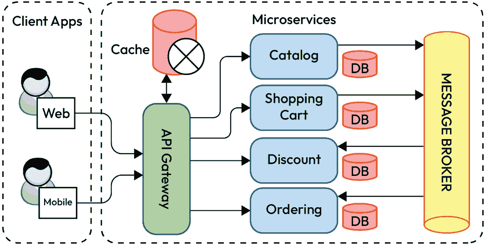
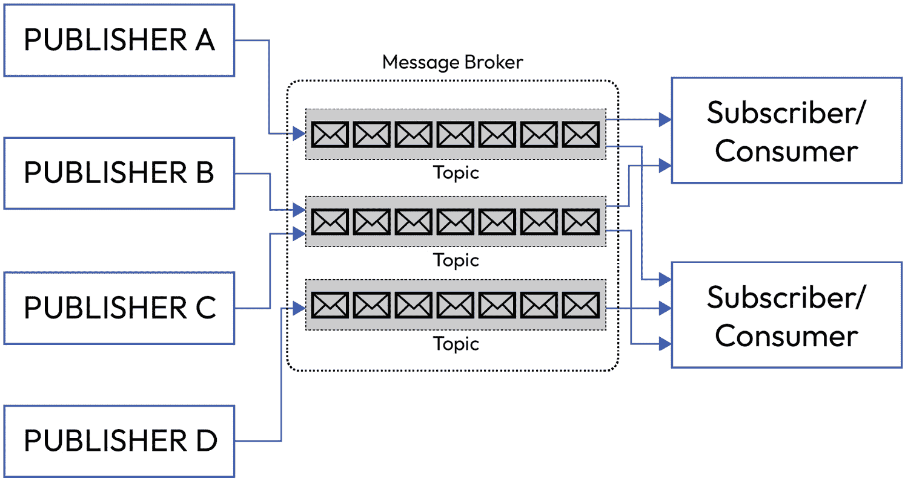

# 11

# 微服务中的缓存和异步消息

当使用微服务架构和 Node.js 时，你需要掌握缓存和异步消息，以构建下一代成功的应用程序。

我们将从这个章节开始，更好地了解如何在 Node.js 中处理微服务中的缓存和异步消息。缓存和异步消息是微服务架构中用于提高性能、可扩展性和解耦的两个重要技术。缓存涉及将频繁访问的数据存储在缓存中，以提高响应时间并减少底层数据源的负载。异步消息通过消息队列或发布-订阅模式解耦服务，从而在微服务中实现松耦合和可扩展性。

到本章结束时，你将学会如何在 Node.js 中处理缓存和异步消息。

在本章中，我们将涵盖以下主要主题：

+   客户端缓存和边缘缓存

+   微服务级别缓存和数据库查询缓存

+   消息队列和发布-订阅

+   事件驱动架构

# 客户端缓存和边缘缓存

在本节中，我们将向您展示如何处理客户端缓存和边缘缓存。客户端缓存和边缘缓存是用于通过在用户附近存储和提供内容来提高性能和减少服务器负载的策略。

## 客户端缓存

**客户端缓存**涉及在客户端设备（如网页浏览器）上存储资源（例如，HTML 页面、样式表、脚本、图像），以避免重复向服务器发送请求。

这里有一些它的优点：

+   客户端缓存通过直接从客户端提供缓存内容来减少服务器负载。这意味着客户端缓存可以提高 Web 服务器和 Web 浏览器的性能和效率。通过直接从客户端提供缓存内容，Web 服务器无需重复处理和发送相同的数据给相同或不同的用户。这减少了服务器负载，意味着服务器在任何给定时间内需要处理的工作或请求量减少。

+   它提高了后续访问的页面加载时间。这意味着客户端缓存可以通过在用户再次访问时使网页加载更快来增强用户体验。通过在浏览器内存中存储网页的副本，浏览器无需再次从服务器请求和下载相同的网页。

+   它通过最小化网络请求来提升用户体验。这意味着客户端缓存可以减少浏览器需要发送到服务器的网络请求的数量和大小。网络请求是浏览器和服务器之间交换的消息，用于通信和传输数据。网络请求可能需要时间并消耗带宽，这取决于连接的距离、速度和质量。通过最小化网络请求，客户端缓存可以节省时间和带宽，以及避免在通信过程中可能发生的潜在错误或延迟。

+   API 合同概述了服务之间应该如何交互的规则和规范。在客户端缓存的上下文中，API 合同可以概述服务应该如何与存储在客户端设备上的缓存数据（如浏览器）交互的规则和规范。

+   缓存行为由 HTTP 头部控制，例如 **Cache-Control** 和 **Expires**。这意味着可以通过使用某些 HTTP 头部来配置和自定义客户端缓存，这些头部指定了数据可以缓存多长时间以及在什么条件下可以缓存。HTTP 头部是伴随客户端和服务器之间 HTTP 请求和响应的元数据。

*图 11.1* 展示了客户端缓存：

图 11.1：客户端缓存

我们已经学习了客户端缓存的基础知识；现在，让我们继续学习边缘缓存。

## 边缘缓存

**边缘缓存**，或称为**内容分发网络**（**CDN**）缓存，涉及在网络的边缘（更靠近用户）的战略位置的服务器上缓存内容，以减少延迟并提高内容交付速度。

这里列举了一些它的优点：

+   边缘缓存通过从更靠近用户的服务器提供内容来最小化延迟。这意味着边缘缓存可以减少数据从服务器传输到用户所需的时间。**延迟**是在数据通过网络传输时发生的延迟或滞后。延迟可能会影响 Web 应用程序的性能和用户体验，尤其是对于动态或交互式内容。通过从更靠近用户的服务器提供内容，边缘缓存可以最小化延迟并提高 Web 应用程序的速度和响应性。

+   它在全球范围内分发内容，减轻了源服务器的负载。这意味着边缘缓存可以通过在全球多个服务器之间分散数据来提高 Web 应用程序的扩展性和可靠性。这减少了源服务器的负载，即托管原始数据和应用程序逻辑的主要服务器。

+   它增强了可伸缩性和可靠性。这意味着边缘缓存可以提高 Web 应用程序处理更多流量和请求的能力，而不会损害服务的质量和可用性。通过在全球多个服务器之间分配数据，边缘缓存可以减少对中央服务器的依赖和负载，该服务器可能资源有限且容量有限。

+   CDN 提供商在全球部署服务器，并将内容缓存在这些服务器上以快速检索。这意味着边缘缓存通常是通过使用 CDN 实现的，CDN 是一个分布在全球的服务器网络，可以存储和向用户交付数据。CDN 提供商是一家向 Web 应用程序和网站提供 CDN 服务的公司。通过使用 CDN 提供商，Web 应用程序和网站可以在比原始服务器更靠近用户的位置的 CDN 服务器上缓存其数据。这样，当用户请求数据时，它可以从 CDN 服务器快速检索，而不是从原始服务器检索。

记住，在处理微服务时应用缓存策略是很重要的。

总结来说，客户端缓存和边缘缓存是优化 Web 性能、减少服务器负载和增强整体用户体验的强大技术。理解缓存控制头、缓存失效策略并利用 CDN 对于有效实施至关重要。

在理解了这些概念之后，我们现在转向微服务级缓存和数据库查询缓存。

# 微服务级缓存和数据库查询缓存

微服务级缓存和数据库查询缓存是采用的战略，通过减少重复计算和数据库查询的需求来提高微服务的性能和可伸缩性。

## 微服务级缓存

**微服务级缓存**涉及在单个微服务内部存储和检索频繁访问的数据，以避免冗余计算或外部调用。每个微服务维护自己的缓存，并且缓存决策在微服务边界内进行。

缓存可以使微服务提高容错性，即系统在出现故障或错误的情况下继续运行的能力。缓存可以作为临时服务中断或网络问题期间的缓冲，这些问题可能影响微服务的可用性和性能。缓存可以帮助微服务做到以下几方面：

+   它可以减少对外部服务或数据库的依赖，这些服务或数据库可能因为网络问题或维护而缓慢、不可靠或不可用。通过在缓存中存储数据，微服务可以避免对原始数据源进行不必要的或重复的请求，而是从缓存中提供数据。

+   它可以处理可能使系统过载或造成瓶颈的流量或需求峰值。通过在缓存中存储数据，微服务可以减轻系统负载，并提高系统的响应时间和吞吐量。

+   它可以从可能导致数据丢失或损坏的故障或错误中恢复。通过在缓存中存储数据，微服务可以保留数据，并在原始数据源受损或损坏时从缓存中恢复数据。

这里是一些它的用例：

+   缓存计算密集型操作的结果。

+   存储频繁访问的静态数据。

+   减轻下游微服务或数据库的负载。

这里是微服务级别缓存的一些关键考虑因素：

+   **粒度**: 确定缓存适当的粒度，无论是单个 API 端点、特定操作还是整个数据集。

+   **缓存失效**: 实施策略，在底层数据发生变化时使缓存失效或更新，以确保一致性。

+   **缓存淘汰**: 定义策略，从缓存中删除过时或使用频率较低的项，以有效地管理内存。

+   **生存时间**（**TTL**）：为缓存项设置生存时间值，以控制它们被认为是有效的时间。

这里是微服务级别缓存的好处：

+   **性能提升**: 通过在本地提供缓存数据而不对下游服务或数据库进行冗余调用，它减少了响应时间。

+   **可扩展性提升**: 它减少了后端服务的负载，增强了整体系统的可扩展性。

+   **弹性**: 它通过允许微服务在下游服务暂时不可用的情况下继续运行，提供了一定程度的弹性。

在本节中，我们学习了微服务级别缓存的一些概念、用例和关键考虑因素。

学习了这些概念后，我们可以继续学习数据库查询缓存。

## 数据库查询缓存

**数据库查询缓存**是一种技术，它将频繁执行的查询结果存储在临时内存中，称为缓存，以便更快地访问。当请求查询时，数据库首先检查查询结果是否已经在缓存中。如果是，数据库将返回缓存的查询结果，而无需再次执行查询。数据库查询缓存可以通过减少数据库的工作量和响应时间来提高数据库的性能和效率。

这里是它的一些用例：

+   缓存读取密集型查询的结果。

+   避免对静态或缓慢变化的数据进行冗余数据库访问。

+   通过为常见查询提供缓存结果来减轻数据库的负担。

这里是数据库查询缓存的一些关键考虑因素：

+   **查询标识符**: 使用唯一的标识符来管理和引用缓存结果，以有效地管理。

+   **缓存失效**: 实施策略，在底层数据发生变化时使缓存失效，以保持数据一致性。

+   **查询复杂性**：在决定要缓存哪些查询时，考虑查询的复杂性和成本。

以下是数据库查询缓存的优点：

+   **减少数据库负载**：缓存查询结果减少了重复、资源密集型数据库访问的需求。

+   **降低延迟**：通过提供缓存结果而不是重新执行数据库查询来提高响应时间。

+   **提高可扩展性**：通过减少对数据库的负载来增强整个系统的可扩展性。

总结来说，微服务级别的缓存和数据库查询缓存是优化微服务架构的关键技术。通过在微服务和数据库层战略性地缓存数据，组织可以在其分布式系统中实现更好的性能、可扩展性和响应性。

现在，我们可以继续到下一节，我们将讨论消息队列和发布/订阅。

# 消息队列和发布/订阅

消息队列和发布/订阅（Pub/Sub）是微服务架构中常用的通信模式，用于促进服务之间的异步通信。

## 消息队列

**消息队列**是一种通信机制，允许微服务异步发送和接收消息。消息由发送者放入队列，并由接收者处理。

这里是一些它的用例：

+   **任务分配**：一个处理用户上传文件的 Web 应用程序。每个文件处理任务被放置在消息队列中，多个工作进程从队列中消费任务以并发处理文件。

+   **事件源**：一个维护事件日志以捕获状态变化变化的系统。事件被发布到消息队列，各种微服务订阅这些事件以更新它们自己的状态。

+   **微服务通信**：一个具有多个微服务的系统，其中一个微服务生成一个事件（例如，用户注册）并将其发布到消息队列。其他对此事件感兴趣的微服务可以订阅队列以执行相关操作。

+   **负载均衡**：一个具有峰值请求的系统。而不是压倒服务，传入的请求被放置在消息队列中。工作者从队列中消费请求，使系统能够更优雅地处理峰值。

+   **可扩展性**：一个某些组件具有不同处理负载的系统。通过使用消息队列，这些组件可以根据自己的需求独立扩展，确保资源利用效率。

+   **后台处理**：一个发送订单确认电子邮件的电子商务平台。而不是在结账过程中同步发送电子邮件，系统将电子邮件任务放置在消息队列中，并由一个独立的服务进程发送电子邮件。

+   **跨应用集成**：使用多个软件应用（例如，CRM、ERP）的公司。通过在某个应用发生特定事件时将消息放入队列，触发另一个应用中的操作来实现这些应用的集成。

+   **工作流编排**：一个订单处理系统，其中每个步骤（例如，订单验证、支付处理、发货）都是一个单独的任务。每个步骤在完成时向队列发布一个消息，触发工作流中的下一个步骤。

+   **延迟或计划任务**：一个允许用户安排在以后时间发送电子邮件的系统。电子邮件内容和收件人详细信息被放置在具有计划交付时间的消息队列中。

+   **日志和事件聚合**：分布式应用生成日志和事件。而不是依赖于单个日志，事件被发送到消息队列，一个集中的日志服务消费并聚合它们以进行分析。

以下是其关键组件：

+   **队列**：一种存储机制，其中消息被临时存储，直到被服务消费。

+   **生产者**：负责向队列发送消息的微服务。

+   **消费者**：从队列中检索和处理消息的微服务。

这里是其一些优点：

+   **解耦**：它允许服务解耦，因为发送者和接收者不是直接相互依赖的。

+   **异步处理**：它实现了异步通信，可以提高系统响应性和可扩展性。

+   **负载均衡**：通过允许服务的多个实例从队列中消费消息来分配处理负载。

*图 11.2*展示了消息队列：

图 11.2：消息队列

有了这些概念在心中，可以帮助创建更好的消息队列架构。

我们现在可以继续讨论发布-订阅。

## 发布-订阅（Pub/Sub）

**发布/订阅**是一种消息模式，其中微服务（发布者）向多个订阅者广播消息。订阅者表达对某些类型消息的兴趣，并接收相关通知。

这里是其一些用例：

+   **实时更新**：社交媒体平台实时通知用户关于新帖子、评论或赞。

+   **事件通知**：支付网关通知多个服务关于成功的支付交易。

+   **分布式系统协调**：一个微服务架构，其中用户身份验证的变化会触发各种服务（如用户资料、权限和数据分析）的更新。

+   **横切关注点**：发布与系统日志、错误或性能指标相关的事件，允许多个服务订阅并相应地做出反应。

+   **工作流编排**：一系列任务或过程的编排。

+   **跨应用集成**：一个应用程序生态系统（CRM、ERP、分析）中，一个应用程序的变化会触发其他应用程序中的操作，确保数据一致性。

+   **物联网设备通信**：智能家居设备发布与状态变化相关的事件（例如，温度、运动检测），以及多个应用程序订阅这些事件以实现自动化或监控。

+   **用户通知**：一个消息应用发布新消息的事件，不同的客户端（网页、移动、桌面）订阅以接收实时通知。

+   **日志聚合和分析**：发布与用户交互相关事件的 服务，以及一个分析服务订阅这些事件以进行集中分析和报告。

+   **多租户系统**：一个**软件即服务**（**SaaS**）平台，其中不同的组织订阅与它们特定数据或定制相关的事件。

+   **聊天应用**：用户订阅聊天频道或房间，消息被发布到相关频道以实现实时投递。

+   **动态配置更新**：服务订阅配置更改事件，确保它们根据变化动态调整其行为。

下面是它的一些关键组件：

+   **发布者**：一个负责向系统广播消息的微服务。

+   **主题**：消息发布的逻辑通道或类别。

+   **订阅者**：一个表达对特定主题感兴趣并接收相关消息的微服务。

下面是它的一些优势：

+   **可扩展性**：它非常适合需要多个服务对同一事件或信息类型做出反应的场景。

+   **灵活性**：它允许服务订阅特定感兴趣的主题，只接收它们需要的消息。

+   **事件驱动架构**：它支持创建事件驱动系统，其中服务可以响应状态的变化。

您需要快速学习这些概念，以便跟上微服务领域最新的模式。

总结来说，消息队列和发布/订阅模式对于构建弹性、可扩展和松散耦合的微服务架构至关重要。它们之间的选择取决于系统的具体要求和服务之间期望的通信模式。

在下一节中，我们将学习关于事件驱动架构的内容。

# 事件驱动架构

**事件驱动架构**（**EDA**）是一种设计范式，强调在一个系统中对事件的产生、检测、消费和反应。在微服务背景下，事件驱动架构提供了一种灵活且可扩展的方法来处理服务之间的通信和协调。

下面是事件驱动架构的应用案例：

+   **事件溯源**：将应用程序状态的变化存储为一系列事件。这有助于重建当前状态和审计。

+   **实时更新**：在响应某些事件时，向多个服务或客户端广播实时更新。

+   **工作流编排**：协调多个微服务之间的业务流程执行。

+   **日志和监控事件**：捕获与系统日志、错误或性能指标相关的事件，用于监控目的。

以下为其关键概念：

+   **事件**：事件代表系统中的发生或状态变化。例如包括用户操作、系统警报或数据变化。

+   **事件产生者**：生成和发出事件的微服务被称为事件产生者。它们将事件发布到消息代理或事件总线。

+   **事件消费者**：订阅并处理事件的微服务是事件消费者。它们根据预定义逻辑对事件做出反应。

+   **事件总线或消息代理**：这充当一个通信渠道，促进事件从生产者到消费者的分发。

以下为事件驱动架构的优势：

+   **解耦**：微服务通过事件进行通信，因此变得松散耦合。这减少了服务之间的依赖性。

+   **可伸缩性**：它允许轻松扩展，因为可以在不影响整个系统的情况下添加或删除服务。

+   **灵活性**：它支持系统设计的灵活性，因为服务可以独立添加或修改。

+   **异步性**：它使服务之间能够进行异步通信，促进响应性和敏捷性。

这里是事件驱动架构的实现：

+   **消息代理**：系统通常使用消息代理，如**Kafka**、**RabbitMQ**或**Apache Pulsar**作为底层基础设施来管理事件的流动。

+   **事件模式**：定义事件清晰的模式有助于确保生产者和消费者之间的一致性和理解。

+   **事件处理器**：微服务拥有订阅特定类型事件并执行预定义逻辑的事件处理器。

+   **事件驱动微服务**：系统中的每个微服务都可以作为事件的产生者和消费者，根据事件与其他服务进行交互。

总结来说，事件驱动架构是构建弹性且可扩展的微服务系统的强大范式。它通过促进微服务之间的松散耦合，允许它们独立演进，从而实现更响应和适应的架构。正确实施，EDA 有助于构建更敏捷和高效的微服务生态系统。

# 总结

在本章中，我们学习了关于微服务的大量知识，如何处理缓存，以及不同类型的缓存。

总结来说，缓存和异步消息传递是两种可以提高基于微服务应用性能、可扩展性和可靠性的技术。缓存是将频繁访问或昂贵的数据库存储在临时存储区域的过程，例如**Redis**，以减少延迟和主要数据源的负载。异步消息传递是在非阻塞和事件驱动的方式下，通过使用消息代理如**Amazon SQS**或**Amazon SNS**在微服务或客户端之间交换数据的过程。缓存和异步消息传递可以帮助克服微服务的一些挑战，例如复杂性、最终一致性和网络故障。然而，它们也要求谨慎的设计和权衡，例如数据新鲜度、数据同步和消息排序。

在下一章中，我们将学习如何使用事件表模式、加密和安全措施来确保数据安全。

# 测验时间

+   什么是客户端缓存和边缘缓存？

+   什么是微服务级别的缓存？

+   消息队列和发布-订阅是什么？

+   什么是事件驱动架构？
