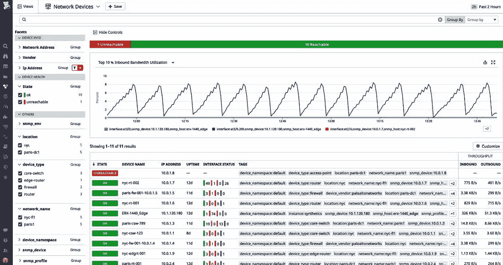
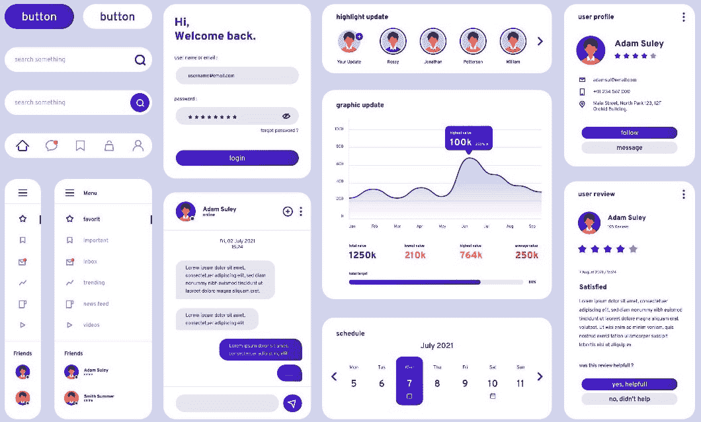
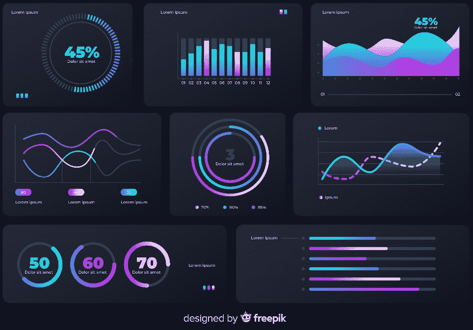

# 15

# 在微服务中解释监控数据

当与微服务架构和 Node.js 一起工作时，使用 Node.js 在微服务中解释监控数据非常重要。

我们将从这个章节开始，了解使用 Node.js 在微服务中解释监控数据的核心概念。在微服务中解释监控数据涉及分析从各种服务收集的指标、日志和跟踪，以深入了解系统的健康状况、性能和行为。解释监控数据是一个涉及自动警报、主动分析和持续改进努力的迭代过程。它在维护动态和分布式环境中微服务的稳定性和性能方面发挥着关键作用。

到本章结束时，您将学会如何使用 Node.js 在微服务中解释监控数据。

在本章中，我们将涵盖以下主要主题：

+   指标分析

+   日志分析

+   警报和阈值

+   可视化和仪表板

+   相关性和上下文

让我们从学习如何在监控微服务时执行指标分析开始。

# 指标分析

**指标分析**是监控微服务以深入了解系统健康状况、性能和行为的关键方面。**指标**是提供有关您业务流程及其性能重要信息的定量度量。这些度量有助于您评估和跟踪特定功能区域或项目中的性能、有效性和效率。

在 Node.js 中，有许多用于指标分析的可用工具，可以帮助您监控和优化应用程序的性能、可靠性和可伸缩性。以下是一些流行的开源工具：

+   **AppMetrics**：一个为 Node.js 应用程序提供实时监控和数据分析的工具。它允许您跟踪重要的指标，如响应时间、错误率、资源利用率等。它还允许您为应用程序创建仪表板、Node.js 报告和堆快照。

+   `Doctor`、`Bubbleprof`和`Flame`——用于诊断和修复 Node.js 应用程序中的性能问题。它帮助您识别 CPU 瓶颈、内存泄漏、事件循环延迟和异步活动。

+   **Express Status Monitor**：一个提供简单且自托管的模块来监控 Express.js 应用程序状态的工具。它显示 CPU 使用率、内存使用率、响应时间、请求速率等指标。

+   **PM2**：一个为 Node.js 应用程序提供生产流程管理和负载均衡器的工具。它通过提供零停机时间重新加载、集群模式、日志管理等功能，帮助您管理、扩展和监控您的应用程序。

+   **AppSignal**：一款为 Node.js 应用程序提供全面且易于使用的性能监控和错误跟踪解决方案的工具。它通过分布式跟踪、自定义指标、警报等功能，帮助您衡量和提升应用程序的性能、质量和用户体验。

+   **Sematext**：一款为 Node.js 应用程序提供全栈可观测性解决方案的工具。它通过实时用户监控、合成监控、日志管理、基础设施监控等功能，帮助您监控和排查应用程序。

这些是 Node.js 中用于指标分析的最好工具之一。您可以根据您的需求和偏好选择最合适的一个。

这里是关于指标分析的一些关键考虑和技巧：

+   **响应时间分析**：

    +   *基线性能*：在正常操作期间建立响应时间的基线。

    +   *异常*：识别与基线偏差。突然的峰值可能表明需要调查的问题。

    +   *服务依赖性*：将响应时间与服务依赖性相关联以确定瓶颈。

+   **吞吐量分析**：

    +   *预期吞吐量*：为每个服务定义预期的吞吐量。

    +   *容量规划*：分析吞吐量指标以规划容量扩展。

    +   *突发下降*：调查吞吐量突然下降的情况，这可能会表明服务故障或资源限制。

+   **错误率分析**：

    +   *正常与异常*：区分正常错误率和异常峰值。

    +   *错误相关性*：将错误率与特定服务或组件相关联以确定错误源。

+   **资源利用率分析**：

    +   *CPU 和内存使用率*：监控 CPU 和内存使用率以识别资源瓶颈。

    +   *容器指标*：如果使用容器，分析容器特定的指标以确定资源分配。

    +   *数据库指标*：检查数据库资源利用率，包括查询性能。

+   **延迟分析**：

    +   *服务间延迟*：分析微服务之间的延迟以确定高延迟交互。

    +   *数据库延迟*：评估数据库查询延迟以优化慢查询。

+   **饱和分析**：

    +   *资源饱和*：确定是否有任何资源，如 CPU、内存或网络，已饱和。

    +   *扩展决策*：饱和指标有助于做出明智的扩展决策。

+   **事件响应（IR）指标**：

    +   *事件持续时间*：分析事件的持续时间以确定改进的区域。

    +   *解决时间*：衡量解决事件所需的时间。

+   **以用户为中心的指标**：

    +   *页面加载时间*：监控以用户为中心的指标，特别是如果微服务涉及 Web 应用程序时。

    +   *用户满意度*：使用与用户体验相关的指标来衡量整体满意度。

+   **地理洞察**：

    +   *用户位置指标*：了解不同地理位置用户的微服务性能。

    +   *内容交付指标*：分析与**内容分发网络**（**CDNs**）相关的指标，以支持全球应用。

+   **持续改进指标**:

    +   *反馈循环指标*：衡量反馈循环的连续改进效果。

    +   *事件后分析*：使用指标来指导事件后分析和改进措施。

+   **容量规划指标**:

    +   *资源趋势*：分析资源使用趋势以进行容量规划。

    +   *预测*：使用历史指标来预测未来的资源需求。

+   **警报指标**:

    +   *警报响应性*：评估警报对关键事件的响应速度。

    +   *误报*：分析误报警报的发生，以进行细化。

+   **文档和沟通指标**:

    +   *知识共享指标*：监控与团队内部知识共享和沟通相关的指标。

    +   *文档更新*：跟踪与文档更新频率和相关性相关的指标。

指标分析是一个持续的过程，需要开发和运维团队之间的协作。记住——指标是理解您业务表现的基础，有效的分析可以导致更好的结果和策略。

总结来说，指标在维护微服务的可靠性和性能以及确保良好的用户体验方面发挥着关键作用。定期审查和改进指标分析策略对于适应系统不断变化的需求至关重要。

现在，让我们转到下一节，关于日志分析。

# 日志分析

**日志分析**是微服务领域的一项关键实践，用于从分布式系统内部各个组件生成的日志中提取有意义的见解。日志分析可以帮助您通过提供关于其性能、错误、使用和行为的信息来监控、故障排除和优化您的应用程序。在 Node.js 中有很多日志分析工具可以帮助您管理和可视化日志数据。以下是一些流行的开源工具：

+   **Winston**：一个多才多艺且功能强大的日志库，支持多种传输方式、自定义格式和级别。它还与流行的日志管理服务如**Loggly**、**Papertrail**和**Logstash**集成。

+   **Pino**：一个快速且低开销的日志库，默认输出 JSON，并支持浏览器和服务器环境。它还提供了一个 CLI 工具用于查看和过滤日志。

+   **Bunyan**：一个功能丰富的日志库，默认输出 JSON，并提供一个 CLI 工具用于查看和转换日志。它还支持自定义流、序列化和子日志记录器。

+   **Morgan**：一个简单且轻量级的中间件，用于在 Express.js 应用程序中记录 HTTP 请求。它支持预定义和自定义格式，可以将日志写入文件或流。

+   **Log4js**：Log4j 库在 Node.js 中的端口。它支持多个附加器、类别和级别。它还提供了一个配置文件，便于设置。

+   **LogDNA**：一种基于云的日志管理服务，提供日志数据的实时分析、警报和可视化。它支持各种来源、格式和集成，并提供每月最多 10 GB 的免费计划。

+   **Sematext**：一个全栈可观察性解决方案，提供日志管理、基础设施监控、**真实用户监控**（**RUM**）等功能。它支持各种来源、格式和集成，并提供每天最多 500 MB 的免费计划。

这些是 Node.js 日志分析中最好的工具之一。您可以根据您的需求和偏好选择最合适的一个。

这里是日志分析的关键方面和技术：

+   **错误日志分析**：

    +   *识别模式*：在日志中寻找重复的错误模式或异常。

    +   *严重程度级别*：区分不同的严重程度级别（例如，错误、警告）以确定问题优先级。

+   **信息和调试日志分析**：

    +   *正常运行*：分析信息和调试日志以了解微服务的正常运行。

    +   *事件序列*：追踪事件序列以理解请求在服务之间的流动。

+   **上下文信息**：

    +   *关联日志*：根据上下文信息（如请求 ID）关联来自不同服务的日志。

    +   *时间戳*：分析时间戳以建立日志条目之间的时间关系。

+   **识别性能问题**：

    +   *响应时间*：检查与响应时间相关的日志，特别是如果它们超过了正常阈值。

    +   *数据库查询*：分析日志以确定数据库查询时间和潜在瓶颈。

+   **警报日志分析**：

    +   *警报历史*：回顾与警报相关的日志以了解关键事件的历程。

    +   *解决步骤*：记录和分析解决警报所采取的步骤。

+   **安全日志分析**：

    +   *访问日志*：分析与安全相关的事件和潜在未授权访问的访问日志。

    +   *异常检测*：实施异常检测以识别可疑模式。

+   *外部依赖项的日志记录*：

    +   *外部服务日志*：分析来自外部依赖项的日志以了解它们对您的微服务的影响。

    +   *第三方集成*：检查日志中与第三方集成相关的错误或延迟。

+   **日志聚合**：

    +   *集中式日志记录*：使用日志聚合工具（例如，**ELK Stack** 和 **Splunk**）进行集中存储和分析。

    +   *搜索和查询*：利用搜索和查询功能进行高效的日志分析。

+   **事件后分析**：

    +   *根本原因分析（RCA）*：执行事件后日志分析以确定问题的根本原因。

    +   *文档*：记录发现和解决方案以供未来参考。

+   **模式识别**：

    +   *常见模式*：在日志中寻找可能表明系统问题的常见模式。

    +   *异常*：识别偏离预期日志模式的异常。模式识别异常是显著偏离预期或正常行为的数据点或模式。它们可能表明错误、欺诈或其他需要进一步调查的有趣现象。模式识别异常可以使用各种方法检测，例如统计测试、**机器学习**（**ML**）算法或视觉检查。

+   **日志保留** **和清理**：

    +   *保留策略*：定义日志保留策略以管理日志量。

    +   *日志清理*：定期清理过时或不相关的日志。

+   **自动化** **日志分析**：

    +   *机器学习*：实现机器学习算法以进行自动日志分析和异常检测。**深度学习**（**DL**）算法通常用于此目的。深度学习是机器学习的一个分支，它使用具有多个层的**神经网络**（**NNs**）从数据中学习复杂和非线性关系。深度学习可以处理各种类型的日志数据，如文本、图像或序列，并提取高级特征和表示。深度学习还可以执行端到端学习，这意味着它可以从原始数据中学习，而无需手动特征工程或预处理。以下是一些用于日志分析和异常检测的深度学习模型：

        +   *长短期记忆（LSTM）*：LSTM 网络是一种可以处理序列数据（如日志事件或消息）的**循环神经网络**（**RNN**）。

        +   *卷积神经网络（CNN）*：CNN 是一种可以处理空间数据（如图像或文本）的神经网络。

        +   *自动编码器（AE）*：AE 是一种可以通过编码和解码来学习数据的压缩表示的神经网络。

        +   *集成学习*：集成学习是一种技术，它结合多个基础学习器以创建一个更强大和鲁棒的学习器。

        +   *隔离森林*：隔离森林是一种使用随机决策树集合来隔离数据点的方法。

        +   *局部异常因子（LOF）*：LOF 是一种使用一组最近邻来衡量数据点局部密度的方法。

        +   *鲁棒协方差*：鲁棒协方差是一种使用协方差矩阵的鲁棒估计器来拟合数据的多变量高斯分布的方法。

    +   *日志解析*：使用日志解析工具从非结构化日志中提取结构化信息。

+   **性能分析**：

    +   *识别瓶颈*：使用日志来识别特定微服务或组件中的性能瓶颈。

    +   *资源利用率*：分析日志以了解资源（CPU、内存）的利用率。

+   **沟通** **和协作**：

    +   *跨团队协作*：基于日志分析促进开发和运维团队之间的协作。

    +   *通信渠道*：使用日志在 IR 期间改善沟通和协调。

+   **文档和** **持续改进**：

    +   *洞察力文档*：记录从日志分析中获得的认识，以供将来参考。

    +   *持续改进*：利用日志分析结果来推动持续改进计划。

*图 15**.1* 展示了 Datadog 中的网络设备监控：

图 15.1：Datadog 中设备监控概述（图片来自 Datadog 论坛）

有效的日志分析为微服务的运行行为提供了一个窗口，有助于故障排除、性能优化和保持系统可靠性。

总结来说，有效的日志分析是一种动态且不断发展的实践，需要根据系统不断变化的需求进行持续优化。

现在，让我们继续下一节，我们将讨论警报和阈值。

# 警报和阈值

**警报和设置适当的** **阈值** 是微服务架构中稳健监控策略的关键组成部分。

这里是警报和阈值管理的关键考虑因素：

+   **定义** **关键指标**：

    +   *识别关键指标*：确定哪些指标对微服务的健康和性能至关重要。

    +   *以用户为中心的指标*：考虑直接影响用户体验的指标，例如响应时间和错误率。

+   **设置基线和阈值**：

    +   *建立基线*：通过在常规操作期间建立基线指标来了解正常行为。

    +   *定义阈值*：为每个指标设置阈值，超过该阈值将触发警报。

+   **警报** **严重程度级别**：

    +   *定义严重程度级别*：根据对运营的影响将警报分类到严重程度级别（例如，严重、警告、信息）。

    +   *升级策略*：为不同严重程度级别建立升级策略。

+   **动态阈值**：

    +   *自适应阈值*：考虑基于历史数据或流量模式的自适应或动态阈值。自适应阈值在固定或全局阈值可能不足的各种场景中特别有用——例如，图像分割、音频噪声减少、心理物理学和感知、**IT 服务智能**（**ITSI**）、OpenCV 和图像处理。

    +   *时间考虑因素*：根据一天中的时间或预期的流量变化调整阈值。动态阈值使用高级机器学习算法来学习指标的历史行为和季节性，并相应地调整阈值。它们可以检测指标值的小时、日或周模式，并计算每天每个时间点的最合适的阈值。这样，它们可以减少噪声并提高异常检测的准确性。

+   **异常检测**：

    +   *实施异常检测*：使用异常检测技术自动识别指标中的异常模式。

    +   *机器学习算法*：探索用于动态异常检测的机器学习算法。

    +   *选择适当异常检测的重要性*：异常检测在识别数据集中显著偏离正常的数据点方面发挥着关键作用。以下是为什么根据指标的性质和系统选择适当的技术至关重要：

        +   异常可以采取各种形式：异常值、突然变化或逐渐漂移。

        +   选择异常检测方法时，业务背景很重要。

        +   数据分布影响选择。对于高斯（正态）分布，统计方法如均值、中位数和分位数效果良好。对于非高斯数据，基于机器学习的技巧可能更合适。

        +   一些技术计算成本较高。

        +   异常检测算法选择的常见技术包括隔离森林、LOF、鲁棒协方差、**单类支持向量机**（**单类 SVM**）、深度学习、时间序列方法、权衡和适应性。

+   **指标聚合**：

    +   *聚合指标*：考虑在特定时间间隔内聚合指标以减少噪声和误报。

    +   *滚动平均值*：使用滚动平均值以更平滑地表示指标趋势。

+   **警报关联**：

    +   *关联警报*：关联来自不同服务的警报以识别系统问题。

    +   *根本原因分析（RCA）*：通过理解警报之间的关系来促进 RCA。警报关联是一种强大的技术，通过识别各种警报和事件之间的模式和关系来增强 RCA。

    +   *实践中* *的警报关联* *示例*：

        +   *网络连接问题*：想象一个拥有多个服务器的数据中心。警报关联可以识别发生在同一数据中心内的与网络相关的连接问题。

        +   *特定应用检查*：在单个主机上，可能有各种特定应用的检查（例如，数据库查询和 API 调用）。

        +   *负载相关警报*：在数据库集群中，多个服务器处理不同的工作负载。

        +   *低内存警报*：考虑一个内存使用至关重要的分布式缓存系统。

+   **实时警报**：

    +   *实时警报*：确保关键警报实时传递，以便及时响应。

    +   *即时通知*：利用即时通知渠道，如即时消息或短信。

+   **持续评估**：

    +   *定期审查阈值*：定期根据系统动态的变化审查和调整阈值。

    +   *从事件中学习*：从事件中学习以细化阈值并提高警报的准确性。

+   **文档**：

    +   *记录警报规则*：清楚地记录警报规则，包括选择阈值背后的理由。

    +   *运行手册*：制定运行手册，指导响应者在特定警报触发时采取的行动。

    +   *维护最新的警报规则和文档是多个原因下的关键行业实践。让我们探讨为什么这很重要以及一些最佳实践：*

        +   *适应系统变化*：由于更新、扩展或架构变更，系统会随着时间的推移而发展。警报规则必须反映您系统的当前状态，以有效地检测异常或问题。定期审查和更新规则以适应这些变化。

        +   *避免警报疲劳*：过时或不相关的警报会导致噪音和警报疲劳。想象一下，收到几个月前就停用的服务的警报！保持规则最新确保警报始终具有可操作性和相关性。

        +   *有效的根本原因分析（RCA）*：准确的警报规则有助于 RCA。如果发生事件，过时的规则可能会误导调查。更新后的规则提供上下文并指导故障排除工作。

        +   *业务影响*：停机或性能问题可能产生财务和声誉后果。过时的规则可能会延迟事件响应（IR），影响业务运营。最新的规则最小化停机时间并减轻风险。

+   **多维警报**：综合评估指标，而不是单独评估，以实现更全面的警报。在微服务架构中，多维警报在监控和故障排除中起着至关重要的作用。让我们探讨一些它们特别有用的场景：

    +   *服务依赖监控*：微服务通常通过 API 或消息队列相互依赖。在设置警报时，请注意微服务之间的依赖关系。

    +   *健康监控*：多维警报可以跟踪依赖项的健康状况。

    +   *延迟*：当服务的响应时间超过阈值时发出警报。

    +   *错误率*：检测来自下游服务的错误率升高。

    +   *吞吐量*：监控每个服务处理的请求数量。

    +   *资源利用率*：每个微服务都在其自己的容器或实例中运行。多维警报可以跟踪资源利用率：

        +   *CPU 使用率*：当 CPU 使用率超过一定百分比时发出警报。

        +   *内存消耗*：检测内存泄漏或内存使用效率低下。

        +   *磁盘空间*：监控可用磁盘空间。

        +   *扩展决策*：何时扩展微服务取决于各种因素。

    +   *信息化的决策制定*：多维警报有助于做出信息化的扩展决策：

        +   *队列长度*：当消息队列积压增长时发出警报。

        +   *请求队列*：监控传入请求的数量。

        +   *响应时间*：根据响应时间阈值进行扩展。

    +   *安全和异常*：微服务容易受到安全威胁，多维警报可以检测异常：

        +   *速率限制*：当 API 端点收到过多请求时发出警报。

        +   *可疑行为*：监控异常模式（例如，重复失败的登录尝试）。

    +   *业务指标*：微服务影响业务结果，多维警报可以跟踪与业务相关的指标：

        +   *转化率*：如果转化率显著下降，发出警报。

        +   *收入*：监控交易金额或销售额。

    +   *地理考虑因素*：微服务可能部署在各个地区，多维警报可以考虑到地理差异：

        +   *区域延迟*：检测性能变化。

        +   *可用区*：监控不同区域的服务可用性。

    +   *自定义指标*：每个微服务可能发出自定义指标，多维警报可以处理这些具体指标：

        +   *自定义事件*：针对特定业务事件发出警报（例如，用户注册）。

        +   *自定义关键绩效指标（KPI）*：监控特定于应用程序的指标（例如，游戏得分）。

    +   *端到端事务监控*：微服务协作以满足用户请求，多维警报在服务之间关联：

        +   *事务流程*：如果关键事务在任何阶段失败，则发出警报。

        +   *链式指标*：监控多个服务之间的延迟。

+   **反馈循环**:

    +   *事件后分析*：进行事件后分析以评估警报的有效性。

    +   *持续改进*：使用反馈循环不断优化警报规则和阈值。

+   **测试警报**:

    +   *定期测试*：定期测试警报机制以确保其按预期运行。

    +   *模拟事件*：模拟事件以评估警报和响应流程的有效性。

+   **协作**:

    +   *跨团队协作*：在细化警报规则时促进开发和运维团队之间的协作。

    +   *反馈渠道*：建立反馈渠道，以便团队提供有关警报相关性的意见。

警报和阈值在维护微服务的可靠性和性能方面发挥着至关重要的作用。

总结来说，警报和设置阈值的迭代过程需要持续监控、评估和调整，以适应系统不断变化的需求。

在下一节中，我们将讨论可视化和仪表板。

# 可视化和仪表板

**可视化和仪表板**是微服务监控和可观察性策略的关键组成部分。它们提供了一种用户友好的方式来理解系统的性能、健康和行为。

在微服务架构中，以下是可视化仪表板的关键考虑因素：

+   **选择** **可视化工具**:

    +   *常用工具*：选择广泛使用的可视化工具，例如 **Grafana**、**Kibana** 或 **Datadog**。

    +   *兼容性*：确保与数据源以及从微服务收集的指标兼容。

+   **仪表板** **设计原则**:

    +   *清晰的布局*：设计具有清晰直观布局的仪表板。

    +   *层次结构*：建立信息层次结构以促进快速理解。

    +   *关键指标*：突出显示关键指标。

    *图 15.2* 说明了仪表板的良好布局、其设计原则和定制选项：

图 15.2：仪表板分析概述（图片由 Freepik 上的 coolvector 提供）

+   **数据聚合**:

    +   *聚合视图*：提供汇总视图，总结整体健康和性能。

    +   *粒度控制*：允许用户调整不同时间段的指标粒度。

+   **实时更新**：

    +   *实时数据*：包括实时更新以提供即时洞察。

    +   *流数据*：支持流数据以进行持续监控。

+   **自定义选项**：

    +   *用户自定义*：允许用户根据他们的偏好自定义仪表板。

    +   *小部件和面板*：提供各种小部件和面板，用于不同类型的可视化。

+   **多维视图**：

    +   *多维指标*：支持具有不同维度的指标的多维视图。

    +   *服务依赖关系*：可视化微服务之间的依赖关系。

+   **与警报集成**：

    +   *警报集成*：将仪表板与警报系统集成，以便对问题做出即时响应。

    +   *通知小部件*：包括用于活动警报的通知小部件。

+   **地理洞察**：

    +   *地图可视化*：使用地图可视化来了解性能的地理差异。

    +   *用户位置*：根据用户的位置显示指标。地理洞察中的用户位置是一种可视化和分析用户地理分布和行为的方法。它们可以帮助您了解您的用户来自何处，他们如何与您的应用程序互动，以及哪些因素影响他们的参与度和满意度。地理洞察中的用户位置可以来自各种数据源，例如 IP 地址、GPS 坐标或用户资料。它们还可以使用各种工具和技术显示和探索，例如地图、图表、仪表板或报告。

    *图 15.3*展示了洞察和地理洞察仪表板：

图 15.3：洞察仪表板概述（图片由 Freepik 上的 Pikisuperstar 提供）

+   **历史分析**：

    +   *历史趋势*：包括历史趋势分析，以识别随时间变化的模式。

    +   *比较视图*：允许用户将当前性能与历史基准进行比较。

+   **依赖关系映射**：

    +   *服务依赖关系图*：创建描绘微服务之间依赖关系的可视化地图。

    +   *拓扑视图*：提供拓扑视图，显示服务之间的交互。

    *图 15.4*展示了微服务中的依赖关系映射：

图 15.4：微服务中的依赖关系映射（图片由 Freepik 上的 macrovector 提供）

+   **性能分析**：

    +   *资源利用率*：可视化资源利用率以识别瓶颈。

    +   *服务级别指标（SLI）*：显示 SLI 以了解服务层面的性能。

+   **用户体验指标**：

    +   *以用户为中心的指标*：纳入与用户体验相关的指标，例如页面加载时间。

    +   *转化率*：显示反映业务成果的指标。转化率是完成预期行动或目标的用户百分比，例如购买产品、注册通讯或下载文件。例如，如果有 100 名用户访问您的网站，其中 10 名购买了您的产品，您的转化率是 10%。

+   **文档和工具培训**：

    +   *指南和文档*：提供使用可视化工具的指南和文档。

    +   *培训课程*：开展培训课程，教育团队有效使用仪表板。

+   **协作和分享**：

    +   *共享仪表板*：使用户能够与团队成员共享仪表板。

    +   *协作编辑*：支持团队范围内的协作编辑。

+   **持续改进**：

    +   *用户反馈*：收集用户反馈以持续改进仪表板。

    +   *迭代优化*：使用迭代过程根据用户需求优化仪表板。

文档和培训课程在确保团队间可视化工具的一致和有效使用中发挥着关键作用。让我们探讨它们为什么是必不可少的以及它们如何有助于成功采用：

+   **有效沟通**：

    +   文档为使用可视化工具提供了清晰的参考。

    +   它概述了最佳实践、约定和指南。

    +   当创建、解释或分享可视化时，团队可以参考文档。

+   **新团队成员的入职**：

    +   当新团队成员加入时，培训课程向他们介绍可视化工具。

    +   他们学习如何创建图表、图形和仪表板。

    +   培训确保了共同的理解并减少了知识差距。

+   **设计和风格的统一**：

    +   记载的设计原则指导团队创建一致的视觉呈现。

    +   培训课程强化了这些原则。

    +   一致性提升了用户体验和可读性。

+   **工具功能和更新**：

    +   可视化工具随着新功能和改进而发展。

    +   定期培训课程使团队了解更新。

    +   文档解释了如何利用新功能。

+   **故障排除和问题解决**：

    +   记载的故障排除技巧有助于解决常见问题。

    +   培训使团队具备问题解决技能。

    +   面对挑战时，团队可以参考资源。

+   **数据治理和安全**：

    +   文档概述了数据治理政策。

    +   培训课程强调数据安全实践。

    +   团队学习如何负责任地处理敏感信息。

+   **定制和高级技术**：

    +   **高级培训**：深入研究复杂可视化。

    +   团队探索定制、脚本和交互式功能。

    +   文档提供了逐步的指导。

+   **案例研究和示例**：

    +   记载的案例研究展示了成功的可视化项目。

    +   培训课程分享现实世界的案例。

    +   团队从实际场景中学习。

+   **跨职能协作**：

    +   文档弥合团队之间的差距（例如，数据分析师、设计师和开发者）。

    +   培训会鼓励协作。

    +   团队理解彼此的角色和贡献。

+   **反馈与持续改进**：

    +   记录的反馈渠道允许用户提出改进建议。

    +   培训会收集参与者的见解。

    +   团队根据反馈迭代可视化实践。

有效的可视化和仪表板使团队能够快速识别问题、趋势和微服务架构中的优化机会。

总结来说，定期评估仪表板的可用性和有效性，以确保它们与不断发展的系统需求保持一致。

在下一节中，我们将讨论相关性与上下文。

# 相关性与上下文

**相关性与上下文**是有效监控和微服务故障排除的关键要素。它们有助于理解不同组件之间的关系，识别问题的根本原因，并促进快速准确的 IR。

这是在微服务环境中应用相关性和上下文的方法：

+   **日志关联**：

    +   *跨服务日志*：根据共享标识符（例如，请求 ID）关联不同微服务的日志。

    +   *时间戳*：根据时间戳对来自不同服务的日志条目进行对齐，以实现时间相关性。

+   **请求跟踪**：

    +   *分布式跟踪*：实现分布式跟踪以跟踪请求在微服务之间的旅程。

    +   *跟踪 ID*：为请求分配唯一的跟踪 ID，并在服务之间传播以实现无缝关联。

+   **警报关联**：

    +   *服务依赖性*：将依赖服务的警报相关联，以了解对上游/下游组件的影响。

    +   *IR（事件响应）*：使用相关警报来指导 IR 并优先处理操作。

+   **指标关联**：

    +   *服务指标*：将不同服务的指标相关联，以识别性能中的相关性。

    +   *依赖关系图*：使用依赖关系图来直观地表示微服务之间的相关性。

+   **上下文信息**：

    +   *用户上下文*：在日志和跟踪中包含用户上下文以了解用户在微服务之间的旅程。

    +   *会话 ID*：使用会话 ID 来关联用户会话内的活动。

+   **错误关联**：

    +   *错误模式*：在服务之间关联错误模式以识别系统性问题。

    +   *根本原因分析（RCA）*：使用相关错误来定位事件的根本原因。

+   **拓扑上下文**：

    +   *服务依赖性*：维护显示微服务之间依赖关系的拓扑上下文。

    +   *依赖关系映射*：可视化依赖关系以了解服务运行的上下文。

+   **事件关联**：

    +   *事件流*：在微服务之间关联事件以了解事件的顺序。

    +   *因果关系分析*：使用相关事件来分析因果关系和关系。

+   **性能关联**：

    +   *资源利用率*：关联资源利用率指标以识别性能瓶颈。

    +   *响应时间*：关联服务间的响应时间以识别缓慢或表现不佳的组件。

+   **用户上下文**：

    +   *用户识别*：关联用户行为和请求以获得对用户行为的洞察。

    +   *个性化分析*：使用用户上下文进行个性化分析和洞察。

+   **基础设施上下文**：

    +   *容器指标*：关联容器指标与微服务以了解资源分配的影响。

    +   *云服务指标*：关联指标与云服务性能以获得上下文。

+   **历史上下文**：

    +   *历史分析*：将当前问题与历史数据相关联以进行趋势分析。

    +   *性能趋势*：了解当前性能与历史基准的比较。

+   **根本原因分析（RCA）**：

    +   *隔离根本原因*：使用关联来隔离问题的根本原因和事件。

    +   *协作调查*：使用相关信息的跨团队合作以实现更快的问题解决。

+   **IR**：

    +   *自动关联*：实现自动关联以实现即时 IR。

    +   *剧本*：开发利用相关信息的 IR 剧本。

+   **文档和沟通**：

    +   *文档*：记录相关洞察以供未来参考和分析。

    +   *通信渠道*：通过通信渠道共享相关信息以进行协作问题解决。

相关性和上下文对于微服务的可观察性至关重要，使团队能够全面了解系统的行为和性能。

总结来说，通过将这些实践整合到监控和分析工作流程中，组织可以简化 IR，提高系统可靠性，并提高整体运营效率。

# 摘要

在本章中，我们学习了如何使用几个原则和工具在 Node.js 中解释微服务的监控数据。

在微服务中解释监控数据涉及分析从各种服务收集的指标、日志和跟踪，以获得对系统健康、性能和行为洞察。在解释微服务架构中的监控数据时，以下是一些关键方面需要考虑：

+   **指标分析**：

    +   *响应时间*：分析响应时间指标以了解服务的延迟。识别任何基线之外的峰值或偏差。

    +   *吞吐量*：监控服务的吞吐量以确保它们能够处理预期的负载。突然的下降可能表明存在问题。

    +   *错误率*：跟踪错误率以识别出现问题的服务。关注异常错误率的服务。

+   **日志分析**：

    +   *错误日志*：调查错误日志以获取有关特定错误的详细信息。寻找可能需要关注的模式或重复出现的问题。

    +   *信息和调试日志*：分析信息和调试日志以获得对正常系统行为和调试目的的洞察。

+   **跟踪**：

    +   *分布式跟踪*：使用分布式跟踪来跟踪请求在微服务之间的流动。识别瓶颈和高延迟区域。

    +   *事务跟踪*：跟踪单个事务，以了解各种服务采取的操作序列。

+   **警报和通知**：

    +   *设置警报*：根据关键指标建立警报阈值。当指标超过预定义的阈值时，接收通知。

    +   *异常检测*：利用异常检测自动识别指标中的异常模式。

+   **性能分析**：

    +   *CPU 和内存使用情况*：检查 CPU 和内存使用情况，以识别潜在的资源瓶颈。评估服务是否高效地利用资源。

    +   *数据库查询性能*：评估数据库查询的性能，以识别慢查询并对其进行优化。

+   **基础设施指标**：

    +   *服务器健康*：监控基础基础设施的健康状况，包括服务器状态、磁盘空间和网络指标。

    +   *容器编排指标*：如果使用容器编排（例如，Kubernetes），分析与 Pod 健康和资源分配相关的指标。

+   **用户体验监控**：

    +   *以用户为中心的指标*：考虑以用户为中心的指标，例如页面加载时间或 API 响应时间，以确保良好的用户体验。

    +   *地理洞察力*：了解基于地理位置的用户体验差异。

+   **IR**：

    +   *事件分析*：在解决事件后，进行事后分析以了解根本原因并实施预防措施。

+   **持续改进**：

    +   *反馈循环*：建立反馈循环，根据从监控数据中获得的认识，持续改进系统性能和可靠性。

    +   *容量规划*：使用监控数据进行容量规划和扩展决策。

+   **文档和知识共享**：

    +   *记录发现*：根据监控数据记录观察结果、发现和解决方案，供未来参考。

    +   *知识共享*：与开发和运维团队分享见解，以增强集体理解。

解释监控数据是一个迭代的过程，涉及自动警报、主动分析和持续改进努力的结合。它在维护动态和分布式环境中微服务的稳定性和性能方面发挥着关键作用。

在下一章中，我们将学习如何使用 Node.js 分析微服务的日志数据。

# 测验时间

+   什么是指标分析？

+   什么是日志分析？

+   警报和阈值管理有哪些关键考虑因素？

+   什么是相关性及其上下文？
