# 第一章

# Node.js 简介

# 简介

Node.js 在全球 IT 市场上的普及度日益增长。通过这本书，任何 JavaScript 开发者都可以轻松地从基础到高级学习 Node.js。本章将讨论 Node.js 的基础和架构。我们还将学习如何编写简单的 Node.js 程序。

# 结构

在本章中，我们将涵盖以下主题：

+   定义 Node.Js 及其应用场景

+   Node.Js 的优缺点

+   在各种平台上安装 Node.Js

+   理解事件驱动编程

+   Node.js 架构

+   编写 HTTP 和 HTTPS 服务器

+   使用 Cluster 模块

# 定义 Node.Js

当 Ryan Dahl 展示了他的杰出工作，*2009 年 JSConf 上的 Node.js*，这标志着新时代的开始。他表示，在大多数顶级语言中，并发是通过线程实现的，而使用线程存在某些问题，因为线程之间的上下文切换成本高昂。通过事件循环，他展示了 Node.js 实现的并发性远高于任何现有语言。会议上的与会者欢迎这一想法，并鼓掌欢迎 Dahl。因此，编程世界期待已久的转变开始了。

Node.js 是一个开源的跨平台 JavaScript 运行时环境。它声明任何人都可以免费在任何操作系统上使用它，例如 Windows、Linux、Unix、Mac 等。JavaScript 是 Node.js 的基础。任何 node.js 应用的代码都是用 JavaScript 编写的。此代码在 Google Chrome 的 V8 JavaScript 引擎上运行，该引擎直接将源代码转换为机器代码，然后无需解释即可执行，无需浏览器即可执行。Node.js 为代码的运行提供了必要的环境。

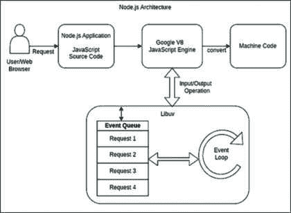

**图 1.1:** Node.js 架构

*图 1.1* 展示了 Node.js 的高级架构。尽管 Node.js 是单线程的，但它通过异步非阻塞 I/O 操作的机制，在每次处理大量并发请求，这种机制由 `**libuv**` 库提供，该库以多线程的方式自行执行。

由于非阻塞 I/O 操作，Node.js 与其他语言相比速度更快，因为请求不会等待其响应，而是并行执行另一个请求。所有请求首先发送到事件队列，在事件循环中处理，然后通过队列发送回 V8 引擎，如 Node.js 架构中所示。关于事件循环的更多内容将在本章后面的“*事件驱动机制*”部分中详细阐述。

Node.js 不仅是为了后端服务器编程应用而编写的，而且还作为节点模块开发并用于客户端，这对开发者来说是有益的，因为两边的语言相同。

# Node.js 的应用

由于其特性和不同类型的应用，Node.js 在 IT 行业中的应用正在以较快的速度增长。以下是一些与 Node.js 相关的不同类型应用的例子。

# 单页应用程序

目前，许多组织和公司通过开发作为单页应用程序的服务器端应用程序的 Node.js 应用程序，为他们的客户提供复杂和实时的解决方案。例如，Gmail、Twitter、Facebook、Trello 以及许多其他应用程序都是作为 SPA（单页应用程序）开发的。单页应用程序通过在单个网页上重写数据而不是重新加载整个网页，与用户的操作进行通信。

# 实时应用

Node.js 是实时应用的理想模型，因为它可以同时响应多个请求。如果有大量用户需要实时响应，Node.js 是更好的选择。您可以使用 Node.js 与 WebSockets 结合，以实现持续连接并提供更快的响应时间。音频、视频、聊天、多人游戏和股票交易等应用程序都是通过这种方式开发的。

# 物联网设备应用

由于其较快的响应时间和处理大量并发请求的能力，Node.js 是物联网（IoT）应用程序的良好选择，其中设备或传感器连接到互联网并持续发送大量数据。火灾检测、噪音污染测量、健身追踪、健康监测等物联网用例是 Node.js 发挥重要作用的许多应用之一。

# 数据流应用程序

Node.js 允许以流的形式使用抽象接口进行数据处理。大型媒体文件被分割成小块，并以缓冲区形式发送。这些缓冲区被转换成有意义的数据。Netflix 类似的流媒体服务使用 Node.js，其中数据以块的形式传输，而不是整个大流，这减少了在流传输过程中的加载和延迟。

Node.js 的用途不仅限于前面提到的应用类型，还包括在 Node.js 中开发的许多其他类型的应用，例如制作代理或信令服务器、监控基于数据的应用程序等。

# Node.js 的优点

Node.js 是一个非常强大的 JavaScript 运行时环境。它允许开发者构建高性能和可扩展的应用程序。Node.js 提供的一些关键优势如下：

+   **跨平台**：Node.js 提供了跨平台功能，因此应用程序可以轻松地在任何操作系统上开发并在任何平台上部署。Node.js 支持的关键平台包括 Windows、Mac（Intel）、Mac（ARM）和 Linux（Intel/ARM）。可能每个主要平台都得到了支持。

+   **高性能**：Node.js 由于异步非阻塞 I/O 操作而提供高性能，这些操作可以并行执行请求，而无需等待任何其他请求的响应。

+   **易于扩展**：Node.js 本身是单线程的，但在高流量下，它可以通过“*cluster*”模块同时处理大量请求来扩展，该模块创建子进程并减少应用程序的负载。

+   **缓存**：Node.js 允许将数据存储在临时内存中，这些数据不经常更新，这可以减少加载时间并节省数据库事务。这被称为缓存。

+   **庞大的社区**：自从 Node.js 出现以来，其社区规模每天都在增加。用于编程的语言是 JavaScript，它是互联网的支柱，几乎每个前端开发者都已经熟悉它。这使得学习变得容易，并使社区迅速增长。有超过 130 万个开源库可供使用。

此外，还有很多其他优点，如成本效益、易于学习和适应性。Node.js 是一种真正有所不同的技术。

# Node.js 的缺点

Node.js 也有一些缺点。然而，许多这些缺点可以通过最佳实践来克服。

+   **单线程**：Node.js 是单线程的，这既是优点也是缺点，因为它无法快速处理重量级的 CPU 密集型计算。当需要更多 CPU 进行处理的请求进入事件循环时，它们会不断堆积，因为直到完成一个请求，它才不会从事件队列中选取其他请求。然而，这仅在只有 CPU 密集型任务时才会发生。如果请求需要一些 I/O 发生，另一个请求将在请求等待 I/O 完成时被选取。CPU 密集型任务会降低性能并延迟响应。例如，对于搜索算法和数学计算，当时复杂性很高，由于性能不佳，Node.js 不推荐使用。

+   **回调地狱**：在 Node.js 中进行异步编程对一些开发者来说可能具有挑战性，尤其是在使用回调时。回调地狱是一种回调函数嵌套的情况。这可能会使代码难以阅读和维护。然而，为了避免这种情况，开发者可以使用 promises、async-await 或如 Async.js 之类的库。

+   **库兼容性**：尽管有超过一百万个库可用，但那些由个人开发者开源的库可能没有更新到最新版本。这有时会使在项目中使用这些库变得困难。

# 安装 Node.js

现在我们已经对 Node.js 是什么以及它提供了什么有了高层次的理解，让我们跳转到设置部分。在您的系统中下载和安装 Node.js 有不同方式，但在这里，我们提供最简单和最佳的方式。根据您的操作系统，从其官方网站([`nodejs.org/en/download`](https://nodejs.org/en/download))下载 Node.js 的 LTS（长期支持）版本。在网站上，会有 LTS 和当前版本，请选择 LTS 版本，因为它更稳定，并且推荐用于复杂项目。

在撰写本文时，Node.js 版本 20 是激活状态。

**图 1.2**：Node.js 版本

上述最新的发布时间表可以在 Node.js GitHub 页面查看— [`github.com/nodejs/release#release-schedule`](https://github.com/nodejs/release#release-schedule)。

# 在 Linux/Ubuntu 上安装 Node

**NPM**（**Node 包管理器**）是 node.js 的默认包管理器，也是一个 JavaScript 软件包的库。它是开源的，这样开发者就可以通过 npm 免费在他们的项目中安装其他模块。

**Node 版本管理器（NVM）**是一个 shell 脚本，用于管理多个 node 版本，并在不同的项目中使用它。

我们可以通过实际案例来强调通过**NVM**安装 Node.js 的重要性。

使用 NVM，您可以在同一台机器上轻松管理多个 Node.js 版本。以下是它如何帮助的：

+   **版本管理**：NVM 允许您在系统中安装多个 Node.js 版本。这意味着您可以根据项目的需求无缝地在不同版本之间切换。

+   **隔离环境**：通过 NVM 安装的每个 Node.js 版本都与其他版本隔离。这确保了对一个版本的更改不会影响到其他版本。当您在处理具有冲突依赖项的项目或需要与旧版本保持兼容性时，这尤其有用。

+   **灵活性**：使用 NVM，您可以轻松地在 Node.js 版本之间切换。这允许您在不同的版本上测试您的应用程序，确保兼容性和稳定性。

+   **特定项目的版本管理**：NVM 允许您指定特定项目所需的 Node.js 版本。这确保了每个项目都使用正确的 Node.js 版本，而不会干扰到其他项目。

+   **轻松更新**：NVM 简化了将 Node.js 更新到最新版本的过程。您可以通过单个命令轻松升级或降级 Node.js 版本，确保您的开发环境保持最新。

用于管理 Node.js 版本的 NVM 提供了一个简化和高效的流程，提高了生产力，并减少了项目之间的潜在冲突。它是同时处理多个 Node.js 项目的开发者的必备工具。

根据 NVM 的优势，我们将在不同的平台上通过 NVM 安装 Node.js。

让我们先安装 NVM，然后通过 NVM 安装 Node.js。打开终端/控制台或 cmd，并按照以下三个步骤操作：

1.  使用最新版本的软件包更新您的系统。

    `$ sudo apt-get update`

1.  使用以下命令下载和安装 NVM：

    `$ curl -o- https://raw.githubusercontent.com/nvm-sh/nvm/v0.39.3/install.sh | bash`

1.  在运行上述命令之前，请确保系统已安装 `curl`。如果没有安装，请运行以下命令进行安装和验证：

    `$ sudo apt install curl $ curl –version`

1.  验证 NVM 版本：

    `$ nvm –version`

1.  按以下方式安装 Node.js：

    `$ nvm install node`

    此命令将安装最新的稳定版 node。

1.  要安装 LTS 版本的 Node.js，使用此命令：

    `$ nvm install -lts`

1.  如果有人需要特定的 node 版本，那么在 NVM 的末尾添加特定版本，并按以下方式安装：

    `$ nvm install 18.15.0`

    或者

    `$ nvm install 18.x`

    在前面的命令中，18.15.0 是 node.js 的一个特定版本，18.x 表示它将考虑 18 以上和 19 以下的最高版本。

1.  按以下方式验证 Node.js 版本：

    `$ node –version`

在成功执行上述步骤后，您可以在命令提示符中看到以下输出，供您参考。

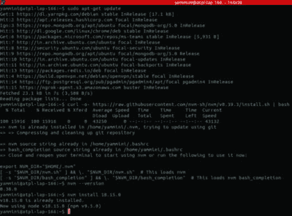

**图 1.3:** Linux Node.js 安装

在安装 Node.js 后，默认情况下，NPM 也会随着 Node.js 安装包一起安装，可以使用 `$ npm –version` 进行验证。

其他对开发者有帮助的 NVM 命令，可用于在不同项目中玩转不同的 node 版本如下：

+   `$ nvm ls` - 检查系统中 node 版本的列表

+   `$ nvm use 18.x` – 在项目中特定使用 node 版本

+   `$ nvm alias default 18.x` – 这是为了设置系统中所有项目的默认版本

+   `$ nvm uninstall 18.x` - 这将从系统中卸载 18.x 版本

# 在 Windows 上安装 Node.js

虽然我们已经涵盖了 Linux 安装，现在让我们继续在 Windows 上进行安装过程。您可以根据以下步骤进行 Windows 安装。

通过命令提示符 (`**cmd**`) 使用名为 "`**nvm-windows**`" 的专用工具在 Windows 上通过 NVM 安装 Node.js。以下是使用 `**nvm-windows**` 通过命令提示符在 Windows 上安装 Node.js 的步骤：

1.  下载 Windows 版本的 NVM：

    前往 `nvm-windows: nvm-windows` 的 GitHub 仓库。您可以在 [`github.com/coreybutler/nvm-windows`](https://github.com/coreybutler/nvm-windows) 上探索更多 Windows 版本的 `**nvm**`。

    从以下链接的发行版部分下载最新安装程序 (.zip 文件)：[`github.com/coreybutler/nvm-windows/releases`](https://github.com/coreybutler/nvm-windows/releases) 这里，我们将下载 `**nvm-setup.zip**` 文件

    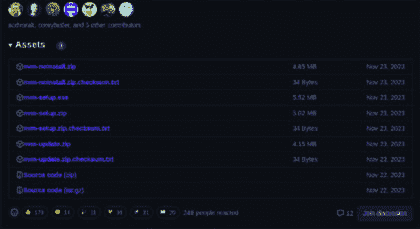

    **图 1.4:** Windows Node.js 下载 Zip 文件

1.  解压 Zip 文件：

    将下载的 .zip 文件解压到系统上的一个目录。

1.  为 Windows 安装 `**NVM**`：

    以管理员身份打开命令提示符（右键单击并选择“**以管理员身份运行**”）。导航到您提取`**nvm-windows**`文件的目录。

    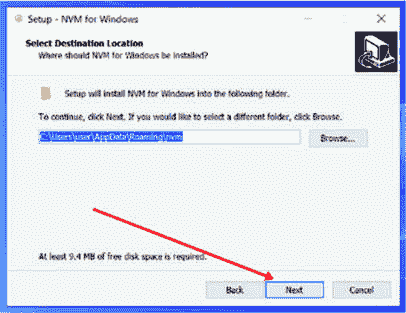

    **图 1.5：NVM 选择安装位置**

1.  点击`**完成**`以完成过程！: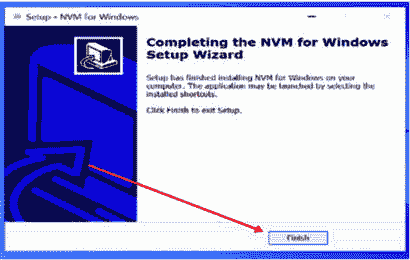

    **图 1.6：NVM 完成安装过程**

    运行`**nvm-setup.zip**`可执行文件以启动安装过程。按照屏幕上的说明完成安装。

1.  验证 NVM 安装：

    以管理员身份关闭并重新打开命令提示符。运行 NVM 版本命令以确保 NVM 已正确安装。

1.  安装 Node.js：

    一旦安装了 NVM，您就可以使用它来安装 Node.js。要安装特定版本的 Node.js，请使用命令`**nvm install <version>**`（例如，`**nvm install 18.0.0**`）。

    安装完成后，您可以使用`**nvm use <version>**`命令在 Node.js 版本之间切换。

1.  验证 Node.js 安装：

    运行命令`**node -v**`以验证 Node.js 已安装且激活了正确的版本。

# 为 mac 安装 Node.js

在 Mac OS 上安装 Node.js 的过程与 Linux 类似。遵循以下步骤：

1.  安装 NVM：要安装 NVM，我们只需运行以下命令：

    `curl -o- https://raw.githubusercontent.com/nvm-sh/nvm/v0.39.3/install.sh | bash`

    请确保`**curl**`可用。

1.  使用 NVM 安装 Node.js。如果只想安装最新版本的 Node.js，请运行以下命令：

    `nvm install node`

    此命令将自动下载并安装最新版本的 Node.js。如果您想安装 LTS（长期支持）版本，请运行此命令：

    `nvm install –-lts`

    （请注意，在`lts`之前有两个短横线`'`-’）。

1.  通过打开控制台并运行以下命令来验证安装：

    `node --version`

    这将输出安装的版本，例如：

    `v20.0.0`

1.  我们还可以使用此命令检查 npm 版本：

    `npm -- version`

    `9.6.4`

# 事件驱动机制

Node.js 是一种异步非阻塞事件驱动编程。任何发生的行为称为事件，它要么由用户执行，要么由系统本身执行。Node.js 提供了一个内置的模块 Event，它是`**EventEmitter**`的一个实例。事件是一个 I/O 请求，首先发送到事件队列。如果有多个并发请求进入队列，则队列将其传递给事件循环。

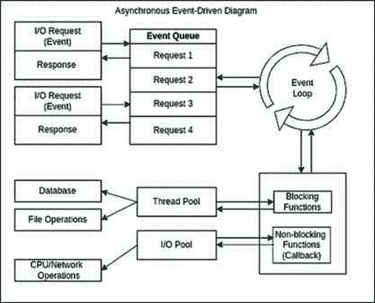

**图 1.7：事件驱动图**

事件循环监控事件队列，从其中收集事件，然后根据阻塞和非阻塞函数进行处理和执行。阻塞函数依次执行，一个接一个，第二个函数只有在第一个函数响应后才会调用。有时它依赖于外部资源，需要等待较长时间才能得到响应，而非阻塞函数不需要等待任何响应。它们异步执行，这意味着一次可以并行运行多个函数，这样它们就不会相互依赖。阻塞和非阻塞函数分别将线程和 I/O 池发送到其池中。一旦实际操作完成，该请求的响应将通过事件循环发送回事件队列。简而言之，事件通过队列发出，然后通过事件循环监控的队列进行注册或注销，相应地绑定适当的处理器。

Node.js 虽然只有一个线程同时处理多个请求，但它遵循非阻塞异步模型，不会阻塞其各自的调用处理器。

# 事件编程示例

创建一个名为 `**event_index.js**` 的文件，并将以下代码粘贴到其中：

`// 导入 'events' 模块`

`const events = require('events');`

`// 初始化一个 EventEmitter 对象`

`const eventEmitter = new events.EventEmitter();`

`// 绑定发送消息的事件处理器`

`eventEmitter.on('send_message', function () {`

`console.log('Hi, This is my first message');`

`});`

`// 与连接事件关联的处理程序`

`const connectHandler = function connected() {`

`console.log('Connection is created');`

`// 触发相应的事件`

`eventEmitter.emit('send_message');`

`};`

`// 将事件与处理程序绑定`

`eventEmitter.on('connection', connectHandler);`

`// 触发连接事件`

`eventEmitter.emit('connection');`

`console.log("Finish");`

使用 `**$ node event_index.js**` 运行文件，以下输出将显示：

`Connection is created`

`Hi, This is my first message`

`Finish`

# 同步代码示例

创建一个名为 hello.txt 的文件，并将以下文本粘贴到其中：

`Hello, I am Developer`

在同一文件夹内创建另一个名为 index.js 的文件，粘贴以下代码并保存：

`const fs = require('fs');`

`console.log('Start');`

`const data = fs.readFileSync('hello.txt');`

`console.log(data.toString());`

`console.log('End');`

按以下方式运行代码：

`**$ node sync_index.js**`

你将得到以下输出：

`Start`

`Hello, I am Developer`

`End`

在这里，fs 是一个文件系统模块，导入它，`**fs.readFileSync()**` 是一个同步函数，它等待文件读取完成，并将响应分配给 data 变量。它逐行打印并同步执行。

# 异步代码示例

创建一个名为 `**hello.txt**` 的文件，并将以下文本粘贴到其中：

`Hello, I am Developer`

在同一文件夹内创建另一个名为 `**index.js**` 的文件，粘贴以下代码并保存：

`const fs = require('fs');`

`console.log('Start');`

`fs.readFile('hello.txt', function (err, data) {`

`if (err) {`

`return console.error(err);`

`}`

`console.log(data.toString());`

`});`

`console.log('End');`

按以下方式运行代码：

`$ node async_index.js`

你将得到以下输出：

`Start`

`End`

`Hello, I am Developer`

在这里，fs 是一个文件系统模块。我们导入它，`**fs.readFile()**` 是一个异步函数。这个函数不会等待文件读取完成。相反，它有一个回调函数。一旦文件读取操作完成，`**callback**` 函数就会执行并打印数据。因此，回调函数之后的行是异步执行的。

# Node.js 架构类型

当我们开始使用 Node.js 开发应用程序时，决定你的应用程序应该如何结构是很重要的。有几种不同的方式来结构你的 Node.js 应用程序，使用不同的架构。让我们在这里简要讨论一下。

# 单体架构

在这个架构中，所有业务逻辑的组件或模块都融合在一个单一单元中。几乎所有网络服务器或服务器端框架都是使用单体架构（参见*图 1.8*），这是对开发者来说最简单的方式：

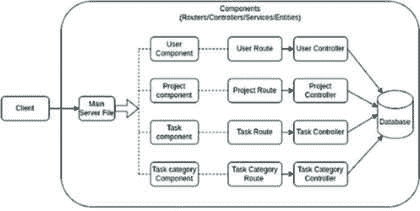

**图 1.8：单体架构**

对于不需要广泛可扩展性的小型应用程序，这种架构可能是合适的。然而，它可能不适合更大和更复杂的应用程序。随着你的服务器端应用程序的流量负载增长，你需要对其进行扩展以处理增加的需求。在这个架构中，你有一个单一的 Node.js 主服务器文件，它将所有 API 请求路由到控制器和服务，管理数据库事务。

你可以使用集群来扩展单体架构以减少负载。然而，在某些情况下，单个服务器无法处理传入的流量。在这种情况下，你可以在多个服务器上部署相同的代码，运行应用程序服务器，并使用像 Nginx 这样的负载均衡器。负载均衡器使用轮询方法，成为了一种可靠的解决方案，特别是对于非常大和高度使用的应用程序。我们将在部署部分更详细地探讨这个方面。这种结构的最大缺点是，如果任何组件需要小的更改，那么需要在所有服务器上执行更改，然后重新构建和重新部署。

# 微服务架构

微服务架构是一种作为服务集合开发的架构。这里提供的框架允许我们开发、部署微服务，并独立维护它们。微服务通过将应用程序从整体分解成几个较小的部分来解决单体系统的挑战。它是可靠且适合大型和复杂应用程序的，例如电子商务平台、社交网站，这些网站同时向数百万用户提供多个功能。因此，在维护或添加新功能时，它不会中断其他现有功能，只部署更新的服务。如今，由于其灵活性，它越来越受欢迎，多个开发者可以独立工作，只需负责他们自己的小段代码，而不是整个系统代码。

在这种架构中，所有业务逻辑的组件或模块都是独立的。许多大型企业使用这种类型的微服务架构（参见*图 1.9*）：

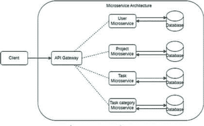

**图 1.9：微服务架构**

根据前面的图示，客户端作为用户或 UI 发送请求，该请求被 API 网关收集并传递给相应的微服务，每个微服务都有自己的功能（Lambda 函数）。此函数连接到数据库，并根据情况返回响应。每个微服务都可以轻松更改和部署，而不会相互影响。此外，这些微服务还通过 API HTTP 服务或 gRPC（谷歌远程过程调用）相互调用，这是微服务架构的通用流程。然而，虽然这种架构在开发中具有成本效益和时间节省的优势，但它可能不适合小型应用程序。这是因为它依赖于基于云的解决方案，即使是最基本的设置也可能变得昂贵。通过采用更经济实惠的解决方案，这种成本问题通常可以得到缓解，这些解决方案由单体架构提供。实际上，微服务代表了在云计算领域利用无服务器架构的一种方式。

# 无服务器架构

无服务器架构是开发和构建应用程序而不管理基础设施的方法。基本上，任何应用程序都是在一个特定的服务器上开发和部署的。然而，管理托管过程对于开发者来说可能是一项繁重的任务。这就是无服务器架构对于那些想要避免服务器管理并且只为其使用的部分付费的人来说成为一大福音。在无服务器架构中，所有事情都由云计算提供商（如 AWS、Azure、Google 等）提供的第三方服务处理。这些提供商提供各自的功能，如 AWS Lambda 函数、Microsoft Azure 函数和 Google Cloud 函数，因此它也被称为“*函数即服务*”（FaaS）。然而，需要注意的是，这种方法有其缺点，因为它涉及将一切委托给第三方，这可能会引起安全担忧。尽管它有一些局限性，但它仍然越来越受欢迎，因为组织关注的是实际的产品和服务，而不是基础设施，因此对于那些在基础设施上投入大量精力的人来说，这将更加经济高效。

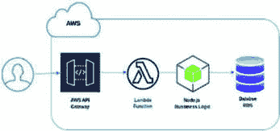

**图 1.10:** 无服务器架构

在这种无服务器架构中，一种变革性的应用程序开发和部署方法，消除了对传统服务器管理的需求。相反，它使开发者能够专注于编写代码，而云服务提供商则处理底层基础设施。以下是无服务器概念的视觉表示（见*图 1.10*）。

它是 AWS 无服务器架构的一个例子，其中使用 AWS API 网关来路由 REST API 调用，并基于与附加网关一起调用的路由 Lambda 函数。Lambda 函数可以用不同的语言编写，但我们认为它们是用具有实际业务逻辑的 Node.js 代码编写的，以执行对数据库的操作。AWS 云提供了各种数据库实例，如 DynamoDB、MySQL、PostgreSQL 等。此外，它可以轻松扩展以适应不断增长的工作负载。AWS 提供自动扩展功能，这意味着当负载激增时，它可以自动添加更多 EC2 实例，而当负载减少时，它可以减少实例。

| **方面** | **单体架构** | **微服务架构** | **无服务器架构** |
| --- | --- | --- | --- |
| 开发 | 开发和部署过程更简单 | 设置复杂，但独立服务促进可扩展性 | 专注于编写函数而不管理基础设施 |
| 可扩展性 | 由于整个应用程序都需要扩展，因此可扩展性有限 | 可扩展的，因为每个服务都可以独立扩展 | 根据需求自动扩展 |
| 维护 | 单一代码库使维护更容易 | 需要管理多个服务和通信 | 较少的维护开销；由云服务提供商管理 |
| 技术栈 | 灵活性有限；所有组件使用相同的技术栈 | 每个服务可以使用不同的技术，具有灵活性 | 对底层基础设施和运行时的控制有限 |
| 部署 | 部署过程简单；作为一个单一单元部署 | 由于多个服务，部署复杂 | 部署过程简化 |
| 资源利用率 | 资源利用率可能效率低下 | 根据需要扩展服务，实现优化的资源利用率 | 按需执行，实现高效的资源利用率 |
| 成本 | 初期成本较低；长期运营成本较高 | 初始设置成本较高；随着规模扩大可能节省成本 | 对于低流量应用，按使用付费模式可能具有成本效益 |
| 错误隔离 | 一个部分的错误可能影响整个应用程序 | 错误被隔离到特定的服务中；其他服务不受影响 | 由云服务提供商管理，可能存在供应商锁定风险 |
| 灵活性 | 由于单体结构导致的灵活性有限 | 可以使用不同的技术和语言，具有灵活性 | 对底层基础设施和运行时的控制有限 |

**表 1.1:** 架构比较

*表 1.1* 提供了在 Node.js 中单体、微服务和无服务器架构的各个方面比较，概述了各自的优缺点。根据具体项目需求，一种架构可能比其他架构更适合。

让我们通过编程创建一个基本的 HTTP 和 HTTPS 服务器。

# 编写 HTTP 服务器

现在当 Node.js 在你的系统中正确设置并运行时，让我们通过 HTTP 服务器来执行著名的 "`**Hello World**`"。

让我们创建一个名为 index.js 的文件，并将以下代码复制到其中：

`const http = require('http');`

`const hostname = '127.0.0.1';`

`const port = 3000;`

`const server = http.createServer((req, res) => {`

`res.statusCode = 200;`

`res.setHeader('Content-Type', 'text/plain');`

`res.end('Hello World');`

`});`

`server.listen(port, hostname, () => {`

``console.log(`Server running at http://${hostname}:${port}/`);``

`});`

在提供的代码中，"`**http**`" 是 Node.js 默认提供的模块，因此无需单独安装。然而，对于 Node.js 内置模块之外的模块，你可以从 npm 库中安装它们。

npm 库包含数百万个注册的包，你可以使用以下代码进行安装：

`$ npm install package-name`

`ex. npm install express`

包名可以是 "`**body-parser**`", "`**express**`", "`**moment**`" 等等。

http 模块创建了一个运行在特定端口 3000 上的 http 服务器。理想情况下，Node.js 应该运行在端口 3000 上，但开发者可以分配不同的端口，如 3001、4000 或任何端口。只需确保端口号不与其他系统上的应用程序冲突即可。

要运行程序，打开源代码目录的控制台，粘贴以下命令：

`$ node index.js`

一旦运行，打开浏览器并访问 URL http://localhost:3000；它将打印"`**Hello World**`"。

**图 1.11**：HTTP 服务器程序输出

# 使其成为 HTTPS

我们刚刚创建的服务器不提供安全的服务 API 的方式。通常，我们需要使用 HTTPS 而不是 HTTP 来服务 API。

HTTP 不加密数据，因此在传输过程中信息泄露时并不安全。另一方面，HTTPS 在客户端到服务器的请求期间加密数据，使其变得安全。

让我们用 https 服务器重写相同的代码。对于 HTTPS，我们需要 SSL 证书。

首先，让我们创建一个自签名的 SSL 证书：

1.  打开控制台，如果系统未安装`**openssl**`，则安装。

1.  对于 Debian Linux（如 ubuntu），可以使用`**apt**`命令进行安装：

    `$ sudo apt install openssl`

1.  对于 Centos、Fedora 和 Rocky Linux，可以使用 yum 来安装`**openssl**`：

    `$ sudo yum install openssl`

1.  按照以下方式将`**openssl**`目录设置为：

    `$mkdir openssl`

    `$cd openssl`

1.  使用以下命令请求生成`**ssl**`证书：

    `$ openssl req -newkey rsa -x509 -sha256 -days 365 -nodes -out ssl.crt -keyout ssl.key`

    让我们了解前面的命令：

    +   `**-newkey rsa**`：使用`**rsa**`算法创建新密钥，默认 2048 位

    +   `**-x509**`：创建 X.509 证书

    +   `**-sha256**`：使用 256 位 SHA（安全散列算法）

    +   `**-days 365**`：证书的有效期为 365 天。您可以使用任何正整数

    +   `**-nodes**`：创建不带密码的密钥。

    +   `**-out ssl.crt**`：指定要写入新创建证书的文件名。您可以指定任何文件名。

    +   `**-keyout ssl.key**`：指定要写入新创建的私钥的文件名。您可以指定任何文件名。

一旦输入此命令，它将提示以下问题（如图*图 1.12*所示）。按回车键直到完成，并检查包含`**ssl.crt**`和`**ssl.key**`文件的文件夹：

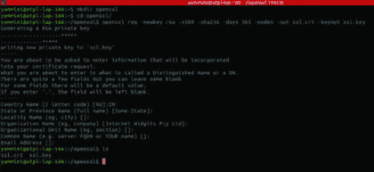

**图 1.12**：OpenSSL 证书生成

现在创建`**main.js**`，并写入以下代码以创建`**https 服务器**`，端口为`**3000**`：

`// 导入 https 模块`

``const https = require(`https`);``

`//导入 fs 模块以读取文件`

``const fs = require(`fs`);``

`const options = {`

``key: fs.readFileSync(`./openssl/ssl.key`),``

``cert: fs.readFileSync(`./openssl/ssl.crt`)``

`};`

`// 在端口 3000 上创建 https 服务器`

`https.createServer(options, (req, res) => {`

`res.writeHead(200);`

``res.end(`hello world from https server \n`);``

`}).listen(3000);`

使用 node main.js 运行代码，并在浏览器中打开 https://localhost:3000，它将显示"`**来自 https 服务器的 hello world**`"。这样，就使用非常基础的示例构建了一个安全的 https 服务器。

# 使用集群模块

Node.js 可以通过集群模块轻松地使应用程序高度可扩展。集群通过创建子进程来提高另一个进程，从而将单线程分割成多线程。由于这一点，高流量负载被减少并分配到具有相同端口的线程的不同实例上。它是 Node.js 的内置模块。由于 Node.js 支持异步单线程，有时当阻塞函数更多时，应用程序性能会下降。集群对于提高性能来说是最重要和最有用的。

Node.js 服务器启动多个传入请求。首先，它指向主进程，也称为主进程或主节点，这是一个单一的进程。之后，它从父进程中分裂出不同的子进程。子进程被称为工作进程，可以有多个，并且拥有自己的事件循环来同时处理它。集群有两种进程分配方式。第一种是默认的轮询方法，其中主节点监听服务器请求并以等圆周顺序将它们发送到工作进程，另一种是基于套接字的方式，其中主节点监听并仅分配想要执行该进程的感兴趣的工作进程。

集群架构利用多个相互连接的服务器的功能，提高了当代应用程序的性能、可靠性和可扩展性。*图 1.13*展示了集群节点如何无缝协作，高效地管理传入请求。

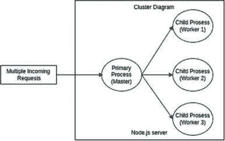

**图 1.13:** 集群图

# 无集群模块编程示例

创建一个名为`**without_cluster.js**`的文件，并保存以下代码：

`//导入 http 模块以创建服务器`

`const http = require('http');`

`// 创建服务器和测试 API`

`http.createServer(function (req, res) {`

`if (req.url === "/api/test" && req.method === "GET") {`

`console.time('API_without_cluster');`

`let result = 0;`

`for (let i = 0; i < 5000000; i++) {`

`result += i;`

`}`

`console.timeEnd('API_without_cluster');`

``console.log(`结果 = ${result} - 在进程 ${process.pid}`);``

``res.end(`结果 = ${result}`);``

`}`

`}).listen(3001);`

使用以下命令运行代码：

`$ node without_cluster.js`

现在我们可以通过在浏览器中使用 URL http://localhost:3001/api/test 来测试它，并通过多次点击刷新按钮连续调用它多次。

以下输出将在控制台显示：

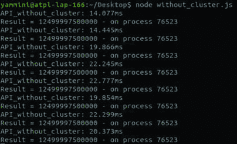

**图 1.14:** 无集群输出

# 有集群模块编程示例

现在创建另一个名为`**cluster.js**`的文件，并保存以下代码：

`//导入集群模块`

`const cluster = require('cluster');`

`//导入 http 模块以创建服务器`

`const http = require('http');`

`//检查是否为主进程，然后通过 fork()方法创建子进程`

`if (cluster.isMaster) {`

`const numWorkers = require('os').cpus().length;`

``console.log(`Master ${process.pid} started`);``

``console.log(`Number of workers => ${numWorkers}`)``

`for (var i = 0; i < numWorkers; i++) {`

`cluster.fork();`

`}`

`cluster.on('exit', (worker, code, signal) => {`

``console.log(`worker ${worker.process.pid} died`);``

`console.log("Let's fork another worker!");`

`cluster.fork();`

`});`

`} else {`

`// 它是工作进程，因此使用相同的 3000 端口运行多个进程`

``console.log(`Worker ${process.pid} started`);``

`http.createServer(function (req, res) {`

`if (req.url === "/api/test" && req.method === "GET") {`

`console.time('API_with_cluster')`

`let result = 0;`

`for (let i = 0; i < 5000000; i++) {`

`result += i;`

`}`

`console.timeEnd('API_with_cluster');`

``console.log(`Result = ${result} - on process ${process.pid}`);``

``res.end(`Result = ${result}`);``

`}`

`}).listen(3000);`

`}`

现在运行以下命令来执行代码：

`$ node cluster.js`

打开浏览器，输入 URL http://localhost:3000/api/test 并多次调用它。控制台将给出以下输出：

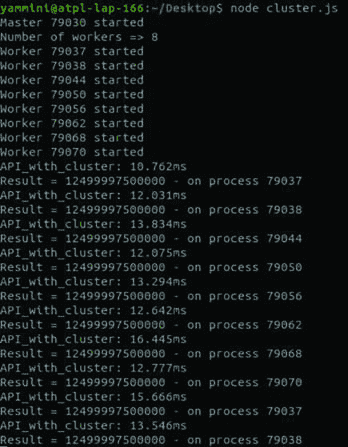

**图 1.15：使用集群的输出**

如我们所见，当我们使用集群模块时，响应时间在 12 到 16 毫秒之间，而没有使用集群模块时，时间会更高——14 到 22 毫秒。这里的差异不大，因为我们使用的代码几乎没有任何逻辑、数据库操作或其他 IO。时间可能会随着实现而变化，因此集群在计算量大时很有用，但如果计算量不是很大，可能就不太有益。基本上，集群允许我们运行多个工作进程，这些进程可以利用多个 CPU。

集群模块还可以用来设置主从结构，其中主进程监控从进程，如果从进程停止或崩溃，主进程可以启动另一个从进程。这样，我们可以在应用程序中安全地处理错误，并防止应用程序完全崩溃。在*第四章，规划应用程序*中，我们将看到它的实际应用。

# 结论

在本章中，我们介绍了 Node.js 以及它提供的功能及其优缺点。我们学习了如何安装 Node.js 并创建了一个简单的服务器。我们还熟悉了 Node.js 如何使用事件循环和不同的架构类型。后来，我们使用 HTTP 和 HTTPS 创建了一个网络服务器。最后，我们看到了如何使用集群模块。

在本章中，我们使用了 JavaScript 作为编程语言，当项目规模变大时，它是不易维护的。更好的方法是使用 TypeScript 而不是 JavaScript。在下一章，我们将学习 TypeScript 的基础知识。

# 多项选择题

1.  Node.js 是什么，以下关于它的哪个陈述是正确的？

    1.  Node.js 是一个封闭源代码的 JavaScript 运行时环境

    1.  Node.js 只能在 Windows 操作系统上使用

    1.  Node.js 主要基于 Python 代码

    1.  Node.js 是一个开源的 JavaScript 运行时环境，可以在各种操作系统上使用

1.  Node.js 通常用于哪些类型的应用？

    1.  Node.js 主要用于桌面应用和游戏

    1.  Node.js 主要用于移动应用开发

    1.  Node.js 通常用于单页应用（SPAs）、实时应用、物联网（IoT）设备应用和数据流应用

    1.  Node.js 仅用于基于 Web 的电子邮件服务，如 Gmail

1.  使用 Node.js 进行实时应用的关键优势之一是什么？

    1.  Node.js 是构建实时应用的唯一选择

    1.  Node.js 为实时应用提供图形用户界面

    1.  Node.js 通过 WebSockets 提供持续连接，从而实现更快的响应时间

    1.  Node.js 只能用于音频和视频流应用

1.  如何检查系统上安装的 Node.js 版本？

    1.  在终端运行命令 `**node version**`

    1.  在终端运行命令 `**node info**`

    1.  在终端运行命令 `**node --v**`

    1.  在终端运行命令 `**node -v**`

1.  Node.js 事件循环的关键特征是什么？

    1.  它通过并行执行阻塞函数来提高性能

    1.  它在移动到下一个操作之前等待所有函数完成

    1.  它在 Node.js 应用程序中处理渲染和用户界面任务

    1.  它管理异步操作，确保非阻塞执行

1.  微服务架构与单体架构有何不同？

    1.  微服务使用单一代码库的所有组件

    1.  微服务紧密耦合，作为一个单一的应用程序运行

    1.  微服务松散耦合，由独立可部署的服务组成

    1.  微服务仅通过 RESTful API 进行通信

1.  何时无服务器架构是应用开发的合适选择？

    1.  当你想要专注于编写代码而不必担心服务器配置时

    1.  当应用程序有一个单体代码库时

    1.  当你想最小化开发成本时

    1.  当你需要完全控制服务器管理时

1.  HTTP 模块中哪个方法用于在 Node.js 中创建 HTTP 服务器？

    1.  `**http.createServer()**`

    1.  `**http.request()**`

    1.  `**http.get()**`

    1.  `**http.post()**`

1.  使用 Cluster 模块创建 Node.js 进程集群的方法是哪个？

    1.  `**cluster.start()**`

    1.  `**cluster.fork()**`

    1.  `**cluster.create()**`

    1.  `**cluster.spawn()**`

1.  Cluster 模块如何增强 Node.js 应用程序的性能？

    1.  通过创建 Node.js 应用程序的多个实例

    1.  通过更有效地管理数据库连接

    1.  通过减少可用的 CPU 核心数

    1.  通过减慢应用程序的响应时间

# 答案

1.  d

1.  c

1.  c

1.  d

1.  d

1.  c

1.  d

1.  a

1.  b

1.  a

# 进一步阅读

[`nodejs.org/en`](https://nodejs.org/en)
