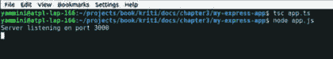
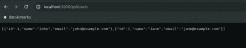
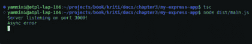
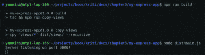

# 第三章

# Express.js 概述

# 介绍

Express.js 是 Node.js 中高度认可和频繁使用的开源框架，它促进了网络应用程序和 REST API 的创建。它是一个强大且适应性强的框架，受到寻求构建高效和可扩展网络应用程序的开发者的青睐。

由于其简单性、灵活性和可扩展性，它是一个非常受欢迎的框架。其受欢迎程度可以通过查看每周的平均下载量来观察。根据 npm 注册表，Express.js 包每周平均下载量超过 2700 万次。

# 结构

在本章中，我们将讨论以下主题：

+   定义 Express.js

+   Express.js 的优势和局限性

+   Express.js 安装和创建基本应用程序

+   Express.js 的核心功能

+   安全性和性能最佳实践

# 定义 Express.js

在软件开发中，一个 **框架** 是一段预写的代码，它提供了一套通用功能、工具和指南，用于构建应用程序。它本质上是一种结构化和标准化的软件开发方式，通过提供可跨多个项目重用的预存在组件和模式来帮助减少开发时间和努力。

Express.js 是 Node.js 中最受欢迎的开源、快速和灵活的框架之一。它遵循“*无偏见*”的方法，这意味着它不强制执行任何特定的架构或模式，并允许开发者使用他们偏好的工具和技术来构建他们的应用程序。它提供了一套用于使用 Node.js 构建网络应用程序和 API 的工具和功能，包括处理 HTTP 请求和响应、路由、中间件、模板引擎、静态文件服务等等。它拥有一个庞大且活跃的开发者社区，他们为它的开发和维护做出贡献。

Express.js 以其性能和可扩展性而闻名，拥有轻量级和高效的内核，使其能够处理高流量负载。总的来说，Express.js 是一个功能强大的 Node.js 框架，拥有开发安全且可扩展网络应用程序所需的所有功能。

# Express.js 的优势

与其他网络应用程序框架相比，Express.js 有几个优势，包括：

+   **简约**

    Express.js 具有直观的设计，有助于降低新接触框架的开发者的学习曲线，使他们能够更快、更轻松地开始他们的项目。

+   **灵活**

    Express.js 是一个高度可定制和灵活的框架。其灵活性的一个例子是其中间件系统，它允许开发者向传入的请求或传出的响应添加自定义逻辑。

+   **可扩展**

    Express.js 提供了使用 JavaScript 承诺和 `**async**`/`**await**` 语法进行异步编程的内置支持，这使得开发者能够编写可扩展的代码，能够处理大量的并发请求。它非常适合构建大型、复杂的应用程序，能够处理高流量和数据。

+   **与 Node.js 的兼容性**

    Express.js 是专门为与 Node.js 一起工作而构建的，这意味着它与 Node.js 及其相关库高度兼容。Express.js 被设计为利用 Node.js 的特性和功能，例如其事件驱动架构和非阻塞 I/O 模型。它还能够无缝集成其他 Node.js 库和工具。

+   **协作社区**

    它拥有一个非常庞大且活跃的社区，这是它的一个关键优势。这确保了框架不断发展和改进。此外，它还为开发者提供了宝贵的支持，使他们更容易解决问题并从他人的经验中学习。

Express.js 不仅提供了上述好处，还提供了许多其他优势。

# Express.js 的局限性

就像每个硬币都有两面一样，Express.js 也有其局限性，如下所示：

+   **与客户端应用程序不兼容**

    Express.js 主要关注服务器端 Web 开发，因此它不用于构建复杂的客户端应用程序。然而，它可以与其他工具和框架结合使用来构建全栈应用程序。

+   **缺乏内置功能**

    Express.js 是一个极简框架，这意味着它不提供某些其他框架提供的所有内置功能和工具。开发者可能需要安装和配置额外的模块或库，以向他们的应用程序添加某些功能。

+   **不一致性**

    由于 Express.js 是一个极简框架，它不强制执行任何标准的方式来结构化应用程序或组织其代码。因此，开发者可以自由地设计他们的结构，这可能会给试图为任何现有项目做出贡献的新开发者带来挑战。

与其他框架相比，Express.js 的局限性更少，并且提供了更多的好处，使其成为开发者易于接触的框架。

# Express.js 安装和创建基本应用程序

在安装 Express.js 之前，请确保您的机器上已安装 Node.js，然后您可以执行以下步骤：

1.  创建一个新的项目目录，并使用命令提示符或终端进入该目录。

    `$ mkdir my-express-app`

    `$ cd my-express-app`

    初始化一个新的 Node.js 项目。这将创建一个位于项目目录中的 `**package**`**.**`**json**` 文件。

    `$ npm init`

1.  使用以下命令安装 `**Express.js**` 和 TypeScript 依赖项：

    `$ npm install express typescript --save`

    使用`--save`选项将自动更新您的`**package.json**`文件，包括已安装的包及其版本。

1.  将 express.js 作为开发依赖项安装到 typescript

    `$ npm install @types/express @types/node --save-dev`

1.  在您的项目的根目录中创建一个名为`**app.ts**`的新文件，并添加以下代码：

    `import * as express from 'express';`

    `import { Request, Response } from 'express';`

    `const app: express.Application = express();`

    `app.get('/', (req: Request, res: Response) => {`

    `res.send('Hello World!');`

    `});`

    `app.listen(3000, () => {`

    `console.log('Server listening on port 3000');`

    `});`

1.  使用`**tsc**`命令将 TypeScript 代码编译成 JavaScript：

    `$ tsc app.ts`

1.  使用`**node**`命令运行服务器：

    `$ node app.js`

    

    **图 3.1：编译并运行 Express 应用程序**

现在您应该能够在您的网页浏览器中访问`**http://localhost:3000**`，并看到页面显示的消息为`"**Hello World!**"`：

**图 3.2：启动 Express 应用程序**

# Express.js 的核心功能

Express.js 配备了几个基本功能，其中一些如下：

# REST API

RESTful API 是一种遵循表示状态转移（REST）架构风格的基于 Web 的 API。它是一种设计轻量级、可维护和可扩展的 Web 服务的方式。RESTful API 使用 HTTP 方法与由 URI 标识的资源进行交互。

在构建 REST API 时，应遵循某些原则。这些原则是一组设计应用程序的指南。

# REST 原则

总共有六个指导原则。一般来说，构建应用程序时并不强制遵循所有这些原则；然而，使用这些原则可以确保更好的性能、效率和可扩展性。这些原则是：

+   **客户端-服务器架构**

    系统应分为客户端和服务器。客户端应通过网络与服务器通信。服务器端和客户端的责任必须是独立的，并由各自的一方实现。这允许客户端和服务器独立进化。

+   **无状态设计**

    当客户端需要从服务器获取任何数据时，它会向后端服务器发送一个请求。这个原则指出，客户端到服务器的每个请求都必须包含服务器理解请求所需的所有信息。服务器不得存储关于客户端的会话状态。

+   **可缓存**

    有时，有些响应并不经常改变。这些响应可以被缓存以提高性能。响应应该定义为可缓存的，这样客户端也可以知道是否可以重用相同的数据或应该再次请求。

+   **统一接口**

    统一接口通过使其更加模块化来简化架构，并允许更轻松的开发和部署。定义统一接口有四个约束：

    +   **资源标识**：资源可以通过请求 URI 进行标识。例如，/projects 清楚地表明我们正在请求项目列表。URI /projects/23 表示我们正在使用唯一 ID 23 请求一个项目。

    +   **通过表示进行资源操作**：资源是一个通过 URI 标识的概念性实体，表示是资源在网络中传输时的形式。表示可以是 JSON、XML、HTML 等。通过发送或接收这些表示，客户端操作资源。

        一个项目可以表示（以 JSON 格式）为

        `{`

        `"name":"Mobile App",`

        `"description":"This project is to manage development of Mobile App"`

        `}`

    +   **自描述消息**：在服务器和客户端之间传输的消息应包含足够的信息来描述如何处理该消息。这有助于解耦客户端和服务器。让我们考虑一个请求：

        `GET /projects/23 HTTP/1.1`

        `Host: example.com`

        `Accept: application/json`

        上述内容可以是客户端向服务器发出的请求。这清楚地表明我们正在通过 HTTP 向 example.com 主机发出 GET 请求，并希望使用 Accept 头以 JSON 格式接收响应。让我们看看这个请求的示例响应：

        `HTTP/1.1 200 OK`

        `Content-Type: application/json`

        `Content-Length: 122`

        `{`

        `"id": 23,`

        `"name":"Mobile App",`

        `"description":"This project is to manage development of Mobile App"`

        `}`

        上述响应显示请求的状态为`**200 OK**`，返回的数据是 JSON 格式，并且正文包含请求的项目。

    +   **超媒体作为应用程序状态引擎（HATEOAS）**：该原则表示客户端应完全通过应用程序服务器动态提供的超媒体与 RESTful 应用程序交互。客户端将只有应用程序的初始 URI。进一步需要的超链接将包含在响应中。这允许动态发现操作，并有助于解耦客户端和服务器。这里的每次通信都会有自描述的消息。

+   **分层架构**

    这个原则坚持认为应用程序架构应该分为分层层。每一层执行特定的任务。让我们考虑一个简单的 Web 应用程序。其中的层可以是：

    +   **客户端层**：用户与此层交互，例如 Web 应用程序或移动应用程序。

    +   **API 网关层**：入口点，每个请求都通过这一层。

    +   **应用层**：处理处理用户请求的业务逻辑。

    +   **服务层**：包含辅助服务，如通知服务等。

    +   **数据访问层**：包含获取、存储或更新数据所需的逻辑。

    +   **数据库层**：与数据库通信以获取或存储数据的层。

    这些层应该能让人了解其原理。这是一个示例，不同的系统可能会有不同的层。

+   **按需代码**

    这是一个可选原则。它允许客户端通过提供代码来扩展客户端功能。在这种情况下，客户端发起请求，服务器响应一个通常可以在客户端运行的脚本。这个原则允许灵活性和即时定制客户端应用程序。然而，我们必须小心，并应考虑安全性方面。

虽然 REST 原则确实增强了 API 的可扩展性、性能和可维护性，但并非所有原则在所有情况下都是强制性的。最后一个原则——按需代码是可选的。然而，为了实现 REST 架构的全部好处，建议尽可能遵循这些原则。

# 构建 REST API

Express.js 非常适合构建 RESTful API，它支持 HTTP。它允许开发者轻松处理 HTTP 请求和响应。HTTP 有不同类型的请求方法，如`**GET**`、`**POST**`、`**PUT**`、`**DELETE**`、`**PATCH**`、`**HEAD**`。

让我们构建一个 REST API，使用 HTTP 的 GET 方法获取用户列表。

我们已经在上一章中创建了一个基本的 typescript 项目，所以让我们以那个项目为起点，并在其中安装`**express**`。

`$ npm install express --save`

在 REST API 中，`**body-parser**`是一个非常有用的 npm 包，用作 Node.js 解析中间件。它提取传入请求的正文部分，并根据`**Content-Type**`请求头进行解析。解析后的正文数据随后通过`**req.body**`属性提供。让我们使用 npm 包管理器安装它：

`$ npm install body-parser --save`

此外，让我们安装 Express 和`**body-parser**`的类型定义作为开发依赖项：

`$ npm install -D @types/express @types/body-parser`

现在让我们更新项目根目录下的 `**main.ts**` 文件，添加以下代码：

`import express from 'express';`

`import * as bodyParser from 'body-parser';`

`import { users } from "./users/user";`

`import { Application } from 'express';`

`const app: Application = express();`

`app.use(bodyParser.json());`

`app.get('/api/users', (req, res) => {`

`res.json(users);`

`});`

`app.listen(3000, () => {`

`console.log('Server listening on port 3000');`

`});`

接下来，在`**lib**`目录下的`**user**`目录中创建一个`**user.ts**`文件，并放入以下代码：

`interface User {`

`id: number;`

`name: string;`

`email: string;`

`}`

`export const users: User[] = [`

`{ id: 1, name: 'John', email: 'john@example.com' },`

`{ id: 2, name: 'Jane', email: 'jane@example.com' },`

`];`

要运行服务器，我们需要使用 `**tsc**` 编译 TypeScript 代码，并使用 node 启动服务器：

`$ tsc`

`$ node dist/main.js`

现在，我们可以使用 Postman/curl 等工具测试 API，或者直接通过 URL `http://localhost:3000/api/users` 打开浏览器，它将返回以下 JSON 输出：

`[{"id":1,"name":"John","email":"john@example.com"},{"id":2,"name":"Jane","email":"jane@example.com"}]`

**图 3.3**：获取 API 用户

在前面的示例中，我们创建了一个返回用户列表的 API 端点 `/api/users`。我们还使用了 `**body-parser**` 中间件。我们将在本章后面学习中间件。

# 路由

Express.js 提供了一个简单且灵活的路由系统，允许开发者为处理传入的 HTTP 请求定义 URL 路由。Express.js 中的路由是指定义和处理 Web 应用程序和 API 的端点（URL 路径）的机制。

这是任何 Web 框架的关键方面，因为它有助于确定应用程序如何响应用户请求。在 Express.js 中，路由是通过使用 `**express.Router()**` 类来完成的，该类创建模块化、可挂载的路由处理程序。路由器由路由方法、路由路径和回调处理程序组成。

`app.METHOD(PATH, HANDLER)`

`**app**` : 它是 express 的一个实例。

`**METHOD**` : 它是一个小写的 HTTP 请求方法。

`**PATH**` : 它是服务器上的一个路径。

`**HANDLER**` : 它是在路由匹配时执行的功能。

# 路由方法

最常用的方法如下：

`**GET**` : 它用于检索数据。

`**POST**` : 它用于创建或添加新数据。

`**PUT**` : 它用于更新现有数据。

`**DELETE**` : 它用于删除数据。

`**PATCH**` : 它用于部分更新现有数据。

`**OPTIONS**` : 它用于检索有关数据可用选项的信息。

`**HEAD**` : 它与 `GET` 方法类似，但仅检索响应头，而不检索响应体。

您还可以使用 `**app.all()**` 来处理所有 HTTP 方法。

`app.all('/', (req, res, next) => {`

`console.log('all method…')`

`next() // 将控制权传递给下一个处理程序`

`})`

# 路由路径

路径可以是字符串、字符串模式或正则表达式。

此路由路径将匹配对 `**/users**` 特定字符串的请求。

`app.get('/users, (req, res) => {`

`res.send('users')`

`})`

此路由路径将与字符串模式（如 `**abcd**`、`**abbcd**`、`**abbbcd**` 等）匹配。

`app.get('/ab+cd', (req, res) => {`

`res.send('ab+cd')`

`})`

此路由路径将匹配蓝莓和草莓、树莓等，但不匹配 `**blueberriesfruit**`、`**strawberriesfruit**` 等。

`app.get(/.*berries$/, (req, res) => {`

`res.send('/.*berries$/')`

`})`

这些是定义路由路径的不同方式。

# 路由参数

Express.js 在基于字符串的路径中对待某些字符的方式与它们的正则表达式对应物不同。

例如，?、+、* 和 () 都是它们正则表达式对应物的子集。另一方面，当用于基于字符串的路径时，连字符 (-) 和点 (.) 被字面地解释。

考虑以下示例：

`app.get('/projects/:projectCode', function(req, res) {`

`var projectCode = req.params.projectCode;`

`// 对项目代码进行操作`

`res.send('项目代码: ' + projectCode);`

`});`

`app.get('/users/:user-email', function(req, res) {`

`var userEmail = req.params['user-email'];`

`// 对用户邮箱进行操作`

`res.send('用户邮箱: ' + userEmail);`

`});`

`app.get('/files/:file_name.pdf', function(req, res) {`

`var fileName = req.params['file_name'];`

`// 对文件名进行操作`

`res.send('文件名: ' + fileName);`

`});`

在这个例子中，有三个参数包含连字符和点的路由。第一个路由 `**/projects/:projectCode**` 接受一个项目代码参数，它可以包含连字符。第二个路由 `**/users/:user-email**` 接受一个用户邮箱参数，它可以包含连字符。第三个路由 `**/files/:file_name.pdf**` 接受一个文件名参数，它可以包含连字符并以 .pdf 结尾。

# 路由处理器

当在 Express.js 中匹配路由时，它可以有一个或多个与之关联的处理函数，这些函数将被执行。路由处理器负责处理请求、访问数据并向客户端返回响应。

让我们来看以下示例：

`app.get('/api/users', (req, res) => {`

`res.json(users);`

`});`

在这个例子中，路由处理器函数是 `**(req, res) => {…}**`，它在接收到与模式 `**/api/users**` 匹配的 URL 路径的 `**GET**` 请求时执行。`**req**` 参数包含有关传入请求的信息，例如请求头和参数，而 `**res**` 参数用于向客户端发送响应。

# 中间件

Express.js 支持中间件函数，可以根据所需的自定义逻辑修改传入的请求或传出的响应。Express.js 中的中间件是指在客户端向服务器发送请求时按特定顺序执行的一系列函数。这些函数可以访问请求和响应对象，并根据需要修改它们。中间件函数可用于各种目的，如日志记录、身份验证、错误处理等。

在 Express.js 中，可以使用 `**use()**` 方法将中间件函数添加到应用程序或特定路由。

在构建 REST API 的过程中，我们之前已经使用了 body-parser 作为中间件。这个中间件是针对每个路由，通过 `**app.use()**` 传入的，例如。

`app.use(bodyParser.json());`

另一个**中间件示例**，你不想在每个路由上使用它，例如在特定路由上的用户验证。它们按照添加的顺序执行，并且可以使用 `**next()**` 函数链接在一起，以将控制权传递给堆栈中的下一个中间件函数。

`// 验证中间件`

`const validate = (req, res, next) => {`

`const { name } = req.body;`

`if (!name) {`

`return res.status(400).send('Name is required');`

`}`

`next();`

`};`

`// 路由`

`app.post('/users', validate, (req, res) => {`

`const { name } = req.body;`

``res.send(`Hello, ${name}!`);``

`});`

在这个例子中，验证中间件函数被定义为检查名称参数是否存在于请求体字符串中。如果不存在，中间件会发送一个带有错误消息的 400 错误请求响应。如果名称参数存在，中间件会调用 `**next()**` 函数将控制权传递给下一个中间件或路由处理程序。

验证中间件随后在 ``**/user**`` 路由处理程序中作为第二个参数使用，以确保在生成用户响应之前名称参数存在。

**图 3.4:** Post API 用户无效请求

*图 3.5* 显示了结果 `"**Hello, Yamini!**"`：

**图 3.5:** Post API 用户有效输入名称

# 错误处理

错误处理是构建健壮应用程序的重要方面。该框架提供了一些处理错误的方法：

# 内置错误处理

Express.js 提供了一个内置的错误处理中间件函数，可用于处理应用程序中的错误。此中间件函数可用于捕获在应用程序执行期间发生的任何未处理的错误。

在 Express.js 中，另一种处理错误的方法是利用具有错误优先回调或函数的中间件函数。以下是一个演示如何实现的示例：

`import express, { Request, Response, NextFunction } from 'express';`

`const app = express();`

`app.get('/', (req: Request, res: Response) => {`

`throw new Error('Oops! Something went wrong.');`

`});`

`app.use((err: Error, req: Request, res: Response, next: NextFunction) => {`

`res.status(500).send('Something went wrong!');`

`});`

`app.listen(3000, () => {`

`console.log('Server listening on port 3000!');`

`});`

在这个例子中，我们定义了一个具有单个路由的 Express 应用程序，该路由会抛出错误。然后我们使用内置的错误处理中间件函数 `**app.use**` 来捕获错误并向客户端发送带有消息的 `**500**` 状态码。

错误处理中间件函数接受四个参数：err、req、res 和 next。第一个参数（`**err**`）是抛出的错误，第二个参数（`**req**`）是请求对象，第三个参数（`**res**`）是响应对象，第四个参数（`**next**`）是一个用于将控制权传递给堆栈中下一个中间件函数的函数。

如果在任何一个中间件或路由处理函数中抛出错误，Express.js 将自动调用错误处理中间件函数，并将抛出的错误对象作为第一个参数。

**图 3.6：错误处理**

# 自定义错误处理

开发者也可以创建他们自己的自定义错误处理中间件来处理特定类型的错误。此中间件函数可以添加到中间件堆栈中，并用于捕获特定于应用程序的错误。

让我们更新 `**main.ts**` 文件，添加以下代码：

`import express, { Application, Request, Response, NextFunction } from 'express';`

`import { HttpException, NotFoundException } from './utils/errorHandler';`

`import * as bodyParser from 'body-parser';`

`import { users, Users } from "./users/user";`

`const app: Application = express();`

`app.use(bodyParser.json());`

`app.get('/api/users', (req, res) => {`

`res.json(users);`

`});`

`app.get('/users/:id', (req, res, next) => {`

`const userId = req.params.id;`

`const user = new Users();`

`const isUserExist = user.getUserById(userId);`

`if (!isUserExist) {`

``return next(new NotFoundException(`User with ID ${userId} not found`));``

`}`

`res.status(200).json(user);`

`});`

`app.use((err: HttpException, req: Request, res: Response, next: NextFunction) => {`

`const status = err.status || 500;`

`const message = err.message || 'Internal server error';`

`res.status(status).json({ error: message });`

`});`

`app.listen(3000, () => {`

`console.log('Server listening on port 3000!');`

`});`

在 `utils` 文件夹中创建 `**errorHandler.ts**` 文件，并将以下代码粘贴进去：

`export class HttpException extends Error {`

`status: number;`

`message: string;`

`constructor(status: number, message: string) {`

`super(message);`

`this.status = status;`

`this.message = message;`

`}`

`}`

`export class NotFoundException extends HttpException {`

`constructor(message: string = 'Not Found') {`

`super(404, message);`

`}`

`}`

现在更新 `**user.ts**` 文件，位于 `users` 目录中，添加以下代码：

`interface User {`

`id: number;`

`name: string;`

`email: string;`

`}`

`export const users: User[] = [`

`{ id: 1, name: 'John', email: 'john@example.com' },`

`{ id: 2, name: 'Jane', email: 'jane@example.com' },`

`];`

`export class Users {`

`public getUserById(userId) {`

`if (users.find(i => i.id == userId)) {`

`return true;`

`} else {`

`return false;`

`}`

`}`

`}`

在这个例子中，有一个自定义的 `**HttpException**` 类，它扩展了 Error 类并添加了一个状态属性。还有一个 `**NotFoundException**` 类，它扩展了 `**HttpException**` 类并将状态设置为默认的 404。

在 `**/users/:id**` 路由处理程序中，如果请求的用户未找到，则会抛出一个 `**NotFoundException**` 并传递给下一个函数，这会触发自定义错误处理中间件。

**图 3.7:** 用户未找到异常

自定义错误处理中间件检查错误是否是 `**HttpException**` 的实例，并使用状态和消息属性发送带有适当 HTTP 状态码的 JSON 响应。如果错误不是 `**HttpException**` 的实例，它将发送一个通用的 500 错误响应。

**图 3.8:** VsCode 编辑器中的示例代码

# 异步错误处理

在 Express.js 中，可以使用 try-catch 块或通过返回一个拒绝的 Promise 来处理异步错误。

在 `**main.ts**` 文件中添加以下代码：

`// 异步函数抛出错误`

`async function asyncFunction(): Promise<void> {`

`throw new Error('Async error');`

`}`

`// 调用异步函数的异步路由处理程序`

`app.get('/async-error', async (req: Request, res: Response, next: NextFunction) => {`

`try {`

`await asyncFunction();`

`res.send('Success');`

`} catch (error) {`

`next(error);`

`}`

`});`

`// 错误处理中间件`

`app.use((err: Error, req: Request, res: Response, next: NextFunction) => {`

`console.error(err.message);`

`res.status(500).send('Something broke!');`

`});`

现在用 `**$ tsc**` 编译并运行代码，然后使用 `**$ node dist/main.js**`。之后，用浏览器打开 `**http://localhost:3000/async-error**`，它会显示为 Something broke!

在这个例子中，我们有一个名为 `**asyncFunction**` 的异步函数，它会抛出一个错误。我们有一个路由处理程序调用此函数，并使用 try-catch 块捕获发生的任何错误。如果发生错误，则使用带有错误参数的下一个函数调用，将错误传递给错误处理中间件。

错误处理中间件函数接受四个参数：`err`、`req`、`res` 和 `next`。如果在调用此函数之前的任何中间件或路由处理程序中发生错误，它将被传递给此中间件函数。中间件函数将错误记录到控制台并向客户端发送一个 `**500 内部服务器错误**` 响应。

注意，在路由处理程序函数之前使用 `**async**` 关键字来指示它是一个异步函数。此外，在调用 `**asyncFunction**` 之前使用 `**await**` 关键字来等待函数完成，然后再继续执行下一行代码。

**图 3.9:** 异步错误 API

*图 3.10* 展示了终端输出：

**图 3.10:** 异步错误终端输出

在 Express.js 应用程序中正确处理错误非常重要，以确保应用程序健壮且可靠。

# 静态文件服务

在 Express.js 中，我们可以使用`**express.static()**`中间件函数提供静态文件，例如图像、CSS、JavaScript 文件等。

`app.use(express.static('public'));`

在前面的示例中，我们正在从公共目录提供静态文件。`**express.static()**`中间件函数接受一个参数，即包含静态文件的目录名称。

一旦设置好中间件，你可以通过指定相对于公共目录的 URL 来访问你的静态文件。例如，如果你在`**public/images**`目录中有一个名为`**profilePic.png**`的文件，你可以在`**http://localhost:3000/images/profilePic.png**`访问它。

**图 3.11:** 静态服务图像文件

# 模板引擎

在 Express.js 中，模板引擎用于生成 HTML 标记和动态渲染视图。模板引擎允许你创建带有占位符的模板，这些占位符可以在模板渲染时用实际数据替换。

Express.js 支持的流行模板引擎包括：

+   EJS（嵌入式 JavaScript）

+   Pug（以前称为 Jade）

+   Handlebars

+   Mustache

要在 Express.js 应用程序中使用模板引擎，你需要使用 npm 安装该引擎，并将其设置为应用程序配置中的默认视图引擎。然后你可以使用所选模板引擎的语法和功能创建视图。

打开终端，使用以下命令安装`**ejs**`的依赖项：

`$ npm install ejs --save`

一旦安装了`**ejs**`，我们可以尝试以下示例代码：

`app.set('view engine', 'ejs');`

`app.set('views', path.join(__dirname, 'views'));`

`app.get('/ejs', (req, res) => {`

`const data = {`

`title: 'My App',`

`message: 'Hello, I am from EJS !!'`

`};`

`res.render('index', data);`

`});`

创建`**index.ejs**`文件并粘贴 html 代码。

`<!DOCTYPE html>`

`<html>`

`<head>`

`<title><%= title %></title>`

`</head>`

`<body>`

`<h1><%= message %></h1>`

`</body>`

`</html>`

在这个示例中，我们使用`**<%= %>**`语法输出在路由处理程序中传递给视图的`"**title**"`和`"**message**"`变量。当视图渲染时，这些变量将被它们相应的值替换。

TypeScript 编译器处理生成 JavaScript 文件并将它们传输到`**dist**`文件夹的任务。然而，它不处理复制其他必要项目文件，如 EJS 视图模板。为了解决这个问题，你可以创建一个负责将所有附加文件复制到`**dist**`文件夹的构建脚本。

在编译你的 TypeScript 代码后，要自动将文件从视图文件夹复制到`**dist**`文件夹，你可以使用像`**copyfiles**`或 copy 这样的构建工具。

首先，使用以下命令在终端中安装`**copyfiles**`包作为开发依赖项：

`$npm install --save-dev copyfiles`

现在更新`**package.json**`中的脚本如下：

`"scripts": {`

`"build": "tsc && npm run copy-views",`

`"copy-views": "cpy 'views/*' dist/views/ --recursive"`

`}`

然后使用以下代码在终端中执行脚本：

`$ npm run build`

**图 3.12**：构建应用程序

运行应用程序后，您可以在网络浏览器中打开并导航到`**http://localhost:3000/ejs**`。这将显示浏览器中的 HTML 输出，如下面的图像所示。

**图 3.13**：浏览器 EJS 模板

# 安全和性能最佳实践

在使用 Express.js 开发应用程序时，有一些安全最佳实践需要遵循：

+   **使用安全的 HTTP 协议**：始终使用 HTTPS 而不是 HTTP，以确保客户端和服务器之间的安全通信。

+   **使用最新版本**：保持 Express.js 版本更新，并在可用时立即应用安全补丁。

+   **避免使用已弃用或易受攻击的包**：仅使用最新、维护良好的包，并避免使用已弃用或易受攻击的包。

+   **验证用户输入**：始终验证用户输入以防止注入攻击、跨站脚本（XSS）攻击和其他恶意活动。

+   **使用内容安全策略（CSP）**：通过限制页面可以加载的资源来实施内容安全策略（CSP），以防止跨站脚本（XSS）攻击。

    **示例**：

    `app.use((req, res, next) => {`

    `res.setHeader(`

    `'Content-Security-Policy',`

    `"default-src 'self'; script-src 'self' `'unsafe-inline'; img-src 'self' data:; font-src 'self' data:"`

    `);`

    `next();`

    `});`

    然后将 CSP 头设置在添加到 Express 应用的中间件函数中。在这个示例中，CSP 策略允许从同一域名加载脚本（`'unsafe-inline'`）。图像和字体也允许从同一域名以及 data:协议加载。

***   **实现速率限制**：实现速率限制以防止暴力攻击和其他涉及重复请求的攻击类型。

    **示例**：

    首先，使用 npm 安装`**express-rate-limit**`包：

    `$ npm install express-rate-limit`

    然后，引入该包并使用所需选项创建一个新的速率限制器对象：

    `const rateLimit = require("express-rate-limit");`

    `const limiter = rateLimit({`

    `windowMs: 15 * 60 * 1000, // 15 分钟`

    `max: 100 // 限制每个 IP 每 windowMs 100 次请求`

    `});`

    在这个示例中，我们创建了一个速率限制器，限制每个 IP 地址在 15 分钟内每 100 次请求。

    最后，将速率限制中间件应用到所需的路由：

    `app.use(limiter);`

    `app.get("/", (req, res) => {`

    `res.send("Hello World!");`

    `});`

    现在，每个到达根路由（`"`/`"`) 的请求都将与速率限制器进行核对。如果 IP 地址在指定的时间窗口内超过了最大请求数量，中间件将返回一个 429 `"**Too Many Requests**"` 错误。

    +   **使用 helmet**：使用 helmet 中间件向 HTTP 响应添加额外的安全头，例如 X-XSS-Protection、X-Content-Type-Options 和 X-Frame-Options 头。

    **示例**：

    `import helmet from "helmet";`

    `// 使用 Helmet 中间件`

    `app.use(helmet());`

    `// 向应用程序添加路由`

    `app.get("/", (req, res) => {`

    `res.send("Hello, world!");`

    `});`

    在这个示例中，从 helmet 包中导入 helmet 中间件，并使用 `**app.use(helmet())**` 在应用程序中使用它。这将自动向 HTTP 响应添加安全头，例如将 X-Content-Type-Options 头设置为 `**nosniff**` 以防止浏览器将响应内容解释为不同的 MIME 类型。

    注意，这只是一个基本示例，根据您应用程序的具体安全需求，可能还需要额外的配置。

    +   **使用安全 cookies**：当使用 cookies 时，设置 secure 和 `**httpOnly**` 标志以防止跨站脚本（XSS）和跨站请求伪造（CSRF）攻击。

    **示例**：

    `import cookieParser from 'cookie-parser';`

    `app.use(cookieParser('secret'));`

    **使用代码检查器和安全扫描器**：使用代码检查器和安全扫描器来检测和修复代码中的潜在安全问题。最佳示例是 `**EsLint**`。**

    `res.cookie('myCookie', 'someValue', {`

    `httpOnly: true,`

    `sameSite: 'strict',`

    `secure: true`

    `});`

    `res.send('Cookie set successfully!');`

    `});`

    在这个示例中，cookie-parser 中间件用于解析传入请求中的 cookies。secret 参数用于签名和加密 cookies。

    `/set-cookie` 路由使用 `**res.cookie()**` 方法设置一个新的 cookie。httpOnly 选项防止 JavaScript 代码访问 cookie，使得攻击者使用跨站脚本（XSS）攻击窃取 cookie 更加困难。sameSite 选项限制 cookie 的作用域为设置它的同一站点，降低跨站请求伪造（CSRF）攻击的风险。secure 选项确保 cookie 只通过 HTTPS 发送，从而保护它免受网络攻击者的拦截。

    通过遵循安全 cookie 处理的最佳实践，您可以显著提高 Express.js 应用程序的安全性。

    +   **实施安全的部署流程**：实施一个安全的部署流程，包括安全配置、代码审查和测试，以防止安全漏洞被引入生产环境。

**遵循这些安全最佳实践，可以帮助确保您的 Express.js 应用程序安全，并防止常见的安全威胁**。

在使用 Express.js 开发应用程序时，有一些性能最佳实践需要遵循：

+   **避免使用同步函数**：建议使用异步代码，因为生产环境中的同步代码会减慢应用程序的运行速度，因此尽量避免不必要的同步函数，并使用 `**async**`/`**await**` 与承诺一起使用。

+   **异常处理**：始终使用 try catch 在代码级别处理异常，以防止在运行时破坏应用程序。

+   **减少中间件使用**：仅使用所需的中间件，避免过度使用。中间件可能非常消耗资源，可能会减慢应用程序的运行速度。

+   **缓存**：对频繁请求的数据（如静态文件或 API 响应）实现缓存。通过缓存这些数据，您可以减少服务器需要处理请求数量，从而显著提高应用程序的响应时间。

+   **使用集群**：使用 Node.js 集群模式来利用所有可用的 CPU 核心，并将负载均匀地分配到所有核心，从而提高应用程序的性能。

+   **自动重启应用程序**：确保如果应用程序在任何时候崩溃，则自动重启，因此请使用进程管理器或 PM2 或 Forever 等包来实现。

通过遵循这些推荐的最佳实践，您可以提升您的 Express.js 应用程序的性能，从而实现更快速、更高效的用户体验。

# 结论

在本章中，我们学习了 Express.js，这是一个流行的、强大的 Node.js Web 应用程序框架。我们了解了它的提供内容、优点和局限性。虽然它有一些局限性，但 Express.js 的好处，如活跃的社区、广泛的文档和对 REST API 开发的支撑，使其成为 Web 开发项目的绝佳选择。

在下一章中，我们将开始构建一个项目管理系统应用程序。我们将以此作为一个大练习来学习 TypeScript 和 Express.Js 的概念。

# 多项选择题

1.  Express.js 主要用于什么？

    1.  数据库管理

    1.  前端开发

    1.  构建 Web 应用程序和 API

    1.  机器学习

1.  与 Express.js 框架相关联的优点和缺点是什么？

    1.  优点包括其轻量级和极简设计，而缺点涉及复杂应用程序缺少内置功能。

    1.  优点包括为复杂应用程序提供广泛内置功能，而缺点涉及性能不佳。

    1.  优点包括为高流量应用程序提供自动扩展，而缺点涉及学习曲线挑战。

    1.  优点包括与数据库的无缝集成，而缺点涉及缺少路由支持。

1.  Express.js 路由对象的作用是什么？

    1.  为多个应用程序定义路由

    1.  创建中间件函数

    1.  处理应用程序中的错误

    1.  为应用程序的特定部分定义路由

1.  中间件在 Express.js 应用程序中扮演什么角色？

    1.  以托管静态文件

    1.  建立路由

    1.  管理传入的请求和响应

    1.  以便进行身份验证

1.  你如何在 Express.js 中处理路由参数？

    1.  使用 `req.routeParams` 对象

    1.  通过为每个参数定义单独的路由处理程序

    1.  直接从 URL 访问它们

    1.  使用 `req.params` 对象

1.  Express.js 中间件中的 `next()` 函数做什么？

    1.  结束请求-响应周期

    1.  将控制权传递给下一个中间件函数

    1.  向客户端发送响应

    1.  将信息记录到控制台

1.  你如何使用中间件在 Express.js 应用程序中处理错误？

    1.  使用 `catchError` 中间件函数

    1.  将代码包裹在 `try-catch` 块中

    1.  使用应用对象的错误事件

    1.  使用四个参数定义错误处理中间件

1.  以下哪个 Express.js 中间件通常用于解析 JSON 请求？

    1.  `express-static`

    1.  `body-parser`

    1.  `cookie-parser`

    1.  `express-session`

1.  在 Express.js 应用程序中，`"cookie-parser"` 中间件的主要目的是什么？

    1.  生成用于用户会话的随机 cookie。

    1.  解析和处理传入的 HTTP 请求。

    1.  解析附加到传入 HTTP 请求的 cookie。

    1.  设置安全的 HTTP 头部以处理 cookie。

1.  在 Express.js 应用程序中，用于处理跨源资源共享 (CORS) 的中间件是哪个？

    1.  `express-cors`

    1.  `cors-express`

    1.  `cross-origin`

    1.  `cors`

# 答案

1.  c

1.  a

1.  d

1.  c

1.  d

1.  b

1.  d

1.  b

1.  c

1.  d

# 进一步阅读

[`expressjs.com`](https://expressjs.com)

[`blog.dreamfactory.com/rest-apis-an-overview-of-basic-principles/`](https://blog.dreamfactory.com/rest-apis-an-overview-of-basic-principles/)

[`restfulapi.net/`](https://restfulapi.net/)
