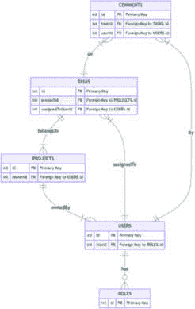
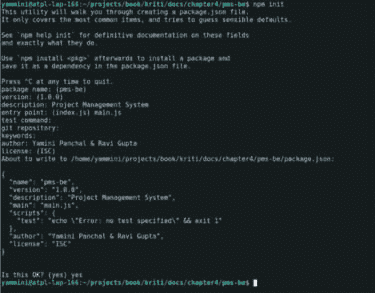
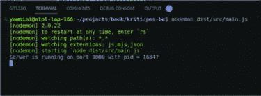
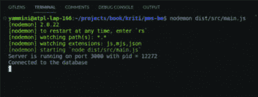

# 第四章

# 规划应用程序

# 介绍

Node.js 已成为编写应用程序的首选选择。超过 3000 万个网站由 Node.js 驱动。这些应用程序或网站或项目在一般情况下都有相当复杂的部分。Netflix、LinkedIn、Uber、Paypal 甚至类似 NASA 的组织都使用 Node.js 来开发他们的应用程序。

开发应用程序时，规划是关键部分。它有助于明确目标并确定实现既定目标的路径。

在本书的剩余部分，我们将遵循一个共同示例来学习应用程序的重要方面。我们将看到如何使用标准技术编写、优化和测试应用程序。我们将编写一个项目管理软件。

# 结构

在本章中，我们将讨论以下主题：

+   项目管理应用程序概述

+   数据库设计

+   设置项目结构

    +   安装项目依赖

    +   项目目录结构

+   数据库模型（实体）

+   路由

# 应用程序概述

任何项目管理软件都有一个简单的目标定义。让个人和团队规划、组织和执行任务，以有效地完成项目。项目管理软件应该允许用户创建和管理项目。对于每个项目，都可能有许多任务需要执行。用户应该能够相互沟通。我们将很快了解到这些任务以及更多内容。

我们的项目管理系统（PMS）项目的目标或范围是开发一个小型 Web 应用程序，作为基本的项目管理工具。该应用程序将包括各种功能，包括安全的用户登录、创建项目和管理任务的能力、基于用户角色的任务分配，以及当任务被分配或完成时实施电子邮件通知。

此外，项目还将探索实现 API 的缓存机制以提高请求响应时间。此外，它还包括为开发者提供单元测试信息，以及如何为生产环境构建应用程序，最后是部署。

为了熟悉我们将要构建的内容，我们需要定义目的、将要执行的任务、架构、项目结构、数据库设计以及更多内容。

# 路线图

一个典型的项目路线图涉及几个关键阶段和活动。以下是路线图涵盖的高级概述。

+   规划应用程序

+   定义模块

+   数据库设计

+   设置项目结构

+   初始化项目

+   连接数据库

+   API 开发

+   API 缓存

+   单元测试

+   部署

在本章中，我们将涵盖前面列表中的前六个主题。最后四个主题有它们各自的章节。

# 范围

如前所述的目的已经给出了一个很好的想法，即我们将开发一个项目管理系统。有时，我们也会将其称为 PMS。我们的第一个目标是确定我们的 PMS 应该具备哪些功能。

我们应该能够：

+   管理用户并登录到应用。

+   创建和管理项目。

+   为创建的项目创建和管理任务。

+   应该能够访问和更新任务详情。

+   应该能够与任务上的其他成员进行沟通。

+   在仪表板上提供一些基本的项目报告。

# 定义模块

根据我们应能执行的任务，我们可以看到 PMS 系统应该具备以下必备模块。

# 用户模块

此模块将使我们能够管理用户。我们应该能够执行以下操作：

+   添加新用户。

+   编辑用户。

+   删除用户。

+   用户登录。

+   获取用户个人资料。

+   重置用户密码。

# 项目模块

项目模块将使我们能够管理项目。以下关键任务应通过此模块执行：

+   创建新项目。

+   更新项目详情。

+   删除项目。

+   获取项目详情。

+   获取项目统计信息。

+   管理项目成员资格。

# 任务模块

此模块将使我们能够管理项目内的任务。这是一个关键模块，它将使我们能够：

+   创建新任务。

+   更新任务详情。

+   删除任务。

+   获取任务详情。

+   附加支持文件。

# 评论模块

任务总是需要一个方式来使团队成员之间能够进行沟通。评论模块与任务一起将促进这一功能。以下是我们应该能够执行的任务：

+   在任务上添加评论。

+   允许用户更新自己的评论。

+   允许用户和管理员删除评论。

# 数据库设计

为大型项目设计数据库是一个棘手、持续的活动，它随着项目时间表而即兴发挥。尽管它必须尽早定义。它涉及定义模式、表、关系、约束和数据类型，以满足应用的特定要求。

规范化通过应用规范化规则来消除数据冗余，有助于优化包括数据完整性在内的存储。规范化的目标是避免数据重复并保持数据完整性。每条数据只存储在一个地方，从而降低不一致的风险。表之间的关系通过主键和外键来维护。

规范化在存储、非冗余和整洁性方面有其好处。然而，随着数据库的增长，表的数量以及应用中添加的复杂功能，连接的数量和查询的复杂性也在增加。这影响了可读性，并在有大量读取操作时导致性能变慢。

在本节中，我们将设计我们实体所需的表。我们将尽量保持关系最小化，同时在可能的情况下在冗余和规范化之间保持平衡。

**注意**：*对于本书，我们将使用 PostgreSQL 数据库。因此以下表中的数据类型是特定于 PostgreSQL 的。对于每个表，我们还将指定列是否是主键或唯一键，以及它是否可以包含空值。如果我们打算引用另一个表中的列，那么我们将提及引用表和列。*

对于上述定义的所有模块，我们需要以下表来构建我们的数据库：

+   `**用户**`: 代表可以访问系统的所有用户

+   `**角色**`: 每个用户都将被分配一个角色，例如，项目经理、管理员和其他。

+   `**项目**`: 代表项目实体。

+   `**任务**`: 与每个项目关联的任务。

+   `**评论**`: 添加到每个任务的评论。

*图 4.1* 展示了一个基本的实体关系图。此图仅使用每个表使用的唯一键和外键。



**图 4.1:** 高级实体关系图

图表显示每个用户都被分配了一个角色。每个项目属于一个用户。每个项目都有分配的任务，每个任务都可以有评论。这是一个高级的实体关系图。现在当我们理解了表之间的关系后，我们可以详细地探讨每个实体，然后是详细的实体关系图。

# 用户架构表

让我们从用户表开始，它是用户认证、授权和维护用户相关数据的关键。它在确保每个用户信息被准确捕捉和保障的同时，使 PMS 能够有效地识别和管理单个用户，发挥着至关重要的作用。

为了简化，我们只添加了用户 id、姓名、密码和一些相关的详细信息。

| **列名** | **类型** | **数据类型** | **描述** | **主键？** | **是否为空** | **唯一** | **引用** |
| --- | --- | --- | --- | --- | --- | --- | --- |
| `user_id` | `uuid` | uuid | 用户的唯一标识符 id | true | false | true | - |
| `email` | `email` | varchar(60) | 用户电子邮件地址 | false | false | true | - |
| `full_name` | `string` | varchar(30) | 用户全名 | false | true | false | - |
| username | `string` | varchar(30) | 用户的唯一名称 | false | false | true | - |
| `password` | `string` | varchar(100) | 用户加密密码 | false | false | false | - |
| `role_id` | `uuid` | uuid | 用户的角色 id | false | false | false | 角色表 (role_id) |
| `created_at` | `date` | timestamp | 用户创建时间 | false | false | false | - |
| `updated_at` | `date` | timestamp | 用户数据更新时间 | false | true | false | - |

**表 4.1:** 用户表

# 角色架构表

用户访问应用程序的权限由分配的角色和授予该角色的权限决定。用户可以根据其分配的角色所关联的权限在应用程序内执行特定的操作。我们已定义具有以下约束的应用程序角色模式表。

| **列名** | **类型** | **数据类型** | **描述** | **主键？** | **是否为空** | **唯一** |
| --- | --- | --- | --- | --- | --- | --- |
| `role_id` | `uuid` | uuid | 角色的唯一标识符 id | 是 | 否 | 是 |  |
| `name` | `email` | varchar(60) | 角色名称 | 否 | 否 | 是 |  |
| `description` | `string` | varchar(30) | 角色描述 | 否 | 是 | 否 |  |
| `rights` | `string` | text | 不同模块的权限 | 否 | 否 | 否 |  |
| `created_at` | `date` | 时间戳 | 角色创建时间 | 否 | 否 | 否 |  |
| `updated_at` | `date` | 时间戳 | 角色数据更新时间 | 否 | 是 | 否 |  |

**表 4.2：角色表**

# 项目模式表

在项目管理系统（PMS）中，项目表作为存储系统内管理不同项目信息的中心仓库。项目表中的每一行代表一个特定的项目，而每一列存储与这些项目相关的各种属性或细节。我们已定义如下模式：

| **列名** | **类型** | **数据类型** | **描述** | **主键？** | **是否为空** | **唯一** | **引用** |
| --- | --- | --- | --- | --- | --- | --- | --- |
| `project_id` | `uuid` | integer | 项目的唯一标识符 id | 是 | 否 | 是 | - |
| `name` | `string` | varchar(60) | 项目名称 | 否 | 否 | 是 | - |
| `description` | `string` | varchar(200) | 项目描述 | 否 | 是 | 否 | - |
| `user_ids` | `string` | text | 项目分配的用户 _ids | 否 | 是 | 否 | 用户表（user_id） |
| `start_time` | `date` | 时间戳 | 项目开始日期 | 否 | 是 | 否 | - |
| `end_time` | `date` | 时间戳 | 项目结束日期 | 否 | 是 | 否 | - |
| `status` | `enum` | varchar(30) | 当前项目状态 | 否 | 否 | 否 | - |
| `created_at` | `date` | 时间戳 | 用户创建时间 | 否 | 否 | 否 | - |
| `updated_at` | `date` | 时间戳 | 用户数据更新时间 | 否 | 是 | 否 |  |

**表 4.3：项目表**

# 任务模式表

任务表旨在存储与特定项目相关的各种任务或活动的信息。任务表中的每一行代表一个特定的任务，而每一列则持有与这些任务相关的不同属性或细节，如下所示：

| **列名** | **类型** | **数据类型** | **描述** | **主键？** | **是否为空** | **唯一** | **引用** |
| --- | --- | --- | --- | --- | --- | --- | --- |
| `task_id` | `uuid` | uuid | 任务的唯一标识符 id | 是 | 否 | 是 | - |
| `name` | `string` | varchar(60) | 任务名称 | 否 | 否 | 是 | - |
| `description` | `string` | varchar(300) | 任务描述 | 否 | 是 | 否 | - |
| `project_id` | `uuid` | varchar(35) | 关联的项目 ID | false | true | false | 项目表 (project_id) |
| `user_id` | `uuid` | uuid | 分配的用户 ID | false | true | false | 用户表 (user_id) |
| `estimated_start_time` | `date` | 时间戳 | 任务的预计开始日期 | false | true | false | - |
| `estimated_end_time` | `date` | 时间戳 | 任务的预计结束日期 | false | true | false | - |
| `actual_start_time` | `date` | 时间戳 | 任务的实际开始日期 | false | true | false | - |
| `actual_end_time` | `date` | 时间戳 | 任务的实际结束日期 | false | true | false | - |
| `priority` | `enum` | varchar(20) | 任务的优先级，例如，高、低、中 | false | true | false | - |
| `status` | `enum` | varchar(30) | 当前任务状态 | false | false | false | - |
| `supported_files` | `string` | 文本 | 支持的文件 URL | false | true | false | - |
| `created_at` | `date` | 时间戳 | 任务的创建时间 | false | false | false | - |
| `updated_at` | `date` | 时间戳 | 任务的更新时间 | false | true | false | - |

**表 4.4:** 任务表

# 评论架构表

评论表的设计是为了存储与各种任务相关的评论或笔记。评论表中的每一行代表与特定任务相关的特定评论，而每一列则持有与这些评论相关的不同属性或细节，如下所示。

| **列名** | **类型** | **数据类型** | **描述** | **主键？** | **是否为空** | **唯一** | **引用** |
| --- | --- | --- | --- | --- | --- | --- | --- |
| `comment_id` | `uuid` | uuid | 评论的唯一标识符 ID | true | false | true | - |
| `comment` | `string` | varchar(300) | 评论 | false | false | false | - |
| `task_id` | `uuid` | uuid | 给定评论的任务 ID | false | false | false | 任务表 (task_id) |
| `user_id` | `uuid` | uuid | 给定评论的用户 ID | false | false | false | 用户表 (user_id) |
| `supported_files` | `string` | 文本 | 附加文件的 URL | false | true | false | - |
| `created_at` | `date` | 时间戳 | 评论的创建时间 | false | false | false | - |
| `updated_at` | `date` | 时间戳 | 评论的更新时间 | false | true | false | - |

**表 4.5:** 评论表

这是 PMS 数据库设计的概述，包括原始的架构表。现在我们已经准备好了架构，我们可以开始编写我们的项目了。我们首先将定义项目文件结构。


**图 4.2:** 实体关系图

# 设置项目结构

项目结构灵活，可以根据您的 Node.js 应用程序的具体需求进行定制，我们旨在通过在整个开发过程中遵循既定标准来最小化开发者的工作量。

让我们通过初始化项目开始开发 PMS 应用程序。

# 初始化项目

在开始之前，请确保你已经安装了系统上的 LTS（长期支持）版本的 Node.js 和 PostgreSQL。

**PostgreSQL 可以从[`www.postgresql.org/download/`](https://www.postgresql.org/download/)下载。有适用于 Linux、MacOs、Windows、BSD 和 Solaris 的安装程序。由于 Linux 有多种版本，上述官方网站还提供了每种版本的单独说明。**

项目目录名可以保持为 `**pms-be**`**.** `**pms**` 代表项目管理系统，而 `**-be**` 可以添加，因为我们正在创建应用程序的 API 后端。让我们创建一个新的目录 `**`pms-be`**`` 并使用命令提示符 (`**cmd**`) 切换到它。在目录内，通过运行命令 `**"npm init**`.`**"**` 初始化一个新的 Node.js 项目。

一旦执行 `**"npm init"**`，设置过程将逐步提示你提供各种详细信息。你可以添加适当的信息，并按每个提示按 `**"Enter"**`。

+   `包名: (默认为 **"**pms-be**"**)`

+   `版本: (默认为 **"**1.0.0**"**)`

+   `描述: **"**项目管理系统**"**`

+   `入口点: (默认为 **"**index.js**"**) 如果需要，你可以将其更改为 **"**main.js**"**。`

+   `测试命令: 如果你没有特定的测试命令，你可以留空此字段。`

+   `Git 仓库: 如果你的项目不使用 Git，请留空此字段。`

+   `关键词: 添加相关的关键词，用逗号分隔。`

+   `作者: 添加项目的作者姓名。`

+   `许可证: (默认为 **"**ISC**"**) 你可以选择不同的许可证或保持为 **"**ISC.**"**`

+   `再按一次 **"**Enter**"** 完成初始化过程。`

通过这样，你的项目初始化过程将成功完成，并将创建 `**package.json**` 文件。



**图 4.3:** 初始化项目

# 项目依赖安装

一旦项目初始化完成，下一步就是安装必要的包和工具作为依赖项。我们强烈推荐使用 Visual Studio Code 作为开发工具，因为它提供了各种扩展，例如编程语言的 intellisense、代码格式化工具和 git 包，这些扩展大大简化了开发过程。这些扩展帮助开发者节省大量精力，使开发体验更加高效和愉快。

现在，让我们开始安装项目管理系统开发所需的最基本包，例如 `**express.js**`、`**postgresql(pg)**`、`**typescript**`、`**typeorm**`、`**ts-node**`、`**ts-lint**` 等，在开发过程中，我们还将根据需要安装其他包。

`npm install express  --save`

`npm install typescript -D`

`npm install pg --save`

`npm install typeorm --save`

`npm install @types/express -D`

`npm install @types/node -D`

`npm install @types/pg -D`

`npm install reflect-metadata --save`

`npm install uuid --save`

`npm install @types/uuid -D`

`npm install ts-node prettier eslint eslint-config-prettier eslint-plugin`

`-prettier -D`

`npm install @typescript-eslint/eslint-plugin @typescript-eslint/parser -D`

在这里，我们分享`**package.json**`文件以供参考，用于安装所有包，并且它将随着开发过程而不断变化。

`// package.json`

`{`

`"name": "pms-be",`

`"version": "1.0.0",`

`"description": "项目管理系统",`

`"main": "main.js",`

`"scripts": {`

`"test": "echo \"Error: no test specified\" && exit 1",`

`"start": "nodemon dist/src/main.js"`

`},`

`"author": "Ravi Kumar Gupta, Yamini Panchal",`

`"license": "Proprietary",`

`"devDependencies": {`

`"@types/express": "4.17.17",`

`"@types/node": "20.4.2",`

`"@types/pg": "8.10.2",`

`"@types/uuid": "9.0.2",`

`"@typescript-eslint/eslint-plugin": "5.59.8",`

`"@typescript-eslint/parser": "5.59.8",`

`"eslint": "8.41.0",`

`"eslint-config-prettier": "8.8.0",`

`"eslint-plugin-prettier": "4.2.1",`

`"nodemon": "2.0.22",`

`"prettier": "2.8.8",`

`"ts-node": "10.9.1",`

`"typescript": "5.0.4"`

`},`

`"dependencies": {`

`"express": "4.18.2",`

`"pg": "8.11.1",`

`"reflect-metadata": "0.1.13",`

`"typeorm": "0.3.17",`

`"uuid": "9.0.0"`

`}`

`}`

接下来，在项目主目录中创建一个`**tsconfig.json**`文件，并使用以下代码以确保 TypeScript 能够编译代码：

`// tsconfig.json`

```js```````js```````js `{`    `"compilerOptions": {`    `"module": "commonjs",`    `"moduleResolution": "node",`    `"pretty": true,`    `"sourceMap": false,`    `"target": "ESNext",`    `"outDir": "./dist",`    `"baseUrl": "./src",`    `"noImplicitAny": false,`    `"esModuleInterop": true,`    `"removeComments": true,`    `"preserveConstEnums": true,`    `"experimentalDecorators": true,`    `"alwaysStrict": true,`    `"forceConsistentCasingInFileNames": true,`    `"emitDecoratorMetadata": true,`    `"resolveJsonModule": true,`    `"skipLibCheck": true`    `},`    `"include": ["src/**/*.ts", "src/**/*.json"],`    `"exclude": ["node_modules"],`    `"files": ["node_modules/@types/node/index.d.ts"]`    `}`    Thereafter, create `**server_config.json**` which will be used for all configurations, such as, `**port**`, `**database config**`, and so on.    `// server_config.json`   ``````js```````js``` `{`    `"port": 3000,`    `"db_config": {`    `"db": "postgres",`    `"username": "root",`    `"password": "123456",`    `"host": "localhost",`    `"port": 5432,`    `"dbname": "pms"`    `}`    `}`    **Note**: *Please always keep stronger passwords for any account*.    As part of the configuration process, we will integrate `**ESLint**` to enhance development practices. We will include a `**.eslintrc.json**` file in the project’s root directory, as demonstrated in the code snippet as follows:    `.eslintrc.json`    `{`    `"env": {`    `"browser": true,`    `"es2021": true`    `},`    `"extends": ["eslint:recommended", "plugin:@typescript-eslint/recommended"],`    `"overrides": [],`    `"parser": "@typescript-eslint/parser",`    `"parserOptions": {`    `"ecmaVersion": "latest",`    `"sourceType": "module"`    `},`    `"plugins": ["@typescript-eslint"],`    `"rules": {`    `"linebreak-style": ["error", "unix"],`    `"quotes": ["error", "single"],`    `"semi": ["error", "always"]`    `}`    `}`    Nodemon is beneficial for Node.js developers as it enhances development workflow, improves productivity, and provides real-time feedback during the development process.    With Nodemon, developers receive immediate feedback on code changes as the server restarts instantly. This allows for quick validation of code modifications and helps catch errors early in the development process. This eliminates the need to manually stop and restart the server after every code modification, saving time and streamlining the development process.    Let us install `**nodemon**` open root directory of project on terminal and paste following command:    `$ npm install nodemon -D`    # Project Directory Structure    When structuring a `**Node.js**` project with `**Express**` and `**TypeScript**`, a common directory structure can be as follows:    `pms-be/`    `|-- src/`    `|   |-- components/`    `|   |   |-- users/`    `|   |   |   |-- users_controller.ts`    `|   |   |   |-- users_entity.ts`    `|   |   |   |-- users_routes.ts`    `|   |   |   |-- users_service.ts`    `|   |   |-- projects/`    `|   |   |   |-- projects_controller.ts`    `|   |   |   |-- projects_entity.ts`    `|   |   |   |-- projects_routes.ts`    `|   |   |   |-- projects_service.ts`    `|   |   |-- tasks/`    `|   |   |   |-- tasks_controller.ts`    `|   |   |   |-- tasks_entity.ts`    `|   |   |   |-- tasks_routes.ts`    `|   |   |   |-- tasks_service.ts`    `|   |-- utils/`    `|   |   |-- db_utils.ts`    `|   |   |-- common.ts`    `|   |-- routes/`    `|   |   |-- index.ts`    `|   |--express_server.ts`    `|   |-- main.ts`    `|-- tests/`    `|   |-- users_spec.tjs`    `|-- package-lock.json`    `|-- package.json`    `|-- node_modules`    `|-- tsconfig.json`    `|-- server_config.json`    `|-- .gitignore`    `|-- README.md`    As shown in the project directory structure, we have already set up `**server_config.json**` and `**tsconfig.json**` files. As we proceed with the development, we will create various folders and files to organize the code and manage different aspects of the project.    # Create Express Server    Before creating an express server, add one `**README.md**` file that includes how this project will run and the required configuration so anyone can easily work on that.    **README.md**    `# Project Management System API`    `## Prerequisites`    `-   Node.js: Ensure that Node.js is installed on your machine. You can download it from [here](https://nodejs.org).`    `## Install Project Dependency Packages`    ```` ```js ````    `npm install`    ```js` ``` ```js`    `## Configuration`    `create server_config.json file in the root directory and save it. Inside that file, add the desired configuration values in the format KEY:VALUE.`    `-   Configuration Options`    `| Configuration Key | Description                           |`    `| ----------------- | ------------------------------------ |`    `| PORT              | The port number on which project run |`    `## Compile Project`    `Once you are in the project's root directory, you can use the tsc command with the --watch flag to enable automatic recompilation when changes are detected. Run the following command`    ```` ```js ````    `tsc --watch`    ```js` ``` ```js`    `## Run Project`    `-   on local machine run during development`    ```` ```js ````    `nodemon dist/src/main.js`    ```js` ``` ```js`    `-   on server after development`    ```` ```js ````    `node src/main.js`    ```js` ``` ```js`    Let us create a new directory called `**"src"**` and inside it, create two files named `**"main.ts"**` and `**"express_server.ts"**` to set up an Express `HTTP` server with the following code. As our project is currently small-scale, we will not be using `**cluster**` and `**forks**` at the OS level, but we will implement reconnection to the server in case of any exceptions. Depending on your project’s specific requirements, you can choose to use the `**"main.ts"**` file with or without `**cluster**` functionality.    `// main.ts`   ``````js```````js`` `import cluster from 'cluster';`    `import { ExpressServer } from './express_server';`   ``````js```````js` `// connect the express server`    `const server = new ExpressServer();`    `process.on('uncaughtException', (error: Error) => {`    ``console.error(`Uncaught exception in worker process ${process.pid}:`, error);``    `// Close any open connections or resources`    `server.closeServer();`    `setTimeout(() => {`    `cluster.fork();`    `cluster.worker?.disconnect();`    `}, 1000);`    `});`    `// Gracefully handle termination signals`    `process.on('SIGINT', () => {`    `console.log('Received SIGINT signal');`    `// Close any open connections or resources`    `server.closeServer();`    `});`    `process.on('SIGTERM', () => {`    `console.log('Received SIGTERM signal');`    `// Close any open connections or resources`    `server.closeServer();`    `});`    # With Cluster for a Large Project    With the presence of the `cluster` module, if the server crashes due to any reason, we can catch the event when the process exits and spawn another child. This way, we ensure that the server does not crash and it remains available for serving upcoming requests.    `// main.ts`   ``````js```````js `导入`cluster`模块从`'cluster';`    `导入`os`模块从`'os';`    `const numCPUs = os.cpus().length;`    `导入`{ ExpressServer }`从`'./express_server';`    `if (cluster.isPrimary) {`    ``console.log(`主进程 PID: ${process.pid}`);``    `for (let i = 0; i < numCPUs; i++) {`    `cluster.fork();`    `}`    `cluster.on('exit', (worker, code, signal) => {`    ``console.log(`工作进程 ${worker.process.pid} 退出，代码 ${code} 和信号 ${signal}`);``    `setTimeout(() => {`    `cluster.fork();`    `}, 1000);`    `});`    `} else {`    `// 连接 Express 服务器`    `const server = new ExpressServer();`   ``````js`````` `process.on('uncaughtException', (error: Error) => {`    ``console.error(`工作进程 ${process.pid} 中未捕获的异常:`    ``    ``error);``    `// 关闭任何打开的连接或资源`    `server.closeServer();`    `setTimeout(() => {`    `cluster.fork();`    `cluster.worker?.disconnect();`    `}, 1000);`    `});`    `// 优雅地处理终止信号`    `process.on('SIGINT', () => {`    `console.log('收到 SIGINT 信号');`    `// 关闭任何打开的连接或资源`    `server.closeServer();`    `});`    `process.on('SIGTERM', () => {`    `console.log('收到 SIGTERM 信号');`    `// 关闭任何打开的连接或资源`    `server.closeServer();`    `});`    `}`    根据前面的代码，我们需要创建`**express_server.ts**`，因为它被导入。所以让我们创建它。    `// express_server.ts`   ```js```````js` `import express, { Application } from 'express';`    `import { IServerConfig } from './utils/config';`    `import * as config from '../server_config.json';`    `export class ExpressServer {`    `private static server = null;`    `public server_config: IServerConfig = config;`    `constructor() {`    `const port = this.server_config.port ?? 3000;`    `// initialize express app`    `const app = express();`   ``````js```` `app.get('/ping', (req, res) => {`    `res.send('pong');`    `});`    `ExpressServer.server = app.listen(port, () => {`    ``console.log(`Server is running on port ${port} with pid = ${process.pid}`);``    `});`    `}`    `//close the express server for safe on uncaughtException`    `public closeServer(): void {`    `ExpressServer.server.close(() => {`    `console.log('Server closed');`    `process.exit(0);`    `});`    `}`    `}`    Afterwards, create a directory with `**utils**` and inside add `**config.ts**` file for define config interface as follows:    `// config.ts`   ```js`````` `export interface IServerConfig {`    `port: number;`    `db_config: {`    `'db': string;`    `'username': string;`    `'password': string;`    `'host': string;`    `'port': number;`    `'dbname': string;`    `};`    `}`    现在要运行应用程序，首先使用`**tsc --watch**`编译代码。之后，将创建一个`**dist**`文件夹，然后使用`**nodemon**` `**dist/src/main.js**`在开发应用程序时运行，将显示以下输出。    输出 :    **图 4.4：运行应用程序的输出**    **注意**：*如果您正在使用 Visual Studio Code，可以轻松配置和运行 TypeScript 观察任务。要这样做，请按* `**"*Ctrl + P*"**`*，然后选择* `**"*Tasks: Run Task*"**` *并配置一个带有* `***TypeScript***`*的任务。选择* `**"*tsc:watch -tsconfig.json*"**` *以启用基于您的* `***tsconfig.json***` *文件的 TypeScript 编译的观察模式。*    # 连接数据库    TypeORM 因其易用性、灵活性和数据库操作的抽象而广泛用于现代 TypeScript 和 JavaScript 应用程序。它简化了与 Node.js 中的数据库一起工作的开发过程，并提高了可维护性。我们已使用以下命令分别安装了 `**postgreSQL**` 和 `**typeorm**` 包：`**npm i pg --save**`**,** `**npm i @types/pg -D**` 和 `**npm i typeorm -- save**`。    现在在 utils 目录中创建 `**db.ts**` 文件，代码如下：    `// db.ts`    `import { DataSource } from 'typeorm';`    `import { IServerConfig } from './config';`    `import * as config from '../../server_config.json';`    `export class DatabaseUtil {`    `public server_config: IServerConfig = config;`    `constructor() {`    `this.connectDatabase();`    `}`    `private connectDatabase() {`    `try {`    `const db_config = this.server_config.db_config;`    `const AppDataSource = new DataSource({`    `type: 'postgres',`    `host: db_config.host,`    `port: db_config.port,`    `username: db_config.username,`    `password: db_config.password,`    `database: db_config.dbname,`    `entities: [],`    `synchronize: true,`    `logging: false,`    `});`    `AppDataSource.initialize()`    `.then(() => {`    `console.log('连接到数据库');`    `})`    `.catch((error) => console.log(error));`    `} catch (error) {`    `console.error('连接到数据库错误:', error);`    `}`    `}`    `}`    目前，由于我们没有定义任何实体，所以我们有空的实体数组。然后在 `**main.ts**` 中导入数据库连接，代码如下：    `// main.ts`    `import cluster from 'cluster';`    `import { ExpressServer } from './express_server';`    `import { DatabaseUtil } from './utils/db';`   ```js````` `// 连接 Express 服务器`    `const server = new ExpressServer();`    `// 连接数据库`    `new DatabaseUtil();`    `process.on('uncaughtException', (error: Error) => {`    ``console.error(`工作进程 ${process.pid} 中未捕获的异常:`    ``    ``error);``    `// 关闭任何打开的连接或资源`    `server.closeServer();`    `setTimeout(() => {`    `cluster.fork();`    `cluster.worker?.disconnect();`    `}, 1000);`    `});`    `// 优雅地处理终止信号`    `process.on('SIGINT', () => {`    `console.log('收到 SIGINT 信号');`    `// 关闭任何打开的连接或资源`    `server.closeServer();`    `});`    `process.on('SIGTERM', () => {`    `console.log('收到 SIGTERM 信号');`    `// 关闭任何打开的连接或资源`    `server.closeServer();`    `});`    运行后，将显示以下成功连接数据库的输出。    输出：    **图 4.5：数据库连接输出**    这样，根据在 `**server_config.json**` 中定义的数据库配置，使用 typeorm 和 PostgreSQL 数据库连接。    # 数据库模型（实体）    我们已经看到了数据库模式表。要将数据库模式集成到代码中，我们将创建一个 components 目录和 roles、users、projects、tasks 和 comments 的子目录。在这些目录中的每一个，我们将创建相应的实体文件。    `components`    `├── roles`    `│   └── roles_entity.ts`    `├── users`    `│   └── users_entity.ts`    `├── projects`    `│   └── projects_entity.ts`    `├── tasks`    `│   └── tasks_entity.ts`    `└── comments`    `└── comments_entity.ts`    我们将首先定义 Roles 实体：    # 角色实体    在 role 目录中创建 `**role_entity.ts**` 文件，代码如下。    `// role_entity.ts`   ```js```` `import { Entity, PrimaryGeneratedColumn, Column, CreateDateColumn,`    `UpdateDateColumn } from 'typeorm';`    `@Entity()`    `export class Roles {`    `@PrimaryGeneratedColumn('uuid')`    `role_id: string;`    `@Column({ length: 60, nullable: false, unique: true })`    `name: string;`    `@Column({ length: 200 })`    `description: string;`    `@Column({ type: 'text' })`    `rights: string;`    `@CreateDateColumn()`    `created_at: Date;`    `@UpdateDateColumn()`    `updated_at: Date;`    `}`    代码从 TypeORM 导入必要的装饰器。这些装饰器用于定义实体及其属性。    `**@Entity()**` 装饰器将类 `Roles` 标记为 TypeORM 实体，表示它代表一个数据库表。它具有以 `**PrimaryGeneratedColumn**` 装饰的 `**role_id**` 作为主键，并自动生成 `UUID`，`name` 字段被定义为 `unique` 和 `not nullable`。    `**description**` 字段的最大长度为 200 个字符。`**rights**` 字段使用 `**text**` 数据类型来存储更大的文本数据。`**@CreateDateColumn()**` 和 `**@UpdateDateColumn()**` 装饰器处理相应插入和更新时间的自动插入数据。    # 用户实体    Users 实体表示应用程序数据库中的用户信息。使用以下代码创建 `users_entity.ts`：    `// user_entity.ts`   ```js``` `import { Entity, PrimaryGeneratedColumn, Column, CreateDateColumn,`    `UpdateDateColumn, OneToOne, JoinColumn } from 'typeorm';`    `import { Roles } from '../roles/roles_entity';`    `@Entity()`    `export class Users {`    `@PrimaryGeneratedColumn('uuid')`    `user_id: string;`    `@Column({ length: 50, nullable: true })`    `fullname: string;`    `@Column({ length: 30, nullable: false, unique: true })`    `username: string;`    `@Column({ length: 60, nullable: false, unique: true })`    `email: string;`    `@Column({ nullable: false })`    `password: string;`    `@Column({ nullable: false })`    `@ManyToOne(() => Roles)`    `@JoinColumn({ name: 'role_id' })`    `role_id: Roles['role_id'];`    `@CreateDateColumn()`    `created_at: Date;`    `@UpdateDateColumn()`    `updated_at: Date;`    `}`    根据用户定义的实体，`**user_id**` 作为主键，具有自动生成的 `**uuid**`，`**username**` 和 `**email**` 将是唯一的，并且具有非空约束，`**fullname**` 允许最大 50 个字符，`**password**` 也具有非空约束。    在这种情况下，每个用户都与一个角色相关联，在它们之间建立多对一关系，因此用户和角色两个表之间建立了多对一连接。    `**@ManyToOne(() => Roles)**`: 这个装饰器指定了实体之间的多对一关系。它表示当前实体（可能代表用户或其他实体）与 Roles 实体之间有一个多对一关系。通过一个返回目标实体类的函数指定 Roles 实体。    `**@JoinColumn({ name: 'role_id**' **})**`: 这个装饰器指定了当前实体中作为外键以建立关系的列。在这种情况下，`**role_id**` 列被用作外键。    `**role_id: Roles['role_id**'**]**`: 这一行定义了一个 TypeScript 属性 `**role_id**`，其类型为 `**Roles['role_id**'**]**`。它很可能 Roles 是一个表示应用程序中角色的实体类，而 `**role_id**` 是该类中代表角色主键或唯一标识符的属性。    这是对多对一关系的基本概述。    # 项目实体    现在创建一个 `**projects_entity.ts**` 文件，代码如下：    `// projects_entity.ts`   ````` `import { Entity, PrimaryGeneratedColumn, Column, CreateDateColumn,`    `UpdateDateColumn } from 'typeorm';`    `@Entity()`    `export class Projects {`    `@PrimaryGeneratedColumn('uuid')`    `project_id: string;`    `@Column({ length: 30, nullable: false, unique: true })`    `name: string;`    `@Column({ length: 500 })`    `description: string;`    `@Column('uuid', { array: true, default: [] })`    `user_ids: string[];`    `@Column()`    `start_time: Date;`    `@Column()`    `end_time: Date;`    `@CreateDateColumn()`    `created_at: Date;`    `@UpdateDateColumn()`    `updated_at: Date;`    `}`    The `**@PrimaryGeneratedColumn('uuid**'**)**` decorator specifies that the `**project_id**` property is the primary key of the `**projects**` table and will be automatically generated as a `**UUID**` when a new project is inserted.    The `**@Column({ length: 30, nullable: false, unique: true })**` decorator is applied to the `**name**` property, indicating that it is a string with a maximum length of 30 characters. It is also marked as `**nullable: false**` (required) and `**unique: true**` (must be unique among projects).    The `**@Column({ length: 500 })**` decorator is used for the description property, representing a string with a maximum length of 500 characters.    The `**@Column('uuid**'**, { array: true, default: [] })**` decorator is applied to the `**user_ids**` property, indicating that it is an array of strings (`**string[]**`) that will store user IDs associated with the project. The default value for the array is set to an empty array (`**[]**`).    The `@Column()` decorator is used for both the `start_time` and `end_time` properties, which represent Date objects.    In the context of the application, every project comprises multiple tasks, and each task is linked to a single project. Consequently, within the tasks entity, there exists a one-to-one relationship with the project entity. Similarly user and role joins here project and task join will be established with join columns as `**project_id**` for both tables in the following task entity that we will explore in detail.    # Task Entity    Create a new file named `**tasks_entity.ts**` and include the following code in it:    `// tasks_entity.ts`    `import { Entity, PrimaryGeneratedColumn, Column, CreateDateColumn,`    `UpdateDateColumn, ManyToOne, JoinColumn } from 'typeorm';`    `import { Users } from '../users/users_entity';`    `import { Projects } from '../projects/projects_entity';`    `export enum Status {`    `NotStarted = 'Not-Started',`    `InProgress = 'In-Progress',`    `Completed = 'Completed',`    `}`    `export enum Priority {`    `Low = 'Low',`    `Medium = 'Medium',`    `High = 'High',`    `}`    `@Entity()`    `export class Tasks {`    `@PrimaryGeneratedColumn('uuid')`    `task_id: string;`    `@Column({ length: 30, nullable: false, unique: true })`    `name: string;`    `@Column({ length: 500 })`    `description: string;`    `@Column()`    `@ManyToOne(() => Projects, (projectData) => projectData.project_id)`    `@JoinColumn({ name: 'project_id' })`    `project_id: string;`    `@Column()`    `@ManyToOne (() => Users, (userData) => userData.user_id)`    `@JoinColumn({ name: 'user_id' })`    `user_id: string;`    `@Column()`    `estimated_start_time: Date;`    `@Column()`    `estimated_end_time: Date;`    `@Column()`    `actual_start_time: Date;`    `@Column()`    `actual_end_time: Date;`    `@Column({`    `type: 'enum',`    `enum: Priority, // Use the enum type here`    `default: Priority.Low, // Set a default value as Low`    `})`    `priority: Priority;`    `@Column({`    `type: 'enum',`    `enum: Status, // Use the enum type here`    `default: Status.NotStarted, // Set a default value as Not-Started`    `})`    `status: Status;`    `@Column('text', { array: true, default: [] })`    `supported_files: string[];`    `@CreateDateColumn()`    `created_at: Date;`    `@UpdateDateColumn()`    `updated_at: Date;`    `}`    The code imports necessary decorators from TypeORM, including `Entity`, `**PrimaryGeneratedColumn**`, `**Column**`, `**CreateDateColumn**`, and `**UpdateDateColumn**`. It also imports the `**Users**` and `**Projects**` entities, as they will be used to establish one-to-one relationships with the `Tasks` entity.    `**Priority**` and `**Status**` `**enums**` define possible values for the status and priority columns of the `**Tasks**` entity. By using `**enums**`, we ensure that only specific predefined values can be assigned to these columns.    `**@ManyToOne**` decorators establish many-to-one relationships with the `**Projects**` and Users entities. The first argument of `**@ManyToOne**` is a function that returns the related `**entity**` class. This signifies that many tasks can be associated with one project or user. This second argument denotes the inverse side of the relationship, indicating the properties `**project_id**` and `**user_id**` in the `**Projects**` and `**Users**` entities, respectively, which reference the tasks entity. The `**@JoinColumn**` decorator specifies the name of the foreign key column in the `**tasks**` table that links to the related `**Projects**` and `**Users**` entities.    # Comment Entity    Let us define the comment entity in `**comments_entity.ts**` with the following code:    `// comments_entity.ts`    `import { Entity, PrimaryGeneratedColumn, Column, CreateDateColumn,`    `UpdateDateColumn, JoinColumn, OneToOne } from 'typeorm';`    `import { Users } from '../users/users_entity';`    `import { Tasks } from '../tasks/tasks_entity';`    `@Entity()`    `export class Comments {`    `@PrimaryGeneratedColumn('uuid')`    `comment_id: string;`    `@Column({ type: 'text' })`    `comment: string;`    `@OneToOne(() => Users, (userData) => userData.user_id)`    `@JoinColumn({ name: 'user_id' })`    `user_id: string;`    `@OneToOne(() => Tasks, (taskData) => taskData.task_id)`    `@JoinColumn({ name: 'task_id' })`    `task_id: string;`    `@Column('text', { array: true, default: [] })`    `supported_files: string[];`    `@CreateDateColumn()`    `created_at: Date;`    `@UpdateDateColumn()`    `updated_at: Date;`    `}`    The provided code includes essential TypeORM decorators like `Entity`, `**PrimaryGeneratedColumn**`, `**Column**`, `**CreateDateColumn**`, and `**UpdateDateColumn**`. Additionally, it imports the `Users` and `Tasks` entities, which play a crucial role in setting up one-to-one relationships with the `**Comments**` entity.    The `**@PrimaryGeneratedColumn('uuid**'**)**` decorator specifies that the `**comment_id**` property is the primary key of the comments table and will be automatically generated as a `UUID` when a new comment is inserted. The comment property is of type text, allowing it to store larger textual data.    `**@OneToOne**` decorators establish one-to-one relationships with the `Users` and `Tasks` entities. The first argument of `**@OneToOne**` is a function that returns the related `**entity**` class. Meanwhile, the second argument defines the inverse side of the relationship, referring to the properties `**user_id**` and `**task_id**` in the `Users` and `Tasks` entities, respectively. The `**@JoinColumn**` decorator then specifies the name of the foreign key column in the `**comments**` table, which references the related `Users` and `Tasks` entities.    The `**supported_files**` property is an array of strings (`**string[]**`) which will store the urls of different files in the array.    After defining all the entities, their purpose remains incomplete without synchronization to the database. So, let us synchronize them with the database and automatically create the corresponding tables. To achieve this, we can update the `**db.ts**` file with the following code:    `// db.ts`    `import { DataSource } from 'typeorm';`    `import { IServerConfig } from './config';`    `import * as config from '../../server_config.json';`    `import { Roles } from '../components/roles/roles_entity';`    `import { Users } from '../components/users/users_entity';`    `import { Projects } from '../components/projects/projects_entity';`    `import { Tasks } from '../components/tasks/tasks_entity';`    `import { Comments } from '../components/comments/comments_entity';`    `export class DatabaseUtil {`    `public server_config: IServerConfig = config;`    `constructor() {`    `this.connectDatabase();`    `}`    `private connectDatabase() {`    `try {`    `const db_config = this.server_config.db_config;`    `const AppDataSource = new DataSource({`    `type: 'postgres',`    `host: db_config.host,`    `port: db_config.port,`    `username: db_config.username,`    `password: db_config.password,`    `database: db_config.dbname,`    `entities: [Roles, Users, Projects, Tasks, Comments],`    `synchronize: true,`    `logging: false,`    `});`    `AppDataSource.initialize()`    `.then(() => {`    `console.log('Connected to the database');`    `})`    `.catch((error) => console.log(error));`    `} catch (error) {`    `console.error('Error connecting to the database:', error);`    `}`    `}`    `}`    The entities array should include all the entity classes you have defined (`**Users**`, `**Projects**`, `**Tasks**`, and `**Comments**`) to be synchronized with the database.    Setting `**synchronize:**` `**true**` ensures that the database tables are automatically created or updated to match the defined entities.    Once you run this code, the defined entities will be synchronized with the database, and the corresponding tables will be created or updated accordingly.    # Routes    Routing plays a crucial role in modern application development. Routing provides a structured way to navigate through an application. By establishing routes, users can seamlessly interact with distinct sections of the application through designated URLs.    Routing is basically a way to respond to any request coming to a specific endpoint based on method and parameters.    Route Definition follows this pattern:    `app.METHOD(PATH, HANDLER)`    `**"app"**` refers to an instance of `Express`.    `**"METHOD"**` pertains to an `HTTP` request method, written in lowercase.    `**"PATH"**` designates a specific server path.    `**"HANDLER"**` represents the function executed upon matching the route.    Routes consist of basically four parts:    *   **URL Paths**:          Each route definition includes a URL path or pattern that users can enter in the browser’s address bar or click as links.                    For example, `**"/api/login"**`           *   **HTTP Method**:          Routes specify the HTTP methods (`**GET**`, `**POST**`, `**PUT**`, `**DELETE**`, and so on) that are allowed for each path. Different HTTP methods trigger different actions in the application. For example, a `GET` request might retrieve data, while a `POST` request might submit data. You can explore it in detail through this link [`developer.mozilla.org/en-US/docs/Web/HTTP/Methods`](https://developer.mozilla.org/en-US/docs/Web/HTTP/Methods)           *   **Route Handlers**:          For each URL path, there is a corresponding handler function or controller that defines the actual logic for functionality to be executed. This can include rendering a specific view, fetching data from a database, processing user input, and more.           *   **Route Parameters**: Some paths might include dynamics that act as placeholders for specific values. These are often indicated with a colon, like `**":id"**`.          For example, `**"/users/:id"**` could represent a user’s profile page, where `**":id"**` is replaced with the actual user’s ID.              Let us construct routes following the outlined structure:    `├── routes`    `│   └── index.ts  `    `├── components`    `├── roles`    `│   └── roles_entity.ts`    `│   └── roles_routes.ts`    `│   └── roles_controller.ts`    `├── users`    `│   └── users_entity.ts`    `│   └── users_routes.ts`    `│   └── users_controller.ts`    `├── projects`    `│   └── projects_entity.ts`    `│   └── projects_routes.ts`    `│   └── projects_controller.ts`    `├── tasks`    `│   └── tasks_entity.ts`    `│   └── tasks_routes.ts`    `│   └── tasks_controller.ts`    `|── comments`    `|    └── comments_entity.ts`    `|    └── comments_routes.ts`    `|    └── comments_controller.ts`    By the preceding structure, we will establish a `**"routes"**` directory, containing an `**"index.ts"**` file, within the `**"src"**` directory. This `**"index.ts"**` file will function as the root for the individual routes of each module. We will also create all individual routes and controller files for each component and update them as we develop APIs step by step.    Each module encompasses functionalities for adding, updating, retrieving, and deleting, along with obtaining specific details about a particular data. Each route can cover CRUD (`**Create**`, `**Read**`, `**Update**`, `**Delete**`) operations having a basepoint as `**"/api/componentname"**` where `**componentname**` can be `**roles**`, `**users**`, `**projects**`, `**task**` and `**comments**`:    *   `**Create**`: This route allows the addition of new data. It is typically associated with an HTTP `**POST**` request to a path ex. `**"/api/componentname"**`. *   `**Update**`: The update route lets you modify existing data. It is triggered by an HTTP `**PUT**` request to a path like `**"/api/componentname/:id"**`, where `**":id"**` represents the specific entries identifier. *   `**Retrieve All**`: This route enables the retrieval of a list of all roles. It is often invoked via an HTTP `**GET**` request to the `**"/api/componentname"**` path. *   `**Retrieve Specific**`: This route is used to fetch details about a specific role. It is initiated by an HTTP `GET` request to a path like `**"/api/componentname/:id"**`. *   `**Delete**`: The delete route allows the removal of roles. It is typically triggered by an HTTP `DELETE` request to a path like `**"/api/componentname/:id"**`.    # Role Routes    Now, update `**role_controller.ts**` file with empty skeleton functions.    `// role_controller.ts`    `export class RoleController {`    `public addHandler() {`    `// addHandler`    `}`    `public getAllHandler() {`    `// getAllHandler`    `}`    `public getDetailsHandler() {`    `// getDetailsHandler`    `}`    `public async updateHandler() {`    `// updateHandler`    `}`    `public async deleteHandler() {`    `// deleteHandler`    `}`    `}`    Afterwards, modified `**role_routes.ts**` with the following code:    `// role_routes.ts`    `import { Express } from 'express';`    `import { RoleController } from './roles_controller';`    `export class RoleRoutes {`    `private baseEndPoint = '/api/roles';`    `constructor(app: Express) {`    `const controller = new RoleController();`    `app.route(this.baseEndPoint)`    `.get(controller.getAllHandler)`    `.post(controller.addHandler);`    `app.route(this.baseEndPoint + '/:id')`    `.get(controller.getDetailsHandler)`    `.put(controller.updateHandler)`    `.delete(controller.deleteHandler);`    `}`    `}`    Similarly, we will update all controller files by changing class names, such as `**UserController**`, `**ProjectController**`, `**TaskController**`, and `**CommentController**`, and import them in respective route files with modifying basepoint.    # User Routes    Let us modify `**users_controller.ts**` and `**users_routes.ts**` files, respectively, as follows:    `// users_controller.ts`    `export class UserController {`    `public addHandler() {`    `// addHandler`    `}`    `public getAllHandler() {`    `// getAllHandler`    `}`    `public getDetailsHandler() {`    `// getDetailsHandler`    `}`    `public async updateHandler() {`    `// updateHandler`    `}`    `public async deleteHandler() {`    `// deleteHandler`    `}`    `}`    `// users_routes.ts`    `import { Express } from 'express';`    `import { UserController } from './users_controller';`    `export class UserRoutes {`    `private baseEndPoint = '/api/users';`    `constructor(app: Express) {`    `const controller = new UserController();`    `app.route(this.baseEndPoint)`    `.get(controller.getAllHandler)`    `.post(controller.addHandler);`    `app.route(this.baseEndPoint + '/:id')`    `.get(controller.getDetailsHandler)`    `.put(controller.updateHandler)`    `.delete(controller.deleteHandler);`    `}`    `}`    # Project Routes    Let us modify `**projects_controller.ts**` and `**projects_routes.ts**` files, respectively, as follows:    `// project_controller.ts`    `export class ProjectController {`    `public addHandler() {`    `// addHandler`    `}`    `public getAllHandler() {`    `// getAllHandler`    `}`    `public getDetailsHandler() {`    `// getDetailsHandler`    `}`    `public async updateHandler() {`    `// updateHandler`    `}`    `public async deleteHandler() {`    `// deleteHandler`    `}`    `}`    `// projects_routes.ts`    `import { Express } from 'express';`    `import { ProjectController } from './projects_controller';`    `export class ProjectRoutes {`    `private baseEndPoint = '/api/projects';`    `constructor(app: Express) {`    `const controller = new ProjectController();`    `app.route(this.baseEndPoint)`    `.get(controller.getAllHandler)`    `.post(controller.addHandler);`    `app.route(this.baseEndPoint + '/:id')`    `.get(controller.getDetailsHandler)`    `.put(controller.updateHandler)`    `.delete(controller.deleteHandler);`    `}`    `}`    # Task Routes    Let us modify `**tasks_controller.ts**` and `**tasks_routes.ts**` files, respectively, as follows:    `// tasks_controller.ts`    `export class TaskController {`    `public addHandler() {`    `// addHandler`    `}`    `public getAllHandler() {`    `// getAllHandler`    `}`    `public getDetailsHandler() {`    `// getDetailsHandler`    `}`    `public async updateHandler() {`    `// updateHandler`    `}`    `public async deleteHandler() {`    `// deleteHandler`    `}`    `}`    `// tasks_routes.ts`    `import { Express } from 'express';`    `import { TaskController } from './tasks_controller';`    `export class TaskRoutes {`    `private baseEndPoint = '/api/tasks';`    `constructor(app: Express) {`    `const controller = new TaskController();`    `app.route(this.baseEndPoint)`    `.get(controller.getAllHandler)`    `.post(controller.addHandler);`    `app.route(this.baseEndPoint + '/:id')`    `.get(controller.getDetailsHandler)`    `.put(controller.updateHandler)`    `.delete(controller.deleteHandler);`    `}`    `}`    # Comment Routes    Let us modify `**comments_controller.ts**` and `**comments_routes.ts**` files, respectively, as follows:    `// comments_controller.ts`    `export class CommentController {`    `public addHandler() {`    `// addHandler`    `}`    `public getAllHandler() {`    `// getAllHandler`    `}`    `public getDetailsHandler() {`    `// getDetailsHandler`    `}`    `public async updateHandler() {`    `// updateHandler`    `}`    `public async deleteHandler() {`    `// deleteHandler`    `}`    `}`    `// comments_routes.ts`    `import { Express } from 'express';`    `import { CommentController } from './comments_controller';`    `export class CommentRoutes {`    `private baseEndPoint = '/api/comments';`    `constructor(app: Express) {`    `const controller = new CommentController();`    `app.route(this.baseEndPoint)`    `.get(controller.getAllHandler)`    `.post(controller.addHandler);`    `app.route(this.baseEndPoint + '/:id')`    `.get(controller.getDetailsHandler)`    `.put(controller.updateHandler)`    `.delete(controller.deleteHandler);`    `}`    `}`    We define all routes based on components individually. However, these routes need to be initialized from the Express server, so import all routes in one file and call it from the Express server.    Create `**routes**` directory and `**index.ts**` with the following code:    `// index.ts`   ```js` `import { Express, Router } from 'express';`    `import { RoleRoutes } from '../components/roles/roles_routes';`    `import { UserRoutes } from '../components/users/users_routes';`    `import { ProjectRoutes } from '../components/projects/projects_routes';`    `import { TaskRoutes } from '../components/tasks/tasks_routes';`    `import { CommentRoutes } from '../components/comments/comments_routes';`    `export class Routes {`    `public router: Router;`    `constructor(app: Express) {`    `const routeClasses = [`    `RoleRoutes,`    `UserRoutes,`    `ProjectRoutes,`    `TaskRoutes,`    `CommentRoutes`    `];`    `for (const routeClass of routeClasses) {`    `try {`    `new routeClass(app);`    ``console.log(`Router : ${routeClass.name} - Connected`);``    `} catch (error) {`    ``console.log(`Router : ${routeClass.name} - Failed`);``    `}`    `}`    `}`    `}`    Afterward, modify `**express_server.ts**` with import `**routes**` in the `app`:    `// express_server.ts`   ``` `import expressfrom 'express';`    `import { IServerConfig } from './utils/config';`    `import * as config from '../server_config.json';`    `import { Routes } from './routes';`    `export class ExpressServer {`    `private static server = null;`    `public server_config: IServerConfig = config;`    `constructor() {`    `const port = this.server_config.port ?? 3000;`    `// initialize express app`    `const app = express();`    `app.use(bodyParser.urlencoded({ extended: false }));`    `app.use(bodyParser.json());`    `app.get('/ping', (req, res) => {`    `res.send('pong');`    `});`    `const routes = new Routes(app);`    `if (routes) {`    `console.log('Server Routes started for server');`    `}`    `ExpressServer.server = app.listen(port, () => {`    ``console.log(`Server is running on port ${port} with pid =``    ``${process.pid}`);``    `});`    `}`    `//close the express server for safe on uncaughtException`    `public closeServer(): void {`    `ExpressServer.server.close(() => {`    `console.log('Server closed');`    `process.exit(0);`    `});`    `}`    `}`    While running the application, the following output will display in the terminal:    Output:    `Router : RoleRoutes - Connected`    `Router : UserRoutes - Connected`    `Router : ProjectRoutes - Connected`    `Router : TaskRoutes - Connected`    `Router : CommentRoutes - Connected`    `Server Routes started for server`    `Server is running on port 5000 with pid = 251784`    `Connected to the database`    # Conclusion    At this moment, now our server is running with a database utility, all entities along with their routes.    We learned about the use of the cluster module, using TypeORM for our database connection and query needs. We have our entities with all required columns.    As of now, we have empty and un-implemented route functions. In the next chapters, we will take each entity and implement the API.    # Multiple Choice Questions    1.  What is the primary goal of any project management software, including the PMS (Project Management System) discussed here?     1.  To develop web applications     2.  To allow individuals and teams to plan and execute tasks     3.  To organize data effectively     4.  To provide secure user login 2.  Which modules are considered must-have in the PMS system based on the defined tasks?     1.  User Module, Project Module, Task Module, and Comment Module     2.  Planning Module, API Development Module, and Unit Testing Module     3.  Communication Module, Deployment Module, and Database Design Module     4.  API Caching Module, Project Reports Module, and User Profile Module 3.  What is the primary objective of normalization in database design?     1.  To increase data redundancy     2.  To maintain data integrity and avoid data duplication     3.  To slow down query performance     4.  To increase the complexity of queries 4.  What role does the Role Table play in the PMS database?     1.  It defines the rights and permissions of users     2.  It stores project-related data     3.  It manages user profiles     4.  It records project creation and modification times 5.  Which file is typically generated as a result of running `**"**npm init**"**` for a Node.js project?     1.  `package-lock.json`     2.  `tsconfig.json`     3.  `server_config.json`     4.  `package.json` 6.  What does the `**"**tsconfig.json**"**` file specify in a TypeScript project?     1.  The project’s description     2.  The project’s dependencies     3.  TypeScript compiler options and settings     4.  The project’s test commands 7.  Which of the following decorators from TypeORM is used to mark a class as a TypeORM entity representing a database table?     1.  `@Entity()`     2.  `@Table()`     3.  `@Database()`     4.  `@Model()` 8.  Which TypeScript feature is used to define and enforce specific predefined values for the `**"**status**"**` and `**"**priority**"**` columns in the `**"**Tasks**"**` entity?     1.  Type assertions     2.  Type inference     3.  Enums     4.  Generics 9.  What is the purpose of the `@JoinColumn` decorator in the `**"**Tasks**"**` entity class?     1.  To specify the name of the entity class     2.  To define a foreign key constraint     3.  To specify the name of the foreign key column     4.  To create a new table in the database 10.  How would you trigger the update route for modifying existing data in Express.js?     1.  Send an HTTP POST request to a path like `**"**/api/componentname**"**`     2.  Send an HTTP PUT request to a path like `**"**/api/componentname/:id**"**`     3.  Send an HTTP GET request to a path like `**"**/api/componentname**"**`     4.  Send an HTTP DELETE request to a path like `**"**/api/componentname/:id**"**`    # Answers    1.  b 2.  a 3.  b 4.  a 5.  d 6.  c 7.  a 8.  c 9.  c 10.  b    # Further Reading    [`www.postgresqltutorial.com`](https://www.postgresqltutorial.com)    [`typeorm.io`](https://typeorm.io)    [`www.npmjs.com/package/pg`](https://www.npmjs.com/package/pg) ```js ```` ```js`` ``````js ``````js` ``````js`` ``````js``` ``````js```` ```js```````js` ``````js`````` ```js```````js``` ``````js```````js` ``````js```````js`` ``````js```````js``` ``````js```````js````
