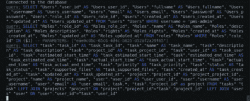
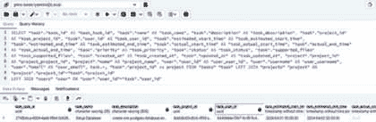
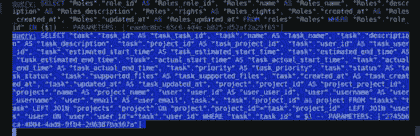
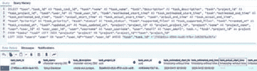

# 第六章

# 项目与任务模块的 REST API

# 简介

在项目管理系统中（PMS），“*项目模块*”通常指的是一个特定的组件或核心模块。这些模块旨在简化项目规划、执行和监控的各个方面，使项目经理和团队能够更有效地管理复杂项目。

每个项目模块通常专注于特定领域，例如任务管理、资源分配、时间跟踪或报告，提供专门的工具和功能来支持这些功能。这些模块是 PMS 的重要组成部分，使用户能够根据其项目的具体需求定制项目管理方法。任务模块在项目管理中发挥着关键作用，它提供了一种集中和有序的方法来管理和执行项目中的任务。它增强了协作，提高了对任务进度的可见性，并有助于确保项目按时按范围完成。

# 结构

在本章中，我们将讨论以下主题：

+   带输入验证的项目管理

    +   带分配用户的创建项目 API

    +   项目更新、列表、项目详情和删除 API

+   带输入验证的任务管理

    +   带分配用户的创建任务 API

    +   任务更新、列表、任务详情和删除 API

# 项目管理

项目模块作为一个集中平台，使项目经理和团队能够高效地规划、执行和完成项目，同时保持控制、透明度和协作。

# 项目服务

我们之前在*第四章，规划应用*中定义了项目实体，因此让我们首先在项目目录中创建名为`**projects_service.ts**`的`Project Service`，以下为相关代码：

`import { Repository } from 'typeorm';`

`import { BaseService } from '../../utils/base_service';`

`import { DatabaseUtil } from '../../utils/db';`

`import { Projects } from './projects_entity';`

`export class ProjectsService extends BaseService<Projects> {`

`constructor() {`

`let projectRepository: Repository<Projects> | null = null;`

`projectRepository = new DatabaseUtil().getRepository(Projects);`

`super(projectRepository);`

`}`

`}`

`**`ProjectsService`**`类继承自`**BaseService**`，并使用 TypeORM 与数据库中的`**Projects**`实体一起工作。该实体的存储库是从`**DatabaseUtil**`类中获得的。该服务结构旨在简化对`**Projects**`实体的数据库操作，例如创建、检索、更新和删除记录。

我们将按以下方式开发项目的 REST API：

+   `**添加**` 项目

+   `**获取所有**` 项目

+   `**获取单个**` 项目

+   `**更新**` 项目

+   `**删除**` 项目

# 输入验证

在项目模块中进行的输入验证在确保项目管理系统中使用的数据的完整性和可靠性方面发挥着关键作用。它涉及检查和验证来自各种来源的用户输入或接收到的数据，以确保其符合预定义的标准并满足所需的标准。

在 utils 目录下的`**common.ts**`文件中添加以下函数，`**checkValidDate**`，用于验证日期：

`export const **checkValidDate** = function (value) {`

`if (!moment(value, 'YYYY-MM-DD HH:mm:ss', true).isValid()) {`

`return false;`

`}`

`return true;`

`};`

现在，在`**projects_routes.ts**`文件中添加`**validProjectInput**`，代码如下：

`import { Express } from 'express';`

`import { ProjectController } from './projects_controller';`

`import { body } from 'express-validator';`

`import { validate } from '../../utils/validator';`

`import moment from 'moment';`

`import { authorize } from '../../utils/auth_util';`

`import { checkValidDate } from '../../utils/common'`

`const **validProjectInput** = [`

`body('name').trim().notEmpty().withMessage('It should be required'),`

`body('user_ids').isArray().withMessage('It should be ids of users array'),`

`body('start_time').custom((value) => {`

`if (!**checkValidDate**(value)) {`

`throw new Error('Invalid date format YYYY-MM-DD HH:mm:ss');`

`}`

`const startTime = new Date(value);`

`const currentTime = new Date();`

`if (startTime <= currentTime) {`

`throw new Error('Start time must be greater than the current time');`

`}`

`return true;`

`}),`

`body('end_time').custom((value, { req }) => {`

`if (!**checkValidDate**(value)) {`

`throw new Error('Invalid date format YYYY-MM-DD HH:mm:ss');`

`}`

`const startTime = new Date(req.body.start_time);`

`const endTime = new Date(value);`

`if (endTime <= startTime) {`

`throw new Error('End time must be greater than the start time');`

`}`

`return true;`

`})`

`];`

这里是前面代码关键部分的详细信息：

+   `**validProjectInput**` **数组**：此数组包含对项目中预期每个输入字段的一系列验证检查。数组的每个元素都是一个验证函数，用于检查数据的特定方面。

+   `**body('name').trim().notEmpty().withMessage('It should be required')**`：此验证请求体中的名称字段，`**.trim()**`从输入中删除任何前导或尾随空白字符；`**.notEmpty()**`检查该字段是否不为空；`**.withMessage('It should be required')**`在验证失败时提供自定义错误消息，指出`**'name'**`字段是必需的。

+   `**body('user_ids').isArray().withMessage('It should be ids of users array')**`：此验证请求体中的`**user_ids**`字段，`**.isArray()**`检查该字段是否为数组；`**.withMessage('It should be ids of users array')**`在验证失败时提供自定义错误消息，指定`**user_ids**`字段应该是用户 ID 的数组。

+   `**body('start_time').custom((value) => { /* … */ })**`: 这使用自定义验证函数验证请求体中的 start_time 字段。自定义验证函数检查值（即 '`**start_time**`' 的值）是否在有效的日期格式（`**YYYY-MM-DD HH:mm:ss**`）中。然后它将 '`**start_time**`' 与当前时间进行比较，确保 '`**start_time**`' 大于当前时间。如果这些检查中的任何一个失败，它将抛出一个带有自定义消息的错误。

+   `**body('end_time').custom((value, { req }) => { /* … */ })**`: 这使用另一个自定义验证函数验证请求体中的 `**end_time**` 字段。类似于之前的自定义函数，它检查值（即 '`**end_time**`' 的值）是否在有效的日期格式（`**YYYY-MM-DD HH:mm:ss**`）中。它还访问 `**req.body.start_time**` 来比较 '`**end_time**`' 与 '`**start_time**`'，以确保 '`**end_time**`' 大于 '`**start_time**`'。如果这些检查中的任何一个失败，它将抛出一个带有自定义消息的错误

# 添加项目

当使用 REST API 添加项目时，你通常在请求体中提供所需的数据，包括项目名称、描述以及任何相关属性。为此任务指定的 API 端点专门设计用于接受并验证这些数据，根据预定义的标准，最终基于提供的信息创建一个新项目。

我们之前已经创建了一个作为骨架类的 `**projects_controller.ts**`。现在，让我们使用扩展的基控制器来更改它，并使用基础服务执行以下代码进行数据库操作：

`import { Response, Request } from 'express';`

`import { hasPermission } from '../../utils/auth_util';`

`import { ProjectsService } from './projects_service';`

`import { UsersUtil } from '../users/users_controller';`

`export class ProjectController extends BaseController {`

`/**`

`* 处理新用户的添加。`

`* @param {object} req - 请求对象。`

`* @param {object} res - 响应对象。`

`*/`

`public async addHandler(req: Request, res: Response): Promise<void> {`

`if (!hasPermission(req.user.rights, 'add_project')) {`

`res.status(403).json({ statusCode: 403, status: 'error', message: '未授权' });`

`return;`

`}`

`try {`

`// 创建 ProjectService 的实例`

`const service = new ProjectsService();`

`// 从请求体中提取项目数据`

`const project = req.body;`

`// 检查提供的 user_ids 是否有效`

`const isValidUsers = await UsersUtil.checkValidUserIds`

`(project.user_ids);`

`if (!isValidUsers) {`

`// 如果 user_ids 无效，发送错误响应`

`res.status(400).json({ statusCode: 400, status: 'error', message: '无效的用户 IDs' });`

`return;`

`}`

`// 如果 user_ids 有效，创建用户`

`const createdProject = await service.create(project);`

`res.status(201).json(createdProject);`

`} catch (error) {`

`// 处理错误并发送适当的响应`

``console.error(`添加用户时出错 => ${error.message}`);``

`res.status(500).json({ statusCode: 500, status: 'error', message: '内部服务器错误' });`

`}`

`}`

```js```` `public async getAllHandler(req: Request, res: Response) {}`    `public async getOneHandler(req: Request, res: Response) {}`    `public async updateHandler(req: Request, res: Response) {}`    `public async deleteHandler(req: Request, res: Response) {}`    `}`    在`**UserUtil**`类中添加`**checkValidUserIds function**`，以下代码用于检查给定的`**userIds**`是否有效且存在于数据库中：    `public static async checkValidUserIds(user_ids: string[]) {`    `const userService = new UsersService();`    `// 查询数据库以检查所有 user_ids 是否有效`    `const users = await userService.findByIds(user_ids);`    `// 检查所有 user_ids 是否在数据库中找到`    `return users.data.length === user_ids.length;`    `}`    在此上下文中，`**addHandler**`方法获取传入请求体中的数据。然后通过调用创建方法将此数据传输到基础服务，该创建方法负责将此信息纳入数据库。此外，我们还包括在项目创建过程中将用户添加到项目中的功能，将用户与项目关联。    现在，让我们在`**projects_router.ts**`文件中调用`**addHandler**`，如下所示：    `export class ProjectRoutes {`    `private baseEndPoint = '/api/projects';`    `constructor(app: Express) {`    `const controller = new ProjectController();`    `**app.route(this.baseEndPoint)**`    `**.all(authorize)**`    `**.post(validate(validProjectInput), controller.addHandler);**`    `}`    `}`    我们已经为添加项目建立了路由，并在将数据插入数据库之前添加了中间件来验证请求。    一旦 API 成功触发，以下数据将被添加到 PostgreSQL 数据库中：    **图 6.1：Postgres 添加项目输出**    **REST API 添加项目**    **请求**    `URL : http://127.0.0.1:3000/api/projects`    `方法: POST`    `body :`    `{`    `"name":"项目管理",`    `"description":"此项目是关于管理的",`    `"User_ids": ["b930d02c-43af-4875-b7e9-546c9f4c23dd",`    `"611b346e-be39-4a7e-96d1-e7421193bd5a", "d166945a-f85d-485c-bdac-0c8056b3188a"],`    `"start_time":"2023-09-25 00:00:00",`    `"end_time":"2023-12-15 00:00:00"`    `}`    **响应**    `{`    `"statusCode": 201,`    `"status": "success",`    `"data": {`    `"project_id": "c2e9b17b-0af2-453b-b0c9-43ea2d304dca",`    `"name": "项目管理",`    `"description": "此项目是关于管理的",`    `"user_ids": [`    `"b930d02c-43af-4875-b7e9-546c9f4c23dd",`    `"611b346e-be39-4a7e-96d1-e7421193bd5a",`    `"d166945a-f85d-485c-bdac-0c8056b3188a"`    `],`    `"start_time": "2023-09-25 00:00:00",`    `"end_time": "2023-12-15 00:00:00",`    `"created_at": "2023-09-23T17:23:36.061Z",`    `"updated_at": "2023-09-23T17:23:36.061Z"`    `}`    `}`    `}`    **图 6.2：Postman 添加项目数据的响应 201**    如果尝试使用相同的请求添加具有唯一项目名称的项目，则会收到一个`**409**`冲突代码的错误：    `{`    `"statusCode": 409,`    `"status": "error",`    `"message": "键（name）=(项目管理)已存在。"`    `}`    **图 6.3：Postman 已存在项目响应 409**    在另一种情况下，如果您将`**start_time**`更改为早于当前时间，则会收到一个`**400**`状态码的 Bad Request 错误，如下所示：    `{`    `"statusCode": 400,`    `"status": "error",`    `"errors": [`    `{`    `"rights": "开始时间必须晚于当前时间"`    `}`    `]`    `}`    **图 6.4：Postman 给项目提供无效日期的响应 400**    # GetAll Project    在成功将项目添加到数据库后，下一步是从数据库中检索新插入的项目。为此，更新`**projects_controller.ts**`文件中的`**getAllHandler**`方法，如下所示：    `public async **getAllHandler**(req: Request, res: Response): Promise<void> {`    `if (!hasPermission(req.user.rights, 'get_all_projects')) {`    `res.status(403).json({ statusCode: 403, status: 'error', message: '未授权' });`    `return;`    `}`   ```js``` `const service = new ProjectsService();`    `const result = await service.findAll(req.query);`    `for (const project of result.data) {`    `project['users'] = await UsersUtil.getUsernamesById(project.user_ids);`    `delete project.user_ids;`    `}`    `res.status(result.statusCode).json(result);`    `}`    在前面的代码中，我们发送了与项目关联用户的`**user_id**`以及用户名。因此，我们在用户工具中创建了一个方法，从`**user_id**`获取用户名，如下所示：    `public static async **getUsernamesById**(user_ids: string[]) {`    `const userService = new UsersService();`    `// 查询数据库以检查所有 user_ids 是否有效`    `const queryResult = await userService.findByIds(user_ids);`    `if (queryResult.statusCode === 200) {`    `const users = queryResult.data;`    `const usernames = users.map((i) => {`    `return {`    `'username': i.username,`    `'user_id': i.user_id`    `};`    `});`    `return usernames;`    `}`    `return [];`    `}`    `The ```**getAllHandler`**`` method uses the `**ProjectsService**` class to retrieve all projects from the database based on the query parameters in the request. The resulting data is then sent back to the client with an appropriate HTTP status code and formatted as JSON.    The routes class in `**project_routes.ts**` can be updated to make a call to the new handler for GET request as:    `app.route(this.baseEndPoint)`    `.all(authorize)`    `.post(validate(validProjectInput), controller.addHandler)`    `**.get(controller.getAllHandler);**`    By employing this approach, we establish a `**GET**` route that fetches all projects stored in the database, effectively functioning as a REST API endpoint for retrieving project data.    **REST API** `**GetAll**` **Projects**    **Request**    `URL : http://127.0.0.1:3000/api/projects`    `Method: GET`    `Query Params: {}`    **Response**    `{`    `"statusCode": 200,`    `"status": "success",`    `"data": [`    `{`    `"project_id": "c2e9b17b-0af2-453b-b0c9-43ea2d304dca",`    `"name": "Project Management",`    `"description": "This Project is about for Management",`    `"start_time": "2023-09-24T18:30:00.000Z",`    `"end_time": "2023-12-14T18:30:00.000Z",`    `"created_at": "2023-09-23T17:23:36.061Z",`    `"updated_at": "2023-09-23T17:23:36.061Z",`    `"users": [`    `{`    `"username": "pms-admin",`    `"user_id": "b930d02c-43af-4875-b7e9-546c9f4c23dd"`    `},`    `{`    `"username": "pms-admin1",`    `"user_id": "611b346e-be39-4a7e-96d1-e7421193bd5a"`    `},`    `{`    `"username": "yamini",`    `"user_id": "d166945a-f85d-485c-bdac-0c8056b3188a"`    `}`    `]`    `}`    `]`    `}`    # Search Project by Name    To search for a project by name, you can utilize the same API endpoint as the one used for retrieving all projects. However, in this case, you will include query parameters to specify the search criteria.    **Request**    `URL : http://127.0.0.1:3000/api/projects?name=Project Management`    `Method: GET`    `Query Params: {name: Project Management }`    **Response**    `{`    `"statusCode": 200,`    `"status": "success",`    `"data": [`    `{`    `"project_id": "c2e9b17b-0af2-453b-b0c9-43ea2d304dca",`    `"name": "Project Management",`    `"description": "This Project is about for Management",`    `"start_time": "2023-09-24T18:30:00.000Z",`    `"end_time": "2023-12-14T18:30:00.000Z",`    `"created_at": "2023-09-23T17:23:36.061Z",`    `"updated_at": "2023-09-23T17:23:36.061Z",`    `"users": [`    `{`    `"username": "pms-admin",`    `"user_id": "b930d02c-43af-4875-b7e9-546c9f4c23dd"`    `},`    `{`    `"username": "pms-admin1",`    `"user_id": "611b346e-be39-4a7e-96d1-e7421193bd5a"`    `},`    `{`    `"username": "yamini",`    `"user_id": "d166945a-f85d-485c-bdac-0c8056b3188a"`    `}`    `]`    `}`    `]`    `}`    # GetOne Project    The “*GetOne Project*” endpoint plays a pivotal role in project management systems, allowing users to access in-depth information about a specific project without the requirement to fetch the complete project list. This functionality is indispensable for providing precise details regarding the attributes and permissions linked to each project.    To implement the “*GetOne Project*” API, modify the `**getOneHandler**` code in the project controller as follows:    `public async getOneHandler(req: Request, res: Response): Promise<void> {`    `if (!hasPermission(req.user.rights, 'get_details_project')) {`    `res.status(403).json({ statusCode: 403, status: 'error', message: 'Unauthorised' });`    `}`    `const service = new ProjectsService();`    `const result = await service.findOne(**req.params.project_id**);`    `result.data['users'] = await UsersUtil.getUsernamesById(result.data.user_ids);`    `delete result.data.user_ids;`    `res.status(result.statusCode).json(result);`    `}`    The ``**`getOneHandler**``**`** function serves as the bridge between the incoming client request, the service layer that interacts with the database, and the outgoing HTTP response. It retrieves a single project’s details from the database based on the provided project ID and sends the project information back to the client.    This method is called from the routes file by creating a new route for it as follows:    `app.route(this.baseEndPoint + '/**:project_id'**)`    `.all(authorize)`    `.get(controller.getOneHandler);`    Here, ``**/:project_id**` ` will be a request parameter meant to capture the ID of the project that the user wants to retrieve.    Parameters passed to APIs can be read using `**request.params**`, as seen in the previous example while reading `**project_id**`:    `const project_id = req.params.project_id;`    **REST API GetOne Project**    **Request**    `URL : http://127.0.0.1:3000/api/projects/`    `Method: GET`    **Response**    `{`    `"statusCode": 200,`    `"status": "success",`    `"data": {`    `"project_id": "c2e9b17b-0af2-453b-b0c9-43ea2d304dca",`    `"name": "Project Management",`    `"description": "This Project is about for Management",`    `"start_time": "2023-09-24T18:30:00.000Z",`    `"end_time": "2023-12-24T18:30:00.000Z",`    `"created_at": "2023-09-23T17:23:36.061Z",`    `"updated_at": "2023-09-24T17:18:55.827Z",`    `"users": [`    `{`    `"username": "pms-admin",`    `"user_id": "b930d02c-43af-4875-b7e9-546c9f4c23dd"`    `},`    `{`    `"username": "pms-admin1",`    `"user_id": "611b346e-be39-4a7e-96d1-e7421193bd5a"`    `},`    `{`    `"username": "yamini",`    `"user_id": "d166945a-f85d-485c-bdac-0c8056b3188a"`    `}`    `]`    `}`    `}`    Providing a valid project ID will yield a successful response, while inputting an ID that doesn’t correspond to an existing database entry will result in a `**404 error**`, signifying that the requested entity was not found.    `{`    `"statusCode": 404,`    `"status": "error",`    `"message": "Not Found"`    `}`    # Update Project    The process of updating a project details involves making changes to the existing data of a particular project that is stored in the database. Through this process, you can modify attributes such as the project’s name, description, and associated users. Updating a project is crucial for maintaining the accuracy and currency of project information, especially when there are alterations in project permissions that need to be reflected in the database.    To implement the `**"Update Project"**` API, make the following changes in the `**updateHandler**` code within the project controller:    `public async **updateHandler**(req: Request, res: Response): Promise<void> {`    `if (!hasPermission(req.user.rights, 'edit_project')) {`    `res.status(403).json({ statusCode: 403, status: 'error', message: 'Unauthorised' });`    `return;`    `}`    `const project = req.body;`    `const service = new ProjectsService();`    `const result = await service.update(req.params.id, project);`    `res.status(result.statusCode).json(result);`    `}`    The **`**`**updateHandler**`**`** function handles requests to update a task. It begins by checking if the user has the necessary permission, and if so, it extracts the updated project data, initializes the project service, performs the update operation in the database, and responds to the client with the appropriate status code and result data.    This method is called from the routes file by creating a new route for it as follows:    `app.route(this.baseEndPoint + '/:id')`    `.all(authorize)`    `.get(controller.getOneHandler)`    `**.put(validate(validProjectInput), controller.updateHandler);**`    Here, ``**/:id**` ` will be a request parameter meant to capture the ID of the project that the user wants to retrieve, and it also validates data before updating in the database.    **REST API Update Project**    **Request**    `URL : http://127.0.0.1:3000/api/projects/`    `Method: PUT`    `body :`    `{`    `"name":"Project Management",`    `"description":"This Project is about for Management",`    `"user_ids":["b930d02c-43af-4875-b7e9-546c9f4c23dd","611b346e-be39-4a7e-96d1-e7421193bd5a","d166945a-f85d-485c-bdac-0c8056b3188a"],`    `"start_time":"2023-09-25 00:00:00",`    `"end_time":"2023-12-25 00:00:00"`    `}`    **Response**    `{`    `"statusCode": 200,`    `"status": "success",`    `"data": {`    `"project_id": "c2e9b17b-0af2-453b-b0c9-43ea2d304dca",`    `"name": "Project Management",`    `"description": "This Project is about for Management",`    `"user_ids": [`    `"b930d02c-43af-4875-b7e9-546c9f4c23dd",`    `"611b346e-be39-4a7e-96d1-e7421193bd5a",`    `"d166945a-f85d-485c-bdac-0c8056b3188a"`    `],`    `"start_time": "2023-09-24T18:30:00.000Z",`    `"end_time": "2023-12-24T18:30:00.000Z",`    `"created_at": "2023-09-23T17:23:36.061Z",`    `"updated_at": "2023-09-24T17:18:55.827Z"`    `}`    `}`    Providing a valid project ID will yield a successful response, while inputting an ID that doesn’t correspond to an existing database entry will result in a `**404 error**`, signifying that the requested entity was not found.    `{`    `"statusCode": 404,`    `"status": "error",`    `"message": "Not Found"`    `}`    # Delete Project    The "`**delete**`” functionality for projects in a REST API involves the removal of a specific project from the database. This process is managed through an endpoint dedicated to project deletion. When a request is made to this endpoint, it triggers a function that handles the deletion process. The incoming request typically contains the unique identifier (`**project_id**`) of the project that needs to be deleted.    To implement the Delete Project API, make the following changes in the `**deleteHandler**` code in the project controller:    `public async **deleteHandler**(req: Request, res: Response): Promise<void> {`    `if (!hasPermission(req.user.rights, 'delete_project')) {`    `res.status(403).json({ statusCode: 403, status: 'error', message: 'Unauthorised' });`    `return;`    `}`    `const service = new ProjectsService();`    `const result = await service.delete(req.params.id);`    `res.status(result.statusCode).json(result);`    `}`    The ``**`deleteHandler`**`` processes the request by utilizing a service that interacts with the database. This service is responsible for executing the deletion operation. If the requested project exists in the database and the deletion is successful, the function responds with a success message and an appropriate status code, such as `**200 OK**`. If the role does not exist, the function returns an error response with a status code of `**404 Not Found**`, indicating that the project was not located in the database.    This method is called from the routes file by creating a new route for it as follows:    `app.route(this.baseEndPoint + '/:id')`    `.all(authorize)`    `.get(controller.getOneHandler)`    `.put(validate(validProjectInput), controller.updateHandler)`    `**.delete(controller.deleteHandler);**`    Here, ``**/:id**` ` will be a request parameter meant to capture the ID of the project that the user wants to delete.    **REST API Delete Project**    **Request**    `URL : http://127.0.0.1:3000/api/projects/`    `Method: DELETE`    **Response**    `{`    `"statusCode": 200,`    `"status": "success"`    `}`    In the case of an already deleted or not exist in the database:    `{`    `"statusCode": 404,`    `"status": "error",`    `"message": "Not Found"`    `}`    # Project Util    Following the development of the foundational base API for Project, several functions have been crafted within the Project Util class. These functions serve as valuable helpers and are intended for utilization in various other modules.    Now, let’s proceed to establish the `**ProjectUtil**` class within the `**projects_controller.ts**` file. The provided code snippet outlines the structure of this class:    `export class **ProjectsUtil** {`    `public static async **checkValidProjectIds**(project_ids: string[]) {`    `const projectService = new ProjectsService();`    `// Query the database to check if all project_ids are valid`    `const projects = await projectService.findByIds(project_ids);`    `// Check if all project_ids are found in the database`    `return projects.data.length === project_ids.length;`    `}`    `}`    In the preceding code, the ``**`checkValidProjectIds**``**`** function checks whether the given `**projects_ids**` are valid or not in the database.    In summary, a well-designed RESTful API project module enables organizations to efficiently manage their projects, collaborate effectively, and integrate project data into their applications and systems while adhering to best practices in security, validation, and documentation.    # Task Management    To manage tasks effectively, individuals and teams often use task management tools and software. This module provides features for creating, assigning, prioritizing, and tracking tasks. Tasks are the building blocks of project management. They help project managers and teams break down complex projects into manageable parts, allocate resources efficiently, and ensure that work progresses according to the project plan.    Let’s start creating a task service first to manage tasks.    # Task Service    Task Service is to facilitate the creation, updation, deletion, and retrieval of task details as required. Let’s create a `**tasks_services.ts**` file in the tasks directory with the following code:    `import { Repository } from 'typeorm';`    `import { BaseService } from '../../utils/base_service';`    `import { DatabaseUtil } from '../../utils/db';`    `import { Tasks } from './tasks_entity';`    `export class TasksService extends BaseService<Tasks> {`    `constructor() {`    `let taskRepository: Repository<Tasks> | null = null;`    `taskRepository = new DatabaseUtil().getRepository(Tasks);`    `super(taskRepository);`    `}`    `}`    The ```js**TasksService**``类从基类继承，允许它与数据库存储库交互，以管理任务。构造函数初始化任务数据库存储库，便于应用程序中与任务相关的功能进行数据库操作。    我们将按以下方式开发项目的 REST API：    *   `**添加**`任务    *   `**获取所有**`任务    *   `**获取一个**`任务    *   `**更新**`任务    *   `**删除**`任务    # Input Validation    任务输入验证是确保作为软件应用程序中任务输入提供的数据符合预定义标准和约束的过程。    现在，让我们在`**tasks_routes.ts**`文件中添加`**validTaskInput**`，如下所示：    `import { Express } from 'express';`    `import { TaskController } from './tasks_controller';`    `import { body } from 'express-validator';`    `import { checkValidDate } from '../../utils/common';`    `import { validate } from '../../utils/validator';`    `import { authorize } from '../../utils/auth_util';`   ````` `const **validTaskInput** = [`    `body('name').trim().notEmpty().withMessage('It should be required'),`    `body('project_id').trim().notEmpty().withMessage('It should be`    `required'),`    `body('user_id').trim().notEmpty().withMessage('It should be`    `required'),`    `body('estimated_start_time').trim().notEmpty().withMessage('It should be required'),`    `body('estimated_end_time').trim().notEmpty().withMessage('It should be required'),`    `body('estimated_start_time').custom((value) => {`    `if (!checkValidDate(value)) {`    `throw new Error('Invalid date format YYYY-MM-DD HH:mm:ss');`    `}`    `const startTime = new Date(value);`    `const currentTime = new Date();`    `if (startTime <= currentTime) {`    `throw new Error('Start time must be greater than the current time');`    `}`    `return true;`    `}),`    `body('estimated_end_time').custom((value, { req }) => {`    `if (!checkValidDate(value)) {`    `throw new Error('Invalid date format YYYY-MM-DD HH:mm:ss');`    `}`    `const startTime = new Date(req.body.start_time);`    `const endTime = new Date(value);`    `if (endTime <= startTime) {`    `throw new Error('End time must be greater than the start time');`    `}`    `return true;`    `})`    `];`    Here are the details of the key parts of the preceding code:    *   `**body('name').trim().notEmpty().withMessage('It should be required')**`: This validates the name field in the request body. `**.trim()**` removes any leading or trailing whitespace from the input; `**.notEmpty()**` checks that the field is not empty; `**.withMessage('It should be required')**` provides a custom error message if the validation fails, indicating that the ‘name’ field is required. *   `**body('project_id').trim().notEmpty().withMessage('It should be required')**`: This validates the name field in the request `**body. .trim()**` removes any leading or trailing whitespace from the input; .`**notEmpty()**` checks that the field is not empty; `**.withMessage('It should be required')**` provides a custom error message if the validation fails, indicating that the `**'project_id**`' field is required. *   `**body('user_id').trim().notEmpty().withMessage('It should be required')**`: This validates the name field in the request `**body. .trim()**` removes any leading or trailing whitespace from the input; `**.notEmpty()**` checks that the field is not empty; `**.withMessage('It should be required')**` provides a custom error message if the validation fails, indicating that the '`**user_id**`' field is required. *   `**body('estimated_start_time').trim().notEmpty().withMessage('It should be required')**`: This validates the name field in the request `**body. .trim()**` removes any leading or trailing whitespace from the input; `**.notEmpty()**` checks that the field is not empty; `**.withMessage('It should be required')**` provides a custom error message if the validation fails, indicating that the '`**estimated_start_time**`' field is required. *   `**body('estimated_end_time').trim().notEmpty().withMessage('It should be required')**`: This validates the name field in the request `**body. .trim()**` removes any leading or trailing whitespace from the input; `**.notEmpty()**` checks that the field is not empty; `**.withMessage('It should be required')**` provides a custom error message if the validation fails, indicating that the ''`**estimated_end_time**`'' field is required. *   `**body('estimated_start_time').custom((value) => { /* … */ })**`: This validates the `**start_time**` field in the request body using a custom validation function. The custom validation function checks if the value (the '`**start_time**`' value) is in a valid date format (`**YYYY-MM-DD HH:mm:ss**`). It then compares the '`**estimated_start_time**`' with the current time, ensuring that the '`**estimated_start_time**`' is greater than the current time. If any of these checks fail, it throws an error with a custom message. *   `**body('estimated_end_time').custom((value, { req }) => { /* … */ })**`: This validates the `**estimated_start_time**` field in the request body using another custom validation function. Similar to the previous custom function, it checks if the value (the '`**estimated_end_time**`' value) is in a valid date format (`**YYYY-MM-DD HH:mm:ss**`). It also accesses the `**req.body**`. to compare the '`**estimated_end_time**`' with the '`**estimated_start_time**`' to ensure that '`**estimated_end_time**`' is greater than '`**estimated_start_time**`'. If any of these checks fail, it throws an error with a custom message.    In this manner, we can implement fundamental validation for tasks.    # Add Task    When employing the REST API to initiate the addition of a task, the customary procedure involves providing essential information within the request body. This information typically encompasses details such as the task’s name, description, and any related attributes. The dedicated API endpoint, tailored for this specific purpose, is designed to receive and meticulously validate this data, ensuring it aligns with predefined criteria. Subsequently, this validation process culminates in the creation of a fresh task, founded upon the information furnished in the request.    Previously, we established the initial structure of the `**tasks_controller.ts**` class as a skeletal outline. Now, let’s proceed to enhance its functionality by extending it from the `**BaseController**` and leveraging the capabilities of the `**BaseService**` to carry out database operations.    Following is the code for this implementation:    `import { Response, Request } from 'express';`    `import { hasPermission } from '../../utils/auth_util';`    `import { BaseController } from '../../utils/base_controller';`    `import { TasksService } from './tasks_service';`    `import { UsersUtil } from '../users/users_controller';`    `import { ProjectsUtil } from '../projects/projects_controller';`    `export class TaskController extends BaseController {`    `/**`    `* Handles the addition of a new user.`    `* @param {object} req - The request object.`    `* @param {object} res - The response object.`    `*/`    `public async addHandler(req: Request, res: Response): Promise<void> {`    `if (!hasPermission(req.user.rights, 'add_task')) {`    `res.status(403).json({ statusCode: 403, status: 'error', message: 'Unauthorised' });`    `return;`    `}`    `try {`    `// Create an instance of the ProjectService`    `const service = new TasksService();`    `// Extract task data from the request body`    `const task = req.body;`    `//check if the provided project_id is valid`    `const isValidProject = await ProjectsUtil.`    `checkValidProjectIds([task.project_id]);`    `if (!isValidProject) {`    `// If user_ids are invalid, send an error response`    `res.status(400).json({ statusCode: 400, status: 'error', message: 'Invalid project_id' });`    `return;`    `}`    `// Check if the provided user_id is valid`    `const isValidUser = await UsersUtil.checkValidUserIds([task.user_id]);`    `if (!isValidUser) {`    `// If user_ids are invalid, send an error response`    `res.status(400).json({ statusCode: 400, status: 'error', message: 'Invalid user_id' });`    `return;`    `}`    `// If user_ids are valid, create the user`    `const createdTask = await service.create(task);`    `res.status(201).json(createdTask);`    `} catch (error) {`    `// Handle errors and send an appropriate response`    ``console.error(`Error while addUser => ${error.message}`);``    `res.status(500).json({ statusCode: 500, status: 'error', message: 'Internal server error' });`    `}`    `}`   ```js` `public async getAllHandler(req: Request, res: Response) {}`    `public async getOneHandler(req: Request, res: Response) {}`    `public async updateHandler(req: Request, res: Response) {}`    `public async deleteHandler(req: Request, res: Response) {}`    `}`    The `**addHandler**` method retrieves the data provided within the incoming request body. Subsequently, it forwards this data to the Base service by calling the create method, responsible for integrating this information into the database. Additionally, we are extending this process to include the assignment of the user and project to the task, effectively associating the user and project with the task during its creation.    Now, let’s call `**addHandler**` in the task routes with change in the `**tasks_router.ts**` file as follows:    `export class TaskRoutes {`    `private baseEndPoint = '/api/projects';`    `constructor(app: Express) {`    `const controller = new ProjectController();`    `app.route(this.baseEndPoint)`    `.all(authorize)`    `.post(validate(validTaskInput), controller.addHandler);`    `}`    `}`    We have established routes for adding tasks and incorporated middleware to validate requests before inserting data into the database.    **REST API Add Project**    **Request**    `URL : http://127.0.0.1:3000/api/tasks`    `Method: POST`    `body :`    `{`    `"name":"Setup Database",`    `"description":"create one postgres database and setup database for project`    `management project",`    `"project_id":"c2e9b17b-0af2-453b-b0c9-43ea2d304dca",`    `"user_id":"d166945a-f85d-485c-bdac-0c8056b3188a",`    `"estimated_start_time":"2023-10-01 00:00:00",`    `"estimated_end_time":"2023-10-02 00:00:00"`    `}`    **Response**    `{`    `"statusCode": 201,`    `"status": "success",`    `"data": {`    `"task_id": "74f61799-7046-47d9-8f04-897f07b4e178",`    `"name": "Setup Database",`    `"description": "create one postgres database and setup database for project management project",`    `"project_id": "c2e9b17b-0af2-453b-b0c9-43ea2d304dca",`    `"user_id": "d166945a-f85d-485c-bdac-0c8056b3188a",`    `"estimated_start_time": "2023-10-01 00:00:00",`    `"estimated_end_time": "2023-10-02 00:00:00",`    `"actual_start_time": null,`    `"actual_end_time": null,`    `"priority": "Low",`    `"status": "Not-Started",`    `"supported_files": [],`    `"created_at": "2023-09-30T12:17:51.138Z",`    `"updated_at": "2023-09-30T12:17:51.138Z"`    `}`    `}`    In the case of a unique task name, trying again with the same request gives an error as `**409**` conflict code:    `{`    `"statusCode": 409,`    `"status": "error",`    `"message": "Key (name)=(Setup Database) already exists."`    `}`    In another case, if you change in rights as “`**rights**`”:”`**no_rights**`”, it gives an error for a Bad Request with a `**400**` status code as follows:    `{`    `"statusCode": 400,`    `"status": "error",`    `"errors": [`    `{`    `"rights": "Invalid permission"`    `}`    `]`    `}`    In the database for the task entity, we added the default value for priority as “`**Low**`” and status as “`**Not-Started**`”, so that it takes automatically while creating the task.    # GetAll Task    After successfully adding a task to the database, the next step involves retrieving the newly inserted task from the database. To achieve this, update the `**getAllHandler**` method in the `**tasks_controller.ts**` file with the following code:    `public async getAllHandler(req: Request, res: Response): Promise<void> {`    `if (!hasPermission(req.user.rights, 'get_all_tasks')) {`    `res.status(403).json({ statusCode: 403, status: 'error', message: 'Unauthorised' });`    `return;`    `}`    `const service = new TasksService();`    `const result = await service.findAll(req.query);`    `res.status(result.statusCode).json(result);`    `}`    A Task is associated with both a project and a user. In this API, we must also display the details of the project and user. Therefore, the standard `**findAll**` method from the base service does not provide the functionality we require. To achieve this, we need to override the `**findAll**` method in the `**tasks_service.ts**` file with the following code:    `export class TasksService extends BaseService<Tasks> {`    `private taskRepository: Repository<Tasks> | null = null;`    `constructor() {`    `let taskRepository: Repository<Tasks> | null = null;`    `taskRepository = new DatabaseUtil().getRepository(Tasks);`    `super(taskRepository);`    `this.taskRepository = taskRepository;`    `}`    `// Override the method from the base service class`    `override async findAll(queryParams: object): Promise<ApiResponse<Tasks[]>> {`    `const queryBuilder = await this.taskRepository`    `.createQueryBuilder('task')`    `.leftJoin('task.project_id', 'project')`    `.leftJoin('task.user_id', 'user')`    `.addSelect([`    `'task.*',`    `'task.project_id as project',`    `'project.project_id',`    `'project.name',`    `'user.user_id',`    `'user.username',`    `'user.email',`    `]);`    `// Build the WHERE clause conditionally based on the search parameters`    `if (queryParams['username']) {`    `queryBuilder.andWhere('user.username ILIKE :userName', {`    `userName:`    `` `%${queryParams['username']}%` ``    `});`    `}`    `if (queryParams['projectname']) {`    `queryBuilder.andWhere('project.name ILIKE :projectName', {`    `projectName:`    `` `%${queryParams['projectname']}%` ``    `});`    `}`    `if (queryParams['project_id']) {`    `queryBuilder.andWhere('task.project_id = :projectId', {`    `projectId:`    `queryParams['project_id']`    `});`    `}`    `const data = await queryBuilder.getMany();`    `data.forEach((item) => {`    `item['projectDetails'] = item.project_id;`    `item['userDetails'] = item.user_id;`    `delete item.project_id;`    `delete item.user_id;`    `});`    `return { statusCode: 200, status: 'success', data: data };`    `}`    `}`    We created a query builder using TypeORM to build an SQL query for retrieving tasks with specific details. We use joins to fetch related data from the project and user tables. We specify the columns we want to select in the query using the `**addSelect**` method. We conditionally add `**WHERE**` clauses to the query based on the values provided in the `**queryParams**` object. For example, if the username or `**projectName**` is provided in the `**queryParams**`, we add a condition to filter the results accordingly.    Overall, this custom `**findAll**` method enhances the base service’s functionality to retrieve tasks with associated project and user details, while also allowing for conditional filtering based on specific criteria.    For a better understanding of which query is running, we can enable logging in the config of the database connection, in the `**connectDatabase**` function in `**db.ts**` file:    `public async connectDatabase() {`    `try {`    `if (DatabaseUtil.connection) {`    `return DatabaseUtil.connection;`    `} else {`    `const db_config = this.server_config.db_config;`    `const AppSource = new DataSource({`    `type: 'postgres',`    `host: db_config.host,`    `port: db_config.port,`    `username: db_config.username,`    `password: db_config.password,`    `database: db_config.dbname,`    `entities: [Roles, Users, Projects, Tasks, Comments],`    `synchronize: true,`    `logging: true,`    `poolSize: 10`    `});`    `await AppSource.initialize();`    `DatabaseUtil.connection = AppSource;`    `console.log('Connected to the database');`    `return DatabaseUtil.connection;`    `}`    `} catch (error) {`    `console.error('Error connecting to the database:', error);`    `}`    `}`    The ```**getAllHandler`**`` method uses the `**TasksService**` class to retrieve all projects from the database based on the query parameters in the request. The resulting data is then sent back to the client with an appropriate HTTP status code and formatted as JSON.    This controller method call in routes with a change in `**tasks_routes.ts**` as follows:    `app.route(this.baseEndPoint)`    `.all(authorize)`    `.post(validate(validProjectInput), controller.addHandler)`    `**.get(controller.getAllHandler);**`    By employing this approach, we establish a `**GET**` route that fetches all tasks stored in the database, effectively functioning as a REST API endpoint for retrieving task data.    When above API is triggered in terminal, you can see query as follows :    **Figure 6.5:** Enable Query Logging    Now, copy this query and run in `**pgAdmin**` or `**DBeaver**` as follows:    **Figure 6.6:** PgAdmin Run Query    **REST API GetAll Tasks**    **Request**    `URL : http://127.0.0.1:3000/api/tasks`    `Method: GET`    `Query Params: {}`    **Response**    `{`    `"statusCode": 200,`    `"status": "success",`    `"data": [`    `{`    `"task_id": "74f61799-7046-47d9-8f04-897f07b4e178",`    `"name": "Setup Database",`    `"description": "create one postgres database and setup database for project management project",`    `"estimated_start_time": "2023-09-30T18:30:00.000Z",`    `"estimated_end_time": "2023-10-01T18:30:00.000Z",`    `"actual_start_time": null,`    `"actual_end_time": null,`    `"priority": "Low",`    `"status": "Not-Started",`    `"supported_files": [],`    `"created_at": "2023-09-30T12:17:51.138Z",`    `"updated_at": "2023-09-30T12:17:51.138Z",`    `"projectDetails": {`    `"project_id": "c2e9b17b-0af2-453b-b0c9-43ea2d304dca",`    `"name": "Project Management"`    `},`    `"userDetails": {`    `"user_id": "d166945a-f85d-485c-bdac-0c8056b3188a",`    `"username": "yamini",`    `"email": "yamipanchal1993@gmail.com"`    `}`    `}`    `]`    `}`    # Search Task    To search for a task by `**project_id**`, `**projectname**`, or `**username**`, you can utilize the same API endpoint as the one used for retrieving all tasks. However, in this case, you will include query parameters to specify the search criteria.    **Request**    `URL : http://127.0.0.1:3000/api/projects?projectname=project&`    `username=yamini`    `Method: GET`    `Query Params: {`    `"projectname": "project",`    `"username":"yamini"`    `}`    **Response**    `{`    `"statusCode": 200,`    `"status": "success",`    `"data": [`    `{`    `"task_id": "74f61799-7046-47d9-8f04-897f07b4e178",`    `"name": "Setup Database",`    `"description": "create one postgres database and setup database for project management project",`    `"estimated_start_time": "2023-09-30T18:30:00.000Z",`    `"estimated_end_time": "2023-10-01T18:30:00.000Z",`    `"actual_start_time": null,`    `"actual_end_time": null,`    `"priority": "Low",`    `"status": "Not-Started",`    `"supported_files": [],`    `"created_at": "2023-09-30T12:17:51.138Z",`    `"updated_at": "2023-09-30T12:17:51.138Z",`    `"projectDetails": {`    `"project_id": "c2e9b17b-0af2-453b-b0c9-43ea2d304dca",`    `"name": "Project Management"`    `},`    `"userDetails": {`    `"user_id": "d166945a-f85d-485c-bdac-0c8056b3188a",`    `"username": "yamini",`    `"email": "yamipanchal1993@gmail.com"`    `}`    `}`    `]`    `}`    # GetOne Task    The “*Retrieve Individual Task*” endpoint holds a significant role within project management systems. It grants users access to comprehensive task details without necessitating the retrieval of the entire task catalog. This capability is crucial for delivering accurate insights into the specific attributes and permissions associated with each task.    To implement the `**"GetOne Task"**` API, modify the `**getOneHandler**` code in the task controller as follows:    `public async getOneHandler(req: Request, res: Response): Promise<void> {`    `if (!hasPermission(req.user.rights, 'get_details_task')) {`    `res.status(403).json({ statusCode: 403, status: 'error', message: 'Unauthorised' });`    `}`    `const service = new TaskService();`    `const result = await service.findOne(req.params.id);`    `res.status(result.statusCode).json(result);`    `}`    The ``**`getOneHandler**``**`** function serves as the bridge between the incoming client request, the service layer that interacts with the database, and the outgoing HTTP response. It retrieves a single task’s details from the database based on the provided task ID and sends the task information back to the client.    Similarly, override `**findAll**` method in service needs to override the `**findOne**` method in the `**tasks_service.ts**` file with the following code:    `override async findOne(id: string): Promise<ApiResponse<Tasks> |`    `undefined> {`    `try {`    `// Build the WHERE condition based on the primary key`    `const where = {};`    `const primaryKey: string =`    `this.taskRepository.metadata.primaryColumns[0].databaseName;`    `where[primaryKey] = id;`    `// Use the repository to find the entity based on the provided ID`    `const data = await this.taskRepository`    `.createQueryBuilder('task')`    `.leftJoin('task.project_id', 'project')`    `.leftJoin('task.user_id', 'user')`    `.addSelect([`    `'task.*',`    `'task.project_id as project',`    `'project.project_id',`    `'project.name',`    `'user.user_id',`    `'user.username',`    `'user.email',`    `])`    `.where(where)`    `.getOne();`    `if (data) {`    `data['projectDetails'] = data.project_id;`    `data['userDetails'] = data.user_id;`    `delete data.project_id;`    `delete data.user_id;`    `return { statusCode: 200, status: 'success', data: data };`    `} else {`    `return { statusCode: 404, status: 'error', message: 'Not Found' };`    `}`    `} catch (error) {`    `return { statusCode: 500, status: 'error', message: error.message };`    `}`    `}`    In this context, we have introduced a `**"where"**` condition to narrow down the data retrieval to a specific task. This condition is applied within the `**getAOne**` method from the controller, which is invoked from the routes file by creating a new route as follows:    `app.route(this.baseEndPoint + '/:id')`    `.all(authorize)`    `**.get(controller.getOneHandler);**`    Here, `/:id ` will be a request parameter meant to capture the ID of the task that the user wants to retrieve.    Once you trigger an API query, it will be logged in the terminal as shown below, and then you can copy it, change $1 to actual parameters, and paste it into `**pgAdmin**` or `**DBeaver**` as follows:    **Figure 6.7:** Get One Task Query    **Figure 6.8:** PgAdmin GetOne Task Query Output    **REST API GetOne Task**    **Request**    `URL : http://127.0.0.1:3000/api/tasks/74f61799-7046-47d9-8f04-897f07b4e178`    `Method: GET`    **Response**    `{`    `"statusCode": 200,`    `"status": "success",`    `"data": {`    `"task_id": "74f61799-7046-47d9-8f04-897f07b4e178",`    `"name": "Setup Database",`    `"description": "create one postgres database and setup database for project management project",`    `"estimated_start_time": "2023-09-30T18:30:00.000Z",`    `"estimated_end_time": "2023-10-01T18:30:00.000Z",`    `"actual_start_time": null,`    `"actual_end_time": null,`    `"priority": "Low",`    `"status": "Not-Started",`    `"supported_files": [],`    `"created_at": "2023-09-30T12:17:51.138Z",`    `"updated_at": "2023-09-30T12:17:51.138Z",`    `"projectDetails": {`    `"project_id": "c2e9b17b-0af2-453b-b0c9-43ea2d304dca",`    `"name": "Project Management"`    `},`    `"userDetails": {`    `"user_id": "d166945a-f85d-485c-bdac-0c8056b3188a",`    `"username": "yamini",`    `"email": "yamipanchal1993@gmail.com"`    `}`    `}`    `}`    Providing a valid task ID will yield a successful response, while inputting an ID that doesn’t correspond to an existing database entry will result in a 404 error, signifying that the requested entity was not found.    `{`    `"statusCode": 404,`    `"status": "error",`    `"message": "Not Found"`    `}`    # Update Task    The process of updating a task detail involves making changes to the existing data of a particular task that is stored in the database. Through this process, you can modify attributes such as the task’s name, description, and associated users or projects. Updating a task is crucial for maintaining the accuracy and currency of task information, especially when there are alterations in task permissions that need to be reflected in the database.    To implement the `**"Update Task"**` API, make the following changes in the `**updateHandler**` code within the project controller:    `public async **updateHandler**(req: Request, res: Response): Promise<void> {`    `if (!hasPermission(req.user.rights, 'edit_task')) {`    `res.status(403).json({ statusCode: 403, status: 'error', message: 'Unauthorised' });`    `return;`    `}`    `const task = req.body;`    `const service = new TasksService();`    `const result = await service.update(req.params.id, task);`    `res.status(result.statusCode).json(result);`    `}`    The **`**`**updateHandler**`**`** function handles requests to update a task. It begins by checking if the user has the necessary permission, and if so, it extracts the updated task data, initializes the task service, performs the update operation in the database, and responds to the client with the appropriate status code and result data. Here, we have added some validation in `**updateTaskInput**`.    This method is called from the routes file by creating a new route for it as follows:    `const **updateTaskInput** = [`    `body('estimated_start_time').custom((value) => {`    `if (value && !checkValidDate(value)) {`    `throw new Error('Invalid date format YYYY-MM-DD HH:mm:ss');`    `}`    `const startTime = new Date(value);`    `const currentTime = new Date();`    `if (startTime <= currentTime) {`    `throw new Error('Start time must be greater than the current time');`    `}`    `return true;`    `}),`    `body('estimated_end_time').custom((value, { req }) => {`    `if (value && !checkValidDate(value)) {`    `throw new Error('Invalid date format YYYY-MM-DD HH:mm:ss');`    `}`    `const startTime = new Date(req.body.start_time);`    `const endTime = new Date(value);`    `if (endTime <= startTime) {`    `throw new Error('End time must be greater than the start time');`    `}`    `return true;`    `})`    `];`   ```js `app.route(this.baseEndPoint + '/:id')`    `.all(authorize)`    `.get(controller.getOneHandler)`    `**.put(validate(updateTaskInput), controller.updateHandler);**`    Here, ``**/:id**` ` will be a request parameter meant to capture the ID of the task that the user wants to retrieve, and it also validates data before updating in the database.    **REST API Update Task**    **Request**    `URL : http://127.0.0.1:3000/api/tasks/74f61799-7046-47d9-8f04-897f07b4e178`    `Method: PUT`    `body :`    `{`    `"name":"Create Microservices",`    `"description":"Add microservice to store data on cloud",`    `"project_id":"c2e9b17b-0af2-453b-b0c9-43ea2d304dca",`    `"user_id":"d166945a-f85d-485c-bdac-0c8056b3188a",`    `"status":"In-Progress"`    `}`    **Response**    `{`    `"statusCode": 200,`    `"status": "success",`    `"data": {`    `"task_id": "74f61799-7046-47d9-8f04-897f07b4e178",`    `"name": "Create Microservices",`    `"description": "Add microservice to store data on cloud",`    `"estimated_start_time": "2023-09-30T18:30:00.000Z",`    `"estimated_end_time": "2023-10-01T18:30:00.000Z",`    `"actual_start_time": null,`    `"actual_end_time": null,`    `"priority": "Low",`    `"status": "In-Progress",`    `"supported_files": [],`    `"created_at": "2023-09-30T12:17:51.138Z",`    `"updated_at": "2023-10-07T15:57:21.912Z",`    `"project_id": "c2e9b17b-0af2-453b-b0c9-43ea2d304dca",`    `"user_id": "d166945a-f85d-485c-bdac-0c8056b3188a"`    `}`    `}`    Providing a valid task ID will yield a successful response, while inputting an ID that doesn’t correspond to an existing database entry will result in a `**404**` error, signifying that the requested entity was not found.    `{`    `"statusCode": 404,`    `"status": "error",`    `"message": "Not Found"`    `}`    # Delete Task    The "`**delete**`” functionality for tasks in a REST API involves the removal of a specific task from the database. This process is managed through an endpoint dedicated to task deletion. When a request is made to this endpoint, it triggers a function that handles the deletion process. The incoming request typically contains the unique identifier (`**task_id**`) of the task that needs to be deleted.    To implement the `**Delete**` Task API, make the following changes in the `**deleteHandler**` code in the task controller as follows:    `public async **deleteHandler**(req: Request, res: Response): Promise<void> {`    `if (!hasPermission(req.user.rights, 'delete_task')) {`    `res.status(403).json({ statusCode: 403, status: 'error', message: 'Unauthorised' });`    `return;`    `}`    `const service = new TasksService();`    `const result = await service.delete(req.params.id);`    `res.status(result.statusCode).json(result);`    `}`    The ``**`deleteHandler`**`` processes the request by utilizing a service that interacts with the database. This service is responsible for executing the deletion operation. If the requested project exists in the database and the deletion is successful, the function responds with a success message and an appropriate status code, such as `**200 OK**`. If the role does not exist, the function returns an error response with a status code of `**404 Not Found**`, indicating that the project was not located in the database.    This method is called from the routes file by creating a new route for it as follows:    `app.route(this.baseEndPoint + '/:id')`    `.all(authorize)`    `.get(controller.getOneHandler)`    `.put(validate(updateTaskInput), controller.updateHandler)`    `**.delete(controller.deleteHandler);**`    Here, ``**/:id**` ` will be a request parameter meant to capture the ID of the task that the user wants to delete.    **REST API Delete Task**    **Request**    `URL : http://127.0.0.1:3000/api/tasks/74f61799-7046-47d9-8f04-897f07b4e178`    `Method: DELETE`    **Response**    `{`    `"statusCode": 200,`    `"status": "success"`    `}`    In the case of an already deleted or not exist in the database:    `{`    `"statusCode": 404,`    `"status": "error",`    `"message": "Not Found"`    `}`    We’ve established various modules such as `**Role**`, `**User**`, `**Project**`, and `**Task**`. Similarly, you can create a Comment module and build APIs for handling comments. Within this module, comments are associated with a `**task_id**`. Users can add comments related to tasks, update their own comments, and delete their own comments. This aspect of the project is meant for your personal learning and experimentation.    # Upload Supported Files    In both tasks and comments, the ability to attach files is provided through the file module. You can create a file module that includes CRUD (Create, Read, Update, Delete) operations, following a structure similar to that of the project and task modules. The file module should define database fields such as `**file_id**`, `**file_url**`, `**file_name**`, `**created_by**`, `**created_at**`, `**updated_at**`, and more. Additionally, within the supported files array, you can add or remove `**file_id**` based on the corresponding action taken.    For reference, the `**file_entity.ts**` is as follows:    `import { Entity, PrimaryGeneratedColumn, Column, CreateDateColumn, UpdateDateColumn, JoinColumn, ManyToOne } from 'typeorm';`    `import { Users } from '../users/users_entity';`    `import { Tasks } from '../tasks/tasks_entity';`    `@Entity()`    `export class Files {`    `@PrimaryGeneratedColumn('uuid')`    `file_id: string;`    `@Column({ length: 30, nullable: false, unique: true })`    `file_name: string;`    `@Column({ length: 30 })`    `mime_type: string;`    `@Column()`    `@ManyToOne(() => Users, (userData) => userData.user_id)`    `@JoinColumn({ name: 'user_id' })`    `created_by: string;`    `@Column()`    `@ManyToOne(() => Tasks, (taskData) => taskData.task_id)`    `@JoinColumn({ name: 'task_id' })`    `task_id: string;`    `@Column()`    `@CreateDateColumn()`    `created_at: Date;`    `@Column()`    `@UpdateDateColumn()`    `updated_at: Date;`    `}`    To send files from your website to your Node.js server, we will use `**Multer**`. It’s widely used for its ability to easily handle file uploads. Once a file is uploaded, `**Multer**` lets you save it in a specific folder on your server. Not only does it help with storing files, but it also helps you keep track of their locations, making it easier to access and manage these files later.    `**Multer**` integrates with Node.js smoothly and offers a straightforward way to upload files. The following steps will help to set up `**Multer**` for our project:    *   **Install Multer**          First, make sure that you have Multer installed in your `**Node.js**` project. If you haven’t already, you can install it using npm:                    `$ npm install multer uuid --save`                    `$ npm install @types/multer @types/uuid --save-dev`           *   Create one folder in root directory as `**attachedFiles**` where all files will be uploaded. In `**server_config.json**`, add one parameter for path of uploaded files absolute path and change in `**IServerConfig**` interface as follows:          `export interface IServerConfig {`                    `port: number;`                    `db_config: {`                    `'db': string;`                    `'username': string;`                    `'password': string;`                    `'host': string;`                    `'port': number;`                    `'dbname': string;`                    `};`                    `email_config: {`                    `'from': string;`                    `'user': string;`                    `'password': string;`                    `};`                    `front_app_url: string;`                    `default_user?: {`                    `email: string;`                    `password: string;`                    `};`                    `attached_files_path?: string;`                    `}`           *   **Develop Multer Middleware**          In the utils directory, create a file named `**multer.ts**` for a middleware that uploads files to a specific folder with the following code:                    `import multer from 'multer';`                    `import { Request } from 'express';`                    `import { IServerConfig } from './config';`                    `import * as config from '../../server_config.json';`                    `// Define the options for Multer`                    `export const multerConfig = {`                    `storage: multer.diskStorage({`                    `destination: (req, file, cb) => {`                    `// Set the destination folder where files will be saved`                    `const server_config: IServerConfig = config;`                    `cb(null, server_config.attached_files_path); // Change 'attachedFiles' to your desired folder name`                    `},`                    `filename: (req, file, cb) => {`                    `// Generate a unique filename for the uploaded file`                    ``const uniqueFileName = `${Date.now()}-${file.``                    ``originalname}`;``                    `cb(null, uniqueFileName);`                    `}`                    `}),`                    `fileFilter: (req, file, cb) => {`                    `// Define the allowed file types (MIME types) here.`                    `const allowedMimeTypes = ['image/jpeg', 'image/png', 'application/pdf'];`                    `// Check if the uploaded file's MIME type is in the allowed list.`                    `if (allowedMimeTypes.includes(file.mimetype)) {`                    `cb(null, true); // Accept the file`                    `} else {`                    `cb(new Error('Invalid file type. Only PDF, JPEG, and PNG files are allowed.'), false); // Reject the file`                    `}`                    `}`                    `};`                    `const upload = multer(multerConfig);`                    `// Export the Multer middleware`                    `export const fileUploadMiddleware = upload.single('file');`                    `export const uploadFile = (req: Request) => {`                    `if (!req.file) {`                    `throw new Error('No file provided');`                    `}`                    `// Here you can perform additional processing and file storage logic`                    `// For example, save the file to a storage service or local directory`                    `const fileData = req.file;`                    `return fileData;`                    `};`              Here in the code, `**attachedFiles**` is the directory name where uploaded files are stored. You can change the name as you want. We allow only PDF and image file types, which are also changeable.    *   **Handle File Uploads in Your Route**          In your file module creation API, use the Multer middleware you created to handle file uploads. Here’s an example of how to use it in an Express route:                    `import { Express } from 'express';`                    `import { FileController } from './files_controller';`                    `import { fileUploadMiddleware } from '../../utils/multer';`                    `import { authorize } from '../../utils/auth_util';`                    `export class FileRoutes {`                    `private baseEndPoint = '/api/files';`                    `constructor(app: Express) {`                    `const controller = new FileController();`                    `app.route(this.baseEndPoint)`                    `.all(authorize)`                    `.post(fileUploadMiddleware, controller.addHandler);`                    `}`                    `}`                    In the controller, the following code is used to store `**fileData**` in the database, which is called from the router:                    `import { BaseController } from '../../utils/base_controller';`                    `**import { uploadFile } from '../../utils/multer';**`                    `import { Request, Response } from 'express';`                    `import { FilesService } from './files_service';`                    `import { Files } from './files_entity';`                    `export class FileController extends BaseController {`                    `/**`                    `* Handles the addition of a new file.`                    `* @param {object} req - The request object.`                    `* @param {object} res - The response object.`                    `*/`                    `public async addHandler(req: Request, res: Response):`                    `Promise<void> {`                    `try {`                    `const fileDataFromMulter = **uploadFile**(req);`                    `// Create an instance of the ProjectService`                    `const service = new FilesService();`                    `const fileData = new Files();`                    `fileData.file_name = fileDataFromMulter.filename;`                    `fileData.mime_type = fileDataFromMulter.mimetype;`                    `fileData.created_by = req?.user?.user_id ? req?.user?.user_id :`                    `null;`                    `const createdTask = await service.create(fileData);`                    `res.status(201).json(createdTask);`                    `res.status(200).json({ message: 'File uploaded successfully', fileData });`                    `} catch (error) {`                    `res.status(400).json({ error: error.message });`                    `}`                    `}`                    `public async getAllHandler(req: Request, res: Response): Promise<void> { }`                    `public async getOneHandler(req: Request, res: Response): Promise<void> { }`                    `public async updateHandler(req: Request, res: Response): Promise<void> { }`                    `public async deleteHandler(req: Request, res: Response): Promise<void> { }`                    `}`              From Postman, once you hit API, the following output will be displayed:    **Figure 6.9:** Upload File API    As per the code from the Multer middleware, the file is uploaded, and their data is stored in the database. Once the file data is stored, add that `**file_id**` in the task or comment module of the `**supported_files**` array.    *   **Serve Uploaded Files**          To get uploaded file, we will create an API that will be `**getOne**` file, so update `**getOneHandler**` function in the controller with the following code:                    `public async getOneHandler(req: Request, res: Response):`                    `Promise<void> {`                    `try {`                    `const service = new FilesService();`                    `const server_config: IServerConfig = config;`                    `const result = await service.findOne(req.params.id);`                    ``const file_path = `${server_config.attached_files_path}/${result.data.file_name}`;``                    `res.sendFile(file_path, (err) => {`                    `if (err) {`                    `// Handle errors, such as file not found or permission issues`                    `console.error('Error sending file:', err);`                    `res.status(500).json({ error: err.message });`                    `} else {`                    `res.status(200).end();`                    `}`                    `});`                    `} catch (error) {`                    `res.status(400).json({ error: error.message });`                    `}`                    `}`                    `This method called from the routes file as follows:`                    `app.route(this.baseEndPoint + '/:id')`                    `.all(authorize)`                    `.get(controller.getOneHandler);`              Once the API is triggered from Postman, the file associated with the directory will be downloaded directly, as follows:    **Figure 6.10:** Get Uploaded File    By following these steps, you can use Multer to handle file uploads in your Node.js application, store files in a specific folder, and update file paths in your database.    # Conclusion    In this chapter, we crafted REST APIs for both the project and task modules, incorporating robust input validation and facilitating comprehensive CRUD operations. We also delved into the realm of advanced query capabilities with TypeORM, skillfully selecting specific columns to optimize performance.    Moreover, we ventured into the territory of file uploads in Node.js, leveraging the powerful capabilities of the Multer package.    In the next chapter, we will learn about API Caching, which is helpful in improving your application performance.    # Further Reading    [`github.com/expressjs/multer`](https://github.com/expressjs/multer) ``` ```js` ````` ```js``` ```````
