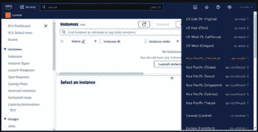
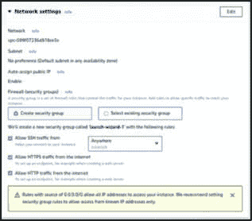
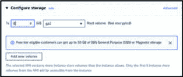
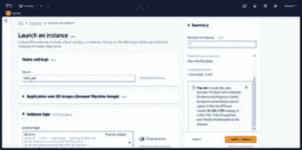
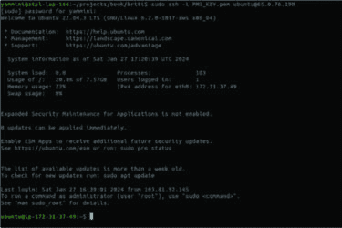

# 第十章

# 构建和部署应用程序

# 简介

在完成开发阶段后，使应用程序能够实现全局访问变得至关重要。任何应用程序的最终和关键步骤是将它构建并部署到一个集中位置，确保最终用户能够广泛地获得和使用。当部署 Node.js 应用程序时，有各种服务器和平台可供托管和运行您的应用程序。选择取决于因素，如可扩展性、易用性、性能和项目的特定要求。

在本章中，我们将深入探讨构建和安全的部署应用程序，采用最广泛使用的部署流程。

# 结构

在本章中，我们将讨论以下主题：

+   代码混淆

+   构建应用程序

+   部署应用程序

# 代码混淆

代码混淆是一种将源代码转换为更难以理解或逆向工程的形式的技术，同时保持其原始功能。代码混淆的目的不是显著提高代码的安全性，而是使代码更难以理解或反编译。

# 常见技术

代码混淆中常用的一些技术如下：

+   **重命名变量和函数：**

    混淆器将变量、函数和类的名称更改为无意义或随机的字符串，使得理解每个元素的目的变得更加困难。

+   **控制流混淆：**

    这涉及到重构程序的流程控制，例如使用`**goto**`语句或引入冗余代码，使其更不可预测且难以跟踪。

+   **字符串加密：**

    代码中的文本字符串被加密或编码，然后在运行时解密或解码。这使得仅通过检查代码来理解字符串值变得更加困难。

+   **代码拆分：**

    将函数分解成更小的部分或将它们拆分到多个文件中，使得理解整个程序的流程变得更加困难。

+   **虚拟代码插入：**

    引入无关或冗余的代码片段，这些代码片段不影响程序的功能，但会增加试图理解代码的人类读者的复杂性。

+   **常量值混淆：**

    通过改变数值常量的表示或使用数学运算来掩盖其真实值。

+   **反调试技术：**

    嵌入检测调试尝试的代码并改变程序行为的代码，使得逆向工程师在调试器中分析代码变得更加困难。

+   **代码压缩：**

    通过压缩代码来减少整体大小，使其更难以阅读和分析。

让我们深入了解代码混淆的实际方面，并亲手探索其细节。

对整个 TypeScript 项目进行混淆涉及将代码混淆应用于所有 TypeScript 文件，包括它们的依赖项。这个过程可能有些复杂，需要仔细考虑构建过程、依赖项以及可能对项目产生的影响。

代码可以通过多种方式进行混淆。所有工具中最受欢迎的是 `**javascript-obfuscator**`、`**UglifyJs**`、`**webpack**` 以及其他工具。我们将使用 `**javascript-obfuscator**` 来混淆代码。

# 安装所需依赖

安装 JavaScript 混淆库 `**javascript-obfuscator**` 以将其集成到项目中。从项目的根目录打开终端并粘贴以下命令：

`$ npm install  javascript-obfuscator  --save-dev`

# 创建混淆脚本

在根目录下创建一个工具目录，并添加名为 `**obfuscate.js**` 的脚本文件，其中包含以下代码，该代码将混淆每个生成的 JavaScript 文件。

`// obfuscate.js`

`/* eslint-disable no-undef */`

`/* eslint-disable @typescript-eslint/no-var-requires */`

`const JavaScriptObfuscator = require('javascript-obfuscator');`

`const fs = require('fs');`

`const path = require('path');`

`const jsonObfuscatorModule = require('json-obfuscator');`

`const **sourceDirectory** = 'dist/src'; // 使用您的实际输出目录更新`

`const **obfuscatedDirectory** = 'build'; // 混淆代码的输出目录`

`const obfuscateFile = (filePath) => {`

`const code = fs.readFileSync(filePath, 'utf8');`

`const obfuscatedCode = JavaScriptObfuscator.obfuscate(code, {`

`compact: true,`

`controlFlowFlattening: true`

`// …其他混淆选项`

`});`

`const obfuscatedFilePath = path.join(obfuscatedDirectory, path.relative(sourceDirectory, filePath));`

`fs.mkdirSync(path.dirname(obfuscatedFilePath), { recursive: true });`

`fs.writeFileSync(obfuscatedFilePath, obfuscatedCode.getObfuscatedCode(), 'utf8');`

`};`

`const processDirectory = (directoryPath) => {`

`const files = fs.readdirSync(directoryPath);`

`files.forEach((file) => {`

`const filePath = path.join(directoryPath, file);`

`if (fs.statSync(filePath).isDirectory()) {`

`processDirectory(filePath);`

`} else if (path.extname(filePath) === '.js') {`

`obfuscateFile(filePath);`

`}`

`});`

`};`

`processDirectory(sourceDirectory);`

Here,

+   `**sourceDirectory**` 指定包含原始 JavaScript 文件的目录。您应该使用从 TypeScript 文件编译生成的 JavaScript 文件的实际输出目录来更新它。

+   `**obfuscatedDirectory**` 指定混淆文件将被保存的目录。

+   `**obfuscateFile(filePath)**` 读取 JavaScript 文件的内容，使用 `**javascript-obfuscator**` 进行混淆，并将混淆后的内容写入指定位置。

+   `**processDirectory(directoryPath)**` 递归处理目录中的文件，对每个找到的 JavaScript 文件调用 `obfuscateFile`。

因此，当此脚本运行时，将创建一个新的构建目录，其中包含混淆后的 JavaScript 代码。

这提供了混淆过程的摘要，该过程将在后续的代码构建和执行中应用。

# 代码混淆的缺点

代码混淆使得源代码更难阅读和理解。然而，它也有一些缺点。

代码混淆可以为代码添加额外的复杂层，这可能会影响运行时的性能。由于代码被混淆，它更难阅读，并且在调试时追踪问题源变得具有挑战性。这增加了调试和故障排除的时间。

对于源代码的未来版本，每次发布新代码时都会再次进行混淆。混淆过程向代码中添加额外的字符和结构，导致文件大小增加。

最后要讨论的一点是安全性。混淆可能会给人一种代码安全的错觉。确实，之后的代码更难阅读，但它可以被逆向工程。混淆并不能修复代码中的任何安全漏洞，如果有人逆向工程了混淆后的代码，这些漏洞可能会被利用。

虽然熟练的黑客可能会逆向工程代码，但混淆对普通或不太熟练的黑客起到了威慑作用。即使是熟练的黑客，逆向工程也需要额外的努力。

# 构建应用程序

构建应用程序是指将应用程序的源代码转换成计算机可以执行或运行的格式或结构的过程。构建过程包括编译和转译。TypeScript 编译是将 TypeScript 源代码转换为 JavaScript 代码的过程，使其与各种 JavaScript 运行时环境兼容。

从根目录打开终端并执行以下命令以编译代码：

`$ tsc`

此命令根据 `**tsconfig.json**` 中提供的配置编译应用程序中的所有 TypeScript 文件。它包括具有 `**rootDir**` 设置为 `**src**` 的编译器选项，指定输入文件的根目录，以及 `**outDir**` 设置为 `**dist**`，指定编译文件的输出目录。编译成功后，TypeScript 将在指定的输出目录 `**dist**` 中生成等效的 JavaScript 文件。

现在我们更新 `**package.json**`，如下所示，为 `**build**`、`**start**` 和 `**test**` 添加脚本，以便使用 npm 运行它们。

`"scripts": {`

`"test": "mocha --require ts-node/register 'src/**/*.spec.ts'",`

`"start": "node dist/src/main.js",`

`"build": "tsc"`

`}`

在 `**package.json**` 中定义脚本后，在终端中使用 npm run 执行它。例如，`**npm run build**`，`**npm run start**` 或 `**npm run test**`。在这里，我们在编译后使用 `**js**` 运行应用程序，但在开发时可以使用 `**tsc –-watch**`。

在应用程序构建的高级阶段，我们将开发一个脚本来生成应用程序的压缩二进制文件。此文件将封装 JavaScript 源代码并进行必要的 Node 包安装。

在应用程序的根目录中创建包含以下代码的 ``**mkpackage.sh**`` 文件。

`npm install`

`./node_modules/.bin/tsc`

`rm -rf binaries/*`

`mkdir -p build`

`mkdir -p binaries`

`rm -rf build/*`

`node tools/obfuscate.js`

`cd build`

`echo  "Getting git version info.."`

`export VER=1.0`

`echo exports.version=\"1.0\" > ver`

`echo exports.version_long=\"$VER\" >> ver`

`echo "Copying things.."`

`cp ../package.json .`

`echo  "Doing compression .. "`

`tar czf pms_be_$VER.tgz *.js  package.json components routes tests utils`

`mv pms_be_$VER.tgz ../binaries/.`

`cd ..`

`echo "Created file pms_be_$VER.tgz"`

此脚本包含一组用于构建和打包 Node.js 应用程序的命令。让我们逐一分析每个部分：

+   **``**`npm install`:**``**

    安装 ``**package.json**`` 文件中指定的 Node.js 依赖。

+   **``**`./node_modules/.bin/tsc`:**``**

    调用位于 ``**node_modules**`` 目录中的 TypeScript 编译器（``**tsc**``），将 TypeScript 代码转换为 JavaScript。使用 ``**./node_modules/.bin/**`` 前缀来运行本地安装的 TypeScript 编译器。

+   **``**`rm -rf binaries/*`:**``**

    从 ``**binaries**`` 目录中删除所有文件和子目录。

+   **``**`mkdir -p build` and `mkdir -p binaries`:**``**

    如果不存在，则创建 ``**build**`` 和 ``**binaries**`` 目录。

+   **``**`rm -rf build/*`:**``**

    清除 ``**build**`` 目录中的所有文件和子目录。

+   **``**`node tools/obfuscate.js`:**``**

    执行位于 ``**tools/obfuscate.js**`` 的 Node.js 脚本。此脚本可能执行 JavaScript 代码的混淆。脚本的具体细节未提供，但似乎是一个用于混淆应用程序 JavaScript 源代码的自定义脚本。

+   **``**`cd build`:**``**

    将当前工作目录更改为 ``**build**`` 目录。

+   **``**`echo "Getting git version info.."`:**``**

    输出一条消息，表明脚本正在检索 Git 版本信息。

+   **``**`export VER=1.0`:**``**

    设置一个名为 ``**VER**`` 的环境变量，其值为 ``**1.0**``。

+   **``**`echo exports.version=\"1.0\" > ver` and `echo exports.version_long=\"$VER\" >> ver`:**``**

    创建一个名为 ``**ver**`` 的文件，其中包含版本信息。它导出应用程序版本以及一个长版本字符串。

+   **``**`echo "Copying things.."`:**``**

    输出一条消息，表明正在复制文件。

+   **``**`cp ../package.json .`:**``**

    从父目录（``**..**``）将 ``**package.json**`` 文件复制到当前（``**build**``）目录。

+   **``**`echo "Doing compression .. "`:**``**

    输出一条消息，表明正在压缩。

+   **``**tar czf pms_be_$VER.tgz *.js package.json components routes tests utils**``:**

    创建一个包含特定文件和目录（JavaScript 文件、`**package.json**`、`**components**`、`**routes**`、`**tests**`、`**utils**`）的压缩 tarball (```**pms_be_$VER.tgz**``)。

+   **``**mv pms_be_$VER.tgz ../binaries/.**``**:**

    将创建的 tarball 移动到 `**binaries**` 目录。

+   **``**cd ..**``**:**

    将工作目录返回到父目录。

+   **``**echo "Created file pms_be_$VER.tgz"**``**:**

    输出一条消息，指示已成功创建 tarball。

此脚本似乎自动化了构建和打包 Node.js 应用程序所涉及的各种任务。它处理依赖项安装、TypeScript 编译、混淆、版本控制和压缩成 tarball 以进行分发。生成的 tarball 存储在 `**binaries**` 目录中，名称反映了应用程序版本。

此二进制文件将在服务器上进一步部署。

# 部署应用程序

部署应用程序使用不同类型的服务器，这里我们将使用最推荐的在 AWS 实例上部署 Node.js 应用程序的方式。在亚马逊网络服务 (AWS) 上部署 Node.js 应用程序提供了几个优势，使其成为许多开发人员和企业的首选。AWS 拥有丰富的服务生态系统，这些服务补充了 Node.js 应用程序开发。

# AWS 服务器设置

创建一个亚马逊 EC2 实例以托管 Node.js 应用程序涉及几个步骤。以下是如何创建 EC2 实例并在其上部署 Node.js 应用程序的逐步指南。

# 登录 AWS 管理控制台

亚马逊提供一年的免费层账户，因此任何人都可以创建该账户并使用不同的免费服务。如果您已有该账户，可以直接登录，否则创建账户并使用您的 AWS 账户凭证登录。

一旦登录，请选择一个地理位置上更靠近您的用户的服务区域，以减少延迟并提高您应用程序的响应速度。



**图 10.1:** 在 AWS 中选择区域

这里，我们选择亚洲太平洋（孟买）地区。

# 导航到 EC2

在 AWS 管理控制台中，导航到 `**"服务"**` 下拉菜单。在 `**"计算"**` 部分，选择 `**"EC2"**`.`**"**`


**图 10.2:** 选择 EC2 实例

# 选择亚马逊机器镜像 (AMI)

根据您的需求选择一个亚马逊机器镜像 (AMI)。对于基本的 Node.js 应用程序，您可以选择亚马逊 Linux AMI。根据您的应用程序资源需求选择所需的实例类型。默认选项通常适用于小型应用程序。

当您选择 AMI 时，请考虑您可能对要启动的实例有以下要求。

对于一个小型 Node.js 应用程序，通常不需要高性能或昂贵的 EC2 实例。您可以选择一种经济实惠的实例类型，以满足您应用程序的需求。以下是一些适合小型 Node.js 应用程序的 EC2 实例类型：

+   **内存要求：** 选择一个为您的 Node.js 应用程序提供足够内存的实例类型。例如，t3.micro 和 t2.micro 实例都配备了 1 GB 的内存。

+   **CPU 要求：** 对于小型应用程序，像 `**t3.micro**` 这样的可扩展性能实例可能就足够了。如果您有特定的 CPU 要求，请考虑其他实例类型。

+   **存储：** 确定您应用程序所需的存储容量。上述实例类型都配备了弹性块存储 (EBS) 存储，您可以根据需求调整大小。

+   **网络性能：** 对于小型应用程序，这些实例的默认网络性能应该足够。如果您预计会有高网络流量，您可能需要考虑更高性能的实例。

    例如：

    +   `**t3.micro**`**：** 这是一个低成本、通用型可扩展实例类型。它适用于工作负载波动且不需要持续高 CPU 性能的应用程序。

    +   `**t2.micro**`**：** 与 `**t3.micro**` 类似，`**t2.micro**` 也是一个低成本、可扩展的实例类型。这是一个旧一代实例，但它仍然适用于具有轻量级工作负载的小型应用程序。


**图 10.3：** 选择 AMI

请记住，AWS 提供了免费层，允许您在前 12 个月内免费使用一定数量的资源，包括 `**t2.micro**` 实例，因此我们选择 `**t2.micro**`。

# 密钥对生成

您可以使用密钥对安全地连接到您的实例。在启动实例之前，请确保您有权访问所选密钥对。密钥对是一组安全凭证，包括私钥和公钥。

密钥对用于安全访问您的 Amazon EC2 实例。当您启动 EC2 实例时，您指定一个密钥对，公钥放置在实例上，而私钥保持安全。点击 `**"创建密钥对**`，`**"**` 给它一个名称，并下载私钥（. `**pem**`）文件。

下载完一个 `**.pem**` 文件后，请在终端中为该文件设置权限。

`$ sudo chmod 400 PMS_KEY.pem`

使用密钥对 (.pem) 文件对于安全访问您的 EC2 实例至关重要。确保您遵循最佳实践进行密钥管理和安全。如果您丢失了私钥，您可能会失去与该密钥对关联的实例的访问权限。始终安全地存储您的私钥，并避免将其与未经授权的用户共享。


**图 10.4：** 密钥对生成

# 网络设置

配置安全组以控制对您的实例的入站和出站流量。

配置规则允许 SSH 访问进行管理，并允许您的 Web 应用程序的 HTTP/HTTPS 访问。始终遵循安全最佳实践，并仅限制对必要的端口和 IP 范围的访问，如下所示。



**图 10.5：** 网络设置

# 配置存储

在 `**"添加存储"**` 步骤中，您可以配置存储设置。

**根卷**：这是操作系统安装的根卷。您可以指定大小（以 GiB 为单位）并选择存储类型（例如，通用型 SSD，预配置 IOPS SSD，磁盘）。

**添加新卷**：如果需要，您可以添加额外的卷。完成后点击 `**"下一步"**`。



**图 10.6：** 配置存储

在这里，我们选择了 8GB 的存储空间用于 Node.js 应用程序，因此不需要额外的卷。

# 启动实例

配置实例详情，如实例数量、网络设置和存储。默认设置通常足以满足基本 Node.js 应用程序的需求。

根据您的应用程序数据需求配置存储设置。默认设置通常适用于简单应用程序。检查您的配置设置以确保它们正确。点击 `**"启动"**` 按钮。



**图 10.7：** EC2 启动实例

在成功启动实例后，您可以查看状态为运行的状态列表。


**图 10.8：** 运行中的实例

点击实例 ID 将显示所有详细信息，如公共和私有 IP 地址、主机名、平台详情。如果需要，您还可以编辑实例。


**图 10.9：** 实例详情

现在，是时候连接那个服务器了，无论是直接从 `**aws**` 还是像之前描述的那样通过 `**ssh**`。点击连接按钮以启动连接。

# 连接服务器

我们已经将.pem 文件保存下来，以便通过 ssh 连接到服务器。打开.pem 文件所在的目录中的终端，并输入以下命令：

`$ sudo ssh -i YourKeyName.pem ec2-user@YourPublicIPAddress`

将 `**YourKeyName.pem**` 替换为您的私钥文件路径，并将 `**YourPublicIPAddress**` 替换为您的 EC2 实例的公共 IP 地址。

例如，`$ sudo ssh -i PMS_KEY.pem ubuntu@65.0.76.190`

成功连接到服务器后，你将在终端看到以下输出。



**图 10.10：** 终端上的已连接服务器

# 在服务器上部署代码

在成功连接到服务器后，继续安装必要的包，如 Node.js 和 PostgreSQL。调整 `**server_config.js**` 文件以反映端口、数据库和电子邮件设置的适当配置。

由于我们在这里使用 Linux (Ubuntu)，安装 Node.js 的步骤可以从*第一章，Node.js 简介*中回忆。对于 PostgreSQL，可以按照*第四章，应用规划*中提到的，遵循官方网站[`www.postgresql.org/`](https://www.postgresql.org/)进行安装。

此外，请确保指定的端口，例如`**8080**`，在 AWS 安全组中已开放，通过配置入站规则以满足我们 Node.js 应用程序的需求。

`**pm2**`是 Node.js 应用程序的过程管理器，允许您在生产环境中管理和部署 Node.js 应用程序。它提供了各种功能，如进程监控、自动重启和集群，以确保您应用程序的可靠性和性能。

在 EC2 实例上安装`**pm2**`并在终端运行以下命令。

`$npm install -g pm2`

让我们在项目的根目录中创建一个`**deploy.sh**`脚本，其中包含以下代码。此脚本便于将本地服务器上的二进制代码传输到预构建的远程服务器，并执行特定命令以在服务器上启动应用程序。

`#!/bin/bash`

`# 定义 SSH 密钥和其他部署细节`

`SSH_KEY="../PMS_KEY.pem"`

`USER="ubuntu"`

`HOST="43.205.144.240"`

`PROJECT_DIR="/home/ubuntu/PMS"`

`HOME_DIR="/home/ubuntu"`

`CONFIG_FILE="server_config.json"`

`process_pms_server(){`

`echo "----"`

`rm binaries/*`

`sh mkpackage.sh`

`echo ""`

`echo "文件已创建 - "`

`echo "binaries/"`

`search_dir=binaries`

`for entry in "$search_dir"/*.tar.gz`

`do`

`echo "- \t$entry"`

`done`

`echo ""`

`echo "==> 正在移除 SensorApp 后端服务器 ... <=="`

`echo "====================================="`

`ssh -i "$SSH_KEY" $USER@$HOST "rm $HOME_DIR/pms_be*.tgz ; mkdir -p PMS; chmod +w $PROJECT_DIR;"`

`echo "==> 正在传输 SensorApp 后端服务器 ... <=="`

`echo "========================================="`

`scp -i "$SSH_KEY" binaries/pms_be*.tgz $USER@$HOST:$HOME_DIR/. || exit 1`

`scp -i "$SSH_KEY" server_config.json $USER@$HOST:$HOME_DIR || exit 1`

```js `echo "==> Extracting PMS Backend Server. <=="`    `echo "======================================"`   `` `# Commands to be executed on the remote server`    `commands=(`    `"tar xf pms_be*.tgz -C $PROJECT_DIR;"`    `"cd $PROJECT_DIR;"`    `"npm install;"`    `"pm2 restart main.js --name pms-api;"`    `"pm2 save;"`    `)`    `ssh -i "$SSH_KEY" $USER@$HOST "${commands[*]}"`    `}`    `echo "Do you wish to deploy PMS Backend Server?"`    `select yn in "Yes"` `"No"; do`    `case $yn in`    `Yes)`    `process_pms_server`    `break;;`    `No)`    `echo "Deployment cancelled."`    `break;;`    `*)`    `echo "Invalid option. Please choose 1 for Yes or 2 for No."`    `;;`    `esac`    `done`    `echo ""`    `echo ""`    `echo "==============================="`    `echo "==> The Deployment finished <=="`    `echo "==============================="`    *   `**#!/bin/bash**`: Specifies that the script should be interpreted using Bash. *   **Configuration**: Define variables for SSH key, user, host, directories, and configuration file. *   **Function** - `**process_sensorapp_backend_server**`: Removes existing binary files. Executes the script (`**mkpackage.sh**`) to create the binary.          Displays the created files in the binaries directory.                    Removes existing server files, creates directories, and sets permissions on the remote server.                    Transfers binary files and the configuration file to the remote server.                    Extracts and deploys the PMS Backend Server on the remote server using pm2.           *   **User Confirmation**: Prompts the user for deployment confirmation using a select statement. *   **Completion Message**: Displays a message indicating the completion of the deployment process.    This script automates the deployment process of a Node.js application to a remote server using `**pm2**` for process management.    Run the script from the terminal with the root directory of the project.    `$ ./deploy.sh`    **Figure 10.11:** Output of Deployment Script    Using `**pm2**` logs you can monitor the application. Upon successful execution, the application will display the following output:    `**$ pm2 logs**`    `/home/ubuntu/.pm2/logs/pms-api-out.log last 15 lines:`    `0|pms-api  | Router : RoleRoutes - Connected`    `0|pms-api  | Router : UserRoutes - Connected`    `0|pms-api  | Router : ProjectRoutes - Connected`    `0|pms-api  | Router : TaskRoutes - Connected`    `0|pms-api  | Router : CommentRoutes - Connected`    `0|pms-api  | Server Routes started for server`    `0|pms-api  | Connected to the database`    `0|pms-api  | Connected to the database`    `0|pms-api  | Connected to the database`    `0|pms-api  | Connected to the database`    `0|pms-api  | Connected to the database`    `0|pms-api  | Connected to the database`    `0|pms-api  | Server is running on port 8080 with pid = 95988`    `0|pms-api  | Connected to the database`    `0|pms-api  | Connected to the database`    # Other Methods For Deployment    Apart from deploying on AWS EC2 instances as we followed in this chapter, there are many other ways to deploy a Node.Js application.    Amazon has other offerings for deployment such as AWS Lambda, AWS Elastic Beanstalk, and Amazon ECS/EKS. AWS lambda is ideal for event driven or microservices architecture applications. If you do not want to be worried about the underlying infrastructure and want to focus on just your application, Elastic Beanstalk is a great choice. It handles the deployment, load balancing, and auto scaling automatically.    Docker containers can also be used to containerize your application and deploy with help of Amazon ECS and EKS.    Similar to Amazon, Google Cloud Platform (GCP) also offers Google App Engine, Kubernetes Engine, and Cloud functions. Microsoft Azure offers Azure App Service, Azure Functions, and Azure Kubernetes Service (AKS).    Heroku is another cloud platform which offers straightforward deployment of Node.js applications. It can automatically detect that your application is a Node.js application and will install the dependencies using NPM.    # Conclusion    In this chapter, we delve into making our application code secure using obfuscation, construction, and deployment of a Node.js application, employing the widely recommended processes and adopting a straightforward approach to AWS integration. This involves manual deployment on AWS, but you have the option to explore various methods, including Jenkins, CI/CD, Git pipelines, AWS CodeBuild, and pipelines, among others. These options encompass various DevOps tasks, so we are not enhancing more here.    In summary, after the development phase, it is essential to ensure that your application reaches end-users. Deployment plays a crucial role in this process, as without it, everything remains in a state of readiness but lacks actual utilization.    The next chapter, “*The Journey Ahead*” is the last chapter of the book. We will briefly discuss what we learned and what can be done further.    # Multiple Choice Questions    1.  What is code obfuscation?     1.  Encryption technique for securing data.     2.  Process of transforming source code to make it harder to understand.     3.  Method for optimizing code performance.     4.  Technique for compressing code files. 2.  What are Anti-debugging techniques ?     1.  Embedding code for detecting debugging attempts.     2.  Changing representation of numerical constants.     3.  Splitting functions into smaller pieces.     4.  Compressing the overall code size. 3.  What TypeScript is primarily used for in Node.js development?     1.  Database management.     2.  Code obfuscation.     3.  Server-side scripting.     4.  Browser compatibility. 4.  What is the purpose of the command `tar czf pms_be_$VER.tgz *.js package.json` components routes tests utils?     1.  It installs npm packages.     2.  It compresses specific files and directories into a tarball.     3.  It initializes a new Node.js project.     4.  It extracts files from a tarball. 5.  Which npm script is commonly used to run a Node.js application after TypeScript compilation?     1.  `npm run build`     2.  `npm start`     3.  `npm install`     4.  `npm run compile` 6.  What is the significance of the variable `**$VER**` in the command?     1.  It represents the version of Node.js.     2.  It is used for encryption purposes.     3.  It is a placeholder for the actual version number.     4.  It specifies the compression format. 7.  What is the purpose of an EC2 instance in AWS?     1.  To store data in the cloud.     2.  To manage DNS records.     3.  To deploy and run applications on virtual servers.     4.  To route traffic to different services. 8.  Which file is used as the SSH key for connecting to the remote server in the script?     1.  `PMS_KEY.pem`     2.  `deploy.sh`     3.  `server_config.json`     4.  `mkpackage.sh` 9.  What does the `process_pms_server` function in the script do?     1.  Installs Node.js packages.     2.  Deploys the Node.js application.     3.  Configures the server’s security group.     4.  Uninstalls Node.js from the server. 10.  How does `**PM2**` help in managing Node.js applications?     1.  It automates the installation of Node.js.     2.  It monitors and manages the processes of Node.js applications.     3.  It provides a graphical user interface for Node.js development.     4.  It facilitates code profiling in Node.js.    # Answers    1.  b 2.  a 3.  c 4.  b 5.  b 6.  c 7.  c 8.  a 9.  b 10.  b    # Further Reading    [`www.npmjs.com/package/pm2`](https://www.npmjs.com/package/pm2)    [`docs.aws.amazon.com/ec2/`](https://docs.aws.amazon.com/ec2/)    [`www.jenkins.io/`](https://www.jenkins.io/)    [`www.heroku.com/`](https://www.heroku.com/)    [`cloud.google.com`](https://cloud.google.com)    [`azure.microsoft.com/en-us`](https://azure.microsoft.com/en-us)    [`www.npmjs.com/package/javascript-obfuscator`](https://www.npmjs.com/package/javascript-obfuscator) `` ```
