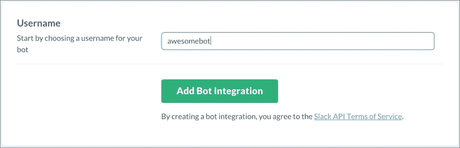
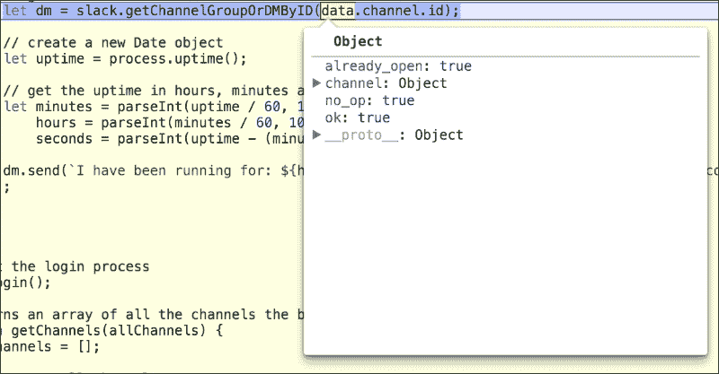

# 第二章 你的第一个机器人

读者将会对在他们的 Slack 环境中仅需要少量代码行就能启动一个基本的机器人感到惊讶。本章将引导读者了解构建 Slack 机器人的基础知识：

+   准备你的环境

+   创建 Slack API 令牌

+   连接你的机器人

+   加入频道

+   向频道发送消息

+   基本响应

+   发送直接消息

+   限制访问

+   调试你的机器人

虽然一些概念可能对更高级的读者来说已知，但仍然建议阅读本章的前几节，以确保你的环境已经准备好并可以运行。

在本章中，我们将构建一个执行以下操作的机器人：

+   连接到你的 Slack 团队

+   在成功连接后向频道的所有成员打招呼，区分真实用户和机器人用户

+   对说“你好”的用户做出回应

+   向询问机器人总运行时间（也称为运行时间）的用户发送直接消息

+   确保只有管理员用户可以请求机器人的运行时间

# 准备你的环境

在我们开始编写第一个机器人之前，编程环境必须设置并配置为运行 Node.js 应用程序和包。让我们从 Node.js 开始。

简而言之，Node.js（也称为 Node）是建立在 Chrome 的 v8 JavaScript 引擎之上的 JavaScript 运行时环境。在实践中，这意味着 JavaScript 可以在常规浏览器环境之外运行，使 JavaScript 成为一种既可用于前端也可用于后端的语言。

Google Chrome 的 v8 JavaScript 引擎确保你的 JavaScript 代码运行得既快又高效。与浏览器世界（以及 Node 版本）不同，Node 由一个单一的开源基金会维护，拥有数百名志愿者开发者。这使得为 Node 开发比浏览器简单得多，因为你不会遇到跨平台 JavaScript 实现不一致的问题。

在这本书中，我们将使用主要版本 5（任何以 5 开头的版本）的 Node。这使我们能够使用新实施的 ECMAScript 2015（更广为人知为**ES2015**或**ES6**）的新特性。每当本书首次使用 ES6 特性时，请查找相应的代码注释以获得该特性的简要说明。

### 注意

虽然许多特性已经实现，但并非所有 ES6 特性目前都在 Node 中可用，其中一些仅在**严格**模式下可用。有关更多信息，请访问 Node ES6 指南：[`nodejs.org/en/docs/es6/`](https://nodejs.org/en/docs/es6/)。

本节将简要说明如何在开发机器上安装 Node.js 和 Slack API。

## 安装 Node.js

要安装 Node.js，请访问官方 Node 网站，[`nodejs.org/`](https://nodejs.org/)，下载一个 v5 版本并遵循屏幕上的说明。

要测试安装是否成功，打开终端，输入以下内容，然后按*Enter*：

```js
node

```

如果节点安装正确，你应该能够输入 JavaScript 命令并看到结果：


Node.js 中的 Hello World

### 注意

按 *Ctrl* + *C* 两次退出 Node。

## 使用 NPM 安装开发工具

**Node 包管理器** (**NPM**) 是 Node.js 的包生态系统，也是用于安装 Node 包的工具。截至写作时，有超过 240,000 个 NPM 包可供下载，并且每天都有更多被添加。

幸运的是，一旦 Node 安装完成，NPM 就会自动安装。让我们首先安装一个有用的 Node 开发工具，名为 `nodemon` ([`nodemon.io/`](http://nodemon.io/))。在你的终端或命令提示符中运行以下命令：

```js
npm install -g nodemon

```

此命令将全局安装 `nodemon` 包（注意 `-g` 标志），这意味着它可以从电脑上的任何位置运行。在 `install` 命令之后，你必须指定你希望安装的包，并且可以选择一些配置包安装方式的标志。稍后，我们将探讨 `--save` 和 `--save-dev` 标志及其用法。

`nodemon` 是一个 Node 工具，它将监视你的代码中的任何更改，并自动重新启动你的 Node 进程。对我们来说，这将使我们不必每次更改代码时都停止并重新启动 Node 进程。

为了演示 `nodemon`，让我们看一个例子。在你的代码编辑器中粘贴以下内容，并将其保存为 `hello-world.js`：

```js
console.log('Hello World!');
```

在你的终端中运行以下命令：

```js
nodemon hello-world.js

```

你的输出应该看起来像这样：


与之前相同的 Hello World，但使用 nodemon

注意控制台命令的运行方式以及程序如何退出。`nodemon` 然后进入“监视模式”，在此模式下，它将等待任何文件（由 `*.*` 通配符表示）的更改，然后随后重新启动 Node 进程。`nodemon` 可以进一步自定义以监视或忽略特定文件。有关更多信息，请访问网站 [`nodemon.io/`](http://nodemon.io/)。

### 小贴士

要在不更改 `nodemon` 监视的文件的情况下手动重新启动 Node 进程，请输入 *rs* 然后按 *Enter* 键。

## 创建一个新的项目

现在已经了解了 Node 和 NPM 的基础知识，我们将探讨创建一个新的 Node 项目并扩展我们对 NPM 的了解。

一个 Node 项目可以包含依赖项和开发依赖项。前者是运行项目所需的代码段（或包），而后者是仅用于开发的代码段。在我们的上一个例子中，`nodemon` 被视为开发依赖项，因为它不会在生产环境中使用。

Node 项目的依赖项存储在一个名为`package.json`的**JavaScript 对象表示法**（**JSON**）文件中。该 JSON 文件包含有关 Node 项目的信息，包括依赖项列表、依赖项的版本以及包作者的信息。这使得通过 NPM 轻松安装项目成为可能。

让我们创建一个自己的。打开一个终端窗口，通过输入以下内容并按*Enter*键来创建一个新的文件夹：

```js
mkdir helloWorld && cd helloWorld

```

这将创建一个新的目录并导航到该目录。接下来，输入以下内容：

```js
npm init

```

按照屏幕上的提示操作，您最终会得到类似以下内容：


NPM init 运行成功的示例

完成后，您会发现您的目录中已创建了一个`package.json`文件；请参阅前面的截图以了解该 JSON 文件包含的内容。

现在我们已经为我们的应用程序创建了一个模板，让我们创建一个入口点 JavaScript 文件并安装一些依赖项：

```js
touch index.js
npm install @slack/client –-save

```

这些命令创建了一个名为`index`的空 JavaScript 文件并安装了 Slack**实时消息传递**（**RTM**）客户端。注意`@slack/client`现在出现在`package.json`的依赖项下。这是由于在最后一个命令中使用了`--save`标志。保存标志表示此 NPM 包是运行此应用程序所必需的。

### 注意

自版本 2 起，Slack 客户端 API 已迁移到使用 NPM 组织。通过包名中的`@`字符表示，这意味着 Slack（公司）可以在`@slack`的母组织下发布包。除了额外的字符外，该包与其他非组织包没有区别。

如果您希望分发您的机器人并允许其他人对其进行或与之工作，您可以通过在项目目录中运行`npm install`来轻松安装`package.json`中指定的所有必需的包。

除了保存标志之外，您还可以通过使用`--save-dev`标志来指定一个包仅用于开发。这将把该包添加到`package.json`中的`devDependencies`部分。这允许我们指定，如果用户打算进行一些开发，则此包才需要安装。

这对于运行您代码的服务器特别有用，您可能希望完全省略开发包。

您的`package.json`文件现在可能看起来像这样：

```js
{
  "name": "helloworld",
  "version": "1.0.0",
  "description": "My first Slack bot!",
  "main": "index.js",
  "scripts": {
    "test": "echo \"Error: no test specified\" && exit 1"
  },
  "author": "Paul Asjes",
  "license": "ISC",
  "dependencies": {
    "@slack/client": "².0.6",
  }
}
```

现在 Slack 客户端被列为依赖项，当从这个目录运行以下命令时，它将被自动安装：

```js
npm install

```

您可以通过删除`node_modules`文件夹然后运行前面的命令来测试这一点：


所有依赖项都已安装

注意`slack-client`包有自己的依赖项，这些依赖项已自动安装到`node_modules`文件夹中。

现在，我们将向我们的入口点 JavaScript 文件添加一些代码。打开`index.js`并输入以下代码：

```js
// Enable strict mode, this allows us to use ES6 specific syntax
// such as 'const' and 'let'
'use strict';

// Import the Real Time Messaging (RTM) client
// from the Slack API in node_modules
const RtmClient = require('@slack/client').RtmClient;

// The memory data store is a collection of useful functions we // can
// include in our RtmClient
const MemoryDataStore = require('@slack/client').MemoryDataStore;

// Import the RTM event constants from the Slack API
const RTM_EVENTS = require('@slack/client').RTM_EVENTS;

// Import the client event constants from the Slack API
const CLIENT_EVENTS = require('@slack/client').CLIENT_EVENTS;

const token = '';

// The Slack constructor takes 2 arguments:
// token - String representation of the Slack token
// opts - Objects with options for our implementation
let slack = new RtmClient(token, {
  // Sets the level of logging we require
  logLevel: 'debug', 
  // Initialize a data store for our client, this will 
  // load additional helper functions for the storing 
  // and retrieval of data
  dataStore: new MemoryDataStore(),
  // Boolean indicating whether Slack should automatically 
  // reconnect after an error response
  autoReconnect: true,
  // Boolean indicating whether each message should be marked as // read 
  // or not after it is processed 
  autoMark: true 
});

// Add an event listener for the RTM_CONNECTION_OPENED 
// event, which is called 
// when the bot connects to a channel. The Slack API can 
// subscribe to events by using the 'on' method
slack.on(CLIENT_EVENTS.RTM.RTM_CONNECTION_OPENED, () => {
  // Get the user's name
  let user = slack.dataStore.getUserById(slack.activeUserId);

  // Get the team's name
  let team = slack.dataStore.getTeamById(slack.activeTeamId);

  // Log the slack team name and the bot's name, using ES6's // template
  // string syntax
  console.log(`Connected to ${team.name} as ${user.name}`);
});

// Start the login process
slack.start();
```

保存文件并执行以下命令来运行程序：

```js
node index.js

```

您应该立即注意到有问题：


调试和错误日志显示

注意内置的日志记录器如何输出调试和错误信息。错误表明由于认证错误，Slack 无法连接。这是因为我们没有提供 Slack API 令牌。访问令牌是为您的机器人生成的唯一 ID。通过使用它，您使您的机器人能够通过 Slack 服务器进行认证并与 Slack 客户端交互。

在我们的示例中，令牌被设置为空字符串，这是不起作用的。那么，让我们从 Slack 获取一个访问令牌。

### 小贴士

在本书的 *前言* 中提到了下载代码包的详细步骤。请查看。

本书代码包也托管在 GitHub 上，网址为 [`github.com/PacktPublishing/Building-Slack-Bots`](https://github.com/PacktPublishing/Building-Slack-Bots)。我们还有其他来自我们丰富图书和视频目录的代码包，可在 [`github.com/PacktPublishing`](https://github.com/PacktPublishing) 获取。查看它们！

## 创建 Slack API 令牌

打开浏览器并导航到 [`my.slack.com/apps/build/custom-integration`](https://my.slack.com/apps/build/custom-integration)。

按照以下步骤操作：

1.  从可用的自定义集成列表中选择 **Bots**。

    自定义集成列表

1.  选择一个名称并点击 **添加机器人集成**。您的机器人名称可以在以后更改，所以不必担心立即选择一个经过深思熟虑的名称。

    添加机器人集成

1.  复制下新生成的 API 令牌。作为一个可选步骤，您可以选择在此屏幕上进一步自定义机器人。

    机器人可选设置

    ### 注意

    虽然是可选的，但建议为您的机器人选择一个图标。在这个例子中，我们将使用 `robot_face` 表情符号；然而，一个好的机器人应该有一个代表其目的的图标。

    虽然您可以给机器人提供重复的首字母和姓氏，但机器人的用户名必须对您的团队是唯一的。提供首字母、姓氏和描述是可选的，但建议这样做，因为它可以提供有关机器人做什么的快速信息。

1.  点击页面底部的 **保存** **集成**。

### 小贴士

如果您希望在以后阶段删除或禁用此机器人，您可以从同一页面进行操作。

## 连接机器人

现在我们已经生成了一个 API 令牌，请将 `index.js` 中分配给 `token` 的空字符串替换，然后再次运行程序。

### 注意

现在是使用 `nodemon` 而不是 `node` 的好时机，以确保代码更改时自动重启。

您可能会在终端中看到一整页的调试信息。虽然这些信息很有用，但它们也可能阻碍我们的进度，因为我们的控制台日志可能难以找到。与其玩捉迷藏，不如首先更改客户端的日志设置。

将此行切换：

```js
logLevel: 'debug',
```

使用以下行：

```js
logLevel: 'error',
```

这将指示客户端仅在程序崩溃或发生语法错误时输出错误消息。

重新启动程序（或者只保存文件，让 `nodemon` 做工作）：

```js
[Thu Jan 07 2016 20:56:07 GMT-0500 (EST)] INFO Connecting...
Connected to Building Bots as awesomebot

```

如果您在终端中看到类似前面的输出，恭喜！您的第一个机器人已成功连接到 Slack！现在您将在 Slack 客户端的 **直接消息** 部分看到您的机器人；点击机器人的名字以打开一个私人的直接消息。

### 注意

在本书的整个过程中，您将遇到标题 `Building Bots`。这仅仅是作者使用的 Slack 团队的名称，并且可能与您的不一样。


向您的机器人发送直接消息（DM）

您的机器人正在正常运行。然而，它的能力相当有限。我们将很快解决这个问题，但首先让我们确保机器人可以与更广泛的受众互动。

## 加入一个频道

机器人不能通过编程方式加入频道；这是一个设计选择，因为机器人不应该在没有被邀请的情况下进入私人频道。当机器人加入频道时，机器人可以监控频道中的所有活动。机器人可能保存所有频道消息，这是一种潜在的恶意活动，不应该自动发生。

有关机器人可以和不能执行的操作的完整列表，请参阅 Slack 机器人用户文档，网址为 [`api.slack.com/bot-users`](https://api.slack.com/bot-users)。

机器人对其自身可以执行的操作有限制。因此，机器人需要通过 Slack 客户端中的 `invite` 命令被邀请到频道中：

```js
/invite [BOT_NAME]

```

之后，您将收到机器人进入频道的确认，如下所示：


机器人进入世界

注意，当机器人加入频道时，即使机器人的 Node 进程停止，它也会留在那里。它表现出与离线用户相同的特征。这确保了每个机器人每个频道只需要进行一次邀请。

要从频道中移除机器人，请在 Slack 客户端中使用移除命令：

```js
/remove [BOT_NAME]

```

### 注意

虽然所有用户都可以邀请进入频道，但只有管理员可以主动从频道中移除用户和机器人。

为了使测试更容易，并且不干扰您团队中的其他用户，创建一个机器人测试频道并邀请您的机器人是一个好主意。在本书的范围内，测试频道被命名为 `bot-test`。

## 向频道发送消息

我们现在有一个已连接的机器人，但诚然，它相当无用了。让我们通过让我们的机器人向它所在的每个频道说“你好”来解决这个问题。

## Slack 对象

您可能已经注意到，在前面的代码示例的第 18 行有如下内容：

```js
let user = slack.dataStore.getUserById(slack.activeUserId);
```

在这里，我们看到 `slack` 对象包含了关于机器人当前环境的各种信息。让我们探索其中包含的数据。将第 18 行替换为以下修改后的 `console.log` 方法：

```js
console.log(slack);
```

您应该在终端中看到一个大型对象被打印出来。虽然我们不会遍历所有值，但以下是一些有趣的值：

| 名称 | 类型 | 功能 |
| --- | --- | --- |
| `activeUserId` | 字符串 | 内部用户 ID。这可以用来获取更多关于当前用户的信息。 |
| `activeUserId` | 字符串 | 内部团队 ID。同样，它可以用来获取更多关于团队的信息。 |
| `dataStore` | 对象 | 如果初始化了数据存储，则此对象包含 Slack API 中存储的大量信息。 |
| `channels`（`dataStore` 的子对象） | 对象 | 包含该团队中所有可用频道的列表。 |
| `channel`（`channels` 的子对象） | 对象 | 包含关于频道的更多信息。是否请求此信息的用户是成员可以通过 `is_member` 属性来获取 |
| `dms`（`dataStore` 的子对象） | 对象 | 该用户是其中一员的直接消息频道的列表。注意：即使从未发送过消息，直接消息频道仍然被认为是开放的。 |
| `users`（`dataStore` 的子对象） | 对象 | 该团队中所有用户的列表。 |

## 获取所有频道

您会注意到，从前面的表格中，`channels` 对象返回了该团队中的所有频道。就我们的目的而言，我们只想获取我们的机器人所在的频道。为了实现这一点，我们可以遍历 `channels` 对象，并返回我们确切需要的。将以下内容添加到 `index.js` 的末尾：

```js
// Returns an array of all the channels the bot resides in
function getChannels(allChannels) {
  let channels = [];

  // Loop over all channels
  for (let id in allChannels) {
    // Get an individual channel
    let channel = allChannels[id];

    // Is this user a member of the channel?
    if (channel.is_member) {
      // If so, push it to the array
      channels.push(channel);
    }
  }

  return channels;
}
```

现在，将 Slack `open` 事件监听器替换为以下内容：

```js
// Add an event listener for the RTM_CONNECTION_OPENED event,
//  which is called when the bot
// connects to a channel. The Slack API can subscribe to 
// events by using the 'on' method
slack.on(CLIENT_EVENTS.RTM.RTM_CONNECTION_OPENED, () => {
  // Get the user's name
  let user = slack.dataStore.getUserById(slack.activeUserId);

  // Get the team's name
  let team = slack.dataStore.getTeamById(slack.activeTeamId);

  // Log the slack team name and the bot's name, using ES6's 
  // template string syntax
  console.log(`Connected to ${team.name} as ${user.name}`);

  // Note how the dataStore object contains a list of all 
  // channels available
  let channels = getChannels(slack.dataStore.channels);

  // Use Array.map to loop over every instance and return an 
  // array of the names of each channel. Then chain Array.join 
  // to convert the names array to a string
  let channelNames = channels.map((channel) => {
    return channel.name;
  }).join(', ');

  console.log(`Currently in: ${channelNames}`)
});
```

切换到您的终端，您应该看到以下输出：


列出机器人所在的频道

现在，您的机器人知道它所在的频道，它就可以开始发送消息了。我们将从机器人向频道中的每个人发送一个简单的 "Hello" 消息开始。

## 获取频道中的所有成员

我们已经有了频道对象，因此获取其中的成员很容易。将其添加到 `RTM_CONNECTION_OPENED` 事件监听器中：

```js
// log the members of the channel
channels.forEach((channel) => {
  console.log('Members of this channel: ', channel.members);
});
```

这是结果：


用户 ID 列表

好吧，这并不完全符合我们的预期。Slack API 返回了一个用户 ID 列表，而不是成员对象的数组。这对于包含数百个用户的频道来说是有意义的，因为这会导致一个庞大且庞大的成员对象数组。不用担心，Slack API 提供了我们需要的工具，通过使用这些用户 ID 来获取更多信息。用以下代码替换之前的片段，然后保存文件：

```js
  // log the members of the channel
  channels.forEach((channel) => {
    // get the members by ID using the data store's 
    //'getUserByID' function
    let members = channel.members.map((id) => {
      return slack.dataStore.getUserById(id);
    });

    // Each member object has a 'name' property, so let's 
    // get an array of names and join them via Array.join
    let memberNames = members.map((member) => {
      return member.name;
    }).join(', ');

    console.log('Members of this channel: ', memberNames);
  });
```

此代码的输出可以在以下屏幕截图中看到：


使用用户名在该频道中的用户

注意机器人也被列在频道成员列表中。我们当前的目标是向频道中的每个人打招呼；然而，我们应该尽量避免机器人自言自语。

我们可以使用 `member` 对象上的 `is_bot` 属性来确定用户是否是机器人：

```js
  // log the members of the channel
  channels.forEach((channel) => {
    // get the members by ID using the data store's 
    // 'getUserByID' function
    let members = channel.members.map((id) => {
      return slack.dataStore.getUserById(id);
    });

    // Filter out the bots from the member list using Array.filter
    members = members.filter((member) => {
      return !member.is_bot;
    });

    // Each member object has a 'name' property, so let's 
    // get an array of names and join them via Array.join
    let memberNames = members.map((member) => {
      return member.name;
    }).join(', ');

    console.log('Members of this channel: ', memberNames);
  });
```


频道中的用户，不包括机器人

太棒了！现在我们已经完成了这个步骤，下一步是将消息发送到频道。

## 向频道发送消息

频道对象包含机器人通信所需的所有工具。在下面的代码中，我们将基于之前的代码片段，在机器人连接后向频道中的每个人发送一条“Hello”消息。所有这些操作都将发生在公开的事件监听器中。以下是它的全部内容：

```js
// Add an event listener for the RTM_CONNECTION_OPENED event, 
// which is called when the bot connects to a channel. The Slack API 
// can subscribe to events by using the 'on' method
slack.on(CLIENT_EVENTS.RTM.RTM_CONNECTION_OPENED, () => {
  // Get the user's name
  let user = slack.dataStore.getUserById(slack.activeUserId);

  // Get the team's name
  let team = slack.dataStore.getTeamById(slack.activeTeamId);

  // Log the slack team name and the bot's name, using ES6's 
  // template string syntax
  console.log(`Connected to ${team.name} as ${user.name}`);

  // Note how the dataStore object contains a list of all 
  // channels available
  let channels = getChannels(slack.dataStore.channels);

  // Use Array.map to loop over every instance and return an 
  // array of the names of each channel. Then chain Array.join 
  // to convert the names array to a string
  let channelNames = channels.map((channel) => {
    return channel.name;
  }).join(', ');

  console.log(`Currently in: ${channelNames}`)

  // log the members of the channel
  channels.forEach((channel) => {
    // get the members by ID using the data store's 
    // 'getUserByID' function
    let members = channel.members.map((id) => {
      return slack.dataStore.getUserById(id);
    });

    // Filter out the bots from the member list using Array.filter
    members = members.filter((member) => {
      return !member.is_bot;
    });

    // Each member object has a 'name' property, so let's 
    // get an array of names and join them via Array.join
    let memberNames = members.map((member) => {
      return member.name;
    }).join(', ');

    console.log('Members of this channel: ', memberNames);

    // Send a greeting to everyone in the channel
    slack.sendMessage(`Hello ${memberNames}!`, channel.id);
  });
});
```

一旦你运行了代码，你应该会收到 Slack 客户端的提示通知，显示你被提及在一条消息中，如下面的截图所示：


我们的机器人说出了它的第一句话

让我们通过让机器人能够响应消息来提高它的复杂性。

# 基本响应

Slack API 可以配置为在派发某些事件时执行方法，就像之前用 `RTM_CONNECTION_OPENED` 事件所看到的那样。现在，我们将深入了解我们提供的其他有用的事件。

## 认证事件

到目前为止，我们已经看到了如何为机器人进入频道并发生错误时触发的 Slack 的 `RTM_CONNECTION_OPENED` 事件添加功能。如果你希望在机器人登录但尚未连接到频道之前执行一些代码，你可以使用 `AUTHENTICATED` 事件：

```js
slack.on(CLIENT_EVENTS.RTM.AUTHENTICATED, (rtmStartData) => {
  console.log(`Logged in as ${rtmStartData.self.name} of team ${rtmStartData.team.name}, but not yet connected to a channel`);
});
```

这将产生以下输出：

```js
[Mon Jan 18 2016 21:37:24 GMT-0500 (EST)] INFO Connecting...
Logged in as awesomebot of team Building Bots, but not yet connected to a channel

```

现在，我们将介绍 *消息* 事件。

## 使用消息事件

消息事件将在每次向机器人所在的频道或直接向机器人发送消息时触发。消息对象包含有用的数据，例如发送用户、发送频道和发送时间戳。

将以下内容粘贴到 `index.js` 中，然后向你的机器人是成员的频道发送消息“Hello bot!”：

```js
slack.on(RTM_EVENTS.MESSAGE, (message) => {
  let user = slack.dataStore.getUserById(message.user)

  if (user && user.is_bot) {
    return;
  }

  let channel = slack.dataStore.getChannelGroupOrDMById(message.channel);

  if (message.text) {
    let msg = message.text.toLowerCase();

    if (/(hello|hi) (bot|awesomebot)/g.test(msg)) {
      slack.sendMessage(`Hello to you too, ${user.name}!`, channel.id);
    }
  }
});
```

这应该会产生类似以下的结果：


机器人更个性化的问候

让我们再次详细查看代码，从顶部开始：

```js
slack.on(RTM_EVENTS.MESSAGE, (message) => {
  let user = slack.dataStore.getUserById(message.user)

  if (user && user.is_bot) {
    return;
}
```

这应该很熟悉，因为它与我们之前使用的类似，只是我们现在使用的是 `RTM_EVENTS` 对象中的 `MESSAGE` 事件。我们还确保消息发送者不是机器人：

```js
  let channel = slack.dataStore.getChannelGroupOrDMById(message.channel);
```

`getChannelGroupOrDMById` 方法让我们能够获取每个消息发送的频道。如果我们的机器人恰好居住在多个频道中，这尤其有用。代码如下：

```js
if (message.text) {
  let msg = message.text.toLowerCase();

  if (/(hello|hi) (bot|awesomebot)/g.test(msg)) {
    slack.sendMessage(`Hello to you too, ${user.name}!`, channel.id);
     }
}
```

消息不一定包含文本；它也可能是文件、图片或甚至表情符号。因此，我们必须进行一些类型检查，以确保接收到的消息确实是基于文本的。一旦确认文本类型，我们使用正则表达式来测试接收到的消息是否包含特定顺序的关键词。当接收到的消息包含“Hello”或“Hi”后跟“bot”或“awesomebot”时，`RegExp.test` 方法将返回 true。如果是真的，将使用熟悉的 `slack.sendMessage` 方法将响应发送回通道。

### 注意

在评估传入的文本时，几乎总是先将文本消息的主体转换为小写，以避免大小写敏感的错误。

## 避免垃圾邮件

在开发过程中偶尔会发生无限循环；完全有可能不小心编写了一个机器人，使其在无限循环中发送消息，从而在通道中产生垃圾邮件。观察以下代码：

```js
if (/(hello|hi) (bot|awesomebot)/g.test(msg)) {
  // Infinite loop spamming the channel every 100 milliseconds
  setInterval(() => {
    slack.sendMessage('Spam!', channel.id);
  }, 100);
}
```

查看结果的截图：


机器人正在垃圾邮件通道

在终端或命令提示符中，你应该看到以下内容：


Slack API 处理垃圾邮件

幸运的是，Slack API 内置了对这类不幸事件的防护。如果单个用户在非常短的时间内发送了 20 条消息，Slack 服务器将拒绝发布更多消息并返回错误。这还有一个附加效果，就是导致我们的机器人卡住并最终崩溃。

Slack 平台将保护通道免受垃圾邮件攻击；然而，可能被攻击的机器人会崩溃。

为了防止这种情况发生，强烈建议*永远不要*在循环或 `setInterval` 方法中放置 `slack.sendMessage` 方法调用。

用户众多且因此流量大的通道可能会意外触发 Slack 平台的“减速”响应。为了防止这种情况，跟踪消息之间的时间差：

```js
if (/(hello|hi) (bot|awesomebot)/g.test(msg)) {
  // Get the timestamp when the above message was sent
  let sentTime = Date.now();

  setInterval(() => {
    // Get the current timestamp
    let currentTime = Date.now();

    // Make sure we only allow a message once a full second has // passed 
    if ((currentTime - sentTime) > 1000) {

      slack.sendMesssage('Limiting my messages to 1 per second', channel.id);

      // Set the new sentTime
      sentTime = Date.now();
    }
  }, 100);
}
```


限制机器人的消息

每次调用 `setInterval` 函数时，我们都会生成一个新的时间戳，称为 `currentTime`。通过比较 `currentTime` 与消息的时间戳（定义为 `sentTime`），我们可以通过确保两者之间的差异超过 1,000 毫秒来人工限制机器人端发送的消息。

Slack API 在 `channel.latest.ts` 对象上提供了一个时间戳；这提供了通道中接收到的最新消息的时间戳。虽然仍然有用，但建议使用本地时间戳，因为 Slack API 提供的是接收到的最新消息的信息，而不是机器人发送的最新消息。

# 发送直接消息

**直接** **消息** (**DM**) 频道是仅存在于两个用户之间的频道。按照设计，它不能有更多或更少的用户，并且旨在进行私人通信。发送私信与向频道发送消息非常相似，因为 `dm` 对象几乎与 `channel` 对象相同。

考虑以下代码片段：

```js
slack.on(RTM_EVENTS.MESSAGE, (message) => {
  let user = slack.dataStore.getUserById(message.user)

  if (user && user.is_bot) {
    return;
  }

  let channel = slack.dataStore.getChannelGroupOrDMById(message.channel);

  if (message.text) {
    let msg = message.text.toLowerCase();

    if (/uptime/g.test(msg)) {
      let dm = slack.dataStore.getDMByName(user.name);

      let uptime = process.uptime();

      // get the uptime in hours, minutes and seconds
      let minutes = parseInt(uptime / 60, 10),
          hours = parseInt(minutes / 60, 10),
          seconds = parseInt(uptime - (minutes * 60) - ((hours * 60) * 60), 10);

      slack.sendMessage(`I have been running for: ${hours} hours, ${minutes} minutes and ${seconds} seconds.`, dm.id);
  }
});
```

在此示例中，我们的机器人将向任何使用关键词 `uptime` 的用户发送包含当前 Uptime 的私信：


Uptime 可以是一个非常有用的统计数据

注意，无论命令 `uptime` 是在哪个频道发送，只要机器人作为该频道或 DM 的成员能够听到该命令，它都会向用户发送私信。在上面的图像中，命令是在 DM 中发出的。这是因为频道和 DM 都订阅了 `message` 事件；当发送针对频道而非 DM 的响应，反之亦然时，这一点非常重要。

# 限制访问

有时，您可能希望将机器人命令限制为您的 Slack 团队管理员。一个很好的例子是控制项目部署过程的机器人。这可以非常强大，但可能不是您希望每个用户都能访问的功能。只有管理员（也称为管理员）才有权访问此类功能。管理员是拥有 Slack 团队管理权限的特殊用户。幸运的是，通过用户对象附加的 `is_admin` 属性，限制此类访问很容易。

在以下示例中，我们将限制在前一个主题中演示的 `uptime` 命令，使其仅对管理员用户有效，并通知受限用户他们无法使用该命令：

```js
slack.on(RTM_EVENTS.MESSAGE, (message) => {
  let user = slack.dataStore.getUserById(message.user)

  if (user && user.is_bot) {
    return;
  }

  let channel = slack.dataStore.getChannelGroupOrDMById(message.channel);

  if (message.text) {
    let msg = message.text.toLowerCase();

    if (/uptime/g.test(msg)) {
      if (!user.is_admin) {        
        slack.sendMessage(`Sorry ${user.name}, but that functionality is only for admins.`, channel.id);
        return;
      }

      let dm = slack.dataStore.getDMByName(user.name);

      let uptime = process.uptime();

      // get the uptime in hours, minutes and seconds
      let minutes = parseInt(uptime / 60, 10),
          hours = parseInt(minutes / 60, 10),
          seconds = parseInt(uptime - (minutes * 60) - ((hours * 60) * 60), 10);

      slack.sendMessage(`I have been running for: ${hours} hours, ${minutes} minutes and ${seconds} seconds.`, dm.id);
  }
});
```

现在，当非管理员用户发出 `uptime` 命令时，他们将收到以下消息：


限制机器人只对管理员用户

### 注意

使用 `user.is_admin` 是为了确定用户是否是管理员。

## 添加和删除管理员

要添加或删除管理员到您的团队，请访问 [`my.slack.com/admin#active`](https://my.slack.com/admin#active) 并点击一个用户。

管理员和所有者有权将其他成员从频道中踢出，并删除不属于他们的消息。尽管这些是默认设置，但可以在 [`my.slack.com/admin/settings#channel_management_restrictions`](https://my.slack.com/admin/settings#channel_management_restrictions) 编辑。

机器人不能是管理员或所有者；有关团队权限的更多信息，请访问 [`get.slack.help/hc/en-us/articles/201314026-Understanding-r`](https://get.slack.help/hc/en-us/articles/201314026-Understanding-r)。

# 调试机器人

最终您可能会遇到难以解决的机器人中的错误。最糟糕的是那些不会导致程序崩溃的错误，因此不会提供有关崩溃发生位置的有用的堆栈跟踪和行号。对于大多数问题，`console.log()` 方法就足够帮助您追踪错误，但对于更顽固的错误，我们需要一个真正的调试环境。本节将向您介绍 `iron-node` ([`s-a.github.io/iron-node/`](https://s-a.github.io/iron-node/))，这是一个基于 Chrome 开发工具的跨平台 JavaScript 调试环境。

首先安装 `iron-node`:

```js
npm install -g iron-node

```

再次注意 `-g` 标志的使用，它将应用程序全局安装。

在我们开始调试之前，我们需要在我们的代码中添加一个断点，这将告诉调试器停止代码并允许进行更深入的检查。将 `debugger` 语句添加到我们之前的代码中的 `slack.openDM()` 代码块内：

```js
if (/uptime/g.test(msg)) {
  debugger;

  if (!user.is_admin) {        
    slack.sendMessage(`Sorry ${user.name}, but that functionality is only for admins.`, channel.id);
    return;
  } 

  let dm = slack.dataStore.getDMByName(user.name);

  let uptime = process.uptime();

  // get the uptime in hours, minutes and seconds
  let minutes = parseInt(uptime / 60, 10),
      hours = parseInt(minutes / 60, 10),
      seconds = parseInt(uptime - (minutes * 60) - ((hours * 60) * 60), 10);

  slack.sendMessage(`I have been running for: ${hours} hours, ${minutes} minutes and ${seconds} seconds.`, dm.id);
}
```

保存文件，然后在终端通过 `iron-node` 运行代码：

```js
iron-node index.js

```

立即，您应该会看到 `iron-node` 界面弹出：


iron-node 界面

Chrome 用户可能会注意到这个界面与 Chrome 的开发者工具窗口完全一样。如果您以前没有使用过它，建议花些时间熟悉这个界面。让我们讨论一些基本功能，以便您开始。

您可以切换到控制台标签以查看节点输出，或者也可以按 *Esc* 显示屏幕底部的控制台。

我们的调试器被放置在消息事件监听器中，因此向机器人发送命令（在最后一个例子中是 `uptime`）并观察接下来会发生什么。


使用 "debugger" 语句设置断点

机器人的执行已被调试器暂停，因此您可以检查属性并确定错误的来源。

要么点击右上角的 **Step over** 按钮，其符号为一个围绕点的弯曲箭头，要么按 *F10* 跳到下一行。

使用鼠标悬停在代码这一行中的不同对象上以获取有关它们更多信息。



检查暂停程序中的属性

持续点击 **Step over** 按钮以逐步通过代码，或者点击 **Step over** 按钮左侧的 **Resume script execution** 按钮以允许程序继续执行，直到遇到另一个调试器断点。

不仅可以在机器人执行时检查变量和属性，还可以编辑它们的值，产生不同的输出。观察我们如何编辑代码中的 uptime 变量并将其设置为 1000：


`uptime` 被程序设置为 40.064

在控制台区域，我们可以在程序运行时编辑 JavaScript 变量：


在控制台，我们再次检查了运行时间的值，并将其设置为 1000。现在当我们回顾变量时，我们应该看到更新的值：


新的运行时间值反映在接下来的几行中

当我们恢复程序时，我们的机器人将根据我们更新的变量发送其消息：


我们继续程序，机器人将新的值发送到频道。

### 注意

为了最佳调试实践，要么禁用机器人发送消息的能力，要么邀请你的机器人加入一个私人频道，以避免向其他用户发送垃圾邮件。

由于`iron-node`基于 Chrome 的开发者工具，你可以与 Chrome 互换使用之前的技术。

为了调试和修复内存问题，你可以使用开发者工具的性能分析器和堆快照工具。有关这些主题的更多信息，请访问以下链接：

+   [`developers.google.com/web/tools/chrome-devtools/profile/rendering-tools/js-execution`](https://developers.google.com/web/tools/chrome-devtools/profile/rendering-tools/js-execution)

+   [`developers.google.com/web/tools/chrome-devtools/profile/memory-problems/?hl=en`](https://developers.google.com/web/tools/chrome-devtools/profile/memory-problems/?hl=en)

# 摘要

在本章中，我们了解了如何安装先决技术，如何为机器人获取 Slack 令牌，以及如何设置一个新的 Slack 机器人项目。因此，你可以重用所学知识，轻松构建新的机器人项目。你现在应该能够编写一个可以向频道发送消息、发送直接消息以及编写基本响应的机器人。最后，我们讨论了如何使用`iron-node`调试器调试基于 Node.js 的机器人。

在下一章中，我们将看到如何通过添加第三方 API 支持和编写我们的第一个机器人命令来使我们的机器人更加复杂。
