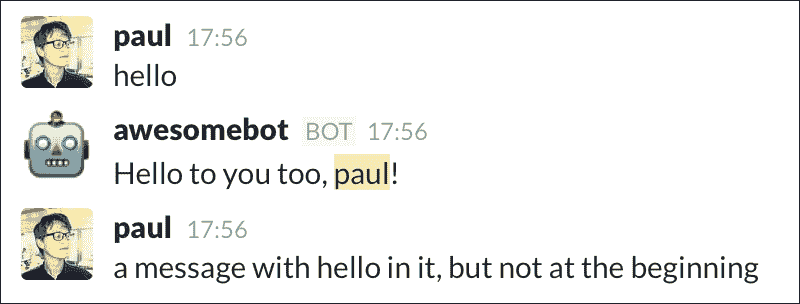
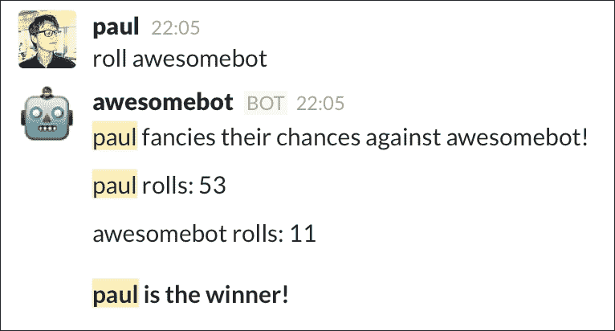
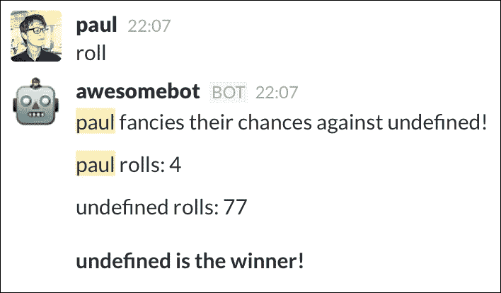
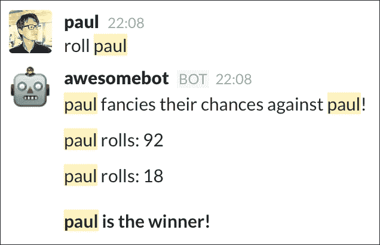
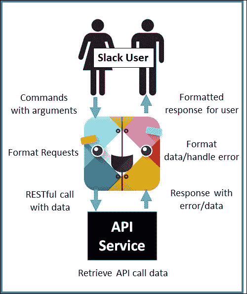
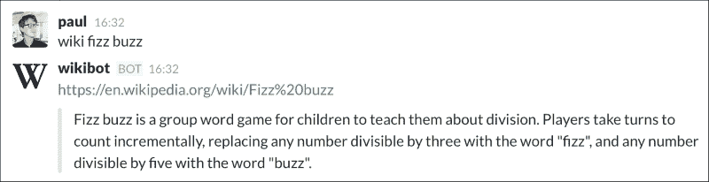
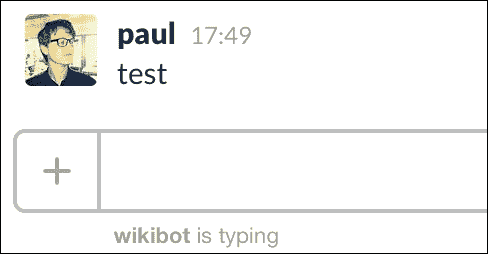
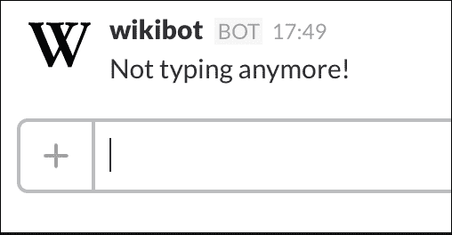

# 第三章。增加复杂性

第一个机器人完成之后，是时候学习如何使用其他 **应用程序程序接口**（**API**）来扩展我们的机器人了。这意味着教我们的机器人如何监听关键词、响应命令以及处理错误（无论是人为的还是其他原因）。在本章中，我们将涵盖以下内容：

+   响应关键词

+   机器人命令

+   外部 API 集成

+   错误处理

# 响应关键词

在上一章中，我们使用正则表达式来测试消息内容与预定义关键词的匹配。一旦关键词被确认，我们就可以执行操作并返回结果。这工作得很好；然而，对于功能更丰富的机器人，它可能会导致一个很大的 `if else` 块。相反，我们现在将查看将上一章的最终结果重构为一个更模块化的设计。在本节中，我们将通过使用 ES6 的新 `class` 语法和 Node 的 `export` 方法来实现这一点。

## 使用类

首先创建一个新的 JavaScript 文件，并将其命名为 `bot.js`。将以下内容粘贴到 `bot.js` 中并保存文件：

```js
'use strict';

const RtmClient = require('@slack/client').RtmClient;
const MemoryDataStore = require('@slack/client').MemoryDataStore;
const CLIENT_EVENTS = require('@slack/client').CLIENT_EVENTS;
const RTM_EVENTS = require('@slack/client').RTM_EVENTS;

class Bot {
  constructor(opts) {
    let slackToken = opts.token;
    let autoReconnect = opts.autoReconnect || true;
    let autoMark = opts.autoMark || true;

    this.slack = new RtmClient(slackToken, { 
      // Sets the level of logging we require
      logLevel: 'error', 
      // Initialize a data store for our client, 
      // this will load additional helper
      // functions for the storing and retrieval of data
      dataStore: new MemoryDataStore(),
      // Boolean indicating whether Slack should automatically 
      // reconnect after an error response
      autoReconnect: autoReconnect,
      // Boolean indicating whether each message should be marked
      // as read or not after it is processed
      autoMark: autoMark
    });

    this.slack.on(CLIENT_EVENTS.RTM.RTM_CONNECTION_OPENED, () => {
      let user = this.slack.dataStore.getUserById(this.slack.activeUserId)
      let team = this.slack.dataStore.getTeamById(this.slack.activeTeamId);

      this.name = user.name;

      console.log(`Connected to ${team.name} as ${user.name}`);      
    });

    this.slack.start();
  }
}

// Export the Bot class, which will be imported when 'require' is 
// used
module.exports = Bot;
```

让我们深入查看代码，从 `class` 结构开始。**Mozilla 开发者网络**（**MDN**）将 JavaScript 类定义为：

> *JavaScript 类是在 ECMAScript 6 中引入的，并且是 JavaScript 现有基于原型的继承的语法糖。类语法并没有向 JavaScript 引入一个新的面向对象的继承模型。JavaScript 类提供了一个更简单、更清晰的语法来创建对象和处理继承。*

简而言之，JavaScript 类是原型类模式的替代方案，实际上在底层以完全相同的方式工作。使用类的优点在于当你希望扩展或继承特定类，或者提供一个更清晰的概述说明你的类做什么时。

在代码示例中，我们使用类以便于稍后扩展，如果我们想添加更多功能。类独有的特性是 `constructor` 方法，这是一个用于创建和初始化由类创建的对象的特殊方法。当一个类用 `new` 关键字调用时，这个构造函数函数首先被执行：

```js
constructor(opts) {
    let slackToken = opts.token;
    let autoReconnect = opts.autoReconnect || true;
    let autoMark = opts.autoMark || true;

    this.slack = new RtmClient(slackToken, { 
      logLevel: 'error', 
      dataStore: new MemoryDataStore(),
      autoReconnect: autoReconnect,
      autoMark: autoMark
    });

    this.slack.on(CLIENT_EVENTS.RTM.RTM_CONNECTION_OPENED, () => {
      let user = this.slack.dataStore.getUserById(this.slack.activeUserId)
      let team = this.slack.dataStore.getTeamById(this.slack.activeTeamId);

      this.name = user.name;

      console.log(`Connected to ${team.name} as ${user.name}`);      
    });

    this.slack.start();
  }
```

查看我们的构造函数，我们看到熟悉的 Slack RTM 客户端的使用：客户端被初始化，并使用 `RTM_CONNECTION_OPENED` 事件在连接时记录团队和用户名。我们将 `slack` 变量附加到 `this` 对象作为属性，使其在整个类中可访问。同样，我们将机器人的名称分配给一个变量，以便在需要时轻松访问。

最后，我们通过 Node 模块系统导出机器人类：

```js
module.exports = Bot;
```

这指示 Node 在使用 `require` 方法导入此文件时返回我们的类。

在 `bot.js` 同一文件夹中创建一个新文件，并将其命名为 `index.js`。将以下内容粘贴到其中：

```js
'use strict';

let Bot = require('./Bot');

const bot = new Bot({
  token: process.env.SLACK_TOKEN,
  autoReconnect: true,
  autoMark: true
});
```

保存文件后，从终端运行以下命令以启动机器人：

```js
SLACK_TOKEN=[YOUR_TOKEN_HERE] node index.js

```

你可以使用上一章创建的 Slack 令牌，或者为这个机器人生成一个新的令牌。

### 注意

通常来说，不要在代码中硬编码敏感信息，如令牌或 API 密钥（如 Slack 令牌）。相反，使用 Node 的 `process.env` 对象从命令行传递变量到你的代码。特别是，要小心将 API 密钥存储在公共源代码控制库中，如 GitHub。

一旦你确认你的机器人成功连接到你的 Slack 团队，让我们努力使 `Bot` 类更加模块化。

## 反应式机器人

我们迄今为止在机器人示例中描述的所有功能都有一个共同点：机器人对人类用户提供的刺激做出反应。发送包含关键词的消息，机器人以动作做出响应。这类机器人可以称为反应式机器人；它们对输入做出输出。大多数机器人都可以归类为反应式机器人，因为大多数机器人需要一些输入才能完成动作。主动机器人与这相反；主动机器人不是对输入做出反应，而是在不需要任何人类刺激的情况下产生输出。我们将在第六章（Chapter 6）中介绍主动机器人，*Webhooks 和 Slack 命令*。现在，让我们看看我们如何优化我们的反应式机器人。

我们已经定义了反应式机器人的基本机制：对刺激做出反应。由于这是反应式机器人的核心概念，因此有一个机制来轻松调用所需的行为是有意义的。

要做到这一点，让我们给我们的 `Bot` 类添加一些功能，形式是一个 `respondsTo` 函数。在之前的例子中，我们使用了 `if` 语句来确定机器人何时应该对一条消息做出响应：

```js
if (/(hello|hi) (bot|awesomebot)/g.test(msg)) {
  // do stuff...
}

if (/uptime/g.test(msg)) {
  // do more stuff...
}
```

这种方法没有问题。如果我们希望编写一个具有多个关键词的机器人，我们的 `Bot` 类可能会变得非常复杂，并且很快就会变得杂乱无章。相反，让我们将这种行为抽象到我们的 `respondsTo` 函数中。该函数应至少接受两个参数：我们希望监听的关键词和一个当关键词在消息中识别时执行的回调函数。

在 `bot.js` 中，向构造函数添加以下内容：

```js
// Create an ES6 Map to store our regular expressions
this.keywords = new Map();

this.slack.on(RTM_EVENTS.MESSAGE, (message) => {
  // Only process text messages
  if (!message.text) {
    return;
  }

  let channel = this.slack.dataStore.getChannelGroupOrDMById(message.channel);
  let user = this.slack.dataStore.getUserById(message.user);

  // Loop over the keys of the keywords Map object and test each
  // regular expression against the message's text property
  for (let regex of this.keywords.keys()) {    
    if (regex.test(message.text)) {
      let callback = this.keywords.get(regex);
      callback(message, channel, user);
    }
  }
});
```

这个片段使用了新的 ES6 `Map` 对象，它是一个简单的键/值存储，类似于其他语言中的字典。`Map` 与 `Object` 的不同之处在于 `Map` 没有默认键（因为 `Object` 有原型），这意味着你可以遍历 `Map` 而不必显式检查 `Map` 是否包含值或其原型。例如，使用 `Maps`，你不再需要在遍历时使用 `Object.hasOwnProperty`。

正如我们稍后将要看到的，`keywords Map` 对象使用正则表达式作为键，回调函数作为值。在构造函数下面插入以下代码：

```js
respondTo(keywords, callback, start) {
  // If 'start' is truthy, prepend the '^' anchor to instruct the
  // expression to look for matches at the beginning of the string
  if (start) {
    keywords = '^' + keywords;
  }

  // Create a new regular expression, setting the case 
  // insensitive (i) flag
  let regex = new RegExp(keywords, 'i');

  // Set the regular expression to be the key, with the callback
  // function as the value
  this.keywords.set(regex, callback);
}
```

这个函数接受三个参数：`keywords`、`callback`和`start`。`keywords`是我们希望以正则表达式形式采取行动的单词或短语。`callback`是一个函数，如果关键词与消息匹配，则会调用它，而`start`是一个可选的布尔值，表示我们是否希望仅在消息字符串的开头搜索。

回顾我们新更新的构造函数，并特别注意我们`message`事件监听器中的以下行：

```js
// Loop over the keys of the keywords Map object and test each
// regular expression against the message's text property
for (let regex of this.keywords.keys()) {    
  if (regex.test(message.text)) {
    let callback = this.keywords.get(regex);
    callback(message, channel, user);
  }
}
```

在这里，我们遍历关键词`Map`对象，其键是正则表达式。我们将每个正则表达式与接收到的消息进行测试，并使用消息、频道和发送消息的用户调用我们的回调函数。

最后，让我们给我们的机器人类添加一个`sendMessage`功能。这将作为 Slack 的`sendMessage`的包装器。我们不再需要暴露整个 Slack 对象。在我们的构造函数下面添加以下函数：

```js
  // Send a message to a channel, with an optional callback
  send(message, channel, cb) {
    this.slack.sendMessage(message, channel.id, () => {
      if (cb) {
        cb();
      }
    });
  }
```

尽管我们的`send`函数的参数名为`channel`，但它也可以用于 DM（两个人之间的私密频道），此外，它还通过 Slack API 的`sendMessage`函数提供了一个回调。

现在我们有一个可以订阅消息及其内容的函数，打开`index.js`，让我们添加一个简单的“Hello World”实现：

```js
'use strict';

let Bot = require('./Bot');

const bot = new Bot({
  token: process.env.SLACK_TOKEN,
  autoReconnect: true,
  autoMark: true
});

bot.respondTo('hello', (message, channel, user) => {
  bot.send(`Hello to you too, ${user.name}!`, channel)
}, true);
```

保存文件，重新启动你的 node 进程，并测试你的机器人。它应该看起来像这样：



测试我们的重构

当我们的消息包含字符串"hello"时，机器人会做出响应，但只有在它出现在消息开头，由于我们在回调后传递的`true`值，才会如此。

我们现在已经重构了机器人的代码，将 Slack 事件系统抽象出来，并在过程中使我们的代码更简洁。让我们用我们的新系统做一些更令人印象深刻的事情，并实现一个简单的游戏。

# 机器人命令

到目前为止，我们的机器人已经对消息中的关键词做出了响应，说“你好”或告诉我们它们已经运行了多久。这些关键词对于简单任务很有用，但对于更复杂的操作，我们需要给机器人一些参数来处理。一个跟在参数或参数后面的关键词可以称为机器人命令。类似于命令行，我们可以发出尽可能多的参数来充分利用我们的机器人。

让我们通过给我们的机器人一个新的函数来测试这个：一个机会游戏，`roll`命令的发布者玩一个掷骰子比谁掷出的数字高的游戏。

将以下代码添加到`index.js`中：

```js
bot.respondTo('roll', (message, channel, user) => {
  // get the arguments from the message body
  let args = getArgs(message.text);

  // Roll two random numbers between 0 and 100
  let firstRoll = Math.round(Math.random() * 100);
  let secondRoll = Math.round(Math.random() * 100);

  let challenger = user.name;
  let opponent = args[0];

  // reroll in the unlikely event that it's a tie
  while (firstRoll === secondRoll) {
    secondRoll = Math.round(Math.random() * 100);
  }

  let winner = firstRoll > secondRoll ? challenger : opponent;

  // Using new line characters (\n) to format our response
  bot.send(
    `${challenger} fancies their chances against ${opponent}!\n
    ${challenger} rolls: ${firstRoll}\n
    ${opponent} rolls: ${secondRoll}\n\n
    *${winner} is the winner!*`
  , channel);

}, true);

// Take the message text and return the arguments
function getArgs(msg) {
  return msg.split(' ').slice(1);
}
```

命令非常简单：用户发送关键词`roll`，后面跟着他们想要挑战的用户名。这在上面的屏幕截图中显示：



机器人滚动命令的直接实现

它工作得很好，但如果我们省略了`roll`命令的任何参数会发生什么？



`undefined`赢得了游戏，这不是预期的行为

没有提供参数；因此，我们的`args`数组中索引 0 的值是`undefined`。显然，我们的 bot 缺少一些基本功能：无效参数错误处理。

### 注意

使用 bot 命令时，用户输入必须始终被清理并检查错误，否则 bot 可能会执行一些不希望的操作。

## 清理输入

在我们的`getArgs`方法调用下添加此块以防止发生空投掷：

```js
  // if args is empty, return with a warning
  if (args.length < 1) {
    channel.send('You have to provide the name of the person you wish to challenge!');
    return;
  }
```

这里是结果：


Awesomebot 提供了一些必要的清理

一个用例已经完成，但如果有人试图挑战不在通道中的人怎么办？目前，bot 将针对你作为第一个参数放入的任何内容进行投掷，无论是通道成员还是完全的虚构。这是我们想要进一步清理和限制用户输入以使其有用的一个例子。

为了解决这个问题，让我们确保只有来自`roll`命令发起的通道的成员可以被针对。

首先，让我们向我们的`Bot`类添加以下方法：

```js
getMembersByChannel(channel) {
    // If the channel has no members then that means we're in a DM
    if (!channel.members) {
      return false;
    }

    // Only select members which are active and not a bot
    let members = channel.members.filter((member) => {
      let m = this.slack.dataStore.getUserById(member);
      // Make sure the member is active (i.e. not set to 'away' status)
      return (m.presence === 'active' && !m.is_bot);
    });

    // Get the names of the members
    members = members.map((member) => {
      return this.slack.dataStore.getUserById(member).name;
    });

    return members;
  }
```

此功能简单地检查`channel`的`members`属性是否存在，并返回按名称排序的活跃非 bot 用户列表。在`index.js`中，将你的`roll`命令块替换为以下代码：

```js
bot.respondTo('roll', (message, channel, user) => {
  // get the members of the channel
  const members = bot.getMembersByChannel(channel);

  // make sure there actually members to interact with. If there
  // aren't then it usually means that the command was given in a 
  // direct message
  if (!members) {
    bot.send('You have to challenge someone in a channel, not a direct message!', channel);
    return;
  }

  // get the arguments from the message body
  let args = getArgs(message.text);

  // if args is empty, return with a warning
  if (args.length < 1) {
    bot.send('You have to provide the name of the person you wish to challenge!', channel);
    return;
  }

  // does the opponent exist in this channel?
  if (members.indexOf(args[0]) < 0) {
    bot.send(`Sorry ${user.name}, but I either can't find ${args[0]} in this channel, or they are a bot!`, channel);
    return;
  }

  // Roll two random numbers between 0 and 100
  let firstRoll = Math.round(Math.random() * 100);
  let secondRoll = Math.round(Math.random() * 100);

  let challenger = user.name;
  let opponent = args[0];

  // reroll in the unlikely event that it's a tie
  while (firstRoll === secondRoll) {
    secondRoll = Math.round(Math.random() * 100);
  }

  let winner = firstRoll > secondRoll ? challenger : opponent;

  // Using new line characters (\n) to format our response
  bot.send(
    `${challenger} fancies their changes against ${opponent}!\n
    ${challenger} rolls: ${firstRoll}\n
    ${opponent} rolls: ${secondRoll}\n\n
    *${winner} is the winner!*`
  , channel);

}, true);
```

我们在这里最大的变化是，bot 现在将检查以确保给出的命令是有效的。它将通过检查以下内容（按顺序列出）来确保：

1.  通道中有可用的成员。

1.  命令后提供了参数。

1.  无论参数是否有效，通过确保提供的名称在通道的成员列表中，或者该名称不是 bot 的名称。

从这个练习中要吸取的重要教训是通过确保所有用例都得到正确处理来最小化中断。需要进行充分的测试以确保你处理了所有用例。例如，在我们的`roll`命令示例中，我们错过了一个重要的用例：用户可以使用`roll`命令针对自己：



与自己投掷可能不是最有用的功能

为了解决这个问题，我们需要对我们的命令进行简单的添加。在之前的清理检查中添加以下代码：

```js
// the user shouldn't challenge themselves
if (args.indexOf(user.name) > -1) {
  bot.send(`Challenging yourself is probably not the best use of your or my time, ${user.name}`, channel);
  return;
}
```

### 注意

在开发 bot 时，应采取一切预防措施以确保 bot 输入被清理，并且错误响应提供有关错误的信息。这在与外部 API 一起工作时尤其如此，错误的输入可能导致极其不准确的结果。

# 外部 API 集成

永恒 API 是托管在我们 bot 结构之外的第三方服务。它们有多种类型，用于解决许多不同的问题，但与 bot 一起使用时遵循相同的数据流结构。



Slack、bot 和 API 服务之间的 API 调用数据流结构

我们将使用一个常见且免费使用的 API 构建一个具有 API 集成的示例机器人，即维基媒体基金会的 API。

### 注意

虽然许多 API 是免费的，但也有很多 API 在达到一定数量的请求时会收费。在将它们集成到你的机器人中之前，请务必检查是否有费用。

维基媒体基金会 API 是一个**表示状态转移**（**REST**）服务的例子，它使用标准的**超文本传输协议**（**HTTP**）协议，如 GET 或 POST 进行通信。许多 RESTful 服务要求你在请求中传输一个令牌，以确保安全，并通过跟踪请求量来通过货币化服务。维基媒体 API 是一个免费的 RESTful 服务，这意味着我们不需要令牌就可以使用它。

我们的新机器人 `wikibot` 将允许用户搜索维基百科页面，如果找到页面则返回页面摘要，如果没有找到则返回错误信息。

要开始，你应该遵循第二章中“你的第一个机器人”的步骤，通过 Slack 网络服务创建一个新的 Slack 机器人集成并开始一个新的项目。这个新项目将重用本章中创建的`Bot`类，而我们的新`index.js`入口点将是一个新的空文件。

我们将从注释和解释的`index.js`代码开始。在章节结束时，将提供完整的代码，以便更容易访问。以下是代码：

```js
'use strict';

const Bot = require('./Bot');
const request = require('superagent');
```

在这里，我们导入我们自己的`Bot`类以及一个名为`superagent`的新库，该库用于进行异步 JavaScript 和 XML（AJAX）调用。

在运行此代码之前，请确保使用 NPM 安装`superagent`：

```js
npm install superagent --save

```

使用 `–save` 标志安装了 `superagent`，因为没有它程序无法运行。

让我们回到我们的代码：

```js
const wikiAPI = "https://en.wikipedia.org/w/api.php?format=json&action=query&prop=extracts&exintro=&explaintext=&titles="
const wikiURL = 'https://en.wikipedia.org/wiki/';
```

这些常量分别是 RESTful API 的**统一资源链接**（**URL**）和基本维基百科页面 URL。你可以通过复制 URL，将其粘贴到浏览器的地址字段中，并在末尾添加一个主题来测试前者。你可以检查以下 URL：[`en.wikipedia.org/w/api.php?format=json&action=query&prop=extracts&exintro=&explaintext=&titles=duck`](https://en.wikipedia.org/w/api.php?format=json&action=query&prop=extracts&exintro=&explaintext=&titles=duck)。

你应该会看到以**JavaScript 对象表示法**（**JSON**）格式返回的数据，这为你提供了请求的主题和返回的页面的概述。返回的数据和数据类型由 URL 查询字符串中的参数确定。在先前的 URL 中，我们查询了页面的`extracts`属性，特别是标题为`duck`的页面的简介（`exintro`）和解释（`explaintext`），以 JSON 格式返回。

后者常量用于稍后返回请求的维基百科页面的 URL：

```js
const bot = new Bot({
  token: process.env.SLACK_TOKEN,
  autoReconnect: true,
  autoMark: true
});
```

如前所述，我们使用我们的选项和 Slack 令牌启动一个新的`Bot`实例。你可以重用第二章中创建的第一个令牌，*你的第一个机器人*。然而，建议生成一个新的令牌。代码如下：

```js
function getWikiSummary(term, cb) {
  // replace spaces with unicode
  let parameters = term.replace(/ /g, '%20');
```

这个函数是对访问维基媒体 API 的请求的包装，我们通过替换搜索词中的空格为 Unicode 格式来格式化请求，并通过`superagent`库进行 GET 请求。代码如下：

```js
  request
    .get(wikiAPI + parameters)
    .end((err, res) => {
      if (err) {
        cb(err);
        return;
      }

      let url = wikiURL + parameters;

      cb(null, JSON.parse(res.text), url);
    });
}
```

由于这是一个异步请求，我们提供了一个回调函数，当`GET`请求返回所需数据时将被调用。在返回之前，我们确保将数据解析成 JavaScript 对象形式以便于访问。代码如下：

```js
bot.respondTo('help', (message, channel) => {  
  bot.send(`To use my Wikipedia functionality, type \`wiki\` followed by your search query`, channel); 
}, true);
```


Wikibot 解释如何使用它

我们实现的第一条命令是一个简单的`help`命令；它的唯一功能是解释如何使用机器人的维基百科功能：

```js
bot.respondTo('wiki', (message, channel, user) => {
  if (user && user.is_bot) {
    return;
  }
```

使用关键词`wiki`设置我们的新机器人命令，并确保如果命令发送者是机器人则返回：

```js
  // grab the search parameters, but remove the command 'wiki' // from
  // the beginning of the message first
  let args = message.text.split(' ').slice(1).join(' ');
```

这将提取命令的搜索查询。例如，如果命令是`wiki` `fizz buzz`，则`args`的输出将是一个包含"fizz buzz"的字符串：

```js
  getWikiSummary(args, (err, result, url) => {
    if (err) {
      bot.send(`I\'m sorry, but something went wrong with your query`, channel);
      console.error(err);
      return;
    }
```

在这里，我们调用我们的`getWikiSummary`函数，使用机器人命令提供的参数，并提供匿名函数回调。如果发生错误，立即发送错误消息并在控制台记录错误。命令如下：

```js
    let pageID = Object.keys(result.query.pages)[0];
```

通过 RESTful API 调用返回的数据对象包含一个名为`query`的嵌套对象，它又包含一个名为`pages`的嵌套对象。在`pages`对象内部，有更多使用维基百科内部页面 ID 作为键的对象，这些键是一系列以字符串格式表示的数字。让我们看一个例子：

```js
{
  "batchcomplete": "",
  "query": {
    "normalized": [
      {
        "from": "duck",
        "to": "Duck"
      }
    ],
    "pages": {
      "37674": {
        "pageid": 37674,
        "ns": 0,
        "title": "Duck",
        "extract": "Duck is the common name for a large number of species in the waterfowl family Anatidae, which also includes swans and geese. The ducks are divided among several subfamilies in the family Anatidae; they do not represent a monophyletic group (the group of all descendants of a single common ancestral species) but a form taxon, since swans and geese are not considered ducks. Ducks are mostly aquatic birds, mostly smaller than the swans and geese, and may be found in both fresh water and sea water.\nDucks are sometimes confused with several types of unrelated water birds with similar forms, such as loons or divers, grebes, gallinules, and coots.\n\n"
      }
    }
  }
}
```

`Object.keys`是一个有用的技巧，可以在不知道属性名称的情况下从对象中检索数据。我们在这里使用它，因为我们不知道我们想要的页面的键 ID，但我们知道我们想要第一个值。`Object.keys`将返回`result.query.pages`对象的键名称数组。然后我们选择索引 0 处的值，因为我们只对第一个结果感兴趣。代码如下：

```js
    // -1 indicates that the article doesn't exist
    if (parseInt(pageID, 10) === -1) {
      bot.send('That page does not exist yet, perhaps you\'d like to create it:', channel);
      bot.send(url, channel);
      return;
    }
```

维基百科页面 ID 为-1 表示该文章根本不存在。我们不会尝试解析不存在的数据，而是通知用户问题并返回。代码如下：

```js
    let page = result.query.pages[pageID];
    let summary = page.extract;

    if (/may refer to/i.test(summary)) {
      bot.send('Your search query may refer to multiple things, please be more specific or visit:', channel);
      bot.send(url, channel);
      return;
    }
```

如果摘要文本包含短语`可能指`，那么我们可以得出结论，提供的搜索词可能导致多个维基百科条目。由于我们无法猜测用户的意图，我们简单地要求他们提供更具体的信息并返回。代码如下：

```js
    if (summary !== '') {
      bot.send(url, channel);
```

不幸的是，有可能 API 请求返回一个空的摘要。这是 Wikimedia API 端的问题，其中某个术语返回一个页面，但摘要文本缺失。在这种情况下，我们在 `if` 语句的 `else` 条件块中通知用户问题。代码如下：

```js
      let paragraphs = summary.split('\n');
```

摘要可能跨越几个段落，为了便于使用，我们使用新的换行 ASCII 操作符 `\n` 作为分割标准，将文本块转换为段落数组。代码如下：

```js
paragraphs.forEach((paragraph) => {
  if (paragraph !== '') {
    bot.send(`> ${paragraph}`, channel);
  }
});
```

就像普通用户一样，机器人在发送消息时可以使用 Slack 的格式化选项。在这个例子中，我们在段落前加上 `>` 操作符，以指示引用块。代码如下：

```js
} else {
      bot.send('I\'m sorry, I couldn\'t find anything on that subject. Try another one!', channel);
    }
  });
}, true);
```

如前所述，我们将 `true` 布尔值传递给 `Bot` 类的 `respondsTo` 方法，以指示我们希望我们的关键字 `wiki` 仅在消息开头时触发响应。

一旦你将所有代码输入到 `index.js` 中，使用 Node 运行程序，并在你的 Slack 客户端中测试它：



Wikibot 正在运行

这是一个如何将外部 API 调用集成到你的机器人中的基本示例。在我们进入下一节之前，我们应该考虑复杂 API 请求的后果。如果一个 API 请求需要花费相当长的时间（例如，一个服务需要执行复杂的计算），那么对于用户来说，看到机器人正在处理命令的指示将是有用的。为了实现这一点，我们可以在机器人等待响应时显示一个**输入指示器**。当一个人在发送消息之前开始输入时，会显示输入指示器。将以下方法添加到 `bot.js` 中的 `Bot` 类：

```js
  setTypingIndicator(channel) {
    this.slack.send({ type: 'typing', channel: channel.id });
  }
```

要测试我们的指示器，将以下内容添加到 `index.js`：

```js
bot.respondTo('test', (message, channel) => {
  bot.setTypingIndicator(message.channel);
  setTimeout(() => {
    bot.send('Not typing anymore!', channel);
  }, 1000);
}, true);
```

现在，在你的 Slack 频道中发送消息 `test` 并观察指示器出现：



Wikibot 正在输入

1000 毫秒后，我们得到以下结果：



机器人完成了操作，输入指示器已移除

在发送指示器后，一旦机器人向频道发送了一条消息，指示器将自动消失。

要在我们的示例机器人中使用输入指示器，在 `getWikiSummary` 方法调用上方插入以下行：

```js
bot.setTypingIndicator(message.channel);
```

请记住，由于 Wikimedia API 调用非常快，你不太可能看到输入指示器超过几毫秒。

## 错误处理

从上一个主题继续，让你的机器人看起来更自然的一个好方法是让它提供如何使用它的明确说明。对于命令的输入错误，机器人**决不应该**崩溃。

### 注意

机器人决不应该因为用户输入而崩溃。要么发送错误消息，要么请求静默失败。

通过对用户的输入进行有效的类型和内容检查，你可以消除你机器人命令中 99% 的所有错误。在编写新命令时，请观察以下清单：

+   如果需要参数，是否有任何参数未定义？

+   参数的类型是否符合机器人期望的类型？例如，当期望数字时是否提供了字符串？

+   如果目标是频道成员，该成员是否存在？

+   命令是否在 DM 中发送？如果是，那么命令是否应该被执行？

+   命令是否通过了一个“合理性”检查？例如，请求的数据或操作是否有意义？

作为前面清单的一个例子，让我们回顾一下本章前面用 `roll` 命令所做的检查：

+   是否有非机器人成员在频道中可以与之交互？

+   是否提供了论点？

+   提供的参数是否有效？

+   发出命令的指定对手是否在频道中？

每一点都是一个障碍，命令的输入必须克服这些障碍才能返回所需的结果。如果这些问题的任何一个回答是否定的，那么将发送错误消息并终止命令过程。

这些检查可能看起来很冗长且多余，但它们绝对有必要为机器人提供自然的体验。

最后一点，请注意，尽管你尽了最大努力，但用户仍然有一种不可思议的能力，无论是故意还是无意地导致崩溃。

你的机器人越复杂，出现漏洞和边缘情况的可能性就越大。彻底测试你的机器人将让你走得更远，但始终确保你在程序方面捕捉并记录错误。一个好的调试日志将节省你许多试图找到难以解决的错误所花费的时间。

# 摘要

在本章中，我们看到了如何通过使用 ES6 的新类结构将核心 Slack API 方法抽象成可重用的模块。我们概述了反应性机器人与主动机器人的区别，以及关键词与机器人命令的区别。通过应用本章概述的外部 API 的基本知识，你应该能够创建一个可以与任何提供 RESTful API 的第三方应用程序交互的机器人。

在下一章中，我们将学习关于 Redis 数据存储服务以及如何编写与持久数据源交互的机器人。
