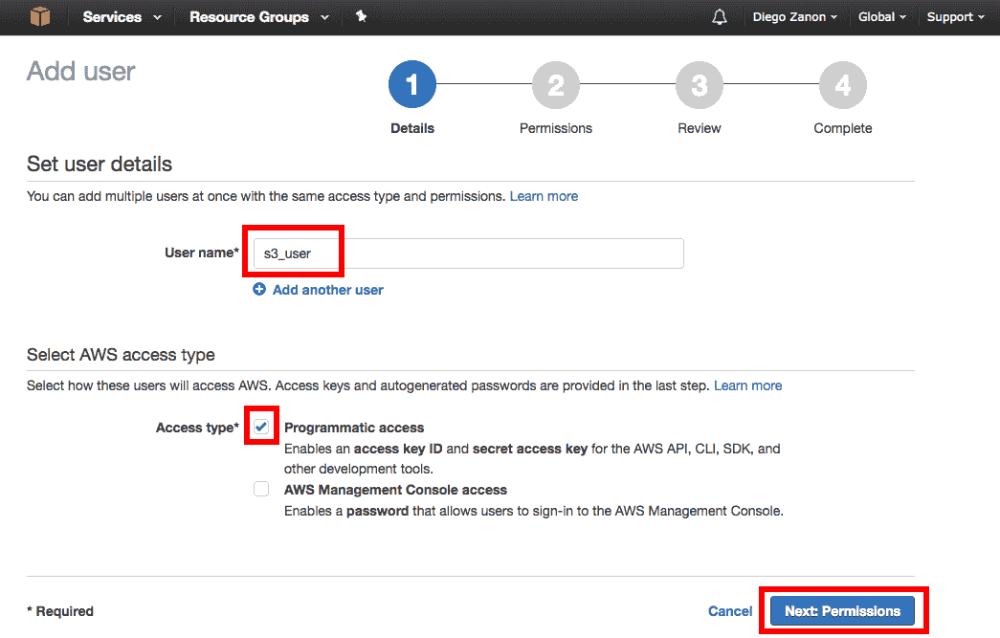

# AWS 入门

目前所有主要公共云服务提供商都提供无服务器产品。在本书中，我们将重点关注 AWS，它通常被认为是功能、成本和可靠性方面最佳的选择。由于我们需要在整本书中使用大量的 AWS 服务，因此本章介绍了它们，以帮助您熟悉我们示例应用程序的构建块。

本章涵盖的主要主题如下：

+   处理用户账户

+   使用 AWS CLI 和 SDK 服务

+   部署你的第一个 Lambda 函数

+   其他 AWS 无服务器产品

+   我们示例应用程序的架构

+   估算成本

在本章之后，你将能够开始尝试使用 AWS。

# Amazon Web Services

AWS 在收入方面是最大的云服务提供商。通常被认为是功能最好的，它提供了优秀的无服务器产品。这就是我们选择 AWS 的原因。如果你更喜欢使用其他云服务提供商，以下提供者是其他优秀的无服务器选择：

+   **Google Cloud Engine**：在这里，你可以使用 Google Cloud Functions 以 Node.js 执行无服务器代码，以及 Google Cloud Datastore 作为无服务器数据库。此外，Google 还集成了 Firebase 平台，该平台为移动和 Web 应用程序提供了许多工具和无服务器服务，如存储、身份验证和消息传递。

+   **Microsoft Azure**：这提供了 Azure Functions 以支持无服务器代码执行，支持 C#、Node.js、Python 和 PHP。

+   **IBM Cloud**：这提供了 IBM Bluemix OpenWhisk 以支持无服务器代码执行，支持 C#、Node.js、Java 和 Swift。

本书中的所有代码示例都是使用 Node.js 为 AWS 设计的。它们可以被移植到其他云平台，但这不会是一个容易的任务。正如在第一章中之前所述的，*理解无服务器模型*，无服务器的一个缺点是供应商锁定。然而，你可以使用这本书来学习这些概念，也许可以混合来自不同供应商的服务。例如，你可以使用 Azure Functions 与 Amazon SimpleDB。

如果你刚开始使用 AWS 而且没有任何先前的经验，那不是问题，因为我们将从基础知识开始。你可以从在 [`aws.amazon.com`](https://aws.amazon.com) 创建新账户开始。在 12 个月内，你可以享受免费层 ([`aws.amazon.com/free`](https://aws.amazon.com/free))，该免费层旨在让你在构建演示应用程序的同时免费学习和获得实践经验。还有一些服务提供超过 12 个月的永久免费层。

下一节将介绍本书中将使用的一些服务。请注意，AWS 有一个官方的产品分类（[`aws.amazon.com/products`](https://aws.amazon.com/products)），这与本书的分类不同。这是因为，我们不是根据服务的主要应用领域来分组服务，而是根据它们在我们用例中的使用方式来分组。例如，IoT 服务将用于通知，而不是连接设备。此外，Cognito 通常用于移动应用程序，但我们将使用其安全功能来构建网站：

+   安全服务

    +   AWS IAM

    +   亚马逊 Cognito

+   管理

    +   AWS SDKs

    +   AWS CLI

    +   AWS 云形成

    +   亚马逊云监控

+   前端服务

    +   亚马逊 S3

    +   亚马逊 Route 53

    +   亚马逊云前端

    +   AWS 证书管理器

+   消息和通知

    +   亚马逊 SNS

    +   AWS IoT

+   后端服务

    +   AWS Lambda

    +   亚马逊 API 网关

+   数据库服务

    +   亚马逊简单数据库

    +   亚马逊 DynamoDB

# 处理用户账户和安全

我们将开始介绍安全主题，因为你需要知道如何正确配置用户访问以及如何授予我们用于自动化基础设施的工具的权限。

# AWS IAM

当你创建你的 AWS 账户时，你会收到一个具有完全访问权限的根用户。它可以创建/删除和启动/停止任何服务。这对于学习来说很棒，但在开发真实项目时你不应该使用它。在信息安全中，最小权限原则要求用户或程序只能访问其合法目的所必需的信息或资源。如果你的访问密钥被泄露，如果访问范围受到限制，损害将会减少。

可追溯性是另一个重要方面。你不应该与他人共享你的用户。确保每个人都有自己的用户非常重要。AWS 提供了 CloudTrail 作为跟踪用户活动和 API 使用的工具。

因此，你需要学习如何使用**身份和访问管理**（**IAM**）创建具有受限访问权限的用户账户和应用密钥。由于我们还没有应用密钥，我们将使用 IAM 管理控制台配置安全设置。

# 创建用户和组

查看以下步骤以了解如何创建用户并将组关联到用户以限制用户访问：

1.  浏览到 IAM 网站 [`console.aws.amazon.com/iam`](https://console.aws.amazon.com/iam)：


1.  点击左侧菜单中的“用户”。

1.  选择“添加用户”，如图所示：


1.  输入用户名。在这里，你可以通过点击“添加另一个用户”选项一次添加多个用户。

1.  选择“程序访问”框以启用使用 CLI 和 SDK 的 API 访问。

1.  点击“下一步：权限”，如图所示：



1.  现在，我们需要为这个用户创建一个组。如果你还没有，请点击“创建组”：


1.  选择一个组名并选择一个策略。在本例中，我们将使用具有完全访问权限的**简单存储服务**（**S3**）策略。点击创建组继续，然后点击下一步：审查：


1.  审查所选数据并点击创建用户：


1.  记录显示在“访问密钥 ID”和“秘密访问密钥”框中的访问密钥 ID 和秘密访问密钥。稍后您将需要它们来配置 CLI 和 SDK：


在本章中，我们将运行 S3、SNS、Lambda 和 API Gateway 的示例。您可以利用这个机会，为每个服务提供适当的访问权限。**管理员访问**策略类型提供了对所有 AWS 资源的完全访问权限，如果您使用此账户部署到生产环境，应避免使用。

# 使用非 root 用户账户登录

之前创建的用户仅具有程序访问权限。您可以通过以下步骤编辑用户或创建另一个用户，以允许通过管理控制台访问：

1.  在“添加用户”界面，您需要勾选 AWS 管理控制台访问选项：


1.  您可以保留自动生成的密码和需要重置密码的选项。在选择组并确认后，您将收到一个密码和一个链接，用于使用此非 root 用户访问 AWS 账户：


1.  访问链接的格式为`https://your_aws_account_id.signin.aws.amazon.com/console`。您只需点击链接并输入您的新凭据。

1.  如果您不想公开 AWS 账户 ID 或您更喜欢使用友好的名称，如公司名称，您可以创建一个账户别名。在 IAM 控制台管理中，选择仪表板并点击自定义：


1.  现在，用户可以使用以下格式的链接登录：`https://your_alias.signin.aws.amazon.com/console`

# 亚马逊 Cognito

以安全的方式处理认证是一个复杂的问题，但这个用例如此常见，以至于许多框架和服务都是专门为解决它而构建的。如今，您只需复制几行代码，就可以顺利完成了。

Cognito 是亚马逊针对此问题的解决方案。它不仅解决了账户认证的问题，还提供了一个在不同设备之间同步数据的方法。当您使用 Cognito 账户登录时，您会收到一个临时 AWS 令牌，用于存储和检索特定于用户的数据，如偏好设置、用户资料或保存的游戏数据。

我们将在第八章，*保护无服务器应用程序*中通过代码示例进一步探讨此服务。

# 管理 AWS 资源

亚马逊提供的所有服务都是通过名为 AWS API 的 RESTful 接口配置的。您可以使用以下服务访问它们：

+   AWS 管理控制台

+   AWS SDKs

+   AWS CLI

请查看以下图示，它描述了亚马逊提供的服务：


AWS 架构的粗略示意图

# AWS 管理控制台

控制台是亚马逊提供的图形用户界面，可通过官方网站 [`console.aws.amazon.com`](https://console.aws.amazon.com) 访问。它是初学者最简单的界面，用于学习新服务很有用，但它并不完整。有些功能无法通过控制台访问或配置，例如管理您的 SimpleDB 数据。此外，在某些情况下，它需要大量的手动工作。如果您有一个重复的任务，最好使用 SDK 或 CLI 自动化它。

# AWS SDKs

SDK 是通过可重用代码管理您的 AWS 资源的最佳方式。使用 SDK，您可以通过非常简单的命令来自动化您的基础设施并处理错误。SDK 支持多种不同的编程语言，如 Java、Python、Ruby 等。在这本书中，我们将专门使用 Node.js SDK。官方文档可在 [`docs.aws.amazon.com/AWSJavaScriptSDK/latest/index.html`](http://docs.aws.amazon.com/AWSJavaScriptSDK/latest/index.html) 查找。

本书中的所有代码示例都使用 Node.js，它是一个跨平台的 JavaScript 运行时，具有事件驱动模型。我们不会介绍基础知识，因此读者应具备 Node.js 的基本知识。此外，我们将使用 Node 的默认包管理器 `npm` 来安装依赖项。

让我们通过以下步骤学习如何使用 Node.js SDK：

1.  使用 `npm init` 启动一个新的 Node 项目，并运行 npm 命令安装 AWS SDK：

```js
 npm install aws-sdk --save

```

1.  安装后，您需要设置 SDK 连接到 AWS 时将使用的访问密钥。这些密钥在上一节创建新用户时已生成。

1.  以下是一些设置凭证的选项：

    +   使用硬编码的密钥设置凭证

    +   在磁盘上加载 JSON 文件

    +   设置凭证文件

    +   设置环境变量

您应始终避免在 AWS 密钥中硬编码，尤其是在 GitHub 上的开源项目中。您不希望不小心提交您的私钥。

1.  我更喜欢通过环境变量来配置它们。如果您正在 macOS 或 Linux 上运行，请将以下行添加到 `~/.bash_profile` 文件中。将 `YOUR-KEY` 和 `YOUR-REGION` 替换为实际值：

```js
 export AWS_ACCESS_KEY_ID=YOUR-KEY
 export AWS_SECRET_ACCESS_KEY=YOUR-KEY
 export AWS_REGION=YOUR-REGION

```

1.  如果您正在 Windows 上运行，请在管理员命令提示符中执行以下命令，将密钥和区域的值替换为实际值：

```js
 setx AWS_ACCESS_KEY_ID YOUR-KEY
 setx AWS_SECRET_ACCESS_KEY YOUR-KEY
 setx AWS_REGION YOUR-REGION

```

1.  如果您没有首选区域，可以使用 `us-east-1`（美国东部弗吉尼亚州）。当您使用 AWS 管理控制台时，您可以通过右上角的下拉菜单设置您将要管理的资源所在区域。

这两种配置都是持久的，但它们只会在您下次打开命令行时生效。

1.  您可以通过创建一个名为 `index.js` 的新文件并运行以下代码来测试您的设置，以列出您的 S3 存储桶。作为一个简化的定义，您可以将 **存储桶** 视为一个文件仓库。现在，如果您有适当的访问权限，此示例将返回您的存储桶列表或一个空数组，如果没有的话。如果您没有访问权限或设置凭证时出现问题，它将返回一个错误：

```js
        const AWS = require('aws-sdk');
        const s3 = new AWS.S3();

        s3.listBuckets((err, data) => {
          if (err) console.log(err, err.stack); // an error occurred
          else console.log(data.Buckets); // successful response
        });

```

# AWS CLI

CLI 是命令行界面。对于经验丰富的用户来说，这是一个获取信息和管理工作资源的优秀工具。如果您已经安装了 Python，只需运行 `pip`，这是 Python 的默认包管理器，即可安装 CLI：

```js
 pip install awscli

```

CLI 的配置与 SDK 使用的配置非常相似。唯一的区别是您需要添加另一个环境变量：`AWS_DEFAULT_REGION`。您需要这个变量，因为 SDK 使用 `AWS_REGION` 而不是 `AWS_DEFAULT_REGION` 变量。

要测试您的设置是否正确，您可以执行 `ls`（列表）命令来列出 S3 存储桶：

```js
 aws s3 ls

```

考虑到一个包含一个存储桶的 AWS 账户，前面的命令行将产生以下输出：


# AWS CloudFormation

CloudFormation 为开发者提供了使用模板脚写整个基础设施的可能性。这种方法被称为 *基础设施即代码*。这是一个强大的功能，因为它使得将服务器和资源的配置复制到另一个区域或不同的账户变得容易。此外，您还可以对脚本进行版本控制，以帮助您开发基础设施。作为一个快速入门，AWS 为常见用例提供了许多示例模板 ([`aws.amazon.com/cloudformation/aws-cloudformation-templates`](https://aws.amazon.com/cloudformation/aws-cloudformation-templates))。

在这本书中，我们不会直接使用 CloudFormation，但在下一章中，我们将开始使用 Serverless Framework，它广泛使用 CloudFormation 来管理资源。这就是您如何轻松地将解决方案复制到不同环境，使得生产部署与开发或测试环境完全相同。 

# Amazon CloudWatch

CloudWatch 是 AWS 资源的监控服务。它通常用于监控虚拟机，但它不仅限于这一点，在您的操作仅基于无服务器函数时也发挥着重要作用。使用 CloudWatch，您可以监控错误、限制、调用次数、持续时间以及成本。您还可以通过自定义插件进一步扩展监控。

这个主题将在第十章 测试、部署和监控 中介绍。

# 前端服务

本节描述了与前端开发相关的主要服务。虽然在这里进行了介绍，但你将在第四章 托管网站中找到详细示例，届时我们将使用无服务器方法托管我们的应用程序前端。

# Amazon S3

**Amazon Simple Storage Service** (**S3**) 是一个可以保存任何类型文件的服务，如图像、日志文件和备份。从一点命名学开始，Amazon 将每个文件称为 **对象**，要存储文件，你需要一个称为 **存储桶** 的根文件夹。在你的账户中，你可以有多个存储桶以更好地组织你的数据。你还可以在存储桶内创建文件夹，但不能在存储桶内创建存储桶。

一个有趣的功能是，每个文件都会收到一个以下格式的唯一 URL：

`https://s3.amazonaws.com/bucketname/filename`

使用这种格式，存储桶名称必须在所有账户中唯一，以确保 URL 的唯一性。这意味着你不能创建一个像“my-photos”这样的通用名称的存储桶，因为它已经被占用。在命名时要有创意，并寄希望于好运。

如果文件是备份或其他类型的私有数据，你可以限制文件访问，但在这里我们将探讨的是让文件公开可用以存储我们的前端数据。这是一个强大的功能。例如，你可以用它来流式传输视频。你只需要添加一个引用 mp4 文件 URL 的 `<video>` HTML5 标签。为了获得一个看起来不错的播放器，你可以使用类似 [`videojs.com`](http://videojs.com) 的东西，它是开源的。

我们将利用 S3，因为它是一个非常便宜的存储服务，并且具有将文件共享以构建我们的低成本无服务器前端的能力。在我们的存储桶中，我们将添加所有前端静态文件，包括 HTML、CSS、JavaScript、图像等。通过适当的配置，这将在第四章 托管网站中详细说明，它将准备好以高可用性、可扩展性和低成本为我们提供内容服务。

# 使用 CLI 与 S3 一起使用

管理控制台非常有用，可以从 S3 上传和下载文件，但 CLI 同样有用。在本节中，我们将通过以下步骤创建存储桶并存储文件，以熟悉 CLI。这些步骤将在 AWS Lambda 演示中很有用：

1.  首先，选择一个存储桶名称，并使用 make-bucket 命令：

```js
 aws s3 mb s3://my-bucket-name

```

1.  现在，创建一个名为 `test.txt` 的文件并向其中写入内容。

1.  将文件复制到新的存储桶中，并将 **访问控制列表** (**ACL**) 设置为公开内容：

```js
 aws s3 cp test.txt s3://my-bucket-name/ --acl public-read

```

1.  使用以下命令行列出存储桶内容：

```js
 aws s3 ls s3://my-bucket-name

```

1.  使用以下命令行下载文件为 `test2.txt`：

```js
 aws s3 cp s3://my-bucket-name/test.txt test2.txt

```

想要了解更多命令，请参考官方指南：[`docs.aws.amazon.com/cli/latest/userguide/using-s3-commands.html`](http://docs.aws.amazon.com/cli/latest/userguide/using-s3-commands.html)。

# Amazon Route 53

Route 53 提供 DNS 服务，你可以在这里购买和托管你的网站域名。你可能更喜欢从其他卖家那里购买域名，比如 GoDaddy 或 Namecheap，但如果你想要使用 AWS 服务来托管你的无服务器前端，你需要使用 Route 53 来托管它。

当你配置一个子域名（例如 `mysubdomain.mydomain.com`）时，你可以设置一个 A 记录（IP 地址）或 CNAME（指向另一个地址的别名），但根域名（`mydomain.com`）需要 A 记录。如果你使用 S3 托管前端，你会收到一个设置 CNAME 记录的端点，但你不会得到一个固定的 IP 来设置 A 记录。由于 Route 53 是 AWS 服务，它接受 S3 端点作为 A 记录选项，从而解决了这个问题。

配置你的域名需要一个简单的设置，但它经常让不习惯 DNS 管理的网络开发者感到困惑。这个服务将在以后得到更多的关注，特别是在第四章，*托管网站*中。

# Amazon CloudFront

CloudFront 是一个**内容分发网络**（**CDN**）。这是一个特殊的服务，其目标是提高你的网站速度和可用性。它通过使用亚马逊在全球范围内的基础设施，包含超过 60 个边缘位置，每个位置都可以用来托管你的文件的副本，从而实现这一点。

一束以光速从悉尼（澳大利亚）到纽约（美国）传播的信号需要 53 毫秒。一个 ping 消息需要往返，覆盖两倍的距离，花费两倍的时间。此外，还有其他因素会增加这个时间：光在光纤（玻璃）中传播速度慢 33%，两个城市之间没有直线连接，以及像中继器和交换机这样的设备会减慢传输速度。结果是测量的延迟在 200 毫秒到 300 毫秒之间。相比之下，在同一城市提供内容可能会将延迟降低到 15 毫秒。

这种差异对于大多数应用程序通常并不显著。在无服务器网站上，冷启动延迟有更大的影响。如果你的用例对高延迟非常敏感，你应该避免使用无服务器，或者你可以使用 CloudFront 来最小化影响，至少在前端。

为了降低成本，CloudFront 不会自动在全球范围内复制你的内容。它只会复制存在需求的地方。例如，当从英国城市发起请求时，DNS 会将请求路由到最近的边缘位置，如果还没有本地副本的文件，它将临时复制（缓存）。当附近城市的另一个用户请求相同的文件时，它将受益于更低的延迟和快速响应。

# AWS 证书管理器

证书管理器是一个你可以请求免费 SSL/TLS 证书以使你的网站支持 HTTPS 的服务。以前，证书对于小型网站来说是一项昂贵的购买，每年从 100 美元到 500 美元不等。为了帮助使证书（和 HTTPS）对每个人可访问，Let's Encrypt（[`letsencrypt.org`](https://letsencrypt.org)）作为一个非营利性证书授权公司被创建，它基于捐赠和赞助运营。你可以获得免费证书，并且它们将被所有主要浏览器接受。

在 Let's Encrypt 之后，Amazon 推出了自己的服务，名为 AWS 证书管理器。它仅限于 AWS 客户，但也是免费的且更容易使用。一旦你颁发了一个新证书并将其与 CloudFront 分发关联，Amazon 还将负责在必要时自动续订证书。我们将在第四章，*托管网站*中介绍此服务。

# 消息和通知

本节介绍了你可以在 AWS 上使用哪些服务向用户发送通知。

# Amazon SNS

Amazon **简单通知服务**（**SNS**）实现了发布-订阅消息模式。当你创建一个 SNS 主题时，它将可供其他服务订阅。如果有人在主题中发布消息，所有已订阅的服务都将被提醒。

这是一个非常简单且强大的服务。你可以用它动态地附加能够处理特定类型通知的不同服务。例如，一个应用程序可以向 SNS 主题发送通知，提醒你已收到需要处理的文件。你可以使用 HTTP 端点订阅此主题，SNS 会将需要处理的文件位置的消息发送到你的 Web 服务。稍后，你可以添加另一个端点，使用一个编程用于执行另一种类型处理的 Lambda 函数。

让我们执行以下步骤，以 CLI 为例创建一个简单的演示：

1.  使用以下命令行创建一个 SNS 主题：

```js
 aws sns create-topic --name email-alerts

```

1.  结果是一个**Amazon 资源名称**（**ARN**），你需要将其保存。ARN 将以以下示例中的格式创建：`arn:aws:sns:us-east-1:1234567890:email-alerts`

1.  使用电子邮件协议订阅一个主题，这样每当应用程序向此主题发布时，你都会收到一封电子邮件：

```js
 aws sns subscribe --topic-arn the_previous_arn --protocol email \
          --notification-endpoint myemail@example.com

```

1.  打开你的电子邮件账户并确认你想要订阅事件。

1.  使用以下命令行发布测试消息并查看其工作情况：

```js
 aws sns publish --topic-arn the_previous_arn --message "test"

```

对于更多命令，请参阅官方指南[`docs.aws.amazon.com/cli/latest/userguide/cli-sqs-queue-sns-topic.html`](http://docs.aws.amazon.com/cli/latest/userguide/cli-sqs-queue-sns-topic.html)。

# AWS IoT

AWS IoT (物联网) 将在我们的解决方案中用于处理无服务器通知。尽管名称表明了物联网设备的使用，但我们将仅为此通过浏览器连接的用户使用此服务。这是因为将网页连接到通知服务以接收更新，通过订阅机制而不是数据轮询，需要使用 WebSocket，而 IoT 支持 WebSocket，而 Amazon SNS 不支持。因此，尽管 IoT 名称听起来可能有些奇怪，但我们仍会使用它，因为它是我们唯一能够处理我们用例的 AWS 服务。

AWS IoT 使用 **消息队列遥测传输**（**MQTT**）协议实现发布-订阅模式。我们将在 第九章，*处理无服务器通知* 中看到代码示例，同时为我们的示例网站的产品评论页面实现实时评论。

# 后端服务

在本节中，我们将通过一些实际示例介绍构建后端所需的服务。

# AWS Lambda

Lambda 是无服务器概念的主打产品。按需运行函数且无需管理以及其特定的定价模式是激发开发者社区兴趣的主要驱动力。我们可以这样说，我们有无服务器数据库、无服务器通知和无服务器前端，但这些都只是主要功能的扩展，即无服务器代码执行。

Lambda 目前仅支持 Node.js (JavaScript)、Python、Java 和 C# 语言，但有一个名为 Apex 的第三方框架 ([`github.com/apex/apex`](https://github.com/apex/apex))，通过在部署构建中注入 Node.js 模拟器，增加了对 Go、Rust 和 Clojure 的支持。

# 创建 Lambda 函数

在这本书中，我们将广泛使用 Serverless Framework 来简化 Lambda 函数的部署；然而，为了展示框架的实用性，在本章中，我们将使用 AWS 管理控制台进行对比。

我们现在将创建一个 Lambda 函数来处理日志文件。当新的日志文件添加到 S3 桶中时，该函数将被触发，Lambda 函数的结果是如果文件中存在错误，则创建一个 SNS 通知。

让我们看看以下必要的步骤：

1.  浏览以下链接：[`console.aws.amazon.com/lambda`](https://console.aws.amazon.com/lambda)。选择“立即开始”以创建一个新的函数：


1.  AWS 提供了许多带有示例配置和代码的模板。例如，您可以使用处理退回电子邮件的 Lambda 函数模板。这对于营销活动来说，可以移除不存在的电子邮件地址。然而，在这个例子中，我们将选择“空白函数”模板：


1.  Lambda 函数可以由许多不同的来源触发。在下一屏，您将看到所有可用选项的列表。选择 S3：


+   顺便提一下，看看一些可用触发器的用例：

    +   Amazon S3：您可以选择一个存储桶名称，事件类型为“对象创建（全部）”和前缀`images/`。在此设置中，当您将图像上传到图像文件夹中的此存储桶时，将触发 Lambda 函数进行后处理和图像优化。

    +   SNS：您可以使用此服务来处理通知。例如，您可以为收到新订单时激活的应用程序创建一个名为`Process Order`的 SNS 主题。SNS 可以配置为向特定员工列表发送电子邮件并触发 Lambda 函数以执行某些逻辑。

    +   CloudWatch Logs：此服务帮助您监控 AWS 资源并执行自动化操作。您可以通过触发 Lambda 函数来处理警报消息并根据其内容执行特定操作。

1.  选择 S3 后，您将看到一些配置选项。选择之前使用 CLI 创建的存储桶。对于事件类型，选择“对象创建（全部）”以在创建新文件时触发函数。对于前缀，键入`logs/`以仅考虑日志文件夹中的文件，并在后缀中键入`txt`以仅考虑文本文件。最后，勾选启用触发选项并点击下一步

1.  为您的 Lambda 函数键入一个名称，例如`processLog`，并选择 Node.js 6.10 作为运行时选项：

    

1.  现在，我们需要使用“编辑代码内联”选项实现 Lambda 函数将要执行的代码。在这个例子中，我们使用`S3.getObject`来检索创建的文件，并使用`SNS.publish`在文件中存在`error`单词时创建一个通知。对于 SNS 主题 ARN，您可以使用之前使用 CLI 创建的相同主题：

```js
        const AWS = require('aws-sdk');
        const s3 = new AWS.S3();
        const sns = new AWS.SNS();

        exports.handler = (event, context, callback) => {   
          const bucketName = event.Records[0].s3.bucket.name;
          const objectKey = event.Records[0].s3.object.key;
          const s3Params = { 
            Bucket: bucketName, 
            Key: objectKey 
          };

 s3.getObject(s3Params, (err, data) => {
            if (err) throw err;   

            // check if file have errors to report
            const fileContent = data.Body.toString();   
            if (fileContent.indexOf('error') !== -1) {         
              const msg = `file ${objectKey} has errors`;
              const snsParams = { 
                Message: msg, 
                TopicArn: 'my-topic-arn' 
              };
 sns.publish(snsParams, callback);
            }
          });
        }; 

```

`aws-sdk`模块对所有 Lambda 函数都可用。如果您想添加不是`aws-sdk`模块或 Node 核心模块的依赖项，您需要上传一个包含您的函数和模块的 ZIP 文件到 AWS。

1.  由于我们使用了内联选项来编写代码而不是上传 ZIP 文件，代码将被放置在一个`index.js`文件中。此外，我们创建的模块导出了一个名为`handler`的函数。在这种情况下，我们需要使用`index.handler`名称配置 Lambda 处理程序。对于角色框，我们需要创建一个新的角色，因为 Lambda 函数没有适当的访问权限是无法执行的。即使您使用管理员账户创建 Lambda，也必须明确授予 Lambda 可以访问哪些服务和资源的权限：


1.  为此角色输入一个角色名称，然后点击编辑以修改默认策略文档。添加以下 JSON 对象，并通过点击允许完成：

您需要将 S3 和 SNS ARN 替换为您各自的 ARN。


使用以下 JSON 对象：

```js
        {
          "Version": "2012-10-17",
          "Statement": [
            {
              "Effect": "Allow",
              "Action": ["s3:GetObject"],
              "Resource": "arn:aws:s3:::my-bucket-name/*"
            },
            {
              "Effect": "Allow",
              "Action": ["sns:Publish"],
              "Resource": "arn:aws:sns:us-east-1:1234567890:email-alerts"
            }
          ]
        }

```

1.  最后一步是配置高级设置。设置分配给此函数的 RAM 内存量以及 AWS 必须等待此函数完成执行的超时值。根据您将要使用的日志文件的大小，您可能需要增加超时值：


1.  点击下一步，您将被重定向到审查页面，您需要确认函数创建。

1.  要测试此函数，我们可以使用管理控制台，它允许我们创建自定义输入事件，但在此情况下，我们可以使用 CLI 上传新文件并触发 Lambda 函数。如果文件中有“错误”这个词，您应该会收到一个包含文件名的电子邮件消息。

查看以下 CLI 命令以触发此 Lambda 函数：

```js
 aws s3 cp log1.txt s3://my-bucket-name/logs/

```

1.  如果您遇到任何问题，可以尝试使用管理控制台查看出现的错误消息。在这种情况下，使用以下 JSON 对象作为事件触发器，替换桶名称：

```js
        {
          "Records": [
            {
              "s3": {
                "bucket": {
                  "name": "my-bucket-name"
                },
                "object": {
                  "key": "logs/log1.txt"
                }
              }
            }
          ]
        }

```

# 亚马逊 API Gateway

API Gateway 是一个帮助您构建 RESTful API 的服务。您需要配置您的资源，设置支持的 HTTP 动词并指定将处理请求的内容。您可以使用它将请求重定向到 EC2 实例（虚拟机）或外部 Web 服务器，但我们将在这里探索的是使用它来触发 Lambda 函数。

此外，API Gateway 还具有其他有趣的功能。例如，在创建您的 API 端点后，您可以使用 API Gateway 为许多不同的平台自动生成客户端 SDK，您可以在其中轻松测试并将其分发给第三方开发者使用。您还可以创建第三方 API 密钥，以细粒度访问权限、请求配额限制和节流来访问您的内容。

在我们的架构中，API Gateway 将充当一个薄层，它只存在于向世界公开我们的 Lambda 函数。此外，您还可以设置安全控制，仅允许经过身份验证的用户触发您的代码。我们将在下一章中使用此服务，我们将讨论如何使用 Serverless Framework 配置我们的端点，我们将在第六章 *开发后端* 中看到更多，在构建我们的后端代码时，最后，在第八章 *保护无服务器应用程序* 中，当我们的安全措施将被解释。

# 使用 API Gateway 公开 Lambda 函数

让我们使用 API Gateway 通过以下步骤公开我们的前一个 Lambda 函数，使其可以通过 URL 访问：

1.  首先，通过访问此链接[`console.aws.amazon.com/apigateway`](https://console.aws.amazon.com/apigateway)进入 API 网关管理控制台，然后点击创建 API。

1.  在创建新 API 标题下，选择新建 API 选项并输入 API 名称。例如：`log-processor`：


1.  在资源下，点击操作下拉菜单并选择创建方法：


1.  在新的下拉菜单中，选择 POST HTTP 动词。

1.  在- POST - 设置下，选择 Lambda 函数作为我们的集成类型。选择你已部署我们之前 Lambda 函数的区域及其对应名称，然后点击保存按钮：


1.  将会弹出一个窗口请求你允许此方法访问 Lambda 函数。接受它。

1.  在资源下，再次点击操作下拉菜单并选择部署 API。

1.  将会弹出一个窗口请求选择一个阶段。你可以选择[新建阶段]并将其命名为`dev`：


1.  点击部署。下一屏幕将显示 API 网关的部署位置。URL 将遵循以下格式，例如`https://[identifier].execute-api.[region].amazonaws.com/dev`。

1.  如果你尝试在浏览器中输入此 URL，结果将是一个认证错误，这是由于浏览器将尝试一个未定义的`GET`请求。因为我们只定义了一个`POST`资源，我们需要另一种测试方法。你可以使用 API 网关的测试功能，该功能位于左侧菜单的资源功能下，然后选择`POST`动词并点击测试。

1.  你需要提供**请求体**。在我们的案例中，它将是一个类似于新 S3 对象事件的 JSON 对象：

```js
        {
          "Records": [
            {
              "s3": {
                "bucket": {
                  "name": "my-bucket-name"
                },
                "object": {
                  "key": "logs/log1.txt"
                }
              }
            }
          ]
        }

```

1.  你只需将存储桶名称更改为之前使用的名称，API 网关将触发 Lambda 函数处理我们之前上传的`log1.txt`文件。

另一种使用 API 网关测试此集成的方法是使用**Postman**，这是一个非常流行的用于测试任何类型 RESTful API 的工具。Postman 可以作为 Chrome 扩展或 macOS 应用程序安装。

# 数据库服务

在本节中，我们将简要介绍 SimpleDB 和 DynamoDB 产品。这两个产品将在第七章中详细说明，*管理无服务器数据库*。

# Amazon SimpleDB

SimpleDB 是一个 NoSQL 数据库，可以定义为无服务器数据库，因为它可以自动扩展，高度可用且无需支付配置费用，并且你只需为数据库引擎执行查询所需的秒数付费。

你可以使用 SimpleDB 使用类似 SQL 的语法进行查询，但 SimpleDB 在功能方面非常有限。它的限制如此之高，以至于它只存储字符串字段！如果你存储 datetime 数据类型，你需要将其保存为字符串 ISO 表示形式，以避免本地化问题并能够使用 `where` 子句。如果你想存储数字，请使用零填充。那么我们如何使用负数来制作 `where` 子句呢？这是通过给所有数字添加一个大的偏移量来实现的，以避免存储负数！正如你所看到的，在 SimpleDB 上构建系统可能会很困难。有许多需要考虑的因素，并且在处理大量数据集时可能会遇到性能问题。因此，SimpleDB 通常仅适用于小型项目。

你可以通过以下链接了解如何处理数据类型的更多技巧：[`aws.amazon.com/articles/Amazon-SimpleDB/1232`](https://aws.amazon.com/articles/Amazon-SimpleDB/1232)

SimpleDB 是 AWS 提供的唯一无服务器数据库。如果你想获得更好的无服务器解决方案，你可能需要尝试其他云服务提供商。你目前有以下选择：Google Firebase 存储、Google Cloud Datastore 或 FaunaDB。

SimpleDB 是 AWS 最古老的服务之一，于 2007 年底宣布。然而，它仍然是极少数没有管理控制台的服务之一。如果你想有一个图形用户界面来轻松查询和管理你的 SimpleDB 数据，你可以安装第三方解决方案。在这种情况下，我建议使用 **SdbNavigator** **Chrome 扩展程序** 作为不错的选择。你只需要添加一个访问密钥和一个秘密密钥来连接到你的数据库。作为一个安全措施，使用 IAM 创建一个新的用户账户，并限制对 SimpleDB 的权限。

# Amazon DynamoDB

DynamoDB 是一个完全托管的 NoSQL 数据库，旨在实现高度可扩展性，具有快速和一致的性能。与 SimpleDB 不同，DynamoDB 拥有你在 NoSQL 数据库中期望的所有常见功能，并且可以广泛应用于大型项目中。然而，对于我们的用例，DynamoDB 有一个缺陷：它**不是**一个无服务器数据库。它需要配置资源，因此你不能说 DynamoDB 真正是无服务器的。如果你为配置的容量付费，你需要担心**服务器**，因为你可能会配置过多或过少的资源，即使没有人使用你的数据库，你也需要为可用性付费。

幸运的是，AWS 有一个永久性的免费层，非常慷慨。你可以免费处理每月超过 1 亿次的读写请求，并且这个优惠不仅限于新 AWS 用户。考虑到这个优势，低廉的用户基础增长价格，以及自动化的吞吐量配置可能性，DynamoDB 对于大多数无服务器应用来说是一个不错的选择，这一点通过无服务器社区使用 DynamoDB 创建的众多项目和演示得到了证明。很难想象 SimpleDB 会被用于即使是小型项目，因为 DynamoDB 对于低使用量是免费的。

因此，即使您有一个大型项目并最终不得不为未使用的预留资源付费，DynamoDB 的管理需求要少得多，并且可能比运行传统数据库解决方案更便宜。出于所有这些原因，我们将在本书中介绍 SimpleDB 的使用，但我们的示例应用程序将运行在 DynamoDB 上。

# 我们在线商店的无服务器架构

在本书中，我们将构建一个无服务器解决方案的真实世界用例。此示例应用程序是一个在线商店，具有以下要求：

+   可用产品列表

+   产品详情和用户评分

+   将产品添加到购物车

+   创建账户和登录页面

我们将在下一章中描述和实现每个功能。为了更好地理解架构，以下图表给出了我们在本章中介绍的不同服务组织方式和它们之间交互的一般视图：


# 估算成本

在本节中，我们将根据一些使用假设和亚马逊的定价模型来估算我们的示例应用程序演示的成本。这里使用的所有定价值均来自 2017 年中期，并考虑了最便宜的地区，美国东部（弗吉尼亚北部）。

本节包含一个示例，说明如何计算成本。由于计费模型和价格可能会随时间变化，在做出自己的估算之前，请始终参考官方来源以获取更新的价格。您可以使用亚马逊的计算器，该计算器可通过此链接访问：[`calculator.s3.amazonaws.com/index.html`](http://calculator.s3.amazonaws.com/index.html)。如果您在阅读说明后仍有任何疑问，您始终可以免费联系亚马逊的支持以获得商业指导。

# 假设

对于我们的定价示例，我们可以假设我们的在线商店每月将接收以下流量：

+   100,000 次页面浏览

+   1,000 个注册用户账户

+   考虑到平均页面大小为 2 MB，已传输 200 GB 的数据

+   5,000,000 次代码执行（Lambda 函数），平均每次请求 200 毫秒

# Route 53 定价

我们需要一个托管区域来处理我们的域名，每月费用为 0.50 美元。此外，我们还需要为每百万次对域名的 DNS 查询支付 0.40 美元。由于这是一个按比例计算的费用，100,000 次页面浏览将只需支付 0.04 美元。

总计：0.54 美元

# S3 定价

亚马逊 S3 按每 GB/月存储费用收取 0.023 美元，每 10,000 次对文件的请求费用为 0.004 美元，以及每 GB 传输费用为 0.09 美元。然而，由于我们正在考虑 CloudFront 的使用，传输费用将按 CloudFront 的价格收取，不会计入 S3 的账单中。

如果我们的网站静态文件小于 1 GB，平均每页 2 MB 和 20 个文件，我们可以以低于 US$ 20 的价格提供 100,000 次页面浏览。考虑到 CloudFront，S3 费用将降至 US$ 0.82，而您需要在另一个部分支付 CloudFront 的使用费用。实际费用会更低，因为 CloudFront 会缓存文件，它不需要向 S3 发出 2,000,000 次文件请求，但让我们跳过这个细节以减少估计的复杂性。

顺便提一下，如果您需要配置机器来处理这么多页面浏览量，以相同的可用性和可伸缩性来处理静态网站，费用将会更高。

总计：US$ 0.82

# CloudFront 定价

由于不同区域的价格不同，CloudFront 的定价稍微复杂一些，因为您需要猜测每个区域的流量。以下表格显示了一个估计示例：

| **区域** | **预估流量** | **每 GB 传输费用** | **每 10,000 个 HTTPS 请求费用** |
| --- | --- | --- | --- |
| 北美 | 70% | US$ 0.085 | US$ 0.010 |
| 欧洲 | 15% | US$ 0.085 | US$ 0.012 |
| 亚洲 | 10% | US$ 0.140 | US$ 0.012 |
| 南美 | 5% | US$ 0.250 | US$ 0.022 |

根据我们估计的 200 GB 文件传输和 2,000,000 次请求，总费用将是 US$ 21.97。

总计：US$ 21.97

# 证书管理器定价

证书管理器提供免费的 SSL/TLS 证书。您只需为运行应用程序创建的 AWS 资源付费。

# IAM 定价

IAM 使用没有特定费用。您只需为用户使用的 AWS 资源付费。

# Cognito 定价

每个用户都有一个关联的配置文件，每月费用为 US$ 0.0055。然而，有一个永久免费层，允许 50,000 个每月活跃用户免费使用，这对于我们的用例来说已经足够了。

此外，我们还需要为用户配置文件的 Cognito 同步付费。每次 10,000 次同步操作的费用为 US$ 0.15，每 GB/月存储的费用为 US$ 0.15。如果我们估计有 1,000 个活跃且注册的用户，每个配置文件小于 1 MB，平均每月访问次数少于 10 次，我们可以估计费用为 US$ 0.30。

总计：US$ 0.30

# 物联网定价

物联网费用起价为每百万条交换消息 US$ 5。由于每次页面浏览至少会触发 2 次请求，一次用于连接，另一次用于订阅主题，我们可以估计每月至少有 200,000 条消息。如果我们假设 1%的用户会对产品进行评分，我们需要额外增加 10,000 条消息，我们可以忽略其他请求，如断开连接和取消订阅，因为它们不包括在计费中。在这种情况下，总费用将是 US$ 1.01。

总计：US$ 1.01

# SNS 定价

我们将仅使用 SNS 进行内部通知，当 CloudWatch 触发关于我们基础设施问题的警告时。SNS 每 100,000 封电子邮件收费 US$ 2.00，但它提供 1,000 封电子邮件的永久免费层。因此，对我们来说将是免费的。

# CloudWatch 定价

CloudWatch 每个指标/月收费 US$ 0.30 和每个警报收费 US$ 0.10，并提供每月 50 个指标和 10 个警报的永久免费层。如果我们创建 20 个指标并预计一个月内有 20 个警报，我们可以估计成本为 US$ 1.00。

总计：US$ 1.00

# API Gateway 定价

API Gateway 开始对每百万个接收到的 API 调用收费 US$ 3.50 和每向互联网传输 1 GB 数据收费 US$ 0.09。如果我们假设每月有 500 万次请求，每次响应的平均大小为 1 KB，该服务的总成本将为 US$ 17.93。

总计：US$ 17.93

# Lambda 定价

当你创建一个 Lambda 函数时，你需要配置将可用于使用的 RAM 内存量。它的范围从 128 MB 到 1.5 GB。分配更多内存意味着额外的成本。这打破了避免配置的哲学，但至少这是你需要担心的事情之一。这里的良好实践是估计每个函数所需的内存量，并在部署到生产之前进行一些测试。不良的配置可能会导致错误或更高的成本。

Lambda 具有以下计费模型：

+   每 1,000,000 次请求收费 US$ 0.20

+   每 GB-second 收费 US$ 0.00001667

运行时间按秒的分数计算，向上取整到最接近的 100 毫秒的倍数。

此外，还有一个永久免费层，每月提供 1,000,000 次请求和 400,000 GB-seconds，无需收费。

在我们的用例场景中，我们假设每月有 500 万次请求，平均每次执行时间为 200 毫秒。我们还可以假设每个函数分配的 RAM 内存为 512 MB：

+   **请求费用**：由于 1,000,000 次请求是免费的，你只需为 4,000,000 次请求付费，费用为 US$ 0.80。

+   **计算费用**：在这里，500 万次执行每次 200 毫秒的计算，总共为 1,000,000 秒。由于我们以 512 MB 的容量运行，这导致 500,000 GB-seconds，其中 400,000 GB-seconds 是免费的，因此产生 100,000 GB-seconds 的费用，费用为 US$ 1.67。

+   **总计**：US$ 2.47

# SimpleDB 定价

看看以下 SimpleDB 计费，其中免费层适用于新用户和现有用户：

+   每机器小时收费 US$ 0.14（25 小时免费）

+   每向互联网传输 1 GB 数据收费 US$ 0.09（1 GB 是免费的）

+   每存储 1 GB 数据收费 US$ 0.25（1 GB 是免费的）

看看以下费用：

+   **计算费用**：考虑到 500 万次请求，平均执行时间为 200 毫秒，其中 50% 的时间是在等待数据库引擎执行，我们估计每月需要 139 个机器小时。扣除 25 个免费小时，执行费用为 US$ 15.96。

+   **传输费用**：由于我们将数据在 SimpleDB 和 AWS Lambda 之间传输，因此没有传输费用。

+   **存储费用**：如果我们假设一个 5 GB 的数据库，由于 1 GB 是免费的，因此结果为 US$ 1.00。

+   **总计**：US$ 16.96，但这个费用将不会添加到最终估计中，因为我们将在使用 DynamoDB 运行我们的应用程序。

# DynamoDB

DynamoDB 要求您为预期您的表提供的吞吐量容量进行配置。您不需要配置硬件、内存、CPU 等因素，您需要说明您期望的读取和写入操作的数量，AWS 将处理必要的机器资源，以提供一致且低延迟的性能来满足您的吞吐量需求。

一个读取容量单元代表每秒一次强一致性读取或每秒两次最终一致性读取，其中对象大小最多为 4 KB。关于写入容量，一个单元意味着您每秒可以写入一个大小为 1 KB 的对象。考虑到这些定义，AWS 在永久免费层提供 25 个读取单元和 25 个写入单元的吞吐量容量，以及 25 GB 的免费存储。其收费如下：

+   每个月每 **写入容量单元**（**WCU**）收费美元 0.47

+   每个月每 **读取容量单元**（**RCU**）收费美元 0.09

+   每存储 1 GB/月收费美元 0.25

+   每传输 1 GB 到互联网收费美元 0.09

由于我们估计的数据库将只有 5 GB，我们处于免费层，我们不会为传输的数据付费，因为向 AWS Lambda 的传输没有费用。

关于读写容量，我们估计每月有 500 万次请求。如果我们平均分配，我们将每秒获得两次请求。在这种情况下，我们将考虑每秒一次读操作和一次写操作。

我们现在需要估计受读操作和写操作影响的对象数量。对于写操作，我们可以估计平均操纵 10 项，而读操作将扫描 100 个对象。在这种情况下，我们需要预留 10 WCU 和 100 RCU。由于我们有 25 WCU 和 25 RCU 的免费额度，我们每月只需为 75 RCU 支付费用，费用为美元 6.75。

总计：美元 6.75

# 总定价

让我们在下表中总结每种服务的成本：

| **服务** | **月度成本** |
| --- | --- |
| Route 53 | 美元 0.54 |
| S3 | 美元 0.82 |
| CloudFront | 美元 21.97 |
| Cognito | 美元 0.30 |
| IoT | 美元 1.01 |
| CloudWatch | 美元 1.00 |
| API Gateway | 美元 17.93 |
| Lambda | 美元 2.47 |
| DynamoDB | 美元 6.75 |
| **总计** | **美元 52.79** |

这导致在基础设施上每月总成本约为美元 50，以服务 10 万次页面浏览。如果您有 1% 的转化率，您每月可以获得 1,000 笔销售，这意味着您为每件销售的产品支付美元 0.05 的基础设施费用。

# 摘要

在本章中，您已经了解了本书中将使用的服务。您已经知道如何创建具有受限权限的新 AWS 用户，如何使用 AWS CLI 和 Node SDK，以及前端、后端和通知服务是什么。本章展示了每个服务如何适应我们的示例应用程序架构，并学习了如何估计其成本。

在下一章中，你将了解到在开发工作流程中扮演重要角色的无服务器框架，它能够自动化任务和组织代码。你将学习如何配置、部署 Lambda 函数，以及如何构建我们示例应用的初始结构。
