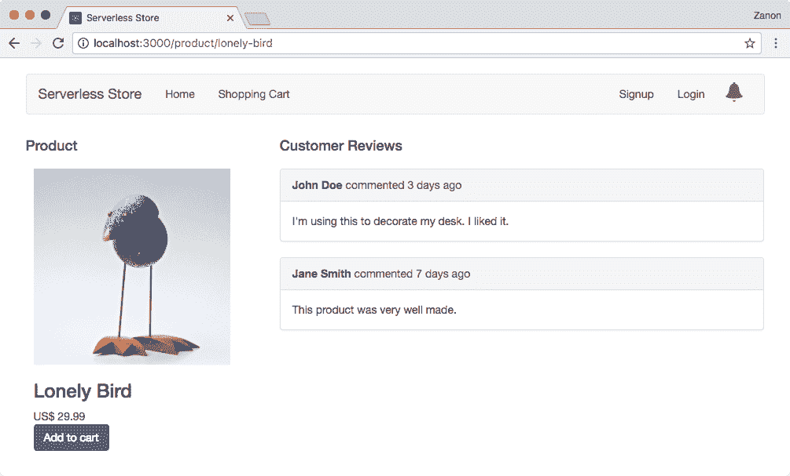

# 构建前端

在本章中，我们将构建我们的演示应用的网络页面。这里的目的是不是教授前端开发，而是展示你可以使用现代工具以及无服务器。对于这个演示，我们将使用 React，但你也可以使用 Angular、Vue.js 或其他任何工具，并且仍然可以利用无服务器的功能。此外，我们将从无服务器的角度讨论 SPA 的优缺点，并看看我们如何预渲染 SPA 页面以优化**搜索引擎优化**（**SEO**）。

在本章中，我们将涵盖以下主题：

+   如何使用 React 构建我们的网页

+   单页应用（SPA）的优缺点

+   预渲染页面以优化 SEO

在本章之后，你将已经构建了我们无服务器在线商店的前端。

# React 入门

教授前端工具不是本书的目标，但我们需要构建一些有用的东西来展示无服务器如何处理现代前端开发。在这里，我们将使用 React，因为它目前是最受欢迎的工具之一。如果你不知道 React 是什么或者如何使用它，我会引导你理解基本概念。

# React 原则

你应该注意的第一件事是，React 是一个库而不是一个框架。区别在于，一个库提供了一套功能来解决一个*特定*的问题，而一个框架提供了一套围绕特定方法的库。

React 只负责应用视图层。这就是 React 解决的问题。如果你需要执行 Ajax 调用或处理页面路由，你需要添加其他库。当你用 React 开发时，你需要以组件的方式思考。你的用户界面是由简单的组件组成的，其中每个组件都有一个内部状态和 HTML 定义。在使用 React 时，你不会直接操作网页。你改变组件的状态，React 会重新渲染它以匹配当前状态。这种方法促进了可预测性。对于给定的状态，你总是知道组件将如何渲染。这对于测试和维护复杂的应用程序非常重要。

另一个重要的概念是虚拟 DOM。**文档对象模型**（**DOM**）是 HTML 页面所有节点的表示。如果页面上有变化，你需要渲染不同的视图，DOM 就需要被操作。问题是当你有数百个节点时。重新创建整个视图会有性能成本，这是用户可以感知到的。

虚拟 DOM 是真实 DOM 的抽象版本。React 跟踪所有组件的状态，并知道其中任何一个何时被修改。它不会重新渲染整个视图，而是比较修改后的虚拟 DOM 和真实 DOM，并制作一个只包含差异的小补丁。这个补丁以更好的性能应用。

总结来说，你需要知道 React 是一个**库**，其特定目的是处理**视图层**，它基于**组件**，其中每个组件都有一个内部的**状态**和**视图**定义，你不能直接修改 DOM，因为这属于虚拟 DOM 的责任。

# The Flux pattern

Flux 是一种用于应用程序状态管理的模式，Redux 是最受欢迎的 Flux 灵感实现。如果你正在构建一个复杂的 React 应用程序，你应该学习 Redux 或另一个类似 Flux 的框架。然而，*你可能不需要 Redux*，正如 Redux 的创造者 Dan Abramov 在他的博客中提到的([`medium.com/@dan_abramov/you-might-not-need-redux-be46360cf367`](https://medium.com/@dan_abramov/you-might-not-need-redux-be46360cf367))：“*人们经常在他们需要 Redux 之前就选择了 Redux*。”

Redux 是一个优秀的框架，但它增加了项目的复杂性。由于我们正在构建一个小型的前端应用程序，我们在这里不会使用它，对于具有短组件树的应用程序，这个决定是有意义的。再次强调，本书的目标是专注于无服务器，而不是前端开发，因此 Redux 超出了我们的范围。在现实世界的应用程序中，你需要考虑利弊。大多数时候，你会选择使用 Redux，但并不总是如此。

# React hello-world

React 推荐使用 JSX，这是一种将 JavaScript 与 XML 混合的语法。你不需要使用 JSX，但*应该*使用它来提高代码的可读性。例如，看看下面的 JSX：

```js
    class HelloReact extends React.Component {
      render() {
        return <div>Hello, {this.props.name}!</div>;
      }
    }

    ReactDOM.render(
      <HelloReact name="World"/>,
      document.getElementById('root')
    );

```

这个例子定义了一个`<HelloReact/>`HTML 元素，渲染输出将使用`name`属性的值。如果输入是`World`，渲染结果将是`<div>Hello, World!</div>`。

然而，浏览器无法执行这段代码，因为 JSX 没有原生支持。你需要使用一个 JSX 编译器，它将这个例子转换成以下 JavaScript 代码：

```js
    class HelloReact extends React.Component {
      render() {
        return React.createElement(
          "div", null,
          "Hello, ", this.props.name, "!"
        );
      }
    }

    ReactDOM.render(
      React.createElement(HelloReact, { name: "World" }),
      document.getElementById('root')
    );

```

将 JavaScript 代码与 HTML 混合听起来很奇怪，但我们可以习惯它。最终，大多数人会发现它更令人愉快且更容易维护。

要使这段代码工作，我们需要添加两个依赖项，例如 React 和 ReactDOM。前者是核心，它让我们创建组件，后者是库，它渲染组件并将它们附加到 HTML 节点中。

你可以在[`unpkg.com/react/`](https://unpkg.com/react/)和[`unpkg.com/react-dom/`](https://unpkg.com/react-dom/)找到这些依赖项。你将在`dist`文件夹内找到必要的文件。

以下代码是一个工作的 hello-world 示例：

```js
    <!DOCTYPE html>
    <html>
      <head>
        <title>Hello, World!</title>
      </head>
      <body>
        <div id="root"> <!-- this is where we'll hook React -->
        </div>
 <script src="img/react.min.js"></script>
 <script src="img/react-dom.min.js"></script>
        <script type="text/javascript">
          class HelloReact extends React.Component {
 render() {
 return React.createElement(
 "div", null,
 "Hello, ", this.props.name, "!"
 );
 }
 }

          ReactDOM.render(
 React.createElement(HelloReact, { name: "World" }),
 document.getElementById('root')
 );
        </script>
      </body>
    </html>

```

# 构建购物车

要理解 React，我们需要了解 props 和 states 是如何工作的，以及我们如何使用不同的组件来组合一个界面。为了一个实际的例子，我们将构建一个购物车。这个例子将成为我们无服务器商店的基础，现在的目标是实现以下结果：


# 准备开发环境

React 的一项批评是需要外部工具进行开发。实际上，人们可以使用纯 JavaScript，但正如我们所看到的，JSX 更容易理解。因此，你需要添加到项目中的第一个工具就是一个 JSX 编译器。

当你浏览 React 项目或其他现代 Web 项目时，你也会发现人们使用许多其他工具，例如 Babel（ES6 到 ES5 编译器）、Webpack（模块打包器）、ESLint（代码分析）等。每个工具都有许多竞争对手。例如，你可能更喜欢使用 Browserify 而不是 Webpack。理解和配置这些工具需要很长时间。如果你在学习 React，你首先需要了解 React 是如何工作的，而不是环境是如何配置的。

在这种情况下，**Create React App** 工具提供了一个有见地的配置，它使用经过验证的工具和实践。你不再需要担心环境，只需遵循他人的建议即可。

查看以下步骤，了解如何使用此工具启动新项目：

1.  使用以下 npm 命令安装 Create React App 工具：

```js
 npm install create-react-app@1.3.1 --global

```

`@1.3.1` 这个术语意味着它将下载用于本书示例的确切版本。如果你愿意，你可以移除这个 `@1.3.1` 限制以获取最新功能，但这可能会引入对示例的破坏性更改。

1.  现在，使用以下命令创建一个新的应用程序：

```js
 create-react-app react-shopping-cart

```

1.  将目录切换到新文件夹，并使用以下命令启动应用程序：

```js
 cd react-shopping-cart
 npm start

```

1.  你可以在 [`localhost:3000`](http://localhost:3000) 上看到运行中的应用程序，如下面的截图所示：


# 组织解决方案

此应用程序将创建以下结构：

```js
    node_modules
    public
      |- favicon.ico
      |- index.html
      |- manifest.json
    src
      |- App.css
      |- App.js
      |- App.test.js
      |- index.css
      |- index.js
      |- logo.svg
      |- registerServiceWorker.js
    .gitignore
    package.json
    README.md

```

`public/manifest.json` 和 `src/registerServiceWorker.js` 文件用于支持**渐进式 Web 应用**（**PWA**），这是一个构建快速且更可靠的网页的出色功能，因为它缓存静态资源并允许离线访问。然而，PWA 对于在线商店来说并不那么有用，并且超出了本书的范围，因此它将从示例中删除。

我们将在此处进行以下更改，以使示例适应我们的项目：

1.  **删除 PWA 支持**：删除 `public/manifest.json` 和 `src/registerServiceWorker.js` 文件。

1.  **删除未使用的 src 文件**：删除 `App.css`、`App.js`、`App.test.js`、`index.css` 和 `logo.svg` 文件。

1.  **创建文件夹**：在 `src/` 目录下创建 `css/`、`components/` 和 `images/` 文件夹。

1.  **添加组件**：在 `components/` 目录下添加 `App.js`、`ShoppingCart.js`、`ShoppingCartItem.js`、`Product.js` 和 `ProductList.js` 文件。

1.  **添加 CSS**：在 `css/` 目录下创建一个名为 `site.css` 的文件，该文件将作为我们的自定义样式。

1.  **添加图片**：添加两张将用作我们产品的图片。我使用了来自 Pixabay 的免费图片（Creative Commons CC0）（[`pixabay.com`](https://pixabay.com)）。

您可以浏览本章的 Packt 资源（[`github.com/PacktPublishing/Building-Serverless-Web-Applications`](https://github.com/PacktPublishing/Building-Serverless-Web-Applications)）以查看最终结果。该项目位于名为`react-shopping-cart`的文件夹中。

现在您应该有以下项目结构：

```js
    node_modules
    public
      |- favicon.ico
      |- index.html
    src
 |- components
 |- App.js
 |- Product.js
 |- ProductList.js
         |- ShoppingCart.js
 |- ShoppingCartItem.js
 |- css
 |- site.css
 |- images
 |- <images>
      |- index.js
    .gitignore
    package.json
    README.md

```

在开始编写组件代码之前，我们需要在`index.js`文件中做一些修改，以匹配新的项目结构。使用以下代码：

```js
    import React from 'react';
    import ReactDOM from 'react-dom';
 import App from './components/App'; import './css/site.css';    ReactDOM.render(
      <App/>,
      document.getElementById('root')
    );

```

对于响应式网站，我已经在`public/index.html`文件中包含了 Twitter Bootstrap 3（[`getbootstrap.com`](https://getbootstrap.com)）样式：

```js
    <!doctype html>
    <html lang="en">
      <head>
        <meta charset="utf-8">
        <title>Serverless Store</title>
        <link rel="shortcut icon" href="%PUBLIC_URL%/favicon.ico">
 <link rel="stylesheet" href="bootstrap.min.css">     
      </head>
      <body>
        <div id="root"></div>
      </body>
    </html>

```

# 组合组件

用户界面是组件的组合。为了使这一点更清晰，以下图表显示了我们将如何组合我们的组件以创建应用程序设计：


**App**组件持有整个视图，并负责定位**产品列表**和**购物车**组件。**产品列表**组件包含一系列**产品**组件，购物车将列出所选产品作为**购物车项**。

在 React 中，组件之间没有交互，除非通过从父组件传递属性到子组件。这些属性被称为 props。除非父组件提供一个处理函数作为属性，并且子组件在事件发生时执行此处理函数，否则子组件不能向父组件传递数据。例如，父组件可以提供一个`handleClick`函数，当子组件中的按钮被点击时，该函数将被触发。

由于只能有父子交互的限制，产品列表和购物车组件需要一个共同的父组件。当选择一个产品时，它将在产品列表中触发一个函数，这反过来又会在应用程序组件中触发另一个函数。这个处理程序将改变应用程序组件的状态，因此购物车组件的状态也会随之改变，因为应用程序组件将被定义为通过`props`将数据传递到购物车。

# 实现组件

在以下代码片段中，展示了组件的骨架。此格式将被用于实现所有组件。为了专注于内容，进一步的示例将只显示`constructor()`和`render()`实现。完整的代码示例可以从与本书相关的 Packt 资源中下载：

```js
    // import React and other dependencies
    import React, { Component } from 'react';
    import AnotherComponent from './AnotherComponent';

    // define the Component as a class
 class MyComponent extends Component {
      // optional method
      constructor() {
 super();
 this.state = {
 // state };
 }

      // this method must be implemented
      render() {
 return (
 // HTML definition
 );
 }
    }

    // export the component, so it can be used by others    
 export default MyComponent;

```

# 应用程序组件

应用程序是一个负责组织页面布局的组件。它使用 Bootstrap 的网格系统定位两个其他主要组件，如产品列表和购物车。它应该按照以下方式渲染：

```js
    render() {
      return (
        <div className="container">
          <div className="row">
            <div className="col-md-12">
              <h1>Serverless Store</h1>
            </div>
          </div>
          <div className="row">
            <div className="col-md-8">
              <h3>Products</h3>
              <ProductList
 products={this.state.products} onSelect={this.handleSelect}/>            </div>
            <div className="col-md-4">
              <h3>Shopping Cart</h3>
              <ShoppingCart 
                selectedProducts={
                  this.state
                      .products
 .filter(p => p.isSelected)
                } 
                onDeselect={this.handleDeselect}/>            </div>
          </div>
        </div>
      );
    }

```

当使用 JSX 时，你通过`className`属性给 HTML 元素添加一个类，例如：

`<div className="container"></div>`

在此代码中，我们可以看到产品列表组件被设置了两个属性，例如`products`和`onSelect`：

```js
 <ProductList products={this.state.products} onSelect={this.handleSelect}/>

```

`products` 属性将接收一个由 App 组件的状态控制的产品列表。`onSelect` 属性将接收一个处理函数，该函数将由子组件用于在产品被选中时触发父组件。

我们还可以看到，购物车组件有两个属性，例如 `selectedProducts` 和 `onDeselect`：

```js
 <ShoppingCart      selectedProducts={
        this.state
            .products
 .filter(p => p.isSelected)
      }onDeselect={this.handleDeselect}/>

```

`selectedProducts` 属性将接收一个所选产品的列表，而 `onDeselect` 属性定义了一个处理函数，当产品被取消选中时，购物车组件应该触发此函数。

因此，在这个组件中，App 组件正在与产品列表和购物车组件共享其状态，因此 App 负责定义产品对象并跟踪所选产品。产品列表的初始定义如下代码所示：

```js
    import lonelyBird from '../images/lonely-bird.jpg';
    import solidFriendship from '../images/solid-friendship.jpg';

    const products = [{
        id: 1,
        name: 'Lonely Bird',
        image: lonelyBird,
        price: 29.99,
        isSelected: false
    }, {
        id: 2,
        name: 'Solid Friendship',
        image: solidFriendship,
        price: 19.99,
        isSelected: false
    }];

```

前面的代码片段是一个简化的例子。在下一章中，我们将从这个 Lambda 函数中检索这个列表。

初始状态是在类构造函数中定义的。此外，你还需要将组件的 `this` 实例绑定到回调函数上。否则，当函数在另一个组件内部被调用时，将找不到 `this.state`：

```js
    constructor() {
       super();
       this.state = {
 products: products };       // bind the component's "this" to the callback
       this.handleSelect = this.handleSelect.bind(this);
       this.handleDeselect = this.handleDeselect.bind(this);     }

```

`handleSelect` 函数应该在类内部定义，并且它将接收一个产品作为参数来设置其 `isSelected` 状态：

```js
    handleSelect(product) {
      // create a copy of the products array
      const products = this.state.products.slice();

      // find the index of the product to modify
 const index = products.map(i => i.id).indexOf(product.id);

      // modify the selection state
 products[index].isSelected = product.isSelected;      // make React aware that the state has changed
      this.setState({products: products});
    } 

```

在这个例子中，有几个需要注意的地方：使用了 `slice()` 来创建另一个数组，而不是修改当前数组，并且使用了 `setState()` 而不是直接更改 `products` 的引用。这是因为使用不可变对象有性能优势。通过检查引用是否已更改，比检查所有属性值更容易识别已修改的对象。至于 `setState()`，它用于让 React 知道需要重新渲染组件。

最后，由于 `handleSelect` 函数正在接受 `isSelected` 属性并设置状态，无论该属性是真是假，我们可以使用 `handleSelect` 函数来定义 `handleDeselect` 函数：

```js
    handleDeselect(product) {
      this.handleSelect(product);
    }

```

# 产品列表组件

此组件通过 `props` 变量访问其父组件提供的数据。它将使用 `products` 数组迭代并创建一个新的产品组件，为数组的每个项目。它还将设置由其父组件传递的 `onSelect` 处理函数：

```js
    render() {
 const onSelect = this.props.onSelect;
      const productList = 
 this.props.products.map(product => {          return (
            <div key={product.id} 
                 className="product-box">
              <Product
 product={product} onSelect={onSelect}/>            </div>
          )
        });

      return (
        <div>
          {productList}
        </div>
      );
    }

```

# 产品组件

此组件负责渲染产品的详细信息，例如图片、描述、价格以及一个允许用户将产品添加到购物车的按钮。正如你所看到的，按钮的 `onClick` 事件将改变 `isSelected` 状态并触发 `onSelect` 函数：

```js
    render() {
      return (
        <div>
          
          <div>
            <h3>{this.props.product.name}</h3>
            <div>US$ {this.props.product.price}</div>
            <div>
              <button onClick={() => {
 const product = this.props.product; product.isSelected = !product.isSelected; this.props.onSelect(product);              }}>
                {this.props
                     .product
                     .isSelected ? 'Remove' : 'Add to cart'}
              </button>
            </div>
          </div>
        </div>
      );
    }

```

# 购物车组件

购物车组件负责渲染所选产品并显示总价值。让我们看一下以下代码片段，看看这是如何实现的：

```js
    render() {
      const onDeselect = this.props.onDeselect;
      const products = 
 this.props.selectedProducts.map(product => {
          return (
            <ShoppingCartItem key={product.id}
                              product={product}
                              onDeselect={onDeselect}/>
          )
 });

      const empty = 
        <div className="alert alert-warning">
          Cart is empty
        </div>;

      return (
        <div className="panel panel-default">
          <div className="panel-body">
 {products.length > 0 ? products : empty}
            <div>Total: US$ {this.getTotal()}</div>          </div>
        </div>
      );
    }

```

`getTotal`函数使用`map`/`reduce`操作来获取聚合的总值。`map`操作将转换输入，创建一个数字数组，而`reduce`将求和所有值：

```js
    getTotal() {
      return this.props
                 .selectedProducts
                 .map(p => p.price)
                 .reduce((a, b) => a + b, 0);
    }

```

# 购物车组件

最后一个组件是购物车组件。对于每个选定的产品，购物车组件将添加一个购物车项。此组件使用产品名称和值进行渲染，以及一个带有 X 标记的 Glyphicon 图标。Glyphicon 是一组可以通过 Bootstrap 获取的图标。

此外，当用户点击图标时，我们需要触发`onDeselect`函数。查看以下代码片段以了解如何实现：

```js
    render() {
      const product = this.props.product;
      return (
        <div>
          <span>
            {product.name}: US$ {product.price}
          </span>
          <a 
            onClick={() => {
 product.isSelected = false;
 this.props.onDeselect(product); 
 }}>
            <span className="glyphicon glyphicon-remove">
            </span>
          </a>
        </div>
      );
    }

```

# 发布我们的演示

由于我们使用了 JSX 来构建 React 演示，发布静态文件需要处理阶段。在这种情况下，Create React App 模块将再次帮助我们。

查看以下步骤了解如何发布我们的演示：

1.  在发布之前，我们需要在本地测试它以确认一切按预期工作，可以使用以下命令完成：

```js
 npm start

```

1.  现在，我们可以使用以下命令准备我们的前端项目以供发布：

```js
 npm run build

```

1.  生成的文件将被处理、最小化和打包。你可以在`build`文件夹中找到所有文件。现在使用以下命令将它们上传到 Amazon S3：

```js
 aws s3 sync ./build s3://my-bucket-name --acl public-read

```

1.  现在，重新上传`index.html`文件，使用以下命令仅为此文件添加`Cache-Control: no-cache`头：

```js
 aws s3 cp ./build/index.html s3://my-bucket-name \ --cache-control no-cache --acl public-read

```

# 发起 Ajax 请求

React 只负责视图层。React*不关心*数据是如何从服务器获取的。因此，没有限制，你可以使用许多不同的方法来检索服务器数据。Redux 提供了一个使用*异步动作*和 Relay 的模式，而 Relay 是另一个 JavaScript 框架，它使用*GraphQL*来处理数据。

在我们的示例应用程序中，我们将使用最简单的方法：*根组件*。这种模式很简单，对于具有浅层组件树的小型项目非常有用。我们将做的是将所有 Ajax 请求集中在一个组件中，而最佳选择是使用根组件，因为它是可以与所有其他组件通信的唯一组件。

当根组件从服务器检索一些数据时，子组件将通过*属性*进行更新，React 如预期的那样，将仅重新渲染更改的部分。并且每当组件需要执行操作时，它将执行由父组件作为属性传递的函数。此信息将向上传递，直到达到根级别，在那里它可以发送到服务器。

在我们的示例中，我们将考虑 App 组件作为根组件。`index.js`文件在技术上被视为根，因为它是最先加载的，但`index`只负责将 React 应用程序附加到 HTML 页面。由于 App 组件是由`index`加载的，而 App 是所有其他组件的公共父组件，因此它将被定义为我们的根。

# 从服务器获取数据

在以下示例中，我们将构建一个在加载时请求产品列表的页面。这个请求将在根组件中完成，但我们需要定义它确切地在哪里执行。`render`函数永远不是一个好的选择，因为`render`被认为是一个*纯函数*：对于给定的输入，输出总是相同的，这意味着不允许有副作用。

排除`render`，我们有两个候选者：`componentWillMount`和`componentDidMount`，它们都只执行一次，并且在第一次`render`执行之前（`componentWillMount`）或之后（`componentDidMount`）。由于异步调用需要一些时间来执行，而组件渲染将在收到结果之前进行，因此使用`componentWillMount`选项并没有帮助。第一次渲染总是使用空数据完成的。因此，使用`componentWillMount`函数将初始状态设置为空（并避免在属性中存在未定义的值）以及使用`componentDidMount`函数从服务器获取数据更有意义。

另一个问题是在`constructor`函数还是`componentWillMount`函数中设置初始状态。技术上它们是等效的，但使用`constructor`函数来完成这个任务更为常见。实际上，`componentWillMount`几乎从未被使用过。

最后要决定的是：将使用哪个 Ajax 库？我喜欢用**axios**来完成这个任务，但如果您愿意，您可以使用其他库来完成这个任务，例如**Fetch**或**SuperAgent**。有些人喜欢使用**jQuery**进行 Ajax 调用，但只为一个任务添加一个功能齐全的库并没有太多意义。

要安装 axios，请运行以下命令：

```js
 npm install axios --save

```

要在组件中包含 axios，请添加以下导入：

```js
 import axios from 'axios';

```

示例的第一部分展示了在构造函数内部如何定义初始状态。它设置了一个空的产品数组和一个布尔变量`ready`，其值为`false`。一旦请求完成，这个布尔值将被设置为`true`。使用这种方法，我们可以控制渲染状态，并在页面仍在获取数据时显示一个加载图标：

```js
    constructor() {
      super();

      // empty initial state
      this.state = {
 products: [],
 ready: false
 };  
    }    

```

检查`ready: false`状态，我们可以显示一个`glyphicon-refresh`图标而不是产品列表：


看看以下代码片段中的`componentDidMount`实现。API 地址用于触发 Lambda 函数：

```js
    componentDidMount() {
      const apiAddress =
        'https://abc123.execute-api.us-east-1.amazonaws.com';
      const stage = 'prod';
      const service = 'store/products';

      axios
 .get(`${apiAddress}/${stage}/${service}`)
 .then(res => {
 this.setState({ 
 products: res.data.products, 
 ready: true 
 });
 })
 .catch(error => {
 console.log(error);
 });
    }

```

获取结果后，我们使用`true`值设置`ready`状态，并使用我们收到的产品列表：


# 向服务器发送数据

在上一个示例中，我们将 Ajax 请求放置在 `componentDidMount` 函数内部，因为我们希望在页面加载时获取数据。然而，在下面的示例中，Ajax 请求将在按钮点击时执行，因此我们没有相同的限制。请查看以下步骤，这些步骤将逐步描述该过程：

1.  请求将被定义为组件的一个函数：

```js
        handleSave(products) {       
          axios
 .post(`${apiAddress}/${stage}/${service}`, 
 products) // data to send
 .then(res => {
 this.setState({ 
 products: this.state.products, 
 hasSaved: true 
 });
 })
 .catch(error => {
 console.log(error);
 });
       }

```

1.  `handleSave` 函数通过属性传递给子组件：

```js
        <ShoppingCart 
          products={this.state.products} 
          hasSaved={this.state.hasSaved}
 onSave={this.handleSave}/>

```

1.  最后，当按钮被点击时，子组件将触发 `save` 函数。请求完成后，父组件将 `hasSaved` 属性的状态更改为 `true`，我们可以在子组件中使用这个值来显示消息：

```js
        return (
          <div>
            {products}
            <div>Total: US$ {this.getTotal()}</div>
            <button
              onClick={() => {this.props.onSave();}}>
              Save
            </button>
 {this.props.hasSaved ? <div>saved</div> : ''}
          </div>
        );

```

1.  保存后，按钮下将出现“已保存”字样：


# 处理页面路由

在本章的后面部分，我们将讨论单页应用（SPA）的优缺点，但首先我们将看看如何构建一个。单页应用（SPA）是一个只加载一个 HTML 文件的程序，但在用户与之交互时，它将动态更新该页面。此外，内容将根据 URL 不同而渲染不同。例如，浏览 `example.com` 地址将渲染 `Home` 组件，而浏览 `example.com/about` 将渲染 `About` 组件。

为了实现这一点，我们将使用 React Router 模块。让我们看看以下步骤来构建一个单页应用（SPA）：

1.  使用 Create React App 工具创建一个新的应用程序，或者修改之前的购物车应用程序。

1.  通过运行以下命令安装 React Router 模块：

```js
 npm install react-router-dom@4.x --save

```

`@4.x` 这个术语意味着它将下载一个与此书示例兼容的版本。

1.  `App.js` 文件将被修改以定义应用程序路由。首先，我们需要导入 React Router 模块组件：

```js
        import React, { Component } from 'react';
 import { 
 BrowserRouter as Router, Route, Switch 
 } from 'react-router-dom';

```

1.  接下来，我们需要导入我们的 App 组件。在这个例子中，我们将使用以下组件：

    +   `Header`: 这是将为所有页面渲染文本 `"Serverless Store"` 的组件

    +   `Footer`: 这是将为所有页面渲染页脚文本的组件

    +   `ProductList`: 这是一个产品列表，其中每个产品都链接到 `Product` 组件

    +   `Product`: 这个组件提供了特定产品的详细信息

    +   `ShoppingCart`: 这是用户选择的产品的列表

    +   `NoMatch`: 这是一个将渲染文本“页面未找到”的组件

1.  `App` 组件将使用以下组件渲染页面：

    +   `Router`: 这是页面路由的根组件。

    +   `Switch`: 这将渲染与 URL 路径匹配的第一个子路由。如果没有匹配项，它将渲染 `NoMatch` 组件。

    +   `Route`: 这将渲染指定路径的组件。

让我们看看以下代码片段中提到的先前组件：

```js
        render() {
          return (
 <Router>
              <div>
                <Header/>
 <Switch>
                  <Route path="/" exact component={ProductList}/>
 <Route path="/product/:id" component={Product}/>
 <Route path="/shopping-cart" component={ShoppingCart}/>
 <Route component={NoMatch}/>
 </Switch>
                <Footer/>
              </div>
 </Router>
          );
        }

```

1.  运行应用程序并测试 URL。如果它不匹配任何路径，`NoMatch`组件将被渲染，并显示“页面未找到”的消息：


# 链接页面

使用 React Router 的 Link 组件来链接一个页面到另一个页面：

```js
    import { Link } from 'react-router-dom';

```

链接只是 HTML 锚元素的包装器。在以下示例中，Product List 组件的实现展示了如何链接到特定产品的页面：

```js
    render() {
      return (
        <div>
          <ul>
            <li>
              <Link to='/product/1'>
 Product 1
 </Link>
            </li>
            <li>
              <Link to='/product/2'>
 Product 2
 </Link>
            </li>
          </ul>
        </div>
      );
    }

```

此组件将按以下方式渲染：


# 使用查询参数

当我们声明了应用程序的路由时，我们已经定义了 Product 组件的路由如下：

```js
 <Route path="/product/:id" component={Product}/>

```

冒号符号定义了可以由相关组件使用的参数。在这种情况下，`:id`定义了一个名为`id`的参数，可以如下使用：

```js
    render() {
      return (
        <div>
          <h4>
 Product Details for ID: {this.props.match.params.id}
          </h4>
        </div>
      );
    }

```

此产品组件将按以下截图所示渲染：


注意，`localhost:3000/product/1`路径定义了一个值为`1`的`id`参数。

# 单页应用

在传统的多页网站中，每个 URL 都会加载不同的 HTML 页面。如果你在`example.com`页面，需要导航到`example.com/about`，整个视图会因为页面重新加载而闪烁。问题在于，通常情况下，页面重新加载是浪费时间，因为这两个页面共享相似的内容，例如页面头部和页脚。此外，CSS 和 JavaScript 依赖项可能完全相同。

在单页应用中，有一个基础 HTML 文件，对于每个 URL 都会被加载，并且根据给定的 URL，内部内容会动态加载以匹配地址。此外，URL 浏览是通过 JavaScript 在客户端控制的。从一个 URL 切换到另一个 URL 不会导致整个页面重新加载。而不是加载整个新文件，服务器会收到一个请求，只检索新地址所需的内容，并且只重新渲染页面的一部分。

# 单页应用的优缺点

SPA 是一种现代方法，旨在提供更好的用户体验，但它并不完美。在使用它之前，你需要知道它的优缺点。虽然这个话题可能很广泛，但我们将只突出最相关的部分。

# 优点

让我们列出这种方法的主要优点：

+   **无页面刷新**：这是一个明显的优势。当用户切换到另一个视图时，页面不会闪烁。流畅的导航使浏览体验更加愉悦。

+   **解耦**：你有一个更好的前端和后端代码的分离。

+   **减少服务器端代码**：我们正在构建一个无服务器网站，因此我们必须考虑后端冷启动延迟可能会影响用户体验。在 SPA 中，客户端有更多的逻辑来实现动态性，我们可以使用这种方法来减少服务器端代码的大小，并通过减少对后端的请求数量来提高性能。

# 缺点

SPA 有一些缺点，我们可以考虑以下缺点：

+   **更大的文件大小**：由于我们在客户端有更多的逻辑，应用程序通常有更大的 JavaScript 依赖。这是一个大问题，尤其是在网络条件较差的移动客户端中。网站的首次加载将花费更多时间。

+   **需要 JavaScript**：由于安全原因，仍有少数用户禁用了 JavaScript。如果你有一个不需要任何花哨功能的简单网站，你的单页应用（SPA）强制要求支持 JavaScript，而这是可选的。

+   **搜索引擎优化**：SPA 应用程序严重依赖于 JavaScript。在特定条件下，Google 爬虫可以执行一些 JavaScript 代码，但 Bing 和其他搜索引擎不会执行。如果我们希望搜索引擎正确索引我们的网站，我们需要为它们特别预渲染内容。

# 考虑事项

有些人可能会争论，低端移动设备由于 JavaScript 代码量的增加，可能会在 SPA 中表现不佳。虽然这在过去可能是真的，但目前在现实中可能不是这样，未来也不会是这样。如今，即使是低端设备也有强大的 CPU，可以完美地无缝执行大多数操作。移动设备真正的问题不是计算能力，而是下载更大代码量的网络性能。

在这本书中，我们将坚持使用 SPA，主要原因是因为它与无服务器方法很好地匹配。SPA 是一种现代方法，可以将运行网站所需的某些计算成本卸载到客户端。

Lambda 很便宜，但并非免费。另一方面，客户端执行是无限的。基于更多的客户端逻辑不会显著影响性能的假设，我更喜欢避免使用 Lambda 请求来处理应用程序状态。Lambda 应该仅用于检索或保存数据，而不是控制 UI 逻辑。

然而，正如我们领域中的大多数事情一样，每个案例都应该单独处理。你可能从多页应用中受益，这并没有什么不妥。在使用多页应用时，你只需要配置 Lambda 函数返回 HTML 内容而不是 JSON 数据，就像我们在第三章中看到的，*使用无服务器框架*。

# 预渲染页面

在我们的前端方法中，布局完全由 JavaScript 代码使用 React 组件组成。预渲染网页意味着执行此 JavaScript 代码并保存输出 HTML 文件。

如前文所述，为了提高**搜索引擎优化**（**SEO**），我们需要预渲染页面，因为大多数爬虫无法执行 JavaScript 代码，而那些可以执行（如 Google）的爬虫也不会执行所有类型的代码。

# 使用 PhantomJS

PhantomJS 是一个基于 WebKit 的无头浏览器，可以用来发送 HTTP 请求并保存 HTML 输出。它不是一个 Node.js 模块，但它可以使用 Node.js 模块。它在自己的进程中运行，这与 Node 运行时不同。你可以从官方网站下载它：[`phantomjs.org`](http://phantomjs.org)。

如前一章所述，你可以配置 S3 存储桶，使其在发生 HTTP 404 *未找到*错误时返回`index.html`页面。因此，当用户浏览地址`example.com/page1`时，S3 将寻找`page1.html`文件。它将找不到，但会加载`index.html`文件。由于我们已经开发了一个 SPA，它将能够渲染相应的`page1`文件的内容，同时保持浏览器地址为`example.com/page1`。

当我们预渲染`page1`文件时，输出 HTML 必须上传到 S3 存储桶。这意味着下次我们尝试获取地址`example.com/page1`时，S3 将找到`page1.html`文件并直接加载它。为真实用户加载预渲染的页面没有问题，从性能角度来看甚至更好。此用户将加载带有 React 依赖的 HTML。几秒钟后，React 应用程序将接管控制权，后续请求将像正常 SPA 一样处理。

预渲染页面的脚本相当简单。你可以参考以下示例：

```js
    const fs = require('fs');
    const webPage = require('webpage');
    const page = webPage.create();

    const path = 'page1';
    const url = 'https://example.com/' + path;

    page.open(url, (status) => {

      if (status != 'success') {
        console.log('Error trying to prerender ' + url);
        phantom.exit();
      }

      const content = page.content;
      fs.write(path + '.html', content, 'w');

      console.log("The file was saved.");
      phantom.exit();
    });

```

为了测试，将 PhantomJS 二进制文件添加到 PATH 中，并执行以下命令：

```js
 phantomjs prerender.js

```

这种方法的一个问题是，你需要跟踪应用程序的所有页面。如果添加了新页面，你需要记得将其包含在要处理的页面列表中。此外，你还需要预渲染应用程序的根文件（`index.html`），并在 S3 存储桶中替换它。

服务器输出 HTML 文件将使内容对所有网络爬虫可见。

# 使用 Lambda 函数进行预渲染

如果你的应用程序是一个静态网站，你可以一次性预渲染所有页面。然而，对于像我们的 Serverless Store 这样的动态应用程序，我们需要有一个预渲染页面的常规流程，以避免向爬虫提供过时内容。例如，`https://serverless-store.com/products/lonely-bird`页面显示了 Lonely Bird 产品的详细信息。如果产品被修改或删除，我们需要将这些更改应用到`/products/lonely-bird.html`文件中。你有以下两种选择：

+   每当某些内容被修改时，触发一个 Lambda 函数来更新页面

+   安排 Lambda 函数每天执行以更新所有页面

在这两种情况下，都将使用 Lambda 函数，但如果它不是一个 Node 模块，如何调用 PhantomJS 二进制文件？为此，我们可以安装 `phantomjs-lambda-pack` Node 模块，它提供了与 Amazon Linux AMI 机器兼容的二进制文件，以便在 Lambda 上运行。因为它将启动一个子进程来执行 PhantomJS，所以它可以作为一个 Node 模块使用。

在下一个示例中加载的 `prerender.js` 文件是上一节中实现的代码。它必须放在与 `serverless.yml` 文件相同的文件夹中。

以下代码可以用作我们的 Lambda 处理程序：

```js
    const phantomjsLambdaPack = 
      require('phantomjs-lambda-pack');
    const exec = phantomjsLambdaPack.exec;

    exports.handler = (event, context, callback) => {
      exec('prerender.js', (err, stdout, stderr) => {
        console.log(err, 'finished'); 
        callback(err, 'finished');
      });
    };

```

这个 PhantomJS 包装器要求 Lambda 函数至少使用 1,024 MB 的 RAM 和 180 秒的超时时间。因此，与其为每个页面要求一个 Lambda 函数，不如调用 Lambda 来处理多个页面。

# 即时渲染

除了预渲染网页，您还可以即时渲染。您需要检测请求是否来自爬虫，并执行一些逻辑来渲染 HTML 页面。检测爬虫可以通过检查用户代理字符串并将其与已知常见爬虫列表进行比较来完成。这种方法是有效的，但需要定期维护，并且不会涵盖所有爬虫，只是最流行的那些。

有一个网站，[`prerender.io`](https://prerender.io)，当检测到爬虫时会提供即时预渲染网站的服务。您需要在您的服务器上安装一个中间件，它将负责检查请求以找到爬虫，并为它们提供一个缓存的预渲染版本。由于我们没有服务器，并且我们正在使用 CloudFront/S3 来托管前端，因此我们无法按需执行代码。

为了解决这类问题，AWS 发布了一项名为 **Lambda@Edge** 的新服务，目前处于预览阶段。该服务将在边缘位置响应所有 *页面请求* 执行 Lambda 函数。AWS 承诺执行这些 Lambda 函数的延迟非常短，如果代理是爬虫，您可以使用它来即时预渲染。您还可以用它来处理其他用例，例如根据代理、IP 地址或引用修改响应头或添加内容。

即时渲染的明显缺点是它将使响应请求的速度变慢，但 Lambda 函数可以直接访问数据库，因此渲染的页面将始终是最新的。

# 构建在线商店

我们将使用之前的购物车演示开始我们的应用程序。现在，我们知道如何设置页面路由和如何进行 Ajax 请求，所以我们有继续进行的一切。一个重要的区别是购物车组件将位于产品列表组件的不同页面中。此外，我们还需要创建其他页面。以下是一张页面列表：

+   **主页**：这展示了所有可用产品的列表，用户可以将它们添加到购物车组件中

+   **产品详情**：这是一个专门提供特定产品更多详情的页面，用户可以在此页面上查看和添加新的评论

+   **购物车**：这显示了所有选定的产品，并负责处理支付

+   **注册页面**：这处理账户创建

+   **登录页面**：这允许用户登录

+   **页面未找到**：当地址不存在时，将显示此页面

+   **错误页面**：当发生错误时，将显示此页面

本书不会涵盖在线商店示例的所有代码。有许多部分实现简单或与无服务器概念无关。您可以在本书相关的 Packt 资源或我的 GitHub 仓库[`github.com/zanon-io/serverless-store`](https://github.com/zanon-io/serverless-store)中找到整个代码。对于运行演示，请访问[`serverless-store.zanon.io`](https://serverless-store.zanon.io)。我们不是在这里展示所有代码，而是专注于重要部分。以下各节将描述每个页面实现的内容，以及结果的截图。

# Navbar 组件

Navbar 组件类似于所有页面都应该出现的页眉组件。对于其实现，让我们执行以下步骤：

1.  首先，我们需要安装两个 Node 模块：`react-bootstrap`和`react-router-bootstrap`。使用以下 npm 命令安装它们：

```js
 npm install react-boostrap --save npm install react-router-bootstrap --save

```

1.  使用以下代码导入必要的组件：

```js
        import { 
 Navbar, Nav, NavItem 
        } from 'react-bootstrap';
        import { 
 IndexLinkContainer, LinkContainer 
        } from 'react-router-bootstrap';

```

1.  使用以下代码实现 Navbar 组件以设置链接：

```js
        <Navbar>
          <Nav>
            <IndexLinkContainer to="/">
 <NavItem>Home</NavItem>
 </IndexLinkContainer>
 <LinkContainer to="/shopping-cart">
 <NavItem>Shopping Cart</NavItem>
 </LinkContainer>
          </Nav>
          <Nav pullRight>
            <LinkContainer to="/signup">
 <NavItem>Signup</NavItem>
 </LinkContainer>
 <LinkContainer to="/login">
 <NavItem>Login</NavItem>
 </LinkContainer>
            <NavItem>
              <span className="glyphicon glyphicon-bell">
              </span>
            </NavItem>
          </Nav>
        </Navbar>

```

我们将得到以下结果：


最后一个项目是一个通知图标。我们将在第九章中实现它，*处理无服务器通知*。

# 首页

首页将渲染我们在本章中定义的 Product List 组件。一个重要的观察点是页面路由器如何选择此组件。之前，我们使用了以下代码：

```js
 <Route path="/" exact component={ProductList}/> 

```

然而，我们需要从 App 组件传递一些属性到 Product List 组件，因为 App 组件负责管理应用程序状态。在这种情况下，我们需要使用`render`属性：

```js
    <Route path="/" exact render={ 
      () => <ProductList 
 products={this.state.products} 
 onSelect={this.handleSelect}/> 
    }/>

```

同样适用于所有需要与 App 组件共享其状态的其他组件。

查看以下截图中的结果：


# 产品详情页面

产品详情页面将通过点击产品图片来访问。在此页面上，用户将能够查看产品和客户评价：



*客户评价*功能将在本书的第九章中实现，即*处理无服务器通知*。

要显示产品详情页面，我们需要在产品图片中使用`Link`标签添加一个链接，如下面的代码片段所示：

```js
 <Link to={`/product/${this.props.product.id}`}>
      
 </Link>

```

另一个需要改变的是页面路由如何能够识别要渲染哪个产品。在这种情况下，我们将修改`Route`组件，使用`props.match.param`对象中可用的 URL 参数来渲染`Product`组件：

```js
    <Route path="/product/:id" render={
      (props) => <Product 
                   product={
                     this.state
                         .products
                         .find(x => 
                           x.id === props.match.params.id)
                   }
                   onSelect={this.handleSelect}/>
     }/>

```

# 购物车页面

购物车页面将像本章前面所做的那样实现。这里唯一的修改是添加了一个结账按钮，它将被用来处理请求：


然而，处理支付是一个针对受限受众的复杂功能，因此这里不会讨论。如果您需要这个功能的无服务器服务，我建议您查看 Stripe（[`stripe.com`](https://stripe.com)）。

当用户点击此按钮时，我们将显示一个模态框，如下面的截图所示：


此模态框使用`react-bootstrap`组件实现，如下面的示例所示：

```js
    <Modal show={this.state.showModal} onHide={this.closeModal}>
      <Modal.Header closeButton>
        <Modal.Title>Your order has been sent</Modal.Title>
      </Modal.Header>
      <Modal.Body>
        <p>However, this is a demo...</p>
      </Modal.Body>
    </Modal>

```

在下面的代码片段中，`closeModal`是一个将`showModal`状态设置为`false`的方法：

```js
    closeModal() {
      this.setState({ showModal: false });
    }

```

# 登录和注册页面

登录和注册页面将实现为简单的表单，如下面的截图所示：


它们之间的唯一区别是注册页面有一个额外的字段，要求用户再次输入密码以进行确认。

这两个功能将在第八章中实现，*Securing the Serverless Application*。

# 错误页面

我们必须支持两种类型的错误：`HTTP 404 *Not Found*`和`HTTP 500 *Internal Server Error*`。当 URL 不匹配任何页面时，将渲染`Not Found`状态码，而`Internal Server Error`是我们可以在后端发生错误时显示的页面。这两个页面都将实现以显示错误信息。

查看下面的错误页面截图：


查看下面的页面未找到截图：


# 摘要

在本章中，我们介绍了 React 的基础知识，以展示如何使用现代工具构建无服务器前端。我们讨论了单页应用（SPA）以及如何预渲染页面以改善搜索引擎优化（SEO）。我们已经完成了定义如何构建我们的无服务器商店的前端。

在下一章中，我们将构建在线商店的无服务器后端，学习更多关于无服务器架构和 RESTful API 的知识。
