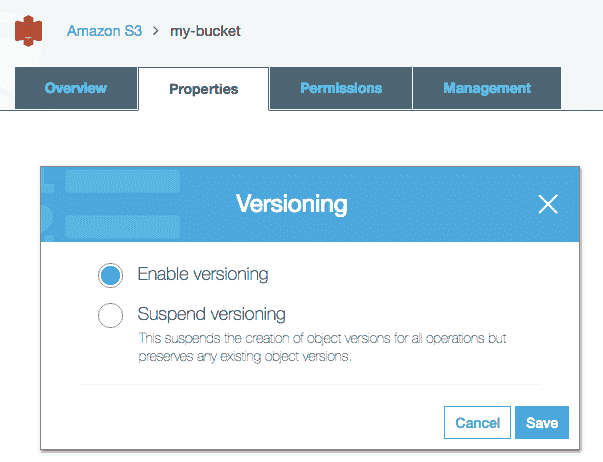

# 第七章：管理无服务器数据库

无服务器数据库的定义与任何其他无服务器服务相同：它需要具有*高可用性*、*高可扩展性*，并且定价模型必须考虑其实际使用情况。对于数据库来说，满足这些条件尤其困难，因为*性能*是一个关键特性。为了可预测的高性能，数据库通常配置在自己的专用服务器上，但无服务器需要共享模型以避免向客户收取数据库 100%可用时间的费用。在无服务器中，我们只想在请求完成时付费，而不是当数据库处于空闲状态时。

目前，只有少数服务成功地将无服务器模型引入数据库。AWS 仅提供一项服务：SimpleDB，但它缺少许多重要功能，并且极其有限。对于其他更好的选择，你可以尝试 FaunaDB、Google Firebase 或 Google Cloud Datastore。为了继续使用本书中的 AWS 服务，我们将介绍 DynamoDB，它是一种几乎无服务器的数据库。

此外，我们将了解如何使用 Amazon S3 来存储媒体文件，因为在大多数情况下，将文件保存在廉价的存储系统中比数据库服务器更好。

在本章中，我们将涵盖以下主题：

+   使用和管理 SimpleDB 和 DynamoDB 数据库

+   使用 Amazon S3 存储媒体文件

当你完成本章后，你将已经实现了在线商店的数据访问层，并获得了使用无服务器数据库的必要知识。

# Amazon SimpleDB

SimpleDB 是一项旧服务（2007 年底），并且是 AWS 提供的唯一一个真正可以称为无服务器数据库的服务。AWS 提供许多其他托管数据库，如 DynamoDB 或 RDS，但所有这些都需要你设置配置并支付 24 小时的费用，即使没有人使用你的系统。当你需要不断检查容量是否适合你的流量时，你确实需要担心服务器。 

SimpleDB 之所以是无服务器的，有以下原因：

+   **完全由 AWS 管理**：你不需要启动机器并安装/配置数据库管理系统。

+   **高可用性**：AWS 管理多个地理上分布的数据库副本，以实现高可用性和数据持久性。

+   **可扩展性**：你可以快速增长，而无需担心配置。

+   **成本效益**：你只需为存储的数据量、传输的数据量和运行查询所使用的 CPU 时间付费。如果没有人使用数据库，你只需为当前存储的内容付费。

SimpleDB 是一个 NoSQL 数据库，但遗憾的是，由于缺少重要的功能，它非常有限。例如，你可以使用的唯一数据类型是字符串。这使得你难以实现许多用例，但我们将在这里介绍一些技巧，使其可行。如果你的应用程序相对复杂，我会避免使用 SimpleDB。仅用于小型应用程序。

# 设计数据库模型

首先，让我们先了解一下一些术语：在 SimpleDB 中，一个*域*相当于关系型世界中的*表*，而一个*项*相当于*行*。它们非常相似，但你需要了解它们的意思才能理解 SDK 函数。此外，在 SimpleDB 中，每个*项*都有一个属性值对的列表，其中*属性*类似于*列*，而值总是字符串数据类型。

为了举例说明，我们将为无服务器商店建模数据库。我们只将使用两个域，例如`Products`和`ShoppingCart`。我们不会创建一个域来保存用户账户数据（电子邮件、密码等），因为在下一章中我们将使用 Amazon Cognito，而 Cognito 负责保存和管理用户数据。

下表列出了`Products`域的属性。所有这些属性都将创建以保存字符串，因为 SimpleDB 有一个限制，但我已经添加了理想的数据类型。在下一节中，我们将看到如何处理这个限制：

| **属性** | **期望的数据类型** |
| --- | --- |
| `ID` | 字符串 |
| `名称` | 字符串 |
| `价格` | 十进制 |
| `图片` | 字符串 |
| `评论` | 文档数组 |

关于此模型的一些观察如下：

+   `ID`：`ID`属性可以定义为整数，但我将其定义为字符串，因为我们将在 URL 中使用 ID。我们不是将 URL 显示为`store.com/product/123`，而是使用`store.com/product/lonely-bird`。

+   `价格`：`价格`属性将以字符串形式保存，尽管我们希望将其保存为数字。

+   `图片`：`图片`属性将以字符串形式保存，因为我们将在数据库中保存 S3 对象的 URL，而不是保存整个对象。

+   `评论`：`评论`属性需要一个**一对一**的关系，其中*一个*产品有*多个*评论。一些 NoSQL 数据库，如 MongoDB，有一个“文档数组”数据类型，这在这里会有所帮助。

`评论`字段将是一个列表：

| **属性** | **期望的数据类型** |
| --- | --- |
| `ID` | 整数 |
| `用户名` | 字符串 |
| `日期` | 日期时间 |
| `文本` | 字符串 |

这个模型需要其他观察：

+   `ID`属性可以定义为整数，其中每个新评论的`ID`将是最后保存的评论`ID`加一。然而，SimpleDB 没有提供任何自动递增字段的特性。为了避免在保存新评论之前查询最后一个评论`ID`，以及由于缺乏事务而可能引起的冲突，我们可以使用这个属性以字符串形式保存一个**全局唯一标识符**（**UUID**）。

+   `日期`属性将在稍后讨论。

下表列出了`ShoppingCart`域的属性：

| **属性** | **期望的数据类型** |
| --- | --- |
| `UserID` | 字符串 |
| `最后更新` | 日期时间 |
| `SelectedProducts` | 文档数组 |

由于我们将使用 Amazon Cognito，所以`UserID`被定义为字符串类型。这个模型唯一的问题是，我们希望有一个字段来存储日期时间，另一个字段来存储数据数组，其中`SelectedProducts`由`ProductID`和`Quantity`对的列表定义。

# 处理一对一关系

在之前的模型中，我们看到了一个产品有多个评论，一个购物车有多个选定的产品。在一个关系型数据库中，我们会创建另一个表来列出所有评论或选定的产品，并在查询特定产品或购物车时使用`join`操作符来检索所有相关数据。然而，在 NoSQL 中，我们通常没有`join`操作符，所以我们需要进行两个独立的查询来检索所需的数据，或者我们可以将所有相关数据保存到一个字段中，作为一个文档数组。

在 SimpleDB 中，我们没有“文档数组”数据类型，但有另外两种选择：

+   保存 JSON 对象的字符串化数组

+   多值属性

第一种方案是一个笨拙的解决方案，你可以将 JavaScript 对象的数组字符串化并保存到单个属性中。问题是，你将无法查询这个字段中的属性，所以忘记查询“有多少不同的用户订购了 ProductID lonely-bird？”这样的查询。

第二种方案是最佳解决方案，因为 SimpleDB 允许你拥有多个具有相同名称的属性。看看以下`ShoppingCart`数据集，它使用了多值属性：

| **UserID** | **LastUpdate** | **ProductID** | **QuantityX** | **ProductID** | **QuantityY** | **ProductID** | **QuantityZ** |
| --- | --- | --- | --- | --- | --- | --- | --- |
| `A` | `<Date>` | `X` | `2` | `Y` | `2` | `Z` | `4` |
| `B` | `<Date>` | `X` | `3` | ​ | ​ | ​ | ​ |
| `C` | `<Date>` | `X` | `1` | `Y` | `5` | ​ | ​ |

`ProductID`属性以相同的名称重复多次，这不是问题，因为 SimpleDB 允许两个具有相同名称的属性。SimpleDB 不允许两个具有相同名称和值的属性。在第一个项目（`UserID`值为`A`）中，我们有一个值为`X`的`ProductID`和一个值为`Y`的`ProductID`，这是有效的。问题在于`Quantity`属性，因为两个属性在同一个项目中都有值为`2`。为了解决这个问题，将`ProductID`值附加到属性名称上，创建了`QuantityX`和`QuantityY`属性。

SimpleDB 域是无模式的，这意味着当你插入一个新项目时，你只需说明它具有哪些属性，如果添加了一个尚不存在的属性名称，它也不会返回错误。

# 处理数字

SimpleDB 的最大问题不在于如何将数据作为字符串存储，而在于如何使用查询来检索它。你可以将数字`27`保存为`"27"`，但使用`Quantity > "5"`进行过滤查询不会返回期望的值。

将数值数据作为字符串处理的一个解决方案是在保存之前对其进行修改。与其保存`"27"`，不如使用零填充函数并将其存储为`"000027"`。现在用`Quantity > "000005"`进行查询，你将得到你想要的价值。

你需要添加多少个零？这取决于。考虑一下你的数据集可以达到的最大数字，并将所有其他数字都零填充以具有相同的字符数。

这个技巧适用于整数。如果你有一个小数，比如`Price`属性，你需要将其乘以小数位数。在这种情况下，在保存值之前乘以 100，在检索时除以 100。

另一个问题是如何处理负数。在这种情况下，你需要添加一个偏移量。这个偏移量必须大于你整个数据集中最大的负数。例如，如果你的偏移量是`100,000`，则必须将`-27`加到`100,000`（结果为`99973`），并用六个零进行零填充，结果为`"099973"`。如果你需要比较数字是否大于`5`，你需要添加偏移量并零填充比较值，结果为`Quantity > "100005"`。

# 处理布尔值

你可以将布尔值存储为`true`/`false`或`1`/`0`。你可以选择你喜欢的，只需定义一个约定并在所有布尔属性中使用相同的策略。

这里有一个例子：

```js
    const boolean = true; 

    // save 'true' in the database
    const booleanStr = boolean.toString(); 

    // convert 'true' (string) to true (boolean)
    const booleanAgain = Boolean(booleanStr); 

```

# 处理日期

当保存日期时间变量时，你可以使用 ISO 8601 标准格式，例如，`5:15:10 PM December 24th 2016 UTC`变为`2016-12-24T17:15:10.000Z`。此格式可以用字符串进行查询。因此，`Date > "2016-12-24T00:00:00.000Z"`将返回上一个示例的值。

现在考虑你有一个`LastAccess`属性，你想要查询在过去 5 分钟内访问过你的系统的所有用户。在这种情况下，你只需要找到当前时间，减去 5 分钟，然后在查询之前将其转换为 ISO 字符串。

# 创建域

创建域相当简单。你只需要将域名作为参数设置，它将通过`createDomain`函数创建。

这里有一个例子：

```js
    const AWS = require('aws-sdk');
    const simpledb = new AWS.SimpleDB();

    const params = { 
      DomainName: 'Products'
    }; 

    simpledb.createDomain(params, (err, data) => { 
      if (err) console.log(err, err.stack); 
      else console.log(data);
    });

```

关于属性，在创建域时你不需要指定它们。没有附加模式。每个项目都有自己的属性列表，这些属性不一定与其他属性相同。

# 限制

SimpleDB 是为小型工作负载设计的，因此 AWS 实施了一些限制，这些限制可能会限制你的应用程序。在下面的表中，我列出了在使用 SimpleDB 之前你应该注意的最重要限制。你可以在官方文档中找到更多关于此的信息：[`docs.aws.amazon.com/AmazonSimpleDB/latest/DeveloperGuide/SDBLimits.html`](http://docs.aws.amazon.com/AmazonSimpleDB/latest/DeveloperGuide/SDBLimits.html)：

| **参数** | **限制** |
| --- | --- |
| 域大小 | 每个域 10 GB |
| 域大小 | 每个域 1 亿个属性 |
| 属性值长度 | 1,024 字节 |
| `Select` 响应中的最大项目数 | 2,500 |
| 最大查询执行时间 | 5 秒 |
| `Select` 的最大响应大小 | 1 MB |

# 插入和查询数据

以下示例展示了如何将数据插入 SimpleDB 域。我使用 `batchPutAttributes` 因为它允许同时进行多个插入，但您也可以调用 `putAttributes` 来插入单个项：

```js
    const AWS = require('aws-sdk'); 
    const simpledb = new AWS.SimpleDB();

    const insertParams = { 
      DomainName: 'Products',
      Items: [
        {
          Attributes: [
            {
              Name: 'Name',
              Value: 'Lonely Bird'
            },
            {
              Name: 'Price',
              Value: '2999'
            },
            // more attributes
          ],
          // needs to be unique
          Name: 'lonely-bird'
        },
        // more items
      ]
    }; 

 simpledb.batchPutAttributes(insertParams, (err, data) => { 
      if (err) console.log(err, err.stack); 
      else console.log(data);
    });

```

以下示例展示了如何查询之前插入的数据。尽管 SimpleDB 是一个 NoSQL 数据库，但在查询时它使用类似 SQL 的语法：

```js
    const AWS = require('aws-sdk');
    const simpledb = new AWS.SimpleDB(); 

    const selectParams = {
      SelectExpression: 'select * from Products where Name = "Lonely Bird"'
    };

    simpledb.select(selectParams, (err, data) => { 
      if (err) console.log(err, err.stack); 
      else if (data.Items) {
        data.Items.map(item => {
          item.Attributes.map(attr => {
            console.log(attr);
          });
        });
      }
      else console.log('No results');
    });

```

上述代码将生成以下输出：

```js
    { Name: 'Name', Value: 'Lonely Bird' }
    { Name: 'Price', Value: '2999' }

```

# 性能和并发

AWS 将自动为每个创建的属性创建索引，但通过日期或转换为字符串的整数进行数据过滤查询可能会轻易导致性能问题。您应该始终注意您的性能需求和域的大小。

此外，像大多数 NoSQL 数据库一样，SimpleDB 不支持事务，因此并发可能会成为数据一致性的真正问题。而不是事务，SimpleDB 提供了 *条件操作*。例如，如果您需要插入一些数据，您可以放置一个条件，只有当属性尚不存在时才会执行该操作。另一个用例是实现计数器。您将只更新计数器的值为 `X+1`，如果当前值是 `X`。如果这个条件不满足，那是因为另一个用户已经增加了值，您的更新将被取消。

这里是一个条件操作的示例：

```js
    const AWS = require('aws-sdk');
    const simpledb = new AWS.SimpleDB(); 

    const params = {
      Attributes: [
        {
          Name: 'Counter',
          Value: '10', // new value
          Replace: true
        }
      ],
      DomainName: 'MyCounter',
      ItemName: '123', // identifier
      Expected: {
        Exists: true,
        Name: 'Counter',
        Value: '9' // previous value
      }
    };

    simpledb.putAttributes(params, (err, data) => {
      if (err) console.log(err, err.stack);
      else console.log(data);
    });

```

# 管理数据库

您可以使用 AWS CLI 或 SDK 来管理您的数据库，但许多人更喜欢使用提供用户界面的工具。由于 AWS 不为 SimpleDB 提供控制台，我们需要依赖第三方工具。在这种情况下，我可以推荐 Chrome 扩展程序 SdbNavigator。这是一个非常简单的工具，但提供了一个很好的用户界面，具有创建域名、插入项和执行查询等基本功能。

查看以下步骤以管理数据库：

1.  使用 Chrome，您可以添加来自[`chrome.google.com/webstore/detail/sdbnavigator/ddhigekdfabonefhiildaiccafacphgg`](https://chrome.google.com/webstore/detail/sdbnavigator/ddhigekdfabonefhiildaiccafacphgg) 的扩展程序。

1.  安装后，添加您的 AWS 密钥并选择一个区域进行连接。您可以使用添加域名按钮添加新的域名：


1.  此工具有一个添加属性的按钮。当您添加新项时，这些属性将成为项的属性：


1.  添加记录按钮用于添加您的域名项：


# 备份和恢复数据

不幸的是，AWS 没有提供原生的功能来一致性地备份和恢复 SimpleDB 域。解决方案是执行查询以读取所有数据（备份），并在需要时使用脚本插入（恢复）这些保存的数据。然而，主要问题是数据一致性。如果在您复制数据时应用程序正在运行，则无法保证您的备份是一致的。应用程序可能已经开始了一个删除操作，而您的备份可能仍然包含一些应该被删除的项目。

除了这个一致性问题之外，您在复制/插入数据时仍然会遇到问题，因为 AWS 对此操作设置了众多限制。例如，`select` 中的最大项数是 2,500 项。为了解决第二个问题，您可以尝试许多第三方工具之一来减轻这个负担。

# 控制用户访问

SimpleDB 依赖于 AWS 安全模型。因此，如果您想管理访问权限，您将需要创建 IAM 用户和角色。这种控制的粒度在于用户可以访问的域以及他们可以执行的操作。

在我们的 Lambda 函数中，我们必须**明确**地赋予权限。如果不设置限制，您无法执行 SimpleDB 请求。此配置在 `serverless.yml` 文件下的 `iamRoleStatements` 函数中进行。在以下示例中，我正在为 `Products` 和 `ShoppingCart` 领域赋予读取（`sdb:Select`）和写入（`sdb:PutAttributes`）访问权限。如果您想允许完全访问，请使用 `"sdb:*"` 动作并将域设置为 `domain/*`：

```js
    service: simpledb-example

    provider:
      name: aws
      runtime: nodejs6.10
 iamRoleStatements:
 - Effect: "Allow"
 Action:
 - "sdb:BatchPutAttributes" 
 - "sdb:PutAttributes"
 - "sdb:Select"
 Resource: [
 "arn:aws:sdb:us-east-1:*:domain/Products",
 "arn:aws:sdb:us-east-1:*:domain/ShoppingCart"
 ]

    functions:
      query:
        handler: handler.query

```

# DynamoDB

DynamoDB 是一个完全托管、高可用性的 NoSQL 数据库，可以配置为自动扩展。它不能被视为无服务器数据库的唯一原因是其定价模型。即使没有人使用您的应用程序，您也必须为预留资源付费。

然而，DynamoDB 是一个优秀的数据库，具有许多有用的功能，AWS 提供了慷慨的永久免费层。它被广泛用于许多无服务器项目中，因为它便宜、易于使用，并提供了可预测的性能。在这本书中，我们将使用 DynamoDB 作为我们的主要数据库。如果您浏览这一章的代码文件，您将看到无服务器存储的数据层是用 SimpleDB 和 DynamoDB 实现的，但 DynamoDB 将是默认的，也是我们将讨论需要为无服务器存储实现哪些功能的数据库。

# 设计数据库模型

在 DynamoDB 中，一个**表**是一组**项**，每个项是一组称为**属性**的键值对集合。像大多数 NoSQL 数据库一样，DynamoDB 是**无模式的**。您只需定义主键，就可以添加具有不同属性的项。

DynamoDB 支持以下数据类型：

+   **标量**：存储单个值的**数据类型**类别：

    +   `String`：最大大小为 400 KB 的 UTF-8 字符串。

    +   `Number`：它最多存储 38 位数字，并接受负数。

    +   `布尔型`：它存储真或假。

    +   `二进制`：它允许保存二进制数据。由于最大大小为 400 KB，它可能不是许多应用程序的好选择。我们打算使用 S3 来存储产品图片，并在 DynamoDB 中保存一个`String`字段以保存 S3 URL。

    +   `空值`：它表示一个具有未知或未定义状态的属性。

+   **文档**：它是一类存储多个值的数据类型：

    +   `列表`：它存储一个*有序*的值集合。它类似于可以存储任何类型元素的数组。例如：`[5, "foo", 2, -4, "bar"]`。

    +   `Map`：它存储一个*无序*的值集合。它与 JSON 对象类似。例如：`{ "Name": "foo", "Address": 123 }`。

+   **集合**：它是一个数据类型，您可以将数据作为数组存储，但所有元素必须是唯一且相同的数据类型。此外，顺序不被保留。例如：一组数字可以是`[1, 7, 2, -4]`。

对于无服务器存储，我们需要创建两个表，例如`Products`和`ShoppingCart`。它们将被定义为以下内容：

+   `Products`：查看以下表格，描述其属性：

| **属性** | **数据类型** |
| --- | --- |
| `ID` | 字符串 |
| `Name` | 字符串 |
| `Price` | 数字 |
| `Image` | 字符串 |
| `Comments` | 地图对象列表 |

+   `Comments`：查看以下表格，描述其属性：

| **属性** | **数据类型** |
| --- | --- |
| `ID` | 字符串 |
| `Username` | 字符串 |
| `Date` | 字符串 |
| `Text` | 字符串 |

+   `ShoppingCart`：查看以下表格，描述其属性：

| **属性** | **数据类型** |
| --- | --- |
| `UserID` | 字符串 |
| `LastUpdate` | 字符串 |
| `SelectedProducts` | 地图对象列表 |

+   `SelectedProducts`：查看以下表格，描述其属性：

| **属性** | **数据类型** |
| --- | --- |
| `ProductID` | 字符串 |
| `Quantity` | 数字 |

关于此模型的一些观察如下：

+   `Comments`和`SelectedProducts`属性被定义为地图对象列表，这意味着我们将保存一个有序的 JSON 对象列表

+   就像 SimpleDB 一样，DynamoDB 没有自增字段，所以我们将使用 UUIDs 作为评论 ID

+   DynamoDB 不支持 datetime 数据类型，因此我们需要将`Date`和`LastUpdate`属性定义为使用 ISO 格式的字符串

# 创建表

我们将使用 AWS SDK 创建无服务器存储的表。由于 DynamoDB 是一个无模式数据库，我们只需要设置主键，属性将在插入项目时定义。

使用以下示例来创建它们：

```js
    const AWS = require('aws-sdk');
    const dynamodb = new AWS.DynamoDB();

    let params = {
      TableName: 'Products',
      AttributeDefinitions: [
        {
          AttributeName: 'ID',
          AttributeType: 'S' // string
        }
      ],
      KeySchema: [
        {
          AttributeName: 'ID',
          KeyType: 'HASH'
        }   
      ],
      ProvisionedThroughput: {
        ReadCapacityUnits: 5, // default value
        WriteCapacityUnits: 5 // default value
      } 
    };

 dynamodb.createTable(params, (err, data) => {
      if (err) console.log(err, err.stack);
      else console.log(data);
    });

```

您可以使用相同的代码创建`ShoppingCart`表。只需将表名更改为`ShoppingCart`，并将主键名称更改为`UserID`。

# 限制

DynamoDB 在构建应用程序之前强加了一些需要考虑的限制。它们如下列出：

| **参数** | **限制** |
| --- | --- |
| 表的数量 | 每个账户 256 个 |
| 表大小 | 项的数量没有限制 |
| 配置吞吐量 | 最多 40,000 个读和 40,000 个写容量单位 |
| 项目大小 | 一个项目的所有属性的大小之和不得超过 400 KB |
| 二级索引 | 每个表 5 个本地和 5 个全局二级索引 |
| `API BatchGetItem()` | 最大 100 个项目或 16 MB 检索 |
| `API BatchWriteItem()` | 最大 25 个插入或删除请求或 16 MB 发送 |
| API Query 或 Scan | 结果集限制为 1 MB |

# 插入和查询数据

我们将在本节中讨论如何使用 DynamoDB 插入和查询数据。

# 插入数据

DynamoDB 提供了两种插入数据的方式，例如`putItem()`和`batchWriteItem()`。它们之间的区别在于，`putItem`允许你创建一个新项目或更新现有项目，而`batchWriteItem`允许你创建或删除多个项目，但不支持更新操作。

以下是一个`putItem`方法的示例：

```js
    const AWS = require('aws-sdk');
    const dynamodb = new AWS.DynamoDB();    

    const params = {
      TableName: "Products",
      Item: {
        ID: { S: "lonely-bird" },
        Name: { S: "Lonely Bird" },
        Price: { N: "29.99" },
        Image: { S: "https://s3.amazonaws.com/..." },
        Comments: { 
          L: [
            { 
              M: { 
                ID: { S: "ABC"}, 
                Username: { S: "John Doe"},
                Date: { S: "2016-12-24T17:15:10.000Z" },
                Text: { S: "I liked it." }
              }
            },
            {
              M: { 
                ID: { S: "XYZ"}, 
                Username: { S: "Jane Smith"},
                Date: { S: "2016-12-24T18:15:10.000Z" },
                Text: { S: "I liked it too." }
              }
            } 
          ] 
        }
      }
    };

 dynamodb.putItem(params, (err, data) => {
      if (err) console.log(err, err.stack);
      else console.log(data);
    });

```

# 文档客户端 API

正如你所见，前面的示例展示了如何插入单个项目，但语法非常复杂。要定义一个字符串属性，我们需要创建一个 JSON 对象，其中键是`"S"`（字符串），值是所需的数据。

为了使这项任务更容易，我们可以使用 Dynamo 的文档客户端 API 通过使用原生 JavaScript 类型来抽象属性值，以进行读写操作。

以下示例展示了如何使用此 API 插入相同的项目。请注意，我们需要使用`new AWS.DynamoDB.DocumentClient()`检索客户端，命令是`put`而不是`putItem`：

```js
    const AWS = require('aws-sdk');
 const documentClient = new AWS.DynamoDB.DocumentClient();

    const params = {
      TableName: "Products",
      Item: {
        ID: "lonely-bird",
        Name: "Lonely Bird",
        Price: 29.99,
        Image: "https://s3.amazonaws.com/...",
        Comments: [
          { 
            ID: "ABC", 
            Username: "John Doe",
            Date: "2016-12-24T17:15:10.000Z",
            Text: "I liked it."
          },
          {
            ID: "XYZ", 
            Username: "Jane Smith",
            Date: "2016-12-24T18:15:10.000Z",
            Text: "I liked it too."
          } 
        ] 
      }
    };

 documentClient.put(params, (err, data) => {
      if (err) console.log(err, err.stack);
      else console.log(data);
    });

```

# 查询数据

要查询我们刚刚插入的项目，DynamoDB 提供了两种方法，例如`scan()`和`query()`。我们将在下一节中看到它们是如何工作的。对于这两种方法，我们将使用文档客户端。

# 扫描方法

`scan`方法用于检索表中所有项目，无需按键进行筛选。筛选是可能的，但不是必须的。这种方法的问题在于，对于大型表，你需要进行多次请求，因为当扫描超过 1 MB 的数据时，它将中断操作。当扫描操作中断时，结果集将包含一个`LastEvaluatedKey`参数，可用于进一步的请求：

```js
    const AWS = require('aws-sdk');
 const documentClient = new AWS.DynamoDB.DocumentClient();

    const params = {
      TableName: 'Products'
    };

 documentClient.scan(params, (err, data) => {
      if (err) console.log(err, err.stack);
      else console.log(data);
    });

```

# 查询方法

`query`方法基于哈希键查找项目。它与`scan`方法类似，因为如果读取超过 1 MB 的数据，查询将被中断，返回一个`LastEvaluatedKey`参数，但`query`和`scan`之间的主要区别在于，`query`在读取数据之前会考虑筛选条件，而`scan`会在读取表之后应用筛选。

以下是一个仅查询`Lonely Bird`产品的示例：

```js
    const AWS = require('aws-sdk');
 const documentClient = new AWS.DynamoDB.DocumentClient();

    const params = {
      TableName: "Products",
      KeyConditionExpression: "ID = :id",
      ExpressionAttributeValues: { ":id": "lonely-bird" }
    };

 documentClient.query(params, (err, data) => {
      if (err) console.log(err);
      else console.log(data);
    });

```

# 性能和并发

与大多数 NoSQL 数据库一样，DynamoDB 不支持事务。原子操作只能在项目级别进行，这意味着你可以原子性地更改单个项目的两个属性，但你不能在单个操作中更新两个不同的项目。像 SimpleDB 一样，DynamoDB 支持条件更新以实现计数器。

关于性能，DynamoDB 为哈希键和可选的范围键创建索引，但如果你需要通过其他字段进行查询过滤，你需要创建额外的索引。例如，如果你想找到所有价格超过 10 美元的产品，你需要为 `价格` 属性创建一个索引。在我们的无服务器存储模型中，我们不需要这样做，因为我们只会通过两个表的哈希键进行查询，但我们将描述如何添加额外的索引。

首先，你需要了解 DynamoDB 有以下两种索引类型：

+   **本地二级索引**：与基础表具有相同分区键的索引

+   **全局二级索引**：一个不限于基础表相同分区的索引

它们之间的一个区别是，本地索引使用与哈希键相同的预配吞吐量，而全局索引则需要你为它们支付额外的预配吞吐量。全局索引的好处是，你不需要包含哈希键的过滤器，可以直接通过你指定的键进行过滤。在之前的例子中，如果你想查询所有价格高于 10 美元的产品，你需要为 `价格` 属性创建一个全局索引。

现在假设你有一个名为 `Orders` 的表，该表保存了 `订单 ID`、`产品 ID`、`价格` 以及其他信息。`订单 ID` 将作为哈希键，对于单个订单，我们会有许多条目。例如，看一下以下表格：

| **订单 ID** | **产品 ID** | **价格** |
| --- | --- | --- |
| `1` | `77` | `15.99` |
| `1` | `88` | `18.99` |
| `1` | `23` | `12.99` |
| `2` | `18` | `15.00` |

在此模型中，如果你想通过 `订单 ID` 号码 `1` 进行查询并按 `价格` 大于 15 进行过滤，你会为 `价格` 属性创建一个 *本地* 二级索引，而不是 *全局* 索引。

以下示例显示了创建本地和全局索引的语法：

```js
    const params = {
      TableName: 'TableWithIndexes',
      AttributeDefinitions: [
        { AttributeName: 'ID', AttributeType: 'S' },
        { AttributeName: 'MyOtherAttribute', AttributeType: 'S' },
        { AttributeName: 'MyLocalAttribute', AttributeType: 'S' },
        { AttributeName: 'MyGlobalAttribute', AttributeType: 'S' }
      ],
      KeySchema: [
        { AttributeName: 'ID', KeyType: 'HASH' },
        { AttributeName: 'MyOtherAttribute', KeyType: 'RANGE' }
      ],
      ProvisionedThroughput: 
        { ReadCapacityUnits: 5, WriteCapacityUnits: 5 },
      LocalSecondaryIndexes: [
        { 
          IndexName: 'MyLocalIndex',
          KeySchema: [
            { AttributeName: 'ID', KeyType: 'HASH' }, 
            { AttributeName: 'MyLocalAttribute', KeyType: 'RANGE' }
          ],
          Projection: { ProjectionType: 'ALL' }
        }
      ],
      GlobalSecondaryIndexes: [
        { 
          IndexName: 'MyGlobalIndex',
          KeySchema: [
            { AttributeName: 'MyGlobalAttribute', KeyType: 'HASH' }
          ],
          Projection: { ProjectionType: 'ALL' },
          ProvisionedThroughput: 
            { ReadCapacityUnits: 5, WriteCapacityUnits: 5 }
        }
      ]
    };

```

你可以使用 `DynamoDB.updateTable()` 在创建表后添加 *全局二级索引*，但你只能在创建表时添加 *本地二级索引*。无法通过更新表来添加本地索引。

# 管理数据库

AWS 为 DynamoDB 提供了一个管理控制台，你可以在此配置表的容量、创建索引和查看 CloudWatch 指标。在以下步骤中，我将展示如何查看和操作你的表数据：

1.  在此链接浏览管理控制台 [`console.aws.amazon.com/dynamodb.`](https://console.aws.amazon.com/dynamodb)

1.  在左侧菜单中，点击“表”：


1.  现在点击您的表名称，然后在“项目”选项卡中。在此选项卡中，您可以创建、删除或更新项目。将自动执行扫描查询，但您可以根据需要更改查询参数以查看其他项目。点击项目 ID 以打开编辑模式：


1.  编辑项目模式允许您查看项目的所有属性，并在需要时更新属性：


# 配置吞吐量

DynamoDB 的性能基于读和写操作的配置吞吐量。一个 *读容量单元* 代表每秒一个强一致性读取或对于大小最多为 4 KB 的对象每秒两个最终一致性读取，而一个 *写容量单元* 意味着您每秒可以写入一个 1 KB 的对象。您在创建表时需要定义这些值，但您可以在以后更新它们。在本章的示例中，表为每个键创建了五个读单元和五个写单元。

如果您的系统请求的读/写操作数超过了配置的容量，AWS 将允许在短时间内无错误地执行这些操作。如果您继续超出配置容量，一些请求将因 `ProvisionedThroughputExceededException` 错误而失败。好消息是，AWS SDK 内置了对延迟请求的重试支持，因此我们不需要编写此逻辑。

# 自动扩展

您可以配置 CloudWatch 在您的 DynamoDB 使用量高于配置吞吐量时发送电子邮件警报，并在必要时手动更新容量，或者您还可以配置自动扩展。由于我们想要避免担心服务器和可伸缩性，我们将配置自动扩展来为我们处理这个负担。

自动扩展将主动管理吞吐量容量，以在您的负载增加或减少时自动扩展和缩减，以匹配您的应用程序利用率。我们需要配置的是读和写容量单元的范围（上限和下限）以及此范围内的目标利用率百分比。您可以通过管理控制台访问自动扩展配置。在您想要启用此设置的表中单击，然后选择“容量”选项卡。

以下截图显示了自动扩展配置的示例：


# 备份和恢复数据

不幸的是，DynamoDB 不提供简单的备份和恢复功能。AWS 提出的方案是使用其他两个服务来完成这项任务，例如 **AWS 数据管道** 和 **Amazon Elastic MapReduce**（**EMR**）。由于此配置的复杂性和长度，本书不会涉及。您可以遵循 AWS 教程来实现此任务：

[AWS 数据管道文档](http://docs.aws.amazon.com/datapipeline/latest/DeveloperGuide/dp-importexport-ddb.html)

简而言之，你需要使用 AWS Data Pipeline 模板为 DynamoDB 创建任务，并安排一个任务来启动 EMR，使用 Hive 保存/恢复 DynamoDB 表。

# 控制用户访问

就像 SimpleDB 一样，我们通过 IAM 角色来管理 DynamoDB 用户访问。我们必须明确地给 Lambda 函数赋予权限，以便它们能够执行请求。这种配置是在 `serverless.yml` 文件下的 `iamRoleStatements` 函数中完成的：

```js
    service: dynamodb-example

    provider:
      name: aws
      runtime: nodejs6.10
 iamRoleStatements:
 - Effect: "Allow"
 Action:
 - "dynamodb:Scan" 
            - "dynamodb:Query"
            - "dynamodb:PutItem"
 - "dynamodb:DeleteItem"
 - "dynamodb:BatchWriteItem"
 Resource: [
 "arn:aws:dynamodb:us-east-1:*:table/Products",
 "arn:aws:dynamodb:us-east-1:*:table/ShoppingCart"
 ]

    functions:
       query:
         handler: handler.query

```

# 优化无服务器存储

在本书的 GitHub 仓库中，你可以找到一个 `scripts` 文件夹，你可以使用它来创建 DynamoDB 和 SimpleDB 的表，以及用于我们测试的示例数据。此外，在根目录中，你可以找到一个 `backend` 文件夹，其中包含一个 `repositories` 文件夹，包含 `dynamodb.js`、`simpledb.js` 和 `fakedb.js` 文件。示例应用程序使用 `fakedb` 作为默认数据库，因为它不需要任何配置，因为它只提供硬编码的数据。

我们现在将实现 DynamoDB 代码。在 `lib` 文件夹中，我们将把依赖项从 `const db = require('../repositories/fakedb')` 更改为 `const db = require('../repositories/dynamodb')`，并在 `dynamodb.js` 文件中，我们需要开发四个方法，如 `retrieveAllProducts`、`retrieveCart`、`saveCart` 和 `processCheckout`。

# 获取所有产品

获取所有产品是一个简单的函数，它将执行 `scan` 操作。由于我们只有少量项目，我们不需要担心这种情况下的 1 MB 限制：

```js
    module.exports.retrieveAllProducts = (callback) => {

      const params = {
        TableName: 'Products'
      };

 documentClient.scan(params, callback);
    };

```

# 获取用户的购物车

获取用户的购物车使用一个简单的查询，我们将通过 `UserID` 进行过滤：

```js
    module.exports.retrieveCart = (userId, callback) => {

      const params = {
        TableName: "ShoppingCart",
        KeyConditionExpression: "UserID = :userId",
        ExpressionAttributeValues: { ":userId": userId }
      };

 documentClient.query(params, callback);
    });

```

# 保存用户的购物车

`saveCart` 函数接收 `userId` 和 `selectedProducts` 作为参数，其中 `selectedProducts` 是 `ProductId-Quantity` 元素的配对：

```js
    module.exports.saveCart = (userId, selectedProducts, callback) => {

      const params = {
        TableName: "ShoppingCart",
        Item: {
          UserID: userId,
          LastUpdate: new Date().toISOString(),
          SelectedProducts: selectedProducts
        }
      };

 documentClient.put(params, callback);
    };

```

# 处理结账

处理支付数据是一个复杂的过程，超出了本书的范围。在这种情况下，我们将实现一个函数，该函数将仅执行回调，并将 `null` 作为错误参数传递：

```js
    module.exports.processCheckout = (callback) => {
      // do nothing
      callback(null);
    };

```

# Amazon S3（用于媒体文件）

S3 不是一个数据库，它只是一个存储系统。它缺少数据库引擎和许多存储功能，但可以用于保存媒体文件，如照片、视频和音乐。

这种方法已经非常流行。例如，如果你开发了一个使用 MongoDB 数据库的应用程序，你可以使用 MongoDB GridFS 来存储大型二进制数据。然而，最有效的解决方案是将这类数据卸载到云服务中，因为负责你的数据库的机器通常是成本最高的。这意味着数据库中每千兆字节的成本通常高于云存储服务，如 S3。

在我们的无服务器存储中，我们将产品图片存储在 SimpleDB/DynamoDB 中的字符串字段中。我们不是保存完整的二进制数据，而是只保存图像文件的 URL。例如：

[`s3.amazonaws.com/serverless-store-media/product-images/lonely-bird.jpg`](https://s3.amazonaws.com/serverless-store-media/product-images/lonely-bird.jpg)

当我们在前端收到这些信息时，`` 元素具有 `src` 属性，引用这个 S3 URL：

```js
    

```

用户将直接从 S3 下载图片，而不是从数据库中下载，从而减轻数据库的负担。

这是 S3 的一种用法。还有两种其他常见用法：

+   **用户需要上传他的头像图片**：而不是保存在数据库中，我们可以为用户生成一个临时权限，直接将文件上传到 S3

+   **用户想要查看他的私有相册**：而不是请求 Lambda 函数从 S3 下载文件，我们可以生成私有临时链接，用户可以从那里下载文件

在本节中，我们将讨论如何处理这些示例以及如何将 S3 作为媒体文件的数据库使用。

# 上传和下载文件

如果您的存储桶存储的是公共文件，您可以配置它以允许匿名请求上传和下载文件。但是，如果文件是私有的，您需要向客户端提供预签名 URL 以确保隐私和安全。上传和下载这两个操作都必须进行签名。

这些密钥是在后端生成的，因为您需要使用具有对存储桶凭证访问权限的 SDK。让我们看看以下上传和下载文件的步骤：

1.  创建一个 Lambda 函数并公开一个端点，以便前端代码可以调用它。使用 S3 对象的 `getSignedUrl` 函数获取签名 URL：

```js
        const AWS = require('aws-sdk');
        const s3 = new AWS.S3();

        const params = {
          Bucket: 'bucket', 
          Key: 'key'
        };

        const operation = 'putObject'; // upload operation
        // const operation = 'getObject'; // download operation

        s3.getSignedUrl(operation, params, (err, url) => {
          // return the url
        });

```

1.  如果操作是下载私有文件，则使用具有此预签名 URL 的锚点标签渲染 HTML，并将 `target` 属性设置为 `_blank` 以执行下载：

```js
        <a href="PRE-SIGNED-URL" target="_blank">Download</a>

```

1.  如果操作是上传文件，则添加一个 `input` 元素以接收文件：

```js
        <input type="file" />

```

1.  并使用预签名 URL 通过 Ajax 请求上传文件：

```js
        $.ajax({
          url: preSignedUrl, // use the signed URL in the request
          type: 'POST',
          data: file,
          // ...
          success: () => { console.log('Uploaded') },
          error: err => { console.log(err) }
        });

```

1.  由于您已使用 Lambda 函数生成了预签名 URL，因此您将知道文件名和文件存储的位置，但如果用户真正启动了文件上传，您将无法确切知道文件上传何时完成。您有一个选项，就是添加另一个 Lambda 函数来接收由 S3 存储桶触发的对象创建事件。

# 启用 CORS

上一段代码只有在为 S3 存储桶启用 CORS 后才能正常工作。CORS 头是必要的，因为我们将从与 S3 域不同的域进行上传和下载请求。此设置可以使用 S3 控制台进行配置：[`console.aws.amazon.com/s3`](https://console.aws.amazon.com/s3)。打开您的存储桶属性，选择权限，然后选择 CORS 配置，如下面的截图所示：


此命令将为 GET 请求添加 CORS 配置。在保存之前，我们需要添加一行以包括对 POST 请求的授权，并将允许的头部改为*（所有）：

```js
    <CORSConfiguration>
      <CORSRule>
        <AllowedOrigin>*</AllowedOrigin>
        <AllowedMethod>GET</AllowedMethod>
 <AllowedMethod>POST</AllowedMethod>
        <MaxAgeSeconds>3000</MaxAgeSeconds>
 <AllowedHeader>*</AllowedHeader>
      </CORSRule>
    </CORSConfiguration>

```

# 备份和恢复数据

亚马逊 S3 旨在提供高达 99.999999999%的持久性，这意味着 AWS 会做出巨大努力来复制您的数据并使其免受磁盘故障的影响。尽管您可以在 S3 上放心，但您必须考虑它对您自己的错误并不那么安全。例如，如果您有一个从 S3 删除特定文件的功能，您可能会犯错误并删除错误的文件，或者更糟糕的是，删除所有文件。因此，进行备份对于确保业务更安全的操作非常重要。

您可以将文件本地备份（下载）或在其他外部服务（如 Azure 或 Google Cloud）中创建副本，但这通常不是必要的。您可以使用 AWS CLI 的命令将存储桶中的所有文件保存到另一个存储桶：

```js
 aws s3 sync s3://original-bucket s3://backup-bucket

```

如果您想将特定时间保存的所有文件恢复到备份存储桶，您需要添加`--delete`选项以删除目标存储桶中不存在于备份存储桶中的文件：

```js
 aws s3 sync s3://backup-bucket s3://bucket-to-be-restored --delete

```

# 使用 S3 版本控制

S3 版本控制是保护数据的另一种方式。一旦启用，每次修改对象时，都会保存一个新的对象，当删除对象时，S3 只需在它上面放置一个删除标记。版本控制允许您恢复意外删除的文件，但您需要支付更多费用以保持这些文件可用。

要配置 S3 版本控制，请转到管理控制台并选择存储桶属性。您将看到一个启用版本控制的选项：



您可以通过配置生命周期规则来删除旧版本文件来降低成本。此设置可以在管理标签页下找到：


为了完成本节，关于安全性的一个观察：如果您的 AWS 访问密钥遭到泄露，恶意用户可能会删除 S3 存储桶中的文件，并删除已版本化的文件。为了防止这种情况，您可以通过启用 MFA 删除来添加额外的保护层。使用此设置，只有当您有权访问 AWS 账户并且能够从认证设备提供访问代码时，才能永久删除文件。

# 摘要

在本章中，您学习了如何使用无服务器数据库建模、查询和插入数据。我们看到了 SimpleDB 是如何工作的，但由于其功能不足，我们还介绍了如何使用 DynamoDB。此外，您还了解了更多关于 Amazon S3 及其如何用于存储媒体文件的信息。

在下一章中，我们将学习如何在 AWS 上使用身份验证和授权，并检查构建无服务器项目的标准安全实践。
