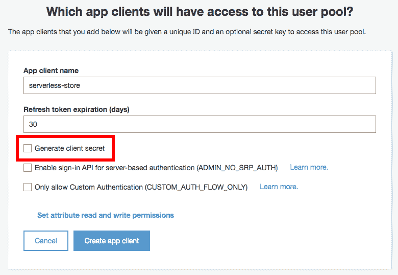
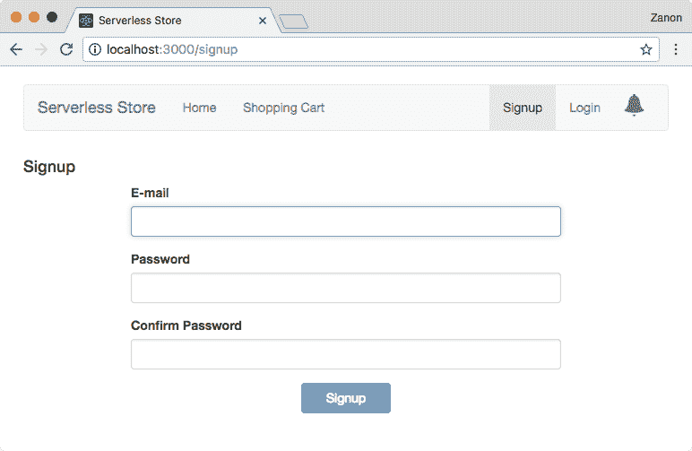

# 第八章：保护无服务器应用程序

处理安全问题是一个广泛且复杂的话题。如果你没有正确处理，你可能会被黑客攻击。即使你做得一切正确，你也可能会被黑客攻击。因此，了解常见的安全机制以避免使你的网站暴露于漏洞是很重要的，同时，始终遵循经过大量测试和证明为稳健的推荐实践和方法。

在本章中，我们将涵盖以下主题：

+   基本安全实践和概念

+   学习如何使用 Amazon Cognito

+   开发无服务器商店的注册和登录页面

+   处理后端用户的授权和身份验证

到本章结束时，你将掌握如何在 AWS 上处理安全性的基础知识，以构建一个无服务器网站。

# 安全基础

安全专家的一个格言是：“不要自己动手”。这意味着你永远不应该在生产系统中使用你自己开发的任何类型的加密算法或安全模型。始终使用那些被高度使用、测试并由可信来源推荐过的解决方案。即使是经验丰富的人也可能犯错，使解决方案暴露于攻击之下，尤其是在需要高级数学的密码学领域。然而，当一个解决方案被大量专家分析和测试时，错误发生的频率会大大降低。

在安全领域，有一个术语叫做**模糊安全**。它被定义为一种安全模型，其中实现机制不为公众所知，因此人们认为它是安全的，因为没有人在事先了解其缺陷。它确实可能是安全的，但如果将其作为唯一的保护形式，则被认为是一种较差的安全实践。如果一个黑客足够坚持不懈，即使不知道内部代码，他或她也能发现缺陷。在这种情况下，使用经过高度测试的算法比使用自己的算法更好。

模糊安全可以比作某人试图通过在后院埋藏自己的钱来保护自己的钱，而常见的安全机制是将钱存入银行。钱在埋藏时可能是安全的，但它只能得到保护，直到有人发现它的存在并开始寻找它。

由于这个原因，在处理安全问题时，我们通常更喜欢使用开源算法和工具。每个人都可以访问并发现其中的缺陷，但也有很多专业人士参与寻找漏洞并修复它们。

在本节中，我们将讨论在构建系统时每个人都必须了解的其他安全概念。

# 信息安全

在处理安全问题时，有一些属性需要考虑。其中最重要的包括以下内容：

+   **身份验证**：通过验证用户是否是他们声称的人来确认用户的身份

+   **授权**：决定用户是否被允许执行请求的操作

+   **保密性**：确保数据不会被第三方理解

+   **完整性**：保护消息免受未检测到的修改

+   **不可否认性**：确保某人不能否认他们自己的消息的真实性

+   **可用性**：在需要时保持系统可用

这些术语将在下一节中更好地解释。

# **认证**

认证是确认用户身份的能力。可以通过登录表单实现，要求用户输入他们的用户名和密码。如果散列密码与数据库中之前保存的密码匹配，那么你有足够的证据证明用户就是他们所声称的人。这种模型对于典型应用来说足够好。你通过要求用户提供他们**知道**的信息来确认身份。另一种认证方式是要求用户提供他们**拥有**的信息。这可能是一个物理设备（如 USB 密钥）或对电子邮件账户或电话号码的访问。

然而，你不能要求用户为**每个**请求输入他们的凭据。只要你在第一个请求中**认证**了它，你就必须创建一个将在后续请求中使用的安全令牌。此令牌将保存在客户端作为 cookie，并将自动发送到服务器上的所有请求。

在 AWS 上，此令牌可以使用 Cognito 服务创建。如何进行此操作将在本章后面描述。

# **授权**

当后端收到请求时，我们需要检查用户是否有权限执行所请求的操作。例如，如果用户想要结账订单 ID 为`123`，我们需要对数据库进行查询以确定订单的所有者是谁，并比较是否是同一用户。

另一个场景是我们在一个应用程序中有多个角色，并且我们需要限制数据访问。例如，一个用于管理学校成绩的系统可能实现了两个角色，例如`学生`和`教师`。教师将访问系统以插入或更新成绩，而学生将访问系统以读取这些成绩。在这种情况下，认证系统必须限制属于`教师`组的用户的`插入`和`更新`操作，而属于`学生`组的用户必须限制读取他们自己的成绩。

大多数时候，我们在自己的后端处理授权，但一些无服务器服务不需要后端，并且它们自己负责正确检查授权。例如，在下一章中，我们将看到如何在 AWS 上实现无服务器通知。当我们使用 AWS IoT 时，如果我们想在两个用户之间建立私有通信通道，我们必须让他们访问双方都了解的一个特定资源，并限制其他用户的访问以避免泄露私人消息。这种授权将在下一章中详细介绍。

# **保密性**

在第四章“托管网站”中，我们学习了如何使用 AWS 证书管理器免费请求 TLS 证书以及如何将它们添加到 CloudFront 分发中。开发一个对所有请求都使用 HTTPS 的网站是实现用户与你的网站之间通信机密性的主要驱动力。由于数据被加密，恶意用户很难解密并理解其内容。

尽管有一些攻击可以拦截通信并伪造证书（中间人攻击），但这些攻击需要恶意用户访问受害用户的机器或网络。从我们的角度来看，添加 HTTPS 支持是我们能做的最好的事情，以最大限度地减少攻击的机会。

# 完整性

完整性与机密性相关。虽然机密性依赖于加密消息以防止其他用户访问其内容，但完整性涉及通过使用数字签名（TLS 证书）加密消息来保护消息免受修改。

完整性是设计低级网络系统时的重要概念，但对我们来说，最重要的是添加 HTTPS 支持。

# 不可否认性

不可否认性是一个常被与身份验证混淆的术语，因为它们的目标都是证明谁发送了消息。然而，主要区别在于身份验证更关注技术视角，而不可否认性概念更关注法律术语、责任和审计。

当你有一个包含用户名和密码输入的登录表单时，你可以验证知道正确组合的用户，但你不能 100%确定，因为凭证可能被正确猜测或被第三方窃取。另一方面，如果你有一个更严格的访问机制，例如生物识别入口，你会有更高的可信度。然而，这也不是完美的。这只是一个更好的不可否认性机制。

# 可用性

可用性也是信息安全领域感兴趣的概念，因为可用性不仅限于如何配置硬件以满足用户需求。可用性可能受到攻击，也可能因恶意用户而中断。存在一些攻击，如**分布式拒绝服务**（**DDoS**），旨在创建瓶颈以破坏网站可用性。在 DDoS 攻击中，目标网站被大量多余的请求淹没，目的是使系统过载。这通常是通过一个由受感染机器组成的受控网络完成的，称为**僵尸网络**。

在 AWS 上，所有服务都在 AWS Shield 服务下运行，该服务旨在无需额外费用即可保护 DDoS 攻击。但是，如果您运行一个非常大且重要的服务，您可能成为高级和大型 DDoS 攻击的直接目标。在这种情况下，AWS Shield 服务提供了一个高级层，以确保即使在最坏的情况下，您的网站也能保持可用性。这需要每月投资 3000 美元，并且您将获得 24x7 的专属团队支持，以及访问其他用于缓解和分析 DDoS 攻击的工具。

# AWS 上的安全

在这本书中，我们使用 AWS 凭证、角色和政策，但 AWS 上的安全远不止处理用户的身份验证和授权。这就是我们将在本节中讨论的内容。

# 共享责任模型

AWS 上的安全基于共享责任模型。虽然亚马逊负责保持基础设施的安全，但客户负责修补软件的安全更新并保护自己的用户账户。

AWS 的责任包括以下内容：

+   硬件和设施的安全

+   网络基础设施、虚拟化和存储

+   按照服务级别协议（SLA）提供的服务可用性

+   Lambda、RDS、DynamoDB 等托管服务的安全

客户的责任包括以下内容：

+   在 EC2 机器上应用操作系统安全补丁

+   安装应用程序的安全

+   避免泄露用户凭证

+   正确配置访问策略和角色

+   防火墙配置

+   网络流量保护（加密数据以避免泄露敏感信息）

+   服务器端数据和数据库加密

在无服务器模型中，我们仅依赖托管服务。在这种情况下，我们不需要担心对操作系统或运行时应用安全补丁，但我们需要关注我们的应用程序依赖以执行第三方库。当然，我们还需要关注所有需要配置的事项（防火墙、用户策略等），网络流量（支持 HTTPS）以及应用程序如何处理数据。

# Trusted Advisor 工具

AWS 提供了一款名为 Trusted Advisor 的工具，可以通过[`console.aws.amazon.com/trustedadvisor`](https://console.aws.amazon.com/trustedadvisor)访问。

它旨在提供有关如何优化成本或提高性能的帮助，但它还帮助识别安全漏洞和常见配置错误。它会搜索对您的 EC2 机器上特定端口的未授权访问，如果根账户启用了多因素认证，以及如果您的账户中创建了 IAM 用户。

您需要为 AWS 高级支持付费以解锁其他功能，例如成本优化建议。然而，安全检查是免费的。

# 突破测试

渗透测试（或渗透测试）是所有大型网站都必须定期执行的良好实践。即使您有一支优秀的安全专家团队，通常的建议也是聘请一家专业的第三方公司进行渗透测试，以发现漏洞。这是因为他们很可能拥有您团队尚未尝试过的工具和程序。

然而，这里的注意事项是，您在联系 AWS 之前不能执行这些测试。为了尊重他们的用户条款，您只能在预定的时间框架内尝试寻找您自己的账户和资产中的漏洞（这样他们可以禁用您的资产入侵检测系统），并且仅限于受限制的服务，例如 EC2 实例和 RDS。

# AWS CloudTrail

AWS CloudTrail 是一项旨在记录您账户上执行的所有 AWS API 调用的服务。此服务的输出是一组日志文件，记录了 API 调用者、日期/时间、调用者的源 IP 地址、请求参数以及返回的响应元素。

这种服务对于安全分析非常重要，以防发生数据泄露，以及需要符合性标准审计机制的系统。

# 多因素认证（MFA）

**多因素认证**（**MFA**）是一个额外的安全层，每个人都必须将其添加到他们的 AWS 根账户中，以防止未经授权的访问。除了知道用户名和密码外，恶意用户还需要物理访问您的智能手机或安全令牌，这大大限制了风险。

在 AWS 上，您可以通过以下方式使用 MFA：

+   **虚拟设备**：安装在 Android、iPhone 或 Windows 手机上的应用程序

+   **物理设备**：六位数令牌或一次性密码（OTP）卡

+   **短信**：您手机上收到的消息

# 处理身份验证和授权

在本节中，我们将使用 Amazon Cognito 创建我们应用程序的用户，并能够处理他们的登录。在验证用户身份后，我们将能够为他们允许执行的任务提供适当的授权。

# Amazon Cognito

Cognito 提供两种服务，例如 **用户池** 和 **身份池**。第一种是您创建和存储用户凭证的地方，后者是您设置用户访问 AWS 资源权限的地方。

我们将首先创建一个用户池，这样我们就可以将注册和登录功能添加到我们的网站上。我们将用户池 ID 添加到我们的前端代码中，请求将直接发送到用户池服务，无需从 Lambda 函数中执行。

之后，我们将配置一个身份池，这将需要提供给用户临时访问 AWS 资源。在我们的示例中，用户将能够直接订阅 IoT 通知，而无需请求后端提供此授权。

# 创建用户池

让我们看看以下创建用户池的步骤：

1.  要创建用户池，我们将使用控制台，您可以通过 [`console.aws.amazon.com/cognito`](https://console.aws.amazon.com/cognito) 访问控制台。选择“管理您的用户池”选项：


1.  在下一屏幕上，点击创建用户池，如图所示：


1.  现在为您的用户池资源定义一个池名称，并检查您是想快速创建（使用默认值）还是想逐个设置每个选项。我已选择前者（审查默认值）：


1.  下一屏幕将显示您在点击创建池之前需要修订的默认值列表：


+   以下是一个选项列表以及您在每个选项中需要考虑的内容：

    +   属性：此选项显示您可以选择作为登录所需选项的用户属性列表。通常，对于大多数应用程序来说，一个电子邮件就足够了，但您还可以包括用户名、电话号码或用户图片等属性。此外，您还可以设置自定义用户属性以保存到您的用户配置文件中。

    +   策略：此选项定义了用户的密码必须有多严格。例如，如果您要求最小长度、特殊字符以及大写或小写字母。此外，您还可以限制只有管理员可以创建用户。

    +   验证：您可以在用户注册时请求用户验证电子邮件地址或电话号码（短信）。Cognito 将发送一个用于验证的代码消息。此外，您可以为您的用户启用多因素认证（MFA）作为第二层安全措施。这个功能在当今社会非常重要，可以防止账户被黑客攻击，并且 Cognito 已经实现了这一功能，使其与您的应用程序集成变得非常容易。您可以通过电子邮件或电话启用 MFA。

    +   消息定制：这与之前的配置相关，您可以在其中请求用户验证他们的电子邮件或电话号码。这些消息的文本在此可配置。此外，如果您已经在 Amazon SES 中验证并配置了域名地址，您还可以设置电子邮件消息使用您的域名地址。

    +   标签：如果您想将用户池与一个将在您的计费数据中显示的标签关联起来，此选项非常有用。使用此选项，您可以创建一个带有成本中心或应用程序名称的标签，以便更好地管理成本分配。

    +   设备：您可以让设备被记住以供将来访问。此功能作为便利性而非常有用，并且如果您设备之前已经通过 MFA 进行过认证，您还可以抑制 MFA 请求。

    +   应用程序：您需要创建一个应用程序规范，以限制能够处理您的应用程序登录过程和处理忘记密码的应用程序。此功能创建了一个应用程序密钥和密钥。

    +   触发器：您可以在预注册、预身份验证、身份验证后、创建授权挑战和其他选项中触发 Lambda 函数。基本上，您可以对服务器端流程进行控制以处理用户身份验证。

1.  创建用户池后，你可以看到分配的 Pool Id 和 Pool ARN。将这些值记下来，因为稍后需要使用：


1.  在完成此配置之前，我们还需要做一件事。因为我们想让我们的网站处理注册/登录，我们需要创建一个应用程序 ID。浏览“应用客户端”字段以添加我们的网站应用程序，并取消选中“生成客户端密钥”选项，因为此功能不支持 JavaScript SDK：



1.  创建应用客户端后，记下应用客户端 ID：


# 创建身份池

现在我们将创建一个身份池。让我们看看以下步骤：

1.  第一步是浏览到 Cognito 主页中的“联合身份”页面，或者从我们刚刚创建的用户池中找到：


1.  在创建新的身份池时，请勾选“启用对未经验证身份的访问”复选框。我们稍后将会配置未签名用户可以访问哪些资源，这将与已签名用户可以访问的级别不同。请看以下截图：


1.  下一个字段是设置“身份验证提供者”参数。Cognito 身份池是一个需要接收来自“身份验证”服务的用户输入的**授权**服务。在我们的例子中，我们将使用我们刚刚通过填写用户池 ID 和应用客户端 ID 字段创建的 Cognito 用户池，但如果你愿意，你也可以添加对其他提供者的支持，例如 Facebook、Google+ 或 Twitter：


1.  现在我们需要配置我们的已验证和未验证用户的访问权限。作为一个例子，我们可以允许访问 S3 存储桶中的一个文件夹，以便用户可以直接从网站上传照片，而无需后端执行此操作。在我们的无服务器存储中，我们需要处理与 IoT 相关的通知。所以这就是我们接下来要配置的内容：


1.  您需要编辑两种类型的策略文档（未经验证和已验证）。现在开始修改已验证用户的文档：

```js
        {
          "Version": "2012-10-17",
          "Statement": [
            {
              "Effect": "Allow",
              "Action": [
                "mobileanalytics:PutEvents",
                "cognito-sync:*",
                "cognito-identity:*"
              ],
              "Resource": ["*"]
            },
            {
              "Effect": "Allow",
              "Action": [
                "iot:Connect",
                "iot:AttachPrincipalPolicy"
              ],
              "Resource": ["*"]
            },
            {
              "Effect": "Allow",
              "Action": ["iot:Subscribe"],
              "Resource": [
 "arn:aws:iot:<region>:<account>:topicfilter/<public-topic>",
               "arn:aws:iot:<region>:<account>:topicfilter/<private-topic>"
              ]
            },
            {
              "Effect": "Allow",
              "Action": [
 "iot:Publish",
 "iot:Receive"
              ],
              "Resource": [
 "arn:aws:iot:<region>:<account>:topic/<public-topic>",
                "arn:aws:iot:<region>:<account>:topic/<private-topic>"
              ]
            }
          ]
        }

```

`iot:Connect` 和 `iot:AttachPrincipalPolicy` 需要访问每个资源（`*`），而我们需要将 `iot:Subscribe` 限制为 `topicfilter/<topic>` 资源，将 `iot:Publish` 和 `iot:Receive` 限制为 `topic/<topic>`。

1.  当构建 ARN 时，将 `<region>` 替换为你将要使用的 AWS IoT 区域，将 `<account>` 替换为你的账户 ID，将 `<public-topic>` 替换为 `serverless-store-comments`，将 `<private-topic>` 替换为 `serverless-store-${cognito-identity.amazonaws.com:sub}`。私有主题将允许经过身份验证的用户访问由其联合身份定义的主题。

1.  对于未经身份验证的访问，使用相同的策略文档，但移除为私有主题添加的额外 ARN。您还可以移除 `iot:AttachPrincipalPolicy`，因为它对于未经身份验证的用户将不是必需的。

1.  在创建身份池之后，转到仪表板选项并点击编辑身份池。您将在该屏幕上看到身份池 ID 选项。记下来，因为稍后需要它：


# 在我们的无服务器存储中使用 Cognito

现在我们将集成我们的 React 前端与 Cognito，以实现注册和登录页面。身份验证方法将直接与 Cognito 进行，而不使用 Lambda 函数。为了使这可行，我们需要配置我们的 React 应用程序：

1.  首先，通过运行以下命令在我们的前端文件夹中安装模块 `amazon-cognito-identity-js`：

```js
 npm install amazon-cognito-identity-js --save

```

1.  在 `lib` 文件夹内，创建一个 `config.js` 文件来存储我们的 Cognito ID：

```js
        export default {
          "cognito": {
            "USER_POOL_ID": "YOUR_USER_POOL_ID",
            "APP_CLIENT_ID": "YOUR_APP_CLIENT_ID",
            "IDENTITY_POOL_ID": "YOUR_IDENTITY_POOL_ID",
            "REGION": "YOUR_COGNITO_REGION"
          }
        };

```

1.  如前几章所述，我们在 `lib` 文件夹内创建了一个 `services.js` 文件来执行所有 Ajax 请求。我们需要从 Cognito 模块导入以下内容：

```js
        import {
          AuthenticationDetails,
          CognitoUser,
          CognitoUserAttribute,
          CognitoUserPool
        } from 'amazon-cognito-identity-js';

```

现在我们已经为前端使用 Cognito 准备好了。

# 注册页面

注册表单在 第五章 中创建，*构建前端*，其外观如图所示：



我们将通过以下步骤实现注册按钮的处理程序：

1.  我们首先在我们的 `services.js` 文件中创建一个方法，该方法将执行对 Cognito 的请求，调用 `signUp` 函数，该函数将使用表单提供的电子邮件和密码：

```js
        signup(email, password, callback) {
          const userPool = new CognitoUserPool({
            UserPoolId: config.cognito.USER_POOL_ID,
            ClientId: config.cognito.APP_CLIENT_ID
          });

          const attributeEmail = [
            new CognitoUserAttribute({ 
              Name: 'email', 
              Value: email 
            })
          ];

 userPool.signUp(email, 
                          password, 
                          attributeEmail,
                          null, 
                          callback);
        }

```

1.  `App` 组件将调用此函数，并将结果用户对象保存到其状态中：

```js
        handleSignup(email, password) {    
          Services.signup(email, password, (err, res) => {
            if (err) alert(err);
            else this.setState({newUser: res.user});
          });
        }

```

1.  用户成功注册后，我们需要重新渲染注册组件以显示确认请求。用户将被要求填写发送到他们电子邮件中的文本输入值：


1.  对 Cognito 的请求将使用在注册结果中返回的相同的 `user` 对象：

```js
        confirmSignup(newUser, code, callback) {
 newUser.confirmRegistration(code, true, callback);
        }

```

1.  如果确认码正确，我们可以使用用户提供的电子邮件和密码来验证其访问权限，而无需要求用户再次输入。

如何进行身份验证将在下一节中定义。

# 登录页面

实现登录页面以验证用户需要几个步骤。让我们通过以下步骤来查看这是如何完成的：

1.  登录页面也在 第五章 *构建前端* 中创建，其外观如下：


1.  `Login` 按钮将触发 `services.js` 文件中定义的 Cognito 请求：

```js
        login(email, password) {
          const userPool = new CognitoUserPool({
            UserPoolId: config.cognito.USER_POOL_ID,
            ClientId: config.cognito.APP_CLIENT_ID
          });

          const user = new CognitoUser({ 
            Username: email, 
            Pool: userPool 
          });

          const authenticationData = {
            Username: email,
            Password: password
          };

          const authDetails = 
            new AuthenticationDetails(authenticationData);

          return new Promise((resolve, reject) => {
 user.authenticateUser(authDetails, {
              onSuccess: (res) => 
                resolve(res.getIdToken().getJwtToken()),
              onFailture: (err) => reject(err)
            });          });
        }

```

1.  此 `login` 函数将由 `App` 组件使用。在成功登录后，我们需要将 `userToken` 保存到 `App` 的状态中：

```js
        handleLogin(email, password) {
          Services.login(email, password)
            .then(res => {
 this.setState({userToken: res});
            })
            .catch(err => {
              alert(err);
            });
        }

```

# 持久化用户令牌

幸运的是，Cognito SDK 会自动将用户令牌持久化到浏览器本地存储中。如果用户在令牌过期之前再次浏览您的网站，数据将保留在那里，可供使用，无需再次请求用户输入电子邮件/密码。

此令牌可以通过以下代码检索：

```js
    getUserToken(callback) {

      const userPool = new CognitoUserPool({
        UserPoolId: config.cognito.USER_POOL_ID,
        ClientId: config.cognito.APP_CLIENT_ID
      });

      const currentUser = userPool.getCurrentUser();

      if (currentUser) {
 currentUser.getSession((err, res) => {
 if (err) 
            callback(err);
 else 
            callback(null, res.getIdToken().getJwtToken());
 });      } else {
        callback(null);
      }
    }

```

# 注销

由于用户令牌正在持久化，我们可以在 `App` 初始化（`componentDidMount`）时检查其存在，并在导航栏中显示注销按钮而不是登录按钮：


当点击此注销按钮时，我们可以通过执行以下代码来清除令牌：

```js
    handleLogout() {
      const userPool = new CognitoUserPool({
        UserPoolId: config.cognito.USER_POOL_ID,
        ClientId: config.cognito.APP_CLIENT_ID
      });

      const currentUser = userPool.getCurrentUser();
      if (currentUser !== null) {
 currentUser.signOut();
      }

 this.setState({userToken: null});
    }

```

# 在 Lambda 函数中处理身份验证

API Gateway 与 Cognito Pools 在用户身份验证方面有很好的集成。我们可以通过 Serverless Framework 进行配置，以便在提供带有令牌 ID 的请求时从 Cognito 获取用户数据。让我们通过以下步骤来查看这是如何完成的：

1.  修改 `serverless.yml` 文件以使用 Cognito User Pool 授权器：

```js
        functions:
          products:
            handler: functions/products.handler
            events:
              - http:
 method: POST
 path: cart
 authorizer:
 arn: YOUR_COGNITO_USER_POOL_ARN
              - http: OPTIONS cart

```

1.  当 Lambda 函数响应 `OPTIONS` 请求时，请将 `Authorization` 作为有效的头信息包含在内：

```js
        "Accept-Control-Allow-Headers":
          "Accept, Authorization, Content-Type, Origin"

```

1.  通过运行以下命令重新部署后端：

```js
 serverless deploy

```

1.  通过执行以下代码修改前端，以确保始终在 `Authorization` 头中包含可用的 `userToken`：

```js
        headers: {
 "Authorization": userToken
        }

```

1.  现在我们已经可以访问后端的用户信息。如果我们分析 `event` 对象，可以通过以下代码检索 `userId` 变量：

```js
        module.exports.handler = (event, context, callback) => {

          let userId = null;

          if (event.requestContext.authorizer)
 userId = event.requestContext.authorizer.claims.sub;

          // ...
        }

```

`userId` 术语是一个 **通用唯一标识符**（**UUID**）。以下是一个 `userId` 的示例：

```js
 b90d0bba-0b65-4455-ab5a-f30477430f46

```

`claims` 对象提供了更多用户数据，如电子邮件，使用 `email` 属性。

# 摘要

在本章中，我们讨论了基本的安全概念以及如何在无服务器项目中应用它们。对于我们的演示应用程序，我们使用了 Amazon Cognito 来处理用户的身份验证和授权，因此您已经学习了如何实现注册、登录和注销功能。

在下一章中，我们将使用 Cognito 凭据来访问 AWS IoT 资源以处理无服务器通知。我们将看到后端如何向已认证用户发送消息，以及如何向匿名用户提供实时通知。
