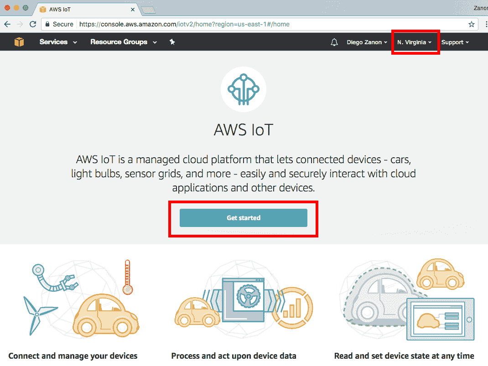
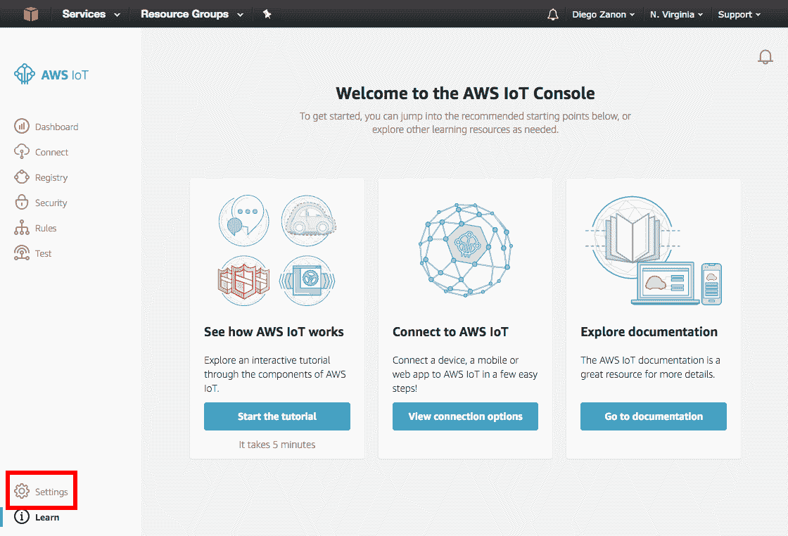
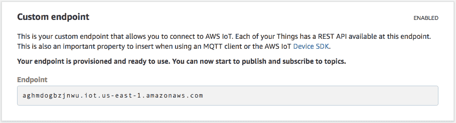
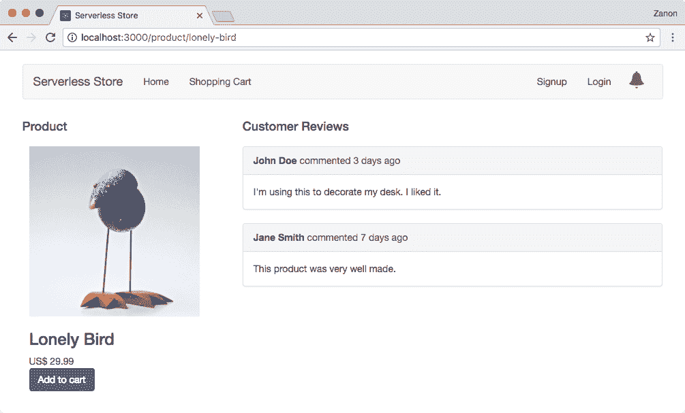
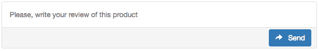
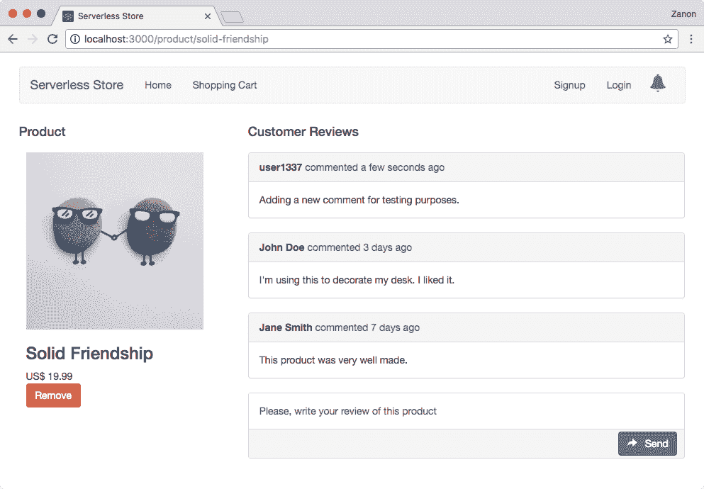
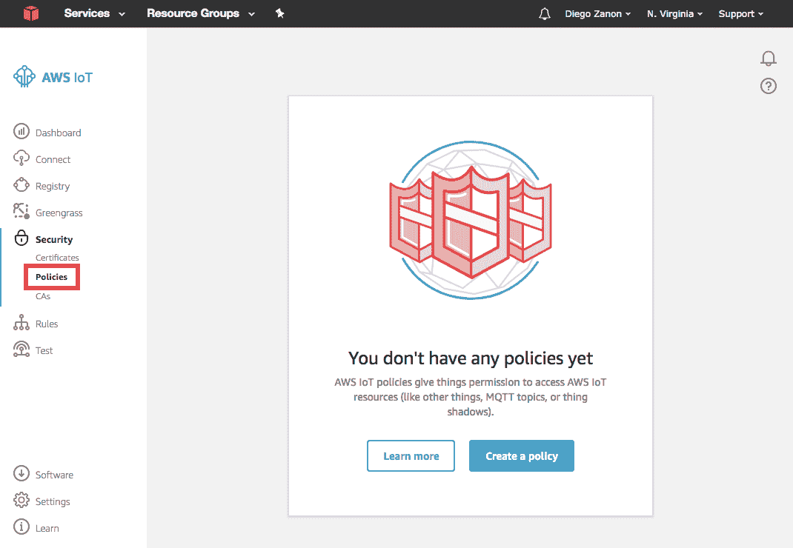
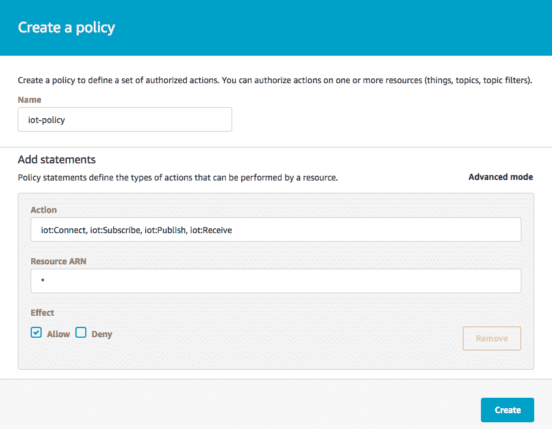
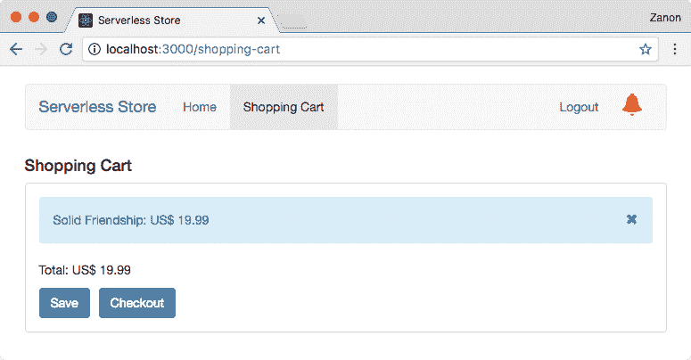

# 处理无服务器通知

推送通知是现代应用程序的常见用例。它们不仅对移动设备重要，对网站也很重要。当你浏览你的 Facebook 时间线并收到通知，说有朋友评论了你的一张照片时，这就是一个推送通知。在本章中，你将学习如何在无服务器解决方案中实现这一功能。

本章我们将涵盖以下主题：

+   使用 AWS IoT 实现无服务器通知

+   公共和私有通知

到本章结束时，你将学会如何在无服务器应用程序中处理实时通知。

# AWS IoT

将物联网作为网站的服务听起来可能有些奇怪，但 AWS IoT 是亚马逊提供的唯一支持在无服务器模型中使用 WebSocket 的服务。没有 WebSocket，我们需要依赖 *轮询*。轮询是客户端需要反复频繁地向服务器发送请求，检查是否有新消息的过程，而 WebSocket 则用于在客户端和服务器之间创建一个连接，服务器可以直接将消息发送到客户端，无需不断请求。WebSocket 用于实现 *发布-订阅* 模式，这比 *轮询* 更高效。

除了 AWS IoT，另一个用于实现实时无服务器通知的候选者是亚马逊 **简单队列服务**（**SQS**）。你可以创建一个消息队列，这些消息是针对单个用户的，并等待这个用户请求 SQS 以查找新消息。虽然轮询对于这个解决方案是必要的，但亚马逊提供了一个名为 *长轮询* 的功能。使用这个功能，当你向 SQS 请求消息时，AWS 将保持你的请求长达 20 秒，等待新消息的到来。如果在此期间有新消息到达，你将立即收到响应。如果没有消息出现，20 秒后，你将收到一个空响应，并需要发出新的 SQS 请求。这种方法减少了请求的总数和频繁轮询方法相关的成本。

SQS 相比于 IoT 的一个优势是保证了消息的读取。如果你将一条消息放入 SQS，它只有在有人接收它时才会被移除，而在 IoT 中，用户必须连接才能接收消息。

另一个用于通知的服务是亚马逊 **简单通知服务**（**SNS**）。尽管这个名字听起来像是无服务器通知的明显选择，但它不支持 WebSocket，你不能将浏览器客户端连接到接收按需通知。然而，对于移动应用程序，你可以使用它配合推送通知服务，如 **Google Cloud Messaging**（**GCM**），以实现无需轮询的实时消息。

你可能不喜欢“物联网”（IoT）这个名字，但它是一项伟大的服务，解决了我们根据无服务器模型获取通知的使用案例。AWS IoT 是一个简单的消息服务。你可以让*设备*订阅*主题*以接收其他设备发布的消息。在我们的示例中，你将把*设备*视为通过网页浏览器连接的用户，他们将接收来自其他用户或 Lambda 函数的消息。

# 协议

AWS IoT 支持*HTTP*、*MQTT*和*通过 WebSockets 的 MQTT*协议。HTTP 使用 RESTful 端点，**消息队列遥测传输**（**MQTT**）是一个为小型传感器和受限设备创建的轻量级消息协议。

你可能会认为对我们这些已经知道如何使用 RESTful 端点的人来说，使用 HTTP 会是最佳选择，但 HTTP 支持仅限于发布消息。在 REST 架构中，你不能订阅消息，因为服务器不能主动发起传输。服务器只能响应请求。

通过 WebSockets 的 MQTT 是对 MQTT 协议的一种增强，旨在支持基于浏览器的应用程序。它支持*订阅*功能，因此你的用户可以等待消息而不是每隔几秒就不断轮询更新。避免轮询机制对于效率和在你想同时服务数千个用户时的可扩展性是绝对必要的。

# 查找 IoT 端点

要使用 AWS IoT 服务，你必须提供你想要使用此服务的区域的账户的 IoT 端点。让我们执行以下步骤来查找 IoT 端点：

1.  你可以使用 IoT 管理控制台找到这些信息，该控制台可在[`console.aws.amazon.com/iot`](https://console.aws.amazon.com/iot)找到。

1.  在右上角，你可以更改服务区域。点击“开始”以跳转到下一屏幕：



1.  在控制台屏幕上，选择位于左下角的“设置”选项：



1.  将你的 IoT 端点地址记录下来，以便在应用程序中使用：

**安全观察：**端点地址不需要是私有的。你可以在应用程序中将其硬编码并分发给你的客户端，因为前端代码需要知道这个地址来访问 IoT 消息。

1.  对于我们的演示应用程序，前端代码我们将在`config.js`文件中包含以下信息：

```js
        "iot": {
          "REGION": "us-east-1",
          "ENDPOINT": "abcdef.iot.us-east-1.amazonaws.com"
        }

```

# AWS IoT SDK

处理 MQTT 协议并对每个请求进行签名可能是一项麻烦的任务。幸运的是，我们不需要“重新发明轮子”。AWS 为我们提供了一个 SDK，它实现了 MQTT 协议，并提供了我们使用所需的所有功能。你可以在 GitHub 上找到源代码：[`github.com/aws/aws-iot-device-sdk-js`](https://github.com/aws/aws-iot-device-sdk-js)。

你可以通过执行以下命令使用 npm 安装模块：

```js
 npm install aws-iot-device-sdk --save

```

要使用此 SDK，我们需要传递以下信息：

+   **凭证**：SDK 需要知道 AWS 访问密钥、AWS 秘密访问密钥和会话令牌，以便能够签署请求并获取访问 AWS 资源的授权。我们稍后将使用 Cognito 动态检索临时凭证。

+   **区域**：我们将要使用的 AWS IoT 服务的区域。

+   **物联网端点**：我们刚刚检索到的物联网端点。

+   **物联网主题**：您不需要事先明确创建物联网主题。只需选择一个词，并将其用作交换消息的通道。然而，您的凭证必须具有对此主题或 `*`（所有主题）的授权。

对于我们的示例，我们将在前端 `lib` 文件夹中的 `iot.js` 文件中创建一个类：

```js
    import awsIot from 'aws-iot-device-sdk';
    import config from './config';

    export default class IoT {

      constructor(keys, messageCallback) {  
        this.client = null;
        this.accessKey = keys.accessKey;
        this.secretKey = keys.secretKey;
        this.sessionToken = keys.sessionToken;
        this.messageCallback = messageCallback;
      }

      connect() {
        // TODO
      }

      publish(topic, message) {
        // TODO
      }

      subscribe(topic) {
        // TODO
      }
    }

```

此类有一个构造函数，它接收必要的凭证和一个 `messageCallback` 函数，该函数将用作依赖注入。每当收到一条新消息时，我们将调用此 `messageCallback` 函数来执行创建物联网类的新对象实例的人所期望的逻辑。

现在我们来看看如何实现 `connect`、`publish` 和 `subscribe` 方法：

```js
    connect() {
      this.client = awsIot.device({
        region: config.iot.REGION,
        host: config.iot.ENDPOINT, 
        accessKeyId: this.accessKey,
        secretKey: this.secretKey,
        sessionToken: this.sessionToken,
        port: 443,
        protocol: 'wss' // WebSocket with TLS 
      });

      this.client.on('connect', this.handleConnect);
      this.client.on('message', this.handleMessage);
      this.client.on('close', this.handleClose);
    }

   publish(topic, message) {
     this.client.publish(topic, message);
   }

   subscribe(topic) {
     this.client.subscribe(topic);
   }

```

在之前的代码中，`connect` 方法将 `client` 对象订阅了三个事件：

+   `connect` 事件

+   `message` 事件

+   `close` 事件

您还可以订阅另外三个事件，使您的应用程序更加健壮：

+   `error` 事件

+   `reconnect` 事件

+   `offline` 事件

最后一步是定义将处理这些事件的函数。它们被定义为以下内容：

```js
    handleConnect() {
      console.log('Connected');
    }

    handleMessage(topic, message) {
      this.messageCallback(topic, message);
    }

    handleClose() {
      console.log('Connection closed');
    }

```

# 实现无服务器通知

在上一节中，您学习了关于 AWS IoT SDK 的内容，但我们还没有对其进行测试。在本节中，我们将将其用于我们无服务器商店的以下两个功能：

+   产品评论页面的实时评论

+   支付被接受后的通知

第一个功能是一种 **公共通知** 类型，因为它使用所有用户都可以读取的物联网主题。第二个是 **私有通知**，因此只有一个人和 Lambda 后端被允许访问物联网主题以订阅或发布消息。我们将介绍这两个，以了解如何为每种情况提供适当的访问权限。

这两个示例将说明您如何使用物联网来提供通知，但这并不限制您可以使用它的方式。您可以思考其他用例。例如，物联网也可以用于无服务器多人游戏。您可以构建一个 HTML5 游戏，该游戏可以向 Lambda 后端发出请求以执行某些逻辑（例如，找到一个游戏房间）以及一个物联网主题，用于玩家之间的消息交换。它可能不适合像 FPS 游戏这样非常动态的游戏，但对于卡牌游戏、谜题和不需要极低且可预测的响应时间的游戏来说可能非常有用且成本低廉。

# 公共通知

在第五章 *构建前端* 中，我们定义了产品详情视图，它包含所有客户评论的列表。我们在这里要实现的是*实时评论*。当用户添加新的评论时，浏览同一页面的另一个用户将看到与发布同一时刻的消息。这可能对客户评论页面来说并不重要，但这种功能对于聊天系统、论坛和社交网络来说非常重要。

# 添加评论框

以下截图显示了我们的产品详情页的当前状态：



我们将修改 React 应用程序以添加一个如下所示的评论框：



对于这个任务，我们需要创建一个`CommentBox`组件，该组件将作为输入文本和按钮渲染：

```js
    return (
      <div className="comment-box">
        <input type="text" onChange={this.handleChange} 
               value={this.state.input} />
        <button onClick={this.handleClick}>
          <i className="glyphicon glyphicon-share-alt">
          </i> Send
        </button>
      </div>
    );

```

在定义元素时，我们为输入文本添加了一个`onChange`事件来保存输入值，并为发送信息到`App`组件添加了一个`onClick`事件。它们如下实现：

```js
    handleChange(e) {
      this.setState({ input: e.target.value });
    }

    handleClick() {
      this.props.onComment(this.state.input, this.props.productId);
      this.setState({ input: '' });
    }

```

这完成了`CommentBox`的实现。接下来我们将看到`App`组件将如何处理这些事件来更新页面并向同一页面的其他用户发送消息。

# 更新评论列表

在`App`组件中，我们需要处理评论创建。在下面的代码片段中，我们创建一个新的评论对象并将其添加到评论列表数组的开头：

```js
    handleComments(comment, productId) {
      const newComment = {
        id: uuid(),
        username: 'user1337',
        age: 'a few seconds ago',
        text: comment
      };

      const product = this.state
                          .products
                          .find(p => p.id === productId);

      // add to the comment to the beginning of the array
      product.comments.unshift(newComment);

      this.setState({
        products: this.state.products
      });

      // TODO: send the new comment to IoT
    }

```

为了设置评论的 ID，我使用了`UUID`模块（`npm install uuid --save`）来创建一个随机值。UUID 的示例：`110ec58a-a0f2-4ac4-8393-c866d813b8d1`

我们现在需要做的是将新的评论发送到 IoT 服务，以便与其他页面的用户共享并保存在数据库中。目前，我们的评论功能应该已经工作，并更新客户评论列表：



# 创建 IoT SDK 的新实例

在本节中，我们将创建一个新的 IoT 类实例，该实例使用 IoT SDK。这个类需要 AWS 访问密钥来连接 IoT 服务。由于我们处理的是不需要认证用户的公共通知，我们需要为匿名用户创建凭证。

让我们按照以下步骤创建 IoT SDK 的新实例：

1.  我们将开始使用 npm 将 AWS SDK 添加到我们的前端项目中：

```js
 npm install aws-sdk --save

```

1.  使用 AWS SDK，我们可以使用以下代码请求对 Cognito 的匿名访问：

```js
        AWS.config.region = config.cognito.REGION;
        AWS.config.credentials = 
 new AWS.CognitoIdentityCredentials({ IdentityPoolId: config.cognito.IDENTITY_POOL_ID
 });

 AWS.config.credentials.get(() => {
          const keys = {
            accessKey: AWS.config.credentials.accessKeyId,
            secretKey: AWS.config.credentials.secretAccessKey,
            sessionToken: AWS.config.credentials.sessionToken
          }
        });

```

1.  正如我们在上一章中配置的那样，这个身份池为匿名用户提供了对 IoT 主题`serverless-store-comments`的访问权限。有了这些密钥在手，我们就可以创建 IoT 类的实例，连接并订阅此主题：

```js
        const getIotClient = (messageCallback, callback) {    
          retrieveAwsKeys(keys => {
            const client = new IoT(keys, messageCallback);
            client.connect();
            client.subscribe('serverless-store-comments');
            callback(null, client);
          });
        }

```

# 发送和接收新的评论

`App`组件是我们负责管理应用程序状态的实体。因此，它将负责发送和接收评论。为了实现这一点，我们需要进行以下三个更改：

1.  修改`componentDidMount`以创建 IoT 类的实例：

```js
        componentDidMount() {
          getIotClient(
            this.handleIotMessages, 
            (err, client) => {
              if (err) alert(err);
              else this.setState({iotClient: client})
            });
        }

```

1.  修改`handleComments`函数以使用 IoT 发送新评论：

```js
        handleComments(comment, productId) {
          const newComment = {
            id: uuid(),
            username: 'user1337',
            age: 'a few seconds ago',
            text: comment
          };

          const topic = 'serverless-store-comments';
          const message = JSON.stringify({
            comment: newComment,
            productId: productId
          });

          this.state.iotClient.publish(topic, message);
        }

```

1.  创建`handleIotMessages`函数以接收消息并更新评论列表：

```js
        handleIotMessages(topic, message) {
          const msg = JSON.parse(message.toString());

          if (topic === 'serverless-store-comments') {
            const id = msg.productId;
            const product = this.state
                                .products
                                .find(p => p.id === id);

            product.comments.unshift(msg.comment);
            this.setState({
              products: this.state.products
            });
          }
        }

```

测试应用程序，使用两个浏览器标签运行它。当你在其中一个标签中添加评论时，相同的评论必须立即出现在另一个标签中。

# 使用 IoT 触发 Lambda 函数

物联网服务正在用于在连接的用户之间交换实时消息。然而，信息没有被持久化。我们在这里要做的是，当新的消息到达 IoT 主题时触发一个 Lambda 函数，以便该消息可以被持久化。

我们可以通过在`serverless.yml`文件中配置一个事件来触发 Lambda 函数：

```js
    functions:
      comments:
        handler: functions/comments.handler
        events:
          - iot:
              sql: "SELECT * FROM 'topic-name'"

```

对于我们的示例，将`topic-name`替换为`serverless-store-comments`。

物联网（IoT）使用类似 SQL 的语法来触发 Lambda 函数并选择要发送的内容。在先前的示例中，我们将消息的所有内容传递给 Lambda 函数。

这个 SQL 语句可以非常有助于过滤消息，仅在必要时触发 Lambda 函数。例如，假设我们发送以下 JSON 对象的消息：

```js
    {
      "comment": "this is a bad product",
      "rating": 2
    }

```

我们可以使用 SQL 语句来触发另一个 Lambda 函数，例如`handle-bad-reviews`，只有当评分低时：

```js
    "SELECT * FROM 'topic-name' WHERE rating < 3"

```

回到我们的无服务器商店示例，我们已经定义了 Lambda 函数的触发器。现在我们可以实现将数据保存到数据库中的函数。由于在第七章管理无服务器数据库中已经涵盖了使用无服务器数据库，下一个示例将仅为了测试目的记录`event`对象的内容：

```js
    const utils = require('../lib/utils');

    module.exports.handler = (event, context, callback) => {
      console.log(event);
      utils.successHandler(event, callback);
    };

```

您可以使用 Serverless Framework 的`logs`命令来测试它是否正常工作：

```js
 serverless logs --function comments

```

# 私有通知

在第八章，*保护无服务器应用程序*中，我们为已认证的用户定义了一个策略文档，包括对以下 IoT 主题的授权：

```js
 serverless-store-${cognito-identity.amazonaws.com:sub}

```

这意味着已认证的用户将能够访问一个专有的主题，其名称由其自己的联合身份定义。我们接下来要实现的是一种*私有通知*，其中 Lambda 函数将消息发布到 IoT 主题，只有一位用户能够接收它。

# 使用已认证用户的凭据

对于未认证的用户，我们看到了如何使用以下代码设置凭据：

```js
    AWS.config.region = config.cognito.REGION;
    AWS.config.credentials = 
      new AWS.CognitoIdentityCredentials({
        IdentityPoolId: config.cognito.IDENTITY_POOL_ID
      });

```

然而，对于已认证的用户，需要将`credentials`对象设置为一个额外的属性：`Logins`。以下代码展示了如何实现这一点：

```js
    const region = config.cognito.REGION;
    const pool = config.cognito.USER_POOL_ID;
 const authenticator = 
 `cognito-idp.${region}.amazonaws.com/${pool}`;

    AWS.config.credentials = 
      new AWS.CognitoIdentityCredentials({
        IdentityPoolId: config.cognito.IDENTITY_POOL_ID,
 Logins: {
 [authenticator]: userToken
 }
      });

```

# 更新登出功能

当我们使用 AWS 凭证功能时，AWS SDK 将用户数据保存到本地存储。为了避免另一个用户在同一个浏览器上登录并使用前一个用户的凭证，我们需要在注销时清除这些数据。这是通过将以下代码片段添加到 `Logout` 处理器来完成的：

```js
    if (AWS.config.credentials) {
 AWS.config.credentials.clearCachedId();
    }

```

# 创建 IoT 策略

使用认证用户连接到 IoT 需要额外一步：我们需要附加一个 IoT 安全策略。如果没有这个附加，IoT 服务将拒绝所有请求。

让我们通过以下步骤来查看如何创建此策略：

1.  打开 IoT 控制台，[`console.aws.amazon.com/iot`](https://console.aws.amazon.com/iot)。

1.  在左侧菜单中，导航到安全 | 策略，然后点击创建策略：



1.  选择一个策略名称，使用操作 `iot:Connect`、`iot:Subscribe`、`iot:Publish` 和 `iot:Receive`，对于资源输入 `*`，并检查允许的效果：



1.  点击创建以完成。

**安全观察：**虽然我们选择了 `*` 资源，但我们无法订阅或发布到所有主题，因为 AWS 将使用 Cognito 角色来检查权限，而这个策略文档被设置为受限访问。

# 将 IoT 策略附加并连接

在上一章中，我们将 Cognito 策略文档设置为允许访问 `iot:attachPrincipalPolicy` 动作。现在我们将使用它。在获取 AWS 凭证后，我们将使用 `AWS.Iot` 模块和 `attachPrincipalPolicy` 函数将我们刚刚创建的 IoT 策略附加到认证用户。设置策略后，我们将连接到 IoT 并订阅公共和私有主题：

```js
    AWS.config.credentials.get(() => {
      const keys = {
        accessKey: AWS.config.credentials.accessKeyId,
        secretKey: AWS.config.credentials.secretAccessKey,
        sessionToken: AWS.config.credentials.sessionToken
      }

 const awsIoT = new AWS.Iot();
 const params = {
 policyName: 'iot-policy',
 principal: AWS.config.credentials.identityId
 }

 awsIoT.attachPrincipalPolicy(params, (err, res) => {
        if (err) alert(err);
        else {
          const client = new IoT(keys, messageCallback);
          client.connect();

          // subscribe to the public topic
          client.subscribe('serverless-store-comments');

 // subscribe to the private topic
 const id = AWS.config.credentials.identityId;
 client.subscribe('serverless-store-' + id);

          callback(null, client);
        }
      });
    });

```

# 将 Cognito 身份传递给 Lambda 函数

在上一章中，当我们定义了对 IoT 资源的受限访问时，我们使用了 `${cognito-identity.amazonaws.com:sub}` IAM 策略变量来定义 IoT 主题名称。此参数使用 Cognito 身份，但后端代码不知道此值。Lambda 函数将通过授权器（`event.requestContext.authorizer.claims.sub`）检索一个用户 ID，但授权器 ID 与 Cognito 身份不同。

为了将此值从前端代码传递到后端，AWS 建议我们使用其 **Signature Version 4**（**Sigv4**）签名过程发送已签名的请求。此外，您不需要在 API Gateway 中设置 Cognito 授权器，而需要使用 **AWS_IAM** 授权器。这是将此信息传递到后端最安全的方式，因为这种方法保证只有真实用户才能发送其 Cognito ID。

然而，我们在这里不会涉及这个话题。使用**Sigv4**签名请求并使用**AWS_IAM**授权器要比使用 Cognito 授权器和我们的演示应用所需的复杂得多，因为我们使用授权器 ID 来识别用户，而不是 Cognito ID。此外，由于我们已经配置了 IoT 角色策略，一个用户无法接收为另一个用户创建的消息，即使恶意用户知道另一个用户的身份。最坏的情况是恶意用户触发对其他用户的未预期消息，这只会发生在其他用户的凭证被破坏的情况下。

因此，在我们的例子中，我们将通过`Checkout`请求中的`AWS.config.credentials.identityId`参数，从前端发送 Cognito ID 到后端。

# 使用 Lambda 发送 IoT 消息

我们已经修改了应用程序，使认证用户订阅了公共和私有主题。我们现在要探讨的是如何通过以下步骤使用 Lambda 函数向这个私有主题发送消息：

1.  第一步是修改`serverless.yml`文件，以明确权限允许访问`iot:Publish`：

```js
        provider:
          name: aws
          runtime: nodejs6.10
 iamRoleStatements:
 - Effect: "Allow"
 Action:
 - "iot:Publish"
 Resource: 
 "arn:aws:iot:<region>:<account>:topic/*"

```

1.  对于我们的示例，我们将使用`processCheckout`函数。用户将点击结账，这个动作将触发一个 Lambda 函数，该函数将向用户主题发布一条消息。结果是通知图标颜色改变，以通知用户有新消息可用：



1.  修改前端应用程序是一个简单的任务，所以这将是读者的练习。至于后端代码，我们将为`processCheckout`函数使用以下代码：

```js
        const AWS = require('aws-sdk');
        const utils = require('./utils');

        module.exports.processCheckout = (cognitoId, callback) => {
          const iotdata = new AWS.IotData({
            endpoint: 'YOUR_IOT_ENDPOINT'
          }); 

          const params = {
            topic: 'serverless-store-' + cognitoId,
            payload: 'Your payment was confirmed.'
          };

 iotdata.publish(params, (err, res) => {
            if (err) utils.errorHandler(err, callback);
            else utils.successHandler(res, callback);
          });
      };

```

记住，`userId`变量是在前一章通过分析`event`对象检索的：`event.requestContext.authorizer.claims.sub`

# 摘要

在本章中，你学习了如何使用 AWS IoT 服务创建无服务器通知。我们介绍了如何实现实时评论系统和为单个用户推送通知。你已经知道如何使用 AWS IoT 设备 SDK，以及如何使用 IoT 触发 Lambda 函数或使用 Lambda 向 IoT 端点发送消息。

在下一章中，我们将完成在线商店，展示如何测试我们的无服务器应用，然后定义开发和生产环境中的部署工作流程，最后我们将展示在无服务器解决方案中你可以（和应该）监控的内容。
