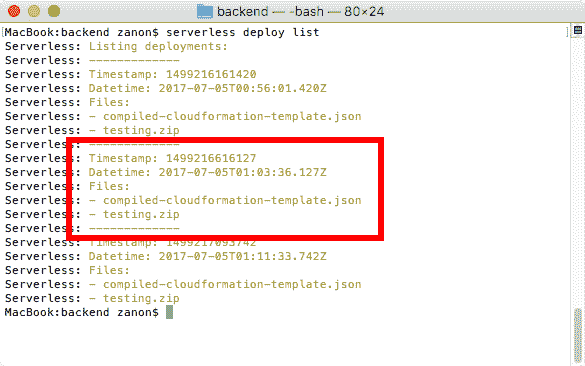

# 测试、部署和监控

我们正在接近本书的结尾，但在讨论一些超出编写解决方案编码的方面之前，我们无法结束。我们需要了解您如何测试运行在您不拥有的环境中的函数，一个好的开发工作流程来部署和交付您解决方案的新版本，以及尽管在构建无服务器项目时我们不需要担心服务器，但我们仍需要了解我们需要配置的最小监控，以提供成本效益和可靠的解决方案。

在本章中，我们将涵盖以下主题：

+   测试无服务器解决方案

+   定义如何处理新版本的部署和交付

+   监控错误、性能和成本

在完成本章后，您将完成本书，并准备好使用无服务器组件构建您的下一个解决方案或增强现有的解决方案，从中受益于无服务器概念。

# 测试您的解决方案

测试无服务器项目可能是一个具有挑战性的经验，因为我们依赖于许多不同的云服务，这些服务在本地很难模拟，并且除了测试单个服务之外，我们还需要测试它们如何协同工作。

然而，您已经在传统项目中使用的所有实践都可以用于无服务器应用程序。为了提高您软件的质量，您可以使用 **测试驱动开发**（**TDD**）、**行为驱动开发**（**BDD**）或任何本质上依赖于自动化测试的开发流程。尽管我们没有访问将执行代码的机器，但我们可以在本地模拟许多事情，并且我们可以不时运行集成测试，以断言一切按预期工作。

在接下来的几节中，我们将看到如何为后端和前端创建测试。为了使这个主题更简单，我们将为简单的函数创建测试。如果您想查看更广泛的示例，可以浏览本章的代码文件，以了解无服务器存储是如何被测试的。

# Lambda 函数的单元测试

由于 Lambda 函数是在一个公共 JavaScript 文件中定义的，您只需将您的测试工具设置为加载此文件并测试本地函数。为了模拟由 API 网关或其他触发器设置的输入数据，您需要根据预期的输入设置您的测试中的 `event` 变量。

让我们执行以下步骤，看看如何对 Lambda 函数进行单元测试：

1.  首先，让我们通过运行以下命令创建一个新的无服务器项目：

```js
 serverless create --template aws-nodejs --name testing

```

1.  现在，让我们修改 `serverless.yml` 文件，如下所示：

```js
       service: testing-service

       provider:
         name: aws
         runtime: nodejs6.10

       functions:
         hello:
           handler: functions/greetings.hello

```

1.  在这个项目中，我们只有一个 Lambda 函数，这个 `hello` 函数是由位于 `functions` 文件夹内的 `greetings.js` 文件定义的。考虑以下简单的实现：

```js
        module.exports.hello = (event, context, callback) => {
          const message = `Hello, ${event.name}!`
          callback(null, message);
        };

```

1.  这个 `hello` 函数是我们想要测试的函数。现在，让我们创建我们的测试代码。在下面的屏幕截图中，我们展示了项目树，其中创建了一个名为 `test` 的文件夹，它包含一个 `mocha.opts` 文件，以及另外两个文件夹，`unit` 和 `integration`。由于这个示例代码不与任何其他服务交互，我们可以将其称为 `unit` 测试，而 `test-greetings.js` 文件就是它将被实现的地方：


1.  我们可以通过在 `serverless.yml` 文件的末尾添加一个排除规则来排除这个 `test` 文件夹及其所有内容，从而将其从部署包中排除：

```js
        package:
          exclude:
            - test/**

```

1.  关于 `mocha.opts` 文件，它被包含进来是为了配置 Mocha 测试框架（[`mochajs.org/`](https://mochajs.org/)) 的选项，但你也可以使用任何其他的测试工具。

1.  在这个 `mocha.opts` 文件中，我只添加了一行代码来指定必须使用哪个文件夹来运行测试：

```js
        test/unit

```

`unit` 文件夹将包含单元测试，这些测试必须在毫秒内执行，以便开发者可以在每次修改后立即断言代码的状态。`integration` 文件夹包含访问外部服务的测试，允许它们在秒/分钟内完成。这些测试设计为偶尔执行，通常每天执行一次，而不是像单元测试那样频繁。因此，它们没有被包含在选项中。

1.  Mocha 通过 npm 安装，因此我们需要添加一个 `package.json` 文件并执行以下命令：

```js
 npm install mocha --save-dev

```

1.  在 `package.json` 文件中，在 `scripts` 字段中添加一个 `test` 命令，其值为 `mocha`。这将很有帮助，因为你可以运行 `npm test` 命令来执行单元测试：

```js
        {
            "name": "testing",
            "version": "1.0.0",
 "scripts": {
 "test": "mocha"
 },
            "devDependencies": {
                "mocha": "³.2.0"
            }
        }

```

1.  现在我们已经正确设置了测试环境，我们可以实现名为 `test-greetings.js` 的测试文件。要使用 Mocha，我们需要使用 `describe` 函数来列出测试用例，以及 `it` 函数来实现测试用例：

```js
        const assert = require('assert');

        // list the unit tests of the greetings function
        describe('Greetings', () => {

          // this is the only test that we have for this file
          describe('#hello()', () => {

            // the `done` argument must be used only for 
            // async tests, like this one
            it('should return hello + name', (done) => {

              // the test code will be defined here

            }); 
          });
        });

```

1.  对于这个 Lambda 函数，我们可以实现以下测试：

```js
        // load the Lambda function
        const greetings = require('../../lib/greetings');

        // set the event variable as expected by the function
        const event = { 
          name: 'John'
        };

        // context can be null in this test
        const context = null;

        // invoke the function locally
        greetings.hello(event, context, (err, response) => {

          const expected = 'Hello, John!';
          const actual = response;

          // testing if the result is the expected
 assert.equal(expected, actual);

          // exiting successfully if `err` variable is null
          done(err);
        });

```

1.  要执行测试，请运行 `npm test`。你应该会收到以下输出：


1.  作为一种良好的实践，你应该始终对测试进行测试。你可以通过将预期结果从 `Hello, John!` 更改为 `Bye, John!` 来做到这一点，这显然会导致断言失败，并产生以下输出：


# 模拟外部服务

有时候，你无法直接对 Lambda 函数进行单元测试，仅仅是因为有时候你不能将函数视为一个 *单元*。如果函数与外部服务交互，比如发送通知或在数据库中持久化一些数据，你就不能将其视为逻辑单元。在这种情况下，只有在你从测试中移除这些依赖项的情况下，你才能对函数进行单元测试，而你这样做是通过 *模拟* 它们来实现的。

模拟是指构建一个对象来模拟另一个对象的行为。当我们需要测试一个复杂的服务时，有许多底层行为我们可能不感兴趣测试。例如，如果我使用外部服务处理信用卡支付，并且我想测试它是否对给定的输入处理正确，我不希望处理意外事件，例如连接问题。在这种情况下，我可以创建一个模拟对象来模仿预期的行为，如果满足特定条件，我的测试用例将返回成功或失败。

为了能够模拟服务，我们需要将业务逻辑与外部服务分离。采用这种方法，我们可以编写单元测试，并保持解决方案对云服务的依赖性较低，这有助于有一天你需要从一家云服务提供商迁移到另一家。

以下代码展示了一个例子，其中**没有**清晰的业务逻辑和服务分离。因此，测试起来更困难：

```js
    const db = require('db');
    const notifier = require('notifier');

    module.exports.saveOrder = (event, context, callback) => {

 db.saveOrder(event.order, (err) => {
        if (err) {
          callback(err);
        } else {
 notifier.sendEmail(event.email, callback);
        }
      });
    };

```

这个例子接收订单信息，将其保存到数据库中，并发送电子邮件通知。这里有两个主要问题，比如代码绑定到输入（它如何处理 `event` 对象），并且你不能在不触发对数据库和通知服务的请求的情况下对 Lambda 函数的内部内容进行单元测试。

更好的实现方式是创建一个独立的模块来控制业务逻辑，并且构建这个模块时允许你注入依赖：

```js
    class Order {

 // Dependency Injection
      constructor(db, notifier) {
        this.db = db;
        this.notifier = notifier;
      }

 save(order, email, callback) { 
 this.db.saveOrder(order, (err) => {
          if (err) {
            callback(err);
          } else {
 this.notifier.sendEmail(email, callback);          
          }
        });
      }
    }

    module.exports = Order;

```

现在，由于数据库和通知服务作为输入值传递，这段代码可以进行单元测试，因此它们可以被模拟。

关于 Lambda 代码，它变得简单得多：

```js
    const db = require('db');
    const notifier = require('notifier');
    const Order = require('order');

    const order = new Order(db, notifier);

    module.exports.saveOrder = (event, context, callback) => {
      order.save(event.order, event.email, callback);
    };

```

# 使用 Sinon.JS 进行模拟

在前面的例子中，我们通过创建一个名为 `Order` 的外部模块来改进 Lambda 函数，以处理所有与订单相关的操作。这是必要的，因为我们只能模拟我们能够访问的对象。我们无法直接测试 Lambda 函数，因为我们无法访问它使用的服务（数据库和通知），但至少我们可以测试 `Order` 类，因为它允许注入服务。

对于我们的模拟示例，我们将使用 Sinon.JS。可以使用以下命令进行安装：

```js
 npm install sinon --save-dev

```

Sinon 将与 Mocha 一起使用。因此，我们需要创建一个如下所示的测试用例：

```js
    const assert = require('assert');
 const sinon = require('sinon');
    const Order = require('./order');

    describe('Order', () => {
      describe('#saveOrder()', () => {
        it('should call db and notifier', (done) => {

          // the test code will be defined here

        });
      }); 
    });

```

我们可以像以下这样实现这个测试：

```js
 // define the behavior of the fake functions
    const dbMock = {
      saveOrder: (order, callback) => {
        callback(null);
      }
    }  

    const notifierMock = {
      sendEmail: (email, callback) => {
        callback(null);
      }
    }

 // spy the objects to identify when and how they are executed
    sinon.spy(dbMock, 'saveOrder');
 sinon.spy(notifierMock, 'sendEmail');

    // define the input event 
    const event = { 
      order: { id: 1 },
      email: 'example@example.com'
    };

 // inject the mocked objects
 const order = new Order(dbMock, notifierMock);

    // execute the function
    order.save(event.order, event.email, (err, res) => {

 // assert if the mocked functions were used as expected
      assert(dbMock.saveOrder.calledOnce, true);
      assert(notifierMock.sendEmail.calledOnce, true);
      assert(dbMock.saveOrder.calledWith(event.order), true);
      assert(notifierMock.sendEmail.calledWith(event.email), true);

      done(err);
    });

```

这个例子表明，你可以使用 Sinon.JS 来检查你的依赖是否按预期和正确的参数被调用。你可以改进这个例子，添加假响应并测试不同的行为，但我们不会深入这个主题，因为这些功能与无服务器架构不是严格相关的。这里的目的是展示常见的测试框架可以在无服务器架构中使用，而不需要特殊配置。

# 测试前端

我们使用 React 开发了前端，因此我们将构建一个简单的示例来展示你如何测试它。目标是查看一个简单的组件是否正确渲染，并且是否如预期那样显示文本。

让我们看看以下步骤来创建这个示例：

1.  我们将首先通过执行以下命令创建一个新的 React 项目：

```js
 create-react-app frontend-test

```

1.  Create React App 使用 Jest 作为其测试运行器。按照惯例，它将始终寻找以 `.test.js` 结尾的文件来执行测试。在默认模板中，我们有 `App.js` 和 `App.test.js` 文件。如果你运行 `npm test`，Jest 将执行在 `App.test.js` 中创建的示例测试，并将输出以下结果：


运行 `npm test` 后，Jest 将监视更改，因此你可以继续开发你的前端，并且每当保存文件时，Jest 都将执行所有测试用例。

1.  在 `App.js` 中，我们定义了一个 `App` 组件，其代码如下：

```js
        render() {
          return (
            <div className="App">
              <div className="App-header">
                
 <h2>Welcome to React</h2>
              </div>
            </div>
          );
        }

```

1.  并且 `App.test.js` 的定义如下，它只是一个烟雾测试，用于查看组件是否可以渲染而不崩溃：

```js
        import React from 'react';
        import ReactDOM from 'react-dom';
        import App from './App';

        it('renders without crashing', () => {
 const div = document.createElement('div');
 ReactDOM.render(<App/>, div);
        });

```

1.  现在我们将改进这个测试用例，并且我们需要安装两个辅助工具，如 Enzyme 和 react-test-renderer：

```js
 npm install enzyme react-test-renderer --save-dev

```

1.  使用 Enzyme，我们可以通过使用 `mount` 函数而不是 `ReactDOM.render` 来简化前面的示例：

```js
        import React from 'react';
        import ReactDOM from 'react-dom';
        import App from './App';
 import { mount } from 'enzyme';

        it('renders without crashing', () => {
 mount(<App/>);
        });

```

1.  为了完成这个示例，我们将添加另一个测试用例来查看是否如预期那样，给定的元素 `<h2>Welcome to React</h2>` 已在组件中渲染：

```js
        it('renders with "Welcome to React"', () => {
          const wrapper = mount(<App/>);
          const welcome = <h2>Welcome to React</h2>;
          expect(wrapper.contains(welcome)).toEqual(true);
        });

```

# 在本地模拟 AWS 服务

使用云服务的缺点之一是它们提供的产品你不能安装在自己的机器上。如果你能安装它们，你的开发速度将会提高，因为本地测试比通过互联网连接它们要快。

为了解决这个限制，社区已经创建了多个工具来帮助你通过在本地运行来模拟 AWS 服务。你可以在以下链接中找到一些：

+   **Lambda 函数**：[`github.com/lambci/docker-lambda`](https://github.com/lambci/docker-lambda)

+   **API Gateway 和 Lambda**：[`github.com/dherault/serverless-offline`](https://github.com/dherault/serverless-offline)

+   **计划中的 Lambda 函数**：[`github.com/ajmath/serverless-offline-scheduler`](https://github.com/ajmath/serverless-offline-scheduler)

+   **DynamoDB**：[`github.com/mhart/dynalite`](https://github.com/mhart/dynalite)

使用这种策略有一些优点和缺点。特别是，我不认同这个观点，并且我不会使用它们。你可以通过以下内容找到我对优缺点的看法，并自行决定这些工具是否可能改善你的开发工作流程：

**优点：**

+   **速度**：在本地运行比使用互联网更快。

+   **测试**：有些工具只是模拟器，它们模拟真实服务的行怍而不进行任何 I/O 操作，这意味着你可以测试你的服务而不必更改你的代码。其他工具是类似实现，允许你调试你的代码。

+   **成本**：你可以使用自己的机器免费运行它们。

**缺点**：

+   **速度**：大多数服务都需要额外的配置步骤。对于一个小型项目，你可能会花费更多的时间来配置和调试假服务的问题，这比你从更快的测试中获得的收益要多。

+   **测试**：如果你只使用模拟服务，你很难对自己的测试有信心。你需要时不时地运行与真实服务集成的测试。此外，你可能无法进行某些测试。例如，模拟 IAM 权限是非常困难的。

+   **成本**：你可能会在配置这些工具上花费比你在云成本上节省的更多开发者时间。大多数云提供商已经采用了定价模式，他们提供免费层，允许开发者免费构建和测试他们的产品，并且只有在服务被密集使用时才开始收费。

# 部署你的应用程序

在本节中，我们将讨论无服务器应用程序的部署。我并不是指仅仅运行`serverless deploy`命令，我的意思是你需要知道并定义如何在生产环境中处理和管理应用程序的新版本。

你是否可以在任何时间点击部署按钮？这有什么影响？你如何只为测试创建生产环境的副本？这些都是本节将要讨论的内容。

# 开发工作流程

部署 Lambda 函数的新版本是一个简单的任务。我们运行一个命令，框架负责打包内容并将它们上传到 AWS。然而，运行`serverless deploy`命令通常需要几分钟。问题不在于上传 ZIP 文件的时间，而在于框架需要使用 CloudFormation 更新的内容。需要发布一个新的 CloudFormation 模板，要求 AWS 更新特定区域的全部相关资源，这需要时间。随着我们的代码库增长，我们可能需要创建数十个 API Gateway 端点，许多不同的 IAM 角色或其他类型的 AWS 资源。管理它们可能会很麻烦，因为它们会增加部署时间到一个不愉快的长度。

使用选择性部署可以减少这种时间。如果你只修改了特定的功能，你可以通过以下命令快速部署：

```js
 serverless deploy function -f myFunction

```

# 蓝绿部署

蓝绿部署是一种常见的部署新版本软件的技术，它可以避免产生不可用性。假设你正在运行 3.0 版本的软件，并且你想要部署新的 3.1 版本。在你开始更新你的机器之前，所有的机器都在使用 3.0 版本，我们称它们处于*蓝色*状态。我们首先创建带有更新代码的新机器，版本号为 3.1，这些机器处于*绿色*状态。下一步是修改负载均衡器，将所有新的连接重定向到新机器（绿色），同时继续处理旧机器（蓝色）的请求。在之前的请求处理完成后，*蓝色*机器将不会收到任何新的请求，它们可以被关闭。

蓝绿部署之所以重要，是因为在过去，我们通常只有一个用于处理应用的 Web 服务器机器，常见的做法是停止 Web 服务器，更新代码，然后重新启动。过去，那几秒钟的不可用性是可以接受的，但今天，随着自动化和将负载分配到多个服务器的可能性，更新或维护流程中不再需要中断服务。

在无服务器世界中，这个概念是等效的。当你更新 Lambda 函数的代码时，AWS 会使用它来处理新的请求，而之前的版本将继续使用之前的代码运行。API 网关也将处理端点行为的修改，而不会造成不可用性：


因此，回答之前的问题：你可以在任何时间点点击部署按钮吗？是的，你可以部署你应用的新的版本，无需担心可用性。然而，在部署新版本的过程中，我们可能会同时运行不同的版本。你应该注意这种情况，特别是关于需要更改数据库模型的版本。

# 使用不同数据库模型的部署新版本

在无服务器中，我们通常运行执行时间仅为几秒钟的代码。因此，同时运行两个不同的版本可能不到一秒钟，但我们如何在一个模型中应用数据库更改？重命名一个列可能会破坏旧版本的执行。

理想情况下，我们都会使用具有灵活模式的 NoSQL 数据库，但这并不现实。有些业务案例更适合由关系数据库或具有限制性模式的 NoSQL 数据库来处理。

当修改模式时，有三个操作需要我们注意，如创建、重命名和删除。

# 创建一个新表或列

在现有的表中添加表或列不应该破坏任何应用程序。然而，有一些 ORM 工具，如 Entity Framework（用于 .NET），将每个架构版本与迁移 ID 关联。在这种情况下，当你运行迁移命令以升级数据库架构时，它会添加一个新的迁移 ID，该 ID 将由应用程序代码检查。如果你运行之前的代码版本，ID 将不匹配，并且会返回错误。

这种限制是为了安全措施而创建的，以避免过时的代码在生产环境中运行，当预期的模型不同时造成不一致。尽管如此，如果你对你的部署有适当的控制，你可以禁用这个限制，以避免在升级版本时出现不可用的情况。

此外，我们还需要注意当我们添加约束或外键时。如果你修改包含数千行数据的表以添加一个新的外键，`ALTER TABLE` 命令可能需要一些显著的时间来处理。在处理过程中，表将锁定以供选择，这可能导致一些查询超时。

# 重命名表或列

假设你需要将一个列名从 `A` 改为 `B`。如果你进行这个变更，之前的代码可能无法正常工作，因为它找不到名为 `A` 的列，而最新的代码如果在重命名之前部署，也可能无法正常工作。

这里提出的解决方案是通过执行以下步骤来实施这一变更：

1.  运行一个脚本以创建一个名为 `B` 的新列。

1.  添加一个临时触发器，每次修改 `A` 列中的数据时都会执行，以将相同的修改应用到 `B` 列。

1.  将 `A` 到 `B` 的所有内容进行复制。

1.  部署一个与之前版本完全相同的新代码版本，但使用列 `B` 而不是 `A` 进行读写。

1.  稍等片刻以确保所有请求都在使用新的 Lambda 代码，而不是之前的版本。你可能需要等待 Lambda 函数的最大超时时间。

1.  运行另一个脚本，该脚本将删除列 `A` 和临时触发器。

1.  部署使用列 `B` 并添加新功能的最新代码。

# 删除表或列

删除表或列稍微容易一些。你只需要部署一个新的应用程序代码，该代码不使用你想要删除的表或字段。在等待一段时间以确保之前的代码已执行完毕后，你可以安全地执行一个脚本，该脚本将删除表或移除字段。

# 回滚部署

有时，我们部署的应用程序的新版本可能会引入有缺陷的功能。根据错误的严重程度，在开始修复错误并进行新部署之前，你可能需要回滚应用程序。为此回滚你有两种选择：

1.  使用标签对所有的部署进行版本控制。当你需要回滚时，选择之前标签中的代码，然后再次运行 `serverless deploy`。

1.  使用 `serverless rollback` 命令将你的函数更改为之前的版本。

AWS 为我们部署有一个版本控制系统，因此使用`serverless rollback`命令是安全且快速的。此命令应通过传递`timestamp`参数来使用，如下所示：

```js
 serverless rollback --timestamp <timestamp>

```

要找到我们上次部署的时间戳信息，我们需要运行以下命令：

```js
 serverless deploy list

```

它将给出以下输出：



在之前的屏幕截图中，我们会使用值`1499216616127`作为`timestamp`参数。请注意，我们需要选择倒数第二个版本，而不是最后一个版本。

命令`serverless rollback`将回滚使用`serverless deploy`命令所做的先前部署的所有函数。如果您使用了`serverless deploy function`，则此更改不会进行版本控制。

# 创建预发布环境

最佳实践表明，我们必须为开发和生产环境拥有不同的环境。您还可以添加第三个环境，通常命名为*预发布*，用于测试：

+   **开发环境**：这是您部署作为工作进度的代码的地方，测试它是否与其他服务一起工作

+   **预发布环境**：通常需要客户或质量保证团队验证构建

+   **生产环境**：这是您的应用程序对最终用户可见的地方

我们开发的全部软件都高度依赖于环境，例如操作系统、运行时版本、已安装的模块和 dlls、外部服务、配置文件以及其他。因此，至少在几年前，开发者解释生产错误时说“在我的机器上它运行正常”是一个相当常见的借口。将开发环境与生产设置相匹配是一个非常困难的任务。有时，对其中一个所做的更改并没有反映到另一个上，导致出现奇怪的错误。

使用虚拟机，以及最近使用 Docker 容器，这个问题已经大大减少，因为我们现在可以相信我们可以在我们的开发机器上完美地重现生产错误，并且我们构建的内容将按预期工作，无论在哪个机器上执行它。

使用云提供商，我们所有的基础设施都可以通过脚本进行。因此，我们可以通过代码来自动化创建环境的方式。在这种情况下，您只需更改一个变量的值，然后再次部署，就可以将您的开发代码与生产代码进行镜像。在您的`serverless.yml`文件中，`provider`下有一个选项允许您命名当前环境，并且只需通过为`stage`属性选择一个新名称，就可以轻松地将它镜像到其他环境：

```js
    service: serverless-app

    provider:
      name: aws
      runtime: nodejs6.10
 stage: dev
      region: us-east-1

```

# 小心使用生产环境

能够轻松地将开发环境镜像到生产环境是一个非常强大的功能，需要明智地使用。在我作为开发者的早期，我有同时打开预发布和生产虚拟机的坏习惯。当然，当我误操作生产服务，以为我在更改预发布版本时，我就停止这样做。

我建议使用预发布选项来将*开发*环境与*测试*环境进行镜像。您可以轻松地为您的客户或质量保证团队部署新版本，但您应该*永远*不要使用您的开发机器在生产环境中应用更新，以避免相关的风险。

创建一个新的环境就像为新`阶段`选择一个新名称一样简单。因此，您可以将其命名为`test-2017-08-02`或`test-feature-x`等，以创建具有特定测试环境的新端点。

您可以在团队中指定一个人，他将是唯一负责部署新生产版本的人。将责任限制在一个人身上将减少事故发生的可能性。另一种选择是拥有一台专门用于生产部署的机器。需要额外一步，即连接到该机器，有助于您专注于任务，并且不会意外选择错误的环境。

此外，我还建议您拥有两个不同的 AWS 账户，一个用于开发和测试，另一个专门用于生产。虽然可以配置 IAM 角色来保护您的环境并防止同一用户修改两个环境，但这仍然是有风险的。IAM 限制可能配置不正确，或者您可能添加了新的资源而忘记设置适当的访问权限，从而导致不希望的变化。

# 测试数据

当您的整个基础设施都脚本化时，开发和生产环境之间的唯一区别是相关数据。测试环境通常有自己的模拟数据，但有时我们无法重现错误，例如性能问题或不一致性，因为底层数据不同。

然而，为了以下原因，将生产数据备份并直接将其复制到测试环境中可能是一种不良做法：

+   生产数据包含真实电子邮件。运行测试代码可能会意外地向真实的人发送电子邮件。

+   生产数据包含敏感数据，如真实姓名、电子邮件、电话号码和地址。与所有开发者共享这些数据是不必要的，也是危险的。开发机器比生产环境更不安全，更容易受到黑客攻击。

在这种情况下，我建议在大多数测试中使用模拟数据，当您需要进行性能测试或分析特定问题时，您可以使用生产备份，但您需要有一个程序来修改内容，在将数据与所有开发者共享之前删除敏感数据。

# 保持您的函数活跃

如我们在前面的章节中讨论过的，无服务器函数的一个问题就是冷启动。当您的 Lambda 函数被触发时，AWS 会找到其包，解压并安装到容器中以执行。这些步骤需要一些时间（通常 5 秒），并且会延迟您的函数执行。

执行函数后，AWS 将将其保持一段时间挂起状态。如果几分钟后收到新的请求，它不会受到冷启动延迟的影响，因为包将随时可用。在 15 分钟的不活动后，它将再次“冻结”。

如果您的应用程序需要确保低响应时间，您可以通过配置将其部署为“预热”状态。有一个名为 **WarmUP** 的 Serverless Framework 插件（[`github.com/FidelLimited/serverless-plugin-warmup`](https://github.com/FidelLimited/serverless-plugin-warmup)），它将创建一个定时 Lambda 函数，负责不时调用其他函数（默认为 5 分钟）。

让我们按照以下步骤来了解如何使用它：

1.  通过执行以下命令创建一个新的无服务器项目：

```js
 serverless create --template aws-nodejs --name warmup

```

1.  创建一个 `package.json` 文件。

1.  通过执行以下命令安装 WarmUP 插件：

```js
 npm install serverless-plugin-warmup --save-dev

```

1.  在 `serverless.yml` 文件的末尾添加以下引用：

```js
 plugins:
 - serverless-plugin-warmup

```

1.  对于您想要保持“预热”的每个函数，添加 `warm: true` 配对：

```js
        functions:
          hello:
            handler: handler.hello
 warmup: true

```

1.  此插件将调用其他函数，因此我们需要给它必要的权限：

```js
        iamRoleStatements:
          - Effect: 'Allow'
            Action:
              - 'lambda:InvokeFunction'
            Resource: "*"

```

1.  最后一步是修改 Lambda 函数以忽略由该插件创建的请求：

```js
        module.exports.hello = (event, context, callback) => {

 if (event.source === 'serverless-plugin-warmup') {
 console.log('WarmUP - Lambda is warm!')
 return callback(null, 'Lambda is warm!')
 }

          callback(null, { message: 'Hello!' });
        };

```

# 监控操作

无服务器概念被定义为运行您的代码而不必担心支持它的基础设施。这仍然成立，但有一些 DevOps 任务可能会提高您应用程序的效率和稳定性。因此，您不应将无服务器与 NoOps 混淆。您只需不必过多担心基础设施即可。

由于我们使用 AWS，我们将使用其监控工具：Amazon CloudWatch。还有一些其他付费和免费工具也可以用于此任务，所以在选择自己的工具之前请随意比较。

要使用 CloudWatch，请打开管理控制台 [`console.aws.amazon.com/cloudwatch`](https://console.aws.amazon.com/cloudwatch)，以下小节将展示我们如何监控我们的 Lambda 函数：


# 监控成本

在无服务器中估算成本是一项困难的任务，因为它高度依赖于使用情况。此外，由于编程错误，部署新函数可能会导致意外的成本。例如，假设您设置了一个具有 5 分钟超时和 1 GB RAM 的函数。也许它应该 95% 的时间在几毫秒内执行，但由于错误，它可能每次都会冻结并无限期运行，直到超时后停止。

另一种场景是当您使用 Lambda 函数调用另一个 Lambda 函数时，但编程错误可能会创建一个无限循环，导致您的 Lambda 函数持续执行。实际上，AWS 有一些限制和措施来防止这类错误，但这是我们应关注避免的事情。

您始终可以打开您的 AWS 计费仪表板来跟踪您的月度支出，但当出现这类问题时，您至少希望尽快收到警告。在这种情况下，您可以设置计费警报，如果月度成本达到意外水平，则发送电子邮件。

让我们通过以下步骤来监控成本：

1.  打开您的 CloudWatch 控制台，浏览左侧菜单中的计费链接，然后点击创建警报：


1.  在下一屏幕上，选择计费指标：


1.  CloudWatch 允许您为整个账户创建计费警报，或者根据服务过滤警报。在这种情况下，您可以选择 AWSLambda 服务并点击下一步：


1.  在最后一屏，您可以设置警报的阈值并定义当它超过可接受值时应该通知哪些人员：


# 监控错误

返回到 CloudWatch 控制台主屏幕，点击位于中心的浏览指标按钮。它将带您到另一个页面，您可以在其中选择所有可用的 Lambda 函数指标。您可以选择按函数名称、资源或跨所有函数进行监控。可用的指标如下：

+   **错误**：这是 Lambda 函数因错误而提前停止或达到超时限制后停止的次数指标。这是一个重要的指标，因为理想情况下，您希望在生产环境中看到零错误，并且当检测到错误时，您希望收到警告。

+   **调用次数**：这是您的 Lambda 函数被调用的次数指标。如果这个函数是由计划执行的，那么当它执行次数超过预期时，您可能希望收到通知。此外，使用这个指标，您可以跟踪当函数执行次数超过合理值时，执行是否失控。

+   **持续时间**：使用这个指标，您可以跟踪您的函数是否执行时间超过了预期。

+   **限制**：这个指标在每次函数因为达到并发 Lambda 函数限制而没有执行时都会计数。如果您向 AWS 提交支持工单，这个值可以增加，但默认值是 1,000，对于某些用例来说可能非常低。

如您所见，这些指标是自动监控的，并且您可以使用历史数据构建一些图表。如果您想设置警报，请返回到控制台主页，点击左侧菜单中的警报，然后点击创建警报，并按您的意愿配置收件人。

# 使用 Serverless Framework 检索指标

您可以使用 Serverless Framework 来检索 CloudWatch 指标。这可以是一个查看应用程序操作的好功能，而不必浏览 CloudWatch 控制台。

以下截图显示了`serverless metrics`命令的输出：


此命令可用于查看所有功能（`serverless metrics`）的合并操作或单个功能的统计信息（`serverless metrics --function <your-function>`）。

此外，您还可以使用`--startTime`和`--endTime`参数按日期范围进行过滤。以下命令将仅包括与过去 30 分钟内发生的事件相关的统计信息：

```js
 serverless metrics --startTime 30m

```

# 流式传输 Lambda 日志

当 Lambda 执行中出现错误时，错误消息通常是不够的。例如，考虑以下错误消息：


您可以通过将日志流式传输到终端来检索有关错误消息的更多详细信息。您可以连接到特定功能并接收错误消息的历史记录和实时错误。为此，请运行以下命令：

```js
 serverless logs -f myFunction --tail

```

`--tail`参数表示您想监听新的错误消息。您还可以使用`--filter word`来显示仅匹配过滤器的消息或使用`--startTime`来指定您想查看的日志范围。例如，`--startTime 2h`将显示过去两小时的日志。

日志消息显示了错误的堆栈跟踪，这对于理解问题的根本原因非常有用：


# 处理错误

当一个功能执行出错时，Lambda 提供了两个处理程序，如 SNS 和 SQS。您可以使用它们来处理失败的事件，因此您可以稍后重试或检索更多信息以了解导致问题的原因。

SNS 用于在错误发生时发出通知，SQS 用于创建一个队列，其中包含失败的 Lambda 任务，这些任务可以由另一个服务处理：

```js
    functions:
      hello:
        handler: handler.hello
 onError: <ARN>

```

您应将 SNS 主题的 ARN 设置为 SQS 队列。

由于 Serverless Framework v.1.18 中的一个错误，目前不支持 SQS，但这个错误已经是一个已知问题，应该很快得到修复。

# 监控性能

正如我们之前讨论的，您可以通过 CloudWatch 选项中的持续时间指标或运行框架的`serverless logs`命令来找到函数执行所需的时间。理想情况下，无论代码是在工作时间、午夜还是周末执行，都没有差异。AWS 致力于在任何时间都提供一致的经验。

在实践中，这并不总是正确的。没有已知的行为模式，但您可能期望执行时间存在很大差异。不考虑冷启动延迟，您的函数可能需要 50 毫秒来执行，而 1 分钟后，它可能需要 400 毫秒来执行相同的代码和相同的输入。在无服务器站点中提供一致的经验比使用传统基础设施要困难得多。这是因为您的基础设施始终与其他客户共享。

虽然你可以看到差异，但监控持续时间是一个好习惯。与其根据*最大*持续时间设置警报，不如设置*平均*或*百分位数*，其中百分位数是一个统计单位，表示落在某个类别中的观测值的百分比。例如，p90 为 100 毫秒意味着你预计 90%的请求将在 100 毫秒内执行，如果在一个给定的时间段内这不是事实，你应该收到一个警报信息。

当我们的 Lambda 函数依赖于外部服务时，设置警报尤为重要。如果函数从数据库表中读取数据，当表中有 10 条记录时可能需要 200 毫秒，而当表中有 1,000,000 条记录时可能需要 1 分钟。在这种情况下，警报可能很有用，可以提醒你该清理一些旧数据或改进查询了。

# 监控效率

监控效率意味着你希望确保以最佳方式使用你的资源。当你创建一个新的 Lambda 函数时，有两个重要的配置选项，如超时值和分配的 RAM 内存。

设置一个长的超时值不会影响效率，但设置错误的 RAM 内存确实会影响功能性能和成本。

例如，考虑以下截图中的函数日志：


它分配的内存大小为 1,024 MB（默认），而`Max Memory Used`仅为`19 MB`。在这种情况下，很明显你可以减少分配的内存以最小化成本。

我建议你始终用不同的内存大小测试你的代码，并跟踪持续时间。使用比所需更少的内存运行会导致处理时间大大增加。如果你的 Lambda 函数用于响应用户请求，你可能想多支付一点内存以更快地处理请求，而如果是后台任务，你可能可以使用最少的必要内存以节省金钱。

此外，当对您的代码进行基准测试以查看不同内存大小下的运行速度时，请注意它正在运行的场景。如果您的项目架构是单体（Monolith），使用仅几兆内存检索一些用户数据可能非常快，但它可能难以处理特定时间段的销售报告。

# 摘要

在本章中，你学习了如何在前端和后端测试无服务器代码。我们还讨论了一些你在部署工作流程中必须考虑的关键概念，并展示了如何使用 Amazon CloudWatch 监控无服务器应用程序。

现在本书已经完成。我希望您在阅读章节的过程中感到愉快，并且学到了足够多的知识来构建您下一个令人惊叹的无服务器应用程序。您可以将无服务器商店演示作为您未来项目的参考，但不要局限于它。使用您自己的首选工具进行测试、开发前端和访问数据库。我的目标不是定义一个严格的模式来指导您如何构建无服务器应用程序，而是提供一个例子来证明这个概念是有效的，并且可能适用于许多应用程序。

最后，我鼓励您尝试其他云服务提供商。本书之所以专注于 AWS，是因为我有积极的个人经验，但还有其他优秀的服务。在评估提供商时，不要只关注价格标签。看看提供的工具，这些工具将使您构建应用程序变得更加容易。混合来自不同提供商的服务也是可行的。祝您好运！
