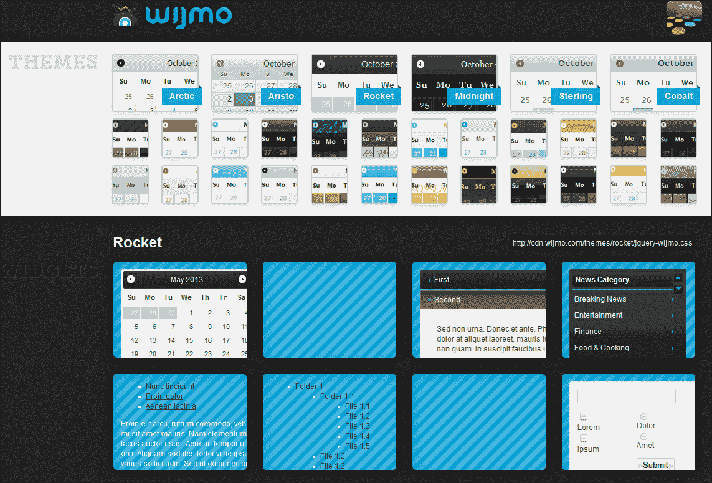
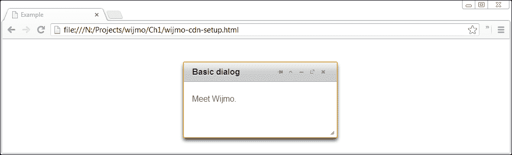
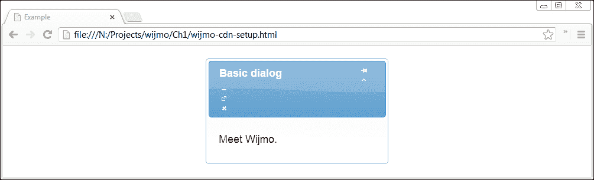
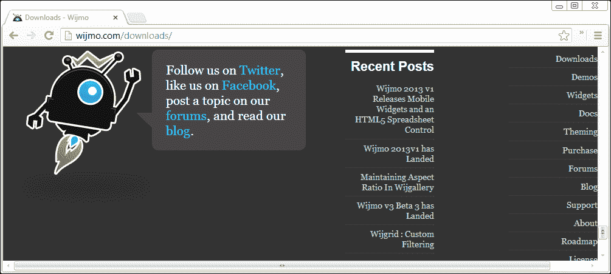
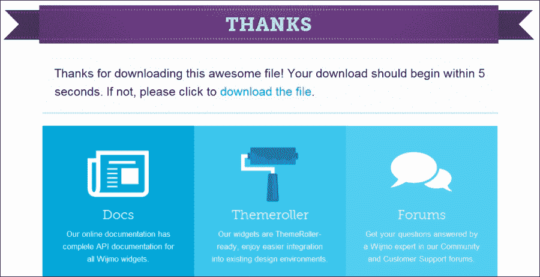

# 第一章. 使用 Wijmo 入门

Wijmo 由超过 40 个用户界面小部件组成，从表单组件到企业图表都有。所有的小部件都附带主题。Wijmo 最好的特性包括：

+   Wijmo 使用简单。它是一个包含广泛配置选项的完整小部件集。很可能 Wijmo 有一个小部件可以满足你在项目中使用的每个 UI 组件。

+   它处理了浏览器之间的实现差异。从版本 6 开始的所有 IE 版本和其他浏览器都得到支持。

+   它提供铂金级支持。尽管现场电话支持需要年度费用，但你的团队在使用 Wijmo 的时候永远不会陷入困境或遇到停机时间。

+   它是开源的，并且托管在 GitHub 上的一个仓库中，拥有开源应用程序的 GPL 许可。

并非所有事物都是完美的。Wijmo 也存在其粗糙的边缘。在这本书中，我指出了其中的陷阱并引导你绕过它们。从这本书中学习的益处在于你不会犯我犯过的错误。学习 Wijmo 使得网页开发变得更加简单、快捷和有趣。

# 设置 Wijmo

与 jQuery UI 相比，下载和安装 Wijmo 只需要多几个步骤。它有一个内容分发网络上的文件，可以快速开始。对于这本书，建议下载并设置开发所需的文件。由于 Wijmo 是基于 jQuery UI 构建的，所以我包括了获取和自定义 jQuery UI 的详细信息。本章还涵盖了如何在生产环境中安装精简文件。

## 通过 CDN 快速安装 Wijmo

jQuery 和 jQuery UI 都由 Google 和 Microsoft 在他们的 **内容分发网络**（**CDNs**）上托管。Microsoft 服务托管标准的 jQuery UI 主题以及 JavaScript。要使用 CDN，你需要首先找到你想要文件的 URL。Microsoft 在 [asp.net/ajaxlibrary/cdn.ashx](http://asp.net/ajaxlibrary/cdn.ashx) 页面上列出了他们托管的库。如果你点击目录下的 jQuery UI 版本，会列出几个版本。点击一个版本将显示精简版和常规版本的 URL。例如，jQuery UI 1.10.2 的以下 URL：

[`ajax.aspnetcdn.com/ajax/jquery.ui/1.10.2/jquery-ui.min.js`](http://ajax.aspnetcdn.com/ajax/jquery.ui/1.10.2/jquery-ui.min.js)

页面还有一个关于该版本所有主题的精美视觉画廊，每个主题下方都有 CSS 主题的 URL。**Cupertino** 的 URL 是：

[`ajax.aspnetcdn.com/ajax/jquery.ui/1.10.2/themes/cupertino/jquery-ui.css`](http://ajax.aspnetcdn.com/ajax/jquery.ui/1.10.2/themes/cupertino/jquery-ui.css)

然而，鼓励读者从 Wijmo 的主题中选择一个，因为它们与库的兼容性更好。Wijmo 有一个主题探索器 ([`wijmo.com/demo/themes/`](http://wijmo.com/demo/themes/))，展示了六个主题（截至版本 3.20131.1），如下面的截图所示：



火箭主题的 URL 是：

[`cdn.wijmo.com/themes/rocket/jquery-wijmo.css`](http://cdn.wijmo.com/themes/rocket/jquery-wijmo.css)

Wijmo 为每个版本提供单独的 Widgets CSS。URL 的形式为：`http://cdn.wijmo.com/jquery.wijmo-pro.all.[version].min.css`。对于本书编写时的版本，形式为：[`cdn.wijmo.com/jquery.wijmo-pro.all.3.20131.1.min.css`](http://cdn.wijmo.com/jquery.wijmo-pro.all.3.20131.1.min.css)。

Wijmo 的 JavaScript 文件遵循类似的格式：

+   [`cdn.wijmo.com/jquery.wijmo-open.all.3.20131.1.min.js`](http://cdn.wijmo.com/jquery.wijmo-open.all.3.20131.1.min.js)

+   [`cdn.wijmo.com/jquery.wijmo-pro.all.3.20131.1.min.js`](http://cdn.wijmo.com/jquery.wijmo-pro.all.3.20131.1.min.js)

要通过 CDN 使用 Wijmo，这些 URL 必须放置在脚本和链接元素中，如下所示：

```js
<!DOCTYPE HTML>
<html>
<head>
  <title>Example</title>
  <!--jQuery References-->
  <script src="img/jquery-1.9.1.min.js" type="text/javascript"></script>
  <script src="img/jquery-ui.min.js" type="text/javascript"></script>
  <!--Wijmo Widgets JavaScript-->
  <script src= "http://cdn.wijmo.com/jquery.wijmo-open.all.3.20131.1.min.js" type="text/javascript"></script>
  <script src= "http://cdn.wijmo.com/jquery.wijmo-pro.all.3.20131.1.min.js" type="text/javascript"></script>
  <!--Theme-->
  <link href="http://cdn.wijmo.com/themes/aristo/jquery-wijmo.css"rel="stylesheet" type="text/css" />
  <!--Wijmo Widgets CSS-->
  <link href="http://cdn.wijmo.com/jquery.wijmo-pro.all.3.20131.1.min.css"rel="stylesheet" type="text/css" />
  <script id="scriptInit" type="text/javascript">
    $(document).ready(function () {
      $('#dialog').wijdialog({
        autoOpen: true,
        captionButtons: {
          refresh: { visible: false }
        }
      });
    });
  </script>
</head>
<body>
  <div id="dialog" title="Basic dialog">
    <p>Meet Wijmo.</p>
  </div>
</body>
</html>
```

如果 Wijmo CDN 文件已正确添加，你应该会看到一个具有标准最小化、展开和关闭按钮的“窗口”，如下截图所示：



当浏览器加载 JavaScript 或 CSS 文件时，它们会检查文件是否在缓存中。如果用户已经在他的机器上有一个缓存的版本，那么浏览器将从缓存中加载而不是下载内容。通过 CDN 提供 jQuery 可能会减少用户的下载大小。然而，Wijmo 和 jQuery UI 库在 Web 开发中使用的频率较低，因此它们不太可能被缓存。与从 CDN 加载完整的库相比，如下一节所述，仅创建包含项目中使用的组件的自定义下载可以减少大小。因此，你的 Web 应用程序将加载得更快。

## 为开发安装 Wijmo

jQuery UI 有五个主要的功能区域。你可以创建一个只包含你 Web 应用程序所需功能的自定义下载，从而为浏览器下载生成更小的库。

为了避免使用 jQuery UI 主题的陷阱，建议完全避免在[`jqueryui.com`](http://jqueryui.com)上的 ThemeRoller。如果 Wijmo 配置了如 Redmond 之类的 jQuery UI 主题，截图中将显示一些怪异现象：



### 下载自定义的 jQuery UI

jQuery UI 下载页面[`jqueryui.com/download/`](http://jqueryui.com/download/)允许您选择您项目所需的功能，以创建一组更小的文件供浏览器下载。这通常比使用 CDN 更好，因为 jQuery UI 每年都有许多版本发布，您的项目使用与浏览器已下载的相同版本的可能性很低。对于本书，请使用默认选项下载 jQuery UI 1.10.2。稍后，您可能希望取消选择不使用的功能，并查看您的项目是否仍然可以正常工作。

当自定义 jQuery UI 库时，依赖关系会为您整理好。当一个组件被启用时，其依赖关系会自动选择。当您最小化生产文件时，请记住，大多数效果以及一些交互和控件可能不是必需的。例如，在手风琴和对话框小部件中只使用了**滑动效果**。如果您的项目只使用这些小部件，那么其他效果就不必要了。

### 下载 Wijmo

首先，前往[`wijmo.com/downloads/`](http://wijmo.com/downloads/)并滚动到页面底部。右侧有一个导航面板，其中包含**下载**链接，如下截图所示：



这将加载**下载**页面，该页面包含将 Wijmo 包含到您的项目中的各种方法，以及底部的一个介绍性视频**开始使用 Wijmo**。点击**免费试用**按钮下载 Wijmo Professional。许可选项以及功能比较图表在本章末尾。点击**免费试用**按钮后，如果您是新用户，则需要注册一个账户。一旦您用新账户登录，您将看到一个下载库的链接，您将能够看到以下截图所示的屏幕：



您会注意到在`Wijmo`文件夹中有个别组件和功能的 JavaScript 和 CSS 文件。当您想要减小生产下载的大小的时候，它们可能会有所帮助。由于只能从网站下载 Wijmo 的当前版本，因此您可能想要保留下载的备份。

### 安装 jQuery UI 用于开发

在 jQuery UI 下载中，既有用于生产的压缩文件，也有用于开发的未压缩源代码。使用开发版本可以轻松调试，因为您不需要逐行查看压缩代码。为了设置您的开发环境，将文件`js\jquery-ui-1.10.2.custom.js`和`js\jquery-1.9.1.js`复制到`lib`文件夹中。

### 安装 Wijmo 用于开发

与 jQuery UI 下载类似，Wijmo 下载包含你开发和生产所需的所有文件。对于本书，我们将使用 Wijmo Professional 中的功能。Wijmo Professional 依赖于 Wijmo Open 中的组件。你需要将以下文件从 Wijmo 下载复制到`lib`文件夹中：

+   `js\jquery.wijmo-open.3.20131.2.all.js`

+   `js\jquery.wijmo-pro.all.3.20131.2.js`

+   `css\jquery.open.css`

+   `css\jquery.wijmo-pro.3.20131.2.css`

+   `css\images`

+   `Themes\rocket\jquery-wijmo.css`

+   `Themes\rocket\images`

在复制主题图像时，合并文件夹内容。请注意，CSS 中的图像路径是相对的，只要你有与 CSS 文件相同的目录中的文件夹，它们就会正常工作。Wijmo Professional 文件包括已下载的发布版本的版本号。这些版本号会随着每个版本而变化，而图像和主题文件相对静态。截至 2013 年初，版本号为 3.20131.2。只需将其替换为本书其余部分的版本号，或者只需使用版本 3.20131.2。

### 将 Wijmo 添加到 HTML 文档中

剩下的就是将 Wijmo 添加到你的 HTML 文档中。你可以通过将`script`和`link`元素添加到`lib`文件夹中的文件来实现，如下所示：

```js
<!DOCTYPE HTML>
<html>
<head>
  <title>Example</title>
  <!--jQuery References-->
  <script src="img/jquery-1.9.1.js" type="text/javascript"></script>
  <script src="img/jquery-ui.custom.js" type="text/javascript"></script>
  <!--Wijmo Widgets JavaScript-->
  <script src="img/jquery.wijmo-open.3.20131.2.all.js" type="text/javascript"></script>
  <script src="img/jquery.wijmo-pro.all.3.20131.2.js" type="text/javascript"></script>
  <!--Theme-->
  <link href="../lib/jquery-wijmo.css" rel="stylesheet" type="text/css" />
  <!--Wijmo Widgets CSS-->
  <link href="../lib/jquery.wijmo-open.3.20131.2.css" rel="stylesheet" type="text/css" />
  <link href="../lib/jquery.wijmo-pro.3.20131.2.css" rel="stylesheet" type="text/css" />
  <script id="scriptInit" type="text/javascript">
    $(document).ready(function () {
      $('#dialog').wijdialog({
        autoOpen: true,
        captionButtons: {
          refresh: { visible: false }
        }
      });
    });
  </script>
</head>
<body>
  <div id="dialog" title="Basic dialog">
    <p>Click OK to close this window.</p>
  </div>
</body>
</html>
```

## Wijmo 许可

Wijmo Open 受 MIT 和 GPL 的双重许可。MIT 许可证允许你以任何方式使用软件，只要保留版权归属。Wijmo Open 是 jQuery UI 的扩展，具有更多小部件和选项。Wijmo Open 中包含但 jQuery UI 中没有的一些小部件包括：

+   展开器

+   单选按钮

+   文本框

+   下拉菜单

+   复选框

+   列表

+   弹出

+   分隔符

+   超级面板

+   视频播放器

下面提到了 jQuery UI 和 Wijmo 之间的差异，展示了哪些功能在两者中都存在或只存在于其中之一。

Wijmo Professional 旨在为开发封闭源代码项目的企业使用。它包括 Wijmo Open 中的所有内容，以及以下内容：

+   图表

+   组合框

+   数据源

+   网格

+   输入

    +   日期

    +   遮罩

    +   数字

+   媒体

    +   轮播

    +   画廊

    +   灯箱

+   分页器

+   评分

+   树

+   上传

+   向导

许可费用为每位开发者 495 美元([`wijmo.com/purchase/`](https://wijmo.com/purchase/))。然而，ComponentOne 确实为开源应用程序提供 GPLv3 许可证。

# 必要的背景

在阅读此书之前，你应该熟悉 HTML、CSS、JavaScript 和 jQuery。jQuery UI 知识不是必需的，但会是一个加分项，因为 Wijmo 在许多方面与 jQuery UI 相似。只有本书的最后一章，基于扩展 Wijmo，需要高级 CSS 和 JavaScript 知识。对 Web 开发的基本理解将帮助你完成本书。如果这一章中的示例对你来说很自然，那么你已经走在学习 Wijmo 的正确道路上。

# 摘要

到目前为止，你应该已经为开发设置了 Wijmo 的最新版本。如果没有，本书中所有示例的源代码都可在[`github.com/yuguang/wijmo_essentials`](https://github.com/yuguang/wijmo_essentials)找到。将其下载到电脑上的一个永久位置，你将能够使用所有代码。所有示例都采用 MIT 许可，因此你可以按任何你想要的方式使用它。

现在你已经在电脑上为开发设置了 Wijmo，你就可以开始探索 Wijmo 了。在下一章中，我们将深入探讨对话框小部件，并查看一些在 jQuery 版本中不可用的功能。

除了设置 Wijmo 之外，我们还涵盖了其许可细节。如果你计划在专有应用程序中使用 Wijmo 的任何完整小部件，请确保获取许可证。
