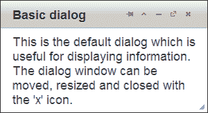
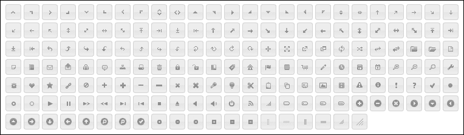
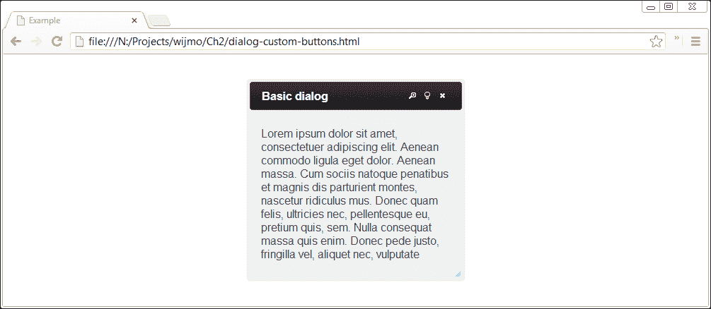
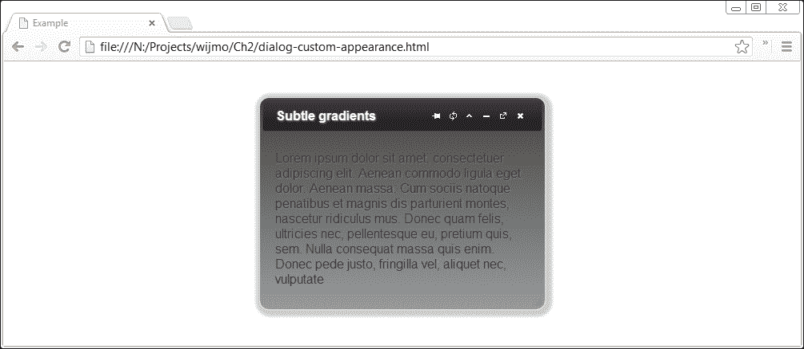
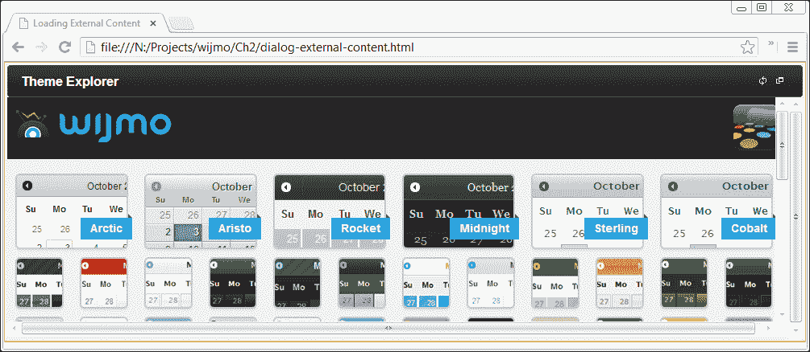

# 第二章. 对话框小部件

对话框小部件属于 Wijmo Open 集合。它是 jQuery UI 对话框的增强，具有更多功能。Wijmo 对话框可以最大化、最小化、固定到屏幕位置，并在对话框窗口中显示来自 URL 的外部内容。本章讨论了 Wijmo 中添加的选项、方法和事件，以及如何使用它们来改变对话框的外观和行为。

# Wijmo 对话框小部件的快速查看

默认情况下，对话框窗口包括固定、切换、最小化、最大化和关闭按钮。将对话框固定到屏幕上的位置会禁用标题栏上的拖动功能。对话框仍然可以调整大小。最大化对话框会使它占据浏览器窗口内的区域。切换它会使对话框展开或折叠，以便对话框内容显示或隐藏，同时标题栏保持可见。如果这些按钮影响了您的风格，可以使用 `captionButtons` 选项将其关闭。您可以从以下屏幕截图中看到对话框在浏览器中的呈现方式：



与 jQuery UI 相比，Wijmo 提供了额外的 API 来改变对话框的行为。新的 API 主要用于标题栏上的按钮和窗口堆叠管理。窗口堆叠决定了哪些窗口会绘制在其他窗口之上。点击对话框会将其置于其他对话框之上，并改变它们的窗口堆叠设置。以下表格显示了 Wijmo 中添加的选项。

| 选项 | 事件 | 方法 |
| --- | --- | --- |
| `captionButtons` `contentUrl` `disabled` `expandingAnimation` `stack` `zIndex` | `blur` `buttonCreating` `stateChanged` | `disable` `enable` `getState` `maximize` `minimize` `pin` `refresh` `reset` `restore` `toggle` `widget` |

+   `contentUrl` 选项允许您指定在窗口中加载的 URL。

+   当对话框从折叠状态切换到展开状态时，会应用 `expandingAnimation` 选项。

+   `stack` 和 `zIndex` 选项决定了对话框是否位于其他对话框之上。

+   与输入元素上的 `blur` 事件类似，当对话框失去焦点时，会触发对话框的 `blur` 事件。

+   当创建按钮时，会调用 `buttonCreating` 方法，并可以修改标题栏上的按钮。

+   `disable` 方法禁用了对话框的事件处理器。它阻止了默认按钮操作并禁用了拖动和调整大小。

+   `widget` 方法返回对话框的 HTML 元素。

+   `maximize`、`minimize`、`pin`、`refresh`、`reset`、`restore` 和 `toggle` 方法作为标题栏上的按钮提供。了解它们的功能的最佳方式是亲自尝试操作。

+   此外，`getState` 方法用于查找对话框状态，并返回最大化、最小化或正常状态。

+   类似地，当对话框状态改变时，会触发 `stateChanged` 事件。

这些方法作为 `wijdialog` 方法的参数被调用。要禁用按钮交互，传递字符串 `disable`：

```js
$("#dialog").wijdialog ("disable");
```

许多方法都是成对出现的，`enable` 和 `disable` 就是其中之一。调用 `enable` 会使按钮再次启用。另一对是 `restore`/`minimize`。`minimize` 将对话框隐藏在屏幕左下角的托盘上。`restore` 将对话框恢复到正常大小并再次显示。

对于可用性来说，最重要的选项是 `captionButtons` 选项。尽管用户可能熟悉最小化、调整大小和关闭按钮；但固定和切换按钮在常见的桌面环境中并不常见。因此，您将想要根据您在项目中使用对话框的方式选择可见的按钮。要关闭标题栏上的按钮，将 `visible` 选项设置为 `false`。可以创建一个仅包含关闭按钮的默认 jQuery UI 对话框窗口：

```js
$("#dialog").wijdialog({captionButtons: {
  pin: { visible: false },
  refresh: { visible: false },
  toggle: { visible: false },
  minimize: { visible: false },
  maximize: { visible: false }
  }
});
```

每个按钮的其他选项是 `click`、`iconClassOff` 和 `iconClassOn`。`click` 选项指定按钮的事件处理器。尽管按钮带有默认操作，但您可能希望为自定义操作使用不同的图标。这就是 `iconClass` 发挥作用的地方。`iconClassOn` 定义按钮加载时的 CSS 类。`iconClassOff` 是点击按钮后的按钮图标类。有关可用的 jQuery UI 图标及其类别的列表，请参阅 [`jquery-ui.googlecode.com/svn/tags/1.6rc5/tests/static/icons.html`](http://jquery-ui.googlecode.com/svn/tags/1.6rc5/tests/static/icons.html)。



我们的下一个示例使用 `ui-icon-zoomin`、`ui-icon-zoomout` 和 `ui-icon-lightbulb`。它们可以通过在网页上切换图标文本找到，如前一个截图所示。

## 添加自定义按钮

jQuery UI 的对话框 API 缺少配置标题栏上显示按钮的选项。Wijmo 不仅提供了有用的默认按钮，还允许你轻松地覆盖它们。

```js
<!DOCTYPE HTML>
<html>
<head>
  ...
  <style>
    .plus {
      font-size: 150%;
    }
  </style>
  <script id="scriptInit" type="text/javascript">
    $(document).ready(function () {
      $('#dialog').wijdialog({
        autoOpen: true,
        captionButtons: {
        pin: { visible: false },
        refresh: { visible: false },
        toggle: {visible: true, click: function () {
          $('#dialog').toggleClass('plus')
        }, iconClassOn: 'ui-icon-zoomin', iconClassOff:          'ui-icon-zoomout'},
        minimize: { visible: false },
        maximize: {visible: true, click: function () {
        alert('To enloarge text, click the zoom icon.')
        }, iconClassOn: 'ui-icon-lightbulb'},
        close: {visible: true, click: self.close, iconClassOn:'ui-icon-close'}
        }
      });
    });
  </script>
</head>
<body>
  <div id="dialog" title="Basic dialog">
    <p>Loremipsum dolor sitamet, consectetueradipiscingelit. Aeneancommodo ligula eget dolor.Aeneanmassa. Cum sociisnatoquepenatibusetmagnis dis parturient montes, nasceturridiculus mus. Donec quam felis, ultriciesnec, pellentesqueeu, pretiumquis, sem. Nullaconsequatmassaquisenim. Donecpedejusto, fringillavel, aliquetnec, vulputate</p>
  </div>
</body>
</html>
```

我们通过传递 `captionButtons` 选项创建对话框窗口。固定、刷新和最小化按钮的 `visible` 设置为 `false`，以便标题栏初始化时不包含它们。最终输出如图所示：



此外，切换和最大化按钮已被修改并赋予了自定义行为。切换按钮通过应用或移除 CSS 类来切换文本的字体大小。其默认图标，通过 `iconClassOn` 设置，表示点击它将放大文本。一旦点击，图标将变为缩小图标。同样，最大化按钮的行为和外观也已被更改。在标题栏之前显示最大化图标的位置，现在有一个带有提示的灯泡图标。

虽然这种方法在标题栏中添加新按钮看起来有些笨拙，但目前 Wijmo 提供的唯一选项。在内容区域添加按钮要简单得多。`buttons`选项指定要在标题栏下显示在对话框窗口内容区域的按钮。例如，要显示一个简单的确认按钮：

```js
$('#dialog').wijdialog({buttons: {ok: function () {
  $(this).wijdialog('close')
}}});
```

按钮上显示的文本是`ok`，点击按钮会隐藏对话框。调用`$('#dialog').wijdialog('open')`将再次显示对话框。

## 配置对话框小部件的外观

Wijmo 提供了几个选项来改变对话框的外观，包括标题、高度、宽度和位置。对话框的标题可以通过设置对话框的`div`元素的`title`属性或使用`title`选项来更改。要更改对话框的主题，您可以在`wijmo-wijdialog`和`wijmo-wijdialog-captionbutton`类上使用 CSS 样式：

```js
<!DOCTYPE HTML>
<html>
<head>
  ...
  <style>
    .wijmo-wijdialog {

      /*rounded corners*/
      -webkit-border-radius: 12px;
      border-radius: 12px;
      background-clip: padding-box;

      /*shadow behind dialog window*/
      -moz-box-shadow: 3px 3px 5px 6px #ccc;
      -webkit-box-shadow: 3px 3px 5px 6px #ccc;
      box-shadow: 3px 3px 5px 6px #ccc;

      /*fade contents from dark gray to gray*/
      background-image: -webkit-gradient(linear, left top, left bottom, from(#444444), to(#999999));
      background-image: -webkit-linear-gradient(top, #444444, #999999);
      background-image: -moz-linear-gradient(top, #444444, #999999);
      background-image: -o-linear-gradient(top, #444444, #999999);
      background-image: linear-gradient(to bottom, #444444, #999999);

      background-color: transparent;

      text-shadow: 1px 1px 3px #888;

    }
  </style>
  <script id="scriptInit" type="text/javascript">
    $(document).ready(function () {
      $('#dialog').wijdialog({width: 350});
    });
  </script>
</head>
<body>
  <div id="dialog" title="Subtle gradients">
    <p>Loremipsum dolor sitamet, consectetueradipiscingelit. Aeneancommodo ligula eget dolor.Aeneanmassa. Cum sociisnatoquepenatibusetmagnis dis parturient montes, nasceturridiculus mus. Donec quam felis, ultriciesnec, pellentesqueeu, pretiumquis, sem. Nullaconsequatmassaquisenim. Donecpedejusto, fringillavel, aliquetnec, vulputate
    </p>
  </div>
</body>
</html>
```

现在我们向对话框添加圆角框、框阴影和文本阴影。这是通过`.wijmo-wijdialog`类完成的。由于许多 CSS3 属性在不同浏览器上的名称不同，因此使用了浏览器特定的属性。例如，在基于 Webkit 的浏览器上需要`-webkit-box-shadow`。初始化时将对话框宽度设置为 350 px，以便标题文本和按钮都适合一行。



## 加载外部内容

Wijmo 使在 iFrame 中加载内容变得简单。只需传递带有`contentUrl`选项的 URL：

```js
$(document).ready(function () {
  $("#dialog").wijdialog({captionButtons: {
    pin: { visible: false },
    refresh: { visible: true },
    toggle: { visible: false },
    minimize: { visible: false },
    maximize: { visible: true },
    close: { visible: false }
    },
  contentUrl: "http://wijmo.com/demo/themes/"
  });
});
```

这将在带有刷新和最大化/还原按钮的对话框窗口中加载 Wijmo 主题探索器。以下截图显示了此输出：



刷新按钮会重新加载 iFrame 中的内容，这对于动态内容很有用。最大化按钮会调整对话框窗口的大小。

# 摘要

Wijmo 对话框小部件是 jQuery UI 对话框的扩展。在本章中，探讨了 Wijmo 对话框小部件的独特功能，并给予了重点介绍。我向您展示了如何添加自定义按钮，如何更改对话框外观，以及如何在对话框中从其他 URL 加载内容。
