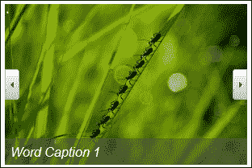
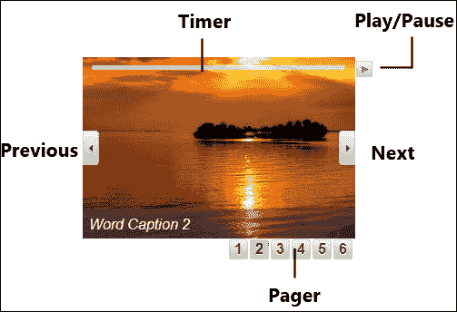
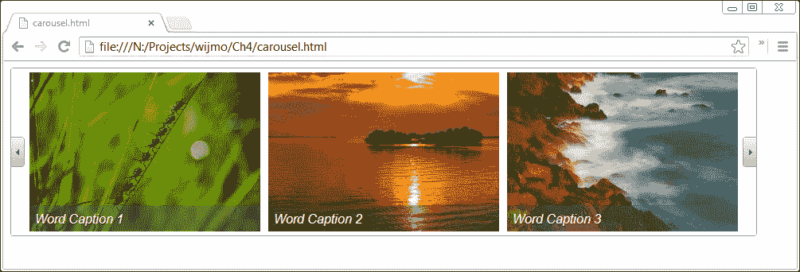
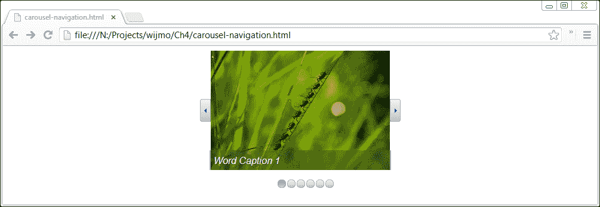
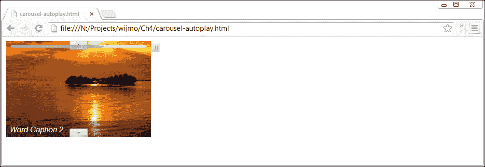
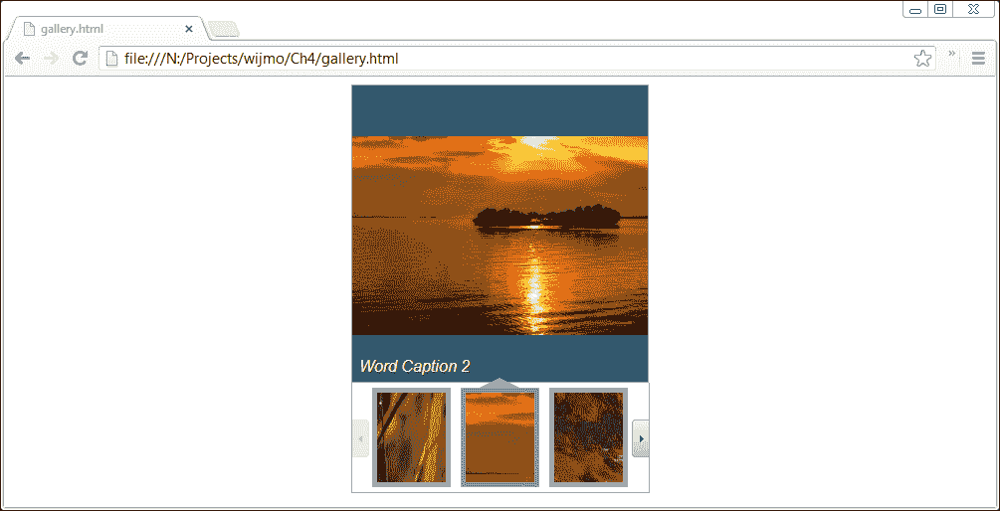
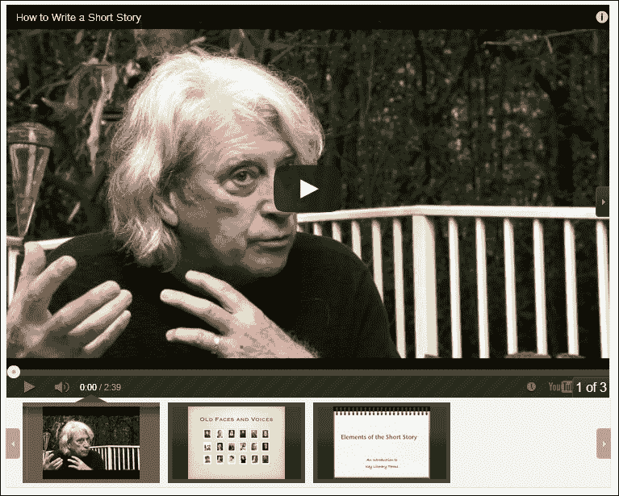
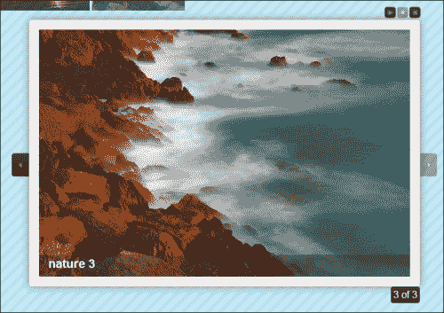

# 第四章 处理图片

本章介绍了用于处理图片的小部件：**轮播**、**相册**和**灯箱**。轮播是相册组件的简化形式，默认情况下没有缩略图。它们都用于在页面上显示一系列图片。轮播旨在一次显示多张图片。灯箱的工作方式不同，它以全尺寸显示选定的图片，并在页面内容上方打开对话框。

# 使用轮播组件

轮播组件显示一系列图片。默认情况下，图片水平排列，带有上一页和下一页按钮以滚动浏览。可以在每张图片的底部显示标题。在接下来的部分中，我将向您展示如何创建、配置和使用轮播组件。

## 创建轮播组件

要设置轮播组件，容器元素的宽度和高度需要与图片尺寸相同。例如，如果您的图片尺寸为 300 x 200，那么在 CSS 中需要设置如下：

```js
<!DOCTYPE HTML>
<html>
<head>
  ...
  <script id="scriptInit" type="text/javascript">
    $(document).ready(function () {
      $("#wijcarousel").wijcarousel({
        orientation: "horizontal",
        display: 1
      });
    });
  </script>
  <style type="text/css">
    #wijcarousel
    {
      width: 300px;
      height: 200px;
    }
  </style>
</head>
<body>
  <div id="wijcarousel">
    <ul>
      <li>
        <span>Word Caption 1</span></li>
      <li>
        <span>Word Caption 2</span></li>
      <li>
        <span>Word Caption 3</span></li>
      <li>
        <span>Word Caption 4</span></li>
      <li>
        <span>Word Caption 5</span></li>
      <li>
        <span>Word Caption 6</span></li>
    </ul>
  </div>
</body>
</html>
```

使用这些设置，一次显示一张图片，图片两侧有上一页和下一页按钮，如下面的截图所示：



例子中使用的所有图片尺寸相同。这允许我们设置容器尺寸而无需裁剪或调整图片大小。

## 配置轮播组件

轮播组件支持许多设置，让您可以控制用户界面中可用的功能以及其显示。以下是最有用的设置：

| Setting | 描述 |
| --- | --- |
| `display` | 此设置指定显示的图片数量 |
| `step` | 此设置指定过渡时滚动的图片数量 |
| `orientation` | 此设置指定是否水平或垂直滚动图片 |
| `showTimer` | 此设置允许轮播中的图片通过显示进度和播放/暂停按钮的计时器进行播放 |
| `loop` | 此设置允许循环浏览图片，以便最后一张图片返回到第一张 |

以下图示显示了轮播组件的不同部分：



## 使用显示选项显示多张图片

要使用轮播组件显示多张图片，我们需要将`wijcarousel`元素的宽度按显示图片的数量成比例增加。由于每张图片宽度为 300 像素，要一次显示两张图片，我们将显示选项设置为`2`并将元素宽度设置为 600 像素。作为另一个例子，要一次显示三张图片，我们设置显示选项和 CSS，如下所示：

```js
<!DOCTYPE HTML>
<html>
<head>
  ...
  <script id="scriptInit" type="text/javascript">
    $(document).ready(function () {
      $("#wijcarousel").wijcarousel({
        orientation: "horizontal",
        display: 3,
        step: 2
      });
    });
  </script>
<style type="text/css">
  #wijcarousel
  {
    width: 900px;
    height: 200px;
  }
</style>
</head>
<body>
  <div id="wijcarousel">
  <ul>
    <li>
      <span>Word Caption 1</span></li>
      <li>
      <span>Word Caption 2</span></li>
    <li>
      <span>Word Caption 3</span></li>
    <li>
      <span>Word Caption 4</span></li>
    <li>
      <span>Word Caption 5</span></li>
    <li>
      <span>Word Caption 6</span></li>
    </ul>
  </div>
</body>
</html>
```

如以下截图所示，将宽度设置为 900 像素为下一页和上一页按钮提供了足够的空间，这样它们就不会与图片重叠。



我们还在选项中设置了`step`属性为`2`，这样点击下一个按钮时，当前图片会向左滑动，使得其中两张图片消失。Wijmo 在将第三张图片滑入第一张图片位置时，会播放一个不错的动画。要尝试各种动画和选项，请访问[`wijmo.com/demo/explore/?widget=Carousel&sample=Animation`](http://wijmo.com/demo/
explore/?widget=Carousel&sample=Animation)。

## 指定导航选项

除了下一个和上一个按钮外，还可以添加一个分页器来导航到特定的图片。分页器有多种形式，由`pagerType`选项指定。可用选项有数字、点、缩略图和滑块。如果您想使用缩略图，我建议切换到画廊小部件，因为它默认包含缩略图。画廊小部件将在下一节中介绍。分页器以及其他元素的位置设置字段，用于确定元素之间的相对位置。

对于位置选项的视觉展示，请参考下一章中的*定位工具提示*部分。在这个例子中，我们使用`my`选项将分页器的中心顶部放置在轮播图的底部，并通过偏移量向左移动 10 像素：

```js
pagerPosition: {
  my: "center top",
  at: "center bottom",
  offset: "-10 0"
}
```

另一个使轮播图看起来更整洁的实用选项是将按钮显示在外部，而不是与图片重叠。

将所有这些放在一起，我们初始化轮播图小部件并添加分页器如下：

```js
$("#wijcarousel").wijcarousel({
  orientation: "horizontal",
  display: 1,
  showPager: true,
  pagerPosition: {
    my: "center top",
    at: "center bottom",
    offset: "-10 0"
  },
  pagerType: "dots",
  buttonPosition: "outside"
});
```

为了使轮播图居中对齐，一个常见的模式是设置宽度并让边距自动调整：

```js
#wijcarousel
{
  display: block;
  margin: 0 auto;
  width: 304px;
  height: 200px;
}
```

最终结果是用户友好的、干净的界面，如下面的截图所示：



## 添加计时器和自动播放

要让图片像幻灯片一样播放，我们只需将`auto`选项设置为`true`。结合`loop`选项，图片可以连续播放。如果您有很多图片要展示，您可能需要减少每张图片显示的间隔或持续时间。此外，`timer`选项允许用户暂停幻灯片。进行中的计时器看起来如下面的截图所示：



以下是一个示例设置，在移动到下一张图片之前，每张图片播放三秒钟：

```js
$("#wijcarousel").wijcarousel({
  orientation: "vertical",
  interval: 3000,
  loop: true,
  auto: true,
  showTimer: true,
  display: 1
});
```

# 使用画廊小部件

如同在轮播图小部件部分提到的，画廊小部件默认显示可导航的缩略图。选择一个缩略图将显示其上方的图像的大版本。

## 创建画廊小部件

如您现在可能预料到的，Wijmo 画廊小部件是通过`wijgallery`方法创建的：

```js
$("#wijgallery").wijgallery({
  thumbsDisplay: 3
});
```

这个画廊尽可能地重用了轮播图示例。对于画廊，我们只限制了容器宽度，因为它需要空间来显示缩略图：

```js
#wijgallery {
  width: 300px;
}
```

由于我们图像下方的水平区域，我们设置了缩略图的数量为 3。Wijmo 会自动裁剪图像以适应缩略图。我们的图库小部件现在看起来如下截图所示：



在示例中，我们使用了与轮播图相同的 HTML 列表格式。尽管如此，Wijmo 文档建议使用另一种格式：

```js
<div id="wijgallery">
  <ul>
    <li><a href="http://lorempixum.com/300/200/nature/1">
    
    </a></li>
    <li><a href="http://lorempixum.com/300/200/nature/2">
    
    </a></li>
    <li><a href="http://lorempixum.com/300/200/nature/3">
    
    </a></li>
    <li><a href="http://lorempixum.com/300/200/nature/4">
    
    </a></li>
    <li><a href="http://lorempixum.com/300/200/nature/5">
    
    </a></li>
    <li><a href="http://lorempixum.com/300/200/nature/6">
    
    </a></li>
  </ul>
</div>
```

虽然更冗长，但这种格式允许我们指定缩略图图像。现在每个 300 x 200 像素的图像都附有一个 100 x 100 像素的缩略图。图库小部件会自动调整图像大小以适应显示区域。如果您想在图库小部件中调整图像大小而不改变宽高比，请参考一位开发者在[`wijmo.com/maintaining-aspect-ratio-in-wijgallery/`](http://wijmo.com/maintaining-aspect-ratio-in-wijgallery/)上发表的博客文章。

## 图库小部件中的视频播放

要在图库小部件中播放视频，您只需指定视频的缩略图和链接。以下是一个包含三个视频的示例标记：

```js
<div id="wijgallery">
  <ul>
    <li><a       href="http://www.youtube.com/v/0ZNSVMaPIUQ?version=3&amp;hl=en_US">
    </a>
    </li>
    <li><a       href="http://www.youtube.com/v/4B22QGJoxZQ?version=3&amp;hl=en_US">
      </a>
    </li>
    <li><a       href="http://www.youtube.com/v/bpPMAyAxO4Q?version=3&amp;hl=en_US">
      </a>
    </li>
  </ul>
</div>
```

缩略图将在图库的底部显示。为了防止 Wijmo 裁剪缩略图，我们可以将`thumbsLength`选项设置为图像的宽度。此外，`thumbsDisplay`选项，它决定了显示的缩略图数量，需要调整。模式可以设置为`swf`用于 Flash 或其他视频类型。由于我们没有为视频指定标题，我们将`showCaption`选项设置为`false`：

```js
$("#wijgallery").wijgallery({
  thumbsDisplay: 4, 
  thumbsLength: 100, 
  mode: "swf", 
  showCaption: false 
});
```

在此示例中，假设缩略图的宽度为 100 像素。播放 Flash 视频需要额外的库。必须在调用`wijgallery`方法之前加载`swfobject.js`库。以下是一个配置为播放 YouTube 视频的 Wijmo 图库示例：



# 使用轻量级对话框小部件

轻量级对话框小部件是一个用于聚焦图像的工具。它在一个模态对话框中显示在页面其他内容之上的当前图像。Wijmo 轻量级对话框小部件与轮播图和图库小部件共享许多共同功能，包括导航按钮、计时器和标题区域。轻量级对话框带有默认设置，当鼠标悬停时显示控制按钮以及图像计数。此外，它还在右上角添加了一个关闭按钮。

## 创建轻量级对话框小部件

与图库和轮播图小部件不同，轻量级对话框需要指定`anchor`元素的`rel`属性中的选项。以下示例显示了所需的元素和创建轻量级对话框的脚本：

```js
<!DOCTYPE HTML>
<html>
<head>
...
  <script id="scriptInit" type="text/javascript">
    $(document).ready(function () {
      $("#lightbox").wijlightbox();
    });
  </script>
  <style type="text/css">
    #lightbox {
      width: 600;
    }
  </style>
</head>
<body>
  <div id="lightbox" class="">
  <a href="http://lorempixum.com/600/400/nature/1" rel="wijlightbox[stock];player=img">
  <imgsrc="img/1" title="nature 1"/></a>
  <a href="http://lorempixum.com/600/400/nature/2" rel="wijlightbox[stock];player=img">
  <imgsrc="img/2" title="nature 2"/></a>
  <a href="http://lorempixum.com/600/400/nature/3" rel="wijlightbox[stock];player=img">
  <imgsrc="img/3" title="nature 3"/></a>
  </div>
</body>
</html>
```

灯箱组件需要在锚点元素内部包含一个`img`元素。此外，`img`元素需要有一个标题，该标题将作为标题显示。如您现在所熟悉的那样，我们将灯箱的`width`属性设置为图像的宽度。当您不带设置调用`wijlightbox`方法并点击其中一张图片时，您会在页面内容上方看到一个图像框架，如下面的截图所示：


## 更改灯箱组件的外观

默认情况下，灯箱在悬停时会显示导航和关闭按钮；同时，幻灯片播放的播放/暂停按钮也可用。要显示这些按钮，请使用`ctrlButtons`选项。您可能还希望通过将`modal`选项设置为`true`来以`modal`视图显示灯箱。为了避免导航控件与图像重叠，请将`controlsPosition`属性设置为`outside`：

```js
$("#lightbox").wijlightbox({
  modal: true,
  controlsPosition: 'outside',
  ctrlButtons: 'play|stop'
});
```

结果如下所示：



# 摘要

在本章中，我们学习了轮播组件，它用于显示多个图像，以及如何使用显示和导航选项来配置它。本章还介绍了轮播组件可用的动画和计时器选项。接下来，我们学习了画廊组件及其用于播放视频的使用方法。最后，本章以灯箱组件的章节结束。
