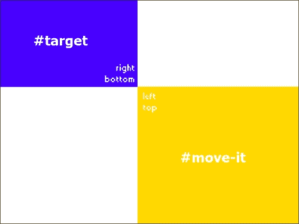
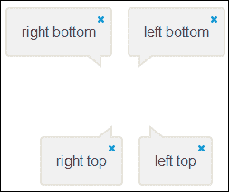
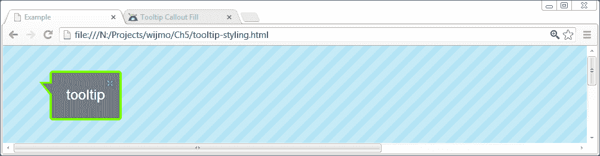
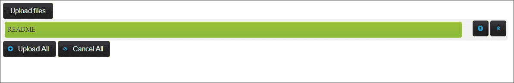
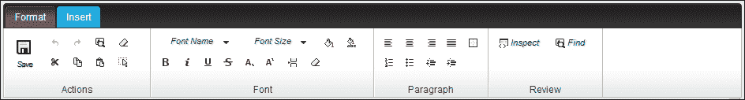
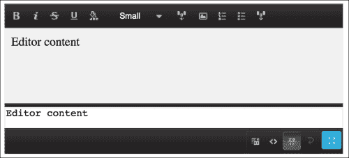

# 第五章。高级小部件

Wijmo 包含许多在 Web 开发中常用的高级小部件。这些应用程序组件通常使用库或插件实现。在本章中，我们涵盖了 tooltip、上传、视频和编辑器小部件。对于开发者来说，使用这些 Wijmo 小部件而不是其他库的主要优势是其一致的 API。对于用户来说，界面组件看起来更一致。

# 使用 tooltip 小部件

默认情况下，浏览器会在鼠标悬停在具有 title 属性的图像元素上时显示文本框或气球。为了让这些文本气球更易于用户使用，Wijmo 的 tooltip 小部件使用 JavaScript 和 CSS 来增强它们。默认情况下，Wijmo 在 tooltip 元素的 `title` 属性中显示文本。考虑一个简单的示例，包含一个输入元素：

```js
<input title="Instructions for the form go here" type="text" />
```

调用 `$("input[title]").wijtooltip()` 会在鼠标悬停在元素上时显示 tooltip。此外，jQuery 选择器仅应用于具有标题的输入元素。在本节中，我们将探讨如何定位 tooltip、在内部加载 AJAX 内容以及更改其样式。

## 定位 tooltip 小部件

Wijmo 使用 jQuery UI 的位置方法，该方法包含四个主要参数：

| 字段 | 值 | 描述 |
| --- | --- | --- |
| `my` | `left`/`right`/`center`/`top`/`bottom`/`center` | 被移动元素上的位置 |
| `at` | `left`/`right`/`center`/`top`/`bottom`/`center` | 目标元素上对齐的位置 |
| `of` | `selector` | 要定位的目标元素 |
| `offset` | `Integer` | 指定水平和垂直移动的 x y 偏移量 |

语法几乎就像一个句子。假设我们想要定位一个 ID 为 `move-it` 的框，使其左上角位于目标元素的右下角；那么我们可以使用以下方式调用 `position` 方法：

```js
$("#move-it").position({
  "my": "left top",
  "at": "right bottom",
  "of": $("#target")
});
```

以下截图显示了前面示例中的元素作为框：



jQuery UI 有一个示例页面，您可以在其中尝试不同的位置设置，[`jqueryui.com/position/`](http://jqueryui.com/position/)。

在 tooltip 的上下文中，`my` 参数指定 tooltip 箭头的位置。以下图表显示了 `my` 参数的每种配置：



tooltip 的 `at` 参数与 jQuery UI 的位置方法完全相同。

## 在 tooltip 小部件中加载 AJAX 内容

对于 tooltip，一个常用的模式是加载外部内容。Wijmo tooltip 具有用于在 tooltip 中插入内容的 `ajaxCallback` 选项。我们的示例向服务器发送请求并显示其响应。我们设置了链接的 `data-id` 属性，使其成为我们想要的内容的索引。例如，此链接指向表格中的第一个元素：

```js
<a href="#" data-id="0">link text</a>
```

由于您正在向服务器发送请求，`data-id` 将是您正在查询的表或模型中行的主键。以下代码片段演示了如何检索 AJAX 内容：

```js
$(document).ready(function () {
  $("a[data-id]").wijtooltip({
    position: { my: 'left bottom', at: 'right top' },
    ajaxCallback: function () {
      var $tooltip = this;
      $.get(url, { id: $tooltip.attr("data-id") }, function (text)
        {
          $tooltip.wijtooltip("option", "content", text);
      });
    }
  });
});
```

在 `ajaxCallback` 函数中，使用 `$tooltip.attr("data-id")` 获取与每个链接关联的 ID，它返回 `data-id` 属性的值。然后使用此 ID 获取提示信息内容，该内容通过 `$tooltip.wijtooltip("option", "content", "text")` 设置。

## 设计提示信息小部件

默认情况下，Wijmo 使用您选择的主题来设计提示信息，但我们要使提示信息从用户界面中脱颖而出。通过应用一些 CSS 类，我们可以快速将火箭主题的提示信息更改为自定义提示信息，如以下截图所示：



在设计提示信息时，想法是设置边框、背景和文字颜色，而不覆盖默认主题类，如 `.ui-container`。我们通过在提示信息类上设置颜色来实现这一点：

```js
.wijmo-wijtooltip-container {
  color: #ffffff;
  background-color: slategray;
}
  .wijmo-wijtooltip-pointer-inner {
    border-right-color: slategray !important;
}
  .wijmo-wijtooltip, .wijmo-wijtooltip-pointer {
    border: 3px solid lawngreen;
}
```

`.wijmo-wijtooltip-pointer-inner` 类应用于气泡中的尾巴，因此我们将它的背景颜色设置为与 `.wijmo-wijtooltip-container` 类相同。文字颜色也在 `.wijmo-wijtooltip-container` 类中设置。最后，我们在提示信息和指针上设置边框颜色。

为了更容易调整颜色，我设置了提示信息自动显示，并将 `closeBehavior` 选项设置为 `sticky`。使提示信息保持粘性，使其在鼠标移出 `target` 元素（在这种情况下是标签）后仍然停留在页面上。完整的示例如下：

```js
<!DOCTYPE HTML>
<html>
<head>
...

  <script id="scriptInit" type="text/javascript">
    $(document).ready(function () {
      $("[title]").wijtooltip({
      modal: true
    });
    $("[title]").wijtooltip("option","closeBehavior","sticky");
      $("[title]").wijtooltip ("show");
    });
  </script>
  <style>
    .wijmo-wijtooltip-container {
      color: #ffffff;
      background-color: slategray;
   }
    .wijmo-wijtooltip-pointer-inner {
      border-right-color: slategray !important;
   }
    .wijmo-wijtooltip, .wijmo-wijtooltip-pointer {
      border: 3px solid lawngreen;
    }
    </style>
  </head>
<body>
  <label id="tooltip" title="tooltip"></label>
</body>
</html>
```

# 使用带有 ProgressBar 元素的上传小部件

Wijmo 的 `upload` 小部件可以一次性上传多个文件，并支持进度条。文件上传使用 `HttpHandler` 减少服务器负载。



当初始化时，上传小部件只有前面截图所示的 **上传文件** 按钮。一旦选择文件，上传文件用户界面将包含 **上传文件** 按钮以打开文件浏览器，一个 **取消全部** 按钮，以及一个 **全部上传** 按钮。每个选定的文件旁边都有一个单独的上传或取消按钮。在上传过程中，上传进度在进度条元素中显示。

我们将查看一个示例，该示例涉及在网页表单中替换文件输入，其中文件上传与表单一起提交：

```js
<!DOCTYPE html>
<html>
<head>

...
<script id="scriptInit" type="text/javascript">
  $(document).ready(function () {
    varprogressbar = $("#progressbar");
    //Initializes the wijupload with file-input element.
    var upload = $("#upload").wijupload({
      totalUpload: function () {
      progressbar.show();
    },
    //Hide the progress-bar when upload action finished.
    totalComplete: function () {
      progressbar.fadeOut(1500, function () {
        if (supportXhr) {
          $("#progressbar").wijprogressbar("option", "value", 0);
        }
      });
    },
    //Get the total progress of wijupload and update the //progress-bar.
    totalProgress: function (e, data) {
      if (supportXhr) {
        $("#progressbar").wijprogressbar("option", "maxValue", data.total);
        $("#progressbar").wijprogressbar("option", "value", data.loaded);
        }
      },
      action: $("form").attr("action")
    });
    supportXhr = $("#upload").wijupload("supportXhr");
    if (supportXhr) {
      progressbar.wijprogressbar({ value: 0 });
    } 
    progressbar.hide();
  });
  </script>
  <style>
    #progressbar-container {
      height: 5em;
    }
    form {
      width: 800px;
    }
  </style>
</head>
<body>
  <form action="">
  <input id="upload" type="file" multiple/>
  <div id="progressbar-container">
  <div id="progressbar"></div>
  </div>
  </form>
</body>
</html>
```

使用 `supportXhr = $("#upload").wijupload("supportXhr")`，我们检查上传小部件是否可以与 AJAX 连接以显示文件上传进度。尽管进度条是隐藏的，但在 AJAX 连接可用时进度条会被初始化。

`upload`小部件通过三个事件处理器初始化以启用进度条。首先，当点击**上传全部**按钮时，会触发`totalUpload`事件。在这个例子中，我们显示了进度条。由于`<div id="progressbar"></div>`是一个空元素，调用 jQuery 的`show`方法不会渲染任何可见内容。接下来，当所有文件都已上传时，会触发`totalComplete`事件。我们淡出进度条并将其值设置为零，以便下次使用。最后，当文件正在上传时，为`totalProgress`定义的函数会接收到上传进度和已上传的字节数，以便在进度条中显示。上传小部件的`action`选项是表单在服务器上提交的 URL。

# 将 Wijmo 主题应用于 HTML5 视频

Wijmo 视频小部件与 HTML5 视频标签一起工作，并使用 jQuery UI 主题添加控件。视频播放器具有常见的播放/停止、音量和全屏控制。要初始化小部件，只需在视频元素上调用`wijvideo`方法。为了支持所有浏览器，视频元素需要至少以两种格式编码。每种格式的浏览器支持情况如下：

| 浏览器 | MP4 | WebM | Ogg |
| --- | --- | --- | --- |
| Internet Explorer 9+ | YES | NO | NO |
| Chrome 6+ | YES | YES | YES |
| Firefox 3.6+ | NO | YES | YES |
| Safari 5+ | YES | NO | NO |
| Opera 10.6+ | NO | YES | YES |

对于不支持 HTML5 的老旧浏览器，例如 IE8，建议不要使用视频小部件。然而，你可以插入文本内容以显示视频的替代信息。完整的标记如下：

```js
<video width="520" height="340"controls="controls">
  <source src="img/movie.mp4" type="video/mp4">
  <source src="img/movie.ogg" type="video/ogg">
    Your browser does not support the video tag.
</video>
```

如果你更改宽度或高度，视频会自动调整大小以适应区域。要初始化视频小部件，我们会调用`$("video").wijvideo()`。

# 使用编辑器小部件

Wijmo 编辑器允许非技术用户管理和编写 HTML 内容。与其他市场上的浏览器 HTML 编辑工具不同，Wijmo 具有类似于 Microsoft Office 2007 样式的功能区用户界面，如下面的截图所示：



功能区用户界面会自动调整大小以适应创建小部件的 textarea 维度，如前面的截图所示。它支持三种编辑 HTML 的视图。对于非技术用户，有一个**WYSIWYG**视图，其功能类似于 Microsoft Word。格式和布局与编辑器中看到的一模一样。此外，还有一个源代码视图，供了解 HTML 的用户使用。此外，**分割**视图是这两种视图的结合，以便 HTML 及其预览都可见。要初始化编辑器，只需在 textarea 上调用`wijeditor`方法；例如，`$("#wijeditor").wijeditor({ mode: "ribbon"})`。

## 在论坛中使用编辑器小部件与 BBCode

对于论坛和博客的使用，编辑器支持 BBCode，即如 `[url=http://example.com]Example[/url]` 这样的标签。如果使用 BBCode，源视图将以 BBCode 格式显示。编辑器必须在`bbcode`模式下初始化：

```js
<textarea id="wijeditor" style="width: 450px; height: 200px;">Editor content</textarea>
```

调用 `$("#wijeditor").wijeditor({ mode: "bbcode"})` 将生成一个带有 BBCode 控件的编辑器。

# 摘要

在本章中，我们学习了关于工具提示、上传、视频和编辑器小部件的内容。这些小部件在 Web 应用程序中常用。我们查看如何自定义工具提示样式，使其在 UI 中脱颖而出，并在其中加载 AJAX 内容。我们看到了如何使用 Wijmo 上传多个文件，同时显示进度条、视频小部件和带状风格编辑器。在下一章中，你将学习如何将 Wijmo 与 Knockout 结合使用来构建交互式用户界面。
