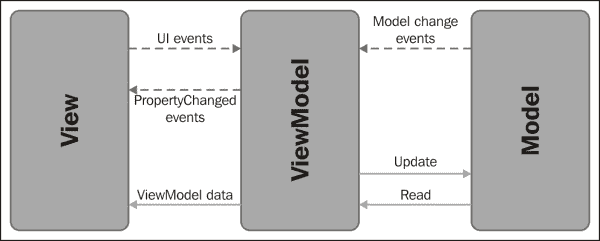
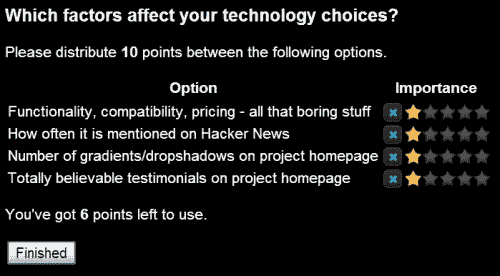
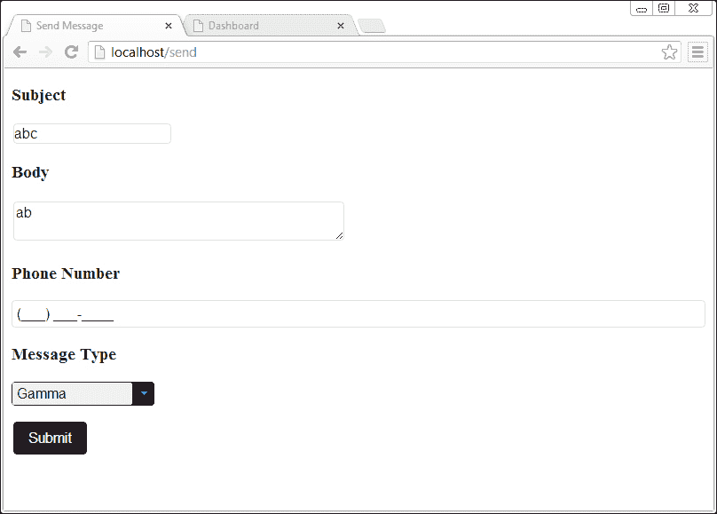
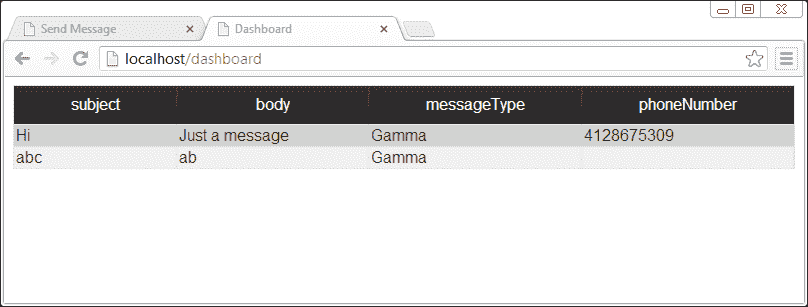

# 第六章. 带有 WijmoGrid 的仪表板

使用 jQuery UI 开发丰富的客户端应用程序会导致大量的 CSS 查询选择器和事件处理器。在本章中，你将了解另一种开发交互式用户界面的方法。Wijmo 通过插件支持这种编程范式的转变。本章将帮助你开始了解这些概念。

# Knockout 简介

现代 Web 应用程序通常使用 MVC 模式构建后端。那么前端呢？例如`Backbone.js`这样的框架会留下大量的样板代码需要编写。这在大型项目中尤为明显。这个库很轻量级，但缺乏强大的抽象。它将加载数据和 DOM 操作的任务留给了开发者。

使用**ModelViewViewModel**（**MVVM**）模式，应用程序逻辑封装在一系列 ViewModel 类中，这些类公开了一个对视图友好的对象模型。视图依赖于绑定到可观察对象来通知 ViewModel 中的变化。因此，当使用 MVVM 模式时，UI 会自动与数据刷新。MVVM 模式中的数据流在本图中展示：



从软件设计角度来看，MVVM 模式具有可测试性、关注点分离和可重用性的优势。ViewModel 不包含任何用户界面元素，这使得它易于测试。展示层保持在**View**中，使用 HTML 和 CSS，这需要与在**ViewModel**中处理业务逻辑不同的技能。ViewModel 可以在其他视图中重用，例如移动端或具有不同外观的类似应用程序。根据我自己的经验，我使用通用 ViewModel 的子类构建了两个应用程序。这两个应用程序都使用了相同的后端**Model**。

当在浏览器中使用 MVVM 模式时，Model 代表后端。它是对象和其上操作（创建、读取、更新、删除）的规范化数据存储的抽象。View 是用户界面，向用户显示信息并向 ViewModel 触发事件。ViewModel 从 Model 检索数据并通知 View 变化。此外，它接收来自 View 的 UI 事件并更新 Model 中的数据。

# Knockout 简介

**Knockout** 是一个实现 MVVM 模式的 JavaScript 库。通过使用 Knockout，你可以避免使用 jQuery 进行事件处理和 DOM 操作，而是使用声明性绑定进行工作。Knockout 提供了一套丰富的绑定，用于控制文本、外观和流程。这些包括 `foreach`、`if`、`visiblility` 和 `style` 绑定。此外，还有专门用于处理表单字段的绑定。它们可以用来处理点击事件和启用或禁用 UI 元素。这些绑定绑定到 ViewModel 中的可观察对象或 `observableArray` 对象。当可观察对象的值发生变化时，它会发出通知。Knockout 提供了一个简单的语法来读取和写入可观察对象，正如我们将看到的。同样重要的是，Knockout 会跟踪 ViewModel 变化时需要更新的 UI 的正确部分。这意味着如果你更新了一个用 `foreach` 循环渲染的 `observableArray` 对象的项，对应的 HTML 元素也会随之改变。如果一个可观察对象是从另一个可观察对象计算得出的，那么依赖关系会为你跟踪。

让我们看看如何实例化和使用一个可观察对象。为了创建一个可观察对象，我们将其分配给 ViewModel 的一个属性。

```js
varviewModel = {
  name: ko.observable('Bob')
};
```

要从可观察对象中读取，只需不带参数调用可观察对象。如果我们调用 `viewModel.name()`，则返回 "Bob"。要写入可观察对象，将新值作为参数传递给可观察对象。调用 `viewModel.name('Jeff')` 将值 `Jeff` 写入 `name`。

接下来，我们使用 `data-bind` 属性编写带有模板语言的视图：

```js
My name is <span data-bind="text: name"></span>
```

视图初始化时具有以下相同的效果：

```js
My name is <span>Bob</span>
```

最后，为了激活 Knockout，我们使用 JavaScript 将 ViewModel 层绑定到视图层：

```js
ko.applyBindings(myViewModel);
```

我们可以将它放在页面底部或 DOM 就绪函数中。

## 使用 Knockout 构建评分系统

在本节中，我们使用 Wijmo 的评分小部件构建一个评分系统。评分系统允许用户对影响他们技术选择的因素进行投票。他们总共有 10 分可以使用。**完成**按钮仅在剩余可用于使用的分数有效时才启用，如下截图所示：



要构建这个评分系统，我们利用 Wijmo 的 Knockout 绑定来使用其评分小部件。调查由一组选项组成，用户对选项进行评分。对于每个选项，我们创建一个带有绑定值的答案对象：

```js
function Answer(text) {
  this.answerText = text;
  this.points = ko.observable(1);
  this.split = ko.observable(2); // each star is split into 2 sections to allow voting by .5
}
```

`answerText` 的内容显示在 **选项** 标题下。评分是 **重要性** 标题下星星的数量。评分小部件有许多其他选项，但我们只介绍我们使用必要的那些。这些选项通过 `data-bind` 属性绑定到小部件：

```js
<div data-bind="wijrating: { value: points, split: split }"></div>
```

在我们的 ViewModel 中，有一个名为 `answers` 的选项数组和一个允许的总分数，即 `pointsBudget`。`pointsUsed` 是一个依赖的可观察对象，通过将所有答案中的分数相加来计算：

```js
function SurveyViewModel(pointsBudget, answers) {
  this.pointsBudget = pointsBudget;
  this.answers = $.map(answers, function (text) {
  return new Answer(text)
});
this.save = function () {
  alert('To do')
};

this.pointsUsed = ko.computed(function () {
  var total = 0;
  for (var i = 0; i <this.answers.length; i++)
    total += this.answers[i].points();
  return total;
}, this);
```

使用 jQuery 的 `$.map` 函数，我们可以将选项文本数组传递给 `SurveyViewModel` 类。第一个参数设置允许的总分数：

```js
newSurveyViewModel(10, [
"Functionality, compatibility, pricing - all that boring stuff",
"How often it is mentioned on Hacker News",
"Number of gradients/dropshadows on project homepage",
"Totally believable testimonials on project homepage"
])
```

由于 Knockout 是一个 MVVM 框架，我们需要使用模板语言编写视图。为了显示选项和评分小部件，我们遍历 ViewModel 中的每个答案，并显示 `answerText` 字符串和每个答案的分数，如下所示：

```js
<tbody data-bind="foreach: answers">
<tr>
  <td data-bind="text: answerText"></td>
  <td><div data-bind="wijrating: { value: points, split: split }"></div></td>
</tr>
</tbody>
```

将 `text` 绑定应用于 `answerText` 会显示其文本值，而 `wijrating` 的 `value` 绑定则以星星的形式显示。接下来，我们希望显示用户剩余的分数。这同样是通过 `text` 绑定完成的，它将数值转换为字符串：

```js
<p>You've got <b data-bind="text: pointsBudget - pointsUsed()"></b> points left to use.</p>
```

我们仅在 `pointsUsed` 的值不超过在 SurveyViewModel 中设置的值时启用 **提交** 按钮。在这种情况下，它是 `10`。`click` 绑定将 SurveyViewModel 中的 `save` 动作分配给按钮的 `click` 事件：

```js
<button data-bind="enable: pointsUsed() <= pointsBudget, click: save">Finished</button>
```

为了初始化用户界面，我们通过调用 `ko.applyBindings` 并传递一个 `SurveyViewModel` 对象来将 ViewModel 绑定到 HTML 上。将所有这些放在一起，评分系统只有几行 JavaScript 代码，并且没有 DOM 操作。关于本例的完整源代码，请参考 Packt 网站上提供的可下载代码包。请注意，除了常用的 Wijmo 导入之外，我们还添加了 Knockout 库和 Wijmo 绑定，其中包括 `wijrating`。

现在你已经知道了如何使用 MVVM 设计模式构建用户界面，我们将继续构建一个包含表单和网格的更完整的应用程序。

# 构建仪表板

本章的其余项目基于一个移动分页应用程序。该应用程序允许向寻呼机发送消息，并在仪表板上显示所有消息。仪表板中的消息会实时更新，并且可以按列标题排序。在实际应用中，仪表板中显示的消息将进行分页，并且对每一列的排序都会向服务器发送 AJAX 请求。Wijmo 已经有一个使用 Grid 小部件完成此操作的示例，我们也将在我们的项目中使用它。我们的项目介绍了使用 MVVM 模式设置实时消息平台的基础。数据不会持久化到数据库中。然而，表单提交会通过 WebSocket 实时发送到仪表板。完成本章后，我鼓励你查看 [`wijmo.com/grid-with-knockout-viewmodel-loading-remote-data/`](http://wijmo.com/grid-with-knockout-viewmodel-loading-remote-data/)。

## 使用 Knockout 和 Socket.IO 发送消息

**发送消息**页面是一个表单，允许用户提交带有主题、正文、电话号码和消息类型的消息。我们使用 Knockout 提供的绑定和 Wijmo 提供的绑定组合来构建这个表单。首先，让我们从主题和正文开始。由于 Wijmo 的 textbox 小部件没有用于输入值的绑定，我们使用 Knockout 的`value`绑定。这个绑定可以用在`<input>`、`<select>`和`<textarea>`元素上，并将元素的值与 ViewModel 中的属性链接：

```js
<ul class="formdecorator">
  <li>
    <h3> Subject </h3>
    <input id="text1" type="text" data-bind="value: subject"/>
  </li>

  <li>
    <h3> Body </h3>
    <textarea id="textarea1" rows="2" cols="50" data-bind="value: body"></textarea>
  </li>
</ul>
```

为了使这些元素使用与表单其余部分相同的样式，我们用 textbox 小部件装饰它们。这是为了样式化元素，因为 HTML 中的视图包含绑定：

```js
$('#text1,#textarea1').wijtextbox();
```

在我们的 ViewModel 中，我们将`subject`和`body`字段初始化为带有空字符串的可观察对象：

```js
varViewModel = function () {
  this.subject = ko.observable('');
  this.body = ko.observable('');
};
```

在看到`subject`和`body`字段是如何实现之后，你可能希望直接使用`wijtextbox`绑定，如下面的演示所示，但这不起作用：

```js
<ul class="formdecorator">
  <li>
    <h3> Subject </h3>
    <input id="text1" type="text" data-bind="wijtextbox: 
      {value: subject}"/>
  </li>
  <li>
    <h3> Body </h3>
    <textarea id="Textarea1" rows="2" cols="50" databind="wijtextbox:{value: body}">
    </textarea>
  </li>
</ul>
```

虽然 Knockout 有`value`绑定，但`wijtextbox`绑定纯粹用于展示。有关每个绑定的支持选项列表，请参阅[`wijmo.com/wiki/index.php/Using_Wijmo_with_Knockout`](http://wijmo.com/wiki/index.php/Using_Wijmo_with_Knockout)。只有页面上列出的选项支持双向绑定，而其他小部件选项仅用于初始化。在下一步中，我们使用 Wijmo 绑定来处理电话号码和消息类型表单组件：

```js
<li>
  <h3> Phone Number </h3>
  <input data-bind="wijinputmask: 
    { text: phoneNumber, mask: '(999) 000-0000' }" />
</li>

<li>
  <h3> Message Type </h3>
  <input data-bind="wijcombobox: 
    { text: messageType, data: messageTypes }"/>
</li>
```

`wijinputmask`绑定使用模式`(___) ___-____`初始化一个`WijmoInputMask`小部件。`text`选项将其绑定到 ViewModel 中的`phoneNumber`可观察对象。`wijcombobox`小部件作为消息类型的下拉菜单。`data`选项设置`messageTypes`为可用。由于消息类型只读不写，我们将它放在 ViewModel 之外的范围。ViewModel 层之外的对象更改不会影响 UI。稍后，我们将 ViewModel 对象提交到服务器，将消息类型等额外数据放在 ViewModel 层之外简化了代码。Wijmo 的 ComboBox 接受一个包含标签和值的对象数组，用于数据选项。`label`属性是显示的文本，而`value`将被存储在`messageType`可观察对象中。

```js
varmessageTypes = $.map(["Alpha", "Beta", "Gamma"], function (type) {
  return {label: type, value: type}
});
```

要将消息类型初始化为`Gamma`，我们在可观察对象中设置它：

```js
varViewModel = function () {
  this.subject = ko.observable('');
  this.body = ko.observable('');
  this.messageType = ko.observable('Gamma');
  this.phoneNumber = ko.observable('');
};
```

最后，表单上剩下的最后一个项目是一个提交按钮，该按钮使用 WebSocket 对象将数据发送到服务器。对于这部分，我们将使用 Socket.IO。要设置 `So` `cket.IO`，从 [`nodejs.org/download/`](http://nodejs.org/download/) 下载并安装 `Node.JS`，然后在命令行上运行 `npm install socket.io`。这将使当 `Node.JS` 服务器运行时，浏览器中可用的路径为 `/socket.io/socket.io.js`。在服务器上，`Socket.IO` 监听消息事件并将其广播为新闻。`emit` 函数向所有客户端广播，除了发送消息的那个客户端：

```js
io.sockets.on('connection', function (socket) {
  socket.on('message', function (data) {
  socket.broadcast.emit('news', data);
  });
});
```

在浏览器中，通过调用 `io.connect('http://localhost')` 创建到 `localhost` 的 WebSocket 连接。`submit` 函数向服务器发送消息事件：

```js
varViewModel = function () {
...
  this.submit = function () {
    socket.emit('message', ko.toJSON(viewModel));
  }
};
```

`ko.toJSON` 将 ViewModel 数据转换为 JSON。JSON 包括所有可观察项。提交按钮通过点击绑定绑定到该方法：

```js
<li>
  <button id="Button1" data-bind="click: submit">
    Submit
  </button>
</li>
```

为了装饰按钮，调用 `$('button').button()`。jQuery UI 按钮方法以与其他小部件相同的方式样式化提交按钮。您可能会问，为什么不直接编写视图，以便在绑定中应用 jQuery UI 按钮呢？在理想的世界中，以下代码将有效：

```js
<button id="Button1" data-bind="button: { click: submit }">
  Submit
</button>
```

然而，Wijmo 不支持将 `click` 事件绑定到按钮小部件上。因此，我们使用 Knockout 的原生 `click` 绑定和 jQuery UI 的 `button` 方法。

为了使视图层和 ViewModel 层协同工作，我们将绑定应用到 HTML 上：

```js
varviewModel = new ViewModel();
ko.applyBindings(viewModel);
```

使用火箭主题，**发送消息**页面看起来如下截图所示：



## 在仪表盘上显示消息

我们为仪表盘页面创建的 ViewModel 类很简单。它由一个消息对象的 `observableArray` 组成。当您想要检测和响应用户对象集合中的变化时，`observableArray` 非常有用。由于仪表盘上的消息不可编辑，因此每个消息对象的属性不需要是可观察的。每个消息包含 `subject`、`body`、`messageType` 和 `phoneNumber` 字符串：

```js
varviewModel = {
  data: ko.observableArray([
    {"subject": "Hi", "body": "Just a message", "messageType": "Gamma", "phoneNumber": "4128675309"}
  ])
};
```

当从服务器接收到更新时，消息被添加到 ViewModel 中。数据以文本形式接收，就像 AJAX 响应一样。因此，`JSON.parse` 方法将其转换为 `message` 对象：

```js
var socket = io.connect('http://localhost');
socket.on('news', function (data) {
  viewModel.data.push(JSON.parse(data));
});
```

在前面的代码中，与服务器建立了一个 WebSocket 连接，允许双向通信。然而，我们只为仪表盘监听来自服务器的事件。

我们的视图层只是一个表格。Wijmo 使得显示表格数据变得如此简单，我们只需要 `wijgrid` 绑定以及一个基本选项 `data` 来使其动态化。`data` 选项接受一个 `wijdatasource` 小部件、一个数组或一个 DOM 表格作为参数。`wijdatasource` 可以用于从远程源动态加载数据，包括过滤和排序。由于我们的应用程序在模型中没有数据库，我们通过 `observableArray` 将其传递给 `data` 选项：

```js
<table id="dataGrid" data-bind="wijgrid: { data: data, allowSorting: true }">
</table>
```

为了增强功能，`allowSorting` 被设置为点击列标题时按该列排序表格。`wijgrid` 绑定负责在 ViewModel 数据变化时更新表格。正如你现在所熟悉的，我们缺少一个将视图和 ViewModel 连接起来的关键部分：`ko.applyBindings(viewModel)`。这完成了仪表板的设置，结果如下截图所示：



仪表板最初只加载第一条消息。当提交 **发送消息** 页面时，另一条消息将被插入其下方。

# 摘要

Wijmo 与 Knockout 结合使用，使得编程交互式应用程序变得简单。在评分系统示例中，我们看到了从其他可观察对象计算得出的可观察对象是如何工作的。我们使用一个依赖可观察对象来计算每个评分变化时使用的总点数。在仪表板示例中，我们构建了一个由服务器使用 Wijmo 网格小部件更新的动态表格。此外，我们还编写了发送消息页面，以结合使用 Wijmo 小部件和 Knockout 绑定。下一章将介绍使用 Wijmo Mobile 进行移动网页开发。
