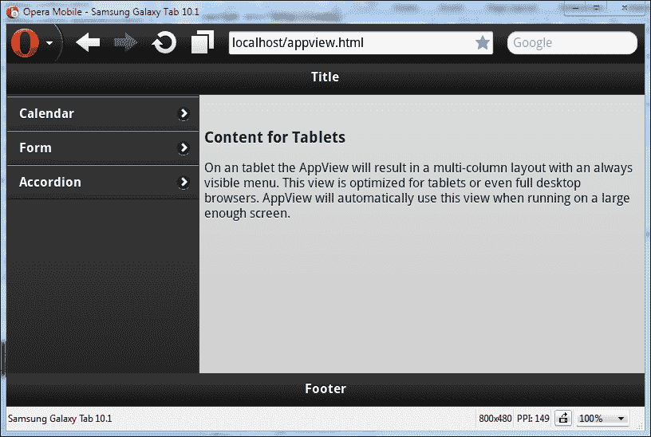
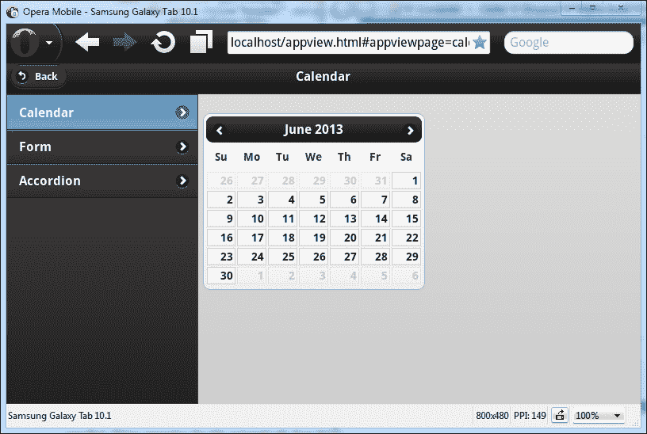

# 第七章 Wijmo 移动端

在 2013 年版本中引入的适应性小部件可以在桌面和移动 Web 应用程序中使用。在本章中，我们快速浏览 Wijmo 移动端：设置、简单小部件和视图。特别是，我们关注 AppView，这是 Wijmo 的适应性超级小部件，允许您为移动和桌面浏览器使用相同的页面。

# 开始使用 Wijmo 移动端

在本节中，我将向您展示如何启用 Wijmo 的移动端小部件。我们通过获取 jQuery 移动端和创建小部件的步骤进行操作。Wijmo 移动端小部件是 jQuery 移动端小部件的扩展。我还解释了 jQuery 移动端在创建移动端小部件时采取的不同方法。

## 设置 Wijmo 移动端

由于 Wijmo 移动端是基于 jQuery 移动端构建的，我们将首先获取并安装 jQuery 移动端。

### 获取 jQuery 移动端

您需要将之前设置中使用的 jQuery UI 库替换为 jQuery 移动端库，该库可在[`jquerymobile.com/download/`](http://jquerymobile.com/download/)下载。jQuery 移动端也有类似 jQuery UI 的 Theme Roller。默认主题包含在 jQuery 移动端包中。如果您想创建自定义主题，可以在[`jquerymobile.com/themeroller/`](http://jquerymobile.com/themeroller/)进行操作。

### 安装 jQuery 移动端

您需要将以下项目从 jQuery 移动端下载复制到`lib`文件夹中：

+   `jquery.mobile-1.3.1.min.js`文件

+   用于 CSS 样式的`jquery.mobile-1.3.1.min.css`文件

+   jQuery 移动端图标目录

一旦文件就位，就可以创建一个移动端页面。在以下代码片段中，我展示了使用 jQuery 移动端的一个示例页面的内容：

```js
<!DOCTYPE HTML>
<HTML>
<head>
<meta name="viewport" content="width=device-width"/>
<!--jQuery References-->
<script src="img/jquery-1.9.1.js" type="text/javascript"></script>
<script src="img/jquery.mobile-1.3.1.min.js" type="text/javascript"></script>
<!--Wijmo Widgets JavaScript-->
<script src="img/jquery.wijmo-open.all.3.20131.2.js" type="text/javascript"></script>
<script src="img/jquery.wijmo-pro.all.3.20131.2.js" type="text/javascript"></script>
<!--Theme-->
<link href="../lib/jquery.mobile-1.3.1.min.css" rel="stylesheet" type="text/css"/>
<!--Wijmo Widgets CSS-->
<link href="../lib/jquery.wijmo-open.3.20131.2.css" rel="stylesheet" type="text/css"/>
<link href="../lib/jquery.wijmo-pro.3.20131.2.css" rel="stylesheet" type="text/css"/>
</head>
<body>
  <div data-role="page" data-theme="b">
  <div data-role="content">
  <div data-role="header">
  <h1>Page Title</h1>
  </div>
  <div data-role="content">
  <button>Press Here</button>
  </div>
  </div>
  </div>
</body>
</HTML>
```

我们在这里使用的是 jQuery 移动端库，而不是 jQuery UI 库。此外，我们还用 jQuery UI 主题替换了 Wijmo Rocket 主题。

### 使用移动浏览器模拟器

对于本章，我们使用可在[`www.opera.com/developer/mobile-emulator`](http://www.opera.com/developer/mobile-emulator)找到的 Opera 移动端模拟器。与 iPhone 或 Android 模拟器相比，它更容易安装，并且可以模拟不同屏幕尺寸的不同设备。Opera 移动浏览器也被广泛使用并支持所有流行的平台。以下截图显示了在 Opera 移动浏览器中渲染的 jQuery 移动端页面的上一个示例：


# 创建一个展开小部件

展开小部件用于可折叠内容。与手风琴不同，它只有一个部分。要创建一个展开小部件，将可折叠块包裹在一个单亲元素中，并将`data-role="wijexpander"`属性应用到父元素上。您可以在以下示例中看到如何操作，其中只显示了`body`标签的内容：

```js
<div data-role="page" data-theme="b">
<div data-role="content">
<div data-role="wijexpander">
<h3>Header</h3>

<div>
Loremipsum...
</div>
</div>
</div>
</div>
```

展开小部件的默认显示是块内的内容。

## 向展开小部件传递选项

要使展开小部件默认折叠，我们使用`data-options`属性并将`expanded`设置为`false`。

```js
<div data-role="wijexpander" data-options='{ expanded: false }'>
<h3>Header</h3>

<div>
...
</div>
</div>
```

由于 Wijmo mobile 仍然较新，许多小部件还没有移动版本，并且一些桌面浏览器支持的功能在移动设备上不起作用。特别是，`contentUrl`选项在 3.20131.2 版本中不起作用，将展开方向设置为`right`会使 UI 看起来很混乱。在此，我们看到了通过设置`data-options='{expandDirection: "right"}'`来更改展开方向的示例：


# 创建 ListView 小部件

ListView 充当导航链接列表。jQuery mobile 应用必要的样式使列表适合移动设备。一旦点击列表项，链接内容将通过 AJAX 加载并插入到页面中。这改善了用户的感知，因为他们不会看到空白屏幕。通过将 HTML 列表的`data-role`属性设置为`listview`来创建 ListView，每个列表项都包含一个链接：

```js
<div data-role="page">
<div data-role="content">
<ul data-role="listview" data-autodividers="true" data-theme="c">
<li><a href="http://wijmo.com/demos/">Wijmo Demos</a></li>
<li><a href="http://wijmo.com/wiki/index.php/ListView">WijmoListViewDocumentation</a></li>
<li><a href="http://jquerymobile.com/demos/1.2.0/docs/lists/docs-lists.html">jQuery Mobile Lists</a></li>
</ul>
</div>
</div>
```

在列表父元素上设置`data-autodividers="true"`，列表项将根据它们的首字母进行分类。列表项显示为带有右箭头的导航按钮，如下截图所示：


# 创建 AppView 小部件

WijmoAppView 创建一个响应式布局，可以适应屏幕大小。它在手机上与 ListView 的工作方式相似。在桌面和平板电脑上，列表显示在左侧，内容区域占据页面的其余部分。请注意，当使用 AppView 时，你的 jQuery mobile 和 jQuery 版本必须与使用的 Wijmo 版本兼容。在此示例中，我使用 jQuery 1.8.2，jQuery mobile 1.2.0 和 Wijmo3.20131.4。

AppView 由一个 AppView 页面和一个用于导航的 ListView 组成：

```js
<div data-role="wijappview">
<div data-role="appviewpage">
<div data-role="header" data-position="fixed">
<h2>Title</h2>
</div>
<div data-role="content">
<h3>Content for Tablets</h3>
<p>On an tablet the AppView will result in a multi-column layout with an always visible menu. This view is optimized for tablets or even full desktop browsers. AppView will automatically use this view when running on a large enough screen.</p>
</div>
<div data-role="footer" data-position="fixed">
<h2>Footer</h2>
</div>
</div>
<div data-role="menu" class="ui-body-a">
<ul data-role="listview" data-theme="a">
  <li><a href="calendar.html">Calendar</a></li>
  <li><a href="form.html">Form</a></li>
  <li><a href="accordion.html">Accordion</a></li>
</ul>
</div>
</div>
```

在 AppView 页面下，页面标题使用`data-role="header"`元素设置，它始终显示在页面顶部。正如你可能猜到的，还有一个`data-role="footer"`属性，当`data-position`设置为`fixed`时，它会在页面底部显示。在前面代码中标记为`data-role="content"`的内容区域仅在平板电脑上显示。你可以在以下截图中看到平板电脑上的页面外观：



导航面板是一个由`data-role="menu"`元素包裹的 ListView 小部件。在手机上，当 AppView 加载时，只显示导航面板，如下截图所示：


要使菜单项工作，我们需要从服务器提供在`href`属性中设置的文件，因为它们是通过 AJAX 加载的。本章节的可下载源代码包括一个用`Node.JS`编写的文件服务器。

## 添加 AppView 页面

让我们添加日历页面并使用日历小部件初始化它。创建一个`calendar.html`文件，包含以下代码：

```js
<div data-role="appviewpage" data-title="Calendar">
  <div data-role="content">
    <div id="wijcalendar" data-role="wijcalendar"></div>
  </div>
</div>
```

`data-role="content"`下的内容将在内容区域显示。在这个区域，通过在`div`上设置`data-role="wijcalendar"`来添加日历。在左上角有一个**返回**按钮，它返回主菜单。每次选择菜单项时都会添加此按钮。在下面的屏幕中，我选择了日历菜单项：



### 注意

如果示例对您不起作用，首先尝试用 CDN 上提供的样式和脚本替换：[`wijmo.com/downloads/#wijmo-cdn`](http://wijmo.com/downloads/#wijmo-cdn)。下一步是上传您的 HTML 文件，并在论坛 [`wijmo.com/forums/`](http://wijmo.com/forums/) 上发帖提问。此外，检查 AJAX 请求，确保您的文件正在本地提供服务。

## 重复使用非移动页面

假设我们已经有了一个`calendar.html`文件。我们如何使用新的移动应用？您只需添加`data-role="appviewpage",data-role="content",`，并为页面上的所有小部件插入`data-role="widgetname"`。例如，我们可以将`calendar.html`替换为以下内容，同时保留对 jQuery UI 和 Rocket 主题的引用：

```js
<!DOCTYPE HTML>
<html>
<head>
  <title>Calendar</title>
  <!--jQuery References-->
  <script src="img/jquery-1.9.1.js" type="text/javascript"></script>
  <script src="img/jquery-ui.custom.js" type="text/javascript"></script>
  <!--Wijmo Widgets JavaScript-->
  <script src="img/jquery.wijmo-open.all.js" type="text/javascript"></script>
  <script src="img/jquery.wijmo-pro.all.3.20131.2.js" type="text/javascript"></script>
  <!--Theme-->
  <link href="../lib/jquery-wijmo.css" rel="stylesheet" type="text/css" />
  <!--Wijmo Widgets CSS-->
  <link href="../lib/jquery.wijmo-open.css" rel="stylesheet" type="text/css" />
  <link href="../lib/jquery.wijmo-pro.3.20131.2.css" rel="stylesheet" type="text/css" />
  <script id="scriptInit" type="text/javascript">
    $(document).ready(function () {
      $('#wijcalendar').wijcalendar()
    });
</script>
</head>
<body>
  <div data-role="appviewpage">
  <div data-role="content">
  <div id="wijcalendar" data-role="wijcalendar"></div>
  </div>
  </div>
</body>
</html>
```

我们为所需的数据角色添加了两个额外元素。您的页面可能有不同的结构，您可能只需要将`data-roles`属性添加到现有元素上。页面上的 JavaScript 不会执行，因为 Wijmo 忽略`data-role="appviewpage"`之外的所有内容。由于标题是用`<title>Calendar</title>`设置的，Wijmo 将其用作页面的标题，如下面的截图所示：


在桌面浏览器中，页面仍然显示日历小部件。请看下面的截图：


这非常引人注目，因为 jQuery mobile 没有类似的控件允许重复使用非移动页面。使用 WijmoAppView，不再需要单独的移动开发。

# 摘要

本章介绍了 Wijmo 移动小部件。与 jQuery mobile 不同，Wijmo 的自适应小部件可以在桌面和手机上使用。我们首先设置了开发环境，然后查看了一些小部件，从最简单的开始。
