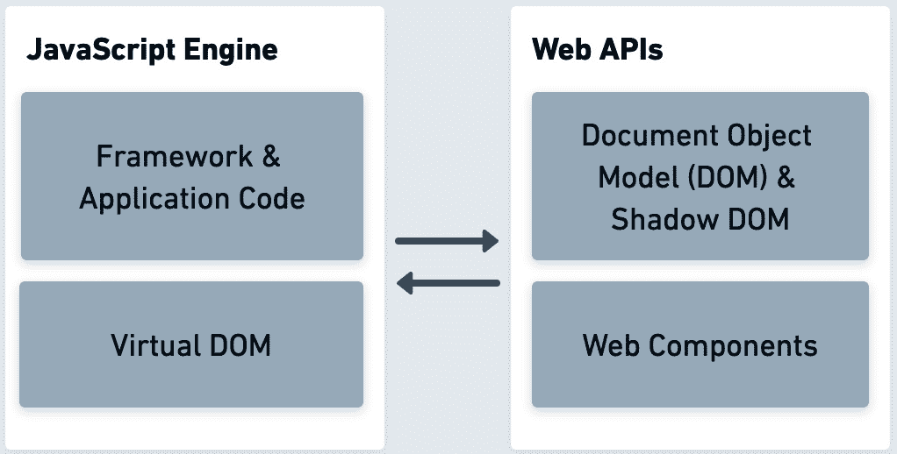
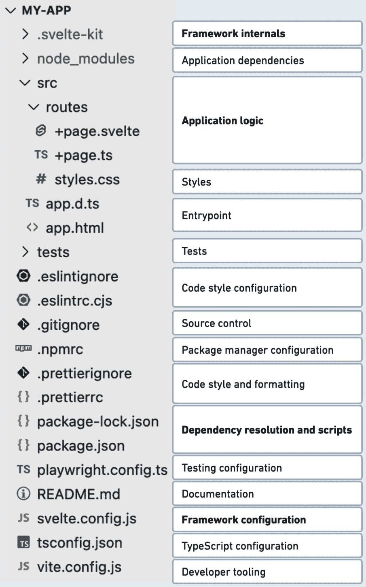
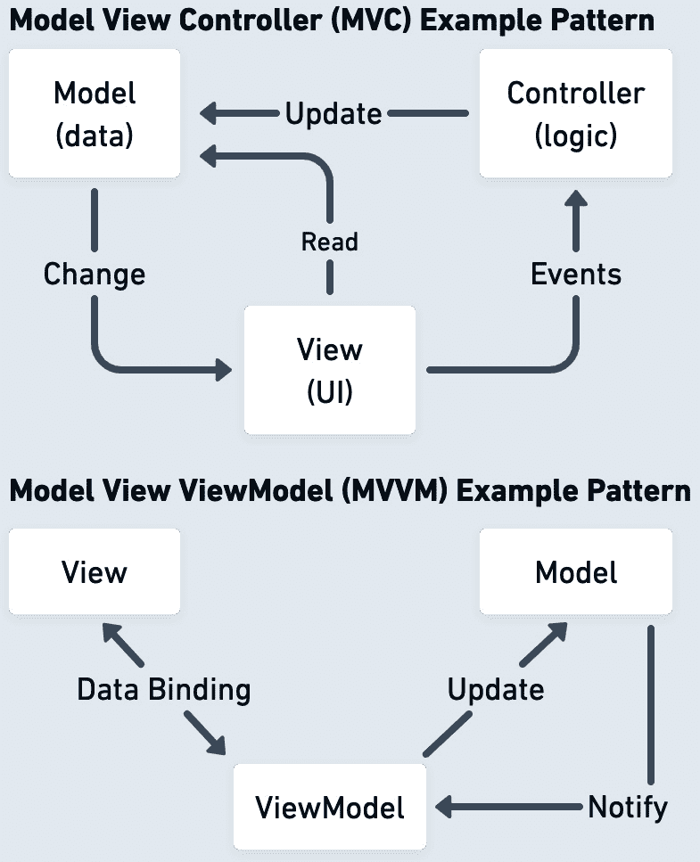

# 1

# 不同 JavaScript 框架的好处

自从 JavaScript 首次被引入我们的网络浏览器以来，已经过去了 25 多年。从那时起，这项技术极大地改变了我们与网站和应用程序互动的方式，我们为后端系统构建 API 的方式，甚至我们与硬件平台通信的方式。JavaScript 已经成为地球上最受欢迎的编程语言之一。时至今日，JavaScript 的演变速度和快速变化仍然是开发者之间热门的讨论话题——它是兴奋和创新的源泉。作为一种编程语言，JavaScript 在过去 10 年中连续 10 年被开发者评为最受欢迎的语言，并且是 98% 的网站客户端脚本的关键。我们无法低估 JavaScript 及其紧密相关的 ECMAScript 标准化如何使网络成为可以由数十亿人访问的下一代软件的平台。有了这些技术，数百万的企业和个人可以轻松构建出色的应用程序、创意体验和复杂的软件解决方案。在许多方面，网络平台有潜力成为全世界最充满活力和友好的开发者生态系统。

JavaScript 框架是数百万网络开发者今天构建项目的直接方式。由于它们的流行和易用性，框架允许开发者快速将产品想法变为现实，而无需不必要的开销。如果没有我们今天可用的框架系统，网络将无法与其他开发平台竞争。

在这本书中，我们将研究庞大的生态系统，并扩展我们的知识，以便在创建和维护我们自己的自开发框架时充满信心。掌握构建框架或扩展现有框架的技能，将使我们成为前端和后端项目中具有影响力的领域专家。

作为成为 JavaScript 框架专家的一部分，我们需要了解网络开发工作流程的核心组件和工具。在本书的第一章中，我们将探讨网络开发是如何演变的，框架是如何改变与 JavaScript 一起工作的格局的，以及当前生态系统提供了什么。

我们将涵盖以下主题：

+   JavaScript 框架的出现

+   代码库的演变

+   JavaScript 中的框架类型及其好处

+   我与框架的经历

# 技术要求

本书附有 GitHub 仓库 [`github.com/PacktPublishing/Building-Your-Own-JavaScript-Framework`](https://github.com/PacktPublishing/Building-Your-Own-JavaScript-Framework)。在每一章中，我们将指向该仓库中的相关目录。您可以随意克隆或下载该仓库的 ZIP 文件。

您需要一个带有互联网访问权限的桌面或笔记本电脑以及终端应用程序来安装和运行此存储库中的代码。我们还将使用 Node.js 来运行存储库的一些部分。Node.js 是一个开源的、跨平台的、后端 JavaScript 运行环境，可以在浏览器外运行 JavaScript 代码。Node.js 的安装信息可以在[nodejs.org](https://nodejs.org)找到。对于存储库中的代码，您可以使用任何支持终端和运行 Node.js 的环境，例如 Windows、macOS 和大多数 Linux 版本。

# JavaScript 框架的出现

随着 JavaScript 的进步和演变，那些在语言中投入大量精力，无论是公司还是个人，的创新者开始编写软件库来帮助解决 Web 应用程序架构的日常负担。最基本的 JavaScript 库的初始重点是提供单一功能、交互性和附加功能，这些功能逐渐增强了网页。当时，JavaScript 通过其交互组件赋予了静态页面生命——总是浮现在脑海中的简单例子是微小的脚本，这些脚本使得创意按钮效果和鼠标光标效果成为可能。在许多情况下，这些脚本与网站的核心功能是分开的，并且不是用户与内容交互所必需的。自从小型库的诞生以来，这些库为今天我们所拥有的复杂框架系统铺平了道路。前端技术迅速发展，现在，开发者们更加习惯于数兆字节的脚本驱动前端代码。

JavaScript 库是 Web 开发演变的下一步，帮助解决跨浏览器怪癖、复杂视觉效果、网络请求和网页布局。使用这些库，开发者能够控制跨浏览器开发挑战。CSS 开始关注布局功能和跨浏览器标准，改善了 Web 的样式功能。开发者最终开始将结构和精心设计的系统引入 Web 开发。

专注于构建可扩展且具有意见的 Web 软件的时代终于到来了，这正是我们开始看到复杂软件范式被引入大型网站和 Web 应用的曙光。公司和大型企业开始将 Web 视为一个严肃的应用平台，这导致了一些以 JavaScript 编写并从 Java 等语言编译到 JavaScript 的突出项目。回顾到 2009 年末，我们看到了完全使用 HTML、CSS 和 JavaScript 构建的第一个**模型-视图-控制器**（**MVC**）框架的迭代。这种 MVC 模型允许更广泛的项目保持组织性，丰富了开发工作流程，并为期望在编写软件时采用更结构化方法的开发者打开了前端开发的世界。MVC 模型与 Web 应用配合得足够好，以至于催生了框架开发的复兴。

许多开发时间都投入到了连接 JavaScript 引擎和浏览器 Web API 之间的机制中。在*图 1*.1 中，我们可以看到这种交互发生的简化视图：

图 1.1：JavaScript 引擎与 Web API 之间的交互

框架代码及其内部技术，如虚拟 DOM，使用 DOM 及其组件来使 Web 应用体验成为可能。Web 有其自己的 MVC 架构方法，其中 DOM 和 Web API 事件与 JavaScript 中定义的控制器交互。控制器与用 HTML 或模板 HTML 编写的视图接口。此外，在这个范式下，应用组件利用模型来模拟其内部的数据。使用这种方法，我们可以在以后与后端服务通信，以特定方式检索数据。

每个新的 JavaScript MVC 框架都试图以各种方式完善其实现或方法。在第一个 MVC 框架出现并获得普及后的约五年，几个专注于**观察者**软件设计模式的新范式开始在 JavaScript 社区中受到关注。这种观察者方法是一种软件设计模式，其中对象维护一个其依赖者的列表，称为观察者。对象会自动通知观察者其内部状态的变化。那时，**Flux**应运而生，这是一种专注于简化 MVC 内部障碍的应用架构。这些障碍包括处理视图不断需要与模型交互、难以调试的深层嵌套逻辑，以及需要为复杂应用提供充分的测试解决方案。

在观察者模式中，我们定义了包含一组通知状态变化的观察者的主题。Flux 架构将这个现有的模式扩展，以更好地适应基于 Web 的应用程序。在 Flux 模式的情况下，它包括与组件状态交互的**存储**。这些存储根据来自**视图**中用户的**动作**产生的数据由**调度器**通知。许多 JavaScript 框架开始采用这种模式，最终简化了工程师构建应用程序的方式，同时仍然强制执行一套适用规则以保持关注点的分离。所有这些框架中的软件模式在接口、数据模型和整合它们的程序逻辑之间提供了清晰的关注点分离。基于 Flux 的 JavaScript 框架引入了从已知 MVC 模式中出现的新的概念。然而，MVC 和 Flux 方法都侧重于应用程序开发中的关注点分离原则。

此外，在简化 Flux 提出的思想的同时，一个名为 Redux 的库启发了下一代框架改变它们的应用状态管理方法。与 Flux 调度器不同，Redux 框架依赖于一个单一的存储，使用纯**reducer**函数，接受当前状态并返回一个更新后的状态。即使今天，前端模式仍在成熟，为 Web 平台构建正变得越来越容易。

尽管有很多关于前端技术的方面可以提及，JavaScript 也在 Web 浏览器之外的地方产生了巨大的影响。我们将在下一节中介绍这些领域。

# 浏览器外部的框架

在第一个前端框架出现期间，另一个具有里程碑意义的事件是出现了一个名为 Node.js 的新开源运行时。Node.js 允许开发者使用 JavaScript 来生成服务器端脚本、部署后端系统、构建开发者工具，更重要的是，使用与浏览器相同的语言编写框架。软件栈两端的 JavaScript 的独特组合为软件开发者创造了巨大的可能性。这个运行时随后扩展到许多超出软件应用的方向，包括桌面应用程序开发、硬件 I/O 解决方案等等。

使用 JavaScript 构建的框架使得网络平台成为数十亿人可触及的最重要技术之一。几乎无法想象在没有依赖框架的一致性和友好性的情况下开始一个新项目，即使是微小的任务也能从使用一个统一且具有观点的结构中受益显著。然而，尽管语言和构建网络项目的方式发展迅速，JavaScript 框架作为完全封装的平台来帮助开发者生产高效应用，这一过程还是花费了相当长的时间。

随着 mobile 平台的发展，JavaScript 取得了胜利，为移动和现有系统创建了多个框架，并将移动基准测试整合到其发布流程中。优化已经达到了硬件级别，**ARM** ([arm.com](https://arm.com)) 处理器架构引入了优化，以改善数据类型转换中的 JavaScript 性能，从而为许多 JavaScript 应用程序带来性能提升。这对于一个始于普通网页上的小脚本的脚本语言来说，确实是一段漫长的旅程。

今天，我们可以通过结合 Web API 的力量、JavaScript 语言以及像渐进式 Web 应用这样的技术，使用将这些所有元素整合在一起的框架，来创建完整的应用和服务。这是开始探索这些 JavaScript 系统的世界并利用它们为我们带来优势的绝佳时机。

现在，我们已经对网络开发的发展有了概述，让我们来看看代码库是如何随时间变化的。

# 代码库的演变

在学习框架的同时，回顾构建网络的方式是如何随时间变化的，是非常有趣的。这种探索帮助我们理解为什么我们今天以这种方式构建 Web 应用程序，并帮助我们从历史转变中学习。它还允许我们在承担大型项目时，对框架的可用性和开发决策更加谨慎。随着技术的进步，围绕网站和 Web 应用程序构建的要求和期望发生了巨大变化。根据一个人参与 Web 开发的时间长短，他们要么经历了代码库结构快速演变的许多转变，要么幸运地避开了工具和流程非常繁琐的时期。

最初，代码库由独立的客户端组件拼接而成，包含代码重复和编码模式的混合。代码组织、软件开发模式的运用和性能优化并不是开发者关注的重点。Web 应用程序的部署过程也相对简单。在许多情况下，网站是手动更新的，没有使用源代码控制或版本跟踪。测试也高度手动，并且仅在少数足够大的项目中存在，以便进行测试。这还是在部署管道、持续集成、部署自动化和高级测试基础设施严格验证每个变更之前。曾经有一段时间，开发者必须为了性能原因优化他们的 CSS 选择器。

幸运的是，随着行业开始更多地关注构建复杂应用程序，生产力和工作流程迅速开始提高。今天，我们有源代码控制，我们有众多测试和部署工具可供选择，我们建立了软件范式，这些范式大大提高了我们的生活质量，并极大地提高了我们构建的项目质量。JavaScript 引擎的改进为框架开辟了新的途径，而网络浏览器的改进则通过如 **虚拟 DOM**、**Shadow DOM** 和 **Web Components** 等技术解决了慢速 DOM 交互问题。如今，前端框架有更好的客户端平台可以针对，而更成熟和改进的网络标准使得执行更复杂的操作成为可能。例如，借助 WebAssembly ([webassembly.org](https://webassembly.org)) 标准，我们可以在浏览器中运行低级代码，并实现性能的提升。

作为所有这些发展和流行度增长的一部分，Web 应用程序开发工作流程在许多方面变得更加复杂。几乎在每次与 Web 应用程序项目互动的每个点上，都有一个工具集旨在改进我们的工作流程。这方面的例子包括 Git 源代码控制、各种文件的前后处理器、带有插件的代码编辑器、浏览器扩展等。这里有一个示例，说明了现代 Web 应用程序代码库结构的关键组件，在这种情况下，是由 **SvelteKit** 生成的：

图 1.2：SvelteKit 代码库结构

我们将在本章的“使用 React 的框架”部分稍后介绍 SvelteKit，即使你从未使用过 Svelte，如果你与其他框架一起工作，这个项目文件结构看起来也会非常熟悉。这种工具的动态结构使得在更换某些功能时具有灵活性。例如，如果需要，可以用另一个代码格式化工具替换 *Prettier*，而项目的其余结构保持不变，并按原样运行。

随着 JavaScript 中第一个框架的建立，我们经历了构建步骤被引入到我们的项目中，这意味着外部或捆绑的工具将帮助运行或构建应用程序。今天，这个由**Webpack**或**esbuild**普及的构建步骤几乎无法避免。作为构建步骤的一部分，我们使用包管理器获取应用程序依赖项，处理 CSS，创建代码包，并运行各种优化步骤，使我们的应用程序运行得更快，消耗最少的带宽。生态系统还引入了 JavaScript 转译器，这是一种源到源代码的编译器。它们用于将一种特定的语法（可能包含更现代的功能或包括额外的功能）转换为广泛接受的 JavaScript 语法。转译器，如**Babel**，开始被日常使用，并在许多项目中与构建步骤集成；这种模式通常促使人们使用最新的语言功能，同时也支持旧的浏览器引擎。如今，转译和构建步骤不仅适用于 JavaScript 文件，还适用于 CSS 和特定的模板格式文件。

与构建步骤集成的是包管理器，如`npm`或`yarn`，它们在解决项目依赖关系方面发挥着至关重要的作用。如果你想使用框架启动工作流程，你可能会依赖包管理器来初始化框架结构和其依赖项。对于新项目来说，如果不使用包管理器或某种形式的依赖关系解析，几乎不可能有一个合理的框架工作流程。随着项目的增长，包管理器有助于组织新的依赖项，同时跟踪已使用模块的更新。如今，文本编辑器，如 Visual Studio Code 和 IntelliJ WebStorm，适应我们的代码库，并提供出色的工具，使我们能够实现代码的源代码控制。这些编辑器依赖于内置功能和外部插件，鼓励更好的格式化、更简单的调试以及针对特定框架的改进。

随着技术的进一步发展，代码库将不断变化，工具也将持续改进，以便我们能够更快地开发应用程序。关于框架组织，我们可以期待更高层次的抽象，这将简化我们的 Web 开发方式。许多编程语言，如 Java 和 Swift，都有预定义的开发工作流程，封装了开发的所有方面。迄今为止，JavaScript 代码库一直是这些规则的例外，并允许高度灵活性。随着 Web 开发工具和创新的快速步伐并未放缓，这一趋势还将持续许多年。

现在我们已经了解了 JavaScript 生态系统是如何演变的，以及代码库是如何随时间变化的，让我们来探讨 JavaScript 框架在前端、后端、测试等方面的提供内容。

# JavaScript 框架的类型及其好处

尽管在生态系统中比较每个框架的细微差异具有挑战性，但我们仍可以涵盖几个对开发者社区产生重大影响或提供独特解决方案的框架。对工具的深入了解帮助我们注意到这些框架中关于开发者体验和功能集的不同策略的具体模式。

仍然有方法在不使用框架的情况下构建应用程序和网站，但许多开发者即使考虑到额外的开销和学习曲线，也更倾向于使用成熟且具有观点的框架。如果你关注 JavaScript 社区，你会发现它总是充满热情地讨论着框架，因此让我们更深入地探讨框架使用的需求和好处。

框架提供了良好的抽象级别，可以在不重写底层功能的情况下编写高级代码。开发者可以更多地参与到业务和产品逻辑中，并更快地迭代新功能。以一个例子来说，直到最近，在没有良好抽象的帮助下编写带有适当错误处理的异步 Web 请求的代码是一项非常耗时的工作。现在有了 Fetch API ([fetch.spec.whatwg.org](https://fetch.spec.whatwg.org))，这变得容易多了，但 Fetch 只是故事的一部分，所以其他 Web API，尤其是早期的一些，仍然受益于良好的抽象。在我们选择编写底层代码的情况下，找到在框架边界内编写该代码的方法是一个更好的方法。这样，代码就在框架的基本原理中得到测试和维护。这避免了额外的维护，并确保所有该代码的使用都仍然在合理的抽象之下。一些后端框架通过提供可扩展的接口来实现这一点，通过插件或扩展默认行为来钩入框架内部。

与团队一起开发软件是一项具有挑战性的任务，因此小型和大型团队都可以从将框架集成到工程工作流程中受益。提供的抽象结构通常会导致更完善的系统，考虑到开发者编写高级组件的限制。关键好处是使所有参与任务的人都能更好地理解代码库，并方便地减少在重构和添加新代码上的深思熟虑时间。

现在我们有了抽象的高级代码，我们可以珍惜框架的另一个好处——它们所提供的性能优化。编写适用于所有提供用例的性能代码需要技能，并且会从当前项目上消耗大量时间。即使是最有知识的开发者，在短时间内也只能提出足够好的解决方案。有了框架，尤其是开源框架，你可以从许多人的智慧中受益，解决性能瓶颈，克服典型障碍，并在框架发展的过程中继续受益。性能优势来自于优化的低级和结构良好的高级组件；值得注意的是，一些框架会防止降低应用程序速度的代码。

框架使得与外部系统（如数据库、外部 API 或特定组件）的集成更加容易。例如，一些 Web 框架可以直接与 GraphQL 数据查询语言集成，简化后端系统的交互。这不仅是因为使用方便，而且这些集成使得与数据库等组件的安全交互成为可能，有助于避免可能执行缓慢或有害的查询。对于前端项目，始终跟上最新的 Web 标准非常重要，这正是框架提供另一个集成优势的地方。

最后，就像所有软件一样，支持发挥着重要作用。一个项目可能使用成熟框架的另一个原因是可用的支持渠道，包括付费、志愿者和开源的帮助。这些系统的共享知识使得开发者能够互相帮助构建系统，并使得雇佣熟悉这些现有系统的新开发者变得更加容易。

正如我们所见，框架以无数的方式为我们带来好处——让我们用这些确切的原因来回顾一下。以下是框架允许我们做的事情：

+   专注于业务逻辑和编写高级代码

+   编写更少的代码并遵循框架定义的代码约定

+   从性能提升中受益并依赖未来的优化

+   以良好的架构、抽象和组织开发项目

+   容易与数据库和外部 API 等外部系统集成

+   能够依赖安全修复、审计和补丁

+   使用框架特定的工具（如文本编辑器集成和命令行实用程序）改进开发者工作流程

+   能够通过依赖详细的错误信息和一致的日志轻松调试问题

+   依赖框架作者和社区的额外支持

+   招聘已经习惯于使用我们选择的框架或具有类似经验的开发者

+   通过利用框架的功能集开发更好的用户体验

虽然许多 JavaScript 框架专注于开发者体验，但用户体验有时会因这些系统的开销而受到影响。这通常在前端项目中相关——一个例子就是在预算有限的移动设备上加载复杂的 Web 应用程序。在后端系统中，这可以在 API 无法跟上请求负载并可靠地与流量峰值同步时看到。

即使在这两种情况下系统都巧妙地构建，所选框架可能并不优化以覆盖所有用例。我相信框架生态系统的下一版本将主要关注用户体验方面，这意味着加快加载时间，减少通过网络传输的 JavaScript，并确保我们创建的 Web 应用程序能够在所有平台上无缝运行。在接下来的章节中，我们将探讨一些最受欢迎的框架，这些框架为 Web 应用程序开发者提供了这些好处。

## 前端框架

由于 JavaScript 框架起源于浏览器，让我们将现代前端框架作为我们的第一次探索。

### Ember.js

假设我们通过`Prototype.js`、`jQuery`和`script.aculo.us`等库的起源追溯第一个 JavaScript 框架的根源。在这种情况下，我们最终会到达**SproutCore**，这是一个被苹果公司和少数其他公司用来在多年前构建一些最复杂 Web 体验的框架。

今天，这个早期的 SproutCore 项目已经影响了**Ember.js**框架。Ember 继续是一款具有高度意见的软件，允许我们使用定义良好的组件、服务、模型和强大的路由器来构建应用程序。像本章中我们将讨论的许多框架一样，Ember 自带命令行工具，这有助于开发者快速入门应用程序的基础，并在项目范围扩大后快速生成更多代码。提供的框架工具的实用性巨大。CLI 封装了代码生成步骤，并允许运行常见的框架命令，例如运行测试或提供应用程序文件。使用 Ember，开发者可以获得一套完整的工具，如自动重新加载、浏览器开发者工具以及一个名为 Ember Data 的包，该包通过适配器和序列化器帮助管理 API 到模型的关系。最终，Ember 的学习曲线比其他框架更陡峭，但其高度意见的概念引导开发者构建高度功能的 Web 应用程序。

### Angular

**Angular** 是另一个拥有大量追随者的框架。以其核心的 TypeScript 为基础，它通常被用作其他全栈 Web 框架的子集系统。Angular 提供了其基于组件架构的见解方法。Angular 有一个复杂的重写历史，但现在它是一个更精简的项目，具有稳定的特性集。Angular 的模板语法通过添加表达式和新属性扩展了 HTML。在其核心，它使用依赖注入的模式。该框架的最新版本提供了各种绑定技术，包括事件、属性和双向绑定。

### Vue.js

**Vue.js**，也是用 TypeScript 编写的，是通过借鉴 Angular 的优点而创建的。开发者喜欢 Vue 在其组件系统、语法和一般使用上的简单性。它利用了 **模型-视图-视图模型**（**MVVM**）模式，其中视图通过某种数据绑定技术与视图模型进行通信。在 Vue.js 的例子中，对于其数据，它通过 HTML 类、HTML 元素和自定义绑定元素属性使用不同的技术来实现这一点。给定视图模型的目的在于处理尽可能多的视图交互逻辑，并在表示逻辑和应用业务逻辑之间充当中间结构。除了使用 HTML 编写，Vue 还具有 **单文件组件**（**SFC**）格式（[vuejs.org/api/sfc-spec.html](https://vuejs.org/api/sfc-spec.html)），将组件的所有方面——脚本、样式和模板——封装到一个文件中。SFC 作为构建步骤的一部分发生，有助于组件避免运行时编译，将 CSS 样式限制在组件范围内，启用热模块替换，以及更多。

关于 TypeScript

`.ts` 和 `.tsx` 是 TypeScript 文件，必须在大多数环境中编译成 JavaScript 才能使用。

### 使用 React 的框架

这些天，我们经常听到关于 **React** 的消息；尽管它本身是一个用户界面组件库，但它已成为许多前端框架的基石，例如 **Gatsby**、**Remix**、**Next.js** 以及其他一些框架。作为其介绍的一部分，React 还推出了 **JSX**，这是它自己的 JavaScript 扩展集，使得可以使用类似 HTML 的语法来定义组件。例如，静态站点框架 Gatsby 依赖于 React 的状态管理和嵌套组件架构来组合其网页。使用 Gatsby，开发者可以通过 GraphQL 从内容管理系统、电子商务来源和其他地方多路复用数据。

沿着我们的 React 路线，我们来到了 Remix，它捆绑了一个全栈解决方案，包括服务器和客户端的功能，以及编译器和请求处理器。Remix 为应用的视图和控制器方面提供了解决方案，并依赖于 Node.js 模块生态系统来处理其余部分，为需要从项目到项目定制解决方案的开发者提供了灵活性。基于多年来创建和维护 `react-router` 项目的经验，Remix 的创造者能够在利用浏览器 Web API 的同时，避免了投资于新概念，从而提出了强大的抽象。例如，如果你选择 Remix 作为你的项目，你将发现自己比在其他一些框架中更多地使用 Web 标准 API。

Next.js 是我们的下一个基于 React 的框架，它通过内置的服务器端渲染扩展了 React 组件架构的使用。服务器端渲染的组件允许将预渲染的页面发送到客户端，从而使客户端只需在初始化交互式组件上花费资源。该框架提供了页面概念，允许使用懒加载进行更简单的路由实现，并启用自动代码拆分。结合所有这些功能，结果是一个具有快速加载时间的出色用户体验。此外，部署的应用程序在搜索引擎索引中排名很高，这是使该框架脱颖而出的特性。

当谈到 React 框架时，值得提及 **Solid.js**。这是一个较新的库，用于创建前端界面。Solid 的基准测试优于 React 和其他库。它使用 JSX 等特性，但有一些关键区别。在 Solid 中，没有虚拟 DOM 和 hooks 的概念。相反，它依赖于 **信号** 模式来更新真实的 DOM 节点，同时利用响应式原语。作为 Solid 方法的一部分，它提供了 **SolidStart** 应用框架，这与 Next.js 非常相似。它由核心支持组件组成 – *路由器*、*会话*、*文档*、*动作*、*数据*、*入口点* 和 *服务器* – 这些组件作为 SolidStart 的一部分集成在一起。

### SvelteKit

与 SolidStart 类似，也存在 `.svelte` 文件，这些文件封装了带有 `<script>`、`<style>` 和 HTML 标签的组件。这些组件被编译成由编译器生成的 JavaScript 输出。

关于 Vite

`vite.config.js` 配置文件。主要用作前端项目的构建工具。它针对速度进行了优化，并通过提供具有热模块替换的开发服务器以及使用 esbuild 优化 JavaScript 输出的打包器来实现这一速度（[esbuild.github.io](https://esbuild.github.io)）。

### 框架特性和模式

要理解大多数现代框架能实现的功能，我们需要了解以下缩写和特性：

+   **单页应用**（**SPA**）：一个早期术语，描述了一个仅使用 JavaScript 和其他前端框架进行所有交互，并减少浏览器路由的应用程序。

+   **服务器端渲染**（**SSR**）：在服务器端预渲染的组件，在客户端传输以进行 JavaScript 激活。

+   **客户端渲染**（**CSR**）：使用 JavaScript 在浏览器端纯渲染组件。

+   **静态站点生成器**（**SSG**）：预先从源生成所有页面以实现更快渲染和更好的搜索引擎优化的概念。

+   **延迟静态生成器**（**DSG**）：在服务器接收到请求时在服务器上渲染内容。

+   **增量静态再生**（**ISR**）：另一种静态内容生成的模式。在这种情况下，静态生成是由外部触发器更新触发的。

+   **内容安全策略**（**CSP**）：用于提供脚本的配置，有助于防止跨站脚本攻击。

+   **热模块替换**（**HMR**）：在浏览器中运行应用程序时替换 JavaScript 模块的技术，主要用于提高开发速度并避免页面重新加载。

+   **单文件组件**（**SFC**）：一种封装了可使用框架组件所有方面的文件结构，如样式、模板、逻辑等。

+   **模型-视图-控制器**（**MVC**）：一种关注于各种类型应用中关注点分离的设计模式。它通过以下方式实现这种分离：一个表示数据的模型，一个提供用户界面的视图，以及作为视图和模型之间中介的控制器。

+   **模型-视图-视图模型**（**MVVM**）：另一种关注于应用程序中关注点分离的设计模式，但实现这些分离的方法不同。在这种情况下，仍然有视图和模型，类似于 MVC。然而，ViewModel 充当这些类型之间的连接。这种方法使用视图和模型之间的双向数据绑定。

除了功能和它们的缩写，这里有一个有用的视觉描述，描述了 MVC 和 MVVM 模式：

图 1.3：MVC 与 MVVM 模式对比

在前端框架复兴期间，一个名为**TodoMVC**的开源项目被建立起来，旨在帮助开发者根据相同的待办事项应用比较框架，任何人都可以发送带有他们框架实现的拉取请求。除了比较不同的框架外，该项目还普及了 JavaScript 复杂代码组织的方法。现在随着这些新框架的出现，我们需要对 TodoMVC 进行新一轮迭代，以继续帮助开发者比较这些系统。

## 后端框架

从前端切换到后端，让我们来看看一些后端框架。Node.js 在 JavaScript 生态系统中扮演着至关重要的角色，它为开发后端服务提供了各种框架。与前端一样，不可能涵盖所有这些框架，但在这个部分，我们将检查**hapi.js**、**express**、**Sails.js**、**nest.js**和**AdonisJS**。

### Hapi.js

在多年的框架探索中，我有机会以专业身份和在小型的爱好项目中使用这些框架。我首先从 hapi.js 开始，它是 Node.js 框架精心制作的良好例子，它通过提供必要的默认设置，使得快速构建服务器后端成为可能。它采用了一种独特的方法，避免使用中间件并依赖于外部模块。作为其核心的一部分，它已经内置了验证规则、解析、日志记录等。hapi.js 不限制可扩展性；开发者可以创建插件并将它们注册为请求生命周期不同部分的执行部分。hapi.js 的使命强调在组合大量应用程序逻辑时避免意外后果。这在 hapi.js 处理依赖管理和模块命名空间的方式中表现得尤为明显。

### Express

与 hapi.js 形成鲜明对比的是，Node.js 生态系统还有一个名为**Express**的框架，它主要是一种无特定观点的后端服务构建方法。成千上万的项目和工具通常使用 Express 进行路由、内容解析和高性能。Express 几乎在所有方面都很灵活，并支持超过一打的模板引擎，是 Node.js 开发者的入门框架。例如，一个流行的 MVC 框架 Sails.js，基于 Express 的功能提供 API 生成、数据库 ORM 解决方案以及构建实时功能的支持。通常，它是对那些欣赏 Express 中间件模式、同时希望采用更结构化方法构建后端系统的人来说是一个好的解决方案。

### NestJS

NestJS，不要与 Next.js 混淆，是另一个值得提及的服务端框架。它与 Vue 类似，并且 Angular 启发了其对应用结构的处理方法，但在这个案例中，是针对后端系统的。默认情况下，它使用 Express 作为其默认的 HTTP 服务器，并创建了一个抽象层，允许开发者更换第三方模块，使得开发者可以将 Express 替换为其他 HTTP 框架，例如**Fastify**。在 NestJS 中，我们看到类似的依赖注入模式，这使开发者能够构建封装的模块。这些模块可以在测试中重用、覆盖和模拟。

### AdonisJS

我们本节最后要介绍的 Node.js 框架是 AdonisJS。它完全使用 TypeScript 构建，集成了许多成熟框架应有的特性，例如基于 Active Record 模式的 ORM、模式验证器、广泛的认证支持以及更多。内置和第一方插件特性为后端构建中的许多常规问题提供了解决方案。AdonisJS 还内置了一个自定义模板引擎，用于渲染 HTML 布局。作为额外的奖励，AdonisJS 的文档直接明了，易于阅读和探索。

### Fresh

考虑到 Node.js 生态系统对核心框架的关注，我们也应该提一下名为 **Fresh** 的后端框架，它由 **Deno** 运行时提供支持。这个运行时结合了多种技术——JavaScript、TypeScript、WebAssembly 和 Rust 编程语言。Fresh 采用了一种简单的方法，强调没有构建步骤、最小化配置，并在服务器上即时渲染组件。路由通过在项目目录中创建文件来处理，称为文件系统路由，这与其他框架中的类似模式。

回顾本节中我们讨论的所有 Node.js 框架，可以看到一个健康的框架多样性，为任何类型的项目提供了解决方案。

## 原生框架

对 JavaScript 的了解也使我们能够为原生操作系统环境构建，并与硬件平台交互。在其他环境中运行时的可用性使我们能够创建独特的解决方案，帮助网页开发者将他们的技能应用到浏览器以外的领域。在本节中，我们将介绍为原生 JavaScript 开发创建的一些框架。

### 电子

将 Web 应用打包成原生应用的想法并不新鲜，但通过 **Electron** 得到了完善。Electron 允许开发者使用熟悉的客户端技术构建能够在流行的桌面平台上运行的完整跨平台应用程序。它支持诸如自动更新和进程间通信等特性，同时还拥有一个利用操作系统功能的插件集合。除了高级框架特性外，有一个针对所有平台的单一代码库对于高效构建新功能和修复错误也是有益的。如今，数百万人在使用由 Electron 构建的应用程序，在很多情况下甚至不知道这一点。例如 Microsoft Teams、Slack、1Password、Discord、Figma、Notion 等应用程序都使用了 Electron。更多示例可以在 [electronjs.org/apps](https://electronjs.org/apps) 找到。

### React Native

另一个帮助我们为原生平台创建应用的框架是**React Native**，它为熟悉 JavaScript 的开发者打开了移动开发的世界。针对 iOS 和 Android 移动平台，就像桌面上的 Electron 一样，它带来了 React 用户界面构建块的所有好处、统一的代码库和强大、成熟的社区。

### Johnny-Five

Node.js 生态系统还提供了如**Johnny-Five**这样的硬件框架，它允许使用 JavaScript 和 Firmata 协议进行机器人编程的创意学习用例。Johnny-Five 是一个支持超过 30 块硬件板的 IoT 平台。主要提供与 LED、服务、电机、开关等交互的接口。

到目前为止的所有框架都处理构建应用程序逻辑，但在 JavaScript 中还有其他类型的框架在开发过程中扮演着重要的角色——这些就是测试框架。

## 测试框架

软件开发中的测试框架对于确保我们的项目按预期运行至关重要。随着 JavaScript 及其支持的运行时环境，我们手头上的任务更加艰巨——我们不得不在不同的浏览器引擎中进行测试并模拟原生的 Web API。在某些情况下，模拟内置和外部库也可能具有挑战性。语言的异步行为也带来了自己的障碍。幸运的是，JavaScript 生态系统提出了各种测试框架，以解决许多软件测试挑战——单元测试、集成测试、功能测试、端到端测试等。例如，**Jest**、**Playwright**和**Vitest**都为测试挑战提供了很好的解决方案。我们将在下一节讨论它们。

### Jest

随着我们开发 Web 应用程序，我们希望确保我们构建的组件按预期工作；这就是 Jest 这样的框架发挥作用的地方。Jest 是一个与其他项目集成良好的单元测试框架。如果我们得到一个包含我们在本章中看到的一些框架的项目，Jest 将为我们提供可靠的测试解决方案。它设计得非常人性化，配置最小或为零，并提供易于模拟、对象快照、代码覆盖和最重要的是，一个易于理解的 API 来组织我们的测试。

### Vitest

Vitest 是一个类似的单元测试框架，提供了与在 Web 项目中模拟模块相同的接口。它专注于速度和对许多框架组件的支持，包括 Vue、React、Svelte，甚至 Web Components。它旨在提高开发者的生产力，并具有智能测试监视模式、多线程测试运行器和熟悉的快照机制。

### Playwright

除了单元测试之外，我们的软件项目从端到端测试中受益匪浅；这正是 Playwright 等测试框架成为良好竞争者的地方。它为 Web 应用程序提供跨浏览器和跨平台的测试。Playwright 附带一组测试接口，用于自动化各种浏览器，包括导航到 URL 和点击按钮。由于网页的异步性质，这历来是一个具有挑战性的问题，但这个框架通过重试和 await 行为提供避免不稳定测试的方法。

根据你参与的 JavaScript 项目的需求，你可能需要创建新的测试工作流程或定制现有的测试基础设施以适应你的用例——这正是构建测试框架的经验会带来优势的地方。

## 框架展示

这里是本章中我们讨论的框架的概述。

这些是我们将在本书中关注的值得注意的 Web 应用程序框架：

| **前端 +** **全栈** |
| --- |
| 名称 | 发布时间 |  |
| **AngularJS** | 2010 | 已过时的 MVC 框架，具有双向数据绑定和依赖注入等功能。是原始 MEAN 软件栈的一部分。 |
| **Bootstrap** | 2011 | 允许利用 HTML、CSS 和 JavaScript 创建响应式移动优先网站的基本框架，并且可以与其他系统集成以提供 Web 应用程序的界面。Bootstrap 定义了自己的布局原语，并提供了一套内置组件，用于表单和用户界面元素。 |
| **Ember.js** | 2011 | 采用组件-服务架构的 SPA 框架，具有定期发布和基于配置特性的意见化约定。 |
| **Vue.js** | 2014 | 学习曲线平缓的轻量级 MVVM 组件化框架，使用虚拟 DOM。自带反应系统和对状态变化 CSS 过渡的支持。 |
| **Gatsby** | 2015 | 使用 React 和 Node.js 的高级静态网站生成器。包括各种页面渲染和动态网站服务模式。高度依赖 GraphQL 进行数据检索。生态系统中有各种插件。 |
| **Angular** | 2016 | 基于依赖注入、模板和附加指令的组件化框架。具有一系列额外功能以实现国际化和无障碍访问。是原始 AngularJS 的全面重写。基于 TypeScript。 |
| **Next.js** | 2016 | 使用 React 作为渲染界面的服务器端渲染框架。支持多种数据请求方法。许多功能直接集成到框架中。 |
| **Nuxt.js** | 2016 | 使用 Vue.js 作为核心的框架，结合 Webpack、Babel.js 和其他组件。专注于提供优化的应用程序体验。 |
| **SolidStart** | 2019 | Solid.js 应用的框架。支持所有组件渲染方法。优化代码拆分，提供最佳的 Solid.js 体验。Solid.js 与真实 DOM 节点协同工作，支持 Web 组件，具有高效的渲染。 |
| **Remix** | 2021 | 以 UI 为中心的 TypeScript 全栈框架。包括浏览器、服务器、编译器和 HTTP 处理器。基于 React 构建，包含强大的应用程序路由器。提供多种渲染模式和基于文件的路由。 |
| **SvelteKit** | 2022 | 开发基于 Svelte 的应用程序的框架。使用 Svelte 编译器和 Vite 工具。不依赖于虚拟 DOM，支持所有组件渲染模式。 |

图 1.4：前端和全栈框架示例

这些是一些可以作为良好示例并帮助我们学习某些框架开发模式的后端框架：

| **Backend** |
| --- |
| 名称 | 发布时间 |  |
| **hapi.js** | 2009 | 建立任何类型后端 Web 服务的框架，采用约定优于配置的口号。开箱即支持许多高级功能，如 API 验证、有效载荷解析等。 |
| **Express** | 2010 | 建立 RESTful API 最流行的 Node.js 框架之一，与生态系统中的许多模块集成。用于实际应用和许多开发者工具。MEAN 堆栈的一部分。包括缓存、重定向和许多模板引擎的支持助手。 |
| **Sails.js** | 2012 | 基于 Express 和 Socket.io 的企业级 MVC 框架。包含 ORM 支持和强大的 CLI 来生成项目部分。 |
| **NestJS** | 2018 | 采用模块化方法的服务器端应用框架。遵循 Angular 的一些模式，并包含许多内置功能，如 WebSocket、GraphQL 和微服务支持。 |
| **AdonisJS** | 2019 | 针对 TypeScript 代码库的 API 和 Web 应用程序的全功能后端框架。包含自己的 ORM、模板和路由组件。 |
| **Fresh** | 2022 | 使用 Deno 运行时编写的框架。没有构建步骤，配置最小化，即时渲染。使用岛屿架构模式，专注于减少客户端的工作。独立的服务器端组件使用 HTML 渲染并发送到客户端。 |

图 1.5：后端框架示例

其他使用前端技术针对原生或硬件开发的框架如下：

| **Native +** **Hardware** |
| --- |
| 名称 | 发布时间 |  |
| **Johnny-Five** | 2012 | 物联网开发机器人框架。允许开发者使用易于使用的 API 与硬件模块交互。 |
| **Electron** | 2013 | 使用 Web 技术的流行跨平台桌面应用程序框架。使用来自 Chromium 项目的架构，使开发者能够与应用程序和渲染进程交互。 |
| **React Native** | 2015 | 用于 iOS、Android 和其他平台的应用框架。使用 React 的熟悉概念来构建界面。主要适用于希望为应用使用单一代码库且不想使用原生工具包来构建这些应用的 Web 开发者。拥有庞大的社区和插件生态系统。 |

图 1.6：原生和硬件框架示例

这里有一些测试框架示例，这些示例在 Web 应用项目中集成和使用非常有用：

| **Testing** |
| --- |
| **Jest** | 2019 | 零配置测试框架，通用支持许多 JavaScript 环境，包括 TypeScript、Node.js 等。 |
| **Playwright** | 2020 | 支持在 Chromium、WebKit 和 Firefox 浏览器中进行跨平台测试的端到端测试和自动化框架。帮助开发者快速可靠地对任何 Web 应用进行仪器测试。 |
| **Vitest** | 2022 | 单元测试框架，Vite 生态系统的一部分。支持 ESM、JSX 和 TypeScript。与 Vue.js 共同开发 |

图 1.7：测试框架示例

跟踪框架开发当前方向的最好资源之一是 [stateofjs.com](https://stateofjs.com)。这是一年一度的调查，结果来自数千名开发者，它提供了技术发展趋势的展望。例如，如果我们看看 2022 年的前端框架排名（[2022.stateofjs.com/en-US/libraries/front-end-frameworks](https://2022.stateofjs.com/en-US/libraries/front-end-frameworks)），我们已经开始看到 React 的保留和兴趣缓慢下降，这可能表明行业正在缓慢转向其他解决方案。由于所有这些框架的使用、意识和流行度的持续变化，我们不会专注于许多今天的框架，而是将涵盖适用于未来新框架的核心模式。这些模式将有助于您在探索创建自己的框架时。

现在是时候尝试本章中提到的某些框架了，使用本书“技术要求”部分中提到的 GitHub 仓库。您可以按照以下步骤操作：

1.  从 [nodejs.org](http://nodejs.org) 安装 Node.js 版本 20。

1.  从 [`github.com/PacktPublishing/Building-Your-Own-JavaScript-Framework`](https://github.com/PacktPublishing/Building-Your-Own-JavaScript-Framework) 克隆仓库。

1.  使用您的终端，切换到仓库的 `chapter1` 目录。

1.  运行 `npm install` 然后运行 `npm start`。

1.  按照交互式提示运行示例。

展示重点在于根据框架类型重现相同的示例。所有前端框架都展示了用不同结构编写的相同组件。请注意，一些示例可能需要一些时间来安装和运行。

在本章的最后部分，我们将探讨我在 Web 开发中与框架相关的显著个人经验。

# 我与框架的经历

我的专业网页开发生涯最初是从构建基本的网站开始的，那时还没有现成的框架或库。展望未来，我想分享我在专业上利用框架的经验，以及为一些开源项目做出贡献的经历。如今，从这些经验中积累的知识帮助我更好地评估框架的实用性，并将新的软件范式引入我的工作中。许多人发现跟上 JavaScript 领域的最新创新具有挑战性，但即使是构建最小的项目也能在许多方面帮助开发者成长。

下面是一些全栈开发领域的例子，这些例子帮助我成为了一名更加高效的网页开发者。

### 前端开发

我最初构建的几个专业网站是为 Internet Explorer 6 和 Firefox 网络浏览器的早期版本开发的。正如我们从这一章节中学到的，当时还没有用于构建 Web 应用的框架，我不得不利用我所拥有的少数库。这些库可以帮助添加交互性，例如图片库和动态页面布局。幸运的是，当我的关注点转向更大型的项目时，**jQuery**前端库出现了，并开始流行起来。时至今日，jQuery 仍然是大批网站的首选工具。我有了亲手打造一个基本框架的机会，这个框架可以从一个项目重用到另一个项目。这一系列脚本非常方便，预示了我们今天所拥有的框架的辉煌未来。很明显，单页 JavaScript 应用的趋势正朝着结构化和有观点的解决方案发展。

在我早期的大型项目中之一——具体来说是 Firefox 账户前端（[accounts.firefox.com](http://accounts.firefox.com)），我有机会使用 **Backbone.js**，借助 jQuery 和多个扩展库使其更适合大型项目。至今仍在为成百万用户服务的 Firefox 账户前端仍在使用 Backbone.js。Backbone.js 框架的结构允许对 jQuery 的软依赖，所以它感觉像是我在早期网络应用开发方法上的自然延续。我从这次经历中得到的要点是，Backbone.js 并非前端网络应用挑战的完美答案，但在许多方面都有益。例如，它使项目能够保持与不断发展的 JavaScript 生态系统的灵活性，并帮助多样化的开发者遵循一套稳固的应用程序指南来共同工作。有机会在客户端和 Firefox 网络浏览器的集成服务中工作，教会了我如何为全球数百万台计算机上运行的桌面客户端生成 JavaScript 组件。

在许多专业项目中，我有机会与 Ember.js、Angular 以及各种 React 框架合作。在这些场合，我对这些框架的强大功能印象深刻。在我的经验中，值得特别一提的是于 2012 年初发布的 **Meteor** 网络框架。Meteor 的一个主要卖点是其同构或所谓的 *通用 JavaScript* 方法，其中代码在客户端和服务器上同时运行。在许多方面，我们今天在流行的框架中看到了类似的方法，其中全栈框架让开发者能够编写 JavaScript 来在栈的两端进行开发。我为这个框架构建了一些应用程序和一些插件，虽然开始使用 Meteor 感觉非常容易，但在尝试构建不符合 Meteor 支持范围的项目时，我遇到了障碍，尤其是在框架的早期版本中。一个特别与框架限制作斗争的例子是在多个客户端之间同步文档状态的功能开发。当时，使用 Meteor 的功能集来实现这一点颇具挑战性，不得不使用替代工具重新构建。幸运的是，这并不是一个关键项目，但在重要的时候，评估你选择的框架是否是你试图构建的正确工具是一个好主意。

### 后端开发

在 Node.js 的早期几年，我有机会参与几个使用微服务架构的项目，这些项目涉及使用 Express 和 hapi 框架。我感受到了 express 框架的开放性方法与 hapi.js 中定义的严格规则和选项之间的对比。例如，在 hapi.js 中覆盖和自定义某些行为相当困难，而保持框架更新则需要困难的代码库迁移。

我仍然记得逐个版本地检查 hapi.js 的变更日志，确保不会错过任何可能导致我的项目失效的重大变更。尽管 hapi.js 存在困难，但它确实感觉这个框架提供了一套良好的抽象。在许多方面，遵循像 Python 中的 Flask 这样的现有示例，hapi 拥有构建高度可用的服务所需的必要组件。同时，我的 Express 经验似乎更让我想起了 jQuery 和 Backbone.js 的日子。在 Express 项目中，我可以拥有一个高度灵活的开发环境，结合不同的 Node.js 模块来实现框架想要的功能。这让我意识到，对我来说完美的框架应该介于 Express 和 hapi 之间，也就是说，它将允许我保持创造力、高度的生产力，并充分利用运行时生态系统，同时同时拥有一个有强烈意见的框架核心，这将使我的应用程序高效且可靠。

### 开发者工具和更多

作为我的职业的一部分，我一直对开源充满热情，因此我将我的努力集中在为开发者工具和测试框架做贡献上。多年来，我一直担任**Grunt.js**（[gruntjs.com](http://gruntjs.com)）的维护者，这是一个 JavaScript 任务运行器。Grunt.js 一直是框架的核心组件，如**Yeoman**，并且在 AngularJS 的早期版本中被用作首选工具。自从那时起，Node.js 的任务运行器规范已经发生了很大变化，但仍然有相当数量的项目在使用 Grunt.js。维护这个项目多年感觉就像维护一个大型框架项目一样——发布新版本、保持稳定的 API、通过安全赏金支持它以及更多。还有一大堆问题、功能需求、拉取请求和插件需要支持。

在我的测试框架贡献方面，我参与了**Intern.js**测试框架（[github.com/theintern](http://github.com/theintern)）的开发，它为 Web 应用程序提供了单元和功能测试。在我的日常项目中，我既是这个框架的贡献者也是消费者，这让我对这个项目有了独特的视角。我受到启发，要提供一个良好的集成体验，因为它将有助于我的项目。作为这项工作的一个部分，除了学习如何构建测试框架之外，我还专注于为其他应用程序框架开发集成示例和文档。在提供的示例中涵盖了众多集成场景，这使得开发者将这个测试系统集成到他们的应用程序中变得容易得多。

根据我个人的经验，一个值得注意的框架是**voxel.js**——一个开源的体素游戏构建工具包。虽然它并不那么流行，但它是一个创造性使用 JavaScript 的绝佳例子，结合了前端和后端技术。这是一个由小型团队构建的框架，为那些想要从事游戏和可视化开发的开发者群体填补了一个空白。voxel.js 并非旨在成为一个改变世界的框架；相反，它为许多人提供了一个创造性表达的途径。在我个人的项目中探索 voxel.js 时，我学到了很多关于独特框架和模块结构的知识，并且尝试那些能够激发更多创造性思维的系统是一件很有趣的事情。

## 为新项目做出贡献

这些在前端、后端和开发者系统中的 JavaScript 框架经验对我来说作为职业生涯的一部分是极其宝贵的。我学会了遵循最佳实践、遵守软件模式以及为各种运行时环境开发的重要性，这最终帮助我编写了更好的代码并成功交付了项目。作为本书的一部分，我分享了我的学习经验和尽可能多的知识，以便下一代虔诚的 JavaScript 开发者能够构建和贡献他们自己的框架项目。

我参与的项目总是有不同的起源。在我的情况下，我必须与私有和开源框架一起工作。在工作项目中，我专注于将开源工具与更大的商业组织环境相结合。这种方法有助于将现有工具与特定项目的需求相一致。在开源环境中，我有幸为那些改善了整体开发者体验的项目做出贡献。在许多场景中，我有机会参与那些创新且在 JavaScript 生态系统中的首创项目。例如，当 Grunt.js 正在发展时，有来自其他语言的作业运行工具，但 JavaScript 工具还处于起步阶段。为 voxel.js 做出贡献有类似的体验；随着更多 HTML5 API 和 WebGL 使网页上的图形更加先进，它使 voxel.js 项目成为可能，并创建了贡献者社区。

在我为 Intern.js 测试框架做出贡献的过程中，整体感觉是没有完全成熟的测试框架能够解决网络应用程序测试的所有需求。这个项目的目标是创建一个使用相同类型测试 API 的全能测试解决方案。

本书中所创建的框架侧重于使用现代技术，如 Web 组件，与流行的 JavaScript 库混合使用。在生态系统中，Web 组件领域尚未得到充分探索；因此，通过本书，我们旨在进一步拓宽网络开发者对这些技术的了解。除了扩展这些技能外，一个更大的目标是将框架开发过程变得更加易于接近，并揭开既定 JavaScript 系统的神秘面纱。

# 摘要

第一章开始，我们探索了网络应用程序开发过程是如何从纯基础转变为完整的软件平台的。我们研究了网络创新和挑战如何塑造本章讨论的框架，并在为网络开发者提供各种有用功能方面发挥巨大作用。在我的职业生涯旅程中，参与各种项目让我欣赏到通过结合优雅的模式和 JavaScript 编程语言的创造性使用所能取得的成就。

作为框架展示的一部分，很明显，生态系统在浏览器和其他 JavaScript 运行时功能的地方有很多选择。然而，在速度、功能和独特想法方面，总有改进的空间，这可以帮助我们提高开发过程。刺激这个生态系统的关键部分是不断发展的网络平台、ECMAScript 规范的制定，当然，还有 Node.js 和 Deno 等运行时维护者的辛勤工作。

在接下来的章节中，我们将更深入地探讨软件范式，重点关注框架组织和它们的架构模式。在*第二章*中，我们将探讨框架是如何构建和组织的。
