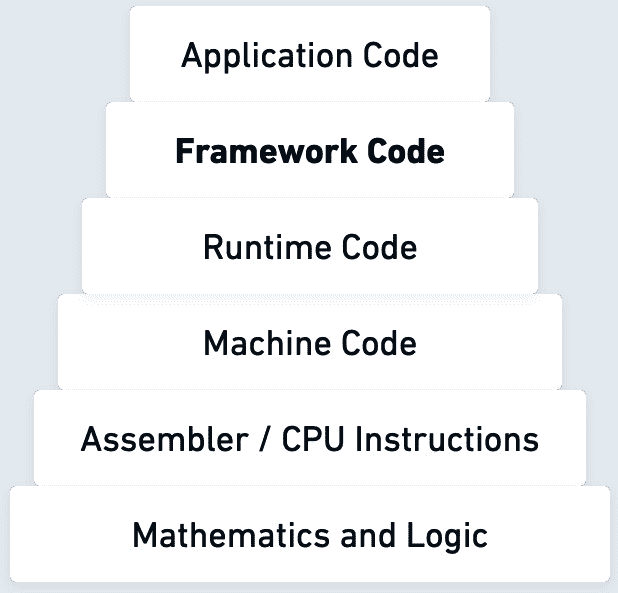
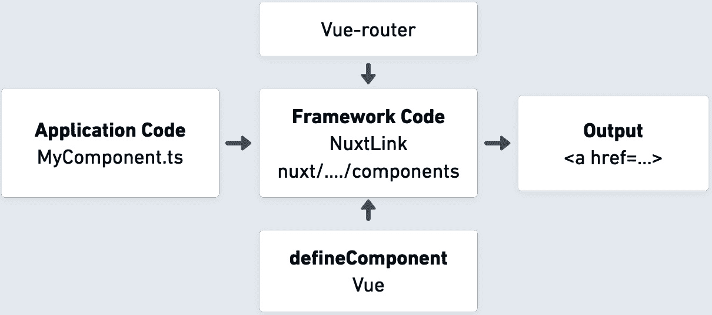
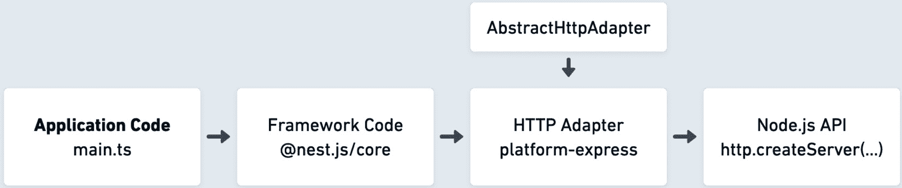
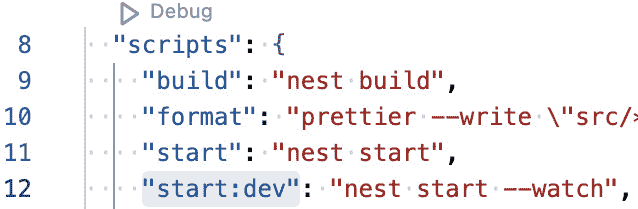
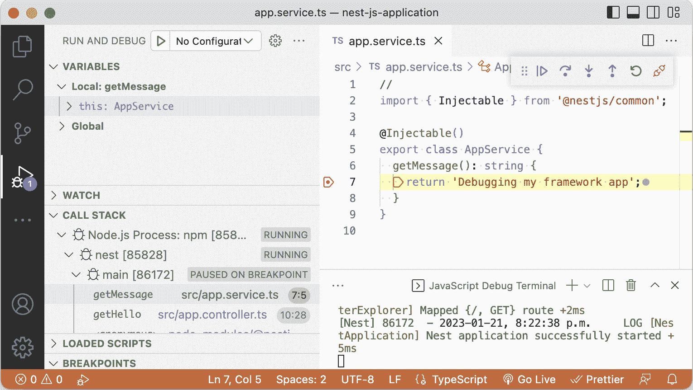
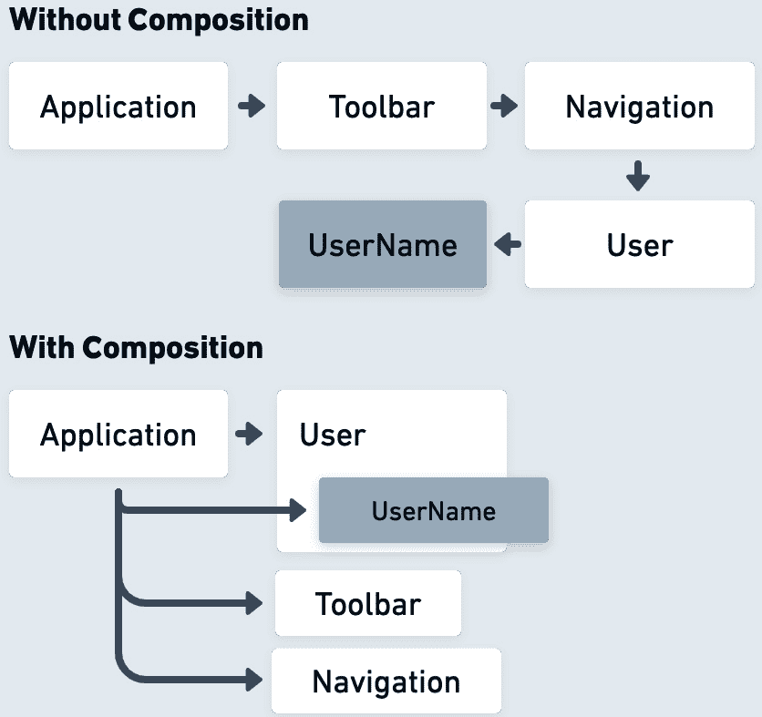

# 2

# 框架组织

现有的 JavaScript 框架在技术和结构上有很多相似之处，这些相似之处对于成为框架开发专家来说是很有用的学习内容。在本章中，框架组织指的是将一组抽象和构建块组合起来的方式，从而创建一个可用的接口集合，这些接口可以在应用程序代码中使用。

我们将学习以下组织主题，这些主题有助于框架的开发和使用：

+   了解抽象

+   JavaScript 中抽象的构建块

+   框架构建块

+   区分模块、库和框架

理解框架开发的核心理念和方面将帮助我们构建自己的框架，并拥有使用其他框架的最大潜能的领域知识。软件框架的用户或利益相关者的期望是拥有清晰的指导、熟悉的应用概念、降低复杂性和一个定义良好的代码库。让我们探讨框架组织如何帮助我们满足这些期望。

# 技术要求

与上一章类似，我们将使用本书的仓库作为本章的扩展。您可以在 [`github.com/PacktPublishing/Building-Your-Own-JavaScript-Framework`](https://github.com/PacktPublishing/Building-Your-Own-JavaScript-Framework) 找到它。对于仓库中的代码，您可以使用任何支持终端并运行 Node.js 的环境，例如 Windows、macOS 和大多数 Linux 版本。

本章包括开源框架的示例——为了节省空间，省略了不重要的细节，这些细节用 `// ...` 注释表示。您需要熟悉阅读 JavaScript 代码，但如果您不理解整个代码块也不要担心。在阅读代码的过程中，请确保跟随那些示例旁边的链接查看完整的实现，包括所有代码细节。`chapter2/README.md` 文件列出了本章可用的代码资源。

在本章中，建议尝试调试以进一步深化我们对框架结构的理解。在您的计算机上探索这一点的最简单方法是从 [code.visualstudio.com](http://code.visualstudio.com) 下载最新版本的 Visual Studio Code。

# 了解抽象

让我们深入框架组织的第一个方面——**抽象**的基本概念。软件开发框架在 Web 开发或其他领域的主要便利之一是向开发者提供高质量的、有见地的抽象。这意味着将可以跨越多行代码的任务，其中充满了实现陷阱，围绕它创建一个简单的接口。这也意味着提出一种智能的方法，将独立的接口结构化成熟悉、可扩展的、易于使用的模式。

这种将复杂性和对象泛化的概念抽象化的做法，帮助我们定义可以在我们的框架中用于多种目的的构建块。每个抽象对象都可以使用自定义属性集进行初始化，并在需要时以多种形状使用。在框架中拥有这种简化和泛化的好处，使得开发者能够专注于程序的商务逻辑。正是这些抽象概念通过消除复杂性、重复以及学习新系统的挑战，为开发者带来了好处。通过抽象，开发者不必使用甚至学习他们构建的系统中的低级组件。

计算机科学中的抽象

通常，抽象的概念，即某些复杂机制简化的表示，在软件开发中是至关重要的。这个概念在编程课程中很早就被教授，并且可以在大型和小型程序的高层和低层接口中实现。软件抽象结构了这些程序中的许多部分，并决定了程序的控制流程。定义数据如何表示的数据类型和结构可以被认为是建立在较低级对象实体之上的抽象。

一些编程语言提供了直接语法来编写抽象类和接口。TypeScript 作为其扩展 JavaScript 的一部分提供了这一功能。这允许开发者声明 *抽象* 类、方法和字段。你可以在 [www.typescriptlang.org/docs/handbook/2/classes.html](http://www.typescriptlang.org/docs/handbook/2/classes.html) 找到一些优秀的示例，以供进一步阅读和原型设计。

如果我们看看使用纯 CSS、HTML 和 JavaScript 技术开发网站的过程，我们就可以发现许多预定义的抽象，使这个过程更容易访问和简化。例如，HTML 通过其元素与属性的组合，只需几行标记标签就能快速定义超链接和嵌入媒体。这些元素的样式通过一组针对特定元素节点的样式规则来定义。我们可以在 **文档对象模型 API** 中看到 Web API 抽象的例子，这是一个在复杂嵌套节点树之上的抽象，这些节点定义了文档结构。这些前端技术为用户在网页浏览器内的交互提供了一种方式，它泛化和简化了与 Web 应用交互的复杂性。

我们在这里可以看到一个简化的抽象层次结构，从开发者编写在最顶层的应用代码开始，到最低层的基本逻辑规则：



图 2.1：从高层到低层结构的抽象层次结构

这最终带我们来到了 JavaScript，作为一种高级编程语言，它已经在许多方面抽象掉了复杂性，例如内存管理、与浏览器的交互以及一般对象管理。事实上，一些编译为 JavaScript 的抽象甚至关注于抽象掉更高层次的组件。例如，GWT 这样的工具包和 Elm、C#、Dart 这样的编程语言通过编译为 CSS、HTML 和 JavaScript 来实现这一更高层次的抽象过程。ECMAScript 的语言扩展，如 TypeScript，在语法上更接近 JavaScript，抽象掉了我们在编写 JavaScript 程序时常见的陷阱，并通过添加编译步骤来提高整体开发者体验。

在*第一章*中，我们探讨了几个使用 TypeScript 的框架，这些框架依赖于另一个框架，或者两者兼而有之，以创建更高抽象级别的框架。例如，Nuxt.js 是一个 Vue.js 框架，它依赖于 TypeScript。在这种情况下，框架要求开发者使用这些语言扩展和它们自己定义的抽象来构建应用程序。当我们为 Web 平台和 JavaScript 生态系统开发时，思考抽象层次可以嵌套多深是非常有趣的。在前端，我们有网络浏览器，它管理网络请求/响应网络，绘制布局，启用交互，等等。后端应用程序服务在云服务器实例中的进程和操作系统基础设施之上运行。当我们放大到电线中的电流，它为我们应用程序代码提供所需的比特时，抽象层次会不断增长。

现在我们对抽象及其用途有了更多的了解，我们将探讨这种核心模式的缺点。

## 抽象的缺点

我们已经探讨了抽象的好处，但在利用或实现抽象时，也有一些缺点需要考虑。这些因素也适用于框架，并且对框架开发有重大影响。让我们讨论一下抽象可能导致走错路的一些方式：

+   抽象可能是不完整的——使用抽象覆盖底层技术的所有潜在用例可能很困难。例如，如果你有一个 Web 应用程序框架，这通常可能是一个无法支持以特定方式输出 HTML 的利基功能的情况。利基需求可能包括渲染不同类型的组件，例如 SVG 动画或直接 DOM 操作。框架提供逃生口来避免这些问题，但可能还有其他情况，我们必须依赖底层组件的知识，避免使用定义的抽象。同时，一个抽象可能错误地表示底层系统，这可能导致混淆或对底层概念的错误使用。例如，如果加密库错误地使用了原语，即使结果正确，也可能引入潜在的错误。

+   抽象引入了介于你和底层系统之间的额外代码层，可能会影响性能。在前端开发的情况下，这意味着需要通过网络传输更多的代码——额外的函数调用和间接层。在后端场景中，服务器实例使用更多的进程内存。性能也可能受到框架选择算法的影响。如今，框架作者和用户都非常重视性能，定期的比较和基准测试有助于处理这些缺点。

+   一些不同的框架抽象可能不会提供正确的接口或足够的控制给用户，这可能会限制系统的潜力。这可能是简单地不支持底层接口的所有方法。如果选择的抽象被用于其设计目的之外的事情，也可能发生这个问题。如果框架是在引入某种技术之前设计的，这也可能成为问题。例如，在某些框架中支持**WebAssembly**时，由于加载限制或必须使用外部组件，在某些情况下无法加载 WASM 模块。在一个缺乏框架的现有项目中引入和使用 WebAssembly 将是一种反模式。

特别地，在 JavaScript 生态系统中，模式和抽象思想变化很快。新的工具和解决方案出现，抽象了我们对前端交互的管理和后端服务的构建。这意味着，作为项目负责人，我们必须调整到变化中的平台，或者我们的现有抽象变得过时。这可能导致某些功能支持不足或代码普遍损坏。在许多情况下，当某些 Web API 随着 Web 平台引入新功能而改变或发展时，这种情况就会发生。

+   抽象的另一个缺点是，开发者可能知道如何使用某个框架创建应用程序，但对底层技术的内部结构一无所知。隐藏的复杂性可能导致在调试问题和追踪应用程序核心错误时遇到困难。不了解幕后技术也限制了开发者优化功能和利用高级功能的能力。

+   我们还可能面临所谓的“泄漏抽象”。这是指尝试完全隐藏某些系统复杂性的尝试并不成功。这通常会导致底层系统的细节暴露给抽象的使用者。这种现象可能导致代码更加复杂，并带来自己的问题。当开发者不得不深入研究底层系统的实现细节并尽力弄清楚抽象如何映射到底层系统时，问题变得明显。

+   在框架和一般情况下的高度主观抽象可能会在引入更复杂的层级时引发问题，因为它们强加了一些开发者可能不同意但无法更改的具体设计选择。这些选择可能会限制应用程序代码的可重用性和灵活性。如果我们看看 Next.js，它为其许多功能提供了高度主观的解决方案。例如，如果你计划在 Next.js 项目中添加 API 路由来构建 API，这些路由必须映射到`/api/`端点。要了解更多信息，请查看[Next.js 官方文档](http://nextjs.org/docs/api-routes/introduction)。这是一个简单的例子，但希望它能很好地说明这一缺点。

无论你在哪里引入抽象的使用，它都会给我们要与之交互的事物增加一个额外的复杂性和间接性层级。当我们通过各种方式添加抽象时，这使得我们的项目依赖于它们。这种依赖可能会产生某些复杂性。使用外部抽象时，我们必须接受使用它所带来的风险和权衡。

在下一节中，我们将探讨流行的抽象构建块，这些构建块通常用于框架开发，并作为框架的公共接口暴露出来。我们将深入研究前端浏览器 API 和后端运行时模块，以更好地理解框架利用什么来构建自己的抽象。这是一项有用的练习，因为它帮助我们了解这些框架的工作原理以及它们使用哪些技术将不同的工具组合在一起。这些追踪框架组织的练习对于成为框架领域的专家以及理解其背后的技术至关重要。

# JavaScript 中抽象的构建块

在本节中，我们将讨论一些 JavaScript 中的详细抽象示例，以及 Web API 和作为框架中抽象构建块和基础组件的功能。框架和浏览器开发者投入了大量思考和辛勤工作来定义这些抽象，这些抽象使开发者能够真正巧妙地编写代码，构建有组织的代码，并创建出色的产品。

## 前端框架抽象

使用这些三种技术——HTML、CSS 和 JavaScript——它们使网站开发成为可能，我们得到了许多构建块，这些构建块已经抽象化了在网络上发布内容的挑战。然而，我们并没有得到一种特定、结构良好、有见地的构建复杂 Web 应用程序项目的方法。这正是前端框架主要填补了由网络核心技术提供的空白。在前端框架中，这两种情况下创建了抽象：

+   在现有的网络 API 之上，这些 API 内置在网页浏览器或 JavaScript 运行时中。

+   当从头开始基于框架的内部结构和有见地的定义构建新的抽象时。这些抽象的创新和独特方法使得特定的框架在开发者中变得受欢迎和喜爱。

浏览器引擎提供的以下 Web API 通常被前端框架抽象化：

+   **文档对象模型**（**DOM**）——这允许操作网页的结构。DOM 表示一个树，其中的节点约束对象。DOM API 提供了访问和修改这个逻辑树的能力。用户界面框架主要需要这个来显示渲染的视图和处理 DOM 交互和事件。即使是使用虚拟 DOM 的框架，也需要将它们的结构附加到真实文档上，以便在页面上可见。

+   `document`属性。浏览器还提供了复杂的 API，例如 WebAssembly API，它允许应用程序包含二进制代码模块。框架通常将这些底层模块的加载器作为其加载工作流程的一部分。

+   `document.body.style.color = 'pink';`。这个对象模型还提供了几个方法调用，如`getComputedStyle();`来获取有关对象样式的信息。

+   **网络 API** – 这些 API 具有使用 Fetch API 或 XMLHttpRequest API 进行异步网络请求的能力。框架利用这些 API 进行基本的网络操作，包括使用 GraphQL 结构复杂请求。网络 API 还提供了 **WebSocket** 功能。这些 API 提供了比常规网络调用更少的开销的全双工（数据可以同时发送和接收）通信，使得具有实时更新和通信的应用程序成为可能。WebSocket API 足够简单，可以直接在应用程序中使用或在特定框架中包含扩展包。**Socket.io** 建立在 WebSocket API 之上，提供了一个完整的低延迟解决方案，可以与框架代码共存。最后，**WebRTC** 也属于网络 API 的范畴，它允许在浏览器中捕获和流式传输音频和视频内容。与 WebSocket 类似，WebRTC 框架集成通常包含在外部库中，因为它是一个非常微妙的特性。

+   **存储 API** – 这些 API 具有存储数据以供 Web 应用程序和缓存使用的能力。这些 API 通常用于在本地和会话存储中存储数据。它们还写入浏览器 Cookie 和数据库，如 **IndexedDB**。例如，Angular 应用程序可以包含一个提供 Cookie 服务并使读取和写入 Cookie 信息更简单的依赖项。

+   **后台服务** – 这些包括一系列服务，可以启用数据的后台同步、通知、推送消息等。Web workers 通常提供了一种运行后台独立脚本并利用多个 CPU 核心的方法。

+   **图形 API** – 这些 API 允许渲染高性能的 3D 和矢量图形。这包括 **WebGL** API 和 **SVG** 元素。3D 图形库使用 *canvas* 元素进行渲染，并可以利用图形硬件。对于使用 Vue.js 构建的应用程序，还有一个额外的组件库称为 VueGL，它使得创建基于 WebGL 的组件更加容易。至于 SVG，React 中的 JSX 能够直接解析 SVG 语法，只要将 SVG 属性转换为 camel-case JavaScript 语法即可。

可以在 [developer.mozilla.org/docs/Web/API](http://developer.mozilla.org/docs/Web/API) 找到框架可能利用的有用、深入的 Web API 列表。

现在我们来看一个使用 Nuxt.js 的真实世界前端示例。

### 真实世界的示例

Nuxt.js 使用 Vue 作为其前端组件的骨干。如图 *图 2.2* 所示，Nuxt.js 框架内置了 `NuxtLink` 组件用于创建链接，这些链接可以在应用代码中使用，并且利用了 Vue 的几个模块，例如 `vue-router` 和组件构建功能，如 `defineComponent`：



图 2.2：Nuxt.js 和 Vue 框架抽象

我们可以从应用代码中的`example.vue`页面详细跟踪这个抽象的使用（*图 2.2*）：

```js
pages/index.vue
<template>
  <NuxtLink to="/">Index page</NuxtLink>
  <NuxtLink href="https://www.packtpub.com/" target="_blank"">Packt</NuxtLink>
</template>
```

要在您的计算机上运行这个特定的代码示例，请导航到`chapter2/nuxt-js-application`目录并运行`npm install && npm run dev`。有关更多详细信息，请参阅包含的`chapter2/README.md`文档。一旦应用程序准备就绪，您应该在终端中看到可以打开的 URL。以下是一个成功输出的示例：

```js
> npm run dev
  > Local:    http://localhost:3000/
  > Network:  http://192.168.1.206:3000/
```

框架的自动导入功能允许直接在模板文件中使用组件创建两个链接。这个内置组件在 Nuxt 框架的源代码中定义，位于[github.com/nuxt/nuxt/blob/main/packages/nuxt/src/app/components/nuxt-link.ts](http://github.com/nuxt/nuxt/blob/main/packages/nuxt/src/app/components/nuxt-link.ts)。

让我们花点时间来理解`nuxt-link`组件代码，跟随框架本身的源代码。这个特定组件的代码扩展了 Vue.js 的路由行为。它定义了如`NuxtLinkOptions`和`NuxtLinkProps`这样的类型化 TypeScript 接口，以接受特定的样式属性和路由选项。`defineNuxtLink`函数返回具有定制路由行为的组件。如`checkPropConflicts`和`resolveTrailingSlashBehavior`这样的辅助函数处理特定的路由用例。`setup()`函数调用使用 Vue 3 组合 API 来启用组件的响应式属性并将组件生命周期钩子附加到应用中的`NuxtLink`版本。更多关于这个 API 的细节可以在 Vue.js 的文档中找到 – [vuejs.org/guide/extras/composition-api-faq.html](http://vuejs.org/guide/extras/composition-api-faq.html)。这里以压缩形式展示了重要部分：

```js
export type NuxtLinkProps = {
 to?: string | RouteLocationRaw
 href?: string | RouteLocationRaw
 target?: '_blank' | '_parent' | '_self' | '_top' | (
  string & {}) | null
 // ...
}
export function defineNuxtLink (options: NuxtLinkOptions) {
 const componentName = options.componentName || 'NuxtLink'
 return defineComponent({...})
}
```

在前面的组件代码中，我们看到`defineComponent`的最终返回语句。这生成了我们在 Web 应用程序 HTML 结构最终源代码中看到的锚点`<a>`元素。它是由 Vue.js 内部函数调用生成的：

```js
return h('a', { ref: el, href, rel, target})
```

从`defineNuxtLink`函数中也可以明显看出，可以修改组件的一些部分。例如，我们可以使用`componentName`参数定义一个具有自定义名称的组件。

从*第一章*，我们已经看到 JavaScript 为全栈框架提供了很多。在下一节中，我们将探讨可以作为后端环境一部分利用的 API。

## 后端运行时抽象

虽然有众多前端 API 可供选择，但我们仍然受限于网络浏览器支持的功能。当我们编写后端服务时，这是一个较小的问题，因为我们仍然可以使用许多 API，我们甚至可以编写自己的扩展或与外部系统集成以用于定制用例。让我们看看可以作为框架开发一部分使用的重要 API。

在本节中，我们将探讨**Node.js**和**Deno**，因为它们是提供类似功能的两个运行时。这些运行时需要处理服务器创建、文件和进程管理、模块打包等。以下是一些后端框架使用的必要 API：

+   **文件系统 API** – 这具有读取和写入文件以及其他文件系统实体的能力。框架在存储数据、加载现有文件和提供静态内容时，会大量使用这些 API。这些 API 还包括文件流和异步功能。

+   **网络** – 这些是启动新的服务器进程和接受请求的 API。包括处理 HTTP 请求和其他请求格式。

+   **模块和打包** – 这些是模块和包可以加载的约定。

+   **操作系统 API** – 这些是从运行进程的操作系统获取信息的 API。这包括有关内存消耗的有用数据和有用的操作系统目录。

+   **进程处理** – 这些 API 允许操作和收集当前运行进程的详细信息。这些 API 还支持子进程创建和多进程通信的处理。

+   **原生模块** – 原生模块 API 允许用户调用用其他原生语言编写的库，例如 C/C++、Rust 等。在某些情况下，它们使用**外部函数接口**（**FFI**）。WebAssembly 也是原生模块支持的一部分。

+   **工作线程 API** – 允许生成额外的工作线程，以便在主进程之外调度重负载服务器工作。例如，Deno 运行时支持**Web Worker API**以提供这些功能，而 Node.js 使用其**工作线程**模块。

+   **控制台和调试** – 这组内部 API 允许记录进程日志。调试 API 使得开发和查找运行代码中的问题更加容易。与支持调试操作的编辑器配合使用，可以在框架请求处理器处理请求时暂停调试器。

这些是一些后端框架可以作为项目基础使用的 API。例如，hapi.js 框架能够结合一些这些 API 来创建其`Server`、`Route`、`Request`和`Plugin`模块。例如，其`Core`（[hapi/lib/core.js](http://hapi/lib/core.js)）模块利用了操作系统、网络和模块处理 API。

接下来，我们可以看看 Nest.js 中抽象和运行时 API 组合的详细示例，这是一个我们熟悉的框架，见 *第一章*。

### 后端框架抽象

Nest.js 框架支持提供任何 HTTP 框架的能力，只要定义了与其一起工作的适配器。直接嵌入 Nest.js 的现有适配器是 `platform-express` 和 `platform-fastify`。HTTP 适配器抽象的默认行为对开发者来说是透明的，因为它默认使用 `express` 模块。

在 *图 2**.3* 中，我们可以看到所有组件的组合。应用程序代码由利用框架抽象和 Node.js API 的框架提供支持：



图 2.3：Nest.js 框架抽象

如 *图 2**.3* 所示，Nest.js 的 `main.ts` 入口文件启动服务器并监听传入的请求：

```js
main.ts
const port = 5300;
const app = await NestFactory.create(AppModule);
await app.listen(port);
```

`express-adapter`，它从 `AbstractHttpAdapter` 扩展而来，定义了 HTTP 服务器所需的方法集，包括 `.listen` 方法：

```js
import * as express from 'express';
import * as http from 'http';
import * as https from 'https';
// ...
export class ExpressAdapter extends AbstractHttpAdapter {
  // ...
  public listen(port: string | number, callback?: () =>
    void): Server;
  public listen(
    port: string | number,
    hostname: string,
    callback?: () => void,
  ): Server;
  public listen(port: any, ...args: any[]): Server {
    return this.httpServer.listen(port, ...args);
  }
  // ...
}
```

上面的适配器代码利用了 `express` 框架和内部 `http` API。最终，它产生了一个公开设置 HTTP 服务器方法的类。尽管 `express` 提供了路由和 HTTP 辅助函数，但它本身并不启动服务器。在 `express-adapter` 中，有一个直接调用 Node.js API：

```js
initHttpServer(options) {
  const isHttpsEnabled = options && options.httpsOptions;
  if (isHttpsEnabled) {
  this.httpServer = https.createServer
    (options.httpsOptions, this.getInstance());
  } else {
  this.httpServer = http.createServer(this.getInstance());
  }
   // ...
}
```

前一个代码块中的直接调用确定要启动的服务器类型，*HTTP* 或 *HTTPS*。它还接受各种 `httpOptions` 值。这种模式在其他框架中也很相似。例如，在 AdonisJS 中，框架作者定义了 `HttpServer` 类 ([github.com/adonisjs/core/blob/master/src/Ignitor/HttpServer/index.ts](http://github.com/adonisjs/core/blob/master/src/Ignitor/HttpServer/index.ts))，该类创建 HTTP 服务器并使用 `createHttpServer` 工具函数调用 Node.js 的运行时 API。

在进一步了解现有框架的结构和它们的抽象如何工作的时候，有一种方法可以遍历这些嵌套抽象的代码是非常重要的。在下一节中，我们将介绍调试技术，这可以帮助我们揭示框架中的隐藏接口。

## 关于调试

调试在软件开发中扮演着重要的角色。它帮助我们快速识别和解决问题。作为框架学习过程的一部分，它还帮助我们了解这些框架的内部工作方式。通过逐步执行程序的断点并深入调用堆栈，我们可以理解内部模块的内部工作原理。它还帮助我们穿越多个抽象层次。

Node.js 的调试器集成为我们提供了调试程序和框架的方法。自己尝试一下是一个好习惯，这样你可以更好地了解框架的工作方式。例如，要调试 Nest.js 应用，我们可以利用 Visual Studio Code 调试器：

1.  在书的 GitHub 仓库的`framework-organization`目录中打开`nest-js-application`项目。

1.  运行`npm install`以获取项目的依赖项。

1.  在应用的`app.service.ts`文件中设置代码执行断点；参考*图 2.5*中的截图。要设置断点，点击行号左侧的空白区域，直到你看到一个红色圆点。一旦出现红色圆点，那将是你的断点。

1.  在 Visual Studio Code 中，浏览到`package.json`文件，并按`scripts`部分。在*图 2.4*中查看此示例：



图 2.4：package.json 中的调试按钮

1.  在按下`start:dev`选项后，这应该会启动应用，但在`nest`命令中找不到可观察项，这意味着你需要使用`npm install`安装此项目的依赖项。

1.  当应用以调试模式运行并使用`start:dev`脚本时，在浏览器中打开`http://127.0.0.1:3000`地址。现在应该会在你的断点提取行上暂停。

如果你正确地触发了编辑器中的断点，这意味着你成功地将调试器附加到了应用上。现在你可以使用左侧的调用堆栈窗格（如图 2.5 所示）在运行进程周围导航并浏览 Nest.js 模块：



图 2.5：调试 Nest.js 应用

这种技术是快速了解框架幕后视图的一种方法。它使开发者能够快速了解框架的工作方式，并使理解嵌套抽象变得更加容易。要从中获得更多，你可以在[code.visualstudio.com/docs/editor/debugging](http://code.visualstudio.com/docs/editor/debugging)找到 Visual Studio Code 调试器的深入解释。

# 框架构建块

就像大多数编程语言一样，JavaScript 及其扩展，如 TypeScript，具有处理数字、字符串、布尔值、条件逻辑语句等基本功能。更高级的功能建立在这些基础之上。框架利用现有的接口，如事件和模块。然而，它们也通过定义接口来创建自己的构建块，以创建组件、路由等。

在本节中，我们将检查现有的接口和自定义接口。我们将查看一些常见的接口，这些接口可以组合起来形成一个框架。这些是抽象实体，它们解决了应用开发中的特定问题，并且对用户有益。

## 事件

事件绑定和事件在 JavaScript 应用程序中无处不在。它们通过按钮、表单、指针移动、键盘键、滚动等方式启用前端用户界面和交互性。事件绑定的概念是每个框架都通过不同的语法定义来处理的，如下所示：

```js
// Vanilla JavaScript
someInput.addEventListener('keyup', keyDownHandler)
// Vanilla HTML
<input type="text" onkeyup="keyDownHandler()" />
// React
<input type="text" value={answer} onKeyPress=
  {keyDownHandler}/>
// Angular key down combination of SHIFT + ESC keys
<input (keyup.shift.esc)="keyDownHandler($event)" />
// Vue key down
<input @keyup.shift.esc="keyDownHandler" />
```

大多数情况下，事件处理与原始 DOM 事件非常相似，但语法经过修改以更好地适应框架抽象。框架通过提供更复杂的事件管理组件来进一步启用事件处理。例如，Angular 有`HostListener`的概念（[angular.io/api/core/HostListener](http://angular.io/api/core/HostListener)），用于在其组件内注册事件。

在服务器端，Node.js 由于其异步、事件驱动的架构而高度基于事件，框架利用了这一点。例如，hapi.js 维护自己的事件发射器包，称为`@hapi/podium`，允许开发者注册自定义应用程序事件。

事件处理模式的另一个例子将是如何报告最新值的`change`和`navigation`事件：

```js
board.on("ready", function() {
  const gps = new five.GPS({
    pins: {rx: 11, tx: 10}
  });
  gps.on("change", function() {
    console.log(this.altitude);
  });
  gps.on("navigation", function() {
    console.log(this.speed);
  });
});
```

事件的使用是一个重要的构建块，它允许我们订阅用户交互并监听某些操作的更改或进度。既然我们决定开发自己的框架，它需要提供一种与事件交互并抽象它们周围某些复杂性的方法。

## 组件

许多框架提供抽象来创建可重用组件以组织项目。根据应用程序的计划，组件可以帮助将任何类型的应用程序拆分为可重用和独立的代码片段。这些代码部分也可以相互嵌套。根据所需业务逻辑，开发者可以定义自定义组件、使用预构建的组件或导入为特定用途设计的组件库。一旦许多组件嵌套并放置在一起，这些对象之间通常会有一些交互。组件利用数据属性从当前状态向用户渲染信息，在许多情况下，它们需要从父组件中获取某些属性。对于使用 React 或 Vue 的框架，这意味着编写通信模式，以实现子组件到父组件以及相反方向的通信。这个过程可能会变得复杂，这就是为什么这些框架使用单向或单程数据流，其中数据更新从父组件流向子组件组件。与其在嵌套组件之间同步相同的状态，不如建议在链中最常见的祖先组件中存储状态。

如果我们有一个复杂的应用程序，这意味着我们可能最终会有很多组件，嵌套多层。这就是 **组件组合** 可以帮助的地方。组件组合是一种允许最小化代码重复并提高性能的模式。

在下面的图中，我们有一个说明性的例子，说明了组合如何影响和重新组织应用程序内嵌套组件的集合。组件组织模式对开发者来说非常熟悉，因此使用或创建利用此模式的框架将是一个不错的选择：



图 2.6：嵌套与组合组件

## 生命周期方法

生命周期方法或事件通常由框架管理，提供在特定点执行代码的能力。这些方法可以用于在组件和其他系统的不同阶段执行自定义逻辑，这为框架接口提供了灵活性。这些生命周期方法可以在组件执行期间附加或分离额外的日志、实用函数等。生命周期序列，即这些事件发生的顺序，必须在框架中得到良好的文档和描述。这主要是因为生命周期方法可以遵循特定的命名约定，并且具有复杂的运行时层次结构。

在 Nest.js 中，服务器框架为其模块系统提供了生命周期钩子。其中的例子包括 `onApplicationBootstrap()`，它在所有模块在应用程序中初始化时被调用，以及 `onModuleInit()`，它在模块的依赖关系被解决时被调用。使用 Nest.js 中的 TypeScript 接口，我们可以在所有连接到服务器关闭时注入代码到 `onApplicationShutdown` 生命周期事件中，这可以定义如下：

```js
@Injectable()
class SomeService implements OnApplicationShutdown {
  onApplicationShutdown(processSignal: string) {
    // ...
  }
}
```

在 Vue.js 中，由于框架处理组件的渲染，可用的事件涵盖了组件的整个生命周期。例如，它有 `beforeCreate`、`created` 事件，组件初始化其状态时触发，以及 `beforeMount`、`mounted` 事件，组件被挂载到 DOM 树上时触发。你可以在 [vuejs.org/guide/essentials/lifecycle.html#lifecycle-diagram](http://vuejs.org/guide/essentials/lifecycle.html#lifecycle-diagram) 找到 Vue.js 的一个很好的生命周期图。

## 路由

前端和后端框架通常都需要某种形式的路由器，以导航到应用程序的不同部分。前端的路由机制遵循网页的导航模式，遵循浏览器的 URL 模式。在前端，路由器对于在状态之间转换或导航到内部或外部页面至关重要。除了提供路由*树*结构外，路由器还负责提供接口，允许组件调用路由行为——我们通过本章“实际示例”部分的`NuxtLink`示例看到了这一点。

**react-router** ([reactrouter.com/main/start/overview](http://reactrouter.com/main/start/overview))项目是路由组件所需一切的良好示例。它使得在组件内简单地定义路由成为可能，如下所示：

```js
<Routes>
  <Route path="/" element={<Layout />}>
    <Route index element={<Login />} />
    <Route path="register" element={<Register />} />
  </Route>
</Routes>
```

后端服务器框架使用服务器路由来处理发送到 API 端点的请求。通常，路由接口采用不同的端点 URL 结构形式，并将这些映射到处理路由的函数。在 Express.js([expressjs.com/guide/routing.html](http://expressjs.com/guide/routing.html))中可以找到一些无意见的路由器的良好示例。

从以下代码示例中，我们看到端点路径与能够处理请求并返回文本响应的函数之间的关系：

```js
app.get('/framework-organization', (req, res) => {
  res.send('Learn about framework organization!')
})
```

从*第一章*中，我们看到了基于文件的路由示例，这通过仅查看应用程序中的文件来进一步简化路由机制，并基于这些文件动态创建路由。

## 模板引擎

另一个关键构建块是模板引擎。这个引擎将标记文档的静态部分与来自应用程序的数据结合起来。模板使得能够以各种形式的数据渲染视图。使用前端框架，这通常意味着渲染嵌套的组件层次结构。模板引擎的任务是启用数据绑定，并将任何指定的交互式组件（如按钮或输入字段）的事件绑定。

使用后端框架，模板引擎渲染整个页面，或者在某些情况下渲染部分页面，通过网络发送到客户端进行初始静态渲染。从*第一章*中，我们看到了像 Next.js 这样的框架，它能够在服务器端渲染前端组件，然后将任何 JavaScript 行为附加到已渲染的组件上。默认情况下，在 Next.js 中，页面是预先渲染的，以提高搜索引擎优化和浏览器客户端的性能。模板是框架的一个关键构建块——这是开发者创建表示层和标记页面结构的方式。

## 网络连接

Web 框架通常提供几个组件作为网络抽象。使用良好的网络接口可以极大地提高应用程序的可读性、性能和错误处理能力。以下是一些通常作为良好网络抽象一部分的功能：

+   **会话管理** – 这是指管理会话并提供对会话信息的便捷访问的能力。这作为网络的一部分被包括在内，因为前端框架通常依赖于后端服务来获取和解析会话信息。

+   **错误处理** – 这提供了良好的接口来处理在向端点发出请求过程中可能发生的所有类型的错误。

+   **缓存** – 这是提供缓存层以改善性能并避免在数据已经足够新鲜的情况下进行冗余查询的机制。

+   **安全性** – 通常，框架内置了遵循最佳实践的安全功能。这包括例如 XSS、CSRF 保护、脚本注入预防以及输入验证的示例。

+   **请求和响应管理** – 这提高了使用所需参数发出请求并解析来自外部系统的响应的能力。

大多数这些网络抽象都适用于前端和后端系统。在全栈框架中，这些抽象的组合可以极大地提高所支持系统的作业流程和效率。

所有这些抽象都是在 JavaScript、TypeScript 中实现或由运行时启用的。它们的实现可以来自三类代码结构 – 作为模块、库或内置于框架中。在下一节中，我们将探讨这些代码组织类别。 

# 区分模块、库和框架

在开发 JavaScript 应用程序时，我们依赖于模块、库，当然还有更大的框架。这些结构可能来自内部和外部来源，这意味着它们要么是你或你的团队编写的，要么是其他人编写的依赖项。特别是 JavaScript，它处于一个独特的位置，其中模块、库甚至框架都可以在浏览器和服务器环境中使用。对于框架开发者来说，了解如何与这些 JavaScript 结构协同工作非常重要，因为框架在很大程度上依赖于定义和使用模块和库。这些抽象和结构允许更好的代码组织，我们将在下一节中讨论这一点。

## 模块

开发者创建自己的模块以将代码分割成多个文件或逻辑块。以类似的方式，模块也可以从外部来源导入。模块封装将代码块包裹起来，提供了一种通过字符串、函数和其他数据类型导出各种数据类型的方法。

JavaScript 中模块的定义和使用历史相当复杂；它探索了不同的模块模式和实现。即使在现代项目中，你也会发现模块管理的不一致方法。最初，没有组织模块的方法，因此前端 JavaScript 模块被封装在立即执行的函数表达式或对象中。使用函数可以在词法作用域内托管其内部的所有值。以下是一个示例：

```js
let myModule = (function () {
  // ...
  return {
    someProperty: function ()  {
    // ...
    }
  }
})();
```

显然，这种语言需要某种模块模式，这就是 **CommonJS** 和 AMD 类型模块被引入的地方。定义 CommonJS 模块很简单，可以在许多 Node.js 框架中看到其使用情况：

```js
module.exports = class MyModule {
  constructor(someProperty) {
    this.someProperty = someProperty;
  }
  myMethod() {
    return this.someProperty;
  }
};
```

例如，hapi.js 在其大多数文件中使用了类似的 CommonJS 模块模式，这些模式可以在框架仓库 [github.com/hapijs/hapi/tree/master/lib](http://github.com/hapijs/hapi/tree/master/lib) 中找到——其模块列表中的一个简单示例是 `lib/compression.js` 文件，位于 `lib` 目录下：

```js
const Zlib = require('zlib');
const Accept = require('@hapi/accept');
exports = module.exports = internals.Compression = class {
   // ...
   accept(request) {
        const header = request.headers['accept-encoding'];
        // ...
   }
};
```

此模块为许多 hapi.js 用例提供了压缩功能。省略了一些代码后，我们看到 `exports` 关键字，它被用来使此模块的方法在其他文件中可用。

这些天，项目可能包含不同类型的 JavaScript 模块，这些模块作为其工作流程的一部分被使用。你将看到的更标准的类型是 CommonJS 和 `module.exports` 关键字。ESM 系统提供了 `import` 和 `export` 关键字来管理模块。为了区分模块类型，`.cjs` 和 `.mjs` 文件扩展名被用来明确指出使用了哪个模块系统。正常的 `.js` 扩展名仍然可以使用，但这时模块加载系统需要确定如何加载这些文件。

在生态系统中你可能看到的模块类型的一些示例列在这里：

+   **通用模块定义**（**UMD**）—— 这是尝试支持所有可能模块声明的模块定义

+   `require()` 和 `define()` 函数用于管理模块

+   **立即执行的函数表达式**（**IIFE**）—— 这些是由函数作用域封装的简单模块

模块系统在 JavaScript 中正在逐渐变得更好，但在使用框架中的各种模块和选择合适的模块系统时，这是一件需要注意的事情。模块的不同使用可能导致特定环境中的加载问题，或者导致某些功能无法按预期工作。

## 库

在当今的软件开发中，库是不可或缺的；它们在支持任何规模的网络开发项目中都发挥着重要作用。这些库由一组实现特定功能且接口定义良好的资源组成。库的焦点是包含封装的优化功能以解决某些问题。大多数库都试图专注于一组特定的问题，以帮助他们的利益相关者。JavaScript 拥有丰富的开源库，开发者在专业项目中无法离开它们。它们不指定任何特定的意见控制流程，而是让开发者在他们需要时使用它们。与框架类似，JavaScript 运行时的技术可用性允许一些库在浏览器和后端环境中使用。

库可以作为框架用于解决某些技术挑战的核心组件。我们看到了许多框架围绕以下库构建抽象的例子：

+   **lodash** ([lodash.com](http://lodash.com)) – 这个库提供了一组用于常见任务的实用函数

+   **React** ([reactjs.org](http://reactjs.org)) – 这是一个极其流行的用户界面组件渲染库，具有状态管理功能，许多前面提到的前端框架都是基于它构建的

+   **Axios** ([axios-http.com](http://axios-http.com)) – 这是一个强大的前端和后端 JavaScript 项目的 HTTP 客户端库

+   **Luxon** ([moment.github.io/luxon](http://moment.github.io/luxon)) – 这是一个用于在 JavaScript 中操作日期和时间的库，是流行的 moment.js 库的演变

+   **jQuery** ([jquery.com](http://jquery.com)) – 这是一个超过十年的流行库，它简化了 DOM 遍历，并抽象了 CSS、AJAX 等跨浏览器的怪癖

+   **Three.js** ([threejs.org](http://threejs.org)) – 这是一个 JavaScript 3D 库，它抽象了 WebGL 和 Web 上的 3D 图形的复杂性

在现有库的基础上构建额外的工具以支持各种类型的应用程序是一种常见的模式。例如，在*第一章*中，我们看到了一些框架围绕 React 构建工具和抽象的例子。如果项目允许，通常利用库或从现有实现中学习已解决的问题，而不是重新构建或重写相同的代码，这是一个好主意。在下一节中，我们将比较选择一组库的开发工作流程与框架驱动的流程。

## 框架

从*第一章*，我们已经知道 JavaScript 框架的作用以及它们提供的优势。了解框架对其工作流程和功能的依赖程度，以及它们之间的差异也同样重要。库和框架都管理应用程序中的控制流。这种控制流是应用程序中逻辑流动的顺序和结构。使用库工作流程时，现有程序将有自己的控制流，作为其中的一部分，当需要时将执行库函数。现有程序精确地调用库中的可重用代码。这给了开发者完全的控制权，让他们能够根据需要结构化应用程序，从而为微调应用程序行为提供更多空间，但同时也错过了使用框架可能获得的潜在价值和结构。

使用框架工作流程时，框架决定了控制流应该如何结构化。在这种情况下，开发者需要在框架的限制内工作，并遵循由他人定义的通常严格的指南。

一个好的比较是 React 库与依赖于该库的 JavaScript 框架，如 Next.js。库仅由执行特定任务的函数组成。React 包含渲染、创建组件和其他方法的逻辑。但定义应用程序架构的是 Next.js – 框架 – 它在内部使用库方法来启用其功能。

在框架内使用库的工作流程选择使其成为一种强大的组合；这样，就有可能获得这两种工具的好处。

框架组织展示

您可以尝试本书库中的框架组织示例。通过从 [`github.com/PacktPublishing/Building-Your-Own-JavaScript-Framework`](https://github.com/PacktPublishing/Building-Your-Own-JavaScript-Framework) 克隆仓库来访问示例。然后使用您的终端将目录更改为仓库中的 `framework-organization` 目录，并运行 `npm install` 后跟 `npm start`。遵循终端中的指导，并留意目录中的 `README.md` 文件以获取更多信息。

# 摘要

我们已经探讨了抽象与巧妙的 API 设计的结合，这共同构成了构建成功框架的关键。我们还扩展了我们关于为开发者提供价值并使应用程序开发过程更加高效和易于接近的常见框架接口的知识。了解模块、库和框架的使用方法有助于我们成为更好的系统架构师。此外，使用调试器快速探索现有框架中所有这些组件如何组合在一起的能力，使我们能够成为更加高效的开发者。

现在我们对各种组织模式更加熟悉了，我们可以更深入地探讨那些帮助我们构建新系统的具体技术。在下一章中，我们将探讨现有的和常见的模式，这些模式将我们所学的基础构件组合成一个统一的系统。
