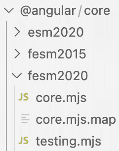
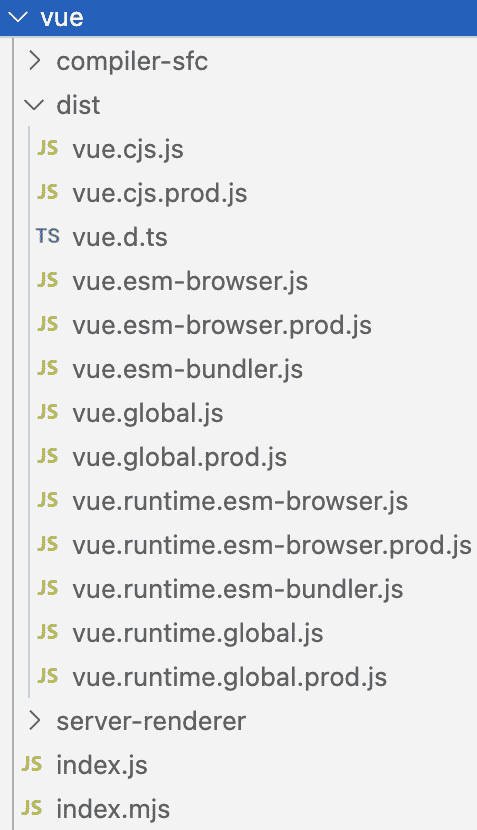
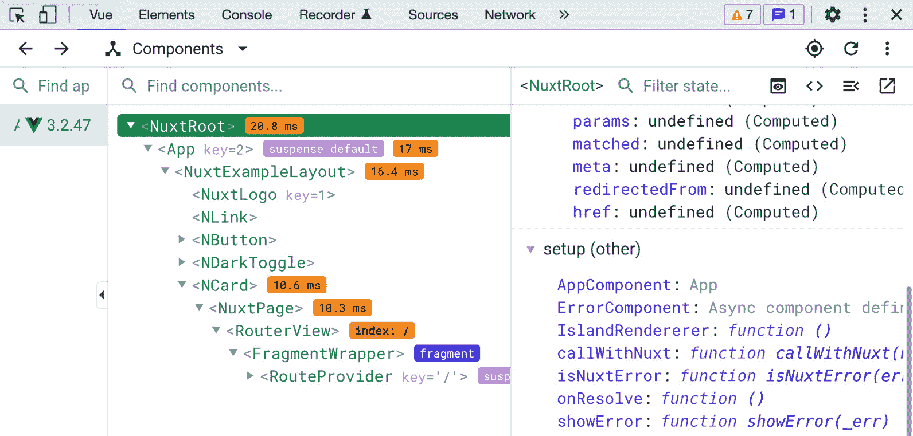
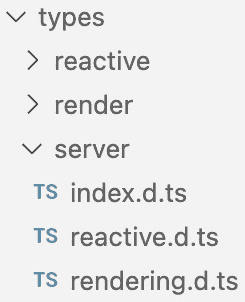
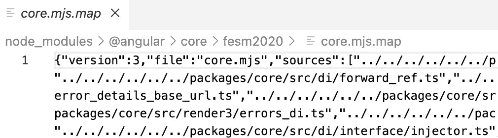

# 内部框架架构

在前面的章节中，我们学习了当前框架的历史，探讨了抽象的概念。我们还研究了 JavaScript 框架如何使用、组合和扩展不同的抽象来使框架功能化。在本章中，我们将深入研究 JavaScript 框架的架构模式。为了更进一步并扩展我们的框架知识，我们必须仔细检查现代框架的构建内容以及我们可以从现有模式中学到什么。

作为本章的一部分，我们将探讨以下内容：

+   理解现有前端和后端框架的核心技术架构模式。我们将关注结合成一个单一系统的设计、架构和结构模式。

+   概览框架 API、打包配置和附加工具。

+   理解对框架有益的附加工具。

+   了解可用的编译器和打包器。

# 技术要求

与上一章类似，我们将使用本书的存储库作为本章的扩展。您可以在[`github.com/PacktPublishing/Building-Your-Own-JavaScript-Framework`](https://github.com/PacktPublishing/Building-Your-Own-JavaScript-Framework)找到它，相关文件位于`chapter3`目录中。要运行该存储库中的代码，您可以使用任何支持使用终端或命令提示符、运行 Node.js 的环境，例如 Windows、macOS 和大多数 Linux 版本。

本章中提到的大部分代码都可以在本书的存储库中找到，因此您无需导航外部存储库。请按照`chapter3`目录中的`README.md`说明开始。此外，许多框架架构都关注于将使用该框架构建新项目的利益相关者或开发者。在本章中，我们将称他们为*框架用户*，以免与使用这些框架构建的应用程序最终用户混淆。

# 探索核心架构

让我们探索构建框架的核心架构组件。当一个框架项目被创建时，它通常被划分为一个有组织的目录结构，包含各种专业部分。这种方法有助于分离特定模块、脚本和文件的关注点。这种组织模式类似于网络应用项目的组织方式。但在框架的情况下，项目需要导出公共接口和脚本以便使用。在某些情况下，框架也可以拆分为多个存储库，以允许采用不同的框架开发方法。

由于每种语言的编程环境都不同，JavaScript 和 TypeScript 框架都有自己的方式来构建框架项目，这使得生成工件和使框架在利用它们的项目中更容易使用。一个组织良好的项目使得维护、协作和重构该项目的许多部分变得更加容易。例如，让我们以 Vue.js 和 Angular 这样的现实世界示例为例。Angular 将大多数框架文件保存在单个存储库中（可在 [github.com/angular/angular](http://github.com/angular/angular) 找到），除了其命令行工具（位于 [github.com/angular/angular-cli](http://github.com/angular/angular-cli)）。然而，许多包作为独立的依赖项发布在包注册表中，例如 **npm**（可在 [npmjs.com/package/@angular/core](http://npmjs.com/package/@angular/core) 找到）。框架包的结果可能与前端框架不同。在 Angular 的情况下，它由针对不同版本的 JavaScript 的预构建文件组成。

在 *图 3*.1 中，Angular 核心以未扁平化和扁平化版本提供，位于 `esm2020`、`fesm2015`、`fesm2020` 目录中，这些包还包含了各种源映射：



图 3.1：作为 npm 包提供的 Angular 核心文件

根据目标浏览器或使用的打包技术，Angular 提供了多种导入选项。Vue.js 也有类似的打包导出，提供了多种选项来在特定的 JavaScript 模块环境中加载框架。

*图 3*.2 中的输出目录是使用 `rollup.js` ([rollupjs.org](http://rollupjs.org)) 打包 Vue.js 框架的结果，为每个目标运行时创建输出配置。该配置的源代码可以在 [github.com/vuejs/core/blob/main/rollup.config.js](http://github.com/vuejs/core/blob/main/rollup.config.js) 找到：



图 3.2：Vue.js 作为 NPM 包的分布

针对配置产生的文件会随着运行时目标的变化而缓慢演变。例如，如果框架通常不作为全局变量包含在 `<script>` 标签内，那么删除全局变量输出或将框架用户的输出转换为满足其需求可能是有意义的。

打包框架的示例

您可以通过在 `chapter3` 目录中运行 `npm start` 脚本来查看框架打包的示例。一旦打包的框架源代码下载并解压，您就可以查看 Angular 和 Vue.js 的几个输出结果。

现在构建步骤在 JavaScript 项目中如此普遍，这些框架也提供了直接导入框架包并将其包含在构建过程中的方法。框架的“未扁平化”版本就是这种情况的一个例子，其中框架文件没有被连接。相反，打包器会合并这些文件，并在可能的情况下使用代码拆分等技术进行优化。

使用框架的应用程序在`package.json`文件中导入依赖项。Angular 将框架的不同部分拆分为不同的包：

```js
"dependencies": {
    "@angular/animations": "¹⁵.2.0",
    "@angular/common": "¹⁵.2.0",
    "@angular/compiler": "¹⁵.2.0",
    "@angular/core": "¹⁵.2.0",
    "@angular/forms": "¹⁵.2.0",
    "@angular/platform-browser": "¹⁵.2.0",
    "@angular/router": "¹⁵.2.0",
},
```

将这些模块拆分为各自的包，为不同的模块之间创建了一个明确的边界。然而，通常需要额外的发布工具来简化管理和发布多个模块，而无需手动打包。拆分的包也使框架用户受益，因为他们可以根据自己的应用程序选择所需的模块。

Angular 核心依赖项的实际应用

**第一章**（[B19014_01.xhtml#_idTextAnchor015]）中的框架展示已经包含了本节中提到的所有 Angular 依赖项的现有示例。你可以在`chapter1/angular`目录中找到应用程序，运行它，并根据你的喜好进行调整。许多这些核心依赖项可以在`npmjs.com/search?q=%40angular`的`npm`包列表中的`@angular`命名空间中找到。

在 Vue.js 的情况下，核心架构被分散在许多 GitHub 仓库[github.com/vuejs](http://github.com/vuejs)中。核心、路由、开发者工具、文档和其他框架部分被分散在 Vue.js 组织的不同仓库中。在构建新的框架时，通常更容易在一个仓库中管理大部分内容，甚至将所有内容都放在一个包中。结构仍然可以很好地分离，并且可以避免管理额外仓库的额外摩擦。随着项目的增长，你可以根据自己的需要将其拆分为多个仓库。到那时，框架应该已经建立了一个稳定的发布模型和基础设施来支持这种扩展。

为了更好地理解框架设计和维护的更广泛的架构模式，我们将探讨构成框架技术架构的三个重要部分：

+   **模块**：代码库的独立部分，通常位于单个 JavaScript 文件中。这些模块通常导入或导出函数、类或其他类型的结构，这些结构随后作为更大系统的一部分被使用。

+   **包**：框架背后的主要源代码包括暴露给用户的接口和用于内部实现某些功能的接口。

+   **脚本**：作为框架一部分公开的二进制文件和脚本。其中一些脚本也用于框架开发和特定用例所需的额外工具。

+   **编译器**：作为框架的一部分包含的程序，这些程序要么从框架中生成主要的 JavaScript 输出，要么作为开发过程的一部分使用。

并非这些类别中的每一项都是成功框架所必需的，但作为作者，我们可以挑选出对我们项目重要的部分，并专注于这些部分。如果我们观察现有的框架，我们会看到适用于 JavaScript、前端和后端项目的相似模式——这些项目采用了所有或大部分这些建筑类别。

在下一节中，我们将探讨框架开发中的两种技术模式——这些包括影响不同框架如何工作的架构和设计决策。

# 模式

专注于框架开发需要了解不同类型的软件模式，例如架构、设计和技术模式。了解这些模式以及它们在现有框架中实现时所做出的决策，可以帮助新的框架作者在他们的项目中取得成功。

## 建筑模式

我们在第一章中看到了现有建筑模式的例子，如 MVC 和 MVVM。JavaScript 框架有自由选择任何类型的架构模型，只要它们认为适合它们的用例。例如，基于组件的架构在现代前端框架中非常相关，并被许多系统使用，特别是那些扩展 React 库以增加其功能集的系统。在这种模式中，每个组件都封装了自己的状态、视图和特定的行为，甚至可能包含嵌套组件。

在后端框架中，中间件架构模式通常被用来管理或修改传入的请求和传出的响应。这种模式由于服务器请求和响应的性质而非常有效。

在 Electron.js 应用程序框架中，我们可以看到对建筑模式的不同方法。大部分情况下，Electron.js 是在界面渲染进程和主进程之间的进程通信之上设计的，用于低级操作。这种架构方法虽然没有定义特定的名称，但仍然将架构引导到关注点的分离。如果你查看一些 Electron.js 应用程序的代码库，你会注意到界面和后端操作之间的组织。框架也可以使用结合面向对象、函数式和响应式编程方面的混合架构模式，以实现最大的灵活性。许多这些概念可以在 Nest.js 框架中看到，如第一章中所述。

通过浏览各种开源框架的设计决策和代码，你可以找到不同架构模式的多种实现。作为一个未来的框架作者，我鼓励你在这一领域进行创新，通过创建你自己的原始架构模式或从既定模式中推导出你自己的方法。

## 设计模式

在设计模式方面，这些模式与架构模式相比处于更低的层次。这些模式解决的是框架如何解决组织代码和技术以实现一致架构的常见挑战。

在*第一章*中，我们通过观察者模式看到了一个设计模式的例子。除了观察者技术之外，框架还可以利用工厂模式，这有助于根据某些定义创建和管理可重用对象。根据实现和环境的不同，额外的增强可能包括管理创建的对象。在所有类型的 JavaScript 框架中经常看到的设计模式还包括发布和订阅模式。这种模式允许框架内部和基于框架抽象构建的组件通过发出事件和订阅这些事件来相互交互，从而在系统不同部分之间创建一种异步通信方式。

模块和模块设计模式在所有 JavaScript 软件中也同样普遍。你将发现由语言本身定义的模块 API 以及由不同框架精炼的模块抽象。这种模式主要集中于强制封装、标准化代码库以及防止大量复杂的代码块。

在下一节中，我们将探讨技术架构。它包括与技术方法相关的细节，例如概述 API、定义入口点以及使用额外的工具来启用框架行为。

# 技术架构

技术架构和模式主要处理技术挑战。对于 JavaScript 应用程序来说，这可能意味着处理页面渲染、响应请求、与数据库交互、加载应用程序等等。在框架中，技术挑战不仅限于解决特定技术问题。相反，它关于创建一个精心设计的包装系统，这对框架用户构建项目是有益的。

为了创建这个系统，框架作者需要结合一组包装接口和一组可用的脚本，并使用额外的软件来改善 JavaScript 编程体验。

在学习技术架构的过程中，我们将探讨三个类别，这些类别使得框架的基本功能得以实现。我们将探索这些技术主题下的所有子类别，正如在*图 3*中所示。3*：

| **包** | **脚本** | **编译器** |
| --- | --- | --- |
| 核心 API | 二进制和可执行文件 | 框架编译器和打包器 |
| 入口点 | 文件生成器 | 类型 |
| 开发者工具 |  | 源映射 |
| 插件和扩展 API |  |  |

图 3.3：技术架构的子类别

我们将从框架的核心包开始，这些包能够提供强大的功能。

## 包

包包含框架的核心逻辑，以及公共和私有 API。此目录可以包括框架运行所必需的任何包。它包括内部和公共接口。它还可以包括编译器或任何作为框架开发或开发者用例一部分使用的构建工具。这些是构成框架核心的部分。根据框架的不同，包可以是功能独立的，也可以相互依赖以实现功能。通常，框架的包部分可以包括任何应作为框架一部分包含的相关代码，但今天框架包括的包类型有几种基本类型。我们将在本节中更详细地探讨这些内容。

### 核心 API

根据框架的不同，“核心”包可能包括各种模块，用于提供公共用户暴露的接口和私有接口以启用框架功能。在*第二章*中，我们看到了框架包提供的公共 API 的示例，例如路由、事件管理、模板模块等。核心包在前后端框架中通常结构相似。

前端框架启用`@vue/reactivity`([npmjs.com/package/@vue/reactivity](http://npmjs.com/package/@vue/reactivity))。响应性是框架功能集的重要组成部分，我们将在后面的章节中进一步探讨它。

**依赖注入**(**DI**)是某些框架的核心，允许框架内和应用程序内的模块声明它们的依赖关系并使用外部接口。作为 DI 的一部分，框架也有接口来声明依赖提供者。你将在一些框架中找到 DI 的使用，最著名的是 Angular。有关 Angular 的 DI 的指南和更多详细信息，请参阅[angular.io/guide/dependency-injection](http://angular.io/guide/dependency-injection)。由于 JavaScript 缺乏接口和类型，DI 功能并不像 TypeScript 或其他编译器那样受欢迎，这些功能是通过 TypeScript 或其他编译器启用的。你也会在 Nest.js 的后端找到注入功能。

你将在 Angular 和 Nest.js 中找到熟悉的 DI 模式（如下面的代码块所示）；`@Injectable`装饰器的实现定义在框架的核心包之一，在[github.com/angular/angular/blob/main/packages/core/src/di/injectable.ts](http://github.com/angular/angular/blob/main/packages/core/src/di/injectable.ts)：

```js
// service: book.service.ts
import { Injectable } from '@angular/core';
@Injectable({
  providedIn: ‹root›
})
export class BookService {
  constructor() { }
}
// module: book.module.ts
import { BookService } from './book.service';
@NgModule({
  providers: [BookService],
})
export class BookModule {}
```

另一个常见的核心 API 是 `createRenderer()` API，用于执行上述操作——你可以在 [vuejs.org/api/custom-renderer.html](http://vuejs.org/api/custom-renderer.html) 上了解更多信息。

全栈和后端框架提供了一个 `@sveltejs/adapter-node` 适配器。此外，框架提供了几个官方适配器，具体请参阅 [kit.svelte.dev/docs/adapters](http://kit.svelte.dev/docs/adapters)，这些适配器允许你为最大灵活性和与部署环境的兼容性定义适配器。也可能出现这样的情况，即前端框架仅将其服务器作为其内部组件的一部分来启用开发功能，但在生产用例中，开发者需要提供自己的服务器。

Svelte.js node.js 适配器的来源

在安装脚本提取之后，`chapter3` 目录提供了 Svelte.js node.js 适配器的源代码。框架使用这个源代码以框架友好的方式消费代码输入并生成输出。

通常，所有类型的框架都有一个 **共享包**，可能包含公共和私有 API。通常，最通用的逻辑，在许多包中重复使用，会放入共享包中。共享包的竞争者可能包括与运行时环境和基础相关的代码。例如，这个包可以包括实用函数、管理并转义 HTML 实体、处理 HTTP 状态码、在整个框架中规范化通用值，以及存储框架中可用的常量值。

在下一节中，我们将探讨框架的入口点——即连接核心 API 与框架执行开始的粘合剂。

### 入口点

框架用户与框架交互的主要方式是通过一个 *入口点*。这个定义与简单程序的入口点非常相似，并且是我们运行简单计算机程序时执行开始的地方。根据框架的抽象和结构，这种入口点可能会有很大差异。

在前端 JavaScript 框架中，入口点的概念有所不同。这些框架可以通过 `<script>` 标签包含，然后通过调用入口点在页面上进行初始化。例如，Angular 有一个根引导模块，用于初始化应用程序：

```js
app.module.ts
@NgModule({
  imports: [
    // ...
  ],
  declarations: [
    AppComponent,
  ],
  bootstrap: [
    AppComponent
  ]
})
export class AppModule { }
```

在前面的代码中，`AppModule` 根模块对于初始化应用程序至关重要，因为它在浏览器中加载。它还定义了包含顶层导入和服务提供者的空间，以在应用程序中启用外部功能。

Ember.js 通过定义一个 `Application` 类的实例来实例化一个新的应用程序，使用类似的模式。这个 `Application` 类扩展了 `Ember.Application` 类，并提供了带有配置选项的对象字面量。此对象用于配置应用程序的各种组件和功能。此入口点类用于在开发人员进一步扩展项目功能时持有应用程序的其他类。要获取关于此 `Application` 类的精确细节，请查看其 API 文档，位于 [api.emberjs.com/ember/release/classes/Application](http://api.emberjs.com/ember/release/classes/Application)。

将 SvelteKit 视为一个不同的框架，由于它定义抽象的方式，它依赖于编译器和构建工具作为初始入口点。编译器检测根目录中的主 `page.svelte` 文件，并将其视为应用程序索引页的入口点。与 Angular 和 Ember.js 不同，这是一个更加简洁的入口点。

另一个入口点示例是 Nuxt.js 中的配置文件：

```js
nuxt.config.js
export default defineNuxtConfig({
  // My Nuxt config
})
```

此文件定义在项目根目录中。它允许进行框架配置和扩展，并接受各种选项。所有这些可能的选项都可以在 [nuxt.com/docs/api/configuration/nuxt-config](http://nuxt.com/docs/api/configuration/nuxt-config) 中找到。

在纯后端框架方面，通常入口点是启动服务器的引导文件。随着服务器进程启动，它初始化服务器配置，例如正确地将进程绑定到特定端口。这个过程在 *AdonisJs* 的 [docs.adonisjs.com/guides/application#boot-lifecycle](http://docs.adonisjs.com/guides/application#boot-lifecycle) 中得到了很好的说明，它作为一个状态转换机。这个引导过程也与 *NestJs* 类似，因为框架有一个用于引导服务器的服务器端 `AppModule`。

以下源代码是用于初始化应用程序的 Nest.js 引导脚本。在这个过程中，必须导入 `NestFactory` 和 `AppModule`。`await listen` 允许监听传入的请求：

```js
import { NestFactory } from '@nestjs/core';
import { AppModule } from './app.module';
async function bootstrap() {
  const application = await NestFactory.create(AppModule);
  await application.listen(process.env.PORT ?
     parseInt(process.env.PORT) : 8080);
}
bootstrap();
```

此入口点文件可以使用环境变量在所需的端口上引导应用程序。包含的 `AppModule` 文件包含用户定义的附加模块，这些模块将在脚本启动时加载。这种模式在其他框架中也很普遍，例如 Express.js 和 Hapi.js。

### 开发者工具

在开发应用程序时，您可能会发现一些开发者工具集，这些工具可以使得与框架交互更加容易。这些工具旨在帮助进行性能分析、调试和其他任务。在前端项目中，这些工具通常以浏览器扩展或独立应用程序的形式提供。

Vue.js 通过浏览器和独立工具作为其工作流程的一部分提供了一些集成良好的工具。它允许我们快速了解应用程序结构，并进一步调试应用程序的输出。*图 3.4*显示了这些工具在行动中的示例：



图 3.4：Vue.js 浏览器开发者工具

前端框架提供了一些开发者工具的好例子，大多数是作为浏览器扩展，有时作为独立应用程序来解耦浏览器工作流程：

+   **Angular DevTools** ([angular.io/guide/devtools](http://angular.io/guide/devtools)): 这些工具提供了性能分析能力和调试功能。它渲染组件树，类似于 Vue.js 中*图 3.4*所示的内容。

+   **Vue.js DevTools** ([github.com/vuejs/devtools](http://github.com/vuejs/devtools)): 如*图 3.4*所示，它提供了一个详细的组件树，带有搜索功能，以及一个路由列表，有助于调试路由配置。它还启用了时间线视图，以显示与 Vue.js 应用程序的交互历史。

+   **Ember 检查器** ([guides.emberjs.com/release/ember-inspector](http://guides.emberjs.com/release/ember-inspector)): 这套工具提供了大量的功能。它提供了一种探索 Ember 对象、组件树、路由、数据视图等功能的方式。

+   **React 开发者工具** ([beta.reactjs.org/learn/react-developer-tools](http://beta.reactjs.org/learn/react-developer-tools)): 这些工具允许您检查组件，编辑组件的实时属性，并修改状态。

+   **SolidJS 开发者工具** ([github.com/thetarnav/solid-devtools](http://github.com/thetarnav/solid-devtools)): 这些工具可视化和增加了与 SolidJS 响应式图交互的能力。与其他工具一样，它可以检查组件状态并导航树。

在您的框架中支持开发者工具时，可以考虑的一个有趣挑战是跟上框架的更新。Vue.js DevTools 通过针对框架的主要版本来解决这个问题——它为每个版本定义了一个包，例如`app-backend-vue1`、`app-backend-vue2`、`app-backend-vue3`等等。鉴于这些通常是浏览器扩展，它们在利用`DevTool`扩展浏览器 API 方面具有类似的架构（[developer.chrome.com/docs/extensions/mv3/devtools](http://developer.chrome.com/docs/extensions/mv3/devtools)）。

您可能会注意到后端框架缺少额外的开发者工具。在这些情况下，开发者依赖于调试器，如文本编辑器或 IDE，作为他们选择的工具。我们在调试 Nest.js 应用程序时，研究了*第二章*中的 Node.js 应用程序和框架调试。

在框架开发中，最初引入额外的特定开发者工具不是必要的一步。然而，这使得框架的使用变得更加愉快，并赋予了用户更多的能力。如今，JavaScript 运行时环境通常拥有出色的工具，无论使用哪个框架，都能帮助开发。

### 插件和扩展 API

在许多情况下，框架提供的包也支持可扩展性。这种可扩展性使插件和扩展开发成为可能，以多种方式使框架受益。提供的 API 使其他开发者能够自定义功能，并添加针对应用程序特定需求的新功能。它还允许框架专注于交付主要功能集，而不在框架的核心中包含每个潜在的功能。

这种可扩展性可能作为内部开发的一部分很有用，框架作者可以根据扩展接口创建适配器和接口。它也可以用于外部用例，其中核心开发团队外的开发者可以为特定用例创建功能，这些功能可以插入到框架中。让我们看看我们在 *第一章* 中讨论的框架提供的某些插件接口示例：

+   **Bootstrap** ([`getbootstrap.com/docs/5.0/extend/approach/`](https://getbootstrap.com/docs/5.0/extend/approach/)) 的文档包含创建可定制组件的指导原则，这些组件与核心功能配合良好。对于这个项目，开发者定义了一套规则作为指导方针。

+   `ember install <addon>`。它的文档中有一个完整的部分，支持插件开发。例如，大多数应用程序必需的功能，如身份验证，通过 `Ember Simple Auth` 插件 ([ember-simple-auth.com](http://ember-simple-auth.com)) 提供。

+   执行插件逻辑的 `install` 函数。

+   使用 `ng` 命令行工具，开发者可以快速生成这些新库。作为库工作流程的一部分，新模块会被发布到 *npm* 以供他人使用。

+   **Gatsby** ([gatsbyjs.com/docs/plugins](http://gatsbyjs.com/docs/plugins)) 有几个插件和非常好的文档，这有助于它们的开发。它提供了开发通用插件的工作流程，适用于任何用途，特定于单个项目的本地插件，以及转换插件，用于在类型之间转换数据。

+   **SolidJS** ([solidjs.com/ecosystem](http://solidjs.com/ecosystem)) 定义了一个适用于不同目的的插件生态系统。开发者可以从各种 UI、路由、数据和通用插件插件类别中选择。最受欢迎的类别是用户界面添加，这使得接近各种网络应用布局和小部件变得更加容易。

+   **Svelte** ([sveltesociety.dev/tools](http://sveltesociety.dev/tools)) 拥有一套旨在提高打包、调试和编辑体验的工具集。

+   **Hapi.js** ([hapi.dev/tutorials/plugins](http://hapi.dev/tutorials/plugins)) 提供了一个强大的接口来扩展框架的服务端功能。插件具有相当简单的接口，其中使用异步函数来注册和执行任何额外的扩展功能。

+   **AdonisJS** ([packages.adonisjs.com](http://packages.adonisjs.com)) 提供了扩展功能的“包”。为了加快包的开发速度，Adonis 使用了 **MRM** 代码修改预设，可以在 [github.com/adonisjs/mrm-preset](http://github.com/adonisjs/mrm-preset) 找到。它允许你快速为其框架搭建包的脚手架。

从我们刚才讨论的例子中，你可能会希望看到，在编写你的框架时，启用这种类型的可扩展性是很好的。这将有助于框架的成长，并使所有参与你框架生态系统的人受益。

在下一节中，我们将探讨各种脚本，这些脚本有助于管理当今的框架。

## 脚本

每个框架都需要能够代表其用户执行任务，对于构建框架的人来说也是如此，这就是架构需要引入各种脚本和程序来执行日常任务的地方。这些脚本通常有助于开发者提高效率并消除重复性任务。定义良好的强大脚本也可以使框架非常易于使用。在本节中，我们将查看框架附带的可执行二进制文件、文件生成器以及其他框架内流行的工具。

### 二进制文件和可执行文件

二进制文件和脚本文件有助于框架开发，有时也作为框架用户的接口。这些脚本可以包括构建步骤、自动化和其他与 JavaScript 相关的任务。在某些情况下，这些可以是辅助脚本，也可以作为编码过程的一部分持续运行。通常，这些是用 JavaScript/TypeScript 编写的，以确保跨平台执行并保持与同一语言的流程一致性。

当今的框架具有各种可执行任务，你可能会发现简短的 `npm` 命令或完整的脚本文件。这些可执行文件可用于以下目的：

+   **构建和发布**：这涉及到发布框架的新版本。在本章的开头，在 *探索核心架构* 部分中，我们看到了基于相同源生成的多个框架版本示例。这里，一个良好的构建脚本可以更新变更日志文件并创建源版本标签，这会很有用。此工作流程还可以涉及生成静态资产和上传框架工件。一个简单的例子可以在 Ember.js 中找到 ([github.com/emberjs/ember.js/blob/master/bin/build-for-publishing.js](http://github.com/emberjs/ember.js/blob/master/bin/build-for-publishing.js))。

+   **完整的测试运行器**：一个可执行文件，用于运行测试或其他测试集成。框架有许多类型的测试，通常创建一个可以设置测试环境并快速执行所有或所需测试的脚本非常重要。

+   **开发工作流程**：一个用于快速开始框架开发的脚本。通常，这包括启动 JavaScript 打包器、文件监视器和有时是开发服务器。

+   **管理依赖项**：在这里，你可以安装和重新构建依赖项。鉴于框架的许多部分可能位于单独的包或存储库中，自动化依赖项管理过程变得更加高效。

+   **代码风格检查和代码覆盖率**：与测试运行器类似，代码风格检查和代码覆盖率确保良好的代码质量标准。这些工具分析源代码并追踪语言的不正常使用。代码覆盖率工具确保测试运行通过框架代码的所有路径。

JavaScript 框架使用 `package.json` 的脚本字段 ([docs.npmjs.com/cli/using-npm/scripts](http://docs.npmjs.com/cli/using-npm/scripts)) 来定义一组常用脚本。在现有的框架中，你可能会发现该字段中定义的脚本列表可能非常庞大——例如，Vue.js 在核心包文件中定义了超过 30 个脚本命令。Angular 创建了一个名为 `ng-dev` 的工具 ([github.com/angular/dev-infra/tree/main/ng-dev](http://github.com/angular/dev-infra/tree/main/ng-dev)) 来管理所有开发任务。

AdonisJS ([github.com/adonisjs/core/blob/develop/package.json](http://github.com/adonisjs/core/blob/develop/package.json)) 拥有一份相当短的脚本列表，同时也很好地展示了框架可能需要的脚本示例。在这里，我们可以看到发布工作流程、测试、代码风格检查等示例：

```js
"mrm": "mrm --preset=@adonisjs/mrm-preset",
"pretest": "npm run lint",
"test": "node -r @adonisjs/require-ts/build/
  register bin/test.ts",
"clean": "del-cli build",
"build": "npm run compile",
"commit": "git-cz",
"release": "np --message=\"chore(release): %s\"",
"version": "npm run build",
"prepublishOnly": "npm run build",
"lint": "eslint . --ext=.ts",
"format": "prettier --write .",
```

其中一些脚本是一些快捷方式，例如`clean`任务，并调用其他工具执行操作。

在构建你的框架的过程中，确定你在框架开发和新版本发布时执行的一些常见任务是一个好主意。一旦你做到了这一点，为这些任务创建一系列定义良好的脚本。这将导致一个更加组织和愉快的开发工作流程。

### 文件生成器

你经常会发现，工具被提供出来以生成项目的常见组件的代码。通常，这些工具“生成”必要的骨架文件，开发者可以稍后修改这些文件以添加自定义的业务逻辑。如果你将这种脚手架功能添加到你的框架中，那么它将允许开发者减少手动编写的代码重复，并通过防止手动编写项目部分时引入意外错误来节省时间。通常，生成器还会创建测试文件并配置测试运行器，这又是节省时间的一个方面。这些生成器命令通常与框架捆绑在一起，并通过命令行界面提供。

JavaScript 框架通过允许应用程序被脚手架或允许开发者在项目进展过程中构建额外的组件来采用这种生成器模式。例如，Angular 使用图表（[angular.io/guide/schematics](http://angular.io/guide/schematics)）来生成代码。它为其实体内置了图表，但也允许开发者编写自己的图表。通过这个 **Schematics API**，你可以创建自定义任务来在应用程序项目中执行，包括完全操作文件和目录的能力。

在另一个例子中，Next.js 提供了一个名为 `create-next-app` 的应用程序脚手架工具（[github.com/vercel/next.js/tree/canary/packages/create-next-app](http://github.com/vercel/next.js/tree/canary/packages/create-next-app)），它允许框架用户快速开始使用 Next.js 构建应用程序：

```js
> npx create-next-app@latest
Need to install the following packages:
  create-next-app@13.1.6
Ok to proceed? (y) y
✔ What is your project named? ... framework-architecture
? Would you like to use TypeScript with this project? > No / Yes
```

Next.js 生成器是使用常见的 JavaScript 模块构建的，就像许多网络框架一样，它利用 Node.js 来实现这类工具。

根据你打算如何使用你的框架，你必须选择你想要提供的生成器功能类型。如果你的框架是大型内部项目的一部分，并且通常不用于创建新的应用程序项目，那么类似于 Angular 的图表方法会更合适。

在 *第一章* 中，我们看到了许多框架，如 Gatsby，都是静态站点生成器。这是一个框架可以依赖于基于某些文件生成工具的站点生成器的另一个用例。这种模式可以以与任何生成器相同的方式受益——抽象复杂性，消除重复性任务，并减少维护。

## 编译器

在一般计算中，编译器将某种类型的源代码转换为另一种目标源代码。JavaScript 在这个方面有很多不同的编译器工具，其中许多工具以不同的方式应对 Web 开发的挑战，同时适应最新的架构趋势。随着时间的推移，越来越多的框架开始使用某种类型的编译器进行开发，使这些项目能够享受到这些工具的好处。在本节中，我们将介绍一些目前在框架中使用的示例。

这些工具带来的开发改进和工作流程极大地造福了框架开发者。当您创建一个新的 JavaScript 框架时，您一定会欣赏利用这些工具。

### 框架编译器和构建器

框架结构通常是通过构建工具组装的。这一步骤的目标是获取框架所需的所有资源，对它们进行特定的优化，并输出一个针对特定运行时环境的、开发者友好的代码包。JavaScript 框架通常使用此类工具作为其构建系统。在本节中，我们将探讨一些可能的编译器和打包器选项：

+   `tsc` 是一个二进制文件，可以用来构建和分析 TypeScript 文件，并将它们转换为 JavaScript 文件。

+   **Webpack**：这是一个可以将 JavaScript 和其他与 Web 开发相关的文件进行多路复用的打包编译器。由于其流行和丰富的功能，Webpack 支持许多高级开发特性。

+   **Turbopack**：这是由 Webpack 的作者用 Rust、Go 和 TypeScript 编写的 Webpack 后继者，它由一个打包器和增量构建系统组成。与 Webpack 类似，Turbopack 工具链专注于将您的开发资源打包成优化的包。Turbopack 使用 Rust 编程语言来实现更快的构建，特别是对于大型项目。

+   **esbuild**：这是一个用 Go 编程语言编写的工具，它通过并行化工作负载来创建 JavaScript 包。

+   **Babel**：这是一个用于转换和生成新 JavaScript 语法到兼容旧语法的工具链，同时专注于跨浏览器支持和各种 JavaScript 环境的支持。您可以将它包含在框架的构建管道中，使其在旧浏览器中也能运行和测试。

+   **rollup**：这是一个用于创建优化后的 JavaScript 包的模块打包器，它拥有庞大的配置和插件生态系统。由于其低开销和输出灵活性，它非常适合框架使用。

+   **Parcel**：这是一个专注于零配置或最小配置的打包工具。Parcel 集成了许多内置优化，并自动将流行的源类型转换为 JavaScript。Parcel 可以用来生成包含业务逻辑和框架代码的优化后的应用程序包。

+   **快速 Web 编译器**（**SWC**）：这是基于 Rust 编程语言，其重点是加快 TypeScript 编译步骤。它被 Next.js 和 **fresh** 框架使用。

Jest – 我们在 *第一章* 中提到的测试框架 – 使用 Babel 构建测试框架本身。作为框架用户，你也可以通过调整 `babel.config.js` 中的 Babel 环境配置来选择特定的 JavaScript 目标：

```js
module.exports = {
 presets: ['module:metro-react-native-babel-preset'],
}
```

上一段代码块中的预设允许 Jest 在 React Native 环境中运行，这与常规的 JavaScript 应用程序运行时不同。

框架编译器可以是核心技术的一部分，因为它使系统的所有主要功能成为可能。基于 Svelte 的应用程序使用 Svelte 编译器，它接受 `.svelte` 文件并输出 JavaScript 文件：

```js
App.svelte
<script>
  let bookChapter=3;
  console.log(bookChapter);
</script>
```

给定一个基本的脚本，生成的 JavaScript 输出包括所需的 Svelte 依赖项和初始化的 `SvelteComponent`：

```js
import { SvelteComponent, init, safe_not_equal } from
  "svelte/internal";
let bookChapter = 3;
function instance($$self) {
  console.log(bookChapter);
  return [];
}
class App extends SvelteComponent {
  constructor(options) {
    super();
    init(this, options, instance, null, safe_not_equal,
      s{});
  }
}
```

上述生成的代码是编译器输出，将 `console.log` 的实例移动到实例函数中。编译后，script 标签被移除，代码被包装在一个 `instance` 函数中，该函数作为 `App` 组件的一部分执行代码。这成为由 Svelte 驱动的应用程序的入口点。Svelte 能够解析 CSS 样式块和类似 HTML 的语法。更多编译器在行动的示例可以在 [svelte.dev/examples](http://svelte.dev/examples) 找到。

如果框架使用将静态类型代码转换为的编译器，那么你可能需要定义和公开定义的类型。在下一节中，我们将探讨它是如何工作的。

### 类型

使用类型系统进行导出和构建是框架架构的另一个部分，并且在现代 JavaScript 工作流程中变得越来越流行。我们已经看到许多框架利用 TypeScript 进行其架构。TypeScript 提供了多种选项来组织这些接口和类型。它定义实现为 `.ts` 文件，声明文件为 `.d.ts` 文件。作为此架构的一部分，框架声明其 TypeScript 类型以供其内部和外部文件使用。外部类型作为文档的一部分提供给框架消费者。

框架将其类型声明作为其发布包的一部分提供。例如，整个 Solid.js 框架都是类型化的([solidjs.com/guides/typescript](http://solidjs.com/guides/typescript))，就像许多其他项目一样，并且在安装时包含 `types` 目录：



图 3.5：Solid.js 中提供的类型声明

*Solid* 将类型定义作为 `npm` 包的一部分分发，为服务器、渲染器和反应式接口提供特定的定义。

在下一节中，我们将探讨源映射，这是另一种与框架一起分发的编译文件，旨在提高开发工作流程的效率。

### 源映射

关于`.map`文件扩展名的概念。这些映射通常作为某些编译或构建过程的一部分被创建，因此我们将在这部分学习它们。

*图 3.6* 展示了生成的源映射的一个片段，尽管其中大部分内容对人类来说难以阅读：



图 3.6：Angular 的 core.js 文件生成的源映射

在这里，我们可以看到生成的映射正在使用规范的第三版；映射的其余部分旨在由能够处理大部分此文件的 Web 浏览器工具进行解析。

作为前端框架发布版本的一部分，映射文件作为框架包的一部分提供，开发者需要决定如何处理这些文件。当项目部署到开发环境时，整个项目可以使源映射可用。例如，Vue.js 在开发环境中使用*esbuild*来打包其代码，在生产构建中使用*rollup*。作为构建过程的一部分，它可以为这两个实用工具传递一个选项来为输出文件生成源映射。关于*esbuild*的更多功能信息可以在[esbuild.github.io/api/#sourcemap](http://esbuild.github.io/api/#sourcemap)找到。内部，*esbuild*使用 Go 编程语言快速构建 JavaScript 项目，并在其[github.com/evanw/esbuild/tree/main/internal/sourcemap](http://github.com/evanw/esbuild/tree/main/internal/sourcemap)仓库中实现了源映射规范。这只是其中一种实现方式，具体取决于你如何决定构建你的框架。你将能够找到许多为你的项目生成源映射的方法。

源映射同样在服务器端 JavaScript 中得到了应用。由于 JavaScript 抽象化编写方式的增加，Node.js 中的源映射功能可以帮助你追踪回原始代码，这些代码可能是用 ClojureScript、TypeScript 或其他语言编写的。

通常情况下，在你的框架中启用源映射支持并不困难。然而，你需要确保你正确地配置了它，确保网络浏览器工具能够正确地使用映射，并且仅在适用时才暴露源映射。

# 摘要

本章重点介绍了 JavaScript 框架的技术架构结构。我们关注了框架架构的三个重要部分：包（packages）、脚本（scripts）和编译器（compilers）。结合我们从第一章和第二章中获得的知识，我们可以开始精确地指出各种框架在架构结构上的核心差异。对架构模式的概述有助于我们理解现有框架是如何构建的，并使得我们构建新的框架变得更加容易。

探索现有的项目有助于我们从现有的开源框架中借鉴最佳想法。此外，学习内部设计可以深入了解框架如何适应使用框架的复杂代码库。下一章将探讨使框架开发和可用性更加完善的开发支持技术和模式。
