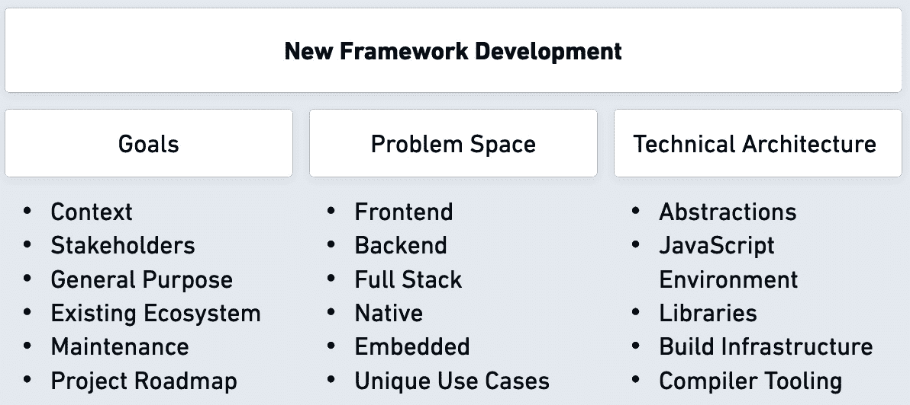

# 框架考虑事项

在前面的章节中，我们主要专注于从其他框架项目中学习，为构建我们的全栈 JavaScript 框架做准备，该框架将包括创建后端基础设施和前端界面的能力，并将具备测试这些功能两方面的能力。尽管我们的目标是全栈框架用于应用程序开发，但您将能够将从这个经验中学到的知识应用到类似的 JavaScript 项目中。现有项目的架构模式和设计决策将帮助我们定位我们的项目，并为其成功奠定基础。在本章中，我们将研究在规划我们的框架时需要考虑的三个因素，这些因素对有抱负的软件架构师和考虑成为大型技术项目决策背后负责人的个人来说都是有用的。

为了我们框架考虑的目的，以下列出需要涵盖的项目：

+   **确定项目目标**：关注你正在构建的内容以及框架 API 的主要消费者和赞助者。

+   **识别框架问题空间**：与您正在开发的框架的新问题空间相一致。

+   **技术设计决策**：塑造您框架独特性的因素，如技术栈、架构和开发方法。

在本章以及本书中，我们正在考虑一种框架构建的教育方法，这意味着未来的章节将涵盖特定类型的 JavaScript 框架的开发，重点关注 Web 应用程序系统。然而，你可以利用所获得的知识来构建满足你特定需求的框架。

以下图像将帮助我们关注考虑类别，并突出显示在规划和开发周期中作为有用信息的特定子部分：



图 5.1：框架开发支柱

# 技术要求

技术要求与前面的章节类似。使用本书仓库中的`chapter5`目录运行`npm install`，然后运行`npm start`，以快速开始本章中提到的代码和示例。

# 确定项目目标

在考虑构建新框架时，您必须确定您项目的目标和利益相关者。这两个因素是您在构建新事物的时间和投资背后的主要驱动力。开始一个新的框架项目需要了解潜在的动机，并对目标有清晰的洞察，强调您支持的开发者及其需求。这些原因可能从内部工作用例到开源爱好项目不等。您的场景可能非常不同，但根据*图 5.1*，我们可以探索本节作为第一支柱的*项目目标*。

## **上下文**

理解项目的背景对于指导其发展和确保其满足目标用户的需求至关重要。背景涉及评估诸如项目目的、目标受众以及它将在其中使用的环境等因素。框架项目的两个背景主题如下：

+   与工作相关的公司支持的项目

+   公共开源项目，通常具有教育或爱好性质

每种场景都伴随着其独特的需求和考虑因素。

为特定商业需求开发的框架可能具有从小型初创环境到大型企业的各种商业目标。在构建满足商业需求的框架的背景下，专业用例可能会有很大差异。例如，与 React 库的初始开发类似，一个项目可以支持单个平台，如 Facebook。然而，商业需求也可能包括为重复用例开发框架，例如部署具有相同核心架构的多个服务。

爱好/开源项目可以从**概念验证**（**PoCs**）或学习材料发展到软件行业广泛使用的工具。这些通常不会产生经济影响，但它们可以作为您职业和实际知识的增长工具。专注于在特定的软件开发和 JavaScript 知识领域扩展您的技能集。

在编写任何代码之前确定并调整您新框架的项目目标是明智的。如果您的项目专注于内部公司用例，例如支持内部公司产品，那么目标将更多地针对提高效率、改善协作和简化开发流程。最终，所有规划和建设都是为了支持主要核心目标——使组织能够更快地交付更高质量和更可靠的项目。

一旦您的框架进展，背景可能会发生变化。例如，如果框架最初是一个内部项目，那么在未来的某个阶段，您可以将其开源，并利用与之无直接关联的其他开发者的反馈。反之亦然——一个作为爱好项目开始的框架可能会被用于内部专业用途，并得到商业客户的投资支持。这两种情况在软件开发行业中都很常见。

## 利益相关者

您项目的目标受众和利益相关者是您的框架客户。他们是那些期望使用简单且具有充足编程接口的系统的人。满足他们的需求和期望对于您框架的成功至关重要。这些用户正在寻找一个易于使用且提供高效编程接口的系统，使他们能够轻松敏捷地开发应用程序和服务。

为了创建一个吸引目标受众的框架，你对利益相关者支持的投入对于确保开发体验直观且用户友好至关重要。利益相关者支持包括设计清晰、组织良好的资源，并提供解决日常问题的示例代码和用例。通常，你需要直接或通过其他方式为你的利益相关者提供支持。通过使开发者更容易理解和导航你的框架，你将鼓励适应性。

满足你受众多样化需求的强大编程接口也起着重要作用。通过提供实用、可适应和高效的工具，你将赋予用户自信地应对他们的项目，并培养对框架的信任和忠诚感。

作为框架开发者，请记住，你的受众的需求和期望应该始终处于你的设计过程的最前沿，因此你的目标应该是提供一种以用户为中心的体验，这种体验在竞争激烈的市场中脱颖而出，并成为开发者和利益相关者的无价资产。

在本书的背景下，框架以读者作为利益相关者，专注于教育材料。如果你正在跟随并创建自己的框架，请将自己视为利益相关者。这使得事情变得简单得多；你拥有改变和改变框架路径的自由。

在下一节中，我们将探讨一些其他在开始编码之前可能有益于反思的考虑因素。

## 其他考虑因素

在框架开发中需要考虑的额外项目与小型或大型团队开发软件项目非常相似。在确定你的项目是否需要存在以及是否应该构建时，以下主题中的有用问题可以作为考虑的一部分：

+   **框架的一般目的**：这源于核心目标；你应该清楚地了解交付你的项目的首要原因，确定特定的软件相关问题并旨在解决它们。

+   **现有工具的调查**：在从头开始构建新事物之前，评估生态系统中的现有项目是一个好主意。这种考虑将帮助你决定是否内部使用一些工具或扩展它们以满足你的需求。

+   **维护成本**：根据解决你框架问题空间所需资源的规模，你需要了解项目的时间和金钱投入。预测这一点将帮助你合理分配资源并确保项目的长期可持续性。

+   **创新和独特功能**：确定你的框架相对于生态系统中的现有解决方案提供的独特卖点和发展优势。这可能包括高级功能、增强的性能或解决典型问题的未探索方法。

+   **资源**：评估你的开发团队的技能、专业知识和可用性，并确定可能需要解决的任何差距。这可能涉及雇佣新团队成员或寻求外部支持，以确保框架的成功开发。在某些情况下，你可能成为推动整个项目发展的唯一资源。这带来了高效设计的优势，但同时也让你成为整个项目的负责人。

+   **路线图**：制定一个全面的路线图，概述项目里程碑和功能支持。通过在这上面投入时间，你可以为开发过程提供一个清晰的愿景，并帮助项目保持正轨，同时向利益相关者传达框架的方向。

+   **时间线**：确定你在框架上投入多少时间。这包括为每个项目阶段设定现实的截止日期，并考虑可能影响时间线的潜在风险和障碍。通过建立一个明确的时间线，你可以确保项目高效地推进，并专注于向目标受众交付价值。

本节中提到的所有考虑因素都可以对你的开发过程做出贡献。花点时间弄清楚所有这些考虑因素的问题，可能会极大地有利于你的项目。许多这些考虑因素将取决于你的框架的问题领域。为了帮助处理这个问题，我们将在下一节中介绍潜在的问题领域。

# 识别框架问题领域

框架旨在支持一个或多个项目的开发，专注于解决特定的问题领域。我们将问题领域定义为框架准备解决的一系列挑战或问题范围；这是来自*图 5**.1*的第二支柱。问题领域可以是框架打算使用的特定软件应用程序领域。

正如我们从本书前几章中框架的例子中看到的那样，JavaScript 在客户端和服务器环境中具有广泛的应用。它使我们能够构建满足我们需求和技术的框架。对于你的全新项目，你可能会面临特定的框架类别。通过关注独特项目的技术方面，结合创新功能，你可以使你的项目与野外的现有项目有所不同。

## 流行的问题领域

在 JavaScript 框架问题领域中，你可以采取以下一些潜在的开发路径：

+   **前端框架**: 专注于构建前端应用程序框架，你可以找到利用最新浏览器技术来开发独特渲染技术并改进状态管理的方法。鉴于这是一个具有许多现有解决方案的流行框架类别，一个更直接的方法是在这些现有解决方案之上编写自己的抽象——例如，在开发自己的自开发框架接口时，内部使用 Vue.js。这样，你可以针对你的问题空间，专注于其挑战并解决它们，而不是重新发明基础。

+   **浏览器解决方案**: 与前一点类似，你可以采取构建以浏览器为中心的解决方案的方法，不同于专注于 Web 应用程序开发的框架，并专注于利用浏览器可用的新技术。例如，你可以利用 WebAssembly([webassembly.org](https://webassembly.org))或 WebGPU([w3.org/TR/webgpu](https://w3.org/TR/webgpu))在客户端环境中开发独特的框架。

+   **后端应用程序**: 如果你正在为后端开发构建一个新的 JavaScript 框架，重要的是要关注可靠性、可扩展性和安全功能。你可以从查看本书或互联网上的示例开始，然后构建一个解决常见后端挑战的框架，例如处理某些类型的数据库、启用不同类型的身份验证和快速 API 开发技术。

+   **测试**: 如果你正在为 JavaScript 应用程序构建一个新的测试框架，你可以专注于提供一个简单直观的界面来编写和运行测试。你也可以启用对流行的测试框架和库的内置支持，以及与持续集成工具的集成。你还可以提供高级测试功能，如视觉回归测试、独特的并行化和分组技术，以及由模式匹配驱动的测试自动化。在本书的*第六章*中，我们将开始开发一个简单的测试框架，同时关注学习过程；它是一个很好的简单类型框架的竞争者。

+   **原生应用程序**: 通过为原生应用程序构建一个新的框架，你可以专注于提供使创建响应式和高性能应用程序变得容易的组件和 API。通常，这些系统提供了对移动和桌面功能的内置支持，例如相机访问、推送通知以及与原生操作系统功能的集成。由于你必须支持的环境数量众多，这种类型的框架开发具有挑战性。然而，正如我们在*第一章*和*第二章*中看到的，使用 React Native 和 Electron，这类项目并非不可能。

+   **嵌入式解决方案**：此类框架将专注于提供简单易用的编程和与硬件设备交互的接口。要创建此类框架之一，你必须为标准传感器和设备开发 API。这包括与外部芯片组、电机、GPS 和蓝牙配件一起工作。此框架背后的主要重点是创建一种独特的方法来减少内存和处理器使用，因为你的目标是嵌入式仪器。尽管过去有许多项目允许运行时与嵌入式设备交互，但 JavaScript 仍然是一个更复杂的挑战。

在前几章中，我们探讨了几个更流行的 JavaScript 框架的例子。然而，JavaScript 的通用性远不止我们所讨论的。这种语言可以使你构建针对其他细分市场的框架项目。JavaScript 在现代网络开发中无处不在，允许开发者构建强大且功能丰富的应用程序。

## 其他框架路径

JavaScript 允许我们构建许多其他类型的项目；它们都有自己的考虑因素。不分先后，让我们看看更多框架开发路径：

+   **游戏开发**：由于 JavaScript 是唯一可用的网络浏览器目标运行时，因此它最终成为构建游戏的唯一解决方案。你的 JavaScript 游戏开发框架可以提供工具和实用程序，使构建 Web 和移动平台的 2D 或 3D 游戏变得容易。这些实用程序可能包括内置对物理引擎、动画和音频的支持。在这种情况下，框架可以专注于提供高级功能，如多人支持或虚拟现实集成，因为这些功能变得越来越受欢迎。一些流行的 JavaScript 游戏开发框架包括 Phaser、Pixi.js、PlayCanvas 和 Babylon.js。尽管游戏开发框架对渲染和性能有特定的要求，但你仍然可以使用本书中的知识来构建此类框架。

+   **计算**：一个新的计算和数据科学框架可能能够执行科学计算和数据分析任务。你可以专注于提供一组用于执行数学运算和处理数据的 API。此框架可能内置了对流行的数据可视化库和统计分析工具的支持。JavaScript 计算框架的潜力在于前端表示和后端计算层。一个框架可以结合这两种可能性。

+   **可视化**：与计算主题类似，有空间来改进 JavaScript 数据可视化框架。在可视化项目中，你可以专注于提供一套工具和组件，用于创建交互式和动态的可视化。你也可以与可视化库如 D3.js 集成，并探索高级功能，如实时数据流。随着这个领域的不断发展，你可以找到从许多数据源渲染和交互信息的新方法。

+   **人工智能**：如果你决定开发一个用于人工智能和**机器学习**（**ML**）的 JavaScript 框架，你应该优先提供一套构建和训练神经网络的 API。考虑基于广泛使用的 ML API 和库，如 TensorFlow.js ([tensorflow.org/js](https://tensorflow.org/js))构建你的框架。这样的框架可能包括与各种类型的 ML 格式和配置的互操作性。

+   **用户界面（UI）**：围绕构建 UI 构建的框架可能对常规前端应用的不同功能集有所帮助。它可以包括可定制组件和响应式 UI 的功能。创新功能可能包括利用现代 CSS 特性的样式和主题组件。该框架可以与外部库如 Tailwind CSS、Material UI、Bootstrap 等集成。如果你在营销或设计相关环境中工作，构建 UI 框架可能是有利的。

根据您的框架目标，这里有一些潜在的框架路径。在本书的前几章中，我们已经详细介绍了这些框架的一些类别的来龙去脉。这并不是在 JavaScript 环境中可能解决方案的详尽列表，但它展示了众多可能性。最受欢迎且最具竞争力的框架类别与构建前端应用相关。

现在我们对问题领域有了更清晰的愿景，在下一节中，我们可以继续考虑框架项目的技术架构。

# 技术架构

在本章的前几节中，我们确定了我们的利益相关者——那些将直接从我们的框架项目中受益的人。我们还确定了潜在的问题领域。这两个因素为我们想要构建的内容提供了一个坚实的基础。在本节中，我们将探讨*图 5**.1*的第三个支柱——*技术架构*——以便我们能够专注于我们计划的项目的技术特性。

## 抽象层次和灵活性

在 JavaScript 框架的代码 API 中实现实用的抽象层次和灵活性是重要的设计决策。随着你开发框架，这两个原则是确保框架可用性、可维护性和适应性的必要条件。

如在*第二章*中探讨的，合理的抽象级别对于为开发者提供干净、易于理解的接口至关重要。底层实现的封装复杂性提高了生产力，并最小化了错误的风险，因为开发者使用的是更高层次、更直观的 API，这使他们免受不必要的复杂性。

合理的抽象级别促进了代码的模块化和可重用性，因为框架的功能可以更容易地连接和适应不同的环境。提供一定程度的模块化使开发者能够构建在现有模块之上，培养一个由开发者驱动的扩展生态系统，进一步增强了框架的功能。通过在抽象和灵活性之间取得正确的平衡，JavaScript 框架可以满足各种项目，从小型到复杂的应用。

在代码 API 中提供灵活性是成功 JavaScript 框架的另一个关键方面。灵活的 API 能够适应不同的编码风格、范式和用例，使开发者能够根据他们的独特需求调整他们的方法。这种适应性在快速发展的网络开发世界中至关重要，因为新的工具、库和模式不断涌现。通过提供多功能的 API，JavaScript 框架可以在这些不断变化的趋势面前保持相关性和价值。

抽象的一个潜在陷阱是创建高度有偏见的抽象，这会严格限制开发者如何使用框架。虽然抽象可以简化特定的用例，但它们可能会阻碍框架的整体灵活性，并限制其适用于更广泛项目的适用性。如果您想构建一个不那么有偏见的框架，考虑为您的利益相关者提供可扩展的选项，例如使用不同的模板引擎或在不同构建的应用程序中管理状态的不同方式。

在抽象和灵活性之间取得正确的平衡，并避免过度有偏见的抽象，将帮助您打造一个多才多艺且持久的 JavaScript 框架。

## 环境兼容性

JavaScript 在各种环境中运行，包括浏览器、服务器、移动设备以及其他独特的硬件，每种硬件都有其独特的特性，这使得兼容性成为任何框架成功的关键因素。确定您框架的运行环境兼容性就是确定要支持和维护哪些运行时。通常，在 JavaScript 框架中，这涉及到前端和后端功能的时间和技术的投资选择。这包括特定浏览器的 API 和与不同后端系统的兼容性。除了前端和后端系统之外，JavaScript 还支持许多其他环境。

框架开发者面临着一个重大挑战，即确保与多个 JavaScript 环境及其特定怪癖的兼容性。从高层次来看，这包括不同类型的浏览器引擎和与不同模块系统的兼容性。这项任务需要仔细考虑和设计决策，以确保框架能够在所有目标运行时无缝工作。

第一个设计决策是关于配置适当的 JavaScript 环境的兼容性。开发者必须考虑框架的目标环境，并确保它与所选设置兼容。例如，如果框架是为 Web 应用程序设计的，开发者必须确保它能够在多个浏览器版本和 API 之间无缝工作。由于浏览器功能的不同，可能会出现不兼容性，导致渲染不一致或应用程序无响应的问题。

在开发新的 JavaScript 框架时，另一个重要的考虑因素是处理环境差异。编写额外的代码兼容层对于微小的和重大的运行时差异来说是有价值的。处理运行时差异包括为旧版浏览器和旧版服务器端运行时投入时间以实现向后兼容。一般来说，支持多个前端 JavaScript 环境需要同一浏览器环境的不同版本。例如，许多浏览器，如 Firefox，都有各种版本，每个版本可能都有独特的功能或特性。开发者必须确保框架能够处理这些差异，并且无论浏览器版本如何，都能提供最佳的性能和功能。

例如，你必须处理跨运行时兼容性，以便启用服务器端渲染或 Node.js 测试前端组件。在构建框架时，JavaScript 服务器环境可能需要特定的考虑。它们可能具有与浏览器不同的 API，并且某些功能，如 DOM，可能不可用。因此，开发者必须确保框架能够处理这些差异，并在服务器环境中提供最佳性能。框架开发者包括 JavaScript polyfills 和类似的代码片段，为其他环境中的新功能和缺失功能提供回退机制。在构建一个应在多个领域工作的新框架时，这些是必不可少的。

确保与多个 JavaScript 环境兼容需要在框架开发和维护期间进行额外的彻底测试。测试在早期开发周期中识别和解决兼容性问题至关重要。例如，我们可以使用上一章中看到的自动化测试工具来测试框架在不同浏览器版本和移动设备上的兼容性问题。包括这些测试有助于确保框架在所有目标环境中提供最佳的性能和功能。然而，测试所有可能的运行时用例和特性可能具有挑战性，并且对所有框架将使用的配置进行测试是不可能的。幸运的是，随着 JavaScript 运行时的成熟，兼容性问题显著减少。如果你正在开发一个浏览器外的框架，类似于 Electron 或 React Native，你将面临更多的挑战。你必须确保框架与为你的项目设计的多个操作系统兼容。例如，操作系统运行时可能具有不同的功能，这会影响框架的功能集。

总的来说，你能够定义支持的 JavaScript 环境并控制你在框架中支持的运行时类型，知道与多个 JavaScript 环境的兼容性需要对你项目的持续维护和更新。这种维护包括与新浏览器版本或服务器环境兼容，这些环境可能会调整其功能或添加新功能。

## 利用库

在开发新框架之前承诺特定的 JavaScript 库是有意义的。使用现有的 JavaScript 库可以节省你的时间——你可以用这些时间来专注于框架的功能和技术架构。框架通常依赖于库来构建内部结构。这些库通常在幕后间接启用框架功能集，包括数据管理、路由、与 DOM 交互以及抽象化 JavaScript 运行时复杂性等功能。随着框架覆盖更广泛的功能集并塑造开发体验，内部库专注于为特定问题提供精确的解决方案。

选择正确的库集可以显著影响开发过程和你的框架的形状。你在框架中使用的库可能会让你成为它们的专家用户。然而，平衡使用库的好处与潜在的缺点，如兼容性问题、API 限制和持续维护，是必要的。

在探索其他 JavaScript 框架时，我们可以识别它们为特定功能所依赖的库。根据架构，您的框架可以将库直接集成到框架中，或者使用它来扩展框架的某些方面。如果我们看看 Angular，我们会发现它使用了 `BookService` 服务：

```js
import { HttpClient } from '@angular/http';
import { Injectable } from '@angular/core';
import { Observable } from 'rxjs';
import { map, retry } from 'rxjs/operators';
@Injectable()
export class BookService {
  private baseUrl = '...';
  constructor(private http: HttpClient) {}
  getWeather(latitude: number, longitude: number):
    Observable<any> {
    const url = `${this.baseUrl}?latitude=${latitude}
      &longitude=${longitude}&current_weather=true`;
    return this.httpClient.get(url).pipe(retry(3));
  }}
```

之前代码使用 `Observable` 类首先返回 `getWeather` 函数。在您的 Angular 类中，您可以依赖 RxJS 提供的许多数据处理操作符。此外，RxJS 库还提供了错误处理操作符，如前述代码中的 `retry` 调用所示。关于库操作符的详细解释可以在 [rxjs.dev/guide/operators](https://rxjs.dev/guide/operators) 找到。

探索 RxJS 示例

书籍仓库中的 `chapter5` 目录包含了一个使用 Angular 和 RxJS 库的示例。您可以通过在章节目录中运行交互式脚本或在 `angular-rxjs` 目录中执行 `npm install`，然后运行 `npm run dev` 来在自己的计算机上尝试这个示例。

示例应用程序将使用之前提供的 `BookService` 服务来获取数据。API 数据包含额外的属性，您可以使用这些属性来扩展现有应用程序。有关更多信息，请参阅 `README.md` 文件。

在另一个库使用的例子中，Vue.js 最初使用 **Vuex** 作为集中式状态管理的库。然而，随着框架的发展，管理状态的方法发生了变化。Vue 已经转向推荐并使用 **Pinia** ([pinia.vuejs.org](https://pinia.vuejs.org)) 进行状态管理。基于 Flux 架构的直观方法，这个与 Vue 密切相关的库允许开发者使用多个存储来管理状态，增强了可扩展性，并且与框架的功能更加紧密地一致。另一个我们在 *第一章* 中看到的例子是 Next.js，它使用 React 库进行渲染和其他功能。Next.js 专注于使用 React 提供的原始功能来抽象出直接使用库时的复杂性。

当您将库引入到框架中时，要明智地选择它们。通常，对于框架的用户来说，抽象出对库的直接访问更为轻松。否则，您必须在框架中支持特定的库 API，这会将您锁定在特定的编码模式中。历史上，Ember.js 必须投入精力将框架与其对 jQuery 库的使用解耦。这种迁移意味着为试图跟上框架最新版本的项目提供更新路径。

随着您的框架发展，您将在 JavaScript 库的生态系统中发现巨大的好处。挑战将是随着目标运行时的演变，跟上这些项目的不断发展。

## 编译器工具

在第三章和第四章中，我们考察了框架开发模式的一些实例。这些模式包括使用编译器和其它构建工具来开发框架结构和结构。毫无疑问，这些模式中使用的工具使得开发、重构和维护工作流程变得更加易于管理。因此，除非你的框架有特定的理由避免这些工具的好处，否则强烈建议充分利用生态系统。

### 构建工具和编译器

在编写框架项目的代码时，你希望从所做的代码更改中获得良好的反馈循环。这个反馈循环可以来自运行项目测试或在你开发新功能或修复错误时使用你的框架的示例应用程序。这种迭代工作流程可以通过内置的 JavaScript 行为进行配置，或者你可以依赖许多现有的构建工具和编译器。对于开发过程，编译器工具的选择可以显著影响并影响你框架的开发效率。回顾框架展示，我们看到了使用工具如 Rollup.js、`webpack`和`esbuild`进行 Web 框架开发和打包的例子。

这些工具的选择将取决于你框架的精确需求。在仔细选择使用这些工具时，你需要确保评估它们的优缺点。此外，你选择的工具应该适合开发工作流程和良好的框架发布工作流程。你可以决定将这两个工作流程分开，但这样可能会导致你需要维护的工具过多。例如，我们可以考虑以下因素来使用这些工具：

+   整体 JavaScript 运行时和功能支持，包括广泛的 JavaScript 模块格式支持和高级功能，如摇树优化和智能代码打包

+   对于前端系统，评估浏览器和 Web API 的支持

+   针对不同工作流程和环境时的配置复杂性和灵活性，可能选择零配置工具与全面配置工具

+   框架开发和生产构建的构建时间速度

+   与其他类似解决方案相比，工具的成熟度

+   开发者功能集，例如**热模块替换**（**HMR**）、开发服务器和即时实时重新加载

+   与外部工具的集成，如测试框架

这些因素可能因你的框架问题空间的不同而有所不同——例如，前端与后端领域。

尝试使用 esbuild

书籍仓库中的`chapter5/esbuild`目录包含一个使用`esbuild`打包前端文件的示例项目。你可以参考项目目录中的`build.js`文件以获取`esbuild`编译器的配置。当你在本机上本地运行此项目时，该工具将从`src`目录中提取资源，并将生成的文件输出到`dist`目录；这些文件随后被加载到项目根目录下的`index.html`文件中。构建步骤是通过在项目目录中执行`npm run dev`命令来执行的。

投入足够的时间，你可以开发出自己的编译器或打包工具。我们已经看到了使用 Svelte 等项目进行自定义框架编译器开发的先例。创建自己的工具是一项更大的任务，但这可以使你的框架与众不同，并具有巨大的潜力。

### JavaScript 扩展

在设计决策部分，特别提到了扩展 JavaScript 功能的 TypeScript 和类似工具。这些 JavaScript 语言扩展在近年来一直是框架开发的核心理念。即使使用 TypeScript 在框架开发工作流程中的流行度可能会随着时间的推移而下降，但它很可能会被其他类似的工具所取代，这些工具包含了 JavaScript 本身无法直接提供的优势。特别是 TypeScript，框架开发者可以从额外的功能中获得生产力的提升，如静态类型、接口、装饰器、命名空间等。所有这些都非常有利于框架开发。

假设你不确定是否要将额外的 TypeScript 工作流程引入到你的框架中，或者你有一个与 TypeScript 工具冲突的特定 JavaScript 环境。在这种情况下，你可以考虑一个设计决策，选择使用 TypeScript 类型的 JSDoc 注释版本。可以在[typescriptlang.org/docs/handbook/jsdoc-supported-types.html](https://typescriptlang.org/docs/handbook/jsdoc-supported-types.html)找到支持 JavaScript 文件带有 TypeScript 注释的类型范围。如果你不介意额外的转换步骤，并且完全选择 TypeScript 生态系统，那么它可以帮助你克服许多开发难题，例如以下内容：

+   减少在运行时识别出的代码问题数量

+   **加快代码重构的速度**：在框架中，这种能力更为关键，因为框架的代码库比常规的 Web 应用程序项目更加动态。

+   **改进基于类的编程概念**：你可以使用额外的构建块，如接口、继承特性等，以拥有一个设计良好的代码库。

+   **拥有一个描述性更强、文档更完善的代码库**：这会主动地对你和其他与你一起工作的团队成员带来好处。

+   **允许你更快地利用新的语法特性**：TypeScript 不断添加新的有价值的功能，并且不受浏览器缓慢采用新语法特性的限制。

所有这些好处都非常实用，最终使用 TypeScript 或类似 TypeScript 的解决方案来提升你的编码体验是一个良好的设计决策。

# 摘要

本章的核心思想探讨了我们在开始新项目时需要研究和牢记的几个关键因素和考虑事项。首先是确定框架的利益相关者和目标，这些包括实现这些目标的目标和受众。然后，我们考察了潜在的问题领域，重点关注理解我们可以考虑的项目类型。最后，我们探讨了可能塑造我们项目的特定 JavaScript 架构设计决策的例子。

考虑所有这些信息将帮助你创建一个更好的框架项目。同时，我们也将在这本书的整个过程中使用这些框架考虑因素。我们将在下一章开始应用所有这些考虑因素，因为我们将从零开始构建一个新的框架。
