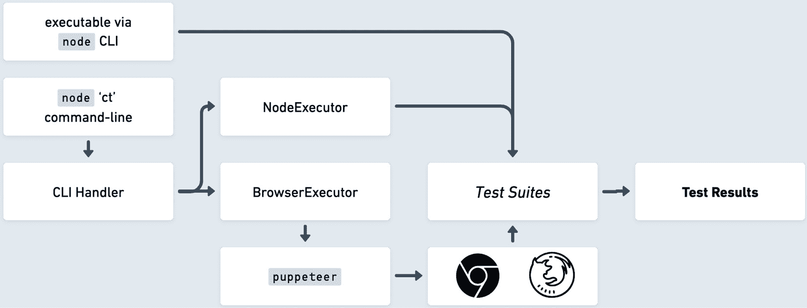
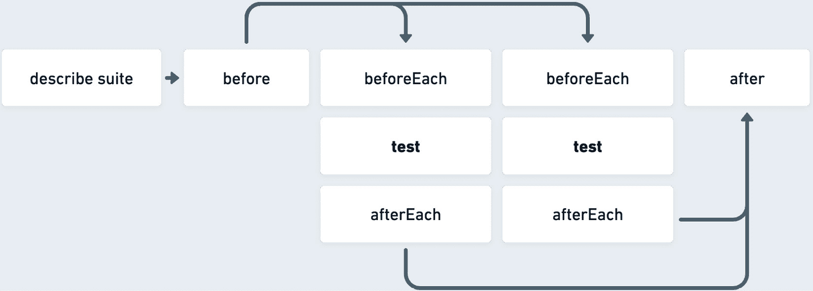
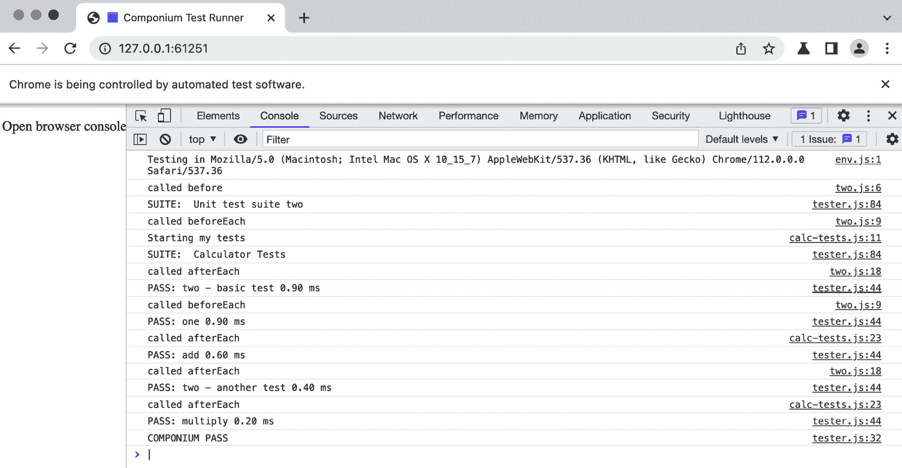
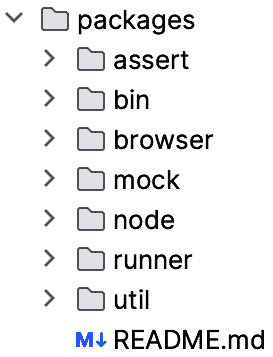

# 通过示例构建框架

本章结合了书籍第一部分和第二部分的所有见解和架构知识，并将其付诸实践。随着我们开发一个基于迄今为止所见模式和最佳技术的简单 JavaScript 测试框架，请跟随我们的步伐。这种实用方法将使我们能够通过示例学习，这对于此类软件主题来说是一种很好的教育方法。我们在这里构建的框架是一个专门为本章开发的新项目。我们可以将这个新的示例框架项目视为 JavaScript 框架开发的“Hello World”练习。通过这个练习，我们的目标是训练我们的能力，并将其应用于后续的实际项目中。

本章将通过示例介绍构建框架的以下主题：

+   首先，我们将为新的框架项目制定初始方法，包括确定目标、利益相关者和品牌，以从头开始创建某些内容。这主要涉及将第五章中关于项目考虑因素的学习付诸实践。

+   接下来，我们将学习如何概述一个典型的初始架构设计，以便将我们的测试框架实现启动。这包括概述组件如何组合以及项目的独特特性和接口。此外，我们还将总结开发人员期望利用我们的项目时所需的公共接口。

+   最后，我们将基于创建的设计实现我们的测试框架，包括核心功能组件、命令行实现、浏览器测试集成等。

# 技术要求

实现的框架代码位于[`github.com/PacktPublishing/Building-Your-Own-JavaScript-Framework`](https://github.com/PacktPublishing/Building-Your-Own-JavaScript-Framework)的书籍仓库中。我们的示例框架代码包含在`chapter6`目录中。为了跟随本章的实现说明，建议您与章节目录中的框架文件一起进行操作。

要运行代码，请确保已安装*Node.js v20 或更高版本*（您可以从[nodejs.org](http://nodejs.org)下载）。为了更容易地管理不同版本的 Node.js，您可以使用 Node.js 版本管理工具，例如`nvm`([github.com/nvm-sh/nvm](http://github.com/nvm-sh/nvm))。运行`nvm`将从框架项目目录自动安装适当的 Node.js 版本，因为项目已针对特定版本进行配置和测试。请确保运行`npm install`以获取项目的依赖项。运行`npm test`应输出一系列通过测试。这意味着您的本地配置已经全部正确设置。如果您从`chapter6`目录运行`npm start`，交互式脚本将为您执行所有这些步骤。

要测试此示例框架的前端部分，请使用基于 Chromium 的最新浏览器版本或 Firefox 的更新版本。要调试框架，请参考*第二章*中的*关于调试*部分。您可以使用该章节中记录的方法。

# 确定目标和利益相关者以及框架品牌

我们框架实践练习的主题是一个新的 JavaScript 代码测试框架。

## 目标

我们将努力实现的目标是为不同复杂度的项目提供稳健的测试工具。测试框架的主要目标是向开发者提供一个可靠、快速且多功能的平台，以验证其代码的功能性、性能和稳定性。此外，它们旨在最大限度地减少潜在错误的风险，并创造一个无缝的开发体验，最终产生高质量的产品。

为了实现这些项目目标，我们的 JavaScript 框架将专注于快速准确地执行测试，支持各种报告输出格式，并营造一个对开发者友好的环境。通过优先考虑易用性和与其他 JavaScript 工具和应用框架的集成，我们力求使测试过程尽可能无缝和高效。该框架还将支持跨平台测试，包括 Node.js 和真实网络浏览器环境，确保代码在各种环境中表现一致并符合预期。

此项目的附带条件之一是为您，即读者，创建一个类似沙盒的环境，通过提供一个可扩展且更直观的项目，您可以从中学习。我们鼓励您运行代码并扮演潜在框架贡献者的角色。

## 利益相关者

新的 JavaScript 代码测试框架的利益相关者可能包括各种具有特定软件测试需求的软件工程师和网络开发者。首先，JavaScript 开发者可以在他们的面向用户的项目中使用此框架，并将其包含在其他 JavaScript 软件的开发中。此框架可以是多环境测试代码的全栈解决方案。在开发者社区中，我们正在努力开发一个适合前端、后端、全栈开发者、质量保证和 DevOps 工程师，以及最终其他框架/库作者的框架。

我们的项目利益相关者可以从这个项目的架构特性中受益。例如，如果我们正在真实浏览器环境中测试代码，那么开发的框架可能对前端工程师来说是一个很好的卖点。通过构建这个项目，我们选择的 JavaScript 测试功能集可能会与某些工程工作流程产生摩擦或不兼容，例如在较旧的运行时和浏览器中运行测试。因此，主要来说，我们针对的是那些能够生活在新功能的前沿并且能够轻松地将他们的代码库与最新环境保持同步的开发者子集。

如果我们是在内部开发一个 JavaScript 代码测试框架，我们的利益相关者将是初创公司或大公司的内部开发者。在这种情况下，我们可以收集有关内部团队中最需要的功能集的见解。此外，可以开发特定的功能来满足特定的组织需求。项目的迭代和稳定性将取决于它在内部的使用情况。

利益相关者和框架开发者都能从一致的项目沟通和身份认同中受益。这就是我们的新框架可以通过添加一些品牌标识来获得一些好处的地方。更多内容将在下一节中介绍。

## 框架品牌

在深入架构和编码之前，花一些时间在我们的项目品牌和身份上，对项目结构来说是有益的。围绕框架创建一个身份是内部和公共项目中的一种常见模式，因为它清楚地定义了项目的逻辑边界，并为项目提供了总体背景。创建一个身份可能只是为你的新项目选择一个临时名称那么简单。它也可以是一个更复杂的创造性过程，正如我们建立项目名称时那样。这个名称将有助于为我们的项目创建一个*命名空间*，并由代码库以及加载此新项目的测试/依赖项目内部使用。当然，名称可以在稍后通过一些*查找和替换*来更改，所以这个决定不必是最终的。

我们将为我们的新项目使用一个新的框架名称，并在第七章和第八章中将其用于后续项目的进步。我们将**Componium**定义为我们在本书中开发的框架的总品牌。这个名字是对单词*Component*的戏谑，结合了*-nium*结尾，这使得这个名字听起来具有技术和软件感。此外，这个名字并不完全独特，因为 1821 年的一种乐器与我们的框架共享了同一个名字：[mim.be/en/collection-piece/componium](http://mim.be/en/collection-piece/componium)。更重要的是，这对我们来说不是问题，因为在 JavaScript 生态系统中没有这个名字的冲突。选择一个命名空间必须伴随着一些独特性，避免与现有的开发者工具发生命名冲突。

继续创意过程，在 *图 6**.1* 中，你可以看到我们框架的标志和配色方案，这些可以在文档中使用，并在项目的视觉特征中展示：


图 6.1：新框架名称和标志

测试框架将特别称为 *Componium Test*。添加身份资产有助于使项目更具辨识度，并在开发者社区中建立更强的品牌影响力，培养信任和认可。

在更技术性的方面，为你的项目创建一个命名空间，就像我们在这里用 *componium* 做的那样，可以在多个场合提供帮助。命名空间消除了潜在的命名冲突，并有助于与其他框架的冲突，同时帮助我们逻辑上对代码库及其组件进行分组，这对内部和外部开发者都有帮助。根据框架项目的类型，创建命名空间还可以使代码库的模块化方法更加完善。我们在 *第二章* 中看到了一个例子，Vue.js 采用 `vue-*` 命名空间来命名其许多包。此外，命名空间还可以帮助促进框架的定制和扩展，例如其他开发者贡献插件和补充。

现在我们对为我们的项目创建身份有了更多的了解，并且我们的品牌练习已经完成，我们可以转向构建我们新框架的激动人心的部分。

# 构建新框架

现在，我们将进入我们实用方法的架构部分。到目前为止，我们知道我们在构建什么，以及我们为谁构建它。现在是时候确定我们的功能集的形状，并看看我们如何为我们的用户启用这些功能。我们希望覆盖的最基本用例是生成 JavaScript 代码的断言，如这里所示：

```js
// basic.js
export function helloReader() {
  return "Hello reader!";
}
// tests/basic.js
import ct, { assert } from "componium-test";
import { helloReader } from "../basic.js";
ct({
  basic: function () {
    assert.strictEqual(helloReader(), "Hello reader!",
      "output is correct");
  },
});
```

以下代码示例测试了 `helloReader()` 函数，并验证返回了正确的字符串。从这些基础知识开始，为了更进一步，我们花费时间在核心功能上，并首先确定超出范围的特性。稍后，这可以帮助推动技术决策，当我们头脑风暴适合我们项目的扩展功能集时。我们的策略包括比较现有测试工具提供的功能，开发独特的特性，并思考哪些功能超出了初始范围。

为了进行一些功能比较，我们可以参考*第一章*中的一些框架。*Jest*和*Vitest*是值得考虑的框架，因为它们与我们本章构建的框架相似。此外，生态系统中的其他项目还包括`jasmine`、`ava`、`tap`、`tape`和`mocha`。这些项目中的大多数都提供了一个高级测试接口，具有特定的测试生命周期和创建断言的不同方式。所有这些现有的开源项目还提供了一套常见的核心功能，例如在各个项目中运行框架的可执行性、不同的输出格式选项、对接口进行存根或间谍的能力，等等。

在接下来的小节中，我们将探讨一些可以作为我们针对*Componium* *Test*项目初始方法的一部分实现的一些独特功能。

## 选择功能

为测试框架构思一系列功能可能既令人疲惫又令人兴奋。在测试工具开发方面，需要涵盖的领域非常多，大部分功能集覆盖了不同的开发领域。在本节开头提到的架构示例中，我们列出了基本的测试用例，现在我们可以在此基础上进行扩展。以下是一些可能有助于我们的项目为其利益相关者提供更完善功能集的附加功能类型：

+   **强大的测试运行器**：该框架提供了一个具有执行单个或完整测试套件能力的测试运行器可执行文件。它为用户提供了一种选择性的执行格式，可以指定要运行的测试，这在开发和调试情况下非常有用。测试运行器还允许用户使用特定的语法定义测试用例。

+   **跨平台测试**：该框架支持在不同的 JavaScript 环境中进行测试，例如提供对 Node.js 和 Web API 测试的一些支持。

+   **断言类型**：用户可以使用不同类型的断言样式，这为测试的结构化提供了灵活的选项。这些不同的断言样式满足了不同的偏好，并可能影响测试代码的可读性和可维护性。提供多种断言类型允许开发者选择最适合他们需求和编码风格的选项。

+   **测试套件接口**：提供一个丰富的接口，包括设置函数和生命周期钩子。这些功能对于有效地组织和管理工作是必要的。一个良好的测试套件接口允许在测试或测试套件之前和之后执行必要的操作，从而实现更结构化的测试方法。

+   **代码桩功能**：启用对现有代码的监视、桩化和模拟的能力，以允许实现替换。这是确定应用程序代码所有可能调用方式的关键特性。例如，Jest 框架内置了以下功能：[jestjs.io/docs/jest-object#mock-functions](http://jestjs.io/docs/jest-object#mock-functions)。

+   **代码覆盖率**：输出代码覆盖率报告，显示被测试覆盖的代码库的百分比。

+   `webpack`、`rollup.js`以及其他。

+   使用`.`表示通过测试或使用`F`表示失败。通常，这些报告类型可以在运行测试框架可执行文件时通过环境或标志来指定。

+   **插件接口**：公开一个插件接口，使其能够扩展框架的功能集。对于测试框架来说，这可能是一个提供额外报告者或替换内置库的选项。

除了这个特性列表之外，我们的框架还可以专注于改善围绕 JavaScript 特性的开发者体验，例如处理 ES 模块环境或测试中的异步行为。它还可以选择满足许多特定的 JavaScript 使用场景，例如能够与特定库一起工作，并测试媒体和图形相关功能。

我们现在有一份丰富的可想象特性列表，这将为我们框架的实现提供一个合理的基石。特性规划和开发过程的一部分也包括确定哪些功能将超出范围。这就是我们在下一节中简要介绍的内容。

## 确定超出范围的功能

尽管我们已经确定了一个丰富的功能集，但它并没有涵盖测试框架所有潜在的使用场景。为了进一步提高项目的易用性，后续版本中还需要开发一些组件。特别是，这个初始版本旨在为框架创建一个基础，使我们能够快速迭代并添加新功能。专注于创建一个持续和直观的开发环境，而不是立即匆忙添加大量功能，会更好。在实际应用场景中，作为一个框架开发者，在迭代项目时收集用户反馈并解决利益相关者的最紧迫需求是非常重要的。

下面是一些可以作为后续版本潜在添加的功能和组件：

+   **测试监视器**：提供一个测试运行器模式，该模式监视文件更改，并在底层组件更改时重新运行测试。这对于开发者来说可能是一个受欢迎的功能，因为它在开发过程中提供了实时反馈。

+   **时钟和日期操作**：在现有模拟功能的基础上进行改进，JavaScript 项目中内置的时钟和日期模拟可以使冻结或操作日期变得更加容易。提供这个接口进一步提高了易用性。

+   **快照测试**：涉及捕获和比较复杂组件的输出。通过简化断言方法和将预期输出源与测试文件结构分离，可以节省时间。

+   **重试**：能够重试失败的测试可以改善不同测试环境中的用户体验。这个功能需要谨慎处理，以确保只有预期的失败才会重试，并且测试运行者不会报告已损坏测试的通过结果。

对于这样的框架，肯定还有更多可以开发的组件，但我们已经识别出的功能集合足以让我们构建架构设计大纲。开发过程的下一部分是从功能集中挑选出最重要的部分，并设计一个架构来实现这一功能。

## 设计大纲

我们需要引入一个可执行接口，以启用具有跨平台测试行为的测试运行者功能。这个接口作为命令行工具实现，必须处理用户在不同环境中的运行选项。最后，为了实现我们的主要目标——断言代码行为，执行模式必须返回测试断言的状态。

当可执行文件触发测试时，测试将发出其状态和事件。运行者需要尊重这些测试的生命周期，并订阅与测试工作流程相关的事件。可能的事件包括通过或失败状态，或者在出现断言错误时向上冒泡。

创建一个如图所示的设计图，可以更容易地看到使功能集能够相互交互的组件：



图 6.2：初始设计图

在*图 6.2*中，执行流程从左侧图中定义的可执行文件或命令行开始。在这种情况下，可执行文件是`ct`命令，代表*Componium Test*。如果开发者使用命令行作为入口点，那么**CLI 处理器**会解析提供的标志和选项，确定测试是在 Node.js 环境还是网页浏览器环境中运行。这将使我们能够在功能规划过程中评估的跨平台测试能力。

在 Node.js 环境中，`NodeExecutor`类可以解析提供的测试文件并运行其断言，记录执行的真实状态并输出测试的最终结果。`chapter6/componium-test/packages/node/executor.js`文件包含`NodeExecutor`的内容。代码被编程为为每个测试套件生成工作环境，并在测试用例中运行断言。随后，收集通过和失败的测试摘要。

在浏览器上下文中，`BrowserExecutor` 类依赖于由 `puppeteer` 库提供的外部网络浏览器桥接器。它创建测试运行器和真实浏览器环境之间的通信通道，排队预期的测试套件，并使用类似的接口捕获测试断言和生命周期输出。浏览器环境还有不同的运行方法，例如 *无头* 和 *有头* 模式，在测试运行时浏览器对用户是隐藏还是显示。此功能需要集成库和测试运行器可执行文件。此执行器位于 `chapter6/componium-test/packages/browser/executor.js`。此代码与 Node.js 方法类似，但由于它在浏览器上下文中运行，它必须将测试套件的结果发送回在终端进程中运行的 Node.js 测试运行器。环境差异使得这两个执行器的技术设计大相径庭。

*图 6**.2* 中的图表还概述了直接通过 `node` CLI 运行测试作为脚本文件的支持。在这种情况下，测试绕过 `ct` 接口，并在脚本运行时直接输出结果。这是一个方便的特性，支持直接测试工作流程。

*图 6**.2* 中的概述和图表没有捕捉到测试运行器工作流程的全部细节，但它们对我们的开发过程很有帮助。当你开发自己的框架时，你会发现创建这样的工件可以帮助你在构建不同类型的软件解决方案时更加高效和精确。有了概述的架构和功能，我们可以继续到接口设计过程的下一部分。

## 设计接口和 API

我们与框架交互的两个主要接口是主框架模块和测试运行器可执行文件。开发者必须通过 API 文档、示例等熟悉这些接口。此外，对这些 API 功能的破坏性更改或修改将影响已集成到框架中的项目。

我们正在查看的第一个接口是导入的 `componium-test` 框架模块。此模块导出主测试对象，该对象可以通过 **JavaScript 对象表示法** (**JSON**) 接受测试函数。该模块还导出其他框架接口，例如断言和模拟库。以下是如何使用此模块的示例：

代码片段 1

```js
import framework interfaces
import ct, { assert, fake, replace } from "componium-test";
import Calculator from "../fixtures/calculator.js";
  // fixture to test
let calc;
ct({
  describe: "Calculator Tests",
  beforeEach: () => {
    calc = new Calculator();
  },
  multiply: function () {
    assert.equal(calc.multiply(3, 2), 6, "3 * 2 is 6");
  },
  mockMultiply: function () {
    const myFake = fake.returns(42);
    replace(calc, "multiply", myFake);
    assert.strictEqual(calc.multiply(1, 1), 42,
      "fake interface is working");
  },
  afterEach: () => {
    console.log("called afterEach");
  }
});
```

使用模块在测试文件中的代码示例可以在框架的 `tests/calc-tests.js` 路径中找到。在这段代码中，我们看到包含了一个示例 `Calculator` 脚本的基本断言；这些是通过导入 `assert` 函数实现的。根据预期的功能集，我们有测试生命周期方法，如 `beforeEach`。此外，通过 `fake` 和 `replace` 函数启用了替换 `multiply` 返回点的模拟功能。

第二个接口是当用户安装框架时提供的命令行实用程序。这是一个测试运行器，允许与大量测试套件交互：

```js
> ct --help
ct [<tests>...]
Options:
     --version   Show version number                       [boolean]
 -b, --browser   Run the test in a web browser             [boolean]
     --keepAlive Keep the web browser alive to debug tests [boolean]
      --help     Show help                                 [boolean]
```

可执行文件支持多种选项以启用预期的功能集。此外，`--help` 标志还可以显示可用的命令及其快捷键。`ct` 可执行文件接受一个或多个测试套件作为参数，通过 `ct [<tests>...]` 语法可见。开发者在从 JavaScript 的 `npm` 包注册表中安装框架后应期望存在 `ct` 可执行文件。

我们现在了解这两个开发者级别的 API——测试可执行文件和测试接口。现在我们可以继续实现那些两个框架功能背后的功能特性。

# 实现新的框架

实施过程进一步指导我们如何创建 JavaScript 框架。在这个实施过程中，我们将看到测试运行器的不同入口点以及可区分的特性。本节大致遵循 *图 6**.2* 中的图，其中我们概述了框架设计。现在我们知道了我们的功能和项目架构的大致想法，让我们广泛概述这个项目的内部实施步骤，如下：

1.  确定设计的测试套件配置如何在 Node.js 环境中实现。

1.  创建内部包以在不同的环境中执行测试套件。

1.  实现真实网页浏览器模式测试的基础设施。

1.  从测试运行器收集结果并将其输出给用户。

按照第 *1* 到 *4* 步，我们开始实施，首先检查我们的测试是如何构建和执行的。在先前的 `Calculator Tests` 片段中，我们可以检查 JavaScript 对象结构，包括一个 `ct` 函数调用，接受一个测试套件对象。一些特殊属性包括描述测试套件名称和运行生命周期方法，如 `before` 和 `after`。这些方法的执行生命周期可以在以下图中看到：



图 6.3：测试生命周期

要启用`ct`函数调用，测试套件可以访问`componium-test`包以及我们框架的公共接口，例如断言库功能。我们可以在*代码片段 1*中看到将框架包含在`calc-tests.js`代码块中的示例。除了导入框架功能外，测试文件还导入了我们要测试的代码。

在 Node.js 环境中导入我们的框架需要将其正确导出作为包的一部分。为此，我们在`package.json`文件中定义一个`exports`属性。这允许项目将*Componium Test*配置为依赖项，通过名称导入模块：

代码片段 2

```js
"exports": {
  ".": "./packages/runner/tester.js",
  "./package.json": "./package.json"
},
```

上述配置指向我们的`tester.js`文件，该文件处理大多数测试运行逻辑，它由我们的`runner`包引用。

一旦测试对象被加载到框架中，它将被引导到名为`packages/runner/tester.js`的文件。`tester.js`文件是大多数测试发生的地方，包括在适当时间执行的生命周期方法，以及主测试函数。由于测试套件可以包含许多测试，测试器将继续调用所有提供的函数。为了测量测试的速度，我们可以依赖`performance` API（[developer.mozilla.org/en-US/docs/Web/API/Performance/now](http://developer.mozilla.org/en-US/docs/Web/API/Performance/now)）。这些 API 提供了高分辨率的时间戳，为我们提供了关于测试运行所需时间的数据。

## 测试功能

通过详细的测试断言实现卓越的测试体验，我们的项目需要一个可以在新编写的测试中使用的断言库。断言接口应包括相等比较、值大小比较、对象值评估等。

为了专注于广泛的框架开发，我们将导入一个名为`should`、`expect`和`assert`的外部测试断言库。随后，我们可以开发自己的断言基础设施或用不同的库替换 Chai，我们可能可以自己开发这个库。

当测试脚本执行我们提供的测试时，如果任何比较函数失败，我们方便的断言库将抛出异常，如下所示：

```js
AssertionError: 3 * 2 is 6: expected 1.5 to equal 6
    at multiply (file:///Users/componium-test/tests/
      calc-tests.js:20:12)
    at ComponiumTest.test (file:///Users/
      componium-test/packages/runner/tester.js:92:15) {
  showDiff: true,
  actual: 1.5,
  expected: 6,
  operator: 'strictEqual'
}
```

上述输出是测试中失败的片段之一，其中导入的`Calculator`模块未能正确执行`multiply`操作。框架需要处理这种代码行为。在断言或其他错误的情况下，测试运行器需要至少向运行进程发出至少一个或多个失败测试的信号。如果至少有某个东西翻转了`errorOccurred`标志，那么它将导致我们的测试节点进程以失败状态退出。

除了断言库之外，我们希望在开发的框架中提供模拟和存根功能。使用类似的模式，我们包括 Chai.js 库并将其作为测试 API 接口暴露，我们将包括**Sinon.js** ([sinonjs.org](http://sinonjs.org))库，它具有创建测试存根、间谍和模拟的丰富接口。它非常适合我们的项目，因为它支持许多 JavaScript 环境，并且在其他项目中经过多年的实战考验。这个库的存在将使开发者更容易增加代码覆盖率并编写更有效的测试。

在示例测试文件的代码片段(*代码片段 1*)中，我们使用 Sinon.js 的函数创建一个假的`mockMultiply`返回点。Sinon.js 方法也被从直接使用中抽象出来。相反，它们作为`componium-test`包的一部分被暴露。用户可以通过框架的`packages/mock/lib.js`模拟包访问库的模拟、伪造和存根机制。

通过简单界面暴露强大的断言和模拟库，我们的框架可以从一开始就获得丰富的功能。

## 创建命令行工具

在前面的章节中，我们讨论了将我们的`tester.js`文件作为导入的入口点来运行测试。为了匹配预期的功能集，框架需要支持从给定目录运行多组测试。这意味着以批量方式支持给定格式的多个测试套件。这意味着测试套件的数量将以以下格式组织：

```js
import ct, { assert } from "componium-test";
ct({...});
```

要获得这个批量执行功能，我们需要为我们的框架创建一个命令行工具。为了与 Node.js 命令行环境集成，我们需要在`package.json`文件中提供一个`bin`键来导出命令行文件，如下所示：

```js
"bin": {
  "ct": "bin/ct.js"
},
```

我们导出的二进制快捷键只是`ct`，以便从其他项目中轻松执行框架命令。为了开发二进制文件，我们可以依赖`yargs`库 ([yargs.js.org](http://yargs.js.org))来处理用户输入，解析从`process.argv`变量提供的进程参数。有关可执行文件结构的详细信息，请参阅`packages/bin/ct.js`文件。在可执行文件的结构中有几个需要记住的功能，重点是开发良好的接口并启用框架的特定功能，如下所示：

+   使用`#!/usr/bin/env node`将解释器包含在文件的第一个行中。这会向系统 shell 发出信号，使用 node 可执行文件来处理此文件。这被称为*Shebang* ([wikipedia.org/wiki/Shebang_%28Unix%29](http://wikipedia.org/wiki/Shebang_%28Unix%29))，其中在脚本中提供了解释器可执行文件。

+   将二进制包逻辑集中在与解析命令行标志和确保良好的命令行界面体验相关的代码上。这包括支持`--help`标志，提供快捷方式到标志，以及测试可执行文件的使用边缘情况。命令行界面（CLI）的标志或选项应遵循双短横线（`--`）结构或单个短横线（`-`）结构。

+   可执行文件应遵循 CLI 的标准规则。CLI 进程应以适当的退出状态码退出，并指示进程是否失败。这对于我们在本章中使用的测试运行器尤为重要。

根据执行模式，Node.js 或浏览器，CLI 文件（`packages/runner/cli.js`）选择正确的执行器类，并向该类提供一个目标文件列表。`NodeExecutor` 和 `BrowserExecutor` 类负责处理所有测试文件，并评估这些文件中的任何测试是否失败任何断言。在 Node.js 测试环境中，我们使用 `NodeExecutor` 类来运行测试。该类会启动新的工作线程以并发执行测试套件。此接口的主要目的是为多个目标文件运行测试，并返回一个总体通过或失败的结果。

## 浏览器测试工作流程

我们在开发的框架中探索的另一个功能是在真实浏览器环境中执行测试的能力。为此，CLI 接受一个 `–browser` 标志，该标志切换测试框架的运行模式。对于开发者来说，此接口的入口点可能看起来像这样：`ct –browser test/some_test.js`。根据框架可执行文件的方法，我们还可以引入一个单独的 `ct-browser` 可执行文件，直接在浏览器上下文中执行测试，而无需担心额外的参数。为了实现此功能，框架依赖于 `puppeteer` 库来启动一个新的浏览器实例，并与它建立通信通道。

*图 6.4* 展示了浏览器测试运行器工作流程的调试视图：



图 6.4：浏览器测试运行器工作流程的调试视图

这种操作模式有助于在浏览器测试失败时访问测试。此环境允许开发者在其代码中设置断点并调试测试。`packages/browser/executor.js` 中的 `BrowserExecutor` 文件负责启动一个真实的浏览器的新实例。它建立的通信通道可以依赖于控制台的消息或通过更高级的 `window.postMessage` 函数调用。

我们可以使用简单的 Node.js 服务器和一个小型模板库`eta`来创建一个执行测试的浏览器页面。我们可以使用模板库创建一个有效的 HTML 文档，该文档包含依赖项和测试文件。为了正确加载框架文件，页面依赖于`importmap`（[developer.mozilla.org/en-US/docs/Web/HTML/Element/script/type/importmap](http://developer.mozilla.org/en-US/docs/Web/HTML/Element/script/type/importmap)）将 ES 模块名称映射到 URL。以下代码片段展示了代码：

```js
<script type="importmap">
 {
   "imports": {
     "componium-test": "/runner/tester.js",
     "chai": "/chai.js",
     "sinon": "/sinon.js"
   }
 }
</script>
```

前端测试运行器的初始实现具有最小的接口，但它可以进一步开发以显示更交互式的测试仪表板。这可能是一个潜在的功能投资，如果测试运行器在浏览器相关测试中被大量使用，可以添加额外的前端功能。导入映射结构可以在`chapter6/componium-test/packages/browser/views/layout.eta`文件中找到。除了框架文件外，此文件还包括解析需要包含在前端中的动态测试套件列表。这使得在前端测试工具中包含和运行多个测试套件成为可能。

## 测试框架

在我们开发测试框架时，我们必须确保其可靠性和正确性。然而，使用另一个外部测试框架可能并不理想，而且我们不能使用该框架本身来测试其功能，因为它仍在开发中。我们使用简单的方法来应对这一挑战，使单元、快照和**端到端**（**E2E**）测试成为可能，以确保我们的项目正确运行。

我们的项目单元测试主要可以依赖于现有的测试运行器实现。然而，我们需要集成快照测试，这包括将测试运行器的输出与期望输出的快照版本进行比较。在我们重构某些功能时，我们应该使用快照测试来验证，以检测意外的变化。包含此类测试在我们推送新的更新和改进到项目中时，能让我们更有信心。特别是，需要更多关注的单元测试与测试运行器的退出状态码相关。

另一个重要的测试补充是包含覆盖整个框架工作流程的端到端测试。这包括安装包、导入测试包和执行测试。这些测试是通过创建一个单独的测试包来实现的，该测试包将我们的框架作为依赖项，如下所示：

```js
"dependencies": {
 "componium-test": "file:.."
}
```

示例测试项目在`package.json`文件中将`componium-test`作为依赖项，并指向父目录以加载文件。这些端到端测试可以在项目的`e2e`目录中找到。在*第九章*中，我们将探讨改进和验证项目质量的其他方法。

## 框架包

如 *图 6**.5* 所示是项目的初始包。它们位于 `packages` 目录中，类似于许多其他框架选择组织他们的项目：



图 6.5：项目的框架包

这些包根据它们的职责进行逻辑划分。以下是它们简要概述的功能：

+   `assert`: 包含断言库相关的配置

+   `bin`: 包含可执行文件，由 `package.json` 文件导出

+   `browser`: 与浏览器环境中的测试执行相关的文件

+   `views`: 模板文件，使得在前端上下文中加载测试成为可能

+   `mock`: 模拟库相关的功能

+   `node`: 与 Node.js 执行环境相关的文件

+   `runner`: 在执行上下文之间共享的全局测试运行器接口

+   `util`: 在框架中使用的各种实用函数

除了将所有自开发的包组合成一个统一的设计外，我们的项目还依赖于外部库。以下是框架中用于实现所需功能集的一些依赖项列表：

+   `chai`: 此库允许我们快速设置一个测试断言接口，使测试体验更加愉快。它为我们提供了 `github.com/chaijs/chai` 中有用的断言接口。

+   `sinon`: 此库允许我们提供一个用于创建测试间谍、存根和模拟的接口。启用此功能使我们的框架更适合测试 JavaScript 应用程序，因为它允许更全面的单元测试覆盖率。

+   `debug`: 一个小型实用工具，通过引入过滤后的调试日志，使开发框架变得更加容易。通过在每个框架包之后命名空间调试级别，它在执行测试时使理解框架的内部结构变得更加容易。

+   `eta`: 这是一个轻量级的模板引擎，帮助我们构建浏览器中的测试运行器。它生成一个包含必要的框架文件和测试套件的 HTML 文档。

+   `glob`: 此模块使测试目录可以进行模式匹配。它允许我们运行 `ct tests` 这样的命令，其中 `tests` 是一个目录，结果是在特定目录中找到所有测试文件。通常，`glob` 通过提供易于使用的文件模式匹配系统，为我们节省了大量编写文件系统相关代码的时间。

+   `yargs`: 这被用作框架 CLI 的参数解析器。它使我们能够为测试运行器创建更好的命令行体验。

+   `puppeteer`: 包含此库是为了向 `BrowserExecutor` 类提供一个真实的网页浏览器测试接口。`puppeteer` 通过控制一个 Chromium 或 Firefox 实例并在该环境中运行测试，实现了无头浏览器测试。

这些是我们将在项目中使用的依赖项的亮点。对于一些框架逻辑，我们已经构建了自己的解决方案，并组织在包中。同时，我们依赖外部库来解决特定技术挑战的复杂性。当前的架构允许我们引入新的包或扩展现有的包。定义的抽象也允许我们用其他解决方案替换外部依赖。

# 摘要

本章为我们提供了一个了解如何将本书早期章节中的概念和架构原则整合到构建基本 JavaScript 测试框架中的指南。这种实用方法为我们提供了构建测试框架内部结构的见解。即使我们最终没有编码一个新的测试项目，它仍然训练我们的软件肌肉，使我们具备从零开始构建某物的通用知识。我们的方法结合了库和包的组合，以实现标准和独特功能的混合。

我们涵盖了框架开发工作流程的三个部分：设置新项目、制定初步设计和完成目标头脑风暴的第一版，包括架构设计和实现。随着我们将这些技能付诸实践，目标是使你作为一个开发者对架构、开发和为他人制作成功的项目感到更加舒适。在接下来的章节中，我们将关注框架的发布和维护。我们还将继续这些实践练习，当我们逐步构建更多项目时。
