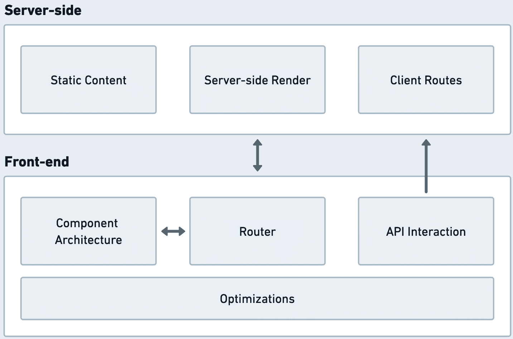
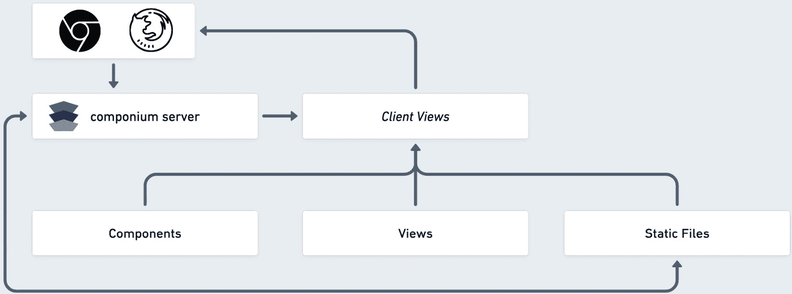
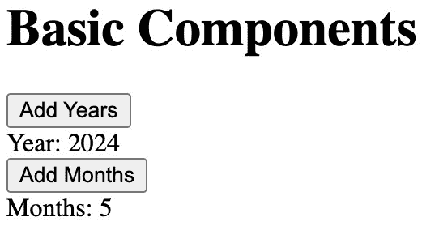
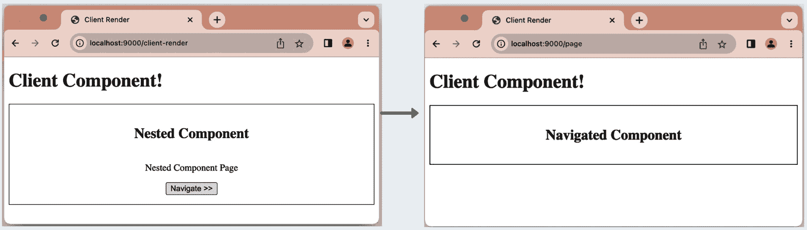
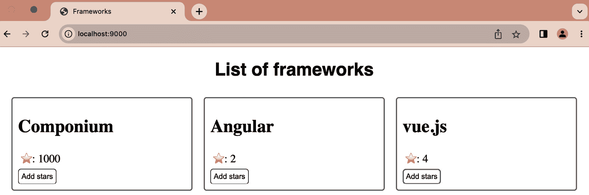

# 架构前端框架

在本章中，我们现在将重点转向我们在*第七章*中开始构建的全栈框架的前端组件。这是为我们的**Componium**框架示例添加新功能和构建技术设计的最终部分。前端特性是最复杂的，因为它们需要大量的浏览器领域知识、深入的 JavaScript 知识、处理复杂边缘情况的能力等等。我们将涵盖一系列关注于启用全栈框架开发环境的前端主题。以下是我们将涵盖的一些主题：

+   **前端特性**: 我们将确定我们框架的前端组件的功能和目标。此外，这个新的前端基础设施需要与全栈框架的现有组件进行交互，例如后端 API 路由和测试接口。

+   **建筑设计**: 在深入了解现有框架的低级接口后，我们将创建一个框架设计，它能够提供与自身低级接口相似的功能。这包括开发一个组件、视图和路由架构，以向网页浏览器提供内容。

+   **前端模式**: 了解常见的 frontend 模式和优化将帮助我们更习惯于使用现有的框架，并在未来构建新的框架。

需要牢记的是，我们只能触及其他框架提供的功能集的表面。例如，我们可以包含一个基于组件架构的客户端路由器，包括那些组件中的响应性。像 Vue.js、Angular 和 Svelte 这样的框架，以及像 React 这样的库，需要多年的开发来覆盖所有边缘情况并显著扩展功能集。在本章中，我们将专注于保持事物更接近基础，并从头开始构建几个技术部分。这应该能让你更好地理解具有前端特性的其他全栈框架的底层组件，例如 Next.js。例如，我们将使用一些直接构建在现代网页浏览器中的 Web 组件 API，以在我们的框架中实现丰富的功能集。

在本章的末尾，我们还将检查预期的流程，以了解开发者为了利用框架接口实现特定的应用开发目标而采取的一系列步骤，使用我们新构建的特性。

# 技术要求

本章的技术要求与*第七章*的技术要求非常相似。本章重用了我们在*第七章*中看到的框架文件，并添加了前端组件和界面。`tests`目录中的示例应用程序也进行了更改，以展示一些前端功能。在[`github.com/PacktPublishing/Building-Your-Own-JavaScript-Framework`](https://github.com/PacktPublishing/Building-Your-Own-JavaScript-Framework)找到本书的仓库，并继续使用`chapter7`目录中的代码。

在目录中遵循`README.md`的说明以获取可用的脚本。示例应用程序可以在框架的`tests/sample`目录中找到。当你启动该应用程序时，它将在端口`9000`上可用。你可以使用`http://localhost:9000/` URL 通过浏览器打开它。当你开始探索章节代码库时，建议使用调试工具来追踪元素是如何组合在一起的。请参阅*第二章*中的*调试*部分以配置可调试的环境。

# 定义前端框架

我们将继续从上一章的内容开始，通过重用示例**Componium**框架项目。在*第七章*中，我们创建了一些功能，使我们能够与服务器端路由交互、定义 API 和查询数据库。目前，还没有方法来开发前端组件以消费这些 API 或使用我们的框架添加视觉界面。如果没有框架的前端部分，需要构建交互式界面并使用 Componium 服务器托管的开发者将需要包含外部库，并从服务器静态地提供额外的应用程序文件。

因此，我们将通过创建几个前端功能来弥补前端功能的不足，这些功能将允许框架用户创建客户端界面。这些前端功能将模仿现有成熟前端框架的一些复杂功能。例如，我们在组件内部实现响应式功能的方法将包括基础部分，利用浏览器内置的 API。

为了开始这个过程，我们将确定我们想要支持的功能的目标。之后，我们将跟随一个示例架构设计，使这些功能成为现实，并使我们的框架真正成为全栈。

## 目标

前端框架设定了三个目标，这些目标将由我们创建的功能来支持。总的来说，在框架项目进展过程中，以一般的方式定义这些目标是一个好主意：

+   **基于 Web 的界面**：首要目标是赋予开发者创建**基于 Web 的界面**的能力，同时保持与框架的后端/服务器组件的连贯性。借助框架的前端能力，开发者将能够编写、托管和部署交互式客户端界面。这些界面将通过提供前端框架 API 来创建组件并将这些组件附加到基于客户端的视图中来实现。这些基于客户端的功能也应该可测试和可调试，无论是通过内置的 Componium 测试接口还是外部测试工具。

+   **启用交互性**：一套全面的 API，包括服务器端和前端，将有助于实现许多框架支持的项目所需的**交互性**。交互性功能需要使开发者能够使用熟悉的技术，如 HTML、CSS 和前端 JavaScript 来构建组件。框架还应具备包含潜在外部库的能力。例如，如果有人想在他们的 Componium 前端应用程序中创建可视化，那么他们应该能够轻松地包含外部库，如 Three.js 和 D3.js。

+   **促进可重用性**：我们希望包括一套框架功能，以构建复杂的应用程序。这些可能包括具有许多前端区分视图的应用程序，其中包含大量嵌套组件。这些还可以包括针对生产环境的优化集和能够管理大型应用程序代码库的能力。主要的是，我们也希望**促进代码的可重用性**，并指导开发者在构建他们的应用程序时做出明智的决策。一个易于扩展的功能集可以覆盖许多潜在的使用案例。如果我们架构正确，它将允许高度的可定制性。

从已经存在的框架，如 Next.js 中学习，我们也想确保包括一些更现代的功能，并在这些建议功能旁边提供令人愉悦的开发者体验。这可以包括代码生成功能，类似于我们在*第七章*中看到的功能。为了使框架与一些其他解决方案区分开来，我们还将设定一个目标，使用一些新推出的 Web API。利用我们在项目从头开始的优势，我们有机会评估浏览器平台上的最新发展，选择新可用的 API。作为我们的学习目标的一部分，我们还将尝试对比我们新开发的框架与成熟的框架，如 Vue.js 和 Next.js 之间的差异。

在这些目标的基础上，让我们深入了解可以支持这些目标的功能集。

## 功能

上一节中定义的前端目标将帮助我们指导特征开发背后的思维过程。为了支持既定的目标，让我们规划一些开发人员会发现有用并期望从框架中获得的某些技术特性。在本章中，我们将详细讨论以下一些重要特性：

+   **服务 HTML 文件和内容**：为了支持交互式界面的功能，我们需要添加将生成的 HTML 输出服务到浏览器请求的能力。我们需要确保我们有服务静态内容的能力，以支持额外的 JavaScript 代码、图像、媒体和其他类型文件。这一特性对于在 Web 浏览器客户端渲染内容至关重要。

+   **结构化应用程序代码**：我们需要赋予定义可重用交互式 JavaScript 组件的能力，这些组件具有 CSS/HTML 模板和样式功能。我们将使用基于组件的架构方法来实现这一点。组件架构特性本身将启用用户界面的开发。它可以帮助产生的结构化应用程序代码将包括独立且可重用的代码块，这些代码块作为整个 Web 应用程序的构建块。这将支持我们的重用性和提供良好的应用程序原语的目标，因为它利用了组件范式，如响应性、可组合性和模块化。这一特性的方法旨在让每个组件控制自己的状态，并根据状态渲染界面。

    支持维护目标，基于组件的方法确保应用程序代码的隔离测试和可调试性。在这里，我们借鉴了其他框架的一些先前设计决策。例如，在 Vue.js 中，组件是用 JavaScript 逻辑、HTML 模板以及使用 CSS 进行样式的功能来构建的。

+   **可组合性**：在前面一点的基础上，重要的是要强调应用程序代码的可组合性是我们想要创建的框架的一个重要特性。基于网络浏览器内部 DOM 结构定义的嵌套结构，组件可以组合在一起以创建复杂用户界面。请参阅*第二章*中的*组件*部分，以回顾这一特性的重要性。

+   **客户端路由器**：我们在*第二章*中看到的前端框架组织核心组件之一是路由器。路由功能集对于我们的功能集至关重要，因为它负责在应用程序的复杂视图之间导航。从*第七章*开始，我们已经有了一个用于服务器端路由的 API，前端路由将帮助提供实现不同应用程序状态之间快速平滑过渡的功能。

+   路由器将遵循现有网络应用导航的概念，并利用相关的 Web API 修改浏览器的 URL 和历史功能。路由器的加入也将有助于创建更逻辑上组织良好的代码。

+   `HttpClient` 辅助模块（[angular.io/guide/understanding-communicating-with-http](http://angular.io/guide/understanding-communicating-with-http)）用于与合适的后端服务进行通信。这将是我们示例项目的绝佳增强功能，特别是如果与一些特定的 *Componium 服务器* 定义的路线结合使用。例如，为了帮助提升开发者体验，我们可以预先生成一些已知端点的数据获取调用，并围绕这些调用创建动态接口，从而为使用我们框架的开发者节省时间。

+   **服务器端渲染（SSR）**：我们在本书的其他框架示例中提到了 SSR 功能。我们也将这些功能包含在我们的示例框架中。SSR 方法将在服务器端渲染组件，以帮助提高应用程序的渲染性能。鉴于我们对全栈框架的开发者体验有完全的控制权，在这种情况下开发此类功能对我们来说更容易。除了性能提升外，SSR 对搜索引擎优化和页面加载时间也有益。

    SSR 的内部包括在服务器端预先渲染的组件与后来由前端代码激活的组件之间的紧密协作。后端路由还应能够将组件的状态注入到预先渲染的元素中。状态可以是静态数据或从外部来源获取的信息，例如数据库。

+   **生产优化**：作为对开发者赋能承诺的一部分，该框架还将提供一些针对在生产环境中运行的应用程序的优化步骤。这意味着包括一些在幕后执行优化的附加内部工具，例如压缩。这类优化也更容易集成到我们的框架中，因为我们控制着服务器工具。

    除了代码压缩，我们还可以探讨一些高级的 JavaScript 优化技术，例如摇树优化（tree-shaking）和代码拆分。支持静态文件处理，我们有可能优化其他媒体，如图片。一般来说，随着框架的发展，我们希望持续地进行此类优化改进，因为这会惠及所有框架用户。

上述列表是应选的一组功能，这些功能应使前端功能丰富，为我们提供良好的学习机会，并涵盖实际用例。

下面的 *图 8.1* 总结了所列功能之间的交互方式：



图 8.1：功能总结

现有的服务器端代码能够提供静态文件，这些文件可以被前端使用。同时，服务器进程能够导入并访问一些组件，以便在服务器端渲染它们。最后，后端定义了客户端路由；这些是浏览器可以访问并渲染在客户端的前端端点。

在前端方面，我们有与服务器或外部服务上托管的外部 API 进行交互的*API 交互*功能。同时，客户端路由器与组件架构紧密协作，以实现浏览器中的用户界面体验。最后，我们有一套前端优化，涵盖了所有前端表面，确保在生产环境中部署和运行应用程序时获得最佳优化体验。

考虑到这些功能，让我们继续到架构步骤，在那里我们可以探索使这些功能成为可能的技术和组织概念。

# 建筑学

在概述并记录了所需功能后，让我们从*第七章*扩展现有的架构。这些更改将向框架架构添加新功能，重点关注启用`ClientView`抽象和功能，这将推动前端更改背后的功能体验。

我们已经具备了创建服务器 API 端点的功能。特征的架构的一般实现将包括向框架的服务器部分引入几个新的接口。新添加的前端功能将位于框架项目的`frontend`目录中。



图 8.2：Componium 前端组件

在*图 8.2*中，我们概述了由 Componium 服务器框架驱动的服务器接收到的请求。具体来说，这个请求预期会响应一个 HTML 页面，以提供交互功能。这与*第七章*中的 API 请求不同，我们会收到包含数据的 JSON 或 GraphQL 响应。请求处理器仍然可以处理传入的请求对象，以便访问请求的属性，例如查询参数。它还可以调整响应对象的任何属性。在*第七章*中，我们使用`server.addRoute(...)`来添加新路由。为了添加提供功能的路由处理器，我们将使用类似结构的`server.addClientView(...)`方法，它将具有类似的 API，但行为完全不同。这个新方法就是*图 8.2*中的**客户端视图**功能所在之处。

在 Componium 前端组件设计中，客户端视图可以有一个单独的视图和许多在其中使用的组件。客户端视图的概念是服务器端定义的，而视图的概念则在服务器和客户端之间共享。一旦定义了客户端视图，它将组装所有导入的组件和视图，并将响应发送回浏览器。

除了客户端视图交互之外，服务器现在还可以定义和访问静态文件目录。这些静态文件可以直接由浏览器访问，整个目录都暴露给 Web 服务器。这些静态文件也可以由客户端视图使用，将额外的资源导入客户端视图，例如任何媒体文件（图像、字体、样式等）或额外的 JavaScript 组件。静态文件的易于访问简化了前端框架如何包含外部媒体和其他可以在 Web 应用程序中包含的有用实体。

在下一节中，我们将详细了解客户端视图如何成为前端功能和文件的大门，使我们能够创建多个端点，服务于 HTML、CSS 和 JavaScript 代码。

## 入口点

为了在创建多个前端客户端视图时提供灵活性，我们的框架提供了一种定义多个客户端端点的方法：

```js
server.addClientView("/", "frameworks", {
  title: "Frameworks",
  // …
});
```

上述代码是路由我们的服务器根路径到`frameworks`视图的示例。开发者可以在`views`目录中创建一个`frameworks.js`文件，通过定义的名称映射此视图。`.addClientView(...)`可以配置多次，将多个视图附加到不同的路由处理器。`frameworks.js`的内容结构与路由处理器从*第七章*中的结构相似：

```js
export default function frameworks(request, response) {
  return `<p>Welcome!</p> `;
}
```

上述代码可以简单到只返回一个段落标签。你可以在`tests/sample/views/`目录中找到其他更复杂的视图示例。视图处理器可以访问路由的`Request`和`Response`对象来调整路由的行为或获取额外的数据。我们还可以访问这里的`componium`变量来访问框架的接口。为了简单起见，我们将在更复杂的模板中使用 JavaScript 模板字面量。框架负责渲染所需的 HTML 结构，并且它还将上述代码中的`<p>`标签包装在一个有效的 HTML 文档中。

我们前端文件的其他重要入口点是静态文件配置。为了能够解析其他类型的媒体，框架提供了一种方法来标记应用程序项目中的某些目录作为提供静态文件的端点：

```js
server.addStaticDirectory("/images", "img"));
```

`.addStaticDirectory(...)` 方法将服务器路由 `/images` 映射到应用项目的 `img` 目录。这依赖于我们之前在 *第七章* 中使用的后端 express 服务器相似的属性。这个新的静态目录在自定义路由器中也能工作，这些路由器是通过 `server.createRouter(...)` 创建的。

我们现在有了处理和渲染基本视图的方法，并且可以创建任意数量的视图。我们现在需要启用基于组件的架构。这将使我们能够生成更复杂的交互式组件。

## **反应性**

要实现我们前端框架的动态界面特性，我们需要更多地了解反应性和反应组件的概念。在应用程序编程中，反应性概念指导用户界面动态地更新和响应底层数据或状态变化。在 JavaScript 的上下文中，尤其是在前端系统中，我们结合自定义开发的原语和浏览器 API 来实现性能良好的用户界面反应性。反应性功能通过在相关底层数据变化时自动更新界面，为 Web 应用程序消费者提供无缝体验。与其他编程环境类似，在 JavaScript 世界中，开发者依赖于框架和辅助库来为他们的应用程序中的组件启用反应性。实际上，JavaScript 中对外部工具的依赖性比其他语言要强得多。这主要是因为网页和 Web 应用程序开发的跨浏览器和跨引擎特性。

由于 JavaScript 的异步特性，反应式编程范式在 Web 开发环境中变得非常合适。对反应范式有贡献的因素还包括对实时更新、复杂交互和简化应用状态管理的需求。用户界面变得更加复杂。如今，Web 应用程序的期望要求前端系统具有动态性、消耗实时数据，并对用户操作做出即时响应。此外，围绕 Web 浏览器的 **文档对象模型** (**DOM**) 的现有结构和抽象迫使解决方案基于操作页面元素的嵌套节点树。界面中的反应式更改利用差异算法来更新组件树中已更改的节点。

反应性需要数据绑定，这是数据与应用程序元素之间的连接。在 Web 开发世界中，数据将由 JavaScript 接口提供，很可能是从某些 API 端点动态加载的。元素将是浏览器客户端中的*HTML/DOM*结构。当底层数据更新时，相应的浏览器元素会自动更新以反映这些变化。在*第二章*的*框架构建块*部分，我们强调了数据绑定在这些反应性组件中可能发生的方式。我们还看到了使用单向或双向绑定的框架示例。这种流程在很大程度上取决于架构决策，要么允许元素在数据更改时更新，要么也允许元素更新底层数据。流行的框架，如 Vue.js 和任何包含 React 的框架，都使用*虚拟 DOM*树的实现来渲染应用程序的状态，以数据变化。然而，也有一些例子，如涉及 Svelte 和 Angular 的项目，使用真实 DOM 或*shadow DOM*功能来实现类似的功能。

与其他前端项目类似，我们将把反应性组件的概念引入我们的框架。这些组件将允许我们封装 HTML 元素和与之相关的应用程序逻辑。前端*Componium*组件将保持其内部状态并对数据和交互做出响应。为了使事情更简单，并且不深入现有前端框架的内部，我们可以使用 Web 组件和其他更现代的 Web API 的组合来构建基本反应性概念的示例。组件架构的实用概述将提供良好的学习机会，以了解内置的浏览器原语。它还将提供良好的比较和理解现有框架为我们解决复杂问题的能力：

```js
class ReactiveComponent extends HTMLElement {
  constructor() {
    super();
    this.state = this.reactive(this.data());
    this.attachShadow({ mode: "open" });
  }
  reactive(data) {
    return new Proxy(data, {
      set: (target, key, value) => {
        target[key] = value;
        this.update();
        return true;
      },
    });
  }
  callback() { this.render(); this.update(); }
  render() { this.shadowRoot.innerHTML = this.template(); }
  // methods that child components will override
  update() {}
  data() { return {}; }
  template() { return ""; }
}
```

上述代码是我们新定义的`ReactiveComponent`；它已被压缩以更好地适应本章。该类从`HTMLElement`扩展开始。此接口将帮助我们表示 HTML 元素并创建我们自己的 Web 组件。在`constructor`方法中，我们声明了`state`属性，该属性将跟踪组件的状态。另一个重要的构造函数调用是`.attachShadow()`。此调用将 Shadow DOM 附加到自定义元素，并为封装的 CSS 和 JavaScript 指令提供了一个作用域环境。

额外阅读

要详细了解 Shadow DOM 的结构，请查看 MDN 页面[developer.mozilla.org/en-US/docs/Web/API/Web_components/Using_shadow_DOM](https://developer.mozilla.org/en-US/docs/Web/API/Web_components/Using_shadow_DOM)。

在`reactive`方法中，我们配置一个新的`Proxy`对象，这是另一个内置的 Web API，具有可以帮助我们对我们组件的状态进行反应性更改的属性。`Proxy`方法接受一个对象并返回一个新的对象，该对象作为原始定义的代理。代理行为有助于在对象更新时触发组件的更新和重新渲染。

其他阅读材料

有关`Proxy`接口的详细信息，请参阅 MDN 上的详细文章：[developer.mozilla.org/en-US/docs/Web/JavaScript/Reference/Global_Objects/Proxy](https://developer.mozilla.org/en-US/docs/Web/JavaScript/Reference/Global_Objects/Proxy)

当状态改变时，将调用设置操作和更新方法。`update()`方法在继承此`ReactiveComponent`类的组件中被覆盖。使用`ReactiveComponent`，我们可以构建一组简单的示例组件。这种结构将绑定组件状态中的数据到渲染的模板中。



图 8.3：基本组件示例

*图 8**.3* 展示了两个组件在操作中的示例视图；一个是年份跟踪器，另一个是月份跟踪器。这两个组件都有增加相应日期值的选项。您可以在`tests/basic-components/index.html`文件中找到此工作示例的代码：

```js
<body>
  <h1>Basic Components</h1>
  <year-component></year-component>
</body>
```

视图的源代码如下；它仅包括通过其名称`year-component`定义的新组件，并用常规 HTML 标签包裹。这是通过使用内置的 Web Components 接口注册自定义元素实现的`customElements.define("year-component", YearComponent);`。`year-component`组件扩展了前面的`ReactiveComponent`类，并覆盖了空的`update`和`template`方法，如下所示：

```js
template() {
    return `
      <button id="addYears">Add Years</button>
      <div id="yearCount">Year: 0</div>
      <month-component></month-component>
    `;
  }
  connectedCallback() {
    super.connectedCallback();
    this.shadowRoot.querySelector
      ("#addYears").addEventListener("click", () => {
      this.state.yearCount++;
    });
  }
  update() {
    this.shadowRoot.querySelector(
      "#yearCount"
    ).textContent = `Year: ${this.state.yearCount}`;
```

代码中列出的方法，如`update()`和`template()`，渲染与组件相关的数据并定义由`year-component`组件返回的模板。我们还有事件处理器，用于更改和更新年份，通过访问`this.state`。此外，请注意，要访问此`Year`组件的 Shadow DOM 属性，我们使用`this.shadowRoot.querySelector`。组件中定义的模板包括`month-component`，这是一个嵌套组件。它具有与`ReactiveComponent`扩展类类似的设置。

此组件配置，使用 Web Components API 和其他浏览器 API 提供的便利性，是框架的良好起点。我们可以使用这些模式在其他框架中实现类似的功能，例如 Vue.js，以及使用 React 作为其底层库来构建其组件的框架。我们拥有的接口具有反应性属性、同时组合组件的能力以及模板化的基础知识。

在下一节中，我们将进一步探讨并利用外部 Web Component 辅助库来构建这个模式。

## 改进组件

在架构的响应性部分，我们描述了一种使用由其他技术组成的 Web Components 来实现所需功能集的模式。为了进一步增强这一点，我们将引入 `lit.dev`)，这将帮助我们使管理组件的工作更加直接，并且我们的框架可以依赖于它。我们将采用相同的方法进行抽象，并利用这个库的接口来创建我们框架的组件功能。

关于 Lit 库

Lit 开源库已经存在了六年多，其目标是简化并抽象掉一些与 Web Components 相关的冗长任务。在其核心，它提供了响应式状态功能、作用域 CSS 样式、模板化以及一系列高级功能来组合和操作前端组件。它支持 JavaScript 和 TypeScript 语言，并附带大量扩展其功能的包。例如，Lit 有额外的工具来启用本地化、动画化前端元素，并且还可以与 React 组件集成。

该库除了使用标准的组件生命周期外，还使用自己的组件生命周期方法来简化某些操作，例如 DOM 响应性。您可以在 [github.com/lit/lit](https://github.com/lit/lit) 和 [lit.dev/docs](https://lit.dev/docs) 找到项目的源代码。

为了与先前的 `ReactiveComponent` 接口进行比较，让我们看看如果我们使用 Lit 库，代码会与基本组件有多相似：

```js
import {html, css, LitElement} from 'lit';
export class YearComponent extends LitElement {
    static styles = css`p { color: green }`;
    static properties = {
        year: {type: Number},
    };
    constructor() {
        super();
        this.year = 2024;
    }
    render() {
        return html`<button id="addYears">Add Years
          </button>
      <div id="yearCount">Year: ${this.year}</div>`;
}
```

上述代码导入了我们可以扩展的 `LitElement` 类。这个新的代码块结果看起来与我们在 *响应性* 部分看到的 `year-component` 代码非常相似。然而，在这个组件定义中我们还有一些额外的改进。

让我们探索其中的一些：

+   首先，我们有一个 CSS 辅助接口，它允许我们使用 `static` `styles` 变量来声明我们组件的样式。

+   其次，我们声明组件状态的方式也有所改变——我们定义了一个包含一些额外属性定义的 `static properties` 对象。这些属性在模板中以类似的方式使用。

+   这引出了第三个要点——模板化也有所不同。它使用 `lit-html` 辅助器来启用更高级的模板化功能并帮助我们处理 HTML。这个辅助器允许我们创建模板指令，调整渲染方法，等等。

额外阅读

所有模板化功能的详细文档可以在 [lit.dev/docs/v3/templates/expressions](https://lit.dev/docs/v3/templates/expressions) 找到。

为了我们示例框架的目的，我们将定义自己的`ComponiumComponent`类。这个类将可供开发者使用，以创建丰富的组件，结合我们从*响应性*部分和 Lit 库中学到的知识。我们还可以依赖 Lit 模板的丰富功能来渲染结果。为了启用这一点，我们将加载 Lit 库和`componium.js`框架文件一起在`ClientViews`中。这将使组件接口暴露给开发者定义的组件。要开始使用这些接口，开发者可以使用 ES6 语法导入它们：

```js
import { css, html, ComponiumComponent } from "componium";
```

提供了要扩展的类，以及 CSS 和 HTML 辅助工具，以帮助构建组件。例如，如果我们的组件有交互式按钮，它可以使用以下 Lit 语法来声明事件处理器：

```js
html`<button @click="${this._click}">click</button>`;
```

`_click`事件处理器是在从`ComponiumComponent`扩展的类上定义的方法。如果这些组件需要任何静态文件，它们可以直接通过从 Componium 服务器声明的静态路由中获取它们来请求。然而，我们仍然可以更进一步，使用 Lit 和我们的框架接口的混合来启用 SSR 的复杂功能。关于从服务器利用现有组件的概念将在下一节中详细介绍。

## SSR

当我们规划 Componium 的前端接口时，我们了解了 SSR 的功能和好处。在技术层面上，SSR 需要我们框架的几个部分协同工作才能表现得非常好。以下是一些：

+   组件架构需要支持不同的渲染能力。这包括将组件作为 HTML 预先渲染的能力，这些 HTML 可以通过网络传输到前端。

+   组件需要在服务器和浏览器上都能一致地运行。

+   服务器端渲染的组件应该能够在客户端和服务器环境中获取数据。根据环境的不同，组件应该有类似的数据请求和处理方法。

+   我们需要一个能够结构化和渲染组件的服务器，包括将这些组件的状态和数据附加到它们上。

+   前端应该能够获取组件的服务器端状态，并在以后对其进行激活。它应该能够附加所需的事件。

幸运的是，凭借我们的框架和 Lib 库，我们已经覆盖了这些要求中的许多，并且可以在我们的框架中开发 SSR 支持。使用`@lit-labs/ssr`包，我们可以在与我们的客户端视图抽象结合的同时定义服务器端渲染。这些功能的模块可以在`packages/frontend/client-view.js`中找到。为了在我们的框架中拥有灵活的功能集，我们希望开发者使用仅客户端组件和服务器端渲染组件的组合。

要启用 SSR 功能，该框架有一个新的 `Renderer` 类，其任务是整合所有必需的框架代码和开发者定义的组件。它是通过响应客户端请求，提供一个有效的 HTML 文档的统一模板，并从应用程序目录中注入代码来实现的。为了渲染这些结构，我们可以使用 `ssr` 库中的 `html` 辅助函数。要了解 `ssr` 包的功能，请查看 `lit.dev/docs/ssr/overview` 上的全面文档。

这些功能与 Componium 服务器端渲染方法协同工作，将生成的 HTML 输出到客户端。一旦 HTML 文档在浏览器中完全加载，则开始水合过程。框架文件加载所需的辅助文件，这些文件将帮助将事件处理器附加到我们的组件上，并使它们具有交互性。

我们将在接下来的 *使用框架* 部分中检查服务器端渲染功能的详细用法。同时，在我们能够一起使用所有这些功能之前，还有一些架构特性需要介绍。

## 客户端路由器

在框架规划阶段，路由器被强调为前端基础设施的一个关键部分，它允许界面在应用程序的重要部分之间进行转换。许多前端框架的路由实现非常相似。然而，如果你对路由功能非常热情，*React Router* 项目 ([reactrouter.com](https://reactrouter.com)) 是一个很好的项目，可以从中学习关于良好的路由抽象、潜在陷阱和路由边缘情况的知识。



图 8.4：初始页面（左）与新路由页面（右）之间的转换

要在我们的框架中启用路由功能，我们将引入一个 `ComponiumRouter` 类。在 *图 8.4* 中，我们可以看到初始 `/client-render` 页面（*左*）与新路由页面 `/page`（*右*）之间的路由转换。路由发生在你点击 `this.router = new ComponiumRouter("client-render", ` `routes, this.shadowRoot);` 时。

路由器获得一个标识符（`client-render`），一系列通过 `routes` 对象定义的路由，以及一个根元素（在这种情况下，是 `this.shadowRoot` 对象），该元素将用于渲染路由模板。`routes` 对象被定义为对象数组。例如，*图 8.4* 的简单路由示例如下所示：

```js
const routes = [{
    path: "/client-render",
    template: "<nested-component></nested-component>",
  },
  {
    path: "/page",
    template: "<navigated-component>
      </navigated-component>",
  },];
```

`/client-render`路由是我们具有客户端视图类型的入口点之一，而`/page`路由是我们可以导航到的视图。通过在`template`属性中接受更复杂的模板结构，路由器可以支持更丰富的功能集。例如，我们可以在路由定义中使用来自`Componium/Lit`模块的`html`辅助函数来生成更广泛的模板对象。

在导航不同路由之间，我们将依赖于浏览器中更多的内置 Web API。例如，当视图需要更改时，组件会调用`history.pushState(...)`。在`ComponiumRouter`类内部，框架处理这些`pushState`事件并渲染相应的模板。

额外阅读

MDN 文档概述了我们可以在前端路由组件中使用所有可能的 History API 方法。它在这里可用：[developer.mozilla.org/en-US/docs/Web/API/History/pushState](https://developer.mozilla.org/en-US/docs/Web/API/History/pushState)。

在 Lit Labs 的开源代码库中，还有一个组件路由的例子。它的源代码可以在[github.com/lit/lit/tree/main/packages/labs/router](https://github.com/lit/lit/tree/main/packages/labs/router)找到。在*Componium*框架中实现路由可以是一个极好的练习。

## 优化

我们前端功能的目标之一是一组优化，以使我们的框架产生的应用程序更加高效、可扩展和性能良好。我们将通过引入一些功能来优化生产环境中前端组件的输出，朝着这个目标迈出一步。

我们将引入一个新的`Optimize`类，它包含一些对代码库进行优化的函数。这个类可以在框架目录的`packages/frontend/optimize.js`中找到。这些优化可以影响包含/注入的框架文件以及应用程序代码。当应用程序在定义了`NODE_ENV=production`变量的环境中部署时，这个类的函数会激活，这是基于 Node.js 项目的常见模式。

我们将利用一些现有的 JavaScript 工具——在这个特定案例中，是`esbuild`——来`minify`框架和组件代码文件。`esbuild`工具提供了以下压缩命令行 API：

```js
 esbuild ${filePath} --minify --outfile=${newFilePath}.
```

我们可以利用`esbuild`工具的力量来优化使用我们框架构建的应用程序。例如，当需要时，应用程序中使用的所有组件将由服务器进程进行压缩。在底层，框架会解析组件文件并运行压缩步骤，将优化后的文件输出到单独的目录中。我们使用一个名为`.componium`的隐藏目录作为存储来保存优化后的文件。框架随后会知道访问优化后的文件而不是原始文件。

为了进一步扩展未来的改进，我们可以将优化重点放在其他应用程序文件上，例如图像、媒体等。引入更复杂的构建工具也是可能的。例如，我们可以添加`rollup.js`来增强客户端代码的输出结果。我们已经在*第三章*中看到了 rollup 工具的示例用法。`Esbuild`也提供了除了最小化之外的额外功能，可以在[esbuild.github.io/api](https://esbuild.github.io/api)找到。

现在，我们需要介绍的是这些前端组件的开发者体验的改进，我们将在下一节中进行说明。

## 开发者体验

为了完善我们的功能，我们将包括一些改进开发者体验的改进。我们将通过详细记录组件系统以及提供对框架可执行文件的增强来实现这一点。

文档应提供关于前端功能的清晰说明，例如多个客户端视图和静态文件目录的定义。组件结构、可组合性和响应式功能也需要进行描述。例如，这可能包括一个简单的 API 来添加新的客户端路由，以及框架如何使用 Lit 库来实现与组件相关的功能。

框架可执行文件的改进包括使用脚手架操作生成客户端视图路由、视图和组件的能力。在*第七章*中，我们看到了生成新 API 路由的示例；这是一个非常相似的增加。就像之前一样，使用可执行文件，开发者将能够快速生成一些代码并开始构建前端用户界面。这些预先生成的组件包括对象样式和数据属性的默认属性配置。

总体而言，我们将尽可能解开前端功能的神秘面纱，专注于帮助开发者导航构建客户端 Web 应用程序时所有技术的复杂细节。

## 依赖项

我们将使用从`npm`包注册表中获取的几个依赖项来实现本章中描述的功能级别。以下是一些值得注意的依赖项：

+   `Esbuild`：在框架服务器在生产环境中运行时的优化步骤中使用的打包器和最小化工具。使用`Esbuild`，我们可以快速优化脚本。它包括许多我们可以用来进一步扩展框架最终脚本的高级功能。

+   `Lit`：这个库帮助我们扩展现有的 Web 组件技术，并提供了更多高级的组件功能，例如简化数据绑定和简化状态管理。

+   `lit-html`：与 Lit 库相关的另一个模块，为我们的框架的前端功能提供模板功能。

+   `@lit-labs/srr`和`@lit-labs/ssr-client`：这两个模块启用了我们框架的 SSR 功能。它们可以在 Componium 服务器上渲染组件，并在前端进行后续的激活。

主要来说，这些库和工具帮助我们丰富了框架功能。我们的框架可以依赖这些依赖项来启用高效的项目构建、基于组件的架构、动态内容渲染和 SSR，从而实现性能优良、易于维护和用户友好的应用程序。在详细架构就绪之后，在下一节中，我们将探讨开发人员的工作流程，以使用 Componium 的前端功能创建一个简单的客户端应用程序。

# 使用框架

现在我们已经建立了架构，我们可以通过一个场景来了解开发人员如何使用我们的前端框架组件来构建一个简单的客户端示例应用程序。在*第七章*中，我们执行了相同的任务，以获得所有功能协同工作以完成特定任务的良好概述。为了跟上进度，请确保你已经安装了依赖项，然后你可以在以下目录中启动示例应用程序：

```js
> cd chapter7/componium/tests/sample
> componium dev
Executing (default): SELECT 1+1 AS result
Componium Server (PID: 59938) started on port: 9000
```

你将能够打开浏览器，在`http://localhost:9000`查看应用程序。



图 8.5：一个示例客户端应用程序

根据*图 8.4*，我们想要创建一个名为**框架列表**的页面。我们还想在这个页面上列出一些框架。每个框架条目都应该连接到客户端视图，并为每个框架显示一定数量的星星点。除了静态功能外，每个框架组件下还有按钮，可以增加计数器，在这种情况下，我们将计数器标记为每个项目的星星数量。开发人员用例还包括使用 SSR 功能从服务器渲染页面，以提高性能和 SEO。

首先，我们的 Componium 框架允许我们从服务器创建`ClientViews`。我们可以在`app.js`文件的应用程序根目录中创建一个客户端视图。我们还可以在这里使用`componium`可执行文件来搭建组件：

```js
server.addClientView("/", "frameworks", {
  title: "Frameworks",
});
```

以下代码从我们应用的根目录开始，将在 Componium 服务器上指定以`/`结尾的端点处建立一个托管路由。除了提供路径外，我们还指定了视图的名称以及该视图的附加选项。视图的名称映射到我们应用中的`views`目录。`views/frameworks.js`文件定义了我们的服务器端组件处理器：

```js
export default function frameworks(request, response) {
  const hitsComponium = 1000;
  // code omitted
  return `
    <div class="framework-list">
      <framework-item name="Componium" count=
        "${hitsComponium}"></framework-item>
     <!-- extra code omitted -->`;
}
```

要查看此组件的完整版本，请查看`tests/sample/views/frameworks.js`文件。前面的代码仅列出了列表中的一个框架，但示例中包含了所有必需的项目。进一步查看代码，我们可以在导出的`frameworks`函数中访问`request`和`response`对象。这就是开发者也可以在此文件中访问数据库 ORM 方法以获取数据和预先填充组件状态的地方。

在定义了`framework-item`组件之后，我们可以启动应用程序服务器并导航到应用程序的根目录。如果我们查看文件源代码，我们可以看到 SSR 组件。部分源代码可能如下所示：

```js
<h1 style="font-family: sans-serif; text-align:
  sscenter;">List of frameworks</h1>
    <div class="framework-list">
      <framework-item
        name="Componium"
        count="1000"
      ></framework-item>
```

组件的状态，包括星星的数量，是从渲染的组件中恢复的。如果我们使用`framework-item`组件中的以下`button`元素，那么我们将根据从服务器起源的状态增加星星的数量：

```js
<button @click=${() => this.count++}>Add stars</button>
```

最后，在创建了`frameworks.js`应用程序视图之后，我们现在可以将应用程序部署以进行测试运行。在此，开发者应配置`app.js`进程，使其在开启`NODE_ENV=production`环境变量的情况下运行。这将启用`esbuild`优化功能，允许服务器进程压缩我们新创建的组件。

此框架的示例用法包括创建组件、在服务器端渲染它们，并通过点击它们的 UI 元素与其状态交互。这个实际示例以及来自*客户端路由器*部分的路线示例展示了我们为这个框架功能的初始版本开发的大多数功能。从现在开始的下一步可能涉及找到改进基于组件的架构的方法，以及找到更多为使用我们的框架构建的应用程序添加潜在优化的方法。

# 摘要

在本章中，我们专注于构建前端架构并向现有项目添加前端功能。类似于在*第七章*中对服务器端架构的定义，在本章中，我们必须定义前端功能背后的目标，关注开发者希望如何使用我们的全栈框架。我们已经涵盖了定义客户端路由的入口点、响应式概念、复杂组件结构、SSR、路由、优化等主题。前端功能集可能令人眼花缭乱，有很多术语，而且本章之外还有更多内容需要学习。

如果我们将过去几章中我们设计的所有组件组合起来，我们现在最终得到一个包含三个用例的框架，这些用例组合成一个更大的全栈叙事。到目前为止，我们看到了一个 JavaScript 测试框架、一个后端框架，最后是一个位于相同逻辑命名空间下的前端框架。

在下一章中，我们将通过揭示随着框架的发展可能出现的各种情况，重点关注框架维护的必要话题。

# 第三部分：维护你的项目

总结来说，最后两章深入探讨了 JavaScript 编程空间中框架项目的维护方面和未来。这些章节背后的推动因素是确保开发者构建的项目能够长期使用和可用，从而保证创作的可靠性和有效性。回顾这些系统的最佳实践，最后一章提出了与现有和新项目都相关的当前和未来想法。

在本部分，我们涵盖了以下章节：

+   *第九章*，*框架维护*

+   *第十章*，*最佳实践*
