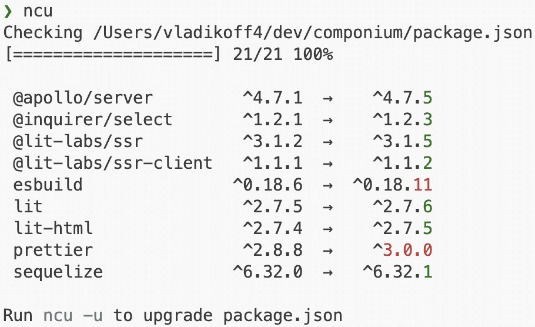

# 框架维护

在我们的框架开发之旅中，我们已经到达了可以详细讨论框架维护的点。到目前为止，我们在前几章中已经完成了全栈框架的初始版本。

在本章中，框架维护主题将引导你走向未来要开发的框架。这些是与框架发布流程、持续开发周期以及最终大型框架项目的长期维护相关的话题。关于框架维护的更详细内容，我们将学习以下内容：

+   **开发周期**：我们将了解有助于开发正式功能定义的概念和范式，并找出如何寻求框架用户反馈。首先，我们将回顾框架开发过程的分析和设计步骤。然后，我们将转向正式功能定义，以及寻求用户反馈和让这些用户了解框架变化的方法。精通这些概念将帮助你保持你的框架相关、用户友好和具有竞争力。

+   **发布流程**：熟悉发布流程涉及多个后勤任务，例如定义版本和许可条款，并结合一个能够发布和向公众交付项目的管道。这包括创建自动化管道来构建、测试和部署你的框架。这个过程还教会你如何从代码完成到用户可以轻松采用并从中受益的已发布产品平稳过渡。

+   **长期维护**：这部分围绕超越典型编码任务的更广泛方面。长期框架管理任务包括监控项目的健康状况、保持其安全性、管理依赖关系以及进行必要的改进。

理解这三个方面——开发周期、发布流程和长期维护——将显著提高你构建和维护框架的成功率。这将确保你的项目保持相关性、安全性和稳健性，并达到最高质量，最终导致其利益相关者获得更好的响应。

# 技术要求

就像在其他章节中一样，我们将继续使用[`github.com/PacktPublishing/Building-Your-Own-JavaScript-Framework`](https://github.com/PacktPublishing/Building-Your-Own-JavaScript-Framework)的仓库。本章的`chapter9`目录包含几个展示与框架维护相关的工具的示例项目。其中大部分具有类似常见 Node.js 项目的结构。对于`chapter9`中的每个子目录，你可以探索维护工具示例。有关包含项目的额外信息，请参阅`chapter9/README.md`文件。

# 开发周期

为了更好地理解框架维护任务，我们将依靠**软件开发生命周期**（**SDLC**）来划分我们框架开发的一些重要里程碑，例如构建功能和向利益相关者发布。我们的目标是将 SDLC 的广泛主题应用于我们的框架项目，重点关注有助于你构建更好项目的具体示例。

图 9.1：软件开发生命周期

*图 9.1* 展示了软件开发生命周期（SDLC）的简化图，我们可以将其应用于我们的框架项目。在这本书中，我们已经详细介绍了这些步骤，除了我们需要进一步关注**部署**和**维护**步骤以完成整个周期。我们已经通过了解其他框架的组织结构和规划 *Componium* 全栈框架的每个大型部分来处理第一个**分析**步骤。我们在 *第二章和第三章* 中对现有的抽象、流行的模式和 *Componium* 的框架类型进行了有用的考察。为了进一步强化这个**分析**步骤，我们与潜在的利益相关者和 *Componium* 测试、后端和前端部分的功能集进行了头脑风暴。在本章中，我们将探讨其他有助于框架开发者使框架项目更成功的策略。

关于 SDLC

**软件开发生命周期**（**SDLC**），在某些情况下也称为**系统开发生命周期**，是一个起源于 20 世纪 60 年代的术语。当时，它被用来帮助开发复杂的企业系统。后来，它被进一步用于软件项目，并结合了如瀑布模型等不同的开发模型。这个术语定义了构建大型系统和软件的系统化过程，为开发过程提供了方法论，并关注质量和编程效率。

软件开发者通常将此模型作为基础，并根据他们在组织中的工作效果来调整构建软件的方法。敏捷软件开发方法的引入是 SDLC 方法的一种扩展。在 JavaScript 应用程序开发的情况下，开发团队可以使用这些生命周期概念来构建新项目，并使用框架工具和库。同时，框架开发者也可以依靠 SDLC 方法来打造高质量、高性能的框架体验。

**设计**阶段，在**分析**步骤之后，是我们讨论在*第六章*、*第七章*和*第八章*中构建框架时的情况，它概述了框架的架构部分。这是框架作者专注于弥合需求与编写代码开始之间的差距的地方。当与 JavaScript 生态系统一起工作时，**设计**步骤尤其有趣。由于 Web 开发的多元化性质，包括 JavaScript 的不同方面、运行时和 Web API，有机会创造创新的设计方法，结合现有和新建的组件。例如，在*第六章*、*第七章*和*第八章*中，我们必须就抽象的组合以及我们打算在全栈框架中使用哪些库做出谨慎的决定。超越库的选择，**设计**阶段的元素需要就将在框架项目中使用的技术的组合以及这些技术如何相互通信做出具体决定。这就是我们在强烈的观点和灵活的框架之间寻求平衡的地方。

然而，整个 SDLC 过程的概念是一个**循环**，这意味着设计决策将以循环的方式返回给开发者。这表明并非所有决策都是一成不变的，并且随着项目的进展，随着时间的推移可以改变。然而，有些决策比其他决策更难改变。例如，在*Componium*测试框架中更改 API 结构将要求所有框架的使用者重写或迁移他们的测试到一个新的 API。很可能会发现，API 更改是为了框架及其用户的利益，但它仍然为使用框架的项目创造了摩擦。这可能导致框架用户被困在项目的某些版本上，或者完全转向使用其他东西。

作为框架开发者，在项目初始发布后，你将再次达到**设计**阶段。当这种情况发生时，框架的生命周期管理（SDLC）将更加专注于功能开发和代码的大规模重构。在现实世界中，这个阶段的例子可以在 Vue.js 项目中找到。Vue.js 的主要版本引入了对渲染器的更改，使得与模板指令一起工作变得更加容易，并改变了组件的 API。关于这次迁移的更多细节可以在[v3-migration.vuejs.org/breaking-changes](https://v3-migration.vuejs.org/breaking-changes)找到。在这些案例中，框架作者会回到起点或找到方法来彻底重新设计框架的某些面向公众和底层结构。

这种回到设计阶段的周期在框架的演变中很常见，尤其是在它处于活跃开发或拥有繁荣的用户基础时。虽然这可能对现有用户造成干扰，但这个迭代过程是框架长期成功和可持续性的关键。未能适应或演变的框架可能会迅速过时并失去相关性。以 Angular 框架项目的演变为例。在从 AngularJS 到现代 Angular 版本的演变过程中，它进行了完整的重写。虽然最初对开发者造成干扰，但这种过渡使框架能够现代化其架构并利用最新的 JavaScript 功能。它还奠定了更未来化的增长路径的基础，确保 Angular 在顶级前端 JavaScript 框架中的地位。

另一个设计阶段会重复出现的地方是性能改进的引入，特别是那些影响 JavaScript 项目的改进。鉴于 JavaScript 语言的本质和不断发展的网络技术，性能优化通常是一个持续的任务。React 库背后的团队一直不断回顾其设计阶段以进行性能改进，这导致了诸如引入 Hooks、并发模式和新的 JSX 转换等重大改进。SDLC 的设计阶段让你忙碌不已，因为它是一种持续的活动，使框架能够保持相关性、性能和对其用户的实用性。关键是如此处理这些设计更改，以最大限度地减少干扰并为用户提供清晰的路径以适应这些变化。继续探讨类似的主题，在接下来的章节中，我们将了解框架作者可以采取哪些措施来安全地实施和维护新功能。

## 寻求用户反馈

框架开发中最激动人心的部分之一是让一些利益相关者使用你所开发的内容。这些利益相关者可能是你公司内部的团队，外部开源用户，甚至是你的团队本身。你生产的框架产品需要一个高效的反馈循环。这个循环将包括找到从尽可能多的利益相关者那里获取最佳反馈的方法。在成功获取所需输入后，框架开发者可以概述所需的更改以适应这些反馈。这些更改可能包括修复问题、添加新功能、改进开发者体验或整体组织调整。一旦这些更改到位，我们就达到了框架开发过程中的另一个激动人心的部分——向用户交付框架的新更新版本。

在本章的这一部分，让我们专注于寻求用户反馈的第一部分，即正确收集反馈。根据您项目和组织的规模，您可能需要与大量利益相关者互动，或者只是与少数用户进行一对一的互动。对于较大的群体，利用一个可以促进讨论并能够就框架的各个方面进行不同讨论的系统是有益的。最简单的方法是维护一个问题或功能请求跟踪系统。这与其他软件项目非常相似，但在框架中，在管理该系统的各个方面投入更多时间是更加重要的。使用框架，您希望能够清楚地分离问题和功能讨论，为项目的不同版本安排反馈。

该框架还可以提供将反馈直接发送到正确位置的机会。例如，收集开发者反馈可以嵌入到项目的开发者体验中。这就是开发者日常使用的可执行文件可以提供链接到功能请求跟踪器的地方。在*第七章*中，`componium`可执行文件具有生成某些常见组件脚手架的机制，并且反馈方向可以直接集成到该可执行文件中。总的来说，你必须依赖工具和系统来收集反馈，避免花费太多时间手动管理所有这些反馈。最重要的是，尊重所有类型的反馈非常重要。在某些情况下，框架内构建和描述的功能可能不适合某些利益相关者。因此，欣赏每一份反馈作为独特的视角，它带来了创新和项目扩展的前景是至关重要的。在下一部分，我们将讨论一个在开源和私有框架项目中都取得良好效果的正式特征定义过程。

## 正式特征定义

**请求评论**（**RFC**）和**请求提案**（**RFP**）的过程在许多行业中普遍用于定义新功能或获取反馈。这些相同的流程在软件框架开发中也同样适用。许多框架已经实施了他们自己的正式功能定义流程，并内置了利益相关者的反馈。例如，Ember.js 在其 RFCs 托管在[github.com/emberjs/rfcs](https://github.com/emberjs/rfcs)，Vue.js 在其 RFCs 托管在[github.com/vuejs/rfcs](https://github.com/vuejs/rfcs)，跟踪所有新、待定和归档的关于功能添加和项目重大变更的提案。由于这些框架的开源性质，任何人都可以在那些存储库中就新功能提案发表意见。这些提案以与代码贡献类似的方式进行审查。方便的是，这些功能定义存储在代码存储库中，以便将来进行记录和引用。

包括正式功能定义的过程有助于组织框架开发者和用户参与**框架开发生命周期**（**FDLC**）的**设计**阶段。作为框架开发者，你可以自由选择参与这个过程的程度。例如，如果我们向 Componium 添加了一个新功能以获得原生的 WebSocket 支持，我们可以创建一个 RFC 来解释该功能的要点，提出相应的 API，并说明这对整个全栈框架将是有益的。根据我们组织的复杂性，添加这个特定功能的提案可以经过以下阶段：

+   **提议**: 当新的 WebSocket 功能被详细描述时。在这个阶段，其他框架开发者和潜在的利益相关者有机会提供初步反馈。在我们的例子中，这是提出公共 API、前端和后端集成以及 WebSocket 功能覆盖的地方。

+   **探索**: 框架开发者可以探索技术原型并探索该功能的潜在架构的阶段。在这个阶段，可以实现细节可以细化。对于框架项目来说，与对框架有利益关系的团队分享该功能以寻求进一步反馈也是一个好主意。

+   **接受**: 如果该功能被认为足够完善，那么框架可以在此阶段开始实施，并将代码合并到主代码库中。

+   **准备发布**: 预发布阶段是创建框架最新改进的**发布候选版**（**RC**）的好机会。这也是一个获取有关该功能如何与现有项目和集成工作的有用反馈的机会。在维护方面，可以引入用户文档。

+   **发布**：最终阶段是功能发布并可供使用的时候。这是 RFC 最终被标记为完成并发布的时刻。未来的提案也可以参考这个功能，以帮助提供反馈和技术架构。

有这样一个正式的过程有助于构建一个有组织的功能开发和方法，然而，值得注意的是，许多功能可能会在**提案**和**探索**阶段停滞不前。

一个简单 RFC 的实例，它被接受并合并，是移除 Vue.js 对 Internet Explorer 11 的支持：[github.com/vuejs/rfcs/pull/294/files](https://github.com/vuejs/rfcs/pull/294/files)。文档中提到了改变背后的动机，包括对维护负担的担忧以及这种改变如何影响框架的使用者。该提案的讨论线程中贡献了超过 50 条回复，包括框架核心团队的成员以及其他热衷于这一改变的开发商。

RFP 流程可以以类似的方式触发其他实体的兴趣或投标，以帮助贡献到框架中。如果你想要添加到你的框架中的某个功能，但无法做到，那么通过这个过程，你可以找到一个愿意为你做的供应商。这个过程在企业专有环境中更为常见。

这两种方法都在功能开发周围创建了一个结构，并帮助我们以适合自己的方式遵循 SDLC。随着你的框架发展和演变，你可能会选择调整这些正式的功能定义过程，以最好地满足你的需求。

在建立功能开发周期之后，在下一节中，我们现在可以强调 JavaScript 框架如何处理发布流程，包括提供报告给其利益相关者关于新版本中所有新改进和功能的能力。

# 发布流程

在*图 9**.1 的 SDLC 图中，**部署**步骤表示软件可以被消费者使用的时候。在框架开发的背景下，这意味着一个新版本发布。这是新创建的功能变得可用的时候，为了使它们可用，开发者需要通过**发布流程**。在这一章节的这一部分，我们将探讨与 JavaScript 框架项目的初始和后续发布相关的主题。这包括展示一些现有的工具、许可选项、版本控制和持续交付。为了遵循*开发周期*部分，其中我们讨论了新功能的引入，我们将首先学习如何让每个人了解框架的变化。稍后，*简化发布*部分将讨论使发布任务更易于处理的机会。

## 变更日志

框架开发者已经需要花费大量时间来规划、设计和开发功能。幸运的是，对于发布这些功能的最后一步，收集所有新构建框架组件的详细信息的过程可以标准化和自动化。为了实现这一点，项目依赖于现有的工具，如发布实用程序和变更日志生成工具，以支持框架的新版本发布。首先需要维护和生成的是每个发布中变更的日志。变更日志在任意框架设置中都很有用，并且应该是您与利益相关者沟通每个新发布影响的途径。

这里有一些来自其他流行项目的变更日志结构的好例子：

+   **Electron**：应用程序框架项目在其[releases.electronjs.org/releases/stable](https://releases.electronjs.org/releases/stable)上托管变更日志，提供了关于稳定发布和即将发布的预发布变更的非常详细的信息。它允许您通过主要框架版本进行筛选，并通过直接链接到 GitHub 上的源代码来集成已提交的代码。在[releases.electronjs.org/history](https://releases.electronjs.org/history)上的发布日历也提供了所有新标记版本的直观展示。这个例子对于新创建的框架来说可能有些过度，但对于拥有大量用户的成熟项目来说效果很好。

+   `changesets`自动化工具。

+   **Next.js**：该框架使用*GitHub Releases*功能概述[github.com/vercel/next.js/](https://github.com/vercel/next.js/)的变更。使用 GitHub 的界面允许项目在同一页面上记录变更，包括贡献者、资产和源代码。GitHub 的工具允许您在发布之间进行对比，以获取一系列从上一个发布中发生变更的提交。变更日志本身的创建是在框架内部的[github.com/vercel/next.js/blob/canary/release.js](https://github.com/vercel/next.js/blob/canary/release.js)中使用手动脚本完成的。当框架维护者触发时，这些脚本通过*GitHub Actions*进行自动化。

这些变更日志的共同主题是，通常情况下，变更日志是根据某些代码提交信息结构自动生成的，并使用不同的自动化工具发布，供用户浏览。根据您的需求，您可以从以下工具或类似工具中受益，在您的 JavaScript 框架项目中：

+   `<type>(<scope>): 
`。这些约定根据框架开发者的选择，要么变得更加复杂，要么变得更加简单。

+   **commitlint** ([github.com/conventional-changelog/commitlint](https://github.com/conventional-changelog/commitlint))：另一个帮助验证提交信息结构和遵循特定提交约定的工具。它能够通过交互式 CLI 或程序性使用验证字符串形式的消息。

+   **Changesets** ([github.com/changesets/changesets](https://github.com/changesets/changesets))：为简单和多个包的代码库生成更改集的更复杂解决方案。当框架分散在多个来源时，这很有帮助。

在您考虑使用这些工具为您的框架项目服务之后，您会发现它们之间有许多共同的主题。大多数时候，这些工具在配置和结构方面有不同的方法。然而，在众多选项中，使用其中任何一个都可以通过向用户提供有关框架进度的关键信息来帮助您节省时间。例如，Ember.js 项目有一个易于遵循的变更日志（[github.com/emberjs/ember.js/blob/main/CHANGELOG.md](https://github.com/emberjs/ember.js/blob/main/CHANGELOG.md)），这有助于开发者跟上更新。如果您探索一些变更日志，包括 Ember.js 的，您将看到在整个开发周期中维护的不同类型的版本控制，这正是我们将在下一节中讨论的内容。

## 版本控制

为您的框架维护适当的版本控制可能是一个挑战。保持适当的版本控制方案有助于利益相关者理解其代码与新框架迭代版本的兼容性。如果一个项目版本控制得当且严格定义其版本，那么下游消费者在更新框架依赖项时可以充满信心。上游框架版本中的任何变化都可能导致现有组件损坏，并在已构建的应用程序中造成混乱。在许多情况下，尤其是在较旧的软件中，框架用户被要求在已知项目存在安全漏洞的情况下谨慎更新到框架的最新版本。一些例子包括从 AngularJS 到现代 Angular 版本的剧烈变化，或者 JavaScript 工具（如 **webpack**）的主要版本变化。此外，如果一个项目经常违反版本控制协议，那么框架的用户将减缓他们的升级周期，并可能在未来避免使用特定的项目。

幸运的是，软件社区已经围绕版本控制创建了标准，如 **SemVer** ([semver.org](https://semver.org)) 和 **Calendar Versioning** (**CalVer**) ([calver.org](https://calver.org))，这有助于定义适当的版本控制协议。这些标准可以帮助定义框架发布流程，并且应该在框架文档的某个地方进行记录。

图 9.2：语义化版本控制

**语义版本控制**，如图 *9.2* 所示，是目前许多项目中采用的最常见的系统。它由三个必需和一个可选组件组成：

+   首先，我们有 **主**版本，这表示如果用户从早期主版本更新，则这些更改是不兼容的

+   **次要**版本意味着有新功能可用，并且发布仍然与早期版本向后兼容

+   最后必需的组件是 **补丁**版本，这意味着有修复的 bug，这些修复也与早期版本向后兼容

+   版本末尾的**可选**组件可以包括预发布名称，以及添加元数据或构建号

`semantic-release` ([npmjs.com/package/semantic-release](https://npmjs.com/package/semantic-release)) 包使用 SemVer，并尝试通过利用代码库提交历史来简化 JavaScript 项目的版本管理。它作为一个实用工具在自动化发布步骤中工作。

可选的 CalVer 格式使用 `YYYY.MM.DD` 格式的日期来定义其结构。如果项目发布基于日历年份，这可能很有用。最终，框架维护者决定版本集，正确设置这些版本并确保下游用户的应用程序构建不受破坏是一项重大责任。

## 简化发布

到目前为止，我们已经看到了许多自动化发布过程不同部分的工具。我们专注于版本管理、功能反馈和变更日志。我们可以引入工具进一步简化我们框架的新发布工作流程。这类工具旨在确保所有发布过程任务都成功执行，并要求发布在各方面保持一致。

图 9.3：发布新版本

如 **release-it** ([github.com/release-it/release-it](https://github.com/release-it/release-it)) 和 **np** ([github.com/sindresorhus/np](https://github.com/sindresorhus/np)) 这样的工具可以使发布过程顺利进行。*图 9.3* 展示了在发布 Componium 测试的新版本时 np 工具的作用。这些工具确保为您的项目完成以下任务：

+   执行任何先决脚本，这可能包括格式化和检查文件。

+   必需的发布测试运行并通过。如果测试失败，则发布过程被中止。

+   使用维护者选择或基于某些其他标准（例如使用我们之前看到的 *semantic-release* 包）来提升版本号。

+   将代码发布到特定的注册表。对于内部项目，这可能是一个内部源；对于公共项目，这意味着将源代码上传到公共注册表。这很可能是框架用户获取最新代码的来源。

+   将必要的标签推送到与注册表中发布的版本号相同的代码仓库。

这些只是一般运行的一些步骤，但对于更复杂的项目，许多步骤可以根据代码库的需求进行调整。这些工具的使用取决于它们如何融入你的工作流程。从简单开始并找到即插即用的工具是个好主意。随着框架项目的增长，你会发现自己在混合和匹配不同的工具，以形成自己独特的发布流程方法。例如，第三章提到了用于内部 Angular 开发的*ng-dev*工具。在该工具的内部，团队使用*np*命令行工具进行发布流程。`release-it`包提供了一些额外功能，适用于生活在单一仓库代码库内或需要进一步配置的项目。

维护工具展示

`chapter9`中的书籍代码仓库包含了一组你可以快速尝试并查看其有效性的工具。你的框架项目可以集成包含的工具或类似工具，从而提高框架开发工作流程。`chapter9/commitizen`目录包含了一个使用 Commitizen 包来强制执行项目 Git 提交指南的项目。

`maintenance-tools`目录展示了用于框架维护的几个 Node.js 实用工具。要查看可用的脚本，请确保运行`npm install`然后`npm run dev`。

在下一节中，我们将达到发布流程的最终里程碑，即结合我们迄今为止所看到的工具和持续集成环境，通过单次点击按钮即可发布框架的新版本。

## 持续交付

配置和维护框架发布及其他任务的基础设施涉及遵循最佳实践和采用 DevOps 方法论空间中的工具。这包括混合软件开发任务和 IT 运营以提高软件发布，使它们更容易管理。通常，与 DevOps 系统集成将需要学习除你在开发的框架中使用的核心技术之外的新技术技能。这包括了解自动化最新方法、安全发布流程以及在 DevOps 环境中的应用部署。

现在，为软件项目设置 **持续集成**（**CI**）步骤变得无处不在且毫不费力，对于框架项目来说，这样做非常重要。使用 CI 环境确保所需的框架测试在隔离环境中运行非常重要。CI 步骤还确保代码质量并有助于创建良好的框架开发工作流程。**持续交付**（**CD**）管道旨在交付框架产品。它与 CI 步骤一起配置，以准备要检查、构建和测试的代码更改。这些管道也在开源和内部环境中进行配置。

**交付**部分确保维护者可以准备项目的新的发布版本，这包括执行简化发布流程中的一部分工具。在交付阶段，内部开发脚本可以运行所有与发布相关的任务，这可能包括生成项目文档和发布其他工件。这个发布环境也有权限访问发布代码到相关注册表的必要凭证。在交付阶段，维护者可以配置我们在本章中看到的所有不同类型的工具，以自动化发布框架软件新版本的过程。

例如，可以使用 *GitHub Actions* 设置工作流程来发布 Next.js 的新版本。这些工作流程可以在 [github.com/vercel/next.js/actions/workflows/trigger_release.yml](https://github.com/vercel/next.js/actions/workflows/trigger_release.yml) 上看到执行，由框架的维护者触发。配置这些自动化工作流程将大大提高你的生产力，因为它将避免许多手动任务。这也会让你对自己的产品更有信心，因为这些工作流程为所有框架维护者设定了高质量的标准。

持续集成示例

与 *简化发布* 部分中分享的维护工具信息类似，你可以在 `chapter9/ci` 目录中找到一个 CI 配置的示例。这个配置可以用作你自己的项目，配合 GitHub Actions ([github.com/features/actions](https://github.com/features/actions)) 和 Circle CI ([circleci.com]) 基础设施。

要测试这些配置，你可以将章节中的文件复制到自己的仓库中，在那里你可以完全访问并编辑项目的源代码。

发布的另一个相关方面是许可，其中框架作者需要解释他们创作的使用和分发条款。这就是我们将在下一节讨论的内容。

## 许可

随着您的框架发展，您会发现您需要为代码库设置一个适当的许可。此发布程序可以适用于内部开发项目和开源倡议。在两种情况下，您都可以从许多不同类型的许可中选择。对于私人商业相关项目，您可以选择一个**专有许可**，限制框架在公司控制之外的使用。这种许可赋予代码库和内部项目独家所有权。如果您想出售或仅限制向为使用您的代码付费的用户重新分发，**商业许可**可能很有用。例如，您可以在一些 JavaScript 框架中找到它们分发框架的不同版本，如**Sencha Ext JS** ([store.sencha.com](https://store.sencha.com))，它包括社区和企业版本。扩展的企业版本可以包括更多支持、定制功能和专门的开发者关注。

对于开源用例，也存在一些许可选项。位于 [choosealicense.com](https://choosealicense.com) 的网站支持软件开发者，并帮助他们确定开源其工作的需求。您会发现许多流行的开源项目使用以下许可：

+   **MIT 许可**：这是一个非常宽松的许可，允许商业使用、分发、修改和私人使用。它基于您保留版权声明并避免从您的代码中承担任何责任或保证的条件。

+   **GNU 通用公共许可证（GPL）**：这是一个 copyleft 许可，提供了与 MIT 许可类似的商业权限，但在专利和分发规则方面更为详细。然而，使用此许可时，存在披露源代码的条件。

+   **Apache License 2.0 许可**：这是一个类似于 MIT 的宽松许可，但在商标和专利使用案例方面有额外的限制。如果任何人根据 Apache 许可更改了您框架的代码，那么他们需要声明这些更改。

作为框架的作者，在决定所有贡献者在向项目贡献时应遵守的许可时非常重要。在将来更改许可的过程需要相当多的努力，因为所有贡献者都必须在新许可下重新许可他们的代码。同时，记住您在框架中使用的库的许可类型也很重要。

这部分关于发布流程项目的讨论就此结束，其中包括收集反馈、通知用户新版本发布以及帮助优化这些发布。现在，我们准备继续讨论其他长期维护的主题。

# 长期维护

到目前为止，在本章中，我们已经探讨了随着框架在开发生命周期中进展而发生的维护任务，涵盖了关于初始或后续功能更新的主题。然而，框架开发还有其他一些独特的方面，它们是长期维护的一部分。为了集中讨论几个方面，我们将探讨安全、依赖管理、功能兼容性演变等主题。

## 安全

近年来，Web 应用程序安全的方法已经发生了变化。现在，在安全领域有更多工具和解决方案，试图保护整个开发工作流程。当用户选择一个框架来满足他们的需求时，他们也会对它有一定的安全期望，尤其是如果框架是为处理关键数据和用户输入而构建的。在维护你的框架时，你可以期待收到解决安全漏洞的漏洞和补丁。像**HackerOne**（[hackerone.com](https://hackerone.com)）和**Huntr**（[huntr.dev](https://huntr.dev)）这样的漏洞赏金计划网站专注于保护软件，并且可以就针对你的框架提交的漏洞报告与你联系。内部和开源框架都可以收到报告，作为维护者，你的期望是修复已知的漏洞，以保持强大的安全态势。

创建的漏洞可以被分配一个**通用漏洞和暴露**（**CVE**）标识符。例如，看看 Electron 的 CVE-2022-29247（[nvd.nist.gov/vuln/detail/CVE-2022-29247](https://nvd.nist.gov/vuln/detail/CVE-2022-29247)），它报告了框架进程通信中的漏洞。它概述了框架的修复版本和风险评分。

为了保持攻势并降低漏洞风险，你可以遵循以下策略：

+   **文档化危险 API**：投入时间编写文档，以突出可能在使用不当时造成危险的 API。在服务器框架中，这可能包括解释如何保护免受危险请求数据负载的影响。在前端，问题可能源于不安全地渲染 HTML 或未能清理 URL 或其他类型的输入。例如，Vue.js 项目有一个最佳实践指南，其中包含有关此主题的信息：[vuejs.org/guide/best-practices/security.html#what-vue-does-to-protect-you](https://vuejs.org/guide/best-practices/security.html#what-vue-does-to-protect-you)。此策略也适用于非应用程序框架。

+   **安全审计**：这类审计可以帮助对框架进行常见攻击向量或特定漏洞的测试，这些漏洞可能会影响框架的功能集。在这个过程中，你的代码可以被内部安全团队或第三方审计，以发现潜在问题。目标是找到即使在使用得当的情况下也可能导致框架造成损害的攻击向量。对于应用级框架，存在**OWASP 应用安全验证标准**（**ASVS**），它概述了 70 多页的技术安全控制，以确保安全开发。这些控制可以在多种语言中找到，见[owasp.org/www-project-application-security-verification-standard](https://owasp.org/www-project-application-security-verification-standard)。

+   **更新依赖项**：依赖外部模块和库会在底层代码中发现漏洞时引入安全风险。从我们在 Componium 和其他 JavaScript 框架中看到的情况来看，项目依赖的外部依赖项非常多。最近，越来越多的安全扫描器，如 Socket ([socket.dev](https://socket.dev)) 和 Dependabot ([github.com/features/security](https://github.com/features/security))，已经可用，专门用于追踪 JavaScript 漏洞并通知维护者修复它们。然而，这些扫描器无法修复问题并创建版本，因此框架开发者仍需跟上所有依赖项的更新。

+   `SECURITY.md` 文件，其中记录了安全策略。它通常位于项目的根目录中；`express.js`项目的安全策略文件位于[github.com/expressjs/express/blob/master/Security.md](https://github.com/expressjs/express/blob/master/Security.md)。

在框架安全维护方面，总有太多需要跟踪的内容，但即使投入一点时间来改善安全状况，也能减轻你的负担，并充分提高你的项目效益。跟踪安全任务也与你的项目的依赖项相关。下一节将重点介绍管理可能以不同方式影响你的项目的依赖项，包括项目的安全方面。

## 依赖项

从长远来看，管理 JavaScript 框架的依赖项可能是一项非常复杂的任务。所依赖的库和模块可能会过时或不再维护，这不仅仅受到安全问题的困扰。随着生态系统的不断发展，框架开发者需要关注一些内部使用的陈旧模块。当悬而未决的 bug 修复依赖于框架代码库之外的组件时，依赖项的更新不足可能会成为限制因素。如果依赖的包完全被废弃，创建自己的副本并尝试修复问题是一个好主意。另一个选择是迁移到类似的包或独立重写它。依赖项也可能以某种方式破坏兼容性，框架作者将需要重构该模块的使用以恢复兼容性。

一个更积极的发展趋势是框架项目内部使用的库中增加了额外的功能。在这种情况下，项目和其用户可以从这些改进中受益。这些增强可能包括新增的令人兴奋的新功能或潜在的性能优化。

图 9.4：运行 npm-check-updates

我们可以依赖某些依赖管理工具来跟踪我们的依赖项。例如，*图 9**.4* 展示了 `ncu` 命令行，它追踪了一些有新版本的依赖项。或者，自动化的 CI 工具也可以生成类似的报告。

由于生态系统的特性，跟踪 JavaScript 项目的依赖项尤其困难，因此，无论是通过使用工具还是最小化依赖项的数量，对于任何规模的框架项目来说，制定一定的策略都非常有用。

依赖管理符合功能覆盖的更大主题。随着项目的进展，框架设计者会改变功能的结构，并移除未使用的功能。这是每个维护者需要考虑其框架项目长期战略的问题。

## 功能覆盖和弃用

在本章的*开发周期*部分，我们使用了 SDLC 并定义了流程来推动功能开发。从框架项目的长期视角来看，保持对实用功能和任何利益相关者未使用的功能的好覆盖是有用的。当我们考虑用户反馈时，我们还需要确保一个功能从长期维护的角度来看是值得添加的。这就是考虑添加更多功能的快速胜利与项目的长期愿景之间的权衡所在。以类似的方式，废弃框架的功能可能意味着清理不那么相关的组件。通常，这会涉及到为现有用户创建迁移路径并提供替代解决方案的漫长过程。否则，项目会随着时间的推移失去一些信誉。为了避免扩大复杂功能管理的障碍，框架创建了扩展接口，允许在不膨胀核心功能的情况下进行功能扩展。我们在几个项目中看到了这样的例子。例如，Componium 服务器允许基于`express.js`行为拦截请求的自定义中间件函数。Vue.js 是一个前端框架示例，它提供了一个插件接口，用于功能，这些功能不能捆绑在核心框架中：[vuejs.org/guide/reusability/plugins.html](https://vuejs.org/guide/reusability/plugins.html)。

性能优化是一种通常跨越长期的特征优化。框架可能通过用户反馈或特定用例发现瓶颈或减速。这就是性能倡议，跨越多个发布和大量重构，可以用来开发一个更优化的产品。

在本节中，我们讨论了一些在框架生命周期中可能出现的一些长期问题和任务。其他我们没有涉及到的维护工作可以通过熟悉模式来解决，包括引入特定工具、利用外部服务或依赖现有软件方法来减轻维护负担。

# 摘要

在本章关于框架维护的内容中，我们学习和回顾了一些新的和熟悉的话题——开发周期、发布流程和维护任务。这三个话题使我们能够成功维护一个 JavaScript 软件项目在长时间内。我们深入研究这些主题的部分原因是为了让您能够根据自己的工具和技术选择创建自己的维护工作流程。

当我们审视开发周期的步骤时，我们将范围缩小到 JavaScript 框架开发的特定性。在此主题旁边，我们学习了 RFC 流程，并找到了从我们框架的用户那里获取有价值反馈的方法。此外，我们关注了发布过程，这包括了解我们如何对版本、许可、文档等方面进行结构化。最后，长期维护任务包括为在其他 JavaScript 项目中先前发生的事件做准备。这些包括依赖管理、处理安全事件以及处理过时功能等话题。

总体而言，我们已经捕捉到了框架维护的精髓，这应该为你探索其他项目中存在的维护方面提供了一个良好的基础。我鼓励你检查其他框架。例如，通过查看第一章中的开源框架，你可以找到那些项目中维护所使用的其他工具和技术示例。

在下一章和最后一章中，我们将回顾本书的所有关键基础，并通过讨论这个主题的最佳实践来结束我们的 JavaScript 开发之旅。
