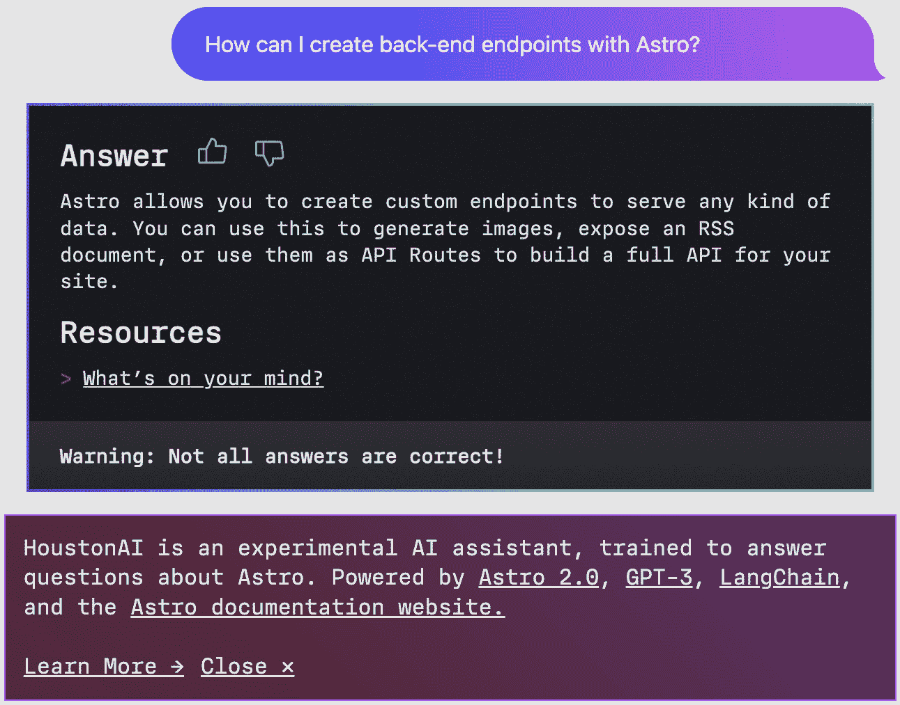

# 10

# 最佳实践

在本书的最后一章，是时候结束我们的旅程了，我们将探讨围绕通用 JavaScript 框架开发的几个关键主题，并展望这个生态系统框架的未来。在前面的章节中，我们已经分析了现实世界的例子，并建立了一个以项目维护和组织为中心的稳固知识库。利用这些实际知识，在本章中，我们将关注框架的当前状况，并检查几个预测，以了解这个领域未来的创新方向。总体目标是理解目前普遍存在的 JavaScript 框架开发的最佳实践，以及探索一些随着出现而出现的未来模式。

本章的核心要点将围绕弥合我们现在在框架开发空间中的位置与框架作者将在近期到长期未来构建的解决方案之间的差距。这一深入探讨将涵盖以下主题：

+   **框架的常见主题**：第一部分讨论了我们在本书中看到的许多框架项目中的几个架构模式和常见选择。如模块化、代码库的方法、最佳实践标准化以及基于性能的设计是有效且稳健框架的基石。有了这些元素，我们将更好地预测这个软件开发领域的创新。

+   **框架的未来**：我们将看到哪些因素将影响框架随时间推移如何演变，重点关注与开发者体验、解决全栈复杂性以及突出潜在的新开发方法相关的主题。本节突出了即将重新定义行业轨迹的开发方法中的潜在范式转变。在开始为公众构建新软件时考虑和研究新趋势和技术是很重要的。

+   **额外开发考虑因素**：最后，为了结束我们的冒险之旅，关于额外考虑因素的章节将聚焦于诸如时间投入、财务支持以及整体软件支持等重要因素。这些因素在项目进展过程中往往被忽视，但它们对框架项目的进程和结果有重大影响。对于任何类型的框架开发者来说，这些额外的考虑因素都至关重要。

在这些关于*最佳实践*的主题上，本章突出了 JavaScript 框架开发的持久原则——考虑常见主题，探讨将塑造类似项目未来的因素，以及必须考虑的辅助考虑因素。理解这些*最佳实践*是解锁您理解和影响自己 JavaScript 框架开发轨迹潜力的关键。这些技能将保持未来性，无论技术环境如何变化，因为您进一步深入到项目开发中。关于开发中常见主题的第一部分探讨了框架开发中今天重用的几个概念示例。让我们开始吧。

# 技术要求

与*第九章*类似，`chapter10`目录包含几个展示框架最佳实践相关工具的示例项目。请参考`chapter10/README.md`文件，以获取有关这些章节子目录内容的指南。技术要求与其他章节类似，例如使用 Node.js 20 或更高版本。

# 常见主题

观察 JavaScript 生态系统中的框架项目当前状态，我们可以看到 JavaScript 框架领域的稳定性、活力和混乱。例如，我们看到了许多项目采用在现有原语之上构建的方法，例如许多框架使用 React 组件库作为组件架构和浏览器渲染的基础。在另一端，项目是从零开始创建的，重新发明了浏览器渲染的方法或使用 JavaScript 解决软件开发中的特定挑战。本节探讨了在许多项目中出现的类似常见主题。了解这些特定的共同点有助于框架开发者与整个生态系统保持联系，并开发更一致的项目。

当我们从宏观的角度审视所有这些项目的当前状态时，在光谱的一端，我们发现了一些大型、成熟的框架，它们支撑着众多高流量应用和复杂的工具。随着每一次的发布，这些框架都在增强它们的成熟度和稳定性。例如，Electron 作为最受欢迎的框架，用于利用网络技术进行应用开发，其每个新版本都在稳步提升其设计和性能指标。相反，一系列不断发展的项目在 JavaScript 社区中产生了新的、创新的想法。这些新来者，无论是作为公共资源引入还是为内部业务需求定制，都为生态系统注入了一剂新颖和多功能性。例如，*Svelte* 和 *SvelteKit* 挑战了一些既定的范式，并引导某些开发者的思维模式转向不同的方法。随着网络应用架构的方法不断变化和发展，整个光谱都激发了所有 JavaScript 开发者的兴奋、机会和新技术的进步。

在 *第一章* 的 *框架展示* 部分中，我们绘制了框架开发在漫长的时间线上的演变。从最初作为特定任务的专用解决方案开始，例如它们最初专注于单页应用，框架已经发展到成为全面发展的开发平台。现代框架的功能呈指数级增长和丰富，包括解决全栈需求以及更多。在 *第六章*、*第七章* 和 *第八章* 中，我们通过 *Componium* 框架的开发实例，看到了对各种包和抽象的依赖，以构建这个全面的框架，形成一个完整的全栈系统。

## 模块化

模块化是我们可以从本书中提到的许多项目中提炼出的一个常见主题。模块化概念以多种方式适用于 JavaScript 项目，并且与其它编程生态系统中的项目相比，它们在 JavaScript 项目中具有特殊性。模块化开发方法得益于网络应用的结构以及 `npm` 等注册表中的包结构，这些结构由 `package.json` 格式支持。相比之下，当观察像 Python 这样的编程语言时，它们依赖于外部项目依赖，但缺乏一种标准化的方法来有效地处理这些依赖。JavaScript 处于一个独特的位置，其框架使用许多内部和外部模块。这种方法在开发速度上具有益处，但从维护的角度来看，也带来了一定的负担。

图 10.1：AdonisJS 的模块化

*图 10.1* 展示了 *AdonisJS* 中模块化的一个示例。该图展示了该框架第一方包的概要结构。AdonisJS 框架的包组织得很好，并且为了开发者的便利而解耦，开发者可以选择更适合他们用例的包。大多数包都是从 Adonis 命名空间安装的——`npm install @adonisjs/ally`。它们随后使用框架的命令行工具进行配置，称为 **Ace**。在 AdonisJS 核心中，代码库也依赖于几个模块来开发以及提供最终用户功能：[github.com/adonisjs/core/blob/develop/package.json](https://github.com/adonisjs/core/blob/develop/package.json)。这仅仅是我们在整个生态系统中的项目中看到的一个常见主题的另一个例子；随着新项目在社区中变得更加流行，这种做法可能不会很快改变。作为一个框架开发者，你会接受现有的代码和结构，并将你的项目组织成模块。

测试模块化

`chapter10/adonisjs` 目录包含一个示例 AdonisJS 项目。在项目目录中，你可以运行 `npm install` 然后执行 `npm run dev`。

一旦项目运行起来，你可以在浏览器中打开以下地址：`http://127.0.0.1:3333/`。当示例应用运行时，你可以通过 `npm install @adonisjs/ally` 安装和使用额外的模块，如本节前面列出的模块。你可以在 [adonisjs.com](https://adonisjs.com) 找到更多模块和包。

架构复杂性的增加与模块化的好处形成对比。例如，一个框架消耗或暴露的模块越孤立，你就越需要考虑耦合以及所有这些模块如何协同工作。最近的一些挑战涉及保持依赖项更新或标记框架分离模块的新版本。框架开发者必须投入更多时间来管理他们消耗和产生的依赖项，这在 JavaScript 平台上在不久的将来不太可能改变。

## 设计演变

许多 JavaScript 框架中一个常见的主题是设计演化的概念。与其他语言中的系统类似，用 JavaScript 构建的框架需要随着时间的推移而演化，以应对不断变化的环境。变化因素可能包括技术变革或进步、新的行业趋势，或者赶上竞争框架。在 JavaScript 的情况下，这些因素包括对网络浏览器、Node.js API、运行时改进等方面的进步。明确的抽象和深思熟虑的架构可以帮助您适应这些变化，而无需在框架项目中进行剧烈的重构。一些例子可以证明在 JavaScript 框架存在的环境中发生了这样的剧烈变化，例如前端框架中引入了 Web 组件和相关现代 API。一些框架选择接受新的标准或与之集成，以更好地适应不断演化的网络。

另一个例子是迁移到 **ECMAScript 模块**（**ESM**）格式。最初，项目必须适应第三方模块系统，如 CommonJS 或 AMD，或者实现自己的系统。然后，随着官方 JavaScript 模块定义的创建，项目必须接受新的代码库结构方式。尽管 ESM 带来了诸如静态模块结构和在所有 JavaScript 环境中改进的语法等好处，但在某些用例中仍然存在复杂的兼容性问题。框架作者需要确定并评估其项目对 ESM 的支持。例如，从版本 16 开始，Angular 项目开始支持作为开发者预览的 ESM 模块，并将其作为一个选项提供。这使得项目能够通过动态导入表达式和懒加载模块来扩展功能集。此外，这一变化还提高了应用程序构建的构建时间性能。它还允许框架使用更现代的工具，如 *esbuild*，该工具也被用于 Componium 框架。

图 10.2：Electron.js 的部分发布说明

对于像 Electron 这样的应用程序框架，框架功能在每个主要版本发布时都会有所变化。这是因为主要版本通常会跟踪底层 Chromium、Node.js 和 V8 的变化，如 *图 10.2* 中的发布说明所示。随着这些组件中新的修复和功能的引入，框架提供的内容会随着新版本的发布而演化。这是一个令人信服的例子，说明了项目如何利用外部依赖的持续演化的改进。

新增了许多框架的新功能，如服务器端渲染，因为出现了新的在服务器端加湿和生成视图的方法。现有项目添加了新功能，以便服务器端渲染等特性能够适应现有的 API 界面和架构。从整体上看，我们可以在各种类型的项目中看到这些类似的趋势变化。深思熟虑地适应最新趋势可以避免项目停滞，并使我们能够跟上最新的 JavaScript 进展。

## 极简主义方法

另一个常见的主题是框架设计的极简主义方法。一些框架可能选择专注于简洁和最小化的架构变更。在这些情况下，依赖项的数量和复杂性都大大降低。更简单的框架在资源有限的环境和不需要大量框架开销的项目中可能非常有效。在 JavaScript 项目中，这些框架通常旨在提供一个简单的 API，文件大小小巧，主要关注特定的独立功能集。如果功能集符合要求，选择这种类型的方法可以减少框架开发所需的资源，并为利益相关者提供一个更加干净、简单的界面。

为了突出一些例子，从前端的角度来看，*Preact* ([preactjs.com](https://preactjs.com))作为一个库，采取了一种极简主义方法，为 React 库提供了一个 3 千字节的选择。它可以用作前端渲染的极简框架。后端的一个例子是来自*第一章*的*Hapi.js*项目。它专注于构建 API 端点的功能；如果你查看框架的源代码，你会在其核心部分找到少于 20 个文件。

重要的是要记住，你可以根据你的需求构建极简框架，并不总是需要复杂的工具和庞大的功能集。这种类型的方法并不仅仅关乎最终框架的大小或项目中的文件数量，它也可以作为你在框架开发过程中做决策时的指导原则。在许多方面，当这些类型的项目用于实际项目时，它们同样能够取得很好的成果。

## 构建工具

在*第三章*中，“框架编译器和打包器”部分展示了构建工具的示例。这些工具通常与框架一起提供，以实现优化后的应用程序包输出。一些框架还利用不同的构建工具类型或提供灵活的选项，允许利益相关者选择他们的构建工具。如今，构建工具的趋势是更容易为许多 JavaScript 环境生成输出，重点是速度。框架和构建工具结合的另一个主要方面是许多开发者合作改进构建工具工作流程，以适应不同项目需求的使用案例。

在流行的工具，如 **webpack** 中发现的构建工具的额外好处是强制执行良好的模式，并在应用程序输出不适合客户端或服务器环境时警告开发者。例如，打包工具可以在打包的包太大而无法由浏览器加载或可能不符合其目标客户端环境时警告开发者。

构建工具驱动着框架的持续优化，通过优化和进步，并为 JavaScript 应用程序的性能提升做出贡献，这是我们接下来要强调的下一个常见主题。

## 性能提升

对持续性能改进和基准测试的重视是 JavaScript 框架中相当典型的另一个主题。根据框架环境的不同，优化重点在于消耗更少的计算机资源、提高加载或响应时间、促进更流畅的用户交互、扩展渲染能力等。这类优化需要更深入地了解 JavaScript 语言以及优化现有代码的能力。对于更大的项目，优化过程也会变得越来越复杂。

自从早期 JavaScript 框架以来，已经建立了很多基准测试和基准测试工具。然而，在许多情况下，这类基准测试并不能真正基准测试真实用户行为或真实世界的应用程序使用案例。就像其他类型的软件基准测试一样，这些性能测试系统建立了一个标准测试来比较不同场景中的实现。尽管在许多情况下结果可能存在缺陷，但它们可以为试图找到适合其使用案例的框架的利益相关者提供一些见解。此外，即使经过多年的基准测试竞争，框架仍然希望展示它们在某些功能集上相对于竞争对手的优势。

图 10.3：一个开源的 js-framework-benchmark

*图 10**.3* 预览了 **js-framework-benchmark** 的过滤结果示例，这是一个专注于常见列表操作的基准测试。它可以在 [krausest.github.io/js-framework-benchmark](https://krausest.github.io/js-framework-benchmark) 找到。这个特定的基准测试专注于前端解决方案。如果你开发了一个前端框架，你可以将你的代码库添加到现有框架的列表中，以查看其比较情况。这类测试可以展示框架在包含复杂数据列表的应用程序中的表现，包括对数据行更新的处理。此基准测试还深入考虑了内存使用、加载时间和框架大小。

其他类型的框架需要不同类型的基准测试。例如，在 [techempower.com/benchmarks](https://techempower.com/benchmarks) 上有一个针对后端 Web 框架的全面比较。这些测试概述了针对服务器端框架的特定负载测试，并包括来自其他编程语言的项目。这类框架更关注请求的延迟、吞吐量、与数据库查询的交互等。框架的某些方面，如请求的吞吐量，展示了在特定框架下运行的服务器在重负载下的行为。

不同类型的框架可以利用它们框架空间中存在的类似测试。如果你的框架类型没有现有的测试类型，那么你可以建立自己的基准测试，并跟踪从发布到发布的成果，专注于提高与最相关功能集性能相关的数字。

今天框架的常见主题可以极大地影响你的框架项目，但要创造你构建的系统中的创新，还有更多需要从即将到来的趋势中学习。在下一节中，我们将探讨影响新 JavaScript 项目的未来趋势类型。

# 框架的未来

JavaScript 生态系统仍然是其他编程语言中最活跃的之一，并且注定会增长并扩展到新的领域。随着这种情况的发生，我们将开始看到影响框架构建和使用的未来创新。今天我们看到的开发者使用的模式也将随着时间的推移而改变。跟上行业趋势并关注未来将帮助你构建更好的系统，并将最新趋势融入你所构建的内容中。在本部分，我们将探讨一些框架演化和改进可能走向的潜在领域。

## 开发者体验

我们已经看到，在框架中，**开发者体验**（**DX**）可以有多么重要。在未来，DX 因素将进一步区分优秀的框架和伟大的框架。提供额外的工具和找到减少复杂性的方法，将使使用框架开始构建变得更加容易。在近年来，我们已经看到了实现端到端框架 DX 的策略，帮助利益相关者在构建应用程序的每个步骤中。出色的 DX 概念与减少使用框架的整体复杂性的概念非常契合。以下是一些未来 DX 改进将关注的主题：

+   **降低学习曲线**：框架作者将继续投资于使接口更易于接近，特别是对于新开发者。在服务器和前端环境中，这可能意味着进一步与 Web API 的结构保持一致，这有助于避免引入具有独特接口的新类型抽象。给未来框架开发者的一个建议是思考如何简化您项目的学习曲线。

+   **简化配置**：框架将进一步简化开箱即用的配置，选择最合适的选项将有助于开发。这包括更多合理的默认设置，正如我们在*第七章*中看到的，其中框架的某些部分专注于更简单的配置。对于您自己的项目，您应该注意您引入的每个配置选项，并避免让用户在必要的配置步骤中感到不知所措。

+   **改进测试**：项目将继续使编写和执行测试变得更加容易，进一步专注于简化难以测试的组件的测试。例如，随着新的端到端测试框架的开发，这些项目已经解决了测试中的常见开发者烦恼，如测试的不可靠性和 CI 环境中缺乏调试工具。在您的框架中强调简化测试可以帮助用户的日常体验，因为编写测试是一个耗时的工作。

+   `package.json`源代码。未来的项目可能会抽象出他们在后台使用的某些工具，从而在 DX 上提供更多控制。此外，项目还将构建更多自己的工具，使用生态系统中现有的原语。

+   **关注性能**：与*常见主题*部分中描述的性能改进类似，项目将继续推动 JavaScript 语言和运行时的极限，寻找在渲染、延迟和其他相关指标方面进行改进的方法。随着前端领域对性能的重视，开发者会遵循可以提高 Web 应用程序体验的质量指标。这些指标和概念可以在[web.dev/learn-core-web-vitals](https://web.dev/learn-core-web-vitals)找到。

+   **额外的灵活性**：框架将继续添加更多选项以支持不同的环境。例如，后端解决方案将扩大与更多数据库的集成。应用程序框架，如 Electron，将利用浏览器运行时和操作系统内可用的最新 API。对于你构建的框架，你应该在灵活性和支持的使用案例数量之间找到一个平衡点。只有在你有足够的资源来维护这个大型功能集时，你才应该为使用案例添加额外的支持。

+   **打包和捆绑改进**：框架打包应用程序代码的方式已经发生了显著变化。这种对改进打包技术的关注将继续，重点是速度和提供更多捆绑代码的不同方式。对于像你这样的框架开发者来说，跟上这些打包工具的最新改进非常重要，因为它们可以改善你构建系统打包的方法。

这个列表并没有涵盖 JavaScript 系统未来可能走向的所有潜在方向。然而，遵循现有项目的既定轨迹有助于突出你作为框架开发者可以提供重大影响并为你用户做出贡献的地方。

## 拥抱新技术

除了开发者体验的改进，新技术将在 JavaScript 应用程序执行的地方提供。正如在*第一章*中强调的，Web Assembly 将在为计算密集型任务提供下一代解决方案中发挥重要作用。这有可能将现有框架的代码库扩展到包括底层语言。这也将要求维护者将他们的领域知识扩展到仅限于 JavaScript 代码之外。在关于其他语言的议题上，TypeScript 的使用将继续增长，因为它的好处对框架作者来说非常值得。然而，框架的消费者仍然可以使用最初从 TypeScript 转换而来的*构建*版本的框架。

浏览器引擎的额外改进也将推动性能提升和在框架依赖浏览器引擎行为的地方带来新的功能。一个获取灵感的来源是[groups.google.com/a/chromium.org/g/blink-dev](https://groups.google.com/a/chromium.org/g/blink-dev)上的`blink-dev`邮件列表，它突出了最终将出现在 Chromium 和 Chrome 浏览器中的即将到来的变化。

包管理也是将发生许多新技术变化的一个领域。几乎每个项目都依赖于包管理工具，如`npm`来解析和构建其代码库。包管理器在开发工作流程中扮演着如此重要的角色，任何改进都将对 JavaScript 开发产生重大影响。未来将带来更好的版本控制、依赖关系解析、项目增强安全性等。包管理器的演变也应当使框架组织和开发变得更加容易，允许作者以更符合开发者友好的方式布置他们的项目。

另一个重大新工具是利用 AI 驱动的模型来造福框架的各个方面，这在下一节中进行了探讨。

## 大型语言模型的使用

近年来，由不同神经网络驱动的**大型语言模型（LLMs**）的进步已经影响了软件工作流程和工具。作为框架开发的一个步骤，使用人工智能工具可能会变得更加普遍。类似于包含项目发布文档的重要性，开发者可能会捆绑一个专门为他们的框架训练的模型。该模型可以了解项目的公共 API、内部结构和文档。这些相互关联的模型可以在开发过程的各个阶段发挥作用。例如，当你重构代码时，由训练模型驱动的 AI 助手可以为你提供潜在更改的建议。随着这些模型集成越来越精细，它们也可能接管项目维护中的一些更重复或冗余的任务。

图 10.4：Astro AI 框架助手的示例

使用一个现实世界的例子，如图*图 10**.4*所示，一站式框架**Astro**专门训练了一个模型来回答关于项目的疑问。这个开发者工具可供公众使用，通过允许用户就项目提出问题来解决潜在的支持和集成障碍。该工具可在[houston.astro.build](https://houston.astro.build)上找到。这类工具可以接受关于项目某些功能的查询，例如创建 API 路由和端点。响应由来自文档和对话模型的混合文本组成。最终资源链接将用户引导至[docs.astro.build/en/core-concepts/endpoints](https://docs.astro.build/en/core-concepts/endpoints)，其中包含有关为使用此框架的应用程序配置端点的信息。

结合使用训练有素的 AI 模型以改善开发者体验的类似想法，训练有素的 LLM 可以用于脚手架目的，并在框架工具本身中使用。在*第八章*中，我们看到了在 Componium 框架中生成代码的例子；一个潜在的未来增强功能可以由一个应用程序开发者关于他们试图构建的组件的查询来触发。后来生成的代码可以为开发者节省大量时间，减少他们需要阅读的文档量以及他们需要编写的代码量。创建和理解这些由 LLM 驱动的集成将是全栈开发者范式的一个额外步骤。在框架开发和维护的不同阶段集成这些类型的 LLM 将改变框架作者在项目中的大部分时间花费在哪里。

在涵盖了当前和未来的主题之后，让我们探讨在新的框架项目开发中我们还应该考虑哪些其他方面。

# 其他考虑因素

在*第五章*中，我们探讨了广泛的框架考虑因素，特别是影响技术架构的因素。由于创建一个新的框架项目，即使拥有完全独特的技术特性集，也是一个重大的决定，让我们再考察一些额外的考虑因素。除了技术挑战之外，这次考察将帮助我们决定从头开始启动一个项目并长期维护是否值得投资。成功推出一个拥有众多利益相关者和目标用户的框架项目将需要时间和财务支持。

除了技术障碍和架构挑战之外，框架开发者需要在开始新项目时考虑可能的投资回报。看看 JavaScript 空间中的一些成熟项目，其中许多都是多年的投资，有大量的开发者贡献了付费或开源时间以实现功能集。让我们在以下部分重点关注时间投资、用户支持和财务支持这三个特定的支柱。

## 时间投资

框架开发者需要考虑新项目的时间投资和生命周期。这不仅仅是关于开发阶段，还包括它所涉及的整个生命周期承诺，这可能影响组织内的多个团队或公司的更大目标。开源开发者也有类似的承诺需要考虑，但责任较小，尤其是在项目的早期阶段。与典型的 JavaScript 应用程序项目不同，框架开发通常没有线性时间表或指定的结束里程碑，届时可交付成果被视为完成。相反，这个过程是迭代的，包括开发周期、测试、改进和更新。这些主题与维护章节和新功能开发生命周期章节相联系。

一个框架项目将需要比一个开发者或整个团队创建的初始大量编码投资更多。为了适应不断变化的需求和技术规范，必要的持续更新将需要同等重要的承诺。考虑到我们在*第九章*中看到的任务，维护时间投资包括需要一个全面的流程，涉及许多开发者。当选择构建新的解决方案时，考虑你愿意投入多少时间以及你能成功执行多大规模的框架。做出深思熟虑的决定将决定你的框架努力是否成功。

## 用户支持

用户支持与时间投资一样重要，它往往决定了项目的成功。除了生产可读性和组织良好的文档外，对用户挑战和需求的理解也超越了代码库。对于所有类型的框架项目，作为开发者，你将发现自己或你的团队在充当支持和故障排除框架集成方面。以一个公开的例子来说，Vue.js 项目有一个讨论论坛，用户在那里发布他们的技术和架构问题：[github.com/vuejs/core/discussions](https://github.com/vuejs/core/discussions)。团队有责任回答这些查询并保持良好的社区姿态。在公司内部的项目中，框架作者通常建立一个类似的平台与消费者互动。对于较小的公司，这种支持互动更加直接和实际。然而，在这些所有场景中，支持方面都占据了重要的开发时间。

减少这种类型流失的最佳策略是不断努力改进支持工作流程。改进措施包括整理常见问题以备后用，为复杂的框架集成创建指南，并尽可能使框架知识库易于发现。就像在*第九章*中看到的循环开发过程一样，作为维护者，你将发现自己对支持新用户和旧用户持续承诺。为了使项目成功，你必须把用户放在首位，并能以可接受的方式满足他们的需求。

所有这些在框架构建额外方面的投资都需要一个货币预算，我们将在下一节中重点介绍。

## 财务支持

在支持项目的复杂技术挑战、时间和物流之外，框架还需要考虑另一个因素——那就是财务支持的存在。资助一个新项目将需要承担特征开发和基础设施成本的不断支出。根据你的项目环境，可能会产生额外的成本——例如，如果你正在尝试推广企业框架给潜在客户。在公司环境中，如果框架间接支持基础服务和产品，资金可以从产品的利润中逐渐流入。

大多数开源项目通常没有完全的资金支持，但可能由一个拥有足够项目预算的大组织赞助，这也有助于间接推动开发工作或推进组织的议程。例如，Cypress 开源测试框架有一个付费的 Cypress Cloud 服务，它提供了一个专用环境。相反，一些开源开发者利用 Patreon 或 GitHub Sponsors 等平台来资助项目，直接从公司和个人用户那里获得财务贡献。

这些额外的考虑因素在规划和执行你的项目中可以发挥重要作用。根据你的开发目标，这些因素中的一些可能会使你试图建立的框架项目成功或失败。

# 摘要

本章提出了三个最终话题，这些话题可以帮助框架开发者更好地理解创建新框架的努力，这些话题都围绕着 JavaScript 开发的常见主题。对项目未来的展望也有助于开发者理解和准备在这个特定技术空间中即将到来的是什么。通过探索这些共同主题，你将了解模块化项目可以是什么样子，以及随着时间的推移，它们的设计是如何演变的，这使得做出关于自创项目的决策变得更加容易。同样，了解性能优化方法和独特的架构模式对潜在的框架作者也有益。

在第二部分中，本章强调了即将到来的趋势，并探讨了框架的未来潜力，为我们展示了这个空间即将到来的是什么。新一代的框架作者和维护者将体验到 JavaScript 环境的新挑战，并重构现有解决方案，使它们以新的方式更加能够应对。对更好的开发者体验和 LLMs 仍未知可能性的期望，使得框架空间对经验丰富的和新兴的 JavaScript 开发者来说都异常激动人心。

在结尾部分，本章强调了可以帮助开发者做出正确决策的额外考虑因素，这些非技术性考虑因素对开发者来说可能不那么吸引人，但它们对于框架创建过程至关重要。最后一章旨在提供更多见解，以增强你对框架开发的了解，并为你现实世界中的项目成功做好准备。

总之，本书及其所有章节的目标都是揭示框架开发方法，使构建自己的 JavaScript 框架的过程对所有开发者来说都更加易于接近。通过获得这些知识，你现在拥有了做出更好决策和推动更复杂的框架相关项目成功的技能。我们从对现有项目的旅程开始，确定了框架开发的关键部分，然后从零开始构建了一个全栈框架，这包括对架构模式和项目考虑因素的探索。

让我们总结一下在这些章节中学到的主题：

+   **JavaScript 空间中其他项目的知识**：第一章展示了不同类型的框架是如何出现以及它们为更广泛的开发者用户群体解决了哪些问题。这些项目的集合让我们窥见了现有的解决方案，这些解决方案有助于解决软件挑战。

+   **框架组织和构建模块**：这部分内容让我们了解了框架中抽象的基本原理，以及应用于后端、前端和其他类型项目的基本构建模块。

+   **架构和模式**：这部分展示了 Angular 和 Vue.js 等现有项目背后的概念和结构示例。这还包括了提及帮助将框架组合起来以供消费的额外工具。

+   **确保框架质量**：这部分内容让我们了解了框架如何通过创建文档、确保经过充分测试的组件以及如何通过开发工具帮助确保向用户交付优质软件来提供优质体验。

+   **项目考虑因素的概述**：这有助于制定开发计划，包括在开始解决技术问题之前需要考虑的各个方面。

+   **创建新的测试框架**：这为我们提供了创建实用框架项目的实践经验。它介绍了测试系统背后的技术架构，并具有详细的功能。

+   **开发后端组件**：这部分继续了实用方法，重点关注后端开发。我们概述了服务器端解决方案和 Componium 的开发者体验的方法。

+   **构建前端组件**：这是专注于前端组件的实用方法的最后一部分。它包括架构设计，涉及反应性、服务器端渲染等概念。

+   **维护项目所需的努力**：这部分内容让我们了解了框架开发者必须每天和周期性地执行的任务，随着新功能和修复的添加到项目中。

+   **了解当今和未来的常见主题**：最后，这部分总结了我们在 JavaScript 项目中今天看到的典型事物，并考虑了新项目和未来的额外因素。

所有这些新获得的知识将在 JavaScript 生态系统中为你解锁更多可能性，使你成为一个更有效且熟悉的工程师，极大地促进你的职业生涯和负责的项目。Web 应用程序开发领域在许多方面不断演变，这推动了 JavaScript 框架的激动人心的生态系统。即使有灵活的构建模块和成熟的解决方案，仍有进一步扩展和改进的空间——现在从未有过更好的时机来开发 JavaScript 框架或为其做出贡献！
