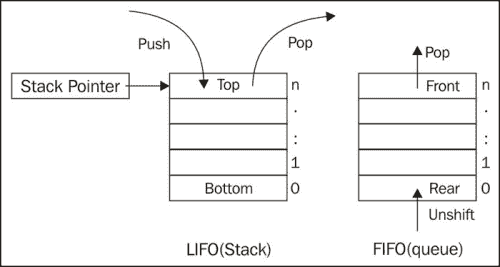

# 第三章. 集合

在本章中，我们将介绍：

+   创建模型集合

+   通过索引从集合中获取模型

+   通过 ID 从集合中获取模型

+   将模型添加到集合中

+   从集合中删除模型

+   将集合作为栈或队列进行操作

+   对集合进行排序

+   在集合中过滤模型

+   遍历集合

+   链接集合

+   在集合上运行 No SQL 查询

+   在同一集合中存储不同类型的模型

+   实现一对一关系

# 简介

当使用 Backbone 开发应用程序时，你通常需要与多个模型一起工作，这些模型可以组织到集合中。集合不仅仅是 JavaScript 数组。Backbone 提供了各种有用的方法来处理它。此外，Backbone 集合可以轻松与 REST 服务器通信以获取或发布多个模型。

在本章中，我们将学习与集合一起工作的常见操作，并将发现提供惊人功能的新扩展。

# 创建模型集合

在本食谱中，我们将学习如何创建模型集合。集合是一个用于将模型组织成有序集的对象。有特定的方法可以对集合进行排序、过滤和迭代。

## 如何做到...

按照以下步骤创建集合：

1.  扩展`Backbone.Collection`对象并传递模型的对象名称作为选项。

    ```js
    var InvoiceItemCollection = Backbone.Collection.extend
    ({
      model: InvoiceItemModel
    });
    ```

1.  初始化一个新的集合实例并传递初始的模型数组。

    ```js
    var invoiceItemCollection = new InvoiceItemCollection
    ([
      {description: 'Wooden Toy House', price: 22, quantity: 3},
      {description: 'Farm Animal Set', price: 17, quantity: 1},
      {description: 'Farmer Figure', price: 8, quantity: 1},
      {description: 'Toy Tractor', price: 15, quantity: 1}
    ]);
    ```

## 它是如何工作的...

`Backbone.Collection`知道在创建新实例时使用哪个模型对象，因为我们已在`model`属性中指定了它。内部，模型存储在`models`数组中。

## 更多...

我们还可以使用现有的模型初始化集合。以下是操作方法。

```js
invoiceItemModel1 = new InvoiceItemModel
  ({
    description: 'Wooden Toy House',
    price: 22,
    quantity: 3
  });
invoiceItemModel2 = new InvoiceItemModel
  ({
    description: 'Farm Animal Set',
    price: 17,
    quantity: 1
  });
var invoiceItemCollection2 = new InvoiceItemCollection
  ([
    invoiceItemModel1,
    invoiceItemModel2
  ]);
```

# 通过索引从集合中获取模型

当与集合一起工作时，我们可能需要获取特定索引处的模型，因为它存储在集合内部。

## 如何做到...

使用`at()`方法从集合的特定索引处获取模型。

```js
var model = invoiceItemCollection.at(2);
model.get('description'); // Farmer Figure
```

## 它是如何工作的...

内部，模型存储在`models`数组中，因此第一个元素从零索引开始。`Backbone.Collection`在向集合添加新模型、从集合中删除一个模型或执行排序时保持此数组的状态准确。

### 小贴士

**排序集合时要小心**

在执行集合操作时，排序可能会更新模型索引，因此具有相同参数的`at()`方法在排序前后可能获取不同的模型。

## 更多...

在本节中，我们将了解有关集合中模型的一些有趣细节。

### 获取集合模型的索引

要获取存储在集合中的模型的索引，请使用从`Underscore.js`继承的`indexOf()`方法。

```js
invoiceItemCollection.indexOf(model); // 2
```

### 获取模型的独立副本

从集合中检索的模型对象与存储在该处的对象相同，因此如果我们修改此对象，集合中的一个对象会得到更新。

```js
model.set('description', 'Superman Figure');
invoiceItemCollection.at(2).get('description');
// Superman Figure
```

如果我们需要获取模型对象的独立副本，我们可以使用返回的模型对象的 `clone()` 方法。修改克隆模型的属性不会影响原始模型的属性。

```js
var anotherModel = invoiceItemCollection.at(2).clone();
anotherModel.set('description', 'Another Figure');
invoiceItemCollection.at(2).get('description');
// Superman Figure
```

### 获取集合的长度

有一种方法可以获取集合的长度。这是通过 `length()` 方法完成的。以下示例获取集合长度，然后从集合中获取最后一个模型：

```js
var length = invoiceItemCollection.length; //4
model = invoiceItemCollection.at(length-1);
model.get('description'); // Toy Tractor
```

# 通过 ID 从集合中获取模型

在我们的应用程序中，我们可能需要通过其 ID 请求集合中的模型。

## 如何做到...

按以下步骤通过 ID 从集合中获取模型：

1.  要通过其标识符从集合中获取模型，请使用 `get()` 方法。

    ```js
    model = invoiceItemCollection2.get('4ryurtz3m5gn9udi');
    ```

1.  要通过其客户端标识符从集合中获取模型，您还可以再次使用 `get()` 方法。

    ```js
    model = invoiceItemCollection.get('c4');
    model.get('description'); // Toy Tractor
    ```

## 它是如何工作的...

当通过其 ID 获取模型时，`Backbone.Collection` 会搜索 `_byId` 数组中的模型，该数组存储了映射到其 ID 的模型。这种实现保证了最佳性能，因为无需遍历集合中的所有模型。

## 参考以下内容

+   在 第二章 *模型* 中 *使用插件扩展应用程序*

# 向集合中添加模型

在本食谱中，我们将学习向集合添加新模型的不同方法。

## 如何做到...

调用 `add()` 方法将新模型添加到集合的末尾。

```js
invoiceItemCollection.add
  ({
    description: 'Toy Track',
    price: 10,
    quantity: 1
  });
```

## 它是如何工作的...

`add()` 方法中的代码防止重复添加到集合中。唯一模型被插入到 `models` 数组中，并在 `_byId` 数组中映射到其 ID。此外，在 `collection` 属性中创建了对集合的引用。

默认情况下，新模型被添加到集合的末尾。但如果启用了排序或指定了插入索引，模型可以插入到不同的位置。

当向集合中添加新模型时，会触发 `add` 事件。

## 更多内容...

在本节中，我们将学习将模型（s）添加到集合的不同方法。

### 在特定位置添加模型

要在特定位置添加模型，我们需要传递 `{at: index}` 作为选项。

```js
invoiceItemCollection.add
  (
    {description: 'Fisherman Hut', price: 15, quantity: 1},
    {at: 0}
  );
invoiceItemCollection.at(0).get('description');
// Fisherman Hut
```

### 添加多个模型

我们还可以同时添加多个模型。

```js
invoiceItemCollection.add
  ([
    {description: 'Powerboat', price: 12, quantity: 1},
    {description: 'Jet Ski', price: 12, quantity: 1}
  ]);
```

### 添加现有模型

我们还可以使用现有的模型对象作为 `add()` 方法的参数。我们可以传递单个对象以及现有对象的数组。

## 参考以下内容

+   在 第五章 *事件和绑定* 中 *处理 Backbone 对象的事件* 

# 从集合中移除模型

在本食谱中，我们将学习如何从集合中移除模型。

## 如何做到...

调用 `remove()` 方法从集合中移除模型。

```js
invoiceItemCollection.remove(['c0', 'c1', 'c2', 'c3']);
```

在这里，我们可以传递模型的 `id`、`cid`，甚至模型对象作为参数。我们可以传递单个值或值的数组。

## 它是如何工作的...

当调用 `remove()` 方法时，模型将从 `models` 数组中删除，并且它们之间的任何引用也将被删除。因此，模型对象本身不会被销毁，如果需要，我们仍然可以与之交互。

## 还有更多...

有时，我们可能需要从集合中删除所有现有的模型并添加一些其他模型。有一个有用的 `reset()` 方法，它可以同时完成这两项工作。以下是它是如何工作的。

```js
invoiceItemCollection.reset
  ([
    {description: 'Wooden Toy House', price: 22, quantity: 3},
    {description: 'Farm Animal Set', price: 17, quantity: 1}
  ]);
```

# 将集合作为栈或队列使用

Backbone 中有一些特殊的方法允许将集合作为栈或队列使用。

## 如何操作...

按照以下步骤将集合作为栈或队列使用：

1.  调用 `push()` 方法将模型添加到集合的末尾。

    ```js
    invoiceItemCollection.push(model);
    ```

1.  调用 `pop()` 方法从集合中移除并返回最后一个模型。

    ```js
    model = invoiceItemCollection.pop();
    ```

1.  调用 `unshift()` 方法在集合的开始处添加一个模型。

    ```js
    invoiceItemCollection.unshift(model);
    ```

1.  调用 `shift()` 方法从集合中移除并返回第一个模型。

    ```js
    model = invoiceItemCollection.shift();
    ```

## 它是如何工作的...

要组织一个栈，也称为 LIFO（后进先出），我们需要使用 `push` 和 `pop`（`unshift` 和 `shift`）方法。要组织一个队列，也称为 FIFO（先进先出），我们需要使用 `unshift` 和 `pop`（`push` 和 `shift`）方法。

以下图像展示了栈和队列之间的区别：



# 排序集合

`Backbone.js` 提供了一个开箱即用的排序机制，我们将在本菜谱中学习。

## 如何操作...

按照以下步骤对集合进行排序：

1.  将 `comparator` 回调函数赋值给集合的 `comparator` 属性，以保持正确的顺序。

    ```js
    invoiceItemCollection.comparator = function(model)
      {
        return model.get("price");
      };
    ```

1.  `comparator` 回调函数接受一个参数，即模型对象。它应该返回一个值，根据该值对集合进行排序。

1.  可选地，调用 `sort()` 方法强制排序。

    ```js
    invoiceItemCollection.sort();
    ```

1.  检查结果。

    ```js
    invoiceItemCollection.pluck("price"); // [8, 15, 17, 22]
    ```

## 它是如何工作的...

当 `comparator` 回调函数被定义时，Backbone 使用它将新模型插入到 `models` 数组中，以便按正确顺序插入。

如果你将新的 `comparator` 回调函数分配给具有现有模型的集合，你需要通过调用 `sort()` 方法手动触发排序。

如果集合中的模型被更新，你也需要调用 `sort()` 方法。这可以通过在模型的 `change` 事件上绑定排序来自动完成。

## 还有更多...

在本节中，我们将以不同的方式定义比较器。

### 在比较器中比较一对模型

实现比较器的另一种方式是评估作为参数传递的模型对，并返回以下值之一：

+   -1（或任何负值），如果第一个模型应该在第二个模型之前

+   0，如果它们处于相同的等级

+   1（或任何正值），如果第一个模型应该在第二个模型之后

以下示例演示了按 `description` 属性的长度进行排序：

```js
invoiceItemCollection.comparator = function(m1, m1)
  {
    return m1.get("description").length -
    m2.get("description").length;
  };
invoiceItemCollection.sort();
invoiceItemCollection.pluck("description");
// "Toy Tractor", "Farmer Figure", "Farm Animal Set",
// "Wooden Toy 
```

## 参见

+   在 [第五章 *事件和绑定* 中处理 *Backbone 对象的事件*...

# 过滤集合中的模型

Backbone 提供了一种简单的过滤机制，我们可以使用它。

## 如何操作...

要过滤集合中的模型，请使用 `where()` 方法。它接受一个搜索标准并返回找到的模型数组。

```js
var result = invoiceItemCollection.where({quantity: 1});
// Result is just an array of models, so let's create
// new collection.
var resultCollection = new InvoiceItemCollection(result);
resultCollection.pluck('quantity'); // [1, 1, 1]
```

也可以一起传递多个标准。

```js
invoiceItemCollection.where({quantity: 1, price: 10});
```

## 参见

+   参考关于在集合上运行 No SQL 查询的配方，以了解更多关于高级过滤的信息

# 遍历集合

在本配方中，我们将讨论通过遍历集合以实现所需功能的各种方法。

## 如何操作...

遍历集合的最简单方法是使用 `Underscore.js` 提供的 `each()` 方法。

```js
var  descriptions_txt = '';
invoiceItemCollection.each(function(model, index, list)
  {
    descriptions_txt += descriptions_txt ? ', ' : ''; 
    descriptions_txt += model.get('description');
  });
descriptions_txt; // Wooden Toy House, Farm Animal Set
```

在 `each()` 方法中，我们传递一个迭代函数，该函数对每个模型执行。它接受以下参数：

+   **模型**：正在迭代的模型

+   **索引**：这是模型索引

+   **列表**：这是整个模型数组

## 工作原理...

`Backbone.js` 基于 `Underscore.js`，它提供了各种有用的工具，包括用于处理集合和数组的各种方法。Backbone 集合支持其中的一些功能。

## 还有更多...

在本节中，我们将学习一些依赖于迭代方法但更为具体的方法。

### 检查每个模型以匹配特定条件

要检查满足特定条件的集合中的每个模型，请使用 `every()` 方法。它接受一个回调参数，如果条件满足，则应返回一个 `Boolean` 值。

```js
var multiple = invoiceItemCollection.every(function(model)
  {
    return model.get('quantity') > 1;
  });
multiple; // false
```

### 检查任何模型以匹配特定条件

要检查集合中满足特定条件的任何模型，请使用 `some()` 方法。它接受一个回调参数，如果条件满足，则应返回一个 `Boolean` 值。

```js
var multiple = invoiceItemCollection.some(function(model)
  {
    return model.get('quantity') > 1;
});
multiple; // true
```

### 从集合中的每个模型获取属性

在前面的示例中，我们使用了 `pluck()` 方法，该方法从集合中的每个模型返回指定属性的值数组。让我们看看它是如何工作的。

```js
var descriptions = invoiceItemCollection.pluck("description");
descriptions; // ["Wooden Toy House", "Farm Animal Set"]
```

### 对集合中的每个模型执行特定计算

要对集合中的每个模型执行特定计算，请使用 `map()` 方法。它接受回调作为参数，对集合中的每个模型执行它，并返回结果数组。

```js
var amounts = invoiceItemCollection.map(function(model)
  {
    return model.get('quantity') * model.get('price');
  });
amounts; // [66, 77]
```

### 将集合中的模型简化为一个单一值

使用 `reduce()` 方法可以将集合中的模型简化为一个单一值。以下是其工作原理。

```js
var count = invoiceItemCollection.reduce(function(memo,model)
  {
    return memo + model.get('quantity');
  }, 0);
count; // 4
```

## 参见

+   `Underscore.js` 提供了许多有用的方法，可以与 Backbone 集合一起使用。您可以在 `Underscore.js` 官方文档中找到它们，网址为 [`documentcloud.github.com/underscore/#collections`](http://documentcloud.github.com/underscore/#collections)。

# 连接集合

如果你想连续执行多个 Underscore 方法，一种好的做法是将一个方法链接到另一个方法上。

让我们考虑一个简单的 MapReduce 示例，它计算总金额。

```js
var amounts = invoiceItemCollection.map(function(model)
  {
    return model.get('quantity') * model.get('price');
  });
// [66, 77]
var total_amount = _.reduce(amounts, function(memo, val)
  {
    return memo + val;
  }, 0);
total_amount; // 83
```

在这里，`amounts` 是一个 JavaScript 数组，它不提供我们可以调用的 `reduce()` 方法。为了解决这个问题，我们调用由 `Underscore.js` 提供的 `reduce()` 方法，它将数组作为第一个参数。

## 如何操作…

使用链接，可以使用点符号直接调用一个方法然后是另一个方法。以下是一个示例。

```js
var amount = invoiceItemCollection.chain()
.map(function(model)
  {
    return model.get('quantity') * model.get('price');
  })
.reduce(function(memo, val)
  {
    return memo + val;
  })
.value(); // 83
```

## 它是如何工作的...

`chain()` 方法将一个值包装成一个对象，该对象提供了可以执行的不同方法，这些方法返回一个包装后的值。要解包一个结果，请使用 `value()` 方法。

## 参见

+   要查看更多链接示例，请访问 [`documentcloud.github.com/underscore/#chain`](http://documentcloud.github.com/underscore/#chain)

# 在集合上运行 No SQL 查询

在前面的配方中，我们描述了多种技术，包括使用 `where()` 方法在集合中搜索模型的技术。

有更多高级的方法可以在集合中搜索模型，这可以通过名为 **Backbone Query** 的 Backbone 扩展来实现。它允许运行 No SQL（如 MongoDB）查询以搜索、排序和分页集合中的模型。

## 准备工作

你可以通过访问 [`github.com/davidgtonge/backbone_query`](https://github.com/davidgtonge/backbone_query) 下载 Backbone Query 扩展。要将此扩展包含到你的项目中，将 `backbone-query.js` 文件保存到 `lib` 文件夹中，并在 `index.html` 中包含对其的引用。

### 注意

在 第一章 的 *使用插件扩展应用程序* 配方中详细描述了将 Backbone 扩展包含到你的项目中，*理解 Backbone*。

## 如何操作...

按照以下步骤执行对集合的 No SQL 查询：

1.  要允许执行 No SQL 查询，请从 `Backbone.QueryCollection` 对象扩展集合而不是从 `Backbone.Collection` 对象扩展。

    ```js
    var BuyerCollection = Backbone.QueryCollection.extend
      ({
        model: BuyerModel
      });
    ```

1.  使用 `query()` 方法运行查询。

    ```js
    var result = buyerCollection.query({ firstName: 'John' });
    ```

1.  可选地运行结果数组的 `pluck` 属性。

    ```js
    var resultCollection = new BuyerCollection(result);
    resultCollection.pluck('firstName'); // ["John", "John"]
    ```

## 它是如何工作的...

`Backbone.QueryCollection` 扩展 `Backbone.Collection` 并提供了新的 `query()` 方法，该方法递归地将基本查询解析为子查询，并使用 `Underscore.js` 的 `reduce()` 方法依次运行相同组的查询。

Backbone Query 最初是用 CoffeeScript 编写的，后来编译成 JavaScript。所以，如果你对理解其源代码感兴趣，请查看 `backbone-query.coffee`。尽管如此，它看起来相当相似。

## 更多内容...

本节描述了 No SQL 操作符，并涵盖了一些高级主题，如分组、排序、分页和缓存。

### 使用标准操作符

以下运算符是常见的，并应用于存储在集合中的模型的属性。

#### $equal

它使用`===`执行严格的相等性测试。

```js
buyerCollection.query({ firstName: {$equal: 'John'} });
```

如果没有提供运算符，并且查询值既不是正则表达式也不是数组，则默认假设为`$equal`。

```js
buyerCollection.query({ firstName: 'John' });
```

#### $ne

这意味着不等于，与`$equal`相反，并返回所有不等于查询值的模型。

```js
buyerCollection.query({ firstName: {$ne: 'John'} });
```

#### $in

可以使用`$in`提供一组可能的值；如果提供的任何值匹配，则返回模型。

```js
buyerCollection.query({ firstName: {$in: ['John', 'Joe','Patrick']} });
```

#### $nin

这意味着不在，与`$in`相反，如果提供的所有值都不匹配，则返回模型。

```js
buyerCollection.query
({ firstName: {$nin: ['Samuel', 'Victor']} });
```

#### $exists 或 $has

这检查属性的存在，可以提供`true`或`false`。

```js
buyerCollection.query({ middleName: {$exists: true} });

buyerCollection.query({ middleName: {$has: false} });
```

### 组合查询

可以将多个查询组合在一起。有`$and`、`$or`、`$nor`和`$not`运算符，我们将在稍后学习。

#### $and

这是一个逻辑与运算符。以下查询选择所有名为 John 且住在 Alexandria 的买家：

```js
buyerCollection.query({ $and: {firstName: 'John', city: 'Alexandria'}});
```

`$and`运算符在没有提供组合运算符时用作粘合剂。

```js
buyerCollection.query
({ firstName: 'John', city: 'Alexandria' });
```

#### $or

这是一个逻辑或运算符。以下查询选择所有名为 John 或住在 Alexandria 的买家：

```js
buyerCollection.query
({ $or: {firstName: 'John', city: 'Alexandria'}});
```

#### $nor

这与`$or`相反。以下查询选择所有名字不是 John 或不住在 Alexandria 的买家：

```js
buyerCollection.query
({ $nor: {firstName: 'John', city: 'Alexandria'}});
```

#### $not

这是`$and`的反面。以下查询选择所有除了名字是 John 且住在 Alexandria 的买家以外的买家：

```js
buyerCollection.query
({ $not: {firstName: 'John', city: 'Alexandria'}});
```

### 对同一键的多个查询

如果我们需要对同一键执行多个查询，则可以将查询作为数组提供。以下查询返回所有名为 John 或 Joe 的客户：

```js
buyerCollection.query
  ({
    $or:[
      { firstName: 'John' },
      { firstName: 'Joe' }
    ]
  });
```

### 排序查询结果

要按属性排序结果，我们需要在第二个参数中传递它，并使用`sortBy`键。我们还可以通过传递带有`sort`键的`asc`或`desc`值来指定顺序。默认情况下，假设值为`asc`。以下代码显示了如何进行排序：

```js
result = buyerCollection.query
  (
    { firstName: {$like: 'John'} },
    { sortBy: 'lastName', order: 'desc' }
  );
resultCollection = new BuyerCollection(result);
resultCollection.pluck('lastName'); // ["Smith", "Doe"]
```

### 分页查询结果

有一种方法可以将大结果数组分成几个页面，并返回指定的一个。让我们看看它是如何完成的。

```js
buyerCollection.query
({firstName: 'John'}, {limit:10, offset:1, page:2});
```

我们可以在第二个参数中指定以下属性：

+   `limit`: 它将结果数组的大小限制为给定的数字。返回前 N 个元素。这是一个必需属性。

+   `page`: 它返回指定结果的页面。页面大小由 limit 属性设置。这是一个可选属性。

+   `offset`: 它跳过前 N 个结果项。这是一个可选属性。

### 缓存结果

由于性能原因，我们可能想要缓存我们的结果。这可以大大减少查询执行时间，尤其是在使用分页时，因为未分页的结果被保存在缓存中，用户可以快速浏览其页面。

要启用缓存，只需在第二个参数中使用`cache`属性。

```js
buyerCollection.query
({firstName: 'John'}, {limit:10, page:2, cache: true});
```

### 小贴士

缓存默认未设置，因为没有自动刷新缓存的方法，所以当启用缓存且集合正在更新时，缓存就会过时。

您应该意识到这个问题，并且每次集合或其中的模型更新时都手动执行缓存刷新。这可以通过调用`reset_query_cache()`方法来完成。

我们可以将集合的`change`事件绑定到`reset_query_cache()`方法，从而在集合更新时提供自动缓存刷新。

```js
var BuyerCollection = Backbone.QueryCollection.extend
  ({
    initialize: function(){
      this.bind('change', this.reset_query_cache, this);
    }
  });
```

## 参见

+   请参阅有关 Backbone 查询操作符的更多信息：[`github.com/davidgtonge/backbone_query#query-api`](https://github.com/davidgtonge/backbone_query#query-api)

+   在第五章的*处理 Backbone 对象的事件*中处理，*事件和绑定*

# 在同一个集合中存储不同类型的模型

当构建复杂的 Backbone 应用程序时，您可能需要处理不同类型的模型，这些模型应以类似的方式处理，因此您可能希望它们存储在同一个集合中。幸运的是，有一个`Backbone.Chosen`扩展允许我们这样做。

## 准备工作

您可以从以下页面找到并下载`Backbone.Chosen`：[`github.com/asciidisco/Backbone.Chosen`](https://github.com/asciidisco/Backbone.Chosen)。要将`Backbone.Chosen`包含到您的项目中，将`backbone.chosen.js`文件保存到`lib`文件夹中，并在`index.html`中包含对其的引用。

### 注意

在第一章的*使用插件扩展应用程序*配方中详细描述了将 Backbone 扩展包含到您的项目中，*理解 Backbone*。

## 如何做到...

假设我们有两个不同的模型类，即`IndividualContactModel`和`OrganizationContactModel`，我们想要将它们组织到一个单独的集合中。我们可以通过以下步骤来完成：

1.  定义模型。

    ```js
    var IndividualContactModel = Backbone.Model.extend
      ({
        name: function() {
          return this.get('firstName') + ' ' + this.get('lastName');
        }
      });

    var OrganizationContactModel = Backbone.Model.extend
      ({
        name: function() {
          return this.get('businessName') + ', '
          + this.get('businessType');
        }
      });
    ```

    如我们所见，这些模型有不同的属性，但共享一个共同的`name()`方法。

1.  使用`chosen`属性定义集合。

    ```js
    var ContactCollection = Backbone.Collection.extend
      ({
        model: {
          // Pass chosen properties.
          chosen: {
              // Attribute that should contain model type.
              attr: 'type',

              // Default model class.
              defaults: IndividualContactModel,

              // Mapping attribute values to model classes.
              map: {
                individual: IndividualContactModel,
                organization: OrganizationContactModel
              }
            }
          }
      });
    ```

1.  创建一个集合实例并在传入的 JSON 中指定映射属性。

    ```js
    var contactCollection = new ContactCollection
      ([
        {
          firstName: 'John',
          lastName: 'Smith',
          type: 'individual'
        },
        {
          businessName: 'North American Veeblefetzer',
          businessType: 'LLC',
          type: 'organization'
        }
      ]);
    ```

1.  检查结果。新添加到集合中的模型应该是正确模型类的实例。

    ```js
    contactCollection.at(0) instanceof IndividualContactModel;
    //true

    contactCollection.at(0).name(); // John Smith

    contactCollection.at(1) instanceof OrganizationContactModel;
    //true

    contactCollection.at(1).name();
    // North American Veeblefetzer, LLC
    ```

## 它是如何工作的...

`Backbone.Chosen`覆盖了`Backbone.Collection`的`_prepareModel`方法，以选择依赖于其映射属性值的正确模型对象。

## 还有更多...

本节解释了如何执行高级映射。

### 映射深层嵌套属性

`Backbone.Chosen`还支持嵌套属性。您可以使用点语法指定`attr`属性的值，例如，`options.type`，如果您的传入 JSON 看起来像以下代码：

```js
var contactCollection = new ContactCollection
  ([
    {
      firstName: 'John',
      lastName: 'Smith',
      options: {type: 'individual'}
    },
    {
      businessName: 'North American Veeblefetzer',
      businessType: 'LLC',
      options: {type: 'organization'}
    }
  ]);
```

### 使用函数映射模型

有时，我们可能需要使用更复杂的计算来映射模型。这可以通过映射函数的帮助来完成。以下是它是如何完成的。

```js
// Set up a collection
var ContactCollection = Backbone.Collection.extend({
  model: {
    chosen: function (rawData) {
      if (rawData.spice === 'salt') {
        return SaltyModel;
        }
      if (rawData.spice === 'sugar') {
        return SweetyModel;
        }
      return BoringModel;
      }
    }
  });
```

# 实现一对多关系

在第二章 *模型* 中，有一个关于在两个模型之间创建一对一关系的配方。在这个配方中，我们将学习如何创建一对多关系。

如果单个模型与另一类型模型集合之间的关联发生时，可以使用一对多关系。在我们的发票应用程序中，`InvoiceModel`和`InvoiceItemModel`之间的关系就是这样一种关系。发票项模型可以有多个，因此存储在`InvoiceItemCollection`中。

## 准备工作

您可以从其 GitHub 页面[`github.com/PaulUithol/Backbone-relational`](https://github.com/PaulUithol/Backbone-relational)下载 Backbone-relational 扩展。要将`Backbone.Relational`包含到您的项目中，将`backbone-relational.js`文件保存到`lib`文件夹中，并在`index.html`中包含对该文件的引用。

### 注意

在第一章 *理解 Backbone* 的 *使用插件扩展应用程序* 配方中详细描述了将 Backbone 扩展包含到您的项目中。

## 如何做...

一对多关系的实现与一对一关系的实现类似，但我们需要使用`Backbone.HasMany`作为类型并指定`collectionType`，因为多个模型应该存储在集合中。我们可以通过以下步骤来完成：

1.  从`Backbone.RelationalModel`扩展新的模型对象。

    ```js
    var InvoiceItemModel = Backbone.RelationalModel.extend
      ({
      });
    ```

1.  定义此模型类型的集合。

    ```js
    var InvoiceItemCollection = Backbone.Collection.extend
      ({
        model: InvoiceItemModel
      });
    ```

1.  从`Backbone.RelationalModel`扩展另一个模型对象，并传递带有关系定义的`relations`属性。

    ```js
    var InvoiceModel = Backbone.RelationalModel.extend
      ({
        // Define one-to-many relationship.
        relations: [{
          // Relationship type
          type: Backbone.HasMany,

          // Relationship key in BuyerModel.
          key: 'items',
          // Related model.
          relatedModel: InvoiceItemModel,

          // Collection to store related models.
          collectionType: InvoiceItemCollection,

          // Define reverse relationship.
          reverseRelation: {
            key: 'invoice'
          }
        }]
      });
    ```

1.  要使用一对多关系初始化模型，在创建新的`InvoiceModel`对象实例时，传递发票项数据的单个 JSON。

    ```js
    var invoiceModel = new InvoiceModel
      ({
        referenceNumber: '12345',
        date: '2012-09-01',
        items: [
          { description:'Wooden Toy House', price:22, quantity:3 },
          { description:'Farm Animal Set', price:17, quantity:1 }
        ]
      });

    invoiceModel.get('items').at(0).get('description');
    // Wooden Toy House

    invoiceModel.get('items').at(0).get('invoice')
    .get('referenceNumber'); // 12345
    ```

1.  当通过`items`属性访问相关集合时，可以使用`add()`方法向此关系添加新记录。

    ```js
    // Add new model to a collection
    invoiceModel.get('items').add
      ({
        description: 'Powerboat',
        price: 12,
        quantity: 1
      });

    invoiceModel.get('items').at(2).get('invoice') == invoiceModel;
    // true
    ```

    或者，我们也可以创建一个`invoiceItemModel`的实例，并使用`invoiceModel`的实例设置发票属性；这样，在两个方向上都会创建一个新的关系。

    ```js
    // Add new model
    invoiceItemModel = new InvoiceItemModel
      ({
        description: 'Jet Ski',
        price: 12,
        quantity: 1,
        invoice: invoiceModel
      });

    invoiceModel.get('items').at(3).get('description');
    // Jet Ski
    ```

## 它是如何工作的...

每个`Backbone.RelationalModel`在创建时都会将自己注册到`Backbone.Store`，并在销毁时从`Store`中移除。当创建或更新一个关系中的键属性时，被移除的相关对象会收到移除通知，并在`Store`中查找新的相关对象。

## 更多...

在本节中，我们将学习一些`Backbone.Relational`的高级用法。

### 实现多对多关系

默认情况下，无法创建两个模型之间的多对多关系，但可以通过使用这些模型之间的一对多关系和一个新的中间模型来轻松实现。

### 将相关模型导出到 JSON

当将模型导出为 JSON 时，它确实包括相关模型。这就是我们将 `InvoiceModel` 导出为 JSON 的方法。

```js
JSON.stringify(invoiceModel.toJSON());
```

这里是这种导出的结果。

```js
{
  "referenceNumber":"12345",
  "date":"2012-09-01",
  "items":[
    {
      "description":"Wooden Toy House","price":22,"quantity":3
    },
    {"description":"Farm Animal Set","price":17,"quantity":1},
    {"description":"Powerboat","price":12,"quantity":1},
    {"description":"Jet Ski","price":12,"quantity":1}
  ]
}
```

这就是我们如何导出 `InvoiceItemModel` 模型的方法。

```js
JSON.stringify(invoiceModel.get('items').at(0).toJSON())
```

结果是以下代码片段：

```js
{
  "description":"Wooden Toy House",
  "price":22,
  "quantity":3,
  "invoice":{includeInJSON
    "referenceNumber":"12345",
    "date":"2012-09-01",
    "items":[
      null,
      {
        "description":"Farm Animal Set","price":17,
        "quantity":1
      },
      {"description":"Powerboat","price":12,"quantity":1},
      {"description":"Jet Ski","price":12,"quantity":1}
    ]
  }
}
```

如我们所见，`toJSON()` 方法也导出了反向关系，但我们可以通过在直接和反向关系的 `includeInJSON` 属性中指定一个包含这些属性的数组来控制需要导出的相关模型的属性。

```js
var InvoiceModel = Backbone.RelationalModel.extend
  ({
    relations: [{
      type: Backbone.HasMany,
      key: 'items',
      relatedModel: InvoiceItemModel,
      collectionType: InvoiceItemCollection,

      // Restrict related models properties when exporting
      // to JSON.
      includeInJSON: ['description', 'price', 'quantity'], 

      reverseRelation: {
        key: 'invoice',

        // Restrict related models properties when exporting
        // to JSON for reversed relations.
        includeInJSON: ['referenceNumber', 'items'],
      }
    }]
  });
```

## 参见

+   *在第二章* 第二章：模型 中实现 *一对一关系*。

+   关于导出为 JSON 的更多信息，请参阅第七章 *使用 RESTful 服务同步模型和集合* 中的配方，第七章：REST 和存储。

+   Backbone-relational 扩展的完整文档可以在其 GitHub 页面上找到，网址为 [`github.com/PaulUithol/Backbone-relational`](https://github.com/PaulUithol/Backbone-relational)。

+   此外，Backbone-relational 扩展还有一个替代方案，那就是 Backbone-associations。
