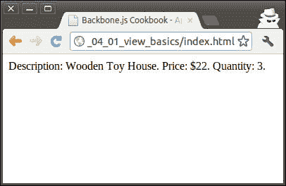
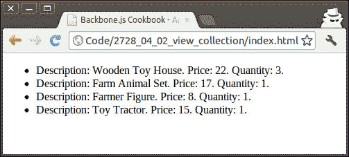
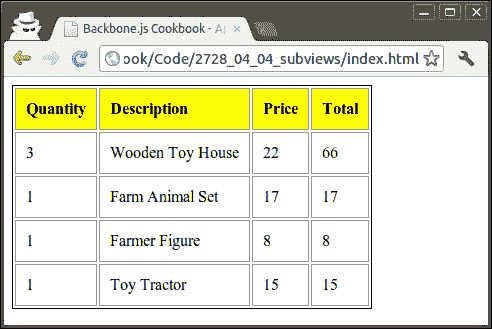
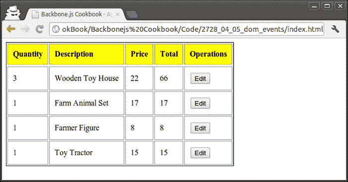
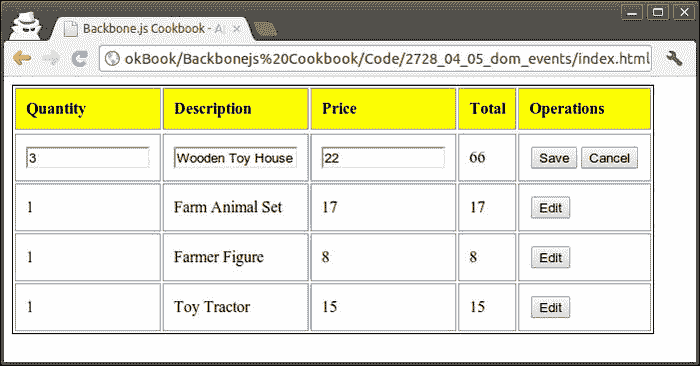
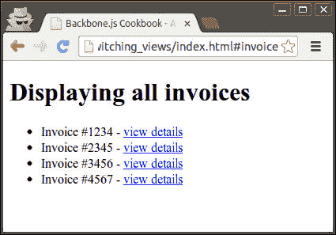
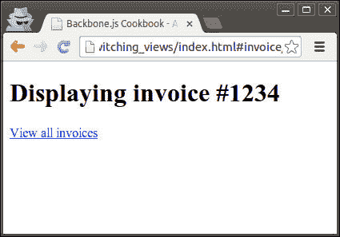

# 第四章 视图

在本章中，我们将涵盖以下内容：

+   在视图中渲染视图

+   使用 jQuery 处理视图元素

+   在视图中渲染模型

+   在视图中渲染集合

+   将视图拆分为子视图

+   在视图中处理**文档对象模型**（**DOM**）事件

+   使用 Backbone.Router 切换视图

# 简介

本章致力于 Backbone.js 中的视图对象；它用于将数据渲染到 HTML 代码中。视图可以绑定到 DOM 树中的 HTML 元素，并可以处理其事件及其子元素的事件。

模型和集合通常通过视图渲染，视图充当业务逻辑和用户之间的交互式桥梁。例如，视图可以监听 DOM 事件，并作为结果操作模型和集合或引导用户到不同的页面。该过程也可以反向进行：模型和集合的变化触发视图更新，从而在 DOM 树中进行更改。

Backbone 视图在处理 HTML 元素和处理它们的事件时依赖于前端 JavaScript 库，例如 jQuery 或 Zepto。

# 在视图中渲染视图

当我们想要向用户输出任何数据时，我们通常使用 Backbone 视图。在本例中，我们将创建一个简单的视图并将其渲染。

我们的结果将类似于以下截图：



## 如何做到...

按照以下步骤创建一个简单的视图并将其渲染。

1.  通过扩展`Backbone.View`对象来定义一个新的视图：

    ```js
      var InvoiceItemView = Backbone.View.extend({

        // HTML element name, where to render a view.
        el: 'body',

        // Initialize view object values.
        initialize: function() {
          this.html = 'Description: Wooden Toy House. ' +
            'Price: $22\. Quantity: 3.'
        },

        // Render view.
        render: function() {
          // Set html for the view element using jQuery.
          $(this.el).html(this.html);
        }
      });
    ```

1.  创建视图的实例：

    ```js
        var invoiceItemView = new InvoiceItemView();
    ```

1.  手动调用`render()`方法向用户输出 HTML 代码：

    ```js
        invoiceItemView.render();
    ```

## 它是如何工作的...

在视图的`initialize()`方法中，我们生成 HTML 代码并将其保存到`html`属性中，这是我们最近在`render()`方法中使用过的，在那里我们将此代码分配给由`el`属性定义的 HTML 容器。为此，我们调用 jQuery 函数，如`$()`和`html()`。

当创建一个新的视图实例时，会自动触发`initialize()`方法。此外，我们可以在创建其实例时从对象外部传递任何标准属性给视图。可以通过以下代码片段实现：

```js
var invoiceItemView = new InvoiceItemView({
  el: 'body'
});
```

如果我们希望`el`属性动态计算，也可以将其定义为函数。

当调用`render()`方法时，它会运行我们的代码，然后渲染视图。

## 更多...

在本节中，我们将学习一些处理视图时有用的技巧。

### 创建与视图相关的新 HTML 元素

有时，我们可能不想将视图渲染到 DOM 树中的现有 HTML 元素中；相反，我们可能想创建一个新的元素，然后将其添加到文档中。按照以下步骤创建与视图相关的新 HTML 元素。

1.  通过将值分配给`tagName`、`className`和`attributes`属性来手动定义视图并设置其元素和属性：

    ```js
      // Define new view.
      var InvoiceItemView2 = Backbone.View.extend({
        // Set tag name and its attributes.
        tagName: 'p',
        className: 'item',
        attributes: {
          'align': 'left'
        },

        // Initialize view object values.
        initialize: function() {
          this.html = 'Farm Animal Set. Price: $17\. Quantity: 1.'
        },

        // Render view.
        render: function() {

          // Set html for the view element using jQuery.
          $(this.el).html(this.html);
        }
      });
    ```

1.  创建一个新的视图实例。在这样做的时候，Backbone 会自动将 `el` 分配一个合适的值：

    ```js
        // Create new view instance.
        var invoiceItemView2 = new InvoiceItemView2();

        invoiceItemView2.el; // <p align="left" class="item"></p>
    ```

1.  渲染此视图。我们的渲染代码将创建一个新的 HTML 对象：

    ```js
        invoiceItemView2.render();
    ```

1.  将新创建的 HTML 对象插入 DOM：

    ```js
        $('body').append(invoiceItemView2.el);
    ```

1.  检查结果。我们的 HTML 页面的主体应该包含以下代码片段：

    ```js
    <body>
        <p align="left" class="item">
            Farm Animal Set. Price: $17\. Quantity: 1.
        </p>
    </body>
    ```

### 动态更改视图元素

在我们代码的工作过程中，我们可能想要更改视图元素。这可以通过 `setElement()` 方法来实现。以下两种方法都是有效的。

```js
// Change existing element to the new one.
InvoiceItemView.setElement('li');

// Change existing element to the one already exists
// in the DOM tree.
InvoiceItemView.setElement($('body div'));
```

当调用 `setElement()` 方法时，Backbone 会取消委托之前元素分配的事件，并将它们分配给新元素。

### 移除视图

当我们完成对视图的工作并想要移除它时，我们还需要从 DOM 中移除其元素并停止监听事件。为此，我们只需调用 `remove()` 方法。

## 参见

+   在这个菜谱中，我们使用 jQuery 方法 `$()` 来访问视图元素的属性。请参考下一个菜谱以获取有关 jQuery 的更多信息。

# 使用 jQuery 处理视图元素

毫无疑问，jQuery 是目前最受欢迎的 JavaScript 库。它通过 CSS 选择器简化文档遍历，并提供简单的事件处理、动画和 AJAX 交互。

Backbone.js 在处理视图时依赖于 jQuery。在本菜谱中，我们将学习如何使用 jQuery 与视图元素交互。

## 如何做到这一点...

按照以下步骤使用 jQuery 处理视图元素。

1.  要使用 jQuery 访问视图元素，请使用 `$(this.el)`：

    ```js
    $(this.el).show();
    ```

1.  使用 `this.$el` 作为 `$(this.el)` 的简写别名：

    ```js
    this.$el.appendl('<li>An item</li>');
    ```

1.  在视图范围内运行查询，请使用 `this.$el.find()`:

    ```js
    this.$el.find('li').html('Hey there');
    ```

1.  使用 `this.$()` 作为 `this.$el.find()` 的简写别名：

    ```js
    this.$el('li').addClass('highlighted');
    ```

## 它是如何工作的...

Backbone 与 jQuery 库以及 Zepto.js 和 Ender.js 集成。当 Backbone 被加载时，它会确定使用哪个库，并将一个引用分配给它，形式为 `Backbone.$` 变量。

有几个别名，如 `this.$el` 和 `this.$()`，它们简化了对库的访问。

## 更多...

在本节中，我们将遇到一个名为 Zepto 的 jQuery 替代品。

### 使用 Zepto 作为 jQuery 的更快替代品

Zepto 是一个与 jQuery 兼容度达到 99% 的极简 JavaScript 库。Zepto 的设计目标是拥有小巧的库和更快的执行速度，这可以通过仅支持现代浏览器来实现。因此，Zepto 在移动设备上运行得更快。

要使用 Zepto 与 Backbone，你需要执行以下步骤：

1.  从 [`zeptojs.com`](http://zeptojs.com) 下载库并将其包含在项目的 `lib` 文件夹中。

1.  将 Zepto 包含在 `index.html` 文件中，而不是 jQuery。

    ```js
      <script src="img/zepto.js"></script>
    ```

## 参见

+   你可以在其官方网站 [`jquery.com`](http://jquery.com) 上找到 jQuery 的完整文档。

# 在视图中渲染模型

当与模型一起工作时，我们可能经常想要在浏览器中渲染并显示它们。通常，这可以通过创建一个用于渲染模型的视图并传递模型实例作为参数来完成。

在这个菜谱中，我们将使用视图渲染一个简单的模型，结果将类似于以下截图：


## 如何操作...

按照以下步骤在视图中渲染一个模型。

1.  定义一个新的模型：

    ```js
      var InvoiceItemModel = Backbone.Model.extend({

      });
    ```

1.  定义一个将渲染此模型的视图：

    ```js
      var InvoiceItemView = Backbone.View.extend({

        // HTML element name, where to render a view.
        el: 'body',

        // Render view.
        render: function() {
          var html = 'Description: ' +
            this.model.get('description') + '. ' +
            'Price: ' + this.model.get('price') + '. ' +
            'Quantity: ' + this.model.get('quantity') + '.';

          // Set html for the view element using jQuery.
          $(this.el).html(html);
        }
      });
    ```

1.  创建一个模型实例：

    ```js
        var invoiceItemModel = new InvoiceItemModel({
          description: 'Farmer Figure',
          price: 8,
          quantity: 1
        });
    ```

1.  创建一个视图实例并将模型作为参数传递给它：

    ```js
        var invoiceItemView = new InvoiceItemView({

          // Pass model as a parameter to a view.
          model: invoiceItemModel
        });
    ```

1.  渲染视图：

    ```js
        invoiceItemView.render();
    ```

## 它是如何工作的...

当初始化一个新的视图对象时，我们向视图传递一个模型对象，该对象随后通过 Backbone 添加到其属性数组中。在视图的任何方法中，可以通过使用 `this.model` 属性来使分配的模型可用。

## 相关内容

+   通常在视图中渲染模型时，如果模型对象需要更新，我们需要更新 HTML。这意味着每次模型更改时，我们都需要调用 `setElement()` 方法。幸运的是，Backbone 提供了一个自动执行此操作的事件处理机制。这已在 第五章 中描述，*事件和绑定*。

# 在视图中渲染集合

在这个菜谱中，我们将学习在视图中渲染模型集合的简单方法。

输出的结果是 HTML 列表，如下截图所示：



## 如何操作...

按照以下步骤在视图中渲染一个集合：

1.  定义一个模型：

    ```js
      var InvoiceItemModel = Backbone.Model.extend({

      });
    ```

1.  定义一个集合：

    ```js
      var InvoiceItemCollection = Backbone.Collection.extend({
        model: InvoiceItemModel
      });
    ```

1.  定义一个视图：

    ```js
    var InvoiceItemListView = Backbone.View.extend({

      // HTML element name, where to render a view.
      el: 'body',

      // Render view.
      render: function() {
        var html = '';
        _.each(this.collection.models,function(model,index,list) {    
          var item_html = 'Description: ' +
            model.get('description') + '. ' +
            'Price: ' + model.get('price') + '. ' +
            'Quantity: ' + model.get('quantity') + '.';
          html = html + '<li>' + item_html + '</li>';
        });

        html = '<ul>' + html + '</ul>';

        // Set html for the view element using jQuery.
        $(this.el).html(html);
      }
    });
    ```

1.  创建一个集合实例：

    ```js
    var invoiceItemCollection = new InvoiceItemCollection([
      { description: 'Wooden Toy House', price: 22, quantity: 3 },
      { description: 'Farm Animal Set', price: 17, quantity: 1 },
      { description: 'Farmer Figure', price: 8, quantity: 1 },
      { description: 'Toy Tractor', price: 15, quantity: 1 }
    ]);
    ```

1.  创建一个视图实例：

    ```js
        var invoiceItemListView = new InvoiceItemListView({

          // Pass model as a parameter to a view.
          collection: invoiceItemCollection
        });
    ```

1.  渲染视图：

    ```js
        invoiceItemListView.render();
    ```

## 它是如何工作的...

当初始化一个新的视图对象时，我们向它传递集合对象，这样我们就可以在 `render()` 方法的帮助下在循环中稍后处理。因此，我们创建的结果 HTML 代码随后被分配给视图元素。

## 相关内容

+   通常在视图中渲染集合时，如果集合正在排序或更新，我们需要更新 HTML。这意味着每次模型更改时，我们都需要调用 `setElement()` 方法。幸运的是，Backbone 提供了一个自动执行此操作的自动事件处理机制。这已在 第五章 中描述，*事件和绑定*。

# 将视图拆分为子视图

在前面的菜谱中，我们使用了一个大视图来渲染集合。然而，有一种更好的方法来处理大视图，即通过将它们拆分成多个小视图。这种做法应该有几个优点。在我们的集合上下文中，观察到以下优点：

+   能够在不重新渲染整个集合的情况下插入、删除或更新集合中的模型

+   能够在其他程序部分重用子视图

+   能够将单个大块代码拆分成小而简单的部分

在本例中，我们将把渲染集合的视图拆分成几个简单的子视图。让我们以表格的形式输出数据，而不是以列表形式，并应用一些**层叠样式表**（**CSS**）以使其看起来更好。

## 如何操作...

按照给定的步骤将一个大视图拆分成小子视图。

1.  确保你有模型和集合定义：

    ```js
      var InvoiceItemModel = Backbone.Model.extend({

      });
      var InvoiceItemCollection = Backbone.Collection.extend({
        model: InvoiceItemModel
      });
    ```

1.  定义一个用于渲染单个模型的视图：

    ```js
      // Define new view to render a model.
      var InvoiceItemView = Backbone.View.extend({

        // Define element tag name.
        tagName: 'tr',

        // Render view.
        render: function() {

          // Add cells to the table row.
          $(this.el).html(_.map([
            this.model.get('quantity'),
            this.model.get('description'),
            this.model.get('price'), this.model.calculateAmount(),
          ], function(val, key){
            return '<td>' + val + '</td>'
          }));

          return this;
        }
      });
    ```

1.  定义一个用于渲染集合的视图：

    ```js
      // Define new view to render a collection.
      var InvoiceItemListView = Backbone.View.extend({

        // Define element tag name.
        tagName: 'table',

        // Define element class name.
        className: 'invoice-item-view',

        // Render view.
        render: function() {

          $(this.el).empty();

          // Append table with a table header.
          $(this.el).append($('<tr></tr>').html(
            _.map(['Quantity', 'Description', 'Price', 'Total'], 
              function(val, key){
                return '<th>' + val + '</th>'
            })
          ));

          // Append table  with a row.
          $(this.el).append(
            _.map(this.collection.models, function(model, key) {
              return new InvoiceItemView({
                model: model
              }).render().el;
            })
          );

          return this;
        }
      });
    ```

1.  定义一个用于渲染整个页面的视图：

    ```js
      var InvoiceItemListPageView = Backbone.View.extend({

        // Render whole page view.
        render: function() {
          $(this.el).html(new InvoiceItemListView({
            collection: this.collection
          }).render().el);
        }
      });
    ```

1.  使用数据创建并初始化一个集合实例。

    ```js
    var invoiceItemCollection = new InvoiceItemCollection([
      { description: 'Wooden Toy House', price: 22, quantity: 3 },
      { description: 'Farm Animal Set', price: 17, quantity: 1 },
      { description: 'Farmer Figure', price: 8, quantity: 1 },
      { description: 'Toy Tractor', price: 15, quantity: 1 }
    ]);
    ```

1.  为整个页面创建一个视图实例并渲染它。

    ```js
        new InvoiceItemListPageView({
          collection: invoiceItemCollection,
          el: 'body'
        }).render();
    ```

## 它是如何工作的...

在本例中，我们使用了`InvoiceItemView`来渲染模型，并使用`InvoiceItemListView`来渲染集合。

此外，我们还引入了新的视图`InvoiceItemListPageView`，用于渲染整个页面。在创建此视图的实例时，我们传递`el`属性；它包含视图应输出其结果的 HTML 元素名称。这为我们提供了更多的灵活性，因此我们可以将视图渲染到任何需要的地方。

# 在视图中处理文档对象模型（DOM）事件

Backbone 中的视图提供了一些与用户交互的功能。它允许在视图元素上下文中处理 DOM 中发生的事件。

在本例中，我们将修改前一个示例中给出的示例。让我们向表格的每一行添加一个**编辑**按钮，如图所示：



通过点击**编辑**按钮，我们将立即将文本值替换为输入框，以便用户可以输入新值。我们还将显示**保存**和**取消**按钮以保存或取消更改。



如果用户点击**保存**按钮，模型将被更新。如果用户点击**取消**按钮，行中的值将被恢复。同时点击这两个按钮将使行视图再次以视图模式工作。

## 如何操作...

将以下更改应用到我们在前一个示例中创建的`InvoiceItemView`。

1.  定义一个视图：

    ```js
      // Define new view to render a model.
      var InvoiceItemView = Backbone.View.extend({

        // Define tag name.
        tagName: 'tr',
      });
    ```

1.  当用户查看项目时引入一个渲染函数：

    ```js
        renderViewMode: function() {
         $(this.el).html(_.map([
            this.model.get('quantity'),
            this.model.get('description'),
            this.model.get('price'),
            this.model.calculateAmount(),
            '<button class="edit">Edit</button>'
          ], function(val, key){
            return '<td>' + val + '</td>'
          }));
        },
    ```

1.  当用户编辑项目时引入一个渲染函数：

    ```js
       renderEditMode: function() {
          $(this.el).html(_.map([
            '<input class="quantity" value="' + 
              this.model.get('quantity') + '">',
            '<input class="description" value="' + 
              this.model.get('description') +
            '">',
            '<input class="price" value="' + 
              this.model.get('price') + '">',
            this.model.calculateAmount(),
            '<button class="save">Save</button>' +
            '<button class="cancel">Cancel</button>'
          ], function(val, key){
            return '<td>' + val + '</td>'
          }));
        },
    ```

1.  设置一个将包含在渲染视图时调用的函数名的属性：

    ```js
        renderCallback: 'renderViewMode',

        render: function() {
          this[this.renderCallback]();

          return this;
        },
    ```

1.  将 DOM 事件映射到处理程序：

    ```js
        events: {
          'click button.edit': 'edit',
          'click button.save': 'save',
          'click button.cancel': 'cancel',
        },
    ```

1.  定义事件处理程序：

    ```js
        // Edit button click handler.
        edit: function() {
          this.renderCallback = 'renderEditMode';

          this.render();
        },

        // Save button click handler.
        save: function() {
          this.model.set({
            quantity: $(this.el).find('input.quantity').val(),
            description: 
              $(this.el).find('input.description').val(),
            price: $(this.el).find('input.price').val(),
          });

          this.renderCallback = 'renderViewMode';

          this.render();
        },

        // Cancel button click handler.
        cancel: function() {
          this.renderCallback = 'renderViewMode';

          this.render();
        }
    ```

1.  使用数据创建并初始化一个集合实例：

    ```js
    var invoiceItemCollection = new InvoiceItemCollection([
      { description: 'Wooden Toy House', price: 22, quantity: 3 },
      { description: 'Farm Animal Set', price: 17, quantity: 1 },
      { description: 'Farmer Figure', price: 8, quantity: 1 },
      { description: 'Toy Tractor', price: 15, quantity: 1 }
    ]);
    ```

1.  为整个页面创建一个视图实例并渲染它：

    ```js
        new InvoiceItemListPageView({
          collection: invoiceItemCollection,
          el: 'body'
        }).render();
    ```

## 它是如何工作的...

通过定义`event`属性，我们可以告诉 Backbone 如何将事件映射到处理程序。为此，我们将使用以下语法：

```js
{"event selector": "callback"}
```

Backbone.js 使用 jQuery 的`on()`函数为视图内的 DOM 事件提供声明性回调。如果没有提供`selector`值，则假定视图的根元素（`this.el`）。

## 更多...

本节描述了委托和取消委托 DOM 事件的视图方法。

### 手动委托和取消委托事件

在某些情况下，我们可能需要视图从程序中的特定位置开始手动处理 DOM 事件。这可以通过调用`delegateEvents()`方法来实现。它接受一个包含事件名称及其回调的哈希表。如果没有提供参数，则使用`this.events`。

如果我们需要一个视图停止处理 DOM 事件，我们应该调用`undelegateEvents()`方法。这在我们暂时隐藏视图并需要确保不会因 DOM 事件引起意外行为时非常有用。

## 参见...

+   jQuery 事件的完整参考可以在[`api.jquery.com/category/events/`](http://api.jquery.com/category/events/)找到。

# 使用 Backbone.Router 切换视图

在实际的 Backbone 应用中，我们经常需要从一个视图切换到另一个视图。这通常是通过 Backbone.Router 实现的；它允许我们将 URL 映射到渲染特定视图的特定回调。在第一章中，我们学习了 Backbone.js 中的路由器。然而，我们没有过多地讨论它与视图的交互。

在本食谱中，我们将构建一个 Backbone 应用，该应用将根据 URL 动态渲染适当的视图，同时更改和移除之前向用户展示的视图，以防止内存泄漏。视图的切换将不会重新加载页面，因为 Backbone.Router 支持 hash URL 和`pushState`。

在我们的应用中，我们将实现`InvoiceListView`和`InvoicePageView`。第一个视图显示发票列表，如下截图所示：



当用户点击**视图详情**链接时，他们会看到一个像以下截图所示的发票详情屏幕：



## 如何实现...

假设我们已经有了一个模型、集合和视图对象定义。按照以下步骤创建一个可以切换视图的路由。

1.  定义一个路由对象及其路由：

    ```js
      var Workspace = Backbone.Router.extend({

        // Define routes
        routes: {
          '': 'invoiceList',
          'invoice': 'invoiceList',
          'invoice/:id': 'invoicePage',
        }
    ```

1.  在路由对象中的`initialize()`方法中创建一个新的集合实例：

    ```js
        initialize: function() {

          //  Create collection
          this.invoiceCollection = new InvoiceCollection([
            { referenceNumber: 1234},
            { referenceNumber: 2345},
            { referenceNumber: 3456},
            { referenceNumber: 4567}
          ]);
        }
    ```

1.  在路由对象中定义路由回调：

    ```js
        invoiceList: function() {
          this.changeView(new InvoiceListView({
            collection: this.invoiceCollection
          }));
        },

        invoicePage: function(id) {
          this.changeView(new InvoicePageView({
            model: this.invoiceCollection.get(id)
          }));
        }
    ```

1.  在路由对象中定义一个`changeView()`方法，这将帮助我们更改当前视图：

    ```js
        changeView: function(view) {
          if (this.currentView) {
            if (this.currentView == view) {
              return;
            }

            this.currentView.remove();
          }

          $('body').append(view.render().el);

          this.currentView = view;
        }
      });
    ```

1.  创建一个路由实例并运行`Backbone.history.start()`方法以启动我们的应用：

    ```js
        new Workspace();
        Backbone.history.start();
    ```

## 它是如何工作的...

在`changeView()`方法中发生了许多有趣的事情。为了确保我们的操作正确，我们检查当前视图是否不是我们要切换到的视图，然后将其移除。在移除视图时，需要取消绑定它处理的所有事件，并将相应的 HTML 元素从 DOM 树中移除。然后，我们渲染一个新的视图并将其元素附加到 body 上。

移除之前使用的视图有助于我们避免内存泄漏，这可能会在应用长时间连续使用时发生。

## 参见

+   请参阅第一章，*理解 Backbone*，以了解更多关于 Backbone.js 中路由器的信息。
