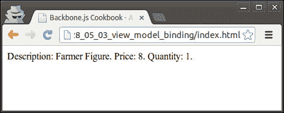
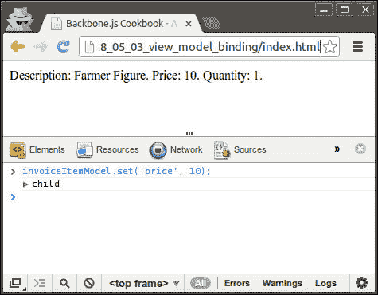
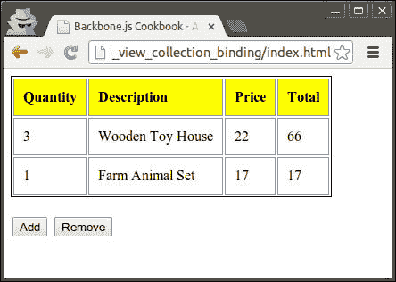
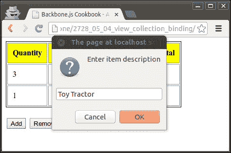
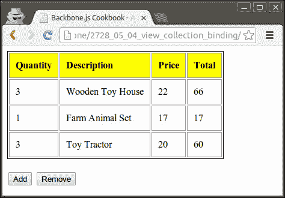
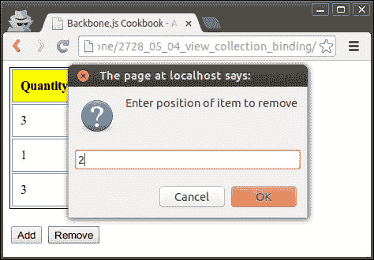
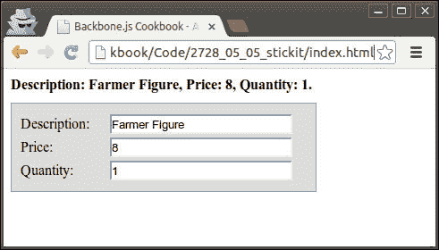
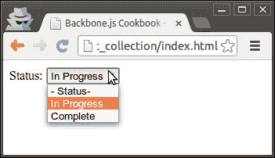
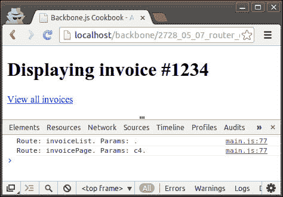

# 第五章：事件和绑定

在本章中，我们将介绍以下内容：

+   在`Backbone.js`中管理事件

+   处理 Backbone 对象的事件

+   将模型绑定到视图中

+   将集合绑定到视图中

+   使用`Backbone.stickit`进行双向绑定

+   将模型和集合绑定到选择列表

+   在视图中处理键盘快捷键

+   处理路由事件

# 简介

本章专门介绍`Backbone.Events`对象及其在 Backbone 的其他对象（如模型、集合、视图和路由器）中的作用。

我们将学习如何将回调函数分配给特定事件或如何监听其他对象的事件。我们还将学习如何在两个方向上将模型或集合绑定到视图中。因此，如果模型被更新，视图会自动显示更改，或者如果用户在视图中输入数据，模型将被验证并更新。

# 在 Backbone.js 中管理事件

Backbone 提供了一种统一的方式来触发和处理其他 Backbone 对象（如`Model`、`Collection`、`View`和`Router`）的事件。这得益于`Backbone.Events`对象，它提供了这种功能，因此可以将其混合到任何对象中，包括您自己的对象。

在本配方中，我们将学习如何将`Backbone.Events`混合到您的对象中，如何触发事件以及如何将回调绑定到事件。

## 如何做...

执行以下步骤以处理对象事件。

1.  定义一个新对象。

    ```js
    object1 = {};
    ```

1.  将`Backbone.Events`混合到您的对象中。

    ```js
    _.extend(object1, Backbone.Events);
    ```

1.  定义一个回调函数。

    ```js
    var hello = function(msg) {
      alert("Hello"+ msg);     
    }
    ```

1.  使用`on()`方法绑定回调。

    ```js
    object1.on("handshake", hello);
    ```

    或者，您可以使用`once()`方法在取消绑定之前一次性触发回调。

    ```js
    object1.once("handshake", hello);
    ```

    ### 注意

    如果一个对象有大量不同的事件，通常使用冒号来命名它们，例如`poll:start`或`change:selection`。

1.  通过调用`trigger()`方法来触发事件。

    ```js
    object1.trigger("handshake", "world!");
    ```

## 它是如何工作的...

在`on()`方法中，`Backbone.Events`将回调函数保存在关联数组`_events`中，然后在`trigger()`方法中迭代运行该事件的全部回调函数。

## 更多...

在本节中，我们将学习有关事件的一些重要主题：从事件中取消绑定回调和监听其他对象的事件。

### 从事件中取消绑定回调

要从事件中取消绑定回调，我们需要使用`off()`方法。以下代码行将取消绑定之前设置的特定回调。

```js
object1.off("handshake", hello);
```

要从事件中取消绑定所有回调，请跳过第二个参数。

```js
object1.off("handshake");
```

要从所有事件中取消绑定特定回调，请跳过第一个参数。

```js
object1.off(null, hello);
```

要从所有事件中取消绑定所有回调，请跳过两个参数。

```js
object1.off();
```

### 监听其他对象的事件

要监听其他对象的事件，我们可以使用`listenTo()`方法。

```js
object2.listenTo(object1, 'handshake', object2.hello);
```

它的工作方式类似于`on()`方法，但其优势在于它允许我们跟踪事件，并且可以在稍后一次性删除它们。

```js
object2.stopListening(object1);
```

要停止监听所有对象，请运行不带参数的`stopListening()`方法。

```js
object2.stopListening();
```

# 处理 Backbone 对象的事件

所有 Backbone 对象都实现了 `Backbone.Events`，其中一些提供了内置事件，你的对象可以监听这些事件。

例如，当模型发生变化时，会触发 `change` 事件。特别是对于这个事件，`Backbone.Model` 中有几个方法可以在 `change` 事件回调中使用。在本教程中，我们将学习如何使用它们。

## 如何做到这一点...

执行以下步骤来处理模型事件。

1.  创建一个新的 `model` 实例。

    ```js
      var model = new Backbone.Model({
        firstName: 'John',
        lastName: 'Doe',
        age: 20,
      });
    ```

1.  将回调绑定到 `change` 事件。

    ```js
      model.on('change', function(model) {

      }
    ```

1.  在事件回调中使用 `hasChanged()` 方法来检查特定属性自上次 `change` 事件以来是否已更改。

    ```js
        model.hasChanged("age"); // true
        model.hasChanged("firstName"); // false
    ```

1.  在事件回调中使用 `changedAttributes()` 方法来获取已更改属性的哈希值。

    ```js
        model.changedAttributes(); // Object {age: 21}
    ```

1.  在事件回调中使用 `previous()` 方法来获取先前属性的值。

    ```js
        model.previous('age'); // 20
    ```

1.  在事件回调中使用 `previousAttributes()` 方法来获取先前属性的哈希值。

    ```js
        model.previousAttributes();
          // Object {firstName: "John", lastName: "Doe", age: 20}
    ```

1.  更改 `model` 属性以触发 `change` 事件。

    ```js
        model.set('age', 21);
    ```

## 还有更多...

在本节中，我们将学习更多关于 Backbone 对象的事件：在使用 Backbone 对象时避免事件触发和使用内置事件。

### 在使用 Backbone 对象时避免事件触发

在使用 Backbone 事件时，有一种方法可以避免事件触发。如果你想在不知道事件回调的情况下更新对象属性，这可能很有用。

例如，在更新模型值时，你可以传递 `{silent: true}`。

```js
model.set('age', 22, {silent: true});
```

以下行代码也是有效的：

```js
model.set({ age: 25 }, {silent: true});
```

### 使用内置事件

以下事件与模型对象一起使用：

+   **change** (模型，选项)：当模型的属性发生变化时触发

+   **change:[属性]** (模型，值，选项)：当特定属性被更新时触发

+   **destroy** (模型，集合，选项)：当模型被销毁时触发

+   **invalid** (模型，错误，选项)：当模型在客户端验证失败时触发

+   **error** (模型，XMLHttpRequest，选项)：当模型的保存调用在服务器上失败时触发

+   **sync** (模型，响应，选项)：当模型与服务器成功同步时触发

以下事件与集合一起使用：

+   **add** (模型，集合，选项)：当模型被添加到集合中时触发

+   **remove** (模型，集合，选项)：当模型从集合中移除时触发

+   **reset** (集合，选项)：当集合的全部内容被替换时触发

+   **sort** (集合，选项)：当集合被重新排序时触发

+   **sync** (集合，响应，选项)：当集合与服务器成功同步时触发

以下事件与路由对象一起使用：

+   **route:[名称]** (参数)：当匹配特定路由时由路由器触发

+   **route** (路由器，路由，参数)：当匹配任何路由时由历史记录（或路由器）触发

当执行存储操作时，以下事件被触发：

+   **route:[name]** (params)：当匹配特定路由时由路由器触发

+   **route** (router, route, params)：当任何路由匹配时由历史记录（或路由器）触发

要处理任何触发的事件，请使用特殊事件`all`。

## 参见

+   您可以从[`backbonejs.org/#Events-catalog`](http://backbonejs.org/#Events-catalog)找到完整的内置事件目录。

+   要检查哪些 Backbone 方法支持`{silent: true}`，请参阅官方文档。

# 将模型绑定到视图

在`Backbone.js`中的一个有用特性是将模型变化绑定到视图，因此每次模型更改时视图都会重新渲染。这允许你编写更少的代码，并使你的应用程序像 AJAX 应用程序一样工作，例如，当从 REST 服务器获取新数据时，用户会立即看到更新。

让我们以第四章中的*在视图中渲染模型*配方为例，我们在视图中渲染了一个模型并对其进行了修改，因此每次模型更新时视图都会重新渲染。

我们将要实现的视图将按照以下截图所示进行渲染：



在浏览器控制台中，我们可以修改模型值，从而触发`change`事件并重新渲染视图。



## 如何做到...

执行以下步骤以将模型绑定到视图。

1.  定义一个新的模型。

    ```js
      var InvoiceItemModel = Backbone.Model.extend({

      });
    ```

1.  定义一个渲染此模型的视图。

    ```js
      var InvoiceItemView = Backbone.View.extend({

        // HTML element name, where to render a view.
        el: 'body',

        // Render view.
        render: function() {
          var html = 'Description: ' + 
            this.model.get('description') + '. ' +
            'Price: ' + this.model.get('price') + '. ' +
            'Quantity: ' + this.model.get('quantity') + '.';
          // Set html for the view element using jQuery.
          $(this.el).html(html);
        }
      });
    ```

1.  在`initialize()`方法中将模型绑定到`InvoiceItemView`。

    ```js
        initialize: function() {
          this.listenTo(this.model, 'change', this.render, this);
        }
    ```

1.  创建模型实例。

    ```js
        var invoiceItemModel = new InvoiceItemModel({
          description: 'Farmer Figure',
          price: 8,
          quantity: 1
        });
    ```

1.  创建一个视图实例并将`model`作为参数传递给它。

    ```js
        var invoiceItemView = new InvoiceItemView({

          // Pass model as a parameter to a view.
          model: invoiceItemModel
        });
    ```

1.  渲染视图。

    ```js
        invoiceItemView.render();
    ```

1.  要检查绑定的工作方式，将模型导出为一个全局变量，这样我们就可以在浏览器控制台中更新模型值。

    ```js
    window.invoiceItemModel = invoiceItemModel;
    ```

## 它是如何工作的...

`Backbone.Model`和`Backbone.View`对象都实现了`Backbone.Events`，因此可以在视图中监听模型变化，并将`render()`方法绑定为`change`事件的回调。

# 将集合绑定到视图

在这个配方中，我们将学习如何将集合绑定到视图。如果我们有不同视图使用相同的集合，或者我们想要与 REST 服务器同步数据，这将非常有帮助。

让我们以第四章中的*在视图中渲染模型*配方为例，我们渲染了一个带有子视图的集合并对其进行了修改。我们将添加一个带有**添加**和**删除**按钮的额外视图，这将更新集合。

此外，我们将在我们的第一个视图中绑定适当的回调到模型和集合事件，以便在集合更改时自动重新渲染。



当用户点击 **添加** 按钮时，会提示用户输入创建 `InvoiceItemModel` 所需的信息。



在用户完成所有问题后，会创建一个新的模型并将其添加到集合中，相应的视图也会更新。



当点击 **删除** 按钮时，用户会被提示输入要删除的项目位置。



## 如何做到这一点...

执行以下步骤以将集合绑定到视图。

1.  确保你有模型和集合的定义。

    ```js
      var InvoiceItemModel = Backbone.Model.extend({

      });

      var InvoiceItemCollection = Backbone.Collection.extend({
        model: InvoiceItemModel
      });
    ```

1.  定义一个用于渲染单个模型的视图。

    ```js
      // Define new view to render a model.
      var InvoiceItemView = Backbone.View.extend({

        // Define element tag name.
        tagName: 'tr',

        // Render view.
        render: function() {

          // Add cells to the table row.
          $(this.el).html(_.map([
            this.model.get('quantity'),
            this.model.get('description'),
            this.model.get('price'), this.model.calculateAmount(),
          ], function(val, key){
            return '<td>' + val + '</td>'
          }));

          return this;
        }
      });
    ```

1.  在 `InvoiceItemView` 对象的 `initialize()` 方法中，绑定回调以处理模型的 `destroy` 事件。

    ```js
        initialize: function() {
          this.listenTo(this.model, 'destroy', this.destroy, this);
        }
    ```

1.  添加 `destroy()` 方法，它移除与模型绑定的视图。

    ```js
        destroy: function() {
          this.remove();
        }
    ```

1.  定义一个用于渲染集合的视图。

    ```js
      // Define new view to render a collection.
      var InvoiceItemListView = Backbone.View.extend({

        // Define element tag name.
        tagName: 'table',

        // Define element class name.
        className: 'invoice-item-view',

        // Render view.
        render: function() {

          $(this.el).empty();

          // Append table with a table header.
          $(this.el).append($('<tr></tr>').html(
            _.map(['Quantity', 'Description', 'Price', 'Total'], 
              function(val, key){
                return '<th>' + val + '</th>'
              }
            )
          ));

          // Append table  with a row.
          _.each(this.collection.models, function(model, key) {
            this.append(model);
          }, this);

          return this;
        },

        // Add invoice item row to the table.
        append: function(model) {
          $(this.el).append(
            new InvoiceItemView({ model: model }).render().el
          );
        }
      });
    ```

    这里我们使用了 `append()` 方法，它将 `InvoiceItemView` 添加到输出表中。我们稍后会使用这个方法。

1.  在 `InvoiceItemListView` 对象的 `initialize()` 方法中，绑定回调以处理集合的 `add` 事件。

    ```js
        initialize: function() {
          this.listenTo(
            this.collection, 'add', this.append, this
          );
        },
    ```

    这里我们调用了相同的 `append()` 方法。

1.  定义带有添加和删除控制的视图。

    ```js
      var InvoiceItemListControlsView = Backbone.View.extend({
        render: function() {
          var html = 
            '<br><input id="add" type="button"' value="Add" id>' +
            ' <input id="remove" type="button" value="Remove">';

          $(this.el).html(html);

          return this;
        },

        // Handle HTML events.
        events: {
          'click #add': 'addNewInvoiceItem',
          'click #remove': 'removeInvoiceItem',
        },

        // Add button handler.
        addNewInvoiceItem: function() {
          var description = prompt('Enter item description', '');
          var price = prompt('Enter item price', '0');
          var quantity = prompt('Enter item quantity', '1');

          this.collection.add([{
            description: description,
            price: price,
            quantity: quantity
          }]);
        },

        // Remove button handler.
        removeInvoiceItem: function() {
          var position =
            prompt('Enter position of item to remove', '');

          model = this.collection.at(position);
          model.destroy();
        }
      }); 
    ```

1.  定义一个用于渲染整个页面的视图。

    ```js
      var InvoiceItemListPageView = Backbone.View.extend({

        // Render whole page view.
        render: function() {
          $(this.el).html(new InvoiceItemListView({
            collection: this.collection
          }).render().el);

          $(this.el).append(new InvoiceItemListControlsView({
            collection: this.collection
          }).render().el);
        }
      });
    ```

1.  使用数据创建并初始化集合实例。

    ```js
    var invoiceItemCollection = new InvoiceItemCollection([
      { description: 'Wooden Toy House', price: 22, quantity: 3 },
      { description: 'Farm Animal Set', price: 17, quantity: 1 }
    ]);
    ```

1.  创建整个页面视图实例并渲染它。

    ```js
        new InvoiceItemListPageView({
          collection: invoiceItemCollection,
          el: 'body'
        }).render();
    ```

## 它是如何工作的...

当新模型被添加到集合中时，会触发 `add` 事件，并将模型作为表格行渲染并附加到表格中。

当模型被销毁时，会触发 `destroy` 事件，并且与该模型对应的视图被移除，同时视图元素也会从 DOM 树中移除。

# 使用 Backbone.stickit 进行双向绑定

在 `Backbone.js` 中，我们可以直接将模型绑定到视图，但如果没有解析 HTML 元素值的需求，反向绑定并不容易。

在这个菜谱中，我们将讨论 `Backbone.stickit` 扩展，它允许开发者以简单和原生 `Backbone.js` 的方式实现模型属性和视图元素的双向绑定。

在许多类似的扩展中，`Backbone.stickit` 因其完美的文档、简洁性和为应用程序开发者带来的巨大优势而脱颖而出。它不久前被纽约时报撰写，并且其受欢迎程度每天都在增长。它无疑是 `Backbone.js` 中最酷的扩展之一。

在这个菜谱中，我们将构建一个简单的应用程序，它有两个视图绑定到同一个模型，因此如果用户在第一个视图中更改元素，第二个视图会自动更新。我们应用程序的用户界面将如下截图所示：



有几个视图绑定到了同一个模型上。当用户在表单中输入数据时，模型和其他视图都会被更新。

## 准备工作

您可以从 **GitHub** 页面 [`github.com/nytimes/backbone.stickit`](https://github.com/nytimes/backbone.stickit) 下载 `Backbone.stickit` 扩展。要将此扩展包含到您的项目中，将 `backbone.stickit.js` 文件保存到项目的 `lib` 文件夹中，并在 `index.html` 中包含对该文件的引用。

### 注意

在 第一章 的 *使用插件扩展应用程序* 菜谱中详细描述了将 Backbone 扩展包含到您的项目中，*理解 Backbone*。

## 如何实现...

执行以下步骤以执行双向绑定。

1.  确保您已经定义了一个模型。

    ```js
      var InvoiceItemModel = Backbone.Model.extend({

      });
    ```

1.  定义表单视图。

    ```js
      var InvoiceItemFormView = Backbone.View.extend({

        // Define class name of view element.
        className: 'invoice-item-form-view',
      });
    ```

1.  将绑定哈希添加到视图中。

    ```js
        bindings: {
          '#description': 'description',
          '#price': 'price',
          '#quantity': 'quantity'
        }
    ```

    在这里，我们使用了简短的绑定定义，它作为下一片段中显示的详细定义的别名。

    ```js
        bindings: {
          '#description': { observe: 'description' },
          '#price': { observe: 'price' },
          '#quantity': { observe: 'quantity' }
        }
    ```

1.  将 `render()` 方法添加到视图，并在渲染后调用 `this.stickit()`。

    ```js
        render: function() {
          var html = '<label>Description:</label>' + 
            '<input type="text" id="description"></input><br>' +
            '<label>Price:</label>' +
            '<input type="text" id="price"></input><br>' +
            '<label>Quantity:</label>' +
            '<input type="text" id="quantity"></input><br>';

          // Set html for the view element using jQuery.
          $(this.el).html(html);

          // Here binding occurs.
          this.stickit();

          return this;
        }
    ```

1.  以类似的方式定义其他视图。

    ```js
      var InvoiceItemView = Backbone.View.extend({

        // Define class name of view element.
        className: 'invoice-item-view',

        // Bind HTML elements to the view model.
        bindings: {
          '#description': 'description',
          '#price': 'price',
          '#quantity': 'quantity'
        },

        // Render view.
        render: function() {
          var html = 'Description:' +
            '<span id="description"></span>, ' +
            'Price:  <span id="price"></span>, ' +
            'Quantity:  <span id="quantity"></span>.';

          // Set html for the view element using jQuery.
          $(this.el).html(html);

          // Here binding occurs.
          this.stickit();

          return this;
        },
      });
    ```

1.  创建一个新的 `model` 实例。

    ```js
        var invoiceItemModel = new InvoiceItemModel({
          description: 'Farmer Figure',
          price: 8,
          quantity: 1
        });
    ```

1.  将两个视图都附加到 HTML 主体中。

    ```js
        $('body').append(new InvoiceItemView({
          model: invoiceItemModel
        }).render().el);
        $('body').append(new InvoiceItemFormView({
          model: invoiceItemModel
        }).render().el);
    ```

## 它是如何工作的...

每当调用 `stickit()` 方法时，stickit 扩展会初始化我们定义在绑定哈希中的 HTML 元素的 `innerHTML`。由于这种初始化，stickit 允许我们保持模板的整洁，并且在渲染视图时，我们不需要手动将模型值传递到 `html` 变量中。

对于 `InvoiceItemView` 视图，配置了一对一绑定（模型到视图），因此每次模型属性发生变化时，相应的 HTML 元素都会被更新。

对于 `InvoiceItemFormView` 视图，stickit 设置了双向绑定（模型到视图，然后视图到模型），将视图元素的变化与绑定模型属性的变化连接和反映。

## 更多内容...

本节描述了 `Backbone.stickit` 扩展的高级用法：覆盖模型获取器和设置器、覆盖视图元素更新以及监听特定的 HTML 事件。

### 覆盖模型获取器和设置器

当获取或设置绑定到我们视图的模型的属性时，我们可以通过指定 `onGet` 和 `onSet` 回调来覆盖获取或设置行为。

```js
    bindings: {
      '#price': {
        observe: 'price',
        onGet: 'priceGetter',
        onGet: 'priceSetter'
      }
    },
    priceGetter: function(val, options) { 
      return '$ ' + val; 
    },
    priceSetter: function(val, options) { 
      return Number(val.replace(/[⁰-9\.]+/g, ''));
    }
```

### 覆盖视图元素更新

我们可以通过不同的方式覆盖和自定义视图元素更新。我们可以指定一个 `update` 回调，它在 HTML 元素更新时触发，或者我们可以指定 `afterUpdate` 回调，它将在之后执行。

```js
    bindings: {
      '#price': {
        observe: 'price',
        update: function($el, val, model, options) { 
          $el.val(val);
        }
        afterUpdate: 'highlight',
      },
      },
      highlight: function($el, val, options) { 
        $el.animate({ backgroundColor: "#ff9999" }, "fast")
          .animate({ backgroundColor: "#ffffff" }, "fast");
      } 
    }
```

我们还可以通过指定 `updateMethod` 来覆盖视图元素的值更新。默认情况下，它使用 `text` 方法，但我们可以将其值更改为 `html`。如果使用 `html` 方法，并且我们想在将值分配给 HTML 元素之前对模型值进行转义，我们可以将 `escape` 选项设置为 `true`。

```js
    bindings: {
      '#price': {
        observe: 'price',
        updateMethod: 'html',
        escape: true
      }
    }
```

### 监听特定的 HTML 事件

默认情况下，对于文本框、文本区域和其他可编辑内容的 HTML 元素，`Backbone.stickit`扩展监听以下事件：`keyup`、`change`、`cut`和`paste`。对于其他元素，`Backbone.stickit`扩展监听`change`事件。

然而，可以通过指定`events`数组来覆盖此设置。

```js
    bindings: {
      '#price': {
        observe: 'price',
        events: ['blur'],
      },
    }
```

在这种情况下，视图到模型的绑定将在`#price`文本框的`blur`事件上发生。

## 相关内容

+   在以下配方中，我们将继续学习关于 Stickit 扩展的内容。你还可以在**GitHub**页面[`nytimes.github.com/backbone.stickit/`](http://nytimes.github.com/backbone.stickit/)上找到关于`Backbone.stickit`的完整文档。

# 将模型和集合绑定到选择列表

在上一个配方中，我们讨论了如何将模型绑定到视图的 HTML 任意元素。在本配方中，我们将学习如何将模型绑定到选择元素。通过更改选择列表的值，我们需要更改绑定模型的关联属性。

这有点复杂，因为我们可能希望从数组或集合中获取选择选项的键值对。幸运的是，`Backbone.stickit`扩展允许我们轻松地做到这一点。

在本配方中，我们将创建一个简单的示例来演示我们如何将模型和集合绑定到选择列表。



## 准备工作

你可以从**GitHub**页面[`github.com/nytimes/backbone.stickit`](https://github.com/nytimes/backbone.stickit)下载`Backbone.stickit`扩展。要将此扩展包含到你的项目中，将`backbone.stickit.js`文件保存到`lib`文件夹中，并在`index.html`中包含对该文件的引用。

### 注意

在第一章的*使用插件扩展应用程序*配方中详细描述了将 Backbone 扩展包含到你的项目中，*理解 Backbone*。

## 如何操作...

执行以下步骤以将模型和集合绑定到选择列表。

1.  定义一个模型。

    ```js
      var InvoiceModel = Backbone.Model.extend({

      });
    ```

1.  定义一个视图。

    ```js
      var InvoiceView = Backbone.View.extend({

        // Define class name of view element.
        className: 'invoice-item-view',

        },

        // Render view.
        render: function() {
          var html = 'Status: <select id="items"></select>';

          // Set html for the view element using jQuery.
          $(this.el).html(html);

          // Here binding occurs.
          this.stickit();

          return this;
        },
      });
    ```

1.  将绑定哈希添加到视图中。

    ```js
        // Bind HTML elements to the view model.
        bindings: {
          'select#items': {
            observe: 'status',

            // Define additional options for select element.
            selectOptions: {

              // You can return regular Backbone collection or
              // an array of objects.
              collection: function() {
                return [
                  {name: null, label: '- Status-'},
                  {name: 'in_progress', label: 'In Progress'},
                  {name: 'complete', label: 'Complete'}
                ]
              },

              // Set the path to the label value for select
              // options within the collection of objects.
              labelPath: 'label',

              // Define the path to the values for select options
              // within the collection of objects. 
              valuePath: 'name'
            }
          }
    ```

1.  创建一个新的模型实例。

    ```js
        var invoiceModel = new InvoiceModel({ 
          status: 'in_progress' 
        });
    ```

1.  渲染视图。

    ```js
    $('body').append(new InvoiceView({
      model: invoiceModel
    }).render().el);
    ```

## 它是如何工作的...

`Backbone.stickit`从`collection`属性获取选择列表选项的值，并假设它定义了相对于窗口对象的集合路径或一个返回集合的函数。也可以使用数组代替集合，如前一个示例所示。

`labelPath`指示一个指向集合对象属性的路径，该属性用作选择列表选项的标签，而`valuePath`定义了选项值的路径。

## 相关内容

+   你可以在`Bacbkone.stickit`的**GitHub**页面[`nytimes.github.com/backbone.stickit/`](http://nytimes.github.com/backbone.stickit/)上找到有关将模型和集合绑定到选择列表的更多详细信息。

# 在视图中处理键盘快捷键

为了提供最佳的用户体验，您的应用程序应该支持在应用程序内进行各种类型的导航。其中一种方法可以通过使用快捷键实现。快捷键是一组按键组合，它提供了更容易访问命令或操作的方式。

在本食谱中，我们将处理我们在 *绑定集合到视图* 食谱中实现的视图的一些快捷键。

要执行键盘快捷键处理，我们将使用 `Moustrap` 库和 `Backbone.Moustrap` 扩展，它们提供了我们需要的功能。

## 准备工作

您可以从 **GitHub** 页面分别下载 `Moustrap` 库和 `Backbone.Moustrap` 扩展：[`github.com/ccampbell/mousetrap`](https://github.com/ccampbell/mousetrap) 和 [`github.com/elasticsales/backbone.mousetrap`](https://github.com/elasticsales/backbone.mousetrap)。

要将它们包含到您的项目中，请将 `mousetrap.js` 和 `backbone.mousetrap.js` 文件保存到 `lib` 文件夹中，并在 `index.html` 中包含对它们的引用。

### 注意

在 第一章 的 *使用插件扩展应用程序* 食谱中详细描述了将 Backbone 扩展包含到您的项目中。

## 如何做到...

要执行键盘快捷键处理，请将以下属性添加到视图对象中：

```js
    keyboardEvents: {
      'shift+n': 'addNewInvoiceItem',
      'shift+d': 'removeInvoiceItem',
    },
```

## 它是如何工作的...

`Backbone.Mousetrap` 在创建视图时自动将键盘事件委派给视图，在移除视图或调用 `undelegateEvents()` 时取消委派。

以下键 `shift`、`ctrl`、`alt`、`option`、`meta` 和 `command` 都是可用的。其他特殊键包括 `backspace`、`tab`、`enter`、`return`、`capslock`、`esc`、`escape`、`space`、`pageup`、`pagedown`、`end`、`home`、`left`、`up`、`right`、`down`、`ins` 和 `del`。

您应该能够通过名称引用任何其他键，例如 `a`、`/`、`$`、`*` 或 `=`。

默认情况下，当浏览器聚焦在任何表单元素（如输入、文本区域或选择框）上时，Mousetrap 会阻止处理快捷键事件。但是，如果您想处理此类元素的快捷键事件，可以向其添加 `mousetrap` 类。

```js
<textarea name="message" class="mousetrap"></textarea>
```

## 参见

+   请访问以下资源以了解更多关于 Mousetrap 的信息：[`craig.is/killing/mice`](http://craig.is/killing/mice)

# 处理路由事件

虽然处理路由事件的用例不多，但 `Backbone.js` 提供了一种机制来实现这一点。在本食谱中，我们将创建一个简单的应用程序来记录路由事件。



## 如何做到...

按照以下步骤处理路由事件。

1.  监听 `Backbone.History` 的 `route` 事件。

    ```js
        initialize: function() {  
          Backbone.history.on('route', this.routeTracker);
        },
    ```

1.  定义 `route` 事件回调。

    ```js
        routeTracker: function(router, route, params) {
          console.log(
           'Route: ' + route + '. Params: ' + params + '.'
          );
        },
    ```

## 它是如何工作的...

在路由成功执行后，会触发 `route` 事件。`route` 事件回调函数接受以下参数：

+   **router**：此参数表示正在使用的当前路由器

+   **路由**: 此参数指示一个路由回调名称

+   **参数**: 这表示传递给路由回调的参数

## 还有更多...

要处理特定路由的特定事件，请监听 `route:[name]` 事件。

```js
  var Workspace = Backbone.Router.extend({
    routes: {
      '': 'invoiceList',
      'invoice': 'invoiceList',
      'invoice/:id': 'invoicePage',
    },

    initialize: function() {
       this.on('route:invoicePage', this.invoicePageEvent);
    },

    invoicePageEvent: function(param1, param2) {
      console.log(param1);
    },
});
```

在这种情况下，事件回调接受 `routes` 参数。

## 参见

+   更多关于 `routes` 的信息可以在第一章中找到，在*实现应用程序中的 URL 路由*配方中，*理解 Backbone*
