# 第七章. REST 和存储

在本章中，我们将介绍以下菜谱：

+   为后端设计 REST API

+   使用 MongoLab 原型化 RESTful 后端

+   与 RESTful 服务同步模型和集合

+   使用 Backbone 构建 RESTful 前端

+   使用轮询技术获取数据

+   与本地存储一起工作

# 简介

本章重点介绍 Backbone.js 如何与 RESTful 后端同步模型和集合，或者将它们存储在 HTML5 本地存储中。

我们将学习如何设计后端的 REST API，这可以用几乎任何编程框架实现，例如 Symphony、Ruby on Rails、Django 或 Node.js。

在本章中，我们将使用 MongoLab ([`mongolab.com`](http://mongolab.com))，它是 MongoDB 的云版本，具有 RESTful 接口。我们还将学习在前端应用程序尚未构建之前，如何使用工具调试 RESTful 服务。

最后，我们将使 Backbone 应用程序与 RESTful 服务通信，执行 REST 服务器支持的完整 CRUD 操作集。我们还将学习如何使用轮询技术动态更新应用程序中的集合数据。

我们还将讨论一个扩展，允许我们将数据保存在 HTML5 的本地存储中，而不是保存在远程服务器上。

# 为后端设计 REST API

**表征状态转移**（**REST**）是设计网络应用程序的架构风格，这些应用程序相互通信。与 COBRA 或 SOAP 不同，REST 可以轻松地建立在纯 HTTP 之上。

REST 风格的架构由客户端和服务器组成。客户端调用 HTTP 请求方法（`POST`、`GET`、`PUT`或`DELETE`）来在资源上执行 CRUD（创建、读取、更新和删除）操作，资源可以是集合或单个元素。

在这个菜谱中，我们将设计用于计费应用程序的 REST 服务器 API。

## 如何操作...

按照以下步骤设计 RESTful 服务的 API：

1.  定义客户端用于访问服务器上存储资源的基 REST URI；例如，它可以看起来像`http://example.com/resources`。

1.  定义 URI 以访问您的应用程序特定资源。这些 URI 应相对于基本 REST URI：

    +   **发票集合**: `<rest-uri>/invoices`

    +   **发票**: `<rest-uri>/invoices/<invoice-id>`

    +   **买家集合**: `<rest-uri>/buyers`

    +   **买家**: `<rest-uri>/buyers/<buyer-id>`

    +   **卖家**: `<rest-uri>/seller`

## 它是如何工作的...

访问资源的 URI 可以看起来像`http://example.com/resources/items and data`，这些数据通过 REST 传输，通常是 JSON 格式、XML 或任何其他有效的 Internet 媒体类型。

以下表格描述了在特定资源类型上执行 REST 操作时发生的情况：

| 资源 URI | 集合:`http://example.com/resources/items` | 元素:`http://example.com/resources/items/1` |
| --- | --- | --- |
| `POST` | 此请求在集合中创建一个新项目并返回新创建的项目或其 URI。 | 通常不使用。如果使用，它执行与集合资源 POST 查询相同的任务。 |
| `GET` | 此请求列出集合项目或它们的 URI。 | 此请求通过它们的 URI 检索集合项目。 |
| `PUT` | 此请求用另一个集合替换整个集合。 | 此请求替换集合项目或如果不存在则创建一个。 |
| `DELETE` | 此请求删除整个集合。 | 此请求从集合中删除项目。 |

参考 Roy Fieldings 的博士论文，这是关于 REST 的第一份也是最为完整的工作，以了解更多关于 REST 的信息，请访问 [`www.ics.uci.edu/~fielding/pubs/dissertation/rest_arch_style.htm`](http://www.ics.uci.edu/~fielding/pubs/dissertation/rest_arch_style.htm)。

# 使用 MongoLab 构建 RESTful 后端

假设我们想要创建一个将与 RESTful 服务通信的 Backbone 应用程序。我们应该从创建后端还是前端开始？这个问题听起来像是一个困境，但答案非常简单。

最简单的方法是使用具有 REST 风格界面的简单数据库创建原型，这样我们就可以在将来快速将其替换为我们自己的后端。

有一个名为 MongoLab 的好工具（[`mongolab.com`](http://mongolab.com)），它是具有 REST 风格界面的 MongoDB 的云版本。MongoDB 是一个与类似 JSON 的数据一起工作的 NoSQL 文档型数据库。MongoLab 将不需要我们在后端编写任何一行代码，因此它非常适合我们作为原型工具。

要测试和调试 MongoLab 后端，我们将使用高级 REST 客户端，这是一个 Chrome 浏览器的扩展。它允许对 RESTful 服务执行 HTTP 查询并可视化 JSON 数据。

## 准备工作...

按以下步骤为这个食谱做好准备：

1.  在 MongoLab 网站上创建账户 ([`mongolab.com`](https://mongolab.com))，或者如果您已有账户则登录。

1.  使用 URL [`chrome.google.com/webstore/detail/advanced-rest-client/hgmloofddffdnphfgcellkdfbfbjeloo`](https://chrome.google.com/webstore/detail/advanced-rest-client/hgmloofddffdnphfgcellkdfbfbjeloo) 在您的浏览器上安装高级 REST 客户端。如果您使用 Firefox 或 Safari，您可以轻松找到用于此目的的类似扩展。

## 如何做...

按以下步骤创建 MongoLab 数据库并填充数据：

1.  访问 [`mongolab.com/newdb`](https://mongolab.com/newdb) 并在您的 MongoLab 账户中创建一个名为 `billing-app` 的新数据库。

1.  访问 `https://mongolab.com/user?username=<username>` 并获取一个 API 密钥，您可以使用它进行身份验证。

1.  要检查您账户中的数据库，使用高级 REST 客户端在 URI 上执行一个`GET`请求，例如 `https://api.mongolab.com/api/1/databases?apiKey=<your-api-key>`。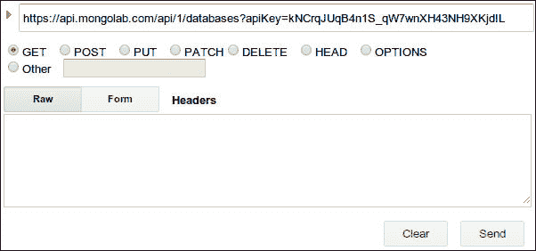

    结果将类似于以下截图：

    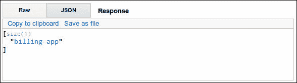

1.  要获取数据库中集合的列表，请在 URI `https://api.mongolab.com/api/1/databases/billing-app/collections?apiKey=<your-api-key>` 上执行 `GET` 请求。结果将类似于以下截图：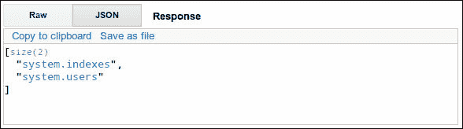

1.  要创建一个新的集合，请使用此 URI 上的 `POST` 查询发送定义在 JSON 格式的集合项：`https://api.mongolab.com/api/1/databases/billing-app/collections/invoices?apiKey=<your-api-key>`。请确保设置了 **application/json Content-Type** 标头。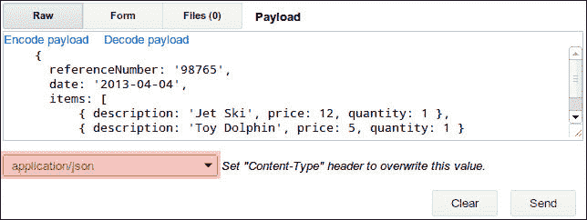

    此操作的输出结果将类似于以下截图：

    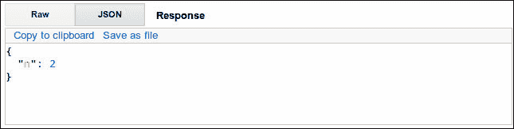

    通过再次对同一资源执行 `GET` 请求，我们将以 JSON 格式返回插入的项目及其 ID。

    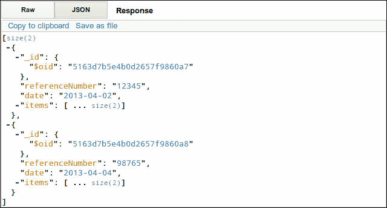

1.  要更新集合中现有的项目，我们需要在 URI `https://api.mongolab.com/api/1/databases/billing-app/collections/invoices/<invoice-id>?apiKey=<your-api-key>` 上对指定 ID 的集合项目资源执行 `PUT` 请求。在 `PUT` 请求中，我们应该以 JSON 格式传递更新的模型。结果也以 JSON 格式返回，如下所示截图：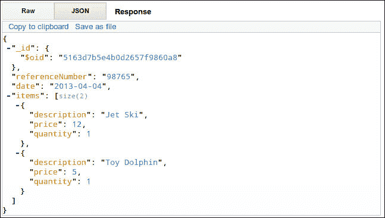

## 工作原理...

MogoLab 将 HTTP 请求转换为 MongoDB 查询，执行查询并返回 MongoDB 扩展 JSON 格式的结果。

## 参见

+   参考 MongoLab 的 REST API 了解如何在[`support.mongolab.com/entries/20433053-REST-API-for-MongoDB`](https://support.mongolab.com/entries/20433053-REST-API-for-MongoDB)执行查询。

+   您还可以访问以下 URL 以了解 MongoDB 扩展 JSON 格式的规范：[`docs.mongodb.org/manual/reference/mongodb-extended-json/`](http://docs.mongodb.org/manual/reference/mongodb-extended-json/)

# 将模型和集合与 RESTful 服务同步

在本食谱中，我们将学习如何将模型和集合与 RESTful 服务同步。就像我们在所有其他食谱中所做的那样，我们将使用 MongoLab 作为 RESTful 服务。

## 如何操作...

按照以下步骤熟悉 Backbone.js 中的 REST：

1.  创建一个配置对象，该对象存储服务器 URL 和 MongoLab 的身份验证密钥。

    ```js
    var appConfig = {
      baseURL: 'https://api.mongolab.com/api/1/databases/billing-app/collections/',

      addURL: '?apiKey=kNCrqJUqB4n1S_qW7wnXH43NH9XKjdIL'
    }
    ```

1.  定义一个 `url()` 方法，该方法返回用于执行 REST 请求的资源 URL。如果模型已经与 RESTful 服务同步，则此类 URL 应包含模型 ID。此外，此类 URL 应包含 MongoLab 的身份验证密钥。

    ```js
      var InvoiceModel = Backbone.Model.extend({
        url: function() {
          if (_.isUndefined(this.id)) {
            return appConfig.baseURL +
              'invoices' + appConfig.addURL;
          }
          else {
            return appConfig.baseURL + 'invoices/' +
              encodeURIComponent(this.id) + appConfig.addURL;
          }
        },
      });
    ```

    另一种方法是定义 `urlRoot` 属性，尽管它不允许向 URL 添加参数。

    ```js
      var InvoiceModel = Backbone.Model.extend({
        urlRoot: appConfig.baseURL;
      });
    ```

1.  定义一个新的集合和一个 `url` 属性或 `url()` 方法，该方法应返回集合资源的 URL。

    ```js
      var InvoiceCollection = Backbone.Collection.extend({
        model: InvoiceModel,
        url: appConfig.baseURL +'invoices' + appConfig.addURL
      });
    ```

1.  要从服务器加载数据到集合中，请使用`fetch()`方法。您可以传递`success`和`error`回调作为参数。如果同步成功或失败，任一回调都将异步调用。

    ```js
      var collection = new InvoiceCollection();

      collection.fetch({
        success: function(collection, response, options) {
          $('body').html(
            new View({ collection: collection}).render().el
          );
        },
        error: function(collection, response, options) {
          alert('error!');
        }
      });
    ```

    当`fetch()`方法运行时，会触发读取事件。成功时，还会触发同步事件。

1.  您也可以使用`fetch()`方法加载服务器上存在的特定模型，它与集合的工作方式类似。

    ```js
      var model = new InvoieModel();

      model.id = '5176396ce4b0c62bf3e53d79';
      model.fetch(
        success: function(model, response, options) {
          // success
        },
        error: function(collection, response, options) {
          // error
        }
      );
    ```

1.  要与 RESTful 服务同步模型，请使用`save()`方法。

    ```js
      model.save();
    ```

    要更新特定属性，请在第一个参数中传递更改的属性哈希，在第二个参数中传递`{patch: true}`。

    ```js
      model.save({ status: 'complete'}, {patch: true});
    ```

    默认情况下，`save()`方法以异步方式工作，因此您需要在`success`或`error`回调中处理结果。但是，如果您需要以同步方式运行`save()`方法，请在第一个参数中传递`null`，在第二个参数中传递`{wait: true}`。

    ```js
      model.save(null, {wait: true});
    ```

1.  您可以使用`create()`方法在集合内创建一个新的模型。在这种情况下，Backbone.js 会自动调用`save()`方法，并将新的模块推送到服务器。

    ```js
      var model = collection.create(
        { referenceNumber: '123', status: complete },
        { wait: true }
      );
    ```

1.  您可以使用`destroy()`方法销毁一个模型，这将从集合和服务器中删除模型。

    ```js
      model.save(null, {
        success: function(model, response, options) {
          // success
        },
        wait: true
     });
    ```

## 它是如何工作的...

`fetch()`、`save()`或`destroy()`方法调用`sync()`方法以执行 HTTP 查询，同步模型和集合与 RESTful 服务。`sync()`方法接受以下参数：

+   `method`：它可以是 create、update、patch、delete 或 read。

+   `model`：它是一个用于同步的模型或集合。

+   `options`：这是`$.ajax`变量接受的选项。

如果需要覆盖同步或在没有 REST 支持的情况下使用存储，您可以覆盖`sync()`方法。

## 还有更多...

MongoLab 以 MongoDB 扩展 JSON 格式返回数据，而 Backbone.js 默认不支持这种格式。在本教程中，我们将解决这个问题，并找到在 Backbone 应用程序中直接处理 MongoDB 扩展 JSON 的好方法。

### 处理 MongoDB 扩展 JSON

MongoLab ([`mongolab.com`](http://mongolab.com)) 是一个 RESTful 服务，它将 HTTP 请求转换为 MongoDB 查询，并以 MongoDB 扩展 JSON 格式返回结果，如下代码片段所示：

```js
{ 
    "_id": { 
        "$oid": "516eb001e4b0799160e0e864" 
    }, 
}
```

为了得到适当的结果，我们需要处理这样的 ID。背后的想法是覆盖`parse()`方法，该方法处理 JSON 并从中初始化模型属性。我们将在这里替换 ID 的格式：

```js
Backbone.Model.prototype.parse = function(resp, options) {
  if (_.isObject(resp._id)) {
    resp[this.idAttribute] = resp._id.$oid;
      delete resp._id;
  }
  return resp;
},

```

此外，当`sync()`方法运行时，我们需要确保数据以 MongoDB 扩展 JSON 格式导出。在其他所有情况下，应导出为常规 JSON 格式。数据导出仅在`toJSON()`方法中执行，因此我们可以在`sync()`方法执行期间替换`toJSON()`方法。

```js
// Convert regular JSON into MongoDB extended one.
  Backbone.Model.prototype.toExtendedJSON= function() {
    var attrs = this.attributes;

    var attrs = _.omit(attrs, this.idAttribute);
    if (!_.isUndefined(this[this.idAttribute])) {
      attrs._id = { $oid: this[this.idAttribute] };
    }

    return attrs;
  },

// Substute toJSON method when performing synchronization.
  Backbone.Model.prototype.sync = function() {
    var toJSON = this.toJSON;
    this.toJSON = this.toExtendedJSON;

    var ret = Backbone.sync.apply(this, arguments);

    this.toJSON = toJSON;

    return ret;
  }

```

## 参见

+   第八章的*使用 Grunt 创建 Backbone.js 扩展*配方，*特殊技术*

+   您可能还感兴趣检查`Backbone.sync`的源代码，请参阅[`backbonejs.org/docs/backbone.html#section-134`](http://backbonejs.org/docs/backbone.html#section-134)。

+   访问以下 URL 以满足 MongoDB 扩展 JSON 的规范[`docs.mongodb.org/manual/reference/mongodb-extended-json/`](http://docs.mongodb.org/manual/reference/mongodb-extended-json/)

# 使用 Backbone 构建 RESTful 前端

在这个配方中，我们将编写一个前端应用程序，它将作为 RESTful 服务的客户端。对于后端，我们将使用 MongoLab 服务，这是一个具有 REST 接口的 MongoDB 云版本。

我们将使用布局管理器扩展来以整洁的格式输出我们的视图。为了构建我们的应用程序，我们将从第六章的示例应用程序中获取，*模板和 UX 糖*，并进行修改，使其支持通过 REST 进行数据同步，并看起来如下截图所示：

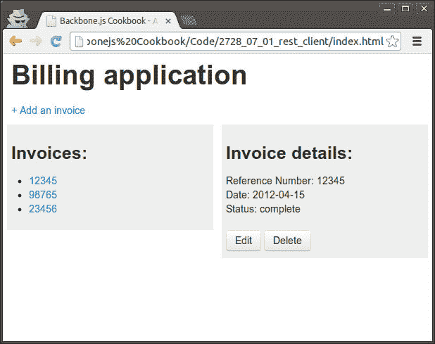

在左侧窗格中，我们可以看到一系列发票标题，在右侧窗格中，我们可以看到发票详情。默认情况下，这些详情为第一个发票显示，直到用户点击左侧窗格中的链接。

如果用户点击**编辑**按钮，将显示以下表单：

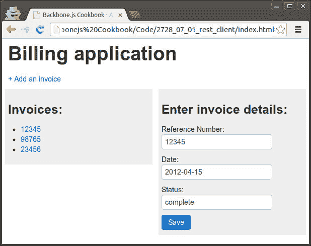

当用户点击**保存**按钮时，模型被更新，并且它的 JSON 通过 REST 发送到服务器，并且左侧窗格中的列表也被更新。

如果用户点击**删除**按钮，将出现一个删除确认表单，如下截图所示：

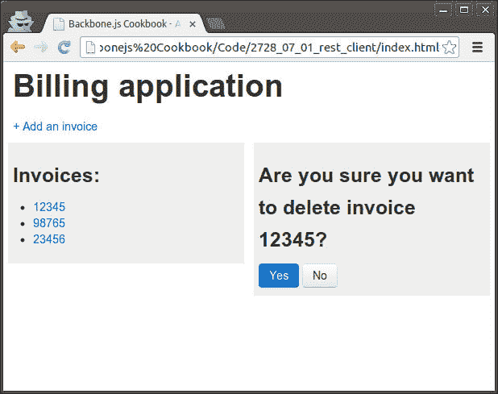

如果用户确认删除，模型将被销毁并通过 REST 从服务器中移除。

用户还可以通过点击页面顶部的**添加发票**链接来创建一个新的发票。然后，会显示一个添加发票表单，它与编辑表单相同，但没有显示任何数据。

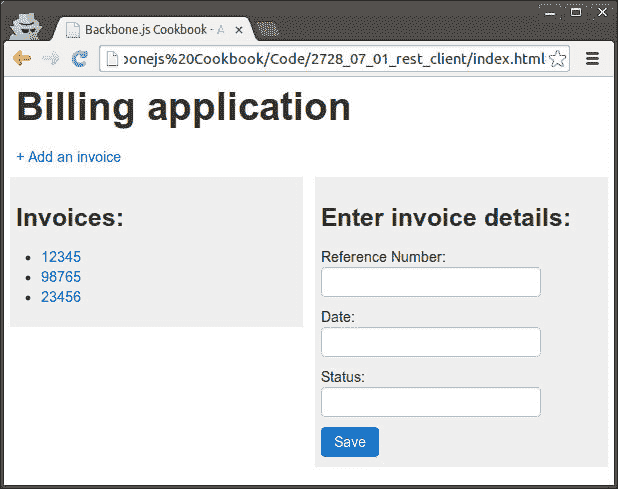

## 准备中...

按照以下步骤为此配方做好准备：

1.  确保已安装布局管理器扩展。该扩展的用法和安装描述在第六章的*使用 LayoutManager 组装布局*配方中，*模板和 UX 糖*。

1.  覆盖`Backbone.Model`以支持 MongoLab 中使用的 MongoDB 扩展 JSON 格式。

    ```js
      // Convert MongoDB Extended JSON into regular JSON.
      Backbone.Model.prototype.parse = function(resp, options) {
        if (_.isObject(resp._id)) {
          resp[this.idAttribute] = resp._id.$oid;
          delete resp._id;
        }

        return resp;
      },

      // Convert regular JSON into MongoDB extended one.
      Backbone.Model.prototype.toExtendedJSON= function() {
        var attrs = this.attributes;

        var attrs = _.omit(attrs, this.idAttribute);
        if (!_.isUndefined(this[this.idAttribute])) {
          attrs._id = { $oid: this[this.idAttribute] };
        }

        return attrs;
      },

      // Substute toJSON method when performing synchronization.
      Backbone.Model.prototype.sync = function() {
        var toJSON = this.toJSON;
        this.toJSON = this.toExtendedJSON;

        var ret = Backbone.sync.apply(this, arguments);

        this.toJSON = toJSON;

        return ret;
      }
    This allows Backbone to work correctly with data IDs in a format like this:
    { 
        "_id": { 
            "$oid": "516eb001e4b0799160e0e864" 
        }, 
    }

    ```

    这允许 Backbone 正确地与如下格式的数据 ID 一起工作：

    ```js
    { 
        "_id": { 
            "$oid": "516eb001e4b0799160e0e864" 
        }, 
    }
    ```

## 如何做到这一点...

按照以下步骤创建一个使用 Backbone 的 RESTful 应用程序：

1.  创建一个配置对象，我们将存储服务器 URL 和认证密钥。

    ```js
    var appConfig = {
      baseURL: 'https://api.mongolab.com/api/1/databases/billing-app/collections/',

      addURL: '?apiKey=kNCrqJUqB4n1S_qW7wnXH43NH9XKjdIL'
    }
    ```

1.  定义 `InvoiceModel` 并设置 `url()` 方法，该方法将返回执行 REST 请求的模型资源 URL。

    ```js
      var InvoiceModel = Backbone.Model.extend({
        url: function() {
          if (_.isUndefined(this.id)) {
            return appConfig.baseURL +
              'invoices' + appConfig.addURL;
          }
          else {
            return appConfig.baseURL + 'invoices/' +
              encodeURIComponent(this.id) + appConfig.addURL;
          }
        },
      });
    ```

1.  定义 `InvoiceCollection` 和模型的 `url()` 方法。

    ```js
      var InvoiceCollection = Backbone.Collection.extend({
        model: InvoiceModel,
        url: function() {
          return appConfig.baseURL +
            'invoices' + appConfig.addURL;
        },
      });
    ```

1.  定义一个路由并添加 `initialize()` 方法，该方法创建一个空集合和布局对象并渲染布局。

    ```js
      // Define router object.
      var Workspace = Backbone.Router.extend({
        initialize: function() {

          //  Create collection.
          this.collection = new InvoiceCollection();

          // Create new layout.
          this.layout = new Backbone.Layout({
              // Attach the layout to the main container.
              el: 'body',

              // Set template selector.
              template: '#layout',

              // Declaratively bind a nested View to the layout.
              views: {
                '#first-pane': new InvoiceListPane({
                  collection: this.collection
                }),
              },
          });

          // Render whole layout for the first time.
          this.layout.render();
        },
      });
    ```

1.  将布局模板添加到 `index.html` 中。

    ```js
      <script class="template" type="template" id="layout">
        <h1>Billing application</h1>
        <div id="links-pane">
          <a href="#invoice/add">+ Add an invoice</a>
        </div>
        <div id="first-pane"></div>
        <div id="second-pane"></div>
      </script>
    ```

1.  将 `routes` 和回调添加到路由对象中。每个回调都调用 `switchPane()` 方法，该方法切换布局的右侧面板。

    ```js
        routes: {
          '': 'invoicePage',
          'invoice': 'invoicePage',
          'invoice/add': 'addInvoicePage',
          'invoice/:id/edit': 'editInvoicePage',
          'invoice/:id/delete': 'deleteInvoicePage',
          'invoice/:id': 'invoicePage',
        },

        // Page callbacks.
        invoicePage: function(id) {
          this.switchPane('InvoicePane', id);
        },
        addInvoicePage: function() {
          this.switchPane('EditInvoicePane', null);
        },
        editInvoicePage: function(id) {
          this.switchPane('EditInvoicePane', id);
        },
        deleteInvoicePage: function(id) {
          this.switchPane('DeleteInvoicePane', id);
        },
    ```

1.  将 `switchPane()` 方法添加到路由中，该方法从 RESTful 服务获取集合并切换右侧面板。

    ```js
        switchPane: function(pane_name, id) {

          // Define panes array.
          // This will allow use to create new object from string. 
          var panes = {
            InvoicePane: InvoicePane,
            EditInvoicePane: EditInvoicePane,
            DeleteInvoicePane: DeleteInvoicePane 
          };

          // Update collection.
          this.collection.fetch({ success: function(collection) {

            // Get model by id or take first model
            // from collection.
            var model = _.isUndefined(id) ?
              collection.at(0) : collection.get(id);

            // Create new pane and pass model and collection.
            pane = new panes[pane_name] ({
              model: model, collection: collection
            });

            // Render pane.
            pane.render();

            // Switch views.
            window.workspace.layout.removeView('#second-pane');
            window.workspace.layout.setView('#second-pane', pane);

          }, reset: true });
        },
    ```

1.  定义发票列表面板。

    ```js
      var InvoiceListPane = Backbone.Layout.extend({

        // Returns selector for template.
        template: '#invoice-list-pane',

        // Set selector for template.
        serialize: function() {
          return { invoices: _.chain(this.collection.models) };
        },

        // Bind callbacks to collection event.
        initialize: function() {
          this.listenTo(this.collection, 'reset', this.render);
        }
      });
    ```

    在 `index.html` 中为它添加一个模板。

    ```js
     <script class="template" type="template" id="invoice-list-pane">
        <h3>Invoices:</h3>
        <ul>
          <% invoices.each(function(invoice) { %>
            <li>
              <a href="#invoice/<%= invoice.id %>">
                <%= invoice.get('referenceNumber') %>
              </a>
            </li>
          <% }); %>
        </ul>
      </script>
    ```

1.  定义查看发票面板。

    ```js
      var InvoicePane = Backbone.Layout.extend({

        // Set selector for template.
        template: '#invoice-pane',

        // Returns data for template.
        serialize: function() {
          return { invoice: this.model };
        },

        // Bind callbacks to model events.
        initialize: function() {
          this.listenTo(this.model, 'change', this.render);
        }
      });
    ```

    在 `index.html` 中为它添加一个模板。

    ```js
      <script class="template" type="template" id="invoice-pane">
        <h3>Invoice details:</h3>
        Reference Number:
          <%= invoice.get('referenceNumber') %><br>
        Date: <%= invoice.get('date') %><br>
        Status: <%= invoice.get('status') %><br>
        <br>
        <a href="#invoice/<%= invoice.id %>/edit" class="btn">
          Edit
        </a>
        <a href="#invoice/<%= invoice.id %>/delete" class="btn">
          Delete
        </a>
      </script>
    ```

1.  定义编辑发票面板。

    ```js
      var EditInvoicePane = Backbone.Layout.extend({

        // Set selector for template.
        template: '#edit-invoice-pane',

        // Returns data for template.
        serialize: function() {

          // Create new model if no model is given.
          return {
            invoice:
              _.isEmpty(this.model) ?
                new InvoiceModel() : this.model
          };
        },

        // Bind callbacks form events.
        events: {
          "click .submit": "save"
        },

        // Save model
        save: function() {
          var data = {
            referenceNumber: 
              this.$el.find('.referenceNumber').val(),
            date: this.$el.find('.date').val(),
            status: this.$el.find('.status').val(),
          };

          var success = function(model, response, options) {
            window.workspace.navigate('#invoice/' + model.id, {
              trigger: true
            });
          };

          // Run appropriate method.
          if (_.isEmpty(this.model)) {
            this.collection.create(data, {success: success});
          }
          else {
            this.model.save(data, { success: success});
          }
        }
      });
    ```

    在 `index.html` 中为它添加一个模板。

    ```js
      <script class="template" type="template"
          id="edit-invoice-pane">
        <h3>Enter invoice details:</h3>
        Reference Number:<br>
        <input class="referenceNumber" type="text"
              value="<%= invoice.get('referenceNumber') %>"><br>
        Date:<br>
        <input class="date" type="text"
              value="<%= invoice.get('date') %>"><br>
        Status:<br>
        <input class="status" type="text"
              value="<%= invoice.get('status') %>"><br>
        <button class="btn btn-primary submit">Save</button>
      </script>
    ```

1.  定义删除发票面板。

    ```js
      var DeleteInvoicePane = Backbone.Layout.extend({

        // Set selector for template.
        template: '#delete-invoice-pane',

        // Returns data for template.
        serialize: function() {
          return { invoice: this.model };
        },

        // Bind callbacks to form events.
        events: {
          "click .submit": "delete"
        },

        // Delete model.
        delete: function() {
          this.model.destroy({
            success: function(model, response) {
              window.workspace.navigate('#invoice', {
                trigger: true 
            });
          }});
        }
      });
    ```

    在 `index.html` 中为它添加一个模板。

    ```js
    <script class="template" type="template"
        id="delete-invoice-pane">
      <h3>Are you sure you want to delete invoice
      <%= invoice.get('referenceNumber') %>?</h3>
      <button class="btn submit btn-primary">Yes</button>
      <a href="#invoice/<%= invoice.id %>" class="btn">No</a>
    </script>
    ```

1.  创建一个路由实例并启动应用程序。

    ```js
      // Create the workspace.
      window.workspace = new Workspace();

      // Start the application.
      Backbone.history.start();
    ```

## 它是如何工作的...

要从 RESTful 服务加载集合，我们需要调用 `fetch()` 方法，它以异步方式运行，就像常规 AJAX 调用一样。如果我们需要在数据成功获取后运行任何代码，我们需要在第二个参数中传递一个以 `success` 为键的回调函数。如果我们需要在出错时执行回退行为，我们应该在函数参数中以 `error` 为键传递回调函数。

```js
collection.fetch({
  success: function(collection, response, options){
    // success behavior
  },

  error: function(collection, response, options){
    // fall back behavior
  }
 })
```

要通过 REST 与远程服务器同步模型，我们使用 `save()` 方法。要从远程服务器完全删除模型，我们使用 `destroy()` 方法。这两个方法都接受 `success` 和 `error` 回调函数。

## 参见

+   在第六章 *使用 LayoutManager 组装布局* 的菜谱中，*模板和 UX 糖分*，请参阅 Chapter 6。

+   参考官方文档以获取有关我们在本菜谱中使用的 Backbone 方法的更多信息，请参阅 [`backbonejs.org/`](http://backbonejs.org/)。

# 使用轮询技术获取数据

在之前的菜谱中，我们每次路由处理 URL 变化时都会将数据获取到一个集合中。我们可能会想知道如果其他人更新了相同存储中的数据会发生什么？我们能否立即看到更新？

你可能已经看到 Facebook 或 Twitter 如何实时更新新闻源，你可能想在应用程序中实现类似的行为。通常，这可以通过轮询技术完成，我们将在本菜谱中学习这项技术。

我们将创建一个网络应用程序，它将使用轮询技术动态更新集合视图。

## 准备工作...

覆盖 `Backbone.Model` 和 `Backbone.Collection` 以支持 MongoDB 扩展 JSON 格式，该格式用于 MongoLab。

```js
    // Convert MongoDB Extended JSON into regular JSON.
  Backbone.Model.prototype.parse = function(resp, options) {
    if (_.isObject(resp._id)) {
      resp[this.idAttribute] = resp._id.$oid;
      delete resp._id;
    }

    return resp;
  },

  // Convert regular JSON into MongoDB extended one.
  Backbone.Model.prototype.toExtendedJSON= function() {
    var attrs = this.attributes;

    var attrs = _.omit(attrs, this.idAttribute);
    if (!_.isUndefined(this[this.idAttribute])) {
      attrs._id = { $oid: this[this.idAttribute] };
    }

    return attrs;
  },

  // Substute toJSON method when performing synchronization.
  Backbone.Model.prototype.sync = function() {
    var toJSON = this.toJSON;
    this.toJSON = this.toExtendedJSON;

    var ret = Backbone.sync.apply(this, arguments);

    this.toJSON = toJSON;

    return ret;
  }

```

## 如何做...

按照以下步骤实现轮询技术：

1.  创建一个新的轮询集合，它递归地获取数据并提供启动或停止轮询的方法。

    ```js
      var PollingCollection = Backbone.Collection.extend({
        polling: false,

        // Set default interval in seconds.
        interval: 1,

        // Make all object methods to work from its own context.
        initialize: function() {
          _.bindAll(this);
        },

        // Starts polling.
        startPolling: function(interval) {
          this.polling = true;

          if (interval) {
            this.interval = interval;
          }
          this.executePolling();
        },

        // Stops polling.
        stopPolling: function() {
          this.polling = false;
        },

        // Executes polling.
        executePolling: function() {
          this.fetch({
            success: this.onFetch, error: this.onFetch
          });
        },

        // Runs recursion.
        onFetch: function() {
          setTimeout(this.executePolling, 1000 * this.interval)
        },
      });
    ```

1.  定义配置对象。

    ```js
      var appConfig = {
        baseURL:'https://api.mongolab.com/api/1/databases/billing-app/collections/',
        addURL: '?apiKey=kNCrqJUqB4n1S_qW7wnXH43NH9XKjdIL'
      }
    Define a model and a collection.
      var InvoiceModel = Backbone.Model.extend({
        url: function() {
          if (_.isUndefined(this.id)) {
            return appConfig.baseURL + 'invoices' +
              appConfig.addURL;
          }
          else {
            return appConfig.baseURL + 'invoices/' +
              encodeURIComponent(this.id) + appConfig.addURL;
          }
        },
      });

      var InvoiceCollection = PollingCollection.extend({
        model: InvoiceModel,
        url: function() {
          return appConfig.baseURL + 'invoices' +
            appConfig.addURL;
        },
      });
    ```

1.  定义发票视图并将回调绑定到模型事件。

    ```js
      var InvoiceView = Backbone.View.extend({

        // Define element tag name.
        tagName: 'li',

        // Define template.
        template: _.template('Invoice #<%= referenceNumber %>.'),

        // Render view.
        render: function() {
          $(this.el).html(this.template(this.model.toJSON()));

          return this;
        },

        // Bind callback to the model events.
        initialize: function() {
          this.listenTo(this.model, 'change', this.render, this);
          this.listenTo(this.model, 'destroy', this.remove, this);
        }
      });
    ```

1.  定义一个发票列表视图并将回调绑定到集合事件。

    ```js
      var InvoiceListView = Backbone.View.extend({

        // Define element tag name.
        tagName: 'ul',

        // Render view.
        render: function() {
          $(this.el).empty();

          // Append table  with a row.
          _.each(this.collection.models, function(model, key) {
            this.append(model);
          }, this);

          return this;
        },

        // Add invoice item row to the table.
        append: function(model) {
          $(this.el).append(
             new InvoiceView({ model: model }).render().el
          );
        },

        // Remove model from collection.
        remove: function(model) {
          model.trigger('destroy');
        },

        // Bind callbacks to the collection events.
        initialize: function() {
         this.listenTo(this.collection,'reset',this.render,this);     
         this.listenTo(this.collection,'add',this.appen,this);
         this.listenTo(this.collection,'remove',this.remove,this);
        },
      });
    ```

1.  创建一个集合并渲染相应的视图。

    ```js
        collection = new InvoiceCollection();

        $('body').append('<h3>Invoices</h3>')
        $('body').append(new InvoiceListView({
          collection: collection,
        }).render().el);
    ```

1.  开始轮询。

    ```js
        collection.startPolling();
    ```

## 它是如何工作的...

轮询背后的想法是定期从服务器获取数据。然而，我们无法在简单的循环中这样做，因为获取操作是异步的，我们需要确保 AJAX 请求不会相互重叠。因此，我们需要确保之前的获取操作成功完成后再执行下一个。

在这个配方中，我们从 `Backbone.Collection` 继承了一个集合，并添加了我们需要实现轮询的新方法和属性。在 `executePolling()` 方法中，我们执行 `fetch()` 方法，并将 `onFetch()` 方法作为成功回调传递。在 `onFetch()` 方法中，我们使用超时调用 `executePolling()` 方法。

# 与本地存储一起工作

有时候，我们需要在浏览器存储上而不是在远程服务器上存储数据。借助名为 localStorage Adapter 的 Backbone 扩展，这相当容易做到，该扩展覆盖了 `Backbone.sync()` 方法的行为以同步数据到 HTML5 local storage。在这个配方中，我们将学习如何使用这个扩展。

## 准备工作...

您可以从其 GitHub 页面 [`github.com/jeromegn/Backbone.localStorage`](https://github.com/jeromegn/Backbone.localStorage) 下载 Backbone localStorage 适配器。要将此扩展包含到您的项目中，将 `backbone.localStorage.js` 文件保存到 `lib` 文件夹，并在 `index.html` 中包含对其的引用。

在 第一章 的 *使用插件扩展应用程序* 配方中详细描述了将 Backbone 扩展包含到你的项目中，*理解 Backbone*。

## 如何做...

扩展集合并设置 `localStorage` 键如下：

```js
  var InvoiceCollection = Backbone.Collection.extend({
    model: InvoiceModel,

    // Use local storage.
    localStorage:
      new Backbone.LocalStorage("InvoiceCollection")
  });
```

在这里，我们创建了一个 `Backbone.LocalStorage` 的实例，并将存储名称作为构造函数参数传递。存储名称应该在您的应用程序中是唯一的。

## 它是如何工作的...

Backbone 的 localStorage 适配器覆盖了 `Backbone.sync()` 方法，当集合启用时，它会执行代码以同步数据到 HTML5 localStorage。

### 小贴士

**创建新模型时请注意**

当使用 localStorage 适配器时，你应该避免的唯一事情是创建新模型并通过调用模型的 `save()` 方法来保存它们。相反，你应该调用集合对象的 `create()` 方法，因为否则模型尚未与集合关联，localStorage 适配器不知道应该使用哪个本地存储。

在模型与集合关联之后，`save()` 方法工作得相当好。

## 参见

+   此外，还有一个 Backbone 扩展，允许在 [`github.com/MarrLiss/backbone-websql`](https://github.com/MarrLiss/backbone-websql) 的 WebSQL 存储中存储数据。

+   有许多扩展允许使用不同的存储引擎，请参阅[`github.com/documentcloud/backbone/wiki/Extensions,-Plugins,-Resources#storage`](https://github.com/documentcloud/backbone/wiki/Extensions,-Plugins,-Resources#storage)。
