# 第八章. 特殊技术

在本章中，我们将涵盖：

+   使用 Backbone 对象与混合器

+   使用 Grunt 创建 `Backbone.js` 扩展

+   使用 QUnit 为 Backbone 扩展编写测试

+   使用 jQuery Mockjax 在异步测试中模拟 RESTful 服务

+   使用 jQuery Mobile 开发移动应用程序

+   使用 PhoneGap 构建 iOS/Android 应用程序

+   使用 `Require.js` 组织项目结构

+   确保与搜索引擎的兼容性

+   在 Backbone 应用程序中避免内存泄漏

# 简介

本章旨在展示如何在 Backbone 开发过程中解决可能遇到的最具挑战性的问题。

我们将学习如何混合现有的 Backbone 对象以添加任何额外的功能。我们将使用 Grunt 创建一个 Backbone 扩展。

我们还将为我们的扩展创建测试，这将帮助我们确保在扩展中添加任何新功能时它都能按预期工作。

然后，我们将集成 **jQuery Mobile** 和 `Backbone.js`，并使用 **PhoneGap** 为 iOS 和 Android 等移动平台构建原生应用程序。

我们将学习如何处理 `Require.js`，如何使用它来组织项目结构，以及如何在我们的移动应用程序中使用它。

最后，我们将了解如何让搜索引擎索引使用 `Backbone.js` 创建的 AJAX 应用程序。

本章假设你正在使用类 Unix 的 shell，并且已经在你的系统中安装了 `Node.js` 和 npm（Node 包模块）。

# 使用 Backbone 对象与混合器

尽管有数百个 Backbone 扩展提供了额外的功能，但一个项目可能需要使用一些自定义功能扩展 Backbone 对象。

有几种方法可以做到这一点。通常，你可以使用以下代码扩展 Backbone 对象：

```js
  Backbone.ExtraModel = Backbone.Model.extend({
    // Add new method.
    hello: function() {

    },

    // Override existing method.
    toJSON: function() {

    }
  });
```

它工作得很好，除非你遇到以下情况之一：

+   你想一次性修改 `Backbone.Model` 对象及其所有子对象

+   你有不同的扩展，它们共同修改同一个对象，因此你需要避免冲突

解决方案是使用混合器，我们将在本食谱的范围内处理它。

## 如何做到这一点...

执行以下步骤以定义 `mixin` 并将其添加到 `Backbone.Model`：

1.  按照以下方式定义 `mixin` 对象：

    ```js
      var mixin = {
        // Add new method.
        hello: function() {

        },

        // Override existing method.
        toJSON: function() {

        }
      }
    ```

1.  按照以下代码将 `mixin` 添加到现有对象中：

    ```js
      Backbone.NewModel = Backbone.Model.extend(mixin);
    ```

1.  保存 `mixin` 以便在需要时将其混合到其他模型对象中。

    ```js
      Backbone.NewModel.mixin = mixin;
    ```

1.  另一种方法是应用混合器到 `Backbone.Model.prototype`。这将使所有 `Backbone.Model` 子对象都具有这样的混合器。

    ```js
      _.extend(Backbone.Model.prototype, mixin);
    ```

1.  如果需要定义更多功能，你可以将它们定义在不同的混合器中，并以类似的方式扩展 Backbone 对象：

    ```js
      _.extend(Backbone.Model.prototype, mixin2);
    ```

## 它是如何工作的...

为了创建一个新的模型对象，我们使用了祖先模型提供的 `extend()` 方法。为了一次性扩展所有 Backbone 模型，我们使用 `Undercore.js` 的 `extend()` 方法在 `Backbone.Model` 的原型上执行混合操作。

## 参见

+   要了解原型继承，请导航到 [`en.wikipedia.org/wiki/Prototype-based_programming`](http://en.wikipedia.org/wiki/Prototype-based_programming)

# 使用 Grunt 创建 Backbone.js 扩展

对于开发者来说，创建一个将被全世界共享或甚至在未来项目中重用的 Backbone 扩展可能非常重要。在这个食谱中，我们将学习如何使用 Grunt 创建我们自己的扩展，并将其上传到 **GitHub**。

Grunt 是一个 JavaScript 任务运行器，允许自动化不同的任务，如压缩、编译、单元测试和代码检查。这些重复性任务在 `Gruntfile.js` 文件中定义，并从控制台触发。Grunt 有许多不同的包，作为 npm 扩展可用。我们将使用其中之一，名为 grunt-init，从模板中构建 Backbone 扩展。

我们扩展将提供与 MongoDB 的兼容性。在上一章中，我们使用了 MongoLab ([`mongolab.com`](https://mongolab.com))，这是一个具有 RESTful 接口的 MongoDB。**MongoLab** 提供的数据是 **MongoDB 扩展 JSON**，这是 Backbone 默认不支持的。以下代码是资源 ID 在 MongoDB 扩展 JSON 中的表示示例：

```js
{
  "$oid": "<id>"
}
```

默认情况下，`Backbone.js` 文件不处理此类 ID，但我们的扩展将允许我们这样做。

## 准备工作...

执行以下步骤以准备此食谱：

1.  确保已安装 `Node.js` 和 npm。

1.  安装 `grunt-init`，它允许从模板生成项目。

    ```js
    npm install -g grunt-init
    ```

1.  安装 `grunt-cli`，它允许从命令行运行 grunt 命令。

    ```js
    grunt-init-backbone-plugin npm install -g grunt-cli
    ```

1.  下载 `grunt-init-backbone-plugin` 并将其放置在您的本地 `grunt-init` 目录中。

    ```js
    git clone --recursive https://github.com/dealancer/grunt-init-backbone-plugin.git ~/.grunt-init/backbone-plugin
    ```

1.  在 [`github.com`](http://github.com) 上创建公共仓库，我们将上传我们的扩展。

## 如何做...

执行以下步骤以使用 Grunt 创建 Backbone 扩展：

1.  创建一个目录，该目录将包含我们扩展的源代码。此目录应命名为 `backbone-mongodb`。

    ```js
     $ mkdir backbone-mongodb
     $ cd backbone-mongodb

    ```

1.  从 Grunt 模板构建一个扩展项目。运行下一个命令并遵循 Grunt 提出的步骤。

    ```js
     $ grunt-init backbone-plugin

    ```

1.  使用以下扩展代码更新 `backbone-mongodb.js` 文件：

    ```js
    // backbone-mongodb 0.1.0
    //
    // (c) 2013 Vadim Mirgorod
    // Licensed under the MIT license.

    (function(Backbone) {

      // Define mixing that we will use in our extension.
      var mixin = {

        // Convert MongoDB Extended JSON into regular one.
        parse: function(resp, options) {
          if (_.isObject(resp._id))  {
            resp[this.idAttribute] = resp._id.$oid;
            delete resp._id;
          }

          return resp;
        },

        // Convert regular JSON into MongoDB extended one.
        toExtendedJSON: function() {
          var attrs = this.attributes;

          var attrs = _.omit(attrs, this.idAttribute);
          if (!_.isUndefined(this[this.idAttribute]))  {
            attrs._id = { $oid: this[this.idAttribute] };
          }

          return attrs;
        },

        // Substitute toJSON method when performing synchronization.
        sync: function() {
          var toJSON = this.toJSON;
          this.toJSON = this.toExtendedJSON;

          var ret = Backbone.sync.apply(this, arguments);

          this.toJSON = toJSON;

          return ret;
        }
      }

      // Create new MongoModel object.
      Backbone.MongoModel = Backbone.Model.extend(mixin);

      // Provide mixin to extend Backbone.Model.
      Backbone.MongoModel.mixin = mixin;

      // Another way to perform mixin.
      //_.extend(Backbone.Model.prototype, mixin);

    }).call(this, Backbone);
    ```

1.  通过访问 [`github.com/new`](https://github.com/new) 链接并填写出现的表单来创建 GitHub 项目。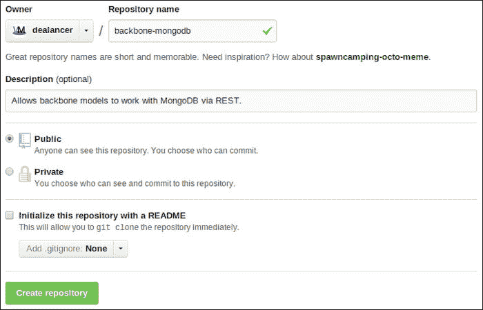

1.  初始化仓库并将代码推送到 GitHub 项目。

    ```js
     $ git init
     $ git remote add origin https://github.com/dealancer/backbone-mongo.git 
     $ git add *
     $ git add .gitignore
     $ git commit -m "initial commit"
     $ git push -u origin master

    ```

## 它是如何工作的...

当我们使用 `backbone-plugin` 参数运行 `grunt-init` 命令时，它将从 `backbone-plugin` 模板构建一个新的项目，该模板我们已下载并保存在 `~/.grunt-init/backbone-plugin` 目录中。

新生成的项目结构如下：

+   `node_modules/`：此选项为我们提供应用程序的 Node.js 模块

    +   `grunt/`

    +   `grint-contrib-qunit/`

+   `test/`：此选项对我们的应用程序进行测试

    +   `index.html`

    +   `mongodb.js`

+   `vendor/`: 此选项列出应用程序中使用的库

    +   `backbone/`

+   `backbone-mongodb.js`: 这是我们的应用程序的主要文件

+   `Gruntfile.js`: 这是 Grunt 文件

+   `LICENSE-MIT`

+   `README.md`

+   `package.json`: 这是 Node.js 模块文件

## 参见

+   扩展的源代码可在[`github.com/dealancer/backbone-mongo`](https://github.com/dealancer/backbone-mongo)找到

+   Grunt 文档可在[`gruntjs.com/getting-started`](http://gruntjs.com/getting-started)找到

+   关于`grunt-init` Backbone 插件的更多信息，请访问[`github.com/gsamokovarov/grunt-init-backbone-plugin`](https://github.com/gsamokovarov/grunt-init-backbone-plugin)

# 使用 QUnit 为 Backbone 扩展编写测试

如果你正在处理一个复杂的项目或 Backbone 扩展，你需要确保新的提交不会破坏任何现有功能。这就是为什么许多开发者选择在编写新代码之前或之后创建测试。

对于 JavaScript 应用程序，有大量不同的测试工具可以与 Backbone 完美集成。在本食谱中，我们将学习一个名为 QUnit 的工具。

当我们使用 Grunt 从模板构建项目时，QUnit 被包含在项目中，并创建了`test/mongodb.js`文件。让我们向之前食谱中做的扩展添加一个简单的测试。

## 如何操作...

执行以下步骤以测试应用程序：

1.  编辑`test/mongodb.js`文件，并添加一些基本模型和集合到扩展中，如下面的代码所述：

    ```js
      var Book = Backbone.MongoModel.extend({
        urlRoot: '/books'
      });

      var Library = Backbone.Collection.extend({
        url: '/books',
        model: Book
      });
    ```

1.  添加一些我们将使用的变量，如下面的代码所示：

    ```js
      var library;

      var attrs = {
        id: 5,
        title: "The Tempest",
        author: "Bill Shakespeare",
      };
    ```

1.  添加`setup()`和`teardown()`方法，这些方法将在每个测试前后运行，如下面的代码所示：

    ```js
      module('Backbone.Mongodb', _.extend(new Environment, {

        setup : function() {

          // Create new library.
          library = new Library();

          // Set init values.
          library.create(attrs, {wait: false});
        },

        teardown: function() {

        },
      }));
    ```

1.  通过以下方式调用`test()`函数来定义所需的测试数量：

    ```js
      test("Export to MongoDB Extended JSON", 2, function() {
        var book = library.get(5);
        ok(book);

        var json = book.toJSON();
        equal(json._id.$oid, 5);
      });
    ```

1.  通过在浏览器中打开`test/index.html`文件来运行测试，如下面的截图所示：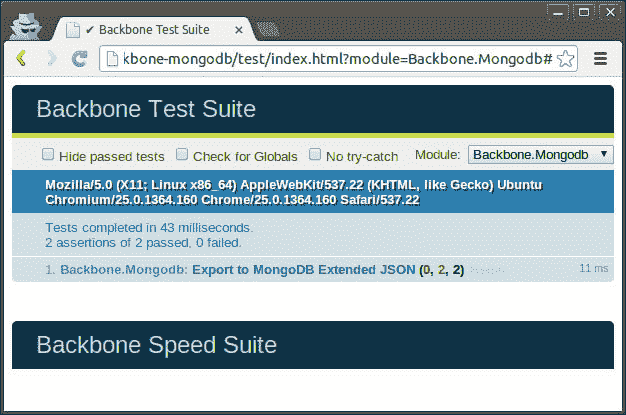

1.  你也可以使用以下命令在控制台中运行测试，如下面的截图所示：

    ```js
    $ grunt

    ```

    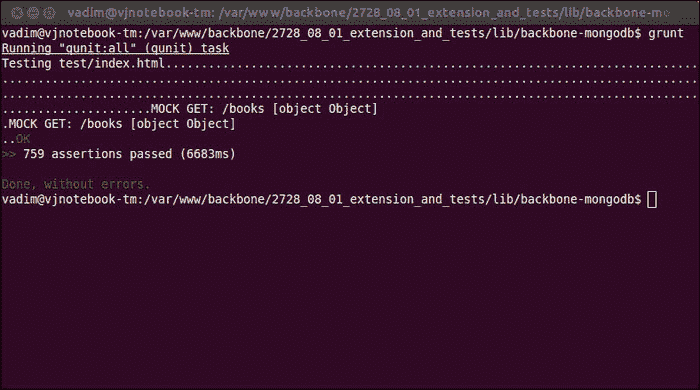

## 它是如何工作的...

QUnit 运行由`test()`函数定义的所有测试，该函数接受以下参数：`名称`、`断言数量`和`回调函数`。在测试回调内部，我们可以使用以下断言：

+   `ok()`: 这是一个布尔断言，等同于`CommonJS 的 assert.ok()`和`JUnit 的 assertTrue()`。如果第一个参数为真，则通过。

+   `equal()`: 这是一个非严格比较断言，大致等同于`JUnit assertEquals`。

+   `notEqual()`: 这是一个非严格比较断言，用于检查不等式。

+   `strictEqual()`: 这是一个严格的类型和值比较断言。

+   `throws()`: 这是一个断言，用于测试当运行时回调是否抛出异常。

+   `notStrictEqual()`: 这是一个非严格比较断言，用于检查不等式。

+   `deepEqual()`: 这是一个深度递归比较断言，适用于原始类型、数组、对象、正则表达式、日期和函数。

+   `notDeepEqual()`: 这是一个反转的深度递归比较断言，适用于原始类型、数组、对象、正则表达式、日期和函数。

如果达到所需的断言数量，则测试被认为是成功的。

在运行每个测试之前，QUnit 运行 `setup()` 函数，之后运行 `teardown()` 函数。如果我们需要更改一些全局设置然后恢复更改，这可能很有用。

由 Grunt 生成的 `index.html` 文件源代码如下：

```js
<!doctype html>
<html>
<head>
  <meta charset='utf8'>
  <title>Backbone Test Suite</title>
  <link rel="stylesheet"
    href="../vendor/backbone/test/vendor/qunit.css"
    type="text/css" media="screen">
  <script src="img/json2.js">
  </script>
  <script src="img/jquery.js">
  </script>
  <script src="img/qunit.js">
  </script>
  <script src="img/underscore.js">
  </script>
  <script src="img/backbone.js"></script>
  <script src="img/backbone-mongodb.js"></script>
  <script src="img/environment.js">
  </script>
  <script src="img/noconflict.js">
  </script>
  <script src="img/events.js"></script>
  <script src="img/model.js"></script>
  <script src="img/collection.js">
  </script>
  <script src="img/router.js"></script>
  <script src="img/view.js"></script>
  <script src="img/sync.js"></script>

  <script src="img/mongodb.js"></script>
</head>
<body>
  <div id="qunit"></div>
  <div id="qunit-fixture">
    <div id="testElement">
      <h1>Test</h1>
    </div>
  </div>
  <br>
  <br>
  <h1 id="qunit-header">
    <a href="#">Backbone Speed Suite</a>
  </h1>
  <div id="jslitmus_container" style="margin: 20px 10px;">
  </div>
</body>
</html>
```

此外，描述 Grunt 命令的 `Gruntfile.js` 文件源代码如下：

```js
module.exports = function(grunt) {
  grunt.initConfig({
    qunit: {
      all: ['test/index.html']
    }
  });

  grunt.loadNpmTasks('grunt-contrib-qunit');

  grunt.registerTask('default', ['qunit']);
};
```

## 参见

+   为了更熟悉它，请参阅官方 QUnit 文档，[`api.qunitjs.com/`](http://api.qunitjs.com/)。

# 在异步测试中使用 jQuery Mockjax 模拟 RESTful 服务

在前面的菜谱中，我们熟悉了 QUnit 并测试了 `toJSON()` 方法，该方法用于将数据推送到 RESTful 服务。在这个菜谱中，我们将测试 `fetch()` 方法，这是一个异步操作。幸运的是，QUnit 允许我们创建异步测试。我们还将使用 jQuery Mockjax 模拟 RESTful 服务。

## 准备中...

从其 GitHub 页面下载 jQuery Mockjax 扩展，[`github.com/appendto/jquery-mockjax`](https://github.com/appendto/jquery-mockjax)，并将其放置在扩展的 vendor 目录中。然后，在 `test/index.html` 文件中包含其主 JS 文件。

```js
  <script src="img/jquery.mockjax.js"></script>
```

## 如何做...

执行以下步骤以模拟异步测试中的 RESTful 服务：

1.  在 `setup()` 方法中，以 JSON 格式定义模拟的 URL 及其输出。

    ```js
          $.mockjax({
            url: '/books',
            responseTime: 10,
            responseText: [
              {_id: { "$oid": "10" }, one: 1},
              {id: "20", one: 1}
            ]
          });

          $.mockjax({
            url: '/books/10',
            responseTime: 10,
            responseText: {_id: { "$oid": "10" }, one: 1}
          });

          $.mockjax({
            url: '/books/20',
            responseTime: 10,
            responseText: {id: "20", one: 1}
          });
    ```

1.  在 `teardown()` 方法中取消模拟。

    ```js
          $.mockjaxClear();
    ```

1.  添加异步测试，从模拟的 RESTful 服务同步数据。

    ```js
      asyncTest("Read MongoDB Extended JSON", 1, function() {
        library.fetch();

        setTimeout(function() {
          ok(library.get('10'));
          start();
        }, 50);
      });

      asyncTest("Read regular JSON", 1, function() {
        library.fetch();

        setTimeout(function() {
          ok(library.get('20'));
          start();
        }, 50);
      });
    ```

## 它是如何工作的...

在前面的代码中，我们在 `asyncTest()` 函数中定义了我们的测试，该函数几乎与 `test()` 函数相同，除了它不会继续到下一个测试，除非调用 `start()` 函数。

也可以使用 `test()` 和 `stop()` 函数定义异步测试。

```js
test("Read MongoDB Extended JSON", 1, function() {
  // do not proceed on the next stop unless start() is called 
  stop();

  library.fetch();

  setTimeout(function() {
    ok(library.get('10'));
    start();
  }, 50);
});
```

从前面的代码中，我们看到了 `asyncTest()` 函数是 `test()` 函数的等价物，它立即调用 `stop()` 函数。

了解模拟服务中发生的事情很有趣。jQuery Mockjax 用它自己的方法替换了 `jQuery.ajax()` 方法，该方法是模拟对服务器的 AJAX 调用。

使用 `$.mockjax()` 定义模拟的 URL，并使用一些帮助从 `$.mockjaxClear()` 取消。

## 参见

+   请参阅 jQuery Mockjax 文档，[`github.com/appendto/jquery-mockjax`](https://github.com/appendto/jquery-mockjax)

+   关于使用 QUnit 进行异步测试的文档可在[`api.qunitjs.com/category/async-control/`](http://api.qunitjs.com/category/async-control/)找到。

# 使用 jQuery Mobile 开发移动应用程序

jQuery Mobile 是一个用于构建移动应用程序的有用的 HTML5/JavaScript 框架。它为移动设备提供外观和感觉组件，如列表、按钮、工具栏和对话框。通过自定义 jQuery Mobile，我们很容易创建自己的主题。

默认情况下，所有移动页面都可以存储在一个 HTML 文件中的不同 div 中，或者即时渲染。jQuery Mobile 还允许我们使用过渡效果在页面之间切换。

在这个食谱中，我们将使用 jQuery Mobile 和`Backbone.js`创建一个简单的 iOS 外观的应用程序，允许用户查看和创建帖子。数据存储在[`mongolab.com/welcome/`](https://mongolab.com/welcome/)并通过 REST 访问。

我们的应用程序将类似于以下截图：

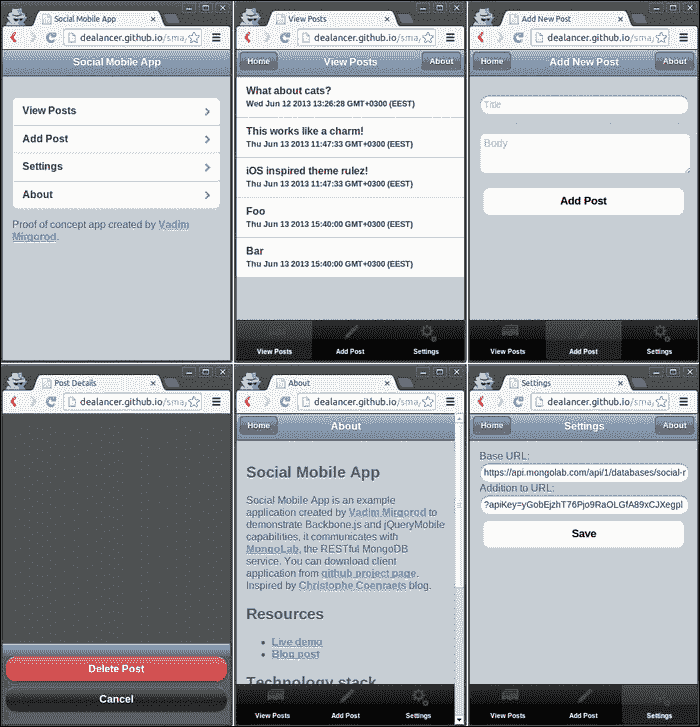

## 准备工作...

执行以下步骤为这个食谱做准备：

1.  从其 GitHub 页面[`github.com/dealancer/backbone-mongodb/`](http://github.com/dealancer/backbone-mongodb/)下载 backbone-mongodb 扩展，并将其保存到`lib/backbone-mongodb.js`中。我们将使用 backbone-mongodb 连接到[`mongolab.com/welcome/`](https://mongolab.com/welcome/)，这是一个 RESTful MongoDB 服务。

1.  从[`jquerymobile.com/`](http://jquerymobile.com/)下载 jQuery Mobile 库，并将其提取到`lib/jquery.mobile/`文件夹中。

1.  从其 GitHub 页面[`github.com/taitems/iOS-Inspired-jQuery-Mobile-Theme`](https://github.com/taitems/iOS-Inspired-jQuery-Mobile-Theme)下载 jQuery Mobile 的 iOS 灵感主题，并将其提取到`lib/ios_inspired/`文件夹中。

1.  从[`www.glyphish.com/`](http://www.glyphish.com/)下载我们将在移动应用程序中使用的图标，并将它们提取到`lib/glyphish/`文件夹中。

## 如何做到这一点...

执行以下步骤来创建一个移动应用程序：

1.  使用默认浏览器宽度在移动浏览器中渲染页面，否则页面可能会以 980 像素的屏幕宽度渲染然后缩小。将以下行包含到`index.html`的头部：

    ```js
    <meta name="viewport" content="width=device-width, initial-scale=1">
    ```

1.  将 CSS 文件包含到`index.html`的头部。

    ```js
    <link rel="stylesheet" href="lib/jquery.mobile/jquery.mobile-1.1.0.min.css"/>
    <link rel="stylesheet" href="lib/ios_inspired/styles.css"/>
    <link rel="stylesheet" href="css/styles.css"/>
    ```

1.  创建一个`js/jqm-config.js`文件，该文件将保留 jQuery Mobile 配置，并将其包含到`index.html`中。确保它在 jQuery 之后和 jQuery Mobile 之前被包含。

1.  在`js/jqm-config.js`中将回调绑定到`mobileinit`事件。

    ```js
    $(document).bind("mobileinit", function () {

    });
    ```

1.  通过在之前步骤中定义的`mobileinit`事件回调中添加以下代码来禁用 jQuery Mobile 路由：

    ```js
      $.mobile.ajaxEnabled = false;
      $.mobile.linkBindingEnabled = false;
      $.mobile.hashListeningEnabled = false;
      $.mobile.pushStateEnabled = false;
    ```

1.  通过在`mobileinit`事件回调中添加以下代码来设置过渡和效果：

    ```js
      $.extend($.mobile, {
        slideText: "slide",
        slideUpText: "slideup",
        defaultPageTransition: "slideup",
        defaultDialogTransition: "slideup"
      });
    ```

1.  在替换页面时从**文档对象模型**（**DOM**）中删除该页面。将以下代码添加到`mobileinit`事件回调中：

    ```js
      $('div[data-role="page"]')
        .live('pagehide', function (event, ui) {
          $(event.currentTarget).remove();
        }
      );
    ```

1.  在`index.html`中包含 Backbone-mongodb 扩展。

    ```js
      <script src="img/backbone-mongodb.js"></script>
    ```

1.  通过在`js/app-config.js`中添加以下代码启用**跨站脚本**并禁用 AJAX 缓存。同时，确保在应用程序的主文件之前包含此文件。

    ```js
    jQuery.support.cors = true;
    jQuery.ajaxSetup({ cache: false });
    ```

1.  在`js/app-config.js`中添加以下命令行以将`Backbone.MongoModel`混合到`Backbone.Model`中，以支持 MongoDB 扩展 JSON：

    ```js
    _.extend(Backbone.Model.prototype, Backbone.MongoModel.mixin);
    ```

1.  在`js/app-config.js`中添加 RESTful 服务 URL。

    ```js
    var appConfig = {
      baseURL: 'https://api.mongolab.com/api/1/databases/social-mobile-app/collections/',
      addURL: '?apiKey=yGobEjzhT76Pjo9RaOLGfA89xCJXegpl'
    }
    ```

1.  在`js/template-loader.js`中添加模板加载器，并在`index.html`中包含此文件，在主应用程序文件之前。

    ```js
    $(document).ready(function () {

        // Create global variable within jQuery object.
        $.tpl = {}

        $('script.template').each(function(index) {

          // Load template from DOM.
          $.tpl[$(this).attr('id')] = _.template($(this).html());

          // Remove template from DOM.
          $(this).remove();
        });

    });
    ```

1.  在`js/main.js`中定义路由对象，其中包含路由和回调，这是我们的主应用程序文件。它应该在所有其他文件之后包含。

    ```js
    var Workspace = Backbone.Router.extend({
      routes: {
        "": "main",
        "post/list": "postList",
        "post/add": "postAdd",
        "post/details/:id": "postDetails",
        "post/delete/:id": "postDelete",
        "settings": "settings",
        "about": "about",
      },

      main: function() {
        this.changePage(new MainPageView());
      },

      postList: function() {
        var postList = new PostList();
        this.changePage(
          new PostListPageView({collection: postList})
        );
        postList.fetch();
      },

      postAdd: function() {
        this.changePage(new PostAddPageView());
      },

      postDetails: function(id) {
        var post = new Post({id: id});
        this.changePage(new PostDetailsPageView({model: post}));
        post.fetch();
      },

      postDelete: function(id) {
        var post = new Post({id: id});
        this.showDialog(new PostDeleteDialogView({model: post}));
        post.fetch();
      },

      settings: function() {
        this.changePage(new SettingsPageView());
      },

      about: function() {
        this.changePage(new AboutPageView());
      }
    }
    ```

1.  将`changePage()`方法添加到路由对象以切换到当前视图页面。

    ```js
      changePage: function (page) {
        $(page.el).attr('data-role', 'page');

        page.render();

        $('body').append($(page.el));

        $.mobile.changePage($(page.el), {
          changeHash: false,
          transition: this.historyCount++ ?
            $.mobile.defaultPageTransition : 'none',
        });
      }
    ```

1.  将`showDialog()`方法添加到路由对象中以显示对话框。

    ```js
      showDialog: function(page) {
        $(page.el).attr('data-role', 'dialog');

        page.render();

        $('body').append($(page.el));

        $.mobile.changePage($(page.el), {
          allowSamePageTransition: true,
          reverse: false,
          changeHash: false,
          role: 'dialog',
          transition: this.historyCount++ ? 
            $.mobile.defaultDialogTransition : 'none',
        });
      },
    ```

1.  在`js/models/post.js`中定义模型和集合，并在`index.html`中包含此文件。

    ```js
    var Post = Backbone.Model.extend({
      defaults: {
        title: "",
        body: "",
        created: new Date().toString(),
      },

      url: function() {
        if (_.isUndefined(this.attributes.id)) {
          return appConfig.baseURL + 'posts' + appConfig.addURL;
        }
        else {
          return appConfig.baseURL + 'posts/' + 
            encodeURIComponent(this.attributes.id) + 
            appConfig.addURL;
        }
      },
    });

    var PostList = Backbone.Collection.extend({
      model: Post,
      url: function() {
        return appConfig.baseURL + 'posts' + appConfig.addURL;
      }
    });
    ```

1.  在`js/views/post-details-page.js`中定义`PostDetailsView`和`PostDetailsPageView`，并在`index.html`中包含此文件。

    ```js
    var PostDetailsView = Backbone.View.extend({
      initialize: function() {
        this.model.bind('change', this.render, this);
        this.template = $.tpl['post-details'];
      },

      render: function() {
        $(this.el).html(this.template(this.model.toJSON())).
          trigger('create');
        return this;
      },
    });

    var PostDetailsPageView = Backbone.View.extend({
      initialize: function () {
        this.template = $.tpl['post-details-page'];
      },

      render: function (eventName) {
        $(this.el).html(this.template(this.model.toJSON()));
        this.postDetailsView = new PostDetailsView({
          el: $('.post-details', this.el), model: this.model
        });

        return this;
      }
    });
    ```

1.  在`index.html`中为所有视图添加模板。这将使它们加载更快。以下是我们之前定义的视图的模板代码：

    ```js
      <script type="text/html" class="template"
              id="post-details-page">
        <div data-role="header">
          <h1>Post Details</h1>
          <a href="#post/list" data-rel="back" data-theme="a">
            Back
          </a>
          <a href="#about" data-theme="a">About</a>
        </div>

        <div data-role="content" class="post-details"></div>

        <div data-role="footer" data-position="fixed">
          <div data-role="navbar" data-theme="a">
            <ul>
              <li><a href="#post/list" id="list-button"
                     data-icon="custom">
                  View Posts
              </a></li>
              <li><a href="#post/add" id="add-button" 
                     data-icon="custom">
                Add Post</a></li>
              <li><a href="#settings" id="settings-button" 
                     data-icon="custom">
                Settings
              </a></li>
            </ul>
          </div>
        </div>
      </script>

      <script type="text/html" class="template" id="post-details">
        <h1><%= title %></h1>
        <small>Posted on <%= created %>.</small>
        <p><%= body %></p>

        <a href="#post/delete/<%= id %>" name="delete-post"
          id="delete-post" data-role="button">Delete Post
        </a>
      </script>

      <script type="text/html" class="template"
              id="post-list-item">
        <div class="ui-btn-inner ui-li">
          <div class="ui-btn-text">
            <a class="ui-link-inherit"
               href="#post/details/<%= id %>">
              <%= title %>
              <br><small><%= created %></small>
            </a>
          </div>
        </div>
      </script>
    ```

1.  添加视图和模板以显示其他页面。

1.  在`index.html`中添加样式以显示工具栏底部的 Glyphish 图标。

    ```js
    #list-button span.ui-icon-custom {
      background:
        url(../lib/glyphish/152-rolodex.png) 0 0 no-repeat;
    }

    #add-button span.ui-icon-custom {
      background:
        url(../lib/glyphish/187-pencil.png) 0 0 no-repeat;
    }

    #settings-button span.ui-icon-custom {
      background: url(../lib/glyphish/20-gear2.png) 0 0 no-repeat;
    }
    ```

1.  检查`index.html`中 CSS 和 JS 包含的顺序。它应该看起来像以下代码：

    ```js
      <!-- CSS -->
      <link rel="stylesheet"
        href="lib/jquery.mobile/jquery.mobile-1.1.0.min.css"/>
      <link rel="stylesheet" href="lib/ios_inspired/styles.css"/>
      <link rel="stylesheet" href="css/styles.css"/>

      <!-- Libraries -->
      <script src="img/jquery.min.js"></script>
      <script src="img/jqm-config.js"></script>
      <script src="img/jquery.mobile-1.1.0.min.js">
      </script>
      <script src="img/underscore-min.js"></script>
      <script src="img/backbone-min.js"></script>
      <script src="img/backbone-mongodb.js"></script>

      <!-- Config -->
      <script src="img/app-config.js"></script>

      <!-- Template loader -->
      <script src="img/template-loader.js"></script>

      <!-- SMA models and views -->
      <script src="img/post.js"></script>
      <script src="img/post-list-page.js"></script>
      <script src="img/post-add-page.js"></script>
      <script src="img/post-details-page.js"></script>
      <script src="img/post-delete-dialog.js"></script>
      <script src="img/main-page.js"></script>
      <script src="img/settings-page.js"></script>
      <script src="img/about-page.js"></script>

      <!-- SMA main file and router -->
      <script src="img/main.js"></script>
    ```

## 它是如何工作的...

此食谱的主要挑战是将 jQuery Mobile 与`Backbone.js`集成。基本上，除非您尝试使用 Backbone 路由，否则不应该有任何问题。`Backbone.js`和 jQuery Mobile 都提供了自己的路由机制，当一起使用时会相互冲突。

默认情况下，jQuery Mobile 启用了路由。如果您想使用`Backbone.Router`，则需要手动禁用它。这是我们之前在`js/jqm-comfig.js`中做的。

然而，我们仍然使用 jQuery Mobile 来切换页面。为此，我们在 div 中动态创建一个新页面，然后调用`$.mobile.changePage`，传递新页面元素和其他参数。如果配置了过渡效果，则执行动画。

## 参见

+   请参考官方 jQuery Mobile 资源：

    +   [`view.jquerymobile.com/1.3.1/dist/demos/`](http://view.jquerymobile.com/1.3.1/dist/demos/)

    +   [`api.jquerymobile.com/`](http://api.jquerymobile.com/)

+   前一个应用程序的实时演示可在网上找到：[`dealancer.github.io/sma`](http://dealancer.github.io/sma)。您可以从您的移动设备尝试它。

+   此应用程序的源代码可在 GitHub 仓库中找到：[`github.com/dealancer/sma/`](https://github.com/dealancer/sma/)

# 使用 PhoneGap 构建 iOS/Android 应用程序

PhoneGap 是一个免费且开源的框架，允许使用 HTML/CSS/JavaScript 构建移动应用程序。它支持 iOS、Android、Windows Phone、Blackberry 以及一些其他移动平台。此外，开发者可以访问移动设备的功能，例如相机、联系人、地理位置和存储。

要构建移动应用程序，您需要下载适用于您正在工作的移动平台的特定版本的 PhoneGap。此外，还有一个名为 **PhoneGap Build** 的付费在线服务，允许在线构建移动应用程序。它与 GitHub 集成，可以提取代码的最新版本。

在这个菜谱中，我们将使用 PhoneGap Build 构建一个移动应用程序。这将既简单又酷。

## 准备中...

请确保您已在网站上创建了账户 [`build.phonegap.com/apps`](https://build.phonegap.com/apps)。

## 如何操作...

执行以下步骤以使用 PhoneGap 构建 iOS/Android 应用程序：

1.  在与 `index.html` 文件相同的目录中创建 `config.xml` 文件。

1.  将以下 PhoneGap 配置以 XML 格式保存在 `config.xml` 文件中。

    ```js
    <?xml version="1.0" encoding="UTF-8" ?>
        <widget xmlns = "http://www.w3.org/ns/widgets"
            xmlns:gap = "http://phonegap.com/ns/1.0"
            id = "com.phonegap.example"
            versionCode ="1"
            version = "0.0.2">
        <!-- versionCode is optional and Android only -->

        <preference name="phonegap-version" value="2.7.0" />

        <name>Social Mobile App</name>

        <description>
          An example application to demonstrate Backbone.js and 
          jQueryMobile capabilities.
        </description>

        <author href="http://vmirgorod.name"
            email="dealancer@gmail.com">
            Vadim Mirgorod
        </author>

        <icon src="img/icon.png" gap:role="default" />

        <preference name="orientation" value="portrait" />
    </widget>
    ```

1.  将包含应用程序图标的 `icon.png` 文件放置在根目录中。

1.  前往 [`build.phonegap.com/apps/`](https://build.phonegap.com/apps/) 并点击 **+ 新应用** 按钮。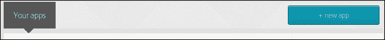

1.  在表单中输入仓库 URL git://github.com/dealancer/sma.git。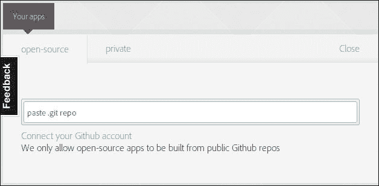

1.  如果您想输入非 GitHub 账户或从您的计算机上传应用程序，请点击 **私有** 选项卡。PhoneGap 允许您免费创建一个私有应用程序。

1.  在从 GitHub 仓库提取项目后，点击 **准备构建** 按钮，这将启动多个平台的构建过程。要为 iOS 或 Blackberry 构建应用程序，您需要输入开发者的密钥。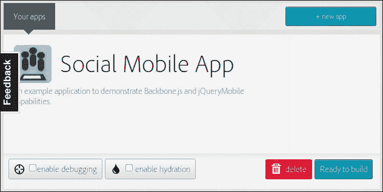

1.  现在，项目已准备好下载。您可以通过扫描移动设备上的二维码来完成此操作。二维码包含指向您应用程序的链接。然而，对于许多平台，您需要将构建的应用程序放置在特殊的应用市场中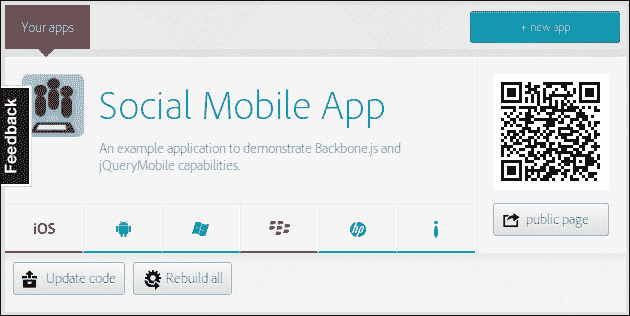

1.  当您准备好构建应用程序的新版本时，点击 **更新代码** 按钮，然后点击 **重建所有** 按钮。

## 参见

+   请参阅官方 PhoneGap 文档 [`docs.phonegap.com/en/edge/index.html`](http://docs.phonegap.com/en/edge/index.html)

# 使用 Require.js 组织项目结构

在这个菜谱中，我们将使用`Require.js`库中实现的**异步模块定义（AMD**）技术，该技术有助于将更多秩序带入你的项目。它允许你以类似于 PHP 中使用`include`命令的方式，从代码的其他部分动态定义和加载 JavaScript 模块。它还可以优化和压缩 JavaScript 文件，以便它们可以更快地加载和执行。

我们将使用上一个菜谱中的**社交移动应用程序**示例，并使用`Require.js`库进行重构。

我们应用程序的目录结构将如下所示：

+   `css/`

    +   `main.css`

+   `js/`

    +   `collection/`

    +   `post.js`

+   `model/`

    +   `post.js`

+   `view/`

    +   `about-page.js`

    +   `main-page.js`

    +   `post-add-page.js`

    +   `post-delete-dialog.js`

    +   `post-details-page.js`

    +   `post-list-page.js`

    +   `settings-page.js`

+   `app-config.js`

+   `app.js`

+   `jqm-config.js`

+   `router.js`

+   `template-loader.js`

+   `lib/`

    +   `glyphish/`

    +   `ios_inspired/`

    +   `jquery`.`mobile/`

    +   `backbone-mongodb.js`

    +   `backbone.js`

    +   `jquery.js`

    +   `require.js`

    +   `underscore.js`

+   `config.xml`

+   `icon.png`

+   `index.html`

+   `README.md`

## 准备中...

从[`www.requirejs.org/docs/download.html`](http://www.requirejs.org/docs/download.html)下载`Require.js`文件，并将其放置在`lib`目录下。

## 如何做...

执行以下步骤以使用`Require.js`组织移动应用程序：

1.  从`js/model/post.js`中提取集合定义，并将其放置在路径`js/collection/post.js`下的单独文件中。

1.  从`index.html`文件中删除所有 CSS 包含，只保留一个应该包含指向其他文件的链接的单个链接。

    ```js
    @import url("../lib/jquery.mobile/jquery.mobile-1.1.0.min.css");
    @import url("../lib/ios_inspired/styles.css");

    // Custom styles
    // ...
    ```

1.  从`index.html`文件中删除所有脚本包含，只保留一个将加载`Require.js`的脚本。确保使用相对于主应用程序文件的相对路径定义`data-main`属性。不需要`.js`扩展名。

    ```js
    <script data-main="js/app"  src="img/require.js"></script>
    ```

1.  在`js/app.js`文件中，添加`Require`配置，该配置定义了库的别名。我们将在以后使用其他别名。

    ```js
    require.config({

      paths: {
        jquery            : '../lib/jquery',
        'jquery.mobile':
         '../lib/jquery.mobile/jquery.mobile-1.1.0',
        underscore: '../lib/underscore',
        backbone: '../lib/backbone',
        'backbone-mongodb': '../lib/backbone-mongodb',
      }

    });
    ```

1.  通过在`Require`配置中添加 shim 属性来定义模块依赖。

    ```js
      shim: {
        'backbone-mongodb': {
          deps: ['backbone'],
          exports: 'Backbone'
        },
        'backbone': {
          deps: ['underscore', 'jquery'],
          exports: 'Backbone'
        },
        'underscore': {
          exports: '_'
        },
        'jquery.mobile': ['jquery','jqm-config'],
        'jqm-config': ['jquery'],
        'jquery': {
          exports: '$',
        }
      }
    ```

    在这里，我们让`Require`了解第三方库依赖；例如，`jquery.mobile`需要`jquery`和`jqm-config`，并且应该先加载。如果你使用没有 AMD 支持的常规 JS 库，你应该定义那些库提供的对象（例如，jQuery 中的`$`）。这可以通过在`export`属性中定义对象名称来完成。

1.  在`Require`配置中添加映射设置，以在应用程序的所有 JS 文件中加载`backbone-mongodb`对象而不是`backbone`对象；然而，要加载`backbone-mongodb`，我们仍然需要加载`backbone`。

    ```js
      map: {
        '*': {
          'backbone': 'backbone-mongodb',
        },
        'backbone-mongodb': {
          'backbone': 'backbone'
        }
      }
    ```

1.  将`requirejs()`函数调用添加到`js/app.js`中以启动应用程序。第一个参数包含应加载的模块数组，第二个参数提供要执行的回调函数。此类回调函数的参数是`requirejs()`函数第一个参数中定义的模块返回的对象。

    ```js
    requirejs([ 'app-config', 'router' ],
    function (appConfig, Router) {

      $(document).ready(function () {

        window.router = new Router();
        Backbone.history.start({ pushState : false });

      });

    });
    ```

    上述代码意味着在执行回调函数中的代码之前，会包含并实现`app-config.js`和`router.js`文件。

1.  将所有自定义 JS 文件重构为 AMD 兼容。添加与`requirejs()`函数语法相似的`define()`函数调用。如果模块提供了一个对象（或值）供其他模块使用，那么这个对象应该由模块返回。`app-config.js`文件将类似于以下代码：

    ```js
    // Filename: app-config.js

    define(['jquery', 'backbone'],
      function($, Backbone) {

        // Enable cross site scripting.
        $.support.cors = true;

        // Disable ajax cache.
        $.ajaxSetup({ cache: false });

        // Add support of MongoDB Extended JSON.
        _.extend(Backbone.Model.prototype,     
          Backbone.MongoModel.mixin);

        // Return app configuration.
        return {
          baseURL: 'https://api.mongolab.com/api/1/databases/
            social-mobile-app/collections/',
          addURL: '?apiKey=yGobEjzhT76Pjo9RaOLGfA89xCJXegpl'
        }
      }
    );
    ```

1.  虽然`Require.js`文件可以从文本文件中加载模板，但让我们处理我们之前使用的模板加载器。它也需要是 AMD 兼容的。

    ```js
    // Filename: template-loader.js

    define(['jquery', 'underscore'],
      function($, _) {

        // Create global variable within jQuery object.
        var tpl = {};

        $('script.template').each(function(index) {

          // Load template from DOM.
          tpl[$(this).attr('id')] = _.template($(this).html());

          // Remove template from DOM.
          $(this).remove();
        });

        return tpl;
      }
    );
    ```

1.  确保所有视图文件也被重构。它们可能看起来像以下代码：

    ```js
    // Filename: about-page.js

    define(['jquery', 'backbone', 'template-loader'],
      function($, Backbone, tpl) {
        return Backbone.View.extend({
          initialize: function () {
            this.template = tpl['about-page'];
          },

          render: function (eventName) {
            $(this.el).html(this.template());
            return this;
          },
        });
      }
    );
    ```

1.  确保所有必需的模块依赖项都包含在`router.js`文件中。

    ```js
    // Filename: router.js

    define([
      'jquery',
      'jquery.mobile',
      'backbone',
      'model/post',
      'collection/post',
      'view/about-page',
      'view/main-page',
      'view/post-add-page',
      'view/post-delete-dialog',
      'view/post-details-page',
      'view/post-list-page',
      'view/settings-page',
    ], function($, mobile, Backbone, PostModel, PostCollection,
          AboutPageView, MainPageView, PostAddPageView,
          PostDeleteDialogView, PostDetailsPageView,
          PostListPageView, SettingsPageView) {

      return Backbone.Router.extend({
        // Router code
      });
    });
    ```

1.  删除`main.js`文件，因为我们已经将所有功能从它移动到了`app.js`和`router.js`文件中。

## 它是如何工作的...

`Require.js`库提供了两个主要函数，`define()`和`requirejs()`，用于加载其他模块。`requirejs()`函数用于启动应用程序。这两个函数具有相似的语法。第一个参数用于列出当前模块所需的全部库，第二个参数包含要执行的回调函数。

```js
define(['jquery', 'backbone', 'template-loader'],
  function($, Backbone, tpl) {

    return Backbone.View.extend({
      initialize: function () {
        this.template = tpl['about-page'];
      },

      render: function (eventName) {
        $(this.el).html(this.template());
        return this;
      },
    });
});
```

回调函数的参数是模块所需的库返回的对象/值。它们的顺序与所需的模块顺序相同。

如果模块定义了一个其他模块需要的对象，它应该返回这样一个对象。

如果你正在处理没有 AMD 库的情况，但它提供了一个供你的应用程序其他模块使用的对象，你应该在`require.config()`函数中定义这样的对象。

```js
require.config({
  shim: {
    'jquery': {
      exports: '$',
    }
  }
});
```

如果你需要确保模块总是按照特定的顺序加载，你应该在`require.config()`函数中定义依赖项。

```js
require.config({
  shim: {
    'jquery.mobile': ['jquery','jqm-config'],
    'jqm-config': ['jquery'],
    'jquery': {
      exports: '$',
    }
  }
});
```

默认情况下，`Require.js`文件使用相对于主项目目录的路径来加载库。在引用此类库时跳过`.js`扩展名。在`require.config()`函数中还可以定义路径别名。

```js
require.config({

  paths: {
    jquery            : '../lib/jquery',
    'jquery.mobile':
      '../lib/jquery.mobile/jquery.mobile-1.1.0',
  }

});
```

当应用程序启动时，主应用程序文件运行，所有必需的模块和库都按正确的顺序和定义及配置加载。

## 还有更多...

### 使用 r.js 优化 JS 文件

`R.js`是`Require.js`的一个子模块，可以通过将它们合并成一个文件并最小化来优化 JavaScript 或 CSS 文件，从而使其加载和执行得更快。

要从本地主机加载我们的社交移动应用程序，浏览器需要执行 27 次请求，大约需要 308 毫秒。

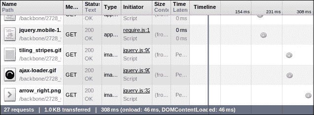

现在优化后的相同应用程序，只需 4 次请求在 53 毫秒内加载完成。

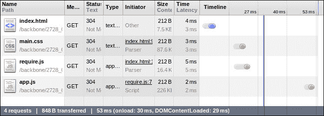

在这里，我们看到性能提升了六倍，这是一个很好的结果。实际上，对于加载速度较慢的互联网连接的大型项目，这个提升可能更大。

要优化您的应用程序，请执行以下步骤：

1.  确保您已安装`Node.js`和`npm`。

1.  将`Require.js`作为 Node 模块安装。

    ```js
    $ npm install -g requirejs

    ```

1.  创建一个名为 src 的新子目录并将所有项目文件移至其中。

1.  从[`www.requirejs.org/docs/download.html`](http://www.requirejs.org/docs/download.html)下载`r.js`并将其保存到根项目目录中。

1.  在项目根目录中创建`app.build.js`文件。此文件应包含一个`R.js`构建配置。

    ```js
    ({ 
        appDir: "./src", 
        baseUrl: "js", 
        dir: "build", 
        mainConfigFile: "src/js/app.js", 
        modules: [ 
            { 
                name: "app" 
            }, 
        ] 
    }) 
    ```

1.  执行以下命令以构建项目：

    ```js
    $ node r.js -o app.built.js

    ```

    您可以在`build`目录中找到构建的应用程序。

## 参见

+   在[`www.requirejs.org/`](http://www.requirejs.org/)查看官方`Require.js`文档。

# 确保与搜索引擎兼容性

当搜索引擎发现一个由 AJAX 驱动的 Web 应用程序时，它无法索引这样的应用程序，因为搜索引擎不会执行复杂的 JavaScript 代码。搜索引擎想要的是静态 HTML。

在本食谱中，我们将学习如何使搜索引擎索引 AJAX Web 应用程序。我们将主要处理 Google，但也会考虑如何与其他搜索引擎合作。

此食谱背后的想法是，我们可以在服务器上将 AJAX 应用程序渲染为静态 HTML 页面，并通过代理重定向将其发送给搜索引擎蜘蛛。

要在服务器上渲染 JavaScript，我们将使用`Node.js`和`Phantom.js`文件，这是一个作为 Node 模块提供的无头 WebKit 浏览器。我们还将使用一个名为 Seoserver 的 Node 模块，它帮助我们运行`Phantom.js`并输出结果。

为了区分搜索引擎蜘蛛和普通客户端，并使用代理重定向到 Seoserver，我们将使用 Apache 的`mod_rewrite`、`mod_proxy`和`mod_proxy_http`模块。

## 准备工作...

执行以下步骤以准备此食谱：

1.  确保您已安装`Node.js`和 npm。

1.  将`Phantom.js`作为 Node 模块安装。

    ```js
    $ sudo npm install -g phantomjs

    ```

1.  安装 Seoserver，它也是一个 Node 模块。

    ```js
    $ sudo npm install -g seoserver 

    ```

1.  确保您已安装 Apache。

1.  确保您已安装并配置以下 Apache 扩展：`mod_rewrite`、`mod_proxy`和`mod_proxy_http`。

1.  确保您有权限覆盖`.htaccess`文件中的配置。

## 如何操作...

执行以下步骤以确保与搜索引擎兼容性：

1.  通过在`index.html`的标题部分添加以下行，告诉**Google**蜘蛛使用`_escaped_fragement_`而不是`#!`：

    ```js
    <meta name="fragment" content="!"> 
    ```

    我们将在稍后了解其含义。

1.  创建 `.htaccess` 文件，并将以下行放置其中以通过代理将重定向操作执行到运行在 3000 端口的 Seoserver。

    ```js
    <IfModule mod_rewrite.c>
     RewriteEngine on

     RewriteCond %{QUERY_STRING} ^_escaped_fragment_=(.*)$
     RewriteRule (.*) http://<host>:3000/<path>/index.html#%1? [P]
    </IfModule>
    ```

1.  要通过代理将其他搜索引擎（例如 Yandex）重定向到 Seoserver，请将以下行添加到 `.htaccess` 文件中。

    ```js
    RewriteCond %{HTTP_USER_AGENT} ^YandexBot
    RewriteRule (.*) http://<host>:3000/<path/>index.html#%1?
    ```

1.  通过运行以下命令启动 Seoserver。

    ```js
    $ seoserver -p 3000 start > seoserver.log

    ```

1.  可选地，创建一个具有以下格式的网站地图：`http://<host>/<path>index.html#!route`

1.  您可以使用以下链接检查结果并查看 Googlebot 看到的内容：[`support.google.com/webmasters/bin/answer.py?hl=en&answer=158587`](http://support.google.com/webmasters/bin/answer.py?hl=en&answer=158587)

    ### 小贴士

    您也可以通过访问 `http://<host>/<path>index.html?_escaped_fragement_=route` 来手动检查结果。在这种情况下，请确保您已禁用浏览器中的 JavaScript，以避免任何冲突。

## 它是如何工作的...

有一种方法可以让 **Googlebot** 理解该网站支持 AJAX 爬取方案。它简单地尝试使用类似 `http://<host>/</path>index.html#!route` 的 URL 访问网站，并检查是否有任何显著的结果。`#!` 被用来代替 `#`，以向网站管理员表明这正是 Googlebot 在尝试访问资源时想要的。Googlebot 还会扫描网站地图，并尝试找到具有相同 URL 方案的 URL。

网站管理员应实现处理此类 URL 的处理，并输出可以被搜索引擎轻松索引的 HTML 快照。如果服务器无法处理带有 `#!` 的 URL，则允许使用以下 URL 方案：`http://<host>/</path>index.html?_escaped_fragement_=route`。这应通过在 HTML 输出中添加特殊元标签来指示。

```js
<meta name="fragment" content="!">
```

这种易于 Apache 和 Googlebot 处理的 URL 方案通过代理重定向到输出 HTML 快照的服务器。

我们将传递所有参数到运行在 3000 端口的 Seoserver，并调用 `phantom` 来获取请求资源的 HTML 快照。

Seoserver 是用 `Node.js` 编写的。让我们看看 `seoserver.js` 中的源代码。

```js
var express = require('express');
var app = express();
var arguments = process.argv.splice(2);
var port = arguments[0] !== 'undefined' ? arguments[0] : 3000;
var getContent = function(url, callback) {
  var content = '';

  var phantom = require('child_process').spawn(
    'phantomjs', [__dirname + '/phantom-server.js', url]
  );

  phantom.stdout.setEncoding('utf8');
  phantom.stdout.on('data', function(data) {
    content += data.toString();
  });

  phantom.stderr.on('data', function (data) {
    console.log('stderr: ' + data);
  });

  phantom.on('exit', function(code) {
    if (code !== 0) {
      console.log('We have an error');
    } else {
      callback(content);
    }
  });
};

var respond = function (req, res) {
  res.eader("Access-Control-Allow-Origin", "*");
  res.eader(
    "Access-Control-Allow-Headers", "X-Requested-With"
  );

  var url;
  if(req.headers.referer) {
    url = req.headers.referer;

  }
  if(req.headers['x-forwarded-host']) {
    url = 'http://' + req.headers['x-forwarded-host'] + 
      req.params[0];

  };

  console.log('url:', url);

  getContent(url, function (content) {
    res.send(content);
  });
}

app.get(/(.*)/, respond);
app.listen(port);
```

Seoserver 还包含以下代码的 `phantom-server.js` 文件：

```js
var page = require('webpage').create();
var system = require('system');
var lastReceived = new Date().getTime();
var requestCount = 0;
var responseCount = 0;
var requestIds = [];

page.viewportSize = { width: 1024, height: 768 };

page.onResourceReceived = function (response) {
    if(requestIds.indexOf(response.id) !== -1) {
        lastReceived = new Date().getTime();
        responseCount++;
        requestIds[requestIds.indexOf(response.id)] = null;
    }
};

page.onResourceRequested = function (request) {
    if(requestIds.indexOf(request.id) === -1) {
        requestIds.push(request.id);
        requestCount++;
    }
};

page.open(system.args[1], function () {

});

var checkComplete = function () {
  if(new Date().getTime() - lastReceived > 300 && requestCount 
      === responseCount)  {
    clearInterval(checkCompleteInterval);
    console.log(page.content);
    phantom.exit();
  } else {

  }
}
var checkCompleteInterval = setInterval(checkComplete, 1);
```

## 相关内容

+   查看 Seoserver 源代码库：[`github.com/apiengine/seoserver`](https://github.com/apiengine/seoserver)

+   要了解更多关于 URL 重写的信息，请访问 [`publib.boulder.ibm.com/httpserv/manual60/misc/rewriteguide.html`](http://publib.boulder.ibm.com/httpserv/manual60/misc/rewriteguide.html)

+   `Phantom.js` 的文档可在 [`github.com/ariya/phantomjs/wiki`](https://github.com/ariya/phantomjs/wiki) 找到。

+   请参考 Google 开发者文档了解有关 AJAX 应用爬取的更多信息：[`developers.google.com/webmasters/ajax-crawling/`](https://developers.google.com/webmasters/ajax-crawling/)

# 避免在 Backbone 应用程序中发生内存泄漏

内存泄漏是计算机程序中可能发生的问题，由于内存分配不正确。在 JavaScript 等高级面向对象语言中，内存泄漏通常与存储在内存中但未被应用程序代码使用的对象有关。内存泄漏可能导致更严重的问题，例如耗尽可用系统内存。

以下示例演示了由闭包（匿名函数）引起的内存泄漏：

```js
var div = document.createElement("div");
div.onclick = function () {  }
```

在前面的代码中，创建了一个新的 HTML 元素，并将 `onclick` 回调分配给一个匿名函数。这样的代码会产生内存泄漏，因为 `div` 引用了闭包，而闭包引用了 `div`，因为 `div` 变量可以在闭包作用域中访问。这种循环引用可以产生内存泄漏，因为垃圾收集器既没有利用 `div` 也没有利用闭包。

在这个菜谱中，我们将学习如何在 Backbone 应用程序中检测内存泄漏以及如何修复它们。我们将使用 Google Chrome Heap Profiler，它是 Google Chrome 浏览器的一部分。

## 准备中...

在这个菜谱中，我们将从一个绑定集合到第五章视图的示例应用程序开始，*事件和绑定*进行修改。这些修改在生产应用程序中不是必需的，但将帮助我们使用 Google Chrome Heap Profiler 检测内存泄漏。

1.  在你的程序中，为每个从标准 Backbone 对象（如 Model 或 View）扩展的对象添加一个命名构造函数。在这个构造函数内部，调用父构造函数。

    1.  通过使用类名查找对象实例，在 Google Chrome Heap Profiler 中检测内存泄漏可能会更容易，这只有在我们使用命名构造函数定义这样的类时才可能。

    1.  以下代码显示了定义了命名构造函数的 `InvoiceItemModel` 对象。

        ```js
          var InvoiceItemModel = Backbone.Model.extend({
            calculateAmount: function() {
              return this.get('price') * this.get('quantity');
            },

            constructor: function InvoiceItemModel() {
              InvoiceItemModel.__super__.constructor.apply(
                this, arguments
              );
            }
          });
        ```

1.  确保你的应用程序代码在全局范围内执行。这将使我们在 Google Chrome Heap Profiler 中找到 Backbone 对象更容易。你的 `main.js` 文件的内容不应该被任何函数包围。以下几行代码应该从你的 `main.js` 文件中移除。

    ```js
    (function($){
      $(document).ready(function () {

      });
    })(jQuery);
    ```

    将 `main.js` 包含到 `index.html` 的 `body` 部分中，如下所示：

    ```js
    <body><script src="img/main.js"></script></body>
    ```

1.  通过添加一个删除 `InvoiceItemsTableView` 的按钮来修改 `ControlsView`，以演示内存泄漏。以下代码解释了它是如何工作的：

    ```js
      var ControlsView = Backbone.View.extend({
        render: function() {
          var html = '<br><input id="addModel" type="button" ' +
            'value="Add model" id><input id="removeModel" ' +
            'type="button" value="Remove model"><input ' +
            'id="removeTableView" type="button" ' +
            'value="Remove table view">';
          $(this.el).html(html);	

          return this;
        },

        // Handle HTML events.
        events: {
          'click #addModel': 'addNewInvoiceItemModel',
          'click #removeModel': 'removeInvoiceItemModel',
          'click #removeTableView': 'removeInvoiceItemTableView',
        },
    //...

        // Remove a view button handler.
        removeInvoiceItemTableView: function() {
          this.options.invoiceItemTableView.remove(); 
        },
      });

      //...

      invoiceItemTableView = new InvoiceItemTableView({
        collection: invoiceItemCollection
      });

      $('body').append(invoiceItemTableView.render().el);

      $('body').append(new ControlsView({
        collection: invoiceItemCollection,
        invoiceItemTableView: invoiceItemTableView
      }).render().el);
    ```

我们准备的应用程序应该看起来像以下图片：

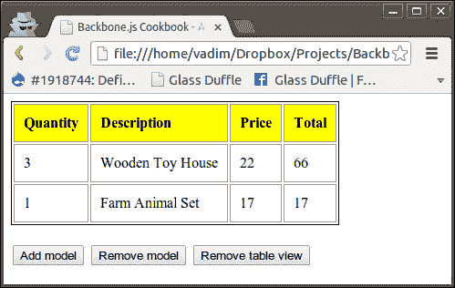

## 如何做到这一点...

执行以下步骤以检测和修复此应用程序中的内存泄漏：

1.  在 **Chrome** 浏览器中打开一个 Web 应用程序。

1.  按下 *F12* 键以打开 **Chrome DevTool**。

1.  点击 **配置文件** 选项卡并选择 **获取堆快照** 项。

1.  点击 **获取快照** 按钮。

1.  在 **类过滤器** 字段中输入 `Invoice`。

1.  你将在**对象计数**列下看到所有以`Invoice`开头以及它们实例数量的所有类。如何操作…

1.  点击**移除表格视图**按钮，再次获取堆快照以查看内存泄漏。

1.  你会发现**对象计数**对于任何类都没有减少，但应该是减少的。如何操作…

1.  当不需要这些引用时，从其他对象中删除对对象的任何引用。

1.  在调用`remove()`方法后删除对`InvoiceItemsTableView`实例的引用。

    ```js
      var ControlsView = Backbone.View.extend({

        // ...

        removeInvoiceItemTableView: function() {
          this.options.invoiceItemTableView.remove(); 
          delete this.options.invoiceItemTableView;
        },
      });
    ```

1.  当父视图被移除时，删除所有子子视图。

1.  在以下代码中，当创建新的子视图时，我们将它的移除方法作为处理程序分配给父视图的清除事件。在父视图的`remove()`方法中，我们触发清除事件。

    ```js
      var InvoiceItemTableView = Backbone.View.extend({

        // ...

        append: function(model) {
          var view = new InvoiceItemView({ model: model });

          $(this.el).append(
            view.render().el
          );

          view.listenTo(this, 'clear', this.remove);
        },

        remove: function() {
    this.trigger('clear'); 

          return InvoiceItemTableView.__super__.remove.
     apply(
     this, arguments
     );
        }
      });
    ```

1.  使用`listenTo()`方法而不是`on()`方法来绑定回调到事件。

1.  `listenTo()`方法跟踪绑定的事件，当对象被移除时解除绑定，以确保没有循环引用。

    ```js
      var InvoiceItemView = Backbone.View.extend({

        // ...

        initialize: function() {
          // Bind callback to destroy event of the model.
          this.listenTo(
     this.model, 'destroy', this.destroy, this
     );
        }
      });
      var InvoiceItemTableView = Backbone.View.extend({

        // ...

        initialize: function() {
          // Bind callback to add event of the collection.
          this.listenTo(
            this.collection, 'add', this.append, this
          );
        }
      });
    ```

1.  重新加载页面，移除表格视图，然后创建一个新的堆快照以确保没有发票视图泄漏。我们仍然可以看到一些模型被保留在内存中，但这发生是因为它们被`ControlsView`使用。如何操作…

## 参见

+   JavaScript 垃圾回收器的描述位于以下位置：[`blogs.msdn.com/b/ericlippert/archive/2003/09/17/53038.aspx`](http://blogs.msdn.com/b/ericlippert/archive/2003/09/17/53038.aspx)

+   JavaScript 中的内存泄漏模式在以下位置有描述：[`www.ibm.com/developerworks/web/library/wa-memleak/`](http://www.ibm.com/developerworks/web/library/wa-memleak/)
