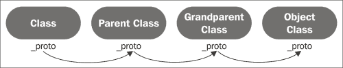
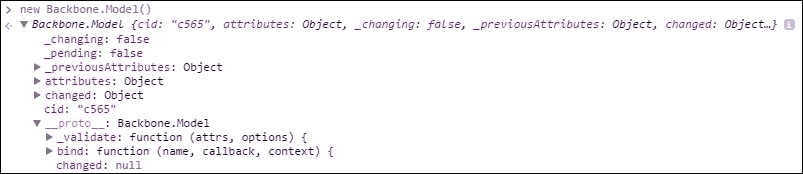

# 第二章：使用 Backbone 类的面向对象 JavaScript

在本章中，我们将探讨以下主题：

+   JavaScript 的类系统与传统面向对象语言的类系统之间的区别

+   如何通过新、原型和原型使 JavaScript 的类系统成为可能

+   扩展，Backbone 创建子类的一种更简单的机制

+   利用 Underscore 的方法，它是 Backbone 的依赖之一（就像 jQuery 一样）

# JavaScript 的类系统

使用 JavaScript 的程序员可以使用类以与其他语言程序员相同的方式封装逻辑单元。然而，与这些语言不同，JavaScript 依赖于一种不太流行的继承形式，称为基于原型的继承。由于 Backbone 类在本质上只是 JavaScript 类，因此它们也依赖于原型系统，并且可以像任何其他 JavaScript 类一样进行子类化。

例如，假设你想创建一个自己的 `Book` 子类，它是 Backbone `Model` 类的子类，并具有模型没有的附加逻辑，例如与书籍相关的属性和方法。以下是如何仅使用 JavaScript 的原生面向对象功能创建此类的方法：

```js
// Define Book's Initializer
var Book = function() {
    // define Book's default properties
    this.currentPage = 1;
    this.totalPages = 1;
}

// Define book's parent class
Book.prototype = new Backbone.Model();

// Define a method of Book
Book.prototype.turnPage = function() {
    this.currentPage += 1;
    return this.currentPage;
}
```

如果你从未在 JavaScript 中使用过原型，前面的代码可能看起来有点令人畏惧。幸运的是，Backbone 提供了一种更简单、更易于阅读的机制来创建子类。然而，由于该系统建立在 JavaScript 的原生系统之上，因此首先了解原生系统的工作方式非常重要。这种理解将有助于你以后进行更复杂的类相关任务，例如调用在父类上定义的方法。

# 新关键字

`new` 关键字是 JavaScript 类系统的一个相对简单但极其有用的部分。关于 `new` 的第一件事是，它不会以与其他语言相同的方式创建对象。在 JavaScript 中，每个变量要么是函数、对象或原始值，这意味着当我们提到 *类* 时，我们实际上指的是一个特别设计的初始化函数。创建这种类样式的函数就像定义一个修改 `this` 的函数然后使用 `new` 关键字调用该函数一样简单。

通常，当你调用一个函数时，它的 `this` 是显而易见的。例如，当你调用一个书籍对象的 `turnPage` 方法时，`turnPage` 中的 `this` 方法将被设置为这本书对象，如下所示：

```js
var simpleBook = {currentPage: 3, pages: 60};
simpleBook.turnPage = function() {
    this.currentPage += 1;
    return this.currentPage;
}
simpleBook.turnPage(); // == 4
```

调用一个未附加到对象上的函数（换句话说，一个不是方法的函数）会导致 `this` 被设置为全局作用域。在网页浏览器中，这意味着窗口对象：

```js
var testGlobalThis = function() {
    alert(this);
}
testGlobalThis(); // alerts window
```

当我们在调用初始化函数之前使用 `new` 关键字时，会发生三件事（实际上四件事，但我们将在解释原型时解释第四件事）：

+   JavaScript 为我们创建了一个全新的对象 (`{}`)

+   JavaScript 将初始化函数内部的 `this` 方法设置为新创建的对象

+   函数执行完毕后，JavaScript 会忽略正常的返回值，而是返回创建的对象

如你所见，尽管 `new` 关键字很简单，但它仍然很重要，因为它允许你将初始化函数视为真正的类。同时，它这样做并没有违反 JavaScript 的原则，即所有变量必须是函数、对象或原始数据类型。

# 原型继承

虽然一切都很好，但如果 JavaScript 没有真正的类概念，我们如何创建子类呢？实际上，JavaScript 中的每个对象都有两个特殊的属性来解决这个问题：`prototype` 和 `__proto__`（隐藏的）。这两个属性可能是 JavaScript 中最常被误解的方面，但一旦你了解了它们的工作原理，实际上它们的使用非常简单。

当你在对象上调用方法或尝试检索属性时，JavaScript 首先检查对象是否在其自身中定义了该方法或属性。换句话说，如果你定义了一个这样的方法：

```js
book.turnPage = function() 
    this.currentPage += 1;
};
```

当你调用 `turnPage` 时，JavaScript 将首先使用这个定义。

### 小贴士

然而，在实际代码中，你几乎永远不会想在对象中直接放置方法，原因有两个。首先，这样做会导致这些方法被复制，因为你的类每个实例都将有自己的单独副本。其次，以这种方式添加方法需要额外的步骤，而这个步骤在你创建新实例时很容易被忘记。

如果对象中没有定义 `turnPage` 方法，JavaScript 将接下来检查对象的 `hidden __proto__` 属性。如果这个 `__proto__` 对象没有 `turnPage` 方法，那么 JavaScript 将查看对象 `__proto__` 属性上的 `__proto__`。如果没有这个方法，JavaScript 将继续检查 `__proto__` 的 `__proto__` 的 `__proto__`，并继续检查每个后续的 `__proto__`，直到链被耗尽。



这与传统面向对象语言中的单类继承类似，只不过 JavaScript 不是通过类链，而是使用原型链。就像在面向对象语言中我们最终只有一个方法副本一样，但方法不是定义在类本身上，而是定义在类的原型上。

在 JavaScript 的将来版本（ES6）中，将能够直接操作 `__proto__` 对象，但到目前为止，查看 `__proto__` 属性的唯一方法是通过浏览器调试工具（例如，Chrome 开发者工具调试器）：



这意味着你不能使用以下这行代码：

```js
book.__proto__.turnPage();
```

此外，你不能使用以下代码：

```js
book.__proto__ = {
    turnPage: function() {
        this.currentPage += 1;
    }
};
```

但是，如果您不能直接操作`__proto__`，您如何利用它呢？幸运的是，您可以操作`__proto__`，但您只能通过间接操作`prototype`来实现。您还记得我提到`new`关键字实际上做了四件事吗？第四件事是它将新创建的对象的`__proto__`属性设置为初始化函数的`prototype`属性。换句话说，如果您想为每个您创建的`Book`新实例添加一个`turnPage`方法，您可以将这个`turnPage`方法赋值给`Book`初始化函数的`prototype`属性，例如：

```js
var Book = function() {};
Book.prototype.turnPage = function() {
    this.currentPage += 1;
};
var book = new Book();
book.turnPage();// this works because book.__proto__  == Book.prototype
```

由于这些概念经常引起混淆，让我们简要回顾一下：

+   每个对象都有一个`prototype`属性和一个隐藏的`__proto__`属性。

+   当一个对象首次创建时，它的`__proto__`属性被设置为构造函数的`prototype`属性，并且不能被更改。

+   当 JavaScript 在对象上找不到属性或方法时，它会检查`__proto__`链的每个步骤，直到找到它或直到链结束。

### 小贴士

**下载示例代码**

您可以从[`www.packtpub.com`](http://www.packtpub.com)下载您购买的所有 Packt Publishing 书籍的示例代码文件。如果您在其他地方购买了这本书，您可以访问[`www.packtpub.com/support`](http://www.packtpub.com/support)并注册，以便将文件直接通过电子邮件发送给您。

# 扩展 Backbone 类

随着这些解释的完成，我们终于可以深入了解 Backbone 的子类化系统，该系统围绕 Backbone 的`extend`方法展开。要使用`extend`，您只需从您的新子类将基于的类中调用它，`extend`将返回新的子类。这个新的子类将它的`__proto__`属性设置为父类的`prototype`属性，使得使用新子类创建的对象可以访问父类的所有属性和方法。以下是一个代码片段的例子：

```js
var Book = Backbone.Model.extend();
// Book.prototype.__proto__ == Backbone.Model.prototype;
var book = new Book();
book.destroy();
```

在前面的例子中，最后一行之所以有效，是因为 JavaScript 会查找`__proto__`链，找到`Model`方法的`destroy`，并使用它。换句话说，我们原始类的所有功能都被我们的新类继承了。

当然，如果`extend`只能创建父类的精确克隆，那么它就不会那么吸引人，这也是为什么`extend`将其第一个参数作为一个`properties`对象。这个对象上的任何属性或方法都将被添加到新类的`prototype`中。例如，让我们通过添加一个属性和一个方法来让我们的`Book`类变得更有趣：

```js
var Book = Backbone.Model.extend({
    currentPage: 1,
    turnPage: function() {
        this.currentPage += 1;
    }
});
var book = new Book();
book.currentPage; // == 1
book.turnPage(); // increments book.currentPage by one
```

`extend` 方法还允许你创建静态属性或方法，换句话说，就是存在于类上而不是从该类创建的对象上的属性或方法。这些静态属性和方法作为第二个 `classProperties` 参数传递给 `extend`。以下是一个快速示例，说明如何向我们的 `Book` 类添加一个静态方法：

```js
var Book = Backbone.Model.extend({}, {
    areBooksGreat: function() {
        alert("yes they are!");
    }
});
Book.areBooksGreat(); // alerts "yes they are!"
var book = new Book();
book.areBooksGreat(); // fails because static methods must be called on a class
```

如你所见，与原生的 JavaScript 方法相比，Backbone 对继承的处理方法有几个优点。首先，单词 `prototype` 在之前提到的任何代码中都没有出现过；虽然你仍然需要理解 `prototype` 的工作原理，但你不必为了创建一个类而思考它。另一个好处是，整个类定义都包含在一个单一的 `extend` 调用中，使得类的所有部分在视觉上保持在一起。此外，当我们使用 `extend` 时，构成类的各个逻辑部分按照大多数其他编程语言中的顺序排列，首先定义超类，然后是初始化器和属性，而不是相反。

# 应用父类方法

然而，为了充分发挥类系统的全部功能，仅仅在子类上定义新方法是不够的；有时，我们需要将父类的方法与子类上的附加逻辑结合起来。在传统的面向对象语言中，这通常是通过引用一个特殊的超对象来完成的；但在 JavaScript 中，不存在这样的对象，这意味着我们必须利用 JavaScript 的 `apply` 或 `call` 方法。

例如，`Backbone.Model` 有一个 `destroy` 方法，但如果我们想让我们的 `Book` 类也有自己的 `destroy` 方法怎么办？这个方法可能需要处理一定数量的页面并将它们销毁（减少总页数），但同时我们可能还想保留 Backbone 版本以供其原始用途（即销毁服务器端的 `Book` 版本）。

幸运的是，因为 Backbone 已经为我们正确配置了 `Book` 类的原型，所以从子类方法调用父类方法相当简单，如下所示：

```js
var Book = Backbone.Model.extend({
    destroy: function(optionsOrPagesToDestroy) {
        if (typeof optionsOrPagesToDestroy === 'number') {
            // optionsOrPagesToDestroy is pagesToDestroy: call our version
            this.totalPages -=  optionsOrPagesToDestroy;
        } else {
            // optionsOrPagesToDestroy is an options object: call the Backbone version
            Backbone.Model.prototype.destroy.apply(this, arguments);
        }
    }
});
```

使前面的代码能够正常工作的关键是 `apply` 方法，这是 JavaScript 中每个函数的方法（因为函数在 JavaScript 中也是对象，所以它们可以像任何其他对象一样拥有方法）。`apply` 方法允许你将函数作为从 `apply` 给出的第一个参数调用来调用。换句话说，`apply` 允许你在函数被调用时改变其 `this` 方法。

如前所述，在正常情况下，`this` 将设置为调用函数的对象。但是，当你使用 `apply` 时，你可以将其改为你想要的任何变量，如下所示：

```js
var Book = Backbone.Model.extend({
    currentPage: 1,
    turnPage: function() {
        this.currentPage += 1;
    }
});
var simpleBook = {currentPage: 20};
Book.prototype.turnPage.apply(simpleBook); //  simpleBook.currentPage == 21
```

你还可以使用 `apply` 将常规参数传递给一个方法，通过提供第二个（数组）参数来实现。实际上，即使这与你要调用的函数无关，也可以使用 `apply`，在这种情况下，你可以简单地传递 `null` 作为第一个参数：

```js
var Book = Backbone.Model.extend();
var book = new Book();
book.alertMessage = function(message, secondMessage) {
    alert(message + ' ' + secondMessage);
}
book.alertMessage.apply(null, ['hello', 'world']);// alerts "hello world"
```

JavaScript 函数也有类似的方法：`call`。`call` 和 `apply` 之间的区别在于它们向被调用的函数提供参数的方式。与 `apply` 不同，`call` 预期其参数是单独传递的，而不是作为一个单一的数组参数。以下是一个代码片段的例子：

```js
var book = new Book();
book.alertMessage = function(message, secondMessage) {
    alert(message + ' ' + secondMessage);
}
book.alertMessage.call(null, 'hello', 'world'); // alerts "hello world"
```

通过使用这两种方法之一，并记住每个类的每个方法都可通过其 `prototype` 属性访问，你不仅可以调用父类的方法，还可以调用祖父类、曾祖父类甚至完全不相关的类的方法。出于可读性的考虑，你不应该在完全不相关的类上频繁使用这种技术，但偶尔它可能非常有帮助。

### 注意

值得注意的是，这种技术仅在基于原型的继承语言（如 JavaScript）中可行；在真正的面向对象语言（如 Java）中实现 `apply` 或 `call` 将是不可能的。

# 介绍 Underscore

除了 jQuery 之外，Backbone 还需要一个名为 **Underscore** 的库。Underscore 是由 Jeremy Ashkenas（Backbone 的创造者）编写的，其中许多函数与我们之前讨论的主题相关。由于 Underscore 是 Backbone 所必需的，所以如果你使用 Backbone，你将已经可以使用它。所有这些函数都可以通过 `_` 字符访问（类似于 jQuery 函数是通过 `$` 字符访问的）。

在我们讨论 `call` 和 `apply` 方法时，你可能已经意识到这在 JavaScript 中比在其他语言中更灵活。当一个函数正常调用时，它会自动保留 `this` 方法，但当函数以不寻常的方式调用时——例如通过 `window.setTimeout` 或作为 jQuery 事件处理程序或 AJAX 调用的回调——情况就不同了。`window.setTimeout` 会将其更改为全局窗口对象，而 jQuery 事件回调会将 `this` 更改为触发事件的元素，jQuery AJAX 回调将设置为 AJAX 调用创建的 HTTP 请求。以下是一个快速示例：

```js
var exampleObject = {};
exampleObject.alertThis = function() {
     alert(this);
};
window.setTimeout(exampleObject.alertThis); // alerts window
```

解决这个问题的方法是使用额外的函数，并使用 `apply` 来包装原始函数，这样我们就可以强制 JavaScript 保留我们的 `this` 方法：

```js
      var exampleObject = {};
exampleObject.alertThisBuilder = function() {
    var alertThis = function() {
        alert(this);
    }
    var correctThis = this;
    return function() {
        alertThis.apply(correctThis);
    }
};
var alertThis = exampleObject.alertThisBuilder();
window.setTimeout(alertThis); // alerts exampleObject
```

这可以工作，但说实话：它很丑。幸运的是，Underscore 有两个解决方案：`bind` 和 `bindAll`。

让我们从 `bind` 开始。`bind` 函数允许你强制一个函数（作为第一个参数提供），保留你作为第二个参数提供的特定 `this` 值：

```js
var simpleBook = {};
simpleBook.alertThis = function() {
     alert(this);
};
simpleBook.alertThis = _.bind(simpleBook.alertThis, simpleBook);
window.setTimeout(simpleBook.alertThis); // now alerts simpleBook, not window
```

Underscore 还有一个相关的 `bindAll` 函数，它可以用来永久地 `bind` 一个方法：

```js
var Book = Backbone.Model.extend({
     initialize: function() {
          _.bindAll(this, 'alertThis');
     },
     alertThis: function() {
          alert(this);
     }
});
var  book = new Book();
window.setTimeout(book.alertThis); // alerts book, not window
```

如您所见，`bindAll` 允许您使用类的 `setTimeout` 或作为回调函数来处理 jQuery 事件处理器或 AJAX 操作，而不会丢失 `this`。

虽然 `bindAll` 非常强大，但重要的是不要过度使用它，因为它会为它绑定的每个方法创建一个新的副本。如果在类内部使用，这将导致该类的每个实例都有自己独立的方法副本。当您只有少量绑定的方法和/或只有少量实例时，这完全没问题，但当您在将被多次实例化的类上使用大量方法时，您可能不想这样做。

# 更多 Underscore

`bind` 和 `bindAll` 函数只是 Underscore 为网络开发者提供的大量功能的一小部分。虽然对 Underscore 提供的所有功能的全面解释超出了本书的范围，但花几分钟时间检查 Underscore 中一些最有用的函数是值得的。如果您想了解关于 Underscore 的更多内容，而不仅仅是本章中涵盖的内容，我强烈建议您阅读其网页 ([`underscorejs.org/`](http://underscorejs.org/))，其中包含了库中每个方法的良好编写的文档。

## 每个、Map 和 Reduce

每个 JavaScript 开发者都知道如何使用 `for` 循环进行迭代，但 Underscore 提供了三种强大的替代原生循环的方法：`each`、`map` 和 `reduce`。虽然这三个方法（以及许多其他 Underscore 方法）都包含在支持 ES5 的浏览器中，但不幸的是，旧浏览器没有对这些方法的支持。这些替代循环如此方便，以至于您可能会发现自己再也不用原生 `for` 循环了。幸运的是，Underscore 提供了其版本，允许您在所有主要浏览器支持 ES5 之前填补这一差距。

让我们从每个用法的示例开始：

```js
var mythicalAnimals = ['Unicorn', 'Dragon', 'Honest Politician'];
_.each(mythicalAnimals, function(animalName, index) {
    alert('Animal #' + index + ' is ' + animalName);
});
```

这将等同于使用 JavaScript 的原生 `for` 循环编写的 preceding 代码：

```js
      var mythicalAnimals = ['Unicorn', 'Dragon', 'Honest Politician'];
for (var index = 0; index < mythicalAnimals.length; index++) {
    var animalName = mythicAnimals[index];
    alert('Animal #' + index + ' is ' + animalName);
}
```

或者，如果我们改用 `for`/`in` 语法：

```js
var mythicalAnimals = ['Unicorn', 'Dragon', 'Honest Politician'];
for (var index in mythicalAnimals) {
    var animalName = mythicalAnimals[index];
    alert('Animal #' + index + ' is ' + animalName);
}
```

如您所见，原生实现都要求您在循环内部提取值（在这种情况下，`animalName`），而 Underscore 的版本会自动提供它。

Underscore 的 `map` 和 `reduce` 方法甚至更强大。`map` 方法允许您将变量数组转换为另一个（不同的）变量数组，而 `reduce` 则将变量数组转换为一个单一变量。例如，假设您已经使用 jQuery 的 `text` 方法提取了一组数字，但由于它们来自 DOM，这些数字实际上是字符串（换句话说，是 `5` 而不是 `5`）。通过使用与 `each` 几乎相同的语法的 `map`，您可以轻松地将所有这些字符串转换为实际的数字，如下所示：

```js
var stringNumbers = ["5", "10", "15"];
var BASE = 10; // when we parse strings in to numbers in
               // JavaScript we have to specify which base to use
var actualNumbers = _.map(stringNumbers, function(numberString, index) {
    return parseInt(numberString, BASE);
}); // actualNumbers == [5, 10, 15]
```

如前例所示，`map` 函数内部返回的值被添加到 `map` 操作返回的数组中。这使得你可以将任何类型的数组转换为另一种类型的数组，只要你能够定义一个位于中间并执行所需转换的函数。

然而，如果你想要合并或汇总所有这些数字呢？在这种情况下，你将希望使用 `reduce`，如下所示：

```js
var total = _.reduce(actualNumbers, function(total, actualNumber) {
    return total +  actualNumber;
}, 0); // total == 30
```

`reduce` 函数比之前的函数稍微复杂一些，因为它有一个名为 *memo* 的最后一个参数。这个参数作为 `reduce` 最终返回的对象的起始值，然后随着每个值的迭代，memo 被替换为 `reduce` 函数（传递给 `reduce` 的函数）返回的任何值。`reduce` 函数还将其前一个 memo 作为其第一个参数传递，因此每次迭代都可以选择以它想要的方式修改前一个值。这使得 `reduce` 可以用于比简单地相加两个数字更复杂的操作。

## 扩展和默认值

另一个使用 Underscore 可以简化操作的常见操作是将一个对象的属性复制到另一个对象上，这可以通过 Underscore 的 `extend`（不要与 Backbone 的 `extend` 类混淆）和 `defaults` 方法来解决。例如，假设你正在使用第三方小部件，例如 jQuery UI 组件，它在创建时需要一个配置参数。你可能希望为网站中的每个小部件保留一些相同的配置选项，但同时也可能希望某些小部件有自己的独特选项。

让我们假设你已经用两个对象定义了这两组配置，一个用于通用配置，另一个用于特定小部件的配置：

```js
var commonConfiguration = {foo: true, bar: true};
var specificConfiguration = {foo: false, baz: 7};
```

`extend` 方法接受传递给它的第一个参数，并将每个后续参数的属性复制到它上面。在这种情况下，它允许你首先对一个新对象应用通用选项，然后应用特定选项，如下所示：

```js
var combined = _.extend({}, commonConfiguration, specificConfiguration);
// combined == {foo: false, bar: true, baz: 7}
```

`defaults` 方法的工作方式与此类似，但它只复制对象尚未拥有的值。我们可以通过简单地改变参数顺序，用 `defaults` 重新编写前面的示例：

```js
var combined = _.defaults({}, specificConfiguration , commonConfiguration);
// combined == {foo: false, bar: true, baz: 7}
```

如其名所示，`defaults` 方法在你想要为对象指定默认值但又不想替换任何已指定的值时非常有用。

## 提取和调用

`map` 的最常见用途之一是获取对象数组中的某些属性，或者对数组中的每个对象调用某个方法。Underscore 提供了额外的便利方法来完成这项任务：`pluck` 和 `invoke`。

`pluck` 方法允许你从数组的每个成员中提取单个属性值。例如，假设我们有一个表示虚构书籍的对象数组，如下所示：

```js
var fakeBooks = [
    {title: 'Become English Better At', pages: 50, author: 'Bob'},
    {title: 'You Is Become Even Better at English', pages: 100, author: 'Bob'},
    {title: 'Bob is a Terrible Author', pages: 200, author: 'Fred the Critic'}
];
```

如果你只想创建包含这些书籍标题的列表，你可以使用如下所示的`pluck`方法：

```js
var fakeTitles = _.pluck(fakeBooks, 'title');// fakeTitles == ['Become English Better At', ...]
```

`invoke`方法的工作方式与`pluck`方法类似，不同之处在于它假设提供的属性是一个方法，运行它并将结果添加到返回的数组中。以下示例可以最好地说明这一点：

```js
var Book = Backbone.Model.extend({
    getAuthor: function() {
        // the "get" method returns an attribute of a Model;
        // we'll learn more about it in the following chapter
        return this.get('author');
    }
});
var books = [new Book(fakeBooks[0]),
                     new Book(fakeBooks[1]),
                     new Book(fakeBooks[2])];
var authors = _.invoke(books, 'getAuthor'); // == ['Bob', 'Bob', 'Fred the Critic']
```

## 进一步阅读

Underscore 还有许多其他有用的函数，正如我们之前提到的，所有这些函数都有很好的文档记录，可以在[`underscorejs.org/`](http://underscorejs.org/)找到。由于每个 Backbone 程序员都保证可以使用 Underscore，因此没有理由不利用这个优秀的库；即使在 Underscore 网站上花上几分钟，也会让你意识到它所能提供的一切。

# 摘要

在本章中，我们探讨了 JavaScript 的本地类系统是如何工作的，以及`new`、`this`和`prototype`关键字/属性如何构成其基础。我们还学习了 Backbone 的`extend`方法如何使创建新的子类变得更加方便，以及如何使用`apply`和`call`来调用父方法（或提供回调函数时）以保留所需的`this`方法。最后，我们探讨了 Underscore（Backbone 的依赖之一）解决常见问题的多种方式。在下一章中，我们将深入探讨四个 Backbone 类中的第一个，即`Model`。我们将学习如何使用 Model 在客户端组织我们的数据，以及如何与远程服务器交换这些数据。
