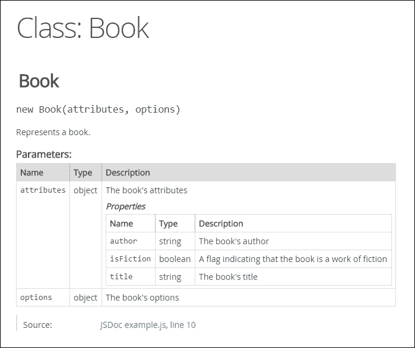
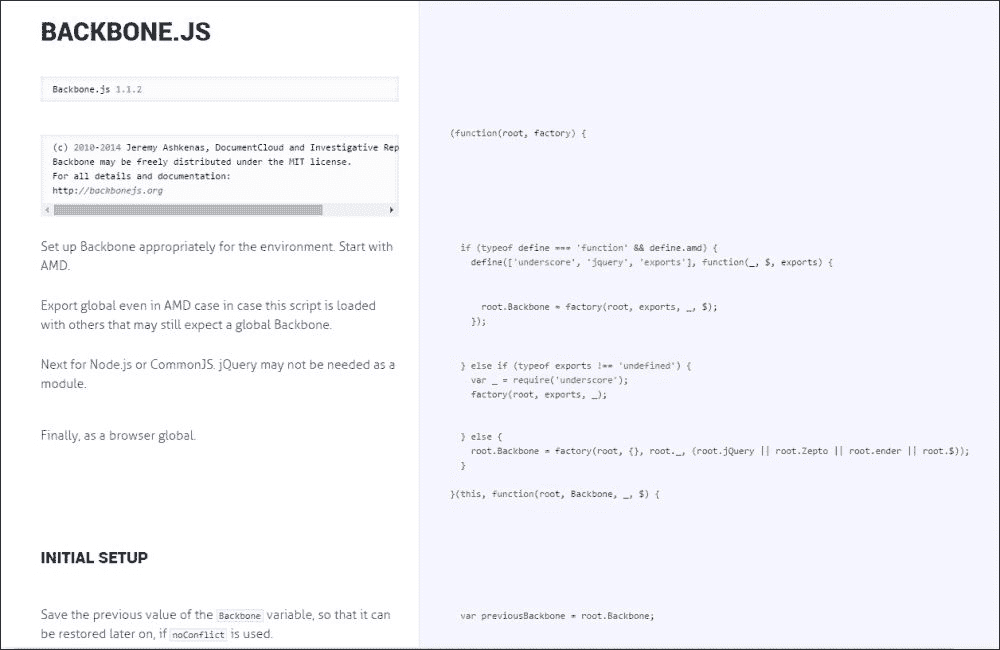

# 第九章。我在想什么？记录 Backbone 代码

在本章中，我们将考虑各种用于记录你的 Backbone 代码的选项，包括以下内容：

+   “非文档”的文档方法

+   如何在没有正式结构的情况下明确地记录你的代码

+   如何使用形式化的结构，如 JSDoc，明确地记录你的代码

+   如何使用 Docco，Backbone 创建者的一个替代文档工具'

# Backbone 和文档

文档在任何软件项目中都很重要，但在文档方面，Backbone 项目有一些独特的考虑因素。然而，在我们深入探讨这些考虑因素之前，重要的是要确定你为什么要记录你的代码，以及你打算使用什么策略来记录它。

许多开发者有一种错误的印象，认为文档是给其他开发者看的，但实际上，没有比这更远离真相的了。大多数软件不是一次性写成的，而是在一段时间内不断迭代。每个新版本都可能在前一个版本之后几天、几个月甚至几年后发生，当你回到几个月/几年前写的代码时，代码几乎看起来像是另一个人的作品。

由于这个原因，即使你是你团队中唯一的开发者，即使你确切地知道你代码库中每一行的当前工作方式，记录你的代码也很重要，至少是为了你未来的利益。进一步来说，如果你不是你团队中唯一的开发者，文档就变得更加重要，因为它也可以作为你和你同事之间的桥梁。

# 文档方法

记录 JavaScript 代码有三种主要方法，它们都不是万能的解决方案。你需要根据你团队的大小和项目的雄心来确定哪种方法对你和你的团队来说最有意义。

三种主要方法可以被称为非文档、简单文档和强大文档方法。

通常情况下，你的团队越大，这个团队所属的组织也越大，你就越有可能想要强大的文档，尽管大小并不是这里唯一需要考虑的因素。其他因素包括你的团队成员对外部文档的需求，以及是否有任何代码是面向客户的（例如，如果你为你的客户提供了一个公开的 API 来扩展你的应用程序）。

# 非文档方法

首先，让我澄清一下，非文档方法并不意味着完全避免文档。相反，它依赖于使用除明确代码注释之外的其他形式的文档。

例如，考虑以下代码行：

```js
var Book = Backbone.Model.extend();
```

现在，如果我们愿意，我们可以写一个注释来描述这一行代码，如下所示：

```js
/**
 * This defines a book model.
 */Book = Backbone.Model.extend();
```

然而，添加这样的注释并没有真正告诉我们什么我们不知道的事情，因为我们的变量名选择（`Book`）已经告诉我们这个类是什么。仅仅通过为我们的类选择一个描述性的变量名，我们就已经记录了它所做的事情，而不需要额外的文档。

然而，类变量的名称并不是唯一重要的名称。函数名，尤其是方法名，也可以在解释函数/方法做什么时非常有帮助。考虑以下：

```js
     bookNav: function() {
         router.navigate('bookPage', {silent: true, trigger: true});
    }
vs.:
     navigateSilentlyToBookPage: function() {
         router.navigate('bookPage', {silent: true, trigger: true});
    }
```

只需输入几个额外的字符，我们就消除了阅读方法定义以理解它的需要。进一步来说，在阅读时，这个特定的例子中的定义可能并不那么困难；然而，如果函数更长或更复杂，可能就不那么容易了。

函数可以用来传达文档的另一种方式是将它们分解成单独的函数。例如，假设我们有一个`View`方法，它增加了一个计数器，保存了一个`Model`，更新并渲染了另一个`View`方法，最后改变了 URL，如下所示：

```js
    example: function(router) {
        this.model.set('counter', this.model.get('counter') + 1);
        this.model.save();

        this.siblingView.model = this.model;
        this.siblingView.render();

        var url = this.url();
        router.navigate(url, {silent: true, trigger: false});
    }
```

命名这样的方法会有困难：

`"incrementCounterAndSaveModelAndUpdateAndRenderSiblingViewAndRefreshURL"`听起来并不顺口。你可以简化为`updateCounterAndRefresh`，但这样就会失去一些更冗长的名称提供的非文档化信息。

一个更好的方法是使用更简单的名称，但将方法的不同部分分离成它们自己的方法，如下所示：

```js
    incrementCounterAndSave: function() {
        this.model.set('counter', this.model.get('counter') + 1);
        this.model.save();
    },
    updateAndRenderSiblingView: function() {
        this.siblingView.model = this.model;
        this.siblingView.render();
    },
    refreshURL: function(router) {
        var url = this.url();
        router.navigate(url, {silent: true, trigger: false});
    },
    updateCounterAndRefresh: function(router) {
        this.incrementAndSaveCounter();
        this.updateAndRenderSiblingView();
        this.refreshURL(router);
    }
```

正如你所见，我们的`updateCounterAndRefresh`方法的内容现在几乎就像一个英语文档字符串，有效地记录了正在发生的事情，而不需要任何实际的文档。此外，如果我们想对这个代码进行单元测试（我们将在下一章讨论），使用这些单独的方法会比最初更容易。

此外，前面的代码只是一个相对简单的例子，而你的实际方法可能实际上比六行要长得多。在现实世界的项目中，利用使用许多（命名良好的）方法而不是长而单一的代码方法的技术尤为重要，因为这将大大提高代码的可读性和测试的便捷性。

类、函数和其他变量名不是非文档化的唯一形式。如果正确使用，文件名和文件夹结构也可以提供大量信息。考虑一个名为`Book.js`的文件。单独来看，我们无法知道这个文件是否包含一个`Book`模型、一个`Book`视图、两者都有，或者完全是其他东西。然而，如果这个文件被重命名为"`BookView.js`"，那就很明显了。同样，如果文件保留了名为"`Book.js`"的名字，但存储在名为"`views`"的文件夹中，内容也会很明显，而不需要任何额外的文档。

## 非文档化对其他方法的好处

在我们继续介绍其他两种文档方法之前，值得注意的是，我们刚才描述的策略并不仅在你选择非文档方法时有用。实际上，这对所有程序员都是极好的建议。无论你生成什么文档来补充你的代码，最终你和你同行开发者都将不得不与代码本身而不是文档一起工作。通过努力使代码尽可能易于阅读和指导，你提供了虽然与显式文档提供的不同，但同样非常有价值的益处，尤其是在长期来看。

# 简单的文档方法

非文档对于编写可维护的代码至关重要，但它确实有其局限性。例如，虽然你可以使用表达性的变量名来描述许多变量，但你不能使用它们来描述 Backbone 本身的部分。例如，当一个 `View` 接收一个 `model` 选项时，唯一更具有表达性地重命名它的方法就是创建一个全新的属性：

```js
var BookView = Backbone.View.extend({
    initialize: function() {
        this.bookModel = this.model;
    }
});
```

现在，上述代码并没有什么问题，但从某种意义上说，它跨越了 *代码作为文档* 和 *用代码替换文档* 之间的界限。在这些情况下，一个更自然的解决方案可能是简单地使用注释，如下所示：

```js
// This View takes a ""Book"" ModelBookView = Backbone.View.extend();
```

然而，许多程序员发现很容易错过这样的单行注释，因此他们只将它们保存下来以记录特定的代码行。对于类或方法文档，这些开发者依赖于一种特殊的多行注释形式，它以一个额外的前置星号以及（可选的）后续每行的前置星号标记：

```js
/**
 * This View takes a ""Book"" Model
 */BookView = Backbone.View.extend();
When used this way throughout your code, these documentation sections form easy-to-read alternating blocks, making it trivial to skim through to what you're looking for without having to actually read the code in between:BookView = Backbone.View.extend({
    /**
     * This ""foo"" method does foo stuff
     */
    foo: function() {
        doSomeFooStuff();
    },
    /*
     * This ""bar"" method takes a ""Baz"" argument and does bar stuff
     */
    bar: function(baz) {
        doBarStuffWith(baz);
    }
});
```

大多数现代代码编辑器也会将此类文档与代码的其他部分区分开来，使其更容易浏览。

通过使用这些多行注释来描述你的类和方法，以及使用单行注释来解释函数内部的复杂代码，你可以非常有效地记录 `View` 拥有的 `Model` 类别或哪些路由使用特定的 `View`。此外，虽然编写这样的注释确实比依赖非文档花费更多时间，但它们所花费的额外几秒钟可能会为你节省数小时甚至数天的工作时间。

# 强健的文档方法

上述两种方法中的任何一种都足以让大多数程序员在不花费太多时间编写文档的情况下获得文档的好处。然而，如果你正在寻找一个更通用的文档结构，或者如果你和你的团队不是文档的唯一受众，那么使用外部工具如 JSDoc 或 Docco 可能会更有益。

在大型组织中，不同团队负责代码的不同部分的情况并不少见。当一个团队需要使用另一个团队管理的组件或库时，第一个团队可能不想阅读第二个团队的代码，或者更确切地说，他们可能甚至没有访问权限。在这些情况下，稳健的文档可以通过提供一种方式，让团队在不直接阅读代码的情况下理解彼此的代码，从而非常有用。

另一个重要的场景是用户定制。随着 Backbone 所提供的强大和稳健的应用程序，通常只需一段时间，客户就会要求定制某些功能，或者如果他们自己不能编写 JavaScript，就会要求顾问为他们定制。在这些情况下，最佳解决方案通常是向客户公开代码的一部分以便他们操作，而这个公共定制 API 将需要文档，以便客户（或他们的承包商）可以学习如何使用它。

在这两种情况下，可以使用 JSDoc 或 Docco 这样的工具来生成单独的文档文件，这些文件可以在不共享代码本身的情况下共享。然而，与此同时，开发者仍然可以边编写代码边编写文档；他们不需要维护（例如）一个单独的 MS Word 文档。

许多团队也在他们的文档中使用 JSDoc 的结构，而实际上从未真正使用这个工具来生成面向外部的文档。对于这些团队，JSDoc 的主要好处在于其注解，这使得团队可以以类似的方式编写文档，并且以未来团队成员更可能理解的方式。

## JSDoc

JSDoc ([`www.usejsdoc.org`](http://www.usejsdoc.org)) 是最古老且最受欢迎的 JavaScript 文档工具。早在 1999 年，在 JSDoc 工具甚至存在之前，开发者就使用其语法（从 JavaDoc 借用）来记录非常早期的 JavaScript 代码。JSDoc 工具本身，现在已进入第三版，被整合到几个不同的其他工具中（包括 Google 的 Closure 编译器），并且几乎在所有主要的代码编辑器中都可以找到对其语法的支持。

使用 JSDoc，开发者可以轻松地将他的内联文档转换为外部 HTML 文件，如下面的截图所示：



JSDoc 通过依赖于文档字符串中包含的注解来工作。例如，考虑以下代码：

```js
    /**
     * This ""bar"" method takes a ""Baz"" argument and does bar stuff
     */
    bar: function(baz) {
        doBarStuffWith(baz);
    }
```

与使用上述代码不同，使用 JSDoc 的开发者会使用 `@param` 注解，如下所示：

```js
    /**
     * Does bar stuff
     * @param {Baz} baz this argument is used to do bar stuff
     */
    bar: function(baz) {
        doBarStuffWith(baz);
    }
```

`"@param` 注释告诉 JSDoc 该方法接受一个 *baz* 参数，并且它应该是一个 "`Baz`" 类的实例。完整的注释列表可以在 JSDoc 网站上找到，它们相当直接，所以我们在这里不会讨论所有内容。然而，其中两个（`@property` 和 `@param`）在与 Backbone 代码一起使用时可能会有些问题，所以让我们来看看如何正确使用它们。

让我们假设我们想要记录一个 Backbone `Model`。为了做到这一点，我们可能会编写以下代码：

```js
/**
  * This model represents a book in our application.
  * @class
  */
var Book = Backbone.Model({ ...
```

现在，让我们假设我们的 `Book Model` 可以有三个不同的属性：标题、描述和页数。现在的问题是，我们如何记录它们？JSDoc 中没有 `@attribute` 注释，因为 *属性* 是 Backbone 特有的，而 `@param` 注释似乎只能指定单个属性的参数；它不能（例如）告诉我们两个属性应该是字符串，而其他属性应该是整数。

幸运的是，可以通过使用多个 `@param` 或 `@property` 注释来解决这个问题（使用哪一个取决于你；因为 Backbone 为属性和选项都创建了属性，所以两者实际上都是参数和属性）。考虑以下内容：

```js
/**
  * This model represents a book in our application.
  * @param {object} attributes
  * @param {string} attributes.title book's title
  * @param {string} attributes.description description of the book
  * @param {integer} attributes.pageLength number of pages
  */Book = Backbone.Model({ ...
```

如果你只是非正式地使用 JSDoc（也就是说，你并不打算生成外部文档），你甚至可以通过省略初始的 `@param {object}` 属性注释来稍微简化上述内容。

## Docco

Docco([`jashkenas.github.io/docco/`](http://jashkenas.github.io/docco/)) 因其采取了与 JSDoc 完全不同的方法，并且是由 Backbone 本身的创造者（Jeremy Ashkenas）编写的而引人注目。与专注于创建 API 文档的 JSDoc 不同，Docco 专注于生成教程和/或解释给定代码块的工作原理。Docco 与 JSDoc 的不同之处还在于它使用单行注释，而不是多行注释来生成文档。

下面是使用 Docco 生成的文档示例；实际上，它是使用 Backbone 的源代码生成的（你可以在 Backbone 网站上找到原始版本）：



如前例所示，Docco 生成的文档有两列。在右边是正在记录的原始源代码，不包括任何注释，而在左边是与该源代码对应的注释。例如，以下是用于生成前例的 Backbone 的原始行：

```js
//     Backbone.js 1.1.2

//     (c) 2010-2014 Jeremy Ashkenas, DocumentCloud and Investigative Reporters & Editors
//     Backbone may be freely distributed under the MIT license.
//     For all details and documentation:
//     http://backbonejs.org

(function(root, factory) {

  // Set up Backbone appropriately for the environment. Start with AMD.
  if (typeof define === 'function' && define.amd) {
    define(['underscore', 'jquery', 'exports'], function(_, $, exports) {
      // Export global even in AMD case in case this script is loaded with
      // others that may still expect a global Backbone.
      root.Backbone = factory(root, exports, _, $);
    });

  // Next for Node.js or CommonJS. jQuery may not be needed as a module.
  } else if (typeof exports !== 'undefined') {
    var _ = require('underscore');
    factory(root, exports, _);

  // Finally, as a browser global.
  } else {
    root.Backbone = factory(root, {}, root._, (root.jQuery || root.Zepto || root.ender || root.$));
  }

}(this, function(root, Backbone, _, $) {

  // Initial Setup
  // -------------

  // Save the previous value of the `Backbone` variable, so that it can be
  // restored later on, if `noConflict` is used.
  var previousBackbone = root.Backbone;
```

Docco 吸引人的一个关键部分就是它的简单性：没有注释，甚至没有多行注释，只有普通的 `//` 单行注释。Docco 还很有价值，因为它生成的文档类型：如果你想创建教程或代码的遍历，Docco 比起 JSDoc 是一个更好的选择。

最终，你将使用哪种文档系统或系统将取决于你的需求和未来的期望。即使你选择了简单的文档，你也绝不能低估正确记录你的代码的需求。如果你这样做，未来的你（以及可能的其他同事）将会后悔。

当然，就像编程中的大多数事情一样，也可能有太多的文档。在添加文档时，你应该始终记住，随着你重构和更新代码，为该代码编写的任何文档都必须相应地进行更新。这当然不应该阻止你添加文档，考虑到它的许多好处，但在我们继续进行测试（它也有同样的缺点）之前，我们不应该不提及其持续维护的成本。

# 摘要

在本章中，我们学习了如何记录 Backbone JavaScript 代码，以及在进行文档记录时应关注的具体领域。我们探讨了三种不同的文档选项——非文档、简单文档和强大文档——并考虑了两种用于生成强大文档的流行工具：JSDoc 和 Docco。

在下一章中，我们将探讨如何测试你的 Backbone 代码。特别是，我们将探讨流行的测试运行框架 QUnit 和 Mocha，以及用于创建间谍、存根和模拟的 Sinon 库。
