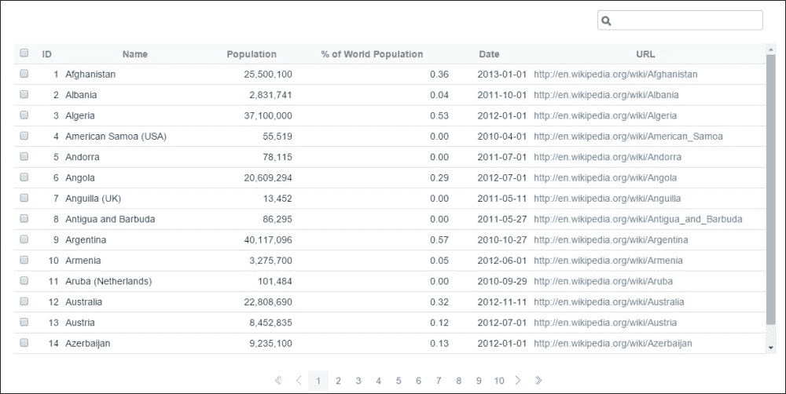

# 第十一章。（不）重新发明轮子 – 利用第三方库

在本章中，我们将简要介绍通用和 Backbone 特定的第三方库的混合，所有这些库都可以为 Backbone 开发者带来好处。特别是，我们将查看以下内容：

+   依赖管理工具 Require.js 和 Bower

+   表生成工具 Backbone Paginator 和 BackGrid

+   HTML 模板工具 Handlebars

+   任务自动化工具 Grunt

+   替代语言 CoffeeScript

+   通用 Backbone 工具库 BackSupport

# Backbone 生态系统

在 Backbone 存在的五年间，其流行度导致了数百个相关第三方库的开发。此外，还发布了众多其他通用库，这些库对 Backbone 开发者来说也可能非常有价值。虽然我们没有足够的空间深入探讨这些库，但本章将为你提供每个库的预览，以便你可以识别出对你最有益的库。

在本章中，当我们介绍各个库时，请记住，对于每个我们预览的库，都存在几个（有时甚至几十个）我们没有介绍的竞争性库。虽然我们可以尝试列出每个类别中每个可用的库，但这样的列表会很快过时，因此我们选择只关注最受欢迎的库。如果本章中的任何库看起来对你有用，我们强烈建议你在互联网上搜索，看看还有哪些类似的库可供选择，因为你可能会找到一个更适合你的库。

# 使用 RequireJS 进行依赖管理

在现代 IDE 中，开发者只需输入文件名的一两个字符就可以打开文件。这个功能，加上保持代码组织的一般愿望，促使开发者将代码分离成多个文件。在 Backbone 中，这通常意味着为每个 `Collection`、`Model`、`View` 和 `Router` 创建一个文件，即使在小型项目中，这也可能积累很多文件。

所有这些文件都带来了两个问题。首先，每个文件都需要单独下载，正如我们在第八章《扩展：确保复杂应用程序的性能》中学到的，浏览器一次只能下载 2 到 8 个文件。其次，由于不同文件之间的依赖关系（例如，“视图 A”需要“集合 B”，“集合 B”需要“模型 C”，依此类推），文件加载的顺序可能会变得越来越难以管理。**RequireJS** ([`requirejs.org/`](http://requirejs.org/))解决了这两个问题。

RequireJS 通过将你的代码组织成`模块`来实现这一点。每个模块可以可选地依赖于一个或多个其他模块，而 RequireJS 将负责以保留所有依赖关系的方式将这些模块拼接在一起。RequireJS 还提供了一个相关的工具，称为 RequireJS 优化器，它允许你将多个模块合并成一个文件。优化器还可以“压缩”你的代码，以及“混淆”它，使其他人更难理解（以防止竞争对手阅读你的源代码文件）。

这里是一个示例 RequireJS 模块，用于 BookList `视图`类：

```js
// All RequireJS modules start by calling a special "define" function
define([
    // The module's dependencies are the first argument
    'collections/Books', // dependency on collections/Books.js
    'models/Book'       // dependency on models/Book.js

// The function that defines the module is the second argument
], function(
    // The variable names for each dependency make up the arguments to that function    Books, // alias the "collections/Books" module as "Books"
    Book   // alias the "models/Book" module as "Book"
) {
    // The actual module itself goes here
    var BookList = Backbone.View.extend({
        // Logic for our BookList View would go here; presumably it
        // would use both Book and Books
    });
    // To tell RequireJS what variable this module should "define" simply return
    // that variable at the end
    return BookList;
    // in other words, whatever is returned will be what is passed in
    // to other modules that depend on this one
});
```

RequireJS 管理依赖项的风格被称为**AMD**风格。还有一种竞争风格，称为**Common JS**，它被其他依赖项管理库（如 Browserify 或 Hem）使用。Common JS 模块看起来显著不同；以下是我们之前示例使用 Browserify 的 Common JS 语法的重写：

```js
// Dependencies are brought in by using the "require" function
// The module aliases are defined on the same line using the 
// standard JavaScript syntax for declaring a variable
var books = require('collections/Books');
var book = require('models/Book');
// Just as before, the contents of the module are defined using
// standard JavaScriptBookList = Backbone.View.extend({
    // Logic for our BookList View would go here; presumably it would
    // use both Book and Books
});
// Instead of returning what the module defines, in CommonJS modules
// are "exported" by assigning them to a "module.exports"module.exports.BookList = BookList;
```

这种方法的缺点是，模块的实际顺序并没有为你处理，就像在 RequireJS 中那样。相反，必须使用`require`语句单独指定模块的顺序：

```js
<script src="img/fileWithModuleDefinitions.js"/>
<script>
require('collections/Books');
require('models/Book');
require('views/BookList');
</script>
```

# 使用 Bower 进行外部依赖项管理

除了使用 RequireJS 或类似库来管理代码的依赖项之外，许多程序员还使用另一个名为**Bower** ([`bower.io/`](http://bower.io/))的工具来管理他们的外部库依赖项。和 Bower 与 Python 的`pip`或 Node.js 的 NPM 类似，Bower 提供了一个简单的命令行界面，可以轻松安装外部库。值得注意的是，NPM 本身也可以用于管理客户端上的库，但这个工具主要设计用于服务器端开发者，而 Bower 主要设计用于客户端。要安装一个库，例如 jQuery，你只需在命令行中运行以下命令：

```js
bower install jquery
```

多个 Bower 依赖项可以存储在一个`bower.json`文件中，允许你使用单个命令安装应用程序的所有依赖项。以下是一个此类文件可能的样子：

```js
{
    "name": "your-project",
    "version": "0.0.1",
    "ignore": [
        "**/*.txt"
    ],
    "dependencies": {
        "backbone": "1.0.0",
        "jquery": "~2.0.0"
    },
     "devDependencies": {
        "mocha": "¹.17.1"
    }
}
```

正如你所见，前面的文件定义了项目的依赖关系。它包括 Backbone 和 jQuery 但不包括 Underscore；作为 Backbone 的依赖项，Underscore 将被自动下载（jQuery 在技术上不是 Backbone 的依赖项，因为库在没有它的情况下也能工作，所以我们必须单独要求它）。它还允许我们将 Mocha 作为`devDependency`包含进来，这意味着它将在开发环境中下载，但不在生产环境中。使用这样的需求文件可以让你将外部库从源代码控制系统中分离出来，并在新版本发布时轻松更新它们。它还允许你轻松管理这些库的不同构建版本（例如，调试版本与压缩版本）。

# 使用 Backbone Paginator 进行分页

许多 Backbone 开发者面临的一个非常常见的任务是对分页数据进行渲染。例如，你可能有一个可以返回数百个结果的搜索页面，但你只想显示前二十个结果。为此，你本质上需要两个 `Collection` 类：一个用于所有结果，另一个用于正在显示的结果。然而，在这两个之间切换可能会很棘手，你可能实际上并不想一次性获取数百个结果。相反，你可能只想获取前二十个，但仍然能够知道总共有多少个结果，以便你可以将此信息显示给用户。

Backbone Paginator ([`github.com/backbone-paginator/backbone.paginator`](https://github.com/backbone-paginator/backbone.paginator)) 是一个专门为这个目的创建的 `Collection` 类。Backbone Paginator 最初是两个独立的库，但这两个库已经合并，使 Backbone Paginator 成为处理 Backbone 中分页数据的主要工具。

Backbone Paginator 可以在以下三种模式之一中使用：

+   `client`：当你想一次性获取整个 `Collection` 时使用。

+   `server`：当你想将大部分 `Collection` 留在服务器上，只获取相关部分时使用。

+   `infinite`：用于创建一个 `Collection` 类来支持类似 Facebook 的无限滚动视图。

要使用 Backbone Paginator，你只需扩展其 `PageableCollection` 类来创建你自己的可分页 `Collection` 类，如下所示：

```js
var BookResults = Backbone.PageableCollection.extend({
    model: BookResult,
    queryParams: {
        currentPage: 'selected_page',
        pageSize: 'num_records'
    },
    state: {
        firstPage: 0,
        currentPage: 5,
        totalRecords: 500
		},
		url: 'www.example.com/api/book_search_results'
});
```

正如你所见，一个 `PageableCollection` 类与一个普通的 `Collection` 类非常相似：它有 `model` 和 `url` 属性，可以扩展，等等。然而，它也有两个特殊的属性。

第一个属性是 `queryParams`，它告诉 `PageableCollection` 如何解释服务器响应中的分页信息，这与 `parse` 方法通常告诉 Backbone 如何解释服务器响应的方式非常相似。第二个属性是 `state`，`PageableCollection` 使用它来跟踪用户当前所在的页面、每页有多少个结果等等。

完整的 Backbone Paginator 库为 `queryParams` 和 `state` 提供了几个其他选项，以及一系列分页方法，如 `getPage`（用于跳转到特定结果页）或 `setSorting`（用于更改结果的排序方式）。如果你想自己实现分页视图，你可以在 Backbone Paginator 的 GitHub 页面上找到完整的文档。然而，实际上，你可能根本不需要创建自己的分页数据 `View`，因为已经有一个非常强大的现有 `View` 可以利用：BackGrid。

# 使用 Backgrid.js 渲染表格

有几个不同的专门用于在 Backbone 中渲染表格的 `View` 库，还有许多流行的非 Backbone 特定库（如 `jqGrid` 或 `DataTables`），你可以轻松地将它们用于 Backbone。然而，BackGrid ([`backgridjs.com/`](http://backgridjs.com/)) 从其他库中脱颖而出，因为它结合了强大的功能集、简单的设计以及对 Backbone Paginator 的原生支持。

下面是一个使用 BackGrid 生成的表格示例：



要使用 BackGrid，你只需像扩展任何其他 `View` 一样扩展它，然后使用一个额外的 `columns` 选项来实例化它：

```js
var BookResultsGrid =  Backgrid.Grid.extend();
var grid = new BookResultsGrid({
    columns: [
        {name: 'bookTitle', label: 'title', cell: 'string'},
        {name: 'numPages', label: '# of Pages', cell: 'integer'},
        {name: 'authorName', label: 'Name of the Author',
         cell: 'string'}
    ],
    collection: bookResults
});
grid.render();
```

如你所见，你提供的额外 `columns` 选项告诉 BackGrid 使用 `Model` 的哪个属性来为列的数据（`name`）使用，该列的标题文本应该是什么（`label`），以及 BackGrid 应如何格式化该列的单元格（`cell`）。一旦你向 BackGrid 提供了这些列和一个 `Collection` 类，BackGrid 将使用提供的 `Collection` 中的每个 `Model` 来生成一个 `<tr>` 元素，从而生成一个 `<table>` 元素作为其 `el`。

如果你只想显示信息的表格，那么你只需要做这些，但 BackGrid 也可以选择性地用于编辑信息。要使用此功能，你只需在每个你想使其可编辑的列中传递一个额外的 `editable: true` 选项。当 BackGrid 渲染其表格时，用户将能够点击可编辑列中的任何单元格以将选定的单元格切换到 *编辑* 模式（例如，将纯文本替换为 HTML `<input>` 标签），并且用户所做的任何更改都将自动更新到相应的 `Model`。

BackGrid 还具有许多其他功能，例如通过扩展 Backgrid.Cell 定义自己的自定义单元格类型的能力。你可以在 Backgrid 的网站上找到这些功能的完整列表，该网站拥有优秀的教程式文档和 API 参考文档。

# 使用 Handlebars 模板

正如我们在第五章中讨论的，“使用视图添加和修改元素”，使用模板来渲染视图的 HTML 提供了许多好处。虽然你可以简单地使用 Underscore 的 `template` 函数，但如果你需要一个更强大的模板语言，有许多不同的库可供选择。对于本章，我们将使用 Handlebars ([`handlebarsjs.com/`](http://handlebarsjs.com/)) 作为我们的模板引擎。你可能还想考虑的其他库包括 Mustache ([`github.com/janl/mustache.js`](https://github.com/janl/mustache.js))、Embedded JS ([`embeddedjs.com/`](http://embeddedjs.com/)) 或 Hogan.js ([`twitter.github.io/hogan.js/`](http://twitter.github.io/hogan.js/))。

Handlebars 是从另一个模板库（Mustache）创建的，它提供了大量的模板逻辑，形式为“辅助函数”。例如，以下是一个 Handlebars 模板，它使用“each”辅助函数和“if”辅助函数来渲染一个以“先生”或“女士”开头的人名列表，具体取决于个人的性别：

```js
<ul>
    {{#each people}}
    <li>
        {{#if this.isMale}}Mr.{{else}}Ms.{{/if}} {{this.lastName}}
    </li>
    {{/each}}
</ul>
```

Handlebars 还允许你定义自己的自定义辅助函数，这使得它非常易于扩展。这些辅助函数非常灵活，如果你愿意，你可以在模板中创建一个完整的子语言。

一旦你编写了一个模板，你既可以将其直接包含在你的 JavaScript 代码中（用引号括起来以使其成为一个有效的字符串），也可以将其存储在单独的文件中，并使用 RequireJS 或类似工具将其引入。然后，编译模板并编写一个使用此模板的`View render`方法就变得简单了，如下所示：

```js
var template = '<ul>' +
    '{{#each people}}' +
    '<li>' +
        '{{#if this.isMale}}Mr.{{else}}Ms.{{/if}} {{this.lastName}}' +
    '</li>' +
    '{{/each}}' +
'</ul>';
var compiledTemplate = Handlebars.compile(template);
var TemplatedView = Backbone.View.extend({
    render: function() {
        var templatedHtml = compiledTemplate(this.model.toJSON());
        this.$el.html(templatedHtml);
        return this;
    }
});
new TemplatedView({
    model: new Backbone.Model({isMale: 'true', lastName: 'Smith'})
}).render().$el.html(); // will be "Mr. Smith"
```

# 使用 Grunt 自动化任务

在许多软件项目中，有一些任务通常是自动化的。例如，就像传统的 C++或 Java 项目需要将源代码编译成字节码一样，JavaScript 项目可能需要使用 RequireJS 或 CoffeeScript 来编译其源代码。项目可能还需要连接文件、运行 linting 程序以验证源代码，或者组装其他 Web 组件，如精灵图像文件或由 SCSS/Less 生成的 CSS 文件。

大多数这些任务都不是语言特定的：你实际上不需要使用 JavaScript 代码来启动 RequireJS 优化器；你只需要一个命令行。正因为如此，可以使用为另一种语言（如 Java 的 Ant 或 Maven，或 Python 的 Fabric）设计的工具来自动化这些任务，如果你的服务器端团队使用这种语言，那么让每个人都使用相同的工具可能会有所帮助。

然而，如果你没有服务器端团队（或者如果该团队使用`Node.js`），你可能希望有一个特定的 JavaScript 构建工具，这就是 Grunt 的用武之地。以下是一个可以用来运行 RequireJS 优化器的示例 Grunt 配置文件：

```js
module.exports = function(grunt) {
    grunt.initConfig({
        requirejs: {
            app: {
                options: {
                    findNestedDependencies: true,
                    mainConfigFile: 'public/js/config.js',
                    baseUrl : 'public/js',
                    name : 'app',
                    out : 'build.js',
                    optimize : 'none'
                }
            }
        }
    });
    grunt.loadNpmTasks('grunt-contrib-requirejs');
    grunt.registerTask('default', ["requirejs"]);
};
```

虽然对上述代码的完整解释超出了本书的范围，但可以说，通过使用此配置文件，你可以在命令行中运行单个命令来调用 RequireJS 优化器。更重要的是，你可以将 RequireJS 优化器作为整个部署过程的一步，然后通过单个命令调用整个过程。你还可以使用 Grunt 为不同的环境设置不同的流程，例如为设置开发环境设置一个流程，为设置生产服务器设置另一个流程。

# 使用 CoffeeScript 的新语法

你可能会认为作为 Backbone（以及**Underscore**和**Docco**）的创建者，Jeremy Ashkenas 手头的工作已经足够多了……但你会错的。在这三个库之间创建的过程中，Jeremy 还找到了时间创建一种全新的编程语言，称为**CoffeeScript**([`coffeescript.org/`](http://coffeescript.org/))。

CoffeeScript 对许多 Web 开发者来说很有趣，因为它具有以下两个关键特性：

1.  CoffeeScript 编译成 JavaScript，这意味着你可以用它进行开发，然后将它编译成用户浏览器真正能理解的语言。

1.  CoffeeScript 提供的语法和功能集与 Python 或 Ruby 等语言比与“纯”JavaScript 有更多共同之处。

这最好通过例子来解释。以下是如何在 CoffeeScript 中创建一个`View`类，用于`h1`元素：

```js
class HeaderView extends Backbone.View
    tagName: 'h1'
    initialize: ->
        @render
    render: ->
        $(@el).text 'Hello World!'
header = new  HeaderView
```

这里是我们刚刚展示的一些关键差异：

+   CoffeeScript 有自己声明类的语法。

+   CoffeeScript 使用缩进来标记函数的开始/结束位置，而不是使用花括号("`{}`")。

+   CoffeeScript 使用`->`来声明函数，而不是`function() {}`，`this`可以引用为`@`，函数调用中的括号是可选的。

这些（以及许多其他）特性使 CoffeeScript 在 JavaScript 之上有了显著的改进。然而，使用它也有一个缺点。因为它编译成 JavaScript，所以调试可能很棘手，因为当浏览器报告错误时，它将使用 JavaScript 行号而不是 CoffeeScript 行号。此外，当使用浏览器的调试器时，你将遍历 JavaScript 代码，而不是 CoffeeScript 代码。虽然一种名为“源映射”的新技术可以帮助减少这些问题，但它并不能完全消除它们。

如果你愿意忍受上述不便，CoffeeScript 可以为你提供一套语法和功能集，而 JavaScript 本身在许多年内甚至可能永远都不会有。此外，由于它是由 Jeremy Ashkenas 创建的，你可以放心，Backbone 将始终与 CoffeeScript 兼容。事实上，Jeremy 为 Backbone 添加了至少一个功能，即隐藏的`__super__`属性，专门用于支持 CoffeeScript。

# 使用 BackSupport 让生活更轻松

几年前我开始使用 Backbone 时，我受到启发编写了 BackSupport ([`github.com/machineghost/BackSupport`](https://github.com/machineghost/BackSupport))，以帮助消除我发现自己在反复编写的许多样板代码。例如，考虑这个基本的`View`类：

```js
var BookView = ParentBookView.extend({
    className: ParentBookView.prototype.className + ' book-view',
    initialize: function(options) {
        this.template = options.template ;
        if (!this.template ) {
            throw new Error('The template option is required!');
        }
        _.bindAll(this, ''render');
    },
    render: function() {
        this.$el.html(this.template(this.model.toJSON()));
   }
});
```

现在，如果我们能将所有这些通用代码缩减到只针对我们类的部分，那会怎样？这正是 BackSupport 发挥作用的地方。让我们看看使用 BackSupport 重新创建的相同`View`类：

```js
BookView = ParentBookView.extend2({
    boundMethods: ['render'],
    className: "book-view",
    propertyOptions: ['template'],
    requiredOptions: ['template'],
});
```

如你所见，BackSupport 简化了我们的许多逻辑，以至于我们甚至在第二版中都不需要`initialize`方法！

这里展示了所有 BackSupport 的功能：

+   `extend2`：Backbone 的 `extend` 的这种替代形式足够智能，可以合并而不是替换诸如 `className`、`events` 或 `defaults` 这样的属性。这允许您更轻松地创建使用这些属性的子类，而不会丢失父类中的值。

+   `boundMethods`：BackSupport 将自动对包含在这个属性中的每个方法调用 `_.bindAll`，因此我们不需要在 `initialize` 方法中手动执行。

+   `propertyOptions`：BackSupport 将自动将包含在这个属性中的任何选项转换为这个类实例的新属性，从而让我们免于在 `initialize` 中进行 `this.foo = options.foo` 的繁琐操作。

+   `requiredOptions`：如果类实例化时没有提供这些选项，BackSupport 将抛出错误，这为我们提供了一个简单的方法来确保它们被提供，而无需添加额外的 `initialize` 逻辑。

+   `render`：BackSupport 提供了一套方法，使使用模板变得更加容易。这些方法对您使用的模板系统完全无关，要选择特定的模板系统，您只需要覆盖相关的 BackSupport 方法。

虽然这个简单的例子展示了 BackSupport 提供的功能，但它还拥有许多其他出色的便利功能，您可以在其 GitHub 页面上了解更多信息。

# 摘要

在本章中，我们了解了 Backbone 社区提供的各种工具。特别是，我们探讨了 RequireJS 和 Bower 用于依赖管理，Backbone Paginator 和 BackGrid 用于渲染分页表格，以及 Handlebars 用于模板。我们还探讨了使用 Grunt 进行构建管理，CoffeeScript 用于替代语法，以及作者自己的工具 BackSupport，用于解决 Backbone 中许多小不便的通用解决方案。

在下一章中，我们将通过回顾本书中涵盖的所有内容来总结全文。我们还将简要探讨如何将所学知识应用于实际案例。最后，我们将探讨更多关于 Backbone 的学习资源。
