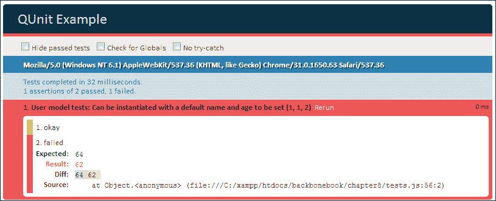

# 第八章：单元测试、存根、间谍和模拟你的应用

大多数开发者认为测试是必要的，但现实中只有少数人真正进行测试驱动开发。测试是 JavaScript 开发过程中的一项最佳实践。因此，我们决定包括一个关于如何对基于 Backbone 的应用程序进行单元测试的章节。

许多流行的测试库，如 `QUnit`、`Jasmine`、`Mocha` 和 `SinonJS`，都可用于单元测试 JavaScript 应用程序。在本章中，我们将向你展示如何使用 `QUnit`，这是一个简单但强大的测试平台，学习起来也很容易。在后一部分，我们将探讨 `SinonJS` 以了解测试间谍、存根和模拟。`QUnit` 和 `SinonJS` 一起为测试应用中的每个部分提供了一个强大的工具。本章要讨论的主要内容包括：

+   **为什么单元测试很重要**：测试是一种习惯。在开发过程中继续这样做可能最初需要额外的时间，但在团队工作或开发复杂应用程序时，这是必不可少的。

+   **使用 QUnit 进行测试**: 我们将探讨 `QUnit` 的基本方面，并了解如何将其用于 `Backbone.js` 组件。

+   **使用 SinonJS 进行间谍、存根和模拟**: 在单元测试中，监视 JavaScript 函数的行为并在需要时从测试环境中控制其行为是绝对必要的。我们将简要探讨这个概念，使用 `SinonJS` 测试框架。

# 理解单元测试为什么重要

如果你已经知道测试的好处，并在开发 JavaScript 应用程序时遵循最佳实践，你可以跳过这一部分。如果你仍然想知道为什么你应该在实际编写干净且易于维护的代码时测试你的应用程序，以下是一些需要考虑的原因：

+   测试永远不会浪费时间。你不需要反复运行代码来查看它是否工作。你可以一次性运行所有测试用例来查看是否一切按预期工作。测试让你有信心代码工作正常。

+   单元测试创建和运行都非常快。

+   更新你的代码无需担忧。你的测试将告诉你函数是否按预期工作。你会发现这非常有帮助，尤其是在团队工作中。

+   一旦你开始为你的代码编写单元测试，你很快会发现你正在编写比以前更模块化、更灵活、更易于测试的代码。

+   在 **测试驱动开发**（**TDD**）中，你首先编写失败的测试用例，然后开发代码。在这种情况下，一个通过测试的用例确保你开发的代码没有问题地正常工作。

测试很有趣。当然，它并不容易，而且不是一天之内就能掌握的。它也不太难——许多开发者都在做这件事，你也可以做到。

# 使用 QUnit 进行测试

`QUnit` ([`qunitjs.com`](http://qunitjs.com))，由 jQuery 团队维护的一个轻量级单元测试框架，与其他框架相比，它相当容易使用。本书不会详细讨论 `QUnit`，但我们将了解它的简单功能，并探讨我们如何使用它与我们的 Backbone 组件一起使用。

断言是任何单元测试框架中最基本的元素。您需要比较您的实际实现值与测试产生的结果。断言是提供这种比较功能的方法。`QUnit` 只有八个断言；我们将在下一节中使用其中一些。让我们在这里讨论几个：

+   `ok (state, message)`: 如果第一个参数为真，则通过

+   `equal (actual, expected, message)`: 如果 `actual` 和 `expected` 相等，则返回 true

+   `deepEqual (actual, expected, message)`: 这是一个深度递归比较断言，它作用于原始类型、数组、对象、正则表达式、日期和函数

+   `strictEqual (actual, expected, message)`: 这是一个严格的类型和值比较断言

+   `throws (block, actual, message)`: 这是一个断言，用于测试当运行回调时是否抛出异常

还有几个断言：`notEqual()`、`notDeepEqual()` 和 `notStrictEqual()`。这些断言的功能与它们的对应项正好相反。除此之外，`QUnit` 还有一系列用于启动测试的测试方法。它们如下：

+   `asyncTest()`: 这将添加一个异步测试来运行

+   `expect()`: 这指定了在测试中预期运行多少个断言

+   `module()`: 这包含在单个标签下的相关测试组

+   `test()`: 这将添加一个要运行的测试

设置 `QUnit` 相对直接。首先，我们将创建一个 `test` 目录并将其放在我们的项目目录中。这个 `test` 文件夹将包含我们项目的所有测试文件。然后，在这个文件夹内部，我们将创建一个 HTML 文件，它将在我们的浏览器中显示所有测试结果。通常，`QUnit` 会提供 `qunit.js` 和 `qunit.css` 文件。您只需在您的 HTML 文件中包含 QUnit 网站上提供的以下代码片段（[`qunitjs.com`](http://qunitjs.com)），然后您就完成了 `QUnit` 的设置：

```js
<!DOCTYPE html>
<html>
<head>
  <meta charset="utf-8">
  <title>QUnit Example</title>
  <link rel="stylesheet" href="/resources/qunit.css">
</head>
<body>
  <div id="qunit"></div>
  <div id="qunit-fixture"></div>
  <script src="img/qunit.js"></script>
  <script src="img/tests.js"></script>
</body>
</html>
```

`tests.js` 文件将包含所有您的测试用例。根据您的需求，您可以拥有多个测试文件。如果您发现这一部分有点复杂，难以理解所有断言方法的定义，请不要担心。在下一节中，我们将向您展示一个简单的 `QUnit` 测试用例，其中包含这些断言的一些，您将看到开始使用 `QUnit` 是多么简单。

## 执行基本测试用例

我们学习了 `QUnit` 的基本和重要的 API 方法。现在，让我们使用其中的一些方法来创建一个简单的测试用例。我们将编写一个检查一个数字是否为素数的方法。然后我们将从我们的测试中对 `isPrime()` 方法进行几次调用，并如下分析结果：

```js
// Function to check a prime number
function isPrime(number) {
  var start = 2;
  while (start <= Math.sqrt(number)) {
    if (number % start++ < 1) return false;
  }
  return number > 1;
}

test('Test a prime number', function () {
  // tells you how many assertions are there in the test
  expect(2);

  // following two assertions check with two numbers 
  // whether they are prime number or not
  ok(isPrime(3), '3 is a prime number');
  equal(isPrime(8), false, '8 is not a prime number');
});
```

以下代码片段中共享了一个相当简单的示例，以展示如何轻松地开始使用 `QUnit`。我们首先使用 `expect()` 方法来确保在这个测试用例中我们将进行两个断言。如果我们进行超过两个断言，那么这个测试将失败。现在，这两个断言，即 `ok()` 和 `equal()`，使用两个不同的输入调用 `isPrime()` 方法，并检查这些输入值是否为素数。当你运行这个测试时，你可以看到两个测试都通过了。

## 理解 QUnit 的模块（module）、setup 和 teardown 方法

为了组织多个测试用例，我们需要一种能够提供块结构并将多个测试组合在一起的东西。`module()` 方法允许我们将测试用例分组在一起。此外，它引入了两个方法，`setup()` 和 `teardown()`，它们在每个测试用例前后运行，如下面的代码片段所示：

```js
// First module
module('1st module', {
  setup: function () {
    // Runs before each test
  },
  teardown: function () {
    // Runs after each test
  }
});
test('Test 1', function () {});
test('Test 2', function () {});

// Second module
module('2nd module');
test('Test 1', function () {});
```

当你需要实例化一个将在多个测试中使用的对象（例如视图或集合）时，`setup()` 方法非常有用。另一方面，`teardown()` 方法主要用于清理你添加为全局变量的资源。

## 使用 QUnit 测试 Backbone.js 组件

现在我们已经了解了 `QUnit` 的基础知识，让我们尝试使用一些 Backbone 组件。我们首先从 Backbone 模型开始，我们将创建一个简单的 `User` 模型，如下面的代码所示：

```js
var User = Backbone.Model.extend({
  defaults: {
    name: 'Swapan Guha',
    age: 56
  }
});

module('User model tests', {
  setup: function () {
    this.user = new User();
    this.user.set('age', 62);
  }
});

test('Can be instantiated with a default name and age to be set', function () {
  equal(this.user.get('name'), 'Swapan Guha');
  equal(this.user.get('age'), 64);
});
```

在这里，我们使用 Backbone 模型的一个默认值和我们在 `setup()` 方法中更改的另一个属性进行了测试，但故意使用另一个值进行测试。因此，这个测试应该因为一个断言案例而失败。以下截图显示了它在浏览器中的样子：



# 使用 SinonJS 的测试间谍、存根和模拟

我们使用单元测试来测试应用程序的一个组件。这个组件可以是一个函数、一个对象、一个变量，或者任何尚未知的任何结果，而你的单元测试想要确保该特定组件是否运行良好。通常，除了测试单独的组件外，你可能还会发现测试方法的行为同样重要。例如，一个方法被调用的次数、它返回的内容、是否抛出了任何异常、它被调用的参数等等。为了执行这些类型的测试，我们使用测试间谍、存根和模拟。

有一些测试库支持测试间谍、桩和模拟。然而，我们发现`SinonJS`非常易于使用，并且也很健壮。`SinonJS`与`QUnit`无缝工作，你也可以与或不与`QUnit`一起使用它。`SinonJS`在其网站上给出的定义如下：

> 独立的 JavaScript 测试间谍（spies）、桩（stubs）和模拟（mocks）。无依赖，与任何单元测试框架兼容。

## 使用间谍进行测试

我们首先需要了解什么是间谍。根据`SinonJS`网站上的定义，间谍如下：

> 测试间谍是一个记录所有调用参数、返回值、`this`的值以及抛出的异常（如果有）的函数。测试间谍可以是一个匿名函数，也可以是包装现有函数的函数。

所以你的下一个问题应该是为什么应该使用间谍。我们使用测试间谍来测试回调和其他方法的行为，以及了解它们是如何工作的。一旦你查看与间谍相关的某些 API 方法，你将找到更详细的答案：

+   `called()`: 如果间谍至少被调用一次，则返回 true

+   `calledOnce()`: 如果间谍正好被调用一次，则返回 true

+   `returned()`: 如果间谍至少一次返回了提供的值，则返回 true

这些是间谍 API 支持的少数方法。希望现在你能理解为什么使用间谍——它允许你测试函数的多个特性，了解它是否只被调用一次，或者检查它返回的值。间谍允许你测试函数的完整流程的每一个可能性。现在让我们看看如何从以下代码片段中使用间谍：

```js
// A User model definition
var User = Backbone.Model.extend({
  defaults: {
    name: ''
  },

  // Split the name to provide an array of first and last name
  getNameAsArray: function () {
    return this.get('name').split(' ');
  }
});

test('should call getNameAsArray and return an array',function () {
  this.user = new User({
    name: 'Krishnendu Saha'
  });

  // Added a spy on the the "getNameAsArray" method
  sinon.spy(this.user, 'getNameAsArray'); // or this.spy()
  this.user.getNameAsArray();

  // We check whether the method is called only once
  ok(this.user.getNameAsArray.calledOnce);

  // We check whether the returned value of this 
  // method is an array
  equal(_.isArray(this.user.getNameAsArray.returnValues[0]),true);
});
```

我们使用了相同的`User`模型，并为其添加了一个`getNameAsArray()`方法。我们监视了这个方法来测试它是否只被调用一次并返回一个数组。之前的测试用例通过得很好。

因此，你可以使用间谍来验证以下任何或所有情况：

+   检查回调的调用

+   验证回调是否以特定参数执行

+   验证内部函数是否提供正确的返回值

+   验证某种简单的调用行为

## 使用桩进行测试

另一方面，测试桩（test stub）是从间谍（spy）扩展而来，并为其添加了一些额外的功能。它是一个具有预编程行为的函数，并支持完整的间谍 API。它被用来替换（或模拟）现有方法的某些行为。当你想要防止直接调用某个特定方法，或者为了测试错误处理而强制方法抛出错误时，它非常有用。和间谍一样，桩可以是匿名的，也可以包装现有的函数。当用桩包装现有函数时，原始函数不会被调用。

一个匿名桩可以定义为如下：

```js
var stub = sinon.stub();
```

作为对象方法的包装器，它可以定义为如下：

```js
var stub = sinon.stub(object, "method");
```

在这里，函数`object.method`被替换为一个匿名存根函数。你还可以将一个额外的函数作为`stub()`函数的第三个参数添加，它将作为`object.method`的间谍，并替换原始方法如下：

```js
var stub = sinon.stub(object, "method", function(){});
```

为了通过一个真实示例了解间谍是如何工作的，我们可以使用之前使用的相同的`User`模型。如下代码片段所示：

```js
// We will use the same User model definition here

module("Should work when getNameAsArray method is called", {
  setup: function () {
    this.user = new User();

    // Use a stub to replace the getNameAsArray method
    this.userStub = sinon.stub(this.user, "getNameAsArray");
    this.userStub.returns([]);
  },

  // Restore the original method
  teardown: function () {
    this.userStub.restore();
  }
});

test('should call getNameAsArray and must return an empty array', function () {
  this.user.getNameAsArray();

  // Should return an empty array
  equal(_.isArray(this.user.getNameAsArray.returnValues[0]), true);
  equal(this.user.getNameAsArray.returnValues[0].length, 0);
});
```

在这里，我们存根了`User`模型的`getNameAsArray()`方法，并返回一个空数组。所以当你调用`getNameAsArray()`方法时，*不是方法而是存根将被调用*。我们确保存根返回一个空数组。

现在的测试就像我们之前做的那样简单。我们只需在`User`实例上调用`getNameAsArray()`方法，并检查返回值的长度。

## 使用模拟进行测试

> 模拟（以及模拟期望）是具有预编程行为（如存根）的假方法（如间谍），以及预编程的期望。如果模拟没有被按预期使用，它将使你的测试失败。

这是`SinonJS`网站上给出的模拟定义([`sinonjs.org/docs/#mocks`](http://sinonjs.org/docs/#mocks))。模拟与存根非常相似，但它们自带内置的期望。它们实现了间谍和存根 API。使用模拟，你可以定义测试中应该发生的所有期望。当所有这些事情都完成时，你断言这些事情是否按照计划发生。因此，你定义期望，如果它们没有满足，测试就会失败。

现在，我们如何使用模拟？我们模拟一个对象，对其方法设置期望，并对这些期望应用修饰符。然后我们验证测试是否通过了所有期望。为了更好地理解，让我们通过以下代码片段探索一个简单的模拟示例：

```js
test('should call getNameAsArray once and check it is called on the user model', function () {
  this.user = new User({
    name: 'Subodh Guha'
  });

  var mock = sinon.mock(this.user);

  // We set the expectations here
  mock.expects('getNameAsArray').once().on(this.user);

  // Execution happens here
  this.user.getNameAsArray();

  // Now we verify whether the expectations are met or not
  mock.verify();
});
```

这里我们使用相同的`User`模型，并创建一个带有`User`实例的模拟。然后我们在模拟上设置期望，以查看`getNameAsArray()`方法是否只在该`User`实例上调用一次。所有这些期望都是事先设置的，并在最后一起验证。

### 模拟与存根的区别

现在，因为存根和模拟在功能上相似，你可能会想知道为什么和何时你应该使用模拟而不是存根。根据网站上的说明，你只有在想要在测试中提供替代功能和一个期望时才使用模拟。你可以看到的主要区别如下：

+   模拟对象用于定义期望，即在特定场景中，我们期望`Foo()`方法使用一组参数被调用。模拟记录并验证这样的期望，即`foo()`方法是否实际上使用这些参数被调用。

+   相反，存根有不同的目的——它们不记录或验证期望，而是允许我们“替换”假对象的行为和状态，以便利用测试场景。

要使用存根来测试生命周期，请按照以下步骤进行：

1.  设置数据：准备待测试的对象及其存根协作者。

1.  练习：测试功能。

1.  验证状态：使用断言来检查对象的状态。

1.  清理：清理资源。

要使用模拟来测试生命周期，请按照以下步骤进行：

1.  设置数据：准备待测试的对象。

1.  设置期望：在主对象使用的模拟中准备期望。

1.  练习：测试功能。

1.  验证期望：验证在模拟中是否调用了正确的方法。

1.  验证状态：使用断言来检查对象的状态。

1.  清理：清理资源。

如你所见，模拟有预状态和后状态。我们在测试之前设置期望，并在之后验证它。无论如何，存根和模拟的目的是消除测试一个类或函数的所有依赖项，这样你的测试就可以更加专注于它们试图证明的内容。

# 摘要

我们在附录 A 中包含了与`QUnit`和`SinonJS`相关的书籍和教程，*书籍、教程和参考*。你可以参考它们来获取这两个技术的更详细的信息。

本章描述了一些测试概念。你对`QUnit`和`SinonJS`的力量以及如何广泛地使用它们进行单元测试 JavaScript 应用程序有了了解。尽管这仅仅触及了表面，但我们也不打算在这本书中涵盖测试的所有内容。我们只是试图让你意识到测试是应用程序开发过程中的一个绝对重要的部分，你应该养成在开发时编写测试用例的习惯。这将使你的代码更加结构化、灵活，并且更容易让你的队友使用。
