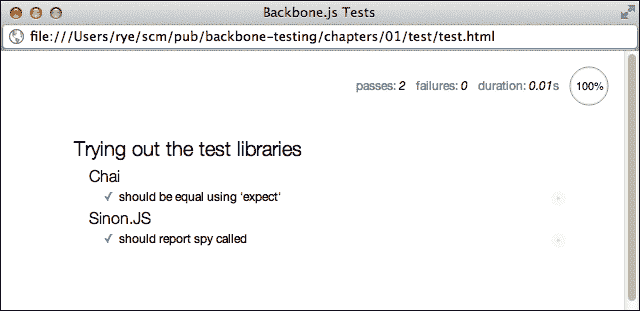
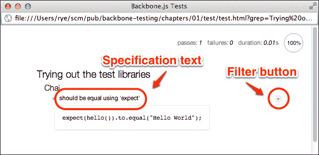
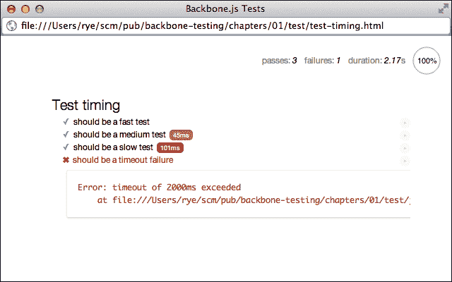
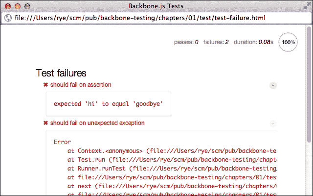

# 第一章. 设置测试基础设施

现代网络开发正在见证 JavaScript 的复兴，前端驱动、单页和实时网络应用程序的普及不断扩大。引领和推动这一潮流的是一些 JavaScript 网络框架，这些框架使开发者能够合理地将前端网络应用程序组织成模块化和约定驱动的组件。随着越来越多的逻辑和功能从服务器推送到浏览器，这些框架在维护单页应用程序状态、避免无结构和临时“意大利面”代码以及为常见开发情况提供抽象和功能方面变得越来越关键。

本书将重点关注这样一个框架——**Backbone.js** ([`backbonejs.org/`](http://backbonejs.org/))——它以其平衡的功能集脱颖而出，包括小巧的体积、坚实的核心抽象和显著的社区支持。Backbone.js 为应用程序开发提供了一组最小化的有用接口（例如，模型、集合、路由器和视图），同时通过可插拔的模板引擎、可扩展的事件用于跨组件通信以及通常对代码交互和模式采取无偏见的方法，保持了巨大的灵活性。该框架在 USA Today、LinkedIn、Hulu、Foursquare、Disqus 和许多其他组织的应用程序中得到了大规模的应用。本质上，Backbone.js 为数据驱动、客户端密集型网络应用程序开发提供了实用的工具，而不会过多地阻碍开发。

然而，这个不断发展的前端开发世界充满了许多潜在的障碍。更具体地说，虽然使用现代 JavaScript 框架（如 Backbone.js）的理论应用可能性是无限的，但在这个领域快速应用程序开发中悬而未决的最关键问题之一是软件质量和可靠性。

JavaScript 网络应用程序已经臭名昭著地难以验证和测试：异步 DOM 事件和数据请求容易受到时间问题和不真实失败的影响，显示行为难以从应用程序逻辑中隔离，测试套件依赖于/与特定浏览器交互。像 Backbone.js 这样的前端框架通过需要隔离和测试的额外接口、大量并发交互的小组件以及在整个应用程序层中传播的事件逻辑，增加了另一个复杂层次。此外，Backbone.js 的无实现范式产生了广泛不同的应用程序代码库，使得测试指南和启发式方法成为一种移动的目标。

在本书中，我们将通过识别应用程序要测试的部分、断言各种组件的正确行为以及验证程序作为一个整体按预期工作来应对测试 Backbone.js 应用程序的挑战。在本章中，我们将介绍以下基本测试基础设施：

+   设计用于开发 Backbone.js 应用程序和测试的仓库结构

+   获取 Mocha、Chai 和 Sinon.JS 测试库

+   设置并编写我们的第一个测试

+   使用 Mocha 测试报告运行和评估测试结果

我们假设读者已经熟悉 JavaScript Web 应用程序开发，并且熟悉 Backbone.js 及其常用补充——**Underscore.js** ([`underscorejs.org/`](http://underscorejs.org/)) 和 **jQuery** ([`jquery.com/`](http://jquery.com/))。所有其他库和技术将在本书中使用时适当介绍。

### 注意

虽然这本书主要关注 Backbone.js 应用程序，但我们介绍的测试技术和工具应该很容易迁移到其他前端 JavaScript 框架和 Web 应用程序。前端生态系统中有许多优秀的框架——尝试其中之一吧！

# 设计应用程序和测试仓库结构

首先设置测试基础设施需要有一个计划，确定所有部分和组件将放在哪里。我们将从一个简单的代码仓库目录结构开始，如下所示：

```js
app/
  index.html
  css/
  js/
    app/
    lib/

test/
  test.html
  js/
    lib/
    spec/
```

`app/index.html` 文件包含 Web 应用程序，而 `test/test.html` 提供测试驱动页面。应用程序和测试库分别包含在 `app/js/` 和 `test/js/` 目录中。

### 注意

这只是组织 Backbone.js 应用程序和测试的一种方式。其他目录布局可能更合适，你应该根据手头的具体开发项目自由地遵循自己的约定和偏好。

Backbone.js 应用程序和组件文件（模型、视图、路由器等）放在 `app/js/app/` 中，可能看起来如下所示：

```js
app/js/app/
  app.js
  models/
    model-a.js
    ...
  views/
    view-a.js
    ...
  ...
```

核心应用程序库存储在 `app/js/lib/` 中，应包括驱动实际应用程序所需的库：

```js
app/js/lib/
  backbone.js
  jquery.js
  underscore.js
  ...
```

测试库和套件有一个单独的目录 `test/js/`，这可以将测试代码与应用程序隔离开来，以避免意外地将应用程序依赖引入测试函数或库：

```js
test/js/
  lib/
    mocha.js
    mocha.css
    chai.js
    sinon.js
  spec/
    first.spec.js
    second.spec.js
    ...
```

现在我们已经有一个抽象的应用程序和测试布局，我们需要填充所有这些部分，并在目录中填充库、网页和测试文件。

# 获取测试库

前端 JavaScript 测试框架生态系统相当丰富，其中包含支持不同范式、功能和特性的库。从这些工具中选择是一个困难的任务，没有明确的“正确”答案。在本书中，我们选择了三个互补的库，**Mocha**、**Chai** 和 **Sinon.JS**，它们提供了一组特别适合测试 Backbone.js 应用程序的功能。除了这些库之外，我们还将使用 **PhantomJS** 无头 Web 浏览器来自动化我们的测试基础设施，并从命令行运行测试。

### 注意

**使用 Mocha、Chai 和 Sinon.JS 进行服务器端 JavaScript 测试**

除了浏览器之外，JavaScript 通过流行的 Node.js 框架在服务器技术领域实现了飞速发展，取代了传统的服务器端语言，并为开发者提供了一个单一语言的 Web 应用程序堆栈。尽管我们将在本书中仅讨论前端测试，但我们使用的三个核心测试库都可作为 Node.js 服务器端测试模块使用。在集成和使用方面存在一些非平凡的差异（例如，Mocha 报告是从命令行而不是浏览器中运行的），但本书中将要涵盖的许多通用测试和应用设计概念同样适用于 Node.js 服务器应用程序，并且你可以方便地在前后端开发中使用完全相同的测试库。

按照之前讨论的仓库结构，我们将下载每个测试库文件到 `test/js/lib/` 目录。之后，我们将准备好针对这些库编写和运行测试网页。请注意，尽管我们在本书中选择了特定的库版本以与可下载的示例代码相对应，但我们通常推荐使用这些库的最新版本。

## Mocha

Mocha ([`visionmedia.github.io/mocha/`](http://visionmedia.github.io/mocha/)) 框架支持测试套件、规范和多种测试范式。Mocha 提供的一些实用功能包括前端和后端集成、灵活的超时设置、慢速测试识别以及多种不同的测试报告器。

要在浏览器中运行 Mocha 测试，我们只需要两个文件——`mocha.js` 和 `mocha.css`。对于 1.9.0 版本，这两个文件都可以从 GitHub 的以下位置获取：

+   [`raw.github.com/visionmedia/mocha/1.9.0/mocha.js`](https://raw.github.com/visionmedia/mocha/1.9.0/mocha.js)

+   [`raw.github.com/visionmedia/mocha/1.9.0/mocha.css`](https://raw.github.com/visionmedia/mocha/1.9.0/mocha.css)

### 注意

当本书付印时，Mocha 的最新版本（1.10.0 及以上）引入了与本书后面将要使用的 Mocha-PhantomJS 自动化工具的不兼容性。您可以关注 Mocha([`github.com/visionmedia/mocha/issues/770`](https://github.com/visionmedia/mocha/issues/770))和 Mocha-PhantomJS([`github.com/metaskills/mocha-phantomjs/issues/58`](https://github.com/metaskills/mocha-phantomjs/issues/58))的问题跟踪，以获取状态更新和可能的未来修复。

JavaScript (`mocha.js`) 文件包含库代码，CSS (`mocha.css`) 文件为 HTML 报告页面提供样式。有了这些文件，我们可以将测试组织成套件和规范，运行测试，并获得可用的测试结果报告。

### 注意

**为什么选择 Mocha？**

Mocha 只是众多优秀测试库集合中的一个框架。Mocha 框架的一些优势包括强大的异步测试支持、服务器端兼容性、可选的测试接口和灵活的可配置性。但是，我们同样可以轻松选择其他测试库。

作为另一个替代框架的例子，来自 Pivotal Labs 的**Jasmine**([`pivotal.github.io/jasmine/`](http://pivotal.github.io/jasmine/))是一个极为流行的 JavaScript 测试框架。它提供了测试套件和规范支持、内置的断言库以及许多其他功能（包括测试间谍）——它本质上是一个一站式框架。相比之下，Mocha 非常灵活，但您需要添加额外的组件。例如，我们在本书的测试基础设施中利用 Chai 进行断言，以及 Sinon.JS 进行模拟和存根。

## Chai

Chai ([`chaijs.com/`](http://chaijs.com/)) 是一个提供广泛 API、支持**行为驱动开发**（**BDD**）和**测试驱动开发**（**TDD**）测试风格的断言库，以及不断增长的插件生态系统。BDD 和 TDD 将在第二章*创建 Backbone.js 应用程序测试计划*中详细介绍。特别是，我们将使用 Chai 的可链式测试函数编写与自然语言非常接近的断言，使测试在最大程度上易于理解，同时最小化对解释性代码注释的需求。

对于集成，我们需要下载单个库文件——`chai.js`。我们想要的版本（1.7.1）可在[`raw.github.com/chaijs/chai/1.7.1/chai.js`](https://raw.github.com/chaijs/chai/1.7.1/chai.js)找到。

或者，当前稳定的 Chai 版本可在[`chaijs.com/chai.js`](http://chaijs.com/chai.js)找到。

## Sinon.JS

Sinon.JS 库 ([`sinonjs.org/`](http://sinonjs.org/)) 提供了一套强大的测试间谍、存根和模拟工具。**间谍**是分析并存储关于底层函数信息的函数，可用于验证被测试函数的历史行为。**存根**是可以用更适合测试的不同行为替换函数的间谍。**模拟**监视和存根函数，并在测试执行期间验证是否发生了某些行为。我们将在本书的其余部分更详细地解释这些工具。

在实践中，Backbone.js 应用程序由许多不同且不断交互的部分组成，这使得我们测试隔离程序组件的目标变得困难。像 Sinon.JS 这样的模拟库将允许我们分离可测试的应用程序行为，并一次专注于一件事情（例如，一个单独的视图或模型）。

与 Chai 一样，我们只需要一个 JavaScript 文件就可以在我们的测试中使用 Sinon.JS。版本化的发布版本——我们将使用 1.7.3 版本——可以在以下任一位置找到：

+   [`sinonjs.org/releases/sinon-1.7.3.js`](http://sinonjs.org/releases/sinon-1.7.3.js)

+   [`raw.github.com/cjohansen/Sinon.JS/v1.7.3/lib/sinon.js`](https://raw.github.com/cjohansen/Sinon.JS/v1.7.3/lib/sinon.js)

安装 Sinon.JS，以及 Mocha 和 Chai，完成了我们测试基础设施创建的获取阶段。

# 设置和编写我们的第一个测试

现在我们有了基础测试库，我们可以创建一个包含应用程序和测试库的测试驱动网页，设置并执行测试，并显示测试报告。

### 小贴士

**下载示例代码**

本书中所有代码片段和代码示例的源代码均可在网上找到。每个章节的文件和测试可以在 `chapters` 目录中按编号找到。请参阅 *前言* 了解下载位置和安装说明。

最好在完成一个章节并已将课程和练习应用到自己的代码和应用程序之后，将示例用作对自己进度的一个有益检查。作为温和的告诫，我们鼓励您抵制复制和粘贴示例中的代码或文件。自己编写和修改代码的经验将使您更好地内化和理解成为熟练的 Backbone.js 测试员所需的测试概念。

## 测试驱动页面

通常使用单个网页来包含测试和应用程序代码，并驱动所有前端测试。因此，我们可以在我们的存储库的 `chapters/01/test` 目录中创建一个名为 `test.html` 的网页，从一点 HTML 模板——标题和 `meta` 属性——开始：

```js
<html>
  <head>
    <title>Backbone.js Tests</title>
    <meta http-equiv="Content-Type" content="text/html; charset=UTF-8">
    <meta http-equiv="X-UA-Compatible" content="IE=edge,chrome=1">
```

然后，我们包括 Mocha 样式表以用于测试报告，以及 Mocha、Chai 和 Sinon.JS JavaScript 库：

```js
    <link rel="stylesheet" href="js/lib/mocha.css" />
    <script src="img/mocha.js"></script>
    <script src="img/chai.js"></script >
    <script src="img/sinon.js"></script>
```

接下来，我们准备 Mocha 和 Chai。Chai 被配置为全局导出`expect`断言函数。Mocha 被设置为使用`bdd`测试接口，并在`window.onload`事件上启动测试：

```js
    <script>
      // Setup.
      var expect = chai.expect;
      mocha.setup("bdd");

      // Run tests on window load event.
      window.onload = function () {
        mocha.run();
      };
    </script>
```

在配置完库之后，我们添加测试规范。在这里，我们包括一个单独的测试文件（我们将在稍后创建），用于初始测试运行：

```js
    <script src="img/hello.spec.js"></script>
  </head>
```

最后，我们添加一个 Mocha 使用的`div`元素来生成完整的 HTML 测试报告。请注意，一个常见的替代做法是将所有`script`包含语句放在关闭`body`标签之前，而不是在`head`标签内：

```js
  <body>
    <div id="mocha"></div>
  </body>
</html>
```

有了这些，我们就准备好创建一些测试了。现在，你甚至可以在浏览器中打开`chapters/01/test/test.html`来查看空测试套件下的测试报告看起来是什么样子。

## 添加一些测试

虽然测试设计和实现将在后续章节中详细讨论，但可以说测试开发通常涉及编写 JavaScript 测试文件，每个文件都包含一些有组织的测试函数集合。让我们从一个单独的测试文件开始，以预览测试技术栈并运行一些测试。

测试文件`chapters/01/test/js/spec/hello.spec.js`创建了一个简单的函数（`hello()`）来测试并实现一个嵌套的套件集，引入了一些 Chai 和 Sinon.JS 功能。被测试的函数尽可能简单：

```js
window.hello = function () {
  return "Hello World";
};
```

`hello`函数应该包含在其自己的库文件（可能是`hello.js`）中，以便在应用程序和测试中使用。代码示例只是为了方便将其包含在规范文件中。

测试代码使用嵌套的 Mocha `describe`语句来创建测试套件层次结构。`Chai`套件中的测试使用`expect`来展示一个简单的断言。`Sinon.JS`套件的单个测试展示了测试间谍的作用：

```js
describe("Trying out the test libraries", function () {
  describe("Chai", function () {
    it("should be equal using 'expect'", function () {
      expect(hello()).to.equal("Hello World");
    });
  });

  describe("Sinon.JS", function () {
    it("should report spy called", function () {
      var helloSpy = sinon.spy(window, 'hello');

      expect(helloSpy.called).to.be.false;
      hello();
      expect(helloSpy.called).to.be.true;
      hello.restore();
    });
  });
});
```

如果你现在不完全理解这些测试和断言的细节，不要担心，我们很快会详细覆盖所有内容。重要的是，我们现在有一组准备运行的测试套件和规范。

# 运行和评估测试结果

现在所有必要的组件都已就绪，是时候运行测试并审查测试报告了。

## 第一份测试报告

在任何网络浏览器中打开`chapters/01/test/test.html`文件将导致 Mocha 运行所有包含的测试并生成测试报告：



测试报告

该报告提供了测试运行的 useful 摘要。右上角列显示有两个测试通过，没有失败，测试总共运行了 0.01 秒。在`describe`语句中声明的测试套件作为嵌套标题出现。每个测试规范旁边都有一个绿色的勾号，表示测试已通过。

## 测试报告操作

报告页面还提供了分析整个测试集合子集的工具。点击套件标题，例如 **尝试测试库** 或 **Chai**，将仅重新运行该标题下的规范。

点击规范文本（例如，**使用 'expect' 应该相等**）将显示测试的 JavaScript 代码。一个由右三角形指定的筛选按钮位于规范文本的右侧（它有些难以看到）。点击按钮将重新运行单个测试规范。



测试规范代码和筛选器

上一图展示了点击了筛选按钮的报告。图中的测试规范文本也已点击，显示了 JavaScript 规范代码。

### 小贴士

**高级测试套件和规范筛选**

报告套件和规范筛选器依赖于 Mocha 的 **grep** 功能，该功能在测试网页中作为 URL 参数公开。假设报告网页 URL 以 `chapters/01/test/test.html` 结尾，我们可以手动添加一个 `grep` 筛选参数，并附带文本以匹配套件或规范名称。

例如，如果我们想根据术语 `spy` 进行筛选，我们会在浏览器中导航到一个包含 `chapters/01/test/test.html?grep=spy` 的类似 URL，这将导致 Mocha 只运行 `Sinon.JS` 套件中的 `should report spy called` 规范。尝试使用各种 `grep` 值以熟悉仅匹配所需的套件或规范是有益的。

## 测试时间和慢速测试

到目前为止，我们所有的测试都成功了，并且运行得很快，但现实世界的开发必然涉及在创建健壮的 Web 应用程序过程中的一定程度的失败和低效。为此，Mocha 报告器有助于识别慢速测试和分析失败。

### 小贴士

**为什么测试速度很重要？**

慢速测试可能表明应用程序代码低效甚至错误，这应该被修复以加快整个 Web 应用程序的速度。此外，如果大量测试运行得太慢，开发者将有隐性的激励在开发中跳过测试，导致在部署管道后期发现缺陷的成本高昂。

因此，定期诊断并加快整个测试集合的执行时间是良好的测试实践。慢速应用程序代码可能留给开发者修复，但大多数慢速测试可以通过结合使用诸如存根和模拟以及更好的测试规划和隔离等工具来迅速修复。

让我们通过创建 `chapters/01/test/js/spec/timing.spec.js` 并使用以下代码来探索一些实际操作中的时间变化：

```js
describe("Test timing", function () {
  it("should be a fast test", function (done) {
    expect("hi").to.equal("hi");
    done();
  });

  it("should be a medium test", function (done) {
    setTimeout(function () {
      expect("hi").to.equal("hi");
      done();
    }, 40);
  });

  it("should be a slow test", function (done) {
    setTimeout(function () {
      expect("hi").to.equal("hi");
      done();
    }, 100);
  });

  it("should be a timeout failure", function (done) {
    setTimeout(function () {
      expect("hi").to.equal("hi");
      done();
    }, 2001);
  });
});
```

我们使用原生的 JavaScript `setTimeout()`函数来模拟慢速测试。为了使测试异步运行，我们使用`done`测试函数参数，它将测试完成延迟到`done()`被调用。异步测试将在第三章*测试断言、规范和套件*中更详细地探讨。

第一项测试在测试断言和`done()`回调之前没有延迟，第二项增加了 40 毫秒的延迟，第三项增加了 100 毫秒，最后测试增加了 2001 毫秒。这些延迟将在 Mocha 默认配置下暴露不同的定时结果，该配置报告慢速测试为 75 毫秒，中等测试为慢速阈值的二分之一，以及超过 2 秒的测试失败。

接下来，将文件包含到您的测试驱动程序页面中（例如示例代码中的`chapters/01/test/test-timing.html`）：

```js
    <script src="img/timing.spec.js"></script>
```

现在，在运行驱动程序页面后，我们得到以下报告：



测试报告的定时和失败

此图展示了我们中等速度（橙色）和慢速（红色）测试的定时注释框以及 2001 毫秒测试的测试失败/堆栈跟踪。有了这些报告功能，我们可以轻松地识别测试基础设施中的慢速部分，并使用更高级的测试技术和应用程序重构来高效且正确地执行测试集合。

## 测试失败

测试超时是我们可能在 Mocha 中遇到的测试失败类型之一。另外两种值得快速演示的失败类型是断言失败和异常失败。让我们在一个名为`chapters/01/test/js/spec/failure.spec.js`的新文件中尝试这两种情况：

```js
// Configure Mocha to continue after first error to show
// both failure examples.
mocha.bail(false);

describe("Test failures", function () {
  it("should fail on assertion", function () {
    expect("hi").to.equal("goodbye");
  });

  it("should fail on unexpected exception", function () {
    throw new Error();
  });
});
```

第一项测试`should fail on assertion`是一个 Chai 断言失败，Mocha 通过消息`expected 'hi' to equal 'goodbye'`整洁地封装了它。第二项测试`should fail on unexpected exception`抛出一个未经检查的异常，Mocha 通过完整的堆栈跟踪显示它。

### 注意

Chai 断言失败时的堆栈跟踪根据浏览器而异。例如，在 Chrome 中，第一次断言不显示堆栈跟踪，而在 Safari 中则显示。请参阅 Chai 文档，了解提供更多堆栈跟踪控制选项的配置选项。



测试失败

Mocha 的失败报告清晰地说明了出了什么问题以及在哪里。最重要的是，Chai 和 Mocha 以非常易读的自然语言格式报告最常见的案例——测试断言失败。

# 摘要

在本章中，我们介绍了一种适合开发的程序和测试结构，收集了 Mocha、Chai 和 Sinon.JS 库，并创建了一些基本测试以开始。然后，我们回顾了 Mocha 测试报告的一些方面，并观察了各种测试的实际运行情况——通过、慢速、超时和失败。

在下一章中，我们将把 Backbone.js 应用程序集成为我们测试框架的目标，并学习如何在应用程序开发过程中测试、隔离和验证程序行为。
